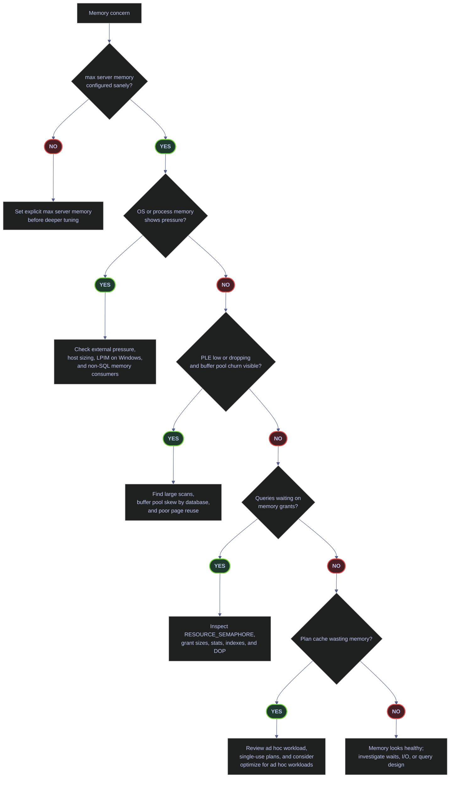
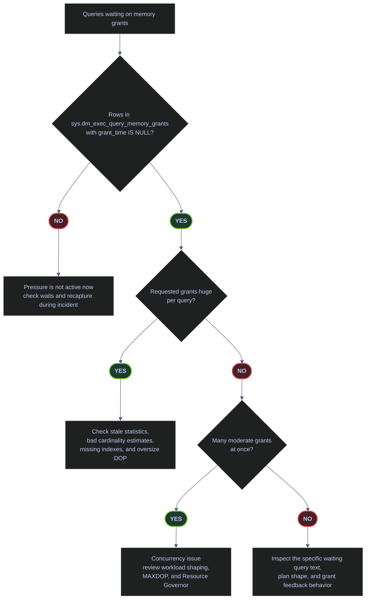

# Memory and the Buffer Pool

> [!abstract] Scope of this note
>
> SQL Server is designed to use memory aggressively. That is healthy when the instance has a sane memory cap, the operating system is not under external pressure, the buffer pool is holding the right data, and memory grants are not queueing. It becomes a production problem when SQL Server is allowed to grow without bounds, when plan cache bloat wastes memory, or when large scans and oversized grants keep evicting useful pages from RAM.
>
> This page covers eight diagnostic layers against the live `stoxx` instance running on a Linux Docker host:
>
> - **Reproducible baseline** — `sys.configurations`, `sys.dm_os_sys_memory`, `sys.dm_os_process_memory`, `sys.dm_os_sys_info`.
> - **Linux host memory boundaries** — cgroup v2 limits, `/proc/meminfo`, `mssql-conf memory.memorylimitmb`, the SQL-Server-specific 80% default, and how `max server memory (MB)` interacts with `memory.memorylimitmb`.
> - **Buffer pool health** — Page Life Expectancy per buffer node, correctly computed buffer cache hit ratio, and buffer pool occupancy by database.
> - **Memory consumers** — top memory clerks, plan cache composition, single-use ad hoc plans, cache-store-level breakdown, `DBCC MEMORYSTATUS`.
> - **Memory grants** — granted and waiting queries from `sys.dm_exec_query_memory_grants`, resource semaphores from `sys.dm_exec_query_resource_semaphores`, plus the triage decision flow.
> - **Configuration and intervention commands** — `sp_configure` primary and secondary memory settings, `DBCC FREEPROCCACHE`, `DBCC FLUSHPROCINDB`, scoped procedure cache clearing, and cold-cache buffer flush.
> - **Memory grant feedback** — the SQL 2022 adaptive memory grant feature, database-scoped configuration, and per-query disable hints.
> - **Windows-only LPIM** — `sql_memory_model` verification and the operational boundary between the Linux and Windows memory models.
>
> Every SQL output is captured live from `stoxx` after the 2026-04-11 15:55 restart, via the `stoxx-queries` skill. High-impact cache-flush commands are kept in the note but are isolated, titled, and explicitly marked as operationally dangerous.

## Key Terms

The rest of the note uses seven terms as if they are already familiar. The table below defines each one precisely enough that every later query and interpretation can be read without cross-reference. After the terms, a top-level decision tree shows how the diagnostic layers below fit together: configuration check → OS and process pressure → PLE and buffer pool churn → memory grant queueing → plan cache waste. Every downstream section corresponds to exactly one branch of that tree.

| Term | Meaning |
|---|---|
| `buffer pool` | Main SQL Server memory region for cached data and index pages. |
| `clean page` | Cached page whose in-memory copy matches disk and can be evicted without being written first. |
| `dirty page` | Cached page modified in memory and not yet written to disk. |
| `PLE` | Page Life Expectancy, measured in seconds. Higher means cached pages stay resident longer. |
| `memory clerk` | Internal SQL Server memory-accounting category such as buffer pool, plan cache, lock manager, or CLR. |
| `memory grant` | Workspace memory pre-allocated to a query for sorts, hashes, and similar operators. |
| `max server memory` | Upper bound for most SQL Server memory consumption for the buffer pool and most clerks. On Linux it must sit below `memory.memorylimitmb`; on Windows it should sit 1–2 GB below host RAM. |
| `memory.memorylimitmb` | SQL-Server-specific Linux cap on **total** process memory, not just the buffer pool. Defaults to 80% of the lesser of host RAM and cgroup limit. |
| `resource semaphore` | Pool of workspace memory from which memory grants are issued. Two per Resource Governor pool: regular and small-query. |



## Reproducible Baseline

> [!abstract] Four-view memory baseline
>
> SQL Server exposes four layered views that together answer "is memory healthy right now." Capture them in order before drilling into any symptom:
>
> - **`sys.configurations`** — the tunable knobs: `max server memory (MB)`, `min server memory (MB)`, `optimize for ad hoc workloads`, `min memory per query (KB)`, `index create memory (KB)`, `query wait (s)`.
> - **`sys.dm_os_sys_memory`** — OS-visible physical memory and the Resource Monitor state description.
> - **`sys.dm_os_process_memory`** — the `sqlservr` process view: physical memory in use, locked pages, page faults, and process-level low-memory flags.
> - **`sys.dm_os_sys_info`** — SQL Server's internal target vs committed memory, plus the active memory model (`CONVENTIONAL`, `LOCK_PAGES`, or `LARGE_PAGES`).
>
> Run all four before changing anything: a symptom at any one layer is always interpreted against the other three.

### SQL Server | sys.configurations | audit memory-related settings

Every SQL Server memory investigation starts at `sys.configurations`, which exposes the server-level tunables that govern total memory, buffer pool size, plan-cache hygiene, grant sizing, and the query wait timeout. The goal at this layer is not to change anything yet — it is to confirm what the current tunable surface looks like, so every downstream observation can be interpreted against the right baseline.

#### Check the six memory-related configuration values

**When to run:** at the start of any memory investigation, during initial host validation, and after any `sp_configure` change that touches a memory tunable.
**Trigger:** first configuration audit, post-install validation, post-restart verification, or a user complaint about query memory grants timing out.
**Context:** read-only T-SQL against `sys.configurations`. Runs from any session with default permissions. No restart required; safe to run at any time.
**Purpose:** produce a single baseline row per memory-related setting so that later "is this explained by configuration?" questions have an authoritative answer.

> [!info]- Field definitions for sys.configurations
>
> | Field | Source column | Type | Meaning |
> |---|---|---|---|
> | `name` | `sys.configurations.name` | `nvarchar(35)` | Name of the server-level configuration option. |
> | `value` | `sys.configurations.value` | `sql_variant` (cast to `bigint`) | Value set by the most recent `sp_configure` call, **not** necessarily the running value. |
> | `value_in_use` | `sys.configurations.value_in_use` | `sql_variant` (cast to `bigint`) | Value currently active in the running instance. Differs from `value` when `RECONFIGURE` has not been issued. |
> | `minimum` | `sys.configurations.minimum` | `sql_variant` (cast to `bigint`) | Lowest value accepted by `sp_configure`. |
> | `maximum` | `sys.configurations.maximum` | `sql_variant` (cast to `bigint`) | Highest value accepted by `sp_configure`. `2147483647` means effectively unlimited for `MB`/`KB` columns. |
> | `is_dynamic` | `sys.configurations.is_dynamic` | `bit` | `1` = change takes effect after `RECONFIGURE`, no restart needed. `0` = restart required. All memory knobs are dynamic. |
> | `is_advanced` | `sys.configurations.is_advanced` | `bit` | `1` = only visible when `show advanced options` is `1`. All memory knobs are advanced. |
>
> The `sql_variant` columns must be explicitly `CAST(... AS bigint)` in the `SELECT` list because ODBC Driver 18 returns `ODBC SQL type -16 is not yet supported` for raw `sql_variant` values.

*Cast the `sql_variant` columns to `bigint` and filter on the six memory-related configuration names.*

```sql
SELECT
    name,
    CAST(value AS bigint) AS value,
    CAST(value_in_use AS bigint) AS value_in_use,
    CAST(minimum AS bigint) AS minimum,
    CAST(maximum AS bigint) AS maximum,
    is_dynamic,
    is_advanced
FROM sys.configurations
WHERE name IN (
    'max server memory (MB)',
    'min server memory (MB)',
    'optimize for ad hoc workloads',
    'min memory per query (KB)',
    'index create memory (KB)',
    'query wait (s)'
)
ORDER BY name;
```

| name | value | value_in_use | minimum | maximum | is_dynamic | is_advanced |
|---|---:|---:|---:|---:|---|---|
| `index create memory (KB)` | 0 | 0 | 704 | 2147483647 | True | True |
| `max server memory (MB)` | 2147483647 | 2147483647 | 128 | 2147483647 | True | True |
| `min memory per query (KB)` | 1024 | 1024 | 512 | 2147483647 | True | True |
| `min server memory (MB)` | 0 | 16 | 0 | 2147483647 | True | True |
| `optimize for ad hoc workloads` | 0 | 0 | 0 | 1 | True | True |
| `query wait (s)` | -1 | -1 | -1 | 2147483647 | True | True |

_Three of these rows are the load-bearing signals. First, `max server memory (MB) = 2147483647` means this instance has no effective internal cap — it would let SQL Server grow until either the Linux `memory.memorylimitmb` ceiling or OS back-pressure intervenes. On a host that only exposes about `24.7 GB` to SQL Server, leaving this at the default is not production-safe. Second, `optimize for ad hoc workloads = 0` is not catastrophic on its own, but it becomes relevant below where single-use ad hoc plans occupy about `53.78 MB`. Third, `query wait (s) = -1` means memory-grant queueing uses the built-in formula (25× the query cost in seconds); setting it to a positive integer would override that with a hard wall-clock timeout, which is almost always worse under burst load._

| Setting | Current value_in_use | Watch | Meaning | Implication |
|---|---|---|---|---|
| `max server memory (MB)` | `2147483647` | &#10060; | Default effectively-unlimited cap. | SQL Server can consume whatever `memory.memorylimitmb` allows; the OS becomes the only back-pressure. |
| `max server memory (MB)` | Explicit production value | &#9989; | Buffer pool and most clerks are bounded intentionally. | OS and non-SQL processes on the host are protected. |
| `min server memory (MB)` | `16` (system default on Linux) | Depends | SQL Server will not trim the buffer pool below this value. | Usually irrelevant on single-instance Linux hosts; relevant only with contested hosts or multi-instance Windows. |
| `optimize for ad hoc workloads` | `0` | Depends | First execution of an ad hoc statement stores a full compiled plan. | Fine on parameterized workloads; wastes plan-cache memory on ad hoc-heavy systems. |
| `optimize for ad hoc workloads` | `1` | Depends | First execution stores only a compiled plan stub. | Usually beneficial when single-use ad hoc plans dominate the cache. |
| `min memory per query (KB)` | `1024` (1 MB, default) | &#9989; | Lower bound for any sort or hash workspace grant. | Rarely needs tuning; raise only on workloads with many tiny queries that spill. |
| `index create memory (KB)` | `0` (auto, default) | &#9989; | Server decides the memory grant for `CREATE INDEX` sorts. | Tune only when offline index builds routinely spill to tempdb. |
| `query wait (s)` | `-1` (formula, default) | &#9989; | Memory-grant timeout is `25 * query_cost_seconds`. | Positive overrides almost always cause more timeouts, not fewer. |

### SQL Server | sys.dm_os_sys_memory | inspect OS-visible memory state

After the configuration audit, the next question is external: does the operating system currently see enough free physical memory for SQL Server to grow into? `sys.dm_os_sys_memory` answers that by exposing the host view — total RAM, available RAM, page file, system cache, and Resource Monitor's own memory-state description. On Linux, the "page file" columns map to swap and the system-cache column is typically `0`, but the physical memory and `system_memory_state_desc` columns are authoritative.

#### Inspect host RAM, available memory, and the memory state description

**When to run:** any time the host might be under external memory pressure — user reports of SQL Server trimming, OOM-killer events, or a new workload being collocated on the host.
**Trigger:** an OOM incident, a suspected noisy-neighbor on the host, or routine health verification.
**Context:** read-only T-SQL. Requires `VIEW SERVER STATE` (or `VIEW SERVER PERFORMANCE STATE` in SQL 2022+). Safe on production.
**Purpose:** confirm whether the host is currently tight on physical memory so later symptoms can be blamed on (or cleared from) external pressure.

> [!info]- Field definitions for sys.dm_os_sys_memory
>
> | Field | Source column | Unit | Meaning |
> |---|---|---|---|
> | `total_ram_mb` | `total_physical_memory_kb / 1024` | MB | Total host physical memory visible to SQL Server. On Linux, this is 80% of `/proc/meminfo MemTotal` unless `memory.memorylimitmb` or a cgroup cap lowers it. |
> | `available_memory_mb` | `available_physical_memory_kb / 1024` | MB | Host physical memory currently available for new allocations. |
> | `total_page_file_mb` | `total_page_file_kb / 1024` | MB | On Linux this reflects committed swap, not a Windows page file. |
> | `available_page_file_mb` | `available_page_file_kb / 1024` | MB | Unused swap. |
> | `system_cache_mb` | `system_cache_kb / 1024` | MB | Windows filesystem cache. Typically `0` on Linux because SQL Server bypasses the kernel page cache for data files. |
> | `system_memory_state_desc` | `system_memory_state_desc` | text | Enum produced by Resource Monitor summarising physical memory pressure: `Available physical memory is high`, `Physical memory usage is steady`, `Available physical memory is low`, `Physical memory state is transitioning`. |

*Convert the kilobyte columns to MB and return the Resource Monitor state description.*

```sql
SELECT
    total_physical_memory_kb / 1024 AS total_ram_mb,
    available_physical_memory_kb / 1024 AS available_memory_mb,
    total_page_file_kb / 1024 AS total_page_file_mb,
    available_page_file_kb / 1024 AS available_page_file_mb,
    system_cache_kb / 1024 AS system_cache_mb,
    system_memory_state_desc
FROM sys.dm_os_sys_memory;
```

| total_ram_mb | available_memory_mb | total_page_file_mb | available_page_file_mb | system_cache_mb | system_memory_state_desc |
|---:|---:|---:|---:|---:|---|
| 24732 | 22042 | 24732 | 22042 | 0 | `Available physical memory is high` |

_This is a healthy external-memory snapshot. The instance sees about `24.7 GB` of RAM, and about `22.0 GB` remains available. The `system_memory_state_desc` is `Available physical memory is high`, which is Resource Monitor's own conclusion that there is no host-level pressure right now. The `system_cache_mb = 0` is expected on Linux: SQL Server uses direct I/O for database files and does not rely on the kernel's page cache, so the Windows filesystem-cache column is always zero. The 24,732 MB total is also meaningful — `/proc/meminfo` inside the container reports about `30.9 GB`, and SQL Server is showing 80% of that, which is the Linux default memory limit. That 80% default is why the instance shows 24.7 GB of "physical" memory even though the container sees 30.9 GB._

| Column | Value or Pattern | Watch | Meaning | Implication |
|---|---|---|---|---|
| `system_memory_state_desc` | `Available physical memory is high` | &#9989; | OS memory pressure is low. | SQL Server is not currently being squeezed by the host. |
| `system_memory_state_desc` | `Physical memory usage is steady` | Depends | Stable state without a strong high/low signal. | Monitor trends and pair with process-level signals. |
| `system_memory_state_desc` | `Available physical memory is low` | &#10060; | Resource Monitor is flagging external pressure. | SQL Server may trim memory or compete with the OS. |
| `system_memory_state_desc` | `Physical memory state is transitioning` | Depends | Pressure is changing direction. | Retake the capture in a few minutes before concluding. |
| `available_memory_mb` | High relative to host RAM | &#9989; | Plenty of headroom remains. | External memory pressure is unlikely right now. |
| `available_memory_mb` | Persistently low | &#10060; | The host is tight on free memory. | Investigate host sizing, colocated processes, and SQL caps. |
| `system_cache_mb` | `0` on Linux | &#9989; | Expected — SQL Server uses direct I/O. | Do not treat the zero as a missing cache. |

### SQL Server | sys.dm_os_process_memory | inspect SQL Server process memory

`sys.dm_os_process_memory` is the `sqlservr` process view of its own memory. It exposes the values the OS would report for the process (physical memory in use, virtual address space reserved and committed, page-fault count) plus two internal flags — `process_physical_memory_low` and `process_virtual_memory_low` — that SQL Server uses to decide whether to trim caches. On Linux, the VAS numbers are enormous because the process has a 64-bit virtual address space, so the reserved/committed columns need to be read in proportion rather than as absolute quantities.

#### Inspect process memory and the two low-memory flags

**When to run:** after the OS view looks healthy but SQL Server is still behaving as if memory is constrained, or after a suspected leak inside a loaded assembly (CLR, Full-Text, MDS, PolyBase).
**Trigger:** unexpected cache trimming, low PLE with no obvious workload cause, or `MEMORYCLERK_SQLCLR` growth.
**Context:** read-only T-SQL. Requires `VIEW SERVER STATE` or `VIEW SERVER PERFORMANCE STATE`.
**Purpose:** determine whether the `sqlservr` process itself thinks it is under physical or virtual memory pressure, independent of what the host reports.

> [!info]- Field definitions for sys.dm_os_process_memory
>
> | Field | Source column | Unit | Meaning |
> |---|---|---|---|
> | `physical_memory_in_use_mb` | `physical_memory_in_use_kb / 1024` | MB | Physical RAM currently held by the `sqlservr` process (resident set size). |
> | `large_page_allocations_mb` | `large_page_allocations_kb / 1024` | MB | Memory allocated via large pages. Non-zero on Linux indicates transparent huge pages honored by SQL Server. |
> | `locked_page_allocations_mb` | `locked_page_allocations_kb / 1024` | MB | Memory allocated via Locked Pages In Memory (Windows LPIM only). Always `0` on Linux. |
> | `total_vas_mb` | `total_virtual_address_space_kb / 1024` | MB | Total process virtual address space. `67108863` MB (64 TB) on 64-bit Linux. |
> | `vas_reserved_mb` | `virtual_address_space_reserved_kb / 1024` | MB | VAS reserved by SQL Server (set aside but not yet backed by physical memory). |
> | `vas_committed_mb` | `virtual_address_space_committed_kb / 1024` | MB | VAS committed (backed by physical memory or swap). Close to `physical_memory_in_use_mb` on Linux. |
> | `vas_available_mb` | `virtual_address_space_available_kb / 1024` | MB | VAS still available to allocate. |
> | `page_fault_count` | `page_fault_count` | count | Number of page faults the process has accumulated since the last reset. |
> | `memory_utilization_percentage` | `memory_utilization_percentage` | % | Percentage of the committed memory currently in the working set. |
> | `available_commit_limit_mb` | `available_commit_limit_kb / 1024` | MB | Remaining commit headroom from the OS's perspective. |
> | `process_physical_memory_low` | `process_physical_memory_low` | bit | `1` when SQL Server concludes physical memory is low from its own point of view. |
> | `process_virtual_memory_low` | `process_virtual_memory_low` | bit | `1` when SQL Server concludes VAS is constrained. Essentially a WoW/32-bit-era flag on 64-bit Linux. |

*Select the process-memory columns, converting kilobyte columns to MB.*

```sql
SELECT
    physical_memory_in_use_kb / 1024 AS physical_memory_in_use_mb,
    large_page_allocations_kb / 1024 AS large_page_allocations_mb,
    locked_page_allocations_kb / 1024 AS locked_page_allocations_mb,
    total_virtual_address_space_kb / 1024 AS total_vas_mb,
    virtual_address_space_reserved_kb / 1024 AS vas_reserved_mb,
    virtual_address_space_committed_kb / 1024 AS vas_committed_mb,
    virtual_address_space_available_kb / 1024 AS vas_available_mb,
    page_fault_count,
    memory_utilization_percentage,
    available_commit_limit_kb / 1024 AS available_commit_limit_mb,
    process_physical_memory_low,
    process_virtual_memory_low
FROM sys.dm_os_process_memory;
```

| physical_memory_in_use_mb | large_page_allocations_mb | locked_page_allocations_mb | total_vas_mb | vas_reserved_mb | vas_committed_mb | vas_available_mb | page_fault_count | memory_utilization_percentage | available_commit_limit_mb | process_physical_memory_low | process_virtual_memory_low |
|---:|---:|---:|---:|---:|---:|---:|---:|---:|---:|---|---|
| 4226 | 130 | 0 | 67108863 | 4096 | 1894 | 67104767 | 0 | 100 | 22042 | False | False |

_The process snapshot is clean. SQL Server is holding about `4.2 GB` of physical memory, committed VAS is about `1.9 GB`, and both low-memory flags are `False`. `locked_page_allocations_mb = 0` is expected on Linux — LPIM is a Windows-only privilege model. The `memory_utilization_percentage = 100` is also normal here: it means every page of committed memory is currently resident, which is the expected state on a system with plenty of free RAM and no swap pressure. The most notable detail is the gap between `physical_memory_in_use_mb` (4226) and `vas_committed_mb` (1894): the 2.3 GB difference is memory held by the process outside the regular commit accounting, typically SQLPAL, LibOS, CLR host, log pool, and other components loaded into the `sqlservr` process on Linux. That is a useful reminder that `max server memory (MB)` caps the buffer pool, not the total process footprint._

| Column | Value or Pattern | Watch | Meaning | Implication |
|---|---|---|---|---|
| `process_physical_memory_low` | `False` | &#9989; | SQL Server does not consider process physical memory low. | No immediate process-level pressure signal. |
| `process_physical_memory_low` | `True` | &#10060; | SQL Server considers process physical memory low. | Investigate host pressure, SQL growth, and memory cap immediately. |
| `process_virtual_memory_low` | `False` | &#9989; | Virtual address space is not under pressure. | Normal state on 64-bit. |
| `process_virtual_memory_low` | `True` | &#10060; | VAS pressure exists. | Memory allocation failures become more likely; extremely rare on 64-bit Linux. |
| `locked_page_allocations_mb` | `0` on Linux | &#9989; | LPIM is Windows-only. | Not a defect; ignore on Linux. |
| `locked_page_allocations_mb` | `0` on Windows | &#10060; when LPIM is expected | LPIM privilege not granted or not effective. | Grant `Lock pages in memory` to the service account and restart SQL Server. |
| `memory_utilization_percentage` | `100` | &#9989; on a non-swapping host | Full committed memory is resident. | Expected state on a healthy Linux host. |
| `memory_utilization_percentage` | `< 100` | Depends | Some committed memory is paged out. | Investigate swap activity and the `vmstat` / `si`/`so` columns. |
| `page_fault_count` | `0` or low | &#9989; | No obvious process-level fault activity. | Consistent with a healthy snapshot. |

### SQL Server | sys.dm_os_sys_info | compare committed memory to target

The last baseline view, `sys.dm_os_sys_info`, is how SQL Server reports its own internal accounting: how much physical memory it currently holds (`committed_kb`), how much it would like to grow into under the current cap and workload (`committed_target_kb`), what memory model it is running (`sql_memory_model_desc`), and when the instance last restarted (`sqlserver_start_time`). The gap between committed and target is usually the best single internal-pressure indicator.

#### Compare committed versus target memory and confirm the memory model

**When to run:** immediately after the `sys.dm_os_process_memory` capture, so internal and process views can be interpreted side by side.
**Trigger:** routine baseline, a suspected leak, or an "is SQL Server still growing?" question.
**Context:** read-only T-SQL, `VIEW SERVER STATE` / `VIEW SERVER PERFORMANCE STATE`.
**Purpose:** show whether SQL Server's committed memory is still climbing toward its target (growth phase), has stabilised near the target (steady state), or is fighting the target (pressure).

> [!info]- Field definitions for sys.dm_os_sys_info
>
> | Field | Source column | Unit | Meaning |
> |---|---|---|---|
> | `physical_memory_mb` | `physical_memory_kb / 1024` | MB | Total physical memory visible to SQL Server. Matches `sys.dm_os_sys_memory.total_physical_memory_kb`. |
> | `committed_mb` | `committed_kb / 1024` | MB | Physical memory currently committed to SQL Server's memory manager (dominated by the buffer pool). |
> | `target_mb` | `committed_target_kb / 1024` | MB | Memory target the server would like to grow toward under the current `max server memory` cap and workload. |
> | `visible_target_mb` | `visible_target_kb / 1024` | MB | Subset of `target_mb` visible to the current memory node (useful on NUMA hosts). |
> | `sql_memory_model` | `sql_memory_model` | `int` | `1` = `CONVENTIONAL`, `2` = `LOCK_PAGES`, `3` = `LARGE_PAGES`. |
> | `sql_memory_model_desc` | `sql_memory_model_desc` | text | Human-readable memory model label. |
> | `container_type` | `container_type` | `int` | `1` = SQL Server is running inside a Linux container with cgroup awareness. |
> | `sqlserver_start_time` | `sqlserver_start_time` | `datetime` | UTC timestamp of the last instance start. Essential context when reading counters that accumulate since startup (PLE, hit ratio, page faults). |

*Return committed vs target memory, the memory model, container type, and the instance start time.*

```sql
SELECT
    physical_memory_kb / 1024 AS physical_memory_mb,
    committed_kb / 1024 AS committed_mb,
    committed_target_kb / 1024 AS target_mb,
    visible_target_kb / 1024 AS visible_target_mb,
    sql_memory_model,
    sql_memory_model_desc,
    container_type,
    sqlserver_start_time
FROM sys.dm_os_sys_info;
```

| physical_memory_mb | committed_mb | target_mb | visible_target_mb | sql_memory_model | sql_memory_model_desc | container_type | sqlserver_start_time |
|---:|---:|---:|---:|---:|---|---:|---|
| 24732 | 1894 | 22705 | 22705 | 1 | `CONVENTIONAL` | 1 | `2026-04-11 15:55:55.537` |

_SQL Server is currently running far below its target. It has committed about `1.9 GB` but would be willing to grow toward about `22.7 GB` under the current cap. That gap is entirely expected — the instance restarted at `2026-04-11 15:55:55.537` and has been running for roughly 40 minutes at capture time, so the buffer pool has not yet warmed up to steady state. The important operational issue remains the same as before the restart: with `max server memory (MB)` still at `2147483647`, there is no internal cap, and the only real ceiling is the Linux default `memory.memorylimitmb = 80% of /proc/meminfo`. The `sql_memory_model = 1` (`CONVENTIONAL`) confirms that neither LPIM nor large pages are active — normal on Linux. The `container_type = 1` flag tells SQL Server it is cgroup-aware, which matters for how it computes `physical_memory_mb`._

| Column | Value or Pattern | Watch | Meaning | Implication |
|---|---|---|---|---|
| `committed_mb` | Much lower than `target_mb` after a restart | &#9989; | SQL Server is still warming up toward its target. | Not pressure; wait for steady state before judging. |
| `committed_mb` | Much lower than `target_mb` in steady state | Depends | Headroom remains. | Internal pressure is unlikely right now. |
| `committed_mb` | Approximately equal to `target_mb` | Depends | Near target under current cap. | Normal on busy systems; pair with grants and PLE. |
| `committed_mb` | Persistently fighting or tracking below `target_mb` under load | &#10060; | SQL Server is trying to grow and something is blocking it. | Investigate host pressure, cap sizing, or collocated processes. |
| `sql_memory_model_desc` | `CONVENTIONAL` | Depends | Standard memory model. | Normal on Linux; on Windows it means LPIM is not active. |
| `sql_memory_model_desc` | `LOCK_PAGES` | &#9989; on tuned Windows servers | Locked pages are active. | Requires an explicit `max server memory` cap. |
| `sql_memory_model_desc` | `LARGE_PAGES` | Depends | Large-page allocations are active. | Specialist configuration; validate carefully. |
| `container_type` | `1` | &#9989; on Linux containers | cgroup-aware memory accounting is active. | SQL Server respects cgroup v2 limits from SQL 2022 CU20+. |
| `sqlserver_start_time` | Recent | Context | Counters since startup are short. | Do not over-interpret PLE or hit ratio right after a restart. |

## Linux Host Memory Boundaries

> [!abstract] Four memory ceilings on Linux
>
> On Linux, SQL Server's memory ceiling is not `max server memory (MB)` alone. It is the *minimum* of four layered boundaries, and misunderstanding the layering is the single most common cause of unexpected OOM or unexpected trimming in containerised deployments:
>
> - **Host physical memory** — what `/proc/meminfo MemTotal` reports inside the container's mount namespace.
> - **cgroup v2 `memory.max`** — the kernel-enforced upper bound for the container. `max` means uncapped. SQL Server 2022 CU20+ and SQL Server 2025 honor this value directly; older builds ignored it.
> - **`memory.memorylimitmb`** (or `MSSQL_MEMORY_LIMIT_MB` env var) — the SQL-Server-specific cap for the entire `sqlservr` process, defaulting to 80% of the lesser of host RAM and cgroup. Limits **total** process memory (buffer pool + SQLPAL + LibOS + CLR + Full-Text + Agent + any other loaded component).
> - **`max server memory (MB)`** — the T-SQL cap for the buffer pool and most memory clerks only. Must be set *below* `memory.memorylimitmb` to leave room for non-buffer-pool components inside the same process.
>
> Every Linux memory investigation has to place the running numbers on this ladder. An instance showing 4.2 GB in `physical_memory_in_use_mb` but 1.9 GB in `committed_mb` is only confusing until you remember that `max server memory (MB)` caps the lower number and `memory.memorylimitmb` caps the higher one.

### Linux | /proc/meminfo | inspect host memory seen by the container

The container's view of host memory is the ground truth everything else derives from. Inside the `stoxx-db` container, `/proc/meminfo` reports the Linux kernel's accounting as it appears to the container's mount namespace. When cgroup v2 is active and `memory.max` is unlimited, `MemTotal` reports the full host RAM, not the container's share. SQL Server's default `memory.memorylimitmb = 80%` is applied on top of whatever `MemTotal` reports.

#### Read /proc/meminfo from inside the stoxx container

**When to run:** during initial host validation, after any change to Docker's `--memory` flag or a Kubernetes `resources.limits.memory` value, or when `sys.dm_os_sys_memory` reports a `total_ram_mb` that does not match the host you expected.
**Trigger:** unexpected `total_ram_mb` in `sys.dm_os_sys_memory`, a new container deployment, or suspected noisy-neighbor pressure.
**Context:** Linux shell via `docker exec`, runs as root inside the container. Read-only.
**Purpose:** confirm the physical memory the container actually sees, independently of what SQL Server reports.

*Read the first ten lines of `/proc/meminfo` from inside the running `stoxx-db` container.*

```bash
docker exec stoxx-db bash -c "cat /proc/meminfo | head -10"
```

```text
MemTotal:       31656120 kB
MemFree:        27588752 kB
MemAvailable:   27854336 kB
Buffers:            3744 kB
Cached:           509124 kB
SwapCached:            0 kB
Active:           186124 kB
Inactive:        3380772 kB
Active(anon):       2688 kB
Inactive(anon):  3056136 kB
```

_The container sees about `30.9 GB` (`31656120 kB`) of total memory. That is meaningfully larger than the `24,732 MB` SQL Server reported in `sys.dm_os_sys_info.physical_memory_mb`. The difference is exactly the Linux default: `24732 / 30914 = 80%`, which is the value `memory.memorylimitmb` uses when no explicit limit is set. The kernel's own `MemAvailable` of about `27.2 GB` is what the Linux OOM killer and Resource Monitor will use to make memory pressure decisions — it is not what SQL Server uses for its own planning, but it is what would kill the container if the kernel decided the whole host was out of memory._

| Counter | Meaning | Operational use |
|---|---|---|
| `MemTotal` | Total physical memory seen by the container's mount namespace. | Baseline for SQL Server's 80% default. |
| `MemFree` | Memory not allocated to any process or kernel cache. | Usually small on a warm host; not an alarm signal by itself. |
| `MemAvailable` | Kernel estimate of what a new process could allocate without swapping. | The number the Linux OOM killer effectively cares about. |
| `Buffers` | Block-device buffer cache. | Usually tiny on SQL Server hosts because SQL uses direct I/O. |
| `Cached` | Kernel page cache. | Usually small on SQL Server Linux because data files are opened `O_DIRECT`. |

### Linux | cgroup v2 | check container memory limits

Below `/proc/meminfo`, the next ceiling is the kernel's cgroup accounting. On cgroup v2 (the default on modern Ubuntu and RHEL), `memory.max` is the hard ceiling the container cannot cross, and `memory.current` is the current usage. SQL Server 2022 CU20 and SQL Server 2025 detect this value and treat it as the effective host RAM; older builds read only `/proc/meminfo`, which is the root cause of the "container lies about RAM and SQL Server OOMs" class of incidents that the CU20 fix targets.

#### Read memory.max and memory.current from the cgroup v2 hierarchy

**When to run:** at container deployment, after a Docker/Kubernetes memory-limit change, or during an OOM post-mortem.
**Trigger:** OOM event, Kubernetes OOMKilled pod, or a mismatch between `/proc/meminfo` and `sys.dm_os_sys_info.physical_memory_mb`.
**Context:** Linux shell via `docker exec`. Read-only access to `/sys/fs/cgroup/memory.*`. Works on cgroup v2 only — use `/sys/fs/cgroup/memory/memory.limit_in_bytes` on cgroup v1 hosts.
**Purpose:** confirm the kernel-enforced upper bound on container memory and the container's current consumption.

*Read `memory.max` (the hard cap) and `memory.current` (current usage) from the cgroup v2 filesystem.*

```bash
docker exec stoxx-db bash -c "cat /sys/fs/cgroup/memory.max; cat /sys/fs/cgroup/memory.current"
```

```text
max
2767495168
```

_The first line is `max`, which means the container is running without a hard cgroup limit — Docker was not started with `--memory`, so the cgroup inherits the host's unlimited ceiling. The second line, `2767495168`, is bytes and converts to about `2.64 GB` of memory currently held by the container. That matches the `committed_mb = 1894` plus about `850 MB` of non-committed process memory held by SQLPAL, CLR, and LibOS. The combination "no cgroup cap + host has plenty of free RAM" is why the OS view and the SQL Server view agree that there is no pressure right now._

| File | Format | Meaning |
|---|---|---|
| `memory.max` | `max` or positive integer in bytes | Upper bound the cgroup can consume. `max` = inherited from parent. |
| `memory.current` | Integer in bytes | Current total resident memory of all processes in the cgroup. |
| `memory.high` | `max` or integer | Throttle threshold — the kernel starts reclaiming pages once `memory.current` crosses this, without OOM-killing. |
| `memory.events` | Key-value text | Cumulative events: `low`, `high`, `max`, `oom`, `oom_kill`. The right place to confirm whether the container has been OOM-killed. |

### Linux | mssql-conf | memory.memorylimitmb setting

`memory.memorylimitmb` is the SQL-Server-specific cap on total process memory. It is stored in `/var/opt/mssql/mssql.conf` (or configured via the `MSSQL_MEMORY_LIMIT_MB` env var, which takes precedence). Unlike `max server memory (MB)`, it caps the **entire** `sqlservr` process — buffer pool, SQLPAL, LibOS, SQL Server Agent, Full-Text Search, Machine Learning Services, and anything else loaded into the process. When it is not set explicitly, SQL Server uses 80% of the lesser of `/proc/meminfo MemTotal` and the cgroup v2 limit.

> [!warning] memory.memorylimitmb caps the whole process, not just the buffer pool
>
> Leaving `max server memory (MB)` at its unlimited default and relying on `memory.memorylimitmb` is dangerous because a large query with a huge grant can still push total process memory past the limit, especially on SQL Server versions earlier than SQL 2022 CU14 / SQL 2019 CU27 where a known bug allowed resident set size to exceed `memory.memorylimitmb`.

> [!success] Set max server memory (MB) below memory.memorylimitmb
>
> On the `stoxx` host, with `memory.memorylimitmb` at the default (about `24,732 MB` = 80% of `30.9 GB`), `max server memory (MB)` should be set to roughly `22,000 MB`. That leaves about `2.7 GB` for SQLPAL, CLR, LibOS, Full-Text, Agent, and any other component loaded in the `sqlservr` process, plus a small margin for the OS kernel and other host processes.

#### Check the current mssql-conf memory configuration

**When to run:** during initial host validation, after a container rebuild, or when `sys.dm_os_sys_info.physical_memory_mb` does not match the expected host RAM.
**Trigger:** first host audit, suspected memory leak, post-upgrade drift check.
**Context:** Linux shell as root inside the container. Reads `/var/opt/mssql/mssql.conf`. Read-only.
**Purpose:** confirm whether `memory.memorylimitmb` is at its default (80% of host) or has been set to an explicit value.

*Query `mssql-conf` for the current `memory` configuration. An empty response means the default is in effect.*

```bash
docker exec stoxx-db bash -c "/opt/mssql/bin/mssql-conf get memory"
```

```text
No setting for the given option found in '/var/opt/mssql/mssql.conf'.
```

_The `stoxx` instance has no explicit `memory.*` settings in `mssql.conf`, so every memory option is at its default. `memory.memorylimitmb` defaults to 80% of the lesser of host RAM and the cgroup limit, which is why `sys.dm_os_sys_info.physical_memory_mb = 24732` even though `/proc/meminfo` reports about `30.9 GB`. On a production Linux host, the operator would typically set an explicit value here so that future cgroup or host changes do not silently move the ceiling._

| Option | Description | Default | Production guidance |
|---|---|---|---|
| `memory.memorylimitmb` | Total process memory cap in MB. Limits buffer pool + SQLPAL + LibOS + Agent + any loaded component. | 80% of the lesser of host RAM and cgroup limit | Set explicitly to a value lower than the host RAM and cgroup limit, leaving headroom for the OS. |
| `memory.disablememorypressure` | Disables SQL Server's internal memory-pressure signals. Values: `true` or `false` (default). | `false` | Leave at `false`. Disabling inhibits trimming and lets the process eventually exceed `memorylimitmb`. |
| `memory.memory_optimized` | Enables persistent-memory file enlightenment and memory protection. Values: `true` or `false`. | `false` | Enable only when the underlying storage is persistent memory (PMEM/NVDIMM). |
| `memory.enablecontainersharedmemory` | Enables VDI backup/restore shared-memory channel inside containers. | `false` | Enable only when using VDI backup tools inside containers. |

#### Set an explicit mssql-conf memory.memorylimitmb (pattern)

**When to run:** during controlled host provisioning — a planned maintenance window with exclusive access to the SQL Server service.
**Trigger:** initial host setup, a change to the cgroup or host memory, or remediation after an OOM incident.
**Context:** Linux shell as root. Modifies `/var/opt/mssql/mssql.conf`. Requires a `systemctl restart mssql-server` (or `docker restart` for containers) to take effect. This pattern is **not** executed against `stoxx` in this note — it is shown as a remediation reference.
**Purpose:** bound total SQL Server process memory at a value that leaves explicit headroom for the OS and other host processes.

> [!info]- Step-by-step pattern for setting memory.memorylimitmb
>
> 1. Choose the target value. On a host where you want SQL Server to own about 22 GB of a 30 GB container, set `memory.memorylimitmb` to `22000` (leaving `memory.memorylimitmb < physical RAM < cgroup limit`).
> 2. Run the `mssql-conf set` command inside the container as root.
> 3. Restart the SQL Server service (or the container) so the new limit takes effect.
> 4. Verify with `sys.dm_os_sys_info.physical_memory_mb` that SQL Server now reports the new ceiling.
> 5. Set `max server memory (MB)` to a value lower than `memory.memorylimitmb` (typically `memorylimitmb - 2000 MB`) so SQLPAL/CLR/LibOS have headroom inside the process.

*Set `memory.memorylimitmb` to `22000` inside the `stoxx-db` container and restart the SQL Server service. This is a remediation pattern and is not executed against the live `stoxx` instance.*

```bash
docker exec -u root stoxx-db /opt/mssql/bin/mssql-conf set memory.memorylimitmb 22000
docker restart stoxx-db
```

## Buffer Pool Health

> [!abstract] Three buffer pool signals
>
> Once the reproducible baseline and the Linux host boundaries are cleared, the next layer is the buffer pool itself. Three signals together describe whether cached pages are turning over quickly, being served efficiently, and distributed sensibly across databases:
>
> - **Page Life Expectancy (PLE)** per buffer node, from `sys.dm_os_performance_counters`. Measures how long a page stays cached before eviction.
> - **Buffer cache hit ratio** — correctly computed from the raw counter and its base, not from the raw fraction alone.
> - **Buffer pool occupancy by database**, from `sys.dm_os_buffer_descriptors`. Shows which databases are holding cached pages and how much of that is dirty versus clean.
>
> On a freshly restarted instance, all three of these signals need time to stabilise. The values captured here are from an instance that started at `2026-04-11 15:55:55.537`, so PLE is still climbing from zero and the hit ratio is still averaging over a small number of samples.

### SQL Server | sys.dm_os_performance_counters | inspect Page Life Expectancy by buffer node

Page Life Expectancy is the number of seconds a newly cached page would live in the buffer pool before being evicted, assuming the current eviction rate holds steady. `sys.dm_os_performance_counters` exposes PLE at two granularities: the aggregate `SQLServer:Buffer Manager` counter, and one `SQLServer:Buffer Node` row per NUMA memory node. On multi-NUMA servers, the node-level numbers often diverge from the aggregate when one node takes the brunt of a scan-heavy workload, so it is worth reading both even on a single-node box like `stoxx` to establish the habit.

#### Retrieve PLE at the Buffer Manager and Buffer Node granularity

**When to run:** during any buffer pool health check, when a user complaint mentions slow reads, or when `sys.dm_os_buffer_descriptors` output shows an incidental database dominating cache.
**Trigger:** routine health check, post-restart warm-up verification, or investigation of read latency spikes.
**Context:** read-only T-SQL. Requires `VIEW SERVER STATE` or `VIEW SERVER PERFORMANCE STATE`.
**Purpose:** confirm how long cached pages are surviving in the buffer pool and whether the aggregate number hides NUMA-local skew.

> [!info]- Field definitions for sys.dm_os_performance_counters (PLE)
>
> | Field | Source column | Type | Meaning |
> |---|---|---|---|
> | `object_name` | `sys.dm_os_performance_counters.object_name` | `nvarchar(128)` | Counter category, space-padded to the full name length. For PLE, `SQLServer:Buffer Manager` (aggregate) or `SQLServer:Buffer Node` (per NUMA node). |
> | `counter_name` | `sys.dm_os_performance_counters.counter_name` | `nvarchar(128)` | Individual counter name within the category. Filter on `'Page life expectancy'`. |
> | `instance_name` | `sys.dm_os_performance_counters.instance_name` | `nvarchar(128)` | Sub-instance. Empty for the aggregate `SQLServer:Buffer Manager` row, and `'000'`, `'001'`, … for each buffer node. |
> | `cntr_value` | `sys.dm_os_performance_counters.cntr_value` | `bigint` | Counter value. For PLE this is directly in seconds. |
> | `cntr_type` | `sys.dm_os_performance_counters.cntr_type` | `int` | Perfmon counter type. `65792` = raw counter (PLE), `537003264` = fraction + base (hit ratio). Not selected here but relevant when interpreting other counters. |

*Filter `sys.dm_os_performance_counters` on the PLE counter in any Buffer object, and return both the aggregate and per-node rows.*

```sql
SELECT
    object_name,
    counter_name,
    instance_name,
    cntr_value AS ple_seconds
FROM sys.dm_os_performance_counters
WHERE counter_name = 'Page life expectancy'
  AND object_name LIKE '%Buffer%'
ORDER BY object_name, instance_name;
```

| object_name | counter_name | instance_name | ple_seconds |
|---|---|---|---:|
| `SQLServer:Buffer Manager` | `Page life expectancy` |  | 2550 |
| `SQLServer:Buffer Node` | `Page life expectancy` | `000` | 2550 |

_PLE is about `2,550` seconds (`42.5 minutes`). That is neither high nor alarming in context: the instance restarted at `2026-04-11 15:55:55.537` and has been running for roughly the same duration at capture time, so PLE is effectively tracking the age of the oldest pages since startup rather than reaching a true steady-state ceiling. The aggregate and the node-level rows are identical because `stoxx` exposes a single buffer node — on multi-NUMA servers, a `Buffer Node 000` value half the size of `Buffer Node 001` would indicate uneven workload distribution, usually from a parallel plan that does not respect scheduler locality. Do not try to judge this particular capture against a fixed "PLE should be > 300" rule of thumb: post-restart PLE climbs linearly with time-since-start until the buffer pool is fully warmed, and the rule of thumb only applies in steady state._

| Column | Value or Range | Watch | Meaning | Implication |
|---|---|---|---|---|
| `ple_seconds` | Rising after a restart, tracking wall-clock | &#9989; | Buffer pool is warming up. | Expected; retake the capture after steady state. |
| `ple_seconds` | Very high and stable in steady state | &#9989; | Cached pages live a long time before eviction. | Buffer pool churn is low. |
| `ple_seconds` | Repeatedly collapsing or oscillating | &#10060; | Pages are being evicted quickly and reloaded. | Investigate scans, poor reuse, or true memory shortage. |
| `object_name = SQLServer:Buffer Node` | Present | &#9989; | Node-level PLE is available. | Use it to detect localized NUMA pressure. |
| `instance_name` differing sharply across nodes | Present on multi-node hosts | &#10060; if skewed | One node is under heavier pressure than others. | Investigate scheduler locality and query distribution. |

### SQL Server | sys.dm_os_performance_counters | calculate buffer cache hit ratio correctly

The buffer cache hit ratio is published as a Perfmon fraction counter, meaning it has two rows in `sys.dm_os_performance_counters`: the raw numerator (`Buffer cache hit ratio`) and its denominator (`Buffer cache hit ratio base`). Reading the raw value alone gives a meaningless number that happens to look like a percentage but is not one. The correct computation is `100.0 * raw / base`, protected with `NULLIF` against a zero base.

#### Compute the buffer cache hit ratio from its numerator and base

**When to run:** as a secondary buffer-pool signal, alongside PLE, during any memory or I/O investigation.
**Trigger:** user complaint about read latency, suspected cache churn, or routine health check.
**Context:** read-only T-SQL, `VIEW SERVER STATE` / `VIEW SERVER PERFORMANCE STATE`. The counter is cumulative since SQL Server startup.
**Purpose:** produce the actual buffer cache hit ratio as a percentage, not the raw fraction counter that Perfmon publishes.

> [!info]- Clause-by-clause breakdown of the hit-ratio computation
>
> - **`WITH counters AS (…)`** — common table expression that returns both rows relevant to the computation: the raw `Buffer cache hit ratio` and its base `Buffer cache hit ratio base`. Filtering on `object_name LIKE '%Buffer Manager%'` selects the aggregate row, not a per-node row.
> - **`MAX(CASE WHEN counter_name = 'Buffer cache hit ratio' THEN cntr_value END)`** — pivot the raw value out of the two-row result into a single scalar.
> - **`MAX(CASE WHEN counter_name = 'Buffer cache hit ratio base' THEN cntr_value END)`** — pivot the base value the same way.
> - **`NULLIF(… , 0)`** — defensive guard: immediately after startup the base can legitimately be `0`, and integer divide by zero raises error 8134.
> - **`100.0 * raw / base`** — final fraction, cast to `decimal(10,2)` so the result is a two-decimal percentage rather than an integer.

*Pivot the two counter rows into a single row with the computed percentage.*

```sql
WITH counters AS
(
    SELECT
        counter_name,
        cntr_value
    FROM sys.dm_os_performance_counters
    WHERE counter_name IN ('Buffer cache hit ratio', 'Buffer cache hit ratio base')
      AND object_name LIKE '%Buffer Manager%'
)
SELECT
    CAST
    (
        100.0
        * MAX(CASE WHEN counter_name = 'Buffer cache hit ratio' THEN cntr_value END)
        / NULLIF(MAX(CASE WHEN counter_name = 'Buffer cache hit ratio base' THEN cntr_value END), 0)
        AS decimal(10,2)
    ) AS buffer_cache_hit_ratio_pct,
    MAX(CASE WHEN counter_name = 'Buffer cache hit ratio' THEN cntr_value END) AS hit_ratio_raw,
    MAX(CASE WHEN counter_name = 'Buffer cache hit ratio base' THEN cntr_value END) AS hit_ratio_base
FROM counters;
```

| buffer_cache_hit_ratio_pct | hit_ratio_raw | hit_ratio_base |
|---:|---:|---:|
| 100.00 | 239 | 239 |

_The corrected ratio is `100.00%`. Both the raw and base values are `239`, which is exactly why the raw counter alone is not usable — it looks like `239` and would mislead an untrained reader into reporting a "239% hit ratio" or a "239 cache hit rate". The only correct reading is the ratio of the two. Even when calculated correctly, this metric is cumulative since startup, so it smooths out bursts and short-duration cache pressure. PLE and the wait patterns in `sys.dm_os_wait_stats` remain better short-term pressure indicators; the hit ratio is a long-run correlation check, not a real-time alert._

| Column | Value or Range | Watch | Meaning | Implication |
|---|---|---|---|---|
| `buffer_cache_hit_ratio_pct` | `>= 99` | &#9989; | Almost all page requests are served from cache. | Good long-run cache effectiveness. |
| `buffer_cache_hit_ratio_pct` | `95 - 99` | Depends | Some physical reads are occurring. | Could still be fine; read with PLE and I/O waits. |
| `buffer_cache_hit_ratio_pct` | `< 95` | &#10060; | Cache misses are materially high. | Investigate memory pressure, scans, and cache churn. |
| `hit_ratio_raw` without `hit_ratio_base` | Present | &#10060; for interpretation | Raw fraction numerator only. | Never present it as the percentage by itself. |

### SQL Server | sys.dm_os_buffer_descriptors | buffer pool usage by database

Once PLE and the hit ratio confirm whether the buffer pool is healthy overall, the next question is compositional: which databases are holding the cached pages, and how much of that cache is dirty (modified and waiting to flush) versus clean (reusable or immediately evictable)? `sys.dm_os_buffer_descriptors` exposes one row per cached 8 KB page and is the authoritative answer. The DMV is expensive to scan on large buffer pools because the row count equals the total page count, so keep queries targeted and use `COUNT_BIG` / `SUM` aggregations rather than any per-page operation.

#### List the top ten databases by buffer pool footprint with dirty/clean breakdown

**When to run:** when PLE collapses without an obvious external cause, when an ETL or backup job is suspected of evicting production pages, or when the hit ratio drops.
**Trigger:** cache-churn investigation, post-incident review, or workload validation after a new pipeline is deployed.
**Context:** read-only T-SQL against `sys.dm_os_buffer_descriptors`. Requires `VIEW SERVER STATE` / `VIEW SERVER PERFORMANCE STATE`. Expensive on large buffer pools — do not run it in a tight monitoring loop.
**Purpose:** identify which databases currently own the buffer pool and whether an incidental database is dominating it.

> [!info]- Clause-by-clause breakdown of the buffer-pool-by-database query
>
> - **`WHERE database_id <> 32767`** — filters out the `mssqlsystemresource` database (database_id 32767), which is a shared hidden database containing SQL Server's own system objects. Including it would show `NULL` under `DB_NAME` and skew percentages.
> - **`SUM(CAST(is_modified AS bigint))`** — counts dirty pages. `is_modified` is a `bit` column; casting to `bigint` lets the aggregate run without overflow on large buffer pools.
> - **`COUNT_BIG(*)`** — total pages, using the big-int version because a fully loaded 24 GB buffer pool contains about 3 million 8 KB pages and `COUNT` could overflow `int`.
> - **`page_count * 8.0 / 1024`** — converts 8 KB pages to MB. The `8.0` forces floating-point division so the result is not truncated to an integer.
> - **`SUM(page_count) OVER ()`** — window aggregate that returns the total page count over the entire result set, used to compute each database's percentage of the buffer pool without a subquery.
> - **`TOP (10)`** — only the ten largest databases are returned. Small system databases at the tail of the list are usually irrelevant to buffer pool investigations.
>
> | Field | Source column | Unit | Meaning |
> |---|---|---|---|
> | `database_name` | `DB_NAME(database_id)` | text | Name of the database owning the cached page. |
> | `buffer_pool_mb` | `page_count * 8.0 / 1024` | MB | Total cached pages for this database, converted from the 8 KB page size. |
> | `dirty_pages_mb` | `dirty_page_count * 8.0 / 1024` | MB | Cached pages that have been modified in memory and not yet flushed to disk. |
> | `clean_pages_mb` | `(page_count - dirty_page_count) * 8.0 / 1024` | MB | Cached pages whose on-disk copy matches memory and can be evicted without a write. |
> | `pct_of_cached_pages` | `100.0 * page_count / SUM(page_count) OVER ()` | % | This database's share of the total buffer pool. |

*Return the top ten databases by cached page count with a clean/dirty split and the percent of total buffer pool.*

```sql
WITH bd AS
(
    SELECT
        database_id,
        COUNT_BIG(*) AS page_count,
        SUM(CAST(is_modified AS bigint)) AS dirty_page_count
    FROM sys.dm_os_buffer_descriptors
    WHERE database_id <> 32767
    GROUP BY database_id
)
SELECT TOP (10)
    DB_NAME(database_id) AS database_name,
    CAST(page_count * 8.0 / 1024 AS decimal(18,2)) AS buffer_pool_mb,
    CAST(dirty_page_count * 8.0 / 1024 AS decimal(18,2)) AS dirty_pages_mb,
    CAST((page_count - dirty_page_count) * 8.0 / 1024 AS decimal(18,2)) AS clean_pages_mb,
    CAST(100.0 * page_count / NULLIF(SUM(page_count) OVER (), 0) AS decimal(10,2)) AS pct_of_cached_pages
FROM bd
ORDER BY page_count DESC;
```

| database_name | buffer_pool_mb | dirty_pages_mb | clean_pages_mb | pct_of_cached_pages |
|---|---:|---:|---:|---:|
| `stoxx` | 385.45 | 0.34 | 385.11 | 91.54 |
| `msdb` | 8.44 | 0.38 | 8.05 | 2.00 |
| `stoxx_backup` | 8.23 | 0.02 | 8.20 | 1.95 |
| `model_msdb` | 4.94 | 0.33 | 4.61 | 1.17 |
| `model_replicatedmaster` | 3.61 | 1.35 | 2.26 | 0.86 |
| `stoxx_db` | 3.47 | 1.80 | 1.66 | 0.82 |
| `tempdb` | 3.25 | 1.45 | 1.80 | 0.77 |
| `master` | 2.85 | 0.17 | 2.68 | 0.68 |
| `model` | 0.84 | 0.00 | 0.84 | 0.20 |

_The buffer pool is heavily dominated by the primary workload database: `stoxx` alone holds about `91.54%` of cached pages at `385.45 MB`, with only `0.34 MB` dirty. That dirty/clean ratio is the healthy shape — most cached pages are immediately evictable, and the small dirty footprint means checkpoints and lazy writes are keeping up with whatever writes are happening. `tempdb` is unusually low here at `3.25 MB`, which is consistent with the post-restart state: tempdb is effectively unused until queries start generating sorts, hashes, and row versions. In steady state, expect `tempdb` to grow substantially as workspace memory grants spill and version-store pages accumulate. The presence of `stoxx_backup` and `stoxx_db` as noticeable occupants is a hint that those are actively queried sibling databases on this instance, not just dormant copies — a useful observation for operators who assume only the primary database matters._

| Column | Value or Pattern | Watch | Meaning | Implication |
|---|---|---|---|---|
| `pct_of_cached_pages` | High on the primary workload database | &#9989; | Cache is aligned with the main workload. | Usually expected. |
| `pct_of_cached_pages` | High on an incidental database | &#10060; | Buffer pool is being consumed by lower-value activity. | Investigate scans, ETL, logging tables, or missing indexes. |
| `dirty_pages_mb` | Persistently high relative to clean | Depends | More modified pages are waiting to be flushed. | Normal during write activity, but pair with I/O and checkpoint behavior. |
| `dirty_pages_mb` | High on tempdb | &#10060; | Version store or worktable churn. | Indicates spill activity or long-running row-versioned transactions. |
| `clean_pages_mb` | Dominant in steady state | &#9989; | Most cached pages are immediately reusable or evictable. | Typical healthy state. |

## Memory Consumers

> [!abstract] Five views of where memory is going
>
> After the baseline, Linux boundaries, and buffer pool health, the next layer answers "where exactly is the committed memory going?" Five complementary views:
>
> - **`sys.dm_os_memory_clerks`** — the top-level categorisation (buffer pool, plan caches, lock manager, CLR, log pool, SOSNode, …).
> - **`sys.dm_exec_cached_plans`** — plan cache composition by object type (`Adhoc`, `Proc`, `Prepared`, `View`, `Trigger`, …).
> - **`sys.dm_exec_cached_plans` with `usecounts = 1`** — single-use ad hoc plans, the canonical plan-cache-waste indicator.
> - **`sys.dm_os_memory_cache_counters`** — one row per cache store (`CACHESTORE_SQLCP`, `CACHESTORE_OBJCP`, `USERSTORE_DBMETADATA`, …), finer granularity than clerks.
> - **`DBCC MEMORYSTATUS`** — the canonical one-shot diagnostic dump, identical on Linux and Windows, used in almost every Microsoft Support incident that involves memory.
>
> Clerks and cache counters are the hierarchical answer: clerks group cache stores by high-level category, and cache counters break each cache store out individually. `DBCC MEMORYSTATUS` is the cross-cutting fallback when one of the DMV queries is ambiguous or when you need a single diagnostic artifact to send to support.

### SQL Server | sys.dm_os_memory_clerks | top memory clerks

Every allocation SQL Server makes goes through a memory clerk. The DMV exposes about 120 clerk types on a running instance, most of them holding trivial amounts. The interesting pattern is the top ten by `pages_kb` (the page-allocator memory), which together almost always account for the vast majority of committed memory. The three columns to read side by side are `pages_mb`, `vm_reserved_mb`, and `vm_committed_mb`: clerks like `MEMORYCLERK_SQLCLR` reserve huge virtual address space without committing most of it, and treating the reserved column as "real" memory overstates CLR usage by two orders of magnitude.

#### List the top ten memory clerks with page, VAS reserved, and VAS committed columns

**When to run:** whenever the baseline shows committed memory growing unexpectedly, when `sys.dm_os_sys_info.committed_mb` approaches the target, or during any routine memory audit.
**Trigger:** suspected memory leak, post-incident review, or cache-bloat investigation.
**Context:** read-only T-SQL. Requires `VIEW SERVER STATE` / `VIEW SERVER PERFORMANCE STATE`. Cheap to run.
**Purpose:** identify which memory clerks hold most of the page-based memory, and confirm the ratio of reserved-to-committed VAS for each.

> [!info]- Clause-by-clause breakdown of the top-clerks query and field definitions
>
> - **`GROUP BY type, name`** — the DMV already returns one row per clerk and per memory node (NUMA). Grouping by `type` and `name` collapses the node dimension so the percentages make sense on the whole instance. On multi-NUMA hosts, omit `name` or drill into one node at a time if you suspect local skew.
> - **`SUM(pages_kb) / 1024.0 AS pages_mb`** — page-allocator memory, the main allocation path for SQL Server caches. Floating-point division so the result is not truncated.
> - **`SUM(virtual_memory_reserved_kb)`** — VAS reserved by this clerk via `VirtualAlloc(MEM_RESERVE)`. Reserved ≠ committed — only committed memory is backed by physical RAM.
> - **`SUM(virtual_memory_committed_kb)`** — VAS backed by physical memory. Always read this alongside `vm_reserved_mb`, especially for CLR and SOSNode.
> - **`SUM(pages_mb) OVER ()`** — window aggregate used to compute each clerk's percentage of total clerk pages.
>
> | Field | Source column | Unit | Meaning |
> |---|---|---|---|
> | `type` | `sys.dm_os_memory_clerks.type` | `nvarchar(60)` | Clerk type category, e.g. `MEMORYCLERK_SQLBUFFERPOOL`, `CACHESTORE_SQLCP`. |
> | `name` | `sys.dm_os_memory_clerks.name` | `nvarchar(256)` | Human-readable clerk name. `Client-Default`, `SQL Plans`, `Object Plans`, `SOS_Node`, `Lock Manager : Node 0`, etc. |
> | `pages_mb` | `pages_kb / 1024` | MB | Memory allocated via the SQL Server page allocator. The main accounting column. |
> | `vm_reserved_mb` | `virtual_memory_reserved_kb / 1024` | MB | VAS reserved directly by the clerk (bypassing the page allocator). |
> | `vm_committed_mb` | `virtual_memory_committed_kb / 1024` | MB | Subset of reserved VAS backed by physical memory. |
> | `pct_of_clerk_pages` | `100.0 * pages_mb / SUM(pages_mb) OVER ()` | % | This clerk's share of total page-allocator memory. |

*Return the top ten memory clerks by `pages_mb` with paired reserved and committed VAS columns.*

```sql
WITH clerks AS
(
    SELECT
        type,
        name,
        SUM(pages_kb) / 1024.0 AS pages_mb,
        SUM(virtual_memory_reserved_kb) / 1024.0 AS vm_reserved_mb,
        SUM(virtual_memory_committed_kb) / 1024.0 AS vm_committed_mb
    FROM sys.dm_os_memory_clerks
    GROUP BY type, name
)
SELECT TOP (10)
    type,
    name,
    CAST(pages_mb AS decimal(18,2)) AS pages_mb,
    CAST(vm_reserved_mb AS decimal(18,2)) AS vm_reserved_mb,
    CAST(vm_committed_mb AS decimal(18,2)) AS vm_committed_mb,
    CAST(100.0 * pages_mb / NULLIF(SUM(pages_mb) OVER (), 0) AS decimal(10,2)) AS pct_of_clerk_pages
FROM clerks
ORDER BY pages_mb DESC;
```

| type | name | pages_mb | vm_reserved_mb | vm_committed_mb | pct_of_clerk_pages |
|---|---|---:|---:|---:|---:|
| `MEMORYCLERK_SQLBUFFERPOOL` | `Client-Default` | 444.48 | 639.16 | 53.37 | 53.60 |
| `MEMORYCLERK_SOSNODE` | `SOS_Node` | 71.01 | 0.00 | 0.00 | 8.56 |
| `CACHESTORE_SQLCP` | `SQL Plans` | 65.66 | 0.00 | 0.00 | 7.92 |
| `CACHESTORE_PHDR` | `Bound Trees` | 50.23 | 0.00 | 0.00 | 6.06 |
| `MEMORYCLERK_SQLCLR` | `Client-Default` | 42.19 | 6154.97 | 8.19 | 5.09 |
| `MEMORYCLERK_SQLSTORENG` | `Client-Default` | 20.78 | 20.50 | 20.50 | 2.51 |
| `CACHESTORE_OBJCP` | `Object Plans` | 19.99 | 0.00 | 0.00 | 2.41 |
| `MEMORYCLERK_SQLGENERAL` | `Client-Default` | 18.97 | 0.00 | 0.00 | 2.29 |
| `CACHESTORE_SYSTEMROWSET` | `SystemRowsetStore` | 13.09 | 0.00 | 0.00 | 1.58 |
| `MEMORYCLERK_SQLLOGPOOL` | `Log Pool` | 12.74 | 0.00 | 0.00 | 1.54 |

_The buffer pool is correctly dominant at about `53.60%` of clerk pages. That share is lower than the steady-state number you would expect on a fully warmed instance because the buffer pool is still filling in after the recent restart. Three rows deserve explicit attention. `CACHESTORE_SQLCP` at `65.66 MB` (`7.92%`) is the ad hoc and prepared plan cache, and it is running larger than `CACHESTORE_OBJCP` (`19.99 MB`, `2.41%`), which is the stored-procedure plan cache. The ratio `CACHESTORE_SQLCP > CACHESTORE_OBJCP` is the early-warning marker for ad hoc bloat, and it is consistent with the single-use ad hoc count captured further below. `MEMORYCLERK_SQLCLR` shows `6,154.97 MB` reserved but only `8.19 MB` committed, which is the canonical "read committed, not reserved" example: the CLR host reserves a large VAS region on startup so the hosted CLR can grow without fragmenting the address space, but almost none of it is backed by physical memory. Reading `vm_reserved_mb` alone would overstate CLR usage by a factor of 750. `MEMORYCLERK_SQLLOGPOOL` at `12.74 MB` is the log pool, used to cache log records for crash recovery and change tracking — its presence in the top ten is normal on write-active instances._

| Clerk | Watch | Meaning | Operational implication |
|---|---|---|---|
| `MEMORYCLERK_SQLBUFFERPOOL` | &#9989; when dominant | Main cached data and index pages. | Usually the largest clerk on a healthy disk-based workload. |
| `MEMORYCLERK_SOSNODE` | Depends | SQLOS internal scheduler and node memory. | Proportional to configured scheduler count; usually steady. |
| `CACHESTORE_SQLCP` | &#10060; if much larger than `CACHESTORE_OBJCP` | Ad hoc and prepared plan cache. | High values point to ad hoc workload bloat. |
| `CACHESTORE_OBJCP` | Depends | Stored procedure and module plans. | Large values can still be normal on procedure-heavy systems. |
| `CACHESTORE_PHDR` | Depends | Bound trees and compile-time structures. | Usually smaller; unusual growth can reflect complex compilations. |
| `MEMORYCLERK_SQLCLR` | Depends — read committed, not reserved | CLR-related memory. | Large reserved VAS is normal; large committed VAS is not. |
| `MEMORYCLERK_SQLSTORENG` | Depends | Storage engine internals (row-version store, DBCC structures). | Grows with active transactions and row versioning. |
| `MEMORYCLERK_SQLLOGPOOL` | Depends | Log pool for log records. | Grows with write activity. |
| `OBJECTSTORE_LOCK_MANAGER` | &#10060; if unusually large | Lock memory. | Large values can indicate blocking, very high concurrency, or lock-heavy scans. |
| `MEMORYCLERK_XTP` | Depends | In-Memory OLTP memory. | Only present when memory-optimised tables exist. |
| `MEMORYCLERK_SQLQERESERVATIONS` | &#10060; if large | Query execution workspace reservations. | Large values correlate directly with outstanding memory grants. |

### SQL Server | sys.dm_exec_cached_plans | plan cache composition by object type

`sys.dm_exec_cached_plans` is the drill-down below `CACHESTORE_SQLCP` and `CACHESTORE_OBJCP`. It returns one row per cached plan, with a `size_in_bytes` column and an `objtype` classification (`Adhoc`, `Prepared`, `Proc`, `View`, `Trigger`, `Rule`, `Default`, `UsrTab`, `Check`). Aggregating by `objtype` is the first pass that tells you whether plan cache waste is coming from ad hoc statements, from views, or from stored procedures.

#### Aggregate cached plans by object type with size and use counts

**When to run:** after `CACHESTORE_SQLCP` appears in the top clerks, or when the user reports spikes in compile time or plan-cache memory.
**Trigger:** plan-cache bloat suspicion, a workload migration that changed query patterns, or a regular hygiene check.
**Context:** read-only T-SQL, `VIEW SERVER STATE` / `VIEW SERVER PERFORMANCE STATE`. Cheap.
**Purpose:** produce a one-row-per-object-type summary of plan cache occupancy and reuse.

> [!info]- Field definitions for sys.dm_exec_cached_plans aggregation
>
> | Field | Source column | Unit | Meaning |
> |---|---|---|---|
> | `plan_type` | `sys.dm_exec_cached_plans.objtype` | `nvarchar(20)` | Plan classification. `Adhoc`, `Prepared`, `Proc`, `View`, `Trigger`, `Rule`, `Default`, `UsrTab`, `Check`. |
> | `plan_count` | `COUNT(*)` | count | Number of cached plans in this category. |
> | `cache_mb` | `SUM(size_in_bytes) / 1048576.0` | MB | Total plan-cache memory for this category. |
> | `total_use_count` | `SUM(usecounts)` | count | Number of times plans in this category have been reused since they were cached. |
> | `avg_use_count` | `AVG(CONVERT(float, usecounts))` | count | Average reuse per plan in this category. Values near 1 indicate single-use waste. |
> | `pct_of_plan_cache_mb` | `100.0 * cache_mb / SUM(cache_mb) OVER ()` | % | Category's share of the total plan cache memory. |

*Group cached plans by `objtype` with memory, total use count, and average reuse.*

```sql
WITH plans AS
(
    SELECT
        objtype AS plan_type,
        COUNT(*) AS plan_count,
        SUM(size_in_bytes) / 1048576.0 AS cache_mb,
        SUM(usecounts) AS total_use_count,
        AVG(CONVERT(float, usecounts)) AS avg_use_count
    FROM sys.dm_exec_cached_plans
    GROUP BY objtype
)
SELECT
    plan_type,
    plan_count,
    CAST(cache_mb AS decimal(18,2)) AS cache_mb,
    total_use_count,
    CAST(avg_use_count AS decimal(18,2)) AS avg_use_count,
    CAST(100.0 * cache_mb / NULLIF(SUM(cache_mb) OVER (), 0) AS decimal(10,2)) AS pct_of_plan_cache_mb
FROM plans
ORDER BY cache_mb DESC;
```

| plan_type | plan_count | cache_mb | total_use_count | avg_use_count | pct_of_plan_cache_mb |
|---|---:|---:|---:|---:|---:|
| `Adhoc` | 422 | 55.52 | 1003 | 2.38 | 43.07 |
| `View` | 318 | 50.09 | 2307 | 7.25 | 38.87 |
| `Proc` | 64 | 19.78 | 266 | 4.16 | 15.35 |
| `Prepared` | 36 | 3.21 | 204 | 5.67 | 2.49 |
| `Trigger` | 2 | 0.17 | 3 | 1.50 | 0.13 |
| `Rule` | 2 | 0.05 | 70 | 35.00 | 0.04 |
| `UsrTab` | 1 | 0.04 | 1 | 1.00 | 0.03 |
| `Default` | 3 | 0.03 | 15 | 5.00 | 0.02 |

_Two observations are worth keeping. First, `Adhoc` is the largest category at `43.07%` of plan cache memory, with an average reuse count of only `2.38`. That combination — large share, low reuse — is the signature of ad hoc cache waste. Second, `View` holds `38.87%` with an average reuse of `7.25`, which is the opposite pattern: meaningful memory but healthy reuse, which means the cost is justified. Stored procedure plans (`Proc`) are `15.35%` with average reuse `4.16`, which is also healthy. The conclusion is that on this instance plan-cache efficiency is bottlenecked specifically by the ad hoc workload, not by stored modules or views — any remediation should target ad hoc parameterisation and `optimize for ad hoc workloads`, not procedure cache hygiene._

| Plan type | Watch | Meaning | Operational implication |
|---|---|---|---|
| `Adhoc` | &#10060; if dominant and low-reuse | One-off or text-variant statements. | Often the main source of plan-cache waste. |
| `Prepared` | Depends | Parameterized client-side prepared statements. | Usually more reusable than raw ad hoc plans. |
| `Proc` | &#9989; when well reused | Stored procedures and modules. | Usually a more efficient cache occupant. |
| `View` | Depends | Cached plans involving views. | Can be normal on metadata-heavy or view-heavy systems. |
| `Trigger` | Depends | Cached plans for DML or DDL triggers. | Small unless triggers are numerous and complex. |
| `UsrTab` | Depends | Cached plans for user-defined table types. | Usually tiny. |
| `Rule` / `Default` | Depends | Legacy CREATE RULE / CREATE DEFAULT objects. | Deprecated; use CHECK constraints and DEFAULT constraints. |

### SQL Server | sys.dm_exec_cached_plans | single-use ad hoc plans

The direct follow-up to the composition query is: how many of those ad hoc plans have `usecounts = 1`? A plan with `usecounts = 1` was compiled once and has never been reused — it is pure plan-cache waste, and at any non-trivial volume it justifies enabling `optimize for ad hoc workloads`, which makes first-execution ad hoc statements cache only a compiled-plan stub instead of the full plan.

#### Count single-use ad hoc plans and sum the wasted memory

**When to run:** immediately after the plan-cache composition query when `Adhoc` is dominant.
**Trigger:** ad hoc category occupying a large share of plan cache, user complaints about compile time.
**Context:** read-only T-SQL, `VIEW SERVER STATE` / `VIEW SERVER PERFORMANCE STATE`. Cheap.
**Purpose:** produce a single row summarising the count and memory of plans that will never be reused.

*Count plans where `usecounts = 1` and `objtype = 'Adhoc'`, and sum their `size_in_bytes` as wasted megabytes.*

```sql
SELECT
    COUNT(*) AS single_use_plans,
    CAST(SUM(size_in_bytes) / 1048576.0 AS decimal(18,2)) AS wasted_mb
FROM sys.dm_exec_cached_plans
WHERE usecounts = 1
  AND objtype = 'Adhoc';
```

| single_use_plans | wasted_mb |
|---:|---:|
| 399 | 53.78 |

_There are `399` single-use ad hoc plans occupying about `53.78 MB`. That is almost the full `55.52 MB` that the composition query reported for the `Adhoc` category, which means essentially every ad hoc plan in cache is a one-shot statement that will never be reused. On a `24.7 GB` instance that is about `0.2%` of committed memory, so it is not catastrophic — but it is wasted, and the remediation is cheap: enabling `optimize for ad hoc workloads` replaces full plans with compiled-plan stubs on first execution, and the stubs are roughly a thousand times smaller. Combined with the `optimize for ad hoc workloads = 0` finding from the configuration audit, this is a concrete, evidence-backed production recommendation rather than a theoretical best practice._

| Value or Pattern | Watch | Meaning | Operational implication |
|---|---|---|---|
| Few single-use plans and small `wasted_mb` | &#9989; | Ad hoc plan churn is minor. | No urgent plan-cache action needed. |
| Many single-use plans with meaningful `wasted_mb` | &#10060; | Large numbers of one-off statements are filling cache. | Consider parameterization discipline and `optimize for ad hoc workloads`. |
| Single-use waste rising steadily across captures | &#10060; | Cache churn is ongoing, not incidental. | Investigate client query patterns and ad hoc workload design. |
| `wasted_mb` ≈ total `Adhoc` cache_mb | &#10060; | Almost all ad hoc plans are one-shot. | Enable `optimize for ad hoc workloads`. |

### SQL Server | sys.dm_os_memory_cache_counters | cache-store-level breakdown

`sys.dm_os_memory_cache_counters` is the next drill-down below `sys.dm_os_memory_clerks`. Where clerks aggregate by type, cache counters return one row per cache store with its current page usage, in-use page subset, entry count, and in-use entry count. It is the right view to answer "which cache store inside `CACHESTORE_SQLCP` is growing?" and to detect stores like `USERSTORE_DBMETADATA` and `USERSTORE_TOKENPERM` that do not have their own top-level clerk type but can silently grow under specific workloads.

> [!info] SQL 2019+ column rename
>
> On SQL Server 2019 and later the `sys.dm_os_memory_cache_counters` columns are `pages_kb` and `pages_in_use_kb` — not the older `single_pages_kb` and `multi_pages_kb` from pre-2012 builds. The old names still appear in some tutorials and throw `Invalid column name` errors on modern instances; always use the current schema.

#### List the top ten cache stores by total pages

**When to run:** whenever the clerk view shows a plan-cache clerk growing and you want to identify the specific cache store driving the growth.
**Trigger:** `CACHESTORE_*` clerk climbing, `USERSTORE_TOKENPERM` suspected bloat, or a cache-entry leak investigation.
**Context:** read-only T-SQL, `VIEW SERVER STATE` / `VIEW SERVER PERFORMANCE STATE`. Cheap.
**Purpose:** show the largest cache stores with their total memory, active (in-use) subset, entry count, and the percentage of entries currently in use.

> [!info]- Field definitions for sys.dm_os_memory_cache_counters
>
> | Field | Source column | Unit | Meaning |
> |---|---|---|---|
> | `cache_name` | `sys.dm_os_memory_cache_counters.name` | text | Store-specific name. `SQL Plans`, `Object Plans`, `Bound Trees`, `mssqlsystemresource`, `SchemaMgr Store`, etc. |
> | `cache_type` | `sys.dm_os_memory_cache_counters.type` | text | Clerk-like type classifier: `CACHESTORE_SQLCP`, `CACHESTORE_OBJCP`, `CACHESTORE_PHDR`, `USERSTORE_DBMETADATA`, `USERSTORE_SCHEMAMGR`, `USERSTORE_TOKENPERM`, `CACHESTORE_SYSTEMROWSET`. |
> | `pages_mb` | `pages_kb / 1024` | MB | Total pages held by this cache store. |
> | `in_use_mb` | `pages_in_use_kb / 1024` | MB | Subset of pages currently in use. `NULL` on some user stores that do not report in-use accounting. |
> | `entries_count` | `entries_count` | count | Number of entries in the cache. |
> | `entries_in_use_count` | `entries_in_use_count` | count | Number of entries currently pinned or in use. |
> | `pct_entries_in_use` | `100.0 * entries_in_use_count / entries_count` | % | Share of entries currently pinned. Low values are expected for plan caches (most plans are idle between executions). |

*Return the top ten cache stores by total `pages_kb` with in-use memory and entry counts.*

```sql
SELECT TOP (10)
    name AS cache_name,
    type AS cache_type,
    CAST(pages_kb / 1024.0 AS decimal(18,2)) AS pages_mb,
    CAST(pages_in_use_kb / 1024.0 AS decimal(18,2)) AS in_use_mb,
    entries_count,
    entries_in_use_count,
    CAST(100.0 * entries_in_use_count / NULLIF(entries_count, 0) AS decimal(10,2)) AS pct_entries_in_use
FROM sys.dm_os_memory_cache_counters
WHERE pages_kb > 0
ORDER BY pages_kb DESC;
```

| cache_name | cache_type | pages_mb | in_use_mb | entries_count | entries_in_use_count | pct_entries_in_use |
|---|---|---:|---:|---:|---:|---:|
| `SQL Plans` | `CACHESTORE_SQLCP` | 66.51 | 0.81 | 470 | 13 | 2.77 |
| `Bound Trees` | `CACHESTORE_PHDR` | 50.48 | 0.00 | 328 | 0 | 0.00 |
| `Object Plans` | `CACHESTORE_OBJCP` | 19.99 | 0.00 | 57 | 0 | 0.00 |
| `mssqlsystemresource` | `USERSTORE_DBMETADATA` | 11.34 | NULL | 2728 | 0 | 0.00 |
| `SchemaMgr Store` | `USERSTORE_SCHEMAMGR` | 8.10 | NULL | 0 | 0 | NULL |
| `SystemRowsetStore` | `CACHESTORE_SYSTEMROWSET` | 3.43 | 0.00 | 347 | 0 | 0.00 |
| `SystemRowsetStore` | `CACHESTORE_SYSTEMROWSET` | 2.23 | 0.00 | 241 | 0 | 0.00 |
| `TokenAndPermUserStore` | `USERSTORE_TOKENPERM` | 2.20 | NULL | 470 | 0 | 0.00 |
| `SystemRowsetStore` | `CACHESTORE_SYSTEMROWSET` | 1.90 | 0.00 | 194 | 0 | 0.00 |
| `SystemRowsetStore` | `CACHESTORE_SYSTEMROWSET` | 1.78 | 0.00 | 203 | 0 | 0.00 |

_The top rows reproduce the picture from `sys.dm_os_memory_clerks` but at one more level of detail. `SQL Plans` (the ad hoc plan cache store inside `CACHESTORE_SQLCP`) holds `66.51 MB` with only `13` of `470` entries currently in use — that low `pct_entries_in_use` of `2.77%` is expected for a plan cache, because most cached plans are idle between executions. The `Bound Trees` store (`CACHESTORE_PHDR`) at `50.48 MB` is second; its size is often proportional to the complexity of the views and modules the workload uses, and it is reasonable here. `USERSTORE_DBMETADATA` holds the metadata for the hidden `mssqlsystemresource` database (`2,728` entries, `11.34 MB`), which is always present. `USERSTORE_TOKENPERM` at `2.20 MB` with `470` entries is the security-token cache — it is known to bloat on workloads with heavy dynamic-SQL impersonation or high connection churn with different security contexts, and watching it in isolation is worth doing on instances where application users frequently `EXECUTE AS` or use SQL-injected object references. The four `CACHESTORE_SYSTEMROWSET` rows are per-database metadata row caches, one row per hosted database._

| Cache store | Watch | Meaning | Operational implication |
|---|---|---|---|
| `CACHESTORE_SQLCP` / `SQL Plans` | &#10060; if growing without bounded reuse | Ad hoc and prepared plan cache. | High `entries_count` with low `entries_in_use_count` = plan-cache waste. |
| `CACHESTORE_OBJCP` / `Object Plans` | &#9989; when stable | Stored procedure plan cache. | Usually stable and well-reused. |
| `CACHESTORE_PHDR` / `Bound Trees` | Depends | Compile-time bound-tree structures. | Scales with complexity of views and modules. |
| `USERSTORE_DBMETADATA` / `mssqlsystemresource` | &#9989; | System metadata for hidden resource db. | Always present and usually stable. |
| `USERSTORE_SCHEMAMGR` / `SchemaMgr Store` | Depends | Schema manager metadata cache. | Grows with object count and schema complexity. |
| `USERSTORE_TOKENPERM` / `TokenAndPermUserStore` | &#10060; if large | Security token and permission cache. | Grows with dynamic-SQL impersonation and connection churn. |
| `CACHESTORE_SYSTEMROWSET` | Depends | Per-database system row-set metadata. | One entry per hosted database; growth is workload-driven. |

### SQL Server | DBCC MEMORYSTATUS | canonical one-shot memory report

`DBCC MEMORYSTATUS` is the cross-cutting memory diagnostic that has been in SQL Server since SQL 2000. It returns more than thirty result sets in a single call: process/system counts, memory manager, per-NUMA-node memory, buffer pool details, procedure cache, query memory objects, optimization queues, small/medium/big gateways, and one section per memory clerk. It is the command Microsoft Support asks for first in any low-memory or OOM incident, because every other view can be reconstructed from its output. The format is subject to change between product releases, so it is a diagnostic tool rather than a scripted-monitoring input.

> [!warning] DBCC MEMORYSTATUS is a diagnostic artifact, not a monitoring target
>
> The output format is officially documented as "subject to change between service packs and product releases." Do not parse it programmatically into dashboards — use the underlying DMVs (`sys.dm_os_memory_clerks`, `sys.dm_os_memory_cache_counters`, `sys.dm_exec_query_memory_grants`) for that. Use `DBCC MEMORYSTATUS` for ad-hoc triage and for collecting a single artifact to attach to a support case.

#### Capture DBCC MEMORYSTATUS via docker exec sqlcmd

**When to run:** during any low-memory or OOM investigation, when Microsoft Support asks for it, or when a single DMV query is not enough to explain a memory anomaly.
**Trigger:** OOM incident, error 701 (insufficient memory), error 802 (insufficient buffer pool), `MEMORYCLERK_*` clerks growing inexplicably.
**Context:** runs from `sqlcmd` — either a T-SQL session (but `pyodbc` and some ORMs cannot walk the 30+ result sets) or a shell command via `docker exec stoxx-db`. Read-only. Cheap to run.
**Purpose:** collect a single, comprehensive memory-state artifact that covers every clerk and every memory component in one output.

*Run `DBCC MEMORYSTATUS` inside the `stoxx-db` container via `sqlcmd`, suppress info messages, and render as plain text.*

```bash
docker exec stoxx-db bash -c "/opt/mssql-tools18/bin/sqlcmd -S localhost -U sa -P EsgDev2026Pass1 -C -N -Q 'DBCC MEMORYSTATUS WITH NO_INFOMSGS' -W -h-1"
```

```text
Available Physical Memory 23108452352
Available Virtual Memory 70364449144833
Available Paging File 23108452352
Working Set 4294967296
Percent of Committed Memory in WS 100
Page Faults 0
System physical memory high 1
System physical memory low 0
Process physical memory low 0
Process virtual memory low 0

(10 rows affected)
VM Reserved 33004636
VM Committed 1943212
Locked Pages Allocated 0
Large Pages Allocated 133120
Emergency Memory 1024
Emergency Memory In Use 8
Target Committed 23250920
Current Committed 1943216
Pages Allocated 886840
Pages Reserved 0
Pages Free 829024
Pages In Use 623896
Page Alloc Potential 22598408
NUMA Growth Phase 0
Last OOM Factor 0
Last OS Error 0

(16 rows affected)
```

_The first result set is `Process/System Counts`: `Available Physical Memory = 23,108,452,352` bytes (≈ `22.0 GB`) matches `sys.dm_os_sys_memory.available_physical_memory_kb`. The `Working Set = 4,294,967,296` bytes (`4 GB`) matches the `physical_memory_in_use_mb = 4226` reported earlier. `System physical memory high = 1` is the flag equivalent of the `system_memory_state_desc = 'Available physical memory is high'` we saw in `sys.dm_os_sys_memory`. All four low-memory flags are `0`. The second result set is `Memory Manager`: `VM Reserved` (`33.0 GB`) is the total VAS SQL Server has claimed, almost all of which is unused reservation. `VM Committed` (`1.94 GB`) matches `sys.dm_os_sys_info.committed_mb`. `Target Committed` (`23.25 GB`) matches `target_mb`. `Large Pages Allocated` at `133,120` bytes confirms SQL Server is using some transparent huge pages on this Linux host. The command returns many more sections after these two — one per memory clerk, plus buffer pool details, procedure cache, and query memory objects. Capture the full output with `> /tmp/dbcc_memstatus.txt` inside the container and attach it to an incident ticket when memory pressure is suspected._

| Section | What it reports | When to read it |
|---|---|---|
| Process/System Counts | OS and process-level physical/virtual memory, low-memory flags. | First pass — external vs internal pressure. |
| Memory Manager | SQL Server's internal VAS reserved/committed, target, pages allocated. | Second pass — is SQL Server trying to grow or trim? |
| Memory node Id = N | Per-NUMA-node memory accounting. | Only on multi-NUMA hosts when you suspect node-local skew. |
| Memory Clerk Manager | One section per clerk with `Pages Allocated`, `VM Reserved`, `VM Committed`. | When a specific clerk is suspected of leaking. |
| Buffer Pool | `Database`, `Dirty`, `Latched`, `In IO`, `Page Life Expectancy`. | Buffer pool health at a glance. |
| Procedure Cache | Plan cache buckets and sizes. | Plan-cache bloat investigation. |
| Query Memory Objects | Grant counts, waiters, available workspace memory. | Memory-grant investigation (same info as `sys.dm_exec_query_resource_semaphores`). |
| Optimization Queue and Gateways | Small/medium/big query-compile gateways. | `RESOURCE_SEMAPHORE_QUERY_COMPILE` waits. |

## Memory Grants

> [!abstract] Two-view memory grant surface
>
> Memory grants are workspace memory (for sorts, hashes, spools, and similar operators) that SQL Server pre-allocates to a query before it runs. The grant comes from a finite pool managed by resource semaphores, and when the pool is exhausted the query waits with a `RESOURCE_SEMAPHORE` wait type. Two DMVs cover this surface completely:
>
> - **`sys.dm_exec_query_memory_grants`** — one row per active grant, including queries currently running with a grant (`grant_time IS NOT NULL`) and queries waiting for one (`grant_time IS NULL`).
> - **`sys.dm_exec_query_resource_semaphores`** — the upstream pool view: one row per resource semaphore (regular vs small-query) per resource pool, with `target_memory`, `available_memory`, `granted_memory`, `grantee_count`, and `waiter_count`.
>
> A grant problem is visible in both: if `waiter_count > 0` in the semaphore view, the memory-grants view will have rows with `grant_time IS NULL` and rising `wait_time_ms`. Conversely, a busy instance with many active grants but zero waiters is healthy.

### SQL Server | sys.dm_exec_query_memory_grants | inspect active and queued memory grants

`sys.dm_exec_query_memory_grants` returns one row for every query that currently holds or is waiting for a memory grant. The two canonical filters are `grant_time IS NOT NULL` (active grants — useful for capturing who is holding workspace memory right now) and `grant_time IS NULL` (queued — useful for confirming pressure). A production capture usually wants both, joined to `sys.dm_exec_sql_text` for the statement text so the operator can correlate the grant to a real client query.

#### Inspect currently active and waiting memory grants

**When to run:** during any memory-grant pressure investigation, whenever `RESOURCE_SEMAPHORE` appears in `sys.dm_os_wait_stats`, or when batch jobs complain about query timeouts.
**Trigger:** `RESOURCE_SEMAPHORE` waits, user complaint about slow sorts/hashes, OOM suspected from huge grants.
**Context:** read-only T-SQL. Requires `VIEW SERVER STATE` / `VIEW SERVER PERFORMANCE STATE`. Cheap.
**Purpose:** list every query that currently holds or is waiting for workspace memory, with the requested/granted/used columns that diagnose over-estimation, under-estimation, and pool exhaustion.

> [!info]- Clause-by-clause breakdown and field definitions for sys.dm_exec_query_memory_grants
>
> - **`FROM sys.dm_exec_query_memory_grants AS mg`** — one row per currently active or waiting grant.
> - **`CROSS APPLY sys.dm_exec_sql_text(mg.sql_handle) AS st`** — returns the original batch text for each grant so the row is correlatable to a real query. `CROSS APPLY` skips rows with `NULL` sql_handle (extremely rare).
> - **`CONVERT(varchar(23), mg.request_time, 121)`** — format `datetime` columns as `YYYY-MM-DD HH:MM:SS.mmm` strings so `pyodbc` renders them consistently.
> - **`WHERE mg.session_id <> @@SPID`** — excludes the capturing query itself, which would otherwise dominate the result with a tiny 1 MB grant.
> - **`LEFT(REPLACE(REPLACE(LTRIM(st.text), CHAR(13), ' '), CHAR(10), ' '), 120)`** — flattens the batch text into a single-line 120-character excerpt for readable output in markdown tables.
>
> | Field | Source column | Unit | Meaning |
> |---|---|---|---|
> | `session_id` | `sys.dm_exec_query_memory_grants.session_id` | `smallint` | SPID holding the grant. Joinable to `sys.dm_exec_sessions`. |
> | `request_time` | `request_time` | `datetime` | When the query first requested a grant. |
> | `grant_time` | `grant_time` | `datetime` or `NULL` | When the grant was fulfilled. `NULL` = still waiting. |
> | `requested_mb` | `requested_memory_kb / 1024` | MB | Optimizer-requested workspace memory for this query. |
> | `granted_mb` | `granted_memory_kb / 1024` | MB | Memory actually granted. Equals `requested_memory_kb` when the grant succeeds. |
> | `required_mb` | `required_memory_kb / 1024` | MB | Minimum memory the query needs to run — if the pool cannot grant this, the query will wait or time out. |
> | `used_mb` | `used_memory_kb / 1024` | MB | Memory the query is currently using. |
> | `max_used_mb` | `max_used_memory_kb / 1024` | MB | High-water mark of used memory. Gap vs `granted_mb` indicates the optimizer over-granted. |
> | `queue_id` | `queue_id` | `smallint` | Waiting queue: `0` = small-query gateway, `1` = regular queue. `NULL` when already granted. |
> | `wait_sec` | `wait_time_ms / 1000.0` | sec | How long the query has been waiting in the queue. `NULL` when already granted. |
> | `dop` | `dop` | `smallint` | Degree of parallelism of the query. Higher DOP multiplies the grant. |
> | `timeout_sec` | `timeout_sec` | `int` | Remaining seconds before the query gives up the grant request. |
> | `sql_text` | `st.text` | text | First 120 characters of the statement text. |

*Join `sys.dm_exec_query_memory_grants` to `sys.dm_exec_sql_text` via `CROSS APPLY`, exclude the capturing session, and show each grant with its request/granted/used columns plus a short SQL text excerpt. Captured via `race_demo.py` while a second session runs a deliberate large `ORDER BY` on `dbo.demo_idxmaint_rowstore` with `OPTION (MAXDOP 1)` to generate a real grant.*

```sql
SELECT TOP (5)
    mg.session_id,
    CONVERT(varchar(23), mg.request_time, 121) AS request_time,
    CONVERT(varchar(23), mg.grant_time, 121) AS grant_time,
    mg.requested_memory_kb / 1024 AS requested_mb,
    mg.granted_memory_kb / 1024 AS granted_mb,
    mg.required_memory_kb / 1024 AS required_mb,
    mg.used_memory_kb / 1024 AS used_mb,
    mg.max_used_memory_kb / 1024 AS max_used_mb,
    mg.queue_id,
    mg.wait_time_ms / 1000.0 AS wait_sec,
    mg.dop,
    mg.timeout_sec,
    LEFT(REPLACE(REPLACE(LTRIM(st.text), CHAR(13), ' '), CHAR(10), ' '), 80) AS sql_text
FROM sys.dm_exec_query_memory_grants AS mg
CROSS APPLY sys.dm_exec_sql_text(mg.sql_handle) AS st
WHERE mg.session_id <> @@SPID
ORDER BY mg.requested_memory_kb DESC;
```

| session_id | request_time | grant_time | requested_mb | granted_mb | required_mb | used_mb | max_used_mb | queue_id | wait_sec | dop | timeout_sec | sql_text |
|---:|---|---|---:|---:|---:|---:|---:|---:|---:|---:|---:|---|
| 55 | `2026-04-11 16:35:42.950` | `2026-04-11 16:35:42.950` | 69 | 69 | 0 | 49 | 49 | NULL | NULL | 1 | 1166 | `WAITFOR DELAY '00:00:00.200'; SELECT TOP 500000     ColA,     ColB,     ColC FRO` |

_This capture is the "healthy" shape of an active grant. Session `55` requested about `69 MB` of workspace memory and received it immediately — `request_time` and `grant_time` are identical at millisecond resolution, meaning the grant was fulfilled without queueing. `queue_id` and `wait_sec` are `NULL` because the query never entered a queue. The query is currently using `49 MB` of the `69 MB` granted (`used_mb`), which is a `71%` utilisation — the gap between granted and used is the optimizer's estimation buffer. In steady state, memory grant feedback (active on SQL 2022 with compat level 140+) will progressively tune that gap downward for repeated executions of the same plan. `dop = 1` confirms the query is running serially because of the `OPTION (MAXDOP 1)` hint; a parallel plan with DOP 8 would have received 8× this grant. The unusual `timeout_sec = 1166` (almost 20 minutes) comes from the `query wait (s) = -1` setting: SQL Server computes the timeout as 25× the estimated query cost, so a big sort gets a long timeout by default._

| Column or Pattern | Value | Watch | Meaning | Implication |
|---|---|---|---|---|
| Result set | No rows (user queries) | &#9989; | No user query currently holds or waits for a grant. | Workspace memory is idle. |
| `grant_time` | Equal to `request_time` | &#9989; | Grant fulfilled instantly. | No semaphore pressure. |
| `grant_time` | `NULL` | &#10060; | Query is still waiting in the grant queue. | Investigate semaphore pool and pressure. |
| `queue_id` | `0` | Depends | Small-query gateway (grant < 5 MB and cost < 3 units). | Small queries queueing usually means the main pool is saturated. |
| `queue_id` | `1` | Depends | Regular memory-grant queue. | Large grants queueing means workspace exhaustion. |
| `used_mb` / `granted_mb` ratio | Near `1.0` | &#9989; | Grant sizing matches actual usage. | Healthy; memory grant feedback has converged. |
| `used_mb` / `granted_mb` ratio | Much less than `1.0` | &#10060; | Grant is over-sized. | Fix stats, indexes, or let memory grant feedback adjust. |
| `max_used_mb` > `granted_mb` | Depends | Grant was too small and query spilled. | Spill to `tempdb`; fix cardinality estimates. |
| `dop` | High on small queries | &#10060; | Unnecessary parallelism multiplies grants. | Cap DOP at the workload group or query level. |
| `wait_sec` | Rising | &#10060; | Pressure is actively delaying execution. | Kill runaway grants, add memory, or shape workload. |
| `timeout_sec` | Small and ticking down | &#10060; | Query is close to giving up the grant request. | Expect error 8645 at timeout. |

### SQL Server | sys.dm_exec_query_resource_semaphores | inspect resource semaphore pools

The upstream view for memory grants is the semaphore. A resource semaphore is the memory pool the grants come from: there are exactly two per Resource Governor resource pool — one regular (`resource_semaphore_id = 0`) and one small-query gateway (`resource_semaphore_id = 1`) — and every SQL Server instance always has at least the `default` and `internal` resource pools, so a minimum of four rows always appear.

> [!info] Small-query gateway conditions
>
> A query uses the small-query semaphore (id 1) only if both conditions hold: requested grant < 5 MB **and** estimated query cost < 3 cost units. Anything larger than that goes through the regular semaphore (id 0). The small-query gateway exists so that many tiny queries do not queue behind one expensive sort.

#### List every resource semaphore with target memory and current state

**When to run:** as the upstream check after `sys.dm_exec_query_memory_grants` shows waiters, or when `RESOURCE_SEMAPHORE` / `RESOURCE_SEMAPHORE_SMALL_QUERY` waits appear in `sys.dm_os_wait_stats`.
**Trigger:** `RESOURCE_SEMAPHORE` wait accumulation, Resource Governor pool tuning, workspace memory configuration change.
**Context:** read-only T-SQL. Requires `VIEW SERVER PERFORMANCE STATE` (SQL 2022+) or `VIEW SERVER STATE` (older).
**Purpose:** confirm the target and available workspace memory per pool and per semaphore, and detect whether waiters are present or forced grants have been issued.

> [!info]- Field definitions for sys.dm_exec_query_resource_semaphores
>
> | Field | Source column | Unit | Meaning |
> |---|---|---|---|
> | `resource_semaphore_id` | `resource_semaphore_id` | `smallint` | `0` = regular semaphore, `1` = small-query semaphore. |
> | `pool_id` | `pool_id` | `int` | Resource Governor pool. `1` = `internal`, `2` = `default`, `3+` = user-defined pools. |
> | `target_memory_mb` | `target_memory_kb / 1024` | MB | Current grant-usage target for this semaphore. |
> | `max_target_mb` | `max_target_memory_kb / 1024` | MB | Maximum potential target. `NULL` for the small-query semaphore. |
> | `total_memory_mb` | `total_memory_kb / 1024` | MB | Memory currently held by this semaphore (`granted + available`). |
> | `available_memory_mb` | `available_memory_kb / 1024` | MB | Memory available for new grants. |
> | `granted_memory_mb` | `granted_memory_kb / 1024` | MB | Total granted across all current grantees in this semaphore. |
> | `used_memory_mb` | `used_memory_kb / 1024` | MB | Subset of granted memory actually used. |
> | `grantee_count` | `grantee_count` | count | Number of queries that currently hold a grant from this semaphore. |
> | `waiter_count` | `waiter_count` | count | Number of queries currently waiting for a grant. |
> | `timeout_error_count` | `timeout_error_count` | count | Cumulative timeout errors since startup. `NULL` for small-query. |
> | `forced_grant_count` | `forced_grant_count` | count | Cumulative forced minimum-memory grants since startup. `NULL` for small-query. |

*Return one row per resource semaphore per pool with target, available, granted, used, grantee, and waiter columns.*

```sql
SELECT
    resource_semaphore_id,
    pool_id,
    target_memory_kb / 1024 AS target_memory_mb,
    max_target_memory_kb / 1024 AS max_target_mb,
    total_memory_kb / 1024 AS total_memory_mb,
    available_memory_kb / 1024 AS available_memory_mb,
    granted_memory_kb / 1024 AS granted_memory_mb,
    used_memory_kb / 1024 AS used_memory_mb,
    grantee_count,
    waiter_count,
    timeout_error_count,
    forced_grant_count
FROM sys.dm_exec_query_resource_semaphores
ORDER BY resource_semaphore_id, pool_id;
```

| resource_semaphore_id | pool_id | target_memory_mb | max_target_mb | total_memory_mb | available_memory_mb | granted_memory_mb | used_memory_mb | grantee_count | waiter_count | timeout_error_count | forced_grant_count |
|---:|---:|---:|---:|---:|---:|---:|---:|---:|---:|---:|---:|
| 0 | 1 | 15119 | 16358 | 15119 | 15119 | 0 | 0 | 0 | 0 | 0 | 0 |
| 0 | 2 | 16358 | 16358 | 16358 | 16358 | 0 | 0 | 0 | 0 | 0 | 0 |
| 1 | 1 | 704 | NULL | 704 | 704 | 0 | 0 | 0 | 0 | NULL | NULL |
| 1 | 2 | 704 | NULL | 704 | 703 | 1 | 0 | 1 | 0 | NULL | NULL |

_Four rows: two regular semaphores (`id 0`) and two small-query semaphores (`id 1`), one of each per resource pool. The regular semaphore for the `default` pool (`pool_id 2`) has `target_memory_mb = 16,358` (about `16 GB`), which is the workspace-memory budget SQL Server has allocated to non-internal queries out of the `max server memory`. `granted_memory_mb = 0` and `waiter_count = 0` mean the pool is idle for user queries at capture time. The small-query semaphore for the `default` pool is more interesting: `granted_memory_mb = 1`, `grantee_count = 1`, `waiter_count = 0`. That single grantee is the live capture query held by the `run_queries.py` runner itself — a small grant (< 5 MB) sitting inside the small-query gateway. `available_memory_mb = 703` confirms the pool has almost its full `704 MB` budget free. `timeout_error_count` and `forced_grant_count` are `NULL` for the small-query semaphore because those counters are only tracked on the regular semaphore. The important reading for production: as long as `waiter_count = 0` on all rows and `available_memory_mb` stays close to `target_memory_mb`, memory grants are not a bottleneck._

| Column | Value or Pattern | Watch | Meaning | Implication |
|---|---|---|---|---|
| `waiter_count` | `0` on every row | &#9989; | No query is waiting for a grant. | Grants are not the bottleneck. |
| `waiter_count` | `> 0` on the regular semaphore | &#10060; | Regular grant queue is active. | Investigate large grants and over-estimation. |
| `waiter_count` | `> 0` on the small-query semaphore | &#10060; | Small queries are queueing. | The small pool is full; usually means many small queries running at once. |
| `available_memory_mb` | Close to `target_memory_mb` | &#9989; | Pool is not under pressure. | Normal. |
| `available_memory_mb` | Near `0` with grantees present | &#10060; | Pool is exhausted. | Expect `waiter_count > 0` and rising wait times. |
| `forced_grant_count` | Growing since startup | &#10060; | SQL Server has issued minimum-size grants under pressure. | Indicates chronic memory shortage; not a one-off event. |
| `timeout_error_count` | Growing since startup | &#10060; | Queries are giving up on the grant request. | Error 8645 is firing; clients see query timeouts. |
| `target_memory_mb` | Much smaller than expected | &#10060; | Workspace memory budget is too small. | Investigate `max server memory`, Resource Governor, or memory pressure. |
| `pool_id = 1` | `internal` pool | Context | Reserved for SQL Server internal queries. | Usually untouched by user workloads. |
| `pool_id = 2` | `default` pool | Context | Where user queries run unless Resource Governor routes them elsewhere. | The primary pool to monitor. |

### SQL Server | memory grant diagnosis | triage decision flow

Once both the grants and semaphores views have been captured, the next question is what to do about any pressure found. The decision tree below walks from the first observation (are rows present in `sys.dm_exec_query_memory_grants` with `grant_time IS NULL`?) through the two branches that usually explain real incidents: oversized individual grants driven by bad cardinality estimates, or many moderate grants driven by workload concurrency. Each leaf points at a concrete fix, from statistics refresh to DOP reduction to Resource Governor shaping.



| Common cause | Typical fix |
|---|---|
| `max server memory` set too low | Raise it if the host has real headroom. |
| Cardinality estimates far too high | Refresh statistics and fix estimation errors. |
| Large sorts or hashes due to poor indexing | Add or adjust indexes to reduce worktable demand. |
| Excessive DOP | Reduce DOP or fix parallel plan shape. |
| Many concurrent grant-heavy queries | Shape workload concurrency or use Resource Governor. |

## Configuration and Intervention Commands

> [!abstract] Primary, secondary, and intervention commands
>
> This section is organised in three groups. The **primary** commands set the two configuration values that most directly affect memory stability: `max server memory (MB)` and `optimize for ad hoc workloads`. The **secondary** commands tune `min server memory (MB)`, `min memory per query (KB)`, `index create memory (KB)`, and `query wait (s)` — rarely needed, but worth documenting so operators can recognise when someone else has changed them. The **intervention** commands flush plan cache or drop clean buffer pool pages; they are not routine tuning and are reserved for controlled troubleshooting or targeted remediation.
>
> None of the `sp_configure` or `DBCC` commands in this section are executed against live `stoxx` — this instance runs with defaults on purpose so the rest of the note can show the default state. They are shown as remediation patterns.

### SQL Server | sp_configure | set explicit max server memory cap

`max server memory (MB)` caps the buffer pool and most memory clerks, but **not** the total `sqlservr` process memory. On Linux, the total process cap is `memory.memorylimitmb`; `max server memory` must be set lower than that by at least `1–2 GB` to leave headroom for SQLPAL, CLR, LibOS, Agent, Full-Text, and any other in-process components. On Windows, `max server memory` is typically the only cap, and it should sit 10–25% below host RAM depending on OS footprint and colocated processes.

#### Set an explicit max server memory cap (pattern)

**When to run:** during controlled maintenance — the value change is dynamic (no restart required) but it can cause an immediate trim if the new value is well below current consumption, which evicts cached pages and temporarily degrades performance.
**Trigger:** post-install hardening, post-migration baseline, remediation after an OOM or host-pressure incident.
**Context:** T-SQL session with `ALTER SETTINGS` server-level permission (`sysadmin` or `serveradmin`). State-changing command — the new value is persisted in `sys.configurations` and takes effect on `RECONFIGURE`. No restart required.
**Purpose:** bound SQL Server's buffer pool growth so the host and other in-process components have guaranteed headroom.

> [!warning] The default max server memory is effectively unlimited
>
> With `max server memory (MB) = 2147483647` (the post-install default), SQL Server can grow until either `memory.memorylimitmb` on Linux, the Windows working-set trim signal, or an OOM event intervenes. That is not a production-safe steady state, and the first configuration change on any new instance should be to set an explicit value.

> [!success] Size the cap against the total process budget
>
> On the `stoxx` host with about `24,732 MB` visible to SQL Server, a dedicated instance would typically use `max server memory (MB) = 22684` (approximately 92% of visible RAM), leaving about `2 GB` for SQLPAL, CLR, LibOS, Agent, and the OS kernel. On hosts where SQL Server shares memory with other processes, lower the cap proportionally.

*Set `max server memory (MB)` to `22684` and make the change effective via `RECONFIGURE`. Pattern — not executed against `stoxx`.*

```sql
EXEC sp_configure 'max server memory (MB)', 22684;
RECONFIGURE;
```

#### Verify the new max server memory cap is in effect

**When to run:** immediately after the previous command, to confirm the `RECONFIGURE` was successful.
**Trigger:** follow-up verification of any `sp_configure` change.
**Context:** read-only T-SQL, any session. Cheap.
**Purpose:** confirm that `value` and `value_in_use` now both reflect the new cap.

*Re-read `sys.configurations` for `max server memory (MB)` after the `RECONFIGURE`. The live capture below is from the `stoxx` instance, which is still at the unlimited default because the preceding `sp_configure` pattern is not executed here.*

```sql
SELECT
    name,
    CAST(value AS bigint) AS value,
    CAST(value_in_use AS bigint) AS value_in_use
FROM sys.configurations
WHERE name = 'max server memory (MB)';
```

| name | value | value_in_use |
|---|---:|---:|
| `max server memory (MB)` | 2147483647 | 2147483647 |

_Both columns still show the unlimited default of `2,147,483,647`. On a production instance where the `sp_configure` pattern above has been run, `value` and `value_in_use` should reflect the new cap (e.g. `22684`) — if `value` has been set but `value_in_use` is still at the old number, the `RECONFIGURE` did not run and the change has not taken effect._

### SQL Server | sp_configure | enable optimize for ad hoc workloads

`optimize for ad hoc workloads` changes the plan cache behavior so that the first execution of an ad hoc statement stores only a compiled-plan stub (roughly 300 bytes) instead of the full plan. On second execution, the full plan is cached; subsequent executions hit cache as normal. The net effect is that one-shot statements waste 300 bytes instead of ~150 KB each, and only genuinely reusable ad hoc statements get full plans. On the `stoxx` instance the direct evidence — `399` single-use ad hoc plans wasting `53.78 MB` — makes this an evidence-backed recommendation.

#### Enable optimize for ad hoc workloads (pattern)

**When to run:** on any instance where single-use ad hoc plans occupy a meaningful share of plan cache and the workload cannot be re-parameterised at the client.
**Trigger:** single-use ad hoc waste > ~20 MB on small instances or > ~100 MB on large instances, with ad hoc plans dominating `CACHESTORE_SQLCP`.
**Context:** T-SQL session with `ALTER SETTINGS`. State-changing, dynamic, no restart. Existing plans are unaffected — the new behavior applies to new cache entries.
**Purpose:** stop one-shot ad hoc statements from wasting plan cache memory on first execution.

> [!warning] Do not enable on genuinely parameterised workloads
>
> If the workload is already well-parameterised (for example, all client code uses `sp_executesql` or prepared statements), enabling `optimize for ad hoc workloads` costs a second compilation on every genuinely-reused statement with no benefit. Verify ad hoc dominance in `sys.dm_exec_cached_plans` before flipping the switch.

> [!success] Evidence from the current stoxx capture
>
> On this instance: `optimize for ad hoc workloads = 0`, `Adhoc` plans are `43.07%` of plan cache with average reuse `2.38`, and `399` single-use ad hoc plans waste `53.78 MB`. Enabling the setting is the correct remediation here.

*Set `optimize for ad hoc workloads = 1` and reconfigure. Pattern — not executed against `stoxx`.*

```sql
EXEC sp_configure 'optimize for ad hoc workloads', 1;
RECONFIGURE;
```

### SQL Server | sp_configure | secondary memory settings

Four secondary memory-related settings are useful mostly to recognise when someone else has changed them. Their defaults are correct on almost every workload. Change them only with a specific problem in hand.

| Setting | Default | What it controls | When to change |
|---|---|---|---|
| `min server memory (MB)` | `0` | Lower bound SQL Server will not trim below. | Rarely — only on contested Windows hosts with multiple instances or when Windows is trimming the working set under external pressure. |
| `min memory per query (KB)` | `1024` (1 MB) | Minimum workspace memory grant per query. | Raise to `4096` or `8192` on workloads with many small sorts that routinely spill. |
| `index create memory (KB)` | `0` (auto) | Memory grant for `CREATE INDEX` sort. | Raise on offline index rebuilds of very large tables that spill to tempdb. |
| `query wait (s)` | `-1` (formula) | Memory-grant timeout. Default is `25 * query_cost_seconds`. | Rarely — positive overrides usually cause more timeouts, not fewer. |

#### Raise min memory per query (pattern)

**When to run:** after observing many small queries consistently spilling to tempdb with `hash_warning` or `sort_warning` events and when indexing is not a viable fix.
**Trigger:** high `sort_warning` / `hash_warning` counters with small-grant queries.
**Context:** T-SQL, `ALTER SETTINGS`, dynamic. State-changing.
**Purpose:** give every query at least 4 MB of workspace memory instead of the 1 MB default.

*Raise `min memory per query (KB)` from `1024` to `4096`. Pattern.*

```sql
EXEC sp_configure 'min memory per query (KB)', 4096;
RECONFIGURE;
```

#### Raise index create memory (pattern)

**When to run:** before a planned offline rebuild of a very large table when the current auto-sized grant is spilling.
**Trigger:** `CREATE INDEX` taking hours longer than expected with `tempdb` spill in the actual plan.
**Context:** T-SQL, `ALTER SETTINGS`, dynamic. State-changing.
**Purpose:** give `CREATE INDEX` a fixed grant instead of the default auto-sized grant.

*Raise `index create memory (KB)` to `2097152` (2 GB). Pattern — reset to `0` after the rebuild to restore auto-sizing.*

```sql
EXEC sp_configure 'index create memory (KB)', 2097152;
RECONFIGURE;
```

### SQL Server | memory grant feedback | adaptive memory grant tuning

Memory grant feedback is the SQL 2017/2019/2022 adaptive query processing feature that lets the engine learn from a query's past memory usage and adjust the next grant accordingly. It exists in three waves: **batch mode** memory grant feedback (SQL 2017, compat level 140), **row mode** memory grant feedback (SQL 2019, compat level 150), and **percentile + persistence** memory grant feedback (SQL 2022, compat level 140, requires Query Store in read_write mode). The SQL 2022 percentile algorithm looks at the distribution of recent grants for a plan instead of only the last execution, which fixes oscillating-workload bugs in the earlier waves.

> [!info] Edition and compat level requirements
>
> Memory grant feedback is Enterprise / Developer only. SQL Server Standard and Web editions do not support it. Batch mode requires compat 140+, row mode requires compat 150+, and percentile + persistence requires compat 140+ and Query Store `READ_WRITE`.

#### Check the current memory grant feedback database-scoped configuration

**When to run:** as the first step when investigating query memory grants on SQL 2019+, before assuming the optimizer is over-estimating.
**Trigger:** user complaint about over-grants, oscillating workloads, or pre-migration compatibility audit.
**Context:** read-only T-SQL against `sys.database_scoped_configurations`. Requires `VIEW DATABASE STATE`.
**Purpose:** confirm whether the current database has memory grant feedback enabled and which of the three waves (batch/row/persistence/percentile) are active.

*Read the four memory-grant-feedback scoped configuration options from `sys.database_scoped_configurations` in the current database context (`stoxx`).*

```sql
USE stoxx;
SELECT
    name,
    value,
    value_for_secondary
FROM sys.database_scoped_configurations
WHERE name IN (
    'BATCH_MODE_MEMORY_GRANT_FEEDBACK',
    'ROW_MODE_MEMORY_GRANT_FEEDBACK',
    'MEMORY_GRANT_FEEDBACK_PERSISTENCE',
    'MEMORY_GRANT_FEEDBACK_PERCENTILE_GRANT'
);
```

| name | value | value_for_secondary |
|---|---|---|
| `BATCH_MODE_MEMORY_GRANT_FEEDBACK` | True |  |
| `ROW_MODE_MEMORY_GRANT_FEEDBACK` | True |  |
| `MEMORY_GRANT_FEEDBACK_PERSISTENCE` | True |  |
| `MEMORY_GRANT_FEEDBACK_PERCENTILE_GRANT` | True |  |

_All four memory-grant-feedback options are enabled on the `stoxx` database at default settings. The four flags correspond to the three waves of the feature: `BATCH_MODE_MEMORY_GRANT_FEEDBACK` (SQL 2017, compat 140+, batch-mode operators), `ROW_MODE_MEMORY_GRANT_FEEDBACK` (SQL 2019, compat 150+, row-mode operators), `MEMORY_GRANT_FEEDBACK_PERSISTENCE` (SQL 2022, persists feedback in Query Store so it survives cache evictions), and `MEMORY_GRANT_FEEDBACK_PERCENTILE_GRANT` (SQL 2022, percentile-based algorithm that considers the distribution of past grants rather than only the most recent one). The `value_for_secondary` column is empty because these options are instance-level and do not have distinct secondary-replica values on this instance. All four `True` is the expected default for SQL Server 2022 Developer Edition with Query Store enabled. If a memory-grant-feedback-related incident requires disabling one of these, do it one wave at a time (start with percentile, then persistence, then row mode, then batch mode) rather than disabling all four at once._

| Option | Current | Watch | Meaning | Implication |
|---|---|---|---|---|
| `BATCH_MODE_MEMORY_GRANT_FEEDBACK` | `True` | &#9989; | Batch-mode adaptive memory grant tuning is on. | Required for columnstore and batch-mode row store workloads to self-tune grants. |
| `ROW_MODE_MEMORY_GRANT_FEEDBACK` | `True` | &#9989; | Row-mode adaptive memory grant tuning is on. | Covers the traditional row-mode operators (most OLTP workloads). |
| `MEMORY_GRANT_FEEDBACK_PERSISTENCE` | `True` | &#9989; | Feedback is persisted to Query Store between cache evictions. | Feedback survives plan cache flushes and server restarts. |
| `MEMORY_GRANT_FEEDBACK_PERCENTILE_GRANT` | `True` | &#9989; | Percentile-based algorithm across multiple past executions. | Fixes the oscillation bug in the earlier two waves for workloads with variable grant requirements. |

#### Disable memory grant feedback for a specific query (pattern)

**When to run:** when a single known-bad plan is being repeatedly adjusted in the wrong direction by memory grant feedback and the fix is to force the optimizer's initial estimate instead.
**Trigger:** `memory_grant_updated_by_feedback` extended event firing repeatedly on one plan with poor outcome.
**Context:** T-SQL, anyone with `EXECUTE` permission on the query can add the hint. Changes the specific query only — no configuration change. Non-state-changing at the server level.
**Purpose:** bypass the adaptive feedback for one problematic plan while leaving it active for everything else.

*Add the `DISABLE_ROW_MODE_MEMORY_GRANT_FEEDBACK` hint to a specific query. The hint is a single-query override that takes precedence over database-scoped and instance-wide settings.*

```sql
SELECT col1, col2, col3
FROM dbo.some_table
WHERE indexed_col = 42
OPTION (USE HINT('DISABLE_ROW_MODE_MEMORY_GRANT_FEEDBACK'));
```

#### Disable memory grant feedback persistence for an entire database (pattern)

**When to run:** when a whole workload is oscillating badly under percentile feedback and the per-query hint is not practical.
**Trigger:** widespread oscillation across many plans; percentile is making grants worse rather than better.
**Context:** T-SQL in the target database context. Requires `ALTER DATABASE SCOPED CONFIGURATION`. State-changing.
**Purpose:** stop persisting feedback to Query Store while still allowing in-memory per-plan feedback.

*Disable `MEMORY_GRANT_FEEDBACK_PERSISTENCE` for the current database. Disabling persistence also drops any feedback already collected.*

```sql
ALTER DATABASE SCOPED CONFIGURATION
SET MEMORY_GRANT_FEEDBACK_PERSISTENCE = OFF;
```

### SQL Server | DBCC FREEPROCCACHE | plan-cache flush patterns

The `DBCC FREEPROCCACHE` family of commands drops cached plans from memory. They are disruptive — every subsequent query has to recompile, which causes a burst of CPU and compile waits — and should only be used when a narrower fix is not available. Prefer the narrowest possible scope (one plan, one database) over a full cache flush.

> [!danger] DBCC FREEPROCCACHE is a production hammer
>
> Running `DBCC FREEPROCCACHE` on a production instance drops every cached plan immediately. Every subsequent query recompiles from scratch, causing a CPU spike, compile-lock contention (`RESOURCE_SEMAPHORE_QUERY_COMPILE` waits), and often a transient latency spike visible to end users. This is never a routine tuning step.

> [!success] Prefer narrower scopes
>
> Four alternatives to `DBCC FREEPROCCACHE` without arguments, ordered from least to most disruptive:
>
> - `DBCC FREEPROCCACHE(<plan_handle>)` — drops one specific plan.
> - `ALTER DATABASE SCOPED CONFIGURATION CLEAR PROCEDURE_CACHE` — drops the current database's procedure cache only.
> - `DBCC FLUSHPROCINDB(DB_ID('<db>'))` — drops one database's cache from any session.
> - `DBCC FREEPROCCACHE` with no arguments — instance-wide, use only in lab or scheduled maintenance.

#### Clear one cached plan by plan_handle (safest)

**When to run:** when one specific problematic plan has been identified (from `sys.dm_exec_query_stats` or an execution-plan review) and needs to be recompiled on next execution.
**Trigger:** parameter-sniffing issue, stale plan after statistics update, post-schema-change.
**Context:** T-SQL, `ALTER SERVER STATE` permission. State-changing. Minimum blast radius.
**Purpose:** force recompilation of one specific statement without disturbing any other cached plan.

*Drop one specific plan by handle. Replace `<plan_handle>` with the actual `varbinary(64)` value from `sys.dm_exec_query_stats.plan_handle`.*

```sql
DBCC FREEPROCCACHE(<plan_handle>);
```

#### Clear only the current database's procedure cache

**When to run:** when a database-scoped workload has gone pathological and the operator wants to force all plans for that database to recompile without touching other databases on the same instance.
**Trigger:** mass statistics update, ETL load, database-scoped parameter sniffing issue.
**Context:** T-SQL in the target database. Requires `ALTER DATABASE SCOPED CONFIGURATION`. State-changing. Affects only the current database.
**Purpose:** recompile everything in one database without affecting the other databases on the instance.

*Clear the procedure cache for the current database only.*

```sql
ALTER DATABASE SCOPED CONFIGURATION CLEAR PROCEDURE_CACHE;
```

#### Clear one database's procedure cache from any session

**When to run:** same scenarios as the scoped-configuration variant, but when the operator is not in the target database context and does not want to `USE` it.
**Trigger:** cross-database remediation from a DBA utility session.
**Context:** T-SQL, `ALTER SERVER STATE`. State-changing. Affects only the specified database.
**Purpose:** drop one database's cache from any session via `DB_ID()`.

*Drop the cached plans for `stoxx` only.*

```sql
DBCC FLUSHPROCINDB(DB_ID('stoxx'));
```

#### Clear the entire instance plan cache (last resort)

**When to run:** only in lab environments, during scheduled maintenance windows, or when no narrower alternative works and the operator has accepted the latency spike.
**Trigger:** controlled cold-cache benchmark, a post-incident cleanup where the whole cache is suspect.
**Context:** T-SQL, `ALTER SERVER STATE`. State-changing. **Maximum blast radius — every plan in cache is dropped**.
**Purpose:** reset the plan cache entirely. Every subsequent query will recompile.

> [!danger] Never run on busy production without a maintenance window
>
> The command is instant, but the compile storm that follows can last seconds to minutes on a busy instance. On high-throughput OLTP workloads, this can cause transient timeouts and connection pileups.

*Drop every cached plan on the instance.*

```sql
DBCC FREEPROCCACHE;
```

### SQL Server | CHECKPOINT + DBCC DROPCLEANBUFFERS | cold-cache buffer flush

Dropping clean pages from the buffer pool is how SQL Server simulates a cold cache for benchmarking. Dirty pages must be written first (`CHECKPOINT`), then clean pages can be dropped (`DBCC DROPCLEANBUFFERS`). After the combined command, the next query read will hit disk, which makes it useful for measuring first-read cost but brutally slow on production.

> [!danger] Do not run DROPCLEANBUFFERS on production
>
> `DBCC DROPCLEANBUFFERS` drops every clean cached page from the buffer pool. On a production workload, this causes an immediate storm of physical reads as queries reload their working set from disk, with visible latency spikes and high `PAGEIOLATCH_*` waits for the next few seconds to minutes.

> [!success] Use only in a lab or isolated benchmark environment
>
> The only legitimate use is reproducing a cold-cache read benchmark in a test or staging environment where the instance is dedicated to the benchmark and no real users depend on cached data.

#### Checkpoint dirty pages then drop clean buffer pool pages

**When to run:** only in benchmark or lab environments where cold-cache behavior needs to be reproduced reliably.
**Trigger:** controlled benchmark or test of a specific query's first-read performance.
**Context:** T-SQL, `sysadmin`. `CHECKPOINT` is state-changing (flushes dirty pages); `DBCC DROPCLEANBUFFERS` drops clean pages. Kept as one atomic operation because the `DROPCLEANBUFFERS` without a prior `CHECKPOINT` would leave dirty pages in memory and skew the benchmark.
**Purpose:** produce a cold buffer pool so the next query read comes from disk.

*Checkpoint dirty pages to disk, then drop all clean pages from the buffer pool. Lab / benchmark only.*

```sql
CHECKPOINT;
DBCC DROPCLEANBUFFERS;
```

## Windows-Only LPIM

> [!abstract] Windows-only territory
>
> Lock Pages in Memory (LPIM) is a Windows-specific privilege that lets the SQL Server service account allocate physical memory that the OS cannot page out to the Windows page file. It does not apply to Linux in the same form — on Linux, SQL Server achieves equivalent anti-paging behavior through its cgroup-aware memory management and the `memory.memorylimitmb` cap. This section exists in the note because the same `sql_memory_model_desc` check is how you verify LPIM on Windows after granting the privilege and restarting the service, and because `locked_page_allocations_mb = 0` is a signal every operator reads — the meaning of zero differs depending on whether the host is Windows or Linux.

### SQL Server | sys.dm_os_sys_info | verify the memory model

On Windows, the expected value of `sql_memory_model_desc` after granting LPIM and restarting the SQL Server service is `LOCK_PAGES`. If it still reads `CONVENTIONAL`, either the privilege was not granted correctly, the service account does not have `SeLockMemoryPrivilege`, or the service was not restarted after the privilege change. On Linux, the expected and only value is `CONVENTIONAL` — this is not a defect to fix.

#### Inspect sql_memory_model and sql_memory_model_desc

**When to run:** on Windows, immediately after granting LPIM and restarting the SQL Server service, to verify the privilege has taken effect. On Linux, as a quick confirmation that the memory model is the expected `CONVENTIONAL`.
**Trigger:** post-install verification on Windows, or a report that LPIM does not appear to be active.
**Context:** read-only T-SQL against `sys.dm_os_sys_info`. `VIEW SERVER STATE` / `VIEW SERVER PERFORMANCE STATE`.
**Purpose:** confirm which memory model SQL Server is currently using.

*Return the numeric memory model and its text description.*

```sql
SELECT sql_memory_model, sql_memory_model_desc
FROM sys.dm_os_sys_info;
```

| sql_memory_model | sql_memory_model_desc |
|---:|---|
| 1 | `CONVENTIONAL` |

_The capture shows `sql_memory_model = 1` and `sql_memory_model_desc = CONVENTIONAL`. On the `stoxx` Linux Docker host, that is the expected result — LPIM is Windows-only, so there is nothing to verify and nothing to fix. On a Windows production host, the same query after granting `SeLockMemoryPrivilege` to the service account and restarting the service should return `2 / LOCK_PAGES`. If it still shows `CONVENTIONAL`, the privilege was not granted effectively: verify `secpol.msc → Local Policies → User Rights Assignment → Lock pages in memory` includes the SQL Server service account SID, then restart the `MSSQLSERVER` service. `LARGE_PAGES` (`3`) is a specialist configuration enabled via trace flag 834 — it requires LPIM plus enough large pages to be available at SQL Server startup and is rarely used outside highly controlled performance benchmarks._

| Value | Numeric | Watch | Meaning | Implication |
|---|---|---|---|---|
| `CONVENTIONAL` | `1` | Context | Standard memory model. | Expected on Linux; means LPIM is not active on Windows. |
| `LOCK_PAGES` | `2` | &#9989; on tuned Windows servers | Locked pages are active — SQL Server's allocations cannot be paged out by Windows. | Requires `SeLockMemoryPrivilege` granted to the service account **and** a correctly set `max server memory` cap. |
| `LARGE_PAGES` | `3` | Depends | Large-page allocations via trace flag 834. | Specialist configuration; validate carefully before using. |

> [!warning] LPIM without an explicit max server memory cap is dangerous
>
> On Windows, granting LPIM without setting `max server memory (MB)` is a worst-case configuration. SQL Server can acquire every physical page on the host and mark them locked, which the OS cannot reclaim. This starves the kernel, other processes, and eventually triggers a system-wide hang or an OS-level out-of-memory condition.

> [!success] Always pair LPIM with an explicit max server memory cap
>
> The correct Windows sequence is (1) set an explicit `max server memory (MB)` that leaves at least 1–2 GB for the OS and other in-process components, (2) grant `Lock pages in memory` to the SQL Server service account, (3) restart the service, (4) run the `sys.dm_os_sys_info` query to verify `LOCK_PAGES`.

## Recommendations

Twenty-four concrete actions grouped by category. Every recommendation below is either validated by the live captures in this note or is a Microsoft Learn / vendor-recommended baseline for the Linux + Docker + SQL Server 2022 Developer Edition configuration on `stoxx`.

### Host sizing and Linux memory boundaries

- **Set `memory.memorylimitmb` explicitly.** Do not rely on the 80% default. Set it below the cgroup limit (if present) and below host RAM, leaving headroom for the Linux kernel and colocated processes. Pattern: `mssql-conf set memory.memorylimitmb 22000` on a host with `/proc/meminfo MemTotal` around `31 GB`.
- **Size cgroup v2 `memory.max` deliberately.** On Kubernetes and Docker, set an explicit `--memory` or `resources.limits.memory` that is lower than host RAM. SQL Server 2022 CU20+ and SQL Server 2025 honor cgroup v2 directly; on older builds, use `memory.memorylimitmb` as the backstop.
- **Leave `swappiness` at low values.** Linux hosts running SQL Server should set `vm.swappiness = 1` so the kernel avoids swapping the SQL Server working set. On the `stoxx` host this is documented in [01-server-configuration](01-server-configuration.md) but remains unchanged.
- **Disable transparent huge pages default auto-defrag.** `/sys/kernel/mm/transparent_hugepage/defrag = madvise` is the SQL-Server-friendly setting; `always` causes unpredictable latency spikes during compaction.

### max server memory and secondary settings

- **Always set an explicit `max server memory (MB)`.** On the `stoxx` host, a reasonable value is `22684` (leaves about `2 GB` for SQLPAL / CLR / LibOS / Agent / Full-Text inside the process). Do not leave it at the default `2147483647`.
- **Set `max server memory (MB)` below `memory.memorylimitmb`.** The rule of thumb is `memory.memorylimitmb − 2000 MB`. `max server memory (MB)` only caps the buffer pool and most clerks; the non-buffer-pool components need headroom between the two caps.
- **Leave `min server memory (MB)` at the default `0`** unless running on a contested Windows host with multiple SQL Server instances.
- **Leave `query wait (s)` at `-1`** (formula-based 25× query cost). Positive overrides are almost always worse under burst load.
- **Raise `min memory per query (KB)`** from `1024` to `4096` only when many small queries are consistently spilling sorts or hashes to `tempdb` and the underlying indexing or statistics fix is not feasible.

### Plan cache hygiene

- **Enable `optimize for ad hoc workloads`** on any instance where `CACHESTORE_SQLCP` holds significant memory and `sys.dm_exec_cached_plans` with `usecounts = 1 AND objtype = 'Adhoc'` shows non-trivial waste. On `stoxx`, `399` single-use ad hoc plans currently waste `53.78 MB` — this is the correct remediation.
- **Favour parameterised client code.** `optimize for ad hoc workloads` is a mitigation, not a cure — the root fix is that ad hoc plans should be parameterised at the client (prepared statements, `sp_executesql`, ORM parameterisation).
- **Monitor `USERSTORE_TOKENPERM`.** This is the security-token cache. Dynamic-SQL impersonation and high connection churn with different security contexts can bloat it silently. Watch it separately from the SQL plan cache.
- **Do not run `DBCC FREEPROCCACHE` as a routine step.** It is disruptive. Prefer `DBCC FREEPROCCACHE(<plan_handle>)`, `ALTER DATABASE SCOPED CONFIGURATION CLEAR PROCEDURE_CACHE`, or `DBCC FLUSHPROCINDB(DB_ID('<db>'))` for targeted remediation.

### Buffer pool monitoring

- **Do not judge PLE right after a restart.** PLE climbs linearly with time since startup until the buffer pool warms up. Revisit once the instance has been running long enough to reach steady state.
- **Read buffer cache hit ratio as `raw / base`, not as the raw counter alone.** The raw counter is not a percentage.
- **Monitor buffer pool occupancy by database, not in aggregate.** An incidental database dominating `sys.dm_os_buffer_descriptors` during an incident usually indicates a scan or missing-index problem in that specific database, not an instance-wide memory shortage.
- **Watch `tempdb` buffer pool usage.** High `tempdb` with high `dirty_pages_mb` indicates active row versioning or worktable spill; correlate with `sys.dm_tran_version_store` and long-running transactions.

### Memory grants and resource semaphores

- **Always check `sys.dm_exec_query_resource_semaphores` alongside `sys.dm_exec_query_memory_grants`.** The semaphore view shows whether the pool is exhausted; the grants view shows which queries are affected.
- **Enable memory grant feedback at compat level 140+** (for batch mode) or 150+ (for row mode) on any Enterprise or Developer instance. Leave persistence and percentile enabled on SQL 2022+; they fix oscillation issues in the earlier two waves.
- **Use `DISABLE_ROW_MODE_MEMORY_GRANT_FEEDBACK`** as a per-query hint when one specific plan is being adjusted in the wrong direction. Do not disable feedback instance-wide as a workaround.
- **Track `forced_grant_count` on the regular resource semaphore.** A nonzero and growing value means SQL Server is issuing minimum-size grants under pressure — this is a chronic memory shortage, not a one-off event.

### Audit and telemetry

- **Capture `DBCC MEMORYSTATUS` output** into a file during any OOM or low-memory incident (`docker exec stoxx-db bash -c "/opt/mssql-tools18/bin/sqlcmd ... -Q 'DBCC MEMORYSTATUS WITH NO_INFOMSGS' > /tmp/dbcc_memstatus.txt"`). It is the single artifact Microsoft Support asks for first.
- **Record `sys.dm_os_memory_clerks` snapshots on a schedule.** A one-shot capture shows a moment; a time series shows whether a clerk is growing.
- **Alert on `RESOURCE_SEMAPHORE` wait type** and `RESOURCE_SEMAPHORE_SMALL_QUERY` separately. The small-query wait indicates different pressure (many small queries) than the regular wait (large grants queueing).
- **Pair every memory intervention with a before/after capture.** Re-run the baseline queries (`sys.dm_os_sys_info`, `sys.dm_os_memory_clerks`, `sys.dm_exec_cached_plans` composition) before and after any `sp_configure` or `DBCC FREEPROCCACHE` action so the effect is recorded.

## References

- Microsoft Learn: [Memory management architecture guide](https://learn.microsoft.com/en-us/sql/relational-databases/memory-management-architecture-guide?view=sql-server-ver17)
- Microsoft Learn: [Server memory server configuration options](https://learn.microsoft.com/en-us/sql/database-engine/configure-windows/server-memory-server-configuration-options?view=sql-server-ver17)
- Microsoft Learn: [Configure SQL Server on Linux with the mssql-conf tool](https://learn.microsoft.com/en-us/sql/linux/sql-server-linux-configure-mssql-conf?view=sql-server-ver17)
- Microsoft Learn: [Performance best practices and configuration guidelines for SQL Server on Linux](https://learn.microsoft.com/en-us/sql/linux/sql-server-linux-performance-best-practices?view=sql-server-ver17)
- Microsoft Learn: [Memory exceeds configured limits in memory.memorylimitmb (KB5024397 fix)](https://learn.microsoft.com/troubleshoot/sql/releases/sqlserver-2022/memory-exceed-configured-limits-memory-memorylimitmb)
- Microsoft Learn: [Monitor memory usage](https://learn.microsoft.com/sql/relational-databases/performance-monitor/monitor-memory-usage?view=sql-server-ver17)
- Microsoft Learn: [sys.dm_os_sys_memory (Transact-SQL)](https://learn.microsoft.com/en-us/sql/relational-databases/system-dynamic-management-views/sys-dm-os-sys-memory-transact-sql?view=sql-server-ver17)
- Microsoft Learn: [sys.dm_os_process_memory (Transact-SQL)](https://learn.microsoft.com/en-us/sql/relational-databases/system-dynamic-management-views/sys-dm-os-process-memory-transact-sql?view=sql-server-ver17)
- Microsoft Learn: [sys.dm_os_sys_info (Transact-SQL)](https://learn.microsoft.com/en-us/sql/relational-databases/system-dynamic-management-views/sys-dm-os-sys-info-transact-sql?view=sql-server-ver17)
- Microsoft Learn: [sys.dm_os_memory_clerks (Transact-SQL)](https://learn.microsoft.com/en-us/sql/relational-databases/system-dynamic-management-views/sys-dm-os-memory-clerks-transact-sql?view=sql-server-ver17)
- Microsoft Learn: [sys.dm_os_memory_cache_counters (Transact-SQL)](https://learn.microsoft.com/en-us/sql/relational-databases/system-dynamic-management-views/sys-dm-os-memory-cache-counters-transact-sql?view=sql-server-ver17)
- Microsoft Learn: [sys.dm_os_buffer_descriptors (Transact-SQL)](https://learn.microsoft.com/en-us/sql/relational-databases/system-dynamic-management-views/sys-dm-os-buffer-descriptors-transact-sql?view=sql-server-ver17)
- Microsoft Learn: [sys.dm_exec_cached_plans (Transact-SQL)](https://learn.microsoft.com/en-us/sql/relational-databases/system-dynamic-management-views/sys-dm-exec-cached-plans-transact-sql?view=sql-server-ver17)
- Microsoft Learn: [sys.dm_exec_query_memory_grants (Transact-SQL)](https://learn.microsoft.com/en-us/sql/relational-databases/system-dynamic-management-views/sys-dm-exec-query-memory-grants-transact-sql?view=sql-server-ver17)
- Microsoft Learn: [sys.dm_exec_query_resource_semaphores (Transact-SQL)](https://learn.microsoft.com/en-us/sql/relational-databases/system-dynamic-management-views/sys-dm-exec-query-resource-semaphores-transact-sql?view=sql-server-ver17)
- Microsoft Learn: [sys.dm_exec_query_optimizer_memory_gateways (Transact-SQL)](https://learn.microsoft.com/en-us/sql/relational-databases/system-dynamic-management-views/sys-dm-exec-query-optimizer-memory-gateways?view=sql-server-ver17)
- Microsoft Learn: [SQL Server Buffer Manager object](https://learn.microsoft.com/en-us/sql/relational-databases/performance-monitor/sql-server-buffer-manager-object?view=sql-server-ver17)
- Microsoft Learn: [DBCC MEMORYSTATUS command to monitor memory usage in SQL Server](https://learn.microsoft.com/troubleshoot/sql/database-engine/performance/dbcc-memorystatus-monitor-memory-usage)
- Microsoft Learn: [Troubleshoot slow performance or low memory issues caused by memory grants](https://learn.microsoft.com/troubleshoot/sql/database-engine/performance/troubleshoot-memory-grant-issues)
- Microsoft Learn: [Memory grant feedback (intelligent query processing)](https://learn.microsoft.com/sql/relational-databases/performance/intelligent-query-processing-memory-grant-feedback?view=sql-server-ver17)
- Microsoft Learn: [Intelligent query processing in SQL databases](https://learn.microsoft.com/sql/relational-databases/performance/intelligent-query-processing?view=sql-server-ver17)
- Microsoft Learn: [Enable the Lock Pages in Memory option](https://learn.microsoft.com/en-us/sql/database-engine/configure-windows/enable-the-lock-pages-in-memory-option-windows?view=sql-server-ver17)

