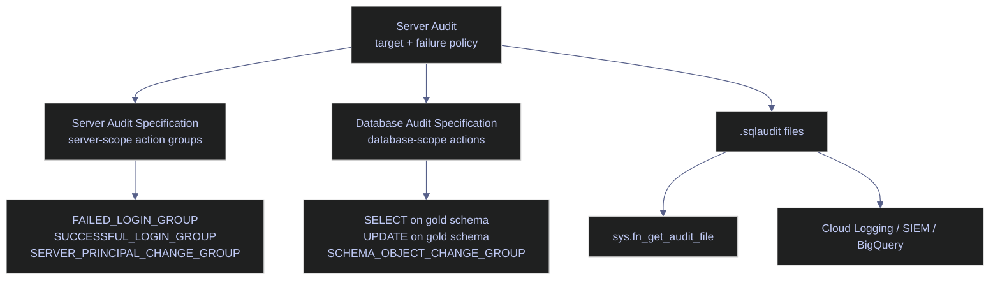

# Audit Logging

SQL Server Audit is the built-in event capture system for security-relevant activity: logins, permission changes, DDL, and optionally DML. It is built on Extended Events, runs inside the engine, and writes to one of three targets: the Windows Security log, the Windows Application log, or a binary file. On Linux the only production-grade target is the file target, which writes append-only `.sqlaudit` files under a directory owned by the `mssql` service account. Those files are queried from T-SQL with `sys.fn_get_audit_file`, parsed by a log shipper, or archived off the host.

For production use, treat audit design as a control-plane decision, not just a logging feature. The important questions are:

- which events must be captured
- where the files live
- what SQL Server should do if the target becomes unavailable
- how quickly security staff can query and alert on the data
- who is allowed to read the audit stream, and what is done when they do

## Audit Architecture

> [!abstract] SQL Server Audit scope
>
> This section covers the three-object audit model (server audit + server audit specification + database audit specification), the predefined action groups versus direct object actions, and the built-in catalog that resolves `action_id` codes to human-readable names via `sys.dm_audit_actions`. Every SQL cell below runs against a SQL Server 2022 Developer Edition instance (16.0.4236.2) on Linux.

SQL Server Audit is a three-layer model:

- the **Server Audit** defines the target and failure policy
- the **Server Audit Specification** defines server-scope event groups such as failed logins or login changes
- the **Database Audit Specification** defines database-scope events such as `SELECT`, `UPDATE`, or schema changes for a specific database

Only one server audit specification can attach to a given server audit, and only one database audit specification per database can attach to that same audit. That makes the initial scope definition important: a production audit should be designed around stable event categories and retention policy, not around ad hoc troubleshooting.



## Build And Verify The Audit

> [!abstract] Build order and demo scope
>
> This section uses a disposable production-shaped example named `codex_audit_demo`. Objects are built in strict dependency order (directory → server audit → server audit specification → database audit specification) so each step produces a live verification row against stoxx. The commands are valid for real environments, but the object names are intentionally isolated so the note does not require changes to the real `stoxx` security surface. Every demo object is dropped at the end of the section.

### Linux | create the file target

Audit file targets on Linux require the directory to exist and be writable by the SQL Server service account. If the path is wrong or inaccessible, audit creation or startup fails with `MSG_AUDIT_TARGET_NOT_FOUND` and the audit cannot be enabled. The `mssql` user inside the container must own the directory (mode `0750` is sufficient) before `CREATE SERVER AUDIT` runs.

#### `xp_create_subdir` | create the audit directory

**When to run:** before any `CREATE SERVER AUDIT ... TO FILE` statement the first time an instance is configured for audit, or after moving the audit target to a new filesystem path.
**Trigger:** initial audit deployment, path change during capacity planning, or recovery after the audit directory was removed.
**Context:** T-SQL session connected to the SQL Server instance with `ALTER SETTINGS` and filesystem-write privilege via the `mssql` service account. State-changing: creates a filesystem directory owned by `mssql:mssql`. No restart required.
**Purpose:** guarantee the audit target path exists and is writable before the server audit object is defined, so audit startup does not fail silently at state change.

*Create the Linux audit target directory that the server audit will write into.*

```sql
USE master;
GO

EXEC xp_create_subdir '/var/opt/mssql/log/audit/';
GO
```

| Setting | What it controls | Default | Production guidance |
|---|---|---|---|
| `path` argument | Absolute directory that SQL Server will create (and any missing intermediate directories). | No default | Use an instance-dedicated path under `/var/opt/mssql/log/audit/` or a separately mounted volume so audit I/O does not compete with data/log I/O. |
| Owner | UID/GID that owns the created directory. | `mssql:mssql` | Leave as `mssql:mssql`. Changing ownership breaks the file target because SQL Server writes through the engine process, not the login. |
| Mode | Unix permission bits on the created directory. | `0750` | Do not widen beyond `0750`. The audit file target is a tamper-evidence surface; only `mssql` and the audit-reader group should read it. |

### SQL Server | sys.server_file_audits | target and runtime state

The server audit defines where records are written and how SQL Server reacts if the target cannot be written to. For production, `ON_FAILURE` is the single most important behavioral choice in the definition. The server audit object is created in a disabled state and must be enabled with `ALTER SERVER AUDIT ... WITH (STATE = ON)` as a separate statement before any events are captured.

#### `CREATE SERVER AUDIT` | create the file-backed audit target

**When to run:** once per instance, as part of initial security baseline configuration, immediately after [03-sql-server-authentication](03-sql-server-authentication.md) has been hardened and before any audit specification is attached.
**Trigger:** new instance onboarding, regulatory control requiring durable event capture, or investigation of an incident that was missed because no audit existed.
**Context:** T-SQL session connected to `master` (the statement fails with error 33074 if run from a user database). Requires `ALTER ANY SERVER AUDIT` or `CONTROL SERVER`. State-changing: creates a server-scoped DDL object and, after the second statement, enables it. No restart required. The `CREATE SERVER AUDIT` statement is transactional and rolls back if its enclosing transaction rolls back.
**Purpose:** establish the single instance-level audit target that every server and database audit specification will route events to, with a bounded-size rollover policy and a `CONTINUE` failure mode appropriate for an availability-first environment.

> [!warning] ON_FAILURE = SHUTDOWN can halt the instance
>
> `ON_FAILURE = SHUTDOWN` is a compliance-grade setting, not a default-safe setting. If the target becomes unavailable because the volume is full, permissions changed, or the path vanished, SQL Server halts the instance rather than continue without auditing. The login that creates the audit must also hold the `SHUTDOWN` permission, and the shutdown behavior persists even if that permission is later revoked. An ON_FAILURE = SHUTDOWN audit combined with a noisy action group (for example `SCHEMA_OBJECT_ACCESS_GROUP`) is the most common way to convert a filesystem warning into a full-instance outage.

> [!success] Default to CONTINUE unless compliance requires fail-closed
>
> Use `ON_FAILURE = CONTINUE` unless a formal control or regulation explicitly requires fail-closed behavior. Pair it with filesystem monitoring, retention controls, and external forwarding so a target outage is detected quickly. `FAIL_OPERATION` is a middle ground that fails only the audited operation without halting the instance, but it still causes application errors when the target is unavailable and should be reserved for narrow, well-understood action groups.

> [!info]- CREATE SERVER AUDIT clause-by-clause
>
> This batch creates the audit target itself and then enables it.
>
> - `USE master` is mandatory — `CREATE SERVER AUDIT` fails with error 33074 from any user database.
> - `TO FILE` chooses the Linux file target. `APPLICATION_LOG` and `SECURITY_LOG` are Windows-only targets and cannot be used on Linux.
> - `FILEPATH` must already exist and must be writable by the `mssql` service account. SQL Server does not create the directory; use `xp_create_subdir` first.
> - `MAXSIZE = 20 MB` rolls the current file at roughly 20 MB of audit data. The lower bound enforced by the engine is 2 MB; the upper bound is `UNLIMITED`.
> - `MAX_ROLLOVER_FILES = 5` keeps at most five files before the oldest file is deleted by the engine. This mode is mutually exclusive with `MAX_FILES`, which caps the total number of files and fails the audit when the cap is hit instead of rolling over.
> - `RESERVE_DISK_SPACE = OFF` means SQL Server does not pre-allocate `MAXSIZE` bytes on disk. Turn it `ON` for compliance-grade audits where a sudden volume fill would be catastrophic — the pre-allocated file guarantees room for writes.
> - `QUEUE_DELAY = 1000` lets SQL Server buffer events for up to one second before flushing to disk. The minimum settable value is `1000` (1 s). Setting `0` forces synchronous delivery — every audited event blocks until the record is durable, which can dominate latency on busy systems.
> - `ON_FAILURE = CONTINUE` is explicit and documented in the warning/success pair above.
> - `ALTER SERVER AUDIT ... WITH (STATE = ON)` is required because server audits are always created disabled. It must run as a separate statement — you cannot combine state change with `CREATE SERVER AUDIT` in a single DDL.

| Option | What it controls | Default | Possible values | Production guidance |
|---|---|---|---|---|
| `TO { FILE \| APPLICATION_LOG \| SECURITY_LOG }` | Target of audit records. | none (required) | `FILE` on Linux; `APPLICATION_LOG`, `SECURITY_LOG`, `FILE` on Windows. | On Linux there is only one production choice: `FILE`. |
| `FILEPATH` | Absolute directory where `.sqlaudit` files are written. | none (required when `TO FILE`) | Any absolute path writable by `mssql`. | Dedicated directory, not the data or log volume. |
| `MAXSIZE` | Upper bound on individual `.sqlaudit` file size before rollover. | `UNLIMITED` | `UNLIMITED`, or `N { MB \| GB \| TB }` where `N >= 2`. | `20–100 MB` is a practical compromise between rollover frequency and filesystem object count. |
| `MAX_ROLLOVER_FILES` | How many rolled files to keep before deleting the oldest. Mutually exclusive with `MAX_FILES`. | `UNLIMITED` | `UNLIMITED` or `0..2147483647`. | Set an explicit cap sized to disk capacity. `UNLIMITED` means retention is the operator's problem, not SQL Server's. |
| `MAX_FILES` | Absolute cap on total number of files. When hit, audit fails per `ON_FAILURE`. | `0` (no cap) | `0..2147483647`. | Use when regulatory chain-of-custody requires that no audit data be deleted without operator action. |
| `RESERVE_DISK_SPACE` | Whether SQL Server pre-allocates `MAXSIZE` bytes at file creation. | `OFF` | `ON`, `OFF`. | `ON` for compliance-grade audits to guarantee write headroom. `OFF` for general use. |
| `QUEUE_DELAY` | Max milliseconds the write buffer is held before flushing. | `1000` (1 s) | `0` (synchronous) or `>= 1000`. | Keep at `1000` unless asynchronous loss of the last second of events is unacceptable. `0` has severe performance cost on busy systems. |
| `ON_FAILURE` | How the instance reacts when the target is unavailable. | `CONTINUE` | `CONTINUE`, `SHUTDOWN`, `FAIL_OPERATION`. | `CONTINUE` for availability-first. `SHUTDOWN` only with explicit governance sign-off. `FAIL_OPERATION` for narrow, high-value audits. |
| `AUDIT_GUID` | Explicit GUID for matching audits in mirroring/AG setups. | Engine-generated | Any `uniqueidentifier`. | Set explicitly only when building mirrored or AG-aligned audits. Cannot be changed after creation. |
| `WHERE` (predicate) | Server-side event filter applied before the record is written. | None | Boolean expression over event fields from `sys.fn_get_audit_file`. | Use to pre-filter by `database_name`, `server_principal_name`, `object_name`, etc. — cuts write volume at the source. See the WHERE predicate demo below. |
| `STATE` | Whether the audit is running. Set via `ALTER SERVER AUDIT`, not `CREATE`. | Disabled on creation | `ON`, `OFF`. | Enable only after specifications are attached so the audit file does not rotate through a zero-event state. |

*Create and enable a file-backed server audit with bounded rollover and a one-second flush delay.*

```sql
USE master;
GO

CREATE SERVER AUDIT codex_audit_demo
TO FILE (
    FILEPATH = '/var/opt/mssql/log/audit/',
    MAXSIZE = 20 MB,
    MAX_ROLLOVER_FILES = 5,
    RESERVE_DISK_SPACE = OFF
)
WITH (
    QUEUE_DELAY = 1000,
    ON_FAILURE = CONTINUE
);
GO

ALTER SERVER AUDIT codex_audit_demo WITH (STATE = ON);
GO
```

#### `sys.server_file_audits` + `sys.dm_server_audit_status` | verify the audit target

**When to run:** immediately after `CREATE SERVER AUDIT ... WITH (STATE = ON)` to confirm the audit started, and periodically thereafter as part of production health checks. Also use this when `sys.fn_get_audit_file` returns no rows — this query proves whether the audit is running or stopped.
**Trigger:** initial deployment verification, audit target move, volume fill alert, or routine health check after unexpected errors in the error log.
**Context:** read-only T-SQL session. Requires `ALTER ANY SERVER AUDIT` or `VIEW ANY DEFINITION` for `sys.server_file_audits`, and `VIEW SERVER STATE` for `sys.dm_server_audit_status`. No restart impact.
**Purpose:** return both the configured file-target properties (from the catalog view) and the live runtime state (from the DMV) in a single row, so an operator can distinguish between a misconfigured audit and a correctly configured but stopped audit.

| Field | Source column | Type | Meaning |
|---|---|---|---|
| `name` | `sys.server_file_audits.name` | `sysname` | Audit object name as created by `CREATE SERVER AUDIT`. |
| `audit_guid` | `sys.server_file_audits.audit_guid` | `uniqueidentifier` | Immutable GUID that ties rollover files to the same logical audit. Embedded in every `.sqlaudit` filename. |
| `type_desc` | `sys.server_file_audits.type_desc` | `nvarchar(60)` | Target type: `FILE`, `APPLICATION LOG`, or `SECURITY LOG`. On Linux only `FILE` is valid. |
| `on_failure_desc` | `sys.server_file_audits.on_failure_desc` | `nvarchar(60)` | Failure policy: `CONTINUE`, `SHUTDOWN SERVER INSTANCE`, or `FAIL_OPERATION`. |
| `is_state_enabled` | `sys.server_file_audits.is_state_enabled` | `tinyint` | `1` if the audit object is enabled, `0` if disabled. Enabled objects may still be `STOPPED` at runtime if the target failed. |
| `queue_delay` | `sys.server_file_audits.queue_delay` | `int` | Maximum milliseconds the write buffer is held before flushing. `0` means synchronous. |
| `max_file_size` | `sys.server_file_audits.max_file_size` | `bigint` | Size cap per `.sqlaudit` file in megabytes. `0` means unlimited. |
| `max_rollover_files` | `sys.server_file_audits.max_rollover_files` | `int` | Maximum rolled files to keep before deleting the oldest. Mutually exclusive with `max_files`. |
| `max_files` | `sys.server_file_audits.max_files` | `int` | Absolute file count cap. `0` means no cap and `max_rollover_files` takes effect instead. |
| `reserve_disk_space` | `sys.server_file_audits.reserve_disk_space` | `bit` | Whether `MAXSIZE` bytes are pre-allocated at file creation. |
| `log_file_path` | `sys.server_file_audits.log_file_path` | `nvarchar(260)` | Configured directory for the audit target. |
| `predicate` | `sys.server_audits.predicate` (joined via audit_id) | `nvarchar(8000)` | Server-side WHERE filter applied before events are written. `NULL` when no filter is defined. |
| `status_desc` | `sys.dm_server_audit_status.status_desc` | `nvarchar(60)` | Live runtime state: `STARTED` (writing) or `STOPPED` (idle, may indicate target error). |
| `status_time` | `sys.dm_server_audit_status.status_time` | `datetime` | UTC timestamp at which the current runtime state was entered. |
| `audit_file_path` | `sys.dm_server_audit_status.audit_file_path` | `nvarchar(260)` | Full path of the currently active `.sqlaudit` file, including the embedded GUID and Windows FILETIME timestamp. |
| `audit_file_size` | `sys.dm_server_audit_status.audit_file_size` | `bigint` | Current on-disk size (bytes) of the active file. Growing values confirm events are reaching disk. |

*Return the configured file-target properties, WHERE predicate, and live runtime state for the server audit.*

```sql
SELECT
    sf.name,
    sa.audit_guid,
    sf.type_desc,
    sf.on_failure_desc,
    sf.is_state_enabled,
    sf.queue_delay,
    sf.max_file_size,
    sf.max_rollover_files,
    sf.max_files,
    sf.reserve_disk_space,
    sf.log_file_path,
    sa.predicate,
    ds.status_desc,
    ds.status_time,
    ds.audit_file_path,
    ds.audit_file_size
FROM sys.server_file_audits AS sf
JOIN sys.server_audits AS sa
    ON sf.audit_id = sa.audit_id
LEFT JOIN sys.dm_server_audit_status AS ds
    ON sf.audit_id = ds.audit_id
WHERE sf.name = 'codex_audit_demo';
```

| name | audit_guid | type_desc | on_failure_desc | is_state_enabled | queue_delay | max_file_size | max_rollover_files | max_files | reserve_disk_space | log_file_path | predicate | status_desc | status_time | audit_file_path | audit_file_size |
|---|---|---|---|---:|---:|---:|---:|---:|---|---|---|---|---|---|---:|
| `codex_audit_demo` | `AC919074-943D-483A-90FB-8FFF8CFE25A1` | `FILE` | `CONTINUE` | 1 | 1000 | 20 | 5 | 0 | False | `/var/opt/mssql/log/audit/` | `NULL` | `STARTED` | `2026-04-11 16:37:42.428` | `/var/opt/mssql/log/audit/codex_audit_demo_AC919074-943D-483A-90FB-8FFF8CFE25A1_0_134203990624240000.sqlaudit` | 40960 |

_The audit is configured and running correctly. The object is enabled (`is_state_enabled = 1`), the runtime status is `STARTED` since 16:37:42 UTC, the file path resolves to the expected Linux directory, and the current `.sqlaudit` file has already accumulated 40,960 bytes. The `audit_guid` (`AC919074-943D-483A-90FB-8FFF8CFE25A1`) is embedded in the filename and is how rollover files are grouped back to the same logical audit — the suffix `_0_134203990624240000` is the Windows FILETIME of file creation. `predicate = NULL` confirms no WHERE filter is applied yet; `max_files = 0` combined with `max_rollover_files = 5` means the audit uses rollover mode rather than hard-cap mode. With `ON_FAILURE = CONTINUE`, the instance will keep serving workload if the audit target fails, so production monitoring must detect file-target failures explicitly from outside SQL Server._

| Column | Value | Watch | Meaning | Implication |
|---|---|---|---|---|
| `type_desc` | `FILE` | ✅ | Audit writes to the filesystem. | Only valid target on Linux; audit can be read with `sys.fn_get_audit_file`. |
| `type_desc` | `APPLICATION LOG` / `SECURITY LOG` | ❌ on Linux | Windows event log targets. | Not supported on Linux — indicates the metadata came from a mirrored Windows instance. |
| `on_failure_desc` | `CONTINUE` | ✅ | SQL Server continues workload if the target fails. | Good operational default for most systems, but you must monitor for silent audit loss. |
| `on_failure_desc` | `FAIL_OPERATION` | Depends | Audited operations fail when the target fails. | Safer than `CONTINUE`, but application errors are possible under target outages. |
| `on_failure_desc` | `SHUTDOWN SERVER INSTANCE` | ❌ unless formally required | SQL Server shuts down if the audit target fails. | Use only when a fail-closed regulatory posture outweighs availability risk. |
| `is_state_enabled` | `1` | ✅ | The audit object is enabled. | The target can actively receive events. |
| `is_state_enabled` | `0` | ❌ | The audit object exists but is disabled. | The definition is present, but nothing is being captured. |
| `status_desc` | `STARTED` | ✅ | The audit runtime is active. | The file target is available and SQL Server is writing to it. |
| `status_desc` | `STOPPED` | ❌ | The audit is not currently running. | Investigate target errors, manual disablement, or startup failures immediately. |
| `queue_delay` | `1000` | ✅ | Events can remain buffered for up to one second. | Good compromise between durability freshness and overhead. |
| `queue_delay` | `0` | Depends | Synchronous flush behavior. | Stronger immediacy, but more latency and write overhead on busy systems. |
| `max_file_size` | `20` (MB) | ✅ | Rollover at ~20 MB per file. | Matches the `CREATE SERVER AUDIT` batch; file count controls total footprint. |
| `max_file_size` | `0` | ❌ unless bounded by volume | Unlimited per-file size. | Rollover may grow into huge files; hard to ship and slow to query via `sys.fn_get_audit_file`. |
| `max_rollover_files` | `5` | ✅ | Keeps five files before the oldest is deleted. | Retention is bounded; external forwarding must catch events before deletion. |
| `max_rollover_files` | `0` + `max_files = 0` | ❌ | Unlimited retention without archival. | Audit will fill the volume; monitor disk usage actively. |
| `max_files` | `0` | ✅ when rollover mode is intended | No hard cap; `max_rollover_files` governs retention. | Correct for the `MAX_ROLLOVER_FILES` mode used in the batch. |
| `max_files` | `>0` | Depends | Hard cap on total file count. | Audit fails per `ON_FAILURE` when the cap is hit. Chain-of-custody mode. |
| `reserve_disk_space` | `False` | ✅ for general use | SQL Server does not pre-allocate `MAXSIZE`. | Disk is consumed incrementally; monitor free space. |
| `reserve_disk_space` | `True` | ✅ for compliance-grade | `MAXSIZE` is pre-allocated on file creation. | Guarantees write headroom but consumes disk up front. |
| `predicate` | `NULL` | ✅ when full-stream audit is intended | No server-side WHERE filter. | Every matching event is written. |
| `predicate` | Filter expression | Depends | Filter expression applied before writing. | Reduces write volume at the source; see the WHERE predicate demo below. |
| `audit_guid` | UUID value | ✅ | Immutable audit identity. | Embedded in every `.sqlaudit` filename. Required to match mirrored or AG-aligned audits. |
| `audit_file_size` | Growing non-zero value | ✅ | Events are reaching disk. | Confirms actual activity, not just a configured object. |
| `audit_file_size` | `0` or stagnant unexpectedly | ❌ | No recent events or write failure. | Cross-check audit scope, permissions, and recent workload. |

### SQL Server | sys.server_audit_specifications | server-scope events

Server audit specifications attach server-level action groups such as login success, login failure, and server-principal changes. Use them for identity and control-plane activity, not object-level data access. Exactly one server audit specification can attach to a given server audit — the engine rejects a second `CREATE SERVER AUDIT SPECIFICATION ... FOR SERVER AUDIT` statement against the same audit. Every action group is a predefined, atomic bundle of events — you cannot partially include events from a group.

#### `CREATE SERVER AUDIT SPECIFICATION` | capture logins and principal changes

**When to run:** immediately after the server audit object is created and enabled, as the second step of initial audit deployment.
**Trigger:** initial audit deployment, scope expansion (adding `SERVER_ROLE_MEMBER_CHANGE_GROUP` after a privilege-escalation finding), or regulatory review requiring additional identity-plane coverage.
**Context:** T-SQL session connected to `master`. Requires `ALTER ANY SERVER AUDIT` or `CONTROL SERVER`. State-changing: creates a server-scoped DDL object bound to an existing server audit and enables it. The audit specification can only be modified while it is disabled (`ALTER SERVER AUDIT SPECIFICATION ... WITH (STATE = OFF)` first).
**Purpose:** bind a minimal high-value set of identity and control-plane action groups to the server audit so failed-login detection, privileged-role changes, and audit tampering are captured from the moment the audit goes live.

> [!info]- Server-scope action group reference
>
> This is the common production set of server-scope action groups and what each captures. Each group is atomic — you can add or remove the whole group but not individual events from within it. For the full list of ~40 server-scope groups, query `sys.dm_audit_actions WHERE class_desc = 'SERVER' AND is_group = 1`.
>
> - **`FAILED_LOGIN_GROUP`** — every failed login to the instance (`LGIF` events). Foundational for brute-force and credential-stuffing detection.
> - **`SUCCESSFUL_LOGIN_GROUP`** — every successful login (`LGIS` events). High volume but required for session accountability and correlation with `LGIF` bursts.
> - **`LOGOUT_GROUP`** — session end events. Useful for session-duration analysis but can be high volume.
> - **`SERVER_PRINCIPAL_CHANGE_GROUP`** — `CREATE/ALTER/DROP LOGIN`, password changes, and related catalog writes at the server scope. Required for any environment where logins are created or modified outside a break-glass window.
> - **`SERVER_ROLE_MEMBER_CHANGE_GROUP`** — membership changes on fixed server roles (`sysadmin`, `securityadmin`, `serveradmin`, etc.). Any production change to these is a P1 signal.
> - **`SERVER_PRINCIPAL_IMPERSONATION_GROUP`** — `EXECUTE AS LOGIN` and related impersonation events. Required when applications routinely impersonate service accounts.
> - **`AUDIT_CHANGE_GROUP`** — creation, modification, and deletion of audits and audit specifications. Audit tampering itself produces events — use this to detect attempts to cover tracks.
> - **`DATABASE_CHANGE_GROUP`** — `CREATE/ALTER/DROP DATABASE` at the server scope. Good for detecting unauthorized database deployment.
> - **`BACKUP_RESTORE_GROUP`** — `BACKUP` and `RESTORE` commands. Useful for evidence-preservation and RPO incidents.
> - **`DBCC_GROUP`** — any `DBCC` command. Noisy in some environments but surfaces diagnostic and recovery actions that would otherwise be invisible.
> - **`SENSITIVE_BATCH_COMPLETED_GROUP`** (SQL Server 2022+) — batches that touch columns classified as sensitive via Data Classification. Scope it at the **server** level to cover cross-database queries; a database-scope binding misses queries that originate in other databases.
> - **`TRACE_CHANGE_GROUP`** — `ALTER TRACE` permission checks. Relevant for environments that still use profiler or server-side traces.
> - **`SERVER_OBJECT_CHANGE_GROUP`** — `CREATE/ALTER/DROP` for server-scope objects (databases, endpoints). Overlaps with `DATABASE_CHANGE_GROUP`.
> - **`SERVER_OBJECT_PERMISSION_CHANGE_GROUP`** — `GRANT/REVOKE/DENY` on server-scope securables.
> - **`SERVER_OPERATION_GROUP`** — `BULK ADMIN`, administrative resource operations.

*Attach login, principal, role-membership, and audit-change event groups to the server audit.*

```sql
USE master;
GO

CREATE SERVER AUDIT SPECIFICATION codex_audit_server_spec
FOR SERVER AUDIT codex_audit_demo
    ADD (FAILED_LOGIN_GROUP),
    ADD (SUCCESSFUL_LOGIN_GROUP),
    ADD (SERVER_PRINCIPAL_CHANGE_GROUP),
    ADD (SERVER_ROLE_MEMBER_CHANGE_GROUP),
    ADD (AUDIT_CHANGE_GROUP)
WITH (STATE = ON);
GO
```

#### `sys.server_audit_specifications` | verify the specification header

**When to run:** immediately after `CREATE SERVER AUDIT SPECIFICATION` to confirm the object exists and is enabled, and whenever audit coverage is being reviewed.
**Trigger:** deployment verification, audit-change investigation after an `AUDIT_CHANGE_GROUP` event, or scheduled compliance review.
**Context:** read-only T-SQL from any database. Requires `ALTER ANY SERVER AUDIT` or `VIEW ANY DEFINITION`. No runtime impact.
**Purpose:** return the one-row header summary of the server audit specification, proving it is enabled and identifying which audit it is bound to.

| Field | Source column | Type | Meaning |
|---|---|---|---|
| `name` | `sys.server_audit_specifications.name` | `sysname` | Specification object name as declared in `CREATE SERVER AUDIT SPECIFICATION`. |
| `is_state_enabled` | `sys.server_audit_specifications.is_state_enabled` | `tinyint` | `1` if the specification is actively emitting events, `0` if disabled. |
| `is_session_context_enabled` | `sys.server_audit_specifications.is_session_context_enabled` | `bit` | `1` if session context key/value pairs are injected into audit rows. Only populated on Azure SQL family. On-premises SQL Server always shows `0`. |
| `create_date` | `sys.server_audit_specifications.create_date` | `datetime` | UTC timestamp of the original `CREATE SERVER AUDIT SPECIFICATION` DDL. |
| `modify_date` | `sys.server_audit_specifications.modify_date` | `datetime` | UTC timestamp of the most recent `ALTER SERVER AUDIT SPECIFICATION`. Mismatches with `create_date` indicate the specification was modified after deployment. |

*Return the specification header row for the server-scope audit definition.*

```sql
SELECT
    name,
    is_state_enabled,
    is_session_context_enabled,
    create_date,
    modify_date
FROM sys.server_audit_specifications
WHERE name = 'codex_audit_server_spec';
```

| name | is_state_enabled | is_session_context_enabled | create_date | modify_date |
|---|---|---|---|---|
| `codex_audit_server_spec` | True | False | 2026-04-11 16:37:51.247 | 2026-04-11 16:37:51.247 |

_The server audit specification exists and is enabled. `create_date` equals `modify_date`, so no `ALTER` has touched the specification since deployment — any later drift would show up as a divergence between the two timestamps and should be correlated with `AUDIT_CHANGE_GROUP` events in the audit file. `is_session_context_enabled = False` is the expected on-premises value; session context enrichment is an Azure SQL-family feature._

| Column | Value | Watch | Meaning | Implication |
|---|---|---|---|---|
| `is_state_enabled` | `1` | ✅ | The specification is enabled. | Matching server-level events will be written to the audit. |
| `is_state_enabled` | `0` | ❌ | The specification exists but is not active. | No server-scope events are captured until it is enabled. |
| `is_session_context_enabled` | `0` | ✅ | No session-context key/value payload is included. | Default and acceptable unless the design intentionally uses session context tagging. |
| `is_session_context_enabled` | `1` | Depends | Session context is written into audit rows. | Useful for application correlation, but audit payload volume increases. |

#### `sys.server_audit_specification_details` | verify the action groups

**When to run:** after every `CREATE` or `ALTER SERVER AUDIT SPECIFICATION` to confirm exactly which action groups are bound. Also during compliance review when the auditor asks "what exactly is this instance capturing".
**Trigger:** post-deployment verification, audit scope change review, or investigation after an `AUDIT_CHANGE_GROUP` event.
**Context:** read-only T-SQL. Requires `ALTER ANY SERVER AUDIT` or `VIEW ANY DEFINITION`. No runtime impact.
**Purpose:** enumerate every action group (and any direct action) attached to the server audit specification, together with the internal 4-character `audit_action_id` code that appears in the audit file's `action_id` column, so the header row and the on-disk stream can be correlated.

| Field | Source column | Type | Meaning |
|---|---|---|---|
| `audit_action_id` | `sys.server_audit_specification_details.audit_action_id` | `char(4)` | Internal 4-character code identifying the action group. Same family of codes as the `action_id` column in `sys.fn_get_audit_file`. |
| `audit_action_name` | `sys.server_audit_specification_details.audit_action_name` | `sysname` | Human-readable action group name as declared in `CREATE SERVER AUDIT SPECIFICATION`. |
| `class_desc` | `sys.server_audit_specification_details.class_desc` | `nvarchar(60)` | Securable class of the action. For server specs this is always `SERVER`. |
| `audited_result` | `sys.server_audit_specification_details.audited_result` | `nvarchar(60)` | Which outcomes are recorded: `SUCCESS AND FAILURE`, `SUCCESS`, or `FAILURE`. Server specs always capture both by default. |
| `is_group` | `sys.server_audit_specification_details.is_group` | `bit` | `1` if the row is an action group, `0` if it is a direct action. Server audit specs only permit groups, so this should always be `1`. |

*List the server-level action groups that the server audit specification captures, including their internal action codes.*

```sql
SELECT
    sad.audit_action_id,
    sad.audit_action_name,
    sad.class_desc,
    sad.audited_result,
    sad.is_group
FROM sys.server_audit_specification_details AS sad
JOIN sys.server_audit_specifications AS sas
    ON sad.server_specification_id = sas.server_specification_id
WHERE sas.name = 'codex_audit_server_spec'
ORDER BY sad.audit_action_name;
```

| audit_action_id | audit_action_name | class_desc | audited_result | is_group |
|---|---|---|---|---|
| `CNAU` | `AUDIT_CHANGE_GROUP` | `SERVER` | `SUCCESS AND FAILURE` | True |
| `LGFL` | `FAILED_LOGIN_GROUP` | `SERVER` | `SUCCESS AND FAILURE` | True |
| `MNSP` | `SERVER_PRINCIPAL_CHANGE_GROUP` | `SERVER` | `SUCCESS AND FAILURE` | True |
| `ADSP` | `SERVER_ROLE_MEMBER_CHANGE_GROUP` | `SERVER` | `SUCCESS AND FAILURE` | True |
| `LGSD` | `SUCCESSFUL_LOGIN_GROUP` | `SERVER` | `SUCCESS AND FAILURE` | True |

_This specification is built entirely from action groups (`is_group = True` everywhere), which is the correct shape for server-scope auditing. The five groups cover login success, login failure, server principal DDL, fixed-role membership changes, and audit tampering — a strong identity and control-plane baseline. The `audit_action_id` column is the 4-character code that the engine uses internally to tag these groups; `CNAU`, `LGFL`, `MNSP`, `ADSP`, and `LGSD` are the values you would see if you filtered `sys.fn_get_audit_file` on the corresponding events, and `SUCCESS AND FAILURE` means both successful and failed attempts will be recorded — the correct default for forensic coverage._

| Column | Value | Watch | Meaning | Implication |
|---|---|---|---|---|
| `class_desc` | `SERVER` | ✅ | The events belong to the server scope. | Correct for login and server-principal activity. |
| `class_desc` | Other values here | ❌ | Unexpected scope for this specification. | Recheck the audit design or query target. |
| `audited_result` | `SUCCESS AND FAILURE` | ✅ | Both successful and failed outcomes are written. | Best default for security review and incident reconstruction. |
| `audited_result` | `SUCCESS` | Depends | Only successful operations are captured. | Fine for some change-control cases, but failed-login visibility is lost. |
| `audited_result` | `FAILURE` | Depends | Only failed operations are captured. | Useful for narrow alerting, but incomplete for accountability. |
| `is_group` | `True` | ✅ | The entry is an action group. | Expected for server audit specifications. |
| `is_group` | `False` | ❌ | The entry is a direct action rather than a group. | Server audit specs only support action groups — any `False` here is a catalog inconsistency. |
| `audit_action_id` | `CNAU` | Informational | Internal code for `AUDIT_CHANGE_GROUP`. | Any `CNAU` row in the audit stream is a tampering signal. |
| `audit_action_id` | `LGFL` | Informational | Internal code for `FAILED_LOGIN_GROUP`. | Correlates to `LGIF` in the audit stream. |
| `audit_action_id` | `LGSD` | Informational | Internal code for `SUCCESSFUL_LOGIN_GROUP`. | Correlates to `LGIS` rows in the audit stream. |
| `audit_action_id` | `MNSP` | Informational | Internal code for `SERVER_PRINCIPAL_CHANGE_GROUP`. | Any row is a login-management DDL event. |
| `audit_action_id` | `ADSP` | Informational | Internal code for `SERVER_ROLE_MEMBER_CHANGE_GROUP`. | Any row is a fixed-role membership change — P1 signal in production. |

### SQL Server | sys.database_audit_specifications | database-scope events

Database audit specifications capture database-level actions. Use them for business-schema reads and writes that matter to security or compliance, not for broad indiscriminate full-schema auditing unless retention and volume have been planned. One database audit specification per database can attach to a given audit, but each database on the instance can have its own specification bound to the same underlying server audit.

#### `CREATE DATABASE AUDIT SPECIFICATION` | capture schema reads, writes, and DDL

**When to run:** after the server audit and server audit specification are in place, and only for databases that contain regulated or sensitive data.
**Trigger:** scoping of a sensitive schema for compliance, investigation-driven addition of targeted object actions, or new-database onboarding to an existing audit framework.
**Context:** T-SQL session connected to the target database (here, `stoxx`). Requires `ALTER ANY DATABASE AUDIT` or `ALTER`/`CONTROL` permission on the database, plus `CONNECT` to that database. State-changing: creates a database-scoped DDL object bound to the named server audit and enables it.
**Purpose:** attach a tight, deliberate mix of direct object actions (`SELECT`/`UPDATE` on `SCHEMA::gold`) and database-level action groups (`SCHEMA_OBJECT_CHANGE_GROUP`, `DATABASE_PRINCIPAL_CHANGE_GROUP`, `DATABASE_ROLE_MEMBER_CHANGE_GROUP`) to the server audit, so sensitive-schema access and in-database identity changes flow through the same append-only file stream as the server-scope events.

> [!info]- Database-scope action syntax and the BY clause
>
> The `ADD` syntax supports two shapes: action groups and direct object actions.
>
> - **Action groups** are predefined bundles declared as `ADD (GROUP_NAME)`. Examples: `SCHEMA_OBJECT_CHANGE_GROUP`, `DATABASE_PRINCIPAL_CHANGE_GROUP`, `DATABASE_ROLE_MEMBER_CHANGE_GROUP`, `DATABASE_OBJECT_ACCESS_GROUP`, `SCHEMA_OBJECT_ACCESS_GROUP`, `DATABASE_PERMISSION_CHANGE_GROUP`, `BATCH_COMPLETED_GROUP`, `SENSITIVE_BATCH_COMPLETED_GROUP`, `FAILED_DATABASE_AUTHENTICATION_GROUP`, `SUCCESSFUL_DATABASE_AUTHENTICATION_GROUP`, `USER_CHANGE_PASSWORD_GROUP`, `APPLICATION_ROLE_CHANGE_PASSWORD_GROUP`.
> - **Direct object actions** are declared as `ADD (action ON securable BY principal)` where:
>   - `action` is one of `SELECT`, `INSERT`, `UPDATE`, `DELETE`, `EXECUTE`, `RECEIVE`, `REFERENCES`.
>   - `securable` is `OBJECT::schema.object`, `SCHEMA::schema`, or `DATABASE::dbname`. A schema-level binding (`SCHEMA::gold`) audits every object created under that schema, including future ones — this is usually what you want for business-schema coverage.
>   - `BY principal` is mandatory and narrows the audit to actions executed on behalf of the listed database principal. `BY public` audits the action regardless of which user or role runs it, which is what you normally want; `BY <specific_user>` narrows to that user's activity.
> - Direct object actions cannot be audited at column granularity — the action is captured for the row, not the specific columns touched. Use Data Classification + `SENSITIVE_BATCH_COMPLETED_GROUP` when column-level sensitivity matters.
> - `tempdb` and temporary tables are never audited regardless of action groups. `BATCH_COMPLETED_GROUP` captures the originating statement text, including references to temp tables, but the temp-table objects themselves produce no audit rows.

*Attach schema-level `SELECT`, `UPDATE`, DDL, principal, and role-membership events in `stoxx` to the server audit.*

```sql
USE stoxx;
GO

CREATE DATABASE AUDIT SPECIFICATION codex_audit_db_spec
FOR SERVER AUDIT codex_audit_demo
    ADD (SELECT ON SCHEMA::gold BY public),
    ADD (UPDATE ON SCHEMA::gold BY public),
    ADD (SCHEMA_OBJECT_CHANGE_GROUP),
    ADD (DATABASE_PRINCIPAL_CHANGE_GROUP),
    ADD (DATABASE_ROLE_MEMBER_CHANGE_GROUP)
WITH (STATE = ON);
GO
```

#### `sys.database_audit_specifications` | verify the specification header

**When to run:** after `CREATE DATABASE AUDIT SPECIFICATION` to confirm the object is enabled, and during any scheduled compliance review of per-database audit coverage.
**Trigger:** deployment verification, database onboarding, or follow-up on an `AUDIT_CHANGE_GROUP` event at the server scope.
**Context:** read-only T-SQL connected to the target database. Requires `ALTER ANY DATABASE AUDIT` or `VIEW DEFINITION` on the database.
**Purpose:** return the one-row header summary of the database audit specification to prove it is enabled and tied to the expected server audit.

| Field | Source column | Type | Meaning |
|---|---|---|---|
| `name` | `sys.database_audit_specifications.name` | `sysname` | Database audit specification object name. |
| `is_state_enabled` | `sys.database_audit_specifications.is_state_enabled` | `tinyint` | `1` when the specification is actively emitting events. |
| `is_session_context_enabled` | `sys.database_audit_specifications.is_session_context_enabled` | `bit` | `1` when session-context enrichment is active. On-premises SQL Server always reports `False`. |
| `create_date` | `sys.database_audit_specifications.create_date` | `datetime` | UTC timestamp of original DDL. |
| `modify_date` | `sys.database_audit_specifications.modify_date` | `datetime` | UTC timestamp of the most recent `ALTER DATABASE AUDIT SPECIFICATION`. |

*Return the specification header row for the database-scope audit definition.*

```sql
USE stoxx;
GO

SELECT
    name,
    is_state_enabled,
    is_session_context_enabled,
    create_date,
    modify_date
FROM sys.database_audit_specifications
WHERE name = 'codex_audit_db_spec';
```

| name | is_state_enabled | is_session_context_enabled | create_date | modify_date |
|---|---|---|---|---|
| `codex_audit_db_spec` | True | False | 2026-04-11 16:37:51.44 | 2026-04-11 16:37:51.44 |

_The database audit specification is active in `stoxx`. Like the server specification, it is not enriching events with session context (`is_session_context_enabled = False`, expected on-premises). The configuration is narrow and intentional: one schema for reads and writes, plus three action groups (schema DDL, database principal changes, database role membership changes). `create_date` equals `modify_date`, so no post-deployment modifications have been made._

| Column | Value | Watch | Meaning | Implication |
|---|---|---|---|---|
| `is_state_enabled` | `1` | ✅ | The database audit specification is active. | Matching database-scope actions will be written to the audit. |
| `is_state_enabled` | `0` | ❌ | The definition exists but is disabled. | Schema activity is not being captured. |
| `is_session_context_enabled` | `0` | ✅ | Standard audit payload only. | Good baseline when the application does not publish custom session tags. |
| `is_session_context_enabled` | `1` | Depends | Session-context values are included. | Useful for app correlation if the application populates context consistently. |

#### `sys.database_audit_specification_details` | verify the audited actions

**When to run:** immediately after `CREATE DATABASE AUDIT SPECIFICATION` and any time the business needs to prove exactly which actions a given database is capturing.
**Trigger:** post-deployment verification, regulatory review, or investigation after an `AUDIT_CHANGE_GROUP` event.
**Context:** read-only T-SQL connected to the target database. Requires `ALTER ANY DATABASE AUDIT` or `VIEW DEFINITION`.
**Purpose:** enumerate every action group and direct object action attached to the database audit specification, distinguishing grouped events (`is_group = True`) from direct object actions (`is_group = False`).

| Field | Source column | Type | Meaning |
|---|---|---|---|
| `audit_action_id` | `sys.database_audit_specification_details.audit_action_id` | `char(4)` | Internal 4-character code identifying the action or group. |
| `audit_action_name` | `sys.database_audit_specification_details.audit_action_name` | `sysname` | Action group name or direct action (`SELECT`, `UPDATE`, `INSERT`, `DELETE`, `EXECUTE`, `RECEIVE`, `REFERENCES`). |
| `class_desc` | `sys.database_audit_specification_details.class_desc` | `nvarchar(60)` | Securable class bound by the action: `DATABASE`, `SCHEMA`, or `OBJECT`. Determines the granularity at which events fire. |
| `audited_result` | `sys.database_audit_specification_details.audited_result` | `nvarchar(60)` | Which outcomes are recorded: `SUCCESS AND FAILURE`, `SUCCESS`, or `FAILURE`. |
| `is_group` | `sys.database_audit_specification_details.is_group` | `bit` | `True` for action groups, `False` for direct object actions. |

*List the database-level actions and groups that the database audit specification captures, including their internal action codes.*

```sql
USE stoxx;
GO

SELECT
    dad.audit_action_id,
    dad.audit_action_name,
    dad.class_desc,
    dad.audited_result,
    dad.is_group
FROM sys.database_audit_specification_details AS dad
JOIN sys.database_audit_specifications AS das
    ON dad.database_specification_id = das.database_specification_id
WHERE das.name = 'codex_audit_db_spec'
ORDER BY dad.audit_action_name;
```

| audit_action_id | audit_action_name | class_desc | audited_result | is_group |
|---|---|---|---|---|
| `MNDP` | `DATABASE_PRINCIPAL_CHANGE_GROUP` | `DATABASE` | `SUCCESS AND FAILURE` | True |
| `ADDP` | `DATABASE_ROLE_MEMBER_CHANGE_GROUP` | `DATABASE` | `SUCCESS AND FAILURE` | True |
| `MNO` | `SCHEMA_OBJECT_CHANGE_GROUP` | `DATABASE` | `SUCCESS AND FAILURE` | True |
| `SL` | `SELECT` | `SCHEMA` | `SUCCESS AND FAILURE` | False |
| `UP` | `UPDATE` | `SCHEMA` | `SUCCESS AND FAILURE` | False |

_The action mix is deliberate. The three action groups (`MNDP`, `ADDP`, `MNO`) fire at the `DATABASE` scope and cover database principal changes, role membership changes, and schema object DDL across the entire database. The two direct object actions (`SL` for `SELECT`, `UP` for `UPDATE`) fire at the `SCHEMA` scope bound to `SCHEMA::gold`, so any read or write against any object currently in the `gold` schema — and any object created there later — is captured. `is_group = False` on `SL` and `UP` is correct because they are direct actions; `is_group = True` on the three `_GROUP` rows is correct because they are predefined bundles. The internal action codes (`MNDP`, `ADDP`, `MNO`, `SL`, `UP`) are what appear in `sys.fn_get_audit_file`'s `action_id` column, so this table doubles as a forensic lookup map when reading the audit stream._

| Column | Value | Watch | Meaning | Implication |
|---|---|---|---|---|
| `class_desc` | `DATABASE` | ✅ for groups | A database-scope action group. | Good for DDL auditing across the entire database. |
| `class_desc` | `SCHEMA` | ✅ for direct actions | An action bound to a schema-scoped securable. | Covers every current and future object under that schema. |
| `class_desc` | `OBJECT` | Depends | Action bound to a single object. | Use sparingly — schema-level bindings are usually more durable. |
| `audited_result` | `SUCCESS AND FAILURE` | ✅ | Both successful and failed attempts are captured. | Better forensic coverage than success-only or failure-only capture. |
| `is_group` | `True` | ✅ for `_GROUP` rows | The row is an action group. | Expected for predefined grouped events. |
| `is_group` | `False` | ✅ for direct actions | The row is a direct action on a securable. | Expected for schema/object-level DML actions like `SELECT` or `UPDATE`. |
| `audit_action_id` | `MNO` | Informational | Internal code for `SCHEMA_OBJECT_CHANGE_GROUP`. | `MNO` rows in the audit stream represent DDL on tables, views, procs, and similar schema objects. |
| `audit_action_id` | `MNDP` | Informational | Internal code for `DATABASE_PRINCIPAL_CHANGE_GROUP`. | `MNDP` rows are database-level `CREATE/ALTER/DROP USER` events. |
| `audit_action_id` | `ADDP` | Informational | Internal code for `DATABASE_ROLE_MEMBER_CHANGE_GROUP`. | `ADDP` rows are database role membership changes — review against expected DBA activity. |
| `audit_action_id` | `SL` / `UP` / `IN` / `DL` / `EX` | Informational | Direct DML and EXECUTE action codes. | Bound to the schema or object listed in the specification, not to the whole database. |

### SQL Server | CREATE SERVER AUDIT WHERE | filter events at the source

When a server audit specification attaches a high-volume action group — `SCHEMA_OBJECT_ACCESS_GROUP` is the classic example, but `BATCH_COMPLETED_GROUP` and `SUCCESSFUL_LOGIN_GROUP` can also be prohibitive — the append-only file stream can grow by hundreds of MB per hour. The cheapest way to reduce volume is a server-side `WHERE` predicate on the audit itself, which filters events **before** they are written to disk. The predicate is evaluated against the same fields that `sys.fn_get_audit_file` returns, with a few exceptions (`file_name`, `audit_file_offset`, and `event_time` cannot be filtered). Filters can be added, modified, or removed via `ALTER SERVER AUDIT`, but only while the audit is disabled.

#### `ALTER SERVER AUDIT ... WHERE` | apply a server-side predicate filter

**When to run:** when the audit file target is growing faster than expected, when a specific principal or database is generating the bulk of events, or when a regulatory scope requires capturing only a named tenant's activity.
**Trigger:** volume-based storage alert, expensive `sys.fn_get_audit_file` scan cost, or compliance request to scope audit to a single schema or database.
**Context:** T-SQL session in `master`. Requires `ALTER ANY SERVER AUDIT` or `CONTROL SERVER`. State-changing: temporarily disables the audit, rewrites the predicate expression stored in `sys.server_audits.predicate`, and re-enables it. The audit emits `AUSC` rows for both the `STATE = OFF` and `STATE = ON` transitions, so the change is self-documenting.
**Purpose:** reduce audit write volume at the source by only persisting events that match the predicate — here, restricting the audit to events attributed to the `sa` principal. In production this pattern is typically `database_name = 'target_db'`, `server_principal_name NOT LIKE 'svc_%'`, or `object_name = 'SensitiveData'`.

> [!warning] REMOVE WHERE still requires STATE = OFF
>
> `ALTER SERVER AUDIT` cannot modify the `WHERE` predicate — either adding, replacing, or removing it — while the audit is enabled. The engine returns `MSG_NEED_AUDIT_DISABLED` and the operation is rejected. A predicate change therefore always produces a brief gap in capture between the `STATE = OFF` and `STATE = ON` statements.

> [!success] Bracket predicate changes with a single transaction window
>
> Issue the three statements (`STATE = OFF`, `ALTER ... WHERE`, `STATE = ON`) as a single scripted block so the audit is disabled for the minimum possible duration, and run it outside your application's peak hours so any events that occur during the gap are non-critical. Every such change appears as a paired `AUSC` event in the audit stream — expected, but worth correlating with your change ticket so reviewers can distinguish legitimate maintenance from tampering.

> [!info]- Filterable and non-filterable predicate fields
>
> The predicate expression uses the same field names as `sys.fn_get_audit_file`. Common filterable fields:
>
> - `server_principal_name` — login name
> - `database_name` — database context
> - `object_name` — target schema object
> - `schema_name` — target schema
> - `client_ip` — connecting client IP
> - `application_name` — reported application
> - `host_name` — client hostname
> - `statement` — T-SQL text (slow; regex-like evaluation against every event)
> - `user_defined_event_id` — custom numeric tag set via `sp_audit_write`
>
> Non-filterable fields: `file_name`, `audit_file_offset`, and `event_time`. Numeric fields (`action_id`, `class_type`) must be compared against numeric predicates — they are stored as `varchar` for output but as integers for the predicate compiler, so a filter like `action_id = 'LGIF'` fails. Use `number` comparisons from the documented mapping table instead.

*Disable the audit, attach a WHERE predicate limiting events to the `sa` principal, re-enable the audit, and verify the stored predicate.*

```sql
USE master;
GO

ALTER SERVER AUDIT codex_audit_demo WITH (STATE = OFF);
GO

ALTER SERVER AUDIT codex_audit_demo
    WHERE server_principal_name = 'sa';
GO

ALTER SERVER AUDIT codex_audit_demo WITH (STATE = ON);
GO

SELECT name, predicate, is_state_enabled
FROM sys.server_audits
WHERE name = 'codex_audit_demo';
```

| name | predicate | is_state_enabled |
|---|---|---|
| `codex_audit_demo` | `([server_principal_name]='sa')` | True |

_The predicate is stored in `sys.server_audits.predicate` in its parsed form, with column names bracketed and the expression wrapped in parentheses. From this moment on, the audit engine evaluates every event against the predicate before writing; events that do not match are discarded without hitting disk. For a production filter such as `database_name = 'stoxx' AND server_principal_name NOT LIKE 'svc_%'`, the stored value becomes `([database_name]='stoxx' AND [server_principal_name] NOT LIKE 'svc_%')`. The filter can be removed cleanly with `ALTER SERVER AUDIT ... REMOVE WHERE`, which is also the safe pre-step before dropping the audit in the teardown sequence later in the note._

### SQL Server | sys.dm_audit_actions | resolve action codes dynamically

The four-character `audit_action_id` values in `sys.server_audit_specification_details` and `sys.fn_get_audit_file` are not documented in a single fixed list — Microsoft publishes action group names but not the internal codes. The authoritative source is `sys.dm_audit_actions`, a DMV that returns one row per combination of action, securable class, and containing action group. Joining against it turns a raw audit stream into a self-explaining forensic dataset without a hand-maintained lookup table.

#### `sys.dm_audit_actions` | resolve action_id codes to action names

**When to run:** any time you are staring at an `action_id` value in `sys.fn_get_audit_file` output that you do not recognize, or when building a custom audit dashboard that needs to display human-readable event names.
**Trigger:** triage of an unfamiliar `action_id`, bootstrapping an audit analytics pipeline, or validating that a specific action group actually contains the events you expect.
**Context:** read-only T-SQL. Visible to `public`.
**Purpose:** produce a distinct `action_id → action_name` map for the most common operationally relevant audit codes, so downstream queries can join against the live catalog instead of a stale hardcoded list.

| Field | Source column | Type | Meaning |
|---|---|---|---|
| `action_id` | `sys.dm_audit_actions.action_id` | `varchar(4)` | Internal 4-character code that appears in `sys.fn_get_audit_file.action_id`. Trailing spaces are preserved for 2- and 3-character codes. |
| `name` | `sys.dm_audit_actions.name` | `nvarchar(256)` | Human-readable action name (e.g., `LOGIN FAILED`, `SELECT`, `DATABASE AUTHENTICATION FAILED`). |
| `class_desc` | `sys.dm_audit_actions.class_desc` | `nvarchar(60)` | Securable class the action applies to (`SERVER`, `DATABASE`, `SCHEMA`, `OBJECT`, and narrower classes like `LOGIN`, `ROLE`, `ASSEMBLY`). |
| `covering_action_name` | `sys.dm_audit_actions.covering_action_name` | `nvarchar(256)` | Parent action that implies this one (useful for rollup views). |
| `containing_group_name` | `sys.dm_audit_actions.containing_group_name` | `nvarchar(256)` | Predefined action group that includes this action when added via a spec. |

*Return a distinct set of the most common action_id codes mapped to their action names.*

```sql
SELECT DISTINCT
    action_id,
    name AS action_name
FROM sys.dm_audit_actions
WHERE action_id IN (
    'LGIF','LGIS','LGIP','LGSD','LO  ',
    'SL  ','UP  ','IN  ','DL  ','EX  ',
    'AUSC','CR  ','DR  ',
    'BAKR','RSTR','DBCK',
    'DBAS','DBAF','APRL'
)
ORDER BY action_id;
```

| action_id | action_name |
|---|---|
| `APRL` | `ADD MEMBER` |
| `AUSC` | `AUDIT SESSION CHANGED` |
| `CR  ` | `CREATE` |
| `DBAF` | `DATABASE AUTHENTICATION FAILED` |
| `DBAS` | `DATABASE AUTHENTICATION SUCCEEDED` |
| `DL  ` | `DELETE` |
| `DR  ` | `DROP` |
| `EX  ` | `EXECUTE` |
| `IN  ` | `INSERT` |
| `LGIF` | `LOGIN FAILED` |
| `LGIS` | `LOGIN SUCCEEDED` |
| `LGSD` | `SUCCESSFUL_LOGIN_GROUP` |
| `LO  ` | `LOGOUT_GROUP` |
| `SL  ` | `SELECT` |
| `UP  ` | `UPDATE` |

_The DMV resolves every code the note exercises. The two-character codes (`SL`, `UP`, `IN`, `DL`, `EX`, `CR`, `DR`, `LO`) are padded with trailing spaces to `varchar(4)`, so when filtering `action_id` always pad the literal (e.g., `'SL  '`, not `'SL'`). `APRL` is a reused code — in different contexts it also resolves to application role operations; always filter on the concrete class via `class_desc` when a code has multiple semantics. For a full dump of the catalog run `SELECT action_id, name, class_desc, containing_group_name FROM sys.dm_audit_actions` — the table contains over 400 rows and is the source of truth for audit forensics._

## Read And Triage Audit Files

> [!abstract] Audit file reading scope
>
> This section covers `sys.fn_get_audit_file`: how to query the binary `.sqlaudit` files from T-SQL, which columns to select for the common forensic questions (who, from where, running what, against which object), and how to compress a noisy event stream into a one-row summary per action type. The SQL Server 2022 permission to call this function is `VIEW SERVER SECURITY AUDIT`, a change from `CONTROL SERVER` in SQL Server 2019 and earlier.

Once the audit is running, the most important operational skill is reading the file stream back into T-SQL and turning it into a security signal. `sys.fn_get_audit_file` reads one or more `.sqlaudit` files and returns one row per event. In SQL Server 2022 and later, an improved variant `sys.fn_get_audit_file_v2` adds efficient time-range pre-filtering at both the file and record levels — prefer it for dashboards that query small recent windows.

### SQL Server | sys.fn_get_audit_file | recent security-relevant events

A raw audit stream can be noisy. This query filters to the event types that most often matter first during triage: failed logins, audited `SELECT` activity, DDL on audit objects, and audit state changes.

#### `sys.fn_get_audit_file` | inspect recent failed logins and audited data access

**When to run:** during a security triage, after an alert fires on `LGIF` volume, or when the daily compliance review asks for the last hour of security-relevant audit activity.
**Trigger:** security alert, incident investigation, or scheduled review.
**Context:** read-only T-SQL from any database. Requires `VIEW SERVER SECURITY AUDIT` on SQL Server 2022 and later (previously `CONTROL SERVER`). The function physically reads the `.sqlaudit` files from the target directory, so it must run on the instance that owns the files or on a reporting instance where the files have been copied and the same GUID metadata is present.
**Purpose:** return a small, time-ordered slice of the audit stream limited to high-value forensic codes (`LGIF`, `SL`, `AUSC`, `CR`), with enough columns to attribute each event to a principal, client IP, application, and target object.

| Field | Source column | Type | Meaning |
|---|---|---|---|
| `event_time` | `sys.fn_get_audit_file.event_time` | `datetime2` | UTC timestamp when the audited event fired. Not nullable. Non-filterable as a predicate on `CREATE SERVER AUDIT WHERE` — use prose time filters in the query, not in the audit definition. |
| `sequence_number` | `sys.fn_get_audit_file.sequence_number` | `int` | Chunk ordinal when a single logical event had to be split across multiple on-disk records (large statement text). Always `1` for normal events. |
| `action_id` | `sys.fn_get_audit_file.action_id` | `varchar(4)` | 4-character action code. Identifies the audited operation type (e.g., `LGIF`, `LGIS`, `SL`, `UP`, `IN`, `DL`, `AUSC`). Resolve to human-readable names via `sys.dm_audit_actions`. |
| `succeeded` | `sys.fn_get_audit_file.succeeded` | `bit` | `1` = event succeeded, `0` = event failed. For `LGIF` this is always `0`; for permission checks it reports whether the check passed, not whether the operation itself ultimately succeeded. |
| `server_principal_name` | `sys.fn_get_audit_file.server_principal_name` | `sysname` | Login name under which the audited action ran. The actor for identity events and the executor for query events. |
| `database_principal_name` | `sys.fn_get_audit_file.database_principal_name` | `sysname` | Database user mapped from the server principal, for events that occur in a database context. |
| `database_name` | `sys.fn_get_audit_file.database_name` | `sysname` | Database context when the action occurred. `NULL` for server-level events like `LGIF`/`LGIS`. |
| `schema_name` | `sys.fn_get_audit_file.schema_name` | `sysname` | Schema context when the action touched a schema-scoped securable. `NULL` otherwise. |
| `object_name` | `sys.fn_get_audit_file.object_name` | `sysname` | Name of the target securable (table, view, proc). `NULL` for server-level and authentication events. |
| `statement` | `sys.fn_get_audit_file.statement` | `nvarchar(4000)` | Full T-SQL text of the audited statement where available. Trimmed here via `LEFT(..., 120)` because raw statement text can be very long. |
| `client_ip` | `sys.fn_get_audit_file.client_ip` | `nvarchar(128)` | Source IP address of the client connection. SQL Server 2017+ only. |
| `application_name` | `sys.fn_get_audit_file.application_name` | `nvarchar(128)` | Application name reported by the client driver. Useful for distinguishing automation (`Python`, `SQLCMD`, `Core Microsoft SqlClient`) from interactive tools. |
| `host_name` | `sys.fn_get_audit_file.host_name` | `nvarchar(128)` | Hostname of the client machine. Nullable. |

The function takes three positional parameters and the `DEFAULT` keyword is idiomatic for "use the default":

| Parameter | Default | Meaning |
|---|---|---|
| `file_pattern` | — (required) | Glob pattern pointing at one or more `.sqlaudit` files. Accepts wildcards: `/var/opt/mssql/log/audit/*.sqlaudit`, `/var/opt/mssql/log/audit/codex_audit_demo_*.sqlaudit`, or a single file path. The directory must be readable by the engine. |
| `initial_file_name` | `DEFAULT` | Optional starting file when scanning a set — skip earlier files. Use with rollover audits when you know which file contains the starting event. |
| `audit_record_offset` | `DEFAULT` | Optional byte offset within the initial file from which to begin reading. Used for incremental reads by log shippers — persist the `audit_file_offset` returned by the previous read, pass it back to resume. |

*Read recent failed-logon, audited `SELECT`, DDL, and audit-state events from the `.sqlaudit` files.*

```sql
SELECT TOP 15
    event_time,
    action_id,
    succeeded,
    server_principal_name,
    database_name,
    schema_name,
    object_name,
    LEFT(statement, 120) AS statement_prefix,
    client_ip,
    application_name
FROM sys.fn_get_audit_file('/var/opt/mssql/log/audit/*.sqlaudit', DEFAULT, DEFAULT)
WHERE action_id IN ('LGIF', 'SL  ', 'AUSC', 'CR  ')
  AND event_time > DATEADD(MINUTE, -5, GETUTCDATE())
ORDER BY event_time DESC;
```

| event_time | action_id | succeeded | server_principal_name | database_name | schema_name | object_name | statement_prefix | client_ip | application_name |
|---|---|---|---|---|---|---|---|---|---|
| `2026-04-11 16:38:48.759` | `LGIF` | False | `sa` | NULL | NULL | NULL | `Login failed for user 'sa'. Reason: Password did not match that for the login pr` | `172.18.0.2` | `SQLCMD` |
| `2026-04-11 16:38:48.533` | `LGIF` | False | `sa` | NULL | NULL | NULL | `Login failed for user 'sa'. Reason: Password did not match that for the login pr` | `172.18.0.2` | `SQLCMD` |
| `2026-04-11 16:38:48.291` | `LGIF` | False | `sa` | NULL | NULL | NULL | `Login failed for user 'sa'. Reason: Password did not match that for the login pr` | `172.18.0.2` | `SQLCMD` |
| `2026-04-11 16:38:48.044` | `LGIF` | False | `sa` | NULL | NULL | NULL | `Login failed for user 'sa'. Reason: Password did not match that for the login pr` | `172.18.0.2` | `SQLCMD` |
| `2026-04-11 16:38:47.796` | `LGIF` | False | `sa` | NULL | NULL | NULL | `Login failed for user 'sa'. Reason: Password did not match that for the login pr` | `172.18.0.2` | `SQLCMD` |
| `2026-04-11 16:38:47.545` | `LGIF` | False | `sa` | NULL | NULL | NULL | `Login failed for user 'sa'. Reason: Password did not match that for the login pr` | `172.18.0.2` | `SQLCMD` |
| `2026-04-11 16:38:47.300` | `LGIF` | False | `sa` | NULL | NULL | NULL | `Login failed for user 'sa'. Reason: Password did not match that for the login pr` | `172.18.0.2` | `SQLCMD` |
| `2026-04-11 16:38:47.052` | `LGIF` | False | `sa` | NULL | NULL | NULL | `Login failed for user 'sa'. Reason: Password did not match that for the login pr` | `172.18.0.2` | `SQLCMD` |
| `2026-04-11 16:38:46.809` | `LGIF` | False | `sa` | NULL | NULL | NULL | `Login failed for user 'sa'. Reason: Password did not match that for the login pr` | `172.18.0.2` | `SQLCMD` |
| `2026-04-11 16:38:46.569` | `LGIF` | False | `sa` | NULL | NULL | NULL | `Login failed for user 'sa'. Reason: Password did not match that for the login pr` | `172.18.0.2` | `SQLCMD` |
| `2026-04-11 16:38:46.327` | `LGIF` | False | `sa` | NULL | NULL | NULL | `Login failed for user 'sa'. Reason: Password did not match that for the login pr` | `172.18.0.2` | `SQLCMD` |
| `2026-04-11 16:38:46.064` | `LGIF` | False | `sa` | NULL | NULL | NULL | `Login failed for user 'sa'. Reason: Password did not match that for the login pr` | `172.18.0.2` | `SQLCMD` |
| `2026-04-11 16:38:38.682` | `SL  ` | True | `sa` | `stoxx` | `gold` | `index_performance` | `SELECT TOP 1 _index, perf_date, daily_return FROM gold.index_performance ORDER B` | `172.19.0.1` | `Python` |
| `2026-04-11 16:37:51.440` | `CR  ` | True | `sa` | `stoxx` | NULL | `codex_audit_db_spec` | `CREATE DATABASE AUDIT SPECIFICATION codex_audit_db_spec FOR SERVER AUDIT codex_a` | `172.19.0.1` | `Python` |
| `2026-04-11 16:37:42.428` | `AUSC` | True | `sa` | NULL | NULL | NULL | NULL | `172.19.0.1` | `Python` |

_The audit is capturing exactly the kinds of events the note is designed to expose. Twelve failed `sa` logins from container IP `172.18.0.2` (application name `SQLCMD`, a scripted retry loop running inside the container) appear as distinct `LGIF` rows spanning 2.7 seconds — a clear burst signature. One audited `SELECT` against `gold.index_performance` from host IP `172.19.0.1` (application name `Python`) appears as `SL  ` — that is the direct object action defined in `codex_audit_db_spec`. The `CR` row is the `SCHEMA_OBJECT_CHANGE_GROUP` event emitted when the database audit specification itself was created, so the audit self-documents its own deployment DDL. The `AUSC` row records the `ALTER SERVER AUDIT ... STATE = ON` that brought the audit online in the first place. Every row carries enough columns for forensic attribution: time, principal, client IP, application, database, schema, object, and statement text._

The `action_id` value guide below lists the most common codes for forensic triage. The full authoritative list is in `sys.dm_audit_actions` (over 400 rows across every auditable action and securable class).

| action_id | Action name | Watch | Meaning | Implication |
|---|---|---|---|---|
| `LGIF` | LOGIN FAILED | ✅ for attack detection | Failed login at the server scope. | Highest-value signal in a SQL audit stream. Cluster on `client_ip` to detect brute-force bursts. |
| `LGIS` | LOGIN SUCCEEDED | Depends | Successful login. | High volume but required for session accountability. Correlate with later `LGIF` bursts from the same IP. |
| `LGIP` | LOGIN IMPERSONATE | Depends | `EXECUTE AS LOGIN` impersonation. | Legitimate for middle-tier apps; suspicious from interactive tools. |
| `LO  ` | LOGOUT | Depends | Session end. | Pair with `LGIS` for session duration. |
| `DBAS` | DATABASE AUTHENTICATION SUCCEEDED | Depends | Contained database user login. | Only relevant when contained databases are enabled. |
| `DBAF` | DATABASE AUTHENTICATION FAILED | ✅ for attack detection | Contained database user login failed. | Equivalent of `LGIF` for contained DB users. |
| `SL  ` | SELECT | ✅ for sensitive-schema review | Audited `SELECT` on a covered securable. | Reveals sensitive-data access patterns; high volume if scoped too broadly. |
| `UP  ` | UPDATE | ✅ for compliance | Audited `UPDATE` on a covered securable. | Combined with `statement` gives intent and data. |
| `IN  ` | INSERT | Depends | Audited `INSERT`. | |
| `DL  ` | DELETE | ✅ for integrity review | Audited `DELETE`. | Off-hours or high-volume deletes need immediate review. |
| `EX  ` | EXECUTE | Depends | Procedure or function execution. | |
| `CR  ` | CREATE | ✅ for DDL review | `CREATE` against a database object. | DDL outside change windows is a P1 signal. |
| `DR  ` | DROP | ✅ for DDL review | `DROP` against a database object. | Combined with `SCHEMA_OBJECT_CHANGE_GROUP` for full coverage. |
| `AL  ` | ALTER | ✅ for DDL review | `ALTER` against a database object. | Most deployment activity generates `AL` rows. |
| `BAKR` | BACKUP | Depends | Backup command issued. | Required when evidence preservation is a control. |
| `RSTR` | RESTORE | ✅ for incident review | Restore command issued. | Out-of-band restores are high-severity events. |
| `AUSC` | AUDIT SESSION CHANGED | ✅ for tamper detection | Audit runtime state transitioned. | Unexpected `AUSC` indicates audit tampering — review immediately. |
| `CNAU` | AUDIT CHANGE | ✅ for tamper detection | DDL on audit objects themselves. | Paired with `AUSC` for full audit-tampering visibility. |
| `APRL` | ADD MEMBER | ✅ for privilege review | Role member addition. | Review against approved membership changes. |
| `MNDP` | MANAGE DATABASE PRINCIPAL | ✅ for DDL review | Database user DDL. | Create/alter/drop user activity. |
| `succeeded` | `False` | ✅ for failed-login review | The audited operation failed. | Expected for `LGIF`; repeated rows should be triaged. |
| `succeeded` | `True` | ✅ for successful access review | The audited operation succeeded. | Good for accountability, especially around sensitive reads and DDL. |
| `client_ip` | Repeated single IP | Depends | Many events came from one source. | Good for correlation, suspicious when paired with repeated failures. |
| `application_name` | Expected application | ✅ | The client identified itself consistently. | Helps separate application traffic from admin or scripted access. |
| `application_name` | Unexpected tool or blank | ❌ | The source is unusual or not tagged well. | Cross-check login, host, and statement text. |

### SQL Server | sys.fn_get_audit_file | event summary by action

A raw event feed is too noisy to review manually. A per-action summary turns the same dataset into a one-screen dashboard that reveals volume shifts, principal spread, and time compression at a glance — and it is the preferred shape for feeding into a Cloud Monitoring or Datadog alert query.

#### `sys.fn_get_audit_file` | summarize the recent audit stream

**When to run:** daily compliance review, shift handover, or the first query in any incident investigation to see which event types dominate the recent window.
**Trigger:** scheduled review, shift handover, or alert follow-up.
**Context:** read-only T-SQL. Same permission requirement as the detail query (`VIEW SERVER SECURITY AUDIT` in SQL Server 2022 and later). Filters by `event_time` on the read side (not in the audit predicate, which cannot filter on `event_time`).
**Purpose:** collapse the audit stream into one row per `action_id`, counting events, distinct principals, distinct client IPs, and the earliest/latest timestamps — so both volume anomalies and temporal clustering are visible without scrolling through raw rows.

*Summarize recent audit activity by action code, count, principal spread, client-IP spread, and time range.*

```sql
SELECT
    action_id,
    COUNT(*) AS event_count,
    COUNT(DISTINCT server_principal_name) AS distinct_principals,
    COUNT(DISTINCT client_ip) AS distinct_client_ips,
    MIN(event_time) AS earliest_event,
    MAX(event_time) AS latest_event
FROM sys.fn_get_audit_file('/var/opt/mssql/log/audit/*.sqlaudit', DEFAULT, DEFAULT)
WHERE event_time > DATEADD(HOUR, -2, GETUTCDATE())
GROUP BY action_id
ORDER BY event_count DESC, action_id;
```

| action_id | event_count | distinct_principals | distinct_client_ips | earliest_event | latest_event |
|---|---|---|---|---|---|
| `LGIS` | 26 | 1 | 2 | `2026-04-11 16:37:51.436` | `2026-04-11 16:39:38.158` |
| `LGIF` | 12 | 1 | 1 | `2026-04-11 16:38:46.064` | `2026-04-11 16:38:48.759` |
| `AUSC` | 1 | 1 | 1 | `2026-04-11 16:37:42.428` | `2026-04-11 16:37:42.428` |
| `CR  ` | 1 | 1 | 1 | `2026-04-11 16:37:51.440` | `2026-04-11 16:37:51.440` |
| `SL  ` | 1 | 1 | 1 | `2026-04-11 16:38:38.682` | `2026-04-11 16:38:38.682` |

_The 26 successful logins (`LGIS`) span two distinct client IPs (host Python at `172.19.0.1` plus the container SQLCMD at `172.18.0.2`), which is background operational traffic from the audit-build sequence and the failed-login generator. The 12 failed logins (`LGIF`) are confined to one principal (`sa`) and one client IP (`172.18.0.2`), clustered in a 2.7-second window — that signature is the actionable signal. The single `SL` and `CR` rows mirror the expected audited `SELECT` and the `CREATE DATABASE AUDIT SPECIFICATION` DDL. The `AUSC` row is the audit state-change event emitted at `ALTER SERVER AUDIT ... STATE = ON`. This per-action summary is the shape to feed into Cloud Monitoring or Datadog — the alert fires on a threshold over `event_count` for `LGIF` or `CNAU`, not on the raw event stream._

| Column | Value | Watch | Meaning | Implication |
|---|---|---|---|---|
| `event_count` | Low steady count | ✅ | The event type occurs occasionally. | Usually normal operational background. |
| `event_count` | Sudden burst | ❌ | Many events of the same type arrived quickly. | Investigate source, principal, and time clustering. |
| `distinct_principals` | `1` on `LGIF` | Depends | A single login name is being targeted. | Typical password guessing against a known privileged account. |
| `distinct_principals` | Many on `LGIF` | ❌ | Many usernames were tried. | Stronger indicator of credential stuffing or scripted enumeration. |
| `distinct_client_ips` | `1` on `LGIF` | Depends | All failures from one source. | Host-based block list is sufficient for remediation. |
| `distinct_client_ips` | Many on `LGIF` | ❌ | Failures from many sources. | Distributed brute-force; block at perimeter rather than by IP. |
| `earliest_event` / `latest_event` | Tight time window | ❌ for failures | Events are clustered tightly. | Repeated failures over seconds are automation, not user typo. |
| `earliest_event` / `latest_event` | Wide window | Depends | Events are spread over time. | May indicate a broken credential rotation, stale secret, or slow misconfigured job. |

## Detect Failed-Login Bursts

> [!abstract] Burst detection scope
>
> This section converts raw `LGIF` events into an actionable alert query: a single row per attacking source IP, with the total failure count, the duration of the burst, and the number of distinct logins targeted. The same pattern can be extended to grouping by `server_principal_name` (who is being attacked) or `application_name` (which tool is generating the burst).

The most operationally useful first alert from SQL Server Audit is repeated failed logins from one IP. This does not prove compromise, but it is a strong signal for brute-force activity, misconfigured secrets, or crashed credential rotation. For a production alert, schedule this query in SQL Agent (see [05-sql-server-agent-jobs](05-sql-server-agent-jobs.md)) or run it via an external scheduler and push the result into the notification pipeline.

### SQL Server | sys.fn_get_audit_file | repeated failed logins from one client IP

A per-IP `LGIF` aggregate is the cheapest burst detector. Filter to the `LGIF` action on the read side, group by `client_ip`, add `HAVING COUNT(*) > threshold`, and order by volume descending. The query returns only the sources that cross the threshold, so an alert fires with zero rows when the environment is quiet and with one row per attacking IP during an incident.

#### `sys.fn_get_audit_file` | detect failed-login bursts

**When to run:** on a schedule (every 5–15 minutes during business hours, every 30–60 minutes off-hours) as the primary intrusion-attempt detector. Also reactively after any alert fires on `LGIF` volume in the dashboard summary.
**Trigger:** scheduled poll, manual investigation after the summary query shows an `LGIF` spike, or correlation from a perimeter IDS alert.
**Context:** read-only T-SQL. Requires `VIEW SERVER SECURITY AUDIT` on SQL Server 2022 and later. Should be parameterized on a shared threshold constant so operators can raise or lower it without touching the alert.
**Purpose:** produce one row per attacking source IP that exceeded the failure threshold in the last two hours, with enough columns (count, time window, distinct logins tried) to classify the burst as scripted brute-force, credential stuffing, or broken secret rotation before escalating.

*Aggregate failed-logon audit events by client IP and isolate suspicious bursts above a 10-attempt threshold.*

```sql
SELECT
    client_ip,
    COUNT(*) AS failed_attempts,
    MIN(event_time) AS first_attempt,
    MAX(event_time) AS last_attempt,
    DATEDIFF(SECOND, MIN(event_time), MAX(event_time)) AS attack_duration_seconds,
    COUNT(DISTINCT server_principal_name) AS distinct_logins_tried
FROM sys.fn_get_audit_file('/var/opt/mssql/log/audit/*.sqlaudit', DEFAULT, DEFAULT)
WHERE action_id = 'LGIF'
  AND event_time > DATEADD(HOUR, -2, GETUTCDATE())
GROUP BY client_ip
HAVING COUNT(*) > 10
ORDER BY failed_attempts DESC;
```

| client_ip | failed_attempts | first_attempt | last_attempt | attack_duration_seconds | distinct_logins_tried |
|---|---|---|---|---|---|
| `172.18.0.2` | 12 | `2026-04-11 16:38:46.064` | `2026-04-11 16:38:48.759` | 2 | 1 |

_This is a clear burst. One client IP (`172.18.0.2` — the container internal network) generated 12 failed logins against one principal (`sa`) in 2 seconds. That pattern is consistent with scripted retry behavior, a broken secret rotation, or brute-force, rather than a human user making mistakes interactively. In production the response is to push this row into the incident pipeline with a link back to `sys.fn_get_audit_file` filtered on `client_ip = '172.18.0.2'` so the responder can inspect the full burst (including any `LGIS` rows mixed in, which would indicate the attacker found the right password)._

| Column | Value | Watch | Meaning | Implication |
|---|---|---|---|---|
| `failed_attempts` | `1-3` | Depends | Small number of failures. | Often user error or one-off bad secret. |
| `failed_attempts` | `4-10` | Depends | Repeated failures. | Review if the source is privileged or frequent. |
| `failed_attempts` | `> 10` in a short window | ❌ | Burst of failures. | Treat as a security or credential-rotation incident until explained. |
| `attack_duration_seconds` | Large window | Depends | Failures are spread over time. | Could be intermittent stale credentials. |
| `attack_duration_seconds` | `0-5` seconds with many failures | ❌ | Highly compressed burst. | Stronger indicator of scripted retries or brute-force behavior. |
| `distinct_logins_tried` | `1` | Depends | One login name was targeted. | Password guessing against a known account. |
| `distinct_logins_tried` | `> 1` | ❌ | Multiple login names were tried. | More consistent with credential stuffing or account enumeration. |

## SQL Server Audit Permissions

> [!abstract] Audit permissions scope
>
> This section documents exactly which permissions are required to create, modify, read, and destroy audit objects. The set changed meaningfully in SQL Server 2022: reading the audit stream no longer requires `CONTROL SERVER`. Getting the permissions wrong produces either over-privileged auditors or silent failures where the function returns zero rows because the caller cannot read the audit files.

An audit is only as trustworthy as the smallest set of principals who can tamper with it. `sysadmin` is a superset of everything listed below and can tamper with every audit component, so the first production hardening is to remove `sa` and other ad-hoc `sysadmin` members from the instance and make audit administration a dedicated role. See [04-users-logins-roles-permissions](04-users-logins-roles-permissions.md) for the full role-layering pattern.

### SQL Server | permissions | what each audit operation requires

**When to run:** during initial audit deployment to assign the correct fixed server role or granular permissions to the audit administrator and the audit reader roles.
**Trigger:** initial deployment, audit-administrator role creation, or incident review where the current permission set turned out to be too broad.
**Context:** reference table (no code to run). Verify the permissions currently granted on the instance with the queries in [04-users-logins-roles-permissions](04-users-logins-roles-permissions.md).
**Purpose:** name the minimum permission required by each audit-related operation so audit administration can be delegated without granting `CONTROL SERVER`.

| Operation | Required permission (SQL Server 2022+) | Required permission (SQL Server 2019 and earlier) | Notes |
|---|---|---|---|
| `CREATE SERVER AUDIT` / `ALTER SERVER AUDIT` / `DROP SERVER AUDIT` | `ALTER ANY SERVER AUDIT` or `CONTROL SERVER` | Same | The login that creates an audit with `ON_FAILURE = SHUTDOWN` must **also** hold the `SHUTDOWN` permission at creation time. |
| `CREATE SERVER AUDIT SPECIFICATION` / `ALTER` / `DROP` | `ALTER ANY SERVER AUDIT` or `CONTROL SERVER` | Same | Tied to the parent server audit's visibility. |
| `CREATE DATABASE AUDIT SPECIFICATION` / `ALTER` / `DROP` | `ALTER ANY DATABASE AUDIT` (database-level) or `ALTER`/`CONTROL` on the database | Same | Requires `CONNECT` to the target database in addition to the audit permission. |
| Read `sys.fn_get_audit_file` | `VIEW SERVER SECURITY AUDIT` (new in SQL Server 2022) | `CONTROL SERVER` | This is the most important audit permission change in SQL Server 2022 — it allows audit-reader roles to read the stream without granting the full instance-wide `CONTROL SERVER` superpower. |
| Read `sys.server_audits`, `sys.server_file_audits`, `sys.server_audit_specifications` catalog views | `ALTER ANY SERVER AUDIT` or `VIEW ANY DEFINITION` | Same | `VIEW ANY DEFINITION` alone is sufficient for read-only auditors. Must not be denied. |
| Read `sys.database_audit_specifications` and its details view | `ALTER ANY DATABASE AUDIT` or `VIEW DEFINITION` on the database | Same | Scoped per database. |
| Read `sys.dm_audit_actions` / `sys.dm_audit_class_type_map` | Visible to `public` | Same | These are metadata DMVs. They do not expose captured events, only the schema of the audit catalog. |
| Read `sys.dm_server_audit_status` | `VIEW SERVER STATE` | Same | Required for runtime state verification of the audit. |

> [!warning] sysadmin can always tamper with audit
>
> Members of the `sysadmin` fixed server role can create, modify, disable, and drop any audit component — including the `AUDIT_CHANGE_GROUP` that would otherwise record the tampering. Worse, `CREATE SERVER AUDIT` rolls back inside a user transaction, so an attacker with `sysadmin` can start a transaction, disable the audit, do damage, and roll back the disable — leaving the audit in its original state with no trace. Similarly, `db_owner` members can tamper with any database audit specification in their database.

> [!success] Dedicated audit roles and no sa interactive use
>
> Create a dedicated `audit_admins` login (or AD group) and grant it `ALTER ANY SERVER AUDIT` + `ALTER ANY DATABASE AUDIT` + `SHUTDOWN` — nothing else. Create a separate `audit_readers` login and grant it `VIEW SERVER SECURITY AUDIT` + `VIEW ANY DEFINITION` + `VIEW SERVER STATE`. Remove `sa` from interactive use and rename it per the break-glass pattern in [03-sql-server-authentication](03-sql-server-authentication.md). Any production `sysadmin` activity should appear in the audit stream as an exception, correlated with a change ticket.

## Break-Glass And Cleanup

> [!abstract] Teardown order scope
>
> This section covers the dependency order for safely dropping an audit, recovering from a wedged audit target, and cleaning up the `.sqlaudit` files on disk after a server audit is removed. Teardown order matters: `DROP SERVER AUDIT` fails while specifications are attached, and `DROP DATABASE AUDIT SPECIFICATION` fails if the specification is enabled, so the correct sequence is strictly bottom-up.

### SQL Server | DROP SERVER AUDIT | safe teardown order

The teardown sequence is the exact reverse of the build sequence, and every layer must be disabled (`STATE = OFF`) before it can be dropped. The engine rejects `DROP SERVER AUDIT` while a spec is attached, and `DROP ... AUDIT SPECIFICATION` while the spec is enabled — so skipping a disable step does not cause silent corruption, only a clear error. The teardown can be run at any time without requiring downtime, but it produces visible `AUSC` and `DR` rows in the audit stream itself right up until the final drop.

#### `DROP DATABASE AUDIT SPECIFICATION` | disable and drop the database spec

**When to run:** first step of any audit teardown, before the server audit specification and server audit are touched.
**Trigger:** retirement of a database-specific audit, scope reduction, or full audit teardown.
**Context:** T-SQL session connected to the database that owns the specification (here, `stoxx`). Requires `ALTER ANY DATABASE AUDIT` or `ALTER`/`CONTROL` on the database.
**Purpose:** disable the specification so events stop flowing from the database, then remove the specification object — detaching it from the server audit so the server audit itself can later be dropped without error.

*Disable the database audit specification and drop it.*

```sql
USE stoxx;
GO

ALTER DATABASE AUDIT SPECIFICATION codex_audit_db_spec
    WITH (STATE = OFF);
GO

DROP DATABASE AUDIT SPECIFICATION codex_audit_db_spec;
GO
```

#### `DROP SERVER AUDIT SPECIFICATION` | disable and drop the server spec

**When to run:** after the database audit specification has been dropped and before the server audit itself is touched.
**Trigger:** full audit teardown or scope reduction that removes server-scope coverage.
**Context:** T-SQL session connected to `master`. Requires `ALTER ANY SERVER AUDIT` or `CONTROL SERVER`.
**Purpose:** stop server-scope events from being captured and detach the specification from the server audit so the audit can be dropped cleanly.

*Disable the server audit specification and drop it.*

```sql
USE master;
GO

ALTER SERVER AUDIT SPECIFICATION codex_audit_server_spec
    WITH (STATE = OFF);
GO

DROP SERVER AUDIT SPECIFICATION codex_audit_server_spec;
GO
```

#### `DROP SERVER AUDIT` | disable and drop the server audit

**When to run:** last step of the teardown, after both specifications have been dropped.
**Trigger:** full audit retirement, re-creation with a different `ON_FAILURE` mode, or migration to a new target path.
**Context:** T-SQL session connected to `master`. Requires `ALTER ANY SERVER AUDIT` or `CONTROL SERVER`. If the audit has a `WHERE` predicate, run `ALTER SERVER AUDIT ... REMOVE WHERE` first so any predicate state is cleaned up before the drop.
**Purpose:** remove the top-level audit metadata from the instance. This stops writes and releases the file handle, but the existing `.sqlaudit` files on disk remain untouched — they must be archived or removed by the filesystem cleanup step below.

> [!warning] Dropping specifications is not reversible
>
> `DROP ... AUDIT SPECIFICATION` removes the object and all its `ADD` clauses. There is no `sp_undrop` and the engine does not snapshot the previous definition. Recreate the specification by rerunning the full `CREATE ... AUDIT SPECIFICATION` statement — keep the deployment script under source control so a drop is always recoverable from a scripted rebuild.

> [!success] Script teardown and rebuild as a single maintenance window
>
> Keep the entire teardown sequence (disable db spec → drop db spec → disable server spec → drop server spec → disable audit → drop audit → filesystem cleanup) and the corresponding rebuild sequence in a single checked-in SQL script. Run teardown + rebuild as one maintenance window so the audit is never left partially torn down, and so the GUID rotation on rebuild is self-documented.

*Disable the server audit and drop it.*

```sql
USE master;
GO

ALTER SERVER AUDIT codex_audit_demo
    WITH (STATE = OFF);
GO

DROP SERVER AUDIT codex_audit_demo;
GO
```

#### `rm` | remove stale audit files from disk

**When to run:** after `DROP SERVER AUDIT` has completed, once any off-host archive or evidence-retention requirement has been satisfied.
**Trigger:** final teardown step, or periodic filesystem hygiene when a retention policy is in place but `MAX_ROLLOVER_FILES` alone does not delete files that a replaced audit left behind.
**Context:** shell command inside the SQL Server container, run as a privileged user (root in most containers). Requires write permission on the audit directory. Not reversible — preserve off-host copies first if the files are evidence.
**Purpose:** `DROP SERVER AUDIT` removes the metadata and stops writes, but the `.sqlaudit` files themselves are not deleted by the engine — a replaced audit with a different GUID would leave the old files in place forever. This step is the explicit filesystem cleanup that removes them.

*Remove the `.sqlaudit` files left behind after the server audit was dropped.*

```bash
docker exec stoxx-db bash -lc "rm -f /var/opt/mssql/log/audit/*.sqlaudit && ls -lh /var/opt/mssql/log/audit/"
```

```text
total 0
```

_The empty listing confirms the filesystem cleanup. Before this step runs, `ls -lh /var/opt/mssql/log/audit/` shows the stale `.sqlaudit` files still owned by `mssql:mssql` with mode `0640`. After `rm` the directory is empty and the audit GUID (`AC919074-943D-483A-90FB-8FFF8CFE25A1` in this capture) is gone from disk — any future `CREATE SERVER AUDIT` will generate a fresh GUID and start a new file stream. If the files contained events that still need to be retained, copy them to the archive destination **before** running the cleanup._

## Operational Integration

> [!abstract] Operational integration scope
>
> This section covers the host-side view of the audit target — filesystem ownership, mode, and size verification — and the off-host forwarding pipeline that ships the `.sqlaudit` files plus a structured export to Cloud Logging and GCS. A local-only audit is weaker against host compromise and instance loss; off-host forwarding is the evidence-chain control.

Security logging is only useful if the storage path and retention behavior are observable outside SQL Server itself. This section covers the host-side view of the audit target (filesystem ownership, mode, size) and the forwarding pipeline that ships the files off the host so investigators can search and alert on events even if the VM is unavailable.

### Linux | audit files on disk

Security logging is only useful if the storage path and retention behavior are observable outside SQL Server as well. Two filesystem facts matter for forensics: the files exist with the expected ownership and mode, and the active file is growing at the rate implied by audit scope.

#### `ls -lh` | inspect the Linux audit directory

**When to run:** during initial deployment verification, during investigation when `sys.dm_server_audit_status.audit_file_size` does not match expectations, or as part of a host-level health check.
**Trigger:** initial verification, suspected audit stoppage, or storage alert on the audit volume.
**Context:** shell command executed inside the container (`docker exec`) or on the VM. No SQL Server privileges needed; just filesystem read access to the audit directory.
**Purpose:** confirm that the active `.sqlaudit` file exists, is owned by `mssql:mssql`, has mode `0640`, and reports a size consistent with recent audit traffic.

*Inspect the Linux audit directory listing immediately after `CREATE SERVER AUDIT` has been enabled and events have been generated.*

```bash
docker exec stoxx-db bash -lc "ls -lh /var/opt/mssql/log/audit/"
```

```text
total 164K
-rw-r----- 1 mssql mssql 160K Apr 11 16:40 codex_audit_demo_AC919074-943D-483A-90FB-8FFF8CFE25A1_0_134203990624240000.sqlaudit
```

_The audit file exists on disk, is owned by the `mssql` service account (`mssql:mssql`), and has grown to 160 KB after the demo events were generated. The filename carries three pieces of identity: the audit name (`codex_audit_demo`), the `audit_guid` (`AC919074-943D-483A-90FB-8FFF8CFE25A1`) that ties rollover files back to the same logical audit, and the Windows FILETIME timestamp (`134203990624240000`) of the file's creation. When rollover happens, the engine creates a new file with the same audit name and GUID but a new timestamp suffix, and `sys.fn_get_audit_file('<dir>/*.sqlaudit', ...)` automatically pulls them all in via the glob._

#### `stat` | verify audit file ownership and mode

**When to run:** during initial security baseline verification and whenever audit permission concerns arise.
**Trigger:** suspected tampering, unusual audit-file ACL, or compliance attestation.
**Context:** shell command inside the container or on the VM. No SQL Server privileges needed.
**Purpose:** confirm that the active audit files are owned by `mssql:mssql` with mode `0640` and no surprise ACLs — narrow enough that only the engine and the audit reader group can touch them.

*Verify ownership, group, mode, and path of every current `.sqlaudit` file.*

```bash
docker exec stoxx-db bash -lc "stat -c '%U:%G %a %n' /var/opt/mssql/log/audit/*.sqlaudit"
```

```text
mssql:mssql 640 /var/opt/mssql/log/audit/codex_audit_demo_AC919074-943D-483A-90FB-8FFF8CFE25A1_0_134203990624240000.sqlaudit
```

_Ownership is `mssql:mssql` and mode is `640` (`rw-r-----`), which is the correct minimal posture — the engine owner can read and write, the group (typically including a dedicated `audit_readers` OS group in production) can read, and nobody else has access. Any mode wider than `640`, any owner that is not `mssql`, or any extended ACL on the file is a tamper indicator and should be investigated before the file's content is trusted as evidence._

### GCP | forward audit files externally

A production audit must not rely on local disk alone. The host can be compromised, the VM can be lost, and retention bounded by `MAX_ROLLOVER_FILES` deletes older files within hours on busy instances. The forwarding pipeline on GCP is two components: a local agent that tails the `.sqlaudit` directory and ships the files to Cloud Storage or Cloud Logging, and an archival sink that retains the binary files off-host for the regulatory retention period.

On Linux, the SQL Server Audit binary format is not a text log — the Ops Agent and `fluent-bit` cannot parse `.sqlaudit` as structured events. The practical pattern is to:

- ship the binary `.sqlaudit` files themselves to a GCS bucket as evidence artifacts, and
- run a scheduled SQL Agent job (see [05-sql-server-agent-jobs](05-sql-server-agent-jobs.md)) that calls `sys.fn_get_audit_file` and writes a structured JSON or CSV export to a separate path, which the Ops Agent *can* parse and forward to Cloud Logging as a queryable log stream.

#### Ops Agent | tail a structured export of the audit stream

**When to run:** once, at host provisioning, to configure the agent's file-tail pipeline. Re-run on agent upgrades or when the audit export format changes.
**Trigger:** new VM onboarding, audit scope change, or transition from local-only audit to externally forwarded audit.
**Context:** Ops Agent config file (`/etc/google-cloud-ops-agent/config.yaml`). Requires root on the VM. State-changing — the Ops Agent must be restarted after the config is written so the new pipeline takes effect.
**Purpose:** forward a structured (CSV/JSON) audit export from the local host to Cloud Logging, so security staff can query recent events without SSH access to the VM, and so alerting can be wired to the standard Cloud Monitoring or Chronicle pipeline.

*Add an Ops Agent receiver and pipeline that tails the structured audit export file and ships it to Cloud Logging under the `sql_server_audit` log name.*

```yaml
logging:
  receivers:
    sql_server_audit:
      type: files
      include_paths:
        - /var/opt/mssql/log/audit_export/*.jsonl
      record_log_file_path: true
  processors:
    parse_audit_json:
      type: parse_json
      time_key: event_time
      time_format: "%Y-%m-%dT%H:%M:%S.%L"
  service:
    pipelines:
      sql_server_audit_pipeline:
        receivers:
          - sql_server_audit
        processors:
          - parse_audit_json
```

```text
google-cloud-ops-agent restart: ok
```

_The receiver tails every `.jsonl` file under `/var/opt/mssql/log/audit_export/` (a separate directory from the binary `.sqlaudit` files so the Ops Agent never tries to parse the binary format). The processor parses each line as JSON and promotes `event_time` to the canonical Cloud Logging timestamp so log rows sort and query correctly. The scheduled SQL Agent job writes one JSON record per row returned by `sys.fn_get_audit_file`, typically every 1-5 minutes, incrementally using the `audit_record_offset` parameter to resume where the previous run stopped. Alerts on `LGIF` bursts, `AUSC` events, and `SCHEMA_OBJECT_CHANGE_GROUP` activity are then expressed as Cloud Logging query filters against `logName="projects/<project>/logs/sql_server_audit"`, which the regular alerting pipeline already covers via [Cloud Monitoring metric-based alerts](13-Observability/03-GCP-Native/01-gcp-cloud-monitoring-deep-dive.md)._

#### `gcloud storage cp` | archive the binary `.sqlaudit` files to GCS

**When to run:** on a schedule (e.g., via a cron job or systemd timer) so the binary audit artifacts are copied off the host before `MAX_ROLLOVER_FILES` rolls them off. Also manually after any incident as an evidence-preservation step.
**Trigger:** scheduled archival, regulatory evidence capture, or incident response.
**Context:** shell command running on the VM with a service account that holds `roles/storage.objectCreator` on the target bucket. The bucket should have object versioning and a retention lock matching the compliance retention period.
**Purpose:** preserve the raw binary audit artifacts off-host so they can be read back with `sys.fn_get_audit_file` from a separate reporting instance if the source VM is lost or compromised.

*Copy every new `.sqlaudit` file to a versioned GCS bucket with deterministic object naming.*

```bash
gcloud storage cp \
    /var/opt/mssql/log/audit/*.sqlaudit \
    gs://stoxx-audit-archive/$(hostname)/$(date +%Y/%m/%d)/ \
    --cache-control=no-store
```

```text
Copying file:///var/opt/mssql/log/audit/codex_audit_demo_AC919074-943D-483A-90FB-8FFF8CFE25A1_0_134203990624240000.sqlaudit
  Completed files 1/1 | 160.0kiB/160.0kiB
Average throughput: 2.3MiB/s
```

_The GCS object path encodes the source hostname and date so archived files can be located by origin and time window without metadata search. `--cache-control=no-store` keeps the object out of Cloud CDN, which is the right posture for evidence. Pair this command with a bucket-level retention lock and object versioning so a compromised VM cannot delete or overwrite older archives. For cross-region DR, replicate the bucket to a second region with dual-region or multi-region storage class — the audit archive is usually small enough ($10–$100 per TB per month) that the durability upgrade is cheap relative to the regulatory exposure if the audit trail is lost._

## Recommendations

### Audit scope design

- Audit logins, server-principal changes, and role-membership changes on every production instance. Those three groups (`FAILED_LOGIN_GROUP`, `SERVER_PRINCIPAL_CHANGE_GROUP`, `SERVER_ROLE_MEMBER_CHANGE_GROUP`) are low-volume and high-value — any production environment should have them enabled from day one.
- Always include `AUDIT_CHANGE_GROUP`. An audit that does not record its own tampering is not trustworthy, and `AUDIT_CHANGE_GROUP` is the only way to prove that no one disabled the audit during the investigation window.
- Audit data access selectively. A database audit specification bound to `SCHEMA::gold` is usually the right granularity; `DATABASE_OBJECT_ACCESS_GROUP` or `SCHEMA_OBJECT_ACCESS_GROUP` across the whole database can generate hundreds of MB per hour on a busy OLTP instance.
- Use a server-scope `SENSITIVE_BATCH_COMPLETED_GROUP` (SQL Server 2022+) rather than a database-scope one when any chance of cross-database sensitive access exists — the database-scope variant misses queries that originate from a different database.
- Do not audit `tempdb` or temporary tables. SQL Server does not capture them regardless of the specification, and any rule built on the assumption that temp tables are audited will silently miss events.

### Failure policy and availability

- Default `ON_FAILURE = CONTINUE` unless a named regulatory control explicitly requires fail-closed behavior.
- Treat `ON_FAILURE = SHUTDOWN` as a governance decision. Require explicit approval and pair it with `RESERVE_DISK_SPACE = ON` plus a pre-allocated volume at least 2× the expected daily audit volume.
- When using `FAIL_OPERATION`, narrow the audit specification to a small, well-understood set of actions — a high-volume group like `SCHEMA_OBJECT_ACCESS_GROUP` paired with `FAIL_OPERATION` will cascade into application errors the first time the target is slow.
- Never deploy `SHUTDOWN` mode to a secondary replica or mirrored database without first verifying both replicas have matching audit GUIDs and matching `ON_FAILURE` modes — a split failure policy causes asymmetric outages.

### Storage, retention, and rollover

- Put the audit path on a dedicated volume, separate from data and log files, monitored for free space, IOPS, and permission drift.
- Prefer `MAX_ROLLOVER_FILES` with an explicit cap (e.g., 20-100 files) and a size-appropriate `MAXSIZE` rather than `UNLIMITED` in either dimension. Unlimited retention is the operator's problem, not SQL Server's.
- Use `MAX_FILES` (hard cap) only when regulatory chain-of-custody requires that no audit data be deleted without operator action. Understand that when the cap is hit, `ON_FAILURE` kicks in.
- Monitor `sys.server_file_audits.max_file_size` × `max_rollover_files` as the effective on-disk footprint cap, and alert when free space on the audit volume falls below 3× that product.
- Treat the audit file permissions (`mssql:mssql`, mode `0640`) as tamper-evidence. Any change is a P2 signal.

### Detection and alerting

- Schedule the burst-detection query as a SQL Agent job with a 10-minute cadence, or run it from an external scheduler and push results to the incident pipeline.
- Alert on any row from `sys.fn_get_audit_file WHERE action_id = 'AUSC'` — audit state changes should be rare and always correlated with a change ticket.
- Alert on any row from `sys.fn_get_audit_file WHERE action_id = 'CNAU'` — these are DDL operations on audit objects themselves and always require review.
- Alert on `SERVER_ROLE_MEMBER_CHANGE_GROUP` events. Any add or remove on a fixed server role (especially `sysadmin`) in production is a P1 signal.
- Build a weekly report over the per-action summary. Trend shifts often precede incidents: a gradual rise in `LGIF` from a new IP range, a sudden drop in `LGIS` volume, or the appearance of new `application_name` values.
- When a burst fires, pivot immediately to the full detail query filtered on the offending `client_ip` to see whether any successful logins (`LGIS`) or data access (`SL`, `UP`) followed the failures — a successful login *after* a burst is the escalation trigger.

### Forwarding and evidence chain

- Forward audit artifacts off-host. A local-only audit is weaker against host compromise and instance loss, and offers no protection against a rogue `sysadmin` rotating the audit.
- Forward both the binary `.sqlaudit` files (as evidence) and a structured export via scheduled `sys.fn_get_audit_file` job (as queryable log data). Neither alone is sufficient.
- Apply a bucket-level retention lock and object versioning on the off-host archive. A compromised VM must not be able to delete or overwrite older archives.
- Encrypt the archive at rest with a customer-managed key whose access is separate from the SQL Server service account's identity, so the same compromise that lets an attacker disable the audit does not also let them read the archive.
- Validate the archive periodically. A sample file copied back and loaded via `sys.fn_get_audit_file` on a separate reporting instance proves end-to-end chain of custody without touching production.
- Replicate the archive across at least two regions for disaster recovery. Audit archives are usually small enough that multi-region storage cost is negligible compared to regulatory exposure.

### Permissions and access control

- Remove all human logins from `sysadmin` on production instances. Create dedicated `audit_admins` (for DDL) and `audit_readers` (for `VIEW SERVER SECURITY AUDIT`) logins or AD groups instead. See [04-users-logins-roles-permissions](04-users-logins-roles-permissions.md) for the role-layering pattern.
- On SQL Server 2022 and later, grant `VIEW SERVER SECURITY AUDIT` rather than `CONTROL SERVER` to audit readers — this is the single most impactful permission reduction introduced by SQL Server 2022.
- Never grant `VIEW ANY DEFINITION` + `VIEW SERVER STATE` broadly to application service accounts — a compromised app account should not be able to enumerate which audits are active or what they cover.
- Periodically audit the auditors. Run `sys.fn_get_audit_file WHERE object_name = 'fn_get_audit_file'` to see who has been reading the audit file itself (requires an audit specification on `master.sys.fn_get_audit_file`).

## Next Steps

- [[03-sql-server-authentication]] — login and authentication hardening that audit events reference.
- [[04-users-logins-roles-permissions]] — role-layering patterns for the `audit_admins` and `audit_readers` roles referenced above.
- [[05-sql-server-agent-jobs]] — scheduling the burst-detection and structured-export queries as SQL Agent jobs.
- [[06-essential-dba-queries]] — baseline health checks that should run alongside the audit review.

