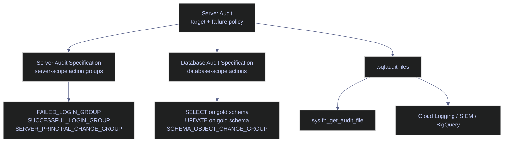

# Audit Logging

SQL Server Audit is the built-in event capture system for security-relevant activity: logins, permission changes, DDL, and optionally DML. On Linux, the practical production target is the audit file target, which writes binary `.sqlaudit` files that can be queried from T-SQL with `sys.fn_get_audit_file` and forwarded externally to a SIEM or log platform.

For production use, treat audit design as a control-plane decision, not just a logging feature. The important questions are:

- which events must be captured
- where the files live
- what SQL Server should do if the target becomes unavailable
- how quickly security staff can query and alert on the data

## Audit Architecture

SQL Server Audit is a three-layer model:

- the **Server Audit** defines the target and failure policy
- the **Server Audit Specification** defines server-scope event groups such as failed logins or login changes
- the **Database Audit Specification** defines database-scope events such as `SELECT`, `UPDATE`, or schema changes for a specific database

Only one server audit specification can attach to a given server audit, and only one database audit specification per database can attach to that same audit. That makes the initial scope definition important: a production audit should be designed around stable event categories and retention policy, not around ad hoc troubleshooting.



## Build And Verify The Audit

This section uses a disposable production-shaped example named `codex_audit_demo`. The commands are valid for real environments, but the object names are intentionally isolated so the note does not require changes to the real `stoxx` security surface.

### Linux | create the file target

Audit file targets on Linux require the directory to exist and be writable by the SQL Server service account. If the path is wrong or inaccessible, audit creation or startup fails.

#### `xp_create_subdir` | create the audit directory

This creates the audit directory from SQL Server before the audit object is defined.

*Create the Linux audit target directory that the server audit will write into.*

```sql
USE master;
GO

EXEC xp_create_subdir '/var/opt/mssql/log/audit';
GO
```

### Server Audit | target and runtime state

The server audit defines where records are written and how SQL Server reacts if the target cannot be written to. For production, `ON_FAILURE` is the single most important behavioral choice in the definition.

#### `CREATE SERVER AUDIT` | create the file-backed audit target

This is a state-changing DDL operation that creates the top-level audit object and enables it.

> [!warning]
>
> `ON_FAILURE = SHUTDOWN` is a compliance-grade setting, not a default-safe setting. If the target becomes unavailable because the volume is full, permissions changed, or the path vanished, SQL Server can halt rather than continue without auditing.

> [!success]
>
> Use `ON_FAILURE = CONTINUE` unless a formal control or regulation explicitly requires fail-closed behavior. Pair it with filesystem monitoring, retention controls, and external forwarding so a target outage is detected quickly.

> [!info]-
>
> This batch creates the audit target itself.
>
> - `TO FILE` chooses the Linux file target rather than a Windows event log target.
> - `FILEPATH` must already exist and must be writable by the SQL Server service account.
> - `MAXSIZE = 20 MB` rotates the current file after roughly 20 MB of events.
> - `MAX_ROLLOVER_FILES = 5` keeps at most five files before the oldest file is removed.
> - `QUEUE_DELAY = 1000` lets SQL Server buffer events for up to one second before flushing to disk.
> - `ALTER SERVER AUDIT ... WITH (STATE = ON)` is required because server audits are created disabled.

*Create and enable a file-backed server audit with bounded rollover and a one-second flush delay.*

```sql
USE master;
GO

CREATE SERVER AUDIT codex_audit_demo
TO FILE (
    FILEPATH = '/var/opt/mssql/log/audit/',
    MAXSIZE = 20 MB,
    MAX_ROLLOVER_FILES = 5,
    RESERVE_DISK_SPACE = OFF
)
WITH (
    QUEUE_DELAY = 1000,
    ON_FAILURE = CONTINUE
);
GO

ALTER SERVER AUDIT codex_audit_demo WITH (STATE = ON);
GO
```

#### `sys.server_file_audits` + `sys.dm_server_audit_status` | verify the audit target

This query joins the static file-target metadata to the live runtime DMV so the output shows both the configured properties and the current running state.

*Return the configured file-target properties and the live runtime state for the server audit.*

```sql
SELECT
    sf.name,
    sf.on_failure_desc,
    sf.is_state_enabled,
    sf.queue_delay,
    sf.max_file_size,
    sf.max_rollover_files,
    sf.log_file_path,
    ds.status_desc,
    ds.audit_file_path,
    ds.audit_file_size
FROM sys.server_file_audits AS sf
LEFT JOIN sys.dm_server_audit_status AS ds
    ON sf.audit_id = ds.audit_id
WHERE sf.name = 'codex_audit_demo';
```

| name | on_failure_desc | is_state_enabled | queue_delay | max_file_size | max_rollover_files | log_file_path | status_desc | audit_file_path | audit_file_size |
|---|---|---:|---:|---:|---:|---|---|---|---:|
| `codex_audit_demo` | `CONTINUE` | 1 | 1000 | 20 | 5 | `/var/opt/mssql/log/audit/` | `STARTED` | `/var/opt/mssql/log/audit/codex_audit_demo_BC44E37C-FB5B-4A03-83B0-08608A2E7178_0_134201452714120000.sqlaudit` | 421888 |

_The audit is configured and running correctly. The object is enabled, the runtime status is `STARTED`, the file path resolves to the expected Linux directory, and the current audit file has already accumulated 421,888 bytes, which confirms that real events are being written. With `ON_FAILURE = CONTINUE`, the server would keep processing workload if the audit target failed, so production monitoring must detect file-target failures explicitly._

| Column | Value | Watch | Meaning | Implication |
|---|---|---|---|---|
| `on_failure_desc` | `CONTINUE` | ✅ | SQL Server continues workload if the target fails. | Good operational default for most systems, but you must monitor for silent audit loss. |
| `on_failure_desc` | `FAIL_OPERATION` | Depends | Audited operations fail when the target fails. | Safer than `CONTINUE`, but application errors are possible under target outages. |
| `on_failure_desc` | `SHUTDOWN` | ❌ unless formally required | SQL Server shuts down if the audit target fails. | Use only when a fail-closed regulatory posture outweighs availability risk. |
| `is_state_enabled` | `1` | ✅ | The audit object is enabled. | The target can actively receive events. |
| `is_state_enabled` | `0` | ❌ | The audit object exists but is disabled. | The definition is present, but nothing is being captured. |
| `status_desc` | `STARTED` | ✅ | The audit runtime is active. | The file target is available and SQL Server is writing to it. |
| `status_desc` | `STOPPED` | ❌ | The audit is not currently running. | Investigate target errors, manual disablement, or startup failures immediately. |
| `queue_delay` | `1000` | ✅ | Events can remain buffered for up to one second. | Good compromise between durability freshness and overhead. |
| `queue_delay` | `0` | Depends | Synchronous flush behavior. | Stronger immediacy, but more latency and write overhead on busy systems. |
| `audit_file_size` | Growing non-zero value | ✅ | Events are reaching disk. | Confirms actual activity, not just a configured object. |
| `audit_file_size` | `0` or stagnant unexpectedly | ❌ | No recent events or write failure. | Cross-check audit scope, permissions, and recent workload. |

### Server Audit Specification | server-scope events

Server audit specifications attach server-level action groups such as login success, login failure, and server-principal changes. Use them for identity and control-plane activity, not object-level data access.

#### `CREATE SERVER AUDIT SPECIFICATION` | capture logins and principal changes

This creates the server-scope action-group definition for the audit.

*Attach login and server-principal event groups to the server audit.*

```sql
CREATE SERVER AUDIT SPECIFICATION codex_audit_server_spec
FOR SERVER AUDIT codex_audit_demo
ADD (FAILED_LOGIN_GROUP),
ADD (SUCCESSFUL_LOGIN_GROUP),
ADD (SERVER_PRINCIPAL_CHANGE_GROUP)
WITH (STATE = ON);
GO
```

#### `sys.server_audit_specifications` | verify the specification header

This query checks that the server audit specification exists and is enabled.

*Return the specification header row for the server-scope audit definition.*

```sql
SELECT
    name,
    is_state_enabled,
    is_session_context_enabled,
    create_date,
    modify_date
FROM sys.server_audit_specifications
WHERE name = 'codex_audit_server_spec';
```

| name | is_state_enabled | is_session_context_enabled | create_date | modify_date |
|---|---:|---:|---|---|
| `codex_audit_server_spec` | 1 | 0 | 2026-04-08 18:08:06.207 | 2026-04-08 18:08:06.207 |

_The server audit specification exists and is enabled. `is_session_context_enabled = 0` means no custom session context fields are being injected into audit events, so the event stream contains only the standard audit payload._

| Column | Value | Watch | Meaning | Implication |
|---|---|---|---|---|
| `is_state_enabled` | `1` | ✅ | The specification is enabled. | Matching server-level events will be written to the audit. |
| `is_state_enabled` | `0` | ❌ | The specification exists but is not active. | No server-scope events are captured until it is enabled. |
| `is_session_context_enabled` | `0` | ✅ | No session-context key/value payload is included. | Default and acceptable unless the design intentionally uses session context tagging. |
| `is_session_context_enabled` | `1` | Depends | Session context is written into audit rows. | Useful for application correlation, but audit payload volume increases. |

#### `sys.server_audit_specification_details` | verify the action groups

This query lists the action groups attached to the server audit specification.

*List the server-level action groups that the server audit specification captures.*

```sql
SELECT
    sad.audit_action_name,
    sad.class_desc,
    sad.audited_result,
    sad.is_group
FROM sys.server_audit_specification_details AS sad
JOIN sys.server_audit_specifications AS sas
    ON sad.server_specification_id = sas.server_specification_id
WHERE sas.name = 'codex_audit_server_spec'
ORDER BY sad.audit_action_name;
```

| audit_action_name | class_desc | audited_result | is_group |
|---|---|---|---:|
| `FAILED_LOGIN_GROUP` | `SERVER` | `SUCCESS AND FAILURE` | 1 |
| `SERVER_PRINCIPAL_CHANGE_GROUP` | `SERVER` | `SUCCESS AND FAILURE` | 1 |
| `SUCCESSFUL_LOGIN_GROUP` | `SERVER` | `SUCCESS AND FAILURE` | 1 |

_This specification is built entirely from action groups, not individual object actions. That is the correct shape for server-scope auditing. The three selected groups cover login success, login failure, and instance-level principal changes, which is a strong baseline for authentication and administrative accountability._

| Column | Value | Watch | Meaning | Implication |
|---|---|---|---|---|
| `class_desc` | `SERVER` | ✅ | The events belong to the server scope. | Correct for login and server-principal activity. |
| `class_desc` | Other values here | ❌ | Unexpected scope for this specification. | Recheck the audit design or query target. |
| `audited_result` | `SUCCESS AND FAILURE` | ✅ | Both successful and failed outcomes are written. | Best default for security review and incident reconstruction. |
| `audited_result` | `SUCCESS` | Depends | Only successful operations are captured. | Fine for some change-control cases, but failed-login visibility is lost. |
| `audited_result` | `FAILURE` | Depends | Only failed operations are captured. | Useful for narrow alerting, but incomplete for accountability. |
| `is_group` | `1` | ✅ | The entry is an action group. | Expected for server audit specifications. |
| `is_group` | `0` | ❌ | The entry is not an action group. | That would be unexpected in this server-scope design. |

### Database Audit Specification | database-scope events

Database audit specifications capture database-level actions. Use them for business-schema reads and writes that matter to security or compliance, not for broad indiscriminate full-schema auditing unless retention and volume have been planned.

#### `CREATE DATABASE AUDIT SPECIFICATION` | capture schema reads, writes, and DDL

This creates the database-scope definition for `stoxx`.

*Attach schema-level `SELECT`, `UPDATE`, and DDL events in `stoxx` to the server audit.*

```sql
USE stoxx;
GO

CREATE DATABASE AUDIT SPECIFICATION codex_audit_db_spec
FOR SERVER AUDIT codex_audit_demo
ADD (SELECT ON SCHEMA::gold BY public),
ADD (UPDATE ON SCHEMA::gold BY public),
ADD (SCHEMA_OBJECT_CHANGE_GROUP)
WITH (STATE = ON);
GO
```

#### `sys.database_audit_specifications` | verify the specification header

This query checks that the database audit specification exists and is enabled in `stoxx`.

*Return the specification header row for the database-scope audit definition.*

```sql
SELECT
    name,
    is_state_enabled,
    is_session_context_enabled,
    create_date,
    modify_date
FROM sys.database_audit_specifications
WHERE name = 'codex_audit_db_spec';
```

| name | is_state_enabled | is_session_context_enabled | create_date | modify_date |
|---|---:|---:|---|---|
| `codex_audit_db_spec` | 1 | 0 | 2026-04-08 18:08:06.257 | 2026-04-08 18:08:06.257 |

_The database audit specification is active in `stoxx`. Like the server specification, it is not enriching events with session context. The configuration is narrow and intentional: one schema for reads and writes plus one DDL action group._

| Column | Value | Watch | Meaning | Implication |
|---|---|---|---|---|
| `is_state_enabled` | `1` | ✅ | The database audit specification is active. | Matching database-scope actions will be written to the audit. |
| `is_state_enabled` | `0` | ❌ | The definition exists but is disabled. | Schema activity is not being captured. |
| `is_session_context_enabled` | `0` | ✅ | Standard audit payload only. | Good baseline when the application does not publish custom session tags. |
| `is_session_context_enabled` | `1` | Depends | Session-context values are included. | Useful for app correlation if the application populates context consistently. |

#### `sys.database_audit_specification_details` | verify the audited actions

This query lists the individual database-scope actions and groups attached to the specification.

*List the database-level actions that the database audit specification captures.*

```sql
SELECT
    dad.audit_action_name,
    dad.class_desc,
    dad.audited_result,
    dad.is_group
FROM sys.database_audit_specification_details AS dad
JOIN sys.database_audit_specifications AS das
    ON dad.database_specification_id = das.database_specification_id
WHERE das.name = 'codex_audit_db_spec'
ORDER BY dad.audit_action_name;
```

| audit_action_name | class_desc | audited_result | is_group |
|---|---|---|---:|
| `SCHEMA_OBJECT_CHANGE_GROUP` | `DATABASE` | `SUCCESS AND FAILURE` | 1 |
| `SELECT` | `SCHEMA` | `SUCCESS AND FAILURE` | 0 |
| `UPDATE` | `SCHEMA` | `SUCCESS AND FAILURE` | 0 |

_The action mix is deliberate. `SCHEMA_OBJECT_CHANGE_GROUP` captures DDL across the database, while the `SELECT` and `UPDATE` rows are object actions scoped to the `gold` schema. `is_group = 0` on `SELECT` and `UPDATE` is correct because they are direct actions, not predefined action groups._

| Column | Value | Watch | Meaning | Implication |
|---|---|---|---|---|
| `class_desc` | `DATABASE` | ✅ for `SCHEMA_OBJECT_CHANGE_GROUP` | A database-scope action group. | Good for DDL auditing across the database. |
| `class_desc` | `SCHEMA` | ✅ for `SELECT` / `UPDATE` | An action bound to a schema-scoped securable. | Good when the audit should follow schema boundaries. |
| `audited_result` | `SUCCESS AND FAILURE` | ✅ | Both successful and failed attempts are captured. | Better forensic coverage than success-only or failure-only capture. |
| `is_group` | `1` | ✅ for `SCHEMA_OBJECT_CHANGE_GROUP` | The row is an action group. | Expected for predefined grouped events. |
| `is_group` | `0` | ✅ for `SELECT` / `UPDATE` | The row is a direct action on a securable. | Expected for schema/object-level DML actions. |

## Read And Triage Audit Files

Once the audit is running, the most important operational skill is reading the file stream back into T-SQL and turning it into a security signal. `sys.fn_get_audit_file` reads one or more `.sqlaudit` files and returns one row per event.

### `sys.fn_get_audit_file` | recent security-relevant events

A raw audit stream can be noisy. This query filters to the event types that most often matter first during triage: failed logins, audited `SELECT` activity, and audit state changes.

#### `sys.fn_get_audit_file` | inspect recent failed logins and audited data access

This query reads the Linux audit files directly and returns only recent security-relevant events.

*Read recent failed-logon, audited `SELECT`, and audit-state events from the `.sqlaudit` files.*

```sql
SELECT TOP 15
    event_time,
    action_id,
    succeeded,
    server_principal_name,
    database_name,
    schema_name,
    object_name,
    LEFT(statement, 160) AS statement_prefix,
    client_ip,
    application_name
FROM sys.fn_get_audit_file('/var/opt/mssql/log/audit/*.sqlaudit', DEFAULT, DEFAULT)
WHERE action_id IN ('LGIF', 'SL  ', 'AUSC')
ORDER BY event_time DESC;
```

| event_time | action_id | succeeded | server_principal_name | database_name | schema_name | object_name | statement_prefix | client_ip | application_name |
|---|---|---:|---|---|---|---|---|---|---|
| 2026-04-08 18:08:14.4937849 | `LGIF` | 0 | `sa` |  |  |  | `Login failed for user 'sa'. Reason: Password did not match that for the login provided. [CLIENT: 172.19.0.1]` | `172.19.0.1` | `SQLCMD` |
| 2026-04-08 18:08:14.4514637 | `LGIF` | 0 | `sa` |  |  |  | `Login failed for user 'sa'. Reason: Password did not match that for the login provided. [CLIENT: 172.19.0.1]` | `172.19.0.1` | `SQLCMD` |
| 2026-04-08 18:08:14.4050870 | `LGIF` | 0 | `sa` |  |  |  | `Login failed for user 'sa'. Reason: Password did not match that for the login provided. [CLIENT: 172.19.0.1]` | `172.19.0.1` | `SQLCMD` |
| 2026-04-08 18:08:14.3586673 | `LGIF` | 0 | `sa` |  |  |  | `Login failed for user 'sa'. Reason: Password did not match that for the login provided. [CLIENT: 172.19.0.1]` | `172.19.0.1` | `SQLCMD` |
| 2026-04-08 18:08:14.3078673 | `LGIF` | 0 | `sa` |  |  |  | `Login failed for user 'sa'. Reason: Password did not match that for the login provided. [CLIENT: 172.19.0.1]` | `172.19.0.1` | `SQLCMD` |
| 2026-04-08 18:08:14.2656471 | `LGIF` | 0 | `sa` |  |  |  | `Login failed for user 'sa'. Reason: Password did not match that for the login provided. [CLIENT: 172.19.0.1]` | `172.19.0.1` | `SQLCMD` |
| 2026-04-08 18:08:14.2193101 | `LGIF` | 0 | `sa` |  |  |  | `Login failed for user 'sa'. Reason: Password did not match that for the login provided. [CLIENT: 172.19.0.1]` | `172.19.0.1` | `SQLCMD` |
| 2026-04-08 18:08:14.1770820 | `LGIF` | 0 | `sa` |  |  |  | `Login failed for user 'sa'. Reason: Password did not match that for the login provided. [CLIENT: 172.19.0.1]` | `172.19.0.1` | `SQLCMD` |
| 2026-04-08 18:08:14.1347541 | `LGIF` | 0 | `sa` |  |  |  | `Login failed for user 'sa'. Reason: Password did not match that for the login provided. [CLIENT: 172.19.0.1]` | `172.19.0.1` | `SQLCMD` |
| 2026-04-08 18:08:14.0880756 | `LGIF` | 0 | `sa` |  |  |  | `Login failed for user 'sa'. Reason: Password did not match that for the login provided. [CLIENT: 172.19.0.1]` | `172.19.0.1` | `SQLCMD` |
| 2026-04-08 18:08:14.0416924 | `LGIF` | 0 | `sa` |  |  |  | `Login failed for user 'sa'. Reason: Password did not match that for the login provided. [CLIENT: 172.19.0.1]` | `172.19.0.1` | `SQLCMD` |
| 2026-04-08 18:08:13.9910950 | `SL  ` | 1 | `sa` | `stoxx` | `gold` | `index_performance` | `SELECT TOP 1 * FROM gold.index_performance` | `172.19.0.1` | `SQLCMD` |
| 2026-04-08 18:07:51.4123871 | `AUSC` | 1 | `sa` |  |  |  |  | `172.19.0.1` | `SQLCMD` |

_The audit is capturing exactly the kinds of events the note is designed to expose. Eleven failed `sa` logins from one client IP appear as distinct `LGIF` rows, one audited `SELECT` against `gold.index_performance` appears as `SL  `, and one audit state-change event appears as `AUSC`. The important point is not just that rows exist, but that the event stream is attributable by time, principal, client IP, and application._

| Column | Value | Watch | Meaning | Implication |
|---|---|---|---|---|
| `action_id` | `LGIF` | ✅ to detect attacks | Login failed. | One of the highest-value security signals in a SQL audit stream. |
| `action_id` | `LGIS` | Depends | Login succeeded. | Useful for correlation and account-usage review, but often high-volume. |
| `action_id` | `SL  ` | Depends | Audited `SELECT`. | Valuable for sensitive-schema or compliance access review. |
| `action_id` | `AUSC` | Depends | Audit state change. | Review immediately; it reflects audit configuration or runtime changes. |
| `succeeded` | `0` | ✅ for failed-login review | The audited operation failed. | Expected for `LGIF`; repeated rows should be triaged. |
| `succeeded` | `1` | ✅ for successful access review | The audited operation succeeded. | Good for accountability, especially around sensitive reads and DDL. |
| `client_ip` | Repeated single IP | Depends | Many events came from one source. | Good for correlation, suspicious when paired with repeated failures. |
| `application_name` | Expected application | ✅ | The client identified itself consistently. | Helps separate application traffic from admin or scripted access. |
| `application_name` | Unexpected tool or blank | ❌ | The source is unusual or not tagged well. | Cross-check login, host, and statement text. |

### `sys.fn_get_audit_file` | event summary by action

This summary query collapses the raw event stream into per-action counts and time ranges.

#### `sys.fn_get_audit_file` | summarize the recent audit stream

This query groups recent audit events by `action_id` so the dominant security signals stand out immediately.

*Summarize recent audit activity by action code, count, principal spread, and time range.*

```sql
SELECT
    action_id,
    COUNT(*) AS event_count,
    COUNT(DISTINCT server_principal_name) AS distinct_principals,
    MIN(event_time) AS earliest_event,
    MAX(event_time) AS latest_event
FROM sys.fn_get_audit_file('/var/opt/mssql/log/audit/*.sqlaudit', DEFAULT, DEFAULT)
WHERE event_time > DATEADD(HOUR, -2, GETUTCDATE())
GROUP BY action_id
ORDER BY event_count DESC, action_id;
```

| action_id | event_count | distinct_principals | earliest_event | latest_event |
|---|---:|---:|---|---|
| `LGIS` | 108 | 2 | 2026-04-08 18:08:06.2576386 | 2026-04-08 18:19:06.8057742 |
| `LGIF` | 11 | 1 | 2026-04-08 18:08:14.0416924 | 2026-04-08 18:08:14.4937849 |
| `AUSC` | 1 | 1 | 2026-04-08 18:07:51.4123871 | 2026-04-08 18:07:51.4123871 |
| `SL  ` | 1 | 1 | 2026-04-08 18:08:13.9910950 | 2026-04-08 18:08:13.9910950 |

_The stream is dominated by successful logins, which is common for a login-heavy lab or automation environment, but the 11 failed-login events are still prominent and easy to isolate. `distinct_principals = 1` for `LGIF` narrows the burst to a single targeted login name rather than broad credential stuffing across many logins._

| Column | Value | Watch | Meaning | Implication |
|---|---|---|---|---|
| `event_count` | Low steady count | ✅ | The event type occurs occasionally. | Usually normal operational background. |
| `event_count` | Sudden burst | ❌ | Many events of the same type arrived quickly. | Investigate source, principal, and time clustering. |
| `distinct_principals` | `1` on `LGIF` | Depends | A single login name is being targeted. | Typical password guessing against a known privileged account. |
| `distinct_principals` | Many on `LGIF` | ❌ | Many usernames were tried. | Stronger indicator of credential stuffing or scripted enumeration. |
| `earliest_event` / `latest_event` | Tight time window | ❌ for failures | Events are clustered tightly. | Repeated failures over seconds or minutes are usually automation, not user typo. |

## Detect Failed-Login Bursts

The most operationally useful first alert from SQL Server Audit is repeated failed logins from one IP. This does not prove compromise, but it is a strong signal for brute-force activity, misconfigured secrets, or crashed credential rotation.

### `sys.fn_get_audit_file` | repeated failed logins from one client IP

This query groups failed-login rows by source IP and highlights bursts above a chosen threshold.

#### `sys.fn_get_audit_file` | detect failed-login bursts

This reads failed-login events from the audit files and flags any client IP with more than ten failures in the last two hours.

*Aggregate failed-logon audit events by client IP and isolate suspicious bursts.*

```sql
SELECT
    client_ip,
    COUNT(*) AS failed_attempts,
    MIN(event_time) AS first_attempt,
    MAX(event_time) AS last_attempt,
    DATEDIFF(SECOND, MIN(event_time), MAX(event_time)) AS attack_duration_seconds,
    COUNT(DISTINCT server_principal_name) AS distinct_logins_tried
FROM sys.fn_get_audit_file('/var/opt/mssql/log/audit/*.sqlaudit', DEFAULT, DEFAULT)
WHERE action_id = 'LGIF'
  AND event_time > DATEADD(HOUR, -2, GETUTCDATE())
GROUP BY client_ip
HAVING COUNT(*) > 10
ORDER BY failed_attempts DESC;
```

| client_ip | failed_attempts | first_attempt | last_attempt | attack_duration_seconds | distinct_logins_tried |
|---|---:|---|---|---:|---:|
| `172.19.0.1` | 11 | 2026-04-08 18:08:14.0416924 | 2026-04-08 18:08:14.4937849 | 0 | 1 |

_This is a clear burst. One client IP generated 11 failed logins against one principal in well under a second, which is consistent with scripted retry behavior or a broken secret rather than a human user making mistakes interactively._

| Column | Value | Watch | Meaning | Implication |
|---|---|---|---|---|
| `failed_attempts` | `1-3` | Depends | Small number of failures. | Often user error or one-off bad secret. |
| `failed_attempts` | `4-10` | Depends | Repeated failures. | Review if the source is privileged or frequent. |
| `failed_attempts` | `> 10` in a short window | ❌ | Burst of failures. | Treat as a security or credential-rotation incident until explained. |
| `attack_duration_seconds` | Large window | Depends | Failures are spread over time. | Could be intermittent stale credentials. |
| `attack_duration_seconds` | `0-5` seconds with many failures | ❌ | Highly compressed burst. | Stronger indicator of scripted retries or brute-force behavior. |
| `distinct_logins_tried` | `1` | Depends | One login name was targeted. | Password guessing against a known account. |
| `distinct_logins_tried` | `> 1` | ❌ | Multiple login names were tried. | More consistent with credential stuffing or account enumeration. |

## Operational Integration

### Linux | audit files on disk

Security logging is only useful if the storage path and retention behavior are observable outside SQL Server as well.

#### `ls -lh` | inspect the Linux audit directory

This confirms that the audit file exists on disk and shows its current size.

*Inspect the Linux audit directory and verify that the `.sqlaudit` file exists on disk.*

```bash
docker exec stoxx-db bash -lc "ls -lh /var/opt/mssql/log/audit || true"
```

```text
total 412K
-rw-r----- 1 mssql mssql 412K Apr  8 18:19 codex_audit_demo_BC44E37C-FB5B-4A03-83B0-08608A2E7178_0_134201452714120000.sqlaudit
```

_The audit file exists on disk, is owned by the `mssql` service account, and has grown to 412 KB. That matches the T-SQL runtime verification and confirms that the audit is not only configured inside metadata but is producing filesystem artifacts that a shipper or backup policy can act on._

### GCP | forward audit files externally

A production audit should not rely on local disk alone. Forward the Linux audit directory into a centralized logging system so investigators can search and alert on events even if the VM is later unavailable.

#### Ops Agent or log shipper | forward `.sqlaudit` files into centralized logging

On GCP, the practical pattern is:

- store the SQL Server audit locally on a dedicated path
- ship the files with an agent or collector running on the host
- retain parsed or archived copies outside the VM
- build alerts on repeated `LGIF`, audit-stop events, and server-principal changes

If the external platform cannot parse `.sqlaudit` natively, convert and summarize from SQL Server first, or ship the binary files as evidence while using `sys.fn_get_audit_file`-based jobs to produce structured alert rows.

## Recommendations

- Audit logins and server-principal changes on every production instance. Those are low-volume, high-value events.
- Audit data access selectively. Auditing every `SELECT` on every schema can create large volumes very quickly.
- Put the audit path on storage that is monitored for free space and permission drift.
- Treat `ON_FAILURE = SHUTDOWN` as a governance decision that must be explicitly justified.
- Forward audit artifacts off-host. A local-only audit is weaker against host compromise and instance loss.
- Review `LGIF`, `AUSC`, and principal-change events regularly even if no alert fired.


