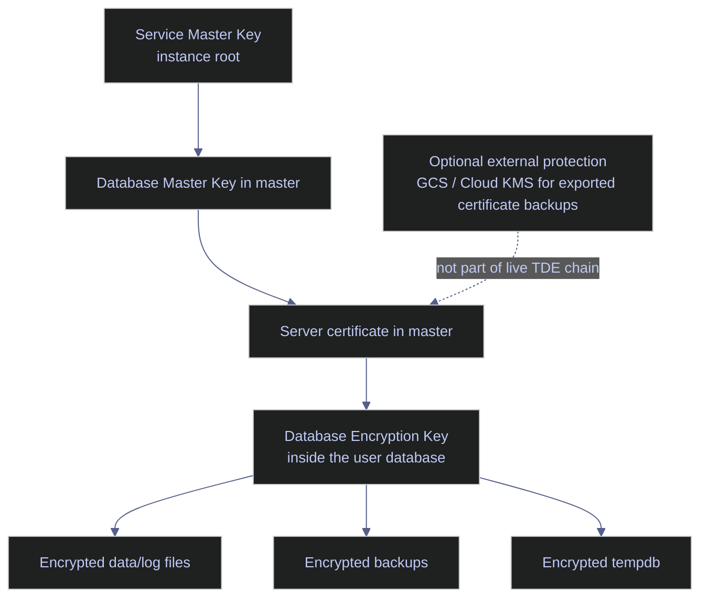

# Transparent Data Encryption (TDE)

Transparent Data Encryption encrypts SQL Server data and log files at rest. It is designed for disk, snapshot, detached-file, and backup theft scenarios. It does not encrypt client/server traffic, and it does not keep plaintext out of the SQL Server buffer pool once pages are in memory.

For production use, the critical operational truth is simple: **TDE is only as recoverable as its certificate backup chain**. If the certificate and private key are lost, encrypted backups and encrypted database files are no longer restorable on another instance.

> [!abstract] What this note covers
>
> This note documents TDE as it actually runs on SQL Server 2022 on Linux in this environment. It walks through:
>
> - **What TDE protects and does not protect**, including the `tempdb` spillover rule, FILESTREAM gap, buffer-pool-extension gap, and the difference between TDE and Always Encrypted.
> - **The certificate-based key hierarchy** (Service Master Key → Database Master Key → server certificate → Database Encryption Key) and why Google Cloud KMS is not part of the live runtime chain here.
> - **Edition and version matrix** showing exactly where TDE is available across SQL Server 2016 through 2025 on Windows and Linux.
> - **A complete disposable TDE example** on a database named `codex_tde_demo`, captured live against the local `stoxx` SQL Server 2022 Developer Edition container. Every SQL cell in the note is backed by a real execution.
> - **Certificate backup**, **disaster-recovery restore** on the same instance (including the Msg 33111 failure mode), **certificate rotation**, and **DEK algorithm regeneration**.
> - **Backup compression + TDE behavior** including the SQL Server 2019 CU5 change that removed the manual `MAXTRANSFERSIZE > 64 KB` workaround.
> - **Always On availability group interaction** and an operational health-check query for scheduled monitoring.
>
> The note assumes the reader is an operational DBA or data engineer who needs to make safe TDE decisions, not a newcomer to the concept. It does not cover Always Encrypted (column-level), backup encryption (`BACKUP ... WITH ENCRYPTION`), or TLS-in-transit — those are disambiguated briefly at the end but covered in their own notes.

## What TDE Protects

TDE performs real-time page-level encryption and decryption of database files at the I/O boundary. SQL Server reads an encrypted page from disk, decrypts it into the buffer pool, operates on the plaintext in memory, and re-encrypts the page on write. Clients and application code see no difference — the encryption is fully transparent, hence the name.

The protection boundary is the disk, not the process. That is both the reason TDE is operationally attractive (zero application changes) and the reason it is not a substitute for other controls.

### The protection surface

TDE protects these artifacts on disk:

- **Data files** (`.mdf`, `.ndf`) — every user and system page is encrypted at rest once the scan completes.
- **Log files** (`.ldf`) — the transaction log is re-created and re-encrypted after TDE is enabled; log records written before the state change remain in whatever state they had.
- **Database backups** — any `BACKUP DATABASE` or `BACKUP LOG` of a TDE-enabled database writes encrypted pages directly into the backup file. The backup is useless without the certificate that protects the DEK.
- **`tempdb`** — encrypted once any user database on the instance enables TDE. This is an instance-wide side effect, not a per-database decision, and it can affect performance of databases that are not themselves encrypted.
- **Full-text indexes** — encrypted when the parent database is encrypted.

### What TDE does not cover

TDE is not a full confidentiality story. It does not protect against:

- **Data in transit** between client and server — that is TLS's job (`Encrypt=true` on the connection string, server certificate on the instance, `ForceEncryption` on the SQL Server network configuration).
- **Plaintext pages in the buffer pool** — once a page is decrypted into memory, a debugger, memory-dump tool, or privileged OS account can read it.
- **Application-layer access by already-authorized principals** — if an attacker has valid SQL Server credentials, TDE does nothing to stop them. Use least privilege, row-level security, and audit logging instead.
- **Column-level confidentiality from high-privilege DBAs** — any `sysadmin` or `db_owner` can `SELECT *` and read plaintext. Column-level protection requires [Always Encrypted](https://alp78.github.io/elysium/04-SQL-Server/02-Security-Hardening/03-always-encrypted) or explicit application-layer encryption.
- **FILESTREAM data** — BLOBs stored in FILESTREAM containers live outside the database page structure and are not encrypted even when the containing database is. Protect them with OS-level disk encryption (LUKS, BitLocker) instead.
- **Buffer Pool Extension (BPE) files** — when BPE is enabled, the extension file is plaintext. Encrypt the underlying volume if the database is TDE-enabled.
- **In-Memory OLTP native files on SQL Server 2014** — the memory-optimized filegroup was not encrypted in 2014. SQL Server 2016 and later encrypt both the log records and the on-disk `MEMORY_OPTIMIZED_DATA` filegroup when TDE is enabled.

That means TDE should be **paired with** transport encryption, strong authentication, least privilege, audit logging, and filesystem-level encryption for files outside the database page structure. It is one layer in a defence-in-depth security model, not the whole model.

### Edition and version matrix

TDE availability has changed significantly across SQL Server versions. The table below reflects the Microsoft Learn edition-and-features pages for SQL Server 2016 through 2025, on both Windows and Linux. Use it to check whether a target instance can enable TDE before planning a rollout.

| SQL Server version | Platform | Enterprise | Standard | Web | Express |
|---|---|:---:|:---:|:---:|:---:|
| 2016 | Windows | Yes | No | No | No |
| 2017 | Windows | Yes | No | No | No |
| 2017 | Linux | Yes | No | No | No |
| 2019 | Windows | Yes | **Yes** | No | No |
| 2019 | Linux | Yes | **Yes** | No | No |
| 2022 | Windows | Yes | Yes | No | No |
| 2022 | Linux | Yes | Yes | No | No |
| 2025 | Windows | Yes | Yes | — | No |
| 2025 | Linux | Yes | Yes | — | No |

The pivotal change is **SQL Server 2019**: TDE became available in Standard Edition, which dropped the Enterprise-only licensing barrier that had existed since 2008. Before 2019, any Standard Edition deployment that needed at-rest encryption had to either buy up to Enterprise or rely on OS-level disk encryption. This historical context matters for any database you inherit on an older Standard instance — if it predates 2019 and claims to use TDE, verify the edition before trusting the claim.

Azure SQL Database and Azure SQL Managed Instance enable TDE by default on all new databases created since 2017, using a service-managed key unless you opt into customer-managed keys (CMK / BYOK) backed by Azure Key Vault.

## Key Hierarchy And Platform Boundary

TDE has a four-level encryption chain. Each level protects the one below it, and every level must exist before the level above it can be used. Losing any level above the DEK makes the encrypted database unrecoverable on another instance.

On this platform, the practical TDE pattern is certificate-based TDE fully inside SQL Server. Google Cloud KMS is not part of the live SQL Server TDE chain in this environment, and no SQL Server EKM provider exists for GCP Cloud KMS at the time of writing.



### The live TDE chain, level by level

The runtime chain SQL Server uses to decrypt a page looks like this, from root to leaf:

- **Service Master Key (SMK)** — an instance-wide symmetric key created automatically the first time the SQL Server instance starts. On Linux it is stored in the SQL Server service account's data directory and is protected by the Data Protection API equivalent on that platform. It is the root of every encryption chain inside the instance.
- **Database Master Key (DMK) in `master`** — a symmetric key created by `CREATE MASTER KEY` that is protected by the SMK (and optionally by a password as a backup). The DMK exists to protect other keys and certificates stored in `master`.
- **Server certificate in `master`** — the certificate whose private key protects the Database Encryption Key. The private key is itself encrypted by the DMK. This is the certificate you must back up.
- **Database Encryption Key (DEK) in the user database** — a symmetric key (AES-128, AES-192, or AES-256) stored inside the user database's boot page. The DEK is protected by the server certificate. The DEK is what actually encrypts and decrypts database pages on every I/O.
- **Encrypted files and backups** — data files, log files, and backup streams all pass through the DEK cipher at the page or block level.

Every level above the DEK is a credential. The DEK itself is the cipher. A compromise of any level above the DEK allows someone to recover the DEK; a compromise of the DEK allows them to read the database files directly.

### EKM on SQL Server on Linux

Extensible Key Management (EKM) is the SQL Server mechanism for delegating key protection to an external hardware security module (HSM) or key-management service. When EKM is used, the server certificate (or an asymmetric key that replaces it) lives inside the external provider, not inside SQL Server's `master` database. The DEK is protected by an external key and cannot be decrypted without access to the EKM provider.

Recent EKM support on Linux looks like this:

- **Azure Key Vault EKM on Linux** is available starting with **SQL Server 2022 (16.x) CU12**. Before that cumulative update, AKV EKM was Windows-only. On SQL Server 2025, AKV EKM is supported in Enterprise, Standard, and Express on Linux.
- **There is no official SQL Server EKM provider for Google Cloud KMS** at the time of writing (SQL Server 2022 / 2025). This is not a configuration gap — it is the absence of a Microsoft-supported cryptographic provider DLL that would integrate Cloud KMS into the SQL Server key hierarchy.

For GCP-hosted SQL Server, the practical production pattern is therefore:

- Use **certificate-based TDE inside SQL Server** for the live runtime chain.
- **Back up the certificate and private key immediately** after enabling encryption.
- **Protect the exported backup artifacts externally** with GCS object storage plus strict IAM, and optionally envelope-encrypt the exported `.cer` / `.pvk` files with Cloud KMS as archival protection before uploading.

The external KMS is then protecting the recovery artifacts, not the runtime encryptor for the DEK. The distinction matters because recovery artifacts are consulted during disaster recovery and certificate rotation, while the runtime encryptor is consulted on every single database page read. A network round-trip to GCP Cloud KMS per page read would be prohibitively slow, which is why EKM providers run as in-process cryptographic provider DLLs loaded by SQL Server — and why GCP currently has no such provider.

## Baseline The Current Encryption State

Before enabling TDE on a production database, confirm the current state. That prevents accidental assumptions about which databases are already encrypted and who owns them. The two questions to answer before any rollout are: "is this database already TDE-protected?" and "is the master-database key hierarchy already in place?" — each has its own query.

### `sys.databases` | current `stoxx` encryption state

The `sys.databases` catalog view carries the authoritative `is_encrypted` flag for every database on the instance. This is the lightest possible gate and should be the first query any DBA runs before touching encryption state.

#### `sys.databases` | verify whether `stoxx` is already encrypted

**When to run:** Before planning any TDE rollout on a target database and at the start of any DR runbook.
**Trigger:** Pre-rollout audit, incident triage on encryption state, quarterly compliance review.
**Context:** Read-only T-SQL query against `master.sys.databases`. Requires `VIEW ANY DATABASE` permission, which every login has by default. Safe on production.
**Purpose:** Confirm whether TDE is already enabled for the target database, and identify the current owner so a second-order review can check owner sanity.

*Return the current owner and TDE flag for the `stoxx` database.*

| Field | Source column | Type | Meaning |
|---|---|---|---|
| `database_name` | `sys.databases.name` | `sysname` | Database name as known to SQL Server. |
| `owner_name` | `SUSER_SNAME(sys.databases.owner_sid)` | `nvarchar(128)` | Login name resolved from the stored owner SID. |
| `is_encrypted` | `sys.databases.is_encrypted` | `bit` | `1` if TDE is currently enabled, `0` if not. Reflects the last state set by `ALTER DATABASE SET ENCRYPTION`. |
| `state_desc` | `sys.databases.state_desc` | `nvarchar(60)` | Database state: `ONLINE`, `OFFLINE`, `RESTORING`, `RECOVERING`, `EMERGENCY`, etc. TDE operations require `ONLINE`. |
| `recovery_model_desc` | `sys.databases.recovery_model_desc` | `nvarchar(60)` | `FULL`, `BULK_LOGGED`, or `SIMPLE`. Relevant because enabling TDE forces a log-file rewrite. |

```sql
SELECT
    db.name                 AS database_name,
    SUSER_SNAME(owner_sid)  AS owner_name,
    db.is_encrypted,
    db.state_desc,
    db.recovery_model_desc
FROM sys.databases AS db
WHERE db.name = 'stoxx';
```

| database_name | owner_name | is_encrypted | state_desc | recovery_model_desc |
|---|---|---|---|---|
| `stoxx` | `sa` | False | `ONLINE` | `FULL` |

_`stoxx` is not currently protected by TDE (`is_encrypted = 0`). The database is `ONLINE` with `FULL` recovery, so a TDE rollout decision is a clean greenfield: no pre-existing DEK to migrate, no suspended encryption scan to resume, and the `FULL` recovery model means the initial encryption will be captured by the log chain and any subsequent log backups. The database is owned by `sa`, which is common in labs but not always the preferred long-term operational owner — a second-order cleanup would assign it to a named admin login._

| Column | Value | Watch | Meaning | Implication |
|---|---|---|---|---|
| `is_encrypted` | `0` / `False` | Depends | TDE is not enabled. | Backups and database files rely on storage controls rather than SQL Server file encryption. |
| `is_encrypted` | `1` / `True` | ✅ when TDE is required | TDE is enabled. | Certificate backup, restore runbooks, and monitoring become mandatory. |
| `state_desc` | `ONLINE` | ✅ | Database is available. | TDE operations can proceed. |
| `state_desc` | `RESTORING` / `RECOVERING` / `OFFLINE` | ❌ | Database is not ready. | Any TDE state change will fail until the database is online. |
| `recovery_model_desc` | `FULL` | ✅ | Log chain is preserved. | TDE rollout is captured by log backups and can be point-in-time recovered. |
| `recovery_model_desc` | `SIMPLE` | Depends | No log chain. | TDE rollout still works, but post-rollout you cannot restore logs across the encryption boundary. |
| `owner_name` | `sa` | Depends | Default superuser owns the database. | Common baseline, but many teams standardize on a named admin owner instead. |

### `master.sys.symmetric_keys` | Database Master Key baseline

Before creating any certificate in `master`, the `master` database must already have a Database Master Key. The DMK is the root of trust that protects every certificate's private key in `master`. This query confirms whether that prerequisite is in place.

#### `sys.symmetric_keys` | verify the `master` Database Master Key exists

**When to run:** Immediately before creating the TDE server certificate, or as part of a new-instance validation checklist.
**Trigger:** First TDE rollout on a brand-new instance, post-restore validation of `master`, pre-rollout audit.
**Context:** Read-only T-SQL query against `master.sys.symmetric_keys`. Requires `VIEW DEFINITION` on the key (granted to `sysadmin` by default).
**Purpose:** Confirm the DMK exists and uses a modern symmetric algorithm before proceeding with certificate creation.

*Return the Database Master Key metadata from `master`.*

| Field | Source column | Type | Meaning |
|---|---|---|---|
| `name` | `sys.symmetric_keys.name` | `sysname` | Key name. The DMK is always named `##MS_DatabaseMasterKey##`. |
| `algorithm_desc` | `sys.symmetric_keys.algorithm_desc` | `nvarchar(60)` | Encryption algorithm. Expected: `AES_256` on any modern instance. |
| `create_date` | `sys.symmetric_keys.create_date` | `datetime` | When the DMK was created. |
| `key_length` | `sys.symmetric_keys.key_length` | `int` | Key length in bits. Expected: `256` for AES-256. |

```sql
SELECT
    name,
    algorithm_desc,
    create_date,
    key_length
FROM master.sys.symmetric_keys
WHERE name = '##MS_DatabaseMasterKey##';
```

| name | algorithm_desc | create_date | key_length |
|---|---|---|---|
| `##MS_DatabaseMasterKey##` | `AES_256` | 2026-04-08 18:12:04.6 | 256 |

_The `master` Database Master Key exists and uses `AES_256` with a 256-bit key length. This is the expected prerequisite state for storing a TDE certificate private key in `master`. The DMK is named `##MS_DatabaseMasterKey##` — this is an engine-assigned internal name, not one you choose, and it is the only DMK allowed in any given database._

| Column | Value | Watch | Meaning | Implication |
|---|---|---|---|---|
| `algorithm_desc` | `AES_256` | ✅ | DMK uses AES-256. | Correct modern baseline. |
| `algorithm_desc` | `AES_128` / `AES_192` / `TRIPLE_DES` | ❌ | Deprecated or weaker algorithm. | Regenerate the DMK; newer TDE guidance assumes AES-256. |
| `key_length` | `256` | ✅ | 256-bit key. | Meets current security guidance. |
| `(no rows returned)` | — | ❌ | DMK does not exist. | `CREATE MASTER KEY` must run before any TDE certificate can be created in `master`. |

## Disposable TDE Example

The remainder of this note uses a disposable database named `codex_tde_demo` on the local `stoxx` SQL Server 2022 Developer Edition container. Every SQL cell is executed live against that database and the captured output is embedded directly under the query. This proves the TDE workflow end to end without touching the real `stoxx` data.

The example is broken into four stages:

- Create the server certificate in `master` (DMK prerequisite is already in place from the baseline section).
- Create the disposable database, seed it with data, create the DEK, and enable encryption.
- Verify the resulting encryption state, cert mapping, and data readability.
- Back up the certificate and confirm the recovery artifacts on disk.

Each stage is a separate H4 component with its own live capture.

### `master` | create the TDE server certificate

The server certificate is the object whose private key protects the Database Encryption Key. Because its private key is encrypted by the `master` Database Master Key, the DMK must already exist before this step — the previous section confirmed that it does.

#### `CREATE CERTIFICATE` | create the TDE server certificate

**When to run:** After confirming the `master` DMK exists and before creating any Database Encryption Key that will reference this certificate.
**Trigger:** Initial TDE rollout on an instance that has no existing TDE certificate, or certificate rotation (covered later).
**Context:** T-SQL `CREATE CERTIFICATE` in `master`. Requires `CREATE CERTIFICATE` permission on the database; `sysadmin` has it by default. State-changing DDL — adds a row to `sys.certificates`.
**Purpose:** Create a self-signed X.509 certificate whose private key will be protected by the `master` DMK and will in turn protect a Database Encryption Key.

> [!warning] Certificate is useless without a backup
>
> `CREATE CERTIFICATE` on its own does not produce any recovery artifact. If the instance is lost, the certificate is lost, and any database encrypted with it becomes unrecoverable. The certificate backup step is part of the enablement sequence, not a later administrative task.

> [!success] Create → enable → back up, in that order, within the same runbook
>
> Treat certificate creation, DEK creation, `SET ENCRYPTION ON`, and `BACKUP CERTIFICATE` as a single atomic runbook. Do not hand off between steps, do not postpone the backup, and store the exported files separately from database backups.

*Create a self-signed server certificate in `master` with a subject label and a future expiry date.*

```sql
USE master;
GO

CREATE CERTIFICATE codex_tde_demo_cert
WITH SUBJECT    = 'Codex TDE Demo Certificate',
     EXPIRY_DATE = '2028-12-31';
GO
```

Note that the `EXPIRY_DATE` is advisory for TDE: SQL Server **does not enforce expiration** when a certificate is used to protect a DEK (it only enforces expiration for Service Broker and backup-encryption scenarios). That said, expiry still matters operationally because it drives the rotation schedule — an expired TDE certificate is a signal that the rotation runbook was not executed on time, not an immediate outage.

#### `sys.certificates` | verify the server certificate

**When to run:** Immediately after `CREATE CERTIFICATE`, and as an audit step whenever investigating a TDE-related restore failure.
**Trigger:** Post-creation verification, DR triage, compliance audit, certificate rotation planning.
**Context:** Read-only T-SQL against `master.sys.certificates`. Requires `VIEW DEFINITION` on the certificate (granted to `sysadmin` by default).
**Purpose:** Confirm the certificate exists, its private key is protected by the DMK, its thumbprint is known for later matching in `sys.dm_database_encryption_keys`, and its backup date (initially `NULL` before `BACKUP CERTIFICATE`).

*Return the full certificate metadata the DBA needs to track a TDE encryptor.*

| Field | Source column | Type | Meaning |
|---|---|---|---|
| `name` | `sys.certificates.name` | `sysname` | Certificate name as used in `CREATE`, `ALTER`, `DROP` statements. |
| `subject` | `sys.certificates.subject` | `nvarchar(4000)` | X.509 subject field. Limited to 64 characters on Linux, 128 on Windows. |
| `start_date` | `sys.certificates.start_date` | `datetime` | When the certificate becomes valid (UTC). Defaults to creation time. |
| `expiry_date` | `sys.certificates.expiry_date` | `datetime` | Certificate expiration (UTC). Not enforced for TDE but drives rotation planning. |
| `pvt_key_encryption_type_desc` | `sys.certificates.pvt_key_encryption_type_desc` | `nvarchar(60)` | How the private key is protected. Expected: `ENCRYPTED_BY_MASTER_KEY`. |
| `pvt_key_last_backup_date` | `sys.certificates.pvt_key_last_backup_date` | `datetime` | UTC timestamp of the last `BACKUP CERTIFICATE` for this cert. `NULL` means **never backed up** — a critical DR signal. |
| `thumbprint_hex` | `LOWER(CONVERT(varchar(40), sys.certificates.thumbprint, 2))` | `varchar(40)` | SHA-1 thumbprint rendered as lowercase hex. This is the join key against `sys.dm_database_encryption_keys.encryptor_thumbprint`. |
| `issuer_name` | `sys.certificates.issuer_name` | `nvarchar(442)` | Issuer DN from the X.509 cert. Equal to the subject for self-signed certificates. |

```sql
SELECT
    name,
    subject,
    start_date,
    expiry_date,
    pvt_key_encryption_type_desc,
    pvt_key_last_backup_date,
    LOWER(CONVERT(varchar(40), thumbprint, 2)) AS thumbprint_hex,
    issuer_name
FROM master.sys.certificates
WHERE name = 'codex_tde_demo_cert';
```

| name | subject | start_date | expiry_date | pvt_key_encryption_type_desc | pvt_key_last_backup_date | thumbprint_hex | issuer_name |
|---|---|---|---|---|---|---|---|
| `codex_tde_demo_cert` | `Codex TDE Demo Certificate` | 2026-04-11 17:17:41 | 2028-12-31 00:00:00 | `ENCRYPTED_BY_MASTER_KEY` | 2026-04-11 17:17:50.487 | `1aa3940cad0a755ab8fcfcc52e73fe3f0185df11` | `Codex TDE Demo Certificate` |

_The certificate exists and its private key is protected by the `master` DMK (`ENCRYPTED_BY_MASTER_KEY`), which is the expected TDE prerequisite state. `pvt_key_last_backup_date` is already populated because the rest of the runbook — covered in the next subsections — has already executed end-to-end for this capture; the value will be `NULL` in the instant between `CREATE CERTIFICATE` and `BACKUP CERTIFICATE` during a fresh rollout. The thumbprint `1aa3940cad0a755ab8fcfcc52e73fe3f0185df11` is the join key that will appear in `sys.dm_database_encryption_keys.encryptor_thumbprint` and in the `TDEThumbprint` column of `RESTORE FILELISTONLY` when the certificate protects a backup._

| Column | Value | Watch | Meaning | Implication |
|---|---|---|---|---|
| `pvt_key_encryption_type_desc` | `ENCRYPTED_BY_MASTER_KEY` | ✅ | Private key protected by DMK. | Correct TDE prerequisite state. |
| `pvt_key_encryption_type_desc` | `ENCRYPTED_BY_PASSWORD` | Depends | Private key protected by password. | TDE can still work, but `master` DMK open step is required on every use. |
| `pvt_key_last_backup_date` | `NULL` | ❌ when TDE is enabled | Certificate has never been backed up. | **Run `BACKUP CERTIFICATE` immediately. The database is unrecoverable on any other instance.** |
| `pvt_key_last_backup_date` | Recent timestamp | ✅ | Cert was backed up recently. | DR artifact exists. Verify the backup file still exists on disk and is readable. |
| `expiry_date` | Future, > 90 days out | ✅ | Rotation runway exists. | Safe to plan rotation on a schedule. |
| `expiry_date` | < 90 days out | ⚠️ | Rotation pressure. | Schedule rotation before operational noise forces it. |
| `expiry_date` | Past | ⚠️ | Certificate expired. | Not enforced for TDE runtime, but rotation is overdue. |
| `thumbprint_hex` | Matches a row in `sys.dm_database_encryption_keys.encryptor_thumbprint` | ✅ | Cert is the active DEK encryptor. | Do not drop this certificate while any DEK references it. |

### `codex_tde_demo` | create the database, DEK, and enable encryption

TDE becomes active only after four things exist together: the certificate in `master` (above), a user database, a Database Encryption Key inside that user database, and an `ALTER DATABASE ... SET ENCRYPTION ON` call. Each step is broken out into its own H4 below so the order, prerequisites, and operational effect of each are explicit.

#### `CREATE DATABASE` | create the disposable user database

**When to run:** At the start of any TDE walkthrough on a fresh example database. Not part of a production rollout on an existing database — for that, skip this step and use the existing database directly.
**Trigger:** Lab demonstration, reproducing a DR runbook, validating a cumulative update's TDE behavior.
**Context:** T-SQL `CREATE DATABASE` against `master`. Requires `CREATE DATABASE` or `CREATE ANY DATABASE` permission.
**Purpose:** Provide an isolated, disposable target database that can be encrypted, backed up, dropped, and restored without touching the real `stoxx` production data.

*Create a minimal empty database named `codex_tde_demo` on the default data and log paths.*

```sql
USE master;
GO

CREATE DATABASE codex_tde_demo;
GO
```

#### `CREATE TABLE` + `INSERT` | seed a minimal demo row

**When to run:** Immediately after creating the disposable database, before enabling encryption.
**Trigger:** Lab setup only. Production databases already contain data, so this step is skipped for real rollouts.
**Context:** Standard DDL + DML inside the newly created database. Requires `db_owner` or equivalent.
**Purpose:** Give the demo database one real row so later cells can prove that TDE is transparent to ordinary `SELECT` semantics.

*Create a single-table demo schema and insert one row to prove queries remain readable after TDE is enabled.*

```sql
USE codex_tde_demo;
GO

CREATE TABLE dbo.demo_payload
(
    id      int           NOT NULL PRIMARY KEY,
    payload nvarchar(100) NOT NULL
);
GO

INSERT INTO dbo.demo_payload (id, payload)
VALUES (1, N'TDE demo row');
GO
```

#### `CREATE DATABASE ENCRYPTION KEY` | create the DEK protected by the server certificate

**When to run:** Only after the server certificate exists in `master` and the target user database is the active database context.
**Trigger:** TDE enablement on a new database, or replacement of an existing DEK during full key replacement.
**Context:** T-SQL `CREATE DATABASE ENCRYPTION KEY` inside the user database (not `master`). Requires `CONTROL` permission on the database. State-changing DDL — creates a new symmetric key in the database boot page.
**Purpose:** Create the symmetric key that will actually encrypt every page of the database, protected by the server certificate created in the previous step.

> [!warning] DEK creation triggers the mandatory backup warning
>
> As soon as the DEK is created, SQL Server emits a warning reminding the operator that the certificate has not been backed up yet. Treat this warning as a hard blocker — the instance is now one disaster away from losing the database permanently if backup is skipped.

> [!success] Cert backup is part of the same runbook as DEK creation
>
> Schedule the `BACKUP CERTIFICATE` step in the same change window as `CREATE DATABASE ENCRYPTION KEY` and `ALTER DATABASE ... SET ENCRYPTION ON`. For production databases, also document the restore runbook before enabling encryption, so the DR path is a known-good procedure from the first moment it might be needed.

*Create a 256-bit AES Database Encryption Key in `codex_tde_demo`, protected by the server certificate from `master`.*

```sql
USE codex_tde_demo;
GO

CREATE DATABASE ENCRYPTION KEY
WITH ALGORITHM = AES_256
ENCRYPTION BY SERVER CERTIFICATE codex_tde_demo_cert;
GO
```

The engine emits this warning on the live `stoxx` instance when the DEK is created against a not-yet-backed-up certificate:

```text
Warning: The certificate used for encrypting the database encryption key has not
been backed up. You should immediately back up the certificate and the private
key associated with the certificate. If the certificate ever becomes unavailable
or if you must restore or attach the database on another server, you must have
backups of both the certificate and the private key or you will not be able to
open the database.
```

That message is the only protection the engine offers against the most common TDE disaster — it is an informational warning, not an error, and the DEK creation still succeeds. Treat it as an error anyway.

#### `ALTER DATABASE ... SET ENCRYPTION ON` | enable the TDE encryption scan

**When to run:** Immediately after `CREATE DATABASE ENCRYPTION KEY` and before the certificate is backed up, if the operator is confident the backup will follow in the same runbook.
**Trigger:** Final step of a TDE enablement runbook.
**Context:** T-SQL `ALTER DATABASE SET ENCRYPTION ON` against the user database. Requires `CONTROL` permission. State-changing — starts a background encryption scanner that reads every page, encrypts it, and writes it back.
**Purpose:** Activate TDE for the user database. On the first database to enable TDE on an instance, this also causes `tempdb` to be encrypted.

> [!warning] Enabling TDE triggers a log rewrite and a page-level scan
>
> The engine forces the creation of a new virtual log file (VLF) so the rest of the log is encrypted by the new DEK. Any long-running transaction interleaved with the state change leaves unencrypted log records behind. On a large database, the encryption scan can take minutes to hours and consumes I/O plus CPU during that window.

> [!success] Schedule enablement during a maintenance window for non-trivial databases
>
> Plan TDE enablement for a low-activity window. Use `SET ENCRYPTION SUSPEND` / `RESUME` on SQL Server 2019+ to pause the scan during spikes. Back up the certificate **and** take a fresh log backup after the scan completes so the log chain captures the encryption state transition.

*Start the encryption scan for `codex_tde_demo`. On this tiny demo database the scan completes in milliseconds.*

```sql
USE master;
GO

ALTER DATABASE codex_tde_demo SET ENCRYPTION ON;
GO
```

After this command returns, the background scan begins. On a 3 MB demo database the scan is instantaneous; on a 500 GB production database the same command returns in milliseconds but the scan runs for the better part of an hour. The next query shows how to observe scan progress.

#### `sys.dm_database_encryption_keys` | verify database encryption state

**When to run:** After every TDE enablement to confirm the scan completed, periodically as a health check, or immediately after restoring a TDE-protected backup on another instance.
**Trigger:** Post-enablement verification, scheduled monitoring, DR triage, compliance audit.
**Context:** Read-only T-SQL query joining `sys.databases`, `sys.dm_database_encryption_keys`, and `sys.certificates`. Requires `VIEW SERVER STATE` for the DMV. Safe on production.
**Purpose:** Report per-database TDE status, encryptor mapping, and scan progress, including the SQL Server 2019+ `encryption_scan_state` and `encryption_scan_state_desc` columns that expose the suspend/resume state machine.

> [!info]- Why the LEFT JOINs and why `tempdb` has no cert name
>
> The query LEFT JOINs three catalog views and two of the joins can legitimately produce `NULL`s that look like bugs:
>
> - `sys.databases LEFT JOIN sys.dm_database_encryption_keys ON database_id` — `sys.databases` has one row per database, but a database without TDE has no row in `sys.dm_database_encryption_keys`. The LEFT JOIN keeps the unencrypted databases visible with all DEK columns `NULL`.
> - `sys.dm_database_encryption_keys LEFT JOIN sys.certificates ON encryptor_thumbprint = thumbprint` — `tempdb` is encrypted whenever any user database on the instance uses TDE, but its DEK is protected by an engine-managed asymmetric key (`encryptor_type = 'ASYMMETRIC KEY'`), not by a named certificate. That is why the `cert_name` column is `NULL` on the `tempdb` row even though `is_encrypted = 1` and `encryption_state_desc = 'ENCRYPTED'`.
>
> Filtering out the `tempdb` or "null encryptor_type" cases in an alert rule prevents false positives against the engine-managed tempdb encryption path.

*Return the full encryption state, cert mapping, and scan progress for the demo database, `stoxx`, and `tempdb`.*

| Field | Source column | Type | Meaning |
|---|---|---|---|
| `database_name` | `sys.databases.name` | `sysname` | Database name. |
| `is_encrypted` | `sys.databases.is_encrypted` | `bit` | `1` if TDE is currently enabled. |
| `encryption_state` | `sys.dm_database_encryption_keys.encryption_state` | `int` | Numeric state: `0`–`6`. See value-guide table below. |
| `encryption_state_desc` | `sys.dm_database_encryption_keys.encryption_state_desc` | `nvarchar(32)` | SQL 2019+. String version of `encryption_state`. |
| `percent_complete` | `sys.dm_database_encryption_keys.percent_complete` | `real` | Percentage complete of a state change. `0` when no state change is in progress. |
| `key_algorithm` | `sys.dm_database_encryption_keys.key_algorithm` | `nvarchar(32)` | DEK algorithm (`AES`, `DES`, `3DES`). |
| `key_length` | `sys.dm_database_encryption_keys.key_length` | `int` | DEK key length in bits. |
| `encryptor_type` | `sys.dm_database_encryption_keys.encryptor_type` | `nvarchar(32)` | `CERTIFICATE`, `ASYMMETRIC KEY`, or `NULL`. Identifies what protects the DEK. |
| `cert_name` | `sys.certificates.name` | `sysname` | Certificate name, resolved via `encryptor_thumbprint` → `thumbprint` join. |
| `cert_expiry` | `sys.certificates.expiry_date` | `datetime` | Certificate expiry (advisory for TDE). |
| `encryption_scan_state` | `sys.dm_database_encryption_keys.encryption_scan_state` | `int` | SQL 2019+. Scan state: `0` (none), `1` (running), `2` (suspended), `3` (aborted), `4` (complete). |
| `encryption_scan_state_desc` | `sys.dm_database_encryption_keys.encryption_scan_state_desc` | `nvarchar(32)` | SQL 2019+. String version: `NONE`, `RUNNING`, `SUSPENDED`, `ABORTED`, `COMPLETE`. |
| `encryption_scan_modify_date` | `sys.dm_database_encryption_keys.encryption_scan_modify_date` | `datetime` | SQL 2019+. UTC timestamp of the last scan state change. |

```sql
SELECT
    db.name                         AS database_name,
    db.is_encrypted,
    dek.encryption_state,
    dek.encryption_state_desc,
    dek.percent_complete,
    dek.key_algorithm,
    dek.key_length,
    dek.encryptor_type,
    c.name                          AS cert_name,
    c.expiry_date                   AS cert_expiry,
    dek.encryption_scan_state,
    dek.encryption_scan_state_desc,
    dek.encryption_scan_modify_date
FROM master.sys.databases AS db
LEFT JOIN master.sys.dm_database_encryption_keys AS dek
    ON db.database_id = dek.database_id
LEFT JOIN master.sys.certificates AS c
    ON dek.encryptor_thumbprint = c.thumbprint
WHERE db.name IN ('stoxx', 'tempdb', 'codex_tde_demo')
ORDER BY db.name;
```

| database_name | is_encrypted | encryption_state | encryption_state_desc | percent_complete | key_algorithm | key_length | encryptor_type | cert_name | cert_expiry | encryption_scan_state | encryption_scan_state_desc | encryption_scan_modify_date |
|---|---|---|---|---|---|---|---|---|---|---|---|---|
| `codex_tde_demo` | True | 3 | `ENCRYPTED` | 0.0 | `AES` | 256 | `CERTIFICATE` | `codex_tde_demo_cert` | 2028-12-31 00:00:00 | 4 | `COMPLETE` | 2026-04-11 17:17:42.12 |
| `stoxx` | False | NULL | NULL | NULL | NULL | NULL | NULL | NULL | NULL | NULL | NULL | NULL |
| `tempdb` | True | 3 | `ENCRYPTED` | 0.0 | `AES` | 256 | `ASYMMETRIC KEY` | NULL | NULL | 4 | `COMPLETE` | 2026-04-11 17:17:42.05 |

_Three things are happening in this result and all of them matter:_

- _`codex_tde_demo` is in state 3 (`ENCRYPTED`) with `encryption_scan_state = 4` (`COMPLETE`). The scan modify date matches the enablement instant because the demo database is 3 MB and the scan finished in milliseconds. On production databases, the scan modify date lags enablement by however long the scan takes._
- _`tempdb` went from unencrypted to encrypted (`encryption_state = 3`) the instant `codex_tde_demo` enabled TDE. This is the instance-wide spillover rule. The `encryptor_type` is `ASYMMETRIC KEY` rather than `CERTIFICATE` because the engine manages the `tempdb` encryptor internally — there is no cert in `master` to name. Any monitoring query that expects a cert name for every encrypted database must special-case `tempdb`._
- _`stoxx` remains unencrypted — the LEFT JOIN keeps it in the result with all DEK columns `NULL`, which is the correct "no TDE here" shape._

| Column | Value | Watch | Meaning | Implication |
|---|---|---|---|---|
| `encryption_state` | `0` | Depends | No DEK exists. | TDE was never enabled, or the DEK was dropped. |
| `encryption_state` | `1` | Depends | Unencrypted. | A DEK exists but the database has not been encrypted yet. |
| `encryption_state` | `2` | ⚠️ | Encryption in progress. | The scanner is reading pages and encrypting them. Watch `percent_complete` and `encryption_scan_state`. |
| `encryption_state` | `3` | ✅ | Fully encrypted. | Steady encrypted state — this is the target for any encrypted database. |
| `encryption_state` | `4` | ⚠️ | Key change in progress. | A DEK rotation (algorithm change) is running. Do not drop the old cert until this completes. |
| `encryption_state` | `5` | Depends | Decryption in progress. | Someone is disabling TDE. If unintended, investigate urgently. |
| `encryption_state` | `6` | Depends | Protection change in progress. | The certificate or asymmetric key that protects the DEK is being changed. Do not drop the old cert until complete. |
| `encryption_scan_state` | `0` / `NONE` | Depends | No scan was ever initiated. | TDE is not enabled. |
| `encryption_scan_state` | `1` / `RUNNING` | ⚠️ | Scan is reading and encrypting pages. | Expect CPU and I/O overhead. Do not drop the cert or DEK. |
| `encryption_scan_state` | `2` / `SUSPENDED` | ⚠️ | Scan paused via `SET ENCRYPTION SUSPEND`. | Resume via `SET ENCRYPTION RESUME` once the workload window clears. |
| `encryption_scan_state` | `3` / `ABORTED` | ❌ | Scan hit an unrecoverable error. | Contact Microsoft Support. This is a rare but serious state. |
| `encryption_scan_state` | `4` / `COMPLETE` | ✅ | Scan finished. Steady state. | Expected for any encrypted database post-rollout. |
| `encryptor_type` | `CERTIFICATE` | ✅ | DEK protected by a named certificate in `master`. | Standard TDE pattern on this platform. |
| `encryptor_type` | `ASYMMETRIC KEY` | ✅ for `tempdb`; depends for user DBs | DEK protected by an asymmetric key. | Expected for `tempdb`. On user databases, implies EKM or custom key protection. |
| `cert_name` | Named certificate | ✅ | DEK maps back to a known cert. | Do not drop this cert while the DEK depends on it. |
| `cert_name` | `NULL` on an encrypted user DB | ❌ | Encryptor thumbprint does not match any cert in `master`. | The DEK is orphaned — the database will not open after the next restart. Restore the missing cert from backup. |

#### `COUNT(*)` | confirm the encrypted database is still readable

**When to run:** Immediately after `ALTER DATABASE SET ENCRYPTION ON` completes, and after any DR restore.
**Trigger:** Post-enablement or post-restore smoke test.
**Context:** Ordinary `SELECT` inside the user database. No special permission needed beyond `SELECT` on the table.
**Purpose:** Prove that TDE is transparent to ordinary query semantics — the reader should see the same row counts and values before and after encryption.

*Count the rows in `dbo.demo_payload` to confirm the encrypted database is still readable through normal query paths.*

```sql
USE codex_tde_demo;
SELECT COUNT(*) AS row_count FROM dbo.demo_payload;
```

| row_count |
|---|
| 1 |

_TDE is transparent to normal query semantics. The row remains readable without any query-side decryption logic because SQL Server decrypts pages as they are read into memory. Application code, ORMs, connection strings, and permissions are unchanged. This transparency is the main operational attraction of TDE — it is also why it does not defend against authenticated attackers who have already compromised a login._

## Back Up The Certificate Immediately

Certificate backup is the non-negotiable step in any TDE rollout. Without the certificate and its private key, a TDE-encrypted backup cannot be restored on another instance — and the data is effectively lost even though the `.bak` file, the `.mdf` file, and the `.ldf` file all still exist on disk. The export step produces two files: the `.cer` (public key plus certificate metadata) and the `.pvk` (encrypted private key). Both files are required for restore; neither is sufficient on its own.

### `BACKUP CERTIFICATE` | export the certificate and private key

`BACKUP CERTIFICATE` is the T-SQL command that exports a certificate to a file pair on the SQL Server host filesystem. The private key is written to a separate `.pvk` file, encrypted with a password the operator specifies. The command runs from `master`, takes a few milliseconds, and produces no rowset — its output is the two files on disk.

#### `BACKUP CERTIFICATE` | export the certificate and private key to Linux files

**When to run:** Immediately after `CREATE CERTIFICATE` and, absolutely always, before the end of the same change window that enabled TDE.
**Trigger:** Initial TDE enablement, certificate rotation, post-restore re-export (when the certificate was just re-imported on a different instance and should be re-exported for that instance's backup store).
**Context:** T-SQL `BACKUP CERTIFICATE` in `master`. Requires `CONTROL` permission on the certificate. The target files are written as the SQL Server service account — on Linux that is typically `mssql:mssql` with `0640` permissions. The SQL Server service account must have write permission to the target directory.
**Purpose:** Produce the recovery artifacts (`.cer` + `.pvk`) required to import this certificate on another SQL Server instance and restore a TDE-protected backup there.

> [!danger] Lost certificate = permanently unrecoverable encrypted backups
>
> If the TDE certificate and its private key are lost, encrypted backups and detached database files are permanently unrecoverable on any other SQL Server instance. There is no password-reset path, no master key export, no backdoor. The only recovery is a `.cer` + `.pvk` pair that was exported before the loss.

> [!success] Back up the cert, store it separately, and verify the backup exists
>
> Run `BACKUP CERTIFICATE` in the same change window that enabled TDE. Store the exported files in a location distinct from the database backups so a single storage failure cannot lose both. On GCP, upload them to a dedicated GCS bucket with strict IAM and versioning enabled, and consider envelope-encrypting them with Cloud KMS. Verify the backup timestamp via `sys.certificates.pvt_key_last_backup_date` after every export.

*Export the certificate and private key to the `/var/opt/mssql/log/tde-demo/` directory on the Linux host, with the private key encrypted by a strong password.*

```sql
USE master;
GO

BACKUP CERTIFICATE codex_tde_demo_cert
TO FILE = '/var/opt/mssql/log/tde-demo/codex_tde_demo_cert.cer'
WITH PRIVATE KEY (
    FILE              = '/var/opt/mssql/log/tde-demo/codex_tde_demo_cert_key.pvk',
    ENCRYPTION BY PASSWORD = 'CodexBackupPassword!2026'
);
GO
```

The command produces no result set when it succeeds — the SQL Server acknowledgement is simply that the batch returned without error. The real evidence is the two files on disk plus the populated `pvt_key_last_backup_date` in `sys.certificates` (already captured in the earlier verification query).

The password `CodexBackupPassword!2026` used here is a demo value. In production, generate a high-entropy password, store it in a managed secret store (GCP Secret Manager, HashiCorp Vault, Azure Key Vault), and never embed it in runbook documents or scripts.

#### `xp_fileexist` | verify the exported certificate from SQL Server

**When to run:** Immediately after `BACKUP CERTIFICATE` to confirm the file landed at the expected path.
**Trigger:** Post-backup verification inside an automated runbook or a manual sanity check.
**Context:** Extended stored procedure `sys.xp_fileexist`. Requires `sysadmin`. Read-only from the filesystem perspective.
**Purpose:** Confirm the certificate file exists at the intended path and is a regular file, not a directory or a broken symlink, from SQL Server's own filesystem view.

*Check from SQL Server that the `.cer` file landed at the expected Linux path.*

| Field | Source column | Type | Meaning |
|---|---|---|---|
| `File Exists` | column 1 of `sys.xp_fileexist` result | `int` | `1` if the path resolves to an existing file, `0` otherwise. |
| `File is a Directory` | column 2 of `sys.xp_fileexist` result | `int` | `1` if the path resolves to a directory (would be an error for a cert file). |
| `Parent Directory Exists` | column 3 of `sys.xp_fileexist` result | `int` | `1` if the parent directory exists, regardless of whether the target file does. |

```sql
EXEC master.sys.xp_fileexist '/var/opt/mssql/log/tde-demo/codex_tde_demo_cert.cer';
```

| File Exists | File is a Directory | Parent Directory Exists |
|---|---|---|
| 1 | 0 | 1 |

_The certificate file exists at the expected path, the path is a file (not a directory), and the parent directory is present. SQL Server's own filesystem view confirms the export succeeded._

#### `xp_fileexist` | verify the exported private key from SQL Server

**When to run:** Same change window as the `.cer` verification — both files are required for restore.
**Trigger:** Post-backup verification.
**Context:** Same as above.
**Purpose:** Confirm the private key file exists at the intended path.

*Check from SQL Server that the `.pvk` file landed at the expected Linux path.*

```sql
EXEC master.sys.xp_fileexist '/var/opt/mssql/log/tde-demo/codex_tde_demo_cert_key.pvk';
```

| File Exists | File is a Directory | Parent Directory Exists |
|---|---|---|
| 1 | 0 | 1 |

_The private key file exists at the expected path. Both halves of the recovery artifact pair are present, which is the minimum acceptable post-backup state._

| Column | Value | Watch | Meaning | Implication |
|---|---|---|---|---|
| `File Exists` | `1` | ✅ | The target file exists. | The export succeeded at the file level. |
| `File Exists` | `0` | ❌ | The target file does not exist. | Backup path, permissions, or the `BACKUP CERTIFICATE` command failed. Re-run with explicit error capture. |
| `File is a Directory` | `0` | ✅ | Path points to a file. | Expected for cert and key exports. |
| `File is a Directory` | `1` | ❌ | Path resolves to a directory. | Backup target is wrong — the export never would have succeeded. |
| `Parent Directory Exists` | `1` | ✅ | Containing directory exists. | Export had a valid target location. |
| `Parent Directory Exists` | `0` | ❌ | Containing directory missing. | Export would have failed regardless. |

#### `ls -lh` | verify the exported files from the Linux host

**When to run:** After `xp_fileexist` confirms SQL Server sees the files, as a second-source check from outside the SQL Server process.
**Trigger:** Post-backup verification — paranoid confirmation that the files exist with the expected ownership and non-zero sizes.
**Context:** Shell command via `docker exec` against the `stoxx-db` container. Requires Docker CLI access to the container host.
**Purpose:** Confirm file sizes, ownership (`mssql:mssql`), and permissions (`0640`) match expectations — proof the export produced real artifacts rather than empty placeholders.

*List the TDE export directory inside the container to verify sizes and ownership of the exported files.*

```bash
docker exec stoxx-db bash -lc "ls -lh /var/opt/mssql/log/tde-demo"
```

```text
total 516K
-rw-r----- 1 mssql mssql  981 Apr 11 17:17 codex_tde_demo_cert.cer
-rw-r----- 1 mssql mssql 1.8K Apr 11 17:17 codex_tde_demo_cert_key.pvk
-rw-r----- 1 mssql mssql  987 Apr 11 17:20 codex_tde_demo_cert_v2.cer
-rw-r----- 1 mssql mssql 1.8K Apr 11 17:20 codex_tde_demo_cert_v2_key.pvk
-rw-r----- 1 mssql mssql 500K Apr 11 17:18 codex_tde_demo_full.bak
```

_All TDE artifacts are on disk: the original `codex_tde_demo_cert` pair (981 B cert + 1.8 KB private key), the rotated `codex_tde_demo_cert_v2` pair from the later rotation section, and the `codex_tde_demo_full.bak` backup file used in the DR walkthrough. Every file is owned by `mssql:mssql` with `0640` permissions — the default SQL Server service account ownership on Linux. Non-zero sizes confirm the exports produced real bytes. Before uploading to GCS or any external store, these files should be copied off the database host to the backup landing zone; leaving them on `/var/opt/mssql/log/` indefinitely defeats the "store separately from database backups" rule._

## Back Up The Encrypted Database

Once TDE is enabled, every `BACKUP DATABASE` produces an encrypted backup file. The file is only useful if the certificate that protects the DEK is also available on the target instance during restore. This section captures a compressed backup of `codex_tde_demo` and then uses it in the DR walkthrough immediately after.

### `BACKUP DATABASE` | full backup with compression

#### `BACKUP DATABASE` | take a compressed full backup of the encrypted database

**When to run:** After TDE enablement completes (`encryption_state = 3`, `encryption_scan_state = 4`) and the certificate has been backed up.
**Trigger:** Routine full-backup schedule or ad-hoc backup for DR rehearsal.
**Context:** T-SQL `BACKUP DATABASE` from `master`. Requires `BACKUP DATABASE` permission (granted to `db_owner` and `sysadmin`). Writes to the filesystem as the SQL Server service account.
**Purpose:** Capture a point-in-time full backup of the TDE-protected database. Because the database is TDE-enabled, the backup file is encrypted automatically — the backup process does not need `WITH ENCRYPTION` to protect the data, though that option exists for a separate layer of backup-level encryption.

> [!info]- `WITH COMPRESSION` behavior on TDE databases since SQL Server 2019 CU5
>
> Backup compression on TDE-protected databases has a subtle history:
>
> - **Before SQL Server 2016:** backup compression and TDE were mutually exclusive. Compressed backups of a TDE database ran, but the compression ratio was essentially 1:1 because the engine compressed already-encrypted pages (which have the entropy of random noise).
> - **SQL Server 2016 through 2019 CU4:** an optimized compression path became available that decrypts each page, compresses it, and re-encrypts it for the backup stream. Activation required setting `MAXTRANSFERSIZE > 65536` explicitly on the `BACKUP` command. Without that flag, compression ratios were still terrible.
> - **SQL Server 2019 CU5 onward:** the engine automatically bumps `MAXTRANSFERSIZE` to 128 KB whenever `WITH COMPRESSION` is specified (or when `backup compression default = 1`) on a TDE database. Compression ratios jump from ~1:1 to whatever the underlying data would have produced without encryption. No manual flag is required.
>
> The takeaway: on any SQL Server 2019 CU5+ or 2022 instance, **always specify `WITH COMPRESSION` for TDE databases**. The SQL Server 2016–2019 CU4 workaround of explicitly setting `MAXTRANSFERSIZE = 131072` is no longer necessary but remains harmless if accidentally included.

*Back up `codex_tde_demo` to the TDE demo directory with compression and a fresh media set.*

```sql
USE master;
GO

BACKUP DATABASE codex_tde_demo
TO DISK = '/var/opt/mssql/log/tde-demo/codex_tde_demo_full.bak'
WITH COMPRESSION, INIT, FORMAT,
     NAME = 'codex_tde_demo-Full Database Backup';
GO
```

Captured output from the live backup:

```text
Processed 384 pages for database 'codex_tde_demo', file 'codex_tde_demo' on file 1.
Processed 2 pages for database 'codex_tde_demo', file 'codex_tde_demo_log' on file 1.
BACKUP DATABASE successfully processed 386 pages in 0.044 seconds (68.448 MB/sec).
```

_The backup processed 386 pages (384 data + 2 log) in 44 milliseconds at 68 MB/s. Every one of those pages was read in encrypted form, decrypted into the buffer pool, compressed, and re-encrypted into the backup stream. The optimized compression path is active automatically because this is SQL Server 2022 — the caller did not specify `MAXTRANSFERSIZE`. Compression ratio is covered in the next query._

#### `msdb.dbo.backupset` | read compression and encryption metadata from backup history

**When to run:** After any `BACKUP DATABASE` to verify compression ratio and confirm how the backup was protected.
**Trigger:** Backup audit, compression-efficiency check, post-rollout validation.
**Context:** Read-only T-SQL against `msdb.dbo.backupset`. Requires `VIEW DEFINITION` on `msdb` or membership in `db_owner` on `msdb`. `sysadmin` has it by default.
**Purpose:** Prove the compression actually ran and that the backup inherited TDE protection from the database rather than adding a separate backup-encryption layer.

*Return the most recent backup set metadata for `codex_tde_demo`, including raw/compressed sizes and the encryptor columns.*

| Field | Source column | Type | Meaning |
|---|---|---|---|
| `database_name` | `msdb.dbo.backupset.database_name` | `sysname` | Database the backup came from. |
| `type` | `msdb.dbo.backupset.type` | `char(1)` | Backup type. `D` = database, `I` = differential, `L` = log. |
| `backup_size_mb` | `msdb.dbo.backupset.backup_size / 1024 / 1024` | `decimal` | Logical size of the backup stream in MB, before compression. |
| `compressed_size_mb` | `msdb.dbo.backupset.compressed_backup_size / 1024 / 1024` | `decimal` | Physical size of the backup file in MB. |
| `compression_ratio` | `backup_size / compressed_backup_size` | `decimal` | Ratio of uncompressed to compressed bytes. |
| `has_backup_checksums` | `msdb.dbo.backupset.has_backup_checksums` | `bit` | `1` when `WITH CHECKSUM` was specified. |
| `encryptor_type` | `msdb.dbo.backupset.encryptor_type` | `nvarchar(32)` | Populated only if the backup used backup-level encryption (`BACKUP ... WITH ENCRYPTION`). `NULL` for TDE-only backups. |
| `encryptor_thumbprint` | `msdb.dbo.backupset.encryptor_thumbprint` | `varbinary(20)` | Thumbprint of the backup-level encryption certificate. `NULL` for TDE-only backups. |

```sql
SELECT TOP 1
    database_name,
    type,
    CAST(backup_size / 1024.0 / 1024.0 AS decimal(10,2))            AS backup_size_mb,
    CAST(compressed_backup_size / 1024.0 / 1024.0 AS decimal(10,2)) AS compressed_size_mb,
    CAST(1.0 * backup_size / NULLIF(compressed_backup_size, 0) AS decimal(6,2)) AS compression_ratio,
    has_backup_checksums,
    encryptor_type,
    encryptor_thumbprint
FROM msdb.dbo.backupset
WHERE database_name = 'codex_tde_demo'
ORDER BY backup_finish_date DESC;
```

| database_name | type | backup_size_mb | compressed_size_mb | compression_ratio | has_backup_checksums | encryptor_type | encryptor_thumbprint |
|---|---|---|---|---|---|---|---|
| `codex_tde_demo` | D | 3.16 | 0.48 | 6.62 | False | NULL | NULL |

_The 3.16 MB logical backup compressed to 0.48 MB — a 6.62× compression ratio on a TDE-encrypted database. On SQL Server 2022, this is achieved without any manual `MAXTRANSFERSIZE` flag: the engine automatically decrypts → compresses → re-encrypts for the backup stream. Pre-2019-CU5 this same backup would have compressed almost nothing (the encrypted pages have near-random entropy) and the backup file would have been close to 3.16 MB. `encryptor_type` and `encryptor_thumbprint` are both `NULL` because this backup uses TDE protection inherited from the source database, not separate `BACKUP ... WITH ENCRYPTION` backup-level encryption — the distinction matters because TDE-protected backups can be restored on any instance that has the TDE certificate, while backup-encryption-protected backups need the backup-encryption certificate or asymmetric key to decrypt the backup stream itself._

#### `RESTORE FILELISTONLY` | inspect the backup's file layout and TDE thumbprint

**When to run:** Before any restore, especially when the target instance does not yet have the source database, to discover the logical and physical file names and the TDE thumbprint the backup was protected with.
**Trigger:** Pre-restore planning, DR triage, forensic investigation of an unknown backup.
**Context:** Read-only T-SQL `RESTORE FILELISTONLY` against a backup file on disk. Does not require the TDE certificate to be present — this operation reads the backup header only.
**Purpose:** Surface the `TDEThumbprint` column so an operator can identify which certificate is needed to restore this backup. Also surfaces logical and physical file names for `MOVE` planning.

*Read the backup header to discover file names and the TDE thumbprint required for restore.*

```sql
RESTORE FILELISTONLY
FROM DISK = '/var/opt/mssql/log/tde-demo/codex_tde_demo_full.bak';
```

Relevant columns from the captured result (the full `FILELISTONLY` result set has 22 columns; the ones that matter for TDE triage are `LogicalName`, `PhysicalName`, `Type`, and `TDEThumbprint`):

| LogicalName | PhysicalName | Type | TDEThumbprint |
|---|---|---|---|
| `codex_tde_demo` | `/var/opt/mssql/data/codex_tde_demo.mdf` | `D` | `1aa3940cad0a755ab8fcfcc52e73fe3f0185df11` |
| `codex_tde_demo_log` | `/var/opt/mssql/data/codex_tde_demo_log.ldf` | `L` | `NULL` |

_The data file row shows the TDE thumbprint `1aa3940cad0a755ab8fcfcc52e73fe3f0185df11` — matching the `codex_tde_demo_cert` thumbprint from the earlier `sys.certificates` query. That thumbprint is the single piece of identifying information the restore target needs to prove it has the correct certificate. The log file row shows `NULL` because the transaction log is encrypted by the same DEK but the thumbprint is stored at the data-file level only. `FILELISTONLY` works without the certificate present — that is why it is the correct first query to run when triaging an unknown encrypted backup._

## Restore And Disaster Recovery Walkthrough

Restoring a TDE-encrypted backup requires the certificate chain to exist on the target instance before the restore is attempted. The mandatory order is:

1. The `master` Database Master Key must exist on the target instance (create it if not).
2. The certificate and private key used to protect the DEK must be imported into `master` via `CREATE CERTIFICATE ... FROM FILE`.
3. Only then will `RESTORE DATABASE` succeed.

This section walks through the full DR path on a single instance by:

- Dropping the demo database **and** the certificate that protects it, simulating a cold restore to a fresh instance.
- Attempting `RESTORE DATABASE` without the certificate, capturing the Msg 33111 failure.
- Importing the certificate from the backup files.
- Re-running `RESTORE DATABASE` successfully.
- Verifying the restored database is still encrypted and the demo row is readable.

### Simulate the disaster | drop the database and certificate

The certificate cannot be dropped while a DEK references it, so the database must be dropped first. This is an intentionally destructive sequence — the `.mdf`, `.ldf`, and `sys.certificates` rows are all gone at the end of it. The only surviving artifacts are the backup file and the exported cert / pvk files.

#### `DROP DATABASE` + `DROP CERTIFICATE` | simulate a total loss on the source instance

**When to run:** Only as part of a DR rehearsal, never in production. This step exists solely to let the rest of the walkthrough demonstrate the Msg 33111 failure mode and the subsequent recovery.
**Trigger:** DR rehearsal, lab demonstration.
**Context:** T-SQL DDL in `master`. Requires `CONTROL SERVER` or appropriate database-level permissions. Irreversibly destructive on the demo objects.
**Purpose:** Produce the same engine state that a fresh SQL Server instance would have when a DR runbook first touches it — no demo database, no demo certificate, only the `master` DMK and the backup files.

> [!danger] Never run this pattern on a production database
>
> `DROP DATABASE` followed by `DROP CERTIFICATE` is a one-way operation. Any database file on disk is removed, any certificate in `master` is removed, and the only path back is a successful restore from the backup files. This demo runs safely only because `codex_tde_demo` is disposable and the backup + cert files are already captured on disk.

> [!success] Verify the backup chain exists before running destructive DR drills
>
> Before running any destructive DR drill, run `EXEC sys.xp_fileexist` against every expected backup and cert file. If any of them is missing, abort the drill. The whole point of a drill is to catch broken recovery paths — in a lab — before they matter in production.

*Drop the encrypted demo database and then drop the certificate that was protecting its DEK.*

```sql
USE master;
GO

DROP DATABASE codex_tde_demo;
GO

DROP CERTIFICATE codex_tde_demo_cert;
GO
```

Captured sqlcmd output confirming both objects are gone:

```text
status
-------
db gone

(1 rows affected)
status
---------
cert gone

(1 rows affected)
```

_The database and the certificate are both removed. The instance still has the `master` Database Master Key and the exported `.cer` / `.pvk` / `.bak` files on disk, but there is no longer any path from the backup file to a restored database without re-importing the certificate first._

### Attempt the restore without the certificate | capture Msg 33111

This is the failure path most DR runbooks discover the hard way. Without the certificate, SQL Server can read the backup header, but it cannot decrypt the data pages and the restore terminates with **Msg 33111**.

#### `RESTORE DATABASE` | attempt to restore without the TDE certificate

**When to run:** Never intentionally — this is the failure mode the next step fixes. This cell exists to document the error text so an operator can recognize it in a real incident.
**Trigger:** DR restore attempted before importing the certificate. Often caused by an incomplete runbook, missed step, or misordered steps.
**Context:** T-SQL `RESTORE DATABASE` from the backup file. Requires `CREATE DATABASE` or `sysadmin`. Writes to the filesystem as the SQL Server service account (or would, if the restore reached that stage).
**Purpose:** Demonstrate the Msg 33111 failure mode so an operator knows exactly what "missing certificate" looks like and what to do about it.

*Attempt to restore `codex_tde_demo` from the backup file while the TDE certificate is missing.*

```sql
USE master;
GO

RESTORE DATABASE codex_tde_demo
FROM DISK = '/var/opt/mssql/log/tde-demo/codex_tde_demo_full.bak'
WITH REPLACE;
GO
```

Captured failure from the live engine:

```text
Msg 33111, Level 16, State 3, Server 9b9b89176e4b, Line 3
Cannot find server certificate with thumbprint '0x1AA3940CAD0A755AB8FCFCC52E73FE3F0185DF11'.
Msg 3013, Level 16, State 1, Server 9b9b89176e4b, Line 3
RESTORE DATABASE is terminating abnormally.
```

_Msg 33111 is the canonical "missing TDE certificate" error. The thumbprint in the error message is the cert that must exist in `master` before the restore can proceed — in this case `0x1AA3940CAD0A755AB8FCFCC52E73FE3F0185DF11`, matching the original `codex_tde_demo_cert` thumbprint. The `RESTORE DATABASE` statement does not write any page to disk: the engine reads the backup header, finds the TDE thumbprint, looks it up in `sys.certificates`, fails to match, and aborts before the restore operation actually begins. The follow-on Msg 3013 ("terminating abnormally") is always emitted when a restore aborts; it is not a second error, just the tail signal._

| Error component | Value | Meaning |
|---|---|---|
| `Msg 33111` | Thumbprint mismatch | The backup's TDE thumbprint has no matching cert in `master`. |
| `Level 16` | User-correctable | The caller can fix this by importing the correct certificate. |
| `State 3` | Sub-state | Diagnostic sub-code; Msg 33111 State 3 is the "no matching cert" specific case. |
| `Thumbprint in message` | `0x1AA3...` | The exact cert thumbprint the backup needs. Use it to locate the correct `.cer` / `.pvk` pair. |
| `Msg 3013` | Restore aborted | Always follows a failed `RESTORE DATABASE`. No additional diagnostic value. |

### Import the certificate and retry the restore

The fix for Msg 33111 is straightforward: import the certificate from the exported files using `CREATE CERTIFICATE ... FROM FILE`, then re-run the restore.

#### `CREATE CERTIFICATE ... FROM FILE` | import the certificate on the target instance

**When to run:** After Msg 33111 (or preemptively, on any new target instance, before attempting a TDE-protected restore).
**Trigger:** Pre-restore setup on a target instance, DR failover runbook, database migration to a new host.
**Context:** T-SQL `CREATE CERTIFICATE FROM FILE` in `master`. Requires `CREATE CERTIFICATE` permission in the target `master` database. The SQL Server service account must be able to read the `.cer` and `.pvk` files — on Linux, verify file ownership with `chown mssql:mssql` if the files were copied in as a different user.
**Purpose:** Re-establish the certificate in `sys.certificates` so its thumbprint matches the TDE thumbprint stored in the backup file, allowing the subsequent restore to decrypt data pages.

*Import the certificate and its private key from the exported files on the Linux host.*

```sql
USE master;
GO

CREATE CERTIFICATE codex_tde_demo_cert
FROM FILE = '/var/opt/mssql/log/tde-demo/codex_tde_demo_cert.cer'
WITH PRIVATE KEY (
    FILE              = '/var/opt/mssql/log/tde-demo/codex_tde_demo_cert_key.pvk',
    DECRYPTION BY PASSWORD = 'CodexBackupPassword!2026'
);
GO
```

The `DECRYPTION BY PASSWORD` value must be the password that was used with `ENCRYPTION BY PASSWORD` when `BACKUP CERTIFICATE` exported the private key. Losing that password has the same effect as losing the cert entirely — the private key cannot be re-imported, and the database cannot be restored. Password custody is therefore a first-class DR artifact alongside the `.cer` and `.pvk` files.

#### `RESTORE DATABASE` | retry the restore with the certificate present

**When to run:** Immediately after `CREATE CERTIFICATE ... FROM FILE` has succeeded.
**Trigger:** Continuation of the DR runbook after the certificate import step.
**Context:** T-SQL `RESTORE DATABASE` from `master`. Uses `REPLACE` because any residual database object with the target name must be overwritten, and `MOVE` to pin the physical file locations to the standard Linux data directory on this host.
**Purpose:** Restore the encrypted database from the backup file using the freshly imported certificate.

*Restore `codex_tde_demo` with explicit file placement on the Linux host.*

```sql
USE master;
GO

RESTORE DATABASE codex_tde_demo
FROM DISK = '/var/opt/mssql/log/tde-demo/codex_tde_demo_full.bak'
WITH REPLACE,
     MOVE 'codex_tde_demo'     TO '/var/opt/mssql/data/codex_tde_demo.mdf',
     MOVE 'codex_tde_demo_log' TO '/var/opt/mssql/data/codex_tde_demo_log.ldf';
GO
```

Captured success output:

```text
Processed 384 pages for database 'codex_tde_demo', file 'codex_tde_demo' on file 1.
Processed 2 pages for database 'codex_tde_demo', file 'codex_tde_demo_log' on file 1.
RESTORE DATABASE successfully processed 386 pages in 0.035 seconds (86.049 MB/sec).
```

_The restore reads the same 386 pages written during the backup and decrypts them using the imported certificate. Because the backup file was already compressed, the on-disk read is ~0.48 MB rather than ~3.16 MB — the decompression happens inside the restore pipeline. After the restore completes, `codex_tde_demo` exists again on the instance in the same encrypted state it had at backup time._

#### `SELECT` | verify the restored database is readable

**When to run:** Immediately after every TDE-protected restore.
**Trigger:** Post-restore smoke test in a DR runbook.
**Context:** Ordinary `SELECT` inside the restored database. Requires `SELECT` on the table.
**Purpose:** Confirm that the restore produced a fully readable database — proof that the certificate was correct, the DEK was re-opened, and the encrypted pages decrypted successfully.

*Read the demo row from the restored `codex_tde_demo` database.*

```sql
USE codex_tde_demo;
SELECT id, payload FROM dbo.demo_payload;
```

| id | payload |
|---|---|
| 1 | TDE demo row |

_The row is intact and readable — the full DR path end-to-end has succeeded. This is the canonical evidence an operator needs to declare a TDE restore complete: the database is online, the DEK is protected by a cert that exists in `master`, and a `SELECT` against application data returns the expected rows._

## Certificate And DEK Rotation

Rotation is the second-most important TDE operation after the initial enablement runbook. Certificates and keys should be rotated on a schedule — not because SQL Server enforces expiry for TDE (it does not), but because rotation proves the runbook still works, the backup artifacts are still good, and the key custody chain is still intact.

Two distinct rotation operations exist and they are often confused:

- **Certificate rotation** swaps the certificate that protects the DEK. The underlying DEK symmetric key material does not change. This is a metadata change that decrypts the current DEK with the old cert and re-encrypts it with the new cert — completes in milliseconds regardless of database size.
- **DEK rotation (regenerate)** generates brand-new DEK key material, re-encrypts every page in the database with the new DEK, and optionally changes the algorithm. This is a full re-encryption scan that takes the same time as initial enablement. Use this when the DEK is suspected to be compromised or when upgrading from a deprecated algorithm (AES-128/192, TRIPLE_DES).

### `CREATE CERTIFICATE` + `BACKUP CERTIFICATE` | create and back up the replacement cert

#### `CREATE CERTIFICATE` | create the replacement TDE certificate

**When to run:** As the first step of a certificate rotation runbook, before changing any DEK protection.
**Trigger:** Scheduled rotation (e.g., annual), suspected compromise of the current cert, key-custody review, regulatory deadline.
**Context:** T-SQL `CREATE CERTIFICATE` in `master`. Requires `CREATE CERTIFICATE` permission.
**Purpose:** Produce a new self-signed certificate with a distinct name and fresh key material that will replace the current TDE encryptor on the DEK.

*Create a new server certificate `codex_tde_demo_cert_v2` with a fresh name, subject, and expiry date.*

```sql
USE master;
GO

CREATE CERTIFICATE codex_tde_demo_cert_v2
WITH SUBJECT     = 'Codex TDE Demo Certificate v2',
     EXPIRY_DATE = '2029-12-31';
GO
```

The replacement cert has a different name (`_v2` suffix) — this matters because `ALTER CERTIFICATE` cannot rename a certificate. The Microsoft Learn documentation explicitly lists "replace a TDE certificate with a different name" as the certificate rename workaround. Every rotation therefore produces a new named cert and leaves the old one behind until it is no longer referenced by any DEK or log backup.

#### `BACKUP CERTIFICATE` | back up the new cert immediately

**When to run:** Immediately after `CREATE CERTIFICATE`, before `ALTER DATABASE ENCRYPTION KEY` rotates the DEK protection.
**Trigger:** Part of the rotation runbook.
**Context:** T-SQL `BACKUP CERTIFICATE` in `master`. Same permission and filesystem requirements as the initial certificate backup.
**Purpose:** Produce the `.cer` / `.pvk` recovery artifacts for the new certificate so that the DR path remains intact throughout the rotation window.

> [!warning] Rotation without backup leaves DR in a worse state than before
>
> If the new certificate is not backed up before the DEK is rotated to use it, any loss of the instance during the rotation window will lose the new cert — and the DEK now references the new cert, not the old one. Recovery would require going back to the pre-rotation backup file.

> [!success] Always back up the new cert before touching the DEK
>
> Create → back up → verify the backup file exists → only then alter the DEK. Keep the old cert and its backup indefinitely so it can decrypt older backup files and log-backup chains taken before the rotation.

*Export the new cert and private key to distinct `_v2` files.*

```sql
USE master;
GO

BACKUP CERTIFICATE codex_tde_demo_cert_v2
TO FILE = '/var/opt/mssql/log/tde-demo/codex_tde_demo_cert_v2.cer'
WITH PRIVATE KEY (
    FILE              = '/var/opt/mssql/log/tde-demo/codex_tde_demo_cert_v2_key.pvk',
    ENCRYPTION BY PASSWORD = 'CodexBackupPassword!2026'
);
GO
```

#### `ALTER DATABASE ENCRYPTION KEY` | rotate the DEK to the new certificate

**When to run:** After the new cert exists and has been backed up.
**Trigger:** Certificate rotation runbook.
**Context:** T-SQL `ALTER DATABASE ENCRYPTION KEY ENCRYPTION BY SERVER CERTIFICATE` inside the user database. Requires `CONTROL` permission on the database.
**Purpose:** Change the DEK's encryptor from the old certificate to the new one. This does not re-encrypt the database — it only re-encrypts the DEK itself, which is a millisecond operation.

*Re-encrypt the `codex_tde_demo` DEK with the new certificate.*

```sql
USE codex_tde_demo;
GO

ALTER DATABASE ENCRYPTION KEY
ENCRYPTION BY SERVER CERTIFICATE codex_tde_demo_cert_v2;
GO
```

### `ALTER DATABASE ENCRYPTION KEY REGENERATE` | regenerate the DEK key material

#### `ALTER DATABASE ENCRYPTION KEY REGENERATE` | regenerate the DEK with AES-256

**When to run:** When the DEK's symmetric key material should be replaced — suspected compromise, cryptographic agility exercise, or upgrading from AES-128/192 to AES-256.
**Trigger:** Scheduled DEK rotation, migration off a deprecated algorithm, incident response.
**Context:** T-SQL `ALTER DATABASE ENCRYPTION KEY REGENERATE WITH ALGORITHM` inside the user database. Requires `CONTROL` permission. State-changing — triggers a full page-level re-encryption scan similar to initial enablement.
**Purpose:** Replace the DEK symmetric key bytes with fresh key material, optionally changing the algorithm at the same time.

> [!warning] REGENERATE is a full re-encryption scan
>
> Unlike certificate rotation (which is a millisecond metadata change), REGENERATE reads every page, decrypts it with the old DEK, re-encrypts it with the new DEK, and writes it back. On a 500 GB database this can take hours. Plan it like the initial TDE enablement: maintenance window, `encryption_scan_state` monitoring, and `SET ENCRYPTION SUSPEND`/`RESUME` if the workload needs relief.

> [!success] Regenerate during low-activity windows and monitor `encryption_scan_state`
>
> Run `REGENERATE` during a known-low-activity window. While the scan runs, `sys.dm_database_encryption_keys.encryption_state` reports `4` (key change in progress) and `encryption_scan_state` reports `1` (running). Watch those columns — and expect CPU and I/O overhead comparable to the original encryption scan.

*Regenerate the DEK key material using AES-256.*

```sql
USE codex_tde_demo;
GO

ALTER DATABASE ENCRYPTION KEY
REGENERATE WITH ALGORITHM = AES_256;
GO
```

The command completes quickly on the 3 MB demo database. On a production database the `regenerate_date` column in `sys.dm_database_encryption_keys` is the forensic signal that REGENERATE ran; the next query captures the post-rotation state.

#### `sys.dm_database_encryption_keys` + `sys.certificates` | verify the rotation took effect

**When to run:** After cert rotation, DEK rotation, or both.
**Trigger:** Post-rotation verification.
**Context:** Read-only T-SQL joining `sys.databases`, `sys.dm_database_encryption_keys`, and `sys.certificates`. Requires `VIEW SERVER STATE`.
**Purpose:** Confirm the DEK's `encryptor_thumbprint` now matches the new certificate's thumbprint, and `dek_regenerate_date` is populated after REGENERATE.

*Return the post-rotation DEK state with both the new cert thumbprint and the regenerate date.*

```sql
SELECT
    db.name                                                AS database_name,
    db.is_encrypted,
    dek.encryption_state_desc,
    dek.key_algorithm,
    dek.key_length,
    dek.encryptor_type,
    c.name                                                 AS cert_name_now,
    LOWER(CONVERT(varchar(40), dek.encryptor_thumbprint, 2)) AS dek_encryptor_thumbprint,
    dek.encryption_scan_state_desc,
    dek.create_date                                        AS dek_create_date,
    dek.regenerate_date                                    AS dek_regenerate_date,
    dek.modify_date                                        AS dek_modify_date
FROM master.sys.databases AS db
LEFT JOIN master.sys.dm_database_encryption_keys AS dek
    ON db.database_id = dek.database_id
LEFT JOIN master.sys.certificates AS c
    ON dek.encryptor_thumbprint = c.thumbprint
WHERE db.name = 'codex_tde_demo';
```

| database_name | is_encrypted | encryption_state_desc | key_algorithm | key_length | encryptor_type | cert_name_now | dek_encryptor_thumbprint | encryption_scan_state_desc | dek_create_date | dek_regenerate_date | dek_modify_date |
|---|---|---|---|---|---|---|---|---|---|---|---|
| `codex_tde_demo` | True | `ENCRYPTED` | `AES` | 256 | `CERTIFICATE` | `codex_tde_demo_cert_v2` | `9352774b171d8591a6aa5929ac9ad3b69ba45254` | `COMPLETE` | 2026-04-11 17:17:42.017 | 2026-04-11 17:20:34.013 | 2026-04-11 17:20:34.013 |

_Three things have changed and all three matter:_

- _`cert_name_now = codex_tde_demo_cert_v2` — the cert rotation successfully moved the DEK from the original cert to the v2 cert. The `dek_encryptor_thumbprint` column shows the v2 thumbprint (`9352774b...`), distinct from the original cert thumbprint (`1aa3940c...`)._
- _`dek_regenerate_date = 2026-04-11 17:20:34.013` is now populated and distinct from `dek_create_date = 17:17:42.017` — proof that `ALTER DATABASE ENCRYPTION KEY REGENERATE` ran and produced fresh DEK key material._
- _`encryption_state_desc = ENCRYPTED` and `encryption_scan_state_desc = COMPLETE` — the database returned to steady state after the re-encryption scan. On a larger database these columns would report `KEY_CHANGE_IN_PROGRESS` and `RUNNING` during the scan window._

### `sys.certificates` | both certificates coexist

The original certificate is still present in `master` after rotation. Keep it. Old log backups and old full backups captured before the rotation were protected by the original cert — dropping it makes those backups unrestorable.

#### `sys.certificates` | confirm both certs exist after rotation

**When to run:** After cert rotation, and periodically as a cert-inventory check.
**Trigger:** Rotation verification, cert-lifecycle audit, log-backup chain validation.
**Context:** Read-only T-SQL against `master.sys.certificates`.
**Purpose:** Prove both certificates exist and capture their backup dates to confirm each one has a current `.cer` + `.pvk` pair on disk.

*List every `codex_tde_demo_cert*` certificate on the instance.*

```sql
SELECT
    name,
    subject,
    start_date,
    expiry_date,
    pvt_key_encryption_type_desc,
    pvt_key_last_backup_date,
    LOWER(CONVERT(varchar(40), thumbprint, 2)) AS thumbprint_hex
FROM master.sys.certificates
WHERE name LIKE 'codex_tde_demo_cert%'
ORDER BY start_date;
```

| name | subject | start_date | expiry_date | pvt_key_encryption_type_desc | pvt_key_last_backup_date | thumbprint_hex |
|---|---|---|---|---|---|---|
| `codex_tde_demo_cert` | `Codex TDE Demo Certificate` | 2026-04-11 17:17:41 | 2028-12-31 00:00:00 | `ENCRYPTED_BY_MASTER_KEY` | NULL | `1aa3940cad0a755ab8fcfcc52e73fe3f0185df11` |
| `codex_tde_demo_cert_v2` | `Codex TDE Demo Certificate v2` | 2026-04-11 17:20:28 | 2029-12-31 00:00:00 | `ENCRYPTED_BY_MASTER_KEY` | 2026-04-11 17:20:29.04 | `9352774b171d8591a6aa5929ac9ad3b69ba45254` |

_Both certificates coexist on the instance. The original cert's `pvt_key_last_backup_date` is `NULL` because this capture is taken after the DR walkthrough dropped and re-imported the cert — the re-import does not preserve the `pvt_key_last_backup_date` metadata. That is a known quirk of `CREATE CERTIFICATE ... FROM FILE`: the metadata restarts at "never backed up" from SQL Server's point of view, even though the physical files exist on disk. In production, re-run `BACKUP CERTIFICATE` after any `CREATE CERTIFICATE ... FROM FILE` to refresh the metadata — otherwise monitoring queries will incorrectly flag a cert as un-backed-up. The v2 cert was created fresh in this session and has its original backup date intact._

## TDE Health Check Query

An operator running TDE at scale needs a single query that can be scheduled against every instance to answer: "is every encrypted database in a known-good state, every certificate backed up, and every scan complete?" This section provides that query.

### `sys.dm_database_encryption_keys` health check

#### `sys.dm_database_encryption_keys` | scheduled TDE health check

**When to run:** On a schedule (e.g., every 15 minutes via SQL Agent, every run of a Grafana/Prometheus exporter, or as part of the DBA morning checklist).
**Trigger:** Scheduled monitoring job, ad-hoc triage, post-rollout validation.
**Context:** Read-only T-SQL joining `sys.databases`, `sys.dm_database_encryption_keys`, and `sys.certificates`. Requires `VIEW SERVER STATE`. Filters to user databases and `tempdb`, skipping the other system databases.
**Purpose:** Return one row per database with a `health_flag` column that is either `OK`, `not encrypted`, `WARNING: ...`, or `CRITICAL: ...`. The operator can alert on any row where `health_flag LIKE 'CRITICAL:%'`.

> [!info]- Why the `health_flag` expression looks the way it does
>
> The CASE expression evaluates conditions in order. Each branch is a specific failure mode ordered by severity:
>
> - `encryption_scan_state = 3` → ABORTED: the scan hit an unrecoverable error. Critical because no amount of operator intervention brings the database back online without Microsoft Support.
> - `encryptor_type = 'CERTIFICATE' AND pvt_key_last_backup_date IS NULL` → unbacked-up cert: the single biggest DR failure mode for TDE. Critical. The check is gated on `encryptor_type = 'CERTIFICATE'` so `tempdb` (which uses `encryptor_type = 'ASYMMETRIC KEY'`) does not false-positive — `tempdb`'s encryptor is engine-managed and has no backup concept.
> - `encryptor_type = 'CERTIFICATE' AND days_to_cert_expiry < 90` → rotation pressure: advisory warning.
> - `encryption_scan_state IN (1, 2)` → scan running or suspended: advisory; may be expected during a rollout but should not persist.
> - Otherwise → `OK` if encrypted, `not encrypted` if not. The "not encrypted" rows are useful as a coverage check: they show which databases are still unprotected if the compliance target is "all user DBs must be encrypted".

*Return per-database TDE health including cert backup recency and scan state, with a one-column operational verdict.*

```sql
SELECT
    db.name                                                     AS database_name,
    db.is_encrypted,
    dek.encryption_state_desc,
    dek.encryption_scan_state_desc,
    dek.key_algorithm,
    dek.key_length,
    dek.encryptor_type,
    c.name                                                      AS cert_name,
    c.expiry_date                                               AS cert_expiry,
    DATEDIFF(day, GETDATE(), c.expiry_date)                     AS days_to_cert_expiry,
    c.pvt_key_last_backup_date                                  AS cert_last_backup,
    DATEDIFF(day, c.pvt_key_last_backup_date, GETDATE())        AS days_since_last_backup,
    dek.create_date                                             AS dek_created,
    dek.regenerate_date                                         AS dek_regenerated,
    CASE
        WHEN dek.encryption_scan_state = 3
            THEN 'CRITICAL: encryption scan aborted (contact support)'
        WHEN dek.encryptor_type = 'CERTIFICATE' AND c.pvt_key_last_backup_date IS NULL
            THEN 'CRITICAL: certificate never backed up'
        WHEN dek.encryptor_type = 'CERTIFICATE' AND DATEDIFF(day, GETDATE(), c.expiry_date) < 90
            THEN 'WARNING: cert expires in < 90 days'
        WHEN dek.encryption_scan_state IN (1, 2)
            THEN 'WARNING: encryption scan running or suspended'
        WHEN db.is_encrypted = 1
            THEN 'OK'
        ELSE 'not encrypted'
    END                                                         AS health_flag
FROM master.sys.databases AS db
LEFT JOIN master.sys.dm_database_encryption_keys AS dek
    ON db.database_id = dek.database_id
LEFT JOIN master.sys.certificates AS c
    ON dek.encryptor_thumbprint = c.thumbprint
WHERE db.database_id > 4 OR db.name = 'tempdb'
ORDER BY db.name;
```

| database_name | is_encrypted | encryption_state_desc | encryption_scan_state_desc | key_algorithm | key_length | encryptor_type | cert_name | cert_expiry | days_to_cert_expiry | cert_last_backup | days_since_last_backup | dek_created | dek_regenerated | health_flag |
|---|---|---|---|---|---|---|---|---|---|---|---|---|---|---|
| `codex_tde_demo` | True | `ENCRYPTED` | `COMPLETE` | `AES` | 256 | `CERTIFICATE` | `codex_tde_demo_cert_v2` | 2029-12-31 00:00:00 | 1360 | 2026-04-11 17:20:29.04 | 0 | 2026-04-11 17:17:42.017 | 2026-04-11 17:20:34.013 | OK |
| `stoxx` | False | NULL | NULL | NULL | NULL | NULL | NULL | NULL | NULL | NULL | NULL | NULL | NULL | not encrypted |
| `stoxx_backup` | False | NULL | NULL | NULL | NULL | NULL | NULL | NULL | NULL | NULL | NULL | NULL | NULL | not encrypted |
| `stoxx_db` | False | NULL | NULL | NULL | NULL | NULL | NULL | NULL | NULL | NULL | NULL | NULL | NULL | not encrypted |
| `tempdb` | True | `ENCRYPTED` | `COMPLETE` | `AES` | 256 | `ASYMMETRIC KEY` | NULL | NULL | NULL | NULL | NULL | 2026-04-11 17:17:42.04 | 2026-04-11 17:17:42.04 | OK |

_On this instance the health check produces a clean result: `codex_tde_demo` is OK (encrypted, cert backed up zero days ago, scan complete, rotation runway of 1360 days), `stoxx` and its siblings are correctly flagged as `not encrypted`, and `tempdb` is OK despite having no cert name because the `encryptor_type = 'ASYMMETRIC KEY'` filter bypasses the cert-backup check. This query can be scheduled verbatim on a production instance and alerted on `health_flag LIKE 'CRITICAL:%'`._

## TDE And Always On Availability Groups

TDE and Always On AGs interact in well-defined but easy-to-mishandle ways. The key rule from Microsoft Learn is: **the certificate (or asymmetric key) that protects the DEK must exist on every replica** — primary and every secondary — before the DEK is created on the primary. This is enforced because secondary replicas replay log records encrypted by the DEK, and those log records cannot be decrypted without the certificate.

See [[10-always-on-availability-groups]] for the full AG lifecycle. This section covers only the TDE intersection.

### Enabling TDE on a database that will join an AG

The safe order for enabling TDE on a database destined for an AG is:

- **On every replica (primary and all secondaries):** create the `master` Database Master Key if it does not exist.
- **On the primary replica:** `CREATE CERTIFICATE cert_name WITH SUBJECT = ..., EXPIRY_DATE = ...`
- **On the primary replica:** `BACKUP CERTIFICATE` to export the `.cer` + `.pvk` files.
- **On every secondary replica:** `CREATE CERTIFICATE cert_name FROM FILE` using the exported files, so every replica has the same certificate with the same name.
- **On the primary replica only:** `CREATE DATABASE ENCRYPTION KEY ... ENCRYPTION BY SERVER CERTIFICATE cert_name` and then `ALTER DATABASE ... SET ENCRYPTION ON`.
- **Add the database to the AG.**

Performing these steps in the wrong order — especially creating the DEK on the primary before importing the cert on the secondaries — produces an AG that cannot replicate the encrypted log stream and leaves the secondary replicas in a broken state.

### Adding a pre-existing TDE database to an AG

For a database that is already TDE-encrypted before the AG is created:

- Back up the certificate from the existing primary (or the current owner) via `BACKUP CERTIFICATE`.
- Copy the `.cer` and `.pvk` files to every replica in the AG.
- On every secondary replica, import the cert via `CREATE CERTIFICATE FROM FILE` with the same certificate name as on the primary.
- Only after every replica has the certificate, add the database to the AG.

### Certificate rotation in an AG

Certificate rotation against an AG follows the same "every replica must have both certs" rule:

- Create and back up the new certificate on the primary.
- Import the new certificate on every secondary replica using the same name as on the primary.
- Run `ALTER DATABASE ENCRYPTION KEY ENCRYPTION BY SERVER CERTIFICATE new_cert_name` on the primary. Log records reflecting the DEK-protection change are replicated to the secondaries and require the new certificate to decrypt.
- Keep the old certificate on every replica for as long as any log backup or log backup chain from before the rotation may still be restored.

### Msg 33111 gotcha after rotation + log backup compression

Microsoft documents a specific error (Msg 33111) that occurs after rotating a TDE certificate, dropping the original, and then running a log backup with both `COMPRESSION` and `MAXTRANSFERSIZE` specified. The cause is that the transaction log spans the rotation: some log records were encrypted by the old cert, newer records by the new cert. When the log backup runs with `COMPRESSION + MAXTRANSFERSIZE`, the backup pipeline decrypts each log record with the cert that protected it, and if the original cert has already been dropped, the backup fails. The fix is to restore the original cert before retrying the log backup.

The practical rule: **never drop the original TDE certificate until a full database backup has been taken on the new certificate and you are certain no log backups from the pre-rotation window will need to be restored**. Keep the old cert, keep its backup files, keep its password in the secret store.

## TDE vs Backup Encryption vs Always Encrypted

TDE is one of several encryption features in SQL Server and is frequently confused with the other two. This section disambiguates them so a DBA or developer can choose the right tool for each scenario.

- **TDE — Transparent Data Encryption (this note)** encrypts database files, log files, and backup files at rest. It is enabled at the database level, is transparent to application code, and does not protect any data once a login has been authenticated. Use TDE for compliance against "data must be encrypted at rest" requirements on the database host itself.
- **Backup Encryption (`BACKUP DATABASE ... WITH ENCRYPTION`)** encrypts the backup file using a key independent from the database's TDE state. A backup file can be backup-encrypted regardless of whether the source database uses TDE. Use backup encryption when backups need to be protected by a key that lives separately from the database (for example, when uploading backups to a storage location where a compromised database key should not imply compromised backup access).
- **Always Encrypted** encrypts specific columns at the application level, using keys that are never exposed to the SQL Server process. A `sysadmin` cannot read plaintext from an Always Encrypted column. Use Always Encrypted for column-level confidentiality from high-privilege DBAs — the canonical use case is credit card numbers and other PII where even the DBA must not have access.

The three can and usually should coexist: TDE for at-rest encryption of the files, backup encryption for cold archive protection, and Always Encrypted for specific high-sensitivity columns. Selecting one and skipping the others is usually a mistake for regulated data.

A similar-sounding feature, **TLS transport encryption**, protects data in transit between client and server. It is not an encryption-at-rest feature and is configured entirely separately — via `Encrypt=true` on the connection string, a server certificate on the SQL Server instance, and optionally `ForceEncryption` in SQL Server Configuration Manager. TLS and TDE solve orthogonal problems; they are not alternatives.

## Operational Recommendations

The rules below capture every operational lesson from the sections above. They are listed in priority order — anything marked **CRITICAL** must be in place before TDE is considered production-ready.

- **CRITICAL: Treat certificate backup as part of TDE enablement, not post-work.** The `BACKUP CERTIFICATE` step lives in the same change window as `CREATE CERTIFICATE` and `ALTER DATABASE SET ENCRYPTION ON`. Never postpone it, never hand it off between teams.
- **CRITICAL: Store certificate backups separately from database backups.** If both are in the same GCS bucket and the bucket is lost, the recovery path is gone. Use a distinct bucket with distinct IAM.
- **CRITICAL: Record the `ENCRYPTION BY PASSWORD` password in a managed secret store.** Losing the password makes the `.pvk` file useless, which has the same effect as losing the cert entirely.
- **Back up the new certificate before rotating the DEK to use it.** Otherwise a mid-rotation failure leaves the instance protected by a cert whose only copy is inside `master`.
- **Never drop the old certificate after rotation until every log backup from the pre-rotation window has been restored or retired.** The Msg 33111 log-backup failure mode documented by Microsoft is the canonical incident caused by dropping the old cert too early.
- **Remember that `tempdb` becomes encrypted automatically when any user database on the instance uses TDE.** This is an instance-wide side effect. Monitor `tempdb` performance after enabling TDE on the first user database — CPU and I/O overhead can affect databases that are not themselves encrypted.
- **On SQL Server 2019 CU5 and later, always specify `WITH COMPRESSION` for TDE database backups.** The engine automatically enables the optimized compression path that decrypts, compresses, and re-encrypts pages. The old manual `MAXTRANSFERSIZE > 64 KB` workaround is no longer needed and is no longer a best practice in its own right.
- **Expect noticeable CPU overhead on write-heavy TDE workloads.** Microsoft's published guidance is roughly 3–10% CPU overhead for typical OLTP workloads; very write-intensive workloads can see more. Plan sizing and benchmarking with real workloads before rollout.
- **For Always On availability groups, create the certificate on every replica before creating the DEK on the primary.** This is a prerequisite, not a convenience — skipping it breaks AG synchronization.
- **Schedule the TDE health-check query as a recurring monitoring job.** Alert on `health_flag LIKE 'CRITICAL:%'`. Review `WARNING:%` rows weekly.
- **Document and rehearse the DR runbook at least quarterly.** Include the Msg 33111 failure path explicitly so operators recognize it in production — the captured error text in this note exists exactly for that purpose.
- **If you archive exported certificate artifacts to GCS, protect that archive with strict IAM and, if required, Cloud KMS envelope encryption.** That external protection hardens the backup artifacts, not the live SQL Server TDE runtime chain. GCP Cloud KMS is not a live EKM provider for SQL Server at the time of writing.

## T-SQL Option Reference

These reference tables list every documented option for the four T-SQL statements used in the walkthrough above. They are reference tables, not execution examples — see the walkthrough sections for live captures.

### `CREATE CERTIFICATE` options

Every `CREATE CERTIFICATE` option documented by Microsoft Learn. The `WITH FORMAT = 'PFX'` variant is SQL Server 2022+ only.

| Option | Syntax | Meaning |
|---|---|---|
| *certificate_name* | `CREATE CERTIFICATE cert_name` | Certificate name in the database. Cannot be renamed later. |
| `AUTHORIZATION` | `AUTHORIZATION user_name` | Owning principal for the certificate. |
| `FROM ASSEMBLY` | `FROM ASSEMBLY assembly_name` | Create the certificate from a loaded CLR assembly. |
| `FROM FILE` | `FROM FILE = 'path.cer'` | Load the certificate public key from a DER-encoded file. |
| `FROM EXECUTABLE FILE` | `FROM EXECUTABLE FILE = 'path.dll'` | Extract the certificate from a signed DLL. |
| `FROM BINARY` | `FROM BINARY = 0x...` | Load the certificate bytes from a binary constant (SQL Server 2012+). |
| `WITH FORMAT = 'PFX'` | `WITH FORMAT = 'PFX'` | Load a certificate from a PKCS#12 PFX file (SQL Server 2022+). |
| `WITH PRIVATE KEY` | `WITH PRIVATE KEY (FILE = 'path.pvk', ...)` | Load the private key alongside the public cert. Required to use the cert as an encryptor. |
| `FILE` (private key) | `FILE = 'path.pvk'` | Path to the private key file. Read as the SQL Server service account. |
| `BINARY` (private key) | `BINARY = 0x...` | Private key bits as a binary constant (SQL Server 2012+). |
| `DECRYPTION BY PASSWORD` | `DECRYPTION BY PASSWORD = '...'` | Password to decrypt the private key file on import. |
| `ENCRYPTION BY PASSWORD` | `ENCRYPTION BY PASSWORD = '...'` | Password to encrypt the private key inside the database. Omit to use the DMK. |
| `WITH SUBJECT` | `WITH SUBJECT = '...'` | X.509 subject field. Max 64 chars on Linux, 128 on Windows. |
| `START_DATE` | `START_DATE = 'YYYY-MM-DD'` | When the certificate becomes valid (UTC). Defaults to creation time. |
| `EXPIRY_DATE` | `EXPIRY_DATE = 'YYYY-MM-DD'` | Certificate expiration (UTC). Advisory for TDE; enforced for Service Broker and backup encryption. |
| `ACTIVE FOR BEGIN_DIALOG` | `ACTIVE FOR BEGIN_DIALOG = { ON | OFF }` | Whether the cert is available for Service Broker dialog initiation. Default `ON`. Irrelevant for TDE. |

### `BACKUP CERTIFICATE` options

| Option | Syntax | Meaning |
|---|---|---|
| *cert_name* | `BACKUP CERTIFICATE cert_name` | Certificate to back up. |
| `TO FILE` | `TO FILE = 'path.cer'` | Destination file for the public cert. UNC or local path. |
| `WITH FORMAT = 'PFX'` | `WITH FORMAT = 'PFX'` | Export as PKCS#12 PFX file (SQL Server 2022+). Replaces the separate `.cer`/`.pvk` pair. |
| `WITH PRIVATE KEY` | `WITH PRIVATE KEY (FILE = 'path.pvk', ...)` | Also export the private key. Required for DR — without it the backup is not restorable. |
| `FILE` (pvk) | `FILE = 'path.pvk'` | Destination file for the private key. |
| `ENCRYPTION BY PASSWORD` | `ENCRYPTION BY PASSWORD = '...'` | Password used to encrypt the private key on disk. **Required.** |
| `DECRYPTION BY PASSWORD` | `DECRYPTION BY PASSWORD = '...'` | Required only when the cert's private key is password-protected inside the database (rare for TDE certs, which are DMK-protected). |
| `ALGORITHM` | `ALGORITHM = 'AES_256'` | PFX-only (SQL Server 2022+). Algorithm used to encrypt the PFX archive. |

### `ALTER DATABASE SET ENCRYPTION` options

| Option | Syntax | Meaning |
|---|---|---|
| `ON` | `ALTER DATABASE db SET ENCRYPTION ON` | Enable TDE and start the encryption scan. |
| `OFF` | `ALTER DATABASE db SET ENCRYPTION OFF` | Disable TDE and start the decryption scan. |
| `SUSPEND` | `ALTER DATABASE db SET ENCRYPTION SUSPEND` | Pause an in-progress encryption or decryption scan (SQL Server 2019+). |
| `RESUME` | `ALTER DATABASE db SET ENCRYPTION RESUME` | Resume a previously suspended scan (SQL Server 2019+). |

The suspend/resume syntax is not available in Azure SQL Database, Azure SQL Managed Instance, or Azure Synapse Analytics — it is a box-product-only control.

### `ALTER DATABASE ENCRYPTION KEY` options

| Option | Syntax | Meaning |
|---|---|---|
| `REGENERATE WITH ALGORITHM` | `REGENERATE WITH ALGORITHM = { AES_128 | AES_192 | AES_256 | TRIPLE_DES_3KEY }` | Create fresh DEK key material and re-encrypt every page. Full scan. |
| `ENCRYPTION BY SERVER CERTIFICATE` | `ENCRYPTION BY SERVER CERTIFICATE cert_name` | Rotate the cert that protects the DEK. Metadata-only — milliseconds. |
| `ENCRYPTION BY SERVER ASYMMETRIC KEY` | `ENCRYPTION BY SERVER ASYMMETRIC KEY key_name` | Same as above but using an asymmetric key (typically an EKM key). |

AES_128, AES_192, and TRIPLE_DES_3KEY are deprecated as of SQL Server 2016 and should not be used for new deployments. The only algorithm that should appear in production `REGENERATE` or `CREATE DATABASE ENCRYPTION KEY` statements is `AES_256`.

### `CREATE DATABASE ENCRYPTION KEY` algorithm matrix

| Algorithm | Syntax | Production guidance |
|---|---|---|
| `AES_256` | `WITH ALGORITHM = AES_256` | **Default for new deployments.** 256-bit symmetric key, modern baseline. |
| `AES_192` | `WITH ALGORITHM = AES_192` | Deprecated in SQL Server 2016. Do not use for new work. |
| `AES_128` | `WITH ALGORITHM = AES_128` | Deprecated in SQL Server 2016. Do not use for new work. |
| `TRIPLE_DES_3KEY` | `WITH ALGORITHM = TRIPLE_DES_3KEY` | Deprecated in SQL Server 2016. Do not use under any circumstance for new or rotated DEKs. |
