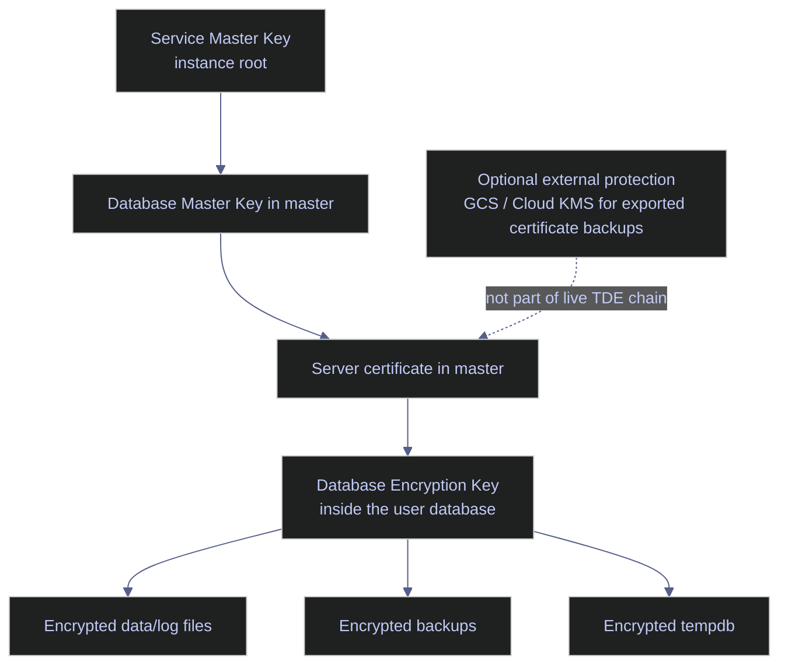

# Transparent Data Encryption (TDE)

Transparent Data Encryption encrypts SQL Server data and log files at rest. It is designed for disk, snapshot, detached-file, and backup theft scenarios. It does not encrypt client/server traffic, and it does not keep plaintext out of the SQL Server buffer pool once pages are in memory.

For production use, the critical operational truth is simple: **TDE is only as recoverable as its certificate backup chain**. If the certificate and private key are lost, encrypted backups and encrypted database files are no longer restorable on another instance.

## What TDE Protects

TDE protects:

- data files
- log files
- database backups
- `tempdb` once any user database on the instance uses TDE

TDE does not protect:

- data in transit between client and server
- plaintext pages in SQL Server memory
- application-layer access by already-authorized principals
- column-level confidentiality from high-privilege DBAs

That means TDE should be paired with transport encryption, strong authentication, least privilege, and audit logging. It is one layer of the SQL Server security model, not the whole model.

## Key Hierarchy And Platform Boundary

On this platform, the practical TDE pattern is certificate-based TDE fully inside SQL Server. Google Cloud KMS is not part of the live SQL Server TDE chain in this environment.



### Certificate-based TDE on Linux

The live TDE chain is:

- **Service Master Key**
- **Database Master Key** in `master`
- **server certificate** in `master`
- **Database Encryption Key** in the user database
- encrypted files and backups

That is the chain SQL Server itself needs at runtime.

### EKM boundary on Linux and GCP

SQL Server 2022 on Linux has recent support for specific EKM scenarios such as Azure Key Vault integration, but there is still no official SQL Server EKM provider for GCP Cloud KMS in this environment. For GCP-hosted SQL Server, the practical production pattern is:

- use certificate-based TDE inside SQL Server
- back up the certificate and private key immediately
- protect the exported backup artifacts externally with GCS and, if required, Cloud KMS

The external KMS can protect the exported certificate backup files, but it is not the live runtime encryptor for the TDE database encryption key here.

## Baseline The Current Encryption State

Before enabling TDE on a production database, confirm the current state. That prevents accidental assumptions about which databases are already encrypted and who owns them.

### `sys.databases` | current `stoxx` encryption state

This query confirms the owner and the current TDE flag for `stoxx`.

#### `sys.databases` | verify whether `stoxx` is already encrypted

This is the first gate before any TDE rollout or DR planning.

*Return the current owner and TDE flag for the `stoxx` database.*

```sql
SELECT
    db.name AS database_name,
    SUSER_SNAME(owner_sid) AS owner_name,
    db.is_encrypted
FROM sys.databases AS db
WHERE db.name = 'stoxx';
```

| database_name | owner_name | is_encrypted |
|---|---|---:|
| `stoxx` | `sa` | 0 |

_`stoxx` is not currently protected by TDE. Any production decision to require at-rest encryption still needs to be implemented, tested, and documented. The database is also owned by `sa`, which is common in labs but not always the preferred long-term operational owner._

| Column | Value | Watch | Meaning | Implication |
|---|---|---|---|---|
| `is_encrypted` | `0` | Depends | TDE is not enabled. | Backups and database files rely on storage controls rather than SQL Server file encryption. |
| `is_encrypted` | `1` | ✅ when TDE is required | TDE is enabled. | Certificate backup, restore runbooks, and monitoring become mandatory. |
| `owner_name` | `sa` | Depends | Default superuser owns the database. | Common baseline, but many teams standardize on a named admin owner instead. |

## Disposable TDE Example

The following example uses a disposable database named `codex_tde_demo`. It demonstrates the full certificate-based chain without changing `stoxx`.

### `master` | create the master key and certificate

The certificate and private key are the critical recovery artifacts. The safest rule is to treat certificate backup as part of the enablement sequence, not as a later administrative task.

#### `CREATE MASTER KEY` | establish the master-database root for TDE

This creates the Database Master Key in `master`, which protects the certificate private key.

> [!warning]
>
> If `master` does not have a Database Master Key, the certificate private key cannot be protected correctly for TDE. Do not proceed to TDE setup until the key hierarchy is explicit and backed up.

> [!success]
>
> Create the Database Master Key in `master`, then create the certificate, then back up the certificate and private key immediately after the DEK is created.

*Create the Database Master Key in `master` for the TDE certificate chain.*

```sql
USE master;
GO

CREATE MASTER KEY ENCRYPTION BY PASSWORD = 'CodexMasterKeyPass!2026';
GO
```

#### `sys.symmetric_keys` | verify the Database Master Key

This query confirms the DMK exists and shows its algorithm and key length.

*Return the `master` Database Master Key metadata used in the TDE chain.*

```sql
SELECT
    name,
    algorithm_desc,
    create_date,
    key_length
FROM sys.symmetric_keys
WHERE name = '##MS_DatabaseMasterKey##';
```

| name | algorithm_desc | create_date | key_length |
|---|---|---|---:|
| `##MS_DatabaseMasterKey##` | `AES_256` | 2026-04-08 18:12:04.600 | 256 |

_The `master` Database Master Key exists and uses `AES_256`. This is the correct prerequisite state for storing a TDE certificate private key in `master`._

| Column | Value | Watch | Meaning | Implication |
|---|---|---|---|---|
| `algorithm_desc` | `AES_256` | ✅ | The DMK is protected with a modern symmetric algorithm. | Expected and suitable for current SQL Server builds. |
| `key_length` | `256` | ✅ | 256-bit key length. | Strong baseline for the DMK. |

#### `CREATE CERTIFICATE` | create the TDE server certificate

This creates the server certificate that protects the Database Encryption Key.

*Create the server certificate that will encrypt the Database Encryption Key for the disposable TDE example.*

```sql
USE master;
GO

CREATE CERTIFICATE codex_tde_demo_cert
WITH SUBJECT = 'Codex TDE Demo Certificate',
EXPIRY_DATE = '2028-12-31';
GO
```

#### `sys.certificates` | verify the server certificate

This query confirms the TDE certificate exists and shows how its private key is protected.

*Return the certificate metadata for the TDE encryptor certificate.*

```sql
SELECT
    name,
    subject,
    start_date,
    expiry_date,
    pvt_key_encryption_type_desc
FROM sys.certificates
WHERE name = 'codex_tde_demo_cert';
```

| name | subject | start_date | expiry_date | pvt_key_encryption_type_desc |
|---|---|---|---|---|
| `codex_tde_demo_cert` | `Codex TDE Demo Certificate` | 2026-04-08 18:12:04.000 | 2028-12-31 00:00:00.000 | `ENCRYPTED_BY_MASTER_KEY` |

_The certificate exists and its private key is protected by the `master` Database Master Key, which is the expected TDE chain on this platform. The expiry date matters operationally because certificate rotation must happen before it becomes a recovery problem._

| Column | Value | Watch | Meaning | Implication |
|---|---|---|---|---|
| `pvt_key_encryption_type_desc` | `ENCRYPTED_BY_MASTER_KEY` | ✅ | The certificate private key is protected by the `master` DMK. | Correct TDE prerequisite state. |
| `pvt_key_encryption_type_desc` | Other value | ❌ | The private-key protection differs from the expected TDE chain. | Review certificate creation and key management before proceeding. |
| `expiry_date` | Future date with rotation runway | ✅ | The certificate is still valid operationally. | Rotation can be planned safely. |
| `expiry_date` | Imminent or past date | ❌ | Rotation pressure exists. | Review certificate strategy and backup validity immediately. |

### User database | create the DEK and enable encryption

TDE becomes active only after the Database Encryption Key exists in the user database and `ALTER DATABASE ... SET ENCRYPTION ON` is executed.

#### `CREATE DATABASE ENCRYPTION KEY` + `ALTER DATABASE ... SET ENCRYPTION ON` | enable TDE on a disposable database

This creates a disposable database, inserts one row, creates the DEK, and enables TDE.

> [!warning]
>
> When the DEK is created, SQL Server warns that the certificate has not been backed up yet. Treat that warning as mandatory operational work, not as informational noise.

> [!success]
>
> Enable TDE only when the certificate backup step is prepared and the restore runbook is already defined. For production databases, schedule the initial encryption scan and backup-chain validation explicitly.

> [!info]-
>
> This batch creates a disposable TDE-enabled database.
>
> - `CREATE DATABASE codex_tde_demo` creates the example user database.
> - The `demo_payload` table and seed row exist only to prove the database contains real data.
> - `CREATE DATABASE ENCRYPTION KEY ... ENCRYPTION BY SERVER CERTIFICATE` creates the DEK inside the user database and protects it with the certificate created in `master`.
> - `ALTER DATABASE ... SET ENCRYPTION ON` starts the background encryption process for the database and also causes `tempdb` to be encrypted at the instance level.

*Create a disposable encrypted database, define its DEK, and enable TDE.*

```sql
USE master;
GO

CREATE DATABASE codex_tde_demo;
GO

USE codex_tde_demo;
GO

CREATE TABLE dbo.demo_payload
(
    id int NOT NULL PRIMARY KEY,
    payload nvarchar(100) NOT NULL
);
GO

INSERT INTO dbo.demo_payload (id, payload)
VALUES (1, N'TDE demo row');
GO

CREATE DATABASE ENCRYPTION KEY
WITH ALGORITHM = AES_256
ENCRYPTION BY SERVER CERTIFICATE codex_tde_demo_cert;
GO

ALTER DATABASE codex_tde_demo SET ENCRYPTION ON;
GO
```

#### `sys.dm_database_encryption_keys` | verify database encryption state

This query shows the effective encryption state for the disposable demo database, the real `stoxx` database, and `tempdb`.

*Return the live encryption state, algorithm, and certificate mapping for the databases relevant to this example.*

```sql
SELECT
    db.name,
    db.is_encrypted,
    dek.encryption_state,
    dek.percent_complete,
    dek.key_algorithm,
    dek.key_length,
    c.name AS cert_name,
    c.expiry_date
FROM sys.databases AS db
LEFT JOIN sys.dm_database_encryption_keys AS dek
    ON db.database_id = dek.database_id
LEFT JOIN sys.certificates AS c
    ON dek.encryptor_thumbprint = c.thumbprint
WHERE db.name IN ('stoxx', 'tempdb', 'codex_tde_demo')
ORDER BY db.name;
```

| name | is_encrypted | encryption_state | percent_complete | key_algorithm | key_length | cert_name | expiry_date |
|---|---:|---:|---:|---|---:|---|---|
| `codex_tde_demo` | 1 | 3 | 0.0 | `AES` | 256 | `codex_tde_demo_cert` | 2028-12-31 00:00:00.000 |
| `stoxx` | 0 |  |  |  |  |  |  |
| `tempdb` | 1 | 3 | 0.0 | `AES` | 256 |  |  |

_The disposable demo database is fully encrypted, `encryption_state = 3` confirms the encryption scan completed, and `tempdb` is also encrypted because one user database on the instance now uses TDE. `stoxx` remains unencrypted, which keeps the production database separate from the example while still proving the engine behavior._

| Column | Value | Watch | Meaning | Implication |
|---|---|---|---|---|
| `is_encrypted` | `1` | ✅ | TDE is enabled for the database. | Data and log files for that database are encrypted at rest. |
| `is_encrypted` | `0` | Depends | TDE is not enabled. | No SQL Server file-level at-rest encryption for that database. |
| `encryption_state` | `2` | Depends | Encryption in progress. | Monitor progress before treating the rollout as complete. |
| `encryption_state` | `3` | ✅ | Fully encrypted. | The database is in the steady encrypted state. |
| `encryption_state` | `5` | Depends | Decryption in progress. | Someone is disabling TDE or reversing a change. |
| `encryption_state` | `6` | Depends | Protection change in progress. | Review certificate or protection changes carefully. |
| `cert_name` | Named certificate on user DB row | ✅ | The DEK maps back to a known certificate. | This is the certificate that must exist for restore scenarios. |
| `cert_name` | Blank on `tempdb` | ✅ | `tempdb` is encrypted because of instance behavior, not because it has its own certificate mapping here. | Expected when another user database enables TDE. |

#### `COUNT(*)` | verify the disposable database contains readable data

This confirms the database remains accessible through normal query paths after TDE is enabled.

*Verify that the disposable TDE database remains readable after encryption is enabled.*

```sql
SELECT COUNT(*) AS row_count
FROM dbo.demo_payload;
```

| row_count |
|---:|
| 1 |

_TDE is transparent to normal query semantics. The row remains readable without any query-side decryption logic because SQL Server decrypts pages as they are read into memory._

## Back Up The Certificate Immediately

Certificate backup is the non-negotiable step in any TDE rollout. Without the certificate and its private key, a TDE-encrypted backup cannot be restored on another instance.

### `BACKUP CERTIFICATE` | export the certificate and private key

This exports the certificate and private key to Linux files so they can be protected outside the instance.

#### `BACKUP CERTIFICATE` | export the certificate and private key to Linux files

This creates the recovery artifacts that make restore and disaster recovery possible.

> [!danger]
>
> If the TDE certificate and private key are lost, encrypted backups and detached files can become permanently unrecoverable on another SQL Server instance.

> [!success]
>
> Back up the certificate and private key immediately after enabling TDE, store them separately from the database backups, and protect the exported files with external controls such as restricted storage and, if required, KMS-protected archival.

*Back up the TDE certificate and private key to Linux files for disaster recovery.*

```sql
USE master;
GO

BACKUP CERTIFICATE codex_tde_demo_cert
TO FILE = '/var/opt/mssql/log/tde-demo/codex_tde_demo_cert.cer'
WITH PRIVATE KEY (
    FILE = '/var/opt/mssql/log/tde-demo/codex_tde_demo_cert_key.pvk',
    ENCRYPTION BY PASSWORD = 'CodexBackupPassword!2026'
);
GO
```

#### `xp_fileexist` | verify the exported certificate files from SQL Server

This query verifies that the exported files exist at the expected Linux paths from the SQL Server side.

*Check from SQL Server that the exported certificate and private-key files exist on disk.*

```sql
EXEC xp_fileexist '/var/opt/mssql/log/tde-demo/codex_tde_demo_cert.cer';
EXEC xp_fileexist '/var/opt/mssql/log/tde-demo/codex_tde_demo_cert_key.pvk';
```

| File Exists | File is Directory | Parent Directory Exists |
|---:|---:|---:|
| 1 | 0 | 1 |

<!-- -->

| File Exists | File is Directory | Parent Directory Exists |
|---:|---:|---:|
| 1 | 0 | 1 |

_Both exported files exist, neither path points to a directory, and the parent directory is present. That confirms SQL Server wrote the certificate and private-key files to the intended Linux path successfully._

| Column | Value | Watch | Meaning | Implication |
|---|---|---|---|---|
| `File Exists` | `1` | ✅ | The target file exists. | The export succeeded at the file level. |
| `File Exists` | `0` | ❌ | The target file does not exist. | The backup path, permissions, or export command must be corrected immediately. |
| `File is Directory` | `0` | ✅ | The path points to a file. | Expected for certificate and private-key exports. |
| `File is Directory` | `1` | ❌ | The path resolves to a directory. | The backup target path is wrong. |
| `Parent Directory Exists` | `1` | ✅ | The containing directory exists. | SQL Server had a valid export location. |
| `Parent Directory Exists` | `0` | ❌ | The containing directory does not exist. | Export could not succeed reliably until the path is fixed. |

#### `ls -lh` | verify the exported certificate files from Linux

This host-side check confirms size and ownership of the exported files.

*Inspect the Linux certificate-export directory and verify that the recovery files exist with real sizes.*

```bash
docker exec stoxx-db bash -lc "ls -lh /var/opt/mssql/log/tde-demo"
```

```text
total 8.0K
-rw-r----- 1 mssql mssql  981 Apr  8 18:12 codex_tde_demo_cert.cer
-rw-r----- 1 mssql mssql 1.8K Apr  8 18:12 codex_tde_demo_cert_key.pvk
```

_The certificate and private-key files exist on Linux, are owned by the `mssql` account, and have non-zero sizes. That is the minimum evidence that the export produced real recovery artifacts rather than empty placeholders._

## Restore And Disaster Recovery Pattern

Restoring a TDE-encrypted backup on another instance requires the certificate chain first. The order matters:

1. create the `master` Database Master Key if it does not exist
2. restore the certificate and private key into `master`
3. only then restore or attach the encrypted database

### `CREATE CERTIFICATE ... FROM FILE` | import the certificate on the target instance

These are the essential commands for the target instance before restoring an encrypted backup.

*Create the `master` Database Master Key on the target instance and import the certificate before restoring the encrypted database.*

```sql
USE master;
GO

CREATE MASTER KEY ENCRYPTION BY PASSWORD = 'CodexMasterKeyPass!2026';
GO

CREATE CERTIFICATE codex_tde_demo_cert
FROM FILE = '/var/opt/mssql/log/tde-demo/codex_tde_demo_cert.cer'
WITH PRIVATE KEY (
    FILE = '/var/opt/mssql/log/tde-demo/codex_tde_demo_cert_key.pvk',
    DECRYPTION BY PASSWORD = 'CodexBackupPassword!2026'
);
GO
```

## Operational Recommendations

- Treat certificate backup as part of TDE enablement, not post-work.
- Store certificate backups separately from database backups.
- Remember that `tempdb` becomes encrypted when any user database on the instance uses TDE.
- Expect some CPU overhead on write-heavy systems because pages are encrypted and decrypted at the I/O boundary.
- On SQL Server 2019 and later, backup compression for TDE-enabled databases no longer needs the older manual `MAXTRANSFERSIZE > 64 KB` workaround that earlier versions depended on.
- If you archive exported certificate artifacts to GCS, protect that archive with strict IAM and, if required, Cloud KMS. That external protection hardens the backup artifacts, not the live SQL Server TDE runtime chain.

## Related

- [[03-sql-server-authentication]]
- [[12-audit-logging]]

