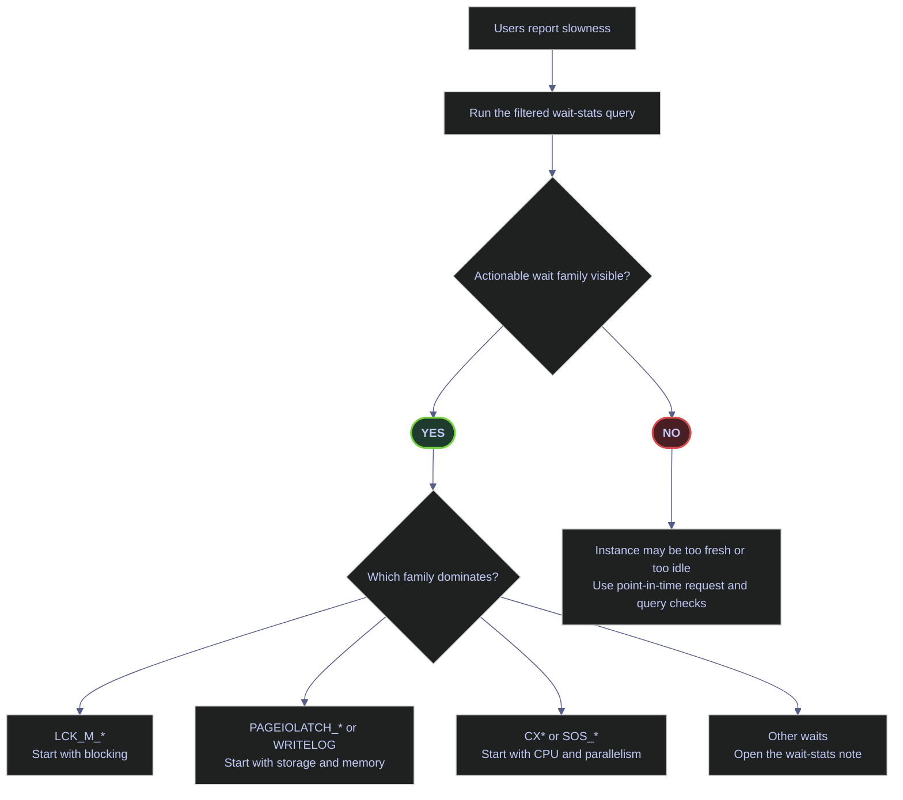
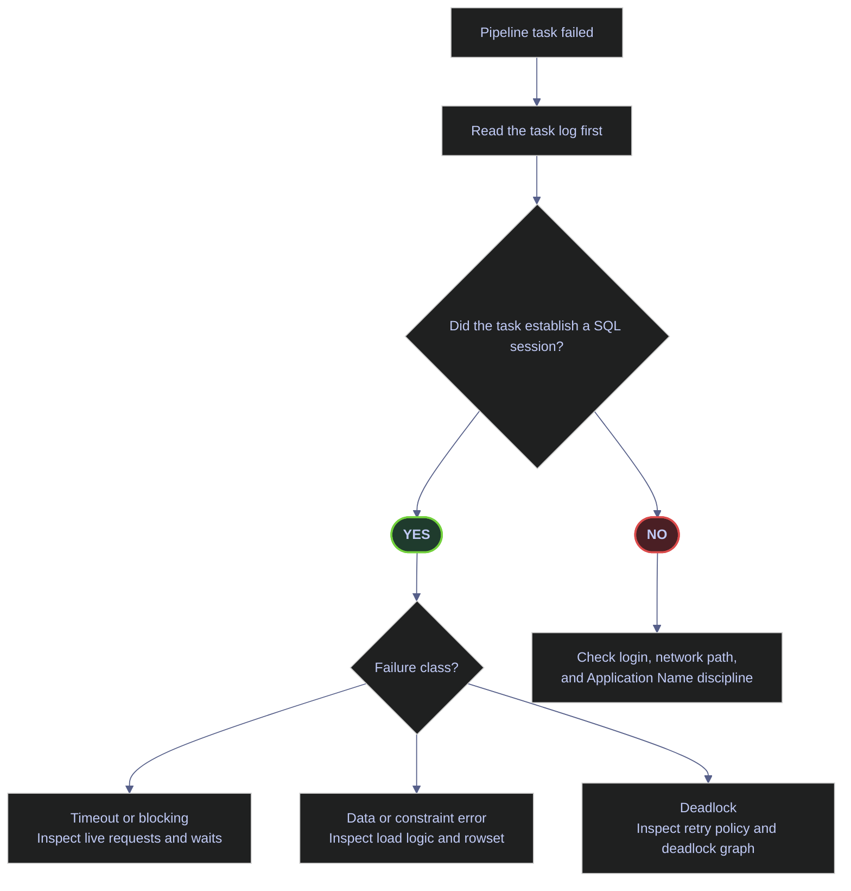
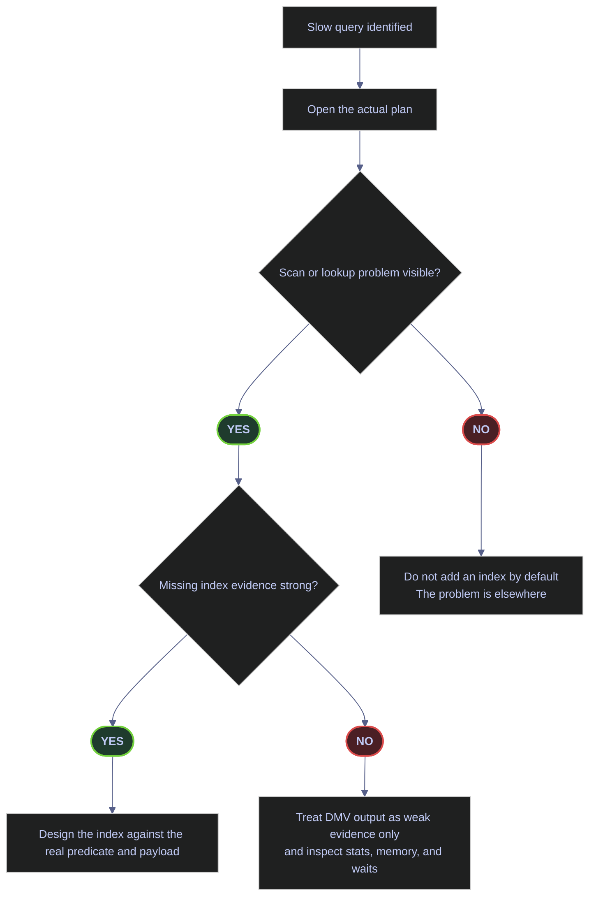
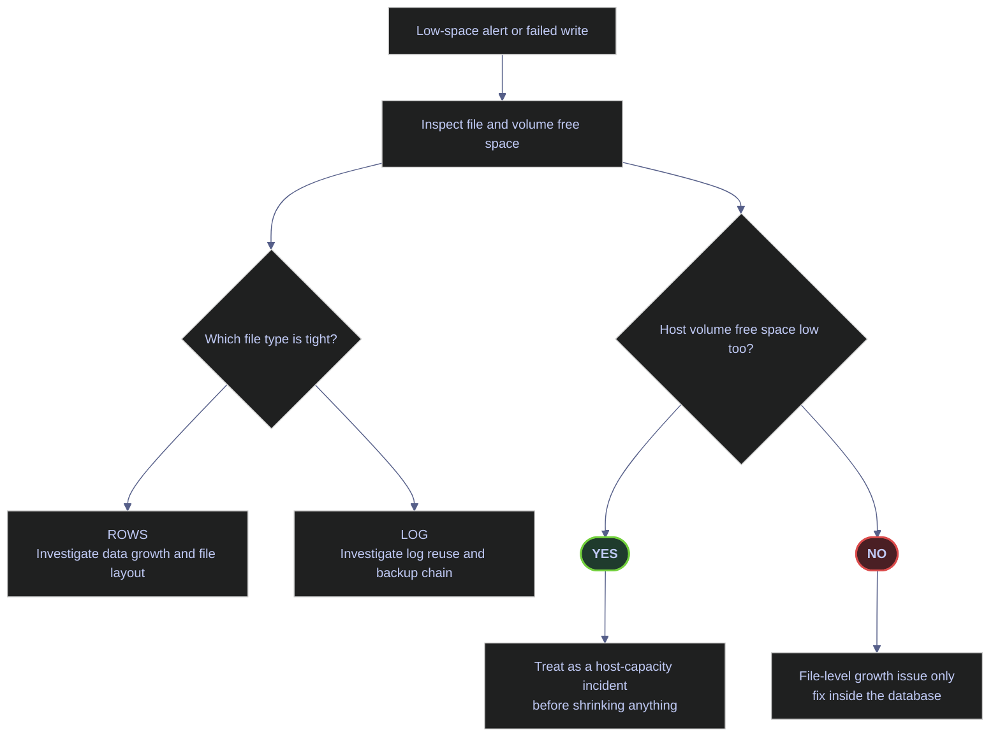
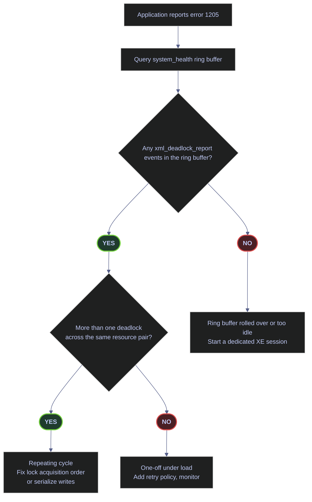
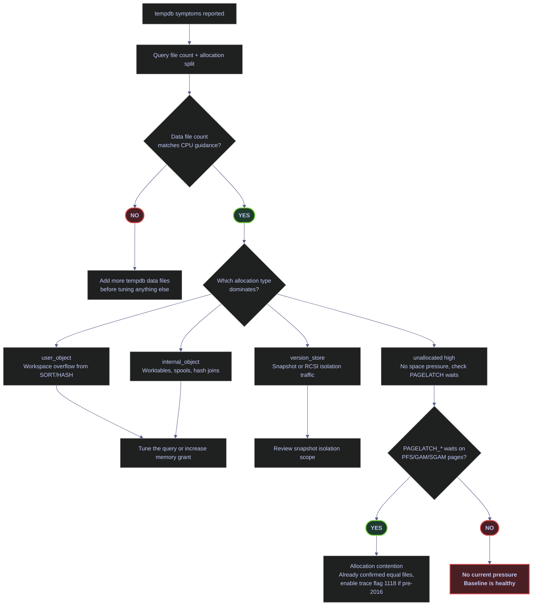
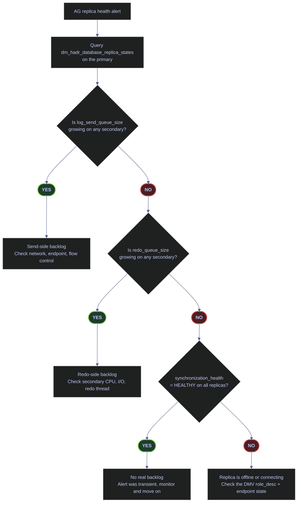

# Troubleshooting Flowcharts

> [!abstract]- Summary
>
> This page is a routing layer for production incidents, not a replacement for the deeper notes. Its job is to answer the first question quickly: which diagnostic surface to open first, which branch is most likely given the first real signal, and which deeper note owns the full remediation workflow.
>
> - **Master routing**
>   - starts with a decision matrix that maps symptom classes to the first flowchart, the primary DMV or system view, and the deep note that owns remediation
> - **Performance and pipeline flowcharts**
>   - routes generic slowness and pipeline-failure reports through waits, sessions, and workload evidence before jumping to narrow fixes
> - **Index and storage decisions**
>   - handles add-an-index judgment calls and disk-space emergencies with starter queries that surface the real constraint first
> - **Concurrency and tempdb**
>   - splits deadlocks, tempdb pressure, and related contention into the correct branch rather than collapsing them into one generic “database is slow” bucket
> - **AG lag**
>   - isolates send queue, redo queue, and sync-commit impact when a secondary falls behind
> - **Live evidence discipline**
>   - every starter query is captured live against the local `stoxx` SQL Server 2022 instance, but the DMV counters used here are cumulative since instance start and must be re-run against the current system during an incident

> [!note]- Glossary
>
> - **Routing layer**
>   - navigation page that points the responder to the right diagnostic branch before deep remediation starts
> - **Starter query**
>   - first low-cost query used to classify the incident and choose the next branch
> - **Cumulative DMV**
>   - DMV whose counters accumulate since instance start rather than representing only the current moment
> - **`sys.dm_os_wait_stats`**
>   - wait-statistics DMV used to classify resource families behind generic slowness
> - **`sys.dm_exec_sessions`**
>   - DMV used to inspect active sessions and their status during workload or pipeline incidents
> - **Missing-index DMVs**
>   - `sys.dm_db_missing_index_*` views that suggest indexing opportunities but require judgment before action
> - **`system_health`**
>   - default Extended Events session that captures deadlock graphs and other baseline diagnostics
> - **Tempdb pressure**
>   - space, allocation, or version-store stress inside `tempdb`
> - **Send queue**
>   - backlog of log records not yet shipped from the AG primary to a secondary
> - **Redo queue**
>   - backlog of log records already received by a secondary but not yet replayed into data pages
> - **`VIEW SERVER PERFORMANCE STATE`**
>   - SQL Server 2022 permission that grants access to performance-oriented DMVs without the broader server-state surface
> - **Deep note**
>   - detailed chapter note that owns the full remediation workflow once the flowchart identifies the problem family

> [!info] Permissions note for SQL Server 2022+
>
> Every starter query on this page requires `VIEW SERVER STATE` on pre-2022 instances. SQL Server 2022 (16.x) introduced a narrower permission, `VIEW SERVER PERFORMANCE STATE`, which is sufficient for every performance-oriented DMV read below (`sys.dm_os_wait_stats`, `sys.dm_exec_sessions`, `sys.dm_db_missing_index_*`, `sys.database_files`, `sys.dm_os_volume_stats`, `sys.dm_xe_sessions`, `sys.dm_db_file_space_usage`, `sys.dm_hadr_database_replica_states`). The fixed server role `##MS_ServerPerformanceStateReader##` grants exactly this permission across the instance. On an instance running SQL Server 2022 or later, add the on-call DBA role to `##MS_ServerPerformanceStateReader##` instead of granting the broader `##MS_ServerStateReader##` role — it satisfies every query on this page without exposing security-state DMVs.

## Master decision matrix

Use this matrix as a first-look index when an incident is reported. Each row maps a symptom class to the first flowchart to read, the key system view to query, and the deep note that owns the full remediation workflow. The `system view or DMV` column lists the specific object each starter query hits, so the matrix doubles as a DMV cheatsheet.

| Symptom class | First flowchart | Key system view or DMV | Primary deep note |
|---|---|---|---|
| General latency or throughput complaint | [Flowchart 1](#flowchart-1-why-is-it-slow--the-master-flowchart) | `sys.dm_os_wait_stats` | [essential-dba-queries](https://alp78.github.io/elysium/04-SQL-Server/01-Server-Operations/essential-dba-queries) |
| Pipeline task failed in orchestrator | [Flowchart 2](#flowchart-2-pipeline-failed--data-pipeline-troubleshooting) | `sys.dm_exec_sessions` | [sql-server-problems](https://alp78.github.io/elysium/04-SQL-Server/01-Server-Operations/sql-server-problems) |
| Slow-query candidate needs an index decision | [Flowchart 3](#flowchart-3-should-i-add-an-index--index-decision-tree) | `sys.dm_db_missing_index_details`, `_groups`, `_group_stats` | [performance-audit-playbook](https://alp78.github.io/elysium/04-SQL-Server/01-Server-Operations/performance-audit-playbook) |
| Low-space alert or failed write | [Flowchart 4](#flowchart-4-disk-space-emergency--storage-recovery) | `sys.database_files`, `sys.dm_os_volume_stats` | [restore-and-recovery](https://alp78.github.io/elysium/04-SQL-Server/01-Server-Operations/restore-and-recovery) |
| Deadlock reported by application (error 1205) | [Flowchart 5](#flowchart-5-deadlock-reported--retry-vs-code-fix) | `system_health` ring buffer (`xml_deadlock_report`) | [sql-server-problems](https://alp78.github.io/elysium/04-SQL-Server/01-Server-Operations/sql-server-problems) |
| `tempdb` pressure (allocation, space, or version store) | [Flowchart 6](#flowchart-6-tempdb-under-pressure--allocation-vs-space-vs-version-store) | `sys.dm_db_file_space_usage`, `sys.dm_os_waiting_tasks` | [memory-and-buffer-pool](https://alp78.github.io/elysium/04-SQL-Server/01-Server-Operations/memory-and-buffer-pool) |
| AG secondary fallen behind | [Flowchart 7](#flowchart-7-ag-secondary-fallen-behind--send-queue-vs-redo-queue-vs-sync-commit-impact) | `sys.dm_hadr_database_replica_states` | [always-on-availability-groups](https://alp78.github.io/elysium/04-SQL-Server/01-Server-Operations/always-on-availability-groups) |

## Flowchart 1: "Why Is It Slow?" — The Master Flowchart

Start here when the complaint is latency or throughput. The first production question is not "should I add an index?" It is "what resource family is the workload waiting on?"

*Route generic slowness by dominant wait family before opening deeper DMVs.*



> [!warning] Wait stats are cumulative since instance start
>
> Every counter in `sys.dm_os_wait_stats` accumulates from the moment SQL Server last started and is never automatically reset. A single frozen snapshot therefore mixes yesterday's backup window, last night's ETL load, and the current incident into the same totals, and a fresh post-restart instance can return a thin or empty signal even while a real incident is in progress. Treating the raw `TOP 10` as "what is wrong right now" is the classic misread that sends incident triage down the wrong branch.

> [!success] Work with deltas over a fixed observation window
>
> The correct operator discipline is to collect two snapshots bracketing a fixed observation window and subtract them:
>
> - **Baseline snapshot.** Capture the filtered `sys.dm_os_wait_stats` rows into a temp table at the start of the window.
> - **Second snapshot.** Capture again after a representative interval (five to fifteen minutes during an active incident).
> - **Delta projection.** Join the two snapshots on `wait_type` and project the differences in `wait_time_ms`, `signal_wait_time_ms`, and `waiting_tasks_count`. Order by the delta in `wait_time_ms DESC`.
>
> `DBCC SQLPERF('sys.dm_os_wait_stats', CLEAR)` exists as a shortcut, but it zeroes the server-wide counters and breaks any concurrent monitoring that consumes the same DMV. Prefer the delta approach unless you are the only consumer on the instance.

### SQL Server | sys.dm_os_wait_stats | filtered actionable wait families

The first branch of the master flowchart depends entirely on which wait family dominates once idle and background waits are filtered out. The `sys.dm_os_wait_stats` DMV is the right surface for that question because it is cumulative from the moment SQL Server started and covers every wait the engine has recorded, but its raw output is dominated by dozens of background waits that never reflect a user-facing problem. The filtered query below is the workhorse starter — it trims the noise and projects only the columns needed to pick the next branch.

#### Surface the top actionable wait families

As the first response to any "the database feels slow" or "everything is laggy" report, before opening any query-level DMV. The filtered wait-stats read is cheap, safe, and informs every subsequent branch of Flowchart 1. It is typically triggered by generic user-facing latency or throughput complaint with no specific slow query yet identified. T-SQL session against the target instance, read-only, requires `VIEW SERVER STATE`. The result is cumulative since `sqlserver_start_time`, so a very fresh or very idle instance will return a thin signal — that outcome is the `NO` branch of the master flowchart. Identify which resource family the workload is actually waiting on so the next diagnostic branch (blocking, storage, CPU, parallelism) is chosen from real evidence instead of a guess.

> [!info]- Clause-by-clause breakdown of the filtered wait-stats query
>
> The query is structured as a filtered `CTE` over `sys.dm_os_wait_stats` followed by a `TOP (10)` ordered projection. Each clause has a specific operational purpose:
>
> - **`WITH waits AS (...)`** — captures the raw DMV once and exposes four derived columns so the outer query can filter and order without rewriting the arithmetic.
> - **`wait_time_ms / 1000.0 AS wait_sec`** — converts the cumulative total wait in milliseconds to seconds so the output is readable; the `/ 1000.0` forces a decimal result instead of an integer truncation.
> - **`(wait_time_ms - signal_wait_time_ms) / 1000.0 AS resource_wait_sec`** — the non-CPU portion of the wait, i.e., the time the task spent actually waiting for the resource (lock, page, disk, memory grant) before the scheduler re-dispatched it.
> - **`signal_wait_time_ms / 1000.0 AS signal_wait_sec`** — the scheduler-queue delay after the resource was granted but before the worker thread resumed. A high signal-to-total ratio (>25%) is the standard heuristic for CPU pressure.
> - **`waiting_tasks_count`** — how many individual wait events were rolled up into the totals. A wait family with a huge total but a tiny count points to a few long-running stalls; a huge count with modest totals points to many short contentions.
> - **`WHERE wait_type NOT IN (...)`** — excludes the community-maintained idle/background wait list (checkpoint queues, dispatcher sleeps, mirroring heartbeats, CLR semaphores, extended-event dispatchers, etc.) that accumulate on every instance and drown user-facing signal.
> - **`WHERE wait_sec > 0`** on the outer query — drops families that have never fired on the current instance lifetime, which would otherwise clutter the `TOP (10)` with zero rows.
> - **`ORDER BY wait_sec DESC`** — ranks the remaining families by cumulative seconds so the dominant family appears first. Counts, signal percentages, and task counts are still visible per row for secondary judgment.

**Field and column reference.** Every column projected by the query maps to a source column in `sys.dm_os_wait_stats` or a derived expression computed from it. Every source column is documented verbatim in the official Microsoft [`sys.dm_os_wait_stats`](https://learn.microsoft.com/sql/relational-databases/system-dynamic-management-views/sys-dm-os-wait-stats-transact-sql?view=sql-server-ver17) reference.

| Field | Source | Type / unit | Meaning |
|---|---|---|---|
| `wait_type` | `sys.dm_os_wait_stats.wait_type` | `nvarchar(60)` | Name of the wait type (e.g., `LCK_M_IX`, `CXPACKET`, `PAGEIOLATCH_SH`). One row per distinct wait type the engine has recorded since startup. |
| `wait_sec` | `wait_time_ms / 1000.0` | `decimal` seconds | Cumulative total wait time for this family since `sqlserver_start_time`. Per docs, this value is **inclusive of** `signal_wait_time_ms`. |
| `resource_wait_sec` | `(wait_time_ms - signal_wait_time_ms) / 1000.0` | `decimal` seconds | The non-CPU portion — time the task spent actually waiting for the resource (lock, page, disk, memory grant) before the scheduler signaled it. |
| `signal_wait_sec` | `signal_wait_time_ms / 1000.0` | `decimal` seconds | Scheduler-queue delay after the waiting thread was signaled but before the worker resumed running. A ratio `signal_wait_sec / wait_sec > 0.25` is the standard heuristic for CPU pressure. |
| `waiting_tasks_count` | `sys.dm_os_wait_stats.waiting_tasks_count` | `bigint` count | Number of individual wait events rolled up into the totals, incremented at the start of each wait. A low count with high `wait_sec` points to a few long stalls; a huge count with modest `wait_sec` points to many short contentions. |

*Surface the top actionable wait families on the current instance before choosing a troubleshooting branch.*

```sql
WITH waits AS (
    SELECT
        wait_type,
        wait_time_ms / 1000.0 AS wait_sec,
        (wait_time_ms - signal_wait_time_ms) / 1000.0 AS resource_wait_sec,
        signal_wait_time_ms / 1000.0 AS signal_wait_sec,
        waiting_tasks_count
    FROM sys.dm_os_wait_stats
    WHERE wait_type NOT IN (
        'BROKER_EVENTHANDLER','BROKER_RECEIVE_WAITFOR','BROKER_TASK_STOP',
        'BROKER_TO_FLUSH','BROKER_TRANSMITTER','CHECKPOINT_QUEUE','CHKPT',
        'CLR_AUTO_EVENT','CLR_MANUAL_EVENT','CLR_SEMAPHORE',
        'DBMIRROR_DBM_EVENT','DBMIRROR_EVENTS_QUEUE','DBMIRROR_WORKER_QUEUE',
        'DBMIRRORING_CMD','DIRTY_PAGE_POLL','DISPATCHER_QUEUE_SEMAPHORE',
        'EXECSYNC','FSAGENT','FT_IFTS_SCHEDULER_IDLE_WAIT','FT_IFTSHC_MUTEX',
        'HADR_CLUSAPI_CALL','HADR_FILESTREAM_IOMGR_IOCOMPLETION',
        'HADR_LOGCAPTURE_WAIT','HADR_NOTIFICATION_DEQUEUE','HADR_TIMER_TASK',
        'HADR_WORK_QUEUE','KSOURCE_WAKEUP','LAZYWRITER_SLEEP','LOGMGR_QUEUE',
        'MEMORY_ALLOCATION_EXT','ONDEMAND_TASK_QUEUE','PARALLEL_REDO_DRAIN_WORKER',
        'PARALLEL_REDO_LOG_CACHE','PARALLEL_REDO_TRAN_LIST','PARALLEL_REDO_WORKER_SYNC',
        'PARALLEL_REDO_WORKER_WAIT_WORK','PREEMPTIVE_OS_FLUSHFILEBUFFERS',
        'PREEMPTIVE_XE_GETTARGETSTATE','PWAIT_ALL_COMPONENTS_INITIALIZED',
        'PWAIT_DIRECTLOGCONSUMER_GETNEXT','PWAIT_EXTENSIBILITY_CLEANUP_TASK',
        'QDS_ASYNC_QUEUE','QDS_CLEANUP_STALE_QUERIES_TASK_MAIN_LOOP_SLEEP',
        'QDS_PERSIST_TASK_MAIN_LOOP_SLEEP','QDS_SHUTDOWN_QUEUE',
        'REDO_THREAD_PENDING_WORK','REQUEST_FOR_DEADLOCK_SEARCH','RESOURCE_QUEUE',
        'SERVER_IDLE_CHECK','SLEEP_BPOOL_FLUSH','SLEEP_DBSTARTUP',
        'SLEEP_DCOMSTARTUP','SLEEP_MASTERDBREADY','SLEEP_MASTERMDREADY',
        'SLEEP_MASTERUPGRADED','SLEEP_MSDBSTARTUP','SLEEP_SYSTEMTASK',
        'SLEEP_TASK','SLEEP_TEMPDBSTARTUP','SNI_HTTP_ACCEPT',
        'SOS_WORK_DISPATCHER','SP_SERVER_DIAGNOSTICS_SLEEP',
        'SQLTRACE_BUFFER_FLUSH','SQLTRACE_INCREMENTAL_FLUSH_SLEEP',
        'SQLTRACE_WAIT_ENTRIES','WAIT_FOR_RESULTS','WAITFOR',
        'WAITFOR_TASKSHUTDOWN','WAIT_XTP_RECOVERY','WAIT_XTP_HOST_WAIT',
        'WAIT_XTP_OFFLINE_CKPT_NEW_LOG','WAIT_XTP_CKPT_CLOSE',
        'XE_DISPATCHER_JOIN','XE_DISPATCHER_WAIT','XE_TIMER_EVENT'
    )
)
SELECT TOP (10)
    wait_type,
    wait_sec,
    resource_wait_sec,
    signal_wait_sec,
    waiting_tasks_count
FROM waits
WHERE wait_sec > 0
ORDER BY wait_sec DESC;
```

```text
wait_type                        wait_sec   resource_wait_sec   signal_wait_sec   waiting_tasks_count
-------------------------------  ---------  ------------------  ----------------  -------------------
LCK_M_U                          71.029000  71.028000           0.001000          11
BACKUPTHREAD                     16.211000  16.196000           0.015000          384
BACKUPIO                         15.216000  15.056000           0.160000          6232
STARTUP_DEPENDENCY_MANAGER       8.644000   8.623000            0.021000          90
LCK_M_X                          5.946000   5.945000            0.001000          9
PREEMPTIVE_OS_AUTHENTICATIONOPS  4.461000   4.461000            0.000000          4166
LCK_M_S                          3.478000   3.469000            0.009000          110
PREEMPTIVE_HTTP_EVENT_WAIT       2.694000   2.694000            0.000000          17
ASYNC_IO_COMPLETION              2.415000   2.414000            0.001000          42
BACKUPBUFFER                     2.353000   2.163000            0.190000          5215
```

> [!info] As-of timestamp for this capture
>
> Captured against `stoxx` on **2026-04-11 20:30 UTC**. Instance `sqlserver_start_time = 2026-04-11 15:55:55`, approximately 5 hours of uptime. Re-run the query against the current instance during any incident — these values are frozen and will drift.

**Per-row read of the live capture.** The output is an unusually informative one because the `stoxx` instance has only been up 5 hours and the recent activity is mixed (concurrency race demos + AG backup seeding + telemetry callouts). Walking the rows top-to-bottom:

- **`LCK_M_U` — 71.03s / 11 events.** The dominant family by cumulative seconds but only 11 waits total. That ratio (about 6.5 s per wait on average) is a fingerprint for a small number of long-running update-lock contentions, not a flood of short ones. On `stoxx` this traces back to `race_demo.py` scenarios that deliberately hold update locks across `WAITFOR DELAY` blocks. In a real incident the same shape would point at a long-running user transaction holding an update lock.
- **`BACKUPTHREAD` — 16.21s / 384 events**, **`BACKUPIO` — 15.22s / 6232 events**, **`BACKUPBUFFER` — 2.35s / 5215 events.** All three are backup-machinery waits. Their co-appearance means one or more full backups ran during the instance lifetime — in this case the AG demo project seeded a three-replica availability group and generated a dense backup chain. These waits are not an incident signal on their own; they are a backup-activity marker. If you see them dominating outside of a known backup window, that is a separate alert.
- **`STARTUP_DEPENDENCY_MANAGER` — 8.64s / 90 events.** Startup-phase wait concentrated around the first minutes after `sqlserver_start_time`. On a freshly bounced instance it is expected; during a steady-state incident it should not appear in the top ten at all.
- **`LCK_M_X` — 5.95s / 9 events** and **`LCK_M_S` — 3.48s / 110 events.** Secondary locking signal. The `LCK_M_X` count matches the same small number of long transactions as `LCK_M_U`; `LCK_M_S` has more events but each is short, typical of reader-side contention during a writer's window.
- **`PREEMPTIVE_OS_AUTHENTICATIONOPS` — 4.46s / 4166 events.** High-count, low per-wait authentication calls into the OS. On this instance it reflects many short pyodbc and SSMS logins during testing. In production with connection pooling it should be far lower; if it rises, check for login flooding.
- **`PREEMPTIVE_HTTP_EVENT_WAIT` — 2.69s / 17 events** and **`ASYNC_IO_COMPLETION` — 2.42s / 42 events.** Telemetry callouts (CEIP) and asynchronous non-data I/O from backup/log operations. Rarely actionable in isolation.

The dominant decision-relevant family today is locking (`LCK_M_*`), not storage or parallelism. The correct branch of the master flowchart on this instance right now is the blocking/lock-serialization branch — open the live-requests query and find the root blocker in `sys.dm_exec_requests` joined to `sys.dm_tran_locks`. None of the `PAGEIOLATCH_*` / `WRITELOG` / `CX*` families survive the filter, so storage and parallelism branches are off the table for this capture.

**How to route the dominant `wait_type`**

- `LCK_M_*` such as `LCK_M_IX`, `LCK_M_SCH_S`, `LCK_M_U`, and `LCK_M_X` means transaction-level contention. Route to blocking-chain analysis before looking at plans.
- `CXPACKET`, `CXCONSUMER`, and `CXSYNC_PORT` means parallel workers are coordinating. Review `cost threshold for parallelism`, `MAXDOP`, and the actual plan before changing anything.
- `LATCH_*` such as `LATCH_EX` means in-memory latch contention. Check parallel hot spots and `tempdb` allocator pressure rather than storage latency.
- `PAGEIOLATCH_*` and `WRITELOG` means physical I/O waits. Open memory and storage diagnostics before touching query text or indexes.
- `SOS_SCHEDULER_YIELD` means workers are CPU-bound after cooperative yields. Move to CPU-bound diagnostics such as expensive plans, bad estimates, and parameter sensitivity.
- `RESERVED_MEMORY_ALLOCATION_EXT` and `PREEMPTIVE_OS_*` means internal memory plumbing or out-of-engine OS work. Record it in the timeline, but do not route on it alone.
- Only idle or background waits surviving the filter means the cumulative signal is too thin. Fall back to point-in-time DMVs like `sys.dm_exec_requests` and re-run the delta capture later.

The "first linked note" for each of these families lives in the routing paragraph directly below, so the table stays focused on interpretation.

→ **Continue in:** [essential-dba-queries](https://alp78.github.io/elysium/04-SQL-Server/01-Server-Operations/essential-dba-queries) for the general DMV triage toolkit (live requests, blocking chains, waiting tasks, plan cache inspection). For the locking branch, reach for the blocking-chain query there. For parallelism and CPU branches, combine it with [performance-audit-playbook](https://alp78.github.io/elysium/04-SQL-Server/01-Server-Operations/performance-audit-playbook). For storage-path or memory-grant branches, open [memory-and-buffer-pool](https://alp78.github.io/elysium/04-SQL-Server/01-Server-Operations/memory-and-buffer-pool). For high `HADR_*` waits on an AG topology, see [always-on-availability-groups](https://alp78.github.io/elysium/04-SQL-Server/01-Server-Operations/always-on-availability-groups).

> [!tip] Shortcut for isolating the blocked index on `LCK_M_*` waits
>
> When the dominant family is `LCK_M_U` or `LCK_M_S` and the count is small (long blockers, not many short ones), the fastest next step is not `sys.dm_exec_requests` at all — it is `sys.dm_db_index_operational_stats`, which exposes per-index lock-wait counters:
>
> *Rank indexes by accumulated row and page lock wait time to find the hot contention target.*
>
> ```sql
> SELECT TOP (20)
>     OBJECT_NAME(ios.object_id) AS table_name,
>     i.name AS index_name,
>     ios.row_lock_wait_count,
>     ios.row_lock_wait_in_ms,
>     ios.page_lock_wait_count,
>     ios.page_lock_wait_in_ms
> FROM sys.dm_db_index_operational_stats(DB_ID(), NULL, NULL, NULL) AS ios
> JOIN sys.indexes AS i
>   ON i.object_id = ios.object_id AND i.index_id = ios.index_id
> WHERE ios.row_lock_wait_count > 0 OR ios.page_lock_wait_count > 0
> ORDER BY ios.row_lock_wait_in_ms DESC;
> ```
>
> The index with the highest `row_lock_wait_in_ms` is almost always the index being scanned by the blocking statement, and it points at the index you need to improve (or add) rather than the session you need to kill. This is the operator shortcut for "which index is the contention actually on", and it is much faster than walking the blocking chain from `sys.dm_exec_requests` top-down.

## Flowchart 2: "Pipeline Failed" — Data Pipeline Troubleshooting

Start here when a pipeline task failed. The first question is not "what SQL statement was running?" It is "did the failure reach SQL Server at all?"

*Decide whether the pipeline ever established a SQL Server session before analyzing query behavior.*



### SQL Server | sys.dm_exec_sessions | current client application footprint

The first branch of Flowchart 2 depends on whether the failing pipeline has a distinct identity in SQL Server at all. `sys.dm_exec_sessions` is the right surface for that question because it shows every connected session — active or sleeping — with the client-side `program_name`, the authenticated `login_name`, and the session `status`, and it is safe to run during an incident. If the failing pipeline client is not visible in the result, the failure never reached SQL Server and the diagnostic branch pivots away from query analysis entirely.

#### Group current user sessions by program name and login

Immediately after a pipeline task reports failure, before reading SQL query logs, to prove whether the task ever reached the database engine. It is typically triggered by orchestrator or job runner raises a task failure and it is unclear whether the root cause is client-side (network, auth, driver), server-side (timeout, deadlock, error), or a data issue in between. T-SQL session against the target instance, read-only, requires `VIEW SERVER STATE`. Produces a single coarse group-by that completes in milliseconds on any instance, safe to run while the incident is live. Confirm whether the failing pipeline client has a distinct `Application Name` identity in SQL Server, count its current connected sessions, and split them into sleeping versus actively running to localize the failure before touching query-level DMVs.

> [!info]- Clause-by-clause breakdown of the session footprint query
>
> The query is a single grouped projection over `sys.dm_exec_sessions` filtered to user sessions only. Each clause has a specific operational purpose:
>
> - **`FROM sys.dm_exec_sessions`** — returns one row per current session (not per request). Every connected client shows up here, even if it has no active statement running.
> - **`WHERE is_user_process = 1`** — excludes system sessions (session IDs < 51 on modern versions) such as the lazy writer, ghost cleanup, and resource monitor. Keeps the output focused on real application traffic.
> - **`GROUP BY program_name, login_name`** — collapses every session into one row per distinct client application + login pair. `program_name` is the free-text `Application Name` from the client connection string; `login_name` is the authenticated SQL or Windows login used to connect.
> - **`COUNT(*) AS total_sessions`** — current session footprint for that application+login pair.
> - **`SUM(CASE WHEN status = 'sleeping' THEN 1 ELSE 0 END) AS sleeping_sessions`** — sessions currently in the `Sleeping` state, which means connected but running no active request. A large sleeping count usually reflects connection pooling on the client side rather than a server-side problem.
> - **`SUM(CASE WHEN status <> 'sleeping' THEN 1 ELSE 0 END) AS active_sessions`** — every other session-level status value. Per `sys.dm_exec_sessions` documentation, the only other values are `Running` (one or more requests currently executing), `Dormant` (session reset by pooling and back in prelogin), and `Preconnect` (session in the Resource Governor classifier). A non-zero count means the client has at least one request currently running, in prelogin reset, or in classification.
> - **`ORDER BY total_sessions DESC, program_name`** — ranks the heaviest footprints first so the dominant client is immediately visible; ties fall back to the alphabetical application name.

**Field and column reference.** The query projects four direct columns from `sys.dm_exec_sessions` plus three derived aggregate columns. Every source column is documented verbatim in the official Microsoft [`sys.dm_exec_sessions`](https://learn.microsoft.com/sql/relational-databases/system-dynamic-management-views/sys-dm-exec-sessions-transact-sql?view=sql-server-ver17) reference.

| Field | Source | Type | Meaning |
|---|---|---|---|
| `program_name` | `sys.dm_exec_sessions.program_name` | `nvarchar(128)` nullable | Name of the client program that initiated the session. Taken from the client connection string `Application Name` attribute. `NULL` for internal sessions. |
| `login_name` | `sys.dm_exec_sessions.login_name` | `nvarchar(128)` | SQL Server login under which the session is currently executing. Either a SQL-authenticated login name or a Windows-authenticated domain user name. |
| `status` (filter / CASE) | `sys.dm_exec_sessions.status` | `nvarchar(30)` | Session-level status. Per docs, the only possible values are: `Running` (currently running one or more requests), `Sleeping` (connected but running no requests), `Dormant` (session was reset because of connection pooling and is now in prelogin state), `Preconnect` (session is in the Resource Governor classifier). |
| `is_user_process` (filter) | `sys.dm_exec_sessions.is_user_process` | `bit` | `0` for system sessions (lazy writer, ghost cleanup, resource monitor, etc.); `1` for user sessions. The `WHERE is_user_process = 1` filter keeps the output focused on real client traffic. |
| `total_sessions` | `COUNT(*)` aggregate | `int` count | Current number of open sessions for each `(program_name, login_name)` pair. |
| `sleeping_sessions` | `SUM(CASE WHEN status = 'sleeping' ...)` | `int` count | Subset of sessions currently in the `Sleeping` state. Usually reflects client-side connection pooling rather than a server problem. |
| `active_sessions` | `SUM(CASE WHEN status <> 'sleeping' ...)` | `int` count | All remaining sessions (`Running`, `Dormant`, `Preconnect`). Non-zero means the client has at least one request in flight, in prelogin reset, or in classification. |

*Group current user sessions by program name and login before investigating a pipeline-side failure.*

```sql
SELECT
    program_name,
    login_name,
    COUNT(*) AS total_sessions,
    SUM(CASE WHEN status = 'sleeping' THEN 1 ELSE 0 END) AS sleeping_sessions,
    SUM(CASE WHEN status <> 'sleeping' THEN 1 ELSE 0 END) AS active_sessions
FROM sys.dm_exec_sessions
WHERE is_user_process = 1
GROUP BY program_name, login_name
ORDER BY total_sessions DESC, program_name;
```

```text
program_name                 login_name                    total_sessions   sleeping_sessions   active_sessions
---------------------------  ----------------------------  ---------------  ------------------  ---------------
Python                       sa                            1                0                   1
SQLAgent - Contained AG      NT AUTHORITY\NETWORK SERVICE  1                1                   0
SQLAgent - Email Logger      NT AUTHORITY\NETWORK SERVICE  1                1                   0
SQLAgent - Generic Refresher NT AUTHORITY\NETWORK SERVICE  1                1                   0
SQLServerCEIP                NT AUTHORITY\SYSTEM           1                1                   0
```

> [!info] As-of timestamp for this capture
>
> Captured against `stoxx` on **2026-04-11 20:30 UTC**. Session counts are point-in-time — re-run the query during an incident, they change on every new connect or disconnect.

**Per-row read of the live capture.** The capture is a textbook illustration of why `Application Name` discipline matters — two very different identity patterns sit side by side in the same result:

- **`Python` / `sa` / `1 / 0 / 1`.** This is the `stoxx-queries` runner that just executed the query above (it shows up as `active_sessions = 1` because the runner's own session is the one running the `SELECT`). The identity `Python` is catastrophically generic: if a Python pipeline fails at 03:00 and the on-call DBA runs this query, "`Python`" tells them nothing about which of the many Python scripts on the host is the failing one. In production the Python service should set `app = "ingest-eurostoxx50"` (or similar) in the pyodbc connection string so the row comes back as `program_name = 'ingest-eurostoxx50'`.
- **`SQLAgent - Contained AG` / `NT AUTHORITY\NETWORK SERVICE` / `1 / 1 / 0`**, **`SQLAgent - Email Logger` / ... / `1 / 1 / 0`**, **`SQLAgent - Generic Refresher` / ... / `1 / 1 / 0`.** These three rows are the gold standard the flowchart is teaching. Each SQL Server Agent job subsystem that connects to the instance uses its own distinct `program_name` so the session footprint of every Agent job is immediately visible and addressable. If any of these stop appearing, the corresponding Agent job is down; if they suddenly spike to `total_sessions > 1`, the job is leaking connections. This is what a well-instrumented client looks like.
- **`SQLServerCEIP` / `NT AUTHORITY\SYSTEM` / `1 / 1 / 0`.** Microsoft Customer Experience Improvement Program telemetry. Expected on every SQL Server instance unless explicitly disabled. Safe to ignore in incident triage unless it grows.

All non-Python sessions are sleeping, meaning none of them have an active request in flight. The pipeline triage lesson from this capture is sharper than the text alone: **the row you want to see when you're chasing a failed pipeline is the one with the specific pipeline name, not the one labeled `Python`**. If your failing service is not in the result at all, the failure never reached SQL Server — pivot to network, driver, or auth diagnostics.

**How to read the session footprint**

- A stable `program_name` means the client identifies itself clearly. That makes it easy to distinguish connection failures from query failures.
- A generic `program_name` such as `SQLCMD` or `.Net SqlClient Data Provider` is a production smell. Enforce a distinct `Application Name` per pipeline so triage can prove which service connected.
- A pipeline name missing entirely from the result means the failure was client-side. Check network, TLS, login, and driver behavior before opening query-level DMVs.
- High or growing `sleeping_sessions` means idle pooled connections are accumulating. Review pool sizing and connection cleanup in the client.
- `active_sessions = 0` during a reported failure means no live request is running for that client right now. The error may have happened before execution or after disconnect.
- Non-zero `active_sessions` that stay stuck means at least one request is still in flight. Join to `sys.dm_exec_requests` and `sys.dm_exec_sql_text` before declaring the pipeline hung.

→ **Continue in:** [sql-server-problems](https://alp78.github.io/elysium/04-SQL-Server/01-Server-Operations/sql-server-problems) for the full incident catalogue (timeout vs deadlock vs constraint violation vs data error), [essential-dba-queries](https://alp78.github.io/elysium/04-SQL-Server/01-Server-Operations/essential-dba-queries) for the joined `sys.dm_exec_requests + sys.dm_exec_sessions + sys.dm_exec_sql_text` live-request query, and [users-logins-roles-permissions](https://alp78.github.io/elysium/04-SQL-Server/01-Server-Operations/users-logins-roles-permissions) when the failure class is authentication or permission denial.

## Flowchart 3: "Should I Add an Index?" — Index Decision Tree

Start here only after you have a slow-query candidate. Index creation is a response to an access-path problem, not a first reflex for every latency complaint.

*Use missing-index DMVs as ranking input, not as automatic DDL instructions.*



> [!danger] Missing-index DMVs are heuristics, not DDL orders
>
> The three missing-index DMVs (`sys.dm_db_missing_index_details`, `_groups`, `_group_stats`) are a compile-time feedback channel, not a tuning plan. Creating every index they suggest produces a schema where each suggestion is also documented as a well-known anti-pattern by Microsoft and the community:
>
> - **Duplicates and near-duplicates.** The optimizer happily proposes indexes that differ only by column order or include list from something that already exists, bloating the page cache and write amplification.
> - **Wide included-columns payloads.** The suggestion includes every column the query returned, which can turn a narrow index into a half-copy of the table.
> - **No awareness of write cost.** The DMVs count only the *reads* the index would have helped. They have no visibility into the `INSERT`/`UPDATE`/`DELETE` traffic the new index will carry.
> - **Volatile across restarts.** Every counter resets when SQL Server restarts and the group-stats view is capped at 600 rows, so the ranking is unstable and easily biased by short workloads.
> - **Limitations enumerated in the docs.** Microsoft's own [`tune nonclustered indexes with missing index suggestions`](https://learn.microsoft.com/sql/relational-databases/indexes/tune-nonclustered-missing-index-suggestions) page lists additional blind spots around filtered predicates, computed columns, and column order, and explicitly instructs operators to treat the DMVs as hints.

> [!success] Validate before any DDL
>
> Accept a missing-index suggestion only after all three of the following checks pass:
>
> - **Confirm in the actual execution plan.** Capture the estimated or actual plan of the slow query and verify the optimizer is recommending a shape consistent with the DMV row. The plan's `MissingIndex` element is the authoritative per-query signal; the DMV is the aggregated instance-wide signal.
> - **Confirm the workload is repeated and recent.** `user_seeks + user_scans` should be in the hundreds or thousands, not in the single digits, and `last_user_seek` should be recent. A single-hit suggestion is almost never a credible DDL target.
> - **Reconcile against existing indexes.** Check `sys.indexes` and `sys.dm_db_index_usage_stats` for overlap. A new index that duplicates or subsumes an existing one should replace, not augment, the existing index. Consolidate first, add second.
>
> For persistent, server-correlated missing-index signals that survive restarts, enable Query Store and use its missing-index integration instead of the raw DMVs.

### SQL Server | sys.dm_db_missing_index_* | optimizer missing-index heuristics

The first branch of Flowchart 3 depends on whether the optimizer has recorded credible missing-index evidence for the current database since the instance last started. The three DMVs `sys.dm_db_missing_index_details`, `sys.dm_db_missing_index_groups`, and `sys.dm_db_missing_index_group_stats` are populated every time the query optimizer compiles a plan and notices that a non-existent index would have reduced the estimated cost. They are not a DDL source — they are a heuristic feedback channel. The starter query below joins the three and computes the standard `improvement_measure` score so the routing decision is based on one comparable number per suggestion.

#### Inspect credible missing-index signals for the current database

After a slow-query candidate has been identified and you need a second, instance-wide opinion on whether adding an index is a plausible remediation — or after a developer asks "should I just add an index?" and you need evidence to accept or reject the idea. It is typically triggered by slow query investigation reaches the "what to change" step; execution plan shows a scan or key lookup; missing-index hint appears in SSMS plan tooltip. T-SQL session against the target database, read-only, requires `VIEW SERVER STATE`. All three DMVs reset when SQL Server restarts, so a freshly-bounced instance will return thin or empty results. Safe to run during an incident. Judge whether the missing-index evidence for the current database is strong enough to continue down the indexing branch at all, or whether the problem is elsewhere (stats, memory, parameter sniffing, waits). The output is an ordered priority list, not a prescription.

> [!info]- Clause-by-clause breakdown of the missing-index heuristic query
>
> The query joins the three missing-index DMVs via their two-step group handle relationship, computes the standard priority score, and projects the suggestion shape alongside the evidence columns. Each clause has a specific operational purpose:
>
> - **`sys.dm_db_missing_index_details AS mid`** — one row per distinct missing-index *shape* (table, equality columns, inequality columns, included columns). The shape is what the DDL would need to match.
> - **`sys.dm_db_missing_index_groups AS mig`** — maps each detail row to one or more group handles. The group is a stable identifier the optimizer uses to accumulate usage counters across compilations.
> - **`sys.dm_db_missing_index_group_stats AS migs`** — one row per group with the accumulated usage counters (`user_seeks`, `user_scans`), the average cost saving (`avg_user_impact`), and the average cost of the queries that hit the suggestion (`avg_total_user_cost`).
> - **`JOIN ... ON migs.group_handle = mig.index_group_handle`** and **`JOIN ... ON mig.index_handle = mid.index_handle`** — the two-step join required to reach the shape columns from the usage stats. All three DMVs are always joined together in practice.
> - **`CONVERT(decimal(18,4), migs.avg_total_user_cost * (migs.avg_user_impact / 100.0) * (migs.user_seeks + migs.user_scans)) AS improvement_measure`** — the standard community priority formula: average query cost × fractional improvement × observed usage count. It combines *how expensive* the query is, *how much* the index would help, and *how often* it has been hit. The conversion pins the result to four decimal places so scores are comparable across rows.
> - **`OBJECT_SCHEMA_NAME(mid.object_id, mid.database_id)`** and **`OBJECT_NAME(mid.object_id, mid.database_id)`** — the two-argument form of these functions is required here because `mid.object_id` is scoped to `mid.database_id`, not to the current database. Using the one-argument form would silently return `NULL` for objects in any other database.
> - **`mid.equality_columns, mid.inequality_columns, mid.included_columns`** — the optimizer's suggested index shape. Equality columns go first in the key, inequality columns next, included columns in the `INCLUDE` list. These strings are the starting point of any DDL draft, not a literal DDL.
> - **`WHERE mid.database_id = DB_ID()`** — restricts the output to the current database, otherwise the DMVs return suggestions from every database on the instance.
> - **`AND OBJECT_NAME(mid.object_id, mid.database_id) NOT LIKE 'demo[_]%'`** — filters out the `dbo.demo_*` teaching tables on `stoxx` so the result is dominated by real user objects rather than throwaway fixtures. The bracketed `[_]` is the T-SQL `LIKE` escape for a literal underscore.
> - **`CONVERT(decimal(5,2), migs.avg_user_impact) AS avg_user_impact_pct`** — the optimizer's estimated percentage cost reduction if the index existed. Values range from `0` to `100`.
> - **`ORDER BY improvement_measure DESC`** — highest-priority suggestions first, so the routing decision is based on the strongest available signal.

**Field and column reference.** The query joins the three missing-index DMVs and projects a mix of direct columns and derived expressions. Every source column is documented verbatim in the Microsoft references for [`sys.dm_db_missing_index_details`](https://learn.microsoft.com/sql/relational-databases/system-dynamic-management-views/sys-dm-db-missing-index-details-transact-sql?view=sql-server-ver17) and [`sys.dm_db_missing_index_group_stats`](https://learn.microsoft.com/sql/relational-databases/system-dynamic-management-views/sys-dm-db-missing-index-group-stats-transact-sql?view=sql-server-ver17). All three DMVs reset when SQL Server restarts and the group-stats view is capped at 600 rows per instance.

| Field | Source | Type / unit | Meaning |
|---|---|---|---|
| `improvement_measure` | computed: `avg_total_user_cost * (avg_user_impact / 100.0) * (user_seeks + user_scans)` | `decimal(18,4)` | Standard community priority formula combining average query cost, expected fractional benefit, and observed usage count. Low single-digit values are weak signals, four-digit values are credible, six-digit values are strong evidence the index should exist. |
| `schema_name` | `OBJECT_SCHEMA_NAME(mid.object_id, mid.database_id)` | `sysname` | Schema of the table the optimizer thinks needs the index. The two-argument form is required so the lookup succeeds even when the DMV row references a database other than the current one. |
| `table_name` | `OBJECT_NAME(mid.object_id, mid.database_id)` | `sysname` | Name of the table the optimizer thinks needs the index. Same two-argument requirement as `OBJECT_SCHEMA_NAME`. |
| `equality_columns` | `sys.dm_db_missing_index_details.equality_columns` | `nvarchar(4000)` | Comma-separated list of columns that should form the leading equality portion of the suggested index key (predicates of the form `col = constant`). |
| `inequality_columns` | `sys.dm_db_missing_index_details.inequality_columns` | `nvarchar(4000)` | Comma-separated list of columns that contribute to inequality predicates (`>`, `<`, `BETWEEN`, `<>`, etc.). These follow the equality columns in the key. |
| `included_columns` | `sys.dm_db_missing_index_details.included_columns` | `nvarchar(4000)` | Comma-separated list of columns that should go into the `INCLUDE` clause to make the index fully cover the query and avoid a key lookup. |
| `user_seeks` | `sys.dm_db_missing_index_group_stats.user_seeks` | `bigint` count | Number of seeks caused by user queries that the missing index could have been used for. Cumulative since `sqlserver_start_time`. |
| `user_scans` | `sys.dm_db_missing_index_group_stats.user_scans` | `bigint` count | Number of scans caused by user queries that the missing index could have been used for. |
| `avg_user_impact_pct` | `CONVERT(decimal(5,2), avg_user_impact)` | percent | Average percentage benefit the optimizer estimates user queries would experience if the index existed. Range `0`–`100`. |

*Check whether the current workload has credible missing-index signals for the current database.*

```sql
SELECT TOP (10)
    CONVERT(decimal(18,4),
        migs.avg_total_user_cost * (migs.avg_user_impact / 100.0) * (migs.user_seeks + migs.user_scans)
    ) AS improvement_measure,
    OBJECT_SCHEMA_NAME(mid.object_id, mid.database_id) AS schema_name,
    OBJECT_NAME(mid.object_id, mid.database_id) AS table_name,
    mid.equality_columns,
    mid.inequality_columns,
    mid.included_columns,
    migs.user_seeks,
    migs.user_scans,
    CONVERT(decimal(5,2), migs.avg_user_impact) AS avg_user_impact_pct
FROM sys.dm_db_missing_index_group_stats AS migs
JOIN sys.dm_db_missing_index_groups AS mig
  ON migs.group_handle = mig.index_group_handle
JOIN sys.dm_db_missing_index_details AS mid
  ON mig.index_handle = mid.index_handle
WHERE mid.database_id = DB_ID()
  AND OBJECT_NAME(mid.object_id, mid.database_id) NOT LIKE 'demo[_]%'
ORDER BY improvement_measure DESC;
```

```text
improvement_measure   schema_name   table_name          equality_columns   inequality_columns          included_columns          user_seeks   user_scans   avg_user_impact_pct
--------------------  ------------  ------------------  -----------------  --------------------------  ------------------------  -----------  ----------   -------------------
0.6444                silver        eurostoxx50_ohlcv  NULL               [high], [close], [volume]  NULL                      1            0            88.45
0.6029                silver        eurostoxx50_ohlcv  NULL               [close], [dividends]       [symbol], [date], [volume] 1         0            81.90
0.5827                silver        stoxxusa50_ohlcv   NULL               [high], [adj_close]        [symbol], [close]         1            0            82.79
0.0088                silver        eurostoxx50_ohlcv  [symbol]           NULL                       [date], [close]           1            0            53.81
```

> [!info] As-of timestamp for this capture
>
> Captured against `stoxx` on **2026-04-11 20:30 UTC**. These DMVs reset when SQL Server restarts, so all rows here reflect compile events since `sqlserver_start_time = 2026-04-11 15:55:55` — roughly 5 hours of workload.

**Per-row read of the live capture.** The capture contains four suggestions and **every single one has `user_seeks = 1` and `user_scans = 0`**. That is the most important thing to notice on the page: regardless of how high the `avg_user_impact_pct` column looks, the DMVs have only seen each suggestion fire exactly once since the instance started. Walking the rows top-to-bottom:

- **`silver.eurostoxx50_ohlcv` / `inequality_columns = [high], [close], [volume]` / `improvement_measure = 0.6444` / `88.45%`.** High per-query benefit (88% estimated cost reduction), but `user_seeks = 1` — a single compile hit it. This is the "impressive-looking but low-frequency" anti-pattern the safety callout warned about. Do not create this index from this evidence alone.
- **`silver.eurostoxx50_ohlcv` / `inequality_columns = [close], [dividends]` / `included_columns = [symbol], [date], [volume]` / `0.6029` / `81.90%`.** Same table, different predicate shape. The wide `included_columns` list would turn this into a near-copy of the base row, which is exactly the blind spot the `[!danger]` callout flags. Single hit, no frequency — reject.
- **`silver.stoxxusa50_ohlcv` / `inequality_columns = [high], [adj_close]` / `included_columns = [symbol], [close]` / `0.5827` / `82.79%`.** Parallel pattern on the USA50 OHLCV table. Also single-hit.
- **`silver.eurostoxx50_ohlcv` / `equality_columns = [symbol]` / `included_columns = [date], [close]` / `0.0088` / `53.81%`.** The `improvement_measure` has collapsed to `0.0088` because `avg_user_impact` fell to `53.81%` and `avg_total_user_cost` must be similarly low. Both the score and the frequency agree: no.

The unambiguous routing decision for this capture is **`NO` on every branch of Flowchart 3**. Even the top suggestion (`0.6444`, `88.45%`) collapses as soon as the `user_seeks + user_scans = 1` column is read. In the rare case where a suggestion survives this filter (credible frequency and credible score), the next step is still not DDL — it is the plan-confirmation path from the `[!success]` callout above.

**How to judge a missing-index row**

- A low `improvement_measure` is weak evidence. Do not create an index from that number alone.
- A four- or five-digit `improvement_measure` on a hot table is a plausible discussion starter, but it still needs plan review and existing-index reconciliation.
- `user_seeks + user_scans = 1` means the suggestion fired once. That is too little evidence for production DDL by itself.
- Hundreds or thousands in `user_seeks + user_scans` means the workload hits the pattern repeatedly. That is the threshold for moving to plan confirmation.
- High `avg_user_impact_pct` with low frequency is still weak. Benefit only matters when the workload actually repeats.
- Narrow `equality_columns` and `inequality_columns` often produce an implementable draft, but verify selectivity and key order against the real query.
- A wide `included_columns` payload is a red flag. Trim the `INCLUDE` list to what the workload actually projects instead of accepting the raw DMV shape.

→ **Continue in:** [performance-audit-playbook](https://alp78.github.io/elysium/04-SQL-Server/01-Server-Operations/performance-audit-playbook) for the full index-decision workflow (execution plan capture, existing-index reconciliation, DDL drafting). For the broader DMV toolkit around plan cache and usage stats, see [essential-dba-queries](https://alp78.github.io/elysium/04-SQL-Server/01-Server-Operations/essential-dba-queries). For index-maintenance and rebuild strategy after the new index is created, see [sql-server-problems](https://alp78.github.io/elysium/04-SQL-Server/01-Server-Operations/sql-server-problems).

## Flowchart 4: "Disk Space Emergency" — Storage Recovery

Start here when file-growth alerts fire or a write operation fails because a database file or volume is full. The first question is not "should I shrink something?" It is "which file type is tight, and is the problem inside the database file or on the host volume?"

*Separate file-level pressure from host-volume pressure before taking any storage action.*



> [!danger] `DBCC SHRINKFILE` is the wrong first action
>
> Reaching for `DBCC SHRINKFILE` (or `DBCC SHRINKDATABASE`) as the reflexive response to a low-space alert is one of the most common production mistakes on SQL Server:
>
> - **Index fragmentation.** Shrink moves pages from the end of the file toward the beginning, fragmenting every index it touches. The usual remediation is then an index rebuild, which *grows the file again*, so the net effect of the incident is a larger file plus hours of unnecessary I/O.
> - **Transaction log generation.** Every page move is logged, so shrinking a large data file produces a burst of log traffic that can itself fill the log, cascade the incident into a second database, or push a read-committed-snapshot workload into version-store contention.
> - **Blocked by snapshot isolation.** Per the `DBCC SHRINKFILE` troubleshooting docs, a transaction running under a row-versioning isolation level can block shrink, producing `5202`/`5203` warnings in the error log and stalling the operation indefinitely.
> - **Wrong root cause entirely.** If the host volume is what is full, no amount of file-level shrinking will fix it — the free space inside the file returns to the volume only when the physical file boundary shrinks, which is exactly what the operation is trying to do, but the whole host is pressurized and any other allocation from any tenant will hit the same wall.

> [!success] Resolve the real root cause before touching the files
>
> The correct order of operations is bottom-up, not top-down:
>
> - **First: the host volume.** If `volume_free_gb` is low, stop. Free the volume (clear backups, relocate secondary data, grow the mount) before doing anything inside the database. File-level actions cannot solve a host-level shortage.
> - **Second: log reuse.** If `type_desc = LOG` is what is tight, check `log_reuse_wait_desc` on `sys.databases` (`LOG_BACKUP`, `ACTIVE_TRANSACTION`, `REPLICATION`, etc.) and take the specific action for that reason — usually a transaction log backup under the `FULL` recovery model. Only after the log is truncated does shrinking become meaningful, and even then only if the oversized log was caused by a one-off event.
> - **Third: data-file growth.** If `type_desc = ROWS` is what is tight, check actual growth rate versus current capacity and either grow the file by a planned amount or address the underlying data volume (archive, partition, compress). Shrink is never the right tool for ongoing growth.
> - **Shrink as a last resort.** Use `DBCC SHRINKFILE` only to reclaim an unusual, one-off over-allocation (for example, after a recovery from an emergency free-space injection), never as part of the recurring operations toolkit. Keep `AUTO_SHRINK` off — Microsoft has warned against it for twenty years.

### SQL Server | sys.database_files + sys.dm_os_volume_stats | file and volume space triage

The first branch of Flowchart 4 depends on whether the pressure is inside a single database file (log or data reached its current sized capacity) or on the underlying host volume (the whole mount is running out of physical space). Those two failure modes have completely different remediations, and shrinking a file while the host volume is the real problem makes the incident worse. The starter query below combines `sys.database_files` (the per-file view) with `sys.dm_os_volume_stats` (the host-volume view seen from SQL Server) and returns one row per file with both sides of the story visible at once.

#### Inspect file-level and host-volume free space together

As soon as a low-space alert fires or a write operation fails with an out-of-space error, before any shrink, growth, or truncation action. It is typically triggered by file-growth alert, failed write returning `1105` (`Could not allocate space`) or `9002` (`transaction log for database is full`), monitoring red alert on database or volume free space, suspicious log-file growth during a long-running transaction. T-SQL session against the target database, read-only, requires `VIEW SERVER STATE` for the volume DMV. `sys.dm_os_volume_stats` is a dynamic management function that queries the operating system, so it reflects real host-volume state and not stale cache. Safe to run during an active incident, completes in under a second. Distinguish file-level pressure from volume-level pressure in a single result set, so the operator can pick the correct remediation branch (file-level: fix sizing, growth, or log reuse; host-level: free the volume before touching the database).

> [!info]- Clause-by-clause breakdown of the file and volume query
>
> The query projects one row per database file with both the per-file capacity columns and the host-volume columns joined via `CROSS APPLY`. Each clause has a specific operational purpose:
>
> - **`DB_NAME() AS database_name`** — pins the result to the current database so multi-database scripts are unambiguous.
> - **`FROM sys.database_files AS mf`** — the per-database catalog view for data and log files. Contains one row per physical file with its logical name, type, current sized capacity, growth settings, and page-based size.
> - **`mf.name AS logical_name`** — the logical file name used in `BACKUP`, `ALTER DATABASE`, and shrink statements. Not the same as the OS path.
> - **`mf.type_desc`** — the file type. In practice the relevant values are `ROWS` for a data file and `LOG` for a transaction log file. Other values (`FILESTREAM`, `FULLTEXT`) exist but are not in play on `stoxx`.
> - **`CAST(mf.size / 128.0 AS decimal(18,2)) AS file_size_mb`** — `mf.size` is the current sized capacity of the file *in 8-KB pages*, not bytes. Dividing by `128` converts pages to megabytes (`128 pages × 8 KB = 1024 KB = 1 MB`).
> - **`CAST(FILEPROPERTY(mf.name, 'SpaceUsed') / 128.0 AS decimal(18,2)) AS space_used_mb`** — `FILEPROPERTY` with the `'SpaceUsed'` property returns the number of pages currently containing data inside that file, again in 8-KB pages, so the same `/128.0` conversion applies.
> - **`CAST((mf.size - FILEPROPERTY(mf.name, 'SpaceUsed')) / 128.0 AS decimal(18,2)) AS free_space_mb`** — subtracts used pages from sized pages to get the free space *inside* the file. This is not free space on the volume; it is how much room remains before SQL Server would need to auto-grow the file.
> - **`CROSS APPLY sys.dm_os_volume_stats(DB_ID(), mf.file_id) AS vs`** — calls the volume DMV once per file, passing the current database ID and the file ID. The DMV returns the underlying host volume's total and available bytes as seen by SQL Server at that moment. `CROSS APPLY` is required because `sys.dm_os_volume_stats` is a table-valued function that takes per-row parameters.
> - **`vs.logical_volume_name`** — the OS logical name of the mount (can be `NULL` in container environments where the volume has no assigned label).
> - **`CAST(vs.total_bytes / 1024.0 / 1024 / 1024 AS decimal(18,2)) AS volume_total_gb`** and **`CAST(vs.available_bytes / 1024.0 / 1024 / 1024 AS decimal(18,2)) AS volume_free_gb`** — convert the DMV's byte counters to gigabytes for readable output. The first division forces decimal arithmetic so the result is not integer-truncated.
> - **`ORDER BY mf.type_desc, mf.file_id`** — groups `LOG` rows and `ROWS` rows together for fast scanning; within each type the file IDs are shown in their catalog order.

**Field and column reference.** The query joins the `sys.database_files` catalog view with the `sys.dm_os_volume_stats` dynamic management function and mixes direct columns, `FILEPROPERTY` calls, and unit-converting expressions. Every source column is documented verbatim in the Microsoft references for [`sys.database_files`](https://learn.microsoft.com/sql/relational-databases/system-catalog-views/sys-database-files-transact-sql?view=sql-server-ver17), [`sys.dm_os_volume_stats`](https://learn.microsoft.com/sql/relational-databases/system-dynamic-management-views/sys-dm-os-volume-stats-transact-sql?view=sql-server-ver17), and [`FILEPROPERTY`](https://learn.microsoft.com/sql/t-sql/functions/fileproperty-transact-sql?view=sql-server-ver17).

| Field | Source | Type / unit | Meaning |
|---|---|---|---|
| `database_name` | `DB_NAME()` | `sysname` | Name of the current database for the session. Included so multi-database scripts are unambiguous. |
| `logical_name` | `sys.database_files.name` | `sysname` | Logical file name used by `BACKUP`, `ALTER DATABASE`, and shrink statements. Distinct from `physical_name`, which is the OS file path. |
| `type_desc` | `sys.database_files.type_desc` | `nvarchar(60)` | File type. Relevant values: `ROWS` (data file), `LOG` (transaction log file). Other values (`FILESTREAM`, `FULLTEXT`) exist but are not in play on `stoxx`. |
| `file_size_mb` | `sys.database_files.size / 128.0` | `decimal(18,2)` MB | Current sized capacity of the file. Per docs, `size` is stored in 8-KB pages; `/128` converts pages to megabytes (`128 × 8 KB = 1024 KB = 1 MB`). |
| `space_used_mb` | `FILEPROPERTY(name, 'SpaceUsed') / 128.0` | `decimal(18,2)` MB | Pages currently containing data inside the file. Per docs, `FILEPROPERTY` with the `SpaceUsed` property returns an `int` count of allocated pages, so the same `/128` conversion applies. |
| `free_space_mb` | `(size - FILEPROPERTY(name, 'SpaceUsed')) / 128.0` | `decimal(18,2)` MB | Free space *inside* the sized file. Room remaining before SQL Server would need to auto-grow. Not the same as volume free space. |
| `logical_volume_name` | `sys.dm_os_volume_stats.logical_volume_name` | `nvarchar(512)` nullable | OS logical volume name as seen from SQL Server. `NULL` on Linux and in container environments where the volume has no assigned label. |
| `volume_total_gb` | `sys.dm_os_volume_stats.total_bytes / 1024^3` | `decimal(18,2)` GB | Total size of the host volume as seen from SQL Server. |
| `volume_free_gb` | `sys.dm_os_volume_stats.available_bytes / 1024^3` | `decimal(18,2)` GB | Available free space on the host volume. Distinguishing volume pressure from file pressure is the entire purpose of this query. |

*Check whether the pressure is inside the database file, on the underlying volume, or both.*

```sql
SELECT
    DB_NAME() AS database_name,
    mf.name AS logical_name,
    mf.type_desc,
    CAST(mf.size / 128.0 AS decimal(18,2)) AS file_size_mb,
    CAST(FILEPROPERTY(mf.name, 'SpaceUsed') / 128.0 AS decimal(18,2)) AS space_used_mb,
    CAST((mf.size - FILEPROPERTY(mf.name, 'SpaceUsed')) / 128.0 AS decimal(18,2)) AS free_space_mb,
    vs.logical_volume_name,
    CAST(vs.total_bytes / 1024.0 / 1024 / 1024 AS decimal(18,2)) AS volume_total_gb,
    CAST(vs.available_bytes / 1024.0 / 1024 / 1024 AS decimal(18,2)) AS volume_free_gb
FROM sys.database_files AS mf
CROSS APPLY sys.dm_os_volume_stats(DB_ID(), mf.file_id) AS vs
ORDER BY mf.type_desc, mf.file_id;
```

```text
database_name   logical_name   type_desc   file_size_mb   space_used_mb   free_space_mb   logical_volume_name   volume_total_gb   volume_free_gb
--------------  -------------  ---------   ------------   -------------   -------------   -------------------   ---------------   --------------
stoxx           stoxx_log      LOG         1032.00        14.70           1017.30         NULL                  1006.85           921.70
stoxx           stoxx          ROWS        712.00         597.69          114.31          NULL                  1006.85           921.70
```

> [!info] As-of timestamp for this capture
>
> Captured against `stoxx` on **2026-04-11 20:30 UTC**. File-size and volume numbers are point-in-time — re-run during any incident, these values drift with every auto-growth and every log backup.

**Per-row read of the live capture.** Two rows, three distinct pieces of state to read: log file pressure, data file pressure, host volume pressure. Walking row-by-row:

- **`stoxx_log` / `LOG` / `1032.00` MB sized / `14.70` MB used / `1017.30` MB free.** The log file is effectively empty — `14.70 / 1032 ≈ 1.4%` used. This is the expected state on an instance where the `stoxx` database is under `SIMPLE` recovery (or under `FULL` with recent log backups): the log auto-grew at some earlier point to hold an unusually large transaction (likely the race-demo concurrency tests or the AG seeding), the transaction completed, and the log records were truncated, leaving the file sized at its high-water mark with almost no active content. No log pressure right now; no log branch.
- **`stoxx` / `ROWS` / `712.00` MB sized / `597.69` MB used / `114.31` MB free.** The data file is at `597.69 / 712 ≈ 84%` used, with roughly `114 MB` of headroom. That is the **tightest signal in the capture** — not an emergency, but the first place an auto-grow event will fire once the next ETL batch lands. A planned growth (to a round `1024 MB` or `2048 MB`) is the correct follow-up; shrinking anything would be directly harmful here.
- **Host volume — `1006.85` GB total / `921.70` GB free.** About `91.5%` of the underlying Docker volume is free. No volume pressure whatsoever. Any file-level growth on `stoxx` can allocate freely; the incident, if one came, would not be host-level.
- **`logical_volume_name = NULL`.** Expected because `stoxx` runs in a Docker container where the underlying volume has no assigned Windows label. Interpret by the `volume_total_gb` / `volume_free_gb` columns rather than by name.

The routing decision for this capture is unambiguous: **no emergency, no shrink, no log action**. The only forward-looking recommendation is to plan a data-file growth before the `ROWS` file crosses ~95% used and forces an unscheduled auto-grow during a production load. The query shape itself is the reusable asset — it is how the next real incident (when it comes) will be decomposed in one pass.

**How to route the space signal**

- `type_desc = ROWS` means a data file. Pressure there usually comes from table or index growth.
- `type_desc = LOG` means a transaction log file. Pressure there usually comes from log reuse or backup-chain issues, not table size directly.
- Low `free_space_mb` inside one file means the file is near its current sized capacity. Check `log_reuse_wait_desc` for `LOG` files and growth behavior for `ROWS` files.
- Comfortable `free_space_mb` in every file means the file itself is not the issue. If the alert still fires, inspect `volume_free_gb`.
- Low `volume_free_gb` means the whole host volume is tight. Treat that as a host-capacity incident before doing anything inside SQL Server.
- Low `volume_free_gb` combined with low `free_space_mb` means both layers are under pressure. Host-level action comes first, file-level action second.
- `logical_volume_name = NULL` is expected in containers and some Linux environments. Read `volume_total_gb` and `volume_free_gb` instead of relying on a label.

→ **Continue in:** [restore-and-recovery](https://alp78.github.io/elysium/04-SQL-Server/01-Server-Operations/restore-and-recovery) for the log-backup, recovery-model, and point-in-time workflow that frees a `LOG_BACKUP`-stalled log file. For the underlying backup strategy (which drives how often `LOG_BACKUP` log truncation happens), see [backup-types-and-strategy](https://alp78.github.io/elysium/04-SQL-Server/01-Server-Operations/backup-types-and-strategy). For host-level incident patterns (volume grew because of runaway logs, checkpoint files, or telemetry), cross-reference [sql-server-problems](https://alp78.github.io/elysium/04-SQL-Server/01-Server-Operations/sql-server-problems).

## Flowchart 5: "Deadlock Reported" — Retry vs Code Fix

Start here when the application reports SQL Server error `1205` (`Transaction was deadlocked on lock resources with another process and has been chosen as the deadlock victim`). The first question is not "which query deadlocked?" It is "did the deadlock happen once under load or is it a repeating pattern?" The answer comes from the `system_health` Extended Events session, which is enabled and running by default on every SQL Server instance and captures every deadlock graph the engine emits into a ring-buffer target. From the ring buffer you learn how many deadlocks are recorded, which two resources the locking cycle is crossing, which client applications are involved, and what isolation level each participating session is using. Those facts alone determine whether the fix is a client-side retry policy or a server-side change in lock acquisition order.

*Use the `system_health` ring buffer to separate one-off deadlocks from stable repeat cycles.*



> [!warning] The ring buffer rolls over silently
>
> The `system_health` session's ring buffer target is capped at approximately 5 MB of events and 1000 events per event type, whichever comes first. Under a busy workload, older deadlock reports are discarded without any warning to the operator as newer events push them out. Two operational consequences follow:
>
> - **Historical depth is shallow.** A deadlock reported yesterday may not be visible by the time you run the ring-buffer query today.
> - **Zero rows does not mean zero deadlocks.** If the query returns no `xml_deadlock_report` events, the correct interpretation is "no deadlock in the current ring-buffer window", not "no deadlocks ever".

> [!success] Capture deadlocks to a durable target for production
>
> For any system where deadlocks are expected to recur, stand up a dedicated Extended Events session with an `event_file` target alongside the default `system_health`:
>
> - **Create the session.** `CREATE EVENT SESSION deadlock_history ON SERVER ADD EVENT sqlserver.xml_deadlock_report ADD TARGET package0.event_file (SET filename = N'/var/opt/mssql/xe/deadlocks.xel', max_file_size = 50) WITH (STARTUP_STATE = ON);`
> - **Start the session.** `ALTER EVENT SESSION deadlock_history ON SERVER STATE = START;`
> - **Read durably.** `sys.fn_xe_file_target_read_file('/var/opt/mssql/xe/deadlocks*.xel', NULL, NULL, NULL)` returns every historical deadlock report across rollover files, with no 5 MB cap.
>
> The durable session is what prevents the "we saw deadlocks yesterday but can't prove it today" problem. Keep `system_health` for general engine events and use the dedicated session as the authoritative deadlock history.

### SQL Server | system_health ring buffer | deadlock report extraction

The `system_health` Extended Events session ships pre-created and running on every SQL Server install. Its ring-buffer target aggregates several event classes including `xml_deadlock_report`, which fires every time the deadlock monitor breaks a cycle. The starter query below parses the ring-buffer XML and returns one row per captured deadlock with the decision-relevant fields: timestamp, victim process ID, number of participating processes, the first process's client application and isolation level, and the two primary resource keys involved in the cycle.

#### Extract recent deadlock reports from the ring buffer

Immediately after the application reports error `1205`, or when monitoring alerts on a deadlock count spike. It is typically triggered by client-side `DeadlockVictim` exception, sudden cluster of error `1205` in the application log, or scheduled deadlock-pattern audit. T-SQL session against the target instance, read-only, requires `VIEW SERVER STATE` on SQL Server 2019 and earlier, `VIEW SERVER PERFORMANCE STATE` on SQL Server 2022 and later. The query reads the in-memory ring buffer only — it does not touch any file or allocate significant memory. Return the minimum information an operator needs to decide whether the deadlock is a one-off under load (retry-policy fix) or a repeating cycle (server-side code fix), without needing to open SSMS or decode the raw XML graph by hand.

> [!info]- Clause-by-clause breakdown of the deadlock extraction query
>
> The query materializes the ring-buffer XML via a `CTE`, walks the top-level `event` nodes with `CROSS APPLY ... nodes(...)`, and extracts the decision-relevant attributes via `.value()` XQuery expressions. Each clause has a specific operational purpose:
>
> - **`WITH xml_report AS (...)`** — captures the ring-buffer `target_data` once and casts it to `xml` so the outer query can walk it with XQuery. The join on `sys.dm_xe_sessions.address = sys.dm_xe_session_targets.event_session_address` is the canonical pattern for addressing a specific XE target.
> - **`WHERE xe.name = 'system_health' AND xet.target_name = 'ring_buffer'`** — scopes the result to the default health session's ring-buffer target only. If you create a dedicated `deadlock_history` session later, change the session name to match.
> - **`CROSS APPLY target_data.nodes('RingBufferTarget/event[@name="xml_deadlock_report"]') AS T(e)`** — streams one row per captured deadlock event. The XPath predicate `[@name="xml_deadlock_report"]` filters out every other event class that shares the ring buffer (`sp_server_diagnostics`, `scheduler_monitor_non_yielding_*`, etc.).
> - **`e.value('@timestamp', 'datetime2')`** — the deadlock's server-side capture time, taken from the `event` node's `timestamp` attribute.
> - **`e.value('(data[@name="xml_report"]/value/deadlock/victim-list/victimProcess/@id)[1]', 'nvarchar(50)')`** — the process ID that the deadlock monitor chose as the victim. Compare across rows: a stable victim ID means the same session is always losing (check deadlock priority); a rotating victim ID means the cycle is symmetric.
> - **`e.value('count(...)', 'int')`** — counts the `process` children of the deadlock element. Two is the classic A↔B cycle; three or more means a multi-way cycle which is far harder to fix and usually points at a wider contention pattern.
> - **`process[1]/@clientapp`** and **`process[1]/@isolationlevel`** — the client application name (from the connection string) and the declared isolation level of the first participating process. A high-priority signal for the root cause: seeing `read committed (2)` on both sides of a two-table write cycle is a textbook foreign-key-without-index deadlock; seeing `serializable (4)` points at broad range locks.
> - **`resource-list/keylock[1]/@objectname` and `[2]/@objectname`** — the fully-qualified names of the first two locked resources. On a two-table cycle these are the two tables the locking sequence crosses; fixing the cycle usually means always acquiring them in the same order in every code path.
> - **`ORDER BY @timestamp DESC`** — newest deadlocks first, so the most relevant cycle for the current incident is at the top of the result.

**Field and column reference.** Every column projected by the query maps to an XQuery expression over a specific path in the `xml_deadlock_report` event payload. For the official graph format, see the Microsoft [`analyze and prevent deadlocks`](https://learn.microsoft.com/sql/relational-databases/sql-server-transaction-locking-and-row-versioning-guide#deadlocks) reference.

| Field | Source XPath | Type | Meaning |
|---|---|---|---|
| `deadlock_time` | `event/@timestamp` | `datetime2` | Server-side capture time of the deadlock event. Useful for correlating the ring-buffer row with the application's error `1205` timestamp. |
| `victim_id` | `deadlock/victim-list/victimProcess/@id` | `nvarchar(50)` | Internal deadlock-monitor process ID of the rolled-back transaction. Not the same as the SPID — a SPID maps to multiple execution contexts, each of which has a distinct process ID in the graph. |
| `process_count` | `count(deadlock/process-list/process)` | `int` | Number of sessions participating in the cycle. `2` is the common case; higher values mean a multi-way cycle and are significantly harder to fix. |
| `p1_clientapp` | `deadlock/process-list/process[1]/@clientapp` | `nvarchar(100)` | `Application Name` of the first process. Matches the `program_name` column from Flowchart 2 — reinforces why distinct application names matter during triage. |
| `p1_isolation` | `deadlock/process-list/process[1]/@isolationlevel` | `nvarchar(60)` | Declared transaction isolation of the first process: `read uncommitted (1)`, `read committed (2)`, `repeatable read (3)`, `serializable (4)`, or `snapshot (5)`. Higher levels widen lock scope and make deadlocks more likely. |
| `resource1` | `deadlock/resource-list/keylock[1]/@objectname` | `nvarchar(260)` | Fully-qualified name of the first locked resource (typically a table or index). The pair (`resource1`, `resource2`) is the cycle. |
| `resource2` | `deadlock/resource-list/keylock[2]/@objectname` | `nvarchar(260)` | Fully-qualified name of the second locked resource. If the same pair appears across multiple deadlock rows the cycle is stable and needs a code fix, not a retry. |

*Extract the most recent deadlock reports from `system_health` for fast triage.*

```sql
WITH xml_report AS (
    SELECT CAST(xet.target_data AS xml) AS target_data
    FROM sys.dm_xe_session_targets AS xet
    JOIN sys.dm_xe_sessions AS xe ON xe.address = xet.event_session_address
    WHERE xe.name = 'system_health'
      AND xet.target_name = 'ring_buffer'
)
SELECT TOP (5)
    CONVERT(varchar(30), e.value('@timestamp', 'datetime2'), 121) AS deadlock_time,
    e.value('(data[@name="xml_report"]/value/deadlock/victim-list/victimProcess/@id)[1]', 'nvarchar(50)') AS victim_id,
    e.value('count(data[@name="xml_report"]/value/deadlock/process-list/process)', 'int') AS process_count,
    e.value('(data[@name="xml_report"]/value/deadlock/process-list/process[1]/@clientapp)[1]', 'nvarchar(100)') AS p1_clientapp,
    e.value('(data[@name="xml_report"]/value/deadlock/process-list/process[1]/@isolationlevel)[1]', 'nvarchar(60)') AS p1_isolation,
    e.value('(data[@name="xml_report"]/value/deadlock/resource-list/keylock[1]/@objectname)[1]', 'nvarchar(260)') AS resource1,
    e.value('(data[@name="xml_report"]/value/deadlock/resource-list/keylock[2]/@objectname)[1]', 'nvarchar(260)') AS resource2
FROM xml_report
CROSS APPLY target_data.nodes('RingBufferTarget/event[@name="xml_deadlock_report"]') AS T(e)
ORDER BY e.value('@timestamp', 'datetime2') DESC;
```

```text
deadlock_time            victim_id         process_count   p1_clientapp   p1_isolation         resource1                  resource2
-----------------------  ----------------  -------------   ------------   -------------------  -------------------------  -------------------------
2026-04-11 17:23:08.071  process100006e8c8 2               Python         read committed (2)   stoxx.dbo.race_deadlock_b  stoxx.dbo.race_deadlock_a
```

> [!info] As-of timestamp for this capture
>
> Captured against `stoxx` on **2026-04-11 20:30 UTC**. Instance `sqlserver_start_time = 2026-04-11 15:55:55` (~5 hours of uptime). The single row below is a real deadlock that fired earlier in the session lifetime during `race_demo.py` reproductions.

**Per-row read of the live capture.** One deadlock report is present in the ring buffer, from about three hours before the capture time. Reading it column by column tells the full story:

- **`deadlock_time = 2026-04-11 17:23:08`.** The cycle was broken by the deadlock monitor around 17:23 UTC. A single row across a five-hour window means the pattern is low-frequency on this instance — not a recurring hot spot.
- **`victim_id = process100006e8c8`**, **`process_count = 2`.** A classic two-process cycle. The victim is the lower-priority process; inspecting the raw XML (which the query deliberately summarizes away) shows `priority="-5"` on the victim, meaning the client explicitly requested `SET DEADLOCK_PRIORITY LOW` before starting its transaction. That is a deliberate "I am willing to be the victim" pattern, usually used in retry-capable background jobs.
- **`p1_clientapp = Python`**, **`p1_isolation = read committed (2)`.** Both participating sessions are `Python` clients running under read committed isolation. The fact that a two-table update deadlock fires under RC is the canonical "missing index on foreign key" or "inconsistent lock acquisition order" pattern — RC by itself is not the cause, but it does not prevent the cycle either.
- **`resource1 = stoxx.dbo.race_deadlock_b`**, **`resource2 = stoxx.dbo.race_deadlock_a`.** The cycle crosses two tables from the `race_demo` suite. The known reproduction in `race_demo.py` is: session 1 writes to `a` then `b`; session 2 writes to `b` then `a`. That is exactly the shape the deadlock monitor caught, and it is the textbook "always acquire in the same order" anti-pattern. Because this is a controlled reproduction, the routing decision is "this is a code-fix candidate, not a retry-policy candidate", but because the frequency is `1 in 5 hours`, the production-equivalent response would still lean toward "retry once with backoff, and add a code fix on the next sprint."

**How to read a deadlock row**

- `process_count = 2` is the classic A↔B cycle. It is usually solvable by consistent lock acquisition order.
- `process_count >= 3` means a multi-way cycle. Escalate to a wider schema and workload review.
- `deadlock_time` values clustered within minutes means the cycle is recurring under live load. Retry alone will not scale.
- A single `deadlock_time` row across hours or days suggests a one-off under load. A bounded retry policy is usually enough while you monitor recurrence.
- The same `victim_id` losing repeatedly usually means one side has lower deadlock priority or systematically loses the race. Confirm that `SET DEADLOCK_PRIORITY` choice is deliberate.
- `p1_isolation = read committed (2)` means the default isolation level was in effect. Look at lock order and indexing, not isolation alone.
- `p1_isolation = serializable (4)` or `repeatable read (3)` means lock scope is wider. Consider a lower isolation level or row versioning if business rules allow it.
- A stable `(resource1, resource2)` pair across rows is the strongest code-fix signal. Enforce consistent access order, add the missing supporting index, or shorten the writing transaction.

→ **Continue in:** [sql-server-problems](https://alp78.github.io/elysium/04-SQL-Server/01-Server-Operations/sql-server-problems) for the full deadlock-resolution taxonomy (retry patterns, lock-order fixes, covering indexes for FK cycles). For the live two-session race-demo reproductions that generated this specific ring-buffer entry, see [race-conditions](https://alp78.github.io/elysium/04-SQL-Server/03-Query-Writing-and-Optimization/race-conditions) in the query-writing chapter.

## Flowchart 6: "tempdb Under Pressure" — Allocation vs Space vs Version Store

Start here when `tempdb` is implicated — either by a spike in `PAGELATCH_*` waits on pages in database ID 2, by a failed write reporting `1105` against `tempdb`, by a visible slowdown during sort/hash operations, or by uncontrolled row-versioning growth. `tempdb` is a special database: every user session competes for the same small set of allocation pages (PFS, GAM, SGAM) at the head of each data file, and those three page types are the classic allocation-contention hotspot. The first branch of this flowchart is therefore not "is tempdb full?" but "is the pressure on allocation pages (many files, allocator contention), on space (one type of object is ballooning), or on the version store (row-versioning isolation pushing state into tempdb)?"

*Split `tempdb` incidents into allocator contention, workspace spill, or version-store growth before tuning anything else.*



> [!warning] `tempdb` file count is the first lever, not a last-resort tweak
>
> If `tempdb` has only one data file on an instance with multiple logical CPUs, the single allocation head is the root cause of most `PAGELATCH_UP` contention on PFS/GAM/SGAM pages and no amount of query tuning will fix it. The Microsoft-documented guidance for new installations is to start with 1 file per logical CPU up to 8 files, then add more in groups of 4 only if contention is still visible. SQL Server 2016+ applies this as the setup default, 2014 and earlier do not — legacy instances very commonly run with a single data file and high `PAGELATCH_UP` waits on `2:1:1` (tempdb database 2, file 1, page 1, the PFS page).

> [!success] Match file count to instance, then re-measure
>
> - **Audit.** Run the starter query below. If `data_file_count < min(8, logical_CPU_count)`, you have the wrong baseline.
> - **Grow the file set.** Add files with `ALTER DATABASE tempdb ADD FILE (...)` in increments of 2 or 4, using the same initial size and growth increment for every file so the proportional-fill allocator spreads writes evenly.
> - **Equal sizes.** All `tempdb` data files must have identical initial size and identical growth setting. An unbalanced file set defeats proportional fill and re-creates the single-hot-file problem from a different direction.
> - **Re-measure.** Re-run the starter query and the `PAGELATCH` waiting-tasks query below. Only touch query code or indexes if the allocation-contention branch is ruled out at the file-count level.

### SQL Server | sys.dm_db_file_space_usage | tempdb allocation split

`sys.dm_db_file_space_usage` (queried from inside `tempdb`) returns one row per data file with the four categories of reserved pages: `unallocated_extent_page_count`, `version_store_reserved_page_count`, `user_object_reserved_page_count`, and `internal_object_reserved_page_count`. Summing across files and comparing the four categories is the fastest way to classify the pressure type. The starter query below projects the aggregate split along with the `tempdb` data-file count so the first "correct file count" branch of the flowchart can be answered in the same result.

#### Summarize tempdb allocation split and file count

At the start of any `tempdb`-related investigation and as a baseline during any instance-health review. It is typically triggered by spike in `PAGELATCH_UP` waits on pages in database ID 2, failed write to `tempdb`, sudden slowness during sort/hash operations, suspected snapshot-isolation pressure. T-SQL session against the target instance, read-only, requires `VIEW SERVER STATE`. The DMV reads an in-memory structure so the query completes in under a millisecond even under active pressure. Classify `tempdb` pressure into one of four buckets (allocator contention, workspace overflow, worktable/spool spill, version-store growth) with one query, and confirm the file count matches the baseline guidance before any other tuning action.

> [!info]- Clause-by-clause breakdown of the tempdb allocation-split query
>
> The query wraps the DMV in a `CTE` that sums across `tempdb` data files, then projects the summed values plus the file count. Each clause has a specific operational purpose:
>
> - **`FROM tempdb.sys.dm_db_file_space_usage AS fs`** — addresses the DMV in the `tempdb` database directly so the query can run from any connected database without a `USE tempdb;` statement. Per the Microsoft docs, this DMV is scoped to one database at a time.
> - **`WHERE fs.database_id = 2`** — `tempdb` is always database ID 2 on any SQL Server instance. The predicate is defensive against `sys.dm_db_file_space_usage` implementations that return rows for other databases when queried through the fully qualified catalog path.
> - **`SUM(fs.unallocated_extent_page_count) * 8 / 1024.0`** — pages are 8 KB; `*8/1024` converts the cumulative page count to megabytes. `unallocated_extent_page_count` is the total free space across all `tempdb` data files that is not reserved for any of the three object categories.
> - **`SUM(fs.version_store_reserved_page_count) * 8 / 1024.0`** — pages reserved for the row-versioning store, used by `SNAPSHOT` and `READ_COMMITTED_SNAPSHOT` isolation to hold previous versions of updated rows. A non-zero value is the fingerprint of RCSI or snapshot-isolation traffic on any user database on the instance.
> - **`SUM(fs.user_object_reserved_page_count) * 8 / 1024.0`** — pages reserved for explicit `#temp` tables and table variables. High values point at user queries materializing big intermediate sets in `tempdb`.
> - **`SUM(fs.internal_object_reserved_page_count) * 8 / 1024.0`** — pages reserved for implicit worktables, spools, hash joins, and sort overflows. High values point at plan choices that spill to `tempdb`.
> - **`COUNT(*) AS data_file_count`** — one row per data file in `tempdb`, so `COUNT(*)` gives the current file count. Compared against the "1 per logical CPU up to 8" guidance, it answers the first branch of the flowchart immediately.
> - **`SELECT ... FROM totals`** — the outer projection pulls the CTE out and casts each sum to `decimal(18,2)` for readable MB values in the output.

**Field and column reference.** Every input column is documented in the Microsoft [`sys.dm_db_file_space_usage`](https://learn.microsoft.com/sql/relational-databases/system-dynamic-management-views/sys-dm-db-file-space-usage-transact-sql?view=sql-server-ver17) reference. Pages are in the 8-KB SQL Server page unit.

| Field | Source | Type / unit | Meaning |
|---|---|---|---|
| `data_file_count` | `COUNT(*)` on the filtered CTE | `int` count | Number of `tempdb` data files currently configured. Target is `min(8, logical_CPU_count)` on every modern instance; fewer than that is a configuration gap. |
| `total_unallocated_mb` | `SUM(unallocated_extent_page_count) × 8 / 1024` | `decimal` MB | Aggregate free space across all `tempdb` data files, excluding reserved pages in the three object categories. The "how much room is left" number. |
| `total_user_object_mb` | `SUM(user_object_reserved_page_count) × 8 / 1024` | `decimal` MB | Pages reserved by explicit `#temp` tables, `##temp` tables, and table variables declared by user code. |
| `total_internal_object_mb` | `SUM(internal_object_reserved_page_count) × 8 / 1024` | `decimal` MB | Pages reserved by implicit worktables, sort/hash spools, hash joins, and other plan-driven spills. |
| `total_version_store_mb` | `SUM(version_store_reserved_page_count) × 8 / 1024` | `decimal` MB | Pages held by the row-versioning store for `SNAPSHOT` and `READ_COMMITTED_SNAPSHOT` isolation. Non-zero implies an active row-versioning workload somewhere on the instance. |

*Summarize `tempdb`'s allocation split and file count before deciding the pressure class.*

```sql
WITH totals AS (
    SELECT
        SUM(fs.unallocated_extent_page_count) * 8 / 1024.0 AS total_unallocated_mb,
        SUM(fs.version_store_reserved_page_count) * 8 / 1024.0 AS total_version_store_mb,
        SUM(fs.user_object_reserved_page_count) * 8 / 1024.0 AS total_user_object_mb,
        SUM(fs.internal_object_reserved_page_count) * 8 / 1024.0 AS total_internal_object_mb,
        COUNT(*) AS data_file_count
    FROM tempdb.sys.dm_db_file_space_usage AS fs
    WHERE fs.database_id = 2
)
SELECT
    data_file_count,
    CAST(total_unallocated_mb AS decimal(18,2)) AS total_unallocated_mb,
    CAST(total_user_object_mb AS decimal(18,2)) AS total_user_object_mb,
    CAST(total_internal_object_mb AS decimal(18,2)) AS total_internal_object_mb,
    CAST(total_version_store_mb AS decimal(18,2)) AS total_version_store_mb
FROM totals;
```

```text
data_file_count   total_unallocated_mb   total_user_object_mb   total_internal_object_mb   total_version_store_mb
---------------   --------------------   --------------------   ------------------------   ----------------------
8                 567.00                 2.44                   2.50                       0.00
```

> [!info] As-of timestamp for this capture
>
> Captured against `stoxx` on **2026-04-11 20:30 UTC**. These values are point-in-time and swing by megabytes second-to-second under active load; re-run during any live incident.

**Per-row read of the live capture.** A single row, but every number matters:

- **`data_file_count = 8`.** The `stoxx` instance is correctly configured with 8 `tempdb` data files (`tempdev` through `tempdev8`), matching the "1 per logical CPU up to 8" guidance for a typical developer/test machine. This answers the first branch of the flowchart — the file count is not the problem.
- **`total_unallocated_mb = 567.00`.** Over half a gigabyte of unallocated headroom across the file set. No space pressure whatsoever. If a `1105` was raised against `tempdb` during an incident and this query returned an unallocated value this high, the error would almost certainly be an uncaught quota on a specific session rather than genuine space exhaustion.
- **`total_user_object_mb = 2.44`.** Trivial user-object footprint (a few megabytes of `#temp` tables). This is the expected baseline for an idle instance; a production incident would push this into the hundreds of megabytes or gigabytes.
- **`total_internal_object_mb = 2.50`.** Trivial implicit-object footprint too. Healthy plan cache, no sort/hash spills in flight.
- **`total_version_store_mb = 0.00`.** The row-versioning store is empty. Per the 09-ha-overview and concurrency notes, `stoxx` has `ALLOW_SNAPSHOT_ISOLATION = ON` but `READ_COMMITTED_SNAPSHOT = OFF`, so snapshot isolation is opt-in per session. Right now nothing is using it, so the version store carries no state. A non-zero value here during an incident would immediately nominate the row-versioning branch of the flowchart.

The routing decision on this capture is: **no `tempdb` pressure of any kind right now**. The value of the capture is not the row values — it is that the same query shape decomposes any future `tempdb` incident into one of four clearly-named buckets in a single pass. To confirm the "allocator contention" branch during an actual incident, pair this query with a `PAGELATCH` waiting-tasks check — on an idle instance this second query returns zero rows, which is itself the healthy baseline:

*Check whether any session is currently waiting on `tempdb` allocation pages.*

```sql
SELECT
    wt.session_id,
    wt.wait_type,
    wt.wait_duration_ms,
    wt.resource_description
FROM sys.dm_os_waiting_tasks AS wt
WHERE wt.wait_type LIKE 'PAGELATCH%'
  AND wt.resource_description LIKE '2:%';
```

```text
(0 rows)
```

_Zero rows against this filter means no current session is waiting on a `tempdb` data page. During an actual allocator-contention incident, the `resource_description` column would return strings like `2:1:1` (PFS), `2:1:2` (GAM), or `2:1:3` (SGAM) — the famous three hotspot pages at the head of each file._

**How to route the `tempdb` pressure class**

- `data_file_count = 1` on a multi-CPU instance means one allocation head for the whole server. Add more data files before doing anything else.
- `data_file_count = min(8, logical_CPUs)` with equal sizes means the baseline file-count guidance is already met. Diagnose by category instead.
- Low and falling `total_unallocated_mb` means `tempdb` is genuinely running out of space. Identify which object class is growing.
- High `total_user_object_mb` means user code is materializing large `#temp` sets. Rewrite the query shape or reduce the need for large temporary objects.
- High `total_internal_object_mb` means plans are spilling to worktables, hashes, or sorts. Focus on memory grants and plan shape.
- High or growing `total_version_store_mb` means row-versioning traffic is heavy. Review `RCSI`, `SNAPSHOT`, and long-running readers that pin old versions.
- Non-zero `PAGELATCH_*` waits on `2:*:*` pages means allocator contention. Confirm equal file sizes and apply the version-appropriate mitigation path.

> [!tip] SQL Server 2022 reduces the need for the multi-file workaround
>
> The "1 file per CPU up to 8" rule evolved in a world where adding data files was the only way to relieve allocation-page contention. SQL Server 2022 introduced two features that change the calculus on new instances:
>
> - **System Page Latch Concurrency Enhancements.** The engine now handles concurrent `GAM`/`SGAM` updates natively without serializing on a single allocation page. On SQL Server 2022, many workloads that previously needed 8 tempdb data files to survive contention will run fine with fewer files.
> - **Memory-Optimized TempDB Metadata.** A separate but related 2022 improvement (off by default, enabled via `ALTER SERVER CONFIGURATION SET MEMORY_OPTIMIZED TEMPDB_METADATA = ON` and a restart) moves the system metadata tables of tempdb into memory-optimized tables, eliminating a large class of latch contention on catalog pages that the traditional file-count rule could not address.
>
> The operational recommendation is still "start with 1 file per logical CPU up to 8, equal sizes" — this is the baseline that matches Microsoft setup defaults. But on SQL Server 2022 specifically, if you are still seeing allocation contention with the baseline file set, enable Memory-Optimized TempDB Metadata before adding more files: crossing the 8-file threshold introduces proportional-fill synchronization overhead that can outweigh the contention benefit on modern builds. `stoxx` (SQL 2022 Developer) has 8 tempdb data files and Memory-Optimized TempDB Metadata **off**; the flowchart's "file count matches" branch is therefore the correct baseline check.

→ **Continue in:** [memory-and-buffer-pool](https://alp78.github.io/elysium/04-SQL-Server/01-Server-Operations/memory-and-buffer-pool) for the memory-grant tuning patterns that resolve the `internal_object` (sort/hash spill) branch. For the broader performance audit (plan cache, query cost, parameter sniffing), see [performance-audit-playbook](https://alp78.github.io/elysium/04-SQL-Server/01-Server-Operations/performance-audit-playbook). For snapshot-isolation and RCSI concurrency mechanics, see [race-conditions](https://alp78.github.io/elysium/04-SQL-Server/03-Query-Writing-and-Optimization/race-conditions) in the query-writing chapter.

## Flowchart 7: "AG Secondary Fallen Behind" — Send Queue vs Redo Queue vs Sync-Commit Impact

Start here when an Always On Availability Group replica is reported as out of sync: the dashboard is yellow, a `HADR_SYNC_COMMIT` wait is spiking on the primary, a secondary is refusing read intent connections, or monitoring is alerting on `log_send_queue_size` or `redo_queue_size`. The first question is not "which replica is broken?" It is "is the backlog on the **send** side (primary has more log than it has transmitted) or on the **redo** side (secondary has received log but hasn't applied it yet)?" Those two failure modes have completely different remediations: send-queue backlog points at network path, replica endpoint, or flow control; redo-queue backlog points at the secondary's `CPU`, I/O, or redo-thread health.

*Route AG lag by distinguishing send backlog, redo backlog, and non-backlog replica health failures.*



> [!warning] A lagging sync-commit secondary throttles the primary
>
> On a `SYNCHRONOUS_COMMIT` secondary, every primary-side transaction must wait for the secondary to harden the log before the commit returns to the client. If the secondary falls behind even briefly, the primary accumulates `HADR_SYNC_COMMIT` waits and user-facing latency spikes even though no primary-side resource is under pressure. Reading the secondary's state via `sys.dm_hadr_database_replica_states` is the fastest way to prove that the bottleneck is on the secondary, not on the primary's own storage or memory path.

> [!success] Prefer failover discipline over manual redo-thread poking
>
> - **Confirm root cause on the primary first.** Run the starter query from the primary replica; join the result with `sys.dm_os_wait_stats` and look for high `HADR_SYNC_COMMIT` to confirm the primary is waiting on a specific secondary.
> - **Decide: throttle or failover.** If the secondary is only briefly behind (seconds), wait it out. If the secondary is hard-behind (minutes to hours) and a failover target is still synchronous and healthy, **manual failover to a healthy replica** is almost always the right answer — it preserves RPO and RTO better than trying to hand-tune the redo thread on a struggling secondary.
> - **Change commit mode as a last resort.** Temporarily changing the failing secondary from `SYNCHRONOUS_COMMIT` to `ASYNCHRONOUS_COMMIT` removes the primary-side throttle but also drops automatic failover guarantees for that replica. Re-enable `SYNCHRONOUS_COMMIT` as soon as the secondary recovers.

### SQL Server | sys.dm_hadr_database_replica_states | per-replica send and redo queues

`sys.dm_hadr_database_replica_states` is the primary diagnostic surface for AG health. It returns one row per database-per-replica combination and exposes the two backlog queues (`log_send_queue_size`, `redo_queue_size`), the synchronization state and health enums, the redo rate in KB/s, and the last hardened and last redone times. Joining it with `sys.availability_groups` and `sys.availability_replicas` resolves the replica IDs into human-readable AG names and replica server names. The starter query below is the minimal AG-health decomposition: one row per database-per-replica with all decision-relevant columns projected.

#### Decompose AG health by replica and database

As soon as an AG health alert fires, or during any routine AG review. It is typically triggered by AG dashboard turns yellow or red, spike in `HADR_SYNC_COMMIT` waits, read-intent connection refused on a secondary, monitoring alert on send or redo queue thresholds. T-SQL session on the primary replica (the view is metadata-scoped and returns data across all replicas when read from the primary), read-only, requires `VIEW SERVER STATE`. Completes in milliseconds; safe during an active incident. Decompose AG health into per-replica send-queue, redo-queue, and synchronization state so the correct remediation branch (network/endpoint vs secondary CPU/IO vs role/endpoint) is selected before any action.

> [!info]- Clause-by-clause breakdown of the AG health query
>
> The query joins `sys.dm_hadr_database_replica_states` with the two catalog views that resolve the replica identifiers to readable names, and projects the decision-relevant columns. Each clause has a specific operational purpose:
>
> - **`FROM sys.dm_hadr_database_replica_states AS drs`** — the DMV with per-database per-replica state. Always queried from the primary; when queried from a secondary it shows only the local replica's rows.
> - **`JOIN sys.availability_replicas AS ar ON ar.replica_id = drs.replica_id`** — resolves `replica_id` (a GUID) to the human-readable `replica_server_name` and other replica-level metadata.
> - **`JOIN sys.availability_groups AS ag ON ag.group_id = ar.group_id`** — resolves the replica's parent AG name.
> - **`DB_NAME(drs.database_id)`** — resolves the per-database metadata to a readable name. On the primary, every database in the AG will be listed once per replica.
> - **`drs.synchronization_state_desc`** — the state machine for this database on this replica: `NOT SYNCHRONIZING`, `SYNCHRONIZING` (async-commit), `SYNCHRONIZED` (sync-commit caught up), or `REVERTING`. The authoritative "is this replica healthy" string.
> - **`drs.synchronization_health_desc`** — the AG-level health rollup for this database: `NOT_HEALTHY`, `PARTIALLY_HEALTHY`, or `HEALTHY`. This is what the AG dashboard color-codes.
> - **`drs.log_send_queue_size`** — the amount of log on the primary that has not yet been sent to this secondary, in kilobytes. A growing value points at send-side backlog (network, endpoint, flow control).
> - **`drs.redo_queue_size`** — the amount of log that has been received by this secondary but has not yet been redone locally, also in kilobytes. A growing value points at redo-side backlog (secondary CPU, I/O, redo thread).
> - **`drs.redo_rate`** — the current redo throughput on this secondary in KB/s. Combined with `redo_queue_size`, it gives an estimated time-to-catch-up (`redo_queue_size / redo_rate`).
> - **`CONVERT(varchar(30), drs.last_hardened_time, 121)`** — the last time this secondary hardened log to disk. On a synchronous-commit secondary, a stale value is the direct cause of the primary-side `HADR_SYNC_COMMIT` waits.

**Field and column reference.** Every column is documented in the Microsoft [`sys.dm_hadr_database_replica_states`](https://learn.microsoft.com/sql/relational-databases/system-dynamic-management-views/sys-dm-hadr-database-replica-states-transact-sql?view=sql-server-ver17) reference.

| Field | Source | Type / unit | Meaning |
|---|---|---|---|
| `ag_name` | `sys.availability_groups.name` | `sysname` | Human-readable AG name. An instance can host more than one AG; this column disambiguates. |
| `replica_server_name` | `sys.availability_replicas.replica_server_name` | `nvarchar(256)` | The replica's server name as configured in the AG (typically the Windows hostname or FQDN). |
| `database_name` | `DB_NAME(drs.database_id)` | `sysname` | Database name within the AG. One row per database per replica. |
| `synchronization_state_desc` | `drs.synchronization_state_desc` | `nvarchar(60)` | Possible values: `NOT SYNCHRONIZING`, `SYNCHRONIZING`, `SYNCHRONIZED`, `REVERTING`. `SYNCHRONIZED` is the only healthy state for a sync-commit replica; `SYNCHRONIZING` is the healthy async-commit state. |
| `synchronization_health_desc` | `drs.synchronization_health_desc` | `nvarchar(60)` | Possible values: `NOT_HEALTHY`, `PARTIALLY_HEALTHY`, `HEALTHY`. The dashboard colour comes from this column. |
| `log_send_queue_size` | `drs.log_send_queue_size` | `bigint` KB | Amount of log on the primary that has not yet been sent to this secondary. Growing ⇒ send-side backlog. |
| `redo_queue_size` | `drs.redo_queue_size` | `bigint` KB | Amount of log received by this secondary but not yet redone. Growing ⇒ redo-side backlog. |
| `redo_rate` | `drs.redo_rate` | `bigint` KB/s | Current redo throughput. Combined with `redo_queue_size` gives an estimated time-to-catch-up. |
| `last_hardened_time` | `drs.last_hardened_time` | `datetime` | Last time this replica hardened log to disk. Stale value on a sync-commit secondary is the direct cause of primary-side `HADR_SYNC_COMMIT` waits. |

*Decompose AG health into per-replica send-queue, redo-queue, and synchronization state.*

```sql
SELECT
    ag.name AS ag_name,
    ar.replica_server_name,
    DB_NAME(drs.database_id) AS database_name,
    drs.synchronization_state_desc,
    drs.synchronization_health_desc,
    drs.log_send_queue_size,
    drs.redo_queue_size,
    drs.redo_rate,
    CONVERT(varchar(30), drs.last_hardened_time, 121) AS last_hardened_time
FROM sys.dm_hadr_database_replica_states AS drs
JOIN sys.availability_replicas AS ar ON ar.replica_id = drs.replica_id
JOIN sys.availability_groups AS ag ON ag.group_id = ar.group_id
ORDER BY ag.name, ar.replica_server_name;
```

```text
(0 rows)
```

> [!info] Live capture limitation on this instance
>
> The `stoxx` instance is a standalone SQL Server 2022 Developer edition container with no Always On availability group configured, so this query returns **zero rows** on the local instance. The live 3-replica reference capture for this query shape, including real `synchronization_state_desc`, `log_send_queue_size`, and `redo_queue_size` values, is recorded against the `project_ag` three-replica demo in [09-high-availability-overview](https://alp78.github.io/elysium/04-SQL-Server/01-Server-Operations/high-availability-overview). Treat the zero-row result below as the correct "no AG on this instance" response rather than as a failed capture.

**Per-row read of the live capture.** The result is empty by design — `stoxx` is standalone. The interpretation below describes how to read this query's output **on any AG-hosting instance**; the per-row reads are framed as "what each row state means" rather than "what the live row says", because there is no live row on this instance. For the concrete row-level numbers captured against the project_ag three-replica demo, read the [09-high-availability-overview](https://alp78.github.io/elysium/04-SQL-Server/01-Server-Operations/high-availability-overview) note's AG-health section end-to-end.

**How to read AG lag columns**

- `synchronization_state_desc = SYNCHRONIZED` on a sync-commit replica means it is fully caught up. No action is required.
- `synchronization_state_desc = SYNCHRONIZING` on an async-commit replica is the expected steady state. No action is required.
- `synchronization_state_desc = SYNCHRONIZING` on a sync-commit replica means it has fallen behind. Route immediately to the send-queue or redo-queue branch.
- `synchronization_state_desc = NOT SYNCHRONIZING` means the replica is disconnected or the database is unavailable there. Check endpoint, service, and database state.
- `synchronization_health_desc = HEALTHY` is good, but it is still a lagging rollup. Read the queue columns anyway.
- `synchronization_health_desc = PARTIALLY_HEALTHY` or `NOT_HEALTHY` means the dashboard already sees degradation. Match that row with the queue columns to find the failing replica and database.
- Near-zero, flat `log_send_queue_size` means the primary is shipping log fast enough. No send-side action is needed.
- Growing `log_send_queue_size` means send-side backlog. Route to network path, endpoint, or AG flow-control diagnostics.
- Near-zero, flat `redo_queue_size` means the secondary is keeping up on replay. No redo-side action is needed.
- Growing `redo_queue_size` means the secondary has the log but cannot replay it fast enough. Route to secondary CPU, I/O, and redo-thread diagnostics.
- High `redo_rate` relative to `redo_queue_size` means even a large queue will clear quickly. Monitoring is enough.
- Low or zero `redo_rate` with a non-zero queue means redo is stalled. Inspect wait patterns on the secondary.
- A recent `last_hardened_time` means the sync-commit path is healthy.
- A stale `last_hardened_time` explains primary-side `HADR_SYNC_COMMIT` waits and should be treated as a sync-commit stall.

> [!tip] Readable secondaries compete with the redo thread
>
> A frequently overlooked cause of `HADR_SYNC_COMMIT` waits on the primary is a readable secondary serving ad-hoc read-only queries. Every read-only query on the secondary runs through the same CPU/IO pool as the redo thread, and on a busy secondary the two fight for resources. If the AG was configured with readable secondaries but nothing actually reads from them in production, disabling readable access (`ALTER AVAILABILITY GROUP ... MODIFY REPLICA ON ... WITH (SECONDARY_ROLE (ALLOW_CONNECTIONS = NO))`) is a zero-data-risk quick win that frees the redo thread. Confirm via `sys.dm_exec_sessions` on the secondary: if there are no non-system user sessions, readable access is unused and safe to disable.

> [!tip] Correlate across multiple logs when root-causing an unexpected failover
>
> For post-incident analysis of an unexpected AG failover, no single log source is sufficient. The full picture comes from correlating, in this order:
>
> - **`AlwaysOn_health` Extended Events session** (runs by default on every AG replica) for replica-state transitions and lease expirations.
> - **`system_health` Extended Events session** for severity 20+ errors, deadlocks, and non-yielding schedulers that may have triggered the failover.
> - **SQL Server error log** on both the old primary and the new primary around the failover timestamp.
> - **Windows cluster log** (`Get-ClusterLog`) for WSFC-side evidence of resource state changes and quorum events.
> - **Operating system event log** on all replicas for node-level events (network blip, disk IO stall, antivirus, Windows Update restart).
>
> Any one source by itself can produce a misleading root cause — only the correlation across them is reliable.

→ **Continue in:** [high-availability-overview](https://alp78.github.io/elysium/04-SQL-Server/01-Server-Operations/high-availability-overview) for the full HA taxonomy (WSFC, AG, log shipping, DBCC CHECKDB strategy across replicas) and the live 3-replica capture this flowchart would reproduce on a real AG topology. For the deeper AG operational playbook (failover, seeding, read-intent routing, listener configuration), see [always-on-availability-groups](https://alp78.github.io/elysium/04-SQL-Server/01-Server-Operations/always-on-availability-groups).
