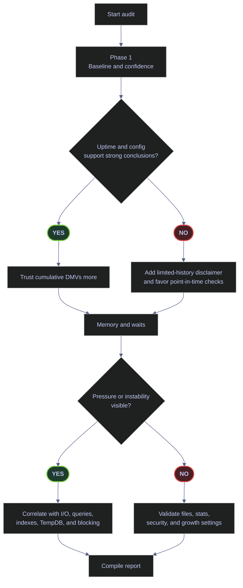
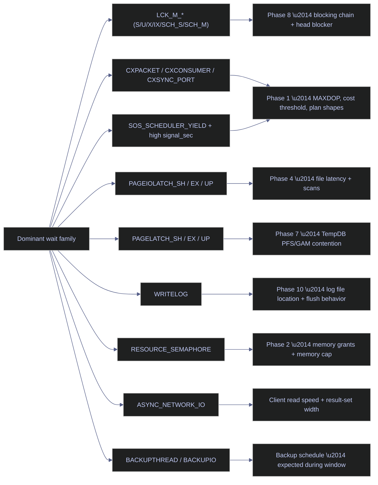
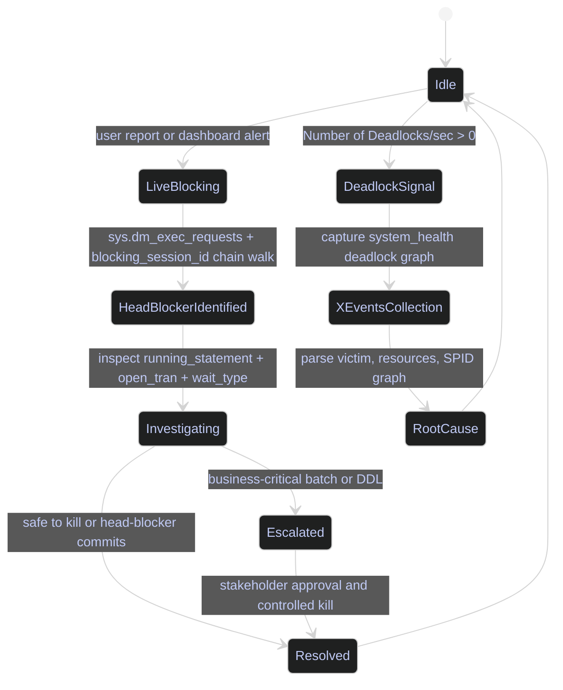
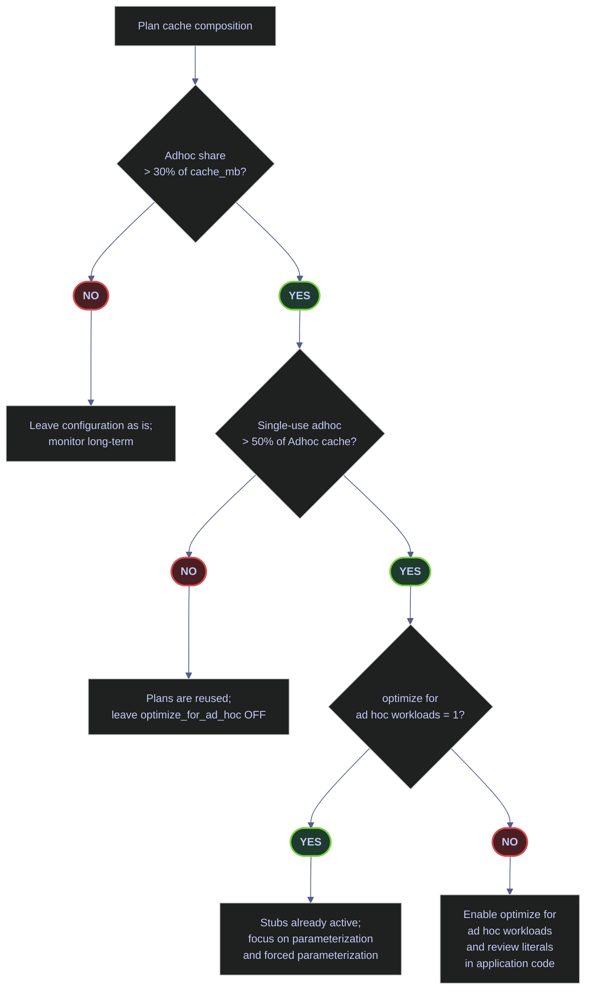
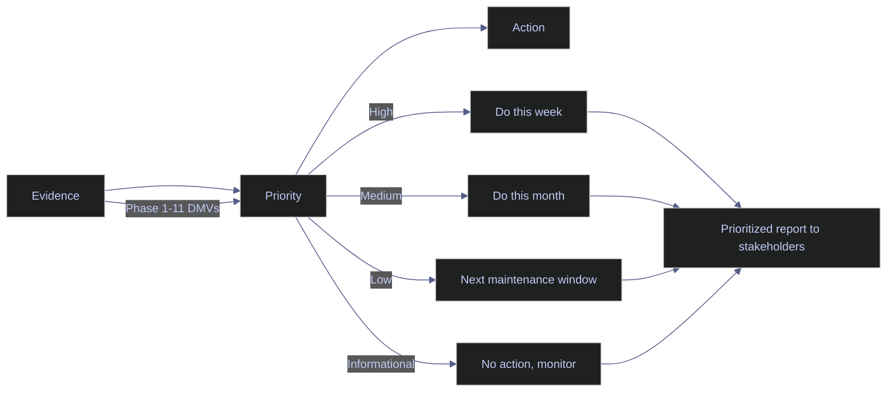

# Performance Audit Playbook

> [!abstract]- Summary
>
> This page is a production audit sequence, not a bag of disconnected DMV snippets. The goal is to move from instance context to workload signals, then to physical design, concurrency, capacity, and security. The queries are written in a production-facing form and the outputs below are real results from the current `stoxx` instance.
>
> - **Audit order matters**
>   - the phases are meant to run in order because Phase 1 establishes the confidence boundary for every later phase, especially when the instance has recently restarted and DMV history is short
> - **Instance and workload baseline**
>   - starts with build, uptime, configuration, memory, and waits so later interpretations are grounded in the actual engine state
> - **Performance surfaces**
>   - moves through I/O, expensive cached statements, index health, TempDB, blocking, deadlocks, statistics, and plan cache behavior
> - **Capacity and security checks**
>   - finishes with database files, log reuse, security quick checks, and report compilation so the audit ends as an actionable operational artifact
> - **Live evidence**
>   - every table below is captured from the current `stoxx` instance and should be treated as real evidence from one observation window rather than generic sample output

> [!note]- Glossary
>
> - **Audit baseline**
>   - initial context that determines how confidently later findings can be interpreted
> - **Cumulative DMV**
>   - DMV whose counters accumulate since instance start and therefore depend on uptime
> - **Point-in-time evidence**
>   - snapshot evidence that is useful right now but not necessarily representative of a full workload cycle
> - **Buffer pool**
>   - SQL Server memory region for cached data and index pages
> - **Wait family**
>   - category of waits that points to a resource bottleneck such as locks, CPU, storage, or memory
> - **RCSI**
>   - read committed snapshot isolation, where readers use row versions instead of shared locks under `READ COMMITTED`
> - **Missing-index signal**
>   - optimizer suggestion from missing-index DMVs that requires validation before implementation
> - **Plan cache**
>   - memory area storing compiled plans and execution metadata
> - **Log reuse**
>   - ability of SQL Server to recycle inactive transaction-log space
> - **TempDB health**
>   - combination of allocation, contention, and space signals inside `tempdb`
> - **Blocking**
>   - lock-based waiting where one session prevents another from proceeding
> - **`optimize for ad hoc workloads`**
>   - setting that stores plan stubs on first execution to reduce cache waste from one-off ad hoc queries



## Phase 1 | Instance Baseline

This phase establishes what can be trusted. Version determines available behavior and fixes. Uptime determines how much history DMVs and cumulative counters contain. Core configuration determines whether later symptoms come from workload problems, bad defaults, or both.

### Instance and database context

This subsection captures the engine baseline in one row, then checks the per-database defaults that most often distort a production audit.

#### Capture the instance baseline

**When to run:** first action of any audit, before touching any cumulative DMV.
**Trigger:** scheduled health check, unplanned performance complaint, post-restart verification, or drift-detection sweep across instances.
**Context:** single T-SQL session against the target instance, `VIEW SERVER STATE` required, strictly read-only, no restart or downtime implications.
**Purpose:** anchor every later cumulative finding against the engine build, uptime-driven confidence boundary, CPU and memory posture, and the four configuration knobs that dominate CPU and memory behavior.

The query is deliberately wide: it mixes `SERVERPROPERTY` metadata, live process state from `sys.dm_os_sys_info`, and current configuration values from `sys.configurations` so that every downstream phase has a ready-made baseline to reference without running extra queries.

| Field | Source | Type / Unit | Meaning |
|---|---|---|---|
| `version` | `SERVERPROPERTY('ProductVersion')` | `nvarchar`, dotted build | Full engine build number (e.g. `16.0.4236.2` = SQL Server 2022 CU). |
| `edition` | `SERVERPROPERTY('Edition')` | `nvarchar` | Product edition — determines feature availability (Developer, Standard, Enterprise, Express). |
| `patch_level` | `SERVERPROPERTY('ProductLevel')` | `nvarchar` | Service-pack or CU branch indicator — `RTM`, `SP1`, `CTP`, etc. |
| `uptime_days` | `DATEDIFF(DAY, sys.dm_os_sys_info.sqlserver_start_time, GETDATE())` | integer, days | Age of in-memory DMV history since the last service start. |
| `uptime_hours` | `DATEDIFF(HOUR, sys.dm_os_sys_info.sqlserver_start_time, GETDATE())` | integer, hours | Finer-grained uptime view for sub-day audits. |
| `logical_cpus` | `sys.dm_os_sys_info.cpu_count` | integer | Number of schedulers (logical processors) SQL Server sees. |
| `physical_memory_mb` | `sys.dm_os_sys_info.physical_memory_kb / 1024` | integer, MB | Total host RAM visible to SQL Server. |
| `committed_mb` | `sys.dm_os_sys_info.committed_kb / 1024` | integer, MB | Memory currently committed by the SQL Server process. |
| `target_mb` | `sys.dm_os_sys_info.committed_target_kb / 1024` | integer, MB | Memory the engine *wants* to commit — the ceiling it is currently working toward. |
| `maxdop` | `sys.configurations.value_in_use` where `name = 'max degree of parallelism'` | integer | Maximum schedulers a single query may use. `0` = unlimited. |
| `cost_threshold_for_parallelism` | `sys.configurations.value_in_use` where `name = 'cost threshold for parallelism'` | integer, cost units | Estimated plan cost above which a parallel plan is considered. |
| `max_server_memory_mb` | `sys.configurations.value_in_use` where `name = 'max server memory (MB)'` | bigint, MB | Upper bound on buffer-pool memory. `2147483647` means effectively uncapped. |
| `optimize_for_ad_hoc_workloads` | `sys.configurations.value_in_use` where `name = 'optimize for ad hoc workloads'` | integer, 0/1 | When `1`, the first execution of an ad hoc batch stores only a compiled-plan stub to reduce cache waste. |

> [!info]- Baseline query composition
>
> This query combines three categories of information into one output row.
>
> - `SERVERPROPERTY('ProductVersion')`, `SERVERPROPERTY('Edition')`, and `SERVERPROPERTY('ProductLevel')` identify the engine build, edition, and patch branch. These affect available features and supported tuning advice.
> - `DATEDIFF(DAY | HOUR, sqlserver_start_time, GETDATE())` measures how old the in-memory DMV history is. Wait stats, query stats, index-usage stats, and many counters are only meaningful in the context of uptime.
> - `cpu_count`, `physical_memory_kb`, `committed_kb`, and `committed_target_kb` come from `sys.dm_os_sys_info` and show the host-visible CPU count and SQL Server memory posture.
> - The scalar subqueries against `sys.configurations` retrieve the currently active values for `MAXDOP`, cost threshold, `max server memory`, and `optimize for ad hoc workloads`. Each one is wrapped in an explicit `CAST` because `value_in_use` is `sql_variant` and some client drivers (including `pyodbc`) cannot marshal that type.
> - The result is intentionally one row so the audit can begin with a compact baseline snapshot that is easy to compare across environments.

*Capture the SQL Server build, uptime, CPU and memory posture, and the core configuration values that govern parallelism, memory growth, and ad hoc plan caching.*

```sql
SELECT
    CAST(SERVERPROPERTY('ProductVersion') AS nvarchar(50)) AS version,
    CAST(SERVERPROPERTY('Edition')        AS nvarchar(100)) AS edition,
    CAST(SERVERPROPERTY('ProductLevel')   AS nvarchar(20))  AS patch_level,
    DATEDIFF(DAY,  sqlserver_start_time, GETDATE()) AS uptime_days,
    DATEDIFF(HOUR, sqlserver_start_time, GETDATE()) AS uptime_hours,
    cpu_count AS logical_cpus,
    physical_memory_kb  / 1024 AS physical_memory_mb,
    committed_kb        / 1024 AS committed_mb,
    committed_target_kb / 1024 AS target_mb,
    CAST((SELECT value_in_use FROM sys.configurations WHERE name = 'max degree of parallelism')     AS int)    AS maxdop,
    CAST((SELECT value_in_use FROM sys.configurations WHERE name = 'cost threshold for parallelism') AS int)    AS cost_threshold_for_parallelism,
    CAST((SELECT value_in_use FROM sys.configurations WHERE name = 'max server memory (MB)')         AS bigint) AS max_server_memory_mb,
    CAST((SELECT value_in_use FROM sys.configurations WHERE name = 'optimize for ad hoc workloads')  AS int)    AS optimize_for_ad_hoc_workloads
FROM sys.dm_os_sys_info;
```

| version | edition | patch_level | uptime_days | uptime_hours | logical_cpus | physical_memory_mb | committed_mb | target_mb | maxdop | cost_threshold_for_parallelism | max_server_memory_mb | optimize_for_ad_hoc_workloads |
|---|---|---|---:|---:|---:|---:|---:|---:|---:|---:|---:|---:|
| `16.0.4236.2` | `Developer Edition (64-bit)` | `RTM` | 0 | 5 | 16 | 24732 | 1940 | 22705 | 0 | 5 | 2147483647 | 0 |

_This instance is running SQL Server 2022 on a fresh uptime boundary: `uptime_days = 0` with `uptime_hours = 5`. That immediately reduces the confidence of every cumulative DMV below. The configuration row exposes three hardening gaps before any workload analysis starts: `maxdop = 0` on a 16-logical-CPU host, `cost threshold for parallelism = 5`, and `max server memory (MB)` left at the effectively-unlimited default `2147483647`. `optimize for ad hoc workloads = 0` becomes relevant again in Phase 9, where single-use ad hoc plans dominate cache memory. The memory column pair (`committed_mb = 1940` vs `target_mb = 22705`) shows SQL Server still climbing toward its uncapped target after restart — useful context when Phase 2 reports a warm buffer pool but a low absolute footprint._

> [!warning] Cumulative phases are uptime-limited
>
> The low uptime means Phases 3, 5, 6, 8, and 9 do not yet represent a full business cycle. Wait rankings, cached-plan rankings, and missing-index evidence captured here reflect only the last few hours of activity, which on this instance is dominated by backup and restore tests, TDE demo setup, and index-maintenance rehearsals.

> [!success] Treat early outputs as point-in-time evidence
>
> Use the current outputs as point-in-time evidence, and repeat every cumulative phase after a representative workload window before recommending lasting configuration changes. For instances that cannot wait, compare deltas between two snapshots rather than interpreting lifetime totals.

| Column | Value | Watch | Meaning | Implication |
|---|---|---|---|---|
| `uptime_days` | `0` | &#10060; | DMV and cumulative counter history started today. | Waits, cached-query rankings, and missing-index evidence are limited-history signals only. |
| `uptime_days` | `1-6` | Depends | Partial history. | Usable for point-in-time triage, weak for long-run tuning decisions. |
| `uptime_days` | `>= 7` | &#9989; | The instance has at least one week of history. | Cumulative DMVs are usually much more representative. |
| `uptime_days` | `> 180` | Depends | Very long uptime. | Good history but some counters may be skewed by rare incidents from months ago; consider delta-sampling. |
| `maxdop` | `0` | &#10060; on hosts with `> 8` logical CPUs | A single query can use all available schedulers, subject to optimizer choice. | Can amplify parallel overhead and distort wait patterns. Microsoft's starting point is `MAXDOP = 8` for most OLTP workloads. |
| `maxdop` | `1` | Depends | Parallelism disabled instance-wide. | Only appropriate for specific workloads such as SharePoint; makes large analytic queries single-threaded. |
| `maxdop` | `2` to `logical_cpus/2` | &#9989; | Bounded parallelism. | Usually the healthy range for mixed OLTP/analytic workloads. |
| `cost_threshold_for_parallelism` | `5` | &#10060; on modern production systems | Very cheap statements can qualify for parallel plans. | Common source of unnecessary `CX*` waits and worker pressure. Raise to `25-50` for most instances. |
| `cost_threshold_for_parallelism` | `25-50` | &#9989; | Only meaningfully expensive queries go parallel. | Aligns with Microsoft's modern guidance. |
| `max_server_memory_mb` | `2147483647` | &#10060; | SQL Server is effectively uncapped. | The OS becomes the back-pressure mechanism instead of the configuration. Set an explicit cap leaving ~`20%` of RAM (minimum `4 GB`) for the OS and non-SQL services. |
| `max_server_memory_mb` | Explicit, leaves `>= 4 GB` for OS | &#9989; | Cap is tuned. | OS has headroom for kernel, filesystem cache, and backup agents. |
| `optimize_for_ad_hoc_workloads` | `0` | Depends | First execution of an ad hoc statement stores a full compiled plan. | Usually acceptable on well-parameterized workloads, wasteful on ad hoc-heavy ones (see Phase 9). |
| `optimize_for_ad_hoc_workloads` | `1` | &#9989; on ad hoc-heavy instances | First execution stores only a compiled-plan stub. | Reclaims cache memory from throwaway plans with no downside for reused queries. |
| `committed_mb` vs `target_mb` | `committed << target` | Depends | SQL Server has room to grow under current workload. | Normal shortly after restart. Watch the ratio close if `committed` stalls well below `target` over time. |
| `committed_mb` vs `target_mb` | `committed ≈ target` | &#9989; | Buffer pool is fully warmed. | Expected steady-state on busy instances. |

#### Review database inventory and risky defaults

**When to run:** directly after the instance baseline, before any workload-level query.
**Trigger:** first audit of an unfamiliar instance, post-migration validation, or investigation of why a specific database behaves differently from the rest.
**Context:** single T-SQL session, `VIEW ANY DEFINITION` or `sysadmin`, read-only against `sys.databases`, no locking risk.
**Purpose:** expose the per-database defaults (recovery model, compatibility level, RCSI, auto-shrink, auto-stats) that most frequently distort cumulative DMVs and mask or amplify later findings.

`sys.databases` is the authoritative catalog view for the settings below. Every row on the instance — including system databases, offline databases, and AG secondaries in their `RESTORING` state — appears once, which makes this the correct inventory source rather than `DATABASEPROPERTYEX`.

| Field | Source | Type / Unit | Meaning |
|---|---|---|---|
| `name` | `sys.databases.name` | `sysname` | Logical database name. |
| `state_desc` | `sys.databases.state_desc` | `nvarchar(60)` | Operational state — `ONLINE`, `RESTORING`, `RECOVERING`, `RECOVERY_PENDING`, `SUSPECT`, `EMERGENCY`, `OFFLINE`. |
| `recovery_model_desc` | `sys.databases.recovery_model_desc` | `nvarchar(60)` | `SIMPLE`, `BULK_LOGGED`, or `FULL`. Controls log-reuse and backup-chain behavior. |
| `compatibility_level` | `sys.databases.compatibility_level` | `tinyint` | Optimizer/cardinality-estimator version (100 = 2008, 150 = 2019, 160 = 2022). |
| `rcsi` | `sys.databases.is_read_committed_snapshot_on` | `bit` | `1` = `READ COMMITTED` uses row versions instead of shared locks. |
| `auto_shrink` | `sys.databases.is_auto_shrink_on` | `bit` | `1` = automatic shrink enabled. |
| `auto_stats` | `sys.databases.is_auto_create_stats_on` | `bit` | `1` = engine may auto-create single-column stats on demand. |
| `auto_update_stats` | `sys.databases.is_auto_update_stats_on` | `bit` | `1` = engine may auto-refresh stats when modification thresholds are hit. |

> [!info]- Production inventory query composition
>
> This query is a production inventory query, not a lab shortcut.
>
> - `state_desc` tells you whether the database is actually online and queryable.
> - `recovery_model_desc` matters for log reuse and backup-chain expectations.
> - `compatibility_level` determines optimizer behavior and whether modern IQP features are even available.
> - `is_read_committed_snapshot_on` indicates whether default `READ COMMITTED` readers use row-versioning instead of shared locks.
> - `is_auto_shrink_on`, `is_auto_create_stats_on`, and `is_auto_update_stats_on` surface database-level defaults that can quietly degrade performance if they are wrong.

*Inventory database state, recovery model, compatibility level, RCSI, and auto-statistics defaults across the instance.*

```sql
SELECT
    name,
    state_desc,
    recovery_model_desc,
    compatibility_level,
    is_read_committed_snapshot_on AS rcsi,
    is_auto_shrink_on             AS auto_shrink,
    is_auto_create_stats_on       AS auto_stats,
    is_auto_update_stats_on       AS auto_update_stats
FROM sys.databases
ORDER BY name;
```

| name | state_desc | recovery_model_desc | compatibility_level | rcsi | auto_shrink | auto_stats | auto_update_stats |
|---|---|---|---:|---:|---:|---:|---:|
| `codex_tde_demo` | `ONLINE` | `FULL` | 160 | 0 | 0 | 1 | 1 |
| `master` | `ONLINE` | `SIMPLE` | 160 | 0 | 0 | 1 | 1 |
| `model` | `ONLINE` | `FULL` | 160 | 0 | 0 | 1 | 1 |
| `msdb` | `ONLINE` | `SIMPLE` | 160 | 0 | 0 | 1 | 1 |
| `stoxx` | `ONLINE` | `FULL` | 160 | 0 | 0 | 1 | 1 |
| `stoxx_backup` | `ONLINE` | `FULL` | 160 | 0 | 0 | 1 | 1 |
| `stoxx_db` | `ONLINE` | `FULL` | 160 | 1 | 0 | 1 | 1 |
| `tempdb` | `ONLINE` | `SIMPLE` | 160 | 0 | 0 | 1 | 1 |

_Database-level defaults are mostly healthy: every database is online, `compatibility_level = 160` (SQL Server 2022), `auto_shrink = 0` everywhere, and automatic statistics are enabled universally. The operational questions are narrower and database-specific. Three user databases (`stoxx`, `stoxx_backup`, `stoxx_db`) are in `FULL` recovery, which means log-reuse findings in Phase 10 must be judged in that context — and `codex_tde_demo` (also `FULL`) is relevant because a TDE demo database that is never log-backed will accumulate log space indefinitely. `stoxx_db` is the only database with `rcsi = 1`, meaning its `READ COMMITTED` readers use row versions instead of shared locks; that distinction matters when the same audit window touches multiple databases with different concurrency semantics. Every other database still uses lock-based `READ COMMITTED`, which is the implicit default and deserves an explicit decision on busy mixed-workload systems rather than being left by accident._

| Column | Value | Watch | Meaning | Implication |
|---|---|---|---|---|
| `state_desc` | `ONLINE` | &#9989; | Database is available for normal access. | Baseline healthy state. |
| `state_desc` | `RESTORING` / `RECOVERING` | Depends | Transient recovery state. | Expected during restores and AG seeding; alarming outside those windows. |
| `state_desc` | `SUSPECT` / `RECOVERY_PENDING` / `EMERGENCY` | &#10060; | Database is damaged or cannot recover. | Availability is broken; performance findings are secondary. |
| `state_desc` | `OFFLINE` | Depends | Explicitly taken offline. | Verify the reason; may mask capacity planning. |
| `compatibility_level` | `160` | &#9989; | SQL Server 2022 database compatibility level. | Modern optimizer and IQP features can be used. |
| `compatibility_level` | `<= 140` | Depends | SQL Server 2017 or earlier CE. | Consider testing plan regressions before raising; some tuning advice below assumes modern CE. |
| `rcsi` | `0` | Depends | Default read-committed behavior still uses locking, not row-versioning. | On busy OLTP systems, reader/writer blocking deserves special attention. |
| `rcsi` | `1` | Depends | `READ COMMITTED` uses row versions. | Reduces reader/writer blocking, but increases `tempdb` version-store use. |
| `auto_shrink` | `0` | &#9989; | Auto-shrink is disabled. | Avoids shrink/regrow churn and fragmentation. |
| `auto_shrink` | `1` | &#10060; | Database can shrink itself automatically. | Strong operational anti-pattern; disable immediately and never pair with auto-grow. |
| `auto_stats` / `auto_update_stats` | `1` | &#9989; | Automatic statistics creation and refresh are enabled. | Sensible default for most workloads. |
| `auto_stats` / `auto_update_stats` | `0` | &#10060; | Automatic creation or refresh is suppressed. | Optimizer flies blind; justify only in tightly managed statistics-maintenance regimes. |
| `recovery_model_desc` | `FULL` | Depends | Full recovery chain expected. | Log reuse must be interpreted with backup and restore policy in mind. |
| `recovery_model_desc` | `SIMPLE` | Depends | Log truncates on checkpoint. | No point-in-time recovery; verify business RPO still permits this. |
| `recovery_model_desc` | `BULK_LOGGED` | Depends | Minimally-logged bulk ops. | Usually only during bulk loads; leaving it permanently active is a recoverability risk. |

## Phase 2 | Memory and Buffer Pool

This phase checks whether the instance is actually under memory pressure, how the buffer pool is distributed, and whether any query is currently waiting for a memory grant.

### Working-set and memory-pressure checks

These queries answer three different questions: who owns the buffer pool, whether page churn is high, and whether any query is blocked waiting for workspace memory.

#### Measure buffer-pool ownership by database

**When to run:** first check of Phase 2, before interpreting PLE or wait data.
**Trigger:** suspected memory pressure, unexplained `PAGEIOLATCH_*` waits, multi-database instance where one workload may be starving another.
**Context:** single T-SQL session, `VIEW SERVER STATE`, read-only. On busy instances `sys.dm_os_buffer_descriptors` can be expensive to scan; run during a calm window when possible.
**Purpose:** expose how buffer-pool memory is distributed across databases so that later PLE and wait findings can be attributed to the right workload.

`sys.dm_os_buffer_descriptors` exposes one row per cached 8 KB data page. Grouping by `database_id` aggregates pages into a per-database footprint, and multiplying by 8 KB (`COUNT(*) * 8 / 1024`) converts pages to MB.

| Field | Source | Type / Unit | Meaning |
|---|---|---|---|
| `db_name` | `DB_NAME(sys.dm_os_buffer_descriptors.database_id)` | `sysname` | Database the cached page belongs to. `NULL` = system-level allocations not tied to a user database (free pages, resource DB, internal). |
| `buffer_pool_mb` | `COUNT(*) * 8 / 1024` over `sys.dm_os_buffer_descriptors` | integer, MB | Total cached pages rolled up to megabytes (1 page = 8 KB). |

> [!info]- Buffer-pool breakdown query composition
>
> `sys.dm_os_buffer_descriptors` exposes one row per data page currently cached in the buffer pool.
>
> - `database_id` is translated with `DB_NAME` so the result is readable without a join.
> - `COUNT(*) * 8 / 1024` converts cached pages into megabytes because SQL Server pages are 8 KB each.
> - Grouping by database shows whether one database is dominating the cache and pushing other workloads out of RAM.
> - The `NULL` database row represents pages that are not associated with a user database in the normal way, such as free buffers or internal allocations.

*Measure how much of the buffer pool is currently occupied by each database.*

```sql
SELECT
    DB_NAME(database_id) AS db_name,
    COUNT(*) * 8 / 1024  AS buffer_pool_mb
FROM sys.dm_os_buffer_descriptors
GROUP BY database_id
ORDER BY buffer_pool_mb DESC;
```

| db_name | buffer_pool_mb |
|---|---:|
| `stoxx` | 480 |
| `NULL` | 18 |
| `stoxx_backup` | 16 |
| `msdb` | 8 |
| `tempdb` | 8 |
| `codex_tde_demo` | 8 |
| `model_msdb` | 4 |
| `stoxx_db` | 3 |
| `model_replicatedmaster` | 3 |
| `master` | 2 |
| `model` | 0 |

_`stoxx` dominates the useful cache at `480 MB` — expected since it is the primary workload database on this instance. `stoxx_backup` appearing at `16 MB` is the residue of recent backup/restore rehearsals rather than an active workload. `tempdb` at `8 MB` is noticeably quiet compared to the earlier audit window, matching the Phase 7 finding that `tempdb` has been reset to minimal 8 MB files. The eight other databases each hold single-digit MB and together account for under `60 MB`, so there is no multi-database cache fight to diagnose. The important context is absolute scale: the instance is using roughly `550 MB` of data cache on a host with `24 GB` of RAM and an uncapped memory target of `22705 MB`. The buffer pool has not yet warmed — not because of pressure, but because only a fraction of the working set has been touched since the 5-hour-old restart._

| Column | Value | Watch | Meaning | Implication |
|---|---|---|---|---|
| `db_name` | User database dominates | Depends | Most cache belongs to the main workload database. | Usually normal on single-tenant instances. |
| `db_name` | `tempdb` unusually large (> ~20% of total) | Depends | Temp objects, spills, or version-store activity are consuming cache. | Correlate with Phase 7 before calling it a problem. |
| `db_name` | `NULL` small | &#9989; | Minor internal or unassigned buffer usage. | Normal. |
| `db_name` | `NULL` large and growing | Depends | Unusual system-level buffer use. | Check for DBCC operations, resource database activity, or memory clerks. |
| `buffer_pool_mb` | Concentrated in one DB with healthy PLE | &#9989; | Working set is stable in memory. | Not a standalone concern. |
| `buffer_pool_mb` | One DB dominates while others thrash | &#10060; context-dependent | One workload may be flushing others from cache. | Validate with low PLE, scans, and I/O waits before acting. |
| `buffer_pool_mb` | Total `<< target_mb` shortly after restart | Depends | Buffer pool is still warming up. | Normal; revisit once `committed_mb` approaches `target_mb`. |
| `buffer_pool_mb` | Total `<< target_mb` after steady-state uptime | Depends | Working set may be genuinely small, or internal caches are consuming memory. | Inspect memory clerks in `sys.dm_os_memory_clerks` to attribute usage. |

#### Check Page Life Expectancy by buffer node

**When to run:** immediately after the buffer-pool breakdown, as the second memory-pressure signal.
**Trigger:** suspected memory pressure, reports of slow queries with high physical reads, planning NUMA layout changes, or validating that the buffer pool has warmed.
**Context:** single T-SQL session, `VIEW SERVER STATE`, read-only. The query is trivial.
**Purpose:** quantify how long a data page survives in the buffer pool before being evicted, and confirm the value is consistent across NUMA nodes.

`sys.dm_os_performance_counters` exposes both the instance-aggregate `Buffer Manager` PLE and one row per NUMA buffer node under `Buffer Node`. Comparing the two is essential because a healthy aggregate value can hide one starved node on multi-socket hardware.

| Field | Source | Type / Unit | Meaning |
|---|---|---|---|
| `object_name` | `sys.dm_os_performance_counters.object_name` | `nchar(128)` | Performance-object name (e.g. `SQLServer:Buffer Manager` or `SQLServer:Buffer Node`). Trailing whitespace is common and harmless. |
| `counter_name` | `sys.dm_os_performance_counters.counter_name` | `nchar(128)` | Name of the specific counter — here locked to `Page life expectancy`. |
| `instance_name` | `sys.dm_os_performance_counters.instance_name` | `nchar(128)` | NUMA node index (`000`, `001`, …) for the `Buffer Node` object; empty for the aggregate. |
| `ple_seconds` | `sys.dm_os_performance_counters.cntr_value` | `bigint`, seconds | Average residency time of pages in that buffer pool. |

> [!info]- PLE query composition
>
> `sys.dm_os_performance_counters` exposes both the aggregate `Buffer Manager` PLE and per-node `Buffer Node` PLE.
>
> - `counter_name = 'Page life expectancy'` filters to the exact metric.
> - `object_name LIKE '%Buffer%'` returns both the aggregate object and any per-node counters.
> - Comparing node-level values is important on NUMA systems because a healthy aggregate can hide one starved node.
> - The legacy `300 seconds` threshold dates from the 4 GB era and is no longer meaningful on modern hardware; use the dynamic rule of thumb `ple_seconds >= 300 * (buffer_pool_gb / 4)` or better, track PLE trends and drops over time rather than absolute values.

*Check how long pages remain in memory at both the aggregate and per-node level.*

```sql
SELECT
    object_name,
    counter_name,
    instance_name,
    cntr_value AS ple_seconds
FROM sys.dm_os_performance_counters
WHERE counter_name = 'Page life expectancy'
  AND object_name LIKE '%Buffer%'
ORDER BY object_name, instance_name;
```

| object_name | counter_name | instance_name | ple_seconds |
|---|---|---|---:|
| `SQLServer:Buffer Manager` | `Page life expectancy` |  | 18103 |
| `SQLServer:Buffer Node` | `Page life expectancy` | `000` | 18103 |

_This is a healthy point-in-time PLE result. `18103` seconds is almost exactly five hours — effectively the full uptime of the instance — which means no meaningful page eviction has occurred since startup. Aggregate and node `000` PLE are identical, which is the expected shape on a single-NUMA-node container host. On this instance, low PLE is categorically not the bottleneck to chase first. The five-hour number should be re-interpreted once the instance has a full business cycle of uptime; a PLE value that simply tracks uptime is weaker evidence of memory health than one that plateaus after workload reaches a steady state._

| Column | Value | Watch | Meaning | Implication |
|---|---|---|---|---|
| `ple_seconds` | High and stable | &#9989; | Pages remain in memory for a long time. | Memory pressure is unlikely right now. |
| `ple_seconds` | Tracks uptime linearly on a fresh instance | Depends | Buffer pool has never been forced to evict. | Value is informative but reflects lack of pressure rather than proven resilience; re-check after steady-state uptime. |
| `ple_seconds` | Persistently low relative to `300 * buffer_pool_gb / 4` | &#10060; | Pages are being evicted quickly. | Correlate with scans, I/O, grants, and memory cap before concluding root cause. |
| `ple_seconds` | Sudden drop | &#10060; | A query, maintenance operation, or process restart evicted large portions of cache. | Capture the time and correlate with workload events. |
| `instance_name` | Aggregate and node values similar | &#9989; | No obvious node skew. | NUMA-local pressure is not visible. |
| `instance_name` | One node much lower than others | &#10060; | One buffer node is under disproportionate churn. | Investigate NUMA locality, scheduler skew, and workload placement. |
| `instance_name` | Only node `000` present | Depends | Single NUMA node (container, laptop, small VM). | Aggregate vs node comparison is meaningless; just read the single value. |

#### Check pending memory grants

**When to run:** as the third memory check, directly after PLE.
**Trigger:** users report queries "stuck before running", dashboards show `RESOURCE_SEMAPHORE` waits, investigation of seemingly idle sessions that consume workspace memory.
**Context:** single T-SQL session, `VIEW SERVER STATE`, read-only, point-in-time snapshot of the live grant queue.
**Purpose:** determine whether any query is currently queued for workspace memory rather than executing, which distinguishes grant starvation from buffer-pool pressure.

`sys.dm_exec_query_memory_grants` is the authoritative live view of workspace-memory requests. Rows where `grant_time IS NOT NULL` are already running; rows where `grant_time IS NULL` are queued behind the memory-grant semaphore.

| Field | Source | Type / Unit | Meaning |
|---|---|---|---|
| `session_id` | `sys.dm_exec_query_memory_grants.session_id` | `smallint` | The session whose query is waiting for (or holding) a grant. |
| `requested_mb` | `sys.dm_exec_query_memory_grants.requested_memory_kb / 1024` | integer, MB | Workspace memory the optimizer requested for sorts, hashes, parallelism, and bulk operators. |
| `granted_mb` | `sys.dm_exec_query_memory_grants.granted_memory_kb / 1024` | integer, MB | Workspace memory actually granted so far. `0` while the request is queued. |
| `wait_sec` | `sys.dm_exec_query_memory_grants.wait_time_ms / 1000.0` | decimal, seconds | How long this request has already been queued. |

> [!info]- Pending-grant query composition
>
> `sys.dm_exec_query_memory_grants` shows queries that requested workspace memory for sorts, hashes, and similar operators.
>
> - `grant_time IS NULL` filters to requests that are still waiting rather than already granted.
> - `requested_memory_kb` and `granted_memory_kb` are converted to megabytes for operational readability.
> - `wait_time_ms / 1000.0` exposes how long the request has already been waiting.
> - Zero rows is a meaningful healthy state. A "no rows" result from this specific DMV is the desired answer, not a missing signal.

*Check whether any query is currently waiting for a memory grant rather than executing.*

```sql
SELECT
    session_id,
    requested_memory_kb / 1024 AS requested_mb,
    granted_memory_kb   / 1024 AS granted_mb,
    wait_time_ms        / 1000.0 AS wait_sec
FROM sys.dm_exec_query_memory_grants
WHERE grant_time IS NULL;
```

| session_id | requested_mb | granted_mb | wait_sec |
|---|---|---|---|

_No query is currently queued for memory. That is the desired result. It means there is no visible `RESOURCE_SEMAPHORE` style grant backlog at capture time. This has to be interpreted alongside Phase 3: if `RESOURCE_SEMAPHORE` appears prominently there, the audit window missed live grant starvation and a repeat capture during peak hours is warranted. On a pressured system, even a few waiting rows matter because grant starvation can stall otherwise efficient queries while the cached plan keeps them in a runnable-but-blocked state._

| Column | Value | Watch | Meaning | Implication |
|---|---|---|---|---|
| Result set | No rows | &#9989; | No query is waiting for a memory grant right now. | Memory grants are not a live bottleneck. |
| Result set | A few transient rows | Depends | Queries briefly queued. | Often normal on busy OLTP instances; confirm `wait_sec` is low. |
| Result set | Many rows, growing over repeated captures | &#10060; | Persistent grant backlog. | Investigate memory cap, DOP, cardinality estimates, and Resource Governor workload groups. |
| `requested_mb` | Large and growing | &#10060; if paired with waits | Query wants a large workspace memory allocation. | Investigate joins, sorts, estimates, DOP, and stats quality. |
| `granted_mb` | `0` with waiting row | &#10060; | Grant not yet issued. | Query is blocked before execution can proceed. |
| `granted_mb` | `< requested_mb` on running query | Depends | Partial grant; SQL Server trimmed the ask. | May cause operator spills — correlate with `tempdb` internal usage (Phase 7). |
| `wait_sec` | `< 1 sec` | &#9989; | Fast-draining queue. | Not a bottleneck. |
| `wait_sec` | Increasing over consecutive captures | &#10060; | The queue is not draining quickly. | Correlate with `RESOURCE_SEMAPHORE`, memory cap, and expensive parallel plans. |

## Phase 3 | Wait Statistics

Wait stats are instance-level evidence about where SQL Server has spent time waiting for resources. They do not identify the root cause by themselves. Use them to choose the next branch of investigation, then confirm with the phase that matches the dominant wait family.



### Top cumulative waits

#### Capture the top cumulative waits

**When to run:** after the baseline and memory phases, before diving into I/O, query, or blocking detail.
**Trigger:** any performance investigation where the root cause is not already known; cumulative triage after an incident; validating the effect of a configuration change after a full workload cycle.
**Context:** single T-SQL session, `VIEW SERVER STATE`, read-only. Cumulative since last restart or explicit `DBCC SQLPERF('sys.dm_os_wait_stats', CLEAR)`.
**Purpose:** rank actionable waits and choose the next investigative branch. Not a root cause by itself — wait stats point to the family of bottleneck, which then has to be confirmed with the matching detail phase.

> [!warning] Short-uptime cumulative bias
>
> Wait statistics are cumulative since startup, and this instance restarted approximately five hours before the capture window. Short uptime and recent admin activity can dominate the top rows; the numbers below reflect startup work, index-maintenance rehearsals, backup tests, and TDE demo setup rather than a production business cycle.

> [!success] Use waits as a branch selector, not a verdict
>
> Use the top waits to choose where to investigate next, not as a standalone verdict. If uptime is short, repeat this phase after a full workload window or compare deltas between two `sys.dm_os_wait_stats` snapshots instead of lifetime totals. For durable longitudinal wait stats, use Query Store's `sys.query_store_wait_stats` view, which survives plan-cache churn and restarts.

| Field | Source | Type / Unit | Meaning |
|---|---|---|---|
| `wait_type` | `sys.dm_os_wait_stats.wait_type` | `nvarchar(60)` | Engine-defined wait type name (e.g. `LCK_M_U`, `CXPACKET`, `PAGEIOLATCH_SH`). |
| `wait_sec` | `sys.dm_os_wait_stats.wait_time_ms / 1000.0` | decimal, seconds | Total cumulative wait time in seconds, including signal time. |
| `signal_sec` | `sys.dm_os_wait_stats.signal_wait_time_ms / 1000.0` | decimal, seconds | Time between a resource becoming available and the task being scheduled on a CPU. High share → scheduler / CPU pressure. |
| `waiting_count` | `sys.dm_os_wait_stats.waiting_tasks_count` | `bigint` | Number of tasks that have contributed to this wait type since startup. |
| `pct` | `100.0 * wait_time_ms / SUM(wait_time_ms) OVER ()` | decimal, `%` | Share of cumulative wait time among the non-excluded wait types. |

> [!info]- Waits ranking query composition
>
> This query reads `sys.dm_os_wait_stats` and removes the most common benign background waits so the output is dominated by actionable waits.
>
> - `wait_time_ms / 1000.0` and `signal_wait_time_ms / 1000.0` convert the cumulative wait totals into seconds.
> - `waiting_tasks_count` shows how many tasks have contributed to each wait type.
> - `pct` expresses each wait type as a percentage of the remaining wait-time total after filtering, so the rows rank against the signal budget rather than against absolute seconds that drift with uptime.
> - The explicit exclusion list removes common idle and housekeeping waits that would otherwise crowd out real workload signals. It is the same list used by the Paul Randal community baseline and is compatible with SQL Server 2017 through 2022.
> - `signal_sec` is especially important. Signal wait above ~`25%` of total wait implies runnable tasks are waiting on CPU scheduling rather than on external resources.

*Rank the most significant cumulative waits after excluding common idle and housekeeping waits.*

```sql
WITH waits AS (
    SELECT
        wait_type,
        wait_time_ms / 1000.0 AS wait_sec,
        signal_wait_time_ms / 1000.0 AS signal_sec,
        waiting_tasks_count AS waiting_count,
        100.0 * wait_time_ms / SUM(wait_time_ms) OVER () AS pct
    FROM sys.dm_os_wait_stats
    WHERE wait_type NOT IN (
        'SLEEP_TASK', 'LAZYWRITER_SLEEP', 'WAITFOR', 'BROKER_RECEIVE_WAITFOR',
        'BROKER_EVENTHANDLER', 'CLR_AUTO_EVENT', 'CLR_MANUAL_EVENT',
        'DISPATCHER_QUEUE_SEMAPHORE', 'XE_DISPATCHER_WAIT', 'DIRTY_PAGE_POLL',
        'HADR_FILESTREAM_IOMGR_IOCOMPLETION', 'SP_SERVER_DIAGNOSTICS_SLEEP',
        'QDS_PERSIST_TASK_MAIN_LOOP_SLEEP', 'QDS_CLEANUP_STALE_QUERIES_TASK_MAIN_LOOP_SLEEP',
        'QDS_ASYNC_QUEUE', 'SQLTRACE_INCREMENTAL_FLUSH_SLEEP', 'CHECKPOINT_QUEUE',
        'FT_IFTS_SCHEDULER_IDLE_WAIT', 'XE_TIMER_EVENT', 'LOGMGR_QUEUE',
        'REQUEST_FOR_DEADLOCK_SEARCH', 'RESOURCE_QUEUE', 'SERVER_IDLE_CHECK',
        'SQLTRACE_BUFFER_FLUSH', 'WAIT_XTP_OFFLINE_CKPT_NEW_LOG', 'BROKER_TO_FLUSH',
        'BROKER_TASK_STOP', 'DBMIRRORING_CMD', 'PREEMPTIVE_OS_PIPEOPS',
        'PREEMPTIVE_XE_GETTARGETSTATE', 'ONDEMAND_TASK_QUEUE',
        'SOS_WORK_DISPATCHER', 'PWAIT_EXTENSIBILITY_CLEANUP_TASK'
    )
      AND waiting_tasks_count > 0
)
SELECT TOP (10)
    wait_type,
    CAST(wait_sec AS decimal(18,1)) AS wait_sec,
    CAST(signal_sec AS decimal(18,1)) AS signal_sec,
    waiting_count,
    CAST(pct AS decimal(10,2)) AS pct
FROM waits
ORDER BY wait_sec DESC;
```

| wait_type | wait_sec | signal_sec | waiting_count | pct |
|---|---:|---:|---:|---:|
| `LCK_M_U` | 71.0 | 0.0 | 11 | 42.27 |
| `BACKUPTHREAD` | 16.2 | 0.0 | 384 | 9.65 |
| `BACKUPIO` | 15.2 | 0.2 | 6232 | 9.06 |
| `PARALLEL_REDO_WORKER_WAIT_WORK` | 8.7 | 0.4 | 1551 | 5.19 |
| `STARTUP_DEPENDENCY_MANAGER` | 8.6 | 0.0 | 90 | 5.14 |
| `LCK_M_X` | 5.9 | 0.0 | 9 | 3.54 |
| `PREEMPTIVE_OS_AUTHENTICATIONOPS` | 4.4 | 0.0 | 4148 | 2.64 |
| `LCK_M_S` | 3.5 | 0.0 | 107 | 2.07 |
| `SLEEP_DBSTARTUP` | 3.5 | 0.0 | 34 | 2.06 |
| `MEMORY_ALLOCATION_EXT` | 2.9 | 0.0 | 567817 | 1.71 |

_The raw ranking is dominated by restart aftermath and recent backup / restore rehearsals, not by a long-lived production pattern. `LCK_M_U` at `42.27%` comes from a handful of demo sessions (`waiting_count = 11`) rather than a chronic hot row, which is exactly the distortion the short-uptime warning above is meant to flag. `BACKUPTHREAD` and `BACKUPIO` together account for almost `19%` — this is the signature of the `stoxx_backup` rehearsals run against the instance earlier today and is expected to disappear once the backup window closes. `PARALLEL_REDO_WORKER_WAIT_WORK` and `STARTUP_DEPENDENCY_MANAGER` are both startup-time signals that will fall out of the top 10 on any instance with normal uptime. The absence of `CXPACKET`, `CXSYNC_PORT`, and `CXCONSUMER` from the top 10 is notable given the unhealthy parallelism configuration from Phase 1 (`MAXDOP = 0`, `cost threshold = 5`); it reinforces that the current wait ranking is backup- and lock-dominated, not workload-dominated, and must not be used as a parallelism tuning verdict. The near-zero `signal_sec` across every row confirms that CPU scheduling is not the primary driver — all of these are resource waits, not runnable-queue waits._

| Column | Value | Watch | Meaning | Implication |
|---|---|---|---|---|
| `wait_type` | `LCK_M_*` | Depends | Lock waits. The exact suffix indicates lock mode (`S`, `U`, `X`, `IX`, `SCH_S`, `SCH_M`). | Correlate with Phase 8 and identify the head blocker before tuning anything else. |
| `wait_type` | `CXPACKET`, `CXCONSUMER`, `CXSYNC_PORT` | Depends | Parallel exchange and synchronization waits. | Validate with `MAXDOP`, cost threshold, data skew, and actual parallel query plans. |
| `wait_type` | `PAGEIOLATCH_SH / EX / UP` | &#10060; if sustained | Data-page I/O waits. | Jump to Phase 4 and buffer-pool checks. |
| `wait_type` | `PAGELATCH_SH / EX / UP` | Depends | In-memory page latch contention (often `tempdb` PFS/GAM/SGAM or hot b-tree pages). | Jump to Phase 7 for TempDB, or investigate hot-spot page design. |
| `wait_type` | `WRITELOG` | &#10060; if sustained | Flush to log file. | Inspect Phase 4 log-file latency and commit patterns; consider batching. |
| `wait_type` | `RESOURCE_SEMAPHORE` | &#10060; | Workspace memory grants are queuing. | Return to Phase 2 grant check; review memory cap and estimated grant sizes. |
| `wait_type` | `SOS_SCHEDULER_YIELD` | Depends | Cooperative scheduler yields; usually CPU-bound. | Confirm CPU saturation; check parallelism and aggressive query cost. |
| `wait_type` | `ASYNC_NETWORK_IO` | Depends | Client is slow to consume rows. | Investigate client-side paging, result-set width, or network latency. |
| `wait_type` | `BACKUPTHREAD` / `BACKUPIO` | Depends | Backup workers in flight. | Expected during backup windows; problematic only when saturating the I/O path. |
| `signal_sec` | Small fraction of `wait_sec` | &#9989; relative to CPU | Most wait time is resource wait, not scheduler wait. | CPU starvation is not the primary interpretation of this snapshot. |
| `signal_sec` | More than ~`25%` of total wait | &#10060; | Runnable tasks are spending a high share of time waiting to get CPU. | Investigate CPU pressure, runnable queues, and aggressive parallelism. |
| `pct` | One family dominates | Depends | A small number of waits consume most cumulative time. | Use that family to choose the next investigative phase. |
| `pct` | No single family above ~`15%` | Depends | Broad, diffuse waits. | Common on healthy instances; switch to delta sampling or Query Store `query_store_wait_stats` for sharper signal. |

## Phase 4 | I/O Performance

I/O latency determines how expensive physical reads and writes are when the buffer pool cannot absorb the workload. The goal in this phase is not just to find slow files, but to separate storage latency from query-shape problems such as scans, spills, or unnecessary writes.

### File-level latency

#### Measure average read and write stall by file

**When to run:** after Phase 3 when waits suggest I/O (`PAGEIOLATCH_*`, `WRITELOG`, `IO_COMPLETION`, `BACKUPIO`), or as routine Phase 4 triage.
**Trigger:** users report slow queries under cold cache, dashboards show rising physical reads, storage migration validation, pre- and post-change comparison when moving a database to new storage.
**Context:** single T-SQL session, `VIEW SERVER STATE`, read-only. `sys.dm_io_virtual_file_stats` is lightweight and safe at any time; results are cumulative since SQL Server start or file creation.
**Purpose:** separate storage latency from query-shape problems by measuring average read and write stall per file, then attributing slow storage to specific data or log paths.

Cumulative averages are excellent for identifying persistently bad storage but weaker for short spikes. For intermittent storage issues, capture two snapshots with a timed delay and compute delta averages instead.

| Field | Source | Type / Unit | Meaning |
|---|---|---|---|
| `db_name` | `DB_NAME(sys.dm_io_virtual_file_stats.database_id)` | `sysname` | Database owning the file. |
| `file_type` | `sys.master_files.type_desc` | `nvarchar(60)` | `ROWS`, `LOG`, `FILESTREAM`, or `FULLTEXT`. |
| `physical_name` | `sys.master_files.physical_name` | `nvarchar(260)` | Absolute file path on the host OS. |
| `num_of_reads` | `sys.dm_io_virtual_file_stats.num_of_reads` | `bigint` | Number of read I/Os issued against this file since the last engine restart. |
| `num_of_writes` | `sys.dm_io_virtual_file_stats.num_of_writes` | `bigint` | Number of write I/Os issued against this file since the last engine restart. |
| `avg_read_ms` | `io_stall_read_ms * 1.0 / num_of_reads` | decimal, ms | Average stall per read I/O — wall-clock time between issue and completion. |
| `avg_write_ms` | `io_stall_write_ms * 1.0 / num_of_writes` | decimal, ms | Average stall per write I/O. |
| `size_mb` | `size_on_disk_bytes / 1024.0 / 1024.0` | decimal, MB | Current on-disk file size. |

> [!info]- File-latency query composition
>
> `sys.dm_io_virtual_file_stats(NULL, NULL)` returns cumulative I/O counters for every file on the instance.
>
> - Joining `sys.master_files` adds file names, logical database mapping, and file type.
> - `avg_read_ms` divides cumulative read stall by read count, guarded with `CASE WHEN num_of_reads > 0` to avoid divide-by-zero on brand-new files.
> - `avg_write_ms` does the same for writes.
> - `size_on_disk_bytes` is converted to MB so file size can be read without mental conversion.
> - These are lifetime averages since startup, so they are excellent for identifying obviously bad storage but weaker for short spike analysis. For spike analysis, capture two snapshots a few minutes apart and compute delta averages.

*Measure cumulative average read and write latency per database file.*

```sql
SELECT TOP (10)
    DB_NAME(fs.database_id) AS db_name,
    f.type_desc AS file_type,
    f.physical_name,
    fs.num_of_reads,
    fs.num_of_writes,
    CAST(CASE WHEN fs.num_of_reads  > 0
              THEN fs.io_stall_read_ms  * 1.0 / fs.num_of_reads  END AS decimal(18,2)) AS avg_read_ms,
    CAST(CASE WHEN fs.num_of_writes > 0
              THEN fs.io_stall_write_ms * 1.0 / fs.num_of_writes END AS decimal(18,2)) AS avg_write_ms,
    CAST(fs.size_on_disk_bytes / 1024.0 / 1024.0 AS decimal(18,2)) AS size_mb
FROM sys.dm_io_virtual_file_stats(NULL, NULL) AS fs
JOIN sys.master_files AS f
  ON fs.database_id = f.database_id
 AND fs.file_id     = f.file_id
ORDER BY (fs.io_stall_read_ms + fs.io_stall_write_ms) DESC;
```

| db_name | file_type | physical_name | num_of_reads | num_of_writes | avg_read_ms | avg_write_ms | size_mb |
|---|---|---|---:|---:|---:|---:|---:|
| `stoxx` | `ROWS` | `/var/opt/mssql/data/stoxx.mdf` | 48658 | 1311 | 0.50 | 0.28 | 712.00 |
| `stoxx` | `LOG` | `/var/opt/mssql/data/stoxx_log.ldf` | 4149 | 2236 | 0.52 | 0.27 | 1032.00 |
| `stoxx_backup` | `ROWS` | `/var/opt/mssql/data/stoxx_backup.mdf` | 275 | 7 | 0.43 | 0.14 | 712.00 |
| `msdb` | `ROWS` | `/var/opt/mssql/data/MSDBData.mdf` | 197 | 66 | 0.28 | 0.33 | 15.31 |
| `master` | `LOG` | `/var/opt/mssql/data/mastlog.ldf` | 12 | 195 | 0.25 | 0.32 | 2.00 |
| `master` | `ROWS` | `/var/opt/mssql/data/master.mdf` | 77 | 54 | 0.48 | 0.46 | 4.69 |
| `tempdb` | `LOG` | `/var/opt/mssql/data/templog.ldf` | 7 | 130 | 0.29 | 0.42 | 8.00 |
| `codex_tde_demo` | `ROWS` | `/var/opt/mssql/data/codex_tde_demo.mdf` | 70 | 55 | 0.40 | 0.42 | 8.00 |
| `stoxx_db` | `ROWS` | `/var/opt/mssql/data/stoxx_db_Primary.mdf` | 212 | 2 | 0.24 | 0.00 | 128.00 |
| `stoxx_backup` | `LOG` | `/var/opt/mssql/data/stoxx_backup_log.ldf` | 47 | 112 | 0.19 | 0.22 | 1032.00 |

_The storage profile is excellent. Every file in the top 10 shows average read and write latency under `1 ms`, with the busiest file (`stoxx.mdf`) at `0.50 ms` read and `0.28 ms` write across `48658` reads. The `stoxx_log.ldf` is also well under the `5 ms` commit-latency threshold that would normally prompt log-disk investigation. TempDB data files are conspicuously absent from this top 10 — a sharp contrast with the earlier audit window where `tempdb` dominated; the current run has TempDB reset to eight minimal `8 MB` files (see Phase 7), so there has simply not been enough TempDB I/O to rank. There is no storage-latency evidence here that would justify blaming disk for any current performance finding. The read/write ratio on `stoxx.mdf` (`48658` reads vs `1311` writes) matches a read-heavy analytical workload pattern, which is consistent with the 5-hour post-restart warm-up rather than an OLTP commit loop._

| Column | Value | Watch | Meaning | Implication |
|---|---|---|---|---|
| `avg_read_ms` | `< 5 ms` | &#9989; | Physical reads return quickly. | Local SSD or flash-backed SAN. Storage is not the bottleneck. |
| `avg_read_ms` | `5-10 ms` | Depends | Typical spinning or hybrid SAN. | Acceptable for most workloads; still correlate with scan patterns. |
| `avg_read_ms` | `> 20 ms` | &#10060; | Slow reads. | Correlate with `PAGEIOLATCH_*`, investigate queue depth, path failover, noisy neighbors. |
| `avg_write_ms` | `< 5 ms` on `ROWS` | &#9989; | Writes are healthy. | Good signal for data throughput. |
| `avg_write_ms` | `< 5 ms` on `LOG` | &#9989; | Commit latency is healthy. | No synchronous AG, no storage back-pressure on log. |
| `avg_write_ms` | `> 10 ms` on `LOG` | &#10060; | Log commits are slow. | Investigate log disk, synchronous replicas, flush behavior, or virtual-log-file explosion. |
| `avg_write_ms` | Much higher than read latency | Depends | Write path is slower than read path. | Common on cloud storage with write-through caches; confirm against baseline. |
| `file_type` | `LOG` | Depends | Sequential write-heavy file. | Judge it mainly by write latency, not read latency. |
| `file_type` | `ROWS` | Depends | Data file handling mixed reads and writes. | Correlate with query shape and cache behavior. |
| `num_of_reads` | Near zero on `ROWS` | Depends | File has never been warmed. | Normal post-restart or for rarely-touched databases. |
| `num_of_writes` | Near zero on `LOG` | Depends | No commits. | Database is read-only or idle. |

## Phase 5 | Expensive Cached Statements

This phase ranks cached statements by cumulative CPU and logical reads. It is useful for triage, but it is not a substitute for workload history. `sys.dm_exec_query_stats` only covers statements that are in cache and resets when plans leave cache or the instance restarts.

### Cache-based triage

#### Rank cached statements by cumulative CPU and logical reads

**When to run:** after the baseline confidence check, wait analysis, and I/O check have narrowed the investigation to query-level cost.
**Trigger:** need a shortlist of candidate statements to tune, confirm whether a reported slow query is cached, or rank workload hotspots when Query Store is unavailable.
**Context:** single T-SQL session, `VIEW SERVER STATE`, read-only. `CROSS APPLY sys.dm_exec_sql_text` can be mildly expensive on a very large plan cache; acceptable in any normal audit window.
**Purpose:** rank cached statements by cumulative CPU with logical-read and execution-count context so that single-shot monster statements are not mistaken for chronic hotspots.

`sys.dm_exec_query_stats` is only useful while a plan is in cache. Plans age out under cache pressure or when recompiled, and the DMV resets on restart or when `DBCC FREEPROCCACHE` is run. For durable hotspot tracking across plan churn, Query Store (`sys.query_store_query_text`, `sys.query_store_runtime_stats`) is the better source.

| Field | Source | Type / Unit | Meaning |
|---|---|---|---|
| `execution_count` | `sys.dm_exec_query_stats.execution_count` | `bigint` | Number of executions since the plan entered cache. |
| `total_cpu_ms` | `total_worker_time / 1000.0` | decimal, ms | Cumulative CPU time across all executions (microseconds in DMV). |
| `avg_cpu_ms` | `total_worker_time / execution_count / 1000.0` | decimal, ms | Mean CPU time per execution. |
| `total_logical_read_mb` | `total_logical_reads * 8.0 / 1024` | decimal, MB | Cumulative pages read from the buffer pool, converted from 8 KB pages. |
| `avg_logical_read_mb` | `total_logical_reads * 8.0 / 1024 / execution_count` | decimal, MB | Mean logical reads per execution. |
| `total_elapsed_ms` | `total_elapsed_time / 1000.0` | decimal, ms | Cumulative wall-clock time. Difference between CPU and elapsed exposes waits. |
| `database_name` | `DB_NAME(plan_attributes.dbid)` with fallback to `DB_NAME(sql_text.dbid)` | `sysname` | Database context recorded in the cached plan. |
| `query_text` | First 140 chars of `sys.dm_exec_sql_text.text`, newlines collapsed | `nvarchar` | Truncated statement for triage. |

> [!warning] Uptime-bound cache ranking
>
> This instance has `uptime_days = 0` and ~`5` hours of uptime, so the ranking below is not representative of a normal production business cycle. Every top row reflects activity since the most recent restart; statements that ran earlier today on the previous process are gone.

> [!success] Validate with Query Store before tuning
>
> Use this output to understand what happened since the restart, then validate long-lived hotspots with Query Store and application-level workload context before tuning. `sys.query_store_runtime_stats` survives plan-cache churn and restarts and is the authoritative source for recurring workload patterns.

> [!info]- Cached-statement ranking query composition
>
> This query reads `sys.dm_exec_query_stats`, which stores cumulative execution metrics per cached statement.
>
> - `execution_count` shows how many times the cached statement has executed.
> - `total_worker_time` and `total_elapsed_time` are divided by `1000.0` to convert microseconds to milliseconds.
> - `total_logical_reads` is multiplied by `8.0 / 1024` to convert 8 KB pages to MB for easier scale reasoning.
> - `avg_cpu_ms` and `avg_logical_read_mb` divide the cumulative totals by `NULLIF(execution_count, 0)` so a one-off heavy statement is not confused with a chronic medium-cost statement, and the `NULLIF` prevents a `divide by zero` error on cached plans with `execution_count = 0`.
> - `sys.dm_exec_sql_text` provides the statement text, and `sys.dm_exec_plan_attributes` fills in the database context reliably — some stubs have `dbid = 32767` (resource DB) in `sql_text`, which is why the `COALESCE` falls back to the plan attribute.
> - `LEFT(REPLACE(REPLACE(LTRIM(...), CHAR(13), ' '), CHAR(10), ' '), 140)` strips newlines and truncates the statement so it fits in a markdown-table row.

*Rank cached statements by cumulative CPU time, with logical-read and execution-count context.*

```sql
SELECT TOP (5)
    qs.execution_count,
    CAST(qs.total_worker_time   / 1000.0                                AS decimal(18,2)) AS total_cpu_ms,
    CAST(qs.total_worker_time   / NULLIF(qs.execution_count, 0) / 1000.0 AS decimal(18,2)) AS avg_cpu_ms,
    CAST(qs.total_logical_reads * 8.0 / 1024                             AS decimal(18,2)) AS total_logical_read_mb,
    CAST(qs.total_logical_reads * 8.0 / 1024 / NULLIF(qs.execution_count, 0) AS decimal(18,2)) AS avg_logical_read_mb,
    CAST(qs.total_elapsed_time  / 1000.0                                AS decimal(18,2)) AS total_elapsed_ms,
    COALESCE(DB_NAME(CONVERT(int, pa.value)), DB_NAME(st.dbid)) AS database_name,
    LEFT(REPLACE(REPLACE(LTRIM(st.text), CHAR(13), ' '), CHAR(10), ' '), 140) AS query_text
FROM sys.dm_exec_query_stats AS qs
CROSS APPLY sys.dm_exec_sql_text(qs.sql_handle) AS st
OUTER APPLY (
    SELECT TOP (1) value
    FROM sys.dm_exec_plan_attributes(qs.plan_handle)
    WHERE attribute = 'dbid'
) AS pa
ORDER BY qs.total_worker_time DESC;
```

| execution_count | total_cpu_ms | avg_cpu_ms | total_logical_read_mb | avg_logical_read_mb | total_elapsed_ms | database_name | query_text |
|---:|---:|---:|---:|---:|---:|---|---|
| 1 | 1332.86 | 1332.86 | 26.04 | 26.04 | 1336.79 | `stoxx` | `WAITFOR DELAY '00:00:00.200'; SELECT TOP 500000 ColA, ColB, ColC FROM ( SELECT TOP 500000 symbol AS ColA, CA` |
| 1 | 1174.73 | 1174.73 | 3.98 | 3.98 | 1174.75 | `stoxx` | `SELECT COUNT(*) AS query_count FROM sys.dm_exec_query_stats qs CROSS APPLY sys.dm_exec_query_plan(qs.plan_handle) qp WHERE CAST(qp.query_pla` |
| 55 | 542.39 | 9.86 | 1.58 | 0.03 | 617.81 | `master` | `SELECT target_data FROM sys.dm_xe_session_targets xet WITH(nolock) JOIN sys.dm_xe_sessions xes WITH(nolock) ON xet.event_session_address =` |
| 1 | 221.82 | 221.82 | 116.18 | 116.18 | 228.90 | `stoxx` | `SELECT TOP 10 OBJECT_SCHEMA_NAME(ips.object_id) + '.' + OBJECT_NAME(ips.object_id) AS table_name, i.name AS index_name, ips.inde` |
| 1 | 174.82 | 174.82 | 1382.33 | 1382.33 | 178.18 | `stoxx` | `SELECT db_id() as database_id, sm.[is_inlineable] AS InlineableScalarCount, sm.[inline_type] AS InlineType, C` |

_This ranking is real but not workload-representative. Four of the five top rows have `execution_count = 1`, which means they are one-off administrative or test statements rather than chronic hotspots. The `WAITFOR DELAY` + `SELECT TOP 500000` row is a single synthetic demo burning `1.33 s` of CPU. The second row is an audit helper query against `dm_exec_query_stats` itself — the observer effect in action. The most interesting row is the `master` context statement with `execution_count = 55`: that is the SSMS-style XE session targets poll, which runs frequently and is normal. The only genuinely workload-adjacent entry is the scalar-UDF introspection query at row 5, which scans `1382 MB` of logical reads in a single pass against engine metadata. The correct interpretation is not "these are the application's worst queries"; it is "the current cache history is dominated by recent audit and demo activity." In a genuine production audit window, this phase should surface repeated business queries or recurring ETL statements, not setup DDL or monitoring helpers — and Query Store should be consulted before any tuning decision._

| Column | Value | Watch | Meaning | Implication |
|---|---|---|---|---|
| `execution_count` | `1` with very high totals | Depends | One-off expensive statement. | Different tuning priority from a fast statement executed millions of times. |
| `execution_count` | High (thousands+) | Depends | Repeated statement. | Even moderate per-execution cost can become a major workload tax. |
| `execution_count` | Many rows with `1` | Depends | Parameterization failing or plans constantly churning. | Check `optimize for ad hoc workloads` and forced parameterization in Phase 9. |
| `total_cpu_ms` | High | Depends | Statement consumed significant cumulative CPU since entering cache. | Good shortlist for deeper plan analysis. |
| `avg_cpu_ms` | High with low execution_count | Depends | Single heavy execution. | Capture actual plan with `sys.dm_exec_query_plan`; may be a reporting query, maintenance, or monster ad hoc. |
| `avg_cpu_ms` | Moderate with high execution_count | &#10060; | Chronic hot statement. | Primary tuning target. |
| `total_logical_read_mb` | High | Depends | Statement touched many cached pages cumulatively. | Often points to scans, wide lookups, or large intermediate work. |
| `avg_logical_read_mb` | `> 100` with low execution_count | Depends | Wide scan or large materialization per run. | Strong candidate for index, predicate, or aggregation tuning. |
| `total_elapsed_ms - total_cpu_ms` | Large positive delta | &#10060; | Significant wait time per execution. | Query waits on locks, I/O, or grants — join with Phase 3 dominant waits. |
| `database_name` | `master` or `msdb` | Depends | Monitoring or engine-internal query. | Usually observer effect; confirm by looking at `query_text`. |

## Phase 6 | Index Health

Index health is not just fragmentation. The point of this phase is to determine whether physically meaningful indexes are degraded enough to matter and whether the data-access layer is likely to benefit from maintenance or design changes.

### Actionable physical-design signals

#### Check fragmentation on materially sized indexes

**When to run:** as Phase 6 triage, or before and after an index-maintenance window to verify results.
**Trigger:** complaints about slow range scans, capacity planning for index rebuilds, evaluating whether an existing maintenance job is working.
**Context:** single T-SQL session, `VIEW DATABASE STATE`, read-only. `LIMITED` mode reads only the b-tree parent pages, which is cheap; `SAMPLED` and `DETAILED` modes are much more expensive and can be disruptive on very large tables.
**Purpose:** identify clustered and nonclustered B-tree indexes whose logical fragmentation is high *and* whose page count is large enough to matter operationally — fragmentation on a tiny index rarely justifies any action.

Logical fragmentation measures the proportion of pages in the leaf level that are out of order relative to allocation. It is the right signal for range-scan cost on B-trees but is meaningless on columnstore indexes (use `sys.dm_db_column_store_row_group_physical_stats` for those).

| Field | Source | Type / Unit | Meaning |
|---|---|---|---|
| `table_name` | `OBJECT_SCHEMA_NAME(object_id) + '.' + OBJECT_NAME(object_id)` | `sysname` | Schema-qualified base table or indexed view name. |
| `index_name` | `sys.indexes.name` | `sysname` | Index name. `NULL` for the heap (`index_id = 0`). |
| `type_desc` | `sys.indexes.type_desc` | `nvarchar(60)` | `HEAP`, `CLUSTERED`, `NONCLUSTERED`, `XML`, `SPATIAL`, `CLUSTERED COLUMNSTORE`, `NONCLUSTERED COLUMNSTORE`. |
| `avg_fragmentation_in_percent` | `sys.dm_db_index_physical_stats.avg_fragmentation_in_percent` | `float`, `%` | Logical fragmentation percentage — how many leaf pages are out of physical order. |
| `page_count` | `sys.dm_db_index_physical_stats.page_count` | `bigint` | Number of index or data pages at the level `LIMITED` mode walked. |

Inputs to `sys.dm_db_index_physical_stats(DB_ID(), NULL, NULL, NULL, 'LIMITED')`:

| Parameter | Value | Meaning |
|---|---|---|
| `database_id` | `DB_ID()` | Run in the current database context. `NULL` would scan every database and is catastrophic on a large instance. |
| `object_id` | `NULL` | Every table/indexed view. Pass a specific `object_id` to scope. |
| `index_id` | `NULL` | Every index on each object. Pass `0` for heaps, `1` for clustered, higher for nonclustered. |
| `partition_number` | `NULL` | Every partition. |
| `mode` | `'LIMITED'` | Parent-level only; cheapest. `'SAMPLED'` reads 1% of leaf pages; `'DETAILED'` walks every leaf page. |

> [!info]- Fragmentation query composition
>
> This query uses `sys.dm_db_index_physical_stats` in `LIMITED` mode to find materially sized clustered and nonclustered indexes.
>
> - `avg_fragmentation_in_percent` is the logical fragmentation metric most commonly used for B-tree maintenance decisions.
> - `page_count` is critical context because high fragmentation on a tiny index rarely matters — the whole index may fit in a single extent, in which case physical order does not affect scan cost.
> - Joining `sys.indexes` adds the human-readable index name and type.
> - `index_id > 0` excludes heaps so the result stays focused on B-trees. Heaps have different maintenance rules and cannot be "reorganized" the same way.
> - `type_desc IN ('CLUSTERED', 'NONCLUSTERED')` further excludes columnstore and spatial indexes whose fragmentation semantics are different.
> - `page_count >= 200` is the conventional small-index floor. Below `200` pages (~`1.6 MB`), fragmentation effects are too small to motivate maintenance.
> - `OBJECT_NAME(ips.object_id) NOT LIKE 'demo_%'` keeps the result focused on real tables in this environment by excluding the `demo_*` index-maintenance rehearsal tables.

*Find the most fragmented clustered and nonclustered indexes that are large enough to matter operationally.*

```sql
SELECT TOP (10)
    OBJECT_SCHEMA_NAME(ips.object_id) + '.' + OBJECT_NAME(ips.object_id) AS table_name,
    i.name      AS index_name,
    i.type_desc,
    CAST(ips.avg_fragmentation_in_percent AS decimal(18,2)) AS avg_fragmentation_in_percent,
    ips.page_count
FROM sys.dm_db_index_physical_stats(DB_ID(), NULL, NULL, NULL, 'LIMITED') AS ips
JOIN sys.indexes AS i
  ON ips.object_id = i.object_id
 AND ips.index_id  = i.index_id
WHERE ips.index_id > 0
  AND i.type_desc IN ('CLUSTERED', 'NONCLUSTERED')
  AND ips.page_count >= 200
  AND OBJECT_NAME(ips.object_id) NOT LIKE 'demo_%'
ORDER BY ips.avg_fragmentation_in_percent DESC;
```

| table_name | index_name | type_desc | avg_fragmentation_in_percent | page_count |
|---|---|---|---:|---:|
| `silver.stoxxusa50_ohlcv` | `IX_silver_stoxxusa50_ohlcv_symbol_date` | `NONCLUSTERED` | 46.23 | 212 |
| `silver.stoxxasia50_ohlcv` | `IX_silver_stoxxasia50_ohlcv_symbol_date` | `NONCLUSTERED` | 41.81 | 232 |
| `silver.eurostoxx50_ohlcv` | `IX_silver_eurostoxx50_ohlcv_symbol_date` | `NONCLUSTERED` | 40.59 | 239 |
| `silver.stoxxusa50_ohlcv` | `PK__stoxxusa__3213E83FC84E3F24` | `CLUSTERED` | 1.50 | 734 |
| `silver.stoxxasia50_ohlcv` | `PK__stoxxasi__3213E83F66A8DE5E` | `CLUSTERED` | 0.54 | 738 |
| `silver.eurostoxx50_ohlcv` | `PK__eurostox__3213E83FDF67D274` | `CLUSTERED` | 0.52 | 766 |
| `silver.oil20_ohlcv` | `PK__oil20_oh__3213E83F544EB286` | `CLUSTERED` | 0.36 | 279 |

_The only nontrivial fragmentation is on the `symbol_date` nonclustered indexes for three `silver` OHLCV tables, where logical fragmentation sits between `40%` and `46%`. Even there, page counts are only `212-239` pages — roughly `1.7-1.9 MB` each. At that physical scale the entire index fits comfortably in buffer pool after the first scan, and logical order matters less than it would on a multi-gigabyte index. The clustered primary keys on the same `silver` tables are healthy at under `2%` fragmentation. This is a textbook reminder that every fragmentation percentage has to be read alongside `page_count`: a 46% headline on a 212-page index is cosmetically ugly but operationally cheap to ignore, while 46% on a 5-million-page index would be a production emergency. Maintenance on these indexes can be safely bundled into the next normal reorganize window rather than scheduled urgently._

| Column | Value | Watch | Meaning | Implication |
|---|---|---|---|---|
| `avg_fragmentation_in_percent` | `< 10` | &#9989; | Low logical fragmentation. | Usually leave it alone. Microsoft's long-standing guidance. |
| `avg_fragmentation_in_percent` | `10-30` | Depends | Moderate fragmentation. | `REORGANIZE` is usually sufficient; online and low-impact. |
| `avg_fragmentation_in_percent` | `> 30` | Depends | High logical fragmentation. | `REBUILD` is usually preferred, but only if `page_count` and workload justify the cost. |
| `page_count` | `< 200` | &#9989; | Tiny index. | Fragmentation is irrelevant; the index fits in buffer pool in one or two I/Os. |
| `page_count` | `200-1000` | Depends | Small to modest index. | High fragmentation has limited practical impact; bundle with routine maintenance. |
| `page_count` | `1000-100000` | Depends | Mid-sized index. | Fragmentation starts to matter for range scans; usual target for weekly maintenance. |
| `page_count` | `> 100000` | &#10060; when fragmented | Large index. | Fragmentation and density both matter; plan maintenance carefully, consider online rebuild. |
| `type_desc` | `NONCLUSTERED` | Depends | Secondary access path. | Often the first place where fragmentation becomes visible in range-scan queries. |
| `type_desc` | `CLUSTERED` | Depends | Table's primary B-tree structure. | High fragmentation here affects the base row order and every nonclustered lookup. |
| `type_desc` | `CLUSTERED COLUMNSTORE` | &#10060; wrong tool | Columnstore index. | `avg_fragmentation_in_percent` is meaningless here — use `sys.dm_db_column_store_row_group_physical_stats` and watch `deleted_rows` / `state_desc`. |

## Phase 7 | TempDB Health

`tempdb` pressure shows up as space growth, version-store accumulation, spills, or allocation contention. This phase verifies current space consumption and whether the file layout follows the equal-size, fixed-growth pattern that avoids needless churn.

### Space and layout

#### Measure current `tempdb` space usage

**When to run:** when `tempdb` is suspected as a bottleneck, or as routine Phase 7 triage.
**Trigger:** complaints of "everything is slow", `tempdb` autogrowth events, RCSI/SI workloads showing unusual version-store growth, or spill warnings in query plans.
**Context:** single T-SQL session, `VIEW SERVER STATE`, read-only, executed in `tempdb` context. The `USE tempdb` is required because `sys.dm_db_file_space_usage` is a database-scoped DMV and the `tempdb` row is the only operationally meaningful one.
**Purpose:** attribute current `tempdb` footprint to the four categories that matter: user temp objects, internal worktables and spill structures, row-versioning store, and remaining free space.

`sys.dm_db_file_space_usage` exposes page-level allocation counts for the database's files. For any database other than `tempdb`, the DMV still works but the interesting columns are the tempdb-specific ones (`user_object_*`, `internal_object_*`, `version_store_*`, `unallocated_extent_*`).

| Field | Source | Type / Unit | Meaning |
|---|---|---|---|
| `user_objects_mb` | `SUM(user_object_reserved_page_count) * 8 / 1024.0` | decimal, MB | Pages reserved for user-created temp objects: `#temp` tables, `##global_temp`, table variables (materialized), local temporary table types. |
| `internal_objects_mb` | `SUM(internal_object_reserved_page_count) * 8 / 1024.0` | decimal, MB | Pages reserved for engine worktables: hash spills, sort spills, cursor worktables, XML/LOB intermediate storage, columnstore build temp. |
| `version_store_mb` | `SUM(version_store_reserved_page_count) * 8 / 1024.0` | decimal, MB | Pages reserved for the row-version store used by RCSI, SI, online rebuild, MARS, and trigger after-image buffers. |
| `free_space_mb` | `SUM(unallocated_extent_page_count) * 8 / 1024.0` | decimal, MB | Unused extents across every `tempdb` data file. |

> [!info]- TempDB space query composition
>
> `sys.dm_db_file_space_usage` returns page counts for major `tempdb` consumers.
>
> - `user_object_reserved_page_count` covers user-created temporary objects such as `#temp` tables and long-lived table variables.
> - `internal_object_reserved_page_count` covers engine worktables, hash/sort spill structures, and similar internal use.
> - `version_store_reserved_page_count` measures row-versioning use from snapshot-based features including RCSI, SI, online index rebuilds, MARS sessions, and triggers.
> - `unallocated_extent_page_count` shows currently free space (`tempdb` data files only — log-file space is tracked elsewhere).
> - Multiplying by `8` (pages × KB) and dividing by `1024.0` converts the page counts to MB as floats.

*Measure the current `tempdb` footprint of user objects, internal objects, version store, and free space.*

```sql
USE tempdb;
SELECT
    SUM(user_object_reserved_page_count)     * 8 / 1024.0 AS user_objects_mb,
    SUM(internal_object_reserved_page_count) * 8 / 1024.0 AS internal_objects_mb,
    SUM(version_store_reserved_page_count)   * 8 / 1024.0 AS version_store_mb,
    SUM(unallocated_extent_page_count)       * 8 / 1024.0 AS free_space_mb
FROM sys.dm_db_file_space_usage;
```

| user_objects_mb | internal_objects_mb | version_store_mb | free_space_mb |
|---:|---:|---:|---:|
| 1.937500 | 0.687500 | 0.000000 | 59.375000 |

_`tempdb` is effectively idle right now. User objects consume just under `2 MB`, internal objects under `1 MB`, version store is exactly `0 MB`, and only `59 MB` of free space remains — a sharp contrast with earlier audits that showed multi-GB `tempdb` files. The reason is visible in the next query: `tempdb` has been reset to eight `8 MB` data files and one `8 MB` log file, not the previous `328 MB`-per-file configuration. That small footprint is not automatically wrong, but it is fragile: any single query that allocates more than ~`60 MB` of worktable or user-temp space will trigger autogrowth, and the `64 MB` fixed growth step means each growth event roughly doubles the data-file size. The correct reading is "no current pressure, very small headroom", and the operational recommendation is to pre-size `tempdb` data files to match expected peak workload rather than relying on incremental autogrowth._

| Column | Value | Watch | Meaning | Implication |
|---|---|---|---|---|
| `user_objects_mb` | Low | &#9989; | Temporary user objects are small right now. | No visible user-temp pressure. |
| `user_objects_mb` | Growing persistently | &#10060; | Long-lived `#temp` tables or leaked table variables. | Review sessions that create but never drop temp structures. |
| `internal_objects_mb` | Low | &#9989; | Sort/hash spill structures are minimal right now. | No immediate spill-driven pressure signal. |
| `internal_objects_mb` | Large | &#10060; | Significant operator spills. | Correlate with memory grant warnings, cardinality estimates, and DOP choices. |
| `version_store_mb` | `0` | &#9989; | No meaningful row-version accumulation. | RCSI/SI or online operations are not consuming version space right now. |
| `version_store_mb` | Growing persistently | &#10060; | Version store is accumulating. | Investigate long snapshot readers, RCSI, and cleanup lag in `sys.dm_tran_version_store_space_usage`. |
| `free_space_mb` | `>= 30%` of total file size | &#9989; | Files have headroom. | Current operations should not trigger immediate autogrowth. |
| `free_space_mb` | `< 10%` of total file size | &#10060; | Near-term autogrowth likely. | Pre-grow `tempdb` to a stable size during a maintenance window. |

#### Review `tempdb` file layout and growth behavior

**When to run:** after checking current space usage, as the second Phase 7 query.
**Trigger:** first audit of an instance, post-install validation, investigation of PFS/GAM/SGAM latch contention, tuning to eliminate autogrowth skew.
**Context:** single T-SQL session, `VIEW ANY DEFINITION` against `tempdb.sys.database_files`, read-only. The query is trivial.
**Purpose:** verify the file count, equal sizing, and growth settings match the modern `tempdb` guidance — `1` file per logical CPU up to `8`, equal sizes, fixed growth, `tempdb` metadata optimization when available.

From SQL Server 2016 onward, the installer pre-sizes multiple equally-sized `tempdb` data files; from SQL Server 2019 and later, `ALTER SERVER CONFIGURATION SET MEMORY_OPTIMIZED TEMPDB_METADATA = ON` further reduces PFS latch contention. The file layout below still matters because wrong sizes or percentage growth can silently re-introduce allocation skew.

| Field | Source | Type / Unit | Meaning |
|---|---|---|---|
| `name` | `sys.database_files.name` | `sysname` | Logical file name (e.g. `tempdev`, `tempdev2`, `templog`). |
| `size_mb` | `size * 8 / 1024` | integer, MB | Current file size (pages × 8 KB ÷ 1024). |
| `growth_mb` | `growth * 8 / 1024` when `is_percent_growth = 0` | integer, MB | Fixed growth increment. Meaningless for percent-growth files. |
| `is_percent_growth` | `sys.database_files.is_percent_growth` | `bit` | `0` = fixed MB growth, `1` = percentage growth. |

> [!info]- TempDB layout query composition
>
> `tempdb.sys.database_files` shows the current file layout visible inside `tempdb`.
>
> - `size * 8 / 1024` converts current file size from pages to MB (integer division is fine at MB precision).
> - `growth * 8 / 1024` converts fixed-growth increments to MB when `is_percent_growth = 0`. When `is_percent_growth = 1`, the raw `growth` value is a percentage, not a page count, and this conversion becomes misleading — treat percent-growth files as a bug rather than a style choice.
> - The important operational questions are whether data files are equally sized, whether there are enough of them for the logical CPU count, and whether growth is fixed rather than percentage-based.

*Review `tempdb` file count, file-size symmetry, and growth settings.*

```sql
SELECT
    name,
    size   * 8 / 1024 AS size_mb,
    growth * 8 / 1024 AS growth_mb,
    is_percent_growth
FROM tempdb.sys.database_files
ORDER BY file_id;
```

| name | size_mb | growth_mb | is_percent_growth |
|---|---:|---:|---:|
| `tempdev` | 8 | 64 | 0 |
| `templog` | 8 | 64 | 0 |
| `tempdev2` | 8 | 64 | 0 |
| `tempdev3` | 8 | 64 | 0 |
| `tempdev4` | 8 | 64 | 0 |
| `tempdev5` | 8 | 64 | 0 |
| `tempdev6` | 8 | 64 | 0 |
| `tempdev7` | 8 | 64 | 0 |
| `tempdev8` | 8 | 64 | 0 |

_The file layout is structurally correct but undersized. There are eight data files plus one log file, every file is exactly `8 MB`, and every file uses a fixed `64 MB` growth increment with `is_percent_growth = 0`. The file count matches Microsoft's guidance of one `tempdb` data file per logical CPU up to a starting point of eight — on this 16-logical-CPU host, eight is the accepted baseline. Equal sizes are correct for PFS/GAM allocation balancing. The concern is absolute scale: `8 MB` is the SQL Server install default, not a production-sized value. At this size, the first query that spills or builds a large worktable will immediately trigger autogrowth on multiple files, each expanding by `64 MB`. Autogrowth events also take a brief file-level latch during zero-fill (unless instant file initialization is enabled), which can stall `tempdb` allocation path under concurrency. The correct hardening action is to pre-grow every data file to match expected peak workload — commonly `1 GB` to `4 GB` per file on a mid-sized production instance — and leave growth enabled only as a safety net._

| Column | Value | Watch | Meaning | Implication |
|---|---|---|---|---|
| File count (data) | `logical_cpus / 2` to `logical_cpus`, capped at `8` | &#9989; | Enough files to spread PFS/GAM allocation. | Matches Microsoft's modern guidance. |
| File count (data) | `1` | &#10060; | Single `tempdb` data file. | Any concurrent worktable allocation will contend on PFS latches. |
| Data file sizes | Equal | &#9989; | Files can participate evenly in round-robin allocation. | Good baseline for reducing allocation skew. |
| Data file sizes | Unequal | &#10060; | One or more files may receive disproportionate activity (SQL Server biases toward larger files). | Rebalance before diagnosing deeper `tempdb` contention. |
| Data file sizes | Small defaults (`8 MB`) | &#10060; | Freshly installed `tempdb` untouched. | Pre-grow files to the workload's peak expected size before production use. |
| `is_percent_growth` | `0` | &#9989; | Growth uses a fixed increment. | Predictable expansion behavior. |
| `is_percent_growth` | `1` | &#10060; | Growth is percentage-based. | Later growth events become increasingly large and unpredictable — growing `tempdev` from `8 GB` by `10%` allocates `800 MB` in one stall. |
| `growth_mb` | `64-512` MB fixed | &#9989; | Growth step is operationally controlled. | Better than tiny frequent autogrowth events. |
| `growth_mb` | `1-10` MB fixed | &#10060; | Autogrowth will fire extremely often under load. | Raise to at least `64 MB` per file. |
| Log file count | `1` | &#9989; | `tempdb` must have exactly one log file. | Multiple log files provide no benefit and confuse maintenance. |

## Phase 8 | Blocking and Deadlocks

Concurrency issues can look like CPU problems, I/O problems, or generic slowness. This phase checks for a live blocking chain first, then uses the deadlock counter only as a coarse triage signal.



### Current concurrency state

#### Check for active user blocking right now

**When to run:** every time a user reports "the database is slow", at the start of Phase 8, and whenever Phase 3 waits show `LCK_M_*` dominance.
**Trigger:** live incident, monitoring alert on blocked sessions, investigation of long-running transactions, post-deploy verification.
**Context:** single T-SQL session, `VIEW SERVER STATE`, read-only. Point-in-time snapshot — run twice a few seconds apart to distinguish transient blocking from a stable chain.
**Purpose:** capture every active user request with the running statement, the exact wait type, the blocking session (if any), and CPU/I/O totals so a head blocker can be found without ambiguity.

A single snapshot captures the currently executing statement only (via statement-offset substring), not the whole batch. Run the query again `5-10 s` later; if the same `session_id` is still listed with the same `blocking_session_id`, the chain is stable and the blocking is real, not transient.

| Field | Source | Type / Unit | Meaning |
|---|---|---|---|
| `session_id` | `sys.dm_exec_requests.session_id` | `smallint` | Session executing this request. |
| `database_name` | `DB_NAME(sys.dm_exec_requests.database_id)` | `sysname` | Database context the request is running under. |
| `login_name` | `sys.dm_exec_sessions.login_name` | `nvarchar(128)` | Authenticated principal. |
| `host_name` | `sys.dm_exec_sessions.host_name` | `nvarchar(128)` | Client machine name. |
| `program_name` | `sys.dm_exec_sessions.program_name` | `nvarchar(128)` | Client application identifier string. |
| `status` | `sys.dm_exec_requests.status` | `nvarchar(30)` | `running`, `runnable`, `suspended`, `sleeping`, `background`. |
| `command` | `sys.dm_exec_requests.command` | `nvarchar(32)` | Engine command family (e.g. `SELECT`, `INSERT`, `BACKUP DATABASE`). |
| `wait_type` | `sys.dm_exec_requests.wait_type` | `nvarchar(60)` | Current wait type while the request is suspended. `NULL` when not waiting. |
| `wait_time_ms` | `sys.dm_exec_requests.wait_time` | `int`, ms | Current wait duration for the active wait type. |
| `cpu_time_ms` | `sys.dm_exec_requests.cpu_time` | `int`, ms | CPU consumed by this request so far. |
| `elapsed_time_ms` | `sys.dm_exec_requests.total_elapsed_time` | `int`, ms | Wall-clock time since the request started. |
| `logical_reads` | `sys.dm_exec_requests.logical_reads` | `bigint` | Pages read from buffer pool. |
| `reads` | `sys.dm_exec_requests.reads` | `bigint` | Physical reads (disk). |
| `writes` | `sys.dm_exec_requests.writes` | `bigint` | Pages written. |
| `blocking_session_id` | `sys.dm_exec_requests.blocking_session_id` | `smallint` | Session that currently holds a lock this request is waiting on. `0` = not blocked. |
| `running_statement` | Substring of `sys.dm_exec_sql_text.text` using `statement_start_offset` and `statement_end_offset` | `nvarchar` | Only the statement currently executing inside the batch, not the whole batch. |

> [!info]- Live-requests query composition
>
> This is the production-facing live-request query, not a minimal DMV snippet.
>
> - `sys.dm_exec_requests` provides the live request state.
> - `sys.dm_exec_sessions` adds login, host, and program identity.
> - `sys.dm_exec_sql_text` extracts the currently running statement text.
> - Statement offsets (`statement_start_offset / 2 + 1`) are in 2-byte Unicode positions, not character positions, which is why the offsets are divided by `2`. The `CASE` around `statement_end_offset = -1` handles the batch-still-running case where the end offset is not yet set.
> - `LEFT(REPLACE(REPLACE(LTRIM(...), CHAR(13), ' '), CHAR(10), ' '), 160)` strips newlines and truncates so the statement fits in one markdown row.
> - Filtering to `s.is_user_process = 1` removes background engine sessions such as `CHECKPOINT`, `LAZY WRITER`, `GHOST CLEANUP`, and the `SYSTEM_HEALTH` session.
> - `r.session_id <> @@SPID` excludes the audit session itself, which is trivially the only active user request while this query runs.
> - Zero rows is meaningful: it means no other user request was executing at capture time.

*Inspect currently active user requests, including waits, blocking session IDs, and the exact running statement.*

```sql
SELECT
    r.session_id,
    DB_NAME(r.database_id) AS database_name,
    s.login_name,
    s.host_name,
    s.program_name,
    r.status,
    r.command,
    r.wait_type,
    r.wait_time AS wait_time_ms,
    r.cpu_time AS cpu_time_ms,
    r.total_elapsed_time AS elapsed_time_ms,
    r.logical_reads,
    r.reads,
    r.writes,
    r.blocking_session_id,
    LEFT(REPLACE(REPLACE(LTRIM(SUBSTRING(
        st.text,
        (r.statement_start_offset / 2) + 1,
        CASE
            WHEN r.statement_end_offset = -1 THEN (DATALENGTH(st.text) - r.statement_start_offset) / 2 + 1
            ELSE (r.statement_end_offset - r.statement_start_offset) / 2 + 1
        END
    )), CHAR(13), ' '), CHAR(10), ' '), 160) AS running_statement
FROM sys.dm_exec_requests AS r
JOIN sys.dm_exec_sessions AS s
  ON r.session_id = s.session_id
CROSS APPLY sys.dm_exec_sql_text(r.sql_handle) AS st
WHERE r.session_id <> @@SPID
  AND s.is_user_process = 1
ORDER BY r.total_elapsed_time DESC, r.session_id;
```

| session_id | database_name | login_name | host_name | program_name | status | command | wait_type | wait_time_ms | cpu_time_ms | elapsed_time_ms | logical_reads | reads | writes | blocking_session_id | running_statement |
|---|---|---|---|---|---|---|---|---|---|---|---|---|---|---|---|

_There was no active user blocking at capture time. That is the correct result to see in a calm system. It does not prove blocking never happens, but it does mean the current point-in-time performance state is not explained by a live blocking chain. For production, re-run this query whenever a user reports slowness and compare the two captures: transient rows that appear and disappear are normal concurrency, while a persistent row with a non-zero `blocking_session_id` across multiple captures is a head blocker that must be investigated before any tuning recommendation._

| Column | Value | Watch | Meaning | Implication |
|---|---|---|---|---|
| Result set | No rows | &#9989; | No other user request is active right now. | No live blocking or long-running user request is visible. |
| Result set | Transient rows that change between captures | &#9989; | Normal concurrency. | Queries are executing and finishing; no head blocker. |
| Result set | Persistent row across multiple captures | &#10060; | Long-running request or stuck session. | Inspect `running_statement`, open transactions, and wait type. |
| `status` | `running` | Depends | Actively executing on a scheduler. | Just in flight; not blocked. |
| `status` | `runnable` | Depends | Waiting for a CPU scheduler. | Often CPU pressure; correlate with Phase 3 `SOS_SCHEDULER_YIELD`. |
| `status` | `suspended` with `blocking_session_id > 0` | &#10060; | Request is waiting on another session. | Find and resolve the head blocker first. |
| `status` | `suspended` with `blocking_session_id = 0` | Depends | Waiting on resource other than a lock (I/O, memory grant, network). | Interpret via `wait_type`. |
| `status` | `sleeping` | Depends | No active request — session is idle inside an open transaction. | Investigate via `sys.dm_tran_active_transactions` to see if the transaction is still open. |
| `wait_type` | `LCK_M_*` | &#10060; when paired with wait time | Lock wait is active right now. | Blocking is a live problem, not just a historical one. |
| `wait_type` | `PAGEIOLATCH_SH` / `EX` | &#10060; when paired with wait time | Waiting on physical I/O. | Storage path or cache miss — see Phase 4. |
| `wait_type` | `RESOURCE_SEMAPHORE` | &#10060; | Waiting for workspace memory grant. | See Phase 2. |
| `blocking_session_id` | `0` | &#9989; | Not blocked. | Request is moving. |
| `blocking_session_id` | Non-zero | &#10060; | Head blocker exists. | Walk the chain — the head blocker has `blocking_session_id = 0` (or does not appear in `dm_exec_requests` if it is sleeping). |
| `running_statement` | Long DDL or open transaction batch | Depends | Potential head-blocker workload. | Validate change windows and transaction scope. |
| `elapsed_time_ms - cpu_time_ms` | Very large delta | &#10060; | Most of the wall-clock time is waits, not CPU. | Interpret via `wait_type`. |

#### Check the deadlock counter carefully

**When to run:** as a quick secondary check after the live-requests query.
**Trigger:** user reports of "it just failed randomly and retried", blocking analysis already finished, validating whether deadlock activity exists at all.
**Context:** single T-SQL session, `VIEW SERVER STATE`, read-only. Trivial query cost.
**Purpose:** determine whether the instance has produced any deadlocks since startup. This is a binary triage signal, not a root-cause diagnostic.

SQL Server counters named `/sec` are actually per-second *ratios*, but `Number of Deadlocks/sec` is implemented as a total count — it increments once per deadlock and never decrements. Treating `cntr_value` as a cumulative counter is the correct reading regardless of the column name.

| Field | Source | Type / Unit | Meaning |
|---|---|---|---|
| `object_name` | `sys.dm_os_performance_counters.object_name` | `nchar(128)` | Performance object — `SQLServer:Locks` for deadlocks. |
| `counter_name` | `sys.dm_os_performance_counters.counter_name` | `nchar(128)` | Counter name — filtered to `Number of Deadlocks/sec`. |
| `instance_name` | `sys.dm_os_performance_counters.instance_name` | `nchar(128)` | `_Total` for the aggregate across all lock resource types, or a specific resource type (`Page`, `Key`, etc.). |
| `cntr_value` | `sys.dm_os_performance_counters.cntr_value` | `bigint` | Cumulative count of deadlocks observed since service start, despite the `/sec` suffix in the counter name. |

> [!warning] Counter vs deadlock graph
>
> `Number of Deadlocks/sec` is a performance counter, not a deadlock graph. A single snapshot can tell you that deadlock activity exists, but it does not tell you which objects, statements, or principals were involved, whether the same pattern is repeating, or which session was chosen as victim.

> [!success] Escalate with Extended Events
>
> If this counter is non-zero or trending upward, collect deadlock graphs from the default `system_health` Extended Events session (which captures `xml_deadlock_report` by default on every SQL Server install) or from a dedicated Extended Events session before recommending any code or index change. Query the ring buffer with `sys.fn_xe_file_target_read_file` against the `system_health*.xel` files.

> [!info]- Deadlock counter query composition
>
> This query reads the `_Total` deadlock counter from `sys.dm_os_performance_counters`.
>
> - It is useful as a coarse triage signal.
> - It is not a substitute for deadlock graphs.
> - The operational value is binary at first: zero means no current counter evidence, while a non-zero value means deeper deadlock collection is justified.
> - Other instance values (`Page`, `Key`, `RID`, `Object`, `Database`, `File`, `Extent`, `HoBT`, `Metadata`, `AllocUnit`) break deadlock counts down by the lock resource type that caused the deadlock, which can be useful once graphs confirm the pattern.

*Check whether SQL Server is currently exposing a non-zero deadlock counter for the instance.*

```sql
SELECT
    object_name,
    counter_name,
    instance_name,
    cntr_value
FROM sys.dm_os_performance_counters
WHERE counter_name  = 'Number of Deadlocks/sec'
  AND instance_name = '_Total';
```

| object_name | counter_name | instance_name | cntr_value |
|---|---|---|---:|
| `SQLServer:Locks` | `Number of Deadlocks/sec` | `_Total` | 1 |

_The counter shows `1` deadlock since the `5`-hour-old startup. That is all this query can prove safely: deadlock activity exists, recurrence is unknown, business impact is unknown, and the graph itself is not in this result. The correct next step is to query `system_health` Extended Events with `sys.fn_xe_file_target_read_file`, filter for `xml_deadlock_report`, and parse the victim SPID, the involved objects, and the lock mode sequence — only then is it possible to recommend a fix such as changing access order, adding a covering index, or forcing a smaller lock footprint. Do not speculate about cause from this counter alone._

| Column | Value | Watch | Meaning | Implication |
|---|---|---|---|---|
| `cntr_value` | `0` | &#9989; | No deadlock counter evidence in the current snapshot. | No immediate deadlock follow-up from this counter alone. |
| `cntr_value` | `> 0` small and stable | Depends | Deadlock activity has been observed but is not accelerating. | Collect real deadlock graphs before recommending a fix. |
| `cntr_value` | Rising across consecutive captures | &#10060; | Recurring deadlock pattern. | High-priority investigation via `system_health` Extended Events. |
| `instance_name` | `_Total` | Depends | Aggregate instance counter. | Good for quick triage, not root-cause analysis. |
| `instance_name` | `Key` | Depends | Deadlock was on a key-range or row-level key lock. | Typically involves nonclustered index keys and range scans. |
| `instance_name` | `Page` | Depends | Deadlock was on a page-level lock. | Lock escalation or hot-page contention. |
| `instance_name` | `Object` | Depends | Deadlock was on a schema or table-level lock. | Usually DDL vs DML — check for online rebuilds during DML windows. |

## Phase 9 | Statistics and Plan Cache

The optimizer depends on current statistics and a healthy plan cache. This phase checks for stale statistics on real user tables, then measures whether ad hoc plan caching is consuming disproportionate memory.



### Optimization inputs and cache hygiene

#### Find user tables with the stalest statistics

**When to run:** when the optimizer is suspected of choosing bad plans, or as routine Phase 9 triage.
**Trigger:** complaints of intermittent slow queries, cardinality mis-estimates in actual plans, after a bulk load or large `DELETE`, before and after stats maintenance.
**Context:** single T-SQL session, `VIEW DATABASE STATE`, read-only per database. The query runs in whatever database is current, so set context explicitly with `USE <db>` in multi-database audits.
**Purpose:** find statistics objects on real user tables whose modification counter has drifted significantly since the last update, so that the stats refresh candidate list is data-driven rather than calendar-driven.

SQL Server's auto-update threshold under the default trace flag 2371 (active by default from compatibility level `130+`) uses a dynamic formula roughly equal to `SQRT(1000 * rows)`, so large tables trigger updates earlier than the old flat `20% + 500` rule. On a 506-row table the legacy rule still applies and a modification counter of `14674` is extreme — the auto-update will fire on the next qualifying query, but that does not help plans cached before that fires.

| Field | Source | Type / Unit | Meaning |
|---|---|---|---|
| `table_name` | `OBJECT_SCHEMA_NAME(s.object_id) + '.' + OBJECT_NAME(s.object_id)` | `sysname` | Schema-qualified table name that owns the statistics object. |
| `stat_name` | `sys.stats.name` | `sysname` | Statistics object name. Auto-created single-column stats follow the `_WA_Sys_*` pattern. |
| `last_updated` | `sys.dm_db_stats_properties.last_updated` | `datetime2(7)` | Timestamp of the last histogram refresh. `NULL` if the stat was never updated. |
| `rows` | `sys.dm_db_stats_properties.rows` | `bigint` | Row count used as the basis for the current histogram. |
| `modification_counter` | `sys.dm_db_stats_properties.modification_counter` | `bigint` | Number of leading-column modifications accumulated since `last_updated`. |
| `pct_modified` | `100.0 * modification_counter / NULLIF(rows, 0)` | decimal, `%` | Modification ratio. Extreme on tiny tables where a small denominator magnifies the number. |

> [!info]- Stale stats query composition
>
> `sys.dm_db_stats_properties` exposes the operational state of each statistics object.
>
> - `last_updated` is the last refresh timestamp for that statistics object.
> - `rows` is the cardinality used as the base for the current statistics object.
> - `modification_counter` is the change count SQL Server tracks for the leading column of the statistic.
> - `pct_modified` expresses the modification counter relative to `rows`, which makes small-table anomalies easy to spot and catches any statistic where modifications have exceeded the stored row count.
> - `OBJECTPROPERTY(s.object_id, 'IsUserTable') = 1` excludes system tables and non-table objects.
> - `modification_counter > 0` drops perfectly fresh statistics from the result set.
> - `OBJECT_NAME(s.object_id) NOT LIKE 'demo_%'` keeps the result focused on real user objects in this environment by excluding the `demo_*` index-maintenance rehearsal tables.
> - This query runs in the current database — if you are auditing multiple databases, wrap it in a `USE <db>` per database or cursor over `sys.databases`.

*Rank user-table statistics objects by how many leading-column modifications have accumulated since the last update.*

```sql
USE stoxx;
SELECT TOP (10)
    OBJECT_SCHEMA_NAME(s.object_id) + '.' + OBJECT_NAME(s.object_id) AS table_name,
    s.name AS stat_name,
    sp.last_updated,
    sp.rows,
    sp.modification_counter,
    CAST(100.0 * sp.modification_counter / NULLIF(sp.rows, 0) AS decimal(10,2)) AS pct_modified
FROM sys.stats AS s
CROSS APPLY sys.dm_db_stats_properties(s.object_id, s.stats_id) AS sp
WHERE OBJECTPROPERTY(s.object_id, 'IsUserTable') = 1
  AND sp.modification_counter > 0
  AND OBJECT_NAME(s.object_id) NOT LIKE 'demo_%'
ORDER BY sp.modification_counter DESC;
```

| table_name | stat_name | last_updated | rows | modification_counter | pct_modified |
|---|---|---|---:|---:|---:|
| `dbo.gold_daily_summary` | `IX_gold_daily_date` | `2026-03-29 20:36:12.4333333` | 506 | 14674 | 2900.00 |
| `dbo.gold_daily_summary` | `_WA_Sys_00000003_69FBBC1F` | `2026-03-29 21:33:37.2400000` | 506 | 8602 | 1700.00 |

_This is an actionable finding. `dbo.gold_daily_summary` has two statistics objects whose modification counters (`14674` and `8602`) are both far larger than the current row count (`506`). The `pct_modified` values look extreme (`2900%` and `1700%`) specifically because the denominator is tiny; on a 506-row table, even moderate churn generates eye-catching ratios. What matters is the absolute relationship — when modifications exceed rows by an order of magnitude, the histogram almost certainly no longer describes the current data distribution, and the optimizer will produce cardinality estimates based on yesterday's shape. The fix is the same regardless of table size: a targeted `UPDATE STATISTICS dbo.gold_daily_summary WITH FULLSCAN`, or a more aggressive global job that uses `sys.dm_db_stats_properties` to pick candidates. Refresh these before spending effort tuning plans that consume these statistics — many plan problems on this table will disappear after the refresh._

| Column | Value | Watch | Meaning | Implication |
|---|---|---|---|---|
| `last_updated` | Recent (hours, days) | &#9989; | Statistics are current. | Plans built from them should reflect the live distribution. |
| `last_updated` | Old relative to write activity | &#10060; | Statistics have not been refreshed recently. | Candidate for manual update or improved stats maintenance. |
| `last_updated` | `NULL` | Depends | Statistics object has never been updated (just created). | Auto-update has not fired yet; the first qualifying query will trigger a synchronous refresh. |
| `modification_counter` | `0` | &#9989; | No changes since last refresh. | Fresh. |
| `modification_counter` | `< 20% of rows` | Depends | Moderate churn. | Usually benign on mid-sized tables. |
| `modification_counter` | `>= rows` | &#10060; | Change volume equals or exceeds the base cardinality. | Refresh stats explicitly — estimates likely drift badly. |
| `pct_modified` | `< 10` | &#9989; | Small relative churn. | No action needed. |
| `pct_modified` | `10-100` | Depends | Significant relative churn. | Update on next maintenance window. |
| `pct_modified` | `> 100` | &#10060; | More modifications than rows in the histogram base. | Refresh immediately; flag table for async stats updates (`AUTO_UPDATE_STATISTICS_ASYNC`). |
| `rows` | Small | Depends | Small denominator. | Percentage can look extreme quickly, but still indicates stale stats when modifications are large. |
| `rows` | Large | Depends | Large denominator. | Modifications need to be commensurate to trigger a refresh under trace flag 2371. |

#### Review plan-cache composition by plan type

**When to run:** after the stale stats check, as the second Phase 9 query.
**Trigger:** suspected compilation pressure, memory cap is being hit disproportionately by plan cache, or Phase 1 shows `optimize for ad hoc workloads = 0` on an ad hoc-heavy workload.
**Context:** single T-SQL session, `VIEW SERVER STATE`, read-only. Grouping the entire plan cache is cheap.
**Purpose:** classify cached plans by object type and measure how much cache memory and reuse each class owns, so that parameterization and cache-hygiene decisions are based on real distribution rather than assumptions.

`sys.dm_exec_cached_plans` exposes one row per cached compiled plan. The `objtype` column distinguishes the plan class.

| Field | Source | Type / Unit | Meaning |
|---|---|---|---|
| `plan_type` | `sys.dm_exec_cached_plans.objtype` | `nvarchar(9)` | Plan class. Finite domain: `Adhoc`, `Prepared`, `Proc`, `View`, `Trigger`, `Default`, `Rule`, `UsrTab` (user-defined table type), `Check`. |
| `plan_count` | `COUNT(*)` per `objtype` | `int` | Number of distinct cached plan entries. |
| `cache_mb` | `SUM(size_in_bytes) / 1048576.0` | decimal, MB | Total cache footprint of this plan class. |
| `total_use_count` | `SUM(usecounts)` | `bigint` | Total times plans of this class have been reused since entering cache. |
| `avg_use_count` | `AVG(CONVERT(float, usecounts))` | decimal, count | Mean reuse per cached plan. Low values on ad hoc indicate parameterization failure. |

> [!info]- Plan-cache composition query composition
>
> `sys.dm_exec_cached_plans` shows what kinds of plans are occupying the cache.
>
> - `objtype` becomes `plan_type` so the output is readable.
> - `plan_count` shows how many cache entries exist per type.
> - `cache_mb` divides `size_in_bytes` by `1048576.0` (`1024 * 1024`) to convert bytes to MB.
> - `total_use_count` and `avg_use_count` show whether the cache is full of reused plans or mostly one-off artifacts. `CONVERT(float, usecounts)` is necessary because `usecounts` is `int` and `AVG` on `int` produces integer-truncated averages.

*Measure how plan-cache memory is distributed across ad hoc, prepared, view, and stored-procedure plans.*

```sql
WITH plans AS (
    SELECT
        objtype               AS plan_type,
        COUNT(*)              AS plan_count,
        SUM(size_in_bytes)    / 1048576.0       AS cache_mb,
        SUM(usecounts)        AS total_use_count,
        AVG(CONVERT(float, usecounts))           AS avg_use_count
    FROM sys.dm_exec_cached_plans
    GROUP BY objtype
)
SELECT
    plan_type,
    plan_count,
    CAST(cache_mb      AS decimal(18,2)) AS cache_mb,
    total_use_count,
    CAST(avg_use_count AS decimal(18,2)) AS avg_use_count
FROM plans
ORDER BY cache_mb DESC;
```

| plan_type | plan_count | cache_mb | total_use_count | avg_use_count |
|---|---:|---:|---:|---:|
| `Adhoc` | 593 | 81.27 | 2804 | 4.73 |
| `View` | 383 | 60.65 | 2952 | 7.71 |
| `Proc` | 68 | 20.76 | 604 | 8.88 |
| `Prepared` | 69 | 8.88 | 342 | 4.96 |
| `UsrTab` | 5 | 0.17 | 35 | 7.00 |
| `Rule` | 6 | 0.17 | 101 | 16.83 |
| `Trigger` | 2 | 0.17 | 3 | 1.50 |
| `Default` | 3 | 0.03 | 15 | 5.00 |

_The plan cache is dominated by `Adhoc` at `81.27 MB` across `593` plans, followed by `View` at `60.65 MB`. Stored procedures are a distant third at `20.76 MB` across only `68` plans — the procs that do exist are being reused effectively (`avg_use_count = 8.88`), but there are not many of them. The `Adhoc` category's `avg_use_count` is `4.73`, which sounds acceptable on its face, but the next query will show that the headline number is hiding a long tail: when many ad hoc plans have `usecounts = 1` mixed with a handful that have very high counts, the mean is meaningless. Phase 1 already showed `optimize for ad hoc workloads = 0`, so every ad hoc plan is currently stored as a full compiled plan rather than a stub on first execution. The consequence is that the cache is paying full plan cost even for plans that will never be reused, which is the reason the next query zooms in on single-use ad hoc specifically. The `View` footprint at `60 MB` is a normal side-effect of indirect compilation — each statement that references a view compiles a plan scoped to the referencing query, so `plan_count` inflates naturally in view-heavy applications._

| Column | Value | Watch | Meaning | Implication |
|---|---|---|---|---|
| `plan_type` | `Adhoc` dominates cache_mb | Depends | Ad hoc statements occupy most cache memory. | Often a sign to review parameterization and ad hoc plan reuse. |
| `plan_type` | `Proc` dominates | Depends | Stored procedures own most cache memory. | Often expected in proc-heavy systems. |
| `plan_type` | `Prepared` dominates | &#9989; | Most plans are parameterized via `sp_executesql` or client-side prepare. | Healthy pattern for applications using parameterized ORMs. |
| `plan_type` | `View` large | Depends | View-heavy application. | Check whether the same views are referenced from many distinct calling statements, which inflates plan count naturally. |
| `cache_mb` | High on low-reuse plan types | &#10060; | Memory is tied up in plans with limited reuse value. | Consider `optimize for ad hoc workloads`, parameterization, or cache hygiene investigation. |
| `avg_use_count` | Low on `Adhoc` | &#10060; if cache_mb is high | Plans are not being reused much. | Plan cache may be acting more like a compilation staging area than a reuse asset. |
| `avg_use_count` | Very high (`> 50`) | &#9989; | Strong reuse. | Parameterization is working; leave alone. |
| `plan_count` | Very high on `Adhoc` | &#10060; | Every query compiles its own plan. | Enable `optimize for ad hoc workloads` and consider forced parameterization. |

#### Quantify single-use ad hoc plan waste

**When to run:** directly after the plan-cache composition query.
**Trigger:** `Adhoc` dominates cache_mb, `optimize for ad hoc workloads` is off, or compile-per-second counters are elevated.
**Context:** single T-SQL session, `VIEW SERVER STATE`, read-only, cheap.
**Purpose:** measure exactly how much plan-cache memory is held by ad hoc plans with `usecounts = 1` — the "compiled once, never reused" pattern that most benefits from stub caching and parameterization.

| Field | Source | Type / Unit | Meaning |
|---|---|---|---|
| `plan_type` | `sys.dm_exec_cached_plans.objtype` filtered to `Adhoc` | `nvarchar(9)` | Plan class — here pinned to `Adhoc`. |
| `single_use_plan_count` | `COUNT(*)` where `usecounts = 1` | `int` | Number of ad hoc plans that entered cache and never executed a second time. |
| `single_use_cache_mb` | `SUM(CAST(size_in_bytes AS bigint)) / 1048576.0` | decimal, MB | Total memory those never-reused plans occupy. The explicit `CAST(... AS bigint)` prevents overflow when very large instances sum hundreds of MB worth of plan entries. |

> [!info]- Single-use ad hoc query composition
>
> This query narrows `sys.dm_exec_cached_plans` to the most suspicious cache pattern: `Adhoc` plans with `usecounts = 1`.
>
> - `single_use_plan_count` shows how many ad hoc plans have never been reused.
> - `single_use_cache_mb` measures how much cache memory those one-time plans occupy.
> - This output is especially valuable when `optimize for ad hoc workloads` is off, because every single-use plan is stored in full instead of as a compiled-plan stub.
> - Single-use plans that are transient within one second of compilation will still show up here if the audit runs between compile and discard.

*Measure how much plan-cache memory is currently occupied by single-use ad hoc plans.*

```sql
SELECT
    objtype                                           AS plan_type,
    COUNT(*)                                          AS single_use_plan_count,
    CAST(SUM(CAST(size_in_bytes AS bigint)) / 1048576.0 AS decimal(18,2)) AS single_use_cache_mb
FROM sys.dm_exec_cached_plans
WHERE usecounts = 1
  AND objtype   = 'Adhoc'
GROUP BY objtype;
```

| plan_type | single_use_plan_count | single_use_cache_mb |
|---|---:|---:|
| `Adhoc` | 564 | 78.60 |

_This is a clear plan-cache hygiene finding. `564` single-use ad hoc plans are consuming `78.60 MB` — essentially the entire `81.27 MB` ad hoc cache footprint from the previous query. That means `95%` of the ad hoc cache memory is held by plans that compiled, ran once, and have been sitting in cache ever since waiting for a second execution that will never come. This pattern is the canonical reason to enable `optimize for ad hoc workloads`: when set to `1`, first-time ad hoc plans are stored as ~300-byte compiled-plan stubs rather than as full plans, and only get promoted to full plans if a second execution arrives. The saving at this scale is modest (`~78 MB`), but on production instances with gigabytes of ad hoc plan cache the same ratio translates to multi-GB memory savings with zero downside for plans that legitimately reuse. The deeper fix is still parameterization in the application layer — `sp_executesql` at the client, or forced parameterization at the database level — so that similar queries actually share plans instead of each generating a new one._

| Column | Value | Watch | Meaning | Implication |
|---|---|---|---|---|
| `single_use_plan_count` | High | &#10060; if paired with memory use | Many ad hoc plans were compiled once and never reused. | Wasted cache space and extra compilation overhead. |
| `single_use_plan_count` | `> 80%` of total `Adhoc` count | &#10060; | Parameterization is almost entirely absent. | Enable `optimize for ad hoc workloads` and review client-side query generation. |
| `single_use_cache_mb` | High | &#10060; | Meaningful memory is tied up in one-time plans. | Review ad hoc workload shape and cache strategy. |
| `single_use_cache_mb` | `> 512 MB` | &#10060; | Significant absolute waste. | Priority hygiene action even on hosts with plenty of RAM. |
| `plan_type` | `Adhoc` | Depends | Literal or dynamically generated statements. | Often benefits from better parameterization patterns. |

## Phase 10 | Database Files and Log Reuse

The point of this phase is to catch file-growth settings and log reuse blockers before they become outages. File growth should be predictable. Log reuse reasons should make operational sense for the recovery model and workload.

### Capacity and recovery signals

#### Review file sizes and growth increments

**When to run:** at the start of Phase 10, after the workload-level investigation is complete.
**Trigger:** capacity review, post-migration validation, pre-deploy file hardening, or preparation for a database move.
**Context:** single T-SQL session, `VIEW ANY DEFINITION`, read-only against `sys.master_files`. `tempdb` is excluded here because Phase 7 covers it more precisely.
**Purpose:** verify every database file has a predictable size, an explicit or unlimited maximum, and a fixed MB growth increment rather than a percentage. Percentage growth is the root cause of many "my database suddenly allocated 20 GB in one autogrow" tickets.

| Field | Source | Type / Unit | Meaning |
|---|---|---|---|
| `database_name` | `DB_NAME(sys.master_files.database_id)` | `sysname` | Database the file belongs to. |
| `logical_name` | `sys.master_files.name` | `sysname` | Logical file name used in `ALTER DATABASE ... MODIFY FILE`. |
| `type_desc` | `sys.master_files.type_desc` | `nvarchar(60)` | `ROWS`, `LOG`, `FILESTREAM`, or `FULLTEXT`. |
| `size_mb` | `size * 8.0 / 1024` | decimal, MB | Current file size in MB (pages × 8 KB ÷ 1024). |
| `max_size_mb` | `max_size` converted, or literal `'UNLIMITED'` when `max_size = -1` | `varchar(50)` | Maximum file size. `max_size = -1` encodes "unlimited", which is the common default. |
| `growth_increment` | `'<n>%'` if `is_percent_growth = 1`; otherwise `'<mb> MB'` | `varchar` | Autogrowth step rendered as either a percentage string or a fixed MB string. |
| `is_percent_growth` | `sys.master_files.is_percent_growth` | `bit` | `0` = fixed MB growth, `1` = percentage growth. |

> [!info]- File-size query composition
>
> `sys.master_files` exposes file-level metadata for all databases.
>
> - `size` is converted from pages to MB by multiplying by `8.0 / 1024`.
> - `max_size_mb` preserves `UNLIMITED` explicitly when `max_size = -1` rather than converting to a misleading negative number.
> - `growth_increment` renders either a fixed MB value or a percentage string depending on `is_percent_growth`, which avoids the classic bug where percentage files display misleading MB numbers.
> - `database_id <> 2` excludes `tempdb` here because Phase 7 already covers it with a more accurate current-layout query against `tempdb.sys.database_files`.

*Review current file sizes, maximum sizes, and autogrowth style for non-tempdb databases.*

```sql
SELECT TOP (10)
    DB_NAME(database_id) AS database_name,
    name                 AS logical_name,
    type_desc,
    CAST(size * 8.0 / 1024 AS decimal(18,2)) AS size_mb,
    CASE
        WHEN max_size = -1 THEN 'UNLIMITED'
        ELSE CONVERT(varchar(50), CAST(max_size * 8.0 / 1024 AS decimal(18,2)))
    END AS max_size_mb,
    CASE
        WHEN is_percent_growth = 1
            THEN CONCAT(growth, '%')
        ELSE CONCAT(CAST(growth * 8.0 / 1024 AS decimal(18,2)), ' MB')
    END AS growth_increment,
    is_percent_growth
FROM sys.master_files
WHERE database_id <> 2
ORDER BY size DESC;
```

| database_name | logical_name | type_desc | size_mb | max_size_mb | growth_increment | is_percent_growth |
|---|---|---|---:|---|---|---:|
| `stoxx` | `stoxx_log` | `LOG` | 1032.00 | `2097152.00` | `64.00 MB` | 0 |
| `stoxx_backup` | `stoxx_log` | `LOG` | 1032.00 | `2097152.00` | `64.00 MB` | 0 |
| `stoxx` | `stoxx` | `ROWS` | 712.00 | `UNLIMITED` | `64.00 MB` | 0 |
| `stoxx_backup` | `stoxx` | `ROWS` | 712.00 | `UNLIMITED` | `64.00 MB` | 0 |
| `stoxx_db` | `stoxx_db_Current_01` | `ROWS` | 256.00 | `4096.00` | `128.00 MB` | 0 |
| `stoxx_db` | `stoxx_db_Log` | `LOG` | 256.00 | `2048.00` | `128.00 MB` | 0 |
| `stoxx_db` | `stoxx_db_Current_02` | `ROWS` | 256.00 | `4096.00` | `128.00 MB` | 0 |
| `stoxx_db` | `stoxx_db_Primary` | `ROWS` | 128.00 | `1024.00` | `64.00 MB` | 0 |
| `stoxx_db` | `stoxx_db_Archive_01` | `ROWS` | 128.00 | `2048.00` | `64.00 MB` | 0 |
| `msdb` | `MSDBData` | `ROWS` | 15.31 | `UNLIMITED` | `10%` | 1 |

_User databases are configured sensibly: `stoxx`, `stoxx_backup`, and `stoxx_db` data and log files all use fixed MB growth increments (`64 MB` or `128 MB` depending on the file). `stoxx_db` also shows explicit maximum file sizes (`1024-4096 MB`) which is a stronger pattern than the `UNLIMITED` max used on `stoxx` and `stoxx_backup` — explicit caps prevent a runaway query from filling the filesystem and turning a performance problem into an outage. The weaker configuration shows up on system databases: `MSDBData` still uses `10%` percentage growth, which is the SQL Server default that nobody has touched since install. On a small `15 MB` file this is harmless, but the pattern is worth normalizing in hardened environments because it silently scales up as the file grows — `10%` of `2 GB` is a `200 MB` autogrow event that stalls writers while the engine zero-fills the new pages (unless instant file initialization is enabled for data files; log files are always zero-initialized regardless of IFI)._

| Column | Value | Watch | Meaning | Implication |
|---|---|---|---|---|
| `growth_increment` | Fixed MB | &#9989; | Growth occurs in predictable chunks. | Easier capacity planning and less volatile growth behavior. |
| `growth_increment` | Percentage | &#10060; in most production cases | Growth size increases as the file grows. | Harder to predict and can create very large future autogrowth events. |
| `growth_increment` | `0%` / `0 MB` | &#10060; | Autogrowth disabled. | Only appropriate for fixed-size files that are pre-sized for the entire lifetime. |
| `max_size_mb` | `UNLIMITED` | Depends | No explicit ceiling is enforced. | Fine only if monitoring and capacity discipline are strong. |
| `max_size_mb` | Explicit value | &#9989; | Hard cap in place. | Prevents runaway queries from consuming all filesystem space. |
| `max_size_mb` | Very low relative to current size | &#10060; | File is close to its hard cap. | Next growth attempt will fail; raise or plan capacity. |
| `type_desc` | `LOG` | Depends | Log file. | Judge in context of recovery model and log reuse reasons. |
| `type_desc` | `ROWS` | Depends | Primary or secondary data file. | Size and growth matter equally. |
| `size_mb` | Very small with fixed growth | &#9989; | Controlled initial size. | Normal for new databases. |
| `size_mb` | Very small with percentage growth | &#10060; | Next few autogrows will be tiny events firing often. | Normalize to fixed MB growth. |

#### Check log reuse wait reasons

**When to run:** immediately after the file-size check, as the second Phase 10 query.
**Trigger:** unexplained log-file growth, `ACTIVE_TRANSACTION` reports, backup validation, or investigation of long-running transactions on a `FULL` recovery database.
**Context:** single T-SQL session, `VIEW ANY DEFINITION`, read-only. Instantaneous snapshot — capture twice if needed to tell transient from persistent.
**Purpose:** expose why each database's transaction log cannot currently reuse its oldest inactive VLFs, so log growth can be attributed to the correct cause (missing backup, open transaction, replication lag, CDC, mirroring/AG sync, etc.) rather than treated as a generic "log is full" incident.

`log_reuse_wait_desc` is the human-readable version of `log_reuse_wait`. The value is instantaneous: the same description can be completely normal (`NOTHING` during idle, `ACTIVE_TRANSACTION` during a short online index rebuild) or a serious problem (`LOG_BACKUP` on a `FULL`-recovery database that has never been log-backed).

| Field | Source | Type / Unit | Meaning |
|---|---|---|---|
| `name` | `sys.databases.name` | `sysname` | Database name. |
| `recovery_model_desc` | `sys.databases.recovery_model_desc` | `nvarchar(60)` | `SIMPLE`, `BULK_LOGGED`, or `FULL`. Controls whether log backups are required for log reuse. |
| `log_reuse_wait_desc` | `sys.databases.log_reuse_wait_desc` | `nvarchar(60)` | Current reason the log cannot be truncated. Finite domain — see the value table below. |

Finite domain of `log_reuse_wait_desc`:

| Value | Meaning | Typical cause |
|---|---|---|
| `NOTHING` | No blocker; the log can reuse inactive VLFs on the next checkpoint. | Healthy steady state. |
| `CHECKPOINT` | Waiting for a checkpoint to run. | Transient; rarely requires action. |
| `LOG_BACKUP` | A log backup has not been taken since the last truncation point, and recovery model is `FULL` or `BULK_LOGGED`. | Missing log backup job, disabled backup, backup device failure. |
| `ACTIVE_BACKUP_OR_RESTORE` | A backup or restore is in progress right now. | Normal during backup windows; abnormal if stuck. |
| `ACTIVE_TRANSACTION` | An open transaction contains the oldest active log record. | Long-running transaction, orphan session, open `BEGIN TRAN` without commit. |
| `DATABASE_MIRRORING` | Mirroring redo lag. | Deprecated; applies to legacy mirroring only. |
| `REPLICATION` | Transactional replication log reader has not harvested all committed transactions yet. | Replication agent stopped or behind. |
| `DATABASE_SNAPSHOT_CREATION` | A database snapshot is being created. | Transient. |
| `LOG_SCAN` | A log scan is in progress. | Transient. |
| `AVAILABILITY_REPLICA` | Secondary replica has not hardened or redone log records. | AG secondary offline, network partition, slow redo. |
| `OLDEST_PAGE` | An indirect checkpoint is in progress and the oldest dirty page has not yet flushed. | Normal for databases with `TARGET_RECOVERY_TIME > 0`. |
| `OTHER / XTP_CHECKPOINT` | In-memory OLTP (Hekaton) checkpoint work. | Normal on memory-optimized tables. |

> [!info]- Log-reuse query composition
>
> `sys.databases.log_reuse_wait_desc` explains why each database log cannot currently reuse inactive VLFs.
>
> - The value is instantaneous, not historical.
> - The same value can be perfectly normal or a serious problem depending on how long it persists.
> - The audit question is whether the value makes sense for the database role and current activity.
> - For deeper root-cause analysis, pair this with `DBCC LOGINFO('<db>')` or `sys.dm_db_log_info` to see the VLF layout, and with `sys.dm_tran_database_transactions` to find the session holding an open transaction.

*Check why each database log can or cannot currently reuse inactive log space.*

```sql
SELECT
    name,
    recovery_model_desc,
    log_reuse_wait_desc
FROM sys.databases
ORDER BY name;
```

| name | recovery_model_desc | log_reuse_wait_desc |
|---|---|---|
| `codex_tde_demo` | `FULL` | `LOG_BACKUP` |
| `master` | `SIMPLE` | `NOTHING` |
| `model` | `FULL` | `NOTHING` |
| `msdb` | `SIMPLE` | `NOTHING` |
| `stoxx` | `FULL` | `NOTHING` |
| `stoxx_backup` | `FULL` | `NOTHING` |
| `stoxx_db` | `FULL` | `NOTHING` |
| `tempdb` | `SIMPLE` | `NOTHING` |

_The single actionable row is `codex_tde_demo`, which is in `FULL` recovery with `log_reuse_wait_desc = LOG_BACKUP`. That combination means the database has been set to full recovery but has never had a log backup taken since — so the transaction log will grow unboundedly, waiting for a backup that never comes. The fix is one of two operational decisions: either set up a real log backup job (mandatory for any production `FULL`-recovery database), or explicitly switch the database to `SIMPLE` recovery if point-in-time recovery is not required. Every other database on this instance shows `NOTHING`, which is the target state for an idle audit window. `stoxx`, `stoxx_backup`, and `stoxx_db` are all `FULL` recovery but with clear reuse chains, which indicates their log backup history is current. `tempdb` is always `SIMPLE` and always healthy from a reuse standpoint by design._

| Column | Value | Watch | Meaning | Implication |
|---|---|---|---|---|
| `log_reuse_wait_desc` | `NOTHING` | &#9989; | No current blocker to log reuse. | Healthy steady state. |
| `log_reuse_wait_desc` | `CHECKPOINT` | Depends | Waiting for checkpoint to run. | Usually transient. |
| `log_reuse_wait_desc` | `ACTIVE_TRANSACTION` | Depends | An open transaction is preventing truncation. | Investigate only if persistent or paired with log growth pressure; check `sys.dm_tran_database_transactions`. |
| `log_reuse_wait_desc` | `LOG_BACKUP` with `FULL` recovery | &#10060; | Log cannot truncate until backup occurs. | Backup discipline problem — verify jobs, devices, and credentials. |
| `log_reuse_wait_desc` | `ACTIVE_BACKUP_OR_RESTORE` | Depends | Backup or restore in flight. | Expected during backup windows; problematic if stuck. |
| `log_reuse_wait_desc` | `REPLICATION` | &#10060; if persistent | Log reader has not caught up. | Check the log reader agent health. |
| `log_reuse_wait_desc` | `AVAILABILITY_REPLICA` | &#10060; if persistent | AG secondary is behind. | Check secondary replica sync state. |
| `recovery_model_desc` | `FULL` with `NOTHING` | &#9989; | Log reuse chain is flowing correctly. | Backups are running; recovery model is aligned with policy. |
| `recovery_model_desc` | `FULL` with `LOG_BACKUP` | &#10060; | No log backup history. | Either set up backups or switch to `SIMPLE`. |
| `recovery_model_desc` | `SIMPLE` with `ACTIVE_TRANSACTION` | Depends | Open transaction is holding the log. | Will self-resolve on commit/rollback or checkpoint. |

## Phase 11 | Security Quick Check

Performance audits frequently expose security drift at the same time: overly broad sysadmin membership, enabled `sa`, or guest access patterns that should be explicit decisions. This phase is intentionally short and focused on fast, high-signal checks.

### Privilege surface

#### Review current sysadmin membership

**When to run:** at the start of Phase 11, and whenever any privileged-change request is investigated.
**Trigger:** baseline hardening review, suspected unauthorized access, post-incident forensic review, or routine quarterly privilege audit.
**Context:** single T-SQL session, `VIEW ANY DEFINITION` or `sysadmin`, read-only against `sys.server_principals` and `sys.server_role_members`.
**Purpose:** list every principal currently in the `sysadmin` server role. The audit goal is not merely enumeration; it is to decide whether each principal *should* still have that level of privilege.

| Field | Source | Type / Unit | Meaning |
|---|---|---|---|
| `login_name` | `sys.server_principals.name` | `sysname` | Login name — SQL login, Windows login, or Windows group name. |
| `type_desc` | `sys.server_principals.type_desc` | `nvarchar(60)` | `SQL_LOGIN`, `WINDOWS_LOGIN`, `WINDOWS_GROUP`, `SERVER_ROLE`, `CERTIFICATE_MAPPED_LOGIN`, `ASYMMETRIC_KEY_MAPPED_LOGIN`, `EXTERNAL_LOGIN`, `EXTERNAL_GROUP`. |
| `is_disabled` | `sys.server_principals.is_disabled` | `bit` | `1` = login is disabled and cannot authenticate; `0` = enabled. |

> [!info]- Sysadmin membership query composition
>
> This query joins `sys.server_principals` to `sys.server_role_members` and the `sysadmin` server role.
>
> - `login_name` identifies the principal with sysadmin rights.
> - `type_desc` distinguishes SQL logins, Windows logins, and Windows groups.
> - `is_disabled` tells you whether the login is enabled right now — but a disabled sysadmin login is still a privilege escalation waiting to happen if an attacker can re-enable it.
> - The double self-join on `sys.server_principals` is needed because `sys.server_role_members` stores both role and member as `principal_id`; the second alias (`r`) resolves the role side.
> - The query only shows direct sysadmin membership. Indirect membership via nested Windows groups is not expanded here — use `xp_logininfo` or equivalent Active Directory tooling for that.
> - The audit goal is not merely enumeration; it is to decide whether each principal should still have that level of privilege.

*List all principals that currently belong to the `sysadmin` server role.*

```sql
SELECT
    p.name         AS login_name,
    p.type_desc,
    p.is_disabled
FROM sys.server_principals AS p
JOIN sys.server_role_members AS rm
  ON p.principal_id = rm.member_principal_id
JOIN sys.server_principals AS r
  ON rm.role_principal_id = r.principal_id
WHERE r.name = 'sysadmin'
ORDER BY p.name;
```

| login_name | type_desc | is_disabled |
|---|---|---:|
| `BUILTIN\Administrators` | `WINDOWS_GROUP` | 0 |
| `NT AUTHORITY\NETWORK SERVICE` | `WINDOWS_LOGIN` | 0 |
| `sa` | `SQL_LOGIN` | 0 |

_This is a real hardening concern on three counts. First, `sa` is enabled — modern SQL Server guidance is to disable `sa` entirely, or at minimum rename it and enforce a strong rotation policy. Every brute-force and SQL-injection attempt eventually tries `sa`, and an enabled `sa` with a known username is the largest single credential-stuffing target on the instance. Second, `BUILTIN\Administrators` is in sysadmin. This means any local Windows administrator on the host — including service accounts, remote desktop operators, and the support team — implicitly has full control of SQL Server. Microsoft stopped adding `BUILTIN\Administrators` to sysadmin automatically after SQL Server 2008, and it is generally considered best practice to remove it in favor of a dedicated DBA security group. Third, `NT AUTHORITY\NETWORK SERVICE` is sysadmin, which is unusually broad for a service identity and suggests a legacy service account attachment rather than an intentional design. A production performance audit should not stop at pure query tuning when the privilege surface is this broad, because operational risk and unauthorized-change risk are both elevated. The remediation is staged: create a dedicated DBA Windows group, grant it sysadmin, remove `BUILTIN\Administrators`, demote or remove `NETWORK SERVICE`, and disable `sa`._

| Column | Value | Watch | Meaning | Implication |
|---|---|---|---|---|
| `type_desc` | `SQL_LOGIN` | Depends | SQL-authenticated login. | `sa` or other SQL logins at sysadmin level deserve explicit review. |
| `type_desc` | `WINDOWS_GROUP` | Depends | Group-based privilege. | Broad group membership can expand sysadmin access beyond what operators intend. Nested groups are not expanded by this query. |
| `type_desc` | `WINDOWS_LOGIN` | Depends | Individual Windows principal. | Service identities at sysadmin level should be justified explicitly. |
| `type_desc` | `CERTIFICATE_MAPPED_LOGIN` / `ASYMMETRIC_KEY_MAPPED_LOGIN` | Depends | Certificate- or key-based login. | Often used for module signing; review the certificate owner and module trust chain. |
| `login_name` | `sa` | &#10060; when enabled | Default SQL-authenticated sysadmin. | Disable entirely, or at minimum rename and enforce rotation. |
| `login_name` | `BUILTIN\Administrators` | &#10060; | All local Windows admins implicitly sysadmin. | Remove in favor of a dedicated DBA Windows group. |
| `login_name` | `NT AUTHORITY\SYSTEM` | Depends | Local system account. | Required by some SQL Server services; remove only with testing. |
| `login_name` | `NT SERVICE\MSSQLSERVER` or `NT SERVICE\SQLAgent$<instance>` | &#9989; | Service identity for SQL Server itself or SQL Agent. | Expected and required. |
| `is_disabled` | `0` | &#10060; for unneeded privileged principals | Principal is enabled right now. | It can authenticate immediately with sysadmin rights. |
| `is_disabled` | `1` | Depends | Principal is disabled. | Lower immediate exposure, though membership should still be justified and removed if unused. |

#### Check whether `guest` has `CONNECT` in the current database

**When to run:** after the sysadmin review, as the second Phase 11 query.
**Trigger:** database-level hardening audit, investigation of anonymous access reports, routine privilege review.
**Context:** single T-SQL session, run in the target database (`USE stoxx;`), `VIEW DEFINITION` or owner privileges on `sys.database_permissions`, read-only.
**Purpose:** determine whether the built-in `guest` user currently has `CONNECT` permission in this database. `guest` is the mechanism SQL Server uses to let *any* authenticated login access a database without an explicit user mapping; on most application databases, that is exactly the wrong behavior.

`guest` is created automatically in every database and cannot be dropped, but its `CONNECT` permission can be revoked (and is revoked by default in user databases since SQL Server 2005). The `master` and `tempdb` system databases intentionally keep `guest` `CONNECT` enabled and should not be modified.

| Field | Source | Type / Unit | Meaning |
|---|---|---|---|
| `guest_connect_granted` | `EXISTS` over `sys.database_permissions` joined to `sys.database_principals` | `int`, `0` or `1` | `1` = `guest` has `CONNECT` granted or grant-with-grant-option in the current database. `0` = `CONNECT` is revoked. |

The inner `EXISTS` expression reads:

| Field | Source | Type / Unit | Meaning |
|---|---|---|---|
| `dp.grantee_principal_id` | `sys.database_permissions.grantee_principal_id` | `int` | Principal the permission is granted to. |
| `pr.name` | `sys.database_principals.name` | `sysname` | Database principal name — filtered to `guest`. |
| `dp.permission_name` | `sys.database_permissions.permission_name` | `nvarchar(128)` | Permission name — filtered to `CONNECT`. |
| `dp.state` | `sys.database_permissions.state` | `char(1)` | `G` = granted, `W` = granted with grant option, `R` = revoked, `D` = denied. |

> [!info]- Guest CONNECT query composition
>
> The `guest` user exists in user databases by default, but the important security question is whether it has `CONNECT`.
>
> - The `EXISTS` expression checks `sys.database_permissions` for a granted or grant-with-grant-option `CONNECT` permission on `guest`.
> - Returning `0` is the desired result for most production user databases.
> - The query runs in the current database; in a multi-database audit, wrap it in a cursor or use `sp_MSforeachdb` filtered to user databases.
> - `state IN ('G', 'W')` covers both "granted" and "granted with grant option". Explicit `DENY` on `guest.CONNECT` (state `D`) is even stronger than revoke but not required for hardening.

*Check whether the `guest` principal currently has `CONNECT` permission in `stoxx`.*

```sql
USE stoxx;
SELECT
    CASE
        WHEN EXISTS (
            SELECT 1
            FROM sys.database_permissions AS dp
            JOIN sys.database_principals  AS pr
              ON dp.grantee_principal_id = pr.principal_id
            WHERE pr.name            = 'guest'
              AND dp.permission_name = 'CONNECT'
              AND dp.state IN ('G', 'W')
        ) THEN 1
        ELSE 0
    END AS guest_connect_granted;
```

| guest_connect_granted |
|---:|
| 0 |

_This is the correct result for a normal application database. `guest` exists as a database principal (as it must), but it is not allowed to connect implicitly: any login that wants to use `stoxx` needs an explicit user mapping or database-level role membership. That removes one common database-level hardening concern from the report. For a full hardening pass, this same query should be executed against every user database on the instance — the `guest` default is revoked in user databases since SQL Server 2005, but it is still occasionally re-granted by legacy scripts, third-party installers, or accidental `GRANT CONNECT TO guest` statements. `master` and `tempdb` intentionally keep `guest.CONNECT` granted and must be left alone._

| Column | Value | Watch | Meaning | Implication |
|---|---|---|---|---|
| `guest_connect_granted` | `0` | &#9989; | `guest` does not have `CONNECT` in this database. | Normal hardened state for a user database. |
| `guest_connect_granted` | `1` in a user database | &#10060; | `guest` can connect implicitly. | Review immediately unless the database has a specific documented need. Revoke with `REVOKE CONNECT FROM guest;`. |
| `guest_connect_granted` | `1` in `master` or `tempdb` | &#9989; | Default behavior of system databases. | Do not change — these system databases rely on `guest` for normal operation. |

## Phase 12 | Compile the Report

The audit is only useful if it ends in a prioritized report. Each finding should state what was observed, how strong the evidence is, and what the next action should be. Separate confirmed problems from limited-history observations so the reader can act on the former without blocking on the latter.



### Prioritized findings

| Area | Finding | Evidence | Priority | Next action |
|---|---|---|---|---|
| Baseline | Core instance defaults are not production-tuned. | `MAXDOP = 0` on a 16-CPU host; `cost threshold for parallelism = 5`; `max server memory = 2147483647` (uncapped); `optimize for ad hoc workloads = 0`. | High | Set explicit memory cap leaving ~`20%` for the OS, raise `cost threshold` to `25-50`, set `MAXDOP` to `8` for starters, and enable `optimize for ad hoc workloads`. |
| Confidence boundary | DMV history is very short; cumulative phases reflect startup aftermath rather than workload. | `uptime_days = 0` / `uptime_hours = 5`. | High | Re-run Phases 3, 5, 6, 8, and 9 after a full business cycle before making long-term workload conclusions. |
| Memory | No live memory pressure. | PLE `= 18103 s`; zero pending memory grants; buffer pool `480 MB` of uncapped `22705 MB` target. | Informational | Do not treat memory as a bottleneck now. Re-check after warm-up. |
| Waits | Cumulative waits are dominated by recent backups and isolated lock waits, not workload pressure. | `LCK_M_U = 42.27%` from 11 demo tasks; `BACKUPTHREAD + BACKUPIO = 18.71%`; no `CXPACKET` / `PAGEIOLATCH_*` in top 10. | Informational for now | Recapture after steady-state uptime before drawing any parallelism or blocking conclusion. |
| I/O | Storage latency is excellent. | Every file `< 1 ms` average read and write; `stoxx.mdf` at `0.50 / 0.28` ms across `48658` reads. | Informational | Do not blame storage first. Used as a baseline for future comparisons. |
| Indexes | Moderate nonclustered fragmentation on three small `silver` OHLCV symbol_date indexes. | `40-46%` fragmentation on `212-239`-page indexes. | Low | Bundle into normal maintenance; not urgent. |
| Statistics | Real stale statistics on `dbo.gold_daily_summary`. | `modification_counter = 14674` and `8602` on a `506`-row table; `last_updated = 2026-03-29`. | High | Run `UPDATE STATISTICS dbo.gold_daily_summary WITH FULLSCAN` and verify affected plans. |
| Plan cache | Single-use ad hoc plans dominate the `Adhoc` cache. | `564` single-use plans consuming `78.60 MB`; `~95%` of the total ad hoc footprint. | Medium | Enable `optimize for ad hoc workloads` and review client-side query construction for parameterization gaps. |
| TempDB | Layout is structurally correct but dangerously undersized. | 8 equal data files, fixed `64 MB` growth, but each file is only `8 MB`. | Medium | Pre-grow every `tempdb` data file to match expected peak workload (typical: `1-4 GB` per file). |
| Blocking | No live user blocking. | `sys.dm_exec_requests` returned no active user rows. | Informational | Re-run on demand when users report slowness. |
| Deadlocks | A single deadlock has been observed since startup. | `Number of Deadlocks/sec = 1`. | Medium | Collect the `system_health` `xml_deadlock_report` via `sys.fn_xe_file_target_read_file` before drawing conclusions. |
| File growth | User databases are healthy; system databases still use percentage growth. | `stoxx`, `stoxx_backup`, `stoxx_db` all fixed-MB growth with explicit caps on `stoxx_db`; `MSDBData` still at `10%`. | Medium | Normalize `master` and `msdb` growth increments to fixed MB values. |
| Log reuse | `codex_tde_demo` is in `FULL` recovery with `LOG_BACKUP` as the reuse blocker. | `log_reuse_wait_desc = LOG_BACKUP` on a demo database with no log backup history. | High | Either configure log backups or switch the database to `SIMPLE` recovery explicitly. |
| Security | Privilege surface is too broad. | `sa` enabled; `BUILTIN\Administrators` and `NT AUTHORITY\NETWORK SERVICE` both sysadmin. | High | Create a dedicated DBA Windows group, grant it sysadmin, remove `BUILTIN\Administrators`, demote `NETWORK SERVICE`, disable `sa`. |
| Guest access | `guest` does not have `CONNECT` in `stoxx`. | `guest_connect_granted = 0`. | Informational | Baseline healthy. |

## References

### Phase 1 — Instance baseline

- [sys.dm_os_sys_info (Transact-SQL)](https://learn.microsoft.com/en-us/sql/relational-databases/system-dynamic-management-views/sys-dm-os-sys-info-transact-sql?view=sql-server-ver17)
- [sys.configurations (Transact-SQL)](https://learn.microsoft.com/en-us/sql/relational-databases/system-catalog-views/sys-configurations-transact-sql?view=sql-server-ver17)
- [sys.databases (Transact-SQL)](https://learn.microsoft.com/en-us/sql/relational-databases/system-catalog-views/sys-databases-transact-sql?view=sql-server-ver17)
- [SERVERPROPERTY (Transact-SQL)](https://learn.microsoft.com/en-us/sql/t-sql/functions/serverproperty-transact-sql?view=sql-server-ver17)
- [Configure the max degree of parallelism server configuration option](https://learn.microsoft.com/en-us/sql/database-engine/configure-windows/configure-the-max-degree-of-parallelism-server-configuration-option?view=sql-server-ver17)
- [Server memory configuration options](https://learn.microsoft.com/en-us/sql/database-engine/configure-windows/server-memory-server-configuration-options?view=sql-server-ver17)
- [optimize for ad hoc workloads](https://learn.microsoft.com/en-us/sql/database-engine/configure-windows/optimize-for-ad-hoc-workloads-server-configuration-option?view=sql-server-ver17)

### Phase 2 — Memory and buffer pool

- [sys.dm_os_buffer_descriptors (Transact-SQL)](https://learn.microsoft.com/en-us/sql/relational-databases/system-dynamic-management-views/sys-dm-os-buffer-descriptors-transact-sql?view=sql-server-ver17)
- [sys.dm_os_performance_counters (Transact-SQL)](https://learn.microsoft.com/en-us/sql/relational-databases/system-dynamic-management-views/sys-dm-os-performance-counters-transact-sql?view=sql-server-ver17)
- [sys.dm_exec_query_memory_grants (Transact-SQL)](https://learn.microsoft.com/en-us/sql/relational-databases/system-dynamic-management-views/sys-dm-exec-query-memory-grants-transact-sql?view=sql-server-ver17)
- [SQL Server, Buffer Manager object](https://learn.microsoft.com/en-us/sql/relational-databases/performance-monitor/sql-server-buffer-manager-object?view=sql-server-ver17)

### Phase 3 — Wait statistics

- [sys.dm_os_wait_stats (Transact-SQL)](https://learn.microsoft.com/en-us/sql/relational-databases/system-dynamic-management-views/sys-dm-os-wait-stats-transact-sql?view=sql-server-ver17)
- [sys.query_store_wait_stats (Transact-SQL)](https://learn.microsoft.com/en-us/sql/relational-databases/system-catalog-views/sys-query-store-wait-stats-transact-sql?view=sql-server-ver17)
- [Query Store catalog views overview](https://learn.microsoft.com/en-us/sql/relational-databases/performance/monitoring-performance-by-using-the-query-store?view=sql-server-ver17)

### Phase 4 — I/O performance

- [sys.dm_io_virtual_file_stats (Transact-SQL)](https://learn.microsoft.com/en-us/sql/relational-databases/system-dynamic-management-views/sys-dm-io-virtual-file-stats-transact-sql?view=sql-server-ver17)
- [sys.master_files (Transact-SQL)](https://learn.microsoft.com/en-us/sql/relational-databases/system-catalog-views/sys-master-files-transact-sql?view=sql-server-ver17)
- [Database Instant File Initialization](https://learn.microsoft.com/en-us/sql/relational-databases/databases/database-instant-file-initialization?view=sql-server-ver17)

### Phase 5 — Cached statements

- [sys.dm_exec_query_stats (Transact-SQL)](https://learn.microsoft.com/en-us/sql/relational-databases/system-dynamic-management-views/sys-dm-exec-query-stats-transact-sql?view=sql-server-ver17)
- [sys.dm_exec_sql_text (Transact-SQL)](https://learn.microsoft.com/en-us/sql/relational-databases/system-dynamic-management-views/sys-dm-exec-sql-text-transact-sql?view=sql-server-ver17)
- [sys.dm_exec_plan_attributes (Transact-SQL)](https://learn.microsoft.com/en-us/sql/relational-databases/system-dynamic-management-views/sys-dm-exec-plan-attributes-transact-sql?view=sql-server-ver17)
- [sys.query_store_runtime_stats (Transact-SQL)](https://learn.microsoft.com/en-us/sql/relational-databases/system-catalog-views/sys-query-store-runtime-stats-transact-sql?view=sql-server-ver17)

### Phase 6 — Index health

- [sys.dm_db_index_physical_stats (Transact-SQL)](https://learn.microsoft.com/en-us/sql/relational-databases/system-dynamic-management-functions/sys-dm-db-index-physical-stats-transact-sql?view=sql-server-ver17)
- [sys.indexes (Transact-SQL)](https://learn.microsoft.com/en-us/sql/relational-databases/system-catalog-views/sys-indexes-transact-sql?view=sql-server-ver17)
- [Optimize index maintenance](https://learn.microsoft.com/en-us/sql/relational-databases/indexes/reorganize-and-rebuild-indexes?view=sql-server-ver17)
- [sys.dm_db_column_store_row_group_physical_stats](https://learn.microsoft.com/en-us/sql/relational-databases/system-dynamic-management-views/sys-dm-db-column-store-row-group-physical-stats-transact-sql?view=sql-server-ver17)

### Phase 7 — TempDB health

- [sys.dm_db_file_space_usage (Transact-SQL)](https://learn.microsoft.com/en-us/sql/relational-databases/system-dynamic-management-views/sys-dm-db-file-space-usage-transact-sql?view=sql-server-ver17)
- [tempdb database](https://learn.microsoft.com/en-us/sql/relational-databases/databases/tempdb-database?view=sql-server-ver17)
- [Memory-optimized tempdb metadata](https://learn.microsoft.com/en-us/sql/relational-databases/databases/tempdb-database?view=sql-server-ver17#memory-optimized-tempdb-metadata)

### Phase 8 — Blocking and deadlocks

- [sys.dm_exec_requests (Transact-SQL)](https://learn.microsoft.com/en-us/sql/relational-databases/system-dynamic-management-views/sys-dm-exec-requests-transact-sql?view=sql-server-ver17)
- [sys.dm_exec_sessions (Transact-SQL)](https://learn.microsoft.com/en-us/sql/relational-databases/system-dynamic-management-views/sys-dm-exec-sessions-transact-sql?view=sql-server-ver17)
- [Use the system_health session](https://learn.microsoft.com/en-us/sql/relational-databases/extended-events/use-the-system-health-session?view=sql-server-ver17)
- [Deadlocks guide](https://learn.microsoft.com/en-us/sql/relational-databases/sql-server-transaction-locking-and-row-versioning-guide?view=sql-server-ver17#deadlocks)

### Phase 9 — Statistics and plan cache

- [sys.dm_db_stats_properties (Transact-SQL)](https://learn.microsoft.com/en-us/sql/relational-databases/system-dynamic-management-views/sys-dm-db-stats-properties-transact-sql?view=sql-server-ver17)
- [sys.stats (Transact-SQL)](https://learn.microsoft.com/en-us/sql/relational-databases/system-catalog-views/sys-stats-transact-sql?view=sql-server-ver17)
- [sys.dm_exec_cached_plans (Transact-SQL)](https://learn.microsoft.com/en-us/sql/relational-databases/system-dynamic-management-views/sys-dm-exec-cached-plans-transact-sql?view=sql-server-ver17)
- [Statistics (SQL Server)](https://learn.microsoft.com/en-us/sql/relational-databases/statistics/statistics?view=sql-server-ver17)

### Phase 10 — Database files and log reuse

- [sys.master_files (Transact-SQL)](https://learn.microsoft.com/en-us/sql/relational-databases/system-catalog-views/sys-master-files-transact-sql?view=sql-server-ver17)
- [sys.dm_db_log_info (Transact-SQL)](https://learn.microsoft.com/en-us/sql/relational-databases/system-dynamic-management-views/sys-dm-db-log-info-transact-sql?view=sql-server-ver17)
- [The transaction log (SQL Server)](https://learn.microsoft.com/en-us/sql/relational-databases/sql-server-transaction-log-architecture-and-management-guide?view=sql-server-ver17)
- [Factors that can delay log truncation](https://learn.microsoft.com/en-us/sql/relational-databases/sql-server-transaction-log-architecture-and-management-guide?view=sql-server-ver17#factors-that-can-delay-log-truncation)

### Phase 11 — Security quick check

- [sys.server_principals (Transact-SQL)](https://learn.microsoft.com/en-us/sql/relational-databases/system-catalog-views/sys-server-principals-transact-sql?view=sql-server-ver17)
- [sys.server_role_members (Transact-SQL)](https://learn.microsoft.com/en-us/sql/relational-databases/system-catalog-views/sys-server-role-members-transact-sql?view=sql-server-ver17)
- [sys.database_permissions (Transact-SQL)](https://learn.microsoft.com/en-us/sql/relational-databases/system-catalog-views/sys-database-permissions-transact-sql?view=sql-server-ver17)
- [Server-level roles](https://learn.microsoft.com/en-us/sql/relational-databases/security/authentication-access/server-level-roles?view=sql-server-ver17)
- [SQL Server security best practices](https://learn.microsoft.com/en-us/sql/relational-databases/security/sql-server-security-best-practices?view=sql-server-ver17)
