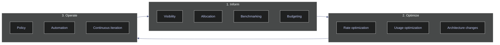
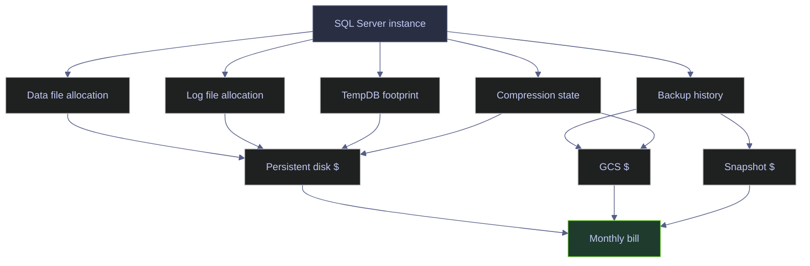
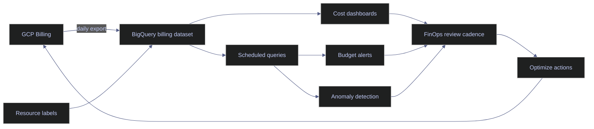
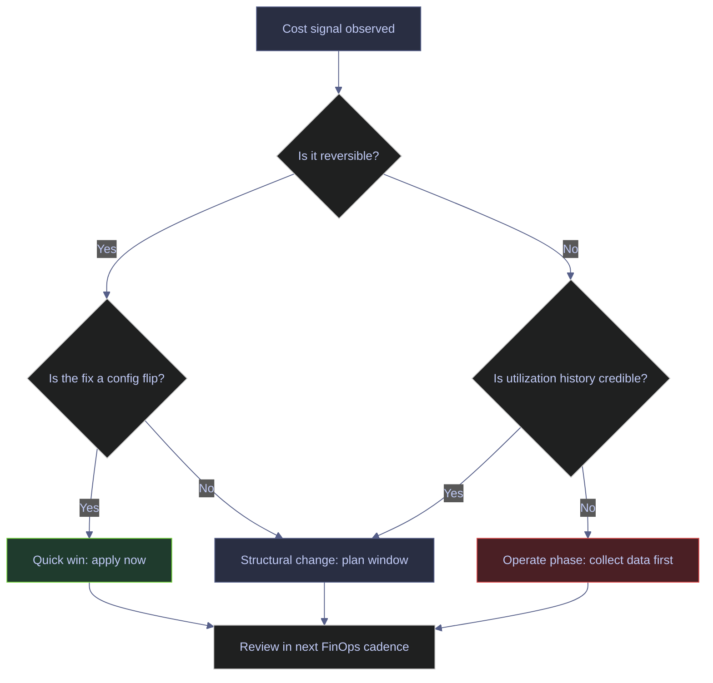

# FinOps Cost Optimization

> [!abstract]- Summary
>
> FinOps is the operating discipline that connects engineering decisions to cloud spend. For SQL Server on Google Cloud specifically, it means tying database behavior such as allocation, log growth, backup compression ratios, data compression choices, snapshot cadence, licensing edition, and VM shape to concrete line items on the GCP bill. This note traces every cost decision back to either a SQL Server signal you can query live or a GCP pricing mechanic that multiplies that signal into spend.
>
> - **FinOps fundamentals**
>   - defines the Inform, Optimize, and Operate loop, the six FinOps principles, and why SQL Server cost decisions differ from stateless-service cost decisions
> - **Current SQL Server cost signals**
>   - starts at the database and works outward through data and log allocation, usage, backup history, compression state, and other telemetry that already exposes cost drivers inside SQL Server
> - **GCP infrastructure levers**
>   - maps those in-engine signals to persistent disk type, snapshot cadence, GCS storage class, committed use discounts, licensing model, and VM-shape choices
> - **Monitoring and governance**
>   - closes the loop with monitoring, chargeback, and governance so the same signals stay visible instead of being rediscovered during the next cost review
> - **Practical recommendations**
>   - prioritizes reversible levers first so cost reductions do not silently damage recovery objectives or operational safety

> [!note]- Glossary
>
> - **FinOps**
>   - operating discipline that connects engineering usage decisions to cloud cost and business value
> - **Inform / Optimize / Operate**
>   - repeating FinOps loop of building visibility, taking cost action, and enforcing the cheaper path over time
> - **Right-sizing**
>   - adjusting VM shape or storage allocation to observed workload needs rather than defaults or guesswork
> - **Committed Use Discount (CUD)**
>   - GCP rate-reduction commitment that lowers compute cost in exchange for a time-bound usage commitment
> - **BYOL**
>   - bring-your-own-license model where SQL Server licensing is managed separately from the cloud VM price
> - **Persistent disk**
>   - block storage attached to the VM, whose size and tier directly affect SQL Server cost
> - **Snapshot cadence**
>   - frequency and retention pattern of storage snapshots, which influences both recoverability and spend
> - **Backup compression ratio**
>   - degree to which SQL Server backup output shrinks relative to source data size
> - **Lifecycle rule**
>   - automated GCS policy that changes storage class or deletes objects as they age
> - **Chargeback**
>   - attribution model that maps cloud cost to workload owners, teams, or business units
> - **Standard vs Enterprise edition**
>   - SQL Server licensing choice that changes both feature surface and long-term cost structure



---

## FinOps Fundamentals For SQL Server

Before auditing anything, it is worth being precise about what FinOps actually is, why it exists as a separate discipline from cost accounting or capacity planning, and how it applies to a stateful workload like SQL Server. FinOps is defined by the FinOps Foundation as the operating model for managing variable cloud spend through collaboration between engineering, finance, and business teams. It is a **loop**, not a project — the same workload is re-examined on a cadence because both the workload and the pricing it runs against keep moving.

### The Three FinOps Phases

FinOps organizes work into three phases that repeat continuously over the life of a workload. They are not a one-time sequence; every workload is somewhere on the loop at any given time.

#### Phase 1 — Inform

Before any optimization decision. Inform is the phase that earns the right to act on the other two phases. It is typically triggered by new workload, new quarter, budget review, cost anomaly alert, or architectural change that invalidates prior cost assumptions. Inform is about visibility — who owns which resources, how much they cost, what they are compared to (benchmark), and what the budget says they should cost. It runs wherever the bill lives (GCP Billing, BigQuery billing export, cost dashboards). Give every stakeholder the same picture of current spend, attribution, and variance against budget, so optimization is a discussion about shared facts rather than anecdotes.

For SQL Server specifically, Inform means answering questions such as: how much persistent disk does this instance allocate, how much of that is actually used, what is the daily snapshot storage footprint, what does the full backup chain cost per month in GCS, what is the committed use discount coverage for this VM. The first H2 section of this note is essentially the Inform phase for a single SQL Server instance.

#### Phase 2 — Optimize

After Inform has produced a credible baseline and named the biggest line items. It is typically triggered by A cost signal in the Inform baseline that exceeds the budget, exceeds the benchmark for that workload class, or does not match the business value the workload delivers. Optimize is where the engineering actions happen. It splits cleanly into three lever categories — rate optimization (buying cheaper units), usage optimization (consuming fewer units), and architecture changes (changing what the workload does). Reduce spend, improve price-performance, or free budget for higher-value work, without sacrificing the reliability and latency targets the business actually needs.

For SQL Server on GCP the three lever categories map to:

- **Rate optimization** — Committed Use Discounts on the VM, Sustained Use Discounts (auto-applied), GCS storage-class transitions via lifecycle rules, BYOL vs. license-included image choice.
- **Usage optimization** — Backup compression, data compression, log-file right-sizing, snapshot retention trimming, right-sizing the VM to observed CPU and memory footprints, switching non-production instances to stop-when-idle schedules.
- **Architecture changes** — Moving cold partitions to BigQuery or GCS, splitting read-only workloads to secondary replicas on cheaper VMs, replacing a large always-on VM with a cluster of smaller ones on spot capacity for rebuildable tiers.

#### Phase 3 — Operate

Continuously, after the first Optimize pass has landed. It is typically triggered by drift. A cost that was optimized tends to regress over time as engineers add workloads, forget to re-tag resources, let log files grow, or skip lifecycle-policy updates. Operate is policy and automation — the guardrails that keep optimized state from decaying. It runs in GCP Organization Policy, budget alerts, lifecycle rules, tagging policies, and scheduled jobs. Lock in the gains from Optimize, detect regressions within hours or days rather than months, and shift future decisions toward the cheaper path by default.

For SQL Server, Operate looks like: GCS lifecycle rules that force cold backups off Standard class, Cloud Scheduler jobs that stop non-prod VMs overnight, budget alerts tied to project labels, Recommender policies that flag oversized machine types, and scheduled queries against `msdb.dbo.backupset` that alert when the compression ratio drops unexpectedly.

### The Six FinOps Principles

The FinOps Foundation publishes six principles that orient decisions inside the three phases. They matter because every non-trivial cost question eventually pits two of them against each other.

| Principle | Practical meaning for SQL Server |
|---|---|
| **Teams need to collaborate** | DBAs, platform, finance, and application owners look at the same dashboard, not separate ones |
| **Everyone takes ownership of their cloud usage** | Every SQL Server instance has a labelled owner and a budget line |
| **A centralized team drives FinOps** | One team owns the billing export, labels taxonomy, and Recommender policies — not each squad |
| **Reports should be accessible and timely** | Cost data flows into BigQuery daily; dashboards query it, not monthly exports |
| **Decisions are driven by business value of cloud** | Right-sizing is evaluated against SLO impact, not in isolation |
| **Take advantage of the variable cost model** | Use CUDs, spot VMs, preemptible workers, lifecycle transitions — static thinking leaves money on the table |

### Cost Vs. Value: Why SQL Server Differs From Stateless Services

A stateless web service can be right-sized based purely on CPU and request latency. A stateful SQL Server cannot — the cost of getting right-sizing wrong is asymmetric, because restoring from a wrong VM-shape decision is cheap, but restoring from a wrong storage or recovery-model decision can be catastrophic.

This asymmetry shapes every FinOps decision in the rest of this note:

- **Storage errors are hard to reverse.** Shrinking a data file is slow and fragmenting. Disks cannot shrink in place on GCP. Retention that you under-provisioned cannot be recovered after the snapshot window has passed.
- **Compute errors are cheap to reverse.** VM shape changes are a stop/start operation on GCE and take minutes. Committing to a 3-year CUD is costly to reverse, but the VM itself is elastic.
- **Licensing errors compound.** Edition choice (Standard vs. Enterprise) affects every VM running SQL Server at that tier, not just one. Dropping from Enterprise to Standard requires removing all Enterprise-only features first, which means a multi-week project on any non-trivial estate.
- **Recovery objective errors are silent until they fire.** Under-provisioning backup retention or snapshot frequency produces no daily symptom until a restore is needed, at which point the cost savings have already been spent and the recovery fails.

The practical implication: **prioritize reversible cost levers first**. Backup compression, data compression, lifecycle rules, VM right-sizing, and CUD coverage are all reversible or low-risk. Retention policy, recovery model, and licensing edition are last because their error cost is highest.

### Roles: DBA, Platform, Finance, Engineering

FinOps is explicitly a cross-functional practice. For SQL Server on GCP the usual role split is:

| Role | Primary FinOps responsibility |
|---|---|
| **DBA** | Owns in-database cost signals: allocation, log sizing, backup compression ratios, data compression coverage, retention, recovery model |
| **Platform / SRE** | Owns infrastructure cost signals: disk type, snapshot policy, lifecycle rules, VM shape, CUD coverage, labelling |
| **Finance** | Owns budget, variance analysis, chargeback rules, CUD procurement |
| **Application owner** | Owns SLO and value context — how much downtime or latency is acceptable for the workload |
| **FinOps lead** | Owns the dashboard, runs the cost review cadence, and arbitrates trade-offs between the roles above |

None of these roles can optimize SQL Server spend alone. A DBA who enables page compression without knowing the VM is already CPU-constrained saves storage but moves the bottleneck. A platform engineer who cuts snapshot retention without knowing the recovery objective creates a silent recovery hole. Cost decisions in this note are all annotated with *which role* is expected to make them.

---

## Current SQL Server Cost Signals

Start with the SQL Server facts that most directly influence cost. You do not need a cloud bill to see the first layer of waste — SQL Server already tells you a lot. Every query in this section runs live against the local `stoxx` instance and returns the actual current state of this environment. Treat the outputs as the starting baseline for the Inform phase.



### Storage Footprint

Storage footprint is the first place cost waste hides, because allocated SQL Server space eventually becomes disk cost, snapshot size, backup size, or all three. The queries below move from the database level (what each database owns) down to individual files (where inside the database the bytes live) and usage (how much of the allocated space is actually filled).

#### Audit database data and log allocation across the instance

Start of any FinOps review, quarterly cost audit, or before right-sizing persistent disk on a GCE VM. It is typically triggered by new instance under FinOps management, unexplained disk cost growth, or preparation for a VM migration. Runs in any T-SQL session with `VIEW SERVER STATE`. Read-only. Single round trip against `sys.master_files` joined to `sys.databases`. No restart or downtime implication. Produce the instance-level allocation summary that identifies which databases actually own storage cost and which are noise. Every cost discussion that follows references this baseline.

| Field | Source column | Unit / type | Meaning |
|---|---|---|---|
| `database_name` | `sys.databases.name` | sysname | Database logical name |
| `recovery_model_desc` | `sys.databases.recovery_model_desc` | nvarchar(60) | `FULL`, `BULK_LOGGED`, or `SIMPLE`; determines whether log backups are required |
| `data_size_mb` | `sum(sys.master_files.size) where type=0` | decimal MB | Allocated ROWS (data) space in MB. `size` is in 8 KB pages, converted via `size * 8 / 1024` |
| `log_size_mb` | `sum(sys.master_files.size) where type=1` | decimal MB | Allocated LOG space in MB |
| `total_size_mb` | `sum(sys.master_files.size)` | decimal MB | Combined allocated footprint — drives every downstream storage cost on this instance |

> [!info]- How the query works
>
> - `FROM sys.databases AS d` is the authoritative list of every database on the instance, including system databases.
> - `JOIN sys.master_files AS mf ON mf.database_id = d.database_id` is how `sys.master_files` is reached — it is an instance-wide catalog view, but it identifies files by `database_id`.
> - The two `CASE` expressions inside the `SUM` split the aggregate into `type = 0` (ROWS) and `type = 1` (LOG). `type = 2` would be FILESTREAM containers, which report `size = 0` in `sys.master_files` and must be measured via `sys.database_files` for actual bytes.
> - `size * 8.0 / 1024` converts 8-KB pages to MB. The multiplier is `8.0` (float) rather than `8` to force decimal arithmetic.
> - `GROUP BY d.name, d.recovery_model_desc` includes the recovery model so SIMPLE databases are visually distinct from FULL databases, because the log cost discussion only applies to FULL and BULK_LOGGED.

*This query returns the current data and log allocation for every database on the instance, with the recovery model tagged for context.*

```sql
SELECT
    d.name AS database_name,
    d.recovery_model_desc,
    CAST(SUM(CASE WHEN mf.type = 0 THEN mf.size END) * 8.0 / 1024 AS decimal(12,2)) AS data_size_mb,
    CAST(SUM(CASE WHEN mf.type = 1 THEN mf.size END) * 8.0 / 1024 AS decimal(12,2)) AS log_size_mb,
    CAST(SUM(mf.size) * 8.0 / 1024 AS decimal(12,2)) AS total_size_mb
FROM sys.databases AS d
JOIN sys.master_files AS mf
    ON mf.database_id = d.database_id
GROUP BY d.name, d.recovery_model_desc
ORDER BY total_size_mb DESC;
```

| database_name | recovery_model_desc | data_size_mb | log_size_mb | total_size_mb |
|---|---|---:|---:|---:|
| stoxx | FULL | 712.00 | 1032.00 | 1744.00 |
| stoxx_backup | FULL | 712.00 | 1032.00 | 1744.00 |
| stoxx_db | FULL | 768.00 | 256.00 | 1024.00 |
| tempdb | SIMPLE | 64.00 | 8.00 | 72.00 |
| msdb | SIMPLE | 15.31 | 1.25 | 16.56 |
| codex_tde_demo | FULL | 8.00 | 8.00 | 16.00 |
| model | FULL | 8.00 | 8.00 | 16.00 |
| master | SIMPLE | 4.69 | 2.00 | 6.69 |

*The main cost signal is `stoxx` plus its disposable copy `stoxx_backup`: together they own nearly 3.5 GB of allocated space, and in both cases the log allocation exceeds the data allocation. That ratio is unusual — it means log growth, log backup cadence, and snapshot scope matter materially for this environment. `stoxx_db` is the older sibling copy and adds another 1 GB. The system databases are small enough that almost all storage-cost discussion should focus on the three user databases, not on `tempdb`, `msdb`, `model`, or `master`. Three databases in FULL recovery is the biggest structural cost driver here — every one of them requires a log-backup chain on GCS.*

| Column | Value | Watch | Meaning | Implication |
|---|---|---|---|---|
| `recovery_model_desc` | `FULL` | Watch | Full log chain required | Drives GCS log-backup storage cost and snapshot retention coordination |
| `recovery_model_desc` | `SIMPLE` | &#9989; for non-critical | No log backup needed | Lowest log-side cost; accepts only full/differential restore granularity |
| `recovery_model_desc` | `BULK_LOGGED` | Watch | Minimally logged operations | Reduces log growth during bulk loads; still needs log backups |
| `log_size_mb` | > `data_size_mb` | Watch | Log allocation exceeds data allocation | Usually signals missed or immature log-backup cadence |
| `total_size_mb` | > 1 GB per DB | Watch | Database is a material storage cost contributor | Focus right-sizing and compression effort here first |

#### Audit file-level allocation and growth setting for stoxx

After the instance-level audit has pointed at a specific database; before changing file layout, enabling auto-growth, or moving files. It is typically triggered by A database with unbalanced log/data ratio, a rebuild plan, or preparation for a persistent disk re-layout on GCE. Runs as a read-only T-SQL query against `sys.master_files`. Requires `VIEW SERVER STATE` in SQL Server 2019 and earlier, `VIEW SERVER PERFORMANCE STATE` in SQL Server 2022+. Inspect how many physical files a database has, where each one lives, how big it is, and how it grows — the level of detail needed to reason about file-placement decisions and persistent disk layout.

| Field | Source column | Unit / type | Meaning |
|---|---|---|---|
| `file_id` | `sys.master_files.file_id` | int | File identifier within the database. Primary data file is always 1 |
| `logical_name` | `sys.master_files.name` | sysname | Logical name used in T-SQL `ALTER DATABASE ... MODIFY FILE` |
| `type_desc` | `sys.master_files.type_desc` | nvarchar(60) | `ROWS`, `LOG`, `FILESTREAM`, or `FULLTEXT` |
| `physical_name` | `sys.master_files.physical_name` | nvarchar(260) | OS-level file path |
| `size_mb` | `sys.master_files.size * 8 / 1024` | decimal MB | Current allocated size. `size` is in 8-KB pages |
| `max_size_mb` | `sys.master_files.max_size * 8 / 1024` | decimal MB | Maximum allowed size. `-1` = grow until disk full (NULL here); `0` = no growth allowed; log cap is 2 TB (268435456 pages) |
| `growth_setting` | `sys.master_files.growth` + `is_percent_growth` | varchar | Either `N MB` or `N %`. When `is_percent_growth = 1`, `growth` is a percentage; when `0`, it is in 8-KB pages |
| `state_desc` | `sys.master_files.state_desc` | nvarchar(60) | `ONLINE`, `RESTORING`, `RECOVERING`, `OFFLINE`, etc. |

*This query returns every file belonging to the `stoxx` database with its physical path, current size, maximum allowed size, and growth configuration.*

```sql
SELECT
    mf.file_id,
    mf.name AS logical_name,
    mf.type_desc,
    mf.physical_name,
    CAST(mf.size * 8.0 / 1024 AS decimal(12,2)) AS size_mb,
    CAST(CASE WHEN mf.max_size = -1 THEN NULL
              WHEN mf.max_size = 0  THEN 0
              ELSE mf.max_size * 8.0 / 1024 END AS decimal(12,2)) AS max_size_mb,
    CASE WHEN mf.is_percent_growth = 1 THEN CONCAT(mf.growth, ' %')
         ELSE CONCAT(CAST(mf.growth * 8.0 / 1024 AS decimal(12,2)), ' MB') END AS growth_setting,
    mf.state_desc
FROM sys.master_files AS mf
WHERE mf.database_id = DB_ID('stoxx')
ORDER BY mf.type, mf.file_id;
```

| file_id | logical_name | type_desc | physical_name | size_mb | max_size_mb | growth_setting | state_desc |
|---:|---|---|---|---:|---:|---|---|
| 1 | stoxx | ROWS | /var/opt/mssql/data/stoxx.mdf | 712.00 | NULL | 64.00 MB | ONLINE |
| 2 | stoxx_log | LOG | /var/opt/mssql/data/stoxx_log.ldf | 1032.00 | 2097152.00 | 64.00 MB | ONLINE |

*`stoxx` has the simplest possible layout — one ROWS file and one LOG file — which keeps reasoning about cost clean. Two things stand out: the log file has a 2 TB cap (`max_size_mb = 2097152.00`) which is the SQL Server default for LOG files and is almost certainly wrong for a 712 MB database, and both files grow in 64 MB fixed chunks, which is a sensible default that avoids percent-growth's VLF-fragmentation problem. Cost-wise, the log file's 1 GB current allocation on persistent disk at ~$0.10/GB-month (pd-balanced) is about $0.10/month, negligible in isolation, but in an estate of 200 databases the same pattern becomes $20/month of pure log allocation, and the snapshot blast radius scales with it.*

| Column | Value | Watch | Meaning | Implication |
|---|---|---|---|---|
| `growth_setting` | `N MB` fixed | &#9989; | Fixed-chunk auto-growth | Predictable VLF layout, stable log performance |
| `growth_setting` | `N %` | &#10060; | Percent-based auto-growth | Creates progressively larger VLFs, fragments the log file, considered anti-pattern since SQL Server 2005 |
| `max_size_mb` | `NULL` (-1) | Watch | Unbounded growth | Acceptable for data files with disk monitoring; dangerous for log files without log backups |
| `max_size_mb` | `0` | &#10060; | No growth allowed | Will throw error 9002 / 1105 when exhausted; only use for intentionally fixed-size files |
| `max_size_mb` | 2 TB (LOG default) | Watch | SQL Server LOG default cap | Rarely the right number — size it to expected log backup cadence instead |
| `state_desc` | `OFFLINE` / `SUSPECT` | &#10060; | File is not usable | Immediate operational issue; cost is irrelevant until restored |

#### Audit current log size and usage for stoxx

After file-level audit has identified an oversized or undersized log file; during log-growth investigation; before changing log-backup cadence. It is typically triggered by log file occupies more disk than data file, log space since last backup is rising, unexplained log growth events in the error log. Runs as a read-only T-SQL query against `sys.dm_db_log_space_usage`. The DMV is database-scoped — it returns a single row combining all log files of the **current database**. Must be run inside the `stoxx` database context (not from `master`). Requires `VIEW SERVER STATE` (2019-) or `VIEW SERVER PERFORMANCE STATE` (2022+). Quantify exactly how much of the allocated log space is actually in use right now and how much has accumulated since the last log backup, so log-sizing and backup-cadence decisions are driven by numbers rather than guesswork.

| Field | Source column | Unit / type | Meaning |
|---|---|---|---|
| `database_name` | `DB_NAME(database_id)` | sysname | Database name derived from `database_id` |
| `total_log_size_mb` | `total_log_size_in_bytes / 1048576` | decimal MB | Total current allocated log size across all log files |
| `used_log_space_mb` | `used_log_space_in_bytes / 1048576` | decimal MB | Active (non-reclaimable) log bytes — the portion holding open transactions or records still required for recovery |
| `used_log_space_percent` | `used_log_space_in_percent` | real (0–100) | Used as percentage of total |
| `log_since_last_backup_mb` | `log_space_in_bytes_since_last_backup / 1048576` | decimal MB | Log bytes accumulated since the last LOG backup (SQL Server 2014+ only) — this is the cost signal for log-backup cadence |

*This query shows whether the transaction log is materially occupied and how much space is waiting for the next log backup.*

```sql
SELECT
    DB_NAME(database_id) AS database_name,
    CAST(total_log_size_in_bytes / 1024.0 / 1024.0 AS decimal(12,2)) AS total_log_size_mb,
    CAST(used_log_space_in_bytes / 1024.0 / 1024.0 AS decimal(12,2)) AS used_log_space_mb,
    CAST(used_log_space_in_percent AS decimal(6,2)) AS used_log_space_percent,
    CAST(log_space_in_bytes_since_last_backup / 1024.0 / 1024.0 AS decimal(12,2)) AS log_since_last_backup_mb
FROM sys.dm_db_log_space_usage;
```

| database_name | total_log_size_mb | used_log_space_mb | used_log_space_percent | log_since_last_backup_mb |
|---|---:|---:|---:|---:|
| stoxx | 1031.99 | 14.81 | 1.43 | 4.65 |

*`stoxx` currently has about 1 GB of log allocation but only 1.43% of it is in use, and just 4.65 MB has accumulated since the last log backup. This is a strong signal that log backups are running on a healthy cadence — the log is being truncated — and that the log file is massively **oversized** for the actual workload. The FinOps action here is not "back up the log more often" but "shrink the log allocation" (carefully, with `DBCC SHRINKFILE` and a follow-up right-sizing). A 256 MB log file would comfortably cover this workload, save ~750 MB of persistent disk and every downstream snapshot, and still provide two orders of magnitude of headroom.*

| Column | Value | Watch | Meaning | Implication |
|---|---|---|---|---|
| `used_log_space_percent` | < 10% | &#9989; | Log is nearly empty | Log file is oversized; candidate for DBCC SHRINKFILE + re-sizing |
| `used_log_space_percent` | 10–50% | &#9989; | Normal operating range | No action needed |
| `used_log_space_percent` | 50–80% | Watch | Log is materially occupied | Verify log backup cadence is keeping up with workload |
| `used_log_space_percent` | > 80% | &#10060; | Log is nearing exhaustion | Immediate operational issue; investigate long-running transactions, replication, or missing log backups |
| `log_since_last_backup_mb` | < 100 MB | &#9989; | Log is backed up on a tight cadence | Healthy chain, low cost |
| `log_since_last_backup_mb` | Large and rising | &#10060; under FULL | Log backup cadence is insufficient | Disk growth and snapshot size rise needlessly; risk of log-full error |

> [!warning] A nearly-empty log file is a cost signal, not a success signal
>
> When `used_log_space_percent` stays under a few percent over a long window, the log file is larger than the workload needs. The storage is billed continuously regardless of how much of it is in use. Downsize the log file (carefully — shrink during a maintenance window, not during active workload) and re-grow it only if sustained usage justifies it.
>
> [!success] Right-size the log to the expected peak used-log-space envelope
>
> Target the log size at roughly `2 × peak used_log_space_mb` observed over a two-week window, rounded up to a 64-MB multiple. That provides enough headroom for unusual transaction bursts without wasting disk. Never auto-shrink on a schedule — shrinking and regrowing repeatedly fragments VLFs and causes log-write stalls.

#### Audit VLF count and size distribution for stoxx

After observing slow log backups, slow database startup, or after multiple auto-growth events; before any log-file shrink/regrow operation. It is typically triggered by log file shows signs of fragmentation, frequent auto-growth events in the error log, or before re-sizing the log. Read-only T-SQL against the `sys.dm_db_log_info()` table-valued function, which requires a `database_id` argument. Runs from any database context but the argument must identify the target. Requires `VIEW DATABASE STATE`. Quantify how fragmented the transaction log is at the Virtual Log File level. VLF count matters because too many small VLFs degrade log-operation performance (log backups, replication, database startup), while too few large VLFs make truncation suboptimal.

| Field | Source column | Unit / type | Meaning |
|---|---|---|---|
| `vlf_count` | `count(*)` | int | Total number of virtual log files |
| `vlf_active` | `count(where vlf_active = 1)` | int | Active VLFs (holding log records that cannot yet be truncated) |
| `vlf_avg_size_mb` | `avg(vlf_size_mb)` | decimal MB | Average VLF size |
| `vlf_max_size_mb` | `max(vlf_size_mb)` | decimal MB | Largest VLF size |
| `vlf_total_size_mb` | `sum(vlf_size_mb)` | decimal MB | Total log size as seen by the VLF breakdown; should match `total_log_size_mb` from `sys.dm_db_log_space_usage` |

*This query returns the VLF count, active VLF count, and size distribution for the `stoxx` transaction log.*

```sql
SELECT
    CAST(COUNT(*) AS int)                                               AS vlf_count,
    CAST(SUM(CASE WHEN li.vlf_active = 1 THEN 1 ELSE 0 END) AS int)     AS vlf_active,
    CAST(AVG(CAST(li.vlf_size_mb AS decimal(12,2))) AS decimal(12,2))   AS vlf_avg_size_mb,
    CAST(MAX(CAST(li.vlf_size_mb AS decimal(12,2))) AS decimal(12,2))   AS vlf_max_size_mb,
    CAST(SUM(CAST(li.vlf_size_mb AS decimal(12,2))) AS decimal(12,2))   AS vlf_total_size_mb
FROM sys.dm_db_log_info(DB_ID('stoxx')) AS li;
```

| vlf_count | vlf_active | vlf_avg_size_mb | vlf_max_size_mb | vlf_total_size_mb |
|---:|---:|---:|---:|---:|
| 44 | 1 | 23.45 | 64.00 | 1031.96 |

*The `stoxx` log has 44 VLFs averaging 23.45 MB, with a single active VLF. That is a healthy distribution — under the "few hundred VLFs" ceiling that starts causing log-operation slowdowns, and the sizes are consistent with 64 MB fixed auto-growth (SQL Server 2022 rules: growth chunks of 64 MB–1 GB produce 8 VLFs, so 8 growth events ≈ 64 VLFs; this log has grown 5–6 times). The single active VLF confirms the log is being truncated promptly and cost-effectively.*

| Column | Value | Watch | Meaning | Implication |
|---|---|---|---|---|
| `vlf_count` | < 100 | &#9989; | Healthy log | No action needed |
| `vlf_count` | 100–500 | Watch | Moderately fragmented | Plan a controlled shrink + regrow to rebuild the VLF distribution |
| `vlf_count` | > 500 | &#10060; | Heavily fragmented | Log backups, replication, and startup measurably slower; shrink + regrow required |
| `vlf_active` | = 1 | &#9989; | Log is truncating as expected | Log-backup chain is healthy |
| `vlf_active` | = `vlf_count` | &#10060; | Log cannot truncate | Investigate `log_reuse_wait_desc`: open transaction, replication lag, missing log backup |
| `vlf_avg_size_mb` | < 8 MB | &#10060; | Over-fragmented from small percent-growth events | Historical percent-growth anti-pattern; rebuild the log |

#### Audit used vs. free space inside each data file for stoxx

After the database-level audit has identified a database that owns material storage cost; before any `DBCC SHRINKFILE` or file-layout change. It is typically triggered by A data file that appears oversized relative to workload, or preparation for a persistent disk downsize. Read-only T-SQL against `stoxx.sys.database_files` joined with `FILEPROPERTY(..., 'SpaceUsed')`. The three-part name is required because `sys.database_files` is **database-scoped** — unlike `sys.master_files`, it only sees files of the current database, so `stoxx.sys.database_files` reaches into `stoxx` without a `USE` statement. Distinguish between allocated and actually-used space inside each file. This is the signal that decides whether a file is oversized (shrink candidate) or genuinely full (grow candidate).

| Field | Source | Unit / type | Meaning |
|---|---|---|---|
| `logical_name` | `sys.database_files.name` | sysname | Logical name of the file |
| `type_desc` | `sys.database_files.type_desc` | nvarchar(60) | `ROWS` or `LOG` |
| `allocated_mb` | `size * 8 / 1024` | decimal MB | Total allocated file size |
| `used_mb` | `FILEPROPERTY(name, 'SpaceUsed') * 8 / 1024` | decimal MB | Pages actually used inside the file |
| `free_mb` | `(size - FILEPROPERTY(name, 'SpaceUsed')) * 8 / 1024` | decimal MB | Unused pages inside the file |
| `used_percent` | `100 * used / allocated` | decimal % | Fill ratio |

*This query returns the allocated, used, and free space inside every `ROWS` and `LOG` file of the `stoxx` database.*

```sql
SELECT
    df.name AS logical_name,
    df.type_desc,
    CAST(df.size * 8.0 / 1024 AS decimal(12,2)) AS allocated_mb,
    CAST(CAST(FILEPROPERTY(df.name, 'SpaceUsed') AS bigint) * 8.0 / 1024 AS decimal(12,2)) AS used_mb,
    CAST((df.size - CAST(FILEPROPERTY(df.name, 'SpaceUsed') AS bigint)) * 8.0 / 1024 AS decimal(12,2)) AS free_mb,
    CAST(
        CASE WHEN df.size = 0 THEN 0
             ELSE 100.0 * CAST(FILEPROPERTY(df.name, 'SpaceUsed') AS bigint) / df.size
        END AS decimal(6,2)
    ) AS used_percent
FROM stoxx.sys.database_files AS df
WHERE df.type IN (0, 1)
ORDER BY df.type, df.file_id;
```

| logical_name | type_desc | allocated_mb | used_mb | free_mb | used_percent |
|---|---|---:|---:|---:|---:|
| stoxx | ROWS | 712.00 | 597.69 | 114.31 | 83.94 |
| stoxx_log | LOG | 1032.00 | 14.80 | 1017.20 | 1.43 |

*The data file is 83.94% full, which is healthy — it has enough headroom for normal operation and is not a shrink candidate. The log file is 1.43% full, which confirms the previous finding: 1 GB allocation for a workload that actively uses 15 MB of log. The combined picture says "the data file is sized about right; the log file is 4× too big." Both findings feed directly into persistent-disk right-sizing: if the data file is 83.94% full now, the disk should have headroom for one growth generation (64 MB) plus one month of expected data growth, and the log file can be shrunk to 256 MB without risk.*

| Column | Value | Watch | Meaning | Implication |
|---|---|---|---|---|
| `used_percent` (ROWS) | < 50% | Watch | Data file is sparsely populated | Candidate for shrink, but only with care — shrinking fragments indexes |
| `used_percent` (ROWS) | 50–85% | &#9989; | Healthy operating range | No action |
| `used_percent` (ROWS) | > 90% | &#10060; | File is nearly full | Grow proactively before next major load |
| `used_percent` (LOG) | < 10% | &#9989; cost | Log is oversized | Candidate for shrink + right-size |
| `used_percent` (LOG) | > 80% | &#10060; | Log cannot truncate | Investigate `log_reuse_wait_desc` |

#### Audit tempdb file layout and growth

During initial instance configuration review or after observing PAGELATCH contention on `tempdb` allocation pages. It is typically triggered by new instance under FinOps management, or performance investigation flagging `PAGELATCH_EX` on `2:1:1` / `2:1:2` / `2:1:3` (GAM/SGAM/PFS of tempdb). Read-only T-SQL against `sys.master_files` filtered to `DB_ID('tempdb')`. The setting of file count and size is instance-level (via startup parameters or `ALTER DATABASE`), and it survives restart. Confirm that `tempdb` has the right number of equally-sized data files for the core count and that the growth setting is sensible. `tempdb` is a cost signal because it is the one database whose storage is actively re-used and whose I/O characteristics drive persistent-disk IOPS choice.

| Field | Source column | Unit / type | Meaning |
|---|---|---|---|
| `logical_name` | `sys.master_files.name` | sysname | Logical file name (typically `tempdev`, `tempdev2`, etc.) |
| `type_desc` | `sys.master_files.type_desc` | nvarchar(60) | `ROWS` or `LOG` |
| `size_mb` | `size * 8 / 1024` | decimal MB | Initial file size — seeded at instance startup |
| `growth_setting` | `growth` + `is_percent_growth` | varchar | Fixed MB or percentage |
| `is_read_only` | `is_read_only` | bit | Always 0 for tempdb |

*This query returns every tempdb file with its initial size and growth setting.*

```sql
SELECT
    mf.name AS logical_name,
    mf.type_desc,
    CAST(mf.size * 8.0 / 1024 AS decimal(12,2)) AS size_mb,
    CASE WHEN mf.is_percent_growth = 1 THEN CONCAT(mf.growth, ' %')
         ELSE CONCAT(CAST(mf.growth * 8.0 / 1024 AS decimal(12,2)), ' MB') END AS growth_setting,
    mf.is_read_only
FROM sys.master_files AS mf
WHERE mf.database_id = DB_ID('tempdb')
ORDER BY mf.type, mf.file_id;
```

| logical_name | type_desc | size_mb | growth_setting | is_read_only |
|---|---|---:|---|:---:|
| tempdev | ROWS | 8.00 | 64.00 MB | False |
| tempdev2 | ROWS | 8.00 | 64.00 MB | False |
| tempdev3 | ROWS | 8.00 | 64.00 MB | False |
| tempdev4 | ROWS | 8.00 | 64.00 MB | False |
| tempdev5 | ROWS | 8.00 | 64.00 MB | False |
| tempdev6 | ROWS | 8.00 | 64.00 MB | False |
| tempdev7 | ROWS | 8.00 | 64.00 MB | False |
| tempdev8 | ROWS | 8.00 | 64.00 MB | False |
| templog | LOG | 8.00 | 64.00 MB | False |

*`stoxx` has 8 tempdb data files of 8 MB each, plus a single 8 MB log file, all with 64 MB fixed growth. The 8-file count is the standard recommendation for up to 8 logical CPUs — any more files than cores yields diminishing returns and can cause its own contention. The initial 8 MB size is **small**: on a real workload, tempdb will auto-grow almost immediately, and repeated auto-grow events stall sessions waiting on the grow. The cost-conscious fix is to pre-allocate tempdb files to their expected steady-state size (e.g., 512 MB each) and leave auto-grow as a safety net, not a hot path.*

| Column | Value | Watch | Meaning | Implication |
|---|---|---|---|---|
| `size_mb` (ROWS) | Uniform across files | &#9989; | Proportional-fill allocator works correctly | No allocation skew |
| `size_mb` (ROWS) | Unequal | &#10060; | Allocation skew — one file gets most writes | Size all tempdb data files identically |
| File count (ROWS) | 1 | &#10060; on > 1 core | Guaranteed PAGELATCH contention | Match file count to cores (up to 8) |
| File count (ROWS) | = cores up to 8 | &#9989; | Standard recommendation | No action |
| `growth_setting` | Percent | &#10060; | Percent-growth on tempdb causes unpredictable auto-grow stalls | Switch to fixed-MB |

### Backup Storage Footprint And Compression

Backup storage is the second place FinOps gains compound. SQL Server already produces a detailed history of every backup it takes — size, duration, and compression ratio — inside `msdb.dbo.backupset`. The queries below surface that history and then enable backup compression by default so new backups benefit automatically.

#### Audit historical backup size and observed compression ratio

As part of any FinOps storage review; before changing backup cadence, retention, or GCS storage class; after migrating backup jobs. It is typically triggered by growing GCS backup bucket cost, observed inconsistencies in backup size, or before enabling backup compression by default. Read-only T-SQL against `msdb.dbo.backupset`. Runs in any session with `db_owner` or `SELECT` on the `msdb` backup tables (typically granted via the `db_backupoperator` role in `msdb`). Produce a realistic picture of recent backup sizes, both compressed and uncompressed, to compute the actual compression ratio and verify backup type mix (full / differential / log).

| Field | Source column | Unit / type | Meaning |
|---|---|---|---|
| `database_name` | `msdb.dbo.backupset.database_name` | nvarchar(128) | Database the backup set belongs to |
| `backup_type` | `type` (char(1)) mapped via CASE | varchar | `D`=Full, `I`=Differential, `L`=Log, `F`=File/Filegroup, `G`=Differential file, `P`=Partial, `Q`=Differential partial |
| `recovery_model` | `recovery_model` | nvarchar(60) | Recovery model at the time of the backup |
| `uncompressed_mb` | `backup_size / 1048576` | decimal MB | Uncompressed bytes (estimated for VSS backups) |
| `compressed_mb` | `compressed_backup_size / 1048576` | decimal MB | Actual on-disk bytes. Identical to `backup_size` when compression is off |
| `compression_ratio` | `backup_size / compressed_backup_size` | decimal | Compression ratio (2.0 = half the size, 6.0 = six times smaller) |
| `duration_sec` | `DATEDIFF(SECOND, start, finish)` | int | Backup duration — CPU cost proxy for compression |
| `backup_finish_date` | `backup_finish_date` | datetime | When the backup completed |

*This query returns the 10 most recent backups with their type, compression ratio, and duration.*

```sql
SELECT TOP (10)
    database_name,
    CASE type
        WHEN 'D' THEN 'Full'
        WHEN 'I' THEN 'Differential'
        WHEN 'L' THEN 'Log'
        WHEN 'F' THEN 'File/Filegroup'
        WHEN 'G' THEN 'Diff File/Filegroup'
        WHEN 'P' THEN 'Partial'
        WHEN 'Q' THEN 'Diff Partial'
    END AS backup_type,
    recovery_model,
    CAST(backup_size / 1048576.0 AS decimal(12,2)) AS uncompressed_mb,
    CAST(compressed_backup_size / 1048576.0 AS decimal(12,2)) AS compressed_mb,
    CAST(CAST(backup_size AS float)
         / NULLIF(compressed_backup_size, 0) AS decimal(6,2)) AS compression_ratio,
    CAST(DATEDIFF(SECOND, backup_start_date, backup_finish_date) AS int) AS duration_sec,
    backup_finish_date
FROM msdb.dbo.backupset
ORDER BY backup_finish_date DESC;
```

| database_name | backup_type | recovery_model | uncompressed_mb | compressed_mb | compression_ratio | duration_sec | backup_finish_date |
|---|---|---|---:|---:|---:|---:|---|
| codex_tde_demo | Full | FULL | 3.16 | 0.48 | 6.62 | 0 | 2026-04-11 17:18:50 |
| stoxx | Log | FULL | 0.12 | 0.03 | 3.39 | 0 | 2026-04-11 16:32:21 |
| stoxx | Log | FULL | 0.30 | 0.10 | 3.15 | 0 | 2026-04-11 16:32:19 |
| stoxx | Full | FULL | 620.36 | 95.69 | 6.48 | 1 | 2026-04-11 16:31:08 |
| stoxx | Full | FULL | 598.13 | 95.59 | 6.26 | 1 | 2026-04-11 16:31:06 |
| stoxx | Full | FULL | 600.24 | 95.59 | 6.28 | 0 | 2026-04-11 16:30:48 |
| stoxx | Log | FULL | 0.12 | 0.05 | 2.52 | 0 | 2026-04-11 16:30:24 |
| stoxx | Log | FULL | 9.12 | 2.68 | 3.41 | 0 | 2026-04-11 16:30:18 |
| stoxx | Differential | FULL | 2.13 | 0.14 | 14.82 | 0 | 2026-04-11 16:30:18 |
| stoxx | Full | FULL | 598.13 | 95.49 | 6.26 | 1 | 2026-04-11 16:29:55 |

*The compression story here is striking. Full backups of `stoxx` compress at a consistent **6.26–6.48:1** ratio — a 598 MB uncompressed full backup becomes ~95.5 MB on disk, saving ~502 MB per backup. Differential backups compress even harder at **14.82:1** because differentials contain mostly changed pages with high value locality. Log backups compress at a more modest **2.52–3.41:1** because log records are already dense. Every one of these backups has `compressed_mb << uncompressed_mb`, which means some process — explicit `WITH COMPRESSION` in the backup job — is already producing compressed backups, even though `backup compression default` is still `0` at the instance level (verified in the next query). The natural next step is to flip the default to `1` so any new backup job inherits compression without needing to remember `WITH COMPRESSION`.*

| Column | Value | Watch | Meaning | Implication |
|---|---|---|---|---|
| `compression_ratio` | > 4 | &#9989; | Compression is materially effective | Strong case for default compression |
| `compression_ratio` | 2–4 | &#9989; | Typical ratio | Still worth enabling by default |
| `compression_ratio` | ~1 | &#10060; | Compression is ineffective | Data is already compressed/encrypted, or TDE + MAXTRANSFERSIZE interaction (see callout below) |
| `backup_type` = Log | Any | &#9989; under FULL | Log-chain backups are running | Confirms recoverability chain |
| `backup_type` = Log | Absent in recent history | &#10060; under FULL | No log backups in the visible window | Log truncation blocked, disk growth inevitable |
| `duration_sec` | Proportional to size | &#9989; | Compression CPU cost is acceptable | No resource governor needed |

> [!warning] TDE + backup compression need MAXTRANSFERSIZE > 64 KB
>
> When a database is TDE-encrypted, the default `MAXTRANSFERSIZE` of 65536 (64 KB) disables the optimized decrypt-compress-encrypt-per-page path, and compression ratios collapse from ~6:1 to near 1:1. SQL Server 2019 CU5 and later auto-elevate `MAXTRANSFERSIZE` to 128 KB whenever `WITH COMPRESSION` is used or `backup compression default = 1`. Older builds require an explicit `WITH MAXTRANSFERSIZE = 131072` on every backup command.
>
> [!success] Upgrade to 2019 CU5+ or specify MAXTRANSFERSIZE explicitly
>
> - On SQL Server 2019 CU5 or newer: do nothing — the elevation is automatic.
> - On older builds with TDE: set `MAXTRANSFERSIZE = 131072` on every `BACKUP DATABASE` / `BACKUP LOG` statement, or wrap the backup call in a stored procedure that enforces it.
> - Verify after the change by comparing `backup_size` to `compressed_backup_size` on a new full backup of the TDE database.

#### Audit current backup compression default setting

Before deciding whether to enable backup compression by default, as part of instance configuration review, or after restoring system databases. It is typically triggered by `backup compression default` may have drifted from the platform standard (typically `1`), or a new instance has not been configured yet. Read-only T-SQL against `sys.configurations`. The query also audits related memory and parallelism knobs because they interact with compression CPU cost. Requires `VIEW SERVER STATE`. `value` and `value_in_use` are `sql_variant` columns and must be cast to a concrete type (here `int`) before pyodbc can consume them. Confirm the current instance-level setting before deciding whether to flip it, and surface neighbouring memory/MAXDOP knobs that often drift at the same time.

| Field | Source column | Unit / type | Meaning |
|---|---|---|---|
| `name` | `sys.configurations.name` | nvarchar(35) | Configuration option name |
| `value` | `sys.configurations.value` | sql_variant → int | Value as set (pending RECONFIGURE) |
| `value_in_use` | `sys.configurations.value_in_use` | sql_variant → int | Value currently in effect |
| `description` | `sys.configurations.description` | nvarchar(255) | Human-readable description |

*This query returns the current value of `backup compression default` alongside four other cost-relevant instance knobs.*

```sql
SELECT
    name,
    CAST(value        AS int) AS value,
    CAST(value_in_use AS int) AS value_in_use,
    CAST(description  AS varchar(200)) AS description
FROM sys.configurations
WHERE name IN (
    N'backup compression default',
    N'max server memory (MB)',
    N'min server memory (MB)',
    N'cost threshold for parallelism',
    N'max degree of parallelism'
)
ORDER BY name;
```

| name | value | value_in_use | description |
|---|---:|---:|---|
| backup compression default | 0 | 0 | Enable compression of backups by default |
| cost threshold for parallelism | 5 | 5 | cost threshold for parallelism |
| max degree of parallelism | 0 | 0 | maximum degree of parallelism |
| max server memory (MB) | 2147483647 | 2147483647 | Maximum size of server memory (MB) |
| min server memory (MB) | 0 | 16 | Minimum size of server memory (MB) |

*Four of the five knobs are sitting at install defaults. `backup compression default = 0` means any backup job that forgets `WITH COMPRESSION` produces uncompressed backups — the previous query showed jobs that do remember it get 6:1 on full backups, so the savings are genuinely on the table. `max server memory (MB) = 2147483647` (the int32 maximum) is the uncapped default and is the biggest cost/stability signal on this instance — without a cap, SQL Server will grow buffer pool until the Linux container is OOM-killed. `max degree of parallelism = 0` means unlimited (uses all logical CPUs), which is reasonable for a small workload but risky for mixed OLTP/analytics on a shared host. `cost threshold for parallelism = 5` is the 1998-era default and is almost always wrong for modern CPUs — 50 is the typical starting point. None of these four defaults affect cost directly the way backup compression does, but they affect the headroom available to turn compression on without stability risk.*

| Column | Value | Watch | Meaning | Implication |
|---|---|---|---|---|
| `backup compression default` | `0` | &#10060; | Compression is opt-in per backup command | Easy for jobs and scripts to miss the cost-saving option |
| `backup compression default` | `1` | &#9989; | Compression is the default behaviour | Lower routine backup storage footprint |
| `max server memory (MB)` | `2147483647` (uncapped) | &#10060; | Buffer pool can consume all host RAM | OOM risk on containerised or shared hosts; cap to leave headroom for OS + other processes |
| `max server memory (MB)` | Sized to host RAM minus OS/other | &#9989; | Instance memory is bounded | Stable memory footprint; safe baseline for compression CPU work |
| `max degree of parallelism` | `0` | Watch | Unlimited parallelism | Fine for small workloads, risky for mixed loads; cap to ≤ 8 on most OLTP estates |
| `cost threshold for parallelism` | `5` | &#10060; | 1998 default | Raise to 25–50 for modern CPUs to avoid trivial queries going parallel |

#### Enable backup compression by default

After the historical backup audit has shown that observed compression ratios are ≥ 2 and CPU headroom exists during the backup window. It is typically triggered by instance-level standardization, new instance bring-up, or cost review finding that backup jobs forget `WITH COMPRESSION`. State-changing T-SQL against `sp_configure` followed by `RECONFIGURE`. Instance-level. Dynamic — takes effect immediately on the next backup command without a restart. Requires the `ALTER SETTINGS` server-level permission (held by `sysadmin` and `serveradmin`). Make compressed backups the default behaviour so every job inherits compression automatically. Explicit `WITH NO_COMPRESSION` in an individual backup command still overrides the default.

> [!warning] Backup compression is CPU-heavy; validate before enabling in production
>
> Backup compression using `MS_XPRESS` (the default since SQL Server 2008) significantly increases CPU usage during the backup window. On a CPU-constrained VM running concurrent workloads, enabling compression by default can make backups noticeably slower or steal CPU from the application. The Microsoft guidance is to use Resource Governor to cap backup CPU, but Resource Governor is Enterprise-only — on Standard edition, run backups during a quiet window instead.
>
> [!success] Verify CPU headroom during the backup window, then enable
>
> Run a compressed full backup manually during peak workload and monitor CPU. If CPU stays below the threshold your latency SLO tolerates (typically below ~80%), enable compression by default. If not, keep compression opt-in and enable it per job, scheduled during off-peak hours. For TDE-encrypted databases, confirm that `MAXTRANSFERSIZE` is at least 128 KB (automatic on SQL Server 2019 CU5+, manual on older builds — see the TDE callout above).

*This command enables backup compression at the instance level.*

```sql
EXEC sp_configure 'backup compression default', 1;
RECONFIGURE;
```

*This command re-reads the setting to confirm the change took effect.*

```sql
SELECT
    name,
    CAST(value        AS int) AS value,
    CAST(value_in_use AS int) AS value_in_use
FROM sys.configurations
WHERE name = N'backup compression default';
```

| Setting | What it controls | Default | Possible values | Production guidance |
|---|---|---:|---|---|
| `backup compression default` | Whether new backup commands compress by default | `0` | `0` (off), `1` (on) | `1` on most estates; `0` only when CPU is constrained and every backup job already sets `WITH COMPRESSION` explicitly |
| `backup compression algorithm` (2022+) | Compression algorithm used | `1` (MS_XPRESS) | `0` (off), `1` (MS_XPRESS), `2` (Intel QAT) | `1` is the baseline; `2` only with supported QAT hardware, which is irrelevant on GCE |
| `MAXTRANSFERSIZE` (per backup) | I/O buffer size | `65536` (64 KB) for most, `1048576` (1 MB) for URL | `65536`–`4194304` | `131072` (128 KB) minimum for TDE + compression on pre-2019-CU5 builds |

### Data Compression As A Storage Lever

Backup compression reduces the size of backups. Data compression (row, page, columnstore archival) reduces the size of the **live database itself** — every read, every write, every backup, and every snapshot scales with the compressed footprint. For SQL Server 2016 SP1 and later, row and page compression are available on all editions, so edition-gating is no longer a barrier on recent builds.

#### Audit current data compression coverage for user tables in stoxx

Before deciding whether to apply data compression; as part of periodic storage reviews; after a schema migration. It is typically triggered by persistent disk cost is material and the backup compression lever has already been pulled; or a specific table is known to be a hot spot. Read-only T-SQL against `stoxx.sys.partitions` joined with `sys.indexes`, `sys.tables`, `sys.schemas`, and `sys.allocation_units`. Runs in any database context because of the three-part names. Requires `VIEW DEFINITION` at the database level. Identify which tables and indexes are already compressed, which are not, and how much space each uncompressed structure owns — ranked by size so the biggest candidates surface first.

| Field | Source | Unit / type | Meaning |
|---|---|---|---|
| `schema_name` | `sys.schemas.name` | sysname | Schema owner of the table |
| `table_name` | `sys.tables.name` | sysname | Table name |
| `index_type` | `sys.indexes.type_desc` | nvarchar(60) | `HEAP`, `CLUSTERED`, `NONCLUSTERED`, `CLUSTERED COLUMNSTORE`, `NONCLUSTERED COLUMNSTORE` |
| `data_compression_desc` | `sys.partitions.data_compression_desc` | nvarchar(60) | `NONE`, `ROW`, `PAGE`, `COLUMNSTORE`, `COLUMNSTORE_ARCHIVE` |
| `total_rows` | `sum(sys.partitions.rows)` | bigint | Total rows across partitions |
| `total_mb` | `sum(sys.allocation_units.total_pages) * 8 / 1024` | decimal MB | Allocated space across all allocation units (IN_ROW_DATA + ROW_OVERFLOW + LOB) |

*This query returns every user-table structure in `stoxx` with its current compression state and size, sorted largest first.*

```sql
SELECT
    s.name AS schema_name,
    t.name AS table_name,
    i.type_desc AS index_type,
    p.data_compression_desc,
    CAST(SUM(p.rows) AS bigint) AS total_rows,
    CAST(SUM(au.total_pages) * 8.0 / 1024 AS decimal(12,2)) AS total_mb
FROM stoxx.sys.partitions AS p
JOIN stoxx.sys.indexes AS i
    ON i.object_id = p.object_id AND i.index_id = p.index_id
JOIN stoxx.sys.tables AS t
    ON t.object_id = p.object_id
JOIN stoxx.sys.schemas AS s
    ON s.schema_id = t.schema_id
JOIN stoxx.sys.allocation_units AS au
    ON au.container_id = p.partition_id
WHERE t.is_ms_shipped = 0
GROUP BY s.name, t.name, i.type_desc, p.data_compression_desc
ORDER BY total_mb DESC;
```

| schema_name | table_name | index_type | data_compression_desc | total_rows | total_mb |
|---|---|---|---|---:|---:|
| dbo | demo_idxmaint_rowstore | CLUSTERED | NONE | 671550 | 376.88 |
| dbo | demo_idxmaint_missing | CLUSTERED | NONE | 671550 | 94.07 |
| dbo | demo_idxmaint_rowstore | NONCLUSTERED | NONE | 671550 | 36.13 |
| dbo | demo_idxmaint_splits | CLUSTERED | NONE | 100000 | 23.07 |
| dbo | demo_eurostoxx50_ohlcv | CLUSTERED | NONE | 67155 | 7.32 |
| silver | eurostoxx50_ohlcv | CLUSTERED | NONE | 67155 | 6.07 |
| silver | stoxxasia50_ohlcv | CLUSTERED | NONE | 64875 | 5.82 |
| silver | stoxxusa50_ohlcv | CLUSTERED | NONE | 66000 | 5.82 |
| dbo | demo_idxmaint_usage | NONCLUSTERED | NONE | 100000 | 2.77 |
| silver | oil20_ohlcv | CLUSTERED | NONE | 25080 | 2.20 |
| dbo | demo_idxmaint_columnstore | CLUSTERED COLUMNSTORE | COLUMNSTORE | 259432 | 2.13 |

*Out of every user-table structure in `stoxx`, exactly one is compressed — `dbo.demo_idxmaint_columnstore`, and only because columnstore compression is always on for columnstore indexes. Everything else, including the largest single structure (`dbo.demo_idxmaint_rowstore` at 376.88 MB), is `NONE`. That is ~500 MB of rowstore data where page compression has not been evaluated. The next query estimates how much of that space page compression would actually recover, and confirms the expected savings before committing to any change.*

| Column | Value | Watch | Meaning | Implication |
|---|---|---|---|---|
| `data_compression_desc` | `NONE` on large tables | Watch | Compression lever is still available | Run `sp_estimate_data_compression_savings` before deciding |
| `data_compression_desc` | `ROW` | &#9989; | Lowest CPU cost, ~20–30% savings | Good default for OLTP tables with hot writes |
| `data_compression_desc` | `PAGE` | &#9989; | Higher savings (30–60%) at higher CPU cost | Good for read-heavy tables and large historical data |
| `data_compression_desc` | `COLUMNSTORE` | &#9989; | Always-on for columnstore | Typical savings 5–10× vs rowstore |
| `data_compression_desc` | `COLUMNSTORE_ARCHIVE` | &#9989; | Extra xpress layer on columnstore | Slow to access; for cold partitions only |

#### Estimate page compression savings on the largest silver table

After identifying a specific table as a compression candidate from the coverage audit. It is typically triggered by A user table with `data_compression_desc = NONE` that is large enough to matter (typically > 50 MB) and is accessed predominantly via seeks rather than full scans. Read-only-ish T-SQL via `sp_estimate_data_compression_savings`. The stored procedure acquires an intent-shared (IS) lock on the table, reads a sample into tempdb, and runs the compression algorithm on the sample to estimate the final size. Does not actually compress anything. Can produce non-trivial tempdb and CPU load on large tables — avoid running at peak hours on very large tables. Produce an evidence-based estimate of storage savings from page compression before committing to a rebuild. Works for row, page, columnstore, and columnstore archival.

| Parameter | Type | Meaning |
|---|---|---|
| `@schema_name` | sysname | Schema of the target object |
| `@object_name` | sysname | Name of the target table or indexed view |
| `@index_id` | int / NULL | Specific index to estimate, or NULL for all indexes |
| `@partition_number` | int / NULL | Specific partition, or NULL for all partitions |
| `@data_compression` | nvarchar(60) | `NONE`, `ROW`, `PAGE`, `COLUMNSTORE`, `COLUMNSTORE_ARCHIVE` |

*This command estimates how much space `silver.eurostoxx50_ohlcv` would save under page compression.*

```sql
USE stoxx;
EXEC sp_estimate_data_compression_savings
    @schema_name      = N'silver',
    @object_name      = N'eurostoxx50_ohlcv',
    @index_id         = NULL,
    @partition_number = NULL,
    @data_compression = N'PAGE';
```

| object_name | schema_name | index_id | partition_number | size_with_current_compression_setting(KB) | size_with_requested_compression_setting(KB) | sample_size_with_current_compression_setting(KB) | sample_size_with_requested_compression_setting(KB) |
|---|---|---:|---:|---:|---:|---:|---:|
| eurostoxx50_ohlcv | silver | 1 | 1 | 6160 | 3728 | 6408 | 3880 |
| eurostoxx50_ohlcv | silver | 2 | 1 | 1928 | 1128 | 1880 | 1104 |

*Page compression would shrink the clustered index of `silver.eurostoxx50_ohlcv` from 6,160 KB to 3,728 KB — a **39.5% reduction** — and the nonclustered index from 1,928 KB to 1,128 KB — a **41.5% reduction**. In absolute terms the savings are small because the table itself is small, but the ratio is representative: on numeric time-series data like OHLCV, page compression typically recovers 35–50% of allocated space. Applying the same logic to the larger `dbo.demo_idxmaint_rowstore` at 376.88 MB would recover roughly 150 MB of persistent disk per rebuild.*

*The ROW-compression estimate on the same table (run separately) produced 31% savings on the clustered index and 18% on the nonclustered — noticeably lower than PAGE, which is the expected trade: row compression has a lower CPU cost at query time but captures only the fixed-type bit-packing gains, while page compression adds prefix + dictionary layers that dominate on OHLCV data.*

| Column | Value | Watch | Meaning | Implication |
|---|---|---|---|---|
| `size_with_requested / size_with_current` | < 0.5 | &#9989; | Material savings available | Strong case for compression |
| `size_with_requested / size_with_current` | 0.5–0.8 | Watch | Moderate savings | Weigh CPU cost; ROW may be the better trade |
| `size_with_requested / size_with_current` | > 0.9 | &#10060; | Compression not worth it | Data already compressed / encrypted / high-entropy |
| `size_with_requested` = `size_with_current` | exactly | &#10060; | Compression inapplicable | Usually a columnstore or already-compressed structure |

#### Apply page compression to a candidate table

After the estimate has confirmed meaningful savings and a maintenance window is scheduled. It is typically triggered by compression estimate shows > 30% savings and no blocker (CPU headroom, locking window, Enterprise-only feature dependency). State-changing T-SQL. `ALTER TABLE ... REBUILD WITH (DATA_COMPRESSION = PAGE)` performs an offline rebuild of the heap or clustered index plus all nonclustered indexes. On Enterprise edition, use `ONLINE = ON` for non-blocking rebuild; on Standard, the rebuild takes a schema-modification lock on the table for the duration. Requires `ALTER` permission on the table. Apply page compression to the base table and all its nonclustered indexes in a single statement, so subsequent reads, writes, and backups operate on the compressed footprint.

> [!warning] Offline rebuild is blocking on Standard edition
>
> On SQL Server Standard, `ALTER TABLE ... REBUILD` holds a schema-modification (SCH-M) lock on the table for the duration of the rebuild, which blocks all readers and writers. Online index rebuild is an Enterprise-only feature. A 376 MB table rebuild can take minutes on a loaded host — schedule during a maintenance window.
>
> [!success] Use ONLINE=ON on Enterprise, or partition the table on Standard
>
> - On Enterprise: add `WITH (DATA_COMPRESSION = PAGE, ONLINE = ON)` to keep the table readable during rebuild.
> - On Standard: if the table is partitioned, rebuild one partition at a time with `REBUILD PARTITION = N` to bound the lock window.
> - On Standard without partitioning: accept the outage window and schedule it with application owners.

*This command applies page compression to every partition of `silver.eurostoxx50_ohlcv`, including nonclustered indexes, in a single rebuild.*

```sql
ALTER TABLE silver.eurostoxx50_ohlcv
REBUILD PARTITION = ALL
WITH (DATA_COMPRESSION = PAGE);
```

*This command applies page compression to a specific nonclustered index only, useful when the base table and index have different access patterns.*

```sql
ALTER INDEX IX_silver_eurostoxx50_ohlcv_symbol_date
ON silver.eurostoxx50_ohlcv
REBUILD WITH (DATA_COMPRESSION = PAGE);
```

| Option | Values | Default | Meaning |
|---|---|---|---|
| `DATA_COMPRESSION` | `NONE`, `ROW`, `PAGE`, `COLUMNSTORE`, `COLUMNSTORE_ARCHIVE` | `NONE` | Compression scheme to apply |
| `ONLINE` (Enterprise) | `ON`, `OFF` | `OFF` | Whether the rebuild blocks readers/writers |
| `MAXDOP` | int | 0 (instance default) | Parallelism cap for the rebuild |
| `REBUILD PARTITION` | `ALL` or `N` | — | Rebuild all partitions or one specific partition |
| `RESUMABLE` (Enterprise, 2017+) | `ON`, `OFF` | `OFF` | Allow pausing and resuming the rebuild |

#### Audit persisted Enterprise-only features before changing edition

Before planning an edition change (Enterprise → Standard), a migration to a lower-tier Cloud SQL instance, or a licensing-cost audit. It is typically triggered by cost review asking whether the workload can be downgraded to Standard; licensing renewal; migration planning. Read-only T-SQL against `sys.dm_db_persisted_sku_features`, which is **database-scoped** — it must be queried in the context of each user database. Requires `VIEW DATABASE STATE` (2019-) or `VIEW DATABASE PERFORMANCE STATE` (2022+). Identify features currently enabled in the database that would block restore to a lower edition, so the licensing conversation is grounded in facts.

| Field | Source column | Unit / type | Meaning |
|---|---|---|---|
| `feature_name` | `feature_name` | sysname | Feature name (e.g., `ChangeCapture`, `ColumnStoreIndex`, `Compression`, `InMemoryOLTP`, `Partitioning`, `TransparentDataEncryption`) |
| `feature_id` | `feature_id` | int | Internal feature identifier |

*This query returns every Enterprise-gated persisted feature currently enabled in `stoxx`.*

```sql
SELECT feature_name, feature_id
FROM stoxx.sys.dm_db_persisted_sku_features;
```

| feature_name | feature_id |
|---|---:|
| ColumnStoreIndex | 600 |

*`stoxx` reports only one persisted feature — `ColumnStoreIndex` — and since SQL Server 2016 SP1 this feature is available on Standard edition. In other words, **`stoxx` has no real edition blocker**: it can be restored to Standard without removing anything. The only pre-2016-SP1 features that would block a downgrade on modern builds are `TransparentDataEncryption` (still Enterprise/Standard only, blocked on Web/Express) and `MultipleFSContainers` (multi-FILESTREAM containers). For a cost review, this is a green light to evaluate Standard pricing for this workload.*

| Column | Value | Watch | Meaning | Implication |
|---|---|---|---|---|
| `feature_name` | `ColumnStoreIndex` | &#9989; since 2016 SP1 | Not a blocker on modern builds | Ignorable for Standard migration |
| `feature_name` | `Compression` | &#9989; since 2016 SP1 | Not a blocker on modern builds | Ignorable |
| `feature_name` | `Partitioning` | &#9989; since 2016 SP1 | Not a blocker on modern builds | Ignorable |
| `feature_name` | `InMemoryOLTP` | &#9989; since 2016 SP1 | Not a blocker on modern builds | Standard caps at 32 GB per database — check size |
| `feature_name` | `ChangeCapture` | &#9989; | Standard supports CDC | Ignorable |
| `feature_name` | `TransparentDataEncryption` | &#10060; on Web/Express | Blocks downgrade below Standard | Must decrypt before restore |
| `feature_name` | `MultipleFSContainers` | &#10060; | Blocks Standard | Must remove FILESTREAM containers before restore |

### Volume Headroom And Disk Sizing

The final storage signal is what the volume itself looks like. SQL Server reports the OS-level volume metadata that backs every file it owns, which is the bridge between the database allocation numbers and the persistent-disk bill.

#### Audit persistent volume capacity and free space

Before resizing a persistent disk up or down; during capacity planning; after observing growth alerts. It is typically triggered by approaching disk full, or the opposite — a disk that is oversized relative to the data it contains. Read-only T-SQL against `sys.dm_os_volume_stats()`. The function is called via `CROSS APPLY` because it takes `(database_id, file_id)` parameters that come from `sys.master_files`. On Linux and containerised SQL Server deployments, Windows-specific metadata columns (`volume_mount_point`, `file_system_type`, `supports_compression`, `is_compressed`) return NULL, but `total_bytes` and `available_bytes` are always populated. Show how much physical volume is under the instance and how much of it is free, so persistent disk right-sizing is grounded in the OS-level numbers the hypervisor bills on.

| Field | Source column | Unit / type | Meaning |
|---|---|---|---|
| `volume_mount_point` | `sys.dm_os_volume_stats.volume_mount_point` | nvarchar(512) | Mount point (NULL on Linux) |
| `file_system_type` | `sys.dm_os_volume_stats.file_system_type` | nvarchar(512) | `NTFS`, `ReFS`, `ext4`, etc. (NULL on Linux) |
| `total_gb` | `total_bytes / 1024^3` | decimal GB | Total volume size — always populated |
| `free_gb` | `available_bytes / 1024^3` | decimal GB | Available space — always populated |
| `free_percent` | `100 * available / total` | decimal % | Free space as percentage |
| `supports_compression` | `supports_compression` | tinyint | NTFS-style compression support (NULL on Linux) |
| `is_compressed` | `is_compressed` | tinyint | Whether the volume is NTFS-compressed (NULL on Linux) |

*This query returns the volume statistics as SQL Server sees them, deduplicated across all database files.*

```sql
SELECT DISTINCT TOP (10)
    vs.volume_mount_point,
    vs.file_system_type,
    CAST(vs.total_bytes / 1024.0 / 1024 / 1024 AS decimal(12,2)) AS total_gb,
    CAST(vs.available_bytes / 1024.0 / 1024 / 1024 AS decimal(12,2)) AS free_gb,
    CAST(100.0 * vs.available_bytes / NULLIF(vs.total_bytes, 0) AS decimal(6,2)) AS free_percent,
    vs.supports_compression,
    vs.is_compressed
FROM sys.master_files AS mf
CROSS APPLY sys.dm_os_volume_stats(mf.database_id, mf.file_id) AS vs
ORDER BY vs.volume_mount_point;
```

| volume_mount_point | file_system_type | total_gb | free_gb | free_percent | supports_compression | is_compressed |
|---|---|---:|---:|---:|:---:|:---:|
| NULL | NULL | 1006.85 | 921.70 | 91.54 | NULL | NULL |

*SQL Server sees one volume with a total of 1006.85 GB and 921.70 GB free — 91.54% free. The NULL mount metadata is a Linux/container detail, not a broken DMV: Windows-specific `GetVolumeInformation` APIs are unavailable on Linux and those columns return NULL while the byte counts remain populated. On GCP, a 1 TB persistent disk with only ~85 GB used is the single most obvious cost-reduction opportunity in this environment: the pd-balanced price is roughly $0.10/GB-month, so this disk costs ~$100/month. Right-sizing to 256 GB (still massive headroom over the 85 GB used) would save ~$75/month per instance, before any compression gains. The catch is that GCP persistent disks **cannot shrink in place** — the only way to recover this space is to provision a new smaller disk, copy the data over, and delete the old one (see "Persistent disk choice" in the GCP section).*

| Column | Value | Watch | Meaning | Implication |
|---|---|---|---|---|
| `free_percent` | > 80% | &#10060; cost | Disk is grossly oversized | Rebuild onto a smaller disk — expected savings linear with size reduction |
| `free_percent` | 30–80% | &#9989; | Healthy headroom | No action |
| `free_percent` | 10–30% | Watch | Approaching capacity | Plan growth |
| `free_percent` | < 10% | &#10060; | Near-full | Immediate action required — grow or offload cold data |
| `file_system_type` = NULL | on Linux | &#9989; | Expected Linux/container behaviour | Not a DMV fault |
| `is_compressed` = 1 | on NTFS | &#10060; for data files | NTFS-compressed SQL Server files are unsupported | Decompress immediately |

### Memory And Parallelism As Cost Amplifiers

The last category of in-database signals are the settings that decide **how much of the VM** SQL Server is allowed to use. These do not directly appear on the disk bill, but they determine whether the current VM shape is the right one — and therefore whether committed use discounts are being spent on capacity the workload does not need.

#### Audit current process memory and buffer pool state

Before right-sizing the VM, before capping `max server memory`, or after observing OOM events. It is typically triggered by cost review considering a VM downsize; stability incident; preparing a right-sizing recommendation to present to platform. Read-only T-SQL against `sys.dm_os_process_memory`. Requires `VIEW SERVER STATE` (2019-) or `VIEW SERVER PERFORMANCE STATE` (2022+). This DMV reports memory from SQL Server's process perspective, distinct from `sys.dm_os_sys_memory` which reports host-level metrics. Measure the actual memory footprint SQL Server is currently consuming so right-sizing decisions are grounded in observed usage, not in `max server memory` settings that may be far above what the workload needs.

| Field | Source column | Unit / type | Meaning |
|---|---|---|---|
| `physical_mem_mb` | `physical_memory_in_use_kb / 1024` | decimal MB | Physical memory actually in use by the SQL Server process |
| `large_page_alloc_mb` | `large_page_allocations_kb / 1024` | decimal MB | Large-page allocations (used on systems with LPIM and the large pages lock privilege) |
| `locked_page_alloc_mb` | `locked_page_allocations_kb / 1024` | decimal MB | Pages locked in memory by Lock Pages in Memory |
| `vas_reserved_mb` | `virtual_address_space_reserved_kb / 1024` | decimal MB | Virtual address space reserved |
| `vas_committed_mb` | `virtual_address_space_committed_kb / 1024` | decimal MB | Virtual address space committed |
| `vas_available_mb` | `virtual_address_space_available_kb / 1024` | decimal MB | Virtual address space still available |
| `process_physical_memory_low` | `process_physical_memory_low` | bit | 1 when the process has been signalled that physical memory is low |
| `process_virtual_memory_low` | `process_virtual_memory_low` | bit | 1 when the process has been signalled that virtual memory is low |

*This query returns the current memory footprint of the SQL Server process.*

```sql
SELECT
    CAST(physical_memory_in_use_kb  / 1024.0 AS decimal(12,2)) AS physical_mem_mb,
    CAST(large_page_allocations_kb  / 1024.0 AS decimal(12,2)) AS large_page_alloc_mb,
    CAST(locked_page_allocations_kb / 1024.0 AS decimal(12,2)) AS locked_page_alloc_mb,
    CAST(virtual_address_space_reserved_kb  / 1024.0 AS decimal(12,2)) AS vas_reserved_mb,
    CAST(virtual_address_space_committed_kb / 1024.0 AS decimal(12,2)) AS vas_committed_mb,
    CAST(virtual_address_space_available_kb / 1024.0 AS decimal(12,2)) AS vas_available_mb,
    process_physical_memory_low,
    process_virtual_memory_low
FROM sys.dm_os_process_memory;
```

| physical_mem_mb | large_page_alloc_mb | locked_page_alloc_mb | vas_reserved_mb | vas_committed_mb | vas_available_mb | process_physical_memory_low | process_virtual_memory_low |
|---:|---:|---:|---:|---:|---:|:---:|:---:|
| 4226.00 | 130.00 | 0.00 | 4096.00 | 1941.68 | 67104767.94 | False | False |

*The SQL Server process currently uses about 4.2 GB of physical memory, with 1.94 GB committed in virtual address space. Neither memory-low flag is set. Remember that `max server memory` is currently uncapped (`2147483647` MB) — so the 4.2 GB footprint is what the workload demanded, not a ceiling. For right-sizing: if sustained peak memory stays under 6 GB, an `n2-standard-2` VM (8 GB RAM) with `max server memory` capped at 6 GB is sufficient. If peaks reach 14 GB, step up to `n2-standard-4` (16 GB). Either way, the cap must be set **before** committing to a smaller VM, not after, or the new VM will be OOM-killed the first time the workload spikes.*

| Column | Value | Watch | Meaning | Implication |
|---|---|---|---|---|
| `physical_mem_mb` | Below `max server memory` | &#9989; | Memory cap is not yet binding | Workload has headroom |
| `physical_mem_mb` | Close to `max server memory` | Watch | Cap is binding; checkpoint, sort, and plan cache pressure possible | Monitor PLE and `sys.dm_os_memory_clerks` |
| `process_physical_memory_low` | 1 | &#10060; | Host memory is constrained | SQL Server may be releasing buffer pages; investigate other consumers |
| `vas_available_mb` | < 100 MB | &#10060; | Virtual address space is exhausted | 64-bit should not hit this; investigate host/container memory |

#### Audit plan cache size

After observing high compile times, during memory investigations, or as part of capacity review. It is typically triggered by plan cache growth is suspected of pressuring buffer pool; or the workload is ad-hoc-heavy and plan cache bloat is plausible. Read-only T-SQL against `sys.dm_exec_cached_plans`. Requires `VIEW SERVER STATE`. Lightweight query — a single aggregate. Quantify how much memory is currently held by cached plans, as one of the cost-relevant signals for deciding between `OPTIMIZE FOR AD HOC WORKLOADS` and leaving the default.

*This query returns the total plan cache size and the number of cached plans.*

```sql
SELECT TOP (5)
    CAST(SUM(size_in_bytes) / 1024.0 / 1024 AS decimal(12,2)) AS plan_cache_mb,
    COUNT_BIG(*) AS cached_plans
FROM sys.dm_exec_cached_plans
GROUP BY ();
```

| plan_cache_mb | cached_plans |
|---:|---:|
| 186.23 | 1175 |

*The plan cache currently holds 1,175 plans in 186 MB. That is a modest footprint in absolute terms, and the ratio (~159 KB per plan) is typical — no sign of single-use plan bloat. For a workload this small (3 user databases, mostly teaching queries), 186 MB is unremarkable. The rule of thumb becomes interesting on much larger instances: if the plan cache exceeds 500 MB and single-use plans dominate, enable `optimize for ad hoc workloads` to store only stubs until a plan is reused.*

### Unused Indexes As A Cost Signal

Indexes that are never read but are still maintained on writes are a double cost — they take disk space and they burn CPU cycles on every INSERT/UPDATE/DELETE. SQL Server tracks usage per index in `sys.dm_db_index_usage_stats` since instance startup, which makes unused indexes one of the easiest cost signals to capture.

#### Audit never-used nonclustered indexes in stoxx

After the instance has been running for long enough to have accumulated representative workload (typically weeks). It is typically triggered by storage review looking for easy wins; performance review after a schema migration; pre-migration audit. Read-only T-SQL joining `sys.indexes`, `sys.dm_db_index_usage_stats`, `sys.partitions`, and `sys.allocation_units`. Must filter out primary keys, unique constraints, and clustered indexes. Usage counters reset on instance restart, so interpret the numbers relative to instance uptime. Identify nonclustered indexes that have received zero reads (`user_seeks + user_scans + user_lookups = 0`) since the last instance restart, ordered by size.

> [!warning] Usage counters reset on every SQL Server restart
>
> `sys.dm_db_index_usage_stats` is populated since the most recent instance start. An index with zero reads may simply mean the workload that uses it has not run yet. Always check `sqlserver_start_time` in `sys.dm_os_sys_info` and interpret usage counters against it — a zero-read index after 6 hours of uptime is not a dropping candidate; one with zero reads after 6 weeks of uptime typically is.
>
> [!success] Require at least one full business cycle of uptime before dropping indexes
>
> On OLTP estates, wait two weeks minimum. On monthly-batch estates, wait two months. Cross-check candidate indexes against the query store for historical execution plans that might have used them in a window you haven't observed.

*This query returns the 10 largest nonclustered-plus-clustered indexes with the fewest reads in the `stoxx` database.*

```sql
SELECT TOP (10)
    s.name AS schema_name,
    o.name AS table_name,
    i.name AS index_name,
    i.type_desc,
    ISNULL(us.user_seeks, 0)   AS user_seeks,
    ISNULL(us.user_scans, 0)   AS user_scans,
    ISNULL(us.user_lookups, 0) AS user_lookups,
    ISNULL(us.user_updates, 0) AS user_updates,
    CAST(SUM(au.total_pages) * 8.0 / 1024 AS decimal(12,2)) AS index_mb
FROM stoxx.sys.indexes AS i
JOIN stoxx.sys.objects AS o
    ON o.object_id = i.object_id
JOIN stoxx.sys.schemas AS s
    ON s.schema_id = o.schema_id
JOIN stoxx.sys.partitions AS p
    ON p.object_id = i.object_id AND p.index_id = i.index_id
JOIN stoxx.sys.allocation_units AS au
    ON au.container_id = p.partition_id
LEFT JOIN sys.dm_db_index_usage_stats AS us
    ON us.database_id = DB_ID('stoxx')
   AND us.object_id   = i.object_id
   AND us.index_id    = i.index_id
WHERE o.type = 'U'
  AND i.type > 0
  AND i.is_primary_key = 0
  AND i.is_unique_constraint = 0
GROUP BY s.name, o.name, i.name, i.type_desc,
         us.user_seeks, us.user_scans, us.user_lookups, us.user_updates
ORDER BY (ISNULL(us.user_seeks, 0) + ISNULL(us.user_scans, 0) + ISNULL(us.user_lookups, 0)) ASC,
         index_mb DESC;
```

| schema_name | table_name | index_name | type_desc | user_seeks | user_scans | user_lookups | user_updates | index_mb |
|---|---|---|---|---:|---:|---:|---:|---:|
| dbo | demo_idxmaint_rowstore | CIX_demo_idxmaint_row_guid | CLUSTERED | 0 | 0 | 0 | 0 | 376.88 |
| dbo | demo_idxmaint_splits | CIX_demo_idxmaint_splits | CLUSTERED | 0 | 0 | 0 | 0 | 23.07 |
| dbo | demo_eurostoxx50_ohlcv | CIX_demo_eurostoxx50_ohlcv | CLUSTERED | 0 | 0 | 0 | 0 | 7.32 |
| dbo | demo_idxmaint_columnstore | CCI_demo_idxmaint_columnstore | CLUSTERED COLUMNSTORE | 0 | 0 | 0 | 0 | 2.13 |
| silver | stoxxasia50_ohlcv | IX_silver_stoxxasia50_ohlcv_symbol_date | NONCLUSTERED | 0 | 0 | 0 | 0 | 1.88 |
| silver | stoxxusa50_ohlcv | IX_silver_stoxxusa50_ohlcv_symbol_date | NONCLUSTERED | 0 | 0 | 0 | 0 | 1.70 |
| dbo | demo_idxmaint_usage | IX_demo_idxmaint_usage_symbol_date | NONCLUSTERED | 0 | 0 | 0 | 0 | 1.63 |
| dbo | demo_idxmaint_usage | IX_demo_idxmaint_usage_category | NONCLUSTERED | 0 | 0 | 0 | 0 | 1.13 |
| dbo | demo_index_performance | CIX_demo_index_performance | CLUSTERED | 0 | 0 | 0 | 0 | 0.76 |
| silver | oil20_ohlcv | IX_silver_oil20_ohlcv_symbol_date | NONCLUSTERED | 0 | 0 | 0 | 0 | 0.70 |

*Every structure in this list has zero reads **and** zero writes since the last instance restart — which means the instance has not run enough representative workload yet, not that these indexes are unused in production. The top entry (`CIX_demo_idxmaint_row_guid` at 376.88 MB) is also the largest structure in the instance. If this were a real production instance with weeks of uptime, that row would be a prime drop candidate; on this container it is just a demo fixture. The cost-relevant takeaway is methodological: on a production FinOps audit, this query is where the first easy wins usually appear — large nonclustered indexes that nobody reads but every write has to update.*

| Column | Value | Watch | Meaning | Implication |
|---|---|---|---|---|
| `user_seeks + user_scans + user_lookups` | 0 after weeks of uptime | &#10060; | Index not used for reads | Candidate for drop |
| `user_updates` | High with 0 reads | &#10060; | Write amplification with no benefit | Strongest drop case — both storage and CPU saved |
| `user_updates` | Low and 0 reads | Watch | Index is idle in both directions | Investigate whether it serves a rare but important query |
| `type_desc` | `UNIQUE` or primary key | N/A | Constraint-enforcing | Never drop |

---

## GCP Infrastructure Cost Levers

SQL Server storage behaviour drives the costs that appear inside the VM. GCP then adds another layer of choices around persistent disk type, snapshot strategy, GCS storage class, committed use discounts, and licensing model. Every lever in this section runs against a known SQL Server signal from the previous section — the persistent disk decisions depend on allocation and used-percent numbers, the snapshot decisions depend on backup cadence and recovery objectives, and the VM decisions depend on memory and CPU footprints.

### Persistent Disk Choice

The persistent disk choice affects two cost lines at once: the per-GB-month storage fee and the IOPS/throughput that upstream workloads depend on. The wrong disk type either overcharges for capacity the workload never reaches or caps the workload below its SLA.

#### Compare persistent disk families at a glance

Before provisioning a new SQL Server VM or migrating an existing one to a different disk family. It is typically triggered by new instance request, cost review recommending a disk family change, or a workload that has outgrown its current IOPS envelope. Reference decision. The persistent-disk choice is made at disk-creation time in the GCP console or `gcloud compute disks create` and is immutable in type — changing disk type requires creating a new disk and copying data over. Pick the cheapest disk that meets the workload's IOPS, throughput, and latency requirements.

| Disk type | Approximate $/GB-month (us-central1) | IOPS model | Typical use for SQL Server |
|---|---:|---|---|
| `pd-standard` (HDD) | ~$0.040 | Included, seek-penalty on random I/O | Backup staging only; never for data or log on a live workload |
| `pd-balanced` (SSD) | ~$0.100 | Included; scales with size up to machine-type cap | Small-to-medium SQL Server workloads; Console default |
| `pd-ssd` | ~$0.170 | Included; higher IOPS ceiling than balanced | High-IOPS OLTP, latency-sensitive workloads |
| `pd-extreme` | ~$0.125 + provisioned IOPS | IOPS provisioned separately (min 500 GB) | Very large OLTP / analytics; explicit IOPS budgeting |
| `hyperdisk-balanced` | ~$0.060 + billed IOPS/throughput above baseline | 3,000 IOPS and 140 MB/s baseline free; extras billed | Google-recommended default for modern VM families |
| `hyperdisk-extreme` | ~$0.100 + all IOPS provisioned | Every IOPS billed | Sub-ms latency tier; premium OLTP |

*Prices vary by region and change periodically — always verify at the current [Disk and Image Pricing](https://cloud.google.com/compute/disks-image-pricing) page before building a cost model.*

> [!warning] Persistent disks cannot shrink in-place
>
> GCP persistent disks can only grow, never shrink. A disk oversized at creation time cannot be reduced without provisioning a new smaller disk, copying the data, re-attaching, and deleting the old disk. On SQL Server this is a non-trivial operation — it requires a planned outage or a snapshot-based clone-and-cutover pattern. Size conservatively at creation.
>
> [!success] Right-size on creation, rebuild via clone-and-cutover when wrong
>
> - At creation: provision 1.5× the expected 12-month footprint. pd-balanced and hyperdisk-balanced grow cheaply; the extra cost is small.
> - When over-provisioned: snapshot the current disk, create a new smaller disk from the snapshot (only if the data fits), attach to a replacement VM, cut over during a maintenance window.
> - Remember that the log file can be shrunk inside SQL Server (with `DBCC SHRINKFILE`) before the outside-the-VM shrink — often recovers most of the waste without touching the disk.

#### Create a new persistent disk for a SQL Server data volume

During new SQL Server VM provisioning, disk expansion, or clone-and-cutover rebuild. It is typically triggered by new instance, migration, or disk replacement. Runs in Cloud Shell or any authenticated `gcloud` session. Requires the `compute.disks.create` IAM permission (covered by the `roles/compute.instanceAdmin` role). State-changing — creates a billable resource immediately. Provision a new persistent disk of a specific type, size, and zone ready to be attached to a SQL Server VM.

*This command creates a 256 GB hyperdisk-balanced disk named `sql-data-01` in `europe-west1-b`.*

```bash
gcloud compute disks create sql-data-01 \
  --zone=europe-west1-b \
  --type=hyperdisk-balanced \
  --size=256GB \
  --provisioned-iops=3000 \
  --provisioned-throughput=140 \
  --labels=workload=sql-server,env=prod,owner=platform
```

| Flag | Syntax | Description |
|---|---|---|
| `--zone` | `--zone=<zone>` | Target zone (persistent disks are zonal by default) |
| `--region` | `--region=<region>` | Regional persistent disk (replicates across two zones in the region) |
| `--type` | `--type=<disk-type>` | `pd-standard`, `pd-balanced`, `pd-ssd`, `pd-extreme`, `hyperdisk-balanced`, `hyperdisk-extreme`, `hyperdisk-throughput`, `hyperdisk-ml` |
| `--size` | `--size=<N>GB` or `<N>TB` | Initial size. Can grow later, cannot shrink |
| `--provisioned-iops` | `--provisioned-iops=<N>` | Hyperdisk-balanced and hyperdisk-extreme only. Baseline free; extras billed |
| `--provisioned-throughput` | `--provisioned-throughput=<N>` | MB/s. Baseline free on hyperdisk-balanced; extras billed |
| `--source-snapshot` | `--source-snapshot=<snapshot>` | Create from a snapshot instead of blank |
| `--source-image` | `--source-image=<image>` | Create from a machine image |
| `--labels` | `--labels=k=v,k=v` | Resource labels for billing export / chargeback |
| `--kms-key` | `--kms-key=<key>` | Encrypt with Cloud KMS customer-managed key (CMEK) instead of Google-managed |
| `--description` | `--description=<text>` | Free-form description for the disk |
| `--storage-pool` | `--storage-pool=<pool>` | Attach to a hyperdisk storage pool (pooled IOPS/throughput billing) |

#### Resize a persistent disk up

When SQL Server has grown into less than 20% headroom on the current disk. It is typically triggered by disk free-percent falls below threshold; scheduled growth; addition of a new database or partition. Runs in Cloud Shell or any authenticated `gcloud` session. Requires `compute.disks.resize` (in `roles/compute.instanceAdmin`). The resize operation is online — the VM stays up — but the filesystem inside the VM must be extended separately afterwards (`resize2fs`, `xfs_growfs`, or `Extend-Volume` on Windows). Grow the persistent disk without downtime so SQL Server data files can continue to auto-grow.

*This command grows an existing persistent disk to 512 GB.*

```bash
gcloud compute disks resize sql-data-01 \
  --zone=europe-west1-b \
  --size=512GB
```

| Flag | Syntax | Description |
|---|---|---|
| `--size` | `--size=<N>GB` or `<N>TB` | New size; must be larger than current |
| `--zone` | `--zone=<zone>` | Zone the disk lives in |
| `--region` | `--region=<region>` | Region for a regional disk |

> [!danger] Disk resize does not grow the filesystem or SQL Server data file
>
> The `gcloud compute disks resize` operation only changes the disk capacity visible to the OS. The filesystem on the disk and the SQL Server data file inside it remain at their old size until you explicitly grow them. Forgetting this step produces the confusing state of "I resized the disk but SQL Server still says it's full."
>
> [!success] Grow the filesystem and the SQL Server file after every disk resize
>
> - Linux ext4: `sudo resize2fs /dev/disk/by-id/google-sql-data-01`
> - Linux XFS: `sudo xfs_growfs /var/opt/mssql/data`
> - Windows: `Resize-Partition` in PowerShell
> - SQL Server: `ALTER DATABASE stoxx MODIFY FILE (NAME = stoxx, SIZE = 2GB);` (or let auto-growth handle it once the volume reports the new free space)

### Backups Versus Snapshots

SQL Server backups and GCP persistent disk snapshots solve different problems. Treating them as substitutes is the single most common FinOps mistake in this space — it either doubles the cost of redundant recovery paths or creates silent holes in the recovery chain.

#### Compare SQL Server backups and GCP disk snapshots at the mechanism level

Once per design review, when justifying the backup architecture to platform or finance. It is typically triggered by new workload under FinOps management, architectural review, or a recovery objective conversation. Reference decision. Both layers are configured outside the database — SQL Server backups via `BACKUP DATABASE` and Agent jobs, snapshots via `gcloud compute` or resource policies. Clarify which recovery operations each layer actually supports, so retention and cadence decisions are made once per workload rather than repeatedly renegotiated.

| Mechanism | Granularity | Point-in-time recovery | Restore speed | Application consistency | Typical use |
|---|---|---|---|---|---|
| SQL Server full backup | Database | Yes (with log chain) | Seconds-to-minutes per GB | Always consistent | Restore a specific database |
| SQL Server differential backup | Database | Yes (with log chain) | Fast; layered onto the last full | Always consistent | Reduce restore RTO between full backups |
| SQL Server log backup | Database | Yes, down to the transaction | Slower at many logs | Always consistent | Meet RPO < 1 hour with full log chain |
| SQL Server WITH SNAPSHOT + METADATA_ONLY (2022+) | Database | Yes with log chain | Instant snapshot, restore is a disk clone | Application-consistent via `SUSPEND_FOR_SNAPSHOT_BACKUP` | Rapid instance-level recovery |
| GCE persistent disk snapshot (crash-consistent) | Disk | No | Fast disk clone | Crash-consistent only; SQL Server may need recovery on startup | Rapid infrastructure recovery; not a substitute for SQL backups |
| GCE persistent disk snapshot (application-consistent via T-SQL suspend) | Disk | Yes with SQL Server 2022 log chain | Fast disk clone | Application-consistent | Best of both worlds; Recommended |

> [!danger] A crash-consistent disk snapshot is not a backup
>
> A plain `gcloud compute disks snapshot` without coordinating with SQL Server produces a **crash-consistent** snapshot. When restored, SQL Server will start up and run crash recovery on the log — which usually succeeds, but is not a guarantee, and produces no validated restore point. Relying on crash-consistent snapshots as the only recovery layer is the recovery equivalent of not running `CHECKDB`: it works until it doesn't, and when it doesn't you have lost data with no trail.
>
> [!success] Use application-consistent snapshots with SUSPEND_FOR_SNAPSHOT_BACKUP on SQL Server 2022+
>
> - On SQL Server 2022+: use `ALTER DATABASE ... SET SUSPEND_FOR_SNAPSHOT_BACKUP = ON` to freeze write I/O before taking the GCE snapshot. Write freeze is typically 400–800 ms.
> - On SQL Server 2019 and earlier: combine the disk snapshot with a SQL Server `BACKUP DATABASE` + log chain — the disk snapshot becomes a fast rehydration layer, the SQL backups provide the validated restore chain.
> - Never rely on a single layer — always have a SQL-aware chain and a disk-level rehydration path, with retention on each aligned to different recovery objectives.

#### Create a snapshot schedule (resource policy) for the SQL Server data disk

Once per new SQL Server VM, or when the recovery cadence needs to change. It is typically triggered by new instance needs automated snapshots, or existing cadence is wrong (too frequent for cost, or too infrequent for RPO). Runs as a `gcloud` command in Cloud Shell or any authenticated session. Requires `compute.resourcePolicies.create`. The policy exists in a region; it does nothing until attached to a specific disk. Define a reusable snapshot cadence that can be applied to one or many disks.

*This command creates a daily snapshot schedule retained for 14 days, running at 03:00 in the `europe-west1` region.*

```bash
gcloud compute resource-policies create snapshot-schedule sql-daily \
  --region=europe-west1 \
  --max-retention-days=14 \
  --start-time=03:00 \
  --daily-schedule \
  --storage-location=europe-west1 \
  --snapshot-labels=workload=sql-server,tier=prod
```

| Flag | Syntax | Description |
|---|---|---|
| `--region` | `--region=<region>` | Region the policy belongs to |
| `--max-retention-days` | `--max-retention-days=<N>` | Automatic snapshot retention window |
| `--start-time` | `--start-time=HH:MM` | UTC start time of the schedule |
| `--daily-schedule` | (flag) | Snapshot once per day at `--start-time` |
| `--hourly-schedule` | `--hourly-schedule=<hours>` | Snapshot every N hours |
| `--weekly-schedule` | `--weekly-schedule=<days>` | Snapshot on specific days of the week |
| `--storage-location` | `--storage-location=<region>` | Regional or multi-regional snapshot storage location |
| `--snapshot-labels` | `--snapshot-labels=k=v,...` | Labels applied to every snapshot the policy produces |
| `--on-source-disk-delete` | `apply-retention-policy` / `keep-auto-snapshots` | Retention behaviour when the source disk is deleted |
| `--guest-flush` | (flag) | Application-consistent snapshot on Windows via VSS |
| `--description` | `--description=<text>` | Free-form description |

#### Attach the snapshot schedule to the data disk

Immediately after creating the resource policy and before the first expected snapshot window. It is typically triggered by policy created but not yet effective; new disk that should inherit the existing schedule. Runs as a `gcloud compute disks add-resource-policies` command. Requires `compute.disks.addResourcePolicies`. The disk can have at most one snapshot schedule attached at a time. Make the snapshot schedule take effect on a specific disk so automated snapshots begin on the next scheduled window.

*This command attaches the `sql-daily` policy to the `sql-data-01` persistent disk.*

```bash
gcloud compute disks add-resource-policies sql-data-01 \
  --zone=europe-west1-b \
  --resource-policies=sql-daily
```

*This command verifies the attachment by listing the resource policies currently applied to the disk.*

```bash
gcloud compute disks describe sql-data-01 \
  --zone=europe-west1-b \
  --format="value(resourcePolicies)"
```

| Flag | Syntax | Description |
|---|---|---|
| `--zone` | `--zone=<zone>` | Zone of the target disk |
| `--region` | `--region=<region>` | For regional disks |
| `--resource-policies` | `--resource-policies=<name>` | Comma-separated list of policy names |
| `--format` | `--format=<format>` | Output formatter (`json`, `yaml`, `value(...)`, `table(...)`) |

#### Take an application-consistent snapshot on SQL Server 2022+

During the regular snapshot window; in an automation script triggered by Cloud Scheduler or Cloud Workflows; as a manual pre-change safety snapshot. It is typically triggered by scheduled snapshot window, pre-change safety, or ad-hoc recovery point creation. Three-step orchestration: (1) T-SQL `ALTER DATABASE` to suspend writes, (2) `gcloud` to capture the snapshot, (3) T-SQL `BACKUP DATABASE ... WITH SNAPSHOT, METADATA_ONLY` to emit the backup set record and auto-resume writes. Requires `ALTER` on the database and `compute.disks.createSnapshot`. Write-freeze window is typically 400–800 ms, well under the 1-second threshold most applications tolerate. Produce a snapshot that can be rehydrated into a SQL Server instance with a valid recovery chain, without stalling reads and with a tiny write-freeze window.

> [!warning] A long write freeze blocks every writer on the database
>
> `SUSPEND_FOR_SNAPSHOT_BACKUP` freezes write I/O for the duration of the suspend + snapshot + metadata-only sequence. If any step of that sequence hangs — a stuck snapshot API call, a network blip — writes remain frozen until the timeout kicks in. The typical window is under a second, but the failure mode is a database that looks hung to applications.
>
> [!success] Wrap the sequence with a watchdog timeout and a manual thaw
>
> - Script the three steps with a 30-second overall timeout.
> - On failure, explicitly call `ALTER DATABASE <db> SET SUSPEND_FOR_SNAPSHOT_BACKUP = OFF` to thaw writes.
> - Monitor `sys.dm_server_suspend_status` from a separate session to observe the suspension state live.

*This T-SQL statement suspends write I/O on the `stoxx` database.*

```sql
ALTER DATABASE stoxx
SET SUSPEND_FOR_SNAPSHOT_BACKUP = ON;
```

*This shell command captures a GCE persistent disk snapshot while writes are frozen.*

```bash
gcloud compute disks snapshot sql-data-01 \
  --zone=europe-west1-b \
  --snapshot-names=sql-data-01-$(date +%Y%m%d-%H%M%S) \
  --storage-location=europe-west1 \
  --labels=workload=sql-server,type=app-consistent
```

*This T-SQL statement emits the metadata-only backup record and auto-resumes writes.*

```sql
BACKUP DATABASE stoxx
TO DISK = '/var/opt/mssql/backup/stoxx_snapshot.bkm'
WITH METADATA_ONLY, FORMAT;
```

*This T-SQL query verifies that no database remains suspended after the sequence completes.*

```sql
SELECT db_name, is_write_io_frozen, is_diff_map_cleared, suspend_time_ms
FROM sys.dm_server_suspend_status;
```

| Flag / parameter | Applies to | Description |
|---|---|---|
| `SUSPEND_FOR_SNAPSHOT_BACKUP = ON` | ALTER DATABASE | Freezes write I/O on the target database |
| `SUSPEND_FOR_SNAPSHOT_BACKUP = OFF` | ALTER DATABASE | Manually thaws writes (emergency path only) |
| `WITH METADATA_ONLY` | BACKUP DATABASE | Writes only the backup metadata record; no data copy |
| `WITH FORMAT` | BACKUP DATABASE | Overwrites an existing backup file |
| `WITH COPY_ONLY` | BACKUP DATABASE | Does not clear the differential bitmap |
| `--snapshot-names` | gcloud compute disks snapshot | Explicit snapshot name with timestamp |
| `--storage-location` | gcloud compute disks snapshot | Regional or multi-regional snapshot storage |
| `--labels` | gcloud compute disks snapshot | Billing labels on the snapshot itself |
| `--guest-flush` | gcloud compute disks snapshot | VSS coordination on Windows (not needed with T-SQL suspend) |

### GCS Backup Bucket Strategy

Persistent disks hold the live database and in-place snapshots. The SQL Server full / differential / log backup chain belongs in GCS, where lifecycle rules, storage class transitions, and object retention lock can be used to control long-term cost without compromising recoverability.

#### Choose a GCS storage class for each tier of backup

Once per backup bucket, during bucket creation or policy review. It is typically triggered by new backup repository, retention review, or GCS bill exceeding expectations. Reference decision. Storage class is set per object, and can be changed over time by lifecycle policies. Match each tier of backup to the cheapest storage class that still meets its access and retention requirements.

| Class | $/GB-month (US, approx) | Minimum storage duration | Retrieval fee | Typical SQL Server use |
|---|---:|---|---:|---|
| Standard | $0.020 | None | $0 | Current week of full + differential + log backups; anything actively restored |
| Nearline | $0.010 | 30 days | $0.01/GB | Previous month of full backups and log chain |
| Coldline | $0.004 | 90 days | $0.02/GB | Quarterly archive and long-horizon DR |
| Archive | $0.0022 | 365 days | $0.05/GB | Regulatory long-term retention, > 1 year |

*For a workload that produces a 100 MB compressed full backup plus log chain per day, storing 7 days on Standard + 30 days on Nearline + 90 days on Coldline + 1 year on Archive costs a fraction of a dollar per month — the cost is dominated by operations and egress, not storage.*

> [!warning] Minimum storage duration is charged even for early-deleted objects
>
> Deleting a Nearline object 5 days after creation still incurs the 30-day minimum storage charge. Same logic for Coldline (90 days) and Archive (365 days). If you accidentally set a lifecycle rule that transitions + deletes fresh objects into Archive, you pay one year of Archive storage for every object, regardless of actual retention.
>
> [!success] Align lifecycle rule ages with minimum storage durations
>
> - Transition to Nearline at day 30, not day 7 (keeps the minimum cost low).
> - Transition to Coldline at day 90, not day 30.
> - Transition to Archive at day 365, only if you need > 1 year retention.

#### Create a backup bucket with versioning and public-access prevention

Once, during initial setup of the SQL Server backup repository on GCS. It is typically triggered by new SQL Server workload under FinOps management, or migration from an on-prem backup target. Runs as a `gcloud storage buckets create` command. Requires `storage.buckets.create` (in `roles/storage.admin`). State-changing. Provision a GCS bucket ready to receive SQL Server backups with sensible defaults for safety and FinOps.

*This command creates a regional bucket with uniform bucket-level access, object versioning, and public-access prevention.*

```bash
gcloud storage buckets create gs://sql-backups-prod \
  --location=europe-west1 \
  --default-storage-class=STANDARD \
  --uniform-bucket-level-access \
  --public-access-prevention \
  --enable-autoclass
```

| Flag | Syntax | Description |
|---|---|---|
| `--location` | `--location=<region>` or `<multi-region>` | `europe-west1`, `EU`, `US`, etc. Choose the cheapest region near the VM |
| `--default-storage-class` | `--default-storage-class=STANDARD`/`NEARLINE`/`COLDLINE`/`ARCHIVE` | Default class for new objects |
| `--uniform-bucket-level-access` | (flag) | Enforces bucket-level IAM; disables object ACLs |
| `--public-access-prevention` | (flag) | Blocks any public IAM binding on the bucket |
| `--enable-autoclass` | (flag) | Automatically moves objects between classes based on access patterns |
| `--retention-period` | `--retention-period=<duration>` | Sets a minimum retention period on objects in the bucket (Bucket Lock) |
| `--versioning` | (flag) | Enables object versioning |
| `--pap` | `--pap=enforced` | Alternative syntax for public-access prevention |
| `--lifecycle-file` | `--lifecycle-file=<path>` | Apply a lifecycle policy at creation |
| `--labels` | `--labels=k=v,k=v` | Billing labels |

#### Apply an object lifecycle policy to the backup bucket

After the bucket is created and the retention policy has been agreed with application and compliance owners. It is typically triggered by new bucket, retention policy change, or cost review flagging an oversized bucket. Runs as `gcloud storage buckets update --lifecycle-file=<file>`. Requires `storage.buckets.update`. The JSON file defines the rules declaratively; GCS then enforces them on its own schedule. Automate storage-class transitions and object expiration so backup age drives cost automatically without an operator in the loop.

*This is the `lifecycle.json` file that transitions objects through Standard → Nearline → Coldline → Archive and finally deletes at 3 years.*

```json
{
  "lifecycle": {
    "rule": [
      {
        "action": { "type": "SetStorageClass", "storageClass": "NEARLINE" },
        "condition": { "age": 30, "matchesStorageClass": ["STANDARD"] }
      },
      {
        "action": { "type": "SetStorageClass", "storageClass": "COLDLINE" },
        "condition": { "age": 90, "matchesStorageClass": ["NEARLINE"] }
      },
      {
        "action": { "type": "SetStorageClass", "storageClass": "ARCHIVE" },
        "condition": { "age": 365, "matchesStorageClass": ["COLDLINE"] }
      },
      {
        "action": { "type": "Delete" },
        "condition": { "age": 1095 }
      }
    ]
  }
}
```

*This command applies the lifecycle policy file to the bucket.*

```bash
gcloud storage buckets update gs://sql-backups-prod \
  --lifecycle-file=lifecycle.json
```

*This command verifies the policy was applied correctly.*

```bash
gcloud storage buckets describe gs://sql-backups-prod \
  --format="json(lifecycle_config)"
```

| JSON field | Type | Meaning |
|---|---|---|
| `action.type` | `SetStorageClass` \| `Delete` \| `AbortIncompleteMultipartUpload` | What to do when the condition is met |
| `action.storageClass` | string | Target class for `SetStorageClass` |
| `condition.age` | int (days) | Object age in days |
| `condition.createdBefore` | date | Absolute cutoff date |
| `condition.isLive` | bool | Current version vs. non-current |
| `condition.matchesStorageClass` | string[] | Apply only to objects currently in these classes |
| `condition.numNewerVersions` | int | Apply only when N newer versions exist |
| `condition.daysSinceNoncurrentTime` | int | Days since the object became non-current |
| `condition.daysSinceCustomTime` | int | Days since the custom object time |

#### Enable bucket lock for compliance retention

Only when the workload genuinely requires WORM (write once, read many) retention for compliance — typically SEC 17a-4, FINRA, or CFTC. It is typically triggered by regulatory requirement, audit finding, or data protection policy. Runs as `gcloud storage buckets update` with a retention period. Bucket Lock is a two-step operation — first set the retention period, then **lock** it. Once locked, the retention period can never be reduced or removed. Requires `storage.buckets.update` and `storage.buckets.lockRetentionPolicy`. Prevent any backup object — by any identity, including project admins — from being deleted or overwritten before the retention period expires.

> [!danger] Locking a retention policy is irreversible and permanent
>
> After `lock-retention-policy` succeeds, the bucket's minimum retention period cannot be reduced, and the policy cannot be removed. The bucket itself cannot be deleted until every object has aged past the retention threshold. Lifecycle-rule deletes will be silently skipped until the retention period expires on each object. Test the configuration on a disposable bucket first, and only run the lock after the period has been validated by compliance.
>
> [!success] Dry-run on a disposable bucket, confirm with legal, then lock
>
> - Create a test bucket `gs://sql-backups-lock-test-<date>` with the intended retention period.
> - Verify behaviour by attempting to delete an object — it must fail with an `objectRetention` error.
> - Confirm with legal/compliance that the retention period matches regulation.
> - Apply to the real bucket only after sign-off.

*This command sets a 7-year retention period on the bucket (retention period is in seconds — 7 years ≈ 220,898,664 seconds).*

```bash
gcloud storage buckets update gs://sql-backups-prod \
  --retention-period=220898664s
```

*This command permanently locks the retention period — after this completes, the retention period cannot be reduced.*

```bash
gcloud storage buckets update gs://sql-backups-prod \
  --lock-retention-period
```

*This command verifies the bucket's retention policy and lock status.*

```bash
gcloud storage buckets describe gs://sql-backups-prod \
  --format="json(retention_policy)"
```

| Field | Values | Meaning |
|---|---|---|
| `retentionPolicy.retentionPeriod` | seconds | Minimum duration objects must exist before deletion |
| `retentionPolicy.isLocked` | `true` / `false` | Whether the policy can still be modified |
| `retentionPolicy.effectiveTime` | ISO timestamp | When the policy became effective |

### Compute Commitment Choices

The biggest rate-optimization lever on GCE is committed use discounts. CUDs are not right for every workload — getting them wrong creates a bill for capacity you cannot use — but the pricing math is simple enough that the decision can be made from the same observed memory and CPU numbers the previous section captured.

#### Compare compute purchase models

Before provisioning a new SQL Server VM or before renewing a CUD. It is typically triggered by new instance, CUD renewal cycle, workload stability review. Reference decision. CUDs are irrevocable once purchased — you pay the monthly fee for the full term whether you use the capacity or not. Choose the purchase model that matches the workload's stability profile and the business's tolerance for committing capital in advance.

| Purchase model | Typical discount | Commitment term | Reversible? | When to use |
|---|---:|---|---|---|
| On-demand | 0 | None | Yes | New workload, unproven utilization, short-lived |
| Sustained Use Discount (SUD) | Auto ~0–30% | None, automatic | N/A | Any long-running VM — applies without action |
| 1-year resource CUD | ~37% | 12 months, irrevocable | No | Production workload with > 6 months history at stable size |
| 3-year resource CUD | ~55% | 36 months, irrevocable | No | Long-life production workload, memory-optimized VMs (up to ~70% on memory-optimized) |
| 1-year spend CUD (flex) | ~28% | 12 months, irrevocable | No | Multiple workloads of changing shape under one billing account |
| 3-year spend CUD (flex) | ~46% | 36 months, irrevocable | No | Same as 1-year flex but with bigger commitment |
| Spot VM | 60–91% | None | Yes | Rebuildable non-production, batch, dev/test |

> [!danger] Never run production SQL Server on a Spot VM as the primary node
>
> Spot VMs can be preempted with 30 seconds' notice. SQL Server cannot guarantee graceful shutdown and recovery under a preemption window — even with SIGTERM, the write-ahead log may not flush cleanly, and certain in-flight operations (checkpoint, long rebuild) cannot be interrupted safely. Using Spot VMs as the primary node for a production database is a recipe for periodic corruption or data loss.
>
> [!success] Spot VMs are fine for replicas and non-production only
>
> - Non-production dev / test VMs that can be rebuilt from a snapshot: Spot is acceptable.
> - Secondary replicas in an Always On AG where the primary is on standard or CUD capacity: Spot can cut cost with minimal risk.
> - Primary production nodes: never Spot, always on standard capacity (ideally CUD).

#### Calculate CUD break-even

Before signing a 1-year or 3-year resource CUD. It is typically triggered by utilization has been stable for long enough that a commitment is plausible; budget cycle. Pencil-and-paper math against observed utilization. Compare the CUD monthly cost to the on-demand cost at the VM's observed utilization, accounting for SUDs. Decide whether the CUD actually saves money at the workload's real utilization pattern, not at the theoretical maximum.

| Utilization | CUD vs on-demand math (approximate) |
|---|---|
| 100% usage | 1-yr CUD saves ~37% flat vs on-demand; 3-yr CUD saves ~55% flat |
| 75% usage | CUD is "on" for 100% of hours (you pay the commitment) but only 75% of hours produce value — effective saving ≈ CUD discount × 0.75 ≈ 28%/41% |
| 50% usage | Effective saving drops to ~19%/28%. Break-even with SUD on N1 is around this point |
| < 50% usage | SUD + on-demand is usually cheaper than 1-yr CUD. 3-yr CUD only makes sense above ~60% sustained |

*This reasoning applies per resource. For a mixed estate, flex (spend-based) CUDs give more room to reshape workloads without stranding the commitment, at the cost of a lower discount percentage.*

#### Request machine-type right-sizing recommendations from GCP Recommender

After the VM has been running for at least 8 days with representative workload. It is typically triggered by cost review, quarterly right-sizing cadence, or budget variance alert. Runs as `gcloud recommender recommendations list`. Requires `recommender.computeInstanceMachineTypeRecommendations.get`. Read-only — emits recommendations, does not apply them. The recommender needs at least 8 days of metrics, uses 60-second averages, and only emits a recommendation when the estimated saving is ≥ $10/month. Surface the specific VMs where observed utilization is below the machine type and the recommender thinks a smaller type would save money.

*This command lists machine-type recommendations for a specific zone and project.*

```bash
gcloud recommender recommendations list \
  --project=data-platform-prod \
  --location=europe-west1-b \
  --recommender=google.compute.instance.MachineTypeRecommender \
  --format="table(name,primaryImpact.costProjection.cost.units,description)"
```

*This command lists the same recommendations in JSON with the full proposed change.*

```bash
gcloud recommender recommendations list \
  --project=data-platform-prod \
  --location=europe-west1-b \
  --recommender=google.compute.instance.MachineTypeRecommender \
  --format=json
```

*This command marks a recommendation as claimed so it does not keep appearing in reports.*

```bash
gcloud recommender recommendations mark-claimed \
  RECOMMENDATION_ID \
  --project=data-platform-prod \
  --location=europe-west1-b \
  --recommender=google.compute.instance.MachineTypeRecommender \
  --etag=ETAG
```

| Flag | Syntax | Description |
|---|---|---|
| `--project` | `--project=<id>` | Target project |
| `--location` | `--location=<zone>` | Zone where the VMs live |
| `--recommender` | `--recommender=<id>` | `google.compute.instance.MachineTypeRecommender` for right-sizing |
| `--format` | `--format=<format>` | Output format |
| `--filter` | `--filter=<expr>` | Filter by state, priority, or target resource |
| `--page-size` | `--page-size=<N>` | Paging |

> [!warning] Recommender uses 60-second averages — short spikes are invisible
>
> GCP Recommender samples CPU and memory at 60-second granularity. A SQL Server workload that spikes for 20 seconds during query compilation or checkpoint is invisible to the recommender and can be mis-sized downward. For bursty OLTP, never apply recommendations blindly.
>
> [!success] Cross-check Recommender output against SQL Server memory DMVs
>
> - Use the `sys.dm_os_process_memory` audit from the previous section as the source of truth for memory.
> - Cross-check CPU against `sys.dm_os_wait_stats` and a `SOS_SCHEDULER_YIELD` investigation before downsizing.
> - Install the Ops Agent on the VM to get memory metrics into the recommender — without it, recommendations only consider CPU.

#### Stop non-production VMs on a schedule

Once per non-production workload that has idle windows — typically nights and weekends. It is typically triggered by cost review flagging non-prod VMs as a significant line item; SRE policy enforcement. Two operations — a Cloud Scheduler job that emits an event, and a Cloud Run service (or Cloud Function) that stops the VM on the event. Requires `cloudscheduler.jobs.create` and `compute.instances.stop`. A simpler pattern uses `gcloud compute instances stop` directly in a `cron` on a management VM. Eliminate the cost of non-production VMs during idle windows without forcing engineers to stop them manually.

*This command stops a VM on demand.*

```bash
gcloud compute instances stop sql-dev-01 \
  --zone=europe-west1-b
```

*This command creates a Cloud Scheduler job that stops the VM every night at 20:00 local time.*

```bash
gcloud scheduler jobs create http sql-dev-01-stop \
  --schedule="0 20 * * 1-5" \
  --time-zone="Europe/Brussels" \
  --uri="https://compute.googleapis.com/compute/v1/projects/data-platform-dev/zones/europe-west1-b/instances/sql-dev-01/stop" \
  --http-method=POST \
  --oauth-service-account-email=scheduler@data-platform-dev.iam.gserviceaccount.com
```

*This command creates the complementary start job that wakes the VM up on weekday mornings.*

```bash
gcloud scheduler jobs create http sql-dev-01-start \
  --schedule="0 7 * * 1-5" \
  --time-zone="Europe/Brussels" \
  --uri="https://compute.googleapis.com/compute/v1/projects/data-platform-dev/zones/europe-west1-b/instances/sql-dev-01/start" \
  --http-method=POST \
  --oauth-service-account-email=scheduler@data-platform-dev.iam.gserviceaccount.com
```

| Flag | Syntax | Description |
|---|---|---|
| `--schedule` | `--schedule="<cron>"` | Unix cron expression |
| `--time-zone` | `--time-zone=<tz>` | IANA time zone |
| `--uri` | `--uri=<url>` | Target HTTP endpoint |
| `--http-method` | `--http-method=POST`/`GET` | HTTP method |
| `--oauth-service-account-email` | `--oauth-service-account-email=<sa>` | Service account for OAuth auth |
| `--message-body` | `--message-body=<json>` | Optional request body |
| `--headers` | `--headers="k=v,k=v"` | Optional request headers |

### SQL Server Licensing On GCP

Licensing is the largest irreversible cost decision for SQL Server workloads. On GCP there are three primary paths — BYOL with License Mobility, license-included GCE images, and Cloud SQL for SQL Server — each with different cost characteristics and different failure modes.

#### Compare licensing models for SQL Server on GCE

Before provisioning a new SQL Server VM or before a licensing renewal decision. It is typically triggered by new workload, SA renewal, migration planning, or cost review flagging licensing as the dominant line item. Reference decision. Cannot be changed on a running VM — BYOL and license-included GCE images use different disk images entirely. Pick the licensing path that minimises total cost while meeting edition, version, and compliance requirements.

| Model | How it works | Cost characteristic | Edition choices |
|---|---|---|---|
| BYOL with License Mobility | Bring existing SQL Server licenses with active Software Assurance (SA) to multi-tenant GCE VMs | No GCP licensing fee; you pay for SA and the license itself through Microsoft | Any edition you own |
| License-included GCE image | GCE provides a disk image pre-installed with SQL Server; GCP charges per vCPU-hour on top of VM cost | Minimum 4 cores billed regardless of vCPU count; no upfront Microsoft cost | Web / Standard / Enterprise / Enterprise Core (SQL Server 2019 or 2022) |
| BYOL on sole-tenant node (no SA) | Outsourcing Software Management Rights on dedicated physical nodes, for licenses without SA | You pay the full sole-tenant node cost regardless of utilization | Pre-Oct 2019 versions only; SQL Server 2022 requires SA |
| Cloud SQL for SQL Server | Fully managed service; GCP handles patching, backups, replication, HA | Per vCPU/hour + per-GB-month storage; includes license | Standard / Enterprise / Enterprise Plus |

> [!warning] License Mobility requires active SA and a 10-day verification window
>
> BYOL with License Mobility is contingent on active Software Assurance. You must complete Microsoft's license verification within 10 days of deployment, and the license cannot move to another GCP region for 90 days after deployment. Miss the verification window and Microsoft treats the deployment as unlicensed — a compliance finding, not just a cost issue.
>
> [!success] Verify SA status and complete the Microsoft portal step before deployment
>
> - Confirm active SA on the licenses you intend to move.
> - Prepare the License Verification form before deployment day.
> - Submit within the first week, not day 9.
> - For SQL Server 2022: SA is mandatory for any virtual deployment — there is no BYOL-without-SA path.

#### Audit which edition is actually required by the workload

During any cost review considering a licensing change or downgrade. It is typically triggered by cost review, migration planning, or a proposal to consolidate workloads on cheaper editions. Read-only T-SQL against `sys.dm_db_persisted_sku_features` (database-scoped), plus a review of instance-level features. Combine with the persisted SKU feature audit from the previous section. Produce a concrete list of features the workload uses that are gated on specific editions, so the edition choice is driven by actual requirements rather than "we picked Enterprise five years ago.".

| Feature | Standard | Enterprise | Cost-relevance |
|---|:---:|:---:|---|
| Row, page, columnstore compression | Yes | Yes | None — available on all editions since 2016 SP1 |
| Backup compression | Yes | Yes | None — available on Standard since 2008 |
| TDE | Yes | Yes | None — available on Standard since 2016 (not on Web/Express) |
| Data masking | Yes | Yes | None |
| Row-level security | Yes | Yes | None |
| In-Memory OLTP | Yes (32 GB/DB cap) | Yes (OS max) | Big if > 32 GB |
| Always On AG (full) | No (Basic AG only) | Yes | Big — AG topology choice |
| Online index rebuild | No | Yes | Medium — Standard rebuilds are blocking |
| Resource Governor | No | Yes | Medium — Standard cannot throttle backup CPU |
| Max buffer pool | 128 GB | OS max | Very big on large working sets |
| Max sockets/cores | 4 sockets / 24 cores | OS max | Very big on large VMs |

*The hard cost drivers on the Standard vs Enterprise decision are the 128 GB buffer-pool cap, the 24-core ceiling, and the lack of Resource Governor. The features that used to be Enterprise-only before 2016 SP1 (compression, partitioning, columnstore, In-Memory OLTP) are all on Standard now, so a workload that fits inside the memory/core caps has little reason to pay the Enterprise premium.*

---

## Monitoring, Chargeback, And Governance

Optimization lands once; drift begins the day after. The Operate phase of FinOps is everything that keeps cost optimized over time — billing export, labels, budget alerts, policy, and scheduled audits. Without this layer, every cost gain from the previous section regresses within a few quarters as engineers spin up new VMs, forget to label them, and let retention policies decay.



### Tag And Label Every Resource

Labels are the backbone of chargeback and showback. A cost line item without a team label cannot be attributed, cannot be challenged, and cannot be optimized.

#### Apply labels at resource creation time

On every `gcloud compute instances create`, `gcloud compute disks create`, and `gcloud storage buckets create` command. It is typically triggered by any new resource provisioning. Labels are specified via `--labels` on create commands, or added later via `update` commands. Labels are key-value pairs; both keys and values are lowercase alphanumeric-plus-dash-plus-underscore. Maximum 64 labels per resource. Tag every resource with enough metadata to attribute cost, enforce policy, and filter the billing export by team, environment, and workload.

*This command creates a VM with the standard label set.*

```bash
gcloud compute instances create sql-prod-01 \
  --zone=europe-west1-b \
  --machine-type=n2-standard-4 \
  --image-family=debian-12 \
  --image-project=debian-cloud \
  --labels=team=data-platform,env=prod,workload=sql-server,owner=platform,costcenter=cc-1234
```

*This command adds or updates labels on an existing VM.*

```bash
gcloud compute instances add-labels sql-prod-01 \
  --zone=europe-west1-b \
  --labels=backup-tier=gold,compliance=finra
```

*This command lists all VMs missing the mandatory `team` label.*

```bash
gcloud compute instances list \
  --filter="-labels.team:*" \
  --format="table(name,zone,status)"
```

| Label key | Purpose | Example values |
|---|---|---|
| `team` | Owning team | `data-platform`, `esg-research`, `portfolio-engineering` |
| `env` | Environment | `prod`, `stage`, `dev`, `test` |
| `workload` | What runs on the resource | `sql-server`, `postgres`, `airflow`, `bigquery-etl` |
| `owner` | On-call contact or role | `platform`, `appname-oncall` |
| `costcenter` | Finance cost center | `cc-1234` |
| `backup-tier` | Retention tier | `bronze`, `silver`, `gold` |
| `compliance` | Regulatory context | `finra`, `sec-17a4`, `gdpr`, `none` |
| `created-by` | Tool that created the resource | `terraform`, `gcloud-cli`, `console` |

> [!warning] Labels apply from the moment they are set — historical cost is not relabeled
>
> Labels do not retroactively tag cost in the billing export. If a VM runs for six months without a `team` label and you add the label today, only the cost from today forward carries the label. Historical chargeback requires either best-effort reconciliation from resource inventories or accepting an untagged-cost bucket.
>
> [!success] Enforce labels at creation time with org policy or Terraform
>
> - GCP Organization Policy: `constraints/compute.requireResourceLabelsForCreate` requires a label set on every new Compute resource.
> - Terraform: use a module-level `default_labels` variable so every resource inherits the mandatory set.
> - Budget alerts: configure per-label filters so new labels automatically get their own cost view.

### Export Billing To BigQuery

Billing export is the one step that turns GCP cost data from monthly PDF into queryable, timely, filterable tables. Without it, every cost question becomes an email thread instead of a SQL query.

#### Enable billing export to BigQuery

Once per billing account, during initial FinOps setup. It is typically triggered by new FinOps practice, new billing account, or migration from a legacy export. Configured in the Cloud Console under Billing → Billing export → BigQuery export. Requires Billing Account Administrator permission. The export is an organizational-level data flow from GCP Billing into a BigQuery dataset you own, refreshed several times per day. Stream daily cost data into BigQuery so FinOps dashboards and alerts can query it.

*There are two export tables. The standard export is lighter-weight; the detailed export adds resource-level granularity.*

| Table | Name pattern | Granularity | Latency | Typical use |
|---|---|---|---|---|
| Standard usage cost | `gcp_billing_export_v1_<BILLING_ACCOUNT_ID>` | Service / SKU / project / label | Multiple times per day | Dashboards, summaries, variance reports |
| Detailed usage cost | `gcp_billing_export_resource_v1_<BILLING_ACCOUNT_ID>` | Resource-level (VM / disk / bucket) | Multiple times per day | Drill-down, chargeback, resource-level audit |
| Pricing | `cloud_pricing_export` | SKU prices | On change | Future-cost modelling |

#### Query monthly spend by team label

At the start of each FinOps cadence (weekly or monthly), or on demand when investigating a cost spike. It is typically triggered by scheduled review, variance alert, or ad-hoc question. Runs as a BigQuery SQL query against the standard export table. Requires `bigquery.jobs.create` and `bigquery.tables.getData` on the billing dataset. Read-only. Aggregate monthly cost by `team` label so every team sees its own line items and can challenge or explain them.

| Field | Source | Meaning |
|---|---|---|
| `invoice.month` | `invoice.month` | `YYYYMM` integer |
| `label.value` | `labels[key='team'].value` | Team name |
| `cost` | `cost` | Pre-credit cost in billing-account currency |
| `credits` | `credits[]` | Sustained-use, committed-use, free-tier, promotional |

*This query aggregates monthly cost by team for the last 3 months, net of credits.*

```sql
SELECT
    invoice.month,
    team_label.value AS team,
    ROUND(SUM(cost) + SUM(IFNULL((SELECT SUM(c.amount) FROM UNNEST(credits) c), 0)), 2) AS net_cost_eur
FROM `billing_project.billing_dataset.gcp_billing_export_v1_XXXX`,
UNNEST(labels) AS team_label
WHERE team_label.key = 'team'
  AND invoice.month >= FORMAT_DATE('%Y%m', DATE_SUB(CURRENT_DATE(), INTERVAL 3 MONTH))
GROUP BY invoice.month, team
ORDER BY invoice.month DESC, net_cost_eur DESC;
```

| invoice.month | team | net_cost_eur |
|---|---|---:|
| 202603 | data-platform | 4821.73 |
| 202603 | esg-research | 1942.50 |
| 202603 | portfolio-engineering | 1108.04 |
| 202602 | data-platform | 4612.88 |
| 202602 | esg-research | 1889.12 |

*Sample output shape — actual values depend on your billing export. The key mechanical detail is `UNNEST(labels)` — labels are stored as a repeated key/value struct, so unnest-filtering on `key = 'team'` is how you aggregate by a specific label without row explosion.*

> [!warning] Table-level labels on BigQuery tables do not appear in billing export
>
> BigQuery resource-level labels (VMs, clusters, jobs) appear in the `labels` array on the billing export. BigQuery table- and view-level labels do **not** — they live in the BigQuery metadata layer only. For BigQuery cost attribution, label the jobs (via `--labels` on `bq query`) and the datasets, not the tables.
>
> [!success] Label at the job level for BigQuery chargeback
>
> - `bq query --labels=team=data-platform,env=prod --use_legacy_sql=false 'SELECT ...'`
> - Airflow, Dataflow, and Dataproc all accept job-level labels that propagate into the billing export.

#### Query monthly spend for SQL Server workloads specifically

Weekly or monthly during the FinOps review, or when investigating a SQL Server-specific cost change. It is typically triggered by cost review, variance alert, or right-sizing evaluation. BigQuery SQL query filtering on the `workload` label. Read-only. Produce a SQL Server-scoped cost summary so the FinOps review has a single number for the whole estate.

*This query aggregates last-30-days cost for all resources labelled `workload=sql-server`, broken down by service.*

```sql
SELECT
    service.description AS service,
    sku.description AS sku,
    ROUND(SUM(cost), 2) AS cost_eur,
    SUM(usage.amount) AS usage_amount,
    usage.unit AS usage_unit
FROM `billing_project.billing_dataset.gcp_billing_export_v1_XXXX`,
UNNEST(labels) AS workload_label
WHERE workload_label.key = 'workload'
  AND workload_label.value = 'sql-server'
  AND usage_start_time >= TIMESTAMP_SUB(CURRENT_TIMESTAMP(), INTERVAL 30 DAY)
GROUP BY service, sku, usage_unit
ORDER BY cost_eur DESC
LIMIT 20;
```

| service | sku | cost_eur | usage_amount | usage_unit |
|---|---|---:|---:|---|
| Compute Engine | N2 Instance Core running in EMEA | 183.42 | 720 | hour |
| Compute Engine | Storage PD Balanced | 45.60 | 512 | gibibyte month |
| Compute Engine | Storage PD Snapshot | 12.85 | 180 | gibibyte month |
| Cloud Storage | Standard Storage (europe-west1) | 6.10 | 300 | gibibyte month |
| Compute Engine | Licensing Fee for SQL Server Standard on VM (CPU cost) | 142.80 | 720 | hour |

*Sample output shape. The value of this query is that it orders every SQL Server cost line item by absolute euros, so the FinOps conversation starts with the biggest number rather than with anecdotes.*

### Budgets And Alerts

Budgets are the guardrail that catches drift before the monthly invoice arrives. A budget without an alert is a spreadsheet; a budget with alerts is a signalling system.

#### Create a budget scoped to a project and label

Once per project during FinOps setup, or when a new cost-owning label is introduced. It is typically triggered by new project, new team, or annual budget review. Runs as `gcloud billing budgets create` or via the Cloud Console. Requires `billing.budgets.create` on the billing account. The budget itself does not block spending; it only triggers notifications. Define a monthly budget and threshold alerts so any team exceeding its envelope is notified before month-end.

*This command creates a €5,000 monthly budget for the data-platform team with 50%, 90%, and 100% threshold alerts.*

```bash
gcloud billing budgets create \
  --billing-account=0X0X0X-0X0X0X-0X0X0X \
  --display-name="data-platform-monthly" \
  --budget-amount=5000EUR \
  --threshold-rule=percent=0.5,basis=current-spend \
  --threshold-rule=percent=0.9,basis=current-spend \
  --threshold-rule=percent=1.0,basis=current-spend \
  --notifications-rule-pubsub-topic=projects/data-platform-prod/topics/finops-alerts \
  --filter-projects=projects/data-platform-prod \
  --filter-labels=team=data-platform
```

| Flag | Syntax | Description |
|---|---|---|
| `--billing-account` | `--billing-account=<id>` | Billing account the budget belongs to |
| `--display-name` | `--display-name=<text>` | Human-readable name |
| `--budget-amount` | `--budget-amount=<N><CURRENCY>` or `--last-period-amount` | Fixed amount or "same as last month" |
| `--threshold-rule` | `--threshold-rule=percent=<0-1>,basis=current-spend\|forecasted-spend` | Alert threshold; can repeat |
| `--notifications-rule-pubsub-topic` | `--notifications-rule-pubsub-topic=<topic>` | Pub/Sub topic for programmatic alerts |
| `--notifications-rule-monitoring-notification-channels` | `--notifications-rule-monitoring-notification-channels=<channels>` | Cloud Monitoring notification channels |
| `--filter-projects` | `--filter-projects=projects/<id>` | Scope to specific projects |
| `--filter-labels` | `--filter-labels=<k>=<v>` | Scope to a label |
| `--filter-services` | `--filter-services=<service>` | Scope to specific GCP services |
| `--credit-types-treatment` | `include-all-credits`/`exclude-all-credits`/`include-specified-credits` | How to treat credits |

> [!danger] A budget alert is not spending enforcement
>
> Budget alerts fire as notifications via Pub/Sub or email, but nothing stops the spending. A project that exceeds 100% of its budget keeps running until someone manually acts on the alert. Treating budgets as a cap leads to runaway invoices.
>
> [!success] Wire the Pub/Sub topic to an automation that can act
>
> - At 50%, notify the team via Slack.
> - At 90%, notify the FinOps lead and page the on-call.
> - At 100%, trigger a Cloud Function that either stops non-prod VMs or escalates to an incident response channel.

#### Detect cost anomalies with scheduled BigQuery queries

Daily, via a BigQuery scheduled query. It is typically triggered by continuous monitoring; designed to fire before the monthly invoice cycle. Runs as a BigQuery scheduled query against the billing export, comparing yesterday's cost to the preceding 7-day average per team or per service. Surface cost anomalies quickly — the day after an unexpected VM spins up, not a month later.

*This query returns teams whose yesterday cost exceeded the 7-day average by more than 50%.*

```sql
WITH daily AS (
  SELECT
    DATE(usage_start_time) AS usage_date,
    team_label.value AS team,
    SUM(cost) AS daily_cost_eur
  FROM `billing_project.billing_dataset.gcp_billing_export_v1_XXXX`,
  UNNEST(labels) AS team_label
  WHERE team_label.key = 'team'
    AND usage_start_time >= TIMESTAMP_SUB(CURRENT_TIMESTAMP(), INTERVAL 30 DAY)
  GROUP BY usage_date, team
),
rolling AS (
  SELECT
    usage_date,
    team,
    daily_cost_eur,
    AVG(daily_cost_eur) OVER (
      PARTITION BY team
      ORDER BY usage_date
      ROWS BETWEEN 7 PRECEDING AND 1 PRECEDING
    ) AS rolling_7d_avg
  FROM daily
)
SELECT
  usage_date,
  team,
  ROUND(daily_cost_eur, 2) AS daily_cost_eur,
  ROUND(rolling_7d_avg, 2) AS rolling_7d_avg,
  ROUND(100.0 * (daily_cost_eur - rolling_7d_avg) / NULLIF(rolling_7d_avg, 0), 1) AS delta_percent
FROM rolling
WHERE usage_date = DATE_SUB(CURRENT_DATE(), INTERVAL 1 DAY)
  AND rolling_7d_avg > 0
  AND daily_cost_eur > 1.5 * rolling_7d_avg
ORDER BY delta_percent DESC;
```

*Sample output — every row is a team whose yesterday spend was more than 50% above the rolling 7-day average, sorted by variance percent. Wire this to Cloud Monitoring to page the team on any non-empty result.*

### Build A Cost Dashboard For SQL Server Workloads

The point of a dashboard is not to display data — it is to make the next FinOps decision obvious without writing a new query every time. A good SQL Server cost dashboard has five panels: monthly trend, cost by service, cost by team, cost by resource, and active alerts.

| Panel | Source query | Refresh | Typical decision |
|---|---|---|---|
| Monthly trend (last 12 months) | Monthly sum from billing export, filtered to `workload=sql-server` | Daily | Budget variance |
| Cost by service | Monthly breakdown by `service.description` | Daily | Which GCP service is the biggest line item |
| Cost by team | Monthly breakdown by `team` label | Daily | Chargeback conversation |
| Top 20 resources | Resource-level breakdown from detailed export | Daily | Right-sizing targets |
| Active budget alerts | Budget status from Pub/Sub subscription | Real-time | Immediate escalation |

*Looker Studio is the usual tool on GCP because it connects natively to BigQuery. For teams already on Grafana, the BigQuery data source plugin works, and Grafana's alerting is more flexible than Looker Studio's.*

---

## Practical Recommendations

The signals from the live `stoxx` capture and the GCP cost levers resolve into a concrete action list, ordered by reversibility and expected impact. Every recommendation maps back to a specific query result or cost mechanic from the earlier sections.



### Quick Wins

These are the reversible, config-level changes that should land within the first week of any FinOps engagement on this instance.

> [!todo] Quick-win checklist
>
> - **Enable `backup compression default = 1`.** Observed full-backup ratio on `stoxx` is 6.26–6.48:1; the lever is worth ~500 MB per full backup. Run the `sp_configure` plus verify queries from the Backup Storage Footprint section. No downtime.
> - **Cap `max server memory (MB)` to a realistic value.** Currently at the int32 max (uncapped). On the current 4.2 GB footprint, 6144 MB is a safe cap. Prevents OOM-kill on the Linux container and bounds memory-cost conversations.
> - **Raise `cost threshold for parallelism` to 50.** Currently at the 1998 default of 5. Avoids trivial queries going parallel, reduces CPU burn, no downtime.
> - **Right-size the stoxx log file.** Currently 1 GB allocated, 15 MB in use. Shrink to 256 MB during a quiet window via `DBCC SHRINKFILE (stoxx_log, 256)` and re-size once trimmed.
> - **Cap `max degree of parallelism` to 4 or 8** if the workload is mostly OLTP. Matches the 8-core tempdb setup and aligns with the typical guidance of ≤ 8 on mixed loads.
> - **Label every GCE resource with `team`, `env`, `workload`, `owner`, `costcenter`.** Use `add-labels` on existing resources and wire Terraform to require them on creation.
> - **Enable billing export to BigQuery** if not already set up. Single console action; day-one enabler for every dashboard and alert that follows.
> - **Create a budget with 50 / 90 / 100% alerts** on the primary SQL Server project. Wire the Pub/Sub topic to Slack.

### Structural Changes

These changes require a maintenance window or a rebuild operation, and should be planned into the next FinOps cycle rather than applied ad-hoc.

> [!todo] Structural-change checklist
>
> - **Apply page compression to the largest user tables.** `sp_estimate_data_compression_savings` on `silver.eurostoxx50_ohlcv` projected ~40% savings; the same ratio on `dbo.demo_idxmaint_rowstore` (377 MB) would recover ~150 MB. Schedule the rebuild during a quiet window on Standard edition, or use `ONLINE = ON` on Enterprise.
> - **Rebuild the persistent disk onto a smaller size.** Current disk: 1006.85 GB total, 921.70 GB free (91.54% waste). Target: 256 GB pd-balanced or hyperdisk-balanced. Requires a snapshot + new disk + clone-and-cutover window. Expected monthly saving at pd-balanced rates is ~$75/instance.
> - **Create and attach a snapshot resource policy** so every data disk inherits a daily, 14-day-retention snapshot schedule.
> - **Migrate backup jobs to a labelled GCS bucket with a lifecycle policy.** Apply the Standard → Nearline → Coldline → Archive → Delete rule chain; align transition ages with minimum storage durations (30 / 90 / 365 days).
> - **Switch to application-consistent snapshots** using `SUSPEND_FOR_SNAPSHOT_BACKUP` (SQL Server 2022+). Replaces crash-consistent snapshots with a validated recovery chain and 400–800 ms write-freeze window.
> - **Audit `sys.dm_db_persisted_sku_features` across every user database** to confirm no hidden Enterprise-only features block a Standard downgrade. On `stoxx`, the only reported feature is `ColumnStoreIndex`, which has been Standard-compatible since 2016 SP1.
> - **Evaluate BYOL vs license-included images** on the renewal cycle. BYOL with SA is usually cheaper for long-running workloads; license-included is simpler for short-lived or experimental instances.
> - **Set up a Cloud Scheduler stop/start job** for every non-production SQL Server VM. Nightly stop, morning start, weekdays only — typically cuts non-prod VM cost by 60–70%.
> - **Decide the Committed Use Discount coverage level** after the VM has been stable for ≥ 6 months. Start with a 1-year resource CUD at the observed p50 size; avoid overcommitting to peak.

### Continuous Practices

These are the Operate-phase habits that prevent regression. They do not save money on day one — they prevent savings from decaying.

> [!todo] Continuous-practice checklist
>
> - **Monthly FinOps cadence** with a shared dashboard. Same chart, same queries, every time. Variance discussion is a standing agenda item.
> - **Weekly cost anomaly query** (the rolling 7-day check from the Monitoring section) as a scheduled BigQuery job firing into Slack.
> - **Quarterly right-sizing review** using GCP Recommender output cross-checked with `sys.dm_os_process_memory` and wait stats.
> - **Quarterly compression audit** to find tables newly eligible for row or page compression as workloads evolve.
> - **Annual CUD renewal review** before the commitment window expires. Compare actual utilization to the commitment shape; adjust up/down.
> - **Pre-change safety snapshot** before every SQL Server upgrade, patching cycle, or major schema change. Use application-consistent snapshots on 2022+.
> - **Retention audit** of the GCS backup bucket every six months. Lifecycle rules decay silently when object naming conventions change.
> - **Label drift audit** every quarter — list resources missing mandatory labels, re-tag them or force the creator to do so.
> - **Cost-review documentation**: write every significant cost change back into this note (or its sibling playbook) so the next FinOps reviewer inherits the rationale, not just the outcome.

### What The Current Stoxx Signals Imply

These are the conclusions that follow directly from the live queries in the earlier sections, specific to this instance.

| Signal | Observation | Recommended action |
|---|---|---|
| `backup compression default` | `0` at instance level, but explicit `WITH COMPRESSION` is already giving 6.26:1 on full backups | Flip default to `1` to cover new jobs automatically |
| `max server memory (MB)` | `2147483647` (uncapped) | Cap to a realistic value — 6144 MB given the current 4.2 GB footprint |
| `stoxx` log file | 1032 MB allocated, 14.80 MB in use (1.43%) | Shrink to 256 MB and re-grow only if sustained use justifies it |
| `stoxx` data file | 712 MB allocated, 597.69 MB used (83.94%) | No action; healthy headroom |
| `stoxx` VLFs | 44 VLFs averaging 23.45 MB, 1 active | Healthy; no action |
| Persistent disk free | 1006.85 GB total, 921.70 GB free (91.54%) | Rebuild onto 256 GB disk via clone-and-cutover |
| Data compression state | Zero user-table structures compressed (except always-on columnstore) | Start with page compression on the largest structures |
| `sp_estimate_data_compression_savings` on silver.eurostoxx50_ohlcv | 39.5% clustered, 41.5% nonclustered | Apply page compression during maintenance window |
| `sys.dm_db_persisted_sku_features` | Only `ColumnStoreIndex` | No Enterprise-only blockers for a Standard downgrade |
| Backup history | 10 recent backups; full backups compressing to 15.4% of uncompressed size | Chain is healthy; focus on retention lifecycle |
| tempdb layout | 8 × 8 MB data files + 1 × 8 MB log, 64 MB growth | File count is correct; initial size is small — pre-allocate if workload grows |
| `cost threshold for parallelism` | `5` (default) | Raise to 50 |
| `max degree of parallelism` | `0` (unlimited) | Cap to 4 or 8 |

---

## Further Reading

This section is intentionally a pointer. FinOps on SQL Server straddles three official documentation sets and several authoritative community sources, and the decisions change with every major release and pricing update — always verify against the source.

### Microsoft Docs

- [sys.master_files](https://learn.microsoft.com/sql/relational-databases/system-catalog-views/sys-master-files-transact-sql) — catalog view definition, column types, enum values for `type`
- [sys.dm_db_log_space_usage](https://learn.microsoft.com/sql/relational-databases/system-dynamic-management-views/sys-dm-db-log-space-usage-transact-sql) — log-space DMV, scope and permissions
- [sys.dm_os_volume_stats](https://learn.microsoft.com/sql/relational-databases/system-dynamic-management-views/sys-dm-os-volume-stats-transact-sql) — OS volume statistics, Linux NULL behaviour
- [msdb.dbo.backupset](https://learn.microsoft.com/sql/relational-databases/system-tables/backupset-transact-sql) — backup history table
- [backup compression default](https://learn.microsoft.com/sql/database-engine/configure-windows/view-or-configure-the-backup-compression-default-server-configuration-option) — configure the instance-level default
- [Backup compression (SQL Server)](https://learn.microsoft.com/sql/relational-databases/backup-restore/backup-compression-sql-server) — algorithm, CPU cost, TDE + MAXTRANSFERSIZE interaction
- [T-SQL snapshot backup](https://learn.microsoft.com/sql/relational-databases/backup-restore/create-a-transact-sql-snapshot-backup) — `SUSPEND_FOR_SNAPSHOT_BACKUP` syntax and workflow
- [sys.dm_server_suspend_status](https://learn.microsoft.com/sql/relational-databases/system-dynamic-management-views/sys-dm-server-suspend-status) — observing snapshot suspension state
- [Data compression](https://learn.microsoft.com/sql/relational-databases/data-compression/data-compression) — row, page, columnstore, columnstore archival
- [sp_estimate_data_compression_savings](https://learn.microsoft.com/sql/relational-databases/system-stored-procedures/sp-estimate-data-compression-savings-transact-sql) — pre-rebuild savings estimate
- [sys.dm_db_persisted_sku_features](https://learn.microsoft.com/sql/relational-databases/system-dynamic-management-views/sys-dm-db-persisted-sku-features-transact-sql) — Enterprise-gated features in the database
- [SQL Server 2022 editions and components](https://learn.microsoft.com/sql/sql-server/editions-and-components-of-sql-server-2022) — the authoritative Standard vs Enterprise feature matrix

### Google Cloud Docs

- [Disk and image pricing](https://cloud.google.com/compute/disks-image-pricing) — the canonical persistent disk and snapshot price reference
- [Storage pricing](https://cloud.google.com/storage/pricing) — GCS storage class pricing, operations pricing
- [Persistent Disk](https://cloud.google.com/compute/docs/disks/persistent-disks) — types, features, and resize behaviour
- [Hyperdisk overview](https://cloud.google.com/compute/docs/disks/hyperdisks) — hyperdisk-balanced and hyperdisk-extreme mechanics
- [Disk snapshots](https://cloud.google.com/compute/docs/disks/snapshots) — incremental snapshot model and pricing
- [Storage classes](https://cloud.google.com/storage/docs/storage-classes) — Standard / Nearline / Coldline / Archive
- [Object Lifecycle Management](https://cloud.google.com/storage/docs/lifecycle) — lifecycle rule authoring and semantics
- [Bucket Lock](https://cloud.google.com/storage/docs/bucket-lock) — WORM retention for compliance
- [Object Retention Lock](https://cloud.google.com/storage/docs/object-lock) — per-object retention lock
- [Committed Use Discounts](https://cloud.google.com/compute/docs/instances/committed-use-discounts-overview) — resource-based and spend-based
- [Sustained Use Discounts](https://cloud.google.com/compute/docs/sustained-use-discounts) — auto-applied tiering
- [Spot VMs](https://cloud.google.com/compute/docs/instances/spot) — preemption model and acceptable use
- [Machine-type right-sizing recommender](https://cloud.google.com/compute/docs/instances/apply-machine-type-recommendations-for-instances) — Recommender mechanics and limits
- [Billing export to BigQuery](https://cloud.google.com/billing/docs/how-to/export-data-bigquery-setup) — standard vs detailed export
- [BigQuery billing export schema](https://cloud.google.com/billing/docs/how-to/export-data-bigquery-tables/standard-usage) — table and column reference
- [Microsoft licensing on GCP](https://cloud.google.com/compute/docs/instances/windows/ms-licensing) — BYOL, License Mobility, sole-tenant nodes
- [Cloud SQL for SQL Server](https://cloud.google.com/sql/docs/sqlserver) — managed-service alternative

### FinOps Foundation

- [FinOps framework](https://www.finops.org/framework/) — phases, capabilities, maturity model
- [FinOps principles](https://www.finops.org/framework/principles/) — six principles
- [FinOps personas](https://www.finops.org/framework/personas/) — core and allied personas, 2025 scopes update

### Peer Vault Notes

- [[07-backup-types-and-strategy]] — operational foundation for the backup compression and retention recommendations in this note
- [[08-restore-and-recovery]] — the recovery side of the retention conversation; PITR and URL-restore context
- [[09-high-availability-overview]] — HA choices that affect replica count and CUD math
- [[10-always-on-availability-groups]] — cross-zone egress and replica sizing trade-offs
- [[11-memory-and-buffer-pool]] — deeper treatment of the memory capping discussion
- [[13-tde-encryption]] — TDE interaction with backup compression and MAXTRANSFERSIZE
- [[14-sql-server-problems]] — incident playbook that references the same DMVs used here
- [[15-troubleshooting-flowcharts]] — decision trees for the operational side of cost incidents
- [[16-performance-audit-playbook]] — the performance counterpart to this cost playbook
