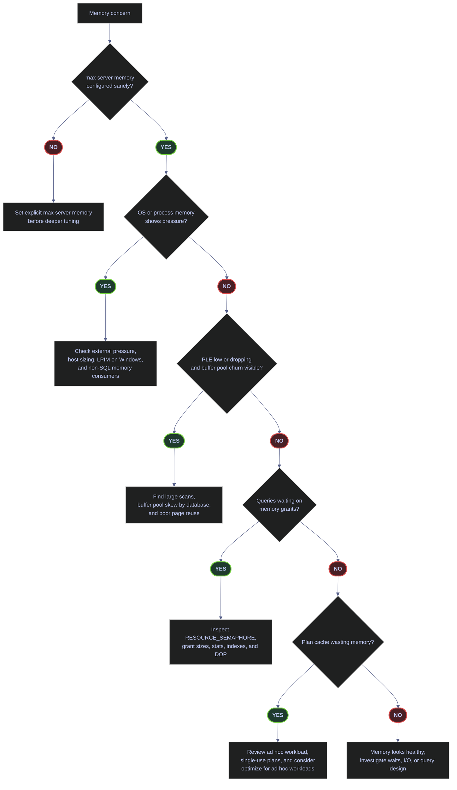
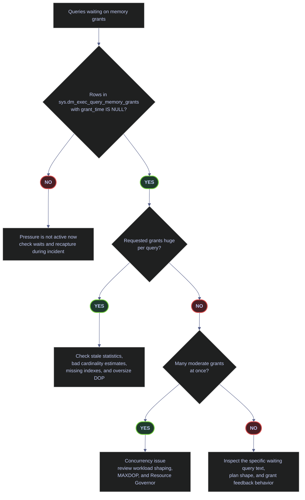

# Memory and the Buffer Pool

SQL Server is designed to use memory aggressively. That is healthy when the instance has a sane `max server memory` cap, the operating system is not under external pressure, the buffer pool is holding the right data, and memory grants are not queueing. It becomes a production problem when SQL Server is allowed to grow without bounds, when plan cache bloat wastes memory, or when large scans and oversized grants keep evicting useful pages from RAM.

This page focuses on production diagnostics, not abstract internals. Every read-only query below is written in a form suitable for live troubleshooting, and the output tables are captured from the current `stoxx` instance. High-impact cache-flush commands remain in the note, but they are isolated and explicitly marked as dangerous.

## Key Terms

| Term | Meaning |
|---|---|
| `buffer pool` | Main SQL Server memory region for cached data and index pages. |
| `clean page` | Cached page whose in-memory copy matches disk and can be evicted without being written first. |
| `dirty page` | Cached page modified in memory and not yet written to disk. |
| `PLE` | Page Life Expectancy, measured in seconds. Higher means cached pages stay resident longer. |
| `memory clerk` | Internal SQL Server memory-accounting category such as buffer pool, plan cache, lock manager, or CLR. |
| `memory grant` | Workspace memory pre-allocated to a query for sorts, hashes, and similar operators. |
| `max server memory` | Upper bound for most SQL Server memory consumption. It must be set explicitly in production. |



## Reproducible Baseline

### Configuration values that most directly affect memory stability

*Check the two configuration values that most directly shape memory stability and plan-cache waste: `max server memory (MB)` and `optimize for ad hoc workloads`.*

```sql
SELECT
    name,
    value,
    value_in_use
FROM sys.configurations
WHERE name IN ('max server memory (MB)', 'optimize for ad hoc workloads')
ORDER BY name;
```

| name | value | value_in_use |
|---|---:|---:|
| `max server memory (MB)` | 2147483647 | 2147483647 |
| `optimize for ad hoc workloads` | 0 | 0 |

_The first row is the important one: this instance is still effectively unlimited. On a host with about `24.7 GB` of RAM, leaving `max server memory` at the default is not production-safe because SQL Server can grow until the OS becomes the back-pressure mechanism. The second row is less absolute, but it is still relevant: `optimize for ad hoc workloads` is off, and later plan-cache output shows meaningful single-use ad hoc waste._

| Configuration | Value | Watch | Meaning | Implication |
|---|---|---|---|---|
| `max server memory (MB)` | `2147483647` | &#10060; | Default effectively-unlimited cap. | SQL Server can consume nearly all host RAM and force the OS to absorb the risk. |
| `max server memory (MB)` | Explicit production value | &#9989; | SQL Server memory growth is bounded intentionally. | OS headroom and non-SQL processes are protected. |
| `optimize for ad hoc workloads` | `0` | Depends | First execution of an ad hoc statement stores a full compiled plan. | Can be fine on parameterized workloads, but ad hoc-heavy systems often waste plan-cache memory. |
| `optimize for ad hoc workloads` | `1` | Depends | First execution stores only a compiled plan stub. | Usually beneficial when single-use ad hoc plans dominate the cache. |

### OS-visible memory state

*Inspect the operating system memory state that SQL Server sees, including current free memory and the Resource Monitor state description.*

```sql
SELECT
    total_physical_memory_kb / 1024 AS total_ram_mb,
    available_physical_memory_kb / 1024 AS available_memory_mb,
    system_memory_state_desc
FROM sys.dm_os_sys_memory;
```

| total_ram_mb | available_memory_mb | system_memory_state_desc |
|---:|---:|---|
| 24732 | 18595 | `Available physical memory is high` |

_This is a healthy external-memory snapshot. The host has about `24.7 GB` of RAM and about `18.6 GB` is currently available, so there is no visible OS-level pressure at capture time. That matters because it tells you that any SQL Server memory problem would need to come from internal allocation behavior or workload shape, not from an already-starved host._

| Column | Value or Pattern | Watch | Meaning | Implication |
|---|---|---|---|---|
| `system_memory_state_desc` | `Available physical memory is high` | &#9989; | OS memory pressure is low. | SQL Server is not currently being squeezed by the host. |
| `system_memory_state_desc` | `Physical memory usage is steady` | Depends | Stable state without a strong high/low signal. | Monitor trends and pair with process-level signals. |
| `system_memory_state_desc` | `Physical memory usage is low` | &#10060; | SQL Server sees low available physical memory. | The instance may trim memory or compete badly with the OS. |
| `available_memory_mb` | High relative to host RAM | &#9989; | Plenty of headroom remains. | External memory pressure is unlikely right now. |
| `available_memory_mb` | Persistently low | &#10060; | The host is tight on free memory. | Investigate host sizing, colocated processes, and SQL caps. |

### SQL Server process memory

*Inspect the SQL Server process-level memory view, including physical memory in use, large-page allocations, page faults, and low-memory flags.*

```sql
SELECT
    physical_memory_in_use_kb / 1024 AS physical_memory_in_use_mb,
    large_page_allocations_kb / 1024 AS large_page_allocations_mb,
    locked_page_allocations_kb / 1024 AS locked_page_allocations_mb,
    page_fault_count,
    memory_utilization_percentage,
    available_commit_limit_kb / 1024 AS available_commit_limit_mb,
    process_physical_memory_low,
    process_virtual_memory_low
FROM sys.dm_os_process_memory;
```

| physical_memory_in_use_mb | large_page_allocations_mb | locked_page_allocations_mb | page_fault_count | memory_utilization_percentage | available_commit_limit_mb | process_physical_memory_low | process_virtual_memory_low |
|---:|---:|---:|---:|---:|---:|---:|---:|
| 4226 | 130 | 0 | 0 | 77 | 18595 | 0 | 0 |

_The SQL Server process itself also looks healthy. It is using about `4.2 GB` of physical memory, the low-memory flags are both `0`, and the page-fault count is `0` at capture time. `locked_page_allocations_mb = 0` is expected on this Linux host and should not be misread as a problem by itself._

| Column | Value or Pattern | Watch | Meaning | Implication |
|---|---|---|---|---|
| `process_physical_memory_low` | `0` | &#9989; | SQL Server does not currently consider process physical memory low. | No immediate process-level memory pressure signal. |
| `process_physical_memory_low` | `1` | &#10060; | SQL Server considers process physical memory low. | Investigate host pressure, SQL growth, and memory cap immediately. |
| `process_virtual_memory_low` | `0` | &#9989; | Virtual address space is not under pressure. | Normal state. |
| `process_virtual_memory_low` | `1` | &#10060; | Virtual address space pressure exists. | Memory allocation failures become more likely. |
| `locked_page_allocations_mb` | `0` | Depends | No locked-page allocations are in use. | Normal on Linux; on Windows this can indicate LPIM is not active. |
| `page_fault_count` | Low or zero | &#9989; | No obvious process-level fault activity right now. | Consistent with a healthy snapshot. |

### SQL Server committed memory versus target

*Compare SQL Server's current committed memory to the memory target it would like to reach under the current workload and configuration.*

```sql
SELECT
    physical_memory_kb / 1024 AS physical_memory_mb,
    committed_kb / 1024 AS committed_mb,
    committed_target_kb / 1024 AS target_mb,
    sql_memory_model_desc
FROM sys.dm_os_sys_info;
```

| physical_memory_mb | committed_mb | target_mb | sql_memory_model_desc |
|---:|---:|---:|---|
| 24732 | 5418 | 22824 | `CONVENTIONAL` |

_SQL Server is not squeezed internally at the moment. It has committed about `5.4 GB` but would be willing to grow toward about `22.8 GB` under the current cap and workload. That gap means the instance has plenty of internal growth headroom. The more important operational issue remains the missing explicit `max server memory` cap, not a shortage of memory today._

| Column | Value or Pattern | Watch | Meaning | Implication |
|---|---|---|---|---|
| `committed_mb` | Much lower than `target_mb` | &#9989; in a calm system | SQL Server can still grow toward its target. | Internal memory pressure is unlikely right now. |
| `committed_mb` | Approximately equal to `target_mb` | Depends | SQL Server is near its current target. | Normal on busy systems; pair with grants and PLE before calling it pressure. |
| `committed_mb` | Persistently above or fighting `target_mb` | &#10060; | SQL Server is trying to shrink or re-balance under pressure. | Investigate workload, cap sizing, and external memory pressure. |
| `sql_memory_model_desc` | `CONVENTIONAL` | Depends | Standard memory model. | Normal on Linux; on Windows it means LPIM is not active. |
| `sql_memory_model_desc` | `LOCK_PAGES` | &#9989; on tuned Windows servers | Locked pages are active. | Requires an explicit `max server memory` cap. |
| `sql_memory_model_desc` | `LARGE_PAGES` | Depends | Large-page allocations are active. | Specialist configuration; validate carefully. |

## Buffer Pool Health

### Page Life Expectancy across buffer nodes

*Check Page Life Expectancy both at the aggregate Buffer Manager level and per buffer node so localized pressure is not hidden by an instance-wide average.*

```sql
SELECT
    object_name,
    counter_name,
    instance_name,
    cntr_value AS ple_seconds
FROM sys.dm_os_performance_counters
WHERE counter_name = 'Page life expectancy'
  AND object_name LIKE '%Buffer%'
ORDER BY object_name, instance_name;
```

| object_name | counter_name | instance_name | ple_seconds |
|---|---|---|---:|
| `SQLServer:Buffer Manager` | `Page life expectancy` |  | 15529 |
| `SQLServer:Buffer Node` | `Page life expectancy` | `000` | 15529 |

_PLE is very healthy in this snapshot. At about `15,529` seconds, cached pages are remaining resident for hours, not minutes. Because the instance currently exposes one buffer node, the node-level and aggregate values are identical. On multi-NUMA servers, node-level divergence is often more informative than the aggregate number._

| Column | Value or Range | Watch | Meaning | Implication |
|---|---|---|---|---|
| `ple_seconds` | Very high and stable | &#9989; | Cached pages live a long time before eviction. | Buffer pool churn is low. |
| `ple_seconds` | Low or repeatedly collapsing | &#10060; | Pages are being evicted quickly. | Investigate scans, poor reuse, or true memory shortage. |
| `object_name = SQLServer:Buffer Node` | Present | &#9989; | Node-level PLE is available. | Use it to detect localized NUMA pressure. |
| `instance_name` differing sharply across nodes | Present on multi-node hosts | &#10060; if skewed | One node is under heavier pressure than others. | Investigate scheduler locality and query distribution. |

### Buffer cache hit ratio — calculated correctly

*Calculate the real buffer cache hit ratio from the raw counter and its base, rather than reading the raw fraction counter in isolation.*

```sql
WITH counters AS
(
    SELECT
        counter_name,
        cntr_value
    FROM sys.dm_os_performance_counters
    WHERE counter_name IN ('Buffer cache hit ratio', 'Buffer cache hit ratio base')
      AND object_name LIKE '%Buffer Manager%'
)
SELECT
    CAST
    (
        100.0
        * MAX(CASE WHEN counter_name = 'Buffer cache hit ratio' THEN cntr_value END)
        / NULLIF(MAX(CASE WHEN counter_name = 'Buffer cache hit ratio base' THEN cntr_value END), 0)
        AS decimal(10,2)
    ) AS buffer_cache_hit_ratio_pct,
    MAX(CASE WHEN counter_name = 'Buffer cache hit ratio' THEN cntr_value END) AS hit_ratio_raw,
    MAX(CASE WHEN counter_name = 'Buffer cache hit ratio base' THEN cntr_value END) AS hit_ratio_base
FROM counters;
```

| buffer_cache_hit_ratio_pct | hit_ratio_raw | hit_ratio_base |
|---:|---:|---:|
| 100.00 | 90 | 90 |

_The corrected ratio is `100.00%`. This is exactly why the raw counter alone is not acceptable: the raw and base values are both `90`, so reading only the raw value would incorrectly suggest a `90%` hit ratio. Even when calculated correctly, this metric is cumulative and smooths out bursts, so PLE and wait patterns remain better short-term pressure indicators._

| Column | Value or Range | Watch | Meaning | Implication |
|---|---|---|---|---|
| `buffer_cache_hit_ratio_pct` | `>= 99` | &#9989; | Almost all page requests are served from cache. | Good long-run cache effectiveness. |
| `buffer_cache_hit_ratio_pct` | `95 - 99` | Depends | Some physical reads are occurring. | Could still be fine; read with PLE and I/O waits. |
| `buffer_cache_hit_ratio_pct` | `< 95` | &#10060; | Cache misses are materially high. | Investigate memory pressure, scans, and cache churn. |
| `hit_ratio_raw` without `hit_ratio_base` | Present | &#10060; for interpretation | Raw fraction numerator only. | Never present it as the percentage by itself. |

### Buffer pool usage by database

*See which databases are currently occupying the buffer pool and how much of that cache is dirty versus clean.*

```sql
WITH bd AS
(
    SELECT
        database_id,
        COUNT_BIG(*) AS page_count,
        SUM(CAST(is_modified AS bigint)) AS dirty_page_count
    FROM sys.dm_os_buffer_descriptors
    WHERE database_id <> 32767
    GROUP BY database_id
)
SELECT TOP (10)
    DB_NAME(database_id) AS database_name,
    CAST(page_count * 8.0 / 1024 AS decimal(18,2)) AS buffer_pool_mb,
    CAST(dirty_page_count * 8.0 / 1024 AS decimal(18,2)) AS dirty_pages_mb,
    CAST((page_count - dirty_page_count) * 8.0 / 1024 AS decimal(18,2)) AS clean_pages_mb,
    CAST(100.0 * page_count / NULLIF(SUM(page_count) OVER (), 0) AS decimal(10,2)) AS pct_of_cached_pages
FROM bd
ORDER BY page_count DESC;
```

| database_name | buffer_pool_mb | dirty_pages_mb | clean_pages_mb | pct_of_cached_pages |
|---|---:|---:|---:|---:|
| `stoxx` | 689.63 | 105.36 | 584.27 | 76.30 |
| `tempdb` | 197.34 | 25.17 | 172.16 | 21.83 |
| `model_msdb` | 4.94 | 0.33 | 4.61 | 0.55 |
| `msdb` | 4.53 | 0.36 | 4.17 | 0.50 |
| `model_replicatedmaster` | 3.61 | 1.35 | 2.26 | 0.40 |
| `master` | 2.95 | 0.26 | 2.69 | 0.33 |
| `model` | 0.84 | 0.00 | 0.84 | 0.09 |

_The buffer pool is dominated by exactly the databases you would expect on this instance. `stoxx` holds about `76.30%` of cached pages and `tempdb` about `21.83%`. That is notable but not inherently unhealthy. The useful production question is whether those proportions match workload importance. If an incidental or low-value database dominates this list during a performance incident, that is often a scan or indexing problem rather than a pure memory-capacity problem._

| Column | Value or Pattern | Watch | Meaning | Implication |
|---|---|---|---|---|
| `pct_of_cached_pages` | High on the primary workload database | &#9989; | Cache is aligned with the main workload. | Usually expected. |
| `pct_of_cached_pages` | High on an incidental database | &#10060; | Buffer pool is being consumed by lower-value activity. | Investigate scans, ETL, logging tables, or missing indexes. |
| `dirty_pages_mb` | Persistently high | Depends | More modified pages are waiting to be flushed. | Normal during write activity, but pair with I/O and checkpoint behavior. |
| `clean_pages_mb` | Dominant in steady state | &#9989; | Most cached pages are immediately reusable or evictable. | Typical healthy state. |

## Memory Consumers

### Top memory clerks

*Inspect the largest memory clerks, including both page-based memory and virtual-memory reservation versus commitment.*

```sql
WITH clerks AS
(
    SELECT
        type,
        name,
        SUM(pages_kb) / 1024.0 AS pages_mb,
        SUM(virtual_memory_reserved_kb) / 1024.0 AS vm_reserved_mb,
        SUM(virtual_memory_committed_kb) / 1024.0 AS vm_committed_mb
    FROM sys.dm_os_memory_clerks
    GROUP BY type, name
)
SELECT TOP (10)
    type,
    name,
    CAST(pages_mb AS decimal(18,2)) AS pages_mb,
    CAST(vm_reserved_mb AS decimal(18,2)) AS vm_reserved_mb,
    CAST(vm_committed_mb AS decimal(18,2)) AS vm_committed_mb,
    CAST(100.0 * pages_mb / NULLIF(SUM(pages_mb) OVER (), 0) AS decimal(10,2)) AS pct_of_clerk_pages
FROM clerks
ORDER BY pages_mb DESC;
```

| type | name | pages_mb | vm_reserved_mb | vm_committed_mb | pct_of_clerk_pages |
|---|---|---:|---:|---:|---:|
| `MEMORYCLERK_SQLBUFFERPOOL` | `Client-Default` | 933.54 | 639.16 | 156.11 | 70.61 |
| `CACHESTORE_SQLCP` | `SQL Plans` | 73.77 | 0.00 | 0.00 | 5.58 |
| `MEMORYCLERK_SOSNODE` | `SOS_Node` | 67.38 | 0.00 | 0.00 | 5.10 |
| `MEMORYCLERK_SQLCLR` | `Client-Default` | 42.20 | 6154.94 | 8.19 | 3.19 |
| `OBJECTSTORE_LOCK_MANAGER` | `Lock Manager : Node 0` | 39.23 | 64.00 | 64.00 | 2.97 |
| `CACHESTORE_PHDR` | `Bound Trees` | 37.30 | 0.00 | 0.00 | 2.82 |
| `MEMORYCLERK_SQLSTORENG` | `Client-Default` | 23.18 | 12.56 | 12.56 | 1.75 |
| `MEMORYCLERK_SQLGENERAL` | `Client-Default` | 18.51 | 0.00 | 0.00 | 1.40 |
| `CACHESTORE_SYSTEMROWSET` | `SystemRowsetStore` | 11.63 | 0.00 | 0.00 | 0.88 |
| `MEMORYCLERK_XTP` | `Client-Default` | 11.47 | 0.00 | 0.00 | 0.87 |

_This clerk distribution is healthy overall. The buffer pool is correctly dominant at about `70.61%` of clerk pages. `CACHESTORE_SQLCP` is notable but not extreme at about `5.58%`, which matches the later evidence of ad hoc plan-cache waste without yet proving a crisis. The SQL CLR row is a good example of why virtual memory columns must be read carefully: `vm_reserved_mb` is very large, but only `8.19 MB` is actually committed._

| Clerk | Watch | Meaning | Operational implication |
|---|---|---|---|
| `MEMORYCLERK_SQLBUFFERPOOL` | &#9989; when dominant | Main cached data and index pages. | Usually the largest clerk on a healthy disk-based workload. |
| `CACHESTORE_SQLCP` | Depends | Ad hoc and prepared plan cache. | High values often point to ad hoc workload bloat. |
| `CACHESTORE_OBJCP` | Depends | Stored procedure and module plans. | Large values can still be normal on procedure-heavy systems. |
| `CACHESTORE_PHDR` | Depends | Bound trees and compile-time structures. | Usually smaller; unusual growth can reflect complex compilations. |
| `OBJECTSTORE_LOCK_MANAGER` | &#10060; if unusually large | Lock memory. | Large values can indicate blocking, very high concurrency, or lock-heavy scans. |
| `MEMORYCLERK_SQLCLR` | Depends | CLR-related memory. | Compare committed, not just reserved, memory before calling it a problem. |

### Plan cache composition by object type

*Measure how much of the plan cache is consumed by ad hoc, prepared, view, and procedure plans.*

```sql
WITH plans AS
(
    SELECT
        objtype AS plan_type,
        COUNT(*) AS plan_count,
        SUM(size_in_bytes) / 1048576.0 AS cache_mb,
        SUM(usecounts) AS total_use_count,
        AVG(CONVERT(float, usecounts)) AS avg_use_count
    FROM sys.dm_exec_cached_plans
    GROUP BY objtype
)
SELECT
    plan_type,
    plan_count,
    CAST(cache_mb AS decimal(18,2)) AS cache_mb,
    total_use_count,
    CAST(avg_use_count AS decimal(18,2)) AS avg_use_count,
    CAST(100.0 * cache_mb / NULLIF(SUM(cache_mb) OVER (), 0) AS decimal(10,2)) AS pct_of_plan_cache_mb
FROM plans
ORDER BY cache_mb DESC;
```

| plan_type | plan_count | cache_mb | total_use_count | avg_use_count | pct_of_plan_cache_mb |
|---|---:|---:|---:|---:|---:|
| `Adhoc` | 303 | 47.66 | 2541 | 8.39 | 44.72 |
| `View` | 241 | 37.24 | 2055 | 8.53 | 34.95 |
| `Prepared` | 50 | 21.13 | 340 | 6.80 | 19.82 |
| `Proc` | 6 | 0.54 | 42 | 7.00 | 0.51 |

_Ad hoc plans are currently the largest category in cache at about `44.72%` of plan-cache memory. That does not automatically mean the cache is unhealthy, but it is enough to justify the follow-up check for single-use plans. Procedure plans are tiny by comparison on this instance, which means plan-cache efficiency depends much more on the ad hoc workload than on stored modules._

| Plan type | Watch | Meaning | Operational implication |
|---|---|---|---|
| `Adhoc` | &#10060; if dominant and low-reuse | One-off or text-variant statements. | Often the main source of plan-cache waste. |
| `Prepared` | Depends | Parameterized client-side prepared statements. | Usually more reusable than raw ad hoc plans. |
| `Proc` | &#9989; when well reused | Stored procedures and modules. | Usually a more efficient cache occupant. |
| `View` | Depends | Cached plans involving views. | Can be normal on metadata-heavy or view-heavy systems. |

### Single-use ad hoc plans

*Count ad hoc plans that were compiled once and never reused, and measure how much memory they currently consume.*

```sql
SELECT
    COUNT(*) AS single_use_plans,
    CAST(SUM(size_in_bytes) / 1048576.0 AS decimal(18,2)) AS wasted_mb
FROM sys.dm_exec_cached_plans
WHERE usecounts = 1
  AND objtype = 'Adhoc';
```

| single_use_plans | wasted_mb |
|---:|---:|
| 279 | 44.64 |

_There are currently `279` single-use ad hoc plans occupying about `44.64 MB`. That is not catastrophic on a `24.7 GB` host, but it is no longer trivial either. Combined with the earlier `optimize for ad hoc workloads = 0` result and the large share of `Adhoc` cache, this is a credible production recommendation, not a theoretical one._

| Value or Pattern | Watch | Meaning | Operational implication |
|---|---|---|---|
| Few single-use plans and small `wasted_mb` | &#9989; | Ad hoc plan churn is minor. | No urgent plan-cache action needed. |
| Many single-use plans with meaningful `wasted_mb` | &#10060; | Large numbers of one-off statements are filling cache. | Consider parameterization discipline and `optimize for ad hoc workloads`. |
| Single-use waste rising steadily | &#10060; | Cache churn is ongoing, not incidental. | Investigate client query patterns and ad hoc workload design. |

## Memory Grants

### Queries waiting for memory grants

*Show only queries that are still waiting for workspace memory and have not yet received a grant.*

```sql
SELECT
    mg.session_id,
    mg.request_time,
    mg.grant_time,
    mg.requested_memory_kb / 1024 AS requested_mb,
    mg.granted_memory_kb / 1024 AS granted_mb,
    mg.required_memory_kb / 1024 AS required_mb,
    mg.used_memory_kb / 1024 AS used_mb,
    mg.max_used_memory_kb / 1024 AS max_used_mb,
    mg.queue_id,
    mg.wait_time_ms / 1000.0 AS wait_sec,
    mg.dop,
    mg.timeout_sec,
    LEFT(REPLACE(REPLACE(LTRIM(st.text), CHAR(13), ' '), CHAR(10), ' '), 160) AS sql_text
FROM sys.dm_exec_query_memory_grants AS mg
CROSS APPLY sys.dm_exec_sql_text(mg.sql_handle) AS st
WHERE mg.grant_time IS NULL
ORDER BY mg.requested_memory_kb DESC;
```

| session_id | request_time | grant_time | requested_mb | granted_mb | required_mb | used_mb | max_used_mb | queue_id | wait_sec | dop | timeout_sec | sql_text |
|---|---|---|---:|---:|---:|---:|---:|---:|---:|---:|---:|---|

_No rows were returned. That is the healthy outcome for this query: no statement is currently sitting in the `RESOURCE_SEMAPHORE` queue waiting for workspace memory. In other words, memory grants are not the current bottleneck on this instance._

| Column or Pattern | Value | Watch | Meaning | Implication |
|---|---|---|---|---|
| Result set | No rows | &#9989; | No query is currently waiting for a memory grant. | `RESOURCE_SEMAPHORE` is not active right now. |
| `grant_time` | `NULL` | &#10060; when rows exist | Query has not yet received memory. | The query is still waiting in the grant queue. |
| `queue_id` | `0` | Depends | Regular memory-grant queue. | Larger grants usually appear here. |
| `queue_id` | `1` | Depends | Small-query gateway. | Small memory requests are waiting. |
| `wait_sec` | Rising | &#10060; | Waiting time is accumulating. | Memory-grant pressure is actively delaying execution. |

### Memory-grant diagnosis flow



| Common cause | Typical fix |
|---|---|
| `max server memory` set too low | Raise it if the host has real headroom. |
| Cardinality estimates far too high | Refresh statistics and fix estimation errors. |
| Large sorts or hashes due to poor indexing | Add or adjust indexes to reduce worktable demand. |
| Excessive DOP | Reduce DOP or fix parallel plan shape. |
| Many concurrent grant-heavy queries | Shape workload concurrency or use Resource Governor. |

## Configuration and Intervention Commands

### Set an explicit max server memory cap

> [!warning]
>
> This instance is still effectively unlimited at `2147483647 MB`. That is not a production-safe steady state.

> [!success]
>
> On the current host size of about `24.7 GB`, a dedicated SQL Server usually needs an explicit cap in roughly the low-`22 GB` range, not the default unlimited setting. The exact value depends on what else runs on the host.

*Set an explicit `max server memory` value. This example leaves roughly 2 GB for the operating system and non-SQL allocations on the current host.*

```sql
EXEC sp_configure 'max server memory (MB)', 22684;
RECONFIGURE;
```

### Enable plan-cache protection for ad hoc workloads

> [!warning]
>
> Do not enable this blindly on every server. Apply it when the workload is genuinely ad hoc-heavy and single-use plan waste is material.

> [!success]
>
> On this instance, the recommendation is grounded in evidence: `optimize for ad hoc workloads` is off, ad hoc plans dominate the cache, and single-use ad hoc plans currently waste about `44.64 MB`.

*Enable `optimize for ad hoc workloads` so first-time ad hoc statements cache a stub instead of a full plan.*

```sql
EXEC sp_configure 'optimize for ad hoc workloads', 1;
RECONFIGURE;
```

### High-impact cache-flush commands

> [!danger]
>
> These commands are not normal tuning steps. They are disruptive and should be reserved for targeted troubleshooting, controlled testing, or very specific remediation.

> [!success]
>
> Prefer the narrowest possible scope: one bad plan, one database, or a lab-only cold-cache test.

*Clear the entire instance plan cache.*

```sql
DBCC FREEPROCCACHE;
```

*Clear a single problematic cached plan by handle.*

```sql
DBCC FREEPROCCACHE(<plan_handle>);
```

*Clear cached plans for one database only.*

```sql
DBCC FLUSHPROCINDB(DB_ID('stoxx'));
```

*Clear only the current database procedure cache.*

```sql
ALTER DATABASE SCOPED CONFIGURATION CLEAR PROCEDURE_CACHE;
```

*Checkpoint dirty pages and then drop clean buffer-pool pages for a cold-cache test.*

```sql
CHECKPOINT;
DBCC DROPCLEANBUFFERS;
```

## Windows-Only LPIM

> [!warning]
>
> Lock Pages in Memory is a Windows privilege model topic. It does not apply on Linux in the same way, so this section is relevant only for Windows-hosted SQL Server deployments.

*Check the current SQL Server memory model.*

```sql
SELECT sql_memory_model_desc
FROM sys.dm_os_sys_info;
```

| sql_memory_model_desc |
|---|
| `CONVENTIONAL` |

_The current instance reports `CONVENTIONAL`. On this Linux host, that is expected and is not, by itself, a tuning defect. For Windows deployments, the same query is how you verify whether LPIM has actually taken effect after the privilege is granted and the service is restarted._

| Value | Watch | Meaning | Implication |
|---|---|---|---|
| `CONVENTIONAL` | Depends | Standard memory model. | Normal on Linux; on Windows, LPIM is not active. |
| `LOCK_PAGES` | &#9989; on tuned Windows servers | Locked pages are active. | Requires a correctly set `max server memory` cap. |
| `LARGE_PAGES` | Depends | Large-page allocations are active. | Specialist configuration; validate carefully before using. |

## Related

- [[wait-stats-analysis]]
- [[query-store-regressions-and-plan-forcing]]
- [[execution-plans]]
- [[index-maintenance]]
- [[performance-audit-playbook]]

## References

- Microsoft Learn: [Memory management architecture guide](https://learn.microsoft.com/en-us/sql/relational-databases/memory-management-architecture-guide?view=sql-server-ver17)
- Microsoft Learn: [Server memory server configuration options](https://learn.microsoft.com/en-us/sql/database-engine/configure-windows/server-memory-server-configuration-options?view=sql-server-ver17)
- Microsoft Learn: [sys.dm_os_process_memory (Transact-SQL)](https://learn.microsoft.com/en-us/sql/relational-databases/system-dynamic-management-views/sys-dm-os-process-memory-transact-sql?view=sql-server-ver17)
- Microsoft Learn: [sys.dm_os_memory_clerks (Transact-SQL)](https://learn.microsoft.com/en-us/sql/relational-databases/system-dynamic-management-views/sys-dm-os-memory-clerks-transact-sql?view=sql-server-ver17)
- Microsoft Learn: [sys.dm_os_buffer_descriptors (Transact-SQL)](https://learn.microsoft.com/en-us/sql/relational-databases/system-dynamic-management-views/sys-dm-os-buffer-descriptors-transact-sql?view=sql-server-ver17)
- Microsoft Learn: [sys.dm_exec_query_memory_grants (Transact-SQL)](https://learn.microsoft.com/en-us/sql/relational-databases/system-dynamic-management-views/sys-dm-exec-query-memory-grants-transact-sql?view=sql-server-ver17)
- Microsoft Learn: [SQL Server Buffer Manager object](https://learn.microsoft.com/en-us/sql/relational-databases/performance-monitor/sql-server-buffer-manager-object?view=sql-server-ver17)
- Microsoft Learn: [Enable the Lock Pages in Memory option](https://learn.microsoft.com/en-us/sql/database-engine/configure-windows/enable-the-lock-pages-in-memory-option-windows?view=sql-server-ver17)

