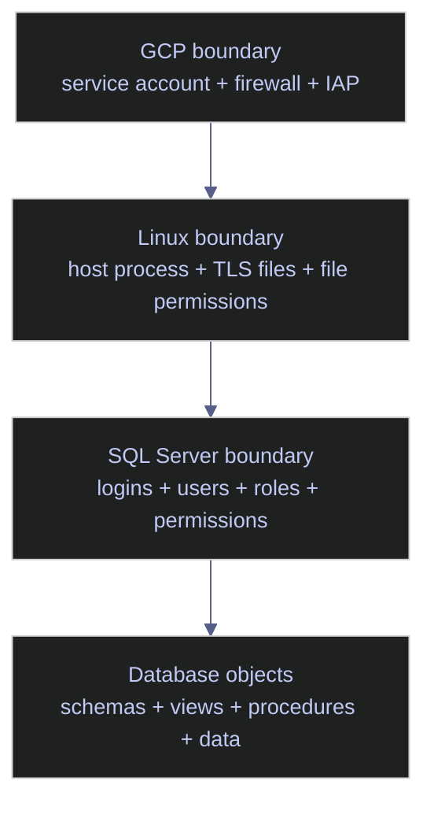

# SQL Server Authentication

Authentication hardening for SQL Server has three distinct layers:

- the cloud and VM identity boundary
- the host and transport-security boundary
- the SQL Server principal and permission boundary

Weakness in any one of those layers can undermine the rest. A perfectly permissioned login is still risky if the server accepts unencrypted client traffic, and TLS does not help if privileged instance principals are over-granted.

## Identity Boundaries

For SQL Server running on Linux in GCP, think about identity and access in concentric layers rather than as one flat security problem.



The operational rule is simple:

- keep the cloud service account narrow
- make transport encryption explicit
- keep SQL logins and roles minimal and attributable

## Baseline The Instance Authentication Posture

Production hardening starts with facts, not intention. Before changing logins or TLS settings, inventory the current authentication mode, principal surface, and privileged role membership.

### Engine mode and authentication boundary

The engine-level properties show whether the instance is Windows-auth-only or mixed-mode and which SQL Server edition and branch you are securing.

#### `SERVERPROPERTY` | engine edition and authentication mode

This query returns the basic instance identity and whether SQL logins are accepted.

*Return the engine edition, exact build, and whether the instance accepts only integrated authentication or also SQL logins.*

```sql
SELECT
    @@SERVERNAME AS server_name,
    CAST(SERVERPROPERTY('Edition') AS nvarchar(128)) AS edition,
    CAST(SERVERPROPERTY('ProductVersion') AS nvarchar(128)) AS product_version,
    CAST(SERVERPROPERTY('ProductLevel') AS nvarchar(128)) AS product_level,
    CAST(SERVERPROPERTY('EngineEdition') AS int) AS engine_edition,
    CAST(SERVERPROPERTY('IsIntegratedSecurityOnly') AS int) AS is_windows_auth_only;
```

| server_name | edition | product_version | product_level | engine_edition | is_windows_auth_only |
|---|---|---|---|---:|---:|
| `9b9b89176e4b` | `Developer Edition (64-bit)` | `16.0.4236.2` | `RTM` | 3 | 0 |

_This instance accepts SQL logins because `is_windows_auth_only = 0`. On Linux that is the expected outcome for this environment, but it also means SQL login hygiene matters immediately. `engine_edition = 3` identifies the standard on-premises SQL Server engine family rather than Azure SQL Database._

| Column | Value | Watch | Meaning | Implication |
|---|---|---|---|---|
| `engine_edition` | `3` | ✅ | Box-product SQL Server engine. | Normal for SQL Server on Linux or Windows Server. |
| `engine_edition` | `5` | Depends | Azure SQL Database. | Security and authentication behavior differ materially from box SQL Server. |
| `is_windows_auth_only` | `0` | Depends | Mixed mode or SQL logins allowed. | Required when applications use SQL authentication, but it increases password-management surface. |
| `is_windows_auth_only` | `1` | ✅ when feasible on Windows | Only integrated authentication is allowed. | Stronger when Windows or Entra-backed auth is available. |

### Instance login inventory

A secure authentication model needs an explicit inventory of every server principal that can connect, whether it is disabled, and whether SQL logins are using password policy enforcement.

#### `sys.server_principals` + `sys.sql_logins` | inventory server logins

This query returns Windows and SQL server principals and exposes SQL-login password-policy flags where they exist.

*List login-capable server principals and show which SQL logins use password policy and expiration checks.*

```sql
SELECT
    sp.name AS login_name,
    sp.type_desc,
    sp.is_disabled,
    sp.create_date,
    sl.is_policy_checked,
    sl.is_expiration_checked,
    LOGINPROPERTY(sp.name, 'PasswordLastSetTime') AS password_last_set
FROM sys.server_principals AS sp
LEFT JOIN sys.sql_logins AS sl
    ON sp.principal_id = sl.principal_id
WHERE sp.type IN ('S', 'U', 'G')
  AND sp.name NOT LIKE '##%'
ORDER BY sp.name;
```

| login_name | type_desc | is_disabled | create_date | is_policy_checked | is_expiration_checked | password_last_set |
|---|---|---:|---|---:|---:|---|
| `BUILTIN\Administrators` | `WINDOWS_GROUP` | 0 | 2026-01-22 20:23:42.077 |  |  |  |
| `NT AUTHORITY\NETWORK SERVICE` | `WINDOWS_LOGIN` | 0 | 2026-03-04 22:09:29.657 |  |  |  |
| `NT AUTHORITY\SYSTEM` | `WINDOWS_LOGIN` | 0 | 2026-03-04 22:09:29.657 |  |  |  |
| `sa` | `SQL_LOGIN` | 0 | 2003-04-08 09:10:35.460 | 1 | 0 | 2026-03-04 22:09:29.133 |

_The login surface is still small, which is good, but it is not yet production-tight. The `sa` login is enabled, password policy enforcement is on, password expiration is off, and three Windows principals remain present at the instance level. On Linux-backed deployments, those Windows principals usually exist because of the container or host security model; the important next step is not to confuse their presence with a safe privilege posture._

| Column | Value | Watch | Meaning | Implication |
|---|---|---|---|---|
| `type_desc` | `SQL_LOGIN` | Depends | SQL Server-managed username and password. | Common for applications, but requires strict secret management and audit coverage. |
| `type_desc` | `WINDOWS_LOGIN` | Depends | Mapped Windows principal. | Fine if intentionally used, but verify actual role membership and necessity. |
| `type_desc` | `WINDOWS_GROUP` | Depends | Group principal can grant broad access indirectly. | Review carefully because group membership often grows outside the DBA workflow. |
| `is_disabled` | `0` | Depends | The login can authenticate. | Expected for active service principals, risky for dormant administrative accounts. |
| `is_disabled` | `1` | ✅ for unused privileged logins | The login cannot authenticate. | Good state for retired or emergency-only logins. |
| `is_policy_checked` | `1` | ✅ for SQL logins | Windows password policy is enforced for the SQL login. | Strong baseline for SQL-authenticated service accounts. |
| `is_policy_checked` | `0` | ❌ for SQL logins | Password policy is not enforced. | Weakens password-quality controls and should be justified explicitly. |
| `is_expiration_checked` | `1` | Depends | Password expiration policy is enforced. | Often unsuitable for non-interactive service accounts unless rotation is automated safely. |
| `is_expiration_checked` | `0` | Depends | Password expiration is not enforced. | Acceptable for service accounts only if an external rotation process exists. |

### Privileged role exposure

The single most dangerous authentication outcome is not merely having many logins. It is having too many principals in `sysadmin`, because `sysadmin` bypasses nearly every other permission boundary.

#### `sys.server_role_members` | inventory `sysadmin`

This query shows which principals currently hold `sysadmin`.

*Return the full current membership of the `sysadmin` fixed server role.*

```sql
SELECT
    r.name AS role_name,
    m.name AS member_name,
    m.type_desc
FROM sys.server_role_members AS srm
JOIN sys.server_principals AS r
    ON srm.role_principal_id = r.principal_id
JOIN sys.server_principals AS m
    ON srm.member_principal_id = m.principal_id
WHERE r.name = 'sysadmin'
ORDER BY m.name;
```

| role_name | member_name | type_desc |
|---|---|---|
| `sysadmin` | `BUILTIN\Administrators` | `WINDOWS_GROUP` |
| `sysadmin` | `NT AUTHORITY\NETWORK SERVICE` | `WINDOWS_LOGIN` |
| `sysadmin` | `sa` | `SQL_LOGIN` |

_This is broader than a production-safe posture. `sa` in `sysadmin` is inherent, but `BUILTIN\Administrators` and `NT AUTHORITY\NETWORK SERVICE` both need explicit justification. `NETWORK SERVICE` especially deserves review because it represents a host/service identity rather than an interactive DBA identity._

| Column | Value | Watch | Meaning | Implication |
|---|---|---|---|---|
| `member_name` | Named emergency or DBA principal only | ✅ | Privileged membership is narrow and intentional. | Easier to review and far safer operationally. |
| `member_name` | `sa` | Depends | Default SQL superuser. | Keep password strong, audit it heavily, and disable or rename if the operating model permits. |
| `member_name` | Broad OS group | ❌ unless strictly governed | Many people or processes may inherit SQL Server superuser rights indirectly. | Review immediately; blast radius is large. |
| `member_name` | Service identity such as `NETWORK SERVICE` | ❌ unless required and documented | A host/service account can administer the entire instance. | Replace with narrower grants whenever possible. |

### Database principal surface in `stoxx`

Instance logins are only half of the story. A login can connect to the instance without being mapped to a user in a specific database. Database principal inventory shows whether access inside `stoxx` is broad, narrow, or still largely unmodeled.

#### `sys.databases` | database owner and encryption state

This query shows who owns `stoxx` and whether the database is encrypted at rest.

*Return the owner and encryption flag for the `stoxx` database.*

```sql
SELECT
    db.name AS database_name,
    SUSER_SNAME(owner_sid) AS owner_name,
    db.is_encrypted
FROM sys.databases AS db
WHERE db.name = 'stoxx';
```

| database_name | owner_name | is_encrypted |
|---|---|---:|
| `stoxx` | `sa` | 0 |

_`stoxx` is still owned by `sa`, and it is not encrypted with TDE. The owner itself is not an authentication method, but database ownership matters because ownership chaining and implicit authority often become harder to reason about when production databases remain owned by a generic superuser login._

| Column | Value | Watch | Meaning | Implication |
|---|---|---|---|---|
| `owner_name` | Dedicated admin principal | ✅ | Ownership is explicit and intentional. | Better separation than leaving production databases owned by `sa`. |
| `owner_name` | `sa` | Depends | Default superuser owns the database. | Common in labs, but many teams standardize on a named admin principal instead. |
| `is_encrypted` | `0` | Depends | TDE is not enabled. | Acceptable only if the at-rest encryption decision is intentional. |
| `is_encrypted` | `1` | ✅ when TDE is required | The database is encrypted at rest. | Backup and certificate management become part of the operational surface. |

#### `sys.database_principals` | inventory the database principal surface

This query returns user-defined and role principals inside `stoxx`.

*List non-system database principals in `stoxx` so the actual user surface is visible.*

```sql
SELECT
    name,
    type_desc,
    authentication_type_desc,
    create_date,
    modify_date
FROM sys.database_principals
WHERE principal_id > 4
  AND type IN ('S', 'U', 'G', 'R')
ORDER BY name;
```

| name | type_desc | authentication_type_desc | create_date | modify_date |
|---|---|---|---|---|
| `db_accessadmin` | `DATABASE_ROLE` | `NONE` | 2003-04-08 09:10:42.333 | 2009-04-13 12:59:14.467 |
| `db_backupoperator` | `DATABASE_ROLE` | `NONE` | 2003-04-08 09:10:42.350 | 2009-04-13 12:59:14.467 |
| `db_datareader` | `DATABASE_ROLE` | `NONE` | 2003-04-08 09:10:42.363 | 2009-04-13 12:59:14.467 |
| `db_datawriter` | `DATABASE_ROLE` | `NONE` | 2003-04-08 09:10:42.363 | 2009-04-13 12:59:14.467 |
| `db_ddladmin` | `DATABASE_ROLE` | `NONE` | 2003-04-08 09:10:42.350 | 2009-04-13 12:59:14.467 |
| `db_denydatareader` | `DATABASE_ROLE` | `NONE` | 2003-04-08 09:10:42.380 | 2009-04-13 12:59:14.467 |
| `db_denydatawriter` | `DATABASE_ROLE` | `NONE` | 2003-04-08 09:10:42.380 | 2009-04-13 12:59:14.467 |
| `db_owner` | `DATABASE_ROLE` | `NONE` | 2003-04-08 09:10:42.333 | 2009-04-13 12:59:14.467 |
| `db_securityadmin` | `DATABASE_ROLE` | `NONE` | 2003-04-08 09:10:42.350 | 2009-04-13 12:59:14.467 |

_There are currently no custom users in `stoxx`; the principal surface is only the built-in fixed database roles. That is better than an uncontrolled sprawl of users, but it also means the application-facing permission model has not yet been explicitly expressed inside the database._

| Column | Value | Watch | Meaning | Implication |
|---|---|---|---|---|
| `type_desc` | `DATABASE_ROLE` | ✅ in this snapshot | Built-in or user-defined role rather than a direct user principal. | The database currently exposes only role scaffolding, not custom users. |
| `type_desc` | `SQL_USER`, `WINDOWS_USER`, `WINDOWS_GROUP` | Depends | Direct database principals exist. | Review mappings and memberships for least privilege. |
| `authentication_type_desc` | `NONE` | ✅ for roles | Roles do not authenticate directly. | Expected for fixed database roles. |
| `authentication_type_desc` | `INSTANCE` | Depends | The user maps to an instance login. | Standard for most non-contained databases. |
| `authentication_type_desc` | `DATABASE` | Depends | The user authenticates at the database level. | Review contained-database posture and password controls carefully. |

#### `sys.database_permissions` | verify `guest` has no explicit permissions

The `guest` user is a common source of accidental exposure if it has been granted direct permissions.

*Check whether the `guest` user has any explicit permissions inside `stoxx`.*

```sql
SELECT
    perm.state_desc,
    perm.permission_name
FROM sys.database_permissions AS perm
WHERE perm.grantee_principal_id = DATABASE_PRINCIPAL_ID('guest')
ORDER BY perm.permission_name;
```

| state_desc | permission_name |
|---|---|

_No rows is the desired result here. `guest` has no explicit permissions in `stoxx`, which means unauthenticated guest access has not been widened with direct grants in this database._

| Column | Value | Watch | Meaning | Implication |
|---|---|---|---|---|
| Result set empty | No explicit `guest` permissions | ✅ | `guest` has not been granted database permissions directly. | Good baseline. Keep it that way unless a contained-database design explicitly requires otherwise. |
| Any returned permission | ❌ | `guest` can perform explicit actions. | Review immediately because it can broaden database access in surprising ways. |

## Transport Encryption And TLS

Authentication hardening is incomplete if clients can still talk to SQL Server over unencrypted transport. SQL logins especially depend on transport security because the credential exchange and session traffic otherwise remain exposed to network interception.

### Connection encryption posture

The first question is not whether TLS has been configured in theory. It is whether current live connections are actually encrypted.

#### `sys.dm_exec_connections` | summarize user-process encryption state

This production query summarizes encryption posture by authentication scheme and transport.

*Summarize live user-process connections by encryption state, authentication scheme, and transport.*

```sql
SELECT
    c.encrypt_option,
    c.auth_scheme,
    c.net_transport,
    COUNT(*) AS connection_count
FROM sys.dm_exec_connections AS c
JOIN sys.dm_exec_sessions AS s
    ON c.session_id = s.session_id
WHERE s.is_user_process = 1
GROUP BY
    c.encrypt_option,
    c.auth_scheme,
    c.net_transport
ORDER BY connection_count DESC;
```

| encrypt_option | auth_scheme | net_transport | connection_count |
|---|---|---|---:|
| `TRUE` | `SQL` | `TCP` | 2 |
| `FALSE` | `NTLM` | `TCP` | 1 |

_Most user-process connections are encrypted SQL-authenticated TCP sessions, which is good. One unencrypted NTLM session still exists in the user-process view, which means the encryption posture is not uniformly enforced across all live sessions._

| Column | Value | Watch | Meaning | Implication |
|---|---|---|---|---|
| `encrypt_option` | `TRUE` | ✅ | The current connection is encrypted. | Desired baseline for all remote application and admin sessions. |
| `encrypt_option` | `FALSE` | ❌ | The current connection is not encrypted. | Investigate client settings, server TLS config, and whether the session is internal only. |
| `auth_scheme` | `SQL` | Depends | SQL login authentication. | Common on Linux and for application logins; TLS matters even more. |
| `auth_scheme` | `NTLM` | Depends | Windows or host-integrated auth path. | Still needs encryption when crossing the network. |
| `net_transport` | `TCP` | ✅ | Standard SQL Server network transport. | Expected for most remote connections. |

#### `sys.dm_exec_connections` | inspect live connection detail

A summary is useful, but production triage needs the individual sessions, login names, host identity, client program, and client network address.

*Return per-session connection detail so unencrypted or unexpected clients can be identified directly.*

```sql
SELECT
    c.session_id,
    s.login_name,
    s.host_name,
    s.program_name,
    c.encrypt_option,
    c.auth_scheme,
    c.net_transport,
    c.client_net_address
FROM sys.dm_exec_connections AS c
JOIN sys.dm_exec_sessions AS s
    ON c.session_id = s.session_id
ORDER BY c.encrypt_option, c.session_id;
```

| session_id | login_name | host_name | program_name | encrypt_option | auth_scheme | net_transport | client_net_address |
|---|---|---|---|---|---|---|---|
| 53 | `NT AUTHORITY\SYSTEM` | `8482aae8ad0a` | `SQLServerCEIP` | `FALSE` | `NTLM` | `TCP` | `127.0.0.1` |
| 55 | `sa` | `ELYSIUM` | `SQLCMD` | `TRUE` | `SQL` | `TCP` | `172.19.0.1` |
| 56 | `sa` | `ELYSIUM` | `SQLCMD` | `TRUE` | `SQL` | `TCP` | `172.19.0.1` |
| 57 | `sa` | `ELYSIUM` | `SQLCMD` | `TRUE` | `SQL` | `TCP` | `172.19.0.1` |
| 73 | `sa` | `ELYSIUM` | `SQL Server Management Studio` | `TRUE` | `SQL` | `TCP` | `172.19.0.1` |

_The unencrypted connection is the local `SQLServerCEIP` telemetry process using loopback `127.0.0.1`, not a remote client. That reduces immediate exposure, but it does not change the broader production requirement: remote application and admin sessions should all show `encrypt_option = TRUE`, and the server should be configured so that this is enforced rather than incidental._

| Column | Value | Watch | Meaning | Implication |
|---|---|---|---|---|
| `client_net_address` | Loopback such as `127.0.0.1` | Depends | Local host traffic. | Lower interception risk than remote traffic, but still useful to classify separately. |
| `client_net_address` | Real remote client IP | Depends | Network traffic from another host. | Must be encrypted in production. |
| `program_name` | Expected admin or application tool | ✅ | The session source is identifiable. | Helps distinguish approved clients from unknown tooling. |
| `program_name` | Unexpected tool or blank | ❌ | Session source is unclear or unusual. | Investigate login, host, and query activity. |

### Linux TLS configuration baseline

Live connections tell you what is happening now. `mssql-conf` tells you what the server has actually been configured to enforce on Linux.

#### `mssql-conf get` | inspect SQL Server Linux TLS settings

This checks whether SQL Server on Linux has explicit TLS certificate, key, protocol, and force-encryption settings.

*Read the Linux `mssql-conf` TLS settings that control certificate location, protocol version, and forced encryption.*

```bash
docker exec stoxx-db /opt/mssql/bin/mssql-conf get network.forceencryption
docker exec stoxx-db /opt/mssql/bin/mssql-conf get network.tlsprotocols
docker exec stoxx-db /opt/mssql/bin/mssql-conf get network.tlscert
docker exec stoxx-db /opt/mssql/bin/mssql-conf get network.tlskey
```

| setting | value |
|---|---|
| `network.forceencryption` | `not set` |
| `network.tlsprotocols` | `not set` |
| `network.tlscert` | `not set` |
| `network.tlskey` | `not set` |

_No explicit TLS settings are configured in `mssql.conf`. That means transport encryption is not being enforced from the Linux server configuration itself. The current encrypted remote sessions are therefore not enough to call the transport posture hardened yet._

| Column | Value | Watch | Meaning | Implication |
|---|---|---|---|---|
| `network.forceencryption` | `1` | ✅ | SQL Server forces encrypted connections. | Strongest production posture for remote clients. |
| `network.forceencryption` | `0` or not set | ❌ | Encryption is not explicitly enforced. | Client misconfiguration can still produce unencrypted sessions. |
| `network.tlsprotocols` | Explicit `1.2` or approved list | ✅ | The accepted TLS versions are restricted intentionally. | Good production hygiene and clearer compliance posture. |
| `network.tlsprotocols` | Not set | Depends | Default engine behavior applies. | Less explicit and harder to audit. |
| `network.tlscert` / `network.tlskey` | Configured paths | ✅ | SQL Server has explicit certificate material configured. | Required for a deliberate server-authenticated TLS posture. |
| `network.tlscert` / `network.tlskey` | Not set | ❌ | No explicit certificate path is configured. | Review current certificate source and move to an explicit, managed configuration. |

### Force encrypted client traffic

On Linux, explicit TLS hardening is done with `mssql-conf`. This is a production configuration change and should be scheduled with certificate management, service restart planning, and client validation.

#### `mssql-conf set` | configure certificate paths and force encryption

These commands set the certificate path, private-key path, allowed TLS protocol versions, and forced-encryption behavior.

> [!warning]
>
> Enabling forced encryption without a valid certificate and matching client trust chain can break application connectivity immediately after restart.

> [!success]
>
> Install the certificate and private key first, test client trust with one application path, then enable `network.forceencryption 1` and restart SQL Server in a controlled window.

> [!info]-
>
> This is the production hardening sequence for SQL Server on Linux.
>
> - `network.tlscert` points SQL Server to the server certificate.
> - `network.tlskey` points SQL Server to the matching private key.
> - `network.tlsprotocols 1.2` restricts the accepted protocol set intentionally.
> - `network.forceencryption 1` tells SQL Server to require encryption for incoming connections.
> - `systemctl restart mssql-server` is required for the new network settings to take effect.

*Configure the Linux TLS certificate paths, restrict protocols, and force encrypted client traffic.*

```bash
sudo /opt/mssql/bin/mssql-conf set network.tlscert /var/opt/mssql/tls/server.crt
sudo /opt/mssql/bin/mssql-conf set network.tlskey /var/opt/mssql/tls/server.key
sudo /opt/mssql/bin/mssql-conf set network.tlsprotocols 1.2
sudo /opt/mssql/bin/mssql-conf set network.forceencryption 1
sudo systemctl restart mssql-server
```

#### Client connection strings | require encryption and validate the certificate

Clients should request encryption explicitly and validate the server certificate rather than bypass trust checks.

*Use encrypted connection strings that validate the server certificate instead of bypassing TLS trust.*

```text
Encrypt=yes;TrustServerCertificate=no;
```

## GCP Perimeter Recommendations

The SQL Server layer is only one part of the authentication boundary. On GCP, the VM service account, firewall rules, and administrative access path should be narrow and explicit.

### Dedicated GCP service account

Do not run a production SQL Server VM on the default Compute Engine service account with broad project-level permissions. Use a dedicated service account and grant only the roles that the VM really needs, such as:

- object access to the backup bucket
- metric or log publication permissions
- nothing else unless a workload requires it

### Administrative ingress

Prefer an administrative path that is attributable and narrow:

- use IAP TCP forwarding or another controlled bastion pattern
- keep SQL Server ports closed to broad source ranges
- document which admin tools are expected to connect and from where

## Audit Integration

Authentication hardening without audit is incomplete. Login success, login failure, and principal-change events should be captured and reviewed continuously.

Implementation details and production queries for SQL Server Audit live in [[audit-logging]].

## Recommendations

- Keep `sysadmin` membership as small as possible and review it regularly.
- Replace generic shared SQL logins with dedicated application identities wherever possible.
- Keep `sa` for break-glass use only, or rename and disable it if the operating model allows that safely.
- Treat `encrypt_option = TRUE` on a few sessions as a snapshot, not as proof that TLS enforcement is hardened.
- Make Linux TLS settings explicit in `mssql.conf` instead of relying on incidental defaults.
- Use database users and role memberships intentionally inside `stoxx`; an empty custom-principal surface is better than sprawl, but it still means the permission model has not been fully expressed yet.

## Related

- [[audit-logging]]
- [[tde-encryption]]

