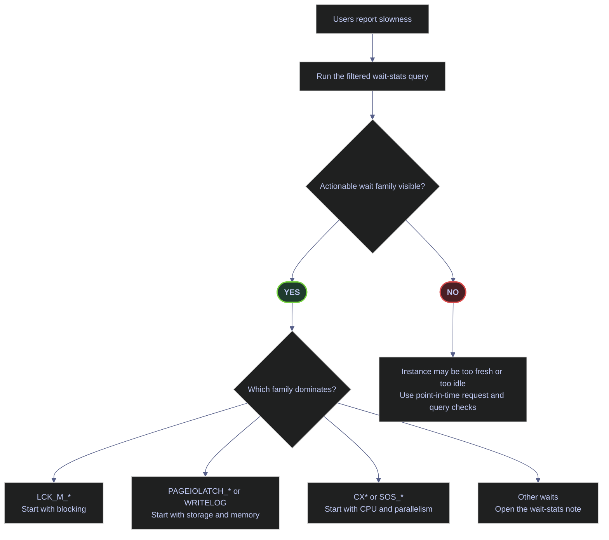
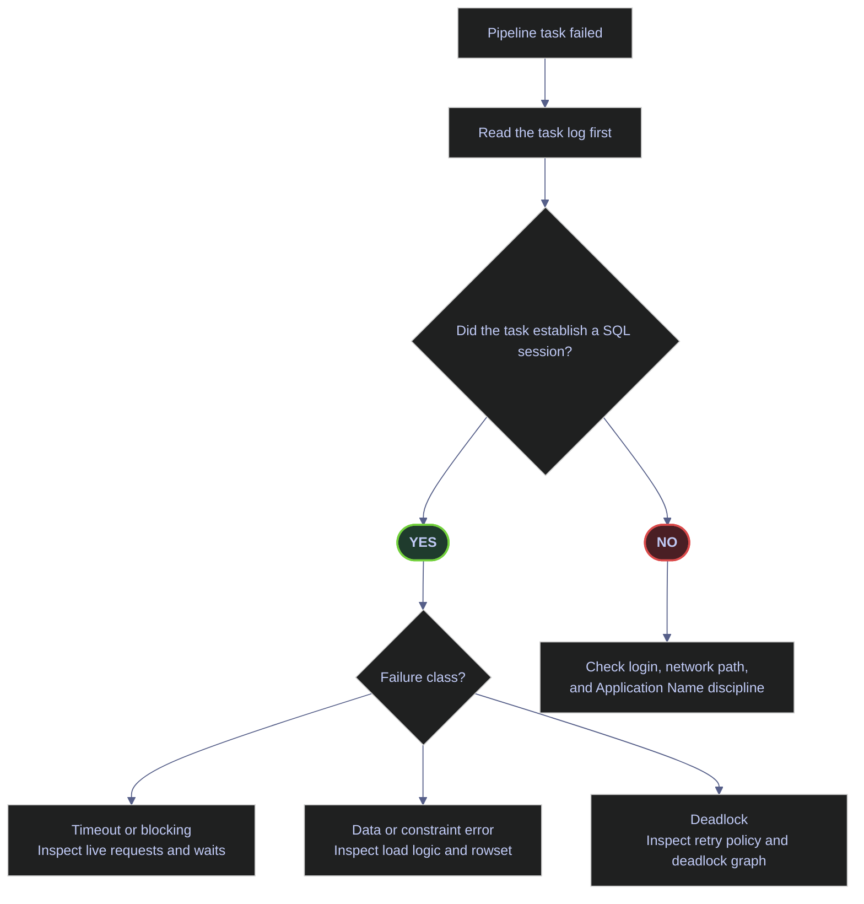
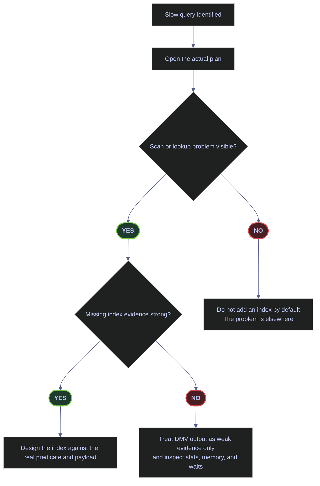
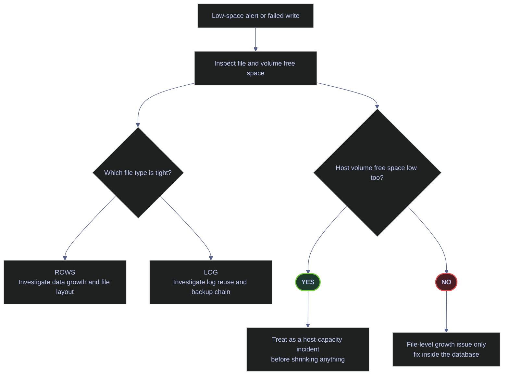

# Troubleshooting Flowcharts

This page is a routing layer for production incidents. It is not a replacement for the deeper notes. Its job is to answer the first question quickly:

- which diagnostic surface should you open first
- which branches are most likely given the first real signal
- which linked note contains the full remediation workflow

The starter queries below are real outputs from the current `stoxx` instance, so the page stays grounded in the actual environment instead of reading like a generic decision-tree handout.

## Flowchart 1: "Why Is It Slow?" — The Master Flowchart

Start here when the complaint is latency or throughput. The first production question is not "should I add an index?" It is "what resource family is the workload waiting on?"



### Starter query: actionable wait families

> [!info]-
> This is the first query to run when the complaint is general slowness.
>
> - The `WHERE` clause removes idle and background waits that would otherwise dominate the output without explaining user-facing pain.
> - `wait_sec` is the total wait time for the family since the instance started.
> - `resource_wait_sec` is the non-CPU portion of that wait.
> - `signal_wait_sec` is scheduler delay after the resource was granted.
> - `waiting_tasks_count` tells you whether the problem is many short waits or fewer long waits.
>
> *Surface the top actionable waits on the current instance before choosing a troubleshooting branch.*
>
```sql
WITH waits AS (
    SELECT
        wait_type,
        wait_time_ms / 1000.0 AS wait_sec,
        (wait_time_ms - signal_wait_time_ms) / 1000.0 AS resource_wait_sec,
        signal_wait_time_ms / 1000.0 AS signal_wait_sec,
        waiting_tasks_count
    FROM sys.dm_os_wait_stats
    WHERE wait_type NOT IN (
        'BROKER_EVENTHANDLER','BROKER_RECEIVE_WAITFOR','BROKER_TASK_STOP',
        'BROKER_TO_FLUSH','BROKER_TRANSMITTER','CHECKPOINT_QUEUE','CHKPT',
        'CLR_AUTO_EVENT','CLR_MANUAL_EVENT','CLR_SEMAPHORE',
        'DBMIRROR_DBM_EVENT','DBMIRROR_EVENTS_QUEUE','DBMIRROR_WORKER_QUEUE',
        'DBMIRRORING_CMD','DIRTY_PAGE_POLL','DISPATCHER_QUEUE_SEMAPHORE',
        'EXECSYNC','FSAGENT','FT_IFTS_SCHEDULER_IDLE_WAIT','FT_IFTSHC_MUTEX',
        'HADR_CLUSAPI_CALL','HADR_FILESTREAM_IOMGR_IOCOMPLETION',
        'HADR_LOGCAPTURE_WAIT','HADR_NOTIFICATION_DEQUEUE','HADR_TIMER_TASK',
        'HADR_WORK_QUEUE','KSOURCE_WAKEUP','LAZYWRITER_SLEEP','LOGMGR_QUEUE',
        'MEMORY_ALLOCATION_EXT','ONDEMAND_TASK_QUEUE','PARALLEL_REDO_DRAIN_WORKER',
        'PARALLEL_REDO_LOG_CACHE','PARALLEL_REDO_TRAN_LIST','PARALLEL_REDO_WORKER_SYNC',
        'PARALLEL_REDO_WORKER_WAIT_WORK','PREEMPTIVE_OS_FLUSHFILEBUFFERS',
        'PREEMPTIVE_XE_GETTARGETSTATE','PWAIT_ALL_COMPONENTS_INITIALIZED',
        'PWAIT_DIRECTLOGCONSUMER_GETNEXT','PWAIT_EXTENSIBILITY_CLEANUP_TASK',
        'QDS_ASYNC_QUEUE','QDS_CLEANUP_STALE_QUERIES_TASK_MAIN_LOOP_SLEEP',
        'QDS_PERSIST_TASK_MAIN_LOOP_SLEEP','QDS_SHUTDOWN_QUEUE',
        'REDO_THREAD_PENDING_WORK','REQUEST_FOR_DEADLOCK_SEARCH','RESOURCE_QUEUE',
        'SERVER_IDLE_CHECK','SLEEP_BPOOL_FLUSH','SLEEP_DBSTARTUP',
        'SLEEP_DCOMSTARTUP','SLEEP_MASTERDBREADY','SLEEP_MASTERMDREADY',
        'SLEEP_MASTERUPGRADED','SLEEP_MSDBSTARTUP','SLEEP_SYSTEMTASK',
        'SLEEP_TASK','SLEEP_TEMPDBSTARTUP','SNI_HTTP_ACCEPT',
        'SOS_WORK_DISPATCHER','SP_SERVER_DIAGNOSTICS_SLEEP',
        'SQLTRACE_BUFFER_FLUSH','SQLTRACE_INCREMENTAL_FLUSH_SLEEP',
        'SQLTRACE_WAIT_ENTRIES','WAIT_FOR_RESULTS','WAITFOR',
        'WAITFOR_TASKSHUTDOWN','WAIT_XTP_RECOVERY','WAIT_XTP_HOST_WAIT',
        'WAIT_XTP_OFFLINE_CKPT_NEW_LOG','WAIT_XTP_CKPT_CLOSE',
        'XE_DISPATCHER_JOIN','XE_DISPATCHER_WAIT','XE_TIMER_EVENT'
    )
)
SELECT TOP (10)
    wait_type,
    wait_sec,
    resource_wait_sec,
    signal_wait_sec,
    waiting_tasks_count
FROM waits
WHERE wait_sec > 0
ORDER BY wait_sec DESC;
```

| wait_type | wait_sec | resource_wait_sec | signal_wait_sec | waiting_tasks_count |
|---|---:|---:|---:|---:|
| `LCK_M_IX` | 92.048000 | 92.048000 | 0.000000 | 3 |
| `CXPACKET` | 90.310000 | 83.483000 | 6.827000 | 165388 |
| `LCK_M_SCH_S` | 89.425000 | 89.425000 | 0.000000 | 2 |
| `CXSYNC_PORT` | 59.243000 | 59.095000 | 0.148000 | 1366 |
| `LCK_M_U` | 56.662000 | 56.662000 | 0.000000 | 12 |
| `LATCH_EX` | 32.878000 | 30.731000 | 2.147000 | 51133 |
| `LCK_M_X` | 22.324000 | 22.321000 | 0.003000 | 157 |
| `RESERVED_MEMORY_ALLOCATION_EXT` | 20.288000 | 20.288000 | 0.000000 | 1534067 |
| `CXCONSUMER` | 8.785000 | 8.541000 | 0.244000 | 2939 |
| `PREEMPTIVE_OS_AUTHENTICATIONOPS` | 5.708000 | 5.708000 | 0.000000 | 5512 |

_The live first signal is mixed, but the most decision-relevant families are locking (`LCK_M_*`) and parallelism (`CXPACKET`, `CXCONSUMER`, `CXSYNC_PORT`). That means the correct first branches today are blocking analysis and parallel-plan review, not immediate storage or memory escalation._

| Wait family | Watch | What it usually means | First linked note |
|---|---|---|---|
| `LCK_M_*` | &#10060; | Blocking or lock serialization | [[wait-stats-analysis]] |
| `PAGEIOLATCH_*`, `WRITELOG` | &#10060; | Storage path or buffer-pool pressure | [[memory-and-buffer-pool]] |
| `CX*`, `SOS_*` | Depends | Parallelism skew, CPU pressure, or both | [[performance-audit-playbook]] |
| Mostly nothing actionable | Depends | Instance too fresh, idle, or badly filtered | [[performance-audit-playbook]] |

## Flowchart 2: "Pipeline Failed" — Data Pipeline Troubleshooting

Start here when a pipeline task failed. The first question is not "what SQL statement was running?" It is "did the failure reach SQL Server at all?"



### Starter query: current user-session footprint

> [!info]-
> This query answers the first operational question for a failed pipeline: is the service visible in SQL Server as a distinct client identity?
>
> - `program_name` comes from the client connection string `Application Name`.
> - `total_sessions` is the current session footprint for that application and login.
> - `sleeping_sessions` are connected but idle sessions.
> - `active_sessions` are sessions not currently in the `sleeping` state.
>
> *Group current user sessions by application and login before investigating a pipeline-side failure.*
>
```sql
SELECT
    program_name,
    login_name,
    COUNT(*) AS total_sessions,
    SUM(CASE WHEN status = 'sleeping' THEN 1 ELSE 0 END) AS sleeping_sessions,
    SUM(CASE WHEN status <> 'sleeping' THEN 1 ELSE 0 END) AS active_sessions
FROM sys.dm_exec_sessions
WHERE is_user_process = 1
GROUP BY program_name, login_name
ORDER BY total_sessions DESC, program_name;
```

| program_name | login_name | total_sessions | sleeping_sessions | active_sessions |
|---|---|---:|---:|---:|
| `SQLCMD` | `sa` | 4 | 0 | 4 |
| `SQL Server Management Studio` | `sa` | 1 | 1 | 0 |
| `SQLServerCEIP` | `NT AUTHORITY\SYSTEM` | 1 | 1 | 0 |

_The current server footprint is dominated by generic admin clients. There is no distinct pipeline application name visible right now. In production, that weakens failure triage immediately: if the pipeline does not set `Application Name`, SQL Server cannot separate pipeline traffic cleanly from ad hoc admin traffic._

| Column | Value | Watch | Meaning | Implication |
|---|---|---|---|---|
| `program_name` | Stable service name | &#9989; | The client identifies itself clearly. | Easier to distinguish connection failures from query failures. |
| `program_name` | Generic tool name | &#10060; for production services | Identity is coarse or ambiguous. | Harder to prove whether the failed task even reached SQL Server. |
| `sleeping_sessions` | High and growing | &#10060; | Many idle connections remain open. | Check pool sizing and connection cleanup in the pipeline. |
| `active_sessions` | Zero during a failure | Depends | No live request is currently running for that client. | Failure may have occurred before query execution or after disconnect. |

## Flowchart 3: "Should I Add an Index?" — Index Decision Tree

Start here only after you have a slow-query candidate. Index creation is a response to an access-path problem, not a first reflex for every latency complaint.



### Starter query: current missing-index signals

> [!info]-
> Missing-index DMVs are heuristics, not orders.
>
> - `improvement_measure` is a relative priority score based on estimated cost, estimated impact, and observed usage count.
> - `equality_columns`, `inequality_columns`, and `included_columns` describe the optimizer's suggested shape.
> - `user_seeks` and `user_scans` show how often the optimizer thought the missing index could have helped.
>
> For this routing page, the question is not "what DDL do I run?" It is "is there strong enough evidence to continue down the indexing branch at all?"
>
> *Check whether the current workload has credible missing-index signals for the current database.*
>
```sql
SELECT TOP (10)
    CONVERT(decimal(18,4),
        migs.avg_total_user_cost * (migs.avg_user_impact / 100.0) * (migs.user_seeks + migs.user_scans)
    ) AS improvement_measure,
    OBJECT_SCHEMA_NAME(mid.object_id, mid.database_id) AS schema_name,
    OBJECT_NAME(mid.object_id, mid.database_id) AS table_name,
    mid.equality_columns,
    mid.inequality_columns,
    mid.included_columns,
    migs.user_seeks,
    migs.user_scans,
    CONVERT(decimal(5,2), migs.avg_user_impact) AS avg_user_impact_pct
FROM sys.dm_db_missing_index_group_stats AS migs
JOIN sys.dm_db_missing_index_groups AS mig
  ON migs.group_handle = mig.index_group_handle
JOIN sys.dm_db_missing_index_details AS mid
  ON mig.index_handle = mid.index_handle
WHERE mid.database_id = DB_ID()
  AND OBJECT_NAME(mid.object_id, mid.database_id) NOT LIKE 'demo[_]%'
ORDER BY improvement_measure DESC;
```

| improvement_measure | schema_name | table_name | equality_columns | inequality_columns | included_columns | user_seeks | user_scans | avg_user_impact_pct |
|---:|---|---|---|---|---|---:|---:|---:|
| 0.0612 | `silver` | `index_dim` | `NULL` | `[symbol]` | `[_index], [short_name], [valid_from], [valid_to], [is_current]` | 1 | 0 | 79.31 |
| 0.0275 | `gold` | `index_performance` | `[_index]` | `NULL` | `[perf_date], [daily_return], [cumulative_factor], [stocks_count]` | 1 | 0 | 73.76 |

_These are weak signals, not production-grade proof. The scores are tiny and the usage counts are only `1`. That means the correct branch today is not "create the index immediately." It is "treat this as a hint, then confirm with the actual execution plan and repeated workload evidence."_

| Column | Value | Watch | Meaning | Implication |
|---|---|---|---|---|
| `improvement_measure` | Very low | &#10060; for auto-DDL | Weak optimizer evidence so far. | Do not create an index from this output alone. |
| `user_seeks + user_scans` | `1` | &#10060; | Single observed opportunity only. | Evidence is too sparse for a production change by itself. |
| `avg_user_impact_pct` | High but low-frequency | Depends | Optimizer predicts benefit if the pattern repeats. | Useful only when combined with real repeated workload and plan evidence. |

## Flowchart 4: "Disk Space Emergency" — Storage Recovery

Start here when file-growth alerts fire or a write operation fails because a database file or volume is full. The first question is not "should I shrink something?" It is "which file type is tight, and is the problem inside the database file or on the host volume?"



### Starter query: current file and volume free space

> [!info]-
> This query combines database-file and host-volume visibility in one result set.
>
> - `type_desc` distinguishes data files from log files.
> - `file_size_mb`, `space_used_mb`, and `free_space_mb` describe the file itself.
> - `volume_total_gb` and `volume_free_gb` describe the underlying host volume seen by SQL Server.
>
> *Check whether the pressure is inside the database file, on the underlying volume, or both.*
>
```sql
SELECT
    DB_NAME() AS database_name,
    mf.name AS logical_name,
    mf.type_desc,
    CAST(mf.size / 128.0 AS decimal(18,2)) AS file_size_mb,
    CAST(FILEPROPERTY(mf.name, 'SpaceUsed') / 128.0 AS decimal(18,2)) AS space_used_mb,
    CAST((mf.size - FILEPROPERTY(mf.name, 'SpaceUsed')) / 128.0 AS decimal(18,2)) AS free_space_mb,
    vs.logical_volume_name,
    CAST(vs.total_bytes / 1024.0 / 1024 / 1024 AS decimal(18,2)) AS volume_total_gb,
    CAST(vs.available_bytes / 1024.0 / 1024 / 1024 AS decimal(18,2)) AS volume_free_gb
FROM sys.database_files AS mf
CROSS APPLY sys.dm_os_volume_stats(DB_ID(), mf.file_id) AS vs
ORDER BY mf.type_desc, mf.file_id;
```

| database_name | logical_name | type_desc | file_size_mb | space_used_mb | free_space_mb | logical_volume_name | volume_total_gb | volume_free_gb |
|---|---|---|---:|---:|---:|---|---:|---:|
| `stoxx` | `stoxx_log` | `LOG` | 968.00 | 584.02 | 383.98 | `NULL` | 1006.85 | 923.06 |
| `stoxx` | `stoxx` | `ROWS` | 712.00 | 402.94 | 309.06 | `NULL` | 1006.85 | 923.06 |

_There is no current disk emergency on this instance. Both the data file and log file still have hundreds of megabytes free internally, and the underlying host volume has more than `923 GB` free. The important point is the query shape: this is how to distinguish file-level pressure from volume-level pressure before you consider shrink, growth, or cleanup actions._

| Column | Value | Watch | Meaning | Implication |
|---|---|---|---|---|
| `type_desc = ROWS` | Data file | Depends | Holds tables and indexes. | Data-file pressure usually comes from actual data or index growth. |
| `type_desc = LOG` | Log file | Depends | Holds transaction log records. | Log pressure usually comes from reuse or backup-chain problems, not table size directly. |
| `free_space_mb` | Low inside one file | &#10060; | The file itself is close to full. | Fix file sizing, growth policy, or log reuse. |
| `volume_free_gb` | Low on the host volume | &#10060; | The whole underlying volume is tight. | Treat as host-capacity incident, not just a database-file issue. |

## Related

### Deep-dive notes

- [[wait-stats-analysis]]
- [[performance-audit-playbook]]
- [[execution-plans]]
- [[index-maintenance]]
- [[memory-and-buffer-pool]]
- [[pipeline-integration-and-devex]]
- [[query-store-regressions-and-plan-forcing]]

### Companion practice note

- [[sql-server-problems]]
