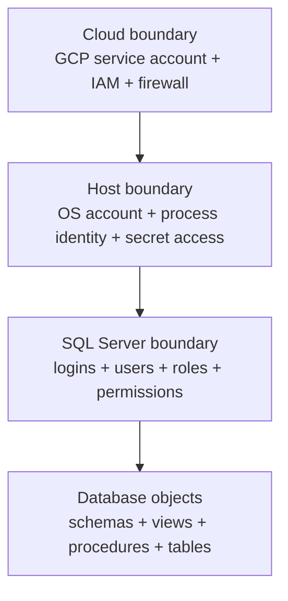

# Users, Logins, Roles, and Permissions — The Definitive SQL Server 2022 Guide

SQL Server security is not one feature. It is the combination of:

- **identity**: who or what is connecting
- **scope**: server, database, schema, object, or column
- **authorization**: what actions are permitted
- **operational design**: whether the access model remains understandable and auditable under real production pressure

This note is the complete working reference for **SQL Server 2022** principals and permissions in a data engineering environment. It covers:

- logins vs users
- server roles vs database roles
- fixed roles vs custom roles
- `GRANT`, `DENY`, and `REVOKE`
- schema-level security
- least-privilege patterns
- contained users
- service identities
- practical access models for:
  - platform admins
  - security admins
  - data engineers
  - ETL and ELT runtimes
  - GCP-hosted pipeline services
  - BI consumers
  - analysts
  - application end users
  - vendors and break-glass identities

> [!important]
> The safest default is:
>
> 1. authenticate at the **narrowest practical boundary**
> 2. authorize through **custom roles**
> 3. grant at the **schema level** when possible
> 4. avoid broad fixed roles for applications and pipelines
> 5. make every privileged identity attributable to a real purpose

---

## 1. The Security Model in One Sentence

A **login** gets you into the SQL Server instance. A **user** gets you into a specific database. A **role** groups permissions. A **permission** allows or denies an action on a **securable**.

That sentence is simple, but each word has operational consequences. The rest of this note exists to make those consequences explicit.

---

## 2. Identity Boundaries: Cloud, Host, SQL Server, Data

For SQL Server running on a VM or host, especially on **GCP**, identity must be reasoned about in layers rather than as one flat problem.



### What each layer means

- **Cloud boundary**
  - Controls who can administer the VM, fetch secrets, call cloud APIs, or reach the network path.
  - On GCP this often means a **GCP service account**, IAM bindings, firewall rules, and sometimes Secret Manager access.

- **Host boundary**
  - Controls which process can read TLS files, environment variables, credential files, or mounted secrets.
  - This is the Linux or Windows process boundary.

- **SQL Server boundary**
  - Controls who can connect to the SQL Server instance and what they can do there.
  - This is where **logins, users, roles, and permissions** live.

- **Database object boundary**
  - Controls what can be read, executed, altered, or denied inside actual databases.
  - This is where **schemas, views, procedures, tables, and object-level permissions** matter.

> [!warning]
> A GCP service account is **not** a SQL Server login.
>
> It may identify the VM or workload to GCP, but it does not automatically become a principal inside SQL Server. In a GCP-hosted SQL Server deployment, the usual pattern is:
>
> - GCP service account protects infrastructure and secret retrieval
> - application retrieves a SQL credential or other approved secret
> - application authenticates to SQL Server using a SQL login, Windows principal, contained user, or other supported SQL identity model

### Why this matters

Many teams mistakenly think that because a pipeline runs under a cloud service account, SQL Server access is already solved. It is not. Cloud identity and SQL identity are related operationally, but they are separate authorization systems.

> [!tip]
> Treat cloud service accounts as **infrastructure identities** and SQL logins or contained users as **database identities**. Connect them deliberately through secret management and explicit access design, not by assumption.

---

## 3. Core Definitions, with Context and Examples

Brief dictionary definitions are not enough for security work. Each term must be understood in context.

## 3.1 Principal

A **principal** is any entity that can request SQL Server resources.

Examples:
- a SQL login
- a Windows login
- a Windows group
- a database user
- a server role
- a database role
- an application role
- a certificate-mapped principal in specialized designs

Why it matters:
- Permissions are not assigned to “connections” in the abstract.
- Permissions are assigned to principals.
- If you cannot identify the principal, you cannot reason about the permission model.

Example:
- `etl_loader` as a SQL login is a **server principal**
- `etl_loader` as a user inside `warehouse` is a **database principal**
- `etl_loader_rw` as a custom database role is also a **principal**, because it can hold permissions and memberships

> [!info]
> Think of principals as the **subjects** in the authorization model. They are the “who” side of “who can do what on which object.”

## 3.2 Securable

A **securable** is any SQL Server resource that can have permissions applied to it.

Examples by scope:
- **server scope**
  - the server itself
  - endpoints
  - logins
- **database scope**
  - the database
  - schemas
  - roles
  - certificates
- **schema scope**
  - types
  - XML schema collections
- **object scope**
  - tables
  - views
  - procedures
  - functions
  - synonyms
  - queues
- **column scope**
  - a specific column in a table or view

Why it matters:
- Permissions are always evaluated against a securable.
- If you grant too low in the hierarchy, management becomes noisy.
- If you grant too high in the hierarchy, blast radius grows.

Example:
- `GRANT SELECT ON SCHEMA::gold TO reporting_reader`
  - principal: `reporting_reader`
  - permission: `SELECT`
  - securable: `SCHEMA::gold`

## 3.3 Permission

A **permission** is the right to perform a specific action on a securable.

Examples:
- `CONNECT`
- `SELECT`
- `INSERT`
- `UPDATE`
- `DELETE`
- `EXECUTE`
- `ALTER`
- `VIEW DEFINITION`
- `CONTROL`
- `CREATE LOGIN`
- `CREATE USER`

Why it matters:
- Permissions are the actual capability surface.
- Roles are just bundles; permissions are what ultimately allow actions.

Example:
- A reporting user might need:
  - `CONNECT`
  - `SELECT` on a schema
  - possibly `VIEW DEFINITION`
- That user does **not** need `ALTER`, `CONTROL`, or `db_owner`

## 3.4 Login

A **login** is a server-level identity. It allows authentication to the **SQL Server instance**.

Common login types in SQL Server:
- SQL login
- Windows login
- Windows group login
- in supported environments, certain Microsoft Entra-based identities

What it implies:
- A login does **not** automatically imply access inside every database.
- A login is usually authenticated at the `master` boundary unless you are using a contained user model.

Example:
```sql
CREATE LOGIN etl_loader
WITH PASSWORD = 'StrongPasswordHere';
```

What this does **not** do:
- It does not create a database user.
- It does not grant table access.
- It does not grant `SELECT`, `INSERT`, or `EXECUTE`.
- It only creates the server principal.

> [!warning]
> “The login exists” is not the same thing as “the pipeline can use the target database.” You still need a database user and permissions.

## 3.5 User

A **database user** is a database-level identity.

There are two major patterns:

### Login-mapped user
A database user mapped to an existing login.

Example:
```sql
USE warehouse;
GO
CREATE USER etl_loader FOR LOGIN etl_loader;
GO
```

Implication:
- The login authenticates at the instance.
- The user defines the identity inside this database.

### Contained user
A database user without a corresponding server login.

Example:
```sql
USE warehouse;
GO
CREATE USER consumer_portal
WITH PASSWORD = 'StrongContainedPasswordHere',
     DEFAULT_SCHEMA = dbo;
GO
```

Implication:
- Authentication occurs at the database level.
- The connection string must target the database explicitly.
- This is often useful for portability and one-database access designs.

> [!info]
> A login can map to **one user per database**, but the same login can be mapped into **many databases**.

## 3.6 Role

A **role** is a principal that groups permissions.

Two major categories:

### Server role
Holds permissions at server scope.

Examples:
- `sysadmin`
- `securityadmin`
- `dbcreator`
- `##MS_LoginManager##`

### Database role
Holds permissions at database scope.

Examples:
- `db_datareader`
- `db_datawriter`
- `db_owner`
- custom roles such as `gold_reader` or `etl_executor`

Why roles matter:
- They separate **identity** from **capability**
- Users come and go; roles should remain stable
- Auditing becomes much easier when permissions are granted to roles instead of directly to users

> [!tip]
> The clean model is:
>
> `login -> user -> role -> permission`
>
> not:
>
> `login -> random direct grants everywhere`

## 3.7 Schema

A **schema** is both a namespace and a security boundary.

Example:
- `bronze.ticks_raw`
- `silver.orders_enriched`
- `gold.pnl_daily`

Why it matters:
- Schema-level grants are usually the best balance between precision and manageability
- They let you grant access to entire layers without table-by-table sprawl

Example:
```sql
GRANT SELECT ON SCHEMA::gold TO gold_reader;
GRANT EXECUTE ON SCHEMA::api TO app_executor;
```

## 3.8 `GRANT`, `DENY`, and `REVOKE`

### `GRANT`
Adds permission.

Example:
```sql
GRANT SELECT ON SCHEMA::gold TO reporting_reader;
```

### `DENY`
Explicitly blocks permission, even if the principal might otherwise inherit it through a role.

Example:
```sql
DENY SELECT ON OBJECT::gold.salaries TO analyst_readers;
```

### `REVOKE`
Removes a previous grant or deny.

Example:
```sql
REVOKE SELECT ON OBJECT::gold.salaries FROM analyst_readers;
```

Operational implications:
- `DENY` is stronger than inherited `GRANT`
- `REVOKE` is not the same as `DENY`
- `DENY` does **not** apply to `sysadmin` members or object owners
- careless `DENY` usage makes permission debugging much harder

> [!warning]
> Use `DENY` sparingly.
>
> Prefer designing clean role scopes so that you rarely need negative permissions. Heavy `DENY` usage usually indicates a messy authorization model.

---

## 4. The Authentication and Authorization Path

When a client connects, SQL Server evaluates access in stages:

1. **Can this identity authenticate to the instance or database?**
2. **Which principal context is active?**
3. **Does that principal have permission on the target securable, directly or through role membership?**
4. **Is any explicit deny in effect?**
5. **Does ownership chaining or execution context modify the final result?**

This is why a user may:
- connect to the instance but not to a database
- connect to a database but not read a table
- read a view but not the underlying table directly
- execute a procedure without direct table permissions if ownership chaining is designed intentionally

> [!important]
> Authentication answers **who are you?**
>
> Authorization answers **what can you do?**
>
> Many production failures come from conflating the two.

---

## 5. Login Types and When to Use Them

## 5.1 SQL Logins

Use when:
- the application is not domain-integrated
- the environment is Linux-hosted and Windows auth is not available or not used
- a pipeline runtime needs deterministic credentials
- secret rotation is managed externally

Example:
```sql
CREATE LOGIN ingest_runtime
WITH PASSWORD = 'UseARealManagedSecret',
     CHECK_POLICY = ON,
     CHECK_EXPIRATION = OFF;
GO
```

Strengths:
- simple
- portable
- common in application and ETL tooling

Weaknesses:
- password management burden
- secret sprawl risk
- rotation discipline is essential

Good fit:
- service runtimes
- ETL tools
- vendor integrations
- GCP-hosted apps that retrieve credentials from Secret Manager

## 5.2 Windows Logins and Windows Groups

Use when:
- SQL Server is integrated with Windows identity
- human access is managed through domain groups
- you want centralized onboarding and offboarding

Examples:
```sql
CREATE LOGIN [CONTOSO\DataEngineers] FROM WINDOWS;
GO

USE warehouse;
GO
CREATE USER [CONTOSO\DataEngineers] FOR LOGIN [CONTOSO\DataEngineers];
GO
```

Strengths:
- central identity lifecycle
- easier human access management
- strong fit for enterprise admin and analyst groups

Weaknesses:
- less portable
- not always available in Linux/GCP-centered patterns

Best fit:
- DBAs
- platform engineers
- analyst groups
- security-managed human access

## 5.3 Contained Users

Use when:
- access is limited to one database
- database portability matters
- you want to decouple from instance-level logins
- tenant isolation is clearer at the database level

Example:
```sql
USE analytics_serving;
GO
CREATE USER dashboard_consumer
WITH PASSWORD = 'UseASecretManagerManagedValue',
     DEFAULT_SCHEMA = reporting;
GO
```

Strengths:
- easier database migration
- avoids `master` login dependency
- clean for single-database applications

Weaknesses:
- connection string must name the database explicitly
- can complicate identity standardization if overused
- each database needs its own contained principal

> [!success]
> For identities that connect to exactly one database, contained users are often a cleaner design than login-mapped users.

## 5.4 Certificate- or Asymmetric-Key-Mapped Principals

Use when:
- signing modules
- highly specialized security patterns
- controlled privilege elevation through signed code

This is an advanced pattern, not the default for application access.

> [!note]
> Module signing is often a better answer than granting broad direct permissions to application users that need carefully scoped privileged actions.

---

## 6. Special Principals You Must Understand

## 6.1 `sa`

- Built-in high-privilege SQL login
- Member of `sysadmin`
- Usually best treated as emergency-only or tightly governed

Recommendations:
- strong password
- monitor usage
- disable or rename where the operating model supports it
- never use as an application identity

## 6.2 `dbo`

- Special database principal
- Not just “another user”
- Represents database ownership context
- Has effectively full control within the database

Recommendation:
- do not map ordinary applications or humans to `dbo`
- do not normalize your access model around `dbo`

## 6.3 `guest`

- Special database principal
- Can allow access to a database without an explicit user if misconfigured

Recommendation:
- keep explicit `guest` permissions absent unless there is a very deliberate design reason
- audit `guest` regularly

## 6.4 `public`

- Every login is in server `public`
- Every database user is in database `public`

Implication:
- any permission granted to `public` is extremely broad
- use only when you truly mean “everyone”

> [!warning]
> `public` grants are easy to forget and hard to reason about later. Keep them minimal.

---

## 7. Server Roles

Server roles define permissions at instance scope.

## 7.1 Legacy Fixed Server Roles

### `sysadmin`
- Full control over the instance
- Bypasses nearly all other boundaries

Use for:
- break-glass access
- a very small number of trusted DBAs

Never use for:
- applications
- ETL runtimes
- analysts
- ordinary engineers

### `securityadmin`
- Can manage logins and permissions broadly
- Effectively dangerous enough to be treated near-`sysadmin` in real environments

Use with extreme caution.

### `serveradmin`
- Server-wide configuration actions

### `processadmin`
- Can terminate sessions

### `setupadmin`
- Can manage linked servers via T-SQL

### `bulkadmin`
- Can run `BULK INSERT`
- carries escalation risk
- not supported on SQL Server on Linux

### `diskadmin`
- Historical disk-file management role
- rarely appropriate in modern estates

### `dbcreator`
- Can create, alter, drop, and restore databases
- too broad for most daily work

### `public`
- baseline membership for all logins

> [!warning]
> `securityadmin`, `dbcreator`, and `bulkadmin` are commonly over-granted because they sound narrower than they really are.

## 7.2 SQL Server 2022 Least-Privilege Server Roles

SQL Server 2022 added new fixed roles prefixed with `##MS_` to reduce reliance on overly broad legacy roles.

### `##MS_LoginManager##`
Use for:
- teams that must create, alter, or drop logins
- security operations that should **not** be able to grant arbitrary server privileges

This is usually better than `securityadmin` for login lifecycle management.

### `##MS_DatabaseManager##`
Use for:
- teams that need database create/drop capability without full server privilege

Caution:
- creator becomes owner of the database they create

### `##MS_DatabaseConnector##`
Use for:
- server-wide database connectivity scenarios

Caution:
- this is broader than it looks because it can connect to any database unless explicitly denied at a database

### `##MS_ServerStateReader##`
Use for:
- performance observability teams that need broad DMV visibility

### `##MS_ServerStateManager##`
Use for:
- controlled server-state operations, broader than reader

### `##MS_ServerPerformanceStateReader##`
Use for:
- performance observability with a narrower footprint than full state reader

### `##MS_ServerSecurityStateReader##`
Use for:
- security observability use cases

### `##MS_DefinitionReader##`
Use for:
- metadata readers who need broad definition visibility

### `##MS_PerformanceDefinitionReader##`
Use for:
- performance metadata visibility

### `##MS_SecurityDefinitionReader##`
Use for:
- security metadata visibility

> [!success]
> Prefer the new `##MS_*##` SQL Server 2022 roles over broader legacy roles when they satisfy the use case.

### Example: narrow login administration
```sql
ALTER SERVER ROLE [##MS_LoginManager##] ADD MEMBER [CONTOSO\SqlSecurityOps];
GO
```

---

## 8. Database Roles

Database roles define permissions inside a single database.

## 8.1 Fixed Database Roles

### `db_owner`
Has all permissions in the database.

Use for:
- extremely limited admin cases
- database owners
- controlled automation for maintenance only when truly necessary

Avoid for:
- applications
- reporting users
- ETL runtimes
- general engineers

### `db_securityadmin`
Can manage permissions and custom role membership.

Risk:
- privilege escalation potential

### `db_accessadmin`
Can add or remove database access.

### `db_backupoperator`
Can back up the database.

### `db_ddladmin`
Can run broad DDL.

Risk:
- can create or alter programmable objects that may execute under higher privilege

### `db_datareader`
Can read all user tables and views.

Useful when:
- read scope is truly the whole database

Not ideal when:
- you want only `gold` schema or a limited API surface

### `db_datawriter`
Can modify data in all user tables.

Usually too broad for pipelines unless the database is deliberately narrow.

### `db_denydatareader`
Explicitly denies reads across user tables and views.

### `db_denydatawriter`
Explicitly denies writes across user tables.

### `public`
Base role for all database users.

> [!warning]
> Fixed database roles are convenient, but they often grant much more than a production application or pipeline actually needs.

## 8.2 User-Defined Database Roles

This should be your default authorization tool.

Examples:
- `bronze_loader`
- `silver_transformer`
- `gold_reader`
- `api_executor`
- `schema_migrator`
- `job_operator_limited`

Why custom roles win:
- they match your workload
- they can be audited clearly
- they avoid “all tables in all schemas” grants
- they survive personnel churn better

Example:
```sql
USE warehouse;
GO
CREATE ROLE gold_reader;
GO
GRANT SELECT ON SCHEMA::gold TO gold_reader;
GO
```

> [!success]
> For most databases, custom roles should carry the actual access design, while fixed roles are used only selectively.

---

## 9. Permission Hierarchy and Scope

Permissions can be granted at different levels of the securable hierarchy.

Typical hierarchy:
- server
- database
- schema
- object
- column

### Why scope matters

If you grant too low:
- administration becomes noisy
- onboarding requires repetitive grants
- permissions drift becomes likely

If you grant too high:
- blast radius expands
- unauthorized data becomes visible
- audits become harder to defend

### Good scope choices by scenario

| Scenario | Best Scope | Why |
|---|---|---|
| All published reporting tables | Schema | Stable and readable |
| One stored procedure API | Procedure or API schema | Exact execution surface |
| One sensitive table | Object | Narrow exception |
| One sensitive column | Column | Use only when justified |
| Full database admin | Database | Admin boundary |

> [!tip]
> Schema-level security is usually the best default for data platforms:
>
> - `bronze_loader` on `bronze`
> - `silver_transformer` on `silver`
> - `gold_reader` on `gold`

---

## 10. Direct Grants vs Role-Based Grants

### Direct grants
Example:
```sql
GRANT SELECT ON SCHEMA::gold TO analyst_anna;
```

Good for:
- temporary investigation
- one-off exceptions
- emergencies followed by cleanup

Bad as a default because:
- they do not scale
- they create hidden snowflakes
- audits become principal-by-principal archaeology

### Role-based grants
Example:
```sql
CREATE ROLE gold_reader;
GRANT SELECT ON SCHEMA::gold TO gold_reader;
ALTER ROLE gold_reader ADD MEMBER analyst_anna;
```

Good because:
- capability is separated from identity
- onboarding and offboarding are easier
- intent is visible in role names

> [!important]
> Grant permissions to roles. Add users to roles. Avoid direct grants unless the exception is short-lived and documented.

---

## 11. Recommended Design Rules

1. **Prefer groups over individual humans** when your identity platform supports it.
2. **Prefer custom roles over fixed roles** for application and data access.
3. **Prefer schema-level grants over table-by-table grants** for layered data platforms.
4. **Avoid `db_owner` for applications**.
5. **Avoid `sysadmin` except for true admin identities**.
6. **Treat `securityadmin` as high-risk**.
7. **Use SQL Server 2022 `##MS_*##` server roles** where they fit.
8. **Use contained users for one-database identities** when portability helps.
9. **Do not use `DENY` as your primary design mechanism**.
10. **Do not grant to `public` casually**.
11. **Keep service identities non-interactive and narrowly scoped**.
12. **Separate read, write, DDL, and operations identities**.

---

## 12. Scenario Patterns

## 12.1 Platform Administrator

### Typical need
- instance operations
- backups/restores
- failover operations
- server configuration
- break-glass troubleshooting

### Recommended model
- named admin identity or admin group
- very limited membership in `sysadmin`
- additional observability identities separated where possible

### Bad pattern
- using one shared “admin” SQL login for all DBAs

### Better pattern
- named Windows group or controlled login
- audited elevation workflow
- break-glass account documented separately

---

## 12.2 Security Administrator

### Typical need
- create and alter logins
- review role membership
- inspect permissions
- not necessarily run the whole server

### Recommended model
- prefer `##MS_LoginManager##` in SQL Server 2022
- add metadata-reader roles only as needed

### Why not `securityadmin` by default
Because it is broader and easier to misuse.

Example:
```sql
ALTER SERVER ROLE [##MS_LoginManager##] ADD MEMBER [CONTOSO\SqlSecurityOps];
GO
```

---

## 12.3 Database Administrator for One Database

### Typical need
- manage users
- manage roles
- perform DDL
- run maintenance within one database

### Recommended model
- `db_owner` only if truly acting as full database admin
- otherwise combine narrower capabilities:
  - custom admin role
  - `db_backupoperator`
  - `db_ddladmin`
  - explicit grants
  - `db_securityadmin` only with care

> [!warning]
> `db_owner` is operationally simple, but it is often too broad for development leads or pipeline maintainers.

---

## 12.4 Data Engineer

### Typical need
- read raw and transformed data
- write to staging or target schemas
- execute ETL procedures
- occasionally create tables in controlled schemas

### Recommended model
Use custom roles such as:
- `bronze_loader`
- `silver_transformer`
- `etl_executor`
- `gold_reader`

Example:
```sql
CREATE ROLE bronze_loader;
GRANT SELECT, INSERT, UPDATE, DELETE ON SCHEMA::bronze TO bronze_loader;

CREATE ROLE silver_transformer;
GRANT SELECT, INSERT, UPDATE, DELETE ON SCHEMA::silver TO silver_transformer;

CREATE ROLE etl_executor;
GRANT EXECUTE ON SCHEMA::etl TO etl_executor;
```

Avoid:
- `db_owner`
- `db_datawriter` across the whole database unless the database is intentionally narrow
- server-level roles for database-local work

---

## 12.5 Pipeline Runtime User

This is the identity used by Airflow, dbt, SSIS, a custom loader, a containerized ETL task, or a scheduled app runtime.

### Typical need
- connect non-interactively
- execute specific procedures
- write to specific schemas
- maybe bulk load into controlled targets

### Recommended model
- SQL login or contained user
- one identity per runtime or pipeline family
- custom roles only
- no interactive admin rights
- no `db_owner`
- no `sysadmin`

Example:
```sql
CREATE LOGIN pipeline_ingest
WITH PASSWORD = 'ManagedSecretValue',
     CHECK_POLICY = ON,
     CHECK_EXPIRATION = OFF;
GO

USE warehouse;
GO
CREATE USER pipeline_ingest FOR LOGIN pipeline_ingest;
GO

CREATE ROLE bronze_loader;
GRANT INSERT, UPDATE, DELETE, SELECT ON SCHEMA::bronze TO bronze_loader;
GRANT EXECUTE ON SCHEMA::etl TO bronze_loader;
ALTER ROLE bronze_loader ADD MEMBER pipeline_ingest;
GO
```

> [!success]
> Give each runtime its own identity. Do not let five unrelated pipelines share one login unless you want five-way audit ambiguity.

---

## 12.6 GCP-Hosted Pipeline Runtime

### Reality check
The GCP service account secures:
- VM/API access
- secret retrieval
- workload identity at the cloud layer

It does **not** by itself authorize SQL operations inside SQL Server.

### Recommended pattern
1. GCP service account retrieves the SQL secret from Secret Manager
2. application connects using:
   - a SQL login, or
   - a contained user if the workload touches only one database
3. database access is role-based and schema-scoped

### Good pattern
- GCP service account: `etl-prod@project.iam.gserviceaccount.com`
- SQL login: `pipeline_prod_ingest`
- database user: `pipeline_prod_ingest`
- database roles:
  - `bronze_loader`
  - `etl_executor`

### Bad pattern
- one shared SQL login for all pipelines in all environments
- `db_owner` for the runtime because “it’s simpler”
- embedding SQL secrets directly in code or CI variables without managed secret retrieval

> [!warning]
> The service account should be narrow in GCP, and the SQL identity should be narrow in SQL Server. Do not collapse infrastructure trust into database superuser access.

---

## 12.7 BI Consumer or Reporting User

### Typical need
- read published data
- maybe execute curated reporting procedures
- no write capability

### Recommended model
- contained user or group-mapped login
- custom role such as `gold_reader`
- schema-level `SELECT`
- optional `EXECUTE` on a reporting procedure schema
- optional `VIEW DEFINITION` if tooling requires metadata visibility

Example:
```sql
CREATE ROLE gold_reader;
GRANT SELECT ON SCHEMA::gold TO gold_reader;
GRANT EXECUTE ON SCHEMA::reporting TO gold_reader;
```

Avoid:
- `db_datareader` if only one schema should be visible
- direct table grants unless it is a narrow exception

---

## 12.8 Data Consumer / Analyst

### Typical need
- ad hoc queries against curated data
- maybe read metadata
- no writes
- no DDL

### Recommended model
- analyst group -> login/user -> custom read role
- optional `VIEW DEFINITION`
- deny access to sensitive schemas by design, not after-the-fact patching

Good example:
- `analytics_readers`
  - `SELECT` on `gold`
  - `EXECUTE` on `analytics`
  - no access to `bronze`
  - no access to administrative schemas

---

## 12.9 Application End User

In most SQL Server-backed applications, end users should **not** be direct database principals.

### Better pattern
- application authenticates as a service identity
- application enforces business authorization
- SQL Server sees one or a few service principals, not thousands of human end users

Use direct DB users for end users only when:
- the application is intentionally database-facing
- multi-tenant or per-user auditing requires it
- operational overhead is justified

> [!note]
> Application authorization and database authorization are not the same thing. Do not push all application end-user identity directly into SQL Server unless you truly need that model.

---

## 12.10 Vendor or Support Identity

### Typical need
- temporary diagnostic read access
- maybe execute a support procedure
- no standing write permission
- time-limited access

### Recommended model
- dedicated vendor login
- disabled by default when feasible
- custom support role
- narrow schema or procedure permissions
- strong audit trail

Example:
```sql
CREATE ROLE vendor_support_reader;
GRANT SELECT ON SCHEMA::gold TO vendor_support_reader;
GRANT EXECUTE ON OBJECT::support.usp_collect_diagnostics TO vendor_support_reader;
```

---

## 12.11 Deployment or Migration Identity

### Typical need
- create/alter objects
- run migrations
- possibly create schemas
- should not read or write all business data by default

### Recommended model
- dedicated deployment login or contained user
- custom role with DDL rights appropriate to the target schema
- `db_ddladmin` only if justified and understood
- separate from runtime identity

> [!warning]
> Do not reuse the application runtime login for schema deployment. Deployment is a different privilege boundary.

---

## 13. Fixed Roles vs Custom Roles: What to Use When

| Need | Good Choice | Avoid by Default |
|---|---|---|
| Create logins | `##MS_LoginManager##` | `securityadmin` |
| Create databases | `##MS_DatabaseManager##` or tightly governed `dbcreator` | `sysadmin` |
| Read all published reporting tables | custom schema role | `db_datareader` if only one schema is needed |
| Full database admin | `db_owner` for very few principals | giving `db_owner` to apps |
| ETL writes to one schema | custom role | `db_datawriter` on whole DB |
| Human admin break-glass | `sysadmin` for very few named identities | shared admin login |
| SQL Agent job operators | `SQLAgentOperatorRole` in `msdb` if applicable | `sysadmin` when job ops are the only need |

---

## 14. Common DDL Patterns

## 14.1 Create a SQL Login and Map It to a Database User

```sql
CREATE LOGIN pipeline_loader
WITH PASSWORD = 'UseARealManagedSecret',
     CHECK_POLICY = ON,
     CHECK_EXPIRATION = OFF;
GO

USE warehouse;
GO
CREATE USER pipeline_loader FOR LOGIN pipeline_loader;
GO
```

### What this pattern is for
- service runtimes
- ETL tools
- non-interactive apps

### What it still lacks
- role membership
- actual object permissions

---

## 14.2 Create a Contained User

```sql
USE analytics_serving;
GO
CREATE USER dashboard_reader
WITH PASSWORD = 'UseARealManagedSecret',
     DEFAULT_SCHEMA = reporting;
GO
```

### Use when
- the identity needs only one database
- portability matters
- you want to avoid instance-level login dependency

### Remember
- the connection string must target the database explicitly

---

## 14.3 Create a Custom Read Role

```sql
USE warehouse;
GO
CREATE ROLE gold_reader;
GO
GRANT SELECT ON SCHEMA::gold TO gold_reader;
GO
```

---

## 14.4 Add a User to a Role

```sql
ALTER ROLE gold_reader ADD MEMBER dashboard_reader;
GO
```

---

## 14.5 Create a Controlled ETL Role

```sql
USE warehouse;
GO
CREATE ROLE silver_transformer;
GO

GRANT SELECT, INSERT, UPDATE, DELETE ON SCHEMA::silver TO silver_transformer;
GRANT EXECUTE ON SCHEMA::etl TO silver_transformer;
GRANT VIEW DEFINITION ON SCHEMA::silver TO silver_transformer;
GO

ALTER ROLE silver_transformer ADD MEMBER pipeline_loader;
GO
```

---

## 14.6 Grant Procedure Execution Without Table Access

```sql
USE serving;
GO
CREATE ROLE api_executor;
GO
GRANT EXECUTE ON SCHEMA::api TO api_executor;
GO
```

This pattern is useful when consumers should use procedures as the supported access surface rather than directly querying tables.

---

## 14.7 Revoke and Deny Examples

```sql
REVOKE SELECT ON OBJECT::gold.salaries FROM gold_reader;
GO

DENY SELECT ON OBJECT::gold.salaries TO analyst_readers;
GO
```

### Practical distinction
- `REVOKE` removes an earlier explicit permission
- `DENY` actively blocks the permission even if inherited through a role

---

## 14.8 Give a Team Login Management Without Broad Security Privilege

```sql
ALTER SERVER ROLE [##MS_LoginManager##] ADD MEMBER [CONTOSO\SqlSecurityOps];
GO
```

---

## 14.9 Add a Human Analyst Group to a Database Role

```sql
CREATE LOGIN [CONTOSO\AnalyticsReaders] FROM WINDOWS;
GO

USE warehouse;
GO
CREATE USER [CONTOSO\AnalyticsReaders] FOR LOGIN [CONTOSO\AnalyticsReaders];
GO

ALTER ROLE gold_reader ADD MEMBER [CONTOSO\AnalyticsReaders];
GO
```

---

## 15. Schema-Level Security Patterns

For a data platform with `bronze`, `silver`, and `gold` schemas, the cleanest model is usually schema-scoped roles.

### Recommended role design

| Role | Typical Grants | Typical Members |
|---|---|---|
| `bronze_loader` | `SELECT`, `INSERT`, `UPDATE`, `DELETE` on `bronze`; maybe `EXECUTE` on ingestion procs | pipeline runtimes |
| `silver_transformer` | `SELECT`, `INSERT`, `UPDATE`, `DELETE` on `silver`; `EXECUTE` on ETL schema | transformation jobs |
| `gold_reader` | `SELECT` on `gold` | BI, analysts, consumers |
| `api_executor` | `EXECUTE` on `api` schema | application runtimes |
| `schema_migrator` | controlled DDL permissions or `db_ddladmin` if justified | deployment identity |

### Example
```sql
USE warehouse;
GO

CREATE ROLE bronze_loader;
CREATE ROLE silver_transformer;
CREATE ROLE gold_reader;
GO

GRANT SELECT, INSERT, UPDATE, DELETE ON SCHEMA::bronze TO bronze_loader;
GRANT SELECT, INSERT, UPDATE, DELETE ON SCHEMA::silver TO silver_transformer;
GRANT SELECT ON SCHEMA::gold TO gold_reader;
GO
```

> [!success]
> Schema-level roles usually age better than database-wide fixed roles because they keep layer intent visible.

---

## 16. SQL Server Agent Roles for Job Operators

If your pipeline model uses **SQL Server Agent**, the `msdb` database includes special fixed roles:

- `SQLAgentUserRole`
- `SQLAgentReaderRole`
- `SQLAgentOperatorRole`

Use them when the real need is:
- view jobs
- run owned jobs
- operate jobs
- inspect job history

Do **not** grant `sysadmin` just because someone needs to operate jobs.

> [!info]
> SQL Server Agent roles are concentric: the more privileged Agent roles inherit the lower Agent-role capabilities.

---

## 17. Ownership Chaining, `EXECUTE AS`, and Module Boundaries

These topics matter because principals do not always need direct table permissions if access is intentionally mediated.

### Ownership chaining
If a procedure and the underlying table share the same owner, SQL Server can allow the procedure to access the table without requiring direct table permission for the caller.

### `EXECUTE AS`
A module can run under a different execution context than the caller.

Why this matters:
- it can simplify secure API patterns
- it can also hide privilege escalation if poorly designed

Recommendation:
- prefer explicit, well-documented procedure surfaces
- use `EXECUTE AS` deliberately, not casually
- review ownership context during security audits

> [!warning]
> Broad grants plus hidden execution-context changes produce authorization models that are very hard to reason about.

---

## 18. Auditing and Inventory Queries

## 18.1 Inventory server principals

```sql
SELECT
    sp.name,
    sp.type_desc,
    sp.is_disabled,
    sp.create_date,
    sl.is_policy_checked,
    sl.is_expiration_checked,
    LOGINPROPERTY(sp.name, 'PasswordLastSetTime') AS password_last_set
FROM sys.server_principals AS sp
LEFT JOIN sys.sql_logins AS sl
    ON sp.principal_id = sl.principal_id
WHERE sp.type IN ('S', 'U', 'G')
  AND sp.name NOT LIKE '##%'
ORDER BY sp.name;
```

## 18.2 Inventory `sysadmin`

```sql
SELECT
    r.name AS role_name,
    m.name AS member_name,
    m.type_desc
FROM sys.server_role_members AS srm
JOIN sys.server_principals AS r
    ON srm.role_principal_id = r.principal_id
JOIN sys.server_principals AS m
    ON srm.member_principal_id = m.principal_id
WHERE r.name = 'sysadmin'
ORDER BY m.name;
```

## 18.3 Inventory database principals

```sql
SELECT
    name,
    type_desc,
    authentication_type_desc,
    create_date,
    modify_date
FROM sys.database_principals
WHERE principal_id > 4
ORDER BY name;
```

## 18.4 Inventory database role membership

```sql
SELECT
    roles.name AS role_name,
    members.name AS member_name,
    members.type_desc AS member_type
FROM sys.database_role_members AS drm
JOIN sys.database_principals AS roles
    ON drm.role_principal_id = roles.principal_id
JOIN sys.database_principals AS members
    ON drm.member_principal_id = members.principal_id
ORDER BY roles.name, members.name;
```

## 18.5 Inventory explicit schema permissions

```sql
SELECT
    dp.class_desc,
    s.name AS schema_name,
    dp.permission_name,
    dp.state_desc,
    USER_NAME(dp.grantee_principal_id) AS grantee_name
FROM sys.database_permissions AS dp
JOIN sys.schemas AS s
    ON dp.major_id = s.schema_id
WHERE dp.class = 3
ORDER BY s.name, grantee_name, dp.permission_name;
```

## 18.6 Check `guest`

```sql
SELECT
    perm.state_desc,
    perm.permission_name
FROM sys.database_permissions AS perm
WHERE perm.grantee_principal_id = DATABASE_PRINCIPAL_ID('guest')
ORDER BY perm.permission_name;
```

Desired result:
- no unexpected rows

---

## 19. Operational Anti-Patterns

### Anti-pattern 1: application login in `db_owner`
Why bad:
- excessive blast radius
- accidental DDL possible
- harder root-cause analysis

### Anti-pattern 2: pipeline login in `sysadmin`
Why bad:
- full server compromise if app secret leaks
- destroys least privilege
- impossible to justify in audit

### Anti-pattern 3: direct grants to dozens of humans
Why bad:
- permissions drift
- onboarding/offboarding pain
- unclear intent

### Anti-pattern 4: one shared login for every pipeline
Why bad:
- no accountability
- no isolation
- one credential leak affects everything

### Anti-pattern 5: defaulting to `db_datareader` or `db_datawriter`
Why bad:
- may exceed actual schema needs
- encourages whole-database visibility

### Anti-pattern 6: using `DENY` as routine architecture
Why bad:
- brittle
- hard to reason about
- indicates role design weakness

### Anti-pattern 7: granting to `public`
Why bad:
- hidden broad access
- often forgotten

---

## 20. Recommended Baseline Designs by Persona

## 20.1 Human DBA
- named admin identity
- minimal `sysadmin`
- no shared credentials

## 20.2 Security operations
- `##MS_LoginManager##`
- metadata reader as needed
- separate from DBA break-glass

## 20.3 Data engineer
- custom schema roles
- no broad server role
- no `db_owner` unless genuinely administering the database

## 20.4 Pipeline runtime
- SQL login or contained user
- one identity per pipeline or per workload family
- custom roles only

## 20.5 BI reader
- group-based user
- `gold_reader`
- optional `VIEW DEFINITION`

## 20.6 Application runtime
- execute-only or execute-plus-limited-read role
- procedure/API pattern where possible
- no direct ad hoc DDL

## 20.7 Vendor support
- time-bounded identity
- support-specific role
- no standing broad permissions

---

## 21. Decision Matrix

| Question | Preferred Answer |
|---|---|
| Does the identity touch only one database? | Consider a contained user |
| Is the identity a human team? | Prefer group-based access |
| Is the identity a service runtime? | Use a dedicated non-human principal |
| Is the access primarily one layer or schema? | Grant at schema scope |
| Is a fixed role broader than required? | Create a custom role instead |
| Does someone only need login management? | Use `##MS_LoginManager##` |
| Does someone need job operation only? | Use SQL Agent roles, not `sysadmin` |
| Do you think `db_owner` is easiest? | Re-check whether you are over-granting |

---

## 22. Example End-to-End Designs

## 22.1 Read-only analytics consumers

```sql
USE warehouse;
GO
CREATE ROLE gold_reader;
GO
GRANT SELECT ON SCHEMA::gold TO gold_reader;
GO

CREATE LOGIN analytics_bi
WITH PASSWORD = 'ManagedSecretValue',
     CHECK_POLICY = ON,
     CHECK_EXPIRATION = OFF;
GO

CREATE USER analytics_bi FOR LOGIN analytics_bi;
GO
ALTER ROLE gold_reader ADD MEMBER analytics_bi;
GO
```

## 22.2 ETL runtime for bronze ingestion

```sql
CREATE LOGIN pipeline_bronze_ingest
WITH PASSWORD = 'ManagedSecretValue',
     CHECK_POLICY = ON,
     CHECK_EXPIRATION = OFF;
GO

USE warehouse;
GO
CREATE USER pipeline_bronze_ingest FOR LOGIN pipeline_bronze_ingest;
GO

CREATE ROLE bronze_loader;
GO
GRANT SELECT, INSERT, UPDATE, DELETE ON SCHEMA::bronze TO bronze_loader;
GRANT EXECUTE ON SCHEMA::etl TO bronze_loader;
GO
ALTER ROLE bronze_loader ADD MEMBER pipeline_bronze_ingest;
GO
```

## 22.3 One-database consumer with contained user

```sql
USE analytics_serving;
GO
CREATE USER dashboard_consumer
WITH PASSWORD = 'ManagedSecretValue',
     DEFAULT_SCHEMA = reporting;
GO

CREATE ROLE dashboard_reader;
GO
GRANT SELECT ON SCHEMA::reporting TO dashboard_reader;
GO
ALTER ROLE dashboard_reader ADD MEMBER dashboard_consumer;
GO
```

## 22.4 Login administration in SQL Server 2022

```sql
ALTER SERVER ROLE [##MS_LoginManager##]
ADD MEMBER [CONTOSO\SqlSecurityOps];
GO
```

---

## 23. Final Rules to Keep

1. **A login is not a user**
2. **A user is not a role**
3. **A role is not a permission**
4. **A cloud service account is not a SQL login**
5. **A connection succeeding does not mean authorization is correct**
6. **`db_owner` and `sysadmin` are design failures unless explicitly justified**
7. **Schema-level custom roles are the professional default for data platforms**
8. **Every non-human identity should have one clear operational purpose**
9. **Every privileged identity should be attributable, reviewable, and monitored**
10. **Least privilege is not a slogan; it is a schema and role design discipline**

---

## 24. Related

- [[sql-server-authentication]] for engine authentication posture, TLS, and identity boundaries
- [[server-configuration]] for instance-level security settings
- [[database-creation-and-file-layout]] for database creation baseline choices
- [[sql-server-schema-layering]] for schema-as-security-boundary design
- [[schemas-tables-and-constraints]] for object design after access boundaries are defined

---

## 25. References

- Microsoft Learn — Create a login  
  https://learn.microsoft.com/en-us/sql/t-sql/statements/create-login-transact-sql?view=sql-server-ver17

- Microsoft Learn — Create a user  
  https://learn.microsoft.com/en-us/sql/t-sql/statements/create-user-transact-sql?view=sql-server-ver17

- Microsoft Learn — Principals (Database Engine)  
  https://learn.microsoft.com/en-us/sql/relational-databases/security/authentication-access/principals-database-engine?view=sql-server-ver17

- Microsoft Learn — Permissions (Database Engine)  
  https://learn.microsoft.com/en-us/sql/relational-databases/security/permissions-database-engine?view=sql-server-ver17

- Microsoft Learn — Permissions hierarchy  
  https://learn.microsoft.com/en-us/sql/relational-databases/security/permissions-hierarchy-database-engine?view=sql-server-ver17

- Microsoft Learn — Server-level roles  
  https://learn.microsoft.com/en-us/sql/relational-databases/security/authentication-access/server-level-roles?view=sql-server-ver17

- Microsoft Learn — Database-level roles  
  https://learn.microsoft.com/en-us/sql/relational-databases/security/authentication-access/database-level-roles?view=sql-server-ver17

- Microsoft Learn — Get started with Database Engine permissions  
  https://learn.microsoft.com/en-us/sql/relational-databases/security/authentication-access/getting-started-with-database-engine-permissions?view=sql-server-ver17

- Microsoft Learn — Contained database users  
  https://learn.microsoft.com/en-us/sql/relational-databases/security/contained-database-users-making-your-database-portable?view=sql-server-ver17

- Microsoft Learn — Contained database authentication server option  
  https://learn.microsoft.com/en-us/sql/database-engine/configure-windows/contained-database-authentication-server-configuration-option?view=sql-server-ver17

- Microsoft Learn — GRANT  
  https://learn.microsoft.com/en-us/sql/t-sql/statements/grant-transact-sql?view=sql-server-ver17

- Microsoft Learn — DENY  
  https://learn.microsoft.com/en-us/sql/t-sql/statements/deny-transact-sql?view=sql-server-ver17

- Microsoft Learn — REVOKE  
  https://learn.microsoft.com/en-us/sql/t-sql/statements/revoke-transact-sql?view=sql-server-ver17

- Microsoft Learn — SQL Server Agent fixed database roles  
  https://learn.microsoft.com/en-us/ssms/agent/sql-server-agent-fixed-database-roles
