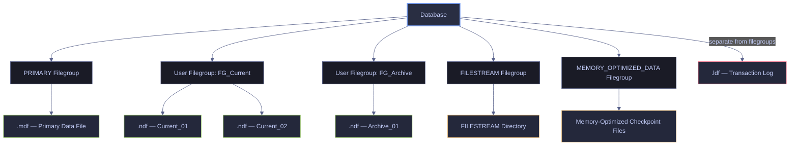
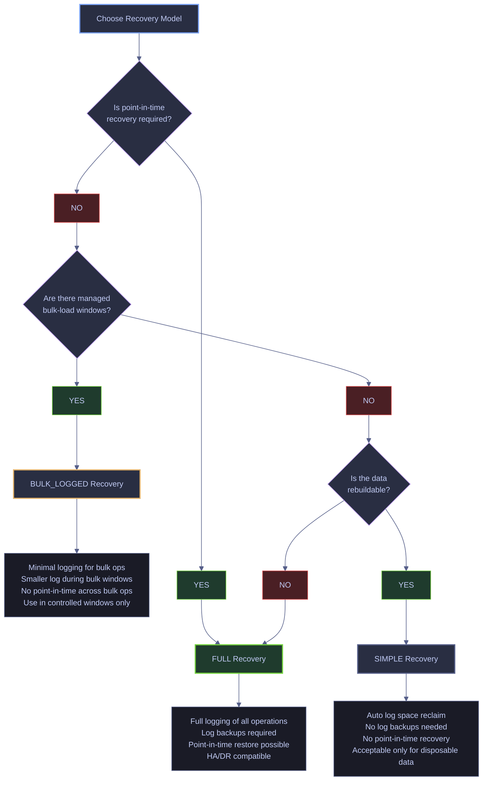

# Database Creation and File Layout


## What “Creating a Database” Actually Means

At a superficial level, creating a database means issuing a statement such as:

*Create a database using the minimal default syntax.*

```sql
CREATE DATABASE [MyDatabase];
```

At a professional level, creating a database means defining all of the following:

1. **Creation path**
   - Brand-new empty database
   - Attached database
   - Snapshot
   - Contained database

2. **Physical layout**
   - Data files
   - Log files
   - Filegroups
   - File locations
   - Initial sizes
   - Growth settings
   - Maximum sizes

3. **Behavioral defaults**
   - Collation
   - Recovery model
   - Compatibility level
   - Snapshot behavior
   - Read/write concurrency behavior
   - Query Store behavior

4. **Operational baseline**
   - Ownership
   - Encryption approach
   - Backup chain initialization
   - Monitoring expectations
   - Capacity planning
   - Growth forecasting

> [!important] Design is permanent
>
> A database is a long-lived operational object, not just a container for tables. Poor creation-time decisions produce years of avoidable operational pain: fragmentation, blocking, slow recovery, poor restore behavior, runaway storage growth, and migration problems.

> [!tip] Right question
>
> The correct question is not “How do I create a database?” but “What kind of database am I creating, for what workload, under what recovery and operational constraints?”

---

## Core Concepts Glossary

This section defines the terms that must be understood before making any storage or configuration decision.

### Page | fundamental 8 KB unit of storage and I/O

A **page** is the fundamental unit of storage in SQL Server.

- Size: **8 KB**
- Tables and indexes are ultimately stored in pages.
- Reads and writes happen against pages, not arbitrary byte ranges.


When SQL Server reads data from disk into memory, it reads pages. When it modifies stored data, it modifies pages in memory and later flushes them to disk. This is why page density, fragmentation, and I/O behavior matter so much.

**Example:**
If a query needs a row that lives on a page not already in memory, SQL Server must read that page from disk into the buffer pool.

### Extent | group of 8 contiguous pages forming a 64 KB allocation unit

An **extent** is a group of **8 contiguous pages**, for a total of **64 KB**.

- Size: **64 KB**
- SQL Server allocates space primarily in extents.


Many file, storage, and formatting recommendations are tied to 64 KB because this is a natural SQL Server allocation boundary.

**Example:**
When a table grows and needs more space, SQL Server typically allocates additional extents rather than allocating storage one row at a time.

### Data file | physical file storing table and index data

A **data file** is a physical file that stores table and index data.

Common file extensions:
- `.mdf` = primary data file
- `.ndf` = secondary data file

**Context and implications:**
- Data files store user objects such as tables and indexes.
- They also indirectly determine where I/O pressure lands.
- Data files belong to filegroups.
- A database must have at least one data file.

**Example:**
A small application database might have one primary data file only. A large warehouse might have multiple secondary data files spread across user-defined filegroups.

### Transaction log file | sequential record of all data changes for durability and recovery

A **transaction log file** is a physical file that stores the transaction log.

Common file extension:
- `.ldf`

**Context and implications:**
The log is not just “another file.” It is central to durability, crash recovery, high availability, replication patterns, and restore operations.

The log records changes in sequence before they are considered durable. This means:
- every insert, update, and delete depends on it
- recovery depends on it
- log backups depend on it
- availability technologies depend on it

**Example:**
An OLTP system with heavy write volume may have modest data growth but intense log pressure. In such a system, log sizing and log storage latency can matter more than raw data-file size.

> [!warning] Log ≠ data file
>
> Treating the log as if it were just another data file is a major design mistake. Log I/O patterns and growth behavior are different from data files, so placement and sizing must be handled differently.

> [!success] Log isolation
>
> Place the transaction log on dedicated low-latency storage, size it for peak burst separately from data files, and use fixed-size growth increments. Monitor log reuse waits and VLF counts independently.

### Primary data file | mandatory single .mdf containing database metadata

The **primary data file** is the single main data file of the database.

- Every database has exactly one.
- It belongs to the **PRIMARY** filegroup.
- It contains core metadata required by the database.


Even in sophisticated filegroup designs, the primary file remains special. You cannot build a database entirely out of secondary files.

### Secondary data file | additional .ndf files for capacity and tiering

A **secondary data file** is any data file beyond the primary one.

**Why secondary files exist:**
- To increase storage capacity
- To separate data across filegroups
- To support partitioning strategies
- To place different data sets on different storage tiers
- To distribute allocation or I/O pressure in specific scenarios

**Example:**
A warehouse database might place hot partitions in one filegroup on fast SSD storage and cold historical partitions in another filegroup on cheaper storage.

### Filegroup | logical container grouping one or more data files

A **filegroup** is a logical container for one or more data files.

**Why filegroups matter:**
Filegroups are not just administrative labels. They are used to control:
- object placement
- partition placement
- piecemeal restore strategy
- read-only archive design
- backup and restore planning in enterprise environments

**Example:**
You might create:
- `PRIMARY` for metadata and small core objects
- `FG_Current` for active operational data
- `FG_Archive_2024` for older read-only partitions

### Default filegroup | target for new objects when none is specified

The **default filegroup** is where new objects are created if no filegroup is explicitly specified.


If you define multiple filegroups but forget to manage the default filegroup, objects may still land in the wrong location.

**Example:**
You may create a dedicated application filegroup and set it as default so new tables do not end up in `PRIMARY`.

### Logical file name | internal identifier used by management commands

The **logical file name** is SQL Server’s internal name for the file.


Administrative commands often refer to logical file names rather than physical paths.

**Example:**
This command uses a logical file name:

*Change the autogrowth increment for an existing data file by referencing its logical name.*

```sql
ALTER DATABASE [MyDatabase]
MODIFY FILE (NAME = MyDatabase_Data01, FILEGROWTH = 1024MB);
```

### Physical file path | OS path controlling I/O location and permissions

The **physical file path** is the operating system path to the file.


The physical path determines:
- where I/O occurs
- which storage tier is used
- which permissions are required
- how restores, migrations, and failovers behave

### Autogrowth | automatic file enlargement when allocated space is exhausted

**Autogrowth** is the mechanism by which SQL Server automatically enlarges a file when its currently allocated space is exhausted.

That short definition is not enough. The operational meaning is the important part.

**What autogrowth actually implies:**
- SQL Server ran out of allocated space inside the current file.
- Work cannot continue indefinitely unless more space is allocated.
- SQL Server must request more disk space from the operating system.
- That growth event can pause or slow user activity.
- For log files, growth can be especially disruptive because new log space must be zero-initialized.

**What autogrowth is not:**
- It is not a sizing strategy.
- It is not a substitute for capacity planning.
- It is not a sign that configuration is “dynamic and smart.”

**Default `FILEGROWTH` values by SQL Server version:**

| Version | Data File Default | Log File Default |
|---|---|---|
| SQL Server 2016+ | 64 MB | 64 MB |
| SQL Server 2005–2014 | 1 MB | 10% |
| Prior to SQL Server 2005 | 10% | 10% |

These defaults are almost always too small for production workloads.

**Why autogrowth matters so much:**
1. **Performance impact**
   - File growth events consume time and I/O.
   - Large growth events can stall activity.
   - During a growth event, sessions attempting to write to the file are blocked with wait type `PREEMPTIVE_OS_WRITEFILEGATHER`.

2. **Operational signal**
   - Frequent autogrowth means your initial sizing is wrong or workload growth is unmanaged.

3. **Fragmentation risk**
   - Repeated growth can lead to less contiguous allocation at the storage layer.

4. **Log-specific risk**
   - Repeated small log growth events create too many VLFs.

**Example:**
A log file starts at 1 GB and grows by 10 MB every few minutes during ETL. That may seem harmless, but after enough growth events you can end up with excessive VLF fragmentation and slower recovery.

> [!warning] Not a sizing strategy
>
> Autogrowth should be treated as an emergency overflow valve, not as the normal mechanism by which production files obtain their daily working space.

> [!success] Pre-size proactively
>
> Pre-size files based on forecasted workload, use fixed growth increments (512 MB–4 GB for data, 512 MB–2 GB for log), and monitor autogrowth events. If growth events occur more than occasionally, resize proactively.

> [!tip] Healthy growth
>
> A healthy production database may still use autogrowth, but growth events should be infrequent, intentional, monitored, and sized in meaningful fixed increments.

### `MAXSIZE` | upper limit preventing unbounded file growth

**MAXSIZE** defines the upper size limit to which a file can grow.

**Context:**
Without a meaningful cap, a runaway workload can keep consuming storage until the underlying volume is exhausted. That can affect not only one database but an entire instance or host.

**Implications:**
- Protects shared storage from unbounded growth
- Forces capacity planning discipline
- Must be aligned with alerting and available disk space

**Example:**
A staging database may use a strict `MAXSIZE` because it is disposable and should never crowd out production storage.

### Virtual Log File | internal subdivision of the transaction log affecting recovery and HA

A **Virtual Log File** is an internal subdivision of the transaction log.


The log is physically one or more files, but internally it is divided into VLFs. Excessive VLF counts degrade:
- startup time
- crash recovery
- restore operations
- log-scanning operations used by HA/DR features

**Operational thresholds:**

| VLF Count | Assessment | Action |
|---|---|---|
| < 200 | Healthy | No action needed |
| 200–500 | Elevated | Investigate growth history; consider pre-sizing |
| 500–1000 | High | Schedule a log rebuild (shrink + pre-size) during maintenance |
| > 1000 | Critical | Prioritize remediation — recovery and HA performance are degraded |

Check the current VLF count with `DBCC LOGINFO` or `sys.dm_db_log_info` (SQL Server 2016 SP2+).

**How SQL Server creates VLFs during growth:**

| Growth Increment | VLFs Created | Resulting VLF Size |
|---|---|---|
| < 64 MB | 4 | Growth ÷ 4 |
| 64 MB–1 GB | 8 | Growth ÷ 8 |
| > 1 GB | 16 | Growth ÷ 16 |

A 1,024 MB growth increment creates 8 VLFs of 128 MB each — a well-balanced size for most production workloads.

**What causes bad VLF counts:**
- very small log growth increments (e.g., the 1 MB default)
- repeated log autogrowth over weeks or months
- chronic undersizing of the log

**How to rebuild a fragmented transaction log:**
1. Verify no active long-running transactions (`DBCC OPENTRAN`)
2. Take a log backup to minimize active log
3. Shrink the log to the minimum (`DBCC SHRINKFILE(log_logical_name, 1)`)
4. Grow the log back in large chunks of 1,024 MB–4,096 MB to establish well-sized VLFs
5. Verify the new VLF count with `sys.dm_db_log_info`

> [!quote] Korotkevitch
>
> Do not auto-shrink transaction log files. They will grow again and affect performance when SQL Server zeroes out the file. It is better to pre-allocate the space and manage log file size manually.
>
> Source: Dmitri Korotkevitch | SQL Server Advanced Troubleshooting and Performance Tuning

**Example:**
A 500 GB log file grown in tiny increments over months often behaves worse operationally than a 500 GB log file that was pre-sized sensibly.

### Recovery model | controls logging behavior and point-in-time restore capabilities

The **recovery model** is a database setting that determines how transactions are logged and what restore options are possible.


The recovery model is a business decision disguised as a technical setting. It determines whether you can do point-in-time recovery and how much data loss you may face after failure.

**Example:**
Two databases may hold similar data volumes, but the production system requires `FULL` because zero data loss is unacceptable, while a transient ETL landing zone may use `SIMPLE` because the data can be reloaded.

### Collation | defines string comparison, sort order, and encoding rules

**Collation** defines string comparison and sorting rules.

It determines:
- case sensitivity
- accent sensitivity
- sort order
- binary vs linguistic comparison behavior
- character encoding behavior in supported collations


Collation affects correctness, not just aesthetics. Different collations can change join behavior, uniqueness behavior, sort order, and interoperability with external systems.

**Example:**
If your database collation differs from `tempdb`, string comparisons involving temp tables may fail unless you explicitly apply `COLLATE`.

### Compatibility level | controls optimizer and language behavior per database

The **compatibility level** is a database-scoped setting that controls portions of query processor and language behavior.


It allows a database to run on a newer SQL Server engine while still preserving older optimizer behavior for compatibility and regression control.

**Example:**
After upgrading an instance to SQL Server 2022, you may choose to keep a migrated database temporarily below level 160 until testing confirms that plan changes are acceptable.

### Query Store | records query text, plans, and runtime statistics over time

**Query Store** is a database-level feature that records query text, plans, and runtime statistics over time.

**Why this matters during database creation:**
Query Store is part of the database’s baseline observability. In SQL Server 2022, it also underpins several intelligent query processing and optimization features.

**Example:**
If performance regresses after a compatibility-level change, Query Store helps identify plan changes and can support plan forcing.

### `FILESTREAM` | file-system storage for transactionally consistent large binary objects

**FILESTREAM** allows large binary objects to be stored in the file system while remaining transactionally consistent with SQL Server.


It is not just “another file type.” It changes backup, restore, storage, and administration patterns.

### `MEMORY_OPTIMIZED_DATA` | required filegroup for durable In-Memory OLTP objects

The **MEMORY_OPTIMIZED_DATA** filegroup is required for durable In-Memory OLTP objects.


A database intended to host durable memory-optimized tables must be created with the correct special-purpose filegroup design. This cannot be treated as an afterthought in production architecture.

---

## Database Creation Modes

SQL Server supports multiple ways to create a database. These modes are operationally different and must not be conflated.

### `CREATE DATABASE` | create a brand-new empty database with new files

This is the standard case: create new files and initialize a new database.

**Use when:**
- creating a new application database
- creating a new warehouse or mart
- creating a staging or landing database
- creating a dev/test environment from scratch

**Core implication:**
You define the initial physical design directly.

**Example:**
*Create a new empty database with all settings left at instance defaults.*

```sql
CREATE DATABASE [SalesOps];
```

This minimal form is syntactically valid, but rarely sufficient for production because it leaves too many critical decisions to defaults.

### `FOR ATTACH` | attach existing database files to an instance

This attaches already existing database files to an instance.

**Use when:**
- reattaching a detached database
- moving a non-production database between servers
- recovering a copied database outside normal restore workflow

**Operational implications:**
- file paths must be valid
- permissions must be correct
- version compatibility must be acceptable
- TDE certificate dependencies must be met if encryption is in use

**Warning:**
Attach is not a general substitute for backup/restore in mature environments.

### `FOR ATTACH_REBUILD_LOG` | attach data files and rebuild a missing transaction log

This path is used when data files exist but the log file is missing and SQL Server is able to rebuild it.

**Use when:**
- constrained recovery scenarios
- emergency salvage of certain non-production databases

**Why this is risky:**
This is not normal operations. If you rely on this routinely, your backup strategy is already failing.

### `AS SNAPSHOT OF` | create a read-only point-in-time view of a source database

A **database snapshot** is a read-only static view of a source database at a point in time.

**Use when:**
- you need a stable read-only reference
- you want protection before a risky change
- you want to inspect production data without allowing writes

**Key implications:**
- read-only
- dependent on the source database
- not a replacement for backups

### Contained database | reduce dependency on instance-level logins and configuration

A **contained database** reduces dependency on instance-level configuration and logins.

**Use when:**
- portability matters
- database-level user independence matters
- application isolation requirements justify it

**Caution:**
Containment affects authentication and administration practices. It should be chosen intentionally, not casually.

---

## Workload Archetypes and Why They Change the Design

There is no generic “best database layout.” The correct design is workload-specific.

| Workload Type | Characteristics | Main Storage Concern | Typical Recovery Model | Common Notes |
|---|---|---|---|---|
| OLTP | Many short transactions, random I/O, concurrency | Low-latency log and balanced data layout | FULL | RCSI often considered |
| Data Warehouse | Large scans, batch loads, analytics | Large files, partition/filegroup design | FULL or BULK_LOGGED during managed bulk windows | Columnstore common |
| Hybrid / HTAP | Mixed transactional writes and analytical reads | TempDB pressure, concurrency model, mixed I/O | FULL | Query Store essential |
| Staging / ETL | Large transient loads, rebuildable data | Write throughput and fast reset | SIMPLE often | Tight caps acceptable |
| Archive | Low write rate, retention-heavy, read-mostly | Cheaper storage tiers and read-only design | FULL or SIMPLE depending restore needs | Read-only filegroups may help |
| In-Memory Specialized | Ultra-low latency or latch-sensitive workloads | Memory-optimized storage design and log planning | FULL often | Requires special design |

> [!tip] Workload first
>
> Before writing any `CREATE DATABASE` statement, identify the workload type, expected size after 6–12 months, RPO/RTO targets, peak write windows, and expected maintenance operations.

---

## Physical Storage Architecture

The physical location of files constrains performance and recovery behavior. SQL Server is heavily sensitive to storage latency and throughput.

### Storage media | NVMe, SSD, and HDD characteristics for SQL Server workloads

- **NVMe**
  - Lowest latency
  - Highest IOPS
  - Best for intense log, TempDB, and active-data workloads

- **Enterprise SSD**
  - Strong random read/write performance
  - Standard production choice for most active data files

- **Standard SSD**
  - Good for moderate workloads and many archive scenarios

- **HDD**
  - Poor for random I/O
  - Acceptable mainly for backups or colder scan-oriented storage

### File placement | match file types to storage tiers by access pattern

| File Type | Access Pattern | Placement Goal |
|---|---|---|
| Log (`.ldf`) | Mostly sequential write | Lowest latency possible, isolated from noisy random I/O where practical |
| TempDB | Heavy random read/write | Fastest practical storage |
| Active data | Mixed random read/write and scans | Fast stable storage |
| Archive data | Mostly scans, fewer writes | Lower-cost storage can be acceptable |
| Backups | Large sequential I/O | Throughput-focused separate path |

### Drive separation | why logical separation without performance isolation is illusory

“Put data and log on separate drives” is a useful rule of thumb, but the real requirement is **separate performance domains**, not just separate letters.

**Correct interpretation:**
- If different drive letters still land on the same shared congested storage, separation may be illusory.
- On modern SAN, HCI, or virtualized platforms, validate actual latency and contention rather than trusting naming conventions.

> [!warning] False isolation
>
> Logical separation without physical or performance isolation can create false confidence.

> [!success] Verify isolation
>
> Validate actual storage latency and IOPS isolation using performance counters or storage diagnostics. Confirm that different drive letters map to genuinely independent performance domains, not partitions on the same spindle or LUN.

### Instant File Initialization | skip zero-fill on data file creation and growth

**Instant File Initialization** allows data files to be created or grown without zeroing the newly allocated space.

**Why it matters:**
Without IFI, data file creation and growth can take much longer because the OS must write zeros to the new space before SQL Server can use it.

**What it affects:**
- data file creation
- data file growth
- restore operations involving data-file growth

**What it does not affect (prior to SQL Server 2022):**
- log file creation
- log file growth

> [!info] IFI for logs (2022+)
>
> Starting with SQL Server 2022, transaction log autogrowth events up to 64 MB can benefit from instant file initialization. Growth events larger than 64 MB still require zero-initialization. The default autogrowth increment for new databases in SQL Server 2016+ is 64 MB, which aligns with this threshold.

**How to enable IFI:**
Grant the `SA_MANAGE_VOLUME_NAME` permission (also known as "Perform Volume Maintenance Task") to the SQL Server service account in Local Security Policy (`secpol.msc`). Restart SQL Server for the change to take effect. In SQL Server 2016+, this permission can also be granted during the setup process.

**How to verify IFI is enabled:**
Query the `instant_file_initialization_enabled` column in `sys.dm_server_services` (available in SQL Server 2012 SP4, SQL Server 2016 SP1, and later).

> [!important] Log files excluded
>
> Log files cannot use IFI. This is one reason why log autogrowth events are often more operationally painful than data-file growth events.

---

## Files and Filegroups



### Primary data file (.mdf) | mandatory file in the PRIMARY filegroup

The primary data file:
- is mandatory
- exists exactly once per database
- belongs to `PRIMARY`
- contains required database metadata

**Recommendation:**
Keep it explicit and sensibly named.

**Example logical name:**
- `SalesOps_Primary`

### Secondary data files (.ndf) | additional files for capacity, tiering, and partitioning

Secondary data files are optional and used for:
- capacity expansion
- filegroup strategies
- partition layout
- storage-tier separation
- specific throughput or allocation patterns

**Important nuance:**
More files are not automatically better.

**Proportional fill algorithm:**
When a filegroup contains multiple data files, SQL Server distributes writes proportionally based on free space in each file. This means all files in the same filegroup should have the same initial size and the same autogrowth settings. If files are unevenly sized, SQL Server will target the file with the most free space, creating an imbalance rather than the intended distribution. Enable `AUTOGROW_ALL_FILES` on the filegroup (SQL Server 2016+) to ensure all files grow simultaneously.

> [!warning] No folklore
>
> Do not create multiple data files because “someone said SQL Server likes eight files.” File counts must solve a specific problem, not imitate folklore.

> [!success] Evidence-based files
>
> Add secondary data files only when there is a measurable need: filegroup-based partition management, storage-tier separation, or documented allocation contention. For TempDB, match data file count to logical CPU count up to 8, then increase only if contention persists.

### Transaction log files (.ldf) | sequential write-ahead log for durability and recovery

A database needs at least one log file.

**Important nuance:**
Multiple log files are usually not a performance strategy.

SQL Server writes to one log file at a time. Additional log files are generally used only as a temporary space workaround if the main log drive is full.

> [!warning] No log parallelism
>
> Multiple log files do not provide the kind of parallelism people often assume. Adding a second log file is usually a sign of an operational emergency, not a best practice.

> [!success] Single log file
>
> Use a single log file, pre-sized generously for peak burst, on the lowest-latency storage available. If the log drive fills, address the root cause (long-running transactions, missing log backups, replication lag) rather than adding a second log file.

### `PRIMARY` filegroup | mandatory group containing system tables and the .mdf

The `PRIMARY` filegroup:
- is mandatory
- contains the primary data file
- contains system tables for the database

**Professional recommendation:**
In larger systems, keep `PRIMARY` relatively clean and place user data deliberately into user-defined filegroups when there is an operational reason.

### User-defined filegroups | partition management, archival separation, and storage tiering

Use user-defined filegroups when you need:
- partition management
- archival separation
- read-only subsets
- storage tiering
- piecemeal restore planning

**Example:**
- `FG_Current`
- `FG_Archive_2024`
- `FG_Archive_2025`

### `FILESTREAM` filegroup | directory-based storage for large binary objects

A FILESTREAM filegroup is used for FILESTREAM storage.

**Operational meaning:**
- It maps to a directory structure rather than behaving like a normal rowstore data file.
- It changes administration, restore planning, and storage layout.

### `MEMORY_OPTIMIZED_DATA` filegroup | required for durable memory-optimized tables

A MEMORY_OPTIMIZED_DATA filegroup is required for durable memory-optimized objects.

**Operational meaning:**
- You cannot simply decide later that the database is “in-memory capable” without the proper storage structure.
- If In-Memory OLTP is part of the workload design, plan it at database creation time.

---

## File Specification Parameters

A database file definition typically includes several parameters. These must be understood semantically, not just memorized syntactically.

### `NAME` | logical file name used by management commands

The logical file name used internally by SQL Server.

**Why it matters:**
Management commands often use `NAME`, not the physical path.

**Example:**
```sql
NAME = SalesOps_Data01
```

### `FILENAME` | OS path determining I/O location and storage tier

The OS path to the file.

**Why it matters:**
This determines where the file lives physically and therefore where its I/O and capacity demands land.

**Example:**
```sql
FILENAME = 'E:\SQLData\SalesOps_Data01.ndf'
```

### `SIZE` | initial allocated space for the file

The initial allocated size of the file.

**Why it matters:**
`SIZE` defines how much space SQL Server asks the OS to allocate immediately. Good initial sizing reduces future autogrowth, fragmentation, and operational interruptions.

**Example:**
```sql
SIZE = 40960MB
```

**Professional interpretation:**
A `SIZE` setting is a forecast. It says, “We expect this file to need at least this much space now or soon enough that allocating it upfront is better than growing it repeatedly later.”

### `MAXSIZE` | upper growth limit protecting shared storage

The maximum size to which the file may grow.

**Why it matters:**
It is a capacity control mechanism.

**Example:**
```sql
MAXSIZE = 500GB
```

**Use thoughtfully:**
- Too small: you create avoidable outages.
- Too loose: you risk consuming all shared storage.

### `FILEGROWTH` | increment size for automatic file growth events

The increment by which the file grows during autogrowth.

**Why it matters:**
`FILEGROWTH` determines how disruptive growth events are and how often they occur.

**Examples:**
```sql
FILEGROWTH = 512MB
FILEGROWTH = 4GB
```

**Professional recommendation:**
Use fixed-size increments rather than percentages in most production systems.

> [!warning] Percentage growth
>
> Percentage growth looks harmless on small files and becomes dangerous on large ones. A 10% growth event on a 2 TB file is not “small and dynamic”; it is a 200 GB storage event.

> [!success] Fixed-size increments
>
> Always use fixed-size `FILEGROWTH` increments in production. Typical ranges: 512 MB–4 GB for data files, 512 MB–2 GB for log files. This keeps growth events predictable regardless of current file size.

---

## Sizing and Growth Strategy

Autogrowth is not where sizing strategy begins. Good sizing starts with forecasting.

### Initial sizing | forecast-based pre-allocation for data and log files

Initial size should be based on:
- expected data volume
- retention window
- compression behavior
- index footprint
- peak growth bursts
- maintenance patterns
- expected runway until the next controlled resize

**Good practice:**
Size for a meaningful future window, not just for today’s row count.

**Example:**
If you expect 300 GB of net growth over the next quarter, a 5 GB initial file with autogrowth is clearly the wrong design.

### Tiny defaults | why SQL Server's default file sizes cause operational pain

Tiny defaults cause:
- repeated autogrowth
- avoidable file fragmentation
- operational noise
- greater risk of VLF problems in logs
- more frequent pauses during growth events

### Data file growth | recommended fixed-size increments by database size

Choose increments that are:
- large enough to avoid constant growth
- small enough not to create huge unnecessary reservations
- aligned with storage behavior and monitoring cadence

**Recommended ranges:**

| Database Size | `FILEGROWTH` Range | Notes |
|---|---|---|
| < 10 GB | 256–512 MB | Small databases; growth events are fast |
| 10–100 GB | 512 MB–1 GB | Standard production range |
| 100 GB–1 TB | 1–4 GB | Balances frequency against reservation |
| > 1 TB | 4–8 GB | Large databases; fewer but larger events |

Always use fixed-size increments, never percentages.

### Log file growth | zero-initialized increments sized for peak burst

Choose log increments with more care than data-file increments.

**Why:**
Log growth requires zero-initialization (IFI does not apply to log files) and directly affects write workloads. A growth event on the log can stall all write activity until the new space is zeroed.

**Recommended ranges:**

| Log Size | `FILEGROWTH` Range | Notes |
|---|---|---|
| < 5 GB | 256–512 MB | Small workloads |
| 5–50 GB | 512 MB–1 GB | Standard OLTP |
| 50–200 GB | 1–2 GB | Heavy write or ETL workloads |
| > 200 GB | 2–4 GB | Large warehouse or bulk-load scenarios |

> [!tip] 1,024 MB cap
>
> Microsoft recommends not setting `FILEGROWTH` above 1,024 MB for transaction logs. Larger growth events take longer to zero-initialize and produce fewer, oversized VLFs.

Factors to model:
- peak ETL windows
- large index rebuilds
- long-running transactions
- AG/log shipping/replication lag
- log backup frequency

### VLF strategy | pre-size the log to minimize virtual log file proliferation

The log should be pre-sized for expected bursts.

**Goal:**
Minimize repeated small growth events and avoid creating an excessive VLF count.

> [!tip] Peak burst sizing
>
> When you size the log, think in terms of the largest expected burst of unreusable log, not just the average day.

---

## Collation

Collation governs how strings are stored and compared from a linguistic and comparison-rules perspective.

### Collation scope | case, accent, sort order, and encoding behavior

- case sensitivity
- accent sensitivity
- sort order
- binary vs linguistic comparison
- character encoding support in relevant collations

### Collation choice | why poor decisions cause joins, ETL, and migration failures

Poor collation choices cause:
- join inconsistencies
- temp table conflicts
- incorrect assumptions in ETL logic
- application behavior mismatches
- painful migrations later

### Common collations | SQL_Latin1, Latin1_100_UTF8, and BIN2 compared

#### `SQL_Latin1_General_CP1_CI_AS`
Legacy SQL collation.

**Context:**
Common in older environments. Often chosen for compatibility rather than modern design quality.

#### `Latin1_General_100_CI_AS_SC_UTF8`
Modern Windows collation with UTF-8 support.

**Context:**
Useful when modern multilingual text or JSON-heavy workloads benefit from UTF-8 storage semantics.

#### `Latin1_General_BIN2`
Binary collation.

**Context:**
Useful for exact binary comparisons and certain technical workloads where linguistic sorting is not desired.

### Collation vs TempDB | mismatch risks with temporary objects

If the database collation differs from `tempdb`, you can encounter string comparison errors in temporary objects.

**Example problem pattern:**
- user table in one collation
- temp table in server/tempdb collation
- string join fails unless `COLLATE` is used explicitly

> [!warning] Silent failures
>
> Collation mismatches are a classic source of hidden ETL and reporting failures.

> [!success] Match or COLLATE
>
> Match the database collation to the instance and `tempdb` collation unless there is a documented reason to diverge. When a mismatch is unavoidable, use explicit `COLLATE` clauses on every string comparison involving temp tables or cross-database joins.

---

## Recovery Models

Recovery model is one of the most consequential database settings because it controls recoverability and log behavior.



### `FULL` recovery | full logging with point-in-time restore capability

**Definition:**
All required changes are fully logged such that point-in-time recovery is possible when log backups are taken properly.

**What it implies operationally:**
- you must run log backups
- the log does not take care of itself
- backup discipline is part of normal operations
- HA/DR patterns often depend on this model

**Use when:**
- the database matters
- data loss must be minimized
- point-in-time recovery is required
- Availability Groups or similar patterns are used

**Example:**
A production financial transactions database almost always belongs in `FULL` recovery.

### `BULK_LOGGED` recovery | minimized logging for controlled bulk operations

**Definition:**
A model that minimizes logging for certain bulk operations while retaining much of the `FULL` model’s framework.

**Why it exists:**
Some bulk operations produce very large volumes of log. `BULK_LOGGED` can reduce that pressure in carefully controlled windows.

**Use when:**
- large controlled bulk operations justify it
- backup and restore implications are fully understood

**Caution:**
This is not a casual performance switch. It changes restore semantics around minimally logged work.

### `SIMPLE` recovery | automatic log space reclaim with no point-in-time restore

**Definition:**
A model in which reusable log space is reclaimed automatically after checkpoint when possible. Log backups are not part of the design.

**What it implies:**
- no point-in-time recovery
- simpler operations
- lower recoverability
- acceptable only when rebuild or data loss is acceptable

**Use when:**
- staging databases
- disposable dev/test databases
- rebuildable transient data stores

> [!important] First full backup
>
> Setting a database to `FULL` is not enough by itself. A first full backup must be taken to establish the operational backup chain expected by many HA/DR workflows.

---

## Compatibility Level

Compatibility level is a database-scoped control over selected optimizer and language behaviors.

### Compatibility level | separates engine version from database behavior version

It lets you separate:
- engine version
- database behavior version

This is crucial for upgrade control.

### Compatibility at creation | express the intended behavioral target for new databases

For brand-new databases, compatibility level expresses the intended behavioral target.

For migrated databases, it can be used to stage upgrade risk.

### Compatibility guidance | set explicitly, test before changing, use Query Store to validate

- Set it explicitly.
- Test before changing it on upgraded workloads.
- Use Query Store to validate the effect of changes.

**Example:**
*Set the compatibility level explicitly to SQL Server 2022 (level 160).*

```sql
ALTER DATABASE [SalesOps] SET COMPATIBILITY_LEVEL = 160;
```

> [!tip] Plan impact
>
> Do not treat compatibility level as documentation trivia. It can materially change plan selection and performance characteristics.

---

## Isolation and Concurrency Behavior

Concurrency behavior is part of database design, not just query design.

### `ALLOW_SNAPSHOT_ISOLATION` | enable explicit snapshot-isolation transactions

Allows explicit snapshot-isolation transactions.

**What it implies:**
Readers can access versioned rows instead of waiting behind writers, but row versions must be stored and managed.

### `READ_COMMITTED_SNAPSHOT` | row-versioned reads to reduce reader/writer blocking

Changes the default read committed behavior to use row versioning.

**Why people enable it:**
It often reduces reader/writer blocking significantly.

**What it costs:**
- more TempDB pressure
- more version-store monitoring requirements
- more need to understand long-running transactions

> [!warning] TempDB dependency
>
> Enabling RCSI without proper TempDB design is incomplete engineering.

> [!success] Version store readiness
>
> Before enabling RCSI, ensure TempDB data files are on fast storage, pre-sized adequately, and monitored for version store growth. Set up alerts on `tempdb` free space and `version_store_reserved_page_count` to detect runaway long-running transactions.

**Example:**
A reporting-heavy OLTP database may benefit from RCSI because it allows dashboards to read without blocking transactions.

---

## Query Store

Query Store is a core database-level observability and plan-management feature.

### Query Store contents | query text, execution plans, and runtime statistics

- query text
- execution plans
- runtime statistics
- historical execution behavior

### Query Store at creation | establish an observability baseline from day one

A database should be born with an intentional observability baseline. Query Store is part of that baseline.

In SQL Server 2022 it is even more important because several intelligent performance features depend on or integrate with it.

### Query Store settings | operation mode, capture mode, and storage limits

- `OPERATION_MODE`
  - `READ_WRITE`
  - `READ_ONLY`

- `QUERY_CAPTURE_MODE`
  - `ALL`
  - `AUTO`
  - `NONE`
  - `CUSTOM`

- `MAX_STORAGE_SIZE_MB`
  - upper storage limit for Query Store data

### Query Store recommendation | enable with AUTO capture and realistic storage cap

For most production databases:
- enable Query Store
- use `AUTO` capture initially
- size it realistically
- monitor whether it becomes read-only due to space pressure

---

## Database-Scoped Configuration

Not all important per-database behavior is configured via `ALTER DATABASE ... SET`. SQL Server also provides **database-scoped configuration**.

### Database-scoped configuration | per-database optimizer and execution behavior control

This allows workload-specific control of selected optimizer and execution behaviors without changing the whole instance.

> [!info] T1117 / T1118 retired
>
> In older versions of SQL Server, trace flags T1117 (grow all files in a filegroup simultaneously) and T1118 (use uniform extents exclusively) were commonly used to optimize storage behavior. These trace flags are instance-level and have no effect in SQL Server 2016 and later. Their behavior has been replaced by database-scoped configurations: `AUTOGROW_ALL_FILES` for the T1117 equivalent, and uniform extent allocation is now the default for user databases. TempDB assumes both behaviors by default.

### Scoped configuration examples | MAXDOP, parameter sniffing, and AUTOGROW_ALL_FILES

Examples include settings related to:
- `MAXDOP`
- parameter sniffing behavior
- cardinality estimation behavior
- memory grant feedback
- adaptive query processing features
- `AUTOGROW_ALL_FILES` — triggers simultaneous autogrowth for all files in a filegroup, ensuring even data distribution across files using the proportional fill algorithm

### Scoped configuration guidance | apply overrides only with workload evidence

Do not blindly override every knob at creation time.

Instead:
- know the surface area exists
- document intended defaults
- apply explicit overrides only where workload evidence supports them

---

## Contained Databases

Contained databases reduce reliance on instance-level objects such as traditional login mappings.

### Containment values | NONE and PARTIAL containment modes

- `NONE`
  - classic model
- `PARTIAL`
  - partial containment support

### Containment impact | authentication, migration, and administration differences

Containment affects:
- authentication design
- migration behavior
- collation interactions in some scenarios
- operational administration patterns

### Containment guidance | use only when portability or isolation requirements justify it

Use containment only when portability or isolation requirements justify the additional operational model.

---

## FILESTREAM

FILESTREAM is intended for large binary objects that benefit from file-system storage while remaining transactionally integrated with SQL Server.

### `FILESTREAM` use cases | large documents, images, and binary payloads

- large documents
- image/video assets
- very large binary payloads

### `FILESTREAM` implications | changes to storage layout, backup, and administration

FILESTREAM is not merely a different extension. It changes:
- storage layout
- backup and restore behavior
- administrative expectations
- access patterns

> [!note] Rarely needed
>
> Use FILESTREAM only when the workload truly justifies it. Most ordinary databases do not need it.

---

## MEMORY_OPTIMIZED_DATA

If the design includes durable memory-optimized objects, the database requires a **MEMORY_OPTIMIZED_DATA** filegroup.

### `MEMORY_OPTIMIZED_DATA` storage | distinct operational and recovery characteristics

This is a special storage architecture with distinct operational and recovery characteristics.

### `MEMORY_OPTIMIZED_DATA` guidance | plan at creation time, not as an afterthought

Do not add this casually. In-Memory OLTP should be a deliberate architectural choice driven by measured need.

---

## Security and Ownership Baseline

Database creation should include a security baseline.

### Database ownership | assign a stable administrative principal at creation

A database owner should be chosen intentionally.

**Common practice:**
Set ownership to a stable administrative principal rather than leaving ownership tied to an individual’s account.

### TDE | encrypt data and log files at rest with certificate-based key management

TDE encrypts data and log files at rest.

**Why it matters during design:**
Encryption affects:
- backup/restore dependencies
- certificate and key management
- migration procedures
- compliance workflows

> [!warning] Certificate exposure
>
> If you use TDE and do not protect the relevant certificates/keys, your backup strategy is incomplete.

> [!success] Cert backup + test
>
> Back up the TDE certificate and its private key immediately after creation, store them in a separate secure location from the database backups, and document the restore procedure. Test certificate-based restore on a different instance at least once before relying on it.

### `TRUSTWORTHY` | risky option requiring explicit security justification

Certain database options carry major security implications.

**Principle:**
Do not enable sensitive options such as `TRUSTWORTHY` casually. They require explicit security justification.

---

## Operational Database Options

A professional guide must distinguish recommended defaults from niche settings.

### Recommended defaults | PAGE_VERIFY CHECKSUM, AUTO_CLOSE OFF, AUTO_SHRINK OFF

- `PAGE_VERIFY CHECKSUM`
- `AUTO_CLOSE OFF`
- `AUTO_SHRINK OFF`

**Why:**
These settings support integrity and predictable performance.

### Situational options | READ_ONLY, access modes, and delayed durability

- `READ_ONLY`
- `MULTI_USER`
- `SINGLE_USER`
- `RESTRICTED_USER`
- `DELAYED_DURABILITY`
- Service Broker-related options

These are not universally “on” or “off.” They depend on the workload and administration model.

### `AUTO_SHRINK` | why automatic shrinking causes fragmentation and I/O churn

`AUTO_SHRINK` seems helpful to inexperienced operators because it appears to reclaim space automatically.

**How the damage occurs:**
When `AUTO_SHRINK` runs, it moves pages from the end of the file toward the beginning to free trailing space, then truncates the file. This page relocation scatters previously contiguous data across the file, causing severe index fragmentation. When new data arrives and the file must grow again, SQL Server extends the file (triggering an autogrowth event), but the data written to the new space does not undo the fragmentation created by the shrink. The result is a repeating cycle: shrink fragments the data, growth extends the file back, and the next shrink fragments it again — each cycle degrading performance further while consuming I/O for no net benefit.

In reality it often causes:
- severe index fragmentation (logical and physical)
- repeated shrink/grow cycles that consume I/O without net space savings
- avoidable I/O churn from page relocation during shrink
- worse query performance due to scattered page layout

> [!warning] Capacity symptom
>
> `AUTO_SHRINK` is usually a symptom of poor capacity management, not a solution to it.

> [!success] One-time shrink only
>
> Leave `AUTO_SHRINK OFF`. If a file genuinely has excessive free space after a one-time data removal, perform a single manual `DBCC SHRINKFILE` during a maintenance window, then immediately rebuild indexes to eliminate the fragmentation it causes.

---

## CREATE DATABASE Syntax Surface

A definitive guide must acknowledge that `CREATE DATABASE` is broader than the common “name + files” example.

At a high level, the statement surface includes:
- new database creation
- file and filegroup definitions
- log file definitions
- collation
- containment
- snapshot creation
- attach scenarios

**Practical lesson:**
Do not memorize only one pattern. Choose the pattern that matches the operational reality.

---

## Baseline Production Example

The following example shows a more realistic production-style starting point than `CREATE DATABASE MyDb;`.

> [!info]- Clause-by-clause breakdown
> **`CREATE DATABASE ... ON PRIMARY`** — defines the primary data file in the mandatory `PRIMARY` filegroup. Sized at 4 GB with 512 MB growth, capped at 50 GB. This file holds system metadata and small core objects.
>
> **`FILEGROUP [FG_Current]`** — a user-defined filegroup for active operational data. Pre-sized at 100 GB with 4 GB growth, capped at 1 TB. Placed on fast SSD storage (`E:\SQLData`).
>
> **`FILEGROUP [FG_Archive]`** — a separate filegroup for historical/cold data. Pre-sized at 200 GB with 8 GB growth, capped at 4 TB. Placed on cheaper archive storage (`F:\SQLArchive`).
>
> **`LOG ON`** — the transaction log. Pre-sized at 32 GB with 2 GB fixed growth, capped at 512 GB. Placed on a dedicated low-latency volume (`L:\SQLLogs`), isolated from data file I/O.
>
> **`COLLATE`** — sets the database collation to `Latin1_General_100_CI_AS_SC_UTF8`, a modern Windows collation with case-insensitive comparison, accent sensitivity, supplementary character support, and UTF-8 storage.
>
> **`SET RECOVERY FULL`** — enables full logging for point-in-time recovery. Requires log backups to be scheduled.
>
> **`SET COMPATIBILITY_LEVEL = 160`** — targets SQL Server 2022 optimizer behavior.
>
> **`SET ALLOW_SNAPSHOT_ISOLATION ON` / `SET READ_COMMITTED_SNAPSHOT ON`** — enables row-versioning-based isolation to reduce reader/writer blocking. Requires adequate TempDB capacity.
>
> **`SET PAGE_VERIFY CHECKSUM`** — enables checksum verification on every page write and read, detecting silent corruption.
>
> **`SET AUTO_CLOSE OFF` / `SET AUTO_SHRINK OFF`** — disables two options that are harmful in production: auto-close causes repeated startup overhead, auto-shrink causes fragmentation cycles.
>
> **`SET QUERY_STORE = ON`** — enables Query Store with `AUTO` capture mode and a 2 GB storage cap. Provides plan history, regression detection, and plan forcing.
>
> **`ALTER AUTHORIZATION ... TO [sa]`** — sets the database owner to a stable administrative principal rather than a personal account.

*Create a production database with explicit filegroups, pre-sized files, fixed growth, and a full post-creation configuration baseline.*

```sql
CREATE DATABASE [MarketAnalytics]
ON PRIMARY (
    NAME = N'MarketAnalytics_Primary',
    FILENAME = N'E:\SQLData\MarketAnalytics_Primary.mdf',
    SIZE = 4096MB,
    FILEGROWTH = 512MB,
    MAXSIZE = 50GB
),
FILEGROUP [FG_Current] (
    NAME = N'MarketAnalytics_Current_01',
    FILENAME = N'E:\SQLData\MarketAnalytics_Current_01.ndf',
    SIZE = 102400MB,
    FILEGROWTH = 4096MB,
    MAXSIZE = 1024GB
),
FILEGROUP [FG_Archive] (
    NAME = N'MarketAnalytics_Archive_01',
    FILENAME = N'F:\SQLArchive\MarketAnalytics_Archive_01.ndf',
    SIZE = 204800MB,
    FILEGROWTH = 8192MB,
    MAXSIZE = 4096GB
)
LOG ON (
    NAME = N'MarketAnalytics_Log',
    FILENAME = N'L:\SQLLogs\MarketAnalytics_Log.ldf',
    SIZE = 32768MB,
    FILEGROWTH = 2048MB,
    MAXSIZE = 512GB
)
COLLATE Latin1_General_100_CI_AS_SC_UTF8;
GO

ALTER DATABASE [MarketAnalytics] SET RECOVERY FULL;
ALTER DATABASE [MarketAnalytics] SET COMPATIBILITY_LEVEL = 160;
ALTER DATABASE [MarketAnalytics] SET ALLOW_SNAPSHOT_ISOLATION ON;
ALTER DATABASE [MarketAnalytics] SET READ_COMMITTED_SNAPSHOT ON;
ALTER DATABASE [MarketAnalytics] SET PAGE_VERIFY CHECKSUM;
ALTER DATABASE [MarketAnalytics] SET AUTO_CLOSE OFF;
ALTER DATABASE [MarketAnalytics] SET AUTO_SHRINK OFF;
ALTER DATABASE [MarketAnalytics] SET QUERY_STORE = ON;
ALTER DATABASE [MarketAnalytics] SET QUERY_STORE (
    OPERATION_MODE = READ_WRITE,
    QUERY_CAPTURE_MODE = AUTO,
    SIZE_BASED_CLEANUP_MODE = AUTO,
    MAX_STORAGE_SIZE_MB = 2048
);
ALTER AUTHORIZATION ON DATABASE::[MarketAnalytics] TO [sa];
GO
```

---

## Recommended Creation Workflow

```mermaid
%%{init: {'theme': 'dark', 'themeVariables': {
  'primaryColor': '#292e42',
  'primaryTextColor': '#c0caf5',
  'primaryBorderColor': '#565f89',
  'lineColor': '#565f89',
  'secondaryColor': '#1a1b26',
  'tertiaryColor': '#24283b',
  'noteTextColor': '#c0caf5',
  'noteBkgColor': '#292e42',
  'textColor': '#c0caf5',
  'fontSize': '14px'
}}}%%
flowchart TD
    A["Classify the workload"] --> B["Define RPO/RTO and HA/DR requirements"]
    B --> C["Forecast size and growth<br/>for data and log separately"]
    C --> D["Choose filegroup strategy<br/>if operationally justified"]
    D --> E["Choose file locations based<br/>on storage characteristics"]
    E --> F["Pre-size files deliberately"]
    F --> G["Set fixed growth increments<br/>and MAXSIZE caps"]
    G --> H["Set collation intentionally"]
    H --> I["Set recovery model"]
    I --> J["Set compatibility level"]
    J --> K["Configure isolation behavior<br/>RCSI / Snapshot"]
    K --> L["Enable and size Query Store"]
    L --> M["Set safety options<br/>PAGE_VERIFY, AUTO_CLOSE, AUTO_SHRINK"]
    M --> N["Set ownership intentionally"]
    N --> O{"Recovery model<br/>= FULL?"}
    YES_O["YES"]
    NO_O["NO"]
    P["Take first full backup<br/>to initialize backup chain"]
    Q["Configure monitoring<br/>file usage, autogrowth, VLFs,<br/>Query Store, storage latency"]

    O --> YES_O --> P --> Q
    O --> NO_O --> Q

    style A fill:#292e42,stroke:#7aa2f7,stroke-width:2px,color:#c0caf5
    style B fill:#292e42,stroke:#565f89,color:#c0caf5
    style C fill:#292e42,stroke:#565f89,color:#c0caf5
    style D fill:#292e42,stroke:#565f89,color:#c0caf5
    style E fill:#292e42,stroke:#565f89,color:#c0caf5
    style F fill:#292e42,stroke:#565f89,color:#c0caf5
    style G fill:#292e42,stroke:#565f89,color:#c0caf5
    style H fill:#292e42,stroke:#565f89,color:#c0caf5
    style I fill:#292e42,stroke:#565f89,color:#c0caf5
    style J fill:#292e42,stroke:#565f89,color:#c0caf5
    style K fill:#292e42,stroke:#565f89,color:#c0caf5
    style L fill:#292e42,stroke:#565f89,color:#c0caf5
    style M fill:#292e42,stroke:#565f89,color:#c0caf5
    style N fill:#292e42,stroke:#565f89,color:#c0caf5
    style O fill:#292e42,stroke:#bb9af7,color:#c0caf5
    style P fill:#1f3b2d,stroke:#73d13d,color:#c0caf5
    style Q fill:#292e42,stroke:#7aa2f7,stroke-width:2px,color:#c0caf5
    style YES_O fill:#1f3b2d,stroke:#73d13d,color:#c0caf5
    style NO_O fill:#4a1f24,stroke:#db4b4b,color:#c0caf5
```



A professional creation workflow usually looks like this:

1. Classify the workload
2. Define RPO/RTO and HA/DR requirements
3. Forecast size and growth for data and log separately
4. Choose filegroup strategy only if it solves a real problem
5. Choose file locations based on actual storage characteristics
6. Pre-size files deliberately
7. Set fixed growth increments
8. Set collation intentionally
9. Set recovery model intentionally
10. Set compatibility level explicitly
11. Configure isolation behavior intentionally
12. Enable and size Query Store
13. Set core safety options
14. Set ownership intentionally
15. Take the first full backup if the database enters `FULL` recovery
16. Add monitoring for file usage, autogrowth, VLFs, and Query Store capacity

> [!tip] Day one
>
> The first day of a database’s life is when it is cheapest to get the architecture right.

---

## Anti-Patterns

### Accepting all defaults | bad placement, tiny sizes, and no operational baseline

This usually means:
- bad file placement
- tiny initial size
- poor growth settings
- accidental collation inheritance
- no operational baseline

### Percentage growth | unpredictable and eventually enormous growth events

This leads to unpredictable and eventually enormous growth events.

### Autogrowth as sizing | converts predictable engineering into reactive firefighting

This converts predictable engineering into reactive firefighting.

### `AUTO_SHRINK` enabled | usually harmful and rarely justified

Usually harmful and rarely justified.

### Multiple log files | misunderstands how the transaction log works

Misunderstands how the log works.

### File-count folklore | arbitrary data file counts with no measured justification

Examples:
- arbitrary numbers of data files
- ritualistic separation with no actual storage isolation
- using warehouse patterns for OLTP or vice versa

### Missing first full backup | leaves the database incomplete for HA/DR patterns

This leaves the database operationally incomplete for many HA/DR patterns.

---

## What to Monitor After Creation

Creation is not the end of the design. The database must be observed.

Monitor at minimum:
- file free space
- autogrowth events
- log reuse waits
- VLF counts
- Query Store size and state
- TempDB pressure if row versioning is enabled
- backup success and cadence
- restore testability
- storage latency

---

## Decision Checklist

Before promoting a newly created database to production, confirm:

- Workload type is documented
- Recovery model is intentional
- First full backup plan exists
- File placement is intentional
- File sizes are pre-sized sensibly
- Growth increments are fixed and realistic
- `MAXSIZE` strategy is defined
- Collation is intentional
- Compatibility level is explicit
- Query Store is configured
- `PAGE_VERIFY CHECKSUM` is enabled
- `AUTO_CLOSE` is OFF
- `AUTO_SHRINK` is OFF
- Ownership is set intentionally
- Monitoring and alerting are ready

---

## Related

- [[01-server-configuration]] for instance-level settings, TempDB, and host-level preparation
- [[03-schemas-tables-and-constraints]] for logical schema and table design
- [[04-keys-defaults-identity-and-sequences]] for key-generation strategy
- [[02-storage-internals]] for deeper storage mechanics
- [[10-sql-server-change-tracking]] for downstream change-capture patterns