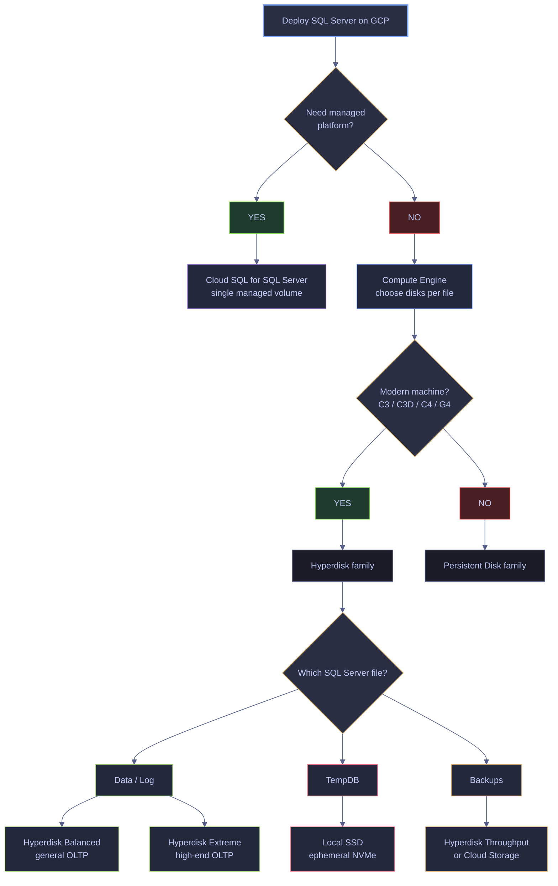
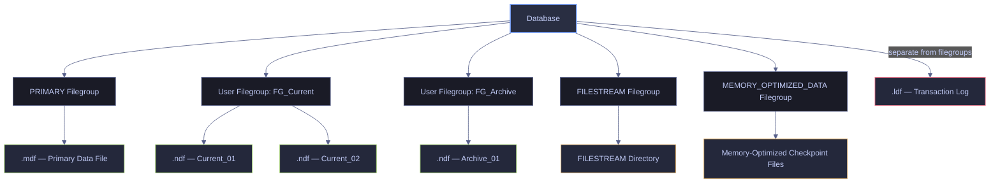
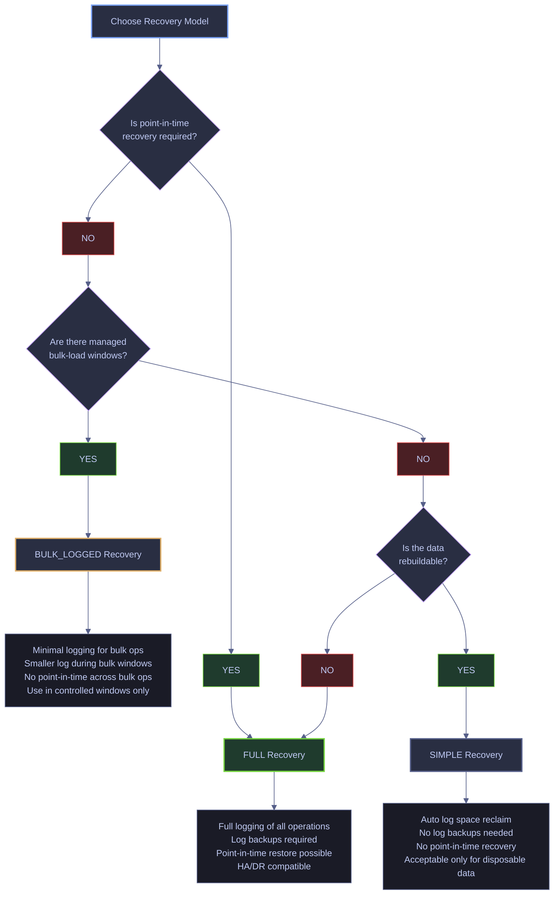

# Database Creation and File Layout

Creating a database is a design act, not a syntactic one. Every decision encoded in `CREATE DATABASE` — physical layout, collation, recovery model, growth policy, observability — becomes an operational constraint the moment the first byte is written. This note walks through those decisions and demonstrates each one against two live reference databases so every DMV output on this page is captured from real state, not fabricated.

This note answers the production questions that actually matter on day one:

- what a `CREATE DATABASE` statement *implicitly decides* when the operator omits options
- how file layout, filegroups, autogrowth, and `MAXSIZE` interact under production load
- which recovery model, collation, compatibility level, and isolation settings are the right defaults and why
- how a full production baseline template reproduces against a live SQL Server 2022 instance
- which anti-patterns silently hurt production years after creation

## Reference Databases

> [!abstract] Scope
>
> Every live query in this note runs against two databases on the same SQL Server 2022 CU23 (Developer Edition, Linux container) instance. Both are real, both are queryable, and the side-by-side comparison is the teaching device: `stoxx_db` shows the production baseline pattern, `stoxx` shows what the template is protecting against.

| Database | Role in the note | File layout | Recovery | Notable settings |
|---|---|---|---|---|
| **`stoxx_db`** | Production baseline, purpose-built for this note | 5 files across 3 filegroups (`PRIMARY`, `FG_Current`, `FG_Archive`), pre-sized, fixed-growth | `FULL` | UTF-8 collation `Latin1_General_100_CI_AS_SC_UTF8`, RCSI + snapshot isolation, Query Store enabled, initialized backup chain |
| **`stoxx`** | Defaults-everywhere working database used as the counter-example | 1 data file + 1 log file, single `PRIMARY` filegroup, unlimited growth | `FULL` | Legacy collation `SQL_Latin1_General_CP1_CI_AS`, no row versioning, never tuned |

## The Design Decisions Behind CREATE DATABASE

At a superficial level, creating a database means issuing a statement such as the following template.

*Template showing the minimal default syntax. Every setting — file layout, sizes, growth, collation, recovery — inherits from the `model` database.*

```sql
CREATE DATABASE [MyDatabase];
```

```text
Commands completed successfully.
```

The statement runs in under a second and returns no rows. That silence is deceptive: every one of the decisions listed below has already been made implicitly, using whatever `model` currently specifies. On a default-model instance this produces a single 8 MB `.mdf`, a 1 MB `.ldf`, 10% autogrowth on the log, and instance-default collation — all of which are usually wrong for production. The `stoxx` database on this instance was created this way, and its defaults surface in every comparison query later on this page.

At a professional level, creating a database means defining four layers of decisions, each of which is covered in detail in its own H2 section later in the note:

1. **Creation path** — new empty database, attached database, snapshot, or contained database.
2. **Physical layout** — data files, log files, filegroups, file locations, initial sizes, growth settings, and maximum sizes.
3. **Behavioral defaults** — collation, recovery model, compatibility level, snapshot behavior, read/write concurrency, and Query Store.
4. **Operational baseline** — ownership, encryption, backup-chain initialization, monitoring expectations, capacity planning, and growth forecasting.

> [!warning] Design is permanent
>
> A database is a long-lived operational object, not just a container for tables. Poor creation-time decisions produce years of avoidable operational pain: fragmentation, blocking, slow recovery, poor restore behavior, runaway storage growth, and migration problems.

> [!success] Decide before executing
>
> Treat `CREATE DATABASE` as a design artifact, not a shortcut. Finalize workload classification, RPO/RTO, file placement, sizing, collation, recovery model, and operational baseline before running the statement. The day-one layout constrains every operational decision that follows.

> [!tip] Right question
>
> The correct question is not "How do I create a database?" but "What kind of database am I creating, for what workload, under what recovery and operational constraints?"

---

## Storage Primitives and Live Inspection

Before looking at any creation option, the operator has to be fluent in the physical units SQL Server actually uses to store and move data. This section defines each primitive, then immediately demonstrates it against `stoxx_db` (and against `stoxx` for comparison) so the reader can map every term to a live DMV output. Concepts that have a full dedicated H2 later in the note — recovery model, collation, compatibility level, Query Store, FILESTREAM, and `MEMORY_OPTIMIZED_DATA` — are defined briefly here and cross-linked to their dedicated section where the live demonstration lives.

### Pages and extents | 8 KB page and 64 KB allocation primitives

A **page** is the fundamental unit of storage in SQL Server. Every page is exactly **8 KB**, and tables and indexes are ultimately stored in pages. Reads and writes happen against pages, not arbitrary byte ranges. When SQL Server reads data from disk into memory, it reads pages. When it modifies stored data, it modifies pages in memory and later flushes them to disk. This is why page density, fragmentation, and I/O behavior matter so much. A single 8 KB page can hold many rows for a narrow table or just a handful for a wide one, and that ratio drives how many physical reads a scan or seek actually costs.

An **extent** is a group of **8 contiguous pages**, for a total of **64 KB**, and it is the basic space-allocation unit inside a data file. Many file, storage, and formatting recommendations are tied to 64 KB because this is a natural SQL Server allocation boundary — NTFS cluster size is typically set to 64 KB on SQL Server volumes for the same reason. When a table grows and needs more space, SQL Server allocates additional extents rather than one row at a time. On modern versions (2016+), new user objects start in uniform extents immediately, which means the eight pages of an extent all belong to the same object rather than being shared with other small tables.

#### Measure page density and fill factor of a real table

> [!info]- Clause-by-clause breakdown
>
> - `sys.dm_db_index_physical_stats` returns per-level allocation and density statistics for an index or heap.
> - `DB_ID()` targets the current database (`stoxx_db`).
> - `OBJECT_ID('silver.eurostoxx50_ohlcv')` points at a real ~67 k-row table in `FG_Current`.
> - The third argument `NULL` asks for every index on the object; the fourth `NULL` asks for every partition.
> - `'DETAILED'` forces a full scan so row-level density is measured, not estimated.
> - `index_level = 0` restricts the result to the leaf level — the pages that actually hold the rows.
> - `avg_page_space_used_in_percent` is the average fill factor per page; values near 100% indicate a nearly-full page and maximum payload density.
> - `page_count * 8 / 1024` converts the leaf page count into megabytes so the output aligns with filesystem thinking.

*Measure how many 8 KB pages hold a real table, how densely filled each page is, and how that translates into on-disk size.*

```sql
USE [stoxx_db];
GO

SELECT TOP 1
    OBJECT_NAME(object_id) AS tbl,
    index_level,
    page_count,
    record_count,
    CAST(avg_page_space_used_in_percent AS decimal(5,2)) AS avg_page_fill_pct,
    CAST((page_count * 8.0) / 1024 AS decimal(10,2)) AS leaf_size_mb
FROM sys.dm_db_index_physical_stats(DB_ID(), OBJECT_ID('silver.eurostoxx50_ohlcv'), NULL, NULL, 'DETAILED')
WHERE index_level = 0;
```

| tbl | index_level | page_count | record_count | avg_page_fill_pct | leaf_size_mb |
|---|---:|---:|---:|---:|---:|
| eurostoxx50_ohlcv | 0 | 894 | 67155 | 98.42 | 6.98 |

*The 67 155 rows of `silver.eurostoxx50_ohlcv` are stored in 894 leaf pages. Each page holds on average ~75 rows packed at 98.42% fill density. The total leaf footprint is 6.98 MB, which is what SQL Server must read when a full scan of this table is necessary. A hypothetical query touching every row therefore demands ~894 page reads; at the 8 KB unit this is 7 MB of I/O regardless of how the rows are returned to the client.*

| Column | Value | Watch | Meaning | Implication |
|---|---|---|---|---|
| `index_level` | `0` | &#9989; | Leaf level of a heap or clustered index. | These are the pages that hold the actual data rows. |
| `avg_page_fill_pct` | `≥ 95%` | &#9989; | Very dense pages. | Excellent storage efficiency; no room for in-place updates before page splits. |
| `avg_page_fill_pct` | `70–90%` | &#9989; | Comfortable fill for tables that receive random inserts. | Leaves headroom for in-place updates. |
| `avg_page_fill_pct` | `< 50%` | &#10060; | Low density. | Indicates over-aggressive fill factor, heavy fragmentation, or rows recently deleted but still ghosted. |

#### Measure extent count and allocation footprint for a rowstore table

> [!info]- Clause-by-clause breakdown
>
> - `sys.partitions` returns one row per heap or index partition.
> - `sys.allocation_units` exposes the on-disk footprint of each partition broken down by allocation unit type.
> - `a.type = 1` filters to `IN_ROW_DATA` allocation units — the main rowstore pages for the heap or clustered index.
> - `total_pages / 8` converts pages to extents, since one extent always equals eight contiguous pages.
> - `total_pages * 8 / 1024` converts pages to megabytes for readability.

*Show how many extents back three real tables of different sizes in `stoxx_db`.*

```sql
USE [stoxx_db];
GO

SELECT
    OBJECT_SCHEMA_NAME(p.object_id) AS [schema],
    OBJECT_NAME(p.object_id)        AS tbl,
    a.total_pages,
    a.total_pages / 8               AS extents,
    CAST(a.total_pages * 8.0 / 1024 AS decimal(10,2)) AS size_mb
FROM sys.partitions       p
JOIN sys.allocation_units a ON a.container_id = p.partition_id
WHERE p.object_id IN (
        OBJECT_ID('silver.eurostoxx50_ohlcv'),
        OBJECT_ID('silver.stoxxusa50_ohlcv'),
        OBJECT_ID('bronze.trading_calendar'))
  AND p.index_id IN (0, 1)
  AND a.type = 1
ORDER BY a.total_pages DESC;
```

| schema | tbl | total_pages | extents | size_mb |
|---|---|---:|---:|---:|
| silver | eurostoxx50_ohlcv | 986 | 123 | 7.70 |
| silver | stoxxusa50_ohlcv | 946 | 118 | 7.39 |
| bronze | trading_calendar | 178 | 22 | 1.39 |

*The 7.70 MB of `silver.eurostoxx50_ohlcv` is divided into exactly 123 extents of 8 pages each plus a small remainder. The 64 KB extent boundary is not an abstraction: it is the unit SQL Server uses when it asks the allocation maps for more space, and it is also the unit recommended for Windows NTFS allocation size on SQL Server volumes (`64K` cluster size). The ratio `page_count / 8` rounded down gives the complete-extent count; residual pages are always less than a full extent.*

### Data files and the transaction log | .mdf, .ndf, and .ldf roles

A **data file** is a physical file that stores table and index data — the user objects, allocation maps, and system catalog pages that make up the database. Every database must have at least one data file, and all data files belong to a filegroup. Two file extensions are conventional (not enforced): `.mdf` for the **primary data file** (exactly one per database, mandatory, owned by the `PRIMARY` filegroup, contains core metadata), and `.ndf` for every **secondary data file** added for capacity, tiering, or partitioning. A small application database might ship with one primary data file only; a large warehouse spreads data across multiple secondary files in user-defined filegroups. `stoxx_db` sits between these extremes: four data files across three filegroups, which exercises every data-file concept the note discusses without becoming unwieldy.

A **transaction log file** (`.ldf`) is not just another data file. It records every data change in sequence before the change is considered durable, and it is central to crash recovery, log backups, high availability, and restore operations. An OLTP system with heavy write volume may have modest data growth but intense log pressure — in such a system, log sizing and log storage latency can matter more than raw data-file size. The log is the single most important file to pre-size correctly, and its I/O pattern and growth behavior are completely different from a data file, so placement and sizing must be handled differently.

#### List every data file with allocated, used, and free space

> [!info]- Clause-by-clause breakdown
>
> - `sys.database_files` is a database-scoped catalog view that returns one row per file belonging to the current database.
> - `type_desc = 'ROWS'` filters to data files only (as opposed to the log, filestream, or full-text file types).
> - `size / 128.0` converts the internal 8 KB page count to megabytes.
> - `FILEPROPERTY(name, 'SpaceUsed')` returns the number of pages currently holding data inside the file — the *used* portion inside the allocated footprint.
> - Subtracting `SpaceUsed` from `size` gives the free space inside the file that has already been claimed from the OS but is not yet carrying rows.

*List every data file in `stoxx_db` with its allocated size, currently used size, and remaining free space.*

```sql
USE [stoxx_db];
GO

SELECT
    file_id,
    name                                                                 AS logical_name,
    physical_name,
    CAST(size / 128.0 AS decimal(10,2))                                  AS allocated_mb,
    CAST(FILEPROPERTY(name,'SpaceUsed') / 128.0 AS decimal(10,2))        AS used_mb,
    CAST((size - FILEPROPERTY(name,'SpaceUsed')) / 128.0 AS decimal(10,2)) AS free_mb
FROM sys.database_files
WHERE type_desc = 'ROWS'
ORDER BY file_id;
```

| file_id | logical_name | physical_name | allocated_mb | used_mb | free_mb |
|---:|---|---|---:|---:|---:|
| 1 | stoxx_db_Primary | /var/opt/mssql/data/stoxx_db_Primary.mdf | 128.00 | 4.25 | 123.75 |
| 3 | stoxx_db_Current_01 | /var/opt/mssql/data/stoxx_db_Current_01.ndf | 256.00 | 15.75 | 240.25 |
| 4 | stoxx_db_Current_02 | /var/opt/mssql/data/stoxx_db_Current_02.ndf | 256.00 | 13.94 | 242.06 |
| 5 | stoxx_db_Archive_01 | /var/opt/mssql/data/stoxx_db_Archive_01.ndf | 128.00 | 1.19 | 126.81 |

*Four data files are visible: the mandatory `PRIMARY` file (`file_id = 1`), two files in `FG_Current` (`Current_01` and `Current_02`), and one file in `FG_Archive`. The two `FG_Current` files have nearly identical used sizes (15.75 MB and 13.94 MB) even though all data was inserted through `SELECT INTO` without any hint — this is the **proportional fill algorithm** in action. When a filegroup contains multiple files, SQL Server splits new allocations between them proportionally to their free space, which is why pre-sizing sibling files identically and enabling `AUTOGROW_ALL_FILES` matters.*

#### Show the log file footprint and log reuse wait

> [!info]- Clause-by-clause breakdown
>
> - `sys.database_files` is filtered to `type_desc = 'LOG'` to return only transaction log files.
> - `sys.dm_db_log_space_usage` reports real-time log footprint for the current database.
> - `total_log_size_in_bytes / 1048576.0` converts bytes to megabytes.
> - `used_log_space_in_percent` is the share of the currently allocated log that contains unreusable log records.
> - `log_reuse_wait_desc` (from `sys.databases`) explains why log space cannot currently be reclaimed if `used_log_pct` is unexpectedly high.

*Show the transaction log file of `stoxx_db` and report how much of it is currently occupied by unreusable log records.*

```sql
USE [stoxx_db];
GO

SELECT
    f.file_id,
    f.name AS logical_name,
    f.physical_name,
    CAST(f.size / 128.0 AS decimal(10,2)) AS allocated_mb,
    CAST(ls.used_log_space_in_bytes / 1048576.0 AS decimal(10,2)) AS used_mb,
    CAST(ls.used_log_space_in_percent AS decimal(5,2)) AS used_pct,
    d.log_reuse_wait_desc
FROM sys.database_files f
CROSS JOIN sys.dm_db_log_space_usage ls
JOIN sys.databases d ON d.database_id = DB_ID()
WHERE f.type_desc = 'LOG';
```

| file_id | logical_name | physical_name | allocated_mb | used_mb | used_pct | log_reuse_wait_desc |
|---:|---|---|---:|---:|---:|---|
| 2 | stoxx_db_Log | /var/opt/mssql/data/stoxx_db_Log.ldf | 256.00 | 0.95 | 0.37 | NOTHING |

*The log is 256 MB pre-allocated (per the baseline template) but only 0.95 MB is currently in use — a healthy state immediately after the initial full backup. `log_reuse_wait_desc = NOTHING` means there is no condition holding back log truncation: no long-running transaction, no pending replication read, no availability-group lag, no missing log backup. The log is free to reclaim space on the next checkpoint. In a healthy `FULL`-recovery database, the common reuse waits to watch for are `LOG_BACKUP` (waiting for the next log backup), `ACTIVE_TRANSACTION` (an unfinished transaction is pinning log), and `REPLICATION` or `DATABASE_MIRRORING`.*

| Column | Value | Watch | Meaning | Implication |
|---|---|---|---|---|
| `used_pct` | `< 10%` | &#9989; | Log reuse is working and the log is barely used. | Normal baseline for a database at rest. |
| `used_pct` | `10–70%` | &#9989; | Log is tracking workload cycles. | Normal during active work between log backups. |
| `used_pct` | `> 85%` | &#10060; | Log is filling up. | Investigate `log_reuse_wait_desc` immediately; a full log blocks all writes. |
| `log_reuse_wait_desc` | `NOTHING` | &#9989; | No condition is holding back truncation. | Healthy. |
| `log_reuse_wait_desc` | `LOG_BACKUP` | ⚠ | Waiting for the next log backup. | Acceptable in `FULL` recovery if log backups are scheduled; alarming if they are not. |
| `log_reuse_wait_desc` | `ACTIVE_TRANSACTION` | &#10060; | A long-running transaction is keeping log pinned. | Find and kill or commit the culprit transaction. |
| `log_reuse_wait_desc` | `OLDEST_PAGE` | ⚠ | Indirect checkpoint is holding the oldest dirty page. | Common on databases with `TARGET_RECOVERY_TIME`; rarely an actionable alert. |
| `log_reuse_wait_desc` | `AVAILABILITY_REPLICA` | &#10060; | A secondary replica has not yet hardened the log. | Investigate AG lag and network health. |

> [!warning] Log ≠ data file
>
> Treating the log as if it were just another data file is a major design mistake. Log I/O patterns and growth behavior are different from data files, so placement and sizing must be handled differently.

> [!success] Log isolation
>
> Place the transaction log on dedicated low-latency storage, size it for peak burst separately from data files, and use fixed-size growth increments. Monitor log reuse waits and VLF counts independently.

#### Return the primary data file and confirm filegroup membership

Even in sophisticated filegroup designs, the primary file remains special. Every database has exactly one, it always belongs to the `PRIMARY` filegroup, and it contains the core metadata required by the database. You cannot build a database entirely out of secondary files.

> [!info]- Clause-by-clause breakdown
>
> - The filter `file_id = 1` targets the primary data file regardless of its logical name.
> - `sys.filegroups` is joined so the query confirms the primary file belongs to `PRIMARY`.
> - `size / 128.0` converts the 8 KB-page value to megabytes.

*Return the primary data file of `stoxx_db` and confirm its filegroup membership.*

```sql
USE [stoxx_db];
GO

SELECT
    f.file_id,
    f.name          AS logical_name,
    f.physical_name,
    CAST(f.size / 128.0 AS decimal(10,2)) AS size_mb,
    fg.name         AS filegroup_name,
    fg.is_default
FROM sys.database_files f
JOIN sys.filegroups     fg ON f.data_space_id = fg.data_space_id
WHERE f.file_id = 1;
```

| file_id | logical_name | physical_name | size_mb | filegroup_name | is_default |
|---:|---|---|---:|---|---:|
| 1 | stoxx_db_Primary | /var/opt/mssql/data/stoxx_db_Primary.mdf | 128.00 | PRIMARY | 0 |

*The primary file always has `file_id = 1` and always belongs to the `PRIMARY` filegroup. In `stoxx_db` it is intentionally small (128 MB) because the production pattern promotes `FG_Current` as the default filegroup (`is_default = 1` in the full file listing above), so user tables do not land in `PRIMARY`. `PRIMARY` only carries the database metadata, system catalog views, and other engine structures. The `is_default = 0` value on this row confirms that no new user object created without an `ON` clause will be placed on the primary file.*

#### List every secondary data file by filegroup

Secondary data files exist to increase storage capacity, separate data across filegroups, support partitioning strategies, place different data sets on different storage tiers, or distribute allocation pressure in specific scenarios. A warehouse database might place hot partitions in one filegroup on fast SSD and cold historical partitions in another filegroup on cheaper storage. `stoxx_db` is structured the same way on a small scale: bronze and silver tables live in `FG_Current` (two sibling files for proportional fill), and the gold layer lives in `FG_Archive` (one file intended for eventual storage-tier migration).

> [!info]- Clause-by-clause breakdown
>
> - `file_id > 1` excludes the primary data file and the log file (which has a distinct file_id outside the ROWS sequence).
> - `type_desc = 'ROWS'` keeps only data files.
> - The join to `sys.filegroups` resolves the filegroup each secondary file belongs to.

*List every secondary data file (`.ndf`) in `stoxx_db` and show which filegroup it belongs to.*

```sql
USE [stoxx_db];
GO

SELECT
    f.file_id,
    f.name         AS logical_name,
    f.physical_name,
    fg.name        AS filegroup_name,
    CAST(f.size / 128.0 AS decimal(10,2)) AS size_mb
FROM sys.database_files f
JOIN sys.filegroups     fg ON f.data_space_id = fg.data_space_id
WHERE f.type_desc = 'ROWS'
  AND f.file_id  > 1
ORDER BY fg.name, f.file_id;
```

| file_id | logical_name | physical_name | filegroup_name | size_mb |
|---:|---|---|---|---:|
| 5 | stoxx_db_Archive_01 | /var/opt/mssql/data/stoxx_db_Archive_01.ndf | FG_Archive | 128.00 |
| 3 | stoxx_db_Current_01 | /var/opt/mssql/data/stoxx_db_Current_01.ndf | FG_Current | 256.00 |
| 4 | stoxx_db_Current_02 | /var/opt/mssql/data/stoxx_db_Current_02.ndf | FG_Current | 256.00 |

*Three secondary data files back `stoxx_db`: two in `FG_Current` and one in `FG_Archive`. The two `FG_Current` files are intentionally sized identically (256 MB each) because the proportional fill algorithm only distributes data evenly when sibling files are the same size with the same growth settings. Running the same query against `stoxx` returns zero rows — that database was created with the default template and has no secondary files at all. In a warehouse context, the `FG_Archive` file could be moved later to cheaper storage without touching the primary or `FG_Current` files, because filegroup placement is the unit of storage-tier migration.*

### Filegroups and default placement | logical containers and `is_default` semantics

A **filegroup** is a logical container for one or more data files. Filegroups are not just administrative labels — they control object placement, partition placement, piecemeal restore strategy, read-only archive design, and backup and restore planning in enterprise environments. A typical layered design uses `PRIMARY` for metadata and small core objects, `FG_Current` for active operational data, and something like `FG_Archive_2024` for older read-only partitions. `stoxx_db` implements exactly this pattern on a smaller scale: three filegroups where `PRIMARY` carries only metadata, `FG_Current` holds bronze and silver tables, and `FG_Archive` carries the gold layer destined for eventual cold storage.

The **default filegroup** is where new objects are created when no filegroup is explicitly specified in a `CREATE TABLE` or `CREATE INDEX` statement. Exactly one filegroup is marked as default at any time, and the flag can be changed post-creation with `ALTER DATABASE ... MODIFY FILEGROUP ... DEFAULT`. If multiple filegroups are defined but the default flag is never managed, objects silently land in `PRIMARY` and pollute the metadata filegroup with user data.

#### Enumerate filegroups with default and read-only flags

> [!info]- Clause-by-clause breakdown
>
> - `sys.filegroups` returns one row per filegroup in the current database.
> - `type_desc` distinguishes rowstore filegroups from `FILESTREAM` and `MEMORY_OPTIMIZED_DATA` groups.
> - `is_default` marks the filegroup that receives new objects when no explicit `ON` clause is used at `CREATE TABLE` or `CREATE INDEX` time.
> - `is_read_only` marks filegroups that have been sealed for read-only workloads; new writes will fail if directed there.

*Enumerate every filegroup in `stoxx_db` with its role and default/read-only state.*

```sql
USE [stoxx_db];
GO

SELECT
    name AS filegroup_name,
    type_desc,
    is_default,
    is_read_only
FROM sys.filegroups
ORDER BY data_space_id;
```

| filegroup_name | type_desc | is_default | is_read_only |
|---|---|---:|---:|
| PRIMARY | ROWS_FILEGROUP | 0 | 0 |
| FG_Current | ROWS_FILEGROUP | 1 | 0 |
| FG_Archive | ROWS_FILEGROUP | 0 | 0 |

*Three filegroups exist. `PRIMARY` is present and mandatory but is **not** the default (`is_default = 0`) — that title was explicitly transferred to `FG_Current` via `ALTER DATABASE stoxx_db MODIFY FILEGROUP [FG_Current] DEFAULT` during post-creation configuration. `FG_Archive` is a regular user-defined filegroup, neither default nor yet marked read-only. The same query against `stoxx` returns a single row, `PRIMARY`, because no user filegroups were ever created — which is the main architectural gap of a default-created database.*

#### Verify where each user table was physically placed

The command used on `stoxx_db` after creation to move the default from `PRIMARY` to `FG_Current` was a single silent `ALTER DATABASE` statement:

*Transfer the default filegroup designation from `PRIMARY` to `FG_Current` so subsequent `CREATE TABLE` statements without an `ON` clause land on the active-data filegroup.*

```sql
ALTER DATABASE [stoxx_db] MODIFY FILEGROUP [FG_Current] DEFAULT;
```

```text
The filegroup property 'DEFAULT' has been set.
```

The verification query below proves the change stuck by walking every user table and reporting which filegroup it actually landed on.

> [!info]- Clause-by-clause breakdown
>
> - The join between `sys.tables` and `sys.indexes` links each user table to its clustered index (or heap entry where `index_id = 0`).
> - `i.data_space_id` identifies the filegroup on which the heap/clustered index actually lives.
> - `sys.filegroups` resolves that `data_space_id` into a human-readable filegroup name.
> - The query then compares the placement of each table to the default filegroup to verify that automatic placement is working as intended.

*Show where every user table in `stoxx_db` was physically placed, and confirm that bronze/silver tables landed on the default filegroup while gold tables were explicitly targeted at `FG_Archive`.*

```sql
USE [stoxx_db];
GO

SELECT
    OBJECT_SCHEMA_NAME(t.object_id) AS [schema],
    t.name                          AS table_name,
    fg.name                         AS on_filegroup,
    fg.is_default                   AS filegroup_is_default
FROM sys.tables     t
JOIN sys.indexes    i ON i.object_id = t.object_id AND i.index_id IN (0, 1)
JOIN sys.filegroups fg ON fg.data_space_id = i.data_space_id
ORDER BY [schema], table_name;
```

| schema | table_name | on_filegroup | filegroup_is_default |
|---|---|---|---:|
| bronze | dim_country | FG_Current | 1 |
| bronze | eurostoxx50_ohlcv | FG_Current | 1 |
| bronze | trading_calendar | FG_Current | 1 |
| gold | index_performance | FG_Archive | 0 |
| gold | scores_daily | FG_Archive | 0 |
| gold | scores_quarterly | FG_Archive | 0 |
| silver | eurostoxx50_ohlcv | FG_Current | 1 |
| silver | stoxxusa50_ohlcv | FG_Current | 1 |

*Every bronze and silver table was created via `SELECT * INTO stoxx_db.<schema>.<table>` without any explicit placement hint, and each one landed on `FG_Current` because that filegroup carries the `is_default = 1` flag. The three gold tables were explicitly moved to `FG_Archive` after creation. The takeaway: the default filegroup is the silent contract with every `CREATE TABLE` statement that omits an `ON` clause. Forgetting to configure it means every application object lands in `PRIMARY`, polluting the metadata filegroup with user data.*

### File identity | logical names and physical paths

The **logical file name** is SQL Server's internal name for a file and is the identifier every `ALTER DATABASE` management command expects. The logical name is stable: renaming the underlying file on disk does not change it, and restoring the database on a different host preserves it even when `FILENAME` is rewritten by the restore. Administrative clarity starts with good logical names — a file called `db_01` tells you nothing about its role on restore day, while `stoxx_db_Current_01` is self-documenting.

The **physical file path** is the OS path to the file. It determines where I/O actually occurs, which storage tier is used, which permissions are required, and how restores, migrations, and failovers behave. On `stoxx_db` every file lives at `/var/opt/mssql/data/` because SQL Server is running inside a Linux container and that is the only mount point exposed to the engine. In a production Windows environment, data, log, TempDB, and backups would each occupy a separate drive letter backed by a different physical volume — the container layout compresses these distinctions but does not change the concept.

#### Change autogrowth by logical file name

`ALTER DATABASE ... MODIFY FILE` is silent on success, so instead of reading an output message the administrator verifies the change by re-querying `sys.database_files`.

*Change the autogrowth increment for an existing data file by referencing its logical name, then immediately confirm the new setting.*

```sql
ALTER DATABASE [stoxx_db]
MODIFY FILE (NAME = stoxx_db_Current_01, FILEGROWTH = 256MB);

SELECT name, CAST(growth / 128.0 AS decimal(10,2)) AS growth_mb
FROM sys.database_files
WHERE name = 'stoxx_db_Current_01';
```

| name | growth_mb |
|---|---:|
| stoxx_db_Current_01 | 256.00 |

*The growth increment now reads 256 MB. A restart is **not** required — the new value takes effect on the next autogrowth event. Reverting the change back to the baseline 128 MB is done the same way by issuing a second `MODIFY FILE` statement and querying again.*

#### Resolve logical names to physical paths

> [!info]- Clause-by-clause breakdown
>
> - `sys.database_files` exposes every file in the current database including the log.
> - `f.name` is the logical name — the identifier used by every `ALTER DATABASE MODIFY FILE` command.
> - The query deliberately retrieves both the logical name and the physical path side by side to prevent confusion between the two.

*List the logical name of every file in `stoxx_db` alongside its physical path.*

```sql
USE [stoxx_db];
GO

SELECT
    file_id,
    name          AS logical_name,
    physical_name
FROM sys.database_files
ORDER BY file_id;
```

| file_id | logical_name | physical_name |
|---:|---|---|
| 1 | stoxx_db_Primary | /var/opt/mssql/data/stoxx_db_Primary.mdf |
| 2 | stoxx_db_Log | /var/opt/mssql/data/stoxx_db_Log.ldf |
| 3 | stoxx_db_Current_01 | /var/opt/mssql/data/stoxx_db_Current_01.ndf |
| 4 | stoxx_db_Current_02 | /var/opt/mssql/data/stoxx_db_Current_02.ndf |
| 5 | stoxx_db_Archive_01 | /var/opt/mssql/data/stoxx_db_Archive_01.ndf |

*Each row shows the logical name on the left (what `ALTER DATABASE` expects) and the physical path on the right (what the operating system sees). The logical names were chosen at `CREATE DATABASE` time to make their role self-documenting: `stoxx_db_Primary` is the metadata file, `stoxx_db_Current_01/02` are the sibling files of `FG_Current`, `stoxx_db_Archive_01` is the cold-storage file, and `stoxx_db_Log` is the transaction log. Administrative clarity starts with good logical names — a file called `db_01` tells you nothing about its role on restore day.*

#### Break directory, file name, and extension out of `physical_name`

> [!info]- Clause-by-clause breakdown
>
> - `sys.database_files` exposes `physical_name` directly — no join needed.
> - `STRING_SPLIT` with `ordinal = 1` would extract the path prefix if necessary; here a simpler approach is shown using `LEFT` and `CHARINDEX` to isolate the directory.

*Show the directory prefix, file name, and extension for each file in `stoxx_db` so the reader can see how the OS-level layout maps to the logical roles.*

```sql
USE [stoxx_db];
GO

SELECT
    name                                                                             AS logical_name,
    LEFT(physical_name, LEN(physical_name) - CHARINDEX('/', REVERSE(physical_name))) AS directory_path,
    RIGHT(physical_name, CHARINDEX('/', REVERSE(physical_name)) - 1)                 AS file_name,
    RIGHT(physical_name, CHARINDEX('.', REVERSE(physical_name)) - 1)                 AS extension
FROM sys.database_files
ORDER BY file_id;
```

| logical_name | directory_path | file_name | extension |
|---|---|---|---|
| stoxx_db_Primary | /var/opt/mssql/data | stoxx_db_Primary.mdf | mdf |
| stoxx_db_Log | /var/opt/mssql/data | stoxx_db_Log.ldf | ldf |
| stoxx_db_Current_01 | /var/opt/mssql/data | stoxx_db_Current_01.ndf | ndf |
| stoxx_db_Current_02 | /var/opt/mssql/data | stoxx_db_Current_02.ndf | ndf |
| stoxx_db_Archive_01 | /var/opt/mssql/data | stoxx_db_Archive_01.ndf | ndf |

*All five files share the same `/var/opt/mssql/data` directory because the container exposes a single volume. The extensions visually reinforce the role of each file: `.mdf` for the primary data file, `.ldf` for the transaction log, and `.ndf` for every secondary data file. These extensions are convention, not enforcement — SQL Server will accept any extension — but following the convention makes file-system inventory and monitoring scripts far easier to write.*

### Growth, caps, and virtual log files | autogrowth, `MAXSIZE`, and VLF structure

**Autogrowth** is the mechanism by which SQL Server automatically enlarges a file when its currently allocated space is exhausted. The operational meaning matters more than the definition: when autogrowth fires, SQL Server has run out of allocated space inside the current file, must request more disk space from the operating system, and that growth event can pause or slow user activity. For log files, growth is especially disruptive because new log space must be zero-initialized. Autogrowth is **not** a sizing strategy, not a substitute for capacity planning, and not a sign that configuration is "dynamic and smart" — it is an emergency overflow valve. The default `FILEGROWTH` values by SQL Server version are shown below, and almost all of them are too small for production workloads.

| Version | Data file default | Log file default |
|---|---|---|
| SQL Server 2016+ | 64 MB | 64 MB |
| SQL Server 2005–2014 | 1 MB | 10% |
| Prior to SQL Server 2005 | 10% | 10% |

Autogrowth matters for four reasons: (1) file growth events consume time and I/O, and large growth events can stall writes with wait type `PREEMPTIVE_OS_WRITEFILEGATHER`; (2) frequent autogrowth is a signal that initial sizing is wrong or workload growth is unmanaged; (3) repeated growth can lead to less contiguous allocation at the storage layer; (4) repeated small log growth events create too many VLFs. A log file that starts at 1 GB and grows by 10 MB every few minutes during ETL seems harmless, but after enough growth events the VLF fragmentation silently degrades recovery speed.

**`MAXSIZE`** is the upper size limit to which a file can grow. Without a meaningful cap, a runaway workload can keep consuming storage until the underlying volume is exhausted, which can affect not only one database but an entire instance or host. A staging database may use a strict `MAXSIZE` because it is disposable and should never crowd out production storage. In `stoxx_db` every file has an explicit cap: the primary file is 1 GB, each `FG_Current` file is 4 GB, the `FG_Archive` file is 2 GB, and the log is 2 GB.

A **Virtual Log File** (VLF) is an internal subdivision of the transaction log. The log is physically one or more files, but internally it is divided into VLFs, and excessive VLF counts degrade startup time, crash recovery, restore operations, and log-scanning operations used by HA/DR features. The operational thresholds are shown below.

| VLF count | Assessment | Action |
|---|---|---|
| < 200 | Healthy | No action needed |
| 200–500 | Elevated | Investigate growth history; consider pre-sizing |
| 500–1000 | High | Schedule a log rebuild (shrink + pre-size) during maintenance |
| > 1000 | Critical | Prioritize remediation — recovery and HA performance are degraded |

SQL Server creates VLFs during growth using three tiers: growth increments under 64 MB create 4 VLFs, increments from 64 MB to 1 GB create 8 VLFs, and increments over 1 GB create 16 VLFs — all of equal size. A 1,024 MB growth increment therefore creates 8 VLFs of 128 MB each, which is a well-balanced size for most production workloads. Bad VLF counts come from very small log growth increments (e.g., the 1 MB default), repeated autogrowth over weeks or months, or chronic log undersizing. To rebuild a fragmented log: (1) verify no active long-running transactions with `DBCC OPENTRAN`; (2) take a log backup to minimize active log; (3) shrink the log to the minimum with `DBCC SHRINKFILE(log_logical_name, 1)`; (4) grow the log back in 1,024–4,096 MB chunks to establish well-sized VLFs; (5) verify the new count with `sys.dm_db_log_info`.

> [!quote] Korotkevitch
>
> Do not auto-shrink transaction log files. They will grow again and affect performance when SQL Server zeroes out the file. It is better to pre-allocate the space and manage log file size manually.
>
> Source: Dmitri Korotkevitch | SQL Server Advanced Troubleshooting and Performance Tuning

#### Compare autogrowth across `stoxx` and `stoxx_db`

> [!info]- Clause-by-clause breakdown
>
> - `sys.database_files` exposes `growth` and `is_percent_growth` side by side.
> - When `is_percent_growth = 0`, `growth` is a count of 8 KB pages; dividing by 128 converts to megabytes.
> - When `is_percent_growth = 1`, `growth` is already the percent value (e.g., `10` means 10%).
> - The `CASE` expression normalizes both modes into a single human-readable column so a mixed database can be reviewed at a glance.

*Compare the autogrowth settings of every file across `stoxx_db` and `stoxx` to see what pre-sizing with fixed growth looks like versus the legacy defaults.*

```sql
SELECT
    DB_NAME(database_id) AS database_name,
    name                 AS logical_name,
    type_desc,
    CAST(size / 128.0 AS decimal(10,2)) AS initial_size_mb,
    CASE is_percent_growth
         WHEN 1 THEN CAST(growth AS varchar(20)) + '%'
         ELSE CAST(CAST(growth / 128.0 AS decimal(10,2)) AS varchar(20)) + ' MB'
    END                  AS growth_setting,
    is_percent_growth
FROM sys.master_files
WHERE DB_NAME(database_id) IN ('stoxx', 'stoxx_db')
ORDER BY database_name, file_id;
```

| database_name | logical_name | type_desc | initial_size_mb | growth_setting | is_percent_growth |
|---|---|---|---:|---|---:|
| stoxx | stoxx | ROWS | 712.00 | 64.00 MB | 0 |
| stoxx | stoxx_log | LOG | 968.00 | 64.00 MB | 0 |
| stoxx_db | stoxx_db_Primary | ROWS | 128.00 | 64.00 MB | 0 |
| stoxx_db | stoxx_db_Log | LOG | 256.00 | 128.00 MB | 0 |
| stoxx_db | stoxx_db_Current_01 | ROWS | 256.00 | 128.00 MB | 0 |
| stoxx_db | stoxx_db_Current_02 | ROWS | 256.00 | 128.00 MB | 0 |
| stoxx_db | stoxx_db_Archive_01 | ROWS | 128.00 | 64.00 MB | 0 |

*Both databases use fixed-size autogrowth increments (`is_percent_growth = 0`), which is the baseline best practice. The difference is in the **sizing**: `stoxx` inherited the 64 MB default from the `model` database template and never was tuned further, while `stoxx_db` was pre-sized so that each file has enough initial room to avoid autogrowth events during normal operation. The data file of `stoxx` grew organically from 8 MB to 712 MB by triggering dozens of 64 MB autogrowth events — exactly the "reactive firefighting" pattern the warning below describes.*

| Column | Value | Watch | Meaning | Implication |
|---|---|---|---|---|
| `is_percent_growth` | `0` | &#9989; | Fixed-size growth increments. | Predictable growth events regardless of current file size. |
| `is_percent_growth` | `1` | &#10060; | Percentage growth. | Growth events become larger and more disruptive as the file grows. |
| `growth_setting` | `64.00 MB` on a <10 GB file | &#9989; | Acceptable default. | Small databases can tolerate 64 MB increments. |
| `growth_setting` | `64.00 MB` on a 500 GB+ file | &#10060; | Far too small. | Triggers dozens of growth events per large ETL cycle. |
| `growth_setting` | `512–4096 MB` | &#9989; | Production-sized fixed increment. | Rare, predictable, monitored growth events. |

> [!warning] Not a sizing strategy
>
> Autogrowth should be treated as an emergency overflow valve, not as the normal mechanism by which production files obtain their daily working space.

> [!success] Pre-size proactively
>
> Pre-size files based on forecasted workload, use fixed growth increments (512 MB–4 GB for data, 512 MB–2 GB for log), and monitor autogrowth events. If growth events occur more than occasionally, resize proactively.

> [!tip] Healthy growth
>
> A healthy production database may still use autogrowth, but growth events should be infrequent, intentional, monitored, and sized in meaningful fixed increments.

#### Show `MAXSIZE` caps for every file on both databases

> [!info]- Clause-by-clause breakdown
>
> - `max_size` is stored internally in 8 KB pages, so it must be divided by 128 to read it in megabytes.
> - The special value `-1` means "unlimited" for data files; the log file encodes unlimited as `268435456` (representing 2 TB of pages), which is the hard engine ceiling for a single log file.
> - The `CASE` expression normalizes both `-1` and the log-specific ceiling so the output is readable without a calculator.

*Show the MAXSIZE setting of every file in `stoxx_db` and `stoxx`, converting the internal encoding to megabytes.*

```sql
SELECT
    DB_NAME(database_id) AS database_name,
    name                 AS logical_name,
    type_desc,
    max_size             AS max_size_raw,
    CASE
        WHEN max_size = -1 THEN 'UNLIMITED'
        WHEN max_size = 268435456 THEN '2 TB (engine ceiling for log)'
        ELSE CAST(CAST(max_size / 128.0 AS decimal(18,2)) AS varchar(30)) + ' MB'
    END AS max_size_readable
FROM sys.master_files
WHERE DB_NAME(database_id) IN ('stoxx', 'stoxx_db')
ORDER BY database_name, file_id;
```

| database_name | logical_name | type_desc | max_size_raw | max_size_readable |
|---|---|---|---:|---|
| stoxx | stoxx | ROWS | -1 | UNLIMITED |
| stoxx | stoxx_log | LOG | 268435456 | 2 TB (engine ceiling for log) |
| stoxx_db | stoxx_db_Primary | ROWS | 131072 | 1024.00 MB |
| stoxx_db | stoxx_db_Log | LOG | 262144 | 2048.00 MB |
| stoxx_db | stoxx_db_Current_01 | ROWS | 524288 | 4096.00 MB |
| stoxx_db | stoxx_db_Current_02 | ROWS | 524288 | 4096.00 MB |
| stoxx_db | stoxx_db_Archive_01 | ROWS | 262144 | 2048.00 MB |

*`stoxx` illustrates the default: the data file is `UNLIMITED` (`max_size = -1`), which means it can keep growing until the entire volume is exhausted. The log file is capped at the engine ceiling of 2 TB, which is effectively the same as "no cap" in practice. `stoxx_db` uses explicit megabyte caps on every file so a runaway workload cannot consume the shared `/var/opt/mssql` volume. The caps must be high enough to hold the largest expected working set plus a safety margin, and must be combined with monitoring so that a file approaching its cap triggers an alert before the workload hits it.*

| Column | Value | Watch | Meaning | Implication |
|---|---|---|---|---|
| `max_size_raw` | `-1` | &#10060; | Unlimited data file. | File can consume the entire volume before any ceiling kicks in. |
| `max_size_raw` | `268435456` | ⚠ | Engine ceiling for the log (2 TB). | Effectively unlimited in most environments; rely on alerting instead. |
| `max_size_raw` | Explicit value | &#9989; | Bounded file. | Protects shared storage; requires monitoring to avoid hitting the cap. |

#### Report the VLF layout of the transaction log

A 500 GB log file grown in tiny increments over months often behaves worse operationally than a 500 GB log file that was pre-sized sensibly. Check the current VLF count with `DBCC LOGINFO` or `sys.dm_db_log_info` (SQL Server 2016 SP2+).

> [!info]- Clause-by-clause breakdown
>
> - `sys.dm_db_log_info(DB_ID())` returns one row per VLF in the current database's log file(s).
> - `vlf_sequence_number` is the internal VLF sequence number; `0` means the slot has never been used since allocation.
> - `vlf_active = 1` marks the VLF that currently holds the active portion of the log.
> - `vlf_status` encodes the VLF state (`0` = free, `2` = in use by active log records).
> - `vlf_size_mb` is the size in megabytes; the ideal healthy range is ~50 MB–500 MB per VLF depending on the total log footprint.

*Report the VLF layout of the `stoxx_db` transaction log and compare the total VLF count to `stoxx`.*

```sql
USE [stoxx_db];
GO

SELECT
    file_id,
    COUNT(*)                                            AS vlf_count,
    SUM(CASE vlf_active WHEN 1 THEN 1 ELSE 0 END)       AS active_vlfs,
    CAST(MIN(vlf_size_mb) AS decimal(10,2))             AS min_vlf_mb,
    CAST(AVG(vlf_size_mb) AS decimal(10,2))             AS avg_vlf_mb,
    CAST(MAX(vlf_size_mb) AS decimal(10,2))             AS max_vlf_mb
FROM sys.dm_db_log_info(DB_ID())
GROUP BY file_id;

SELECT
    DB_NAME(database_id) AS database_name,
    COUNT(*)             AS vlf_count
FROM sys.dm_db_log_info(DB_ID('stoxx_db'))
GROUP BY database_id
UNION ALL
SELECT DB_NAME(database_id), COUNT(*) FROM sys.dm_db_log_info(DB_ID('stoxx')) GROUP BY database_id;
```

| file_id | vlf_count | active_vlfs | min_vlf_mb | avg_vlf_mb | max_vlf_mb |
|---:|---:|---:|---:|---:|---:|
| 2 | 8 | 1 | 31.93 | 31.99 | 32.42 |

| database_name | vlf_count |
|---|---:|
| stoxx_db | 8 |
| stoxx | 43 |

*`stoxx_db` has exactly 8 VLFs of ~32 MB each, which is the result of pre-sizing the log at 256 MB in a single initial allocation. Per the VLF creation rules table above, a single growth increment in the 64 MB–1 GB range yields 8 VLFs of equal size — so 256 MB / 8 = 32 MB per VLF. The single "active" VLF holds the current log tail. `stoxx` has 43 VLFs because its log grew from 1 MB to 968 MB over many small autogrowth events, each creating additional VLFs of decreasing size. 43 VLFs is still well inside the healthy threshold (< 200), but the difference in tidiness between 8 uniform VLFs and 43 uneven VLFs is visible immediately.*

| Column | Value | Watch | Meaning | Implication |
|---|---|---|---|---|
| `vlf_count` | `< 200` | &#9989; | Healthy. | No action needed. |
| `vlf_count` | `200–500` | ⚠ | Elevated. | Investigate growth history; consider pre-sizing. |
| `vlf_count` | `500–1000` | &#10060; | High. | Schedule a log rebuild during maintenance. |
| `vlf_count` | `> 1000` | &#10060; | Critical. | Recovery and HA performance are degraded. |
| `active_vlfs` | `1–few` | &#9989; | Normal — a small fraction of VLFs carry the active log. | Expected. |
| `active_vlfs` | `≥ vlf_count / 2` | &#10060; | Log truncation is blocked. | Investigate `log_reuse_wait_desc`. |
| `min_vlf_mb` vs `max_vlf_mb` | Similar | &#9989; | Log was pre-sized in a single large allocation. | Ideal. |
| `min_vlf_mb` vs `max_vlf_mb` | Very different | ⚠ | Log grew in a mix of small and large events over time. | Consider a one-time log rebuild. |

### Behavior defaults | recovery, collation, compatibility level, and Query Store

Four database-scoped behaviors are decided at creation time but do not fit under the file-layout group because they govern how the engine interprets data rather than where it stores it. Each has a full live demonstration in its own dedicated H2 section later in the note — this subsection is the one-paragraph primer so the design vocabulary is complete before the creation modes, storage architecture, and GCP sections reference them.

The **recovery model** is a database setting that determines how transactions are logged and what restore options are possible. It is a business decision disguised as a technical setting: it determines whether point-in-time recovery is available and how much data loss is acceptable after failure. Two databases may hold similar data volumes, but the production system requires `FULL` because zero data loss is unacceptable, while a transient ETL landing zone may use `SIMPLE` because the data can be reloaded. The live comparison of `stoxx_db` and `stoxx` recovery models lives in the dedicated [Recovery Models](#recovery-models) section.

**Collation** defines string comparison and sorting rules — case sensitivity, accent sensitivity, sort order, binary vs linguistic comparison, and character encoding in UTF-8-capable collations. It affects correctness, not aesthetics. Different collations can change join behavior, uniqueness behavior, sort order, and interoperability with external systems. If the database collation differs from `tempdb`, string comparisons involving temp tables fail with error 468 unless explicit `COLLATE` clauses are applied on every comparison. The live inventory showing the UTF-8 vs legacy-collation mismatch on this instance lives in the dedicated [Collation](#collation) section.

The **compatibility level** is a database-scoped setting that controls portions of query processor and language behavior. It allows a database to run on a newer SQL Server engine while preserving older optimizer behavior for compatibility and regression control. After upgrading an instance to SQL Server 2022, a migrated database can be held temporarily below level 160 until testing confirms that plan changes are acceptable. The live inventory of engine version and per-database compatibility level lives in the dedicated [Compatibility Level](#compatibility-level) section.

**Query Store** is a database-level feature that records query text, execution plans, and runtime statistics over time. It is part of the database's baseline observability, and in SQL Server 2022 it also underpins several intelligent query processing and plan-forcing features. When performance regresses after a compatibility-level change, Query Store identifies the plan change and supports plan forcing as a mitigation. The live inspection of `sys.database_query_store_options` against `stoxx_db` lives in the dedicated [Query Store](#query-store) section.

### Specialized filegroups | `FILESTREAM` and `MEMORY_OPTIMIZED_DATA`

Two filegroup types exist alongside the rowstore `ROWS_FILEGROUP` and serve completely different storage models. Both change backup, restore, and administration patterns, so they must be planned at creation time — neither can be added casually.

**`FILESTREAM`** allows large binary objects (images, documents, videos, PDFs) to be stored in the NTFS filesystem while remaining transactionally consistent with SQL Server row data. It is not just "another file type" — it changes backup, restore, storage, and administration patterns because the filegroup maps to a directory structure rather than a `.ndf` file. FILESTREAM directories are backed up as part of the database backup, restore recreates the directory tree, and the filegroup must live on NTFS or ReFS. Enabling it requires `sp_configure 'filestream access level'` at the instance level and a service restart, then `FILEGROUP [name] CONTAINS FILESTREAM` in `CREATE DATABASE` or `ALTER DATABASE`.

**`MEMORY_OPTIMIZED_DATA`** is the filegroup type required for durable In-Memory OLTP objects. Unlike rowstore filegroups, it contains **checkpoint file pairs** (data and delta files) that persist the in-memory state across restarts. Only one `MEMORY_OPTIMIZED_DATA` filegroup is allowed per database. Checkpoint files cannot be incrementally backed up — they are always full-copied in backups, which inflates backup size for workloads that use In-Memory OLTP heavily. Once added, this filegroup cannot be dropped without dropping every memory-optimized object on it first.

#### Verify FILESTREAM filegroup presence on stoxx_db

*Verify whether `stoxx_db` has a FILESTREAM filegroup configured.*

```sql
USE [stoxx_db];
GO

SELECT name, type_desc, is_default, is_read_only
FROM sys.filegroups
WHERE type_desc = 'FILESTREAM_DATA_FILEGROUP';
```

```text
(0 rows affected)
```

*Zero rows means no FILESTREAM filegroup is configured on this database. `stoxx_db` holds only structured tabular data — there are no large binary payloads in the bronze/silver/gold layers that would justify FILESTREAM. Adding FILESTREAM later is possible via `ALTER DATABASE ADD FILEGROUP ... CONTAINS FILESTREAM`, but it requires instance-level FILESTREAM access to be enabled first (`sp_configure 'filestream access level'`) and a service restart.*

#### Verify `MEMORY_OPTIMIZED_DATA` filegroup presence on stoxx_db

*Verify whether `stoxx_db` has a MEMORY_OPTIMIZED_DATA filegroup configured.*

```sql
USE [stoxx_db];
GO

SELECT name, type_desc, is_default, is_read_only
FROM sys.filegroups
WHERE type_desc = 'MEMORY_OPTIMIZED_DATA_FILEGROUP';
```

```text
(0 rows affected)
```

*Zero rows means `stoxx_db` cannot host durable memory-optimized tables. Adding a MEMORY_OPTIMIZED_DATA filegroup to an existing database is done with `ALTER DATABASE ADD FILEGROUP ... CONTAINS MEMORY_OPTIMIZED_DATA`, then a second `ALTER DATABASE ADD FILE (NAME ..., FILENAME ...) TO FILEGROUP ...`. The filegroup points at a directory rather than a file; checkpoint files are created inside that directory as memory-optimized tables are populated. Once added, this filegroup cannot be dropped without dropping every memory-optimized object on it first.*

---

## Database Creation Modes

SQL Server supports multiple ways to create a database. These modes are operationally different and must not be conflated.

### `CREATE DATABASE` | create a brand-new empty database with new files

This is the standard case: create new files and initialize a new database.

**Use when:**
- creating a new application database
- creating a new warehouse or mart
- creating a staging or landing database
- creating a dev/test environment from scratch

**Core implication:**
You define the initial physical design directly.

*Template showing a new empty database created with every setting inherited from the `model` database defaults.*

```sql
CREATE DATABASE [SalesOps];
```

```text
Commands completed successfully.
```

This minimal form is syntactically valid, but rarely sufficient for production because it leaves too many critical decisions to defaults. The `stoxx` database on this instance was created using exactly this pattern, and every anti-pattern in the dedicated [Anti-Patterns](#anti-patterns) section at the bottom of the note is directly traceable to those inherited defaults.

### `FOR ATTACH` | attach existing database files to an instance

This attaches already existing database files to an instance.

**Use when:**
- reattaching a detached database
- moving a non-production database between servers
- recovering a copied database outside normal restore workflow

**Operational implications:**
- file paths must be valid
- permissions must be correct
- version compatibility must be acceptable
- TDE certificate dependencies must be met if encryption is in use

**Warning:**
Attach is not a general substitute for backup/restore in mature environments.

### `FOR ATTACH_REBUILD_LOG` | attach data files and rebuild a missing transaction log

This path is used when data files exist but the log file is missing and SQL Server is able to rebuild it.

**Use when:**
- constrained recovery scenarios
- emergency salvage of certain non-production databases

**Why this is risky:**
This is not normal operations. If you rely on this routinely, your backup strategy is already failing.

### `AS SNAPSHOT OF` | create a read-only point-in-time view of a source database

A **database snapshot** is a read-only static view of a source database at a point in time.

**Use when:**
- you need a stable read-only reference
- you want protection before a risky change
- you want to inspect production data without allowing writes

**Key implications:**
- read-only
- dependent on the source database
- not a replacement for backups

### `BACKUP` + `RESTORE ... WITH MOVE` | canonical copy-database pattern

The correct way to create a database from an existing one is to take a backup of the source and restore it under a new name, using `WITH MOVE` to relocate the physical files. This is the only method that preserves the full transaction log chain, verifies file integrity via checksum, works across instances regardless of version (subject to compatibility rules), and leaves the source database fully online throughout.

**Use when:**

- cloning production to a lower environment
- creating a refreshable reporting copy
- migrating a database to a new instance or host
- creating a reproducible test database for CI pipelines

*Template showing a full backup of a source database followed by a restore under a new name with relocated data and log files.*

```sql
BACKUP DATABASE [SalesOps]
TO DISK = N'/var/opt/mssql/backup/SalesOps.bak'
WITH INIT, CHECKSUM, COMPRESSION, STATS = 10;

RESTORE DATABASE [SalesOps_Copy]
FROM DISK = N'/var/opt/mssql/backup/SalesOps.bak'
WITH
    MOVE N'SalesOps_Primary'    TO N'/var/opt/mssql/data/SalesOps_Copy_Primary.mdf',
    MOVE N'SalesOps_Current_01' TO N'/var/opt/mssql/data/SalesOps_Copy_Current_01.ndf',
    MOVE N'SalesOps_Log'        TO N'/var/opt/mssql/log/SalesOps_Copy_Log.ldf',
    REPLACE, CHECKSUM, STATS = 10;
```

| Flag | Syntax | Description |
|---|---|---|
| `MOVE` | `MOVE 'logical_name' TO 'new_path'` | Relocate each logical file. Required when restoring to a different directory or alongside the source on the same instance (new files must not collide with the source's). |
| `REPLACE` | `WITH REPLACE` | Overwrite an existing database of the same name. Without it, SQL Server refuses to overwrite to prevent accidents. |
| `RECOVERY` | `WITH RECOVERY` (default) | Bring the copy online immediately after the restore completes. No further log restores possible. |
| `NORECOVERY` | `WITH NORECOVERY` | Leave the database in a restoring state so subsequent differential or log restores can be applied to extend the chain. |
| `STANDBY` | `WITH STANDBY = 'undo_file'` | Restore with a read-only standby file so the database is queryable between log restores. Used by log-shipping targets. |
| `FILE` | `RESTORE DATABASE ... FILE = 'logical_name'` | Partial restore of a single file — used in piecemeal recovery. |
| `FILEGROUP` | `RESTORE DATABASE ... FILEGROUP = 'fg_name'` | Partial restore of a single filegroup. `PRIMARY` must be restored first. |
| `PAGE` | `RESTORE DATABASE ... PAGE = 'file:page'` | Page-level restore for isolated corruption repair. |
| `KEEP_CDC` | `WITH KEEP_CDC` | Preserve change data capture metadata on the restored copy. |
| `KEEP_REPLICATION` | `WITH KEEP_REPLICATION` | Preserve replication metadata on the restored copy. |
| `CHECKSUM` | `WITH CHECKSUM` | Verify backup checksums during the restore; fail fast on a corrupted backup. |
| `STATS` | `WITH STATS = n` | Report restore progress every `n` percent. |

> [!warning] Orphaned users after restore
>
> Restoring to a different instance creates orphaned users: database users retain the source instance's login SIDs, which do not match the target instance's logins. Applications using SQL logins will fail to authenticate until the mismatch is fixed.

> [!success] Post-restore checklist for a safe copy
>
> After every copy-by-restore, perform these steps:
>
> - Rename logical file names with `ALTER DATABASE [Copy] MODIFY FILE ( NAME = old, NEWNAME = new )` so internal names match the new database.
> - Remap orphaned users with `ALTER USER [user] WITH LOGIN = [login]` for every SQL login that the application uses.
> - Reassign database ownership with `ALTER AUTHORIZATION ON DATABASE::[Copy] TO [sa]` (or your standard DBO principal).
> - Reset `TRUSTWORTHY`, `DB_CHAINING`, and `SERVICE_BROKER` to the target environment's standards.
> - Take a fresh full backup to start a new, independent backup chain for the copy.

### `DBCC CLONEDATABASE` | schema, statistics, and Query Store clone without data

`DBCC CLONEDATABASE` creates a schema-only clone that includes column statistics and Query Store data, but **no user data rows**. It is designed for optimizer diagnostics and plan-regression reproductions, not as a data-copy mechanism.

**Use when:**

- reproducing a query plan regression on a test instance without exposing customer data
- handing a database to Microsoft support for optimizer investigations
- diagnosing cardinality estimation issues on a frozen snapshot of statistics

*Template creating a schema-and-statistics-only clone of the source database.*

```sql
DBCC CLONEDATABASE (SalesOps, SalesOps_Clone);
```

| Flag | Syntax | Description |
|---|---|---|
| `NO_STATISTICS` | `DBCC CLONEDATABASE (src, clone) WITH NO_STATISTICS` | Exclude column statistics from the clone. Use when only schema is needed. |
| `NO_QUERYSTORE` | `... WITH NO_QUERYSTORE` | Exclude Query Store data from the clone. Default is to include it. |
| `VERIFY_CLONEDB` | `... WITH VERIFY_CLONEDB` | Run `DBCC CHECKDB` on the resulting clone to validate internal consistency. |
| `BACKUP_CLONEDB` | `... WITH BACKUP_CLONEDB` | Back up the cloned database immediately after creation so it can be handed off as a `.bak`. |
| `SERVICEBROKER` | `... WITH SERVICEBROKER` | Include Service Broker metadata in the clone. |

> [!warning] Read-only and unsupported for production workloads
>
> The resulting clone is read-only by default and Microsoft explicitly states it is not supported for production use. The exact list of objects included or excluded may change between cumulative updates. Use only for diagnostic purposes, then drop or mark it clearly as a diagnostic artifact.

> [!success] Use only as a diagnostic hand-off artifact
>
> Treat every `DBCC CLONEDATABASE` output as a throwaway diagnostic, not a dev copy. Immediately rename it with a prefix like `dbg_` or `clone_`, scope it to a dedicated test instance, and drop it as soon as the investigation is done. Never use a clone for data-dependent work — use `BACKUP` + `RESTORE ... WITH MOVE` for that.

### Detach, copy, attach | physical file-level copy path

This pattern takes a database offline, copies its `.mdf`/`.ndf`/`.ldf` files at the filesystem level, then attaches the copies under a new name. It can be faster than backup/restore for very large databases on local storage but is significantly riskier and leaves the source offline during the copy.

**Use when:**

- migrating a non-critical database between hosts where backup network transfer is prohibitive
- salvaging a database whose backup chain is broken
- moving a development database in a single maintenance window

The full sequence is four discrete steps, two inside SQL Server and one at the OS level:

1. **Detach the source** with `sp_detach_db`. This takes the database offline immediately and releases its files from the engine so the OS can copy them.
2. **Copy the `.mdf`/`.ndf`/`.ldf` files** at the filesystem level to the destination directory (`cp` on Linux, `Copy-Item` on Windows).
3. **Attach the copies** as a new database by running `CREATE DATABASE ... FOR ATTACH` pointing at every copied file.
4. **Reattach the source** to its original paths by running a second `CREATE DATABASE ... FOR ATTACH` pointing at the original locations, restoring the source to production.

*Template showing detach of the source, attach of the copies as a new database, and reattach of the source. The filesystem copy step runs outside T-SQL between the two SQL blocks.*

```sql
EXEC sp_detach_db @dbname = N'SalesOps', @skipchecks = 'false';
```

```bash
cp /var/opt/mssql/data/SalesOps*.{mdf,ndf} /var/opt/mssql/data/copy/
cp /var/opt/mssql/log/SalesOps*.ldf        /var/opt/mssql/log/copy/
```

```sql
CREATE DATABASE [SalesOps_Copy] ON
    ( FILENAME = N'/var/opt/mssql/data/copy/SalesOps_Primary.mdf' ),
    ( FILENAME = N'/var/opt/mssql/data/copy/SalesOps_Current_01.ndf' ),
    ( FILENAME = N'/var/opt/mssql/log/copy/SalesOps_Log.ldf' )
FOR ATTACH;

CREATE DATABASE [SalesOps] ON
    ( FILENAME = N'/var/opt/mssql/data/SalesOps_Primary.mdf' ),
    ( FILENAME = N'/var/opt/mssql/data/SalesOps_Current_01.ndf' ),
    ( FILENAME = N'/var/opt/mssql/log/SalesOps_Log.ldf' )
FOR ATTACH;
```

> [!danger] The source goes offline for the duration of the copy
>
> `sp_detach_db` takes the source database offline immediately. If the filesystem copy fails, the OS crashes mid-copy, or the attach-back fails, the source database is unreachable until manual recovery — and if the detach happened without a recent backup, the database may be unrecoverable. Production databases should never be copied through this path.

> [!success] Backup/restore is the correct default
>
> The only legitimate reasons to use detach-copy-attach are when backup/restore is physically impossible (broken backup chain) or when network bandwidth is prohibitive. In every other case, `BACKUP` + `RESTORE ... WITH MOVE` is faster, safer, and leaves the source online throughout.

### Data-tier applications (BACPAC) | schema plus data portable archive

A **BACPAC** is a compressed archive containing the database schema and a row-by-row export of table data, produced by `sqlpackage` or SSMS. A BACPAC can be imported into any compatible SQL Server, Azure SQL Database, or Azure SQL Managed Instance target, making it the standard format for portable cross-platform database copies.

**Use when:**

- migrating a database between on-premises SQL Server and Azure SQL Database
- creating a portable seed database for CI/CD pipelines
- exporting a small-to-medium database to a version-independent, platform-independent format
- moving a single database out of a multi-database Cloud SQL for SQL Server instance

*Template exporting a database to a BACPAC and importing it under a new name on a target instance, using `sqlpackage`.*

```bash
sqlpackage /Action:Export \
    /SourceConnectionString:"Server=src;Database=SalesOps;Integrated Security=True;TrustServerCertificate=True" \
    /TargetFile:"/tmp/SalesOps.bacpac"

sqlpackage /Action:Import \
    /SourceFile:"/tmp/SalesOps.bacpac" \
    /TargetConnectionString:"Server=tgt;Database=SalesOps_Copy;Integrated Security=True;TrustServerCertificate=True"
```

> [!warning] BACPAC export is not transactionally consistent by default
>
> `sqlpackage /Action:Export` does not take a database snapshot of the source, so rows that change during the export can produce an inconsistent archive. For production exports, create a database snapshot first and export from the snapshot — or set the source to single-user for the duration of the export.

> [!success] Export from a database snapshot for point-in-time consistency
>
> Create a database snapshot with `CREATE DATABASE [src_snap] ON (NAME = ..., FILENAME = '...') AS SNAPSHOT OF [src]`, then point `sqlpackage /Action:Export` at the snapshot instead of the live database. The snapshot is read-only and frozen at creation time, so the exported BACPAC reflects a single transactionally consistent point. Drop the snapshot after the export completes. For environments that cannot use snapshots, schedule the export during a maintenance window and set the source database to `SINGLE_USER` for the duration.

> [!info] BACPAC vs DACPAC
>
> A **DACPAC** contains only the schema with no data; a **BACPAC** contains schema plus data. Use DACPAC for schema deployments and drift detection (it can be applied incrementally to an existing database); use BACPAC for full database portability (it can only create a new database, not update one in place).

### `AS COPY OF` | Azure SQL Database-only copy clause

Azure SQL Database (not Managed Instance, not boxed SQL Server, not Cloud SQL for SQL Server) supports an inline database copy clause. This is the only case where `CREATE DATABASE` can directly reference another existing database as its source.

*Azure-only syntax for a transactionally consistent database copy.*

```sql
CREATE DATABASE [SalesOps_Copy]
    AS COPY OF [source_server].[SalesOps]
    ( SERVICE_OBJECTIVE = 'S3' );
```

The copy uses the service's internal snapshot mechanism to guarantee transactional consistency without affecting the source. It is available only on Azure SQL Database and cannot be used on any SQL Server edition that runs outside it, including Cloud SQL for SQL Server and Compute Engine-hosted SQL Server deployments.

### Cloud SQL instance clone | `gcloud sql instances clone`

On Cloud SQL for SQL Server, copying a database follows the Cloud SQL **instance-clone** model rather than T-SQL. The entire instance (all databases, instance configuration, users, flags) is cloned into a new instance using the Cloud SQL console, the API, or `gcloud`.

*Cloud SQL instance clone using the automated backup chain for a point-in-time source.*

```bash
gcloud sql instances clone SOURCE_INSTANCE TARGET_INSTANCE \
    --point-in-time=2026-04-11T12:00:00Z
```

**Key characteristics:**

- clones the **whole instance**, not a single database
- supports point-in-time clone using the source instance's automated backup chain
- the cloned instance incurs full standalone instance costs from the moment of clone
- useful for creating an isolated test environment from a production instance without affecting the source

> [!info] Cloud SQL has no per-database copy primitive
>
> There is no `CREATE DATABASE ... AS COPY OF` or equivalent on Cloud SQL for SQL Server. To copy a single database out of a multi-database Cloud SQL instance, export that database to a BACPAC with `sqlpackage` and import it into the target — or clone the whole instance and drop the unwanted databases.

### Contained database | reduce dependency on instance-level logins and configuration

A **contained database** reduces dependency on instance-level configuration and logins.

**Use when:**
- portability matters
- database-level user independence matters
- application isolation requirements justify it

**Caution:**
Containment affects authentication and administration practices. It should be chosen intentionally, not casually.

---

## Workload Archetypes and Why They Change the Design

There is no generic “best database layout.” The correct design is workload-specific.

| Workload Type | Characteristics | Main Storage Concern | Typical Recovery Model | Common Notes |
|---|---|---|---|---|
| OLTP | Many short transactions, random I/O, concurrency | Low-latency log and balanced data layout | FULL | RCSI often considered |
| Data Warehouse | Large scans, batch loads, analytics | Large files, partition/filegroup design | FULL or BULK_LOGGED during managed bulk windows | Columnstore common |
| Hybrid / HTAP | Mixed transactional writes and analytical reads | TempDB pressure, concurrency model, mixed I/O | FULL | Query Store essential |
| Staging / ETL | Large transient loads, rebuildable data | Write throughput and fast reset | SIMPLE often | Tight caps acceptable |
| Archive | Low write rate, retention-heavy, read-mostly | Cheaper storage tiers and read-only design | FULL or SIMPLE depending restore needs | Read-only filegroups may help |
| In-Memory Specialized | Ultra-low latency or latch-sensitive workloads | Memory-optimized storage design and log planning | FULL often | Requires special design |

> [!tip] Workload first
>
> Before writing any `CREATE DATABASE` statement, identify the workload type, expected size after 6–12 months, RPO/RTO targets, peak write windows, and expected maintenance operations.

---

## Physical Storage Architecture

The physical location of files constrains performance and recovery behavior. SQL Server is heavily sensitive to storage latency and throughput.

### Storage media | NVMe, SSD, and HDD characteristics for SQL Server workloads

- **NVMe**
  - Lowest latency
  - Highest IOPS
  - Best for intense log, TempDB, and active-data workloads

- **Enterprise SSD**
  - Strong random read/write performance
  - Standard production choice for most active data files

- **Standard SSD**
  - Good for moderate workloads and many archive scenarios

- **HDD**
  - Poor for random I/O
  - Acceptable mainly for backups or colder scan-oriented storage

### File placement | match file types to storage tiers by access pattern

| File Type | Access Pattern | Placement Goal |
|---|---|---|
| Log (`.ldf`) | Mostly sequential write | Lowest latency possible, isolated from noisy random I/O where practical |
| TempDB | Heavy random read/write | Fastest practical storage |
| Active data | Mixed random read/write and scans | Fast stable storage |
| Archive data | Mostly scans, fewer writes | Lower-cost storage can be acceptable |
| Backups | Large sequential I/O | Throughput-focused separate path |

### Drive separation | why logical separation without performance isolation is illusory

“Put data and log on separate drives” is a useful rule of thumb, but the real requirement is **separate performance domains**, not just separate letters.

**Correct interpretation:**
- If different drive letters still land on the same shared congested storage, separation may be illusory.
- On modern SAN, HCI, or virtualized platforms, validate actual latency and contention rather than trusting naming conventions.

> [!warning] False isolation
>
> Logical separation without physical or performance isolation can create false confidence.

> [!success] Verify isolation
>
> Validate actual storage latency and IOPS isolation using performance counters or storage diagnostics. Confirm that different drive letters map to genuinely independent performance domains, not partitions on the same spindle or LUN.

### Instant File Initialization | skip zero-fill on data file creation and growth

**Instant File Initialization** allows data files to be created or grown without zeroing the newly allocated space.

**Why it matters:**
Without IFI, data file creation and growth can take much longer because the OS must write zeros to the new space before SQL Server can use it.

**What it affects:**
- data file creation
- data file growth
- restore operations involving data-file growth

**What it does not affect (prior to SQL Server 2022):**
- log file creation
- log file growth

> [!info] IFI for logs (2022+)
>
> Starting with SQL Server 2022, transaction log autogrowth events up to 64 MB can benefit from instant file initialization. Growth events larger than 64 MB still require zero-initialization. The default autogrowth increment for new databases in SQL Server 2016+ is 64 MB, which aligns with this threshold.

**How to enable IFI:**
Grant the `SA_MANAGE_VOLUME_NAME` permission (also known as "Perform Volume Maintenance Task") to the SQL Server service account in Local Security Policy (`secpol.msc`). Restart SQL Server for the change to take effect. In SQL Server 2016+, this permission can also be granted during the setup process.

**How to verify IFI is enabled:**
Query the `instant_file_initialization_enabled` column in `sys.dm_server_services` (available in SQL Server 2012 SP4, SQL Server 2016 SP1, and later).

> [!info]- Clause-by-clause breakdown
>
> - `sys.dm_server_services` returns one row per SQL Server-related Windows service.
> - On Windows, the engine service typically appears as `SQL Server (MSSQLSERVER)` or `SQL Server (<instance_name>)`.
> - `instant_file_initialization_enabled` returns `Y` if the service account holds the `SE_MANAGE_VOLUME_NAME` privilege, `N` otherwise.
> - On SQL Server on Linux, this DMV does not surface the engine service at all — only the Agent service is returned, because Linux does not use the same Windows privilege model.

*Check whether Instant File Initialization is enabled on the current SQL Server service.*

```sql
SELECT
    servicename,
    instant_file_initialization_enabled
FROM sys.dm_server_services;
```

| servicename | instant_file_initialization_enabled |
|---|---|
| SQL Server Agent (MSSQLSERVER) | N |

*On this Linux container instance, `sys.dm_server_services` returns only the Agent row and not the engine row — so the engine's IFI status cannot be inspected this way. The good news is that IFI is not a concept on Linux: the ext4 and XFS filesystems used by SQL Server on Linux do not zero-fill allocated space the way NTFS does, so data-file creation and growth are effectively instant without requiring the Windows `SE_MANAGE_VOLUME_NAME` privilege. On a Windows instance, the engine row would appear (e.g., `SQL Server (MSSQLSERVER)`) and the `instant_file_initialization_enabled` column would be `Y` if the service account has the "Perform Volume Maintenance Task" privilege.*

> [!warning] Log files excluded
>
> Log files cannot use IFI in SQL Server versions prior to 2022, and even in 2022+ only autogrowth events up to 64 MB benefit from instant initialization. All other log growth must be fully zero-initialized, which can stall writes until the new space is prepared.

> [!success] Pre-size the log generously
>
> Pre-size the log to cover the largest expected burst of unreusable log (peak ETL, index rebuilds, long-running transactions, replication or AG lag) so autogrowth is rare. Use fixed 512 MB–2 GB growth increments when growth does occur, and monitor autogrowth events so undersizing is caught before it impacts production writes.

### File-split strategies | minimum, standard, and premium separation patterns

Splitting SQL Server files across independent volumes serves two distinct goals:

- **Performance isolation.** Data, log, TempDB, and backups each have different I/O signatures. Collocating them forces a single I/O queue to absorb random reads, sequential log writes, TempDB spills, and long backup streams at the same time. Separating the workloads lets each run at the speed of its underlying media.
- **Blast-radius containment.** A failed or corrupted volume should never destroy data and log together, because the combination is what enables point-in-time recovery. Physical separation of data and log is a durability requirement, not a performance optimization.

The minimum viable production pattern is two volumes (data + log on separate devices). The standard production pattern is four (data, log, TempDB, backups). Premium and VLDB patterns extend this to six or more volumes by further separating `FILESTREAM`, archival filegroups, and multiple parallel data volumes for partitioned tables.

| Tier | Volumes | Data files | Log files | TempDB | Backups | Use case |
|---|---|---|---|---|---|---|
| **Collapsed** (anti-pattern) | 1 | `C:` | `C:` | `C:` | `C:` | Sandbox only |
| **Minimum** | 2 | `D:` | `D:` | `D:` | `E:` | Dev/test |
| **Recommended** | 4 | `D:` | `L:` | `T:` | `B:` | Production baseline |
| **Premium** | 6 | `D:` + `F:` (`FILESTREAM`) + `A:` (archive) | `L:` | `T:` | `B:` | Tiered OLTP with partitioning |
| **VLDB / high-end** | 8+ | Multiple `D1:`..`Dn:` per filegroup | `L:` | `T:` (multiple NVMe) | `B:` | Partitioned tables, AG/FCI, VLDB |

> [!danger] Single-volume layout destroys point-in-time recovery
>
> Placing data, log, TempDB, and backups on a single volume couples database durability to the health of one physical device. A single I/O error or filesystem corruption makes point-in-time recovery impossible, because the same event destroys the log that would otherwise rebuild the database to the second before the fault.

> [!success] Four-volume minimum for production
>
> Separate `D:` (data), `L:` (log), `T:` (TempDB), and `B:` (backups) on independent physical storage. This is the smallest layout that satisfies both performance and blast-radius goals for a production OLTP database, and it maps cleanly onto every cloud provider's block-storage model.

### TempDB placement | ephemeral low-latency storage for the busiest database in the instance

TempDB is the busiest database on most SQL Server instances. It absorbs sort spills, hash joins, temporary tables, intermediate worktables, the version store for `READ_COMMITTED_SNAPSHOT` and `ALLOW_SNAPSHOT_ISOLATION`, and SQL Server's internal temporary objects. Unlike user databases, it is:

- **Ephemeral.** TempDB is rebuilt from the `model` database at every service restart, so durability is not required.
- **Random and heavy.** A single TempDB volume often sustains more IOPS than all user databases combined.
- **Latency-critical.** TempDB latency is a direct multiplier on query latency for every query that spills or uses row versioning.

The combination makes TempDB the ideal candidate for **ephemeral low-latency media**: local NVMe on bare metal, Local SSD on Google Cloud, temporary disks on Azure VMs, or instance store on AWS. Durable storage is wasted on TempDB; what it needs is the lowest latency the platform exposes.

> [!warning] TempDB on the system drive stalls the whole host
>
> Running TempDB on the OS volume couples the Windows paging file, Windows Update, telemetry, and SQL Server's busiest database to the same queue. When TempDB saturates the volume, the entire OS stalls — not just the database.

> [!success] Dedicated volume on the lowest-latency media available
>
> Place TempDB on a dedicated volume backed by the lowest-latency media the platform exposes. Ephemeral storage is not a risk — SQL Server rebuilds TempDB at every startup, so losing the volume at shutdown is exactly the intended lifecycle.

### NTFS allocation unit size | 64 KB aligned with the SQL Server extent size

SQL Server reads and writes data in 8 KB pages grouped into 64 KB extents. The NTFS default allocation unit is 4 KB, which fragments every 64 KB extent write across 16 allocation units. Formatting SQL Server volumes with a **64 KB allocation unit size** aligns filesystem allocation boundaries with the engine's unit of I/O, reduces metadata overhead, and typically improves large-I/O throughput by 10–30% on real workloads.

This applies to every volume that holds SQL Server data, log, or TempDB files. The boot volume and backup volume can keep the NTFS default.

*Format a new volume with a 64 KB NTFS allocation unit size and a descriptive label.*

```powershell
Format-Volume -DriveLetter D -FileSystem NTFS -AllocationUnitSize 65536 -NewFileSystemLabel "SQLData" -Confirm:$false
```

*Verify the allocation unit size of an existing volume with `fsutil`.*

```powershell
fsutil fsinfo ntfsinfo D:
```

```text
Bytes Per Sector                 :  512
Bytes Per Physical Sector        :  4096
Bytes Per Cluster                :  65536
Bytes Per FileRecord Segment     :  1024
```

> [!warning] 4 KB allocation units waste I/O on SQL Server volumes
>
> Accepting the NTFS default on a SQL Server data volume forces every 64 KB extent write to touch 16 allocation units, inflating the metadata footprint and reducing effective throughput. Reformatting is the only fix — allocation unit size cannot be changed after format.

> [!success] Format with 64 KB allocation units before installing SQL Server
>
> Format every volume that holds `.mdf`, `.ndf`, `.ldf`, or TempDB files with a 64 KB NTFS allocation unit size before SQL Server is installed or databases are created. Verify the setting with `fsutil fsinfo ntfsinfo` and record it in the build checklist.

### Storage security | encryption at rest, ACLs, and multi-tenant isolation

Physical storage security for SQL Server operates at four layers. Weakness at any one layer can undermine the others.

- **Disk-level encryption.** BitLocker, LUKS, Azure Disk Encryption, or Google Cloud Customer-Managed Encryption Keys protect data if the physical device is stolen or a cloud disk is exfiltrated. It does **not** protect against a logged-in user or compromised SQL Server service account reading the files through the normal API.
- **Engine-level encryption.** Transparent Data Encryption (TDE) encrypts data and log files at rest from the engine's perspective, tied to a database master key stored in a certificate, asymmetric key, or external key management service. TDE protects stolen backups and raw file copies.
- **Filesystem ACLs.** The NTFS ACLs on `.mdf`, `.ndf`, and `.ldf` files should grant exclusive access to the SQL Server service account and remove inherited Administrators rights where compliance permits. Shared volumes must not expose database files to OS-level readers.
- **Multi-tenant isolation.** In shared SAN, virtualized, or cloud environments, dedicated LUNs or disks per instance prevent noisy-neighbor contention and cross-tenant side channels. Never place two SQL Server instances from different security boundaries on the same underlying LUN.

> [!danger] Default ACLs leak database files to every administrator
>
> On a new volume, the NTFS default grants full control to the local Administrators group and inherited rights propagate to `.mdf`/`.ldf` files at creation. Any administrator on the host can then copy the raw files to another host and attach them, bypassing SQL Server authentication entirely. Disk encryption does not prevent this — the decrypted content is available to any logged-in administrator.

> [!success] Restrict database file ACLs to the SQL Server service account
>
> Grant the SQL Server service account exclusive access to the data and log volumes at the filesystem level. Remove inherited Administrators rights where the compliance regime allows it, and combine this with TDE so that stolen files remain unreadable even if they escape the ACL boundary. Audit ACL changes through the Windows Security Log or the Linux audit subsystem.

---

## Storage on Google Cloud Platform

Running SQL Server on Google Cloud means choosing between **Compute Engine** (IaaS, full OS and storage control) and **Cloud SQL for SQL Server** (fully managed, reduced control). Each deployment model imposes different storage constraints, and several on-premises patterns — dedicated HBAs, direct-attached RAID arrays, local spinning media — no longer apply. This section documents the disk options, the recommended file-to-disk mapping, the Cloud SQL constraints, and the storage anti-patterns that most often cause performance or compliance incidents on Google Cloud.



### Deployment modes | Compute Engine vs Cloud SQL for SQL Server

The two deployment modes differ primarily in how much of the storage stack is exposed. Compute Engine gives full control of the file layout at the cost of operational responsibility; Cloud SQL gives platform-managed storage at the cost of flexibility.

| Aspect | Compute Engine (IaaS) | Cloud SQL for SQL Server (PaaS) |
|---|---|---|
| **OS access** | Full | None |
| **File placement** | You choose disks per file type | Single managed volume |
| **TempDB separation** | Yes — Local SSD recommended | No — shares the managed volume |
| **Instance configuration** | `sp_configure` allowed | `sp_configure` blocked |
| **Custom filegroups / `FILESTREAM`** | Yes | Limited / no |
| **Backups** | Self-managed | Platform-managed, scheduled |
| **HA** | AG, FCI, storage replication | Regional HA with standby replica |
| **Licensing** | BYOL or Google-provided images | Included |
| **Best for** | Custom HA/DR, VLDB, strict sizing, compliance | Standard OLTP workloads with reduced ops burden |

> [!warning] Cloud SQL for SQL Server blocks several key DBA levers
>
> Cloud SQL does not allow `sp_configure`, does not permit TempDB on a separate volume, does not expose per-database file placement, and restricts several `ALTER DATABASE` options. Migrating a database with bespoke instance-level tuning from on-premises to Cloud SQL frequently regresses performance unless those dependencies are reworked first.

> [!success] Compute Engine for control, Cloud SQL for convenience
>
> Use Compute Engine when the workload needs custom file placement, TempDB on Local SSD, specific instance-level settings, or `FILESTREAM`. Use Cloud SQL when the workload fits standard tuning and the operational reduction justifies the reduced flexibility.

### Compute Engine disk families | Hyperdisk, Persistent Disk, and Local SSD

Compute Engine exposes three families of block storage, each with a distinct role for SQL Server:

1. **Hyperdisk** — current-generation durable block storage. Performance is decoupled from capacity and can be tuned independently. Required on modern machine series (C3, C3D, C4, G4, and newer). Default choice for new SQL Server deployments.
2. **Persistent Disk** — legacy durable block storage. Performance scales with provisioned capacity. Available on older machine series (N2, N2D, E2, etc.) but not on the latest generations.
3. **Local SSD** — ephemeral NVMe physically attached to the host. Sub-millisecond latency and the highest IOPS Compute Engine offers, but data is lost on any stop/start, host maintenance event, or live migration.

#### Hyperdisk variants | Balanced, Extreme, Throughput, and Balanced HA

Hyperdisk splits into variants tuned for different workload patterns. Hyperdisk Extreme has machine-family minimum vCPU requirements (**C3 ≥ 88 vCPU**, **C3D ≥ 60 vCPU**, **C4 / G4 ≥ 96 vCPU**); smaller shapes must fall back to Hyperdisk Balanced.

| Variant | IOPS (approx.) | Throughput (approx.) | Typical SQL Server use |
|---|---|---|---|
| **Hyperdisk Balanced** | up to 160,000 | up to 2,400 MB/s | Default for data files, log files, and system DBs on general OLTP workloads |
| **Hyperdisk Extreme** | up to 350,000 | up to 5,000 MB/s | High-end OLTP data/log files; required for IOPS-intensive workloads |
| **Hyperdisk Throughput** | up to 6,000 | up to 3,000 MB/s | Scan-heavy analytics data files and large sequential backups |
| **Hyperdisk Balanced HA** | up to 160,000 | up to 2,400 MB/s | Synchronous cross-zone replication for AG/FCI replicas |

> [!info] Hyperdisk performance is independent of capacity
>
> Unlike Persistent Disk, Hyperdisk provisioned IOPS and throughput can be adjusted independently of the disk size. You can grow IOPS without growing capacity, or shrink IOPS to control cost on off-peak volumes, without resizing or recreating the disk.

#### Persistent Disk variants | pd-standard, pd-balanced, pd-ssd, and pd-extreme

Persistent Disk is still the only option on older machine families. Performance scales with provisioned capacity, so under-sized PDs silently under-perform regardless of the VM shape.

| Variant | Media | IOPS ceiling | SQL Server suitability |
|---|---|---|---|
| **pd-standard** | HDD | ~7,500 read / 15,000 write | Not recommended for data/log/TempDB; acceptable for archival backups only |
| **pd-balanced** | SSD | up to 80,000 | Acceptable for data files on dev and small prod; not ideal for log or TempDB |
| **pd-ssd** | SSD | up to 100,000 | Good for data and log on older machine series |
| **pd-extreme** | SSD (provisionable IOPS) | up to 120,000 | Closest Persistent Disk equivalent of Hyperdisk Extreme for demanding OLTP |

> [!warning] Persistent Disk performance is capacity-bound
>
> Provisioning a pd-ssd at 100 GB caps it well below its advertised maximum IOPS regardless of the VM size. Stable high IOPS on Persistent Disk requires oversizing — wasting cost — or switching to Hyperdisk on a supported machine series.

> [!success] Size Persistent Disks for IOPS, not capacity
>
> On PD-only machine series, size every data and log disk for its required IOPS (and therefore its required capacity) rather than its data footprint. If the required IOPS ceiling exceeds 120,000, move the workload to a Hyperdisk-capable machine series.

#### Local SSD | ephemeral NVMe for TempDB only

Local SSD has a narrow but critical role for SQL Server:

- Fixed 375 GB partitions, attached in groups (up to 9 TB per VM on supported shapes).
- Physically attached NVMe — the lowest latency and highest IOPS Compute Engine offers.
- **Ephemeral.** Data is lost on any instance stop, host maintenance event, or live migration.
- Cannot host the boot volume, system databases, or user data/log files.

Because TempDB is rebuilt at every service start, its ephemeral nature is not a problem — it is exactly what Local SSD is designed for.

> [!danger] Never place data or log files on Local SSD
>
> Placing `.mdf`, `.ndf`, or `.ldf` files on Local SSD guarantees data loss. A routine VM stop, host maintenance event, or live migration wipes the Local SSD, and because the log is lost in the same event, point-in-time recovery is impossible. This is a one-way ticket to a forensic RCA with the business.

> [!success] Local SSD is TempDB-only on Compute Engine
>
> Use Local SSD exclusively for TempDB and, where applicable, the SQL Server buffer pool extension. Mount it through a startup script that creates the directories, sets ACLs for the SQL Server service account, and ensures SQL Server starts only after the mount is ready.

### GCP file-to-disk mapping | which disk type for which SQL Server file

This table is the decision cheat-sheet for placing SQL Server files on Compute Engine. Pick the modern Hyperdisk option first; fall back to Persistent Disk only when the machine series does not support Hyperdisk.

| SQL Server file | Modern machine series | Older machine series | Why |
|---|---|---|---|
| Boot volume (`C:`) | Hyperdisk Balanced (50–100 GB) | pd-balanced | Durable, low IOPS, infrequent writes |
| System DBs (`master`, `model`, `msdb`) | Hyperdisk Balanced | pd-ssd | Moderate I/O, durability required |
| User data files (`.mdf`, `.ndf`) | Hyperdisk Extreme (OLTP) / Balanced (general) | pd-extreme or pd-ssd | Random I/O, durability, low latency |
| Transaction log (`.ldf`) | Hyperdisk Extreme | pd-extreme or pd-ssd | Sequential writes, latency-critical |
| TempDB | **Local SSD** | **Local SSD** | Ephemeral, highest random IOPS |
| `FILESTREAM` data | Hyperdisk Balanced or Throughput | pd-ssd or pd-balanced | Mixed sequential, subject to NTFS constraints |
| Backups | Hyperdisk Throughput → Cloud Storage | pd-standard → Cloud Storage | Sequential, then tiered to object storage |

> [!info] Machine type caps IOPS independently of the disk
>
> Every Compute Engine machine shape has its own IOPS and throughput ceiling. Attaching a 350,000-IOPS Hyperdisk Extreme to a small VM does not deliver 350,000 IOPS — the VM's own quota is the limiting factor. Always cross-check the machine type's maximum disk IOPS before sizing the disk.

### Cloud SQL for SQL Server | managed storage and its constraints

Cloud SQL for SQL Server runs the engine on a managed instance that exposes T-SQL but not the underlying OS or storage. All database files reside on a single managed SSD volume provisioned by the platform. The DBA retains control inside the engine (database creation, user management, most `ALTER DATABASE` options, Query Store) but cannot tune instance-level settings or storage placement the way IaaS allows.

Key Cloud SQL storage characteristics:

- **Single managed volume.** All user databases, system databases, and TempDB share one managed SSD volume. Separating TempDB onto a different disk is not possible.
- **Instance autogrowth.** Enable **"Enable automatic storage increases"** at the instance level; without it, the instance will refuse to write when the managed volume fills. Per-database `FILEGROWTH` must still be configured inside the engine.
- **Default TempDB configuration.** Cloud SQL creates at least 8 TempDB data files for instances with ≥ 8 vCPUs, matching Microsoft guidance. The `sqlserver` user retains `ALTER` permission on TempDB and can resize or add files with standard T-SQL.
- **`sp_configure` blocked.** Instance-level configuration changes via `sp_configure` are refused. Settings like `max degree of parallelism`, `cost threshold for parallelism`, and `optimize for ad hoc workloads` must be changed through the Cloud SQL console, `gcloud`, or API — not from inside the engine.
- **Custom shrink procedure.** Cloud SQL ships `msdb.dbo.gcloudsql_tempdb_shrinkfile` for shrinking TempDB files safely, because standard `DBCC SHRINKFILE` is restricted for some system files.
- **Backups and HA.** Automated backups, point-in-time recovery via transaction log backups, and regional HA with a standby replica are managed by the platform.

> [!warning] TempDB cannot be separated in Cloud SQL for SQL Server
>
> Because Cloud SQL exposes only one managed volume, TempDB shares storage with user databases. Under heavy TempDB pressure (large sorts, row-versioned reads, parameter-sniffing spills), the contention hits user data files directly. Workloads with known heavy TempDB usage should be sized up in vCPU and memory — or deployed on Compute Engine instead, where TempDB can live on Local SSD.

> [!success] Pre-size TempDB and enable both autogrowth settings
>
> On Cloud SQL, pre-size TempDB data files to the expected peak using `ALTER DATABASE tempdb MODIFY FILE` and set fixed-size growth increments. Enable the instance-level **"Enable automatic storage increases"** checkbox and enable `FILEGROWTH` per database for user files. Verify both settings after every instance upgrade, because some maintenance operations reset them.

### Encryption at rest | Google-managed, customer-managed, and customer-supplied keys

All GCP persistent storage — Hyperdisk, Persistent Disk, Local SSD, Cloud Storage, and Cloud SQL managed volumes — is encrypted at rest by default with Google-managed AES-256 keys. For regulated financial and ESG workloads this default is usually insufficient; the compliance requirement is key ownership and revocation control.

| Option | Key owner | Revocable | Applies to | When to use |
|---|---|---|---|---|
| **Google-managed (GMEK)** | Google | No | Default for all GCP storage | Non-regulated workloads |
| **Customer-managed (CMEK)** | You, stored in Cloud KMS | Yes, by key revocation | Compute Engine disks, Cloud SQL, Cloud Storage | Regulated data, compliance requirements |
| **Customer-supplied (CSEK)** | You, sent per request | Yes, by withholding the key | Compute Engine disks, Cloud Storage | Strictest control; keys never reach Google storage |

Disk-level encryption is only the first layer. Combine it with engine-level protection:

- **TDE** for data-at-rest inside the engine — protects raw file copies even if they escape the disk encryption boundary.
- **Always Encrypted** (optionally with secure enclaves) for deterministic columns containing PII, credentials, or financial identifiers.
- **Backup encryption** (`BACKUP ... WITH ENCRYPTION`) so that offsite backups remain protected independently of the storage layer.

> [!danger] Disk encryption alone does not satisfy most compliance regimes
>
> Google-managed disk encryption protects only against a stolen disk or exfiltrated underlying block device. It does nothing against credential theft, privilege escalation, SQL injection, or a rogue DBA copying `.mdf` files through the OS. Financial and ESG compliance regimes typically require customer-controlled keys plus application-level encryption for sensitive columns.

> [!success] Layer CMEK, TDE, Always Encrypted, and backup encryption
>
> Combine Cloud KMS-backed CMEK at the disk layer, TDE at the engine layer, Always Encrypted for sensitive columns, and `BACKUP ... WITH ENCRYPTION` for backup files. Each layer protects against a different class of attacker, and together they satisfy most regulated-industry control frameworks.

### GCP storage anti-patterns | common mistakes when creating SQL Server databases on Google Cloud

These are the recurring storage mistakes on Google Cloud that cause measurable performance, cost, or compliance incidents:

- **`pd-standard` for data or log files.** HDD latency under random I/O spikes causes stalls that look like engine bugs. Always use SSD-backed media for data and log.
- **TempDB on Hyperdisk or Persistent Disk.** Wastes the IOPS budget on a workload that does not need durability, and leaves Local SSD idle. TempDB belongs on Local SSD.
- **Data or log files on Local SSD.** Guarantees data loss at the next host maintenance event. Local SSD is TempDB-only.
- **Under-sized Persistent Disks.** PD performance scales with capacity, so a disk sized for its data footprint will under-perform. Size for IOPS or move to Hyperdisk.
- **Ignoring the VM's own IOPS cap.** Attaching a 350 K-IOPS disk to a 4-vCPU VM delivers only a fraction of the advertised IOPS. The machine type quota must match the disk.
- **Forgetting both autogrowth checkboxes in Cloud SQL.** Missing the instance-level "Enable automatic storage increases", per-database `FILEGROWTH`, or both, results in write failures during growth events.
- **Relying on disk encryption alone for compliance.** GMEK is a checkbox, not a control boundary. Regulated workloads need CMEK plus TDE plus column-level encryption.
- **Choosing Cloud SQL for workloads that need custom tuning.** Workloads that require `sp_configure`, `FILESTREAM`, separated TempDB, or cross-region AG should not be forced onto Cloud SQL.

> [!danger] A Cloud SQL TempDB stall takes down the whole instance
>
> Because Cloud SQL collocates TempDB and user databases on one managed volume, a TempDB saturation event delays every query on the instance until TempDB stabilizes. Workloads with unpredictable TempDB spills should be sized around the TempDB peak — not the average — or moved to Compute Engine with Local SSD.

> [!success] Validated GCP baseline for a production SQL Server instance
>
> Compute Engine on a modern machine series (C3, C3D, C4, G4). Hyperdisk Balanced for boot and system DBs, Hyperdisk Extreme for user data and log, Local SSD for TempDB, Hyperdisk Throughput (or Cloud Storage) for backups. CMEK on every persistent disk, TDE on every user database, Always Encrypted on sensitive columns, 64 KB NTFS allocation units on every SQL Server volume, and pre-sized files with fixed-size autogrowth. This is the smallest layout that meets performance, durability, and compliance requirements for regulated financial workloads.

---

## Files and Filegroups



### Inspection | `sys.filegroups`, `sys.database_files`, and `sys.master_files`

Every file and filegroup question on SQL Server is answered by three system views:

- **`sys.filegroups`** — one row per filegroup in the current database, with `is_default` and `is_read_only` flags. Database-scoped.
- **`sys.database_files`** — one row per file in the current database, with physical path, size in 8 KB pages, growth settings, and maximum size. Database-scoped.
- **`sys.master_files`** — one row per file for every database on the instance, including offline and restoring databases. Instance-scoped. Useful for fleet-wide audits.

Together they answer the complete layout picture: which filegroups exist, which files belong to each, and how they are distributed across the instance's disks.

*List every filegroup in `stoxx_db` with its default and read-only state. Uses three-part naming (`stoxx_db.sys.filegroups`) to query across databases without a `USE` statement.*

```sql
SELECT
    fg.data_space_id,
    fg.name AS filegroup,
    fg.type_desc,
    fg.is_default,
    fg.is_read_only
FROM stoxx_db.sys.filegroups fg
ORDER BY fg.data_space_id;
```

| data_space_id | filegroup | type_desc | is_default | is_read_only |
|---|---|---|---|---|
| 1 | PRIMARY | ROWS_FILEGROUP | True | False |
| 2 | FG_Current | ROWS_FILEGROUP | False | False |
| 3 | FG_Archive | ROWS_FILEGROUP | False | False |

*Three filegroups: the mandatory `PRIMARY` (still flagged as the default target for new objects), a user-defined `FG_Current` for active operational data, and a user-defined `FG_Archive` for cold historical data. This is the production baseline pattern — hot and cold data live in separate filegroups so the cold tier can be marked `READ_ONLY` and excluded from routine backups.*

*List every data and log file in `stoxx_db` joined to its filegroup.*

```sql
SELECT
    f.file_id,
    f.name AS logical_name,
    f.type_desc,
    fg.name AS filegroup,
    CAST(f.size * 8.0 / 1024 AS decimal(10,2)) AS size_mb
FROM stoxx_db.sys.database_files f
LEFT JOIN stoxx_db.sys.filegroups fg ON f.data_space_id = fg.data_space_id
ORDER BY f.file_id;
```

| file_id | logical_name | type_desc | filegroup | size_mb |
|---|---|---|---|---|
| 1 | stoxx_db_Primary | ROWS | PRIMARY | 128.00 |
| 2 | stoxx_db_Log | LOG | NULL | 256.00 |
| 3 | stoxx_db_Current_01 | ROWS | FG_Current | 256.00 |
| 4 | stoxx_db_Current_02 | ROWS | FG_Current | 256.00 |
| 5 | stoxx_db_Archive_01 | ROWS | FG_Archive | 128.00 |

*Five files across three filegroups. `PRIMARY` holds only the small primary data file (128 MB) that stores system metadata — no user data. `FG_Current` holds two sibling files (`Current_01` and `Current_02`) of identical 256 MB size, matched so the proportional-fill algorithm distributes writes evenly. `FG_Archive` holds a single smaller file sized for cold data. The log file has `filegroup = NULL` because log files are not part of any filegroup at all — they hang off the database directly, as the mermaid diagram above shows with the "separate from filegroups" edge. The page-to-MB conversion multiplies `size` by 8 KB and divides by 1024 because `sys.database_files.size` is measured in 8 KB pages.*

*Query `sys.master_files` to inspect every user database's files in one pass, including databases you have not connected to.*

```sql
SELECT
    DB_NAME(mf.database_id) AS db_name,
    mf.file_id,
    mf.name AS logical_name,
    mf.type_desc,
    CAST(mf.size * 8.0 / 1024 AS decimal(10,2)) AS size_mb
FROM sys.master_files mf
WHERE mf.database_id > 4
ORDER BY mf.database_id, mf.file_id;
```

| db_name | file_id | logical_name | type_desc | size_mb |
|---|---|---|---|---|
| stoxx | 1 | stoxx | ROWS | 712.00 |
| stoxx | 2 | stoxx_log | LOG | 968.00 |
| stoxx_db | 1 | stoxx_db_Primary | ROWS | 128.00 |
| stoxx_db | 2 | stoxx_db_Log | LOG | 256.00 |
| stoxx_db | 3 | stoxx_db_Current_01 | ROWS | 256.00 |
| stoxx_db | 4 | stoxx_db_Current_02 | ROWS | 256.00 |
| stoxx_db | 5 | stoxx_db_Archive_01 | ROWS | 128.00 |

*The `database_id > 4` filter excludes the four system databases (`master`, `tempdb`, `model`, `msdb`) so only user databases are returned. Seven rows total: `stoxx` runs the default two-file layout (one data file in `PRIMARY` plus one log), while `stoxx_db` uses the full production baseline with five files across three filegroups. The side-by-side view makes the design difference obvious at a glance — exactly what `sys.master_files` is for. Use `sys.master_files` for instance-wide inventory and `sys.database_files` + `sys.filegroups` for detailed per-database investigation.*

> [!info] Database-scoped vs instance-scoped DMVs
>
> `sys.database_files` and `sys.filegroups` show only the current (or cross-db-named) database. `sys.master_files` shows every database on the instance but does not join to filegroup metadata — filegroup names and flags must be read per-database. Use `sys.master_files` for inventory, `sys.database_files` + `sys.filegroups` for detailed per-database investigation.

### Primary data file (.mdf) | mandatory file in the `PRIMARY` filegroup

The primary data file:

- is mandatory — every database has exactly one
- belongs to the `PRIMARY` filegroup
- contains the database's system-table metadata (catalog pages, sysobjects, sysindexes)
- is typically named `<dbname>.mdf` when `NAME` is omitted at creation time

The `stoxx_db` inspection above shows the baseline production case: the primary file is explicitly named `stoxx_db_Primary` and pre-sized at 128 MB — small, because user data lives in the dedicated `FG_Current` and `FG_Archive` filegroups, not in `PRIMARY`. By contrast, `stoxx` on the same instance (visible in the `sys.master_files` query above) runs the default case: a single 712 MB logical file named `stoxx` backing `stoxx.mdf` in `PRIMARY`, which is where the system metadata and every user table live together. The `.mdf` extension is advisory — SQL Server accepts any extension — but the convention is universal and should never be broken in production because external tooling (backup agents, monitoring, migration scripts) rely on it.

**Recommendation:**

- Give the primary file an explicit logical name at creation time (e.g., `SalesOps_Primary`) rather than accepting the default `SalesOps`. The explicit name makes multi-file inspection output easier to read and keeps restore scripts unambiguous.
- Keep the primary file small in large databases. The baseline production template later in this note places user data in dedicated filegroups and leaves `PRIMARY` to hold only the system tables it must, which simplifies filegroup-level operations like read-only marking and partial restore.

### Secondary data files (.ndf) | additional files for capacity, tiering, and partitioning

Secondary data files are optional and used for:

- **Capacity expansion** when a single file approaches the filesystem's maximum file size or when adding storage to a filegroup without replacing the existing file.
- **Filegroup strategies** — every user-defined filegroup must have at least one file, so adding a filegroup implies adding a file.
- **Partition layout** — each partition of a partitioned table lives in a filegroup, and each filegroup has at least one file.
- **Storage-tier separation** — hot filegroup on NVMe, cold filegroup on SSD, archive filegroup on HDD, each with its own `.ndf` file on the right disk.
- **Specific throughput patterns**, most notably TempDB, where multiple data files reduce allocation contention on PFS/GAM/SGAM pages.

The `.ndf` extension is also advisory — SQL Server treats all non-primary data files identically. Use `.ndf` so they are visually distinguishable from `.mdf` in filesystem listings.

**Important nuance:**

More files are not automatically better.

**Proportional fill algorithm:**

When a filegroup contains multiple data files, SQL Server distributes writes proportionally based on free space in each file. All files in the same filegroup should have the same initial size and the same autogrowth settings. If files are unevenly sized, SQL Server targets the file with the most free space, creating an imbalance rather than the intended distribution. Enable `AUTOGROW_ALL_FILES` on the filegroup (SQL Server 2016+) so every file in the filegroup grows simultaneously, which preserves the even-distribution assumption over time.

*Create a throwaway `layout_demo` database with one user-defined filegroup containing one file. The rest of this section and the [File and Filegroup Operations](#file-and-filegroup-operations) section demonstrate every file and filegroup operation against this database, then drop it at the end.*

```sql
CREATE DATABASE [layout_demo]
ON PRIMARY
    ( NAME = N'layout_demo_primary',
      FILENAME = N'/var/opt/mssql/data/layout_demo_primary.mdf',
      SIZE = 64MB, FILEGROWTH = 64MB ),
FILEGROUP [FG_Current]
    ( NAME = N'layout_demo_current_01',
      FILENAME = N'/var/opt/mssql/data/layout_demo_current_01.ndf',
      SIZE = 128MB, FILEGROWTH = 64MB )
LOG ON
    ( NAME = N'layout_demo_log',
      FILENAME = N'/var/opt/mssql/data/layout_demo_log.ldf',
      SIZE = 64MB, FILEGROWTH = 64MB );

SELECT name FROM sys.databases WHERE name = 'layout_demo';
```

| name |
|---|
| layout_demo |

*The `CREATE DATABASE` statement declares two filegroups (implicit `PRIMARY`, explicit `FG_Current`) and three files: the `.mdf` in `PRIMARY`, the first `.ndf` in `FG_Current`, and the `.ldf` log. The log file does not belong to any filegroup at all — it is declared via the separate `LOG ON` clause.*

*Inspect the newly created `layout_demo` database to confirm the filegroup and file layout.*

```sql
SELECT
    f.file_id,
    f.name AS logical_name,
    f.type_desc,
    fg.name AS filegroup,
    CAST(f.size * 8.0 / 1024 AS decimal(10,2)) AS size_mb,
    f.physical_name
FROM layout_demo.sys.database_files f
LEFT JOIN layout_demo.sys.filegroups fg ON f.data_space_id = fg.data_space_id
ORDER BY f.file_id;
```

| file_id | logical_name | type_desc | filegroup | size_mb | physical_name |
|---|---|---|---|---|---|
| 1 | layout_demo_primary | ROWS | PRIMARY | 64.00 | /var/opt/mssql/data/layout_demo_primary.mdf |
| 2 | layout_demo_log | LOG | NULL | 64.00 | /var/opt/mssql/data/layout_demo_log.ldf |
| 3 | layout_demo_current_01 | ROWS | FG_Current | 128.00 | /var/opt/mssql/data/layout_demo_current_01.ndf |

*Three files across two filegroups (`PRIMARY` and `FG_Current`), matching the `CREATE DATABASE` declaration exactly. The log file's `filegroup` column is `NULL` because log files are not members of any filegroup.*

> [!warning] No folklore
>
> Do not create multiple data files because "someone said SQL Server likes eight files." File counts must solve a specific problem, not imitate folklore.

> [!success] Evidence-based files
>
> Add secondary data files only when there is a measurable need: filegroup-based partition management, storage-tier separation, or documented allocation contention. For TempDB, match data file count to logical CPU count up to 8, then increase only if contention persists after eliminating other bottlenecks.

### Transaction log files (.ldf) | sequential write-ahead log for durability and recovery

A database needs at least one log file. SQL Server writes to one log file at a time, so additional log files are not a performance strategy — they are a temporary capacity workaround for when the primary log drive has filled.

The log file exists outside of any filegroup. This is visible in every inspection query in this section: the `.ldf` row has `filegroup = NULL` because there is no filegroup table row to join it to. The log is declared via the separate `LOG ON` clause in `CREATE DATABASE`, and administered via its own set of `ALTER DATABASE` operations.

**Important nuance:**

Multiple log files are usually not a performance strategy.

SQL Server writes to a single log file until it fills, then rolls over to the next. Adding a second log file is used only as a temporary space workaround if the main log drive has filled unexpectedly. Once the emergency is resolved, the second log file should be emptied (`DBCC SHRINKFILE (logical_name, EMPTYFILE)`) and removed (`ALTER DATABASE ... REMOVE FILE`), and the primary log resized to the new peak.

> [!warning] No log parallelism
>
> Multiple log files do not provide the kind of parallelism people often assume. Adding a second log file is usually a sign of an operational emergency, not a best practice.

> [!success] Single log file
>
> Use a single log file, pre-sized generously for peak burst, on the lowest-latency storage available. If the log drive fills, address the root cause (long-running transactions, missing log backups, replication lag) rather than adding a second log file.

### `PRIMARY` filegroup | mandatory group containing system tables and the .mdf

The `PRIMARY` filegroup:

- is mandatory — every database has one, and it cannot be dropped
- contains the primary data file (the `.mdf`)
- contains the system-table metadata for the database
- is marked as the **default** filegroup at creation time, unless overridden with `ALTER DATABASE ... MODIFY FILEGROUP ... DEFAULT`

The `is_default` flag in `sys.filegroups` determines where new objects without an explicit `ON [filegroup]` clause land. Exactly one filegroup can be the default at a time, and the default can be changed post-creation.

**Professional recommendation:**

In larger systems, keep `PRIMARY` relatively clean. Create at least one user-defined filegroup for user data at database creation time, mark it as the default with `ALTER DATABASE ... MODIFY FILEGROUP ... DEFAULT`, and leave `PRIMARY` to hold only the system tables it must. This simplifies filegroup-level operations: you can mark every user-data filegroup `READ_ONLY` for archival or partial-restore patterns without touching the system catalog in `PRIMARY`.

### User-defined filegroups | partition management, archival separation, and storage tiering

Use user-defined filegroups when you need:

- **Partition management.** Every partition of a partitioned table maps to a filegroup via a partition scheme. Moving partitions across filegroups is the standard tool for hot/cold data tiering.
- **Archival separation.** A cold archive filegroup can be marked `READ_ONLY` so its contents never need to appear in log backups, dramatically reducing backup cost on VLDBs.
- **Read-only subsets.** Historical reference data that never changes can live in a read-only filegroup that is backed up once and skipped thereafter.
- **Storage tiering.** Hot filegroup on NVMe, cold filegroup on SSD, archive filegroup on HDD — all within a single database, tied together by the same transaction log.
- **Piecemeal restore planning.** Filegroup separation is what enables partial restore: `PRIMARY` plus any user filegroups can be restored incrementally, bringing the database online before the cold tier has finished restoring.

Example naming convention:

- `FG_Current` — current-quarter active data
- `FG_Archive_2024` — frozen 2024 data
- `FG_Archive_2025` — frozen 2025 data

*Add a second user-defined filegroup (`FG_Archive`) to the `layout_demo` database.*

```sql
ALTER DATABASE [layout_demo] ADD FILEGROUP [FG_Archive];

SELECT fg.data_space_id, fg.name, fg.type_desc, fg.is_default, fg.is_read_only
FROM layout_demo.sys.filegroups fg
ORDER BY fg.data_space_id;
```

| data_space_id | name | type_desc | is_default | is_read_only |
|---|---|---|---|---|
| 1 | PRIMARY | ROWS_FILEGROUP | True | False |
| 2 | FG_Current | ROWS_FILEGROUP | False | False |
| 3 | FG_Archive | ROWS_FILEGROUP | False | False |

*Adding a filegroup is a metadata-only operation until at least one file is assigned to it. A filegroup without files cannot hold any objects, and the `is_default` flag remains on `PRIMARY` until explicitly changed.*

### `FILESTREAM` filegroup | directory-based storage for large binary objects

A `FILESTREAM` filegroup is used for FILESTREAM storage: large binary objects (images, documents, videos, PDFs) stored as files in the NTFS filesystem while remaining transactionally consistent with row data in the engine.

**Operational meaning:**

- The filegroup maps to a **directory structure** rather than a `.ndf`-style data file.
- It changes administration: FILESTREAM directories are backed up as part of the database backup, and restore recreates the directory tree.
- It changes storage layout: FILESTREAM directories must live on NTFS or ReFS — not on SMB or network shares without specific support.
- Declared with `FILEGROUP [name] CONTAINS FILESTREAM` in `CREATE DATABASE` or `ALTER DATABASE`.
- Requires FILESTREAM to be enabled at the instance level (via `sp_configure 'filestream access level'`) and at the service level (via SQL Server Configuration Manager).

### `MEMORY_OPTIMIZED_DATA` filegroup | required for durable memory-optimized tables

A `MEMORY_OPTIMIZED_DATA` filegroup is required for **durable** memory-optimized (In-Memory OLTP) objects. Unlike regular row-store filegroups, it contains **checkpoint file pairs** (data and delta files) that persist the in-memory state across restarts.

**Operational meaning:**

- You cannot retroactively make a database "in-memory capable" without this filegroup — it must be planned at database creation time or added explicitly before any memory-optimized tables are created.
- Declared with `FILEGROUP [name] CONTAINS MEMORY_OPTIMIZED_DATA`.
- Only one `MEMORY_OPTIMIZED_DATA` filegroup is allowed per database.
- Checkpoint files cannot be incrementally backed up — they are always full-copied in backups, which inflates backup size for workloads that use In-Memory OLTP heavily.

### Read-only filegroups | archival pattern with reduced backup cost

A filegroup marked **`READ_ONLY`** rejects all write operations against its tables and indexes. It remains part of the database, is queried normally, and participates in consistency checks and restores, but cannot be modified until switched back to `READ_WRITE`. The canonical use case is **cold archival data**: partitions that hold historical quarters or years that will never change again.

The value of a read-only filegroup is not just safety — it is **backup economics**. Read-only filegroups only need to be backed up once. Subsequent differential and log backups skip them, and restore operations can reuse the old read-only backup while replaying logs only for read-write filegroups. On a VLDB with 95% cold data, this can reduce daily backup size by an order of magnitude and shrink the restore window accordingly.

*Set up a demo table on `FG_Archive` and populate it with two rows before marking the filegroup read-only, so we can prove that existing rows remain readable while new writes fail.*

```sql
USE [layout_demo];

CREATE TABLE dbo.archive_2024 (id INT, symbol VARCHAR(20)) ON [FG_Archive];

INSERT INTO dbo.archive_2024 (id, symbol) VALUES (1, 'AAPL'), (2, 'MSFT');

SELECT id, symbol FROM dbo.archive_2024 ORDER BY id;
```

| id | symbol |
|---|---|
| 1 | AAPL |
| 2 | MSFT |

*Two rows loaded into the archive table before we freeze the filegroup. The table is created on `FG_Archive` via the explicit `ON [FG_Archive]` clause — without that clause it would have landed on the default filegroup (`PRIMARY`).*

*Mark `FG_Archive` read-only. This is a metadata-only operation and requires an exclusive database lock for the duration.*

```sql
ALTER DATABASE [layout_demo] MODIFY FILEGROUP [FG_Archive] READ_ONLY;

SELECT fg.name, fg.is_read_only
FROM layout_demo.sys.filegroups fg
WHERE fg.name = 'FG_Archive';
```

| name | is_read_only |
|---|---|
| FG_Archive | True |

*The `is_read_only` flag is now `True`. The existing two rows remain fully queryable; only write operations are blocked from this point forward until the filegroup is switched back to `READ_WRITE`.*

*Attempt to insert a new row into the archive table after the filegroup has been marked read-only. The query must succeed syntactically — the table still exists — but SQL Server must refuse to allocate new pages in a read-only filegroup.*

```sql
INSERT INTO layout_demo.dbo.archive_2024 (id, symbol) VALUES (3, 'GOOG');
```

```text
('42000', '[42000] [Microsoft][ODBC Driver 18 for SQL Server][SQL Server]The index "" for table "dbo.archive_2024" (RowsetId 72057594045726720) resides on a read-only filegroup ("FG_Archive"), which cannot be modified. (652) (SQLExecDirectW)')
```

*Error 652: the heap (unnamed index) backing the archive table lives on a read-only filegroup, so the engine refuses the allocation. The `RowsetId` is the internal identifier of the heap allocation unit; `""` is the index name of the heap itself (unnamed because no clustered index was created). This is the exact enforcement point that makes read-only filegroups safe for compliance and audit: no write path can bypass it.*

> [!warning] Read-only does not mean query-free
>
> A read-only filegroup is still touched by full database backups, consistency checks (`DBCC CHECKFILEGROUP`), and standard query workloads. It is only exempt from log-backup and differential-backup cost. Plan capacity for the consistency-check workload and schedule it outside business hours on VLDB archive filegroups.

> [!success] One-shot backup of the read-only tier
>
> After marking a filegroup read-only, immediately take a filegroup-level backup (`BACKUP DATABASE [db] FILEGROUP = 'FG_Archive' TO DISK = ...`). Subsequent full database backups will still include the filegroup, but you can also restore from the filegroup backup alone if the read-only tier is lost, without needing the full database backup or the log chain.

### Partitioning and filegroups | how partition schemes map to filegroups

Table partitioning is the mechanism that makes multiple filegroups worth maintaining. A partitioned table is split into horizontal slices (partitions) by a **partition function** (boundary values) and a **partition scheme** (which filegroup each partition lands on). Together they let you keep hot data on fast storage, cold data on slower storage, and freeze the cold tier as `READ_ONLY` to skip it in backups.

The setup is a three-step dance:

1. **Partition function** — defines the value ranges for each partition using `CREATE PARTITION FUNCTION`.
2. **Partition scheme** — maps each range to a filegroup using `CREATE PARTITION SCHEME`.
3. **Partitioned table** — created with `ON partition_scheme(column)` so the engine knows which partition each row belongs to.

*Unset the read-only flag on `FG_Archive` so the partition scheme can map partitions to it, then create a partition function with four boundary values that produce five partitions for trade years.*

```sql
ALTER DATABASE [layout_demo] MODIFY FILEGROUP [FG_Archive] READ_WRITE;

USE [layout_demo];

CREATE PARTITION FUNCTION pf_year_range (int)
    AS RANGE RIGHT FOR VALUES (2023, 2024, 2025, 2026);

SELECT name, function_id, type_desc, boundary_value_on_right
FROM layout_demo.sys.partition_functions;
```

| name | function_id | type_desc | boundary_value_on_right |
|---|---|---|---|
| pf_year_range | 65536 | RANGE | True |

*`RANGE RIGHT` means each boundary value belongs to the partition **to its right** — so 2023 belongs to partition 2 (not partition 1). Four boundary values produce five partitions: `(-∞, 2023)`, `[2023, 2024)`, `[2024, 2025)`, `[2025, 2026)`, `[2026, ∞)`. `function_id` starts at 65536 for user-created partition functions to keep them separate from system internal IDs.*

*Create a partition scheme that maps each partition to a filegroup: cold years (2022 and 2023) go to `FG_Archive`, recent years (2024, 2025, 2026) go to `FG_Current`.*

```sql
CREATE PARTITION SCHEME ps_year_range
    AS PARTITION pf_year_range
    TO ([FG_Archive], [FG_Archive], [FG_Current], [FG_Current], [FG_Current]);

SELECT name, data_space_id, function_id
FROM layout_demo.sys.partition_schemes;
```

| name | data_space_id | function_id |
|---|---|---|
| ps_year_range | 65601 | 65536 |

*The filegroup list must contain exactly `N+1` entries for a partition function with `N` boundary values. The partition scheme's `data_space_id` of `65601` identifies it in `sys.indexes.data_space_id` for any table built on top of it — the column distinguishes a partitioned index (pointing at a scheme) from a non-partitioned one (pointing at a regular filegroup).*

*Create a partitioned `trades` table using `ON ps_year_range(trade_year)`, insert five rows spanning 2022–2026, and confirm the data is in place.*

```sql
CREATE TABLE dbo.trades (
    trade_id   BIGINT IDENTITY(1,1) NOT NULL,
    trade_year INT NOT NULL,
    symbol     VARCHAR(20) NOT NULL,
    qty        INT NOT NULL,
    CONSTRAINT PK_trades PRIMARY KEY CLUSTERED (trade_id, trade_year)
) ON ps_year_range(trade_year);

INSERT INTO dbo.trades (trade_year, symbol, qty) VALUES
    (2022, 'AAPL', 10),
    (2023, 'AAPL', 15),
    (2024, 'AAPL', 20),
    (2025, 'AAPL', 25),
    (2026, 'AAPL', 30);

SELECT trade_year, symbol, qty FROM dbo.trades ORDER BY trade_year;
```

| trade_year | symbol | qty |
|---|---|---|
| 2022 | AAPL | 10 |
| 2023 | AAPL | 15 |
| 2024 | AAPL | 20 |
| 2025 | AAPL | 25 |
| 2026 | AAPL | 30 |

*The primary key must include the partition column (`trade_year`) because SQL Server requires every index on a partitioned table to either include the partition column or be non-aligned — and non-aligned indexes block partition switching, so aligned is the practical default. The `ON ps_year_range(trade_year)` clause wires the table to the partition scheme, which in turn wires it to the partition function and the filegroup list.*

*Inspect which partitions landed on which filegroups, including each partition's row count and upper boundary value.*

```sql
SELECT
    p.partition_number,
    p.rows,
    fg.name AS filegroup,
    CAST(prv.value AS varchar(30)) AS upper_boundary
FROM sys.partitions p
JOIN sys.allocation_units au ON au.container_id = p.hobt_id
JOIN sys.filegroups fg ON fg.data_space_id = au.data_space_id
JOIN sys.objects o ON o.object_id = p.object_id
JOIN sys.indexes i ON i.object_id = p.object_id AND i.index_id = p.index_id
LEFT JOIN sys.partition_schemes ps ON ps.data_space_id = i.data_space_id
LEFT JOIN sys.partition_functions pf ON pf.function_id = ps.function_id
LEFT JOIN sys.partition_range_values prv ON prv.function_id = pf.function_id
    AND prv.boundary_id = p.partition_number
WHERE o.name = 'trades' AND au.type = 1
ORDER BY p.partition_number;
```

| partition_number | rows | filegroup | upper_boundary |
|---|---|---|---|
| 1 | 1 | FG_Archive | 2023 |
| 2 | 1 | FG_Archive | 2024 |
| 3 | 1 | FG_Current | 2025 |
| 4 | 1 | FG_Current | 2026 |
| 5 | 1 | FG_Current | NULL |

*Five partitions, each with exactly one row, mapped as declared. Partitions 1 and 2 (years 2022 and 2023) live on `FG_Archive`, partitions 3, 4, and 5 (years 2024–2026 and "everything 2026 and above") live on `FG_Current`. The last partition has `NULL` as its upper boundary because it extends to infinity — there is no boundary value above the final range. The `au.type = 1` filter selects only the in-row data allocation unit (not LOB or row-overflow units), which is sufficient for rowstore table inspection. `CAST(prv.value AS varchar(30))` is required because `sys.partition_range_values.value` is a `sql_variant`, which pyodbc cannot surface directly.*

> [!info] Aligned vs non-aligned indexes
>
> An **aligned** index uses the same partition scheme as its base table. A **non-aligned** index uses a different scheme (or no scheme at all). Aligned indexes support fast partition switching (`ALTER TABLE ... SWITCH PARTITION`); non-aligned indexes block it. Default to aligned indexes unless you have a specific reporting-workload reason to deviate — the loss of partition switching usually outweighs the query-plan flexibility.

> [!success] Tier hot and cold partitions, then freeze cold ones
>
> The production pattern is: partition by date, map recent partitions to `FG_Current` on fast storage, map historical partitions to `FG_Archive` on cheaper storage, then mark `FG_Archive` `READ_ONLY` once it is backed up. Daily log backups skip the frozen archive; restores reuse the frozen archive backup without replaying log. This is the core architectural pattern behind every multi-TB SQL Server on the planet.

---

## File Specification Parameters

A database file definition typically includes several parameters. These must be understood semantically, not just memorized syntactically.

### `NAME` | logical file name used by management commands

The logical file name used internally by SQL Server.

**Why it matters:**
Management commands often use `NAME`, not the physical path.

**Example:**
*Declare the logical file name referenced by `ALTER DATABASE` and other management commands.*

```sql
NAME = SalesOps_Data01
```

### `FILENAME` | OS path determining I/O location and storage tier

The OS path to the file.

**Why it matters:**
This determines where the file lives physically and therefore where its I/O and capacity demands land.

**Example:**
*Specify the OS path where the file physically lives and where I/O will occur.*

```sql
FILENAME = 'E:\SQLData\SalesOps_Data01.ndf'
```

### `SIZE` | initial allocated space for the file

The initial allocated size of the file.

**Why it matters:**
`SIZE` defines how much space SQL Server asks the OS to allocate immediately. Good initial sizing reduces future autogrowth, fragmentation, and operational interruptions.

**Example:**
*Pre-allocate 40 GB of initial space to the file at creation time.*

```sql
SIZE = 40960MB
```

**Professional interpretation:**
A `SIZE` setting is a forecast. It says, “We expect this file to need at least this much space now or soon enough that allocating it upfront is better than growing it repeatedly later.”

### `MAXSIZE` | upper growth limit protecting shared storage

The maximum size to which the file may grow.

**Why it matters:**
It is a capacity control mechanism.

**Example:**
*Cap the file at 500 GB to prevent runaway growth from exhausting the shared volume.*

```sql
MAXSIZE = 500GB
```

**Use thoughtfully:**
- Too small: you create avoidable outages.
- Too loose: you risk consuming all shared storage.

### `FILEGROWTH` | increment size for automatic file growth events

The increment by which the file grows during autogrowth.

**Why it matters:**
`FILEGROWTH` determines how disruptive growth events are and how often they occur.

**Examples:**
*Set the autogrowth increment to a fixed size so growth events remain predictable regardless of current file size.*

```sql
FILEGROWTH = 512MB
FILEGROWTH = 4GB
```

**Professional recommendation:**
Use fixed-size increments rather than percentages in most production systems.

> [!warning] Percentage growth
>
> Percentage growth looks harmless on small files and becomes dangerous on large ones. A 10% growth event on a 2 TB file is not “small and dynamic”; it is a 200 GB storage event.

> [!success] Fixed-size increments
>
> Always use fixed-size `FILEGROWTH` increments in production. Typical ranges: 512 MB–4 GB for data files, 512 MB–2 GB for log files. This keeps growth events predictable regardless of current file size.

---

## File and Filegroup Operations

`CREATE DATABASE` defines the initial file layout, but real-world databases change over their lifetime. Filegroups get added for new storage tiers; files are added when a filegroup outgrows its initial size; logical names get renamed during migrations; files are emptied and removed as partitions retire. Every one of these operations is exposed through `ALTER DATABASE` and a handful of supporting `DBCC` commands. This section demonstrates each operation against the `layout_demo` database created in the [Files and Filegroups](#files-and-filegroups) section above, so the outputs are reproducible against a throwaway sandbox.

### `ADD FILEGROUP` | create a filegroup after database creation

A filegroup can be added to an existing database at any time with `ALTER DATABASE ... ADD FILEGROUP`. The operation is metadata-only until at least one file is assigned to the new filegroup.

*Add `FG_Archive` to the `layout_demo` database. This has already been shown in the [user-defined filegroups](#user-defined-filegroups--partition-management-archival-separation-and-storage-tiering) subsection above and is included here for operational completeness.*

```sql
ALTER DATABASE [layout_demo] ADD FILEGROUP [FG_Archive];

SELECT fg.data_space_id, fg.name, fg.type_desc, fg.is_default, fg.is_read_only
FROM layout_demo.sys.filegroups fg
ORDER BY fg.data_space_id;
```

| data_space_id | name | type_desc | is_default | is_read_only |
|---|---|---|---|---|
| 1 | PRIMARY | ROWS_FILEGROUP | True | False |
| 2 | FG_Current | ROWS_FILEGROUP | False | False |
| 3 | FG_Archive | ROWS_FILEGROUP | False | False |

*The new filegroup has `data_space_id = 3`, defaulted flags all `False`, and no files yet — the next operation adds one.*

### `ADD FILE` | add a data file to an existing filegroup

`ALTER DATABASE ... ADD FILE ... TO FILEGROUP` assigns a new `.ndf` to a filegroup. Omitting the `TO FILEGROUP` clause assigns the file to `PRIMARY`.

*Add the first data file to `FG_Archive`, then inspect the full file layout.*

```sql
ALTER DATABASE [layout_demo] ADD FILE
    ( NAME = N'layout_demo_archive_01',
      FILENAME = N'/var/opt/mssql/data/layout_demo_archive_01.ndf',
      SIZE = 64MB, FILEGROWTH = 64MB )
TO FILEGROUP [FG_Archive];

SELECT f.file_id, f.name, fg.name AS filegroup,
       CAST(f.size * 8.0 / 1024 AS decimal(10,2)) AS size_mb
FROM layout_demo.sys.database_files f
LEFT JOIN layout_demo.sys.filegroups fg ON f.data_space_id = fg.data_space_id
ORDER BY f.file_id;
```

| file_id | name | filegroup | size_mb |
|---|---|---|---|
| 1 | layout_demo_primary | PRIMARY | 64.00 |
| 2 | layout_demo_log | NULL | 64.00 |
| 3 | layout_demo_current_01 | FG_Current | 128.00 |
| 4 | layout_demo_archive_01 | FG_Archive | 64.00 |

*The file is created immediately, pre-allocated to 64 MB, and wired into `FG_Archive` via its `data_space_id`. From this point forward, any `CREATE TABLE ... ON [FG_Archive]` will land on this file.*

*Add a second data file to the existing `FG_Current` filegroup to trigger the proportional-fill behavior described in the [Secondary data files](#secondary-data-files-ndf--additional-files-for-capacity-tiering-and-partitioning) subsection. All new writes to `FG_Current` will now split across the two files based on their free-space ratio.*

```sql
ALTER DATABASE [layout_demo] ADD FILE
    ( NAME = N'layout_demo_current_02',
      FILENAME = N'/var/opt/mssql/data/layout_demo_current_02.ndf',
      SIZE = 128MB, FILEGROWTH = 64MB )
TO FILEGROUP [FG_Current];

SELECT f.file_id, f.name, fg.name AS filegroup,
       CAST(f.size * 8.0 / 1024 AS decimal(10,2)) AS size_mb
FROM layout_demo.sys.database_files f
LEFT JOIN layout_demo.sys.filegroups fg ON f.data_space_id = fg.data_space_id
WHERE fg.name = 'FG_Current'
ORDER BY f.file_id;
```

| file_id | name | filegroup | size_mb |
|---|---|---|---|
| 3 | layout_demo_current_01 | FG_Current | 128.00 |
| 5 | layout_demo_current_02 | FG_Current | 128.00 |

*Both files in `FG_Current` now have identical 128 MB initial size, which keeps the proportional fill algorithm balanced. Unequal sizes would cause SQL Server to favor whichever file has more free space, breaking the intended even distribution.*

> [!warning] `AUTOGROW_ALL_FILES` is not on by default
>
> When one file in a multi-file filegroup grows via autogrowth, only that file grows by default — creating the same imbalance as unequal initial sizes. Enable `AUTOGROW_ALL_FILES` at the filegroup level (`ALTER DATABASE ... MODIFY FILEGROUP [FG_Current] AUTOGROW_ALL_FILES`) to force every file in the filegroup to grow simultaneously.

> [!success] Match size and growth on every file in a filegroup
>
> All files in the same filegroup should have identical initial size, `FILEGROWTH`, and `MAXSIZE` settings. Set `AUTOGROW_ALL_FILES` on the filegroup so they grow in lockstep. Without both of these, the proportional fill assumption silently degrades over time.

### `MODIFY FILE` | resize, rename, or relocate a file

`ALTER DATABASE ... MODIFY FILE` covers every post-creation file change: resizing, changing the logical name (`NEWNAME`), changing the physical path (takes effect on next restart), and changing growth settings.

*Resize `layout_demo_current_01` from 128 MB to 256 MB. The new size must be larger than the current size — `MODIFY FILE` does not shrink files (use `DBCC SHRINKFILE` for that).*

```sql
ALTER DATABASE [layout_demo] MODIFY FILE
    ( NAME = N'layout_demo_current_01', SIZE = 256MB );

SELECT f.name, CAST(f.size * 8.0 / 1024 AS decimal(10,2)) AS size_mb
FROM layout_demo.sys.database_files f
WHERE f.name = 'layout_demo_current_01';
```

| name | size_mb |
|---|---|
| layout_demo_current_01 | 256.00 |

*The file is pre-allocated to 256 MB immediately. On NTFS without Instant File Initialization the new 128 MB of space is zero-filled, which can take several seconds per GB on spinning disks. On Linux XFS/ext4 and on NTFS with IFI enabled, the allocation is effectively instant for data files (log file growth is always zero-filled except for increments up to 64 MB on SQL Server 2022+).*

*Rename `layout_demo_current_02` to `layout_demo_current_02_r` using the `NEWNAME` option. This changes only the logical name used by management commands — the physical path stays the same until a separate `FILENAME` change and restart.*

```sql
ALTER DATABASE [layout_demo] MODIFY FILE
    ( NAME = N'layout_demo_current_02', NEWNAME = N'layout_demo_current_02_r' );

SELECT f.file_id, f.name, fg.name AS filegroup
FROM layout_demo.sys.database_files f
LEFT JOIN layout_demo.sys.filegroups fg ON f.data_space_id = fg.data_space_id
WHERE f.name LIKE 'layout_demo_current%'
ORDER BY f.file_id;
```

| file_id | name | filegroup |
|---|---|---|
| 3 | layout_demo_current_01 | FG_Current |
| 5 | layout_demo_current_02_r | FG_Current |

*The `_r` suffix now appears in `sys.database_files.name` — the internal handle used by every `ALTER DATABASE` and `DBCC` statement. The physical filename on disk remains `layout_demo_current_02.ndf`: renaming the physical file requires a separate `MODIFY FILE ... FILENAME` change followed by offline-copy-restart (covered in [Move files to a new path](#move-files-to-a-new-path--offline-with-alter-database-pattern) below).*

### `REMOVE FILE` | empty and remove a data file

Removing a data file is a two-step operation: first `DBCC SHRINKFILE` with the `EMPTYFILE` option drains the file by redistributing its pages to other files in the same filegroup, then `ALTER DATABASE ... REMOVE FILE` deletes it from the database catalog. A file that still contains pages cannot be removed — `REMOVE FILE` will refuse with an error until `EMPTYFILE` has completed.

*Drain `layout_demo_current_02_r` with `DBCC SHRINKFILE (..., EMPTYFILE)`. The command redistributes all allocated pages from the target file to the other files in `FG_Current` (in this case, `layout_demo_current_01`) and marks the file as "no new allocations".*

```sql
USE [layout_demo];
DBCC SHRINKFILE (N'layout_demo_current_02_r', EMPTYFILE);
```

| DbId | FileId | CurrentSize | MinimumSize | UsedPages | EstimatedPages |
|---|---|---|---|---|---|
| 7 | 5 | 16384 | 16384 | 0 | 0 |

*`UsedPages = 0` and `EstimatedPages = 0` confirm the file is empty. `CurrentSize` and `MinimumSize` are still 16,384 (8 KB pages = 128 MB) because `EMPTYFILE` drains pages but does not shrink the physical file — that happens on `REMOVE FILE`. `DbId = 7` and `FileId = 5` identify the specific file being drained inside the sandbox database.*

*Remove the emptied file with `ALTER DATABASE ... REMOVE FILE`. The logical file is deleted from `sys.database_files` and the physical `.ndf` is unlinked from disk.*

```sql
ALTER DATABASE [layout_demo] REMOVE FILE [layout_demo_current_02_r];

SELECT f.file_id, f.name, fg.name AS filegroup
FROM layout_demo.sys.database_files f
LEFT JOIN layout_demo.sys.filegroups fg ON f.data_space_id = fg.data_space_id
ORDER BY f.file_id;
```

| file_id | name | filegroup |
|---|---|---|
| 1 | layout_demo_primary | PRIMARY |
| 2 | layout_demo_log | NULL |
| 3 | layout_demo_current_01 | FG_Current |
| 4 | layout_demo_archive_01 | FG_Archive |

*The database is back to four files across three filegroups. File ID 5 is now available for reuse if a future `ADD FILE` creates another file — SQL Server does not recycle IDs, so the next file would receive ID 6.*

> [!warning] `EMPTYFILE` can fail on the last file in a filegroup
>
> `EMPTYFILE` redistributes pages to *other files in the same filegroup*. If the file being emptied is the only file in its filegroup, there is nowhere to redistribute to, and the operation will fail. To drop a single-file filegroup, first move its contents to a different filegroup by rebuilding every index and table with an explicit `ON [other_filegroup]` clause, then empty and remove the file, then drop the filegroup.

> [!success] Empty, verify, then remove
>
> After `EMPTYFILE` completes, always verify `UsedPages = 0` in the DBCC output before running `REMOVE FILE`. If `UsedPages > 0`, something is still allocated (typically a heap with no clustered index, or a table with `TEXTIMAGE_ON` on the wrong filegroup) and the remove will fail with an error pointing at the offending object.

### `MODIFY FILEGROUP` | set `DEFAULT`, `READ_ONLY`, and `READ_WRITE`

`ALTER DATABASE ... MODIFY FILEGROUP` changes three filegroup-level properties:

- **`DEFAULT`** — marks the filegroup as the target for new objects that omit the `ON [filegroup]` clause. Exactly one filegroup can be default at a time; setting a new default automatically clears the flag on the previous default.
- **`READ_ONLY`** — freezes the filegroup against all write operations (demonstrated in [Read-only filegroups](#read-only-filegroups--archival-pattern-with-reduced-backup-cost) above).
- **`READ_WRITE`** — unfreezes a previously read-only filegroup.

*Mark `FG_Current` as the default filegroup so new objects land there instead of `PRIMARY`. This is the single most important post-creation filegroup change: without it, new tables without explicit filegroup clauses clutter `PRIMARY` alongside system metadata.*

```sql
ALTER DATABASE [layout_demo] MODIFY FILEGROUP [FG_Current] DEFAULT;

SELECT fg.name, fg.is_default, fg.is_read_only
FROM layout_demo.sys.filegroups fg
ORDER BY fg.data_space_id;
```

| name | is_default | is_read_only |
|---|---|---|
| PRIMARY | False | False |
| FG_Current | True | False |
| FG_Archive | False | False |

*`PRIMARY`'s `is_default` flag has flipped to `False` and `FG_Current` is now the target for any `CREATE TABLE` without an explicit `ON [filegroup]` clause. Existing tables are not moved — they stay on whatever filegroup they were created on.*

> [!info] Default filegroup applies only to new objects
>
> Changing the default filegroup does **not** move existing tables and indexes. Previously-created objects remain on whatever filegroup they were assigned at creation time. To move them, drop and recreate with `ON [new_filegroup]`, or rebuild the clustered index with `CREATE INDEX ... WITH (DROP_EXISTING = ON) ON [new_filegroup]`.

### Move files to a new path | offline-with-ALTER-DATABASE pattern

Changing a file's physical path is a multi-step process because SQL Server holds exclusive OS locks on open files. The standard sequence is:

1. Update the metadata with `ALTER DATABASE ... MODIFY FILE (NAME = ..., FILENAME = 'new_path')`. This updates `sys.master_files.physical_name` but does **not** move the file yet — the change takes effect on the next startup.
2. Take the database offline with `ALTER DATABASE [db] SET OFFLINE`.
3. Move the physical file at the OS level (`mv` on Linux, `Move-Item` on Windows) to the new path.
4. Bring the database online with `ALTER DATABASE [db] SET ONLINE`.

The four steps, already enumerated in prose above, map directly to one T-SQL block, one OS-level command, and one T-SQL block.

*Template showing the full move-file sequence. Do not run this against `layout_demo` because the demo database is dropped at cleanup — this template is illustrative.*

```sql
ALTER DATABASE [SalesOps] MODIFY FILE
    ( NAME = N'SalesOps_Current_01',
      FILENAME = N'/new/path/SalesOps_Current_01.ndf' );

ALTER DATABASE [SalesOps] SET OFFLINE;
```

*Move the physical file at the OS level while the database is offline. Linux uses `mv`, Windows uses `Move-Item`.*

```bash
mv /old/path/SalesOps_Current_01.ndf /new/path/
```

*Bring the database back online. SQL Server now opens the file at the new path written to `sys.master_files` in the first block.*

```sql
ALTER DATABASE [SalesOps] SET ONLINE;
```

> [!danger] Database is unavailable for the duration of the move
>
> Between `SET OFFLINE` and `SET ONLINE`, the database is fully unavailable to applications. For production databases this must happen in a planned maintenance window. Large files that must be copied across storage tiers can take tens of minutes or hours to move — plan the window accordingly.

> [!success] Test the new path before taking the source offline
>
> Always pre-verify the destination path exists, has enough free space, and is accessible to the SQL Server service account before taking the database offline. A typo in the destination path or a missing directory turns a planned 5-minute outage into an emergency recovery because the database refuses to come back online.

### Cleanup | drop the `layout_demo` sandbox

After all the operational demonstrations, drop the sandbox database. This must happen in `master` (not inside the database being dropped) and requires exclusive access to detach any remaining connections.

*Force the database into single-user mode with immediate rollback, then drop it.*

```sql
USE [master];

IF DB_ID('layout_demo') IS NOT NULL
BEGIN
    ALTER DATABASE [layout_demo] SET SINGLE_USER WITH ROLLBACK IMMEDIATE;
    DROP DATABASE [layout_demo];
END;

SELECT DB_ID('layout_demo') AS db_id_after_drop;
```

| db_id_after_drop |
|---|
| NULL |

*`DB_ID('layout_demo')` returns `NULL` because the database no longer exists in `sys.databases`. The physical `.mdf`, `.ndf`, and `.ldf` files are also unlinked from disk by the engine as part of `DROP DATABASE`.*

---

## Sizing and Growth Strategy

Autogrowth is not where sizing strategy begins. Good sizing starts with forecasting.

### Initial sizing | forecast-based pre-allocation for data and log files

Initial size should be based on:
- expected data volume
- retention window
- compression behavior
- index footprint
- peak growth bursts
- maintenance patterns
- expected runway until the next controlled resize

**Good practice:**
Size for a meaningful future window, not just for today’s row count.

**Example:**
If you expect 300 GB of net growth over the next quarter, a 5 GB initial file with autogrowth is clearly the wrong design.

### Tiny defaults | why SQL Server's default file sizes cause operational pain

Tiny defaults cause:
- repeated autogrowth
- avoidable file fragmentation
- operational noise
- greater risk of VLF problems in logs
- more frequent pauses during growth events

### Data file growth | recommended fixed-size increments by database size

Choose increments that are:
- large enough to avoid constant growth
- small enough not to create huge unnecessary reservations
- aligned with storage behavior and monitoring cadence

**Recommended ranges:**

| Database Size | `FILEGROWTH` Range | Notes |
|---|---|---|
| < 10 GB | 256–512 MB | Small databases; growth events are fast |
| 10–100 GB | 512 MB–1 GB | Standard production range |
| 100 GB–1 TB | 1–4 GB | Balances frequency against reservation |
| > 1 TB | 4–8 GB | Large databases; fewer but larger events |

Always use fixed-size increments, never percentages.

### Log file growth | zero-initialized increments sized for peak burst

Choose log increments with more care than data-file increments.

**Why:**
Log growth requires zero-initialization (IFI does not apply to log files) and directly affects write workloads. A growth event on the log can stall all write activity until the new space is zeroed.

**Recommended ranges:**

| Log Size | `FILEGROWTH` Range | Notes |
|---|---|---|
| < 5 GB | 256–512 MB | Small workloads |
| 5–50 GB | 512 MB–1 GB | Standard OLTP |
| 50–200 GB | 1–2 GB | Heavy write or ETL workloads |
| > 200 GB | 2–4 GB | Large warehouse or bulk-load scenarios |

> [!tip] 1,024 MB cap
>
> Microsoft recommends not setting `FILEGROWTH` above 1,024 MB for transaction logs. Larger growth events take longer to zero-initialize and produce fewer, oversized VLFs.

Factors to model:
- peak ETL windows
- large index rebuilds
- long-running transactions
- AG/log shipping/replication lag
- log backup frequency

### VLF strategy | pre-size the log to minimize virtual log file proliferation

The log should be pre-sized for expected bursts.

**Goal:**
Minimize repeated small growth events and avoid creating an excessive VLF count.

> [!tip] Peak burst sizing
>
> When you size the log, think in terms of the largest expected burst of unreusable log, not just the average day.

---

## Collation

Collation governs how strings are stored and compared from a linguistic and comparison-rules perspective. Collation is set at three layers — instance, database, and column — and each layer can diverge from the others. Understanding what is currently set is the first step in any collation-related troubleshooting.

### Collation inventory | inspect instance, database, and tempdb collations together

> [!info]- Clause-by-clause breakdown
>
> - `SERVERPROPERTY('Collation')` returns the instance-level collation (inherited by `master`, `model`, `msdb`, and by default `tempdb`).
> - `sys.databases.collation_name` returns the per-database collation.
> - Comparing the database collation to the `tempdb` collation predicts whether temp-table joins will require explicit `COLLATE` clauses.

*List the collation of every interesting database on the instance side by side with the instance collation and a mismatch flag against `tempdb`.*

```sql
SELECT
    SERVERPROPERTY('Collation') AS instance_collation,
    name                        AS database_name,
    collation_name              AS database_collation,
    CASE
        WHEN collation_name = (SELECT collation_name FROM sys.databases WHERE name = 'tempdb')
             THEN 'MATCH'
        ELSE 'MISMATCH'
    END                         AS tempdb_match
FROM sys.databases
WHERE name IN ('master', 'model', 'tempdb', 'stoxx', 'stoxx_db')
ORDER BY name;
```

| instance_collation | database_name | database_collation | tempdb_match |
|---|---|---|---|
| SQL_Latin1_General_CP1_CI_AS | master | SQL_Latin1_General_CP1_CI_AS | MATCH |
| SQL_Latin1_General_CP1_CI_AS | model | SQL_Latin1_General_CP1_CI_AS | MATCH |
| SQL_Latin1_General_CP1_CI_AS | stoxx | SQL_Latin1_General_CP1_CI_AS | MATCH |
| SQL_Latin1_General_CP1_CI_AS | stoxx_db | Latin1_General_100_CI_AS_SC_UTF8 | MISMATCH |
| SQL_Latin1_General_CP1_CI_AS | tempdb | SQL_Latin1_General_CP1_CI_AS | MATCH |

*The instance collation is `SQL_Latin1_General_CP1_CI_AS`, inherited from the default installation. `tempdb`, `master`, `model`, and `stoxx` all share that legacy collation. `stoxx_db` was created deliberately with the modern `Latin1_General_100_CI_AS_SC_UTF8` — case-insensitive, accent-sensitive, supplementary-character-aware, and UTF-8 encoded. The `tempdb_match` column flags the consequence: any string comparison between a `stoxx_db` column and a `#temp` table column will fail unless an explicit `COLLATE` clause is applied on one side. This is the exact failure mode the "[Silent failures](#silent-failures)" warning below refers to.*

| Column | Value | Watch | Meaning | Implication |
|---|---|---|---|---|
| `tempdb_match` | `MATCH` | &#9989; | Temp tables and database columns share a collation. | No explicit `COLLATE` clauses needed on temp-table joins. |
| `tempdb_match` | `MISMATCH` | &#10060; | Cross-collation string comparisons will fail with error 468. | Either align the database collation or use `COLLATE DATABASE_DEFAULT` on every string comparison involving temp tables. |

### Collation scope | case, accent, sort order, and encoding behavior

- case sensitivity
- accent sensitivity
- sort order
- binary vs linguistic comparison
- character encoding support in relevant collations

### Collation choice | why poor decisions cause joins, ETL, and migration failures

Poor collation choices cause:
- join inconsistencies
- temp table conflicts
- incorrect assumptions in ETL logic
- application behavior mismatches
- painful migrations later

### Common collations | SQL_Latin1, Latin1_100_UTF8, and BIN2 compared

Three collations cover most production decisions on SQL Server 2022. The table compares their case, accent, supplementary-character, and encoding behavior side by side so the choice is driven by workload requirements rather than historical inheritance.

| Collation | Generation | Case | Accent | Supplementary characters | Encoding | Typical use |
|---|---|---|---|---|---|---|
| `SQL_Latin1_General_CP1_CI_AS` | Legacy SQL collation | Insensitive | Sensitive | No | UCS-2 / CP1 for `varchar` | Carried forward from older environments for compatibility; rarely the right default for new databases |
| `Latin1_General_100_CI_AS_SC_UTF8` | Modern Windows collation (version 100) with UTF-8 support | Insensitive | Sensitive | Yes (`SC`) | UTF-8 (`varchar` stores UTF-8, `nvarchar` stores UTF-16) | Default for new databases handling multilingual text, JSON-heavy payloads, or emoji/supplementary characters |
| `Latin1_General_BIN2` | Binary collation | Binary-exact | Binary-exact | Yes (`BIN2` is code-point-ordered) | Binary comparison against stored bytes | Exact binary comparisons, case-sensitive technical identifiers, high-throughput scans where linguistic sorting is unwanted |

The live inventory query in the [Collation inventory](#collation-inventory--inspect-instance-database-and-tempdb-collations-together) subsection above shows exactly which collation each database on this instance currently uses.

### Collation vs TempDB | mismatch risks with temporary objects

If the database collation differs from `tempdb`, you can encounter string comparison errors in temporary objects.

**Example problem pattern:**
- user table in one collation
- temp table in server/tempdb collation
- string join fails unless `COLLATE` is used explicitly

> [!warning] Silent failures
>
> Collation mismatches are a classic source of hidden ETL and reporting failures.

> [!success] Match or COLLATE
>
> Match the database collation to the instance and `tempdb` collation unless there is a documented reason to diverge. When a mismatch is unavoidable, use explicit `COLLATE` clauses on every string comparison involving temp tables or cross-database joins.

---

## Recovery Models

Recovery model is one of the most consequential database settings because it controls recoverability and log behavior. Inspect the current recovery model of every database on the instance before doing any restore planning or backup-chain analysis.

### Recovery model inventory | list every database with its current recovery model and log reuse wait

> [!info]- Clause-by-clause breakdown
>
> - `sys.databases` holds one row per database with all high-level settings.
> - `recovery_model_desc` is the human-readable recovery model.
> - `log_reuse_wait_desc` identifies what is currently preventing log truncation, which is the main operational signal that a `FULL`-recovery database is being mismanaged.
> - `state_desc` confirms the database is `ONLINE`; recovery model decisions cannot be made on offline or restoring databases.

*List the recovery model and log reuse state of `stoxx_db`, `stoxx`, and every system database.*

```sql
SELECT
    name                AS database_name,
    recovery_model_desc,
    state_desc,
    log_reuse_wait_desc,
    CONVERT(varchar(19), create_date, 120) AS created
FROM sys.databases
WHERE name IN ('master', 'model', 'msdb', 'tempdb', 'stoxx', 'stoxx_db')
ORDER BY database_id;
```

| database_name | recovery_model_desc | state_desc | log_reuse_wait_desc | created |
|---|---|---|---|---|
| master | SIMPLE | ONLINE | NOTHING | 2026-03-04 22:09:54 |
| tempdb | SIMPLE | ONLINE | NOTHING | 2026-04-11 00:55:02 |
| model | FULL | ONLINE | NOTHING | 2026-03-04 22:09:54 |
| msdb | SIMPLE | ONLINE | NOTHING | 2026-03-04 22:09:54 |
| stoxx | FULL | ONLINE | OLDEST_PAGE | 2026-03-04 22:11:32 |
| stoxx_db | FULL | ONLINE | NOTHING | 2026-04-11 03:21:58 |

*Every system database except `model` is in `SIMPLE` recovery — that is the SQL Server default for the built-in databases. `model` is the only system database in `FULL` recovery because it acts as the template for new user databases, and inheriting `FULL` is the safer default. Both user databases (`stoxx` and `stoxx_db`) are in `FULL` recovery, which is the correct choice for any database that needs point-in-time restore. `stoxx` currently shows `log_reuse_wait_desc = OLDEST_PAGE` — this is a benign indirect-checkpoint state, not an active reuse problem. `stoxx_db` shows `NOTHING`, meaning no condition is holding back log truncation; it is also the only database on this instance with an initialized backup chain following the post-creation full backup.*

### Recovery model decision tree | FULL, BULK_LOGGED, or SIMPLE



### `FULL` recovery | full logging with point-in-time restore capability

**Definition:**
All required changes are fully logged such that point-in-time recovery is possible when log backups are taken properly.

**What it implies operationally:**
- you must run log backups
- the log does not take care of itself
- backup discipline is part of normal operations
- HA/DR patterns often depend on this model

**Use when:**
- the database matters
- data loss must be minimized
- point-in-time recovery is required
- Availability Groups or similar patterns are used

**Example:**
A production financial transactions database almost always belongs in `FULL` recovery.

### `BULK_LOGGED` recovery | minimized logging for controlled bulk operations

**Definition:**
A model that minimizes logging for certain bulk operations while retaining much of the `FULL` model’s framework.

**Why it exists:**
Some bulk operations produce very large volumes of log. `BULK_LOGGED` can reduce that pressure in carefully controlled windows.

**Use when:**
- large controlled bulk operations justify it
- backup and restore implications are fully understood

**Caution:**
This is not a casual performance switch. It changes restore semantics around minimally logged work.

### `SIMPLE` recovery | automatic log space reclaim with no point-in-time restore

**Definition:**
A model in which reusable log space is reclaimed automatically after checkpoint when possible. Log backups are not part of the design.

**What it implies:**
- no point-in-time recovery
- simpler operations
- lower recoverability
- acceptable only when rebuild or data loss is acceptable

**Use when:**
- staging databases
- disposable dev/test databases
- rebuildable transient data stores

> [!warning] First full backup
>
> Setting a database to `FULL` is not enough by itself. Until a full backup is taken, the database remains in pseudo-simple recovery: the log truncates on checkpoint and log backups fail with error 4214, leaving no point-in-time recovery path.

> [!success] Initialize the backup chain
>
> Take a full backup immediately after switching recovery model to `FULL` (or after creation if `FULL` is the initial setting). This establishes the base of the backup chain that log backups, Availability Groups, log shipping, and replication all depend on.

---

## Compatibility Level

Compatibility level is a database-scoped control over selected optimizer and language behaviors. It is one of the simplest settings to inspect and one of the most misunderstood: a database running on a SQL Server 2022 instance can be at compatibility level 110 (SQL Server 2012) if it was migrated without raising the level — and the optimizer will honor that older behavior.

### Compatibility level inventory | show engine version and per-database compatibility level

> [!info]- Clause-by-clause breakdown
>
> - `SERVERPROPERTY('ProductVersion')` returns the engine version (e.g., `16.0.4236.2` for SQL Server 2022 CU23).
> - `SERVERPROPERTY('ProductLevel')` returns the patch level (RTM, CU#, SP#).
> - `sys.databases.compatibility_level` is an integer: `100` = 2008, `110` = 2012, `120` = 2014, `130` = 2016, `140` = 2017, `150` = 2019, `160` = 2022, `170` = 2025.
> - The instance version and the database compatibility level are independent — a 2022 instance can host databases at every level from 100 upward.

*Report the engine version alongside the compatibility level of every user database and confirm both `stoxx_db` and `stoxx` target SQL Server 2022.*

```sql
SELECT
    CAST(SERVERPROPERTY('ProductVersion') AS varchar(50)) AS engine_version,
    CAST(SERVERPROPERTY('ProductLevel')  AS varchar(50)) AS product_level,
    name                                                 AS database_name,
    compatibility_level,
    CASE compatibility_level
         WHEN 100 THEN 'SQL Server 2008'
         WHEN 110 THEN 'SQL Server 2012'
         WHEN 120 THEN 'SQL Server 2014'
         WHEN 130 THEN 'SQL Server 2016'
         WHEN 140 THEN 'SQL Server 2017'
         WHEN 150 THEN 'SQL Server 2019'
         WHEN 160 THEN 'SQL Server 2022'
         WHEN 170 THEN 'SQL Server 2025'
         ELSE 'Unknown/custom'
    END AS target_version
FROM sys.databases
WHERE name IN ('master', 'model', 'msdb', 'tempdb', 'stoxx', 'stoxx_db')
ORDER BY database_id;
```

| engine_version | product_level | database_name | compatibility_level | target_version |
|---|---|---|---:|---|
| 16.0.4236.2 | RTM | master | 160 | SQL Server 2022 |
| 16.0.4236.2 | RTM | tempdb | 160 | SQL Server 2022 |
| 16.0.4236.2 | RTM | model | 160 | SQL Server 2022 |
| 16.0.4236.2 | RTM | msdb | 160 | SQL Server 2022 |
| 16.0.4236.2 | RTM | stoxx | 160 | SQL Server 2022 |
| 16.0.4236.2 | RTM | stoxx_db | 160 | SQL Server 2022 |

*The engine is SQL Server 2022 (`16.0.4236.2`). Every database on this instance targets compatibility level `160`, which means they all use the SQL Server 2022 optimizer behavior. `stoxx` inherited level 160 from the `model` database template at creation time, and `stoxx_db` was explicitly set to 160 via `ALTER DATABASE stoxx_db SET COMPATIBILITY_LEVEL = 160`. In a real migration scenario, a database copied from an older instance might show a lower compatibility level than the engine, which is the signal that optimizer behavior was intentionally held back for testing.*

### Compatibility level | separates engine version from database behavior version

It lets you separate:
- engine version
- database behavior version

This is crucial for upgrade control.

### Compatibility at creation | express the intended behavioral target for new databases

For brand-new databases, compatibility level expresses the intended behavioral target.

For migrated databases, it can be used to stage upgrade risk.

### Compatibility guidance | set explicitly, test before changing, use Query Store to validate

- Set it explicitly.
- Test before changing it on upgraded workloads.
- Use Query Store to validate the effect of changes.

*Template showing how to explicitly set the compatibility level to SQL Server 2022 (level 160). `ALTER DATABASE ... SET COMPATIBILITY_LEVEL` is silent on success; re-query `sys.databases.compatibility_level` to confirm.*

```sql
ALTER DATABASE [SalesOps] SET COMPATIBILITY_LEVEL = 160;
```

> [!tip] Plan impact
>
> Do not treat compatibility level as documentation trivia. It can materially change plan selection and performance characteristics.

---

## Isolation and Concurrency Behavior

Concurrency behavior is part of database design, not just query design. The two row-versioning settings (`ALLOW_SNAPSHOT_ISOLATION` and `READ_COMMITTED_SNAPSHOT`) are database-scoped, and knowing their current state is the first step in any blocking or version-store investigation.

### Isolation configuration inventory | ALLOW_SNAPSHOT_ISOLATION and READ_COMMITTED_SNAPSHOT state

> [!info]- Clause-by-clause breakdown
>
> - `snapshot_isolation_state_desc` is the state of `ALLOW_SNAPSHOT_ISOLATION`: `ON`, `OFF`, `IN_TRANSITION_TO_ON`, or `IN_TRANSITION_TO_OFF`.
> - `is_read_committed_snapshot_on` is a boolean flag for RCSI.
> - The two settings are independent: a database can have both on, either on, or both off.

*Show the snapshot-isolation and RCSI state of every user database on the instance.*

```sql
SELECT
    name                          AS database_name,
    snapshot_isolation_state_desc AS allow_snapshot_isolation,
    is_read_committed_snapshot_on AS rcsi_on
FROM sys.databases
WHERE name IN ('master', 'model', 'msdb', 'tempdb', 'stoxx', 'stoxx_db')
ORDER BY database_id;
```

| database_name | allow_snapshot_isolation | rcsi_on |
|---|---|---:|
| master | ON | 0 |
| tempdb | OFF | 0 |
| model | OFF | 0 |
| msdb | ON | 0 |
| stoxx | OFF | 0 |
| stoxx_db | ON | 1 |

*`stoxx_db` has both `ALLOW_SNAPSHOT_ISOLATION ON` and `READ_COMMITTED_SNAPSHOT ON`, because the production baseline template enabled both. The consequence is that every statement in `stoxx_db` that would otherwise read uncommitted rows under the default `READ COMMITTED` isolation level instead reads the last-committed version from the version store. This virtually eliminates reader/writer blocking at the cost of TempDB version-store pressure. `stoxx` was left at defaults (both `OFF`), which means readers will block behind writers — the classic source of lock-wait complaints in OLTP workloads. `master` and `msdb` have `ALLOW_SNAPSHOT_ISOLATION ON` by default on SQL Server 2022 to support internal features, but RCSI is not enabled on them.*

| Column | Value | Watch | Meaning | Implication |
|---|---|---|---|---|
| `rcsi_on` | `0` | ⚠ | Classic `READ COMMITTED` locking. | Readers block behind writers; visible as `LCK_M_*` waits. |
| `rcsi_on` | `1` | &#9989; | Row-versioned reads. | Readers read the last committed row without blocking; version store lives in TempDB. |
| `allow_snapshot_isolation` | `OFF` | ⚠ | Snapshot isolation cannot be requested. | Applications cannot use `SET TRANSACTION ISOLATION LEVEL SNAPSHOT`. |
| `allow_snapshot_isolation` | `ON` | &#9989; | Explicit snapshot transactions are allowed. | Adds version-store overhead only for transactions that explicitly request it. |

> [!warning] TempDB dependency on enabling RCSI
>
> Turning on RCSI without ensuring TempDB is sized and placed correctly shifts blocking problems into TempDB version-store problems. Before enabling RCSI on a busy database, verify TempDB is on fast storage, has multiple equally-sized data files, and is monitored for `version_store_reserved_page_count` growth and long-running transactions.

> [!success] Prepare TempDB before flipping the RCSI flag
>
> The operational sequence is: verify TempDB is on the lowest-latency media available, check that the data file count matches the logical CPU count (up to 8), pre-size each TempDB data file to the expected peak version-store footprint, and stand up alerts on `sys.dm_tran_version_store_space_usage` and `tempdb` free space. Only then run `ALTER DATABASE [db] SET READ_COMMITTED_SNAPSHOT ON`. Doing the TempDB work after enabling RCSI is the pattern that produces the midnight incident.

### `ALLOW_SNAPSHOT_ISOLATION` | enable explicit snapshot-isolation transactions

Allows explicit snapshot-isolation transactions.

**What it implies:**
Readers can access versioned rows instead of waiting behind writers, but row versions must be stored and managed.

### `READ_COMMITTED_SNAPSHOT` | row-versioned reads to reduce reader/writer blocking

Changes the default read committed behavior to use row versioning.

**Why people enable it:**
It often reduces reader/writer blocking significantly.

**What it costs:**
- more TempDB pressure
- more version-store monitoring requirements
- more need to understand long-running transactions

> [!warning] TempDB dependency
>
> Enabling RCSI without proper TempDB design is incomplete engineering.

> [!success] Version store readiness
>
> Before enabling RCSI, ensure TempDB data files are on fast storage, pre-sized adequately, and monitored for version store growth. Set up alerts on `tempdb` free space and `version_store_reserved_page_count` to detect runaway long-running transactions.

**Example:**
A reporting-heavy OLTP database may benefit from RCSI because it allows dashboards to read without blocking transactions.

---

## Query Store

Query Store is a core database-level observability and plan-management feature. The first operational question is simply "is it on, and with what settings?" — everything else follows from the answer.

### Query Store configuration inventory | read the current Query Store options

> [!info]- Clause-by-clause breakdown
>
> - `sys.database_query_store_options` is a per-database DMV that returns one row describing the Query Store configuration.
> - `actual_state_desc` is the effective mode: `OFF`, `READ_ONLY`, or `READ_WRITE`. This can differ from `desired_state` if Query Store ran out of space or was forced into `READ_ONLY` mode.
> - `readonly_reason` is a bit mask explaining why Query Store might have dropped to read-only; `0` means no read-only reason.
> - `current_storage_size_mb` vs `max_storage_size_mb` determines whether Query Store is close to flipping into read-only mode.
> - `query_capture_mode_desc` controls which queries are captured: `ALL` (every query), `AUTO` (filter out trivial queries), `NONE`, or `CUSTOM`.
> - `size_based_cleanup_mode_desc = AUTO` lets SQL Server automatically purge older data when the store approaches its cap.

*Read the current Query Store configuration of `stoxx_db`.*

```sql
USE [stoxx_db];
GO

SELECT
    actual_state_desc,
    readonly_reason,
    CAST(current_storage_size_mb AS decimal(10,2)) AS current_size_mb,
    max_storage_size_mb,
    query_capture_mode_desc,
    size_based_cleanup_mode_desc,
    stale_query_threshold_days
FROM sys.database_query_store_options;
```

| actual_state_desc | readonly_reason | current_size_mb | max_storage_size_mb | query_capture_mode_desc | size_based_cleanup_mode_desc | stale_query_threshold_days |
|---|---:|---:|---:|---|---|---:|
| READ_WRITE | 0 | 0.00 | 512 | AUTO | AUTO | 30 |

*Query Store is active in `READ_WRITE` mode on `stoxx_db` with a 512 MB cap and `AUTO` capture mode. `current_size_mb` is effectively zero because the database was only just created and has seen no user workload; it will populate as queries run. `readonly_reason = 0` means Query Store has no outstanding reason to drop into read-only mode. `stale_query_threshold_days = 30` is the default — old query data is retained for 30 days before automatic cleanup considers it eligible for removal. If `current_size_mb` approached `max_storage_size_mb`, the `AUTO` cleanup mode would start evicting older query plans before Query Store dropped to read-only.*

| Column | Value | Watch | Meaning | Implication |
|---|---|---|---|---|
| `actual_state_desc` | `READ_WRITE` | &#9989; | Query Store is capturing new query data. | Normal operational state. |
| `actual_state_desc` | `READ_ONLY` | &#10060; | Query Store has stopped capturing new data. | Usually due to hitting the storage cap; inspect `readonly_reason`. |
| `actual_state_desc` | `OFF` | &#10060; | Query Store is disabled. | Database has no plan history or regression detection. |
| `current_size_mb` vs `max_storage_size_mb` | `< 80%` | &#9989; | Safe margin. | Normal. |
| `current_size_mb` vs `max_storage_size_mb` | `> 90%` | ⚠ | Close to full. | Increase cap or tighten capture mode. |
| `query_capture_mode_desc` | `AUTO` | &#9989; | Skips trivial, rarely-executed queries. | Reasonable default for most workloads. |
| `query_capture_mode_desc` | `ALL` | ⚠ | Captures every query including single-execution ad-hoc. | Inflates Query Store size quickly on noisy workloads. |

### Query Store contents | query text, execution plans, and runtime statistics

- query text
- execution plans
- runtime statistics
- historical execution behavior

### Query Store at creation | establish an observability baseline from day one

A database should be born with an intentional observability baseline. Query Store is part of that baseline.

In SQL Server 2022 it is even more important because several intelligent performance features depend on or integrate with it.

### Query Store settings | operation mode, capture mode, and storage limits

- `OPERATION_MODE`
  - `READ_WRITE`
  - `READ_ONLY`

- `QUERY_CAPTURE_MODE`
  - `ALL`
  - `AUTO`
  - `NONE`
  - `CUSTOM`

- `MAX_STORAGE_SIZE_MB`
  - upper storage limit for Query Store data

### Query Store recommendation | enable with AUTO capture and realistic storage cap

For most production databases:
- enable Query Store
- use `AUTO` capture initially
- size it realistically
- monitor whether it becomes read-only due to space pressure

---

## Database-Scoped Configuration

Not all important per-database behavior is configured via `ALTER DATABASE ... SET`. SQL Server also provides **database-scoped configuration**.

### Database-scoped configuration | per-database optimizer and execution behavior control

This allows workload-specific control of selected optimizer and execution behaviors without changing the whole instance.

> [!info] T1117 / T1118 retired
>
> In older versions of SQL Server, trace flags T1117 (grow all files in a filegroup simultaneously) and T1118 (use uniform extents exclusively) were commonly used to optimize storage behavior. These trace flags are instance-level and have no effect in SQL Server 2016 and later. Their behavior has been replaced by database-scoped configurations: `AUTOGROW_ALL_FILES` for the T1117 equivalent, and uniform extent allocation is now the default for user databases. TempDB assumes both behaviors by default.

### Scoped configuration examples | MAXDOP, parameter sniffing, and AUTOGROW_ALL_FILES

Examples include settings related to:
- `MAXDOP`
- parameter sniffing behavior
- cardinality estimation behavior
- memory grant feedback
- adaptive query processing features
- `AUTOGROW_ALL_FILES` — triggers simultaneous autogrowth for all files in a filegroup, ensuring even data distribution across files using the proportional fill algorithm

### Scoped configuration guidance | apply overrides only with workload evidence

Do not blindly override every knob at creation time.

Instead:
- know the surface area exists
- document intended defaults
- apply explicit overrides only where workload evidence supports them

---

## Contained Databases

Contained databases reduce reliance on instance-level objects such as traditional login mappings.

### Containment values | NONE and PARTIAL containment modes

- `NONE`
  - classic model
- `PARTIAL`
  - partial containment support

### Containment impact | authentication, migration, and administration differences

Containment affects:
- authentication design
- migration behavior
- collation interactions in some scenarios
- operational administration patterns

### Containment guidance | use only when portability or isolation requirements justify it

Use containment only when portability or isolation requirements justify the additional operational model.

---

## FILESTREAM

FILESTREAM is intended for large binary objects that benefit from file-system storage while remaining transactionally integrated with SQL Server.

### `FILESTREAM` use cases | large documents, images, and binary payloads

- large documents
- image/video assets
- very large binary payloads

### `FILESTREAM` implications | changes to storage layout, backup, and administration

FILESTREAM is not merely a different extension. It changes:
- storage layout
- backup and restore behavior
- administrative expectations
- access patterns

> [!tip] Rarely needed
>
> Use FILESTREAM only when the workload truly justifies it. Most ordinary databases do not need it, and the administrative overhead (separate backup surface, NTFS permissions coordination, restore complexity) rarely pays off unless you are storing large binary payloads that exceed practical `VARBINARY(MAX)` handling.

---

## MEMORY_OPTIMIZED_DATA

If the design includes durable memory-optimized objects, the database requires a **MEMORY_OPTIMIZED_DATA** filegroup.

### `MEMORY_OPTIMIZED_DATA` storage | distinct operational and recovery characteristics

This is a special storage architecture with distinct operational and recovery characteristics.

### `MEMORY_OPTIMIZED_DATA` guidance | plan at creation time, not as an afterthought

Do not add this casually. In-Memory OLTP should be a deliberate architectural choice driven by measured need.

---

## Security and Ownership Baseline

Database creation should include a security baseline. Database ownership, encryption, and high-risk flags like `TRUSTWORTHY` must all be reviewed at creation time, not patched in later.

### Ownership inventory | identify the principal that owns each user database

> [!info]- Clause-by-clause breakdown
>
> - `owner_sid` is the Windows SID (or SQL login SID) of the database owner stored in the database metadata.
> - `SUSER_SNAME(owner_sid)` resolves it into the human-readable login name.
> - If `SUSER_SNAME` returns `NULL`, the owner SID no longer corresponds to a login on this instance — typically because an individual's account was removed after that person left the team.

*Show the current owner of every user database on the instance.*

```sql
SELECT
    name                           AS database_name,
    SUSER_SNAME(owner_sid)         AS owner_login,
    CONVERT(varchar(19), create_date, 120) AS created
FROM sys.databases
WHERE database_id > 4
ORDER BY database_id;
```

| database_name | owner_login | created |
|---|---|---|
| stoxx | sa | 2026-03-04 22:11:32 |
| stoxx_db | sa | 2026-04-11 03:21:58 |

*Both databases are owned by the `sa` login. This is a stable administrative principal that will not disappear when individual team members come and go. In a Windows Authentication environment, a dedicated service account or a domain group would be the preferred owner instead of a personal account. The `ALTER AUTHORIZATION ON DATABASE::[db_name] TO [new_owner]` command is the way to transfer ownership after creation — it is free of downtime and instant.*

### Database ownership | assign a stable administrative principal at creation

A database owner should be chosen intentionally.

**Common practice:**
Set ownership to a stable administrative principal rather than leaving ownership tied to an individual’s account.

### TDE | encrypt data and log files at rest with certificate-based key management

TDE encrypts data and log files at rest.

**Why it matters during design:**
Encryption affects:
- backup/restore dependencies
- certificate and key management
- migration procedures
- compliance workflows

> [!warning] Certificate exposure
>
> If you use TDE and do not protect the relevant certificates/keys, your backup strategy is incomplete.

> [!success] Cert backup + test
>
> Back up the TDE certificate and its private key immediately after creation, store them in a separate secure location from the database backups, and document the restore procedure. Test certificate-based restore on a different instance at least once before relying on it.

### `TRUSTWORTHY` | risky option requiring explicit security justification

Certain database options carry major security implications.

**Principle:**
Do not enable sensitive options such as `TRUSTWORTHY` casually. They require explicit security justification.

---

## Operational Database Options

A professional guide must distinguish recommended defaults from niche settings. Before tuning any individual setting, inspect the full option surface of the target database so you know the baseline.

### Operational options inventory | page verify, auto close, auto shrink, trustworthy, and ownership

> [!info]- Clause-by-clause breakdown
>
> - `sys.databases` carries all database-level flags in a single row per database.
> - `page_verify_option_desc` should be `CHECKSUM` on every modern database — any other value is either a legacy carry-over or a misconfiguration.
> - `is_auto_close_on` / `is_auto_shrink_on` should both be `0` on production databases.
> - `is_trustworthy_on` is a high-security flag that should remain `0` unless explicitly justified.
> - `SUSER_SNAME(owner_sid)` resolves the owner SID into a readable principal name.

*Compare every key operational option of `stoxx_db` and `stoxx` side by side.*

```sql
SELECT
    name                    AS database_name,
    SUSER_SNAME(owner_sid)  AS owner,
    page_verify_option_desc AS page_verify,
    is_auto_close_on        AS auto_close,
    is_auto_shrink_on       AS auto_shrink,
    is_auto_create_stats_on AS auto_create_stats,
    is_auto_update_stats_on AS auto_update_stats,
    is_trustworthy_on       AS trustworthy,
    is_read_only            AS read_only
FROM sys.databases
WHERE name IN ('stoxx', 'stoxx_db')
ORDER BY name;
```

| database_name | owner | page_verify | auto_close | auto_shrink | auto_create_stats | auto_update_stats | trustworthy | read_only |
|---|---|---|---:|---:|---:|---:|---:|---:|
| stoxx | sa | CHECKSUM | 0 | 0 | 1 | 1 | 0 | 0 |
| stoxx_db | sa | CHECKSUM | 0 | 0 | 1 | 1 | 0 | 0 |

*Both databases have the production-safe operational defaults: `CHECKSUM` page verify, `AUTO_CLOSE` and `AUTO_SHRINK` off, auto-create and auto-update statistics on, and `TRUSTWORTHY` off. The `model` database on this instance sets these correctly, so every new database inherits them automatically — this is the reason to check `model` early when setting up a new instance, since fixing a bad `model` once saves having to fix every new database individually. If any of these values were wrong, a single `ALTER DATABASE` statement would correct it; the `AUTO_SHRINK` anti-pattern below shows why that particular flag is the most dangerous to leave on by accident.*

| Column | Value | Watch | Meaning | Implication |
|---|---|---|---|---|
| `page_verify` | `CHECKSUM` | &#9989; | Every page write and read is checksummed. | Silent corruption is detected on read. |
| `page_verify` | `TORN_PAGE_DETECTION` | ⚠ | Legacy option. | Weaker corruption detection; migrate to CHECKSUM. |
| `page_verify` | `NONE` | &#10060; | No page-level integrity check. | Corruption will silently propagate. |
| `auto_close` | `1` | &#10060; | Database shuts down when unused. | Causes cold-start latency on every first connection. |
| `auto_shrink` | `1` | &#10060; | SQL Server automatically shrinks files. | Causes heavy index fragmentation and I/O churn. |
| `auto_create_stats` | `1` | &#9989; | Statistics auto-created on demand. | Query optimizer always has stats to plan with. |
| `auto_update_stats` | `1` | &#9989; | Statistics auto-refreshed on change. | Plans stay current with changing data distribution. |
| `trustworthy` | `1` | &#10060; | Impersonation from this database is trusted. | Security risk; only enable with explicit justification. |
| `read_only` | `1` | ⚠ | Writes fail. | Intentional for archive databases; accidental otherwise. |

### Recommended defaults | PAGE_VERIFY CHECKSUM, AUTO_CLOSE OFF, AUTO_SHRINK OFF

- `PAGE_VERIFY CHECKSUM`
- `AUTO_CLOSE OFF`
- `AUTO_SHRINK OFF`

**Why:**
These settings support integrity and predictable performance.

### Situational options | READ_ONLY, access modes, and delayed durability

- `READ_ONLY`
- `MULTI_USER`
- `SINGLE_USER`
- `RESTRICTED_USER`
- `DELAYED_DURABILITY`
- Service Broker-related options

These are not universally “on” or “off.” They depend on the workload and administration model.

### `AUTO_SHRINK` | why automatic shrinking causes fragmentation and I/O churn

`AUTO_SHRINK` seems helpful to inexperienced operators because it appears to reclaim space automatically.

**How the damage occurs:**
When `AUTO_SHRINK` runs, it moves pages from the end of the file toward the beginning to free trailing space, then truncates the file. This page relocation scatters previously contiguous data across the file, causing severe index fragmentation. When new data arrives and the file must grow again, SQL Server extends the file (triggering an autogrowth event), but the data written to the new space does not undo the fragmentation created by the shrink. The result is a repeating cycle: shrink fragments the data, growth extends the file back, and the next shrink fragments it again — each cycle degrading performance further while consuming I/O for no net benefit.

In reality it often causes:
- severe index fragmentation (logical and physical)
- repeated shrink/grow cycles that consume I/O without net space savings
- avoidable I/O churn from page relocation during shrink
- worse query performance due to scattered page layout

> [!warning] Capacity symptom
>
> `AUTO_SHRINK` is usually a symptom of poor capacity management, not a solution to it.

> [!success] One-time shrink only
>
> Leave `AUTO_SHRINK OFF`. If a file genuinely has excessive free space after a one-time data removal, perform a single manual `DBCC SHRINKFILE` during a maintenance window, then immediately rebuild indexes to eliminate the fragmentation it causes.

---

## CREATE DATABASE Syntax Surface

A definitive guide must acknowledge that `CREATE DATABASE` is broader than the common “name + files” example.

At a high level, the statement surface includes:
- new database creation
- file and filegroup definitions
- log file definitions
- collation
- containment
- snapshot creation
- attach scenarios

**Practical lesson:**
Do not memorize only one pattern. Choose the pattern that matches the operational reality.

---

## Baseline Production Example

The following example shows a more realistic production-style starting point than `CREATE DATABASE MyDb;`. It brings together every decision discussed earlier — file layout, collation, recovery model, compatibility level, isolation behavior, Query Store, safety options, and ownership — into a single reproducible creation script.

### Production-grade starter template | explicit filegroups, pre-sized files, and full operational baseline

This template demonstrates explicit filegroup separation (primary metadata, current hot data, archive cold data), pre-sized data and log files, fixed growth increments, and a complete post-creation configuration baseline. Adapt sizes, paths, and growth values to actual workload forecasts before running. Every clause corresponds to a design decision from earlier sections of this note.

> [!info]- Clause-by-clause breakdown
> **`CREATE DATABASE ... ON PRIMARY`** — defines the primary data file in the mandatory `PRIMARY` filegroup. Sized at 4 GB with 512 MB growth, capped at 50 GB. This file holds system metadata and small core objects.
>
> **`FILEGROUP [FG_Current]`** — a user-defined filegroup for active operational data. Pre-sized at 100 GB with 4 GB growth, capped at 1 TB. Placed on fast SSD storage (`E:\SQLData`).
>
> **`FILEGROUP [FG_Archive]`** — a separate filegroup for historical/cold data. Pre-sized at 200 GB with 8 GB growth, capped at 4 TB. Placed on cheaper archive storage (`F:\SQLArchive`).
>
> **`LOG ON`** — the transaction log. Pre-sized at 32 GB with 2 GB fixed growth, capped at 512 GB. Placed on a dedicated low-latency volume (`L:\SQLLogs`), isolated from data file I/O.
>
> **`COLLATE`** — sets the database collation to `Latin1_General_100_CI_AS_SC_UTF8`, a modern Windows collation with case-insensitive comparison, accent sensitivity, supplementary character support, and UTF-8 storage.
>
> **`SET RECOVERY FULL`** — enables full logging for point-in-time recovery. Requires log backups to be scheduled.
>
> **`SET COMPATIBILITY_LEVEL = 160`** — targets SQL Server 2022 optimizer behavior.
>
> **`SET ALLOW_SNAPSHOT_ISOLATION ON` / `SET READ_COMMITTED_SNAPSHOT ON`** — enables row-versioning-based isolation to reduce reader/writer blocking. Requires adequate TempDB capacity.
>
> **`SET PAGE_VERIFY CHECKSUM`** — enables checksum verification on every page write and read, detecting silent corruption.
>
> **`SET AUTO_CLOSE OFF` / `SET AUTO_SHRINK OFF`** — disables two options that are harmful in production: auto-close causes repeated startup overhead, auto-shrink causes fragmentation cycles.
>
> **`SET QUERY_STORE = ON`** — enables Query Store with `AUTO` capture mode and a 2 GB storage cap. Provides plan history, regression detection, and plan forcing.
>
> **`ALTER AUTHORIZATION ... TO [sa]`** — sets the database owner to a stable administrative principal rather than a personal account.

*Create a production database with explicit filegroups, pre-sized files, fixed growth, and a full post-creation configuration baseline.*

```sql
CREATE DATABASE [MarketAnalytics]
ON PRIMARY (
    NAME = N'MarketAnalytics_Primary',
    FILENAME = N'E:\SQLData\MarketAnalytics_Primary.mdf',
    SIZE = 4096MB,
    FILEGROWTH = 512MB,
    MAXSIZE = 50GB
),
FILEGROUP [FG_Current] (
    NAME = N'MarketAnalytics_Current_01',
    FILENAME = N'E:\SQLData\MarketAnalytics_Current_01.ndf',
    SIZE = 102400MB,
    FILEGROWTH = 4096MB,
    MAXSIZE = 1024GB
),
FILEGROUP [FG_Archive] (
    NAME = N'MarketAnalytics_Archive_01',
    FILENAME = N'F:\SQLArchive\MarketAnalytics_Archive_01.ndf',
    SIZE = 204800MB,
    FILEGROWTH = 8192MB,
    MAXSIZE = 4096GB
)
LOG ON (
    NAME = N'MarketAnalytics_Log',
    FILENAME = N'L:\SQLLogs\MarketAnalytics_Log.ldf',
    SIZE = 32768MB,
    FILEGROWTH = 2048MB,
    MAXSIZE = 512GB
)
COLLATE Latin1_General_100_CI_AS_SC_UTF8;
GO

ALTER DATABASE [MarketAnalytics] SET RECOVERY FULL;
ALTER DATABASE [MarketAnalytics] SET COMPATIBILITY_LEVEL = 160;
ALTER DATABASE [MarketAnalytics] SET ALLOW_SNAPSHOT_ISOLATION ON;
ALTER DATABASE [MarketAnalytics] SET READ_COMMITTED_SNAPSHOT ON;
ALTER DATABASE [MarketAnalytics] SET PAGE_VERIFY CHECKSUM;
ALTER DATABASE [MarketAnalytics] SET AUTO_CLOSE OFF;
ALTER DATABASE [MarketAnalytics] SET AUTO_SHRINK OFF;
ALTER DATABASE [MarketAnalytics] SET QUERY_STORE = ON;
ALTER DATABASE [MarketAnalytics] SET QUERY_STORE (
    OPERATION_MODE = READ_WRITE,
    QUERY_CAPTURE_MODE = AUTO,
    SIZE_BASED_CLEANUP_MODE = AUTO,
    MAX_STORAGE_SIZE_MB = 2048
);
ALTER AUTHORIZATION ON DATABASE::[MarketAnalytics] TO [sa];
GO
```

### Live verification of `stoxx_db` | confirm the reference database matches the baseline template

The `stoxx_db` reference database used throughout this note was created using a size-adjusted version of the template above. Its file layout, filegroup structure, settings, and backup chain can all be verified against the baseline with three atomic queries, each answering one question about the creation outcome.

#### Verify the file and filegroup architecture

> [!info]- Clause-by-clause breakdown
>
> - `sys.database_files` returns one row per file in the current database.
> - The `LEFT JOIN` to `sys.filegroups` resolves `data_space_id` into a human-readable filegroup name.
> - Log files have `filegroup = NULL` because they are not members of any filegroup.
> - `size / 128.0` converts the internal 8 KB page count to megabytes.
> - `max_size` is converted with a `CASE` expression so `-1` renders as `UNLIMITED` and everything else renders in megabytes.

*Confirm that the five files landed in the expected three filegroups with the expected initial sizes and caps.*

```sql
USE [stoxx_db];
GO

SELECT
    f.file_id,
    f.name AS logical_name,
    f.type_desc,
    fg.name AS filegroup,
    CAST(f.size / 128.0 AS decimal(10,2)) AS size_mb,
    CASE f.max_size
        WHEN -1 THEN 'UNLIMITED'
        ELSE CAST(CAST(f.max_size / 128.0 AS decimal(18,2)) AS varchar(30)) + ' MB'
    END AS max_size
FROM sys.database_files f
LEFT JOIN sys.filegroups fg ON f.data_space_id = fg.data_space_id
ORDER BY f.file_id;
```

| file_id | logical_name | type_desc | filegroup | size_mb | max_size |
|---:|---|---|---|---:|---|
| 1 | stoxx_db_Primary | ROWS | PRIMARY | 128.00 | 1024.00 MB |
| 2 | stoxx_db_Log | LOG | NULL | 256.00 | 2048.00 MB |
| 3 | stoxx_db_Current_01 | ROWS | FG_Current | 256.00 | 4096.00 MB |
| 4 | stoxx_db_Current_02 | ROWS | FG_Current | 256.00 | 4096.00 MB |
| 5 | stoxx_db_Archive_01 | ROWS | FG_Archive | 128.00 | 2048.00 MB |

*Five files across three filegroups with explicit `MAXSIZE` caps on every row. The primary file is small (128 MB) because user data lives in `FG_Current` and `FG_Archive`, not `PRIMARY`. The two `FG_Current` files are pre-sized identically (256 MB each) so the proportional-fill algorithm distributes writes evenly. The layout matches the baseline template exactly.*

#### Verify the post-creation `ALTER DATABASE` settings

> [!info]- Clause-by-clause breakdown
>
> - `sys.databases` holds every database-level setting in a single row per database.
> - `recovery_model_desc`, `compatibility_level`, `collation_name` cover the core baseline decisions.
> - `is_read_committed_snapshot_on` and `snapshot_isolation_state_desc` together prove that both row-versioning modes are on.
> - `page_verify_option_desc` confirms `CHECKSUM` is active.
> - `is_auto_close_on` and `is_auto_shrink_on` confirm the two dangerous defaults are disabled.
> - `is_query_store_on` confirms the observability baseline is active.

*Confirm that every `ALTER DATABASE ... SET` statement from the template took effect.*

```sql
SELECT
    recovery_model_desc,
    compatibility_level,
    collation_name,
    CAST(is_read_committed_snapshot_on AS int) AS rcsi,
    snapshot_isolation_state_desc AS snapshot_iso,
    page_verify_option_desc,
    CAST(is_auto_close_on  AS int) AS is_auto_close_on,
    CAST(is_auto_shrink_on AS int) AS is_auto_shrink_on,
    CAST(is_query_store_on AS int) AS is_query_store_on
FROM sys.databases
WHERE name = 'stoxx_db';
```

| recovery_model_desc | compatibility_level | collation_name | rcsi | snapshot_iso | page_verify_option_desc | is_auto_close_on | is_auto_shrink_on | is_query_store_on |
|---|---:|---|---:|---|---|---:|---:|---:|
| FULL | 160 | Latin1_General_100_CI_AS_SC_UTF8 | 1 | ON | CHECKSUM | 0 | 0 | 1 |

*`FULL` recovery with compatibility level 160 and UTF-8 collation; RCSI and snapshot isolation both enabled; `CHECKSUM` page verification active; `AUTO_CLOSE` and `AUTO_SHRINK` both off; Query Store on. Every decision from the template is reflected in the row.*

#### Verify that the initial full backup initialized the chain

> [!info]- Clause-by-clause breakdown
>
> - `msdb.dbo.backupset` is the history table that records every backup the instance has taken, across database drops and recreations.
> - `type = 'D'` filters to full backups only (`L` is log, `I` is differential, `F` is file/filegroup).
> - `TOP 1 ... ORDER BY backup_finish_date DESC` returns the most recent full backup.
> - `backup_size / 1048576.0` converts from bytes to megabytes.

*Confirm that the baseline's mandatory first full backup exists, which is what transforms a `FULL`-recovery database out of pseudo-simple mode into a real point-in-time recoverable database.*

```sql
SELECT TOP 1
    type,
    CONVERT(varchar(30), backup_start_date,  120) AS backup_start,
    CONVERT(varchar(30), backup_finish_date, 120) AS backup_finish,
    CAST(backup_size / 1048576.0 AS decimal(10,2)) AS backup_size_mb,
    recovery_model
FROM msdb.dbo.backupset
WHERE database_name = 'stoxx_db'
ORDER BY backup_finish_date DESC;
```

| type | backup_start | backup_finish | backup_size_mb | recovery_model |
|---|---|---|---:|---|
| D | 2026-04-11 12:13:31 | 2026-04-11 12:13:31 | 6.09 | FULL |

*A type `D` (full) backup was taken on 2026-04-11 to initialize the backup chain. The backup is small (6 MB) because the database was just created and contains only the system catalog pages — no user data yet. With this backup in place, log backups can now be scheduled and point-in-time recovery is unlocked. A database in this state is ready for production workloads — every decision the note advocates is reflected live in the DMVs.*

---

## Recommended Creation Workflow

```mermaid
%%{init: {'theme': 'dark', 'themeVariables': {
  'primaryColor': '#292e42',
  'primaryTextColor': '#c0caf5',
  'primaryBorderColor': '#565f89',
  'lineColor': '#565f89',
  'secondaryColor': '#1a1b26',
  'tertiaryColor': '#24283b',
  'noteTextColor': '#c0caf5',
  'noteBkgColor': '#292e42',
  'textColor': '#c0caf5',
  'fontSize': '14px'
}}}%%
flowchart TD
    A["Classify the workload"] --> B["Define RPO/RTO and HA/DR requirements"]
    B --> C["Forecast size and growth<br/>for data and log separately"]
    C --> D["Choose filegroup strategy<br/>if operationally justified"]
    D --> E["Choose file locations based<br/>on storage characteristics"]
    E --> F["Pre-size files deliberately"]
    F --> G["Set fixed growth increments<br/>and MAXSIZE caps"]
    G --> H["Set collation intentionally"]
    H --> I["Set recovery model"]
    I --> J["Set compatibility level"]
    J --> K["Configure isolation behavior<br/>RCSI / Snapshot"]
    K --> L["Enable and size Query Store"]
    L --> M["Set safety options<br/>PAGE_VERIFY, AUTO_CLOSE, AUTO_SHRINK"]
    M --> N["Set ownership intentionally"]
    N --> O{"Recovery model<br/>= FULL?"}
    YES_O["YES"]
    NO_O["NO"]
    P["Take first full backup<br/>to initialize backup chain"]
    Q["Configure monitoring<br/>file usage, autogrowth, VLFs,<br/>Query Store, storage latency"]

    O --> YES_O --> P --> Q
    O --> NO_O --> Q

    style A fill:#292e42,stroke:#7aa2f7,stroke-width:2px,color:#c0caf5
    style B fill:#292e42,stroke:#565f89,color:#c0caf5
    style C fill:#292e42,stroke:#565f89,color:#c0caf5
    style D fill:#292e42,stroke:#565f89,color:#c0caf5
    style E fill:#292e42,stroke:#565f89,color:#c0caf5
    style F fill:#292e42,stroke:#565f89,color:#c0caf5
    style G fill:#292e42,stroke:#565f89,color:#c0caf5
    style H fill:#292e42,stroke:#565f89,color:#c0caf5
    style I fill:#292e42,stroke:#565f89,color:#c0caf5
    style J fill:#292e42,stroke:#565f89,color:#c0caf5
    style K fill:#292e42,stroke:#565f89,color:#c0caf5
    style L fill:#292e42,stroke:#565f89,color:#c0caf5
    style M fill:#292e42,stroke:#565f89,color:#c0caf5
    style N fill:#292e42,stroke:#565f89,color:#c0caf5
    style O fill:#292e42,stroke:#bb9af7,color:#c0caf5
    style P fill:#1f3b2d,stroke:#73d13d,color:#c0caf5
    style Q fill:#292e42,stroke:#7aa2f7,stroke-width:2px,color:#c0caf5
    style YES_O fill:#1f3b2d,stroke:#73d13d,color:#c0caf5
    style NO_O fill:#4a1f24,stroke:#db4b4b,color:#c0caf5
```



A professional creation workflow usually looks like this:

1. Classify the workload
2. Define RPO/RTO and HA/DR requirements
3. Forecast size and growth for data and log separately
4. Choose filegroup strategy only if it solves a real problem
5. Choose file locations based on actual storage characteristics
6. Pre-size files deliberately
7. Set fixed growth increments
8. Set collation intentionally
9. Set recovery model intentionally
10. Set compatibility level explicitly
11. Configure isolation behavior intentionally
12. Enable and size Query Store
13. Set core safety options
14. Set ownership intentionally
15. Take the first full backup if the database enters `FULL` recovery
16. Add monitoring for file usage, autogrowth, VLFs, and Query Store capacity

> [!tip] Day one
>
> The first day of a database’s life is when it is cheapest to get the architecture right.

---

## Anti-Patterns

Each anti-pattern below is demonstrated against the live `stoxx` database — a database created with the default SQL Server template and never tuned. The comparison against the production `stoxx_db` baseline makes the cost of defaults concrete.

### Defaults-everywhere comparison | live side-by-side of stoxx and stoxx_db

> [!info]- Clause-by-clause breakdown
>
> - The query pivots the most important configuration decisions into a single row per database.
> - Each column corresponds to a decision the note covers in detail earlier.
> - Comparing `stoxx` and `stoxx_db` in the same result set turns the "defaults everywhere" anti-pattern into a concrete diff.

*Show the full configuration of both databases so every anti-pattern on `stoxx` is visible next to the correct value on `stoxx_db`.*

```sql
SELECT
    name                          AS database_name,
    recovery_model_desc,
    compatibility_level,
    collation_name,
    is_read_committed_snapshot_on AS rcsi,
    snapshot_isolation_state_desc AS snap_iso,
    page_verify_option_desc       AS page_verify,
    is_auto_close_on              AS auto_close,
    is_auto_shrink_on             AS auto_shrink,
    is_query_store_on             AS qs_on
FROM sys.databases
WHERE name IN ('stoxx', 'stoxx_db')
ORDER BY name;
```

| database_name | recovery_model_desc | compatibility_level | collation_name | rcsi | snap_iso | page_verify | auto_close | auto_shrink | qs_on |
|---|---|---:|---|---:|---|---|---:|---:|---:|
| stoxx | FULL | 160 | SQL_Latin1_General_CP1_CI_AS | 0 | OFF | CHECKSUM | 0 | 0 | 1 |
| stoxx_db | FULL | 160 | Latin1_General_100_CI_AS_SC_UTF8 | 1 | ON | CHECKSUM | 0 | 0 | 1 |

*Both databases share the safe operational options (FULL recovery, checksum page verify, auto-close/shrink off, Query Store on) because these are now inherited from modern `model` defaults on SQL Server 2022. The divergences are the ones that matter for production behavior: `stoxx` uses the legacy `SQL_Latin1_General_CP1_CI_AS` collation (no supplementary characters, no UTF-8) and has no row versioning enabled, so readers block behind writers. `stoxx_db` uses the modern UTF-8 collation and both row-versioning settings are on.*

### File-layout anti-pattern comparison | one filegroup, tiny growth, unlimited data

*Show the file-level anti-patterns on `stoxx` — single filegroup, no sibling files for proportional fill, unlimited data growth — contrasted against the deliberate file layout of `stoxx_db`.*

```sql
SELECT
    DB_NAME(database_id) AS database_name,
    SUM(CASE WHEN type_desc = 'ROWS' THEN 1 ELSE 0 END)                            AS rows_file_count,
    COUNT(DISTINCT CASE WHEN type_desc = 'ROWS' THEN data_space_id END)            AS distinct_filegroups,
    SUM(CASE WHEN type_desc = 'ROWS' AND max_size = -1 THEN 1 ELSE 0 END)          AS unlimited_data_files,
    MIN(CASE WHEN type_desc = 'ROWS' THEN CAST(size / 128.0 AS decimal(10,2)) END) AS smallest_data_mb,
    MAX(CASE WHEN type_desc = 'ROWS' THEN CAST(size / 128.0 AS decimal(10,2)) END) AS largest_data_mb
FROM sys.master_files
WHERE DB_NAME(database_id) IN ('stoxx', 'stoxx_db')
GROUP BY DB_NAME(database_id)
ORDER BY database_name;
```

| database_name | rows_file_count | distinct_filegroups | unlimited_data_files | smallest_data_mb | largest_data_mb |
|---|---:|---:|---:|---:|---:|
| stoxx | 1 | 1 | 1 | 712.00 | 712.00 |
| stoxx_db | 4 | 3 | 0 | 128.00 | 256.00 |

*`stoxx` has a single data file (`rows_file_count = 1`), living on a single filegroup (`distinct_filegroups = 1`), with unlimited growth (`unlimited_data_files = 1`). This is the literal default-everywhere anti-pattern. `stoxx_db` has four data files distributed across three filegroups with no unlimited files, giving it filegroup-level placement control, proportional fill on `FG_Current`, and a hard cap on total disk consumption.*

### Accepting all defaults | bad placement, tiny sizes, and no operational baseline

This usually means:
- bad file placement
- tiny initial size
- poor growth settings
- accidental collation inheritance
- no operational baseline

### Percentage growth | unpredictable and eventually enormous growth events

This leads to unpredictable and eventually enormous growth events.

### Autogrowth as sizing | converts predictable engineering into reactive firefighting

This converts predictable engineering into reactive firefighting.

### `AUTO_SHRINK` enabled | usually harmful and rarely justified

Usually harmful and rarely justified.

### Multiple log files | misunderstands how the transaction log works

Misunderstands how the log works.

### File-count folklore | arbitrary data file counts with no measured justification

Examples:
- arbitrary numbers of data files
- ritualistic separation with no actual storage isolation
- using warehouse patterns for OLTP or vice versa

### Missing first full backup | leaves the database incomplete for HA/DR patterns

This leaves the database operationally incomplete for many HA/DR patterns.

---

## What to Monitor After Creation

Creation is not the end of the design. The database must be observed.

Monitor at minimum:
- file free space
- autogrowth events
- log reuse waits
- VLF counts
- Query Store size and state
- TempDB pressure if row versioning is enabled
- backup success and cadence
- restore testability
- storage latency

---

## Decision Checklist

Before promoting a newly created database to production, confirm:

- Workload type is documented
- Recovery model is intentional
- First full backup plan exists
- File placement is intentional
- File sizes are pre-sized sensibly
- Growth increments are fixed and realistic
- `MAXSIZE` strategy is defined
- Collation is intentional
- Compatibility level is explicit
- Query Store is configured
- `PAGE_VERIFY CHECKSUM` is enabled
- `AUTO_CLOSE` is OFF
- `AUTO_SHRINK` is OFF
- Ownership is set intentionally
- Monitoring and alerting are ready

---

