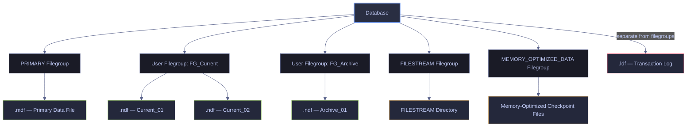
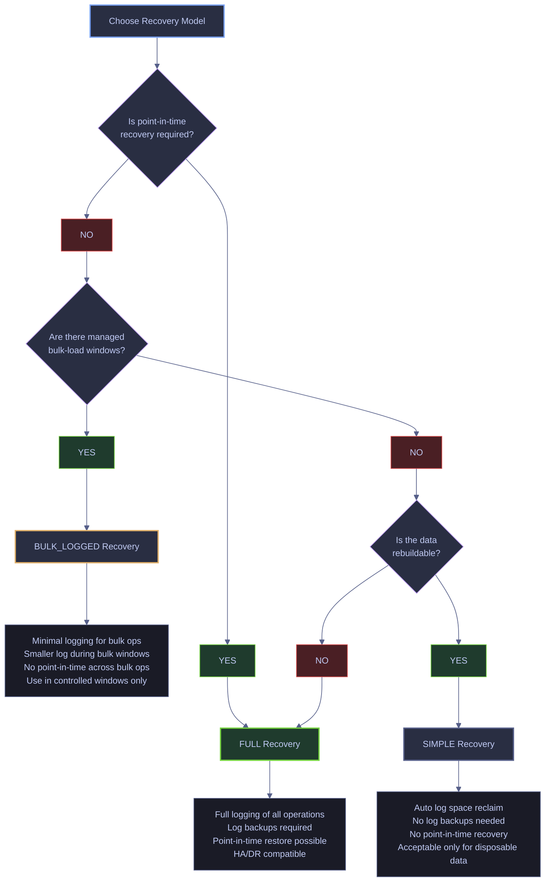

# Database Creation and File Layout

Creating a database is a design act, not a syntactic one. Every decision encoded in `CREATE DATABASE` — physical layout, collation, recovery model, growth policy, observability — becomes an operational constraint the moment the first byte is written. This note walks through those decisions and illustrates each one against a live reference database, `stoxx_db`, created on the same SQL Server 2022 instance using the full baseline pattern documented later in this note. Every DMV output on this page is captured from that live environment so the reader can execute each query directly on an existing database rather than reading abstract syntax.

> [!info] Live demo environment
>
> All demonstrations in this note run against two databases on the same SQL Server 2022 CU23 (Developer Edition, Linux container) instance:
>
> - **`stoxx_db`** — purpose-built for this note using the production baseline pattern: 5 files across 3 filegroups (`PRIMARY`, `FG_Current`, `FG_Archive`), pre-sized, fixed-growth, UTF-8 collation, `FULL` recovery, RCSI + snapshot isolation, Query Store enabled, and an initialized backup chain. This is the "correct" example.
> - **`stoxx`** — an older working database created with default settings. It is used throughout the note as the "defaults everywhere" counter-example to highlight what the production pattern is protecting against.

## What “Creating a Database” Actually Means

At a superficial level, creating a database means issuing a statement such as the following template:

*Template showing the minimal default syntax. Every setting — file layout, sizes, growth, collation, recovery — inherits from the `model` database.*

```sql
CREATE DATABASE [MyDatabase];
```

```text
Commands completed successfully.
```

The statement runs in under a second and returns no rows. That silence is deceptive: every one of the decisions listed below has already been made implicitly, using whatever `model` currently specifies. On a default-model instance this produces a single 8 MB `.mdf`, a 1 MB `.ldf`, 10% autogrowth on the log, and instance-default collation — all of which are usually wrong for production. The stoxx database on this instance was created this way, and its defaults surface in every comparison query later on this page.

At a professional level, creating a database means defining all of the following:

1. **Creation path**
   - Brand-new empty database
   - Attached database
   - Snapshot
   - Contained database

2. **Physical layout**
   - Data files
   - Log files
   - Filegroups
   - File locations
   - Initial sizes
   - Growth settings
   - Maximum sizes

3. **Behavioral defaults**
   - Collation
   - Recovery model
   - Compatibility level
   - Snapshot behavior
   - Read/write concurrency behavior
   - Query Store behavior

4. **Operational baseline**
   - Ownership
   - Encryption approach
   - Backup chain initialization
   - Monitoring expectations
   - Capacity planning
   - Growth forecasting

> [!warning] Design is permanent
>
> A database is a long-lived operational object, not just a container for tables. Poor creation-time decisions produce years of avoidable operational pain: fragmentation, blocking, slow recovery, poor restore behavior, runaway storage growth, and migration problems.

> [!success] Decide before executing
>
> Treat `CREATE DATABASE` as a design artifact, not a shortcut. Finalize workload classification, RPO/RTO, file placement, sizing, collation, recovery model, and operational baseline before running the statement. The day-one layout constrains every operational decision that follows.

> [!tip] Right question
>
> The correct question is not “How do I create a database?” but “What kind of database am I creating, for what workload, under what recovery and operational constraints?”

---

## Core Concepts Glossary

This section defines the terms that must be understood before making any storage or configuration decision. Every term is followed by a live query against `stoxx_db` (or against both `stoxx_db` and `stoxx` for comparison) so the reader can map the definition directly to what a real SQL Server instance returns. Concepts that have a full dedicated H2 later in the note (recovery model, collation, compatibility level, Query Store, FILESTREAM, MEMORY_OPTIMIZED_DATA) are defined here and their live demonstrations appear in those dedicated sections.

### Page | fundamental 8 KB unit of storage and I/O

A **page** is the fundamental unit of storage in SQL Server.

- Size: **8 KB**
- Tables and indexes are ultimately stored in pages.
- Reads and writes happen against pages, not arbitrary byte ranges.


When SQL Server reads data from disk into memory, it reads pages. When it modifies stored data, it modifies pages in memory and later flushes them to disk. This is why page density, fragmentation, and I/O behavior matter so much.

If a query needs a row that lives on a page not already in memory, SQL Server must read that page from disk into the buffer pool. A single 8 KB page can hold many rows for a narrow table or just a handful for a wide one, and that ratio drives how many physical reads a scan or seek actually costs.

> [!info]- Clause-by-clause breakdown
>
> - `sys.dm_db_index_physical_stats` returns per-level allocation and density statistics for an index or heap.
> - `DB_ID()` targets the current database (`stoxx_db`).
> - `OBJECT_ID('silver.eurostoxx50_ohlcv')` points at a real ~67 k-row table in `FG_Current`.
> - The third argument `NULL` asks for every index on the object; the fourth `NULL` asks for every partition.
> - `'DETAILED'` forces a full scan so row-level density is measured, not estimated.
> - `index_level = 0` restricts the result to the leaf level — the pages that actually hold the rows.
> - `avg_page_space_used_in_percent` is the average fill factor per page; values near 100% indicate a nearly-full page and maximum payload density.
> - `page_count * 8 / 1024` converts the leaf page count into megabytes so the output aligns with filesystem thinking.

*Measure how many 8 KB pages hold a real table, how densely filled each page is, and how that translates into on-disk size.*

```sql
USE [stoxx_db];
GO

SELECT TOP 1
    OBJECT_NAME(object_id) AS tbl,
    index_level,
    page_count,
    record_count,
    CAST(avg_page_space_used_in_percent AS decimal(5,2)) AS avg_page_fill_pct,
    CAST((page_count * 8.0) / 1024 AS decimal(10,2)) AS leaf_size_mb
FROM sys.dm_db_index_physical_stats(DB_ID(), OBJECT_ID('silver.eurostoxx50_ohlcv'), NULL, NULL, 'DETAILED')
WHERE index_level = 0;
```

| tbl | index_level | page_count | record_count | avg_page_fill_pct | leaf_size_mb |
|---|---:|---:|---:|---:|---:|
| eurostoxx50_ohlcv | 0 | 894 | 67155 | 98.42 | 6.98 |

*The 67 155 rows of `silver.eurostoxx50_ohlcv` are stored in 894 leaf pages. Each page holds on average ~75 rows packed at 98.42% fill density. The total leaf footprint is 6.98 MB, which is what SQL Server must read when a full scan of this table is necessary. A hypothetical query touching every row therefore demands ~894 page reads; at the 8 KB unit this is 7 MB of I/O regardless of how the rows are returned to the client.*

| Column | Value | Watch | Meaning | Implication |
|---|---|---|---|---|
| `index_level` | `0` | &#9989; | Leaf level of a heap or clustered index. | These are the pages that hold the actual data rows. |
| `avg_page_fill_pct` | `≥ 95%` | &#9989; | Very dense pages. | Excellent storage efficiency; no room for in-place updates before page splits. |
| `avg_page_fill_pct` | `70–90%` | &#9989; | Comfortable fill for tables that receive random inserts. | Leaves headroom for in-place updates. |
| `avg_page_fill_pct` | `< 50%` | &#10060; | Low density. | Indicates over-aggressive fill factor, heavy fragmentation, or rows recently deleted but still ghosted. |

### Extent | group of 8 contiguous pages forming a 64 KB allocation unit

An **extent** is a group of **8 contiguous pages**, for a total of **64 KB**.

- Size: **64 KB**
- SQL Server allocates space primarily in extents.


Many file, storage, and formatting recommendations are tied to 64 KB because this is a natural SQL Server allocation boundary.

When a table grows and needs more space, SQL Server allocates additional extents rather than allocating storage one row at a time. On modern versions (2016+), new user objects start in uniform extents immediately, which means the eight pages of an extent all belong to the same object rather than being shared with other small tables.

> [!info]- Clause-by-clause breakdown
>
> - `sys.partitions` returns one row per heap or index partition.
> - `sys.allocation_units` exposes the on-disk footprint of each partition broken down by allocation unit type.
> - `a.type = 1` filters to `IN_ROW_DATA` allocation units — the main rowstore pages for the heap or clustered index.
> - `total_pages / 8` converts pages to extents, since one extent always equals eight contiguous pages.
> - `total_pages * 8 / 1024` converts pages to megabytes for readability.

*Show how many extents back three real tables of different sizes in `stoxx_db`.*

```sql
USE [stoxx_db];
GO

SELECT
    OBJECT_SCHEMA_NAME(p.object_id) AS [schema],
    OBJECT_NAME(p.object_id)        AS tbl,
    a.total_pages,
    a.total_pages / 8               AS extents,
    CAST(a.total_pages * 8.0 / 1024 AS decimal(10,2)) AS size_mb
FROM sys.partitions       p
JOIN sys.allocation_units a ON a.container_id = p.partition_id
WHERE p.object_id IN (
        OBJECT_ID('silver.eurostoxx50_ohlcv'),
        OBJECT_ID('silver.stoxxusa50_ohlcv'),
        OBJECT_ID('bronze.trading_calendar'))
  AND p.index_id IN (0, 1)
  AND a.type = 1
ORDER BY a.total_pages DESC;
```

| schema | tbl | total_pages | extents | size_mb |
|---|---|---:|---:|---:|
| silver | eurostoxx50_ohlcv | 986 | 123 | 7.70 |
| silver | stoxxusa50_ohlcv | 946 | 118 | 7.39 |
| bronze | trading_calendar | 178 | 22 | 1.39 |

*The 7.70 MB of `silver.eurostoxx50_ohlcv` is divided into exactly 123 extents of 8 pages each plus a small remainder. The 64 KB extent boundary is not an abstraction: it is the unit SQL Server uses when it asks the allocation maps for more space, and it is also the unit recommended for Windows NTFS allocation size on SQL Server volumes (`64K` cluster size). The ratio `page_count / 8` rounded down gives the complete-extent count; residual pages are always less than a full extent.*

### Data file | physical file storing table and index data

A **data file** is a physical file that stores table and index data.

Common file extensions:
- `.mdf` = primary data file
- `.ndf` = secondary data file

**Context and implications:**
- Data files store user objects such as tables and indexes.
- They also indirectly determine where I/O pressure lands.
- Data files belong to filegroups.
- A database must have at least one data file.

A small application database might have one primary data file only. A large warehouse might have multiple secondary data files spread across user-defined filegroups. `stoxx_db` sits between these extremes: four data files across three filegroups, which already exercises every data-file concept the note discusses without being so large that the examples become unwieldy.

> [!info]- Clause-by-clause breakdown
>
> - `sys.database_files` is a database-scoped catalog view that returns one row per file belonging to the current database.
> - `type_desc = 'ROWS'` filters to data files only (as opposed to the log, filestream, or full-text file types).
> - `size / 128.0` converts the internal 8 KB page count to megabytes.
> - `FILEPROPERTY(name, 'SpaceUsed')` returns the number of pages currently holding data inside the file — the *used* portion inside the allocated footprint.
> - Subtracting `SpaceUsed` from `size` gives the free space inside the file that has already been claimed from the OS but is not yet carrying rows.

*List every data file in `stoxx_db` with its allocated size, currently used size, and remaining free space.*

```sql
USE [stoxx_db];
GO

SELECT
    file_id,
    name                                                                 AS logical_name,
    physical_name,
    CAST(size / 128.0 AS decimal(10,2))                                  AS allocated_mb,
    CAST(FILEPROPERTY(name,'SpaceUsed') / 128.0 AS decimal(10,2))        AS used_mb,
    CAST((size - FILEPROPERTY(name,'SpaceUsed')) / 128.0 AS decimal(10,2)) AS free_mb
FROM sys.database_files
WHERE type_desc = 'ROWS'
ORDER BY file_id;
```

| file_id | logical_name | physical_name | allocated_mb | used_mb | free_mb |
|---:|---|---|---:|---:|---:|
| 1 | stoxx_db_Primary | /var/opt/mssql/data/stoxx_db_Primary.mdf | 128.00 | 4.25 | 123.75 |
| 3 | stoxx_db_Current_01 | /var/opt/mssql/data/stoxx_db_Current_01.ndf | 256.00 | 15.75 | 240.25 |
| 4 | stoxx_db_Current_02 | /var/opt/mssql/data/stoxx_db_Current_02.ndf | 256.00 | 13.94 | 242.06 |
| 5 | stoxx_db_Archive_01 | /var/opt/mssql/data/stoxx_db_Archive_01.ndf | 128.00 | 1.19 | 126.81 |

*Four data files are visible: the mandatory `PRIMARY` file (`file_id = 1`), two files in `FG_Current` (`Current_01` and `Current_02`), and one file in `FG_Archive`. The two `FG_Current` files have nearly identical used sizes (15.75 MB and 13.94 MB) even though all data was inserted through `SELECT INTO` without any hint — this is the **proportional fill algorithm** in action. When a filegroup contains multiple files, SQL Server splits new allocations between them proportionally to their free space, which is why pre-sizing sibling files identically and enabling `AUTOGROW_ALL_FILES` matters.*

### Transaction log file | sequential record of all data changes for durability and recovery

A **transaction log file** is a physical file that stores the transaction log.

Common file extension:
- `.ldf`

**Context and implications:**
The log is not just “another file.” It is central to durability, crash recovery, high availability, replication patterns, and restore operations.

The log records changes in sequence before they are considered durable. This means:
- every insert, update, and delete depends on it
- recovery depends on it
- log backups depend on it
- availability technologies depend on it

An OLTP system with heavy write volume may have modest data growth but intense log pressure. In such a system, log sizing and log storage latency can matter more than raw data-file size. The log is therefore the single most important file to pre-size correctly.

> [!info]- Clause-by-clause breakdown
>
> - `sys.database_files` is filtered to `type_desc = 'LOG'` to return only transaction log files.
> - `sys.dm_db_log_space_usage` reports real-time log footprint for the current database.
> - `total_log_size_in_bytes / 1048576.0` converts bytes to megabytes.
> - `used_log_space_in_percent` is the share of the currently allocated log that contains unreusable log records.
> - `log_reuse_wait_desc` (from `sys.databases`) explains why log space cannot currently be reclaimed if `used_log_pct` is unexpectedly high.

*Show the transaction log file of `stoxx_db` and report how much of it is currently occupied by unreusable log records.*

```sql
USE [stoxx_db];
GO

SELECT
    f.file_id,
    f.name AS logical_name,
    f.physical_name,
    CAST(f.size / 128.0 AS decimal(10,2)) AS allocated_mb,
    CAST(ls.used_log_space_in_bytes / 1048576.0 AS decimal(10,2)) AS used_mb,
    CAST(ls.used_log_space_in_percent AS decimal(5,2)) AS used_pct,
    d.log_reuse_wait_desc
FROM sys.database_files f
CROSS JOIN sys.dm_db_log_space_usage ls
JOIN sys.databases d ON d.database_id = DB_ID()
WHERE f.type_desc = 'LOG';
```

| file_id | logical_name | physical_name | allocated_mb | used_mb | used_pct | log_reuse_wait_desc |
|---:|---|---|---:|---:|---:|---|
| 2 | stoxx_db_Log | /var/opt/mssql/data/stoxx_db_Log.ldf | 256.00 | 0.95 | 0.37 | NOTHING |

*The log is 256 MB pre-allocated (per the baseline template) but only 0.95 MB is currently in use — a healthy state immediately after the initial full backup. `log_reuse_wait_desc = NOTHING` means there is no condition holding back log truncation: no long-running transaction, no pending replication read, no availability-group lag, no missing log backup. The log is free to reclaim space on the next checkpoint. In a healthy `FULL`-recovery database, the common reuse waits to watch for are `LOG_BACKUP` (waiting for the next log backup), `ACTIVE_TRANSACTION` (an unfinished transaction is pinning log), and `REPLICATION` or `DATABASE_MIRRORING`.*

| Column | Value | Watch | Meaning | Implication |
|---|---|---|---|---|
| `used_pct` | `< 10%` | &#9989; | Log reuse is working and the log is barely used. | Normal baseline for a database at rest. |
| `used_pct` | `10–70%` | &#9989; | Log is tracking workload cycles. | Normal during active work between log backups. |
| `used_pct` | `> 85%` | &#10060; | Log is filling up. | Investigate `log_reuse_wait_desc` immediately; a full log blocks all writes. |
| `log_reuse_wait_desc` | `NOTHING` | &#9989; | No condition is holding back truncation. | Healthy. |
| `log_reuse_wait_desc` | `LOG_BACKUP` | ⚠ | Waiting for the next log backup. | Acceptable in `FULL` recovery if log backups are scheduled; alarming if they are not. |
| `log_reuse_wait_desc` | `ACTIVE_TRANSACTION` | &#10060; | A long-running transaction is keeping log pinned. | Find and kill or commit the culprit transaction. |
| `log_reuse_wait_desc` | `OLDEST_PAGE` | ⚠ | Indirect checkpoint is holding the oldest dirty page. | Common on databases with `TARGET_RECOVERY_TIME`; rarely an actionable alert. |
| `log_reuse_wait_desc` | `AVAILABILITY_REPLICA` | &#10060; | A secondary replica has not yet hardened the log. | Investigate AG lag and network health. |

> [!warning] Log ≠ data file
>
> Treating the log as if it were just another data file is a major design mistake. Log I/O patterns and growth behavior are different from data files, so placement and sizing must be handled differently.

> [!success] Log isolation
>
> Place the transaction log on dedicated low-latency storage, size it for peak burst separately from data files, and use fixed-size growth increments. Monitor log reuse waits and VLF counts independently.

### Primary data file | mandatory single .mdf containing database metadata

The **primary data file** is the single main data file of the database.

- Every database has exactly one.
- It belongs to the **PRIMARY** filegroup.
- It contains core metadata required by the database.


Even in sophisticated filegroup designs, the primary file remains special. You cannot build a database entirely out of secondary files.

> [!info]- Clause-by-clause breakdown
>
> - The filter `file_id = 1` targets the primary data file regardless of its logical name.
> - `sys.filegroups` is joined so the query confirms the primary file belongs to `PRIMARY`.
> - `size / 128.0` converts the 8 KB-page value to megabytes.

*Return the primary data file of `stoxx_db` and confirm its filegroup membership.*

```sql
USE [stoxx_db];
GO

SELECT
    f.file_id,
    f.name          AS logical_name,
    f.physical_name,
    CAST(f.size / 128.0 AS decimal(10,2)) AS size_mb,
    fg.name         AS filegroup_name,
    fg.is_default
FROM sys.database_files f
JOIN sys.filegroups     fg ON f.data_space_id = fg.data_space_id
WHERE f.file_id = 1;
```

| file_id | logical_name | physical_name | size_mb | filegroup_name | is_default |
|---:|---|---|---:|---|---:|
| 1 | stoxx_db_Primary | /var/opt/mssql/data/stoxx_db_Primary.mdf | 128.00 | PRIMARY | 0 |

*The primary file always has `file_id = 1` and always belongs to the `PRIMARY` filegroup. In `stoxx_db` it is intentionally small (128 MB) because the production pattern promotes `FG_Current` as the default filegroup (`is_default = 1` in the full file listing above), so user tables do not land in `PRIMARY`. `PRIMARY` only carries the database metadata, system catalog views, and other engine structures. The `is_default = 0` value on this row confirms that no new user object created without an `ON` clause will be placed on the primary file.*

### Secondary data file | additional .ndf files for capacity and tiering

A **secondary data file** is any data file beyond the primary one.

**Why secondary files exist:**
- To increase storage capacity
- To separate data across filegroups
- To support partitioning strategies
- To place different data sets on different storage tiers
- To distribute allocation or I/O pressure in specific scenarios

A warehouse database might place hot partitions in one filegroup on fast SSD storage and cold historical partitions in another filegroup on cheaper storage. `stoxx_db` is structured the same way on a small scale: bronze and silver tables live in `FG_Current` (two sibling files for proportional fill), and the gold layer lives in `FG_Archive` (one file intended for eventual storage-tier migration).

> [!info]- Clause-by-clause breakdown
>
> - `file_id > 1` excludes the primary data file and the log file (which has a distinct file_id outside the ROWS sequence).
> - `type_desc = 'ROWS'` keeps only data files.
> - The join to `sys.filegroups` resolves the filegroup each secondary file belongs to.

*List every secondary data file (`.ndf`) in `stoxx_db` and show which filegroup it belongs to.*

```sql
USE [stoxx_db];
GO

SELECT
    f.file_id,
    f.name         AS logical_name,
    f.physical_name,
    fg.name        AS filegroup_name,
    CAST(f.size / 128.0 AS decimal(10,2)) AS size_mb
FROM sys.database_files f
JOIN sys.filegroups     fg ON f.data_space_id = fg.data_space_id
WHERE f.type_desc = 'ROWS'
  AND f.file_id  > 1
ORDER BY fg.name, f.file_id;
```

| file_id | logical_name | physical_name | filegroup_name | size_mb |
|---:|---|---|---|---:|
| 5 | stoxx_db_Archive_01 | /var/opt/mssql/data/stoxx_db_Archive_01.ndf | FG_Archive | 128.00 |
| 3 | stoxx_db_Current_01 | /var/opt/mssql/data/stoxx_db_Current_01.ndf | FG_Current | 256.00 |
| 4 | stoxx_db_Current_02 | /var/opt/mssql/data/stoxx_db_Current_02.ndf | FG_Current | 256.00 |

*Three secondary data files back `stoxx_db`: two in `FG_Current` and one in `FG_Archive`. The two `FG_Current` files are intentionally sized identically (256 MB each) because the proportional fill algorithm only distributes data evenly when sibling files are the same size with the same growth settings. Running the same query against `stoxx` returns zero rows — that database was created with the default template and has no secondary files at all. In a warehouse context, the `FG_Archive` file could be moved later to cheaper storage without touching the primary or `FG_Current` files, because filegroup placement is the unit of storage-tier migration.*

### Filegroup | logical container grouping one or more data files

A **filegroup** is a logical container for one or more data files.

**Why filegroups matter:**
Filegroups are not just administrative labels. They are used to control:
- object placement
- partition placement
- piecemeal restore strategy
- read-only archive design
- backup and restore planning in enterprise environments

You might create:
- `PRIMARY` for metadata and small core objects
- `FG_Current` for active operational data
- `FG_Archive_2024` for older read-only partitions

`stoxx_db` implements exactly this pattern on a smaller scale: three filegroups where `PRIMARY` carries only metadata, `FG_Current` holds bronze and silver tables, and `FG_Archive` carries the gold layer destined for eventual cold storage.

> [!info]- Clause-by-clause breakdown
>
> - `sys.filegroups` returns one row per filegroup in the current database.
> - `type_desc` distinguishes rowstore filegroups from `FILESTREAM` and `MEMORY_OPTIMIZED_DATA` groups.
> - `is_default` marks the filegroup that receives new objects when no explicit `ON` clause is used at `CREATE TABLE` or `CREATE INDEX` time.
> - `is_read_only` marks filegroups that have been sealed for read-only workloads; new writes will fail if directed there.

*Enumerate every filegroup in `stoxx_db` with its role and default/read-only state.*

```sql
USE [stoxx_db];
GO

SELECT
    name AS filegroup_name,
    type_desc,
    is_default,
    is_read_only
FROM sys.filegroups
ORDER BY data_space_id;
```

| filegroup_name | type_desc | is_default | is_read_only |
|---|---|---:|---:|
| PRIMARY | ROWS_FILEGROUP | 0 | 0 |
| FG_Current | ROWS_FILEGROUP | 1 | 0 |
| FG_Archive | ROWS_FILEGROUP | 0 | 0 |

*Three filegroups exist. `PRIMARY` is present and mandatory but is **not** the default (`is_default = 0`) — that title was explicitly transferred to `FG_Current` via `ALTER DATABASE stoxx_db MODIFY FILEGROUP [FG_Current] DEFAULT` during post-creation configuration. `FG_Archive` is a regular user-defined filegroup, neither default nor yet marked read-only. The same query against `stoxx` returns a single row, `PRIMARY`, because no user filegroups were ever created — which is the main architectural gap of a default-created database.*

### Default filegroup | target for new objects when none is specified

The **default filegroup** is where new objects are created if no filegroup is explicitly specified.


If you define multiple filegroups but forget to manage the default filegroup, objects may still land in the wrong location.

You may create a dedicated application filegroup and set it as default so new tables do not end up in `PRIMARY`. The command used on `stoxx_db` after creation was:

```sql
ALTER DATABASE [stoxx_db] MODIFY FILEGROUP [FG_Current] DEFAULT;
```

```text
The filegroup property 'DEFAULT' has been set.
```

> [!info]- Clause-by-clause breakdown
>
> - The join between `sys.tables` and `sys.indexes` links each user table to its clustered index (or heap entry where `index_id = 0`).
> - `i.data_space_id` identifies the filegroup on which the heap/clustered index actually lives.
> - `sys.filegroups` resolves that `data_space_id` into a human-readable filegroup name.
> - The query then compares the placement of each table to the default filegroup to verify that automatic placement is working as intended.

*Show where every user table in `stoxx_db` was physically placed, and confirm that bronze/silver tables landed on the default filegroup while gold tables were explicitly targeted at `FG_Archive`.*

```sql
USE [stoxx_db];
GO

SELECT
    OBJECT_SCHEMA_NAME(t.object_id) AS [schema],
    t.name                          AS table_name,
    fg.name                         AS on_filegroup,
    fg.is_default                   AS filegroup_is_default
FROM sys.tables     t
JOIN sys.indexes    i ON i.object_id = t.object_id AND i.index_id IN (0, 1)
JOIN sys.filegroups fg ON fg.data_space_id = i.data_space_id
ORDER BY [schema], table_name;
```

| schema | table_name | on_filegroup | filegroup_is_default |
|---|---|---|---:|
| bronze | dim_country | FG_Current | 1 |
| bronze | eurostoxx50_ohlcv | FG_Current | 1 |
| bronze | trading_calendar | FG_Current | 1 |
| gold | index_performance | FG_Archive | 0 |
| gold | scores_daily | FG_Archive | 0 |
| gold | scores_quarterly | FG_Archive | 0 |
| silver | eurostoxx50_ohlcv | FG_Current | 1 |
| silver | stoxxusa50_ohlcv | FG_Current | 1 |

*Every bronze and silver table was created via `SELECT * INTO stoxx_db.<schema>.<table>` without any explicit placement hint, and each one landed on `FG_Current` because that filegroup carries the `is_default = 1` flag. The three gold tables were explicitly moved to `FG_Archive` after creation. The takeaway: the default filegroup is the silent contract with every `CREATE TABLE` statement that omits an `ON` clause. Forgetting to configure it means every application object lands in `PRIMARY`, polluting the metadata filegroup with user data.*

### Logical file name | internal identifier used by management commands

The **logical file name** is SQL Server’s internal name for the file.


Administrative commands often refer to logical file names rather than physical paths. The logical name is stable: renaming the underlying file on disk does not change it, and restoring the database on a different host preserves it even when `FILENAME` is rewritten by the restore.

This command uses a logical file name to modify a real file in `stoxx_db`. `ALTER DATABASE ... MODIFY FILE` is silent on success, so instead of reading an output message the administrator verifies the change by re-querying `sys.database_files`:

*Change the autogrowth increment for an existing data file by referencing its logical name, then immediately confirm the new setting.*

```sql
ALTER DATABASE [stoxx_db]
MODIFY FILE (NAME = stoxx_db_Current_01, FILEGROWTH = 256MB);

SELECT name, CAST(growth / 128.0 AS decimal(10,2)) AS growth_mb
FROM sys.database_files
WHERE name = 'stoxx_db_Current_01';
```

| name | growth_mb |
|---|---:|
| stoxx_db_Current_01 | 256.00 |

*The growth increment now reads 256 MB. A restart is **not** required — the new value takes effect on the next autogrowth event. Reverting the change back to the baseline 128 MB is done the same way by issuing a second `MODIFY FILE` statement and querying again.*

> [!info]- Clause-by-clause breakdown
>
> - `sys.database_files` exposes every file in the current database including the log.
> - `f.name` is the logical name — the identifier used by every `ALTER DATABASE MODIFY FILE` command.
> - The query deliberately retrieves both the logical name and the physical path side by side to prevent confusion between the two.

*List the logical name of every file in `stoxx_db` alongside its physical path.*

```sql
USE [stoxx_db];
GO

SELECT
    file_id,
    name          AS logical_name,
    physical_name
FROM sys.database_files
ORDER BY file_id;
```

| file_id | logical_name | physical_name |
|---:|---|---|
| 1 | stoxx_db_Primary | /var/opt/mssql/data/stoxx_db_Primary.mdf |
| 2 | stoxx_db_Log | /var/opt/mssql/data/stoxx_db_Log.ldf |
| 3 | stoxx_db_Current_01 | /var/opt/mssql/data/stoxx_db_Current_01.ndf |
| 4 | stoxx_db_Current_02 | /var/opt/mssql/data/stoxx_db_Current_02.ndf |
| 5 | stoxx_db_Archive_01 | /var/opt/mssql/data/stoxx_db_Archive_01.ndf |

*Each row shows the logical name on the left (what `ALTER DATABASE` expects) and the physical path on the right (what the operating system sees). The logical names were chosen at `CREATE DATABASE` time to make their role self-documenting: `stoxx_db_Primary` is the metadata file, `stoxx_db_Current_01/02` are the sibling files of `FG_Current`, `stoxx_db_Archive_01` is the cold-storage file, and `stoxx_db_Log` is the transaction log. Administrative clarity starts with good logical names — a file called `db_01` tells you nothing about its role on restore day.*

### Physical file path | OS path controlling I/O location and permissions

The **physical file path** is the operating system path to the file.


The physical path determines:
- where I/O occurs
- which storage tier is used
- which permissions are required
- how restores, migrations, and failovers behave

On the `stoxx_db` instance every file lives at `/var/opt/mssql/data/` because SQL Server is running inside a Linux container and that is the only mount point exposed to the engine. In a production Windows environment, data, log, TempDB, and backups would each occupy a separate drive letter backed by a different physical volume — the container layout compresses these distinctions but does not change the concept.

> [!info]- Clause-by-clause breakdown
>
> - `sys.database_files` exposes `physical_name` directly — no join needed.
> - `STRING_SPLIT` with `ordinal = 1` would extract the path prefix if necessary; here a simpler approach is shown using `LEFT` and `CHARINDEX` to isolate the directory.

*Show the directory prefix, file name, and extension for each file in `stoxx_db` so the reader can see how the OS-level layout maps to the logical roles.*

```sql
USE [stoxx_db];
GO

SELECT
    name                                                                             AS logical_name,
    LEFT(physical_name, LEN(physical_name) - CHARINDEX('/', REVERSE(physical_name))) AS directory_path,
    RIGHT(physical_name, CHARINDEX('/', REVERSE(physical_name)) - 1)                 AS file_name,
    RIGHT(physical_name, CHARINDEX('.', REVERSE(physical_name)) - 1)                 AS extension
FROM sys.database_files
ORDER BY file_id;
```

| logical_name | directory_path | file_name | extension |
|---|---|---|---|
| stoxx_db_Primary | /var/opt/mssql/data | stoxx_db_Primary.mdf | mdf |
| stoxx_db_Log | /var/opt/mssql/data | stoxx_db_Log.ldf | ldf |
| stoxx_db_Current_01 | /var/opt/mssql/data | stoxx_db_Current_01.ndf | ndf |
| stoxx_db_Current_02 | /var/opt/mssql/data | stoxx_db_Current_02.ndf | ndf |
| stoxx_db_Archive_01 | /var/opt/mssql/data | stoxx_db_Archive_01.ndf | ndf |

*All five files share the same `/var/opt/mssql/data` directory because the container exposes a single volume. The extensions visually reinforce the role of each file: `.mdf` for the primary data file, `.ldf` for the transaction log, and `.ndf` for every secondary data file. These extensions are convention, not enforcement — SQL Server will accept any extension — but following the convention makes file-system inventory and monitoring scripts far easier to write.*

### Autogrowth | automatic file enlargement when allocated space is exhausted

**Autogrowth** is the mechanism by which SQL Server automatically enlarges a file when its currently allocated space is exhausted.

That short definition is not enough. The operational meaning is the important part.

**What autogrowth actually implies:**
- SQL Server ran out of allocated space inside the current file.
- Work cannot continue indefinitely unless more space is allocated.
- SQL Server must request more disk space from the operating system.
- That growth event can pause or slow user activity.
- For log files, growth can be especially disruptive because new log space must be zero-initialized.

**What autogrowth is not:**
- It is not a sizing strategy.
- It is not a substitute for capacity planning.
- It is not a sign that configuration is “dynamic and smart.”

**Default `FILEGROWTH` values by SQL Server version:**

| Version | Data File Default | Log File Default |
|---|---|---|
| SQL Server 2016+ | 64 MB | 64 MB |
| SQL Server 2005–2014 | 1 MB | 10% |
| Prior to SQL Server 2005 | 10% | 10% |

These defaults are almost always too small for production workloads.

**Why autogrowth matters so much:**
1. **Performance impact**
   - File growth events consume time and I/O.
   - Large growth events can stall activity.
   - During a growth event, sessions attempting to write to the file are blocked with wait type `PREEMPTIVE_OS_WRITEFILEGATHER`.

2. **Operational signal**
   - Frequent autogrowth means your initial sizing is wrong or workload growth is unmanaged.

3. **Fragmentation risk**
   - Repeated growth can lead to less contiguous allocation at the storage layer.

4. **Log-specific risk**
   - Repeated small log growth events create too many VLFs.

A log file starts at 1 GB and grows by 10 MB every few minutes during ETL. That may seem harmless, but after enough growth events you can end up with excessive VLF fragmentation and slower recovery.

> [!info]- Clause-by-clause breakdown
>
> - `sys.database_files` exposes `growth` and `is_percent_growth` side by side.
> - When `is_percent_growth = 0`, `growth` is a count of 8 KB pages; dividing by 128 converts to megabytes.
> - When `is_percent_growth = 1`, `growth` is already the percent value (e.g., `10` means 10%).
> - The `CASE` expression normalizes both modes into a single human-readable column so a mixed database can be reviewed at a glance.

*Compare the autogrowth settings of every file across `stoxx_db` and `stoxx` to see what pre-sizing with fixed growth looks like versus the legacy defaults.*

```sql
SELECT
    DB_NAME(database_id) AS database_name,
    name                 AS logical_name,
    type_desc,
    CAST(size / 128.0 AS decimal(10,2)) AS initial_size_mb,
    CASE is_percent_growth
         WHEN 1 THEN CAST(growth AS varchar(20)) + '%'
         ELSE CAST(CAST(growth / 128.0 AS decimal(10,2)) AS varchar(20)) + ' MB'
    END                  AS growth_setting,
    is_percent_growth
FROM sys.master_files
WHERE DB_NAME(database_id) IN ('stoxx', 'stoxx_db')
ORDER BY database_name, file_id;
```

| database_name | logical_name | type_desc | initial_size_mb | growth_setting | is_percent_growth |
|---|---|---|---:|---|---:|
| stoxx | stoxx | ROWS | 712.00 | 64.00 MB | 0 |
| stoxx | stoxx_log | LOG | 968.00 | 64.00 MB | 0 |
| stoxx_db | stoxx_db_Primary | ROWS | 128.00 | 64.00 MB | 0 |
| stoxx_db | stoxx_db_Log | LOG | 256.00 | 128.00 MB | 0 |
| stoxx_db | stoxx_db_Current_01 | ROWS | 256.00 | 128.00 MB | 0 |
| stoxx_db | stoxx_db_Current_02 | ROWS | 256.00 | 128.00 MB | 0 |
| stoxx_db | stoxx_db_Archive_01 | ROWS | 128.00 | 64.00 MB | 0 |

*Both databases use fixed-size autogrowth increments (`is_percent_growth = 0`), which is the baseline best practice. The difference is in the **sizing**: `stoxx` inherited the 64 MB default from the `model` database template and never was tuned further, while `stoxx_db` was pre-sized so that each file has enough initial room to avoid autogrowth events during normal operation. The data file of `stoxx` grew organically from 8 MB to 712 MB by triggering dozens of 64 MB autogrowth events — exactly the "reactive firefighting" pattern the warning below describes.*

| Column | Value | Watch | Meaning | Implication |
|---|---|---|---|---|
| `is_percent_growth` | `0` | &#9989; | Fixed-size growth increments. | Predictable growth events regardless of current file size. |
| `is_percent_growth` | `1` | &#10060; | Percentage growth. | Growth events become larger and more disruptive as the file grows. |
| `growth_setting` | `64.00 MB` on a <10 GB file | &#9989; | Acceptable default. | Small databases can tolerate 64 MB increments. |
| `growth_setting` | `64.00 MB` on a 500 GB+ file | &#10060; | Far too small. | Triggers dozens of growth events per large ETL cycle. |
| `growth_setting` | `512–4096 MB` | &#9989; | Production-sized fixed increment. | Rare, predictable, monitored growth events. |

> [!warning] Not a sizing strategy
>
> Autogrowth should be treated as an emergency overflow valve, not as the normal mechanism by which production files obtain their daily working space.

> [!success] Pre-size proactively
>
> Pre-size files based on forecasted workload, use fixed growth increments (512 MB–4 GB for data, 512 MB–2 GB for log), and monitor autogrowth events. If growth events occur more than occasionally, resize proactively.

> [!tip] Healthy growth
>
> A healthy production database may still use autogrowth, but growth events should be infrequent, intentional, monitored, and sized in meaningful fixed increments.

### `MAXSIZE` | upper limit preventing unbounded file growth

**MAXSIZE** defines the upper size limit to which a file can grow.

**Context:**
Without a meaningful cap, a runaway workload can keep consuming storage until the underlying volume is exhausted. That can affect not only one database but an entire instance or host.

**Implications:**
- Protects shared storage from unbounded growth
- Forces capacity planning discipline
- Must be aligned with alerting and available disk space

A staging database may use a strict `MAXSIZE` because it is disposable and should never crowd out production storage. In `stoxx_db` every file has an explicit cap: the primary data file cannot exceed 1 GB, each `FG_Current` file cannot exceed 4 GB, the `FG_Archive` file is capped at 2 GB, and the log is capped at 2 GB.

> [!info]- Clause-by-clause breakdown
>
> - `max_size` is stored internally in 8 KB pages, so it must be divided by 128 to read it in megabytes.
> - The special value `-1` means "unlimited" for data files; the log file encodes unlimited as `268435456` (representing 2 TB of pages), which is the hard engine ceiling for a single log file.
> - The `CASE` expression normalizes both `-1` and the log-specific ceiling so the output is readable without a calculator.

*Show the MAXSIZE setting of every file in `stoxx_db` and `stoxx`, converting the internal encoding to megabytes.*

```sql
SELECT
    DB_NAME(database_id) AS database_name,
    name                 AS logical_name,
    type_desc,
    max_size             AS max_size_raw,
    CASE
        WHEN max_size = -1 THEN 'UNLIMITED'
        WHEN max_size = 268435456 THEN '2 TB (engine ceiling for log)'
        ELSE CAST(CAST(max_size / 128.0 AS decimal(18,2)) AS varchar(30)) + ' MB'
    END AS max_size_readable
FROM sys.master_files
WHERE DB_NAME(database_id) IN ('stoxx', 'stoxx_db')
ORDER BY database_name, file_id;
```

| database_name | logical_name | type_desc | max_size_raw | max_size_readable |
|---|---|---|---:|---|
| stoxx | stoxx | ROWS | -1 | UNLIMITED |
| stoxx | stoxx_log | LOG | 268435456 | 2 TB (engine ceiling for log) |
| stoxx_db | stoxx_db_Primary | ROWS | 131072 | 1024.00 MB |
| stoxx_db | stoxx_db_Log | LOG | 262144 | 2048.00 MB |
| stoxx_db | stoxx_db_Current_01 | ROWS | 524288 | 4096.00 MB |
| stoxx_db | stoxx_db_Current_02 | ROWS | 524288 | 4096.00 MB |
| stoxx_db | stoxx_db_Archive_01 | ROWS | 262144 | 2048.00 MB |

*`stoxx` illustrates the default: the data file is `UNLIMITED` (`max_size = -1`), which means it can keep growing until the entire volume is exhausted. The log file is capped at the engine ceiling of 2 TB, which is effectively the same as "no cap" in practice. `stoxx_db` uses explicit megabyte caps on every file so a runaway workload cannot consume the shared `/var/opt/mssql` volume. The caps must be high enough to hold the largest expected working set plus a safety margin, and must be combined with monitoring so that a file approaching its cap triggers an alert before the workload hits it.*

| Column | Value | Watch | Meaning | Implication |
|---|---|---|---|---|
| `max_size_raw` | `-1` | &#10060; | Unlimited data file. | File can consume the entire volume before any ceiling kicks in. |
| `max_size_raw` | `268435456` | ⚠ | Engine ceiling for the log (2 TB). | Effectively unlimited in most environments; rely on alerting instead. |
| `max_size_raw` | Explicit value | &#9989; | Bounded file. | Protects shared storage; requires monitoring to avoid hitting the cap. |

### Virtual Log File | internal subdivision of the transaction log affecting recovery and HA

A **Virtual Log File** is an internal subdivision of the transaction log.


The log is physically one or more files, but internally it is divided into VLFs. Excessive VLF counts degrade:
- startup time
- crash recovery
- restore operations
- log-scanning operations used by HA/DR features

**Operational thresholds:**

| VLF Count | Assessment | Action |
|---|---|---|
| < 200 | Healthy | No action needed |
| 200–500 | Elevated | Investigate growth history; consider pre-sizing |
| 500–1000 | High | Schedule a log rebuild (shrink + pre-size) during maintenance |
| > 1000 | Critical | Prioritize remediation — recovery and HA performance are degraded |

Check the current VLF count with `DBCC LOGINFO` or `sys.dm_db_log_info` (SQL Server 2016 SP2+).

**How SQL Server creates VLFs during growth:**

| Growth Increment | VLFs Created | Resulting VLF Size |
|---|---|---|
| < 64 MB | 4 | Growth ÷ 4 |
| 64 MB–1 GB | 8 | Growth ÷ 8 |
| > 1 GB | 16 | Growth ÷ 16 |

A 1,024 MB growth increment creates 8 VLFs of 128 MB each — a well-balanced size for most production workloads.

**What causes bad VLF counts:**
- very small log growth increments (e.g., the 1 MB default)
- repeated log autogrowth over weeks or months
- chronic undersizing of the log

**How to rebuild a fragmented transaction log:**
1. Verify no active long-running transactions (`DBCC OPENTRAN`)
2. Take a log backup to minimize active log
3. Shrink the log to the minimum (`DBCC SHRINKFILE(log_logical_name, 1)`)
4. Grow the log back in large chunks of 1,024 MB–4,096 MB to establish well-sized VLFs
5. Verify the new VLF count with `sys.dm_db_log_info`

> [!quote] Korotkevitch
>
> Do not auto-shrink transaction log files. They will grow again and affect performance when SQL Server zeroes out the file. It is better to pre-allocate the space and manage log file size manually.
>
> Source: Dmitri Korotkevitch | SQL Server Advanced Troubleshooting and Performance Tuning

A 500 GB log file grown in tiny increments over months often behaves worse operationally than a 500 GB log file that was pre-sized sensibly.

> [!info]- Clause-by-clause breakdown
>
> - `sys.dm_db_log_info(DB_ID())` returns one row per VLF in the current database's log file(s).
> - `vlf_sequence_number` is the internal VLF sequence number; `0` means the slot has never been used since allocation.
> - `vlf_active = 1` marks the VLF that currently holds the active portion of the log.
> - `vlf_status` encodes the VLF state (`0` = free, `2` = in use by active log records).
> - `vlf_size_mb` is the size in megabytes; the ideal healthy range is ~50 MB–500 MB per VLF depending on the total log footprint.

*Report the VLF layout of the `stoxx_db` transaction log and compare the total VLF count to `stoxx`.*

```sql
USE [stoxx_db];
GO

SELECT
    file_id,
    COUNT(*)                                            AS vlf_count,
    SUM(CASE vlf_active WHEN 1 THEN 1 ELSE 0 END)       AS active_vlfs,
    CAST(MIN(vlf_size_mb) AS decimal(10,2))             AS min_vlf_mb,
    CAST(AVG(vlf_size_mb) AS decimal(10,2))             AS avg_vlf_mb,
    CAST(MAX(vlf_size_mb) AS decimal(10,2))             AS max_vlf_mb
FROM sys.dm_db_log_info(DB_ID())
GROUP BY file_id;

SELECT
    DB_NAME(database_id) AS database_name,
    COUNT(*)             AS vlf_count
FROM sys.dm_db_log_info(DB_ID('stoxx_db'))
GROUP BY database_id
UNION ALL
SELECT DB_NAME(database_id), COUNT(*) FROM sys.dm_db_log_info(DB_ID('stoxx')) GROUP BY database_id;
```

| file_id | vlf_count | active_vlfs | min_vlf_mb | avg_vlf_mb | max_vlf_mb |
|---:|---:|---:|---:|---:|---:|
| 2 | 8 | 1 | 31.93 | 31.99 | 32.42 |

| database_name | vlf_count |
|---|---:|
| stoxx_db | 8 |
| stoxx | 43 |

*`stoxx_db` has exactly 8 VLFs of ~32 MB each, which is the result of pre-sizing the log at 256 MB in a single initial allocation. Per the VLF creation rules table above, a single growth increment in the 64 MB–1 GB range yields 8 VLFs of equal size — so 256 MB / 8 = 32 MB per VLF. The single "active" VLF holds the current log tail. `stoxx` has 43 VLFs because its log grew from 1 MB to 968 MB over many small autogrowth events, each creating additional VLFs of decreasing size. 43 VLFs is still well inside the healthy threshold (< 200), but the difference in tidiness between 8 uniform VLFs and 43 uneven VLFs is visible immediately.*

| Column | Value | Watch | Meaning | Implication |
|---|---|---|---|---|
| `vlf_count` | `< 200` | &#9989; | Healthy. | No action needed. |
| `vlf_count` | `200–500` | ⚠ | Elevated. | Investigate growth history; consider pre-sizing. |
| `vlf_count` | `500–1000` | &#10060; | High. | Schedule a log rebuild during maintenance. |
| `vlf_count` | `> 1000` | &#10060; | Critical. | Recovery and HA performance are degraded. |
| `active_vlfs` | `1–few` | &#9989; | Normal — a small fraction of VLFs carry the active log. | Expected. |
| `active_vlfs` | `≥ vlf_count / 2` | &#10060; | Log truncation is blocked. | Investigate `log_reuse_wait_desc`. |
| `min_vlf_mb` vs `max_vlf_mb` | Similar | &#9989; | Log was pre-sized in a single large allocation. | Ideal. |
| `min_vlf_mb` vs `max_vlf_mb` | Very different | ⚠ | Log grew in a mix of small and large events over time. | Consider a one-time log rebuild. |

### Recovery model | controls logging behavior and point-in-time restore capabilities

The **recovery model** is a database setting that determines how transactions are logged and what restore options are possible.


The recovery model is a business decision disguised as a technical setting. It determines whether you can do point-in-time recovery and how much data loss you may face after failure.

Two databases may hold similar data volumes, but the production system requires `FULL` because zero data loss is unacceptable, while a transient ETL landing zone may use `SIMPLE` because the data can be reloaded. A live query showing the recovery model of `stoxx_db` and `stoxx` appears in the dedicated [Recovery Models](#recovery-models) section below.

### Collation | defines string comparison, sort order, and encoding rules

**Collation** defines string comparison and sorting rules.

It determines:
- case sensitivity
- accent sensitivity
- sort order
- binary vs linguistic comparison behavior
- character encoding behavior in supported collations


Collation affects correctness, not just aesthetics. Different collations can change join behavior, uniqueness behavior, sort order, and interoperability with external systems.

If your database collation differs from `tempdb`, string comparisons involving temp tables may fail unless you explicitly apply `COLLATE`. A live query showing the collation of `stoxx_db`, `stoxx`, and `tempdb` appears in the dedicated [Collation](#collation) section below, including a demonstration of the UTF-8 vs legacy-collation mismatch that exists in this environment.

### Compatibility level | controls optimizer and language behavior per database

The **compatibility level** is a database-scoped setting that controls portions of query processor and language behavior.


It allows a database to run on a newer SQL Server engine while still preserving older optimizer behavior for compatibility and regression control.

After upgrading an instance to SQL Server 2022, you may choose to keep a migrated database temporarily below level 160 until testing confirms that plan changes are acceptable. A live query showing the compatibility level of `stoxx_db` and `stoxx` appears in the dedicated [Compatibility Level](#compatibility-level) section below.

### Query Store | records query text, plans, and runtime statistics over time

**Query Store** is a database-level feature that records query text, plans, and runtime statistics over time.

**Why this matters during database creation:**
Query Store is part of the database’s baseline observability. In SQL Server 2022, it also underpins several intelligent query processing and optimization features.

If performance regresses after a compatibility-level change, Query Store helps identify plan changes and can support plan forcing. A live query reading `sys.database_query_store_options` against `stoxx_db` appears in the dedicated [Query Store](#query-store) section below.

### `FILESTREAM` | file-system storage for transactionally consistent large binary objects

**FILESTREAM** allows large binary objects to be stored in the file system while remaining transactionally consistent with SQL Server.


It is not just “another file type.” It changes backup, restore, storage, and administration patterns.

*Verify whether `stoxx_db` has a FILESTREAM filegroup configured.*

```sql
USE [stoxx_db];
GO

SELECT name, type_desc, is_default, is_read_only
FROM sys.filegroups
WHERE type_desc = 'FILESTREAM_DATA_FILEGROUP';
```

```text
(0 rows affected)
```

*Zero rows means no FILESTREAM filegroup is configured on this database. `stoxx_db` holds only structured tabular data — there are no large binary payloads in the bronze/silver/gold layers that would justify FILESTREAM. Adding FILESTREAM later is possible via `ALTER DATABASE ADD FILEGROUP ... CONTAINS FILESTREAM`, but it requires instance-level FILESTREAM access to be enabled first (`sp_configure 'filestream access level'`) and a service restart.*

### `MEMORY_OPTIMIZED_DATA` | required filegroup for durable In-Memory OLTP objects

The **MEMORY_OPTIMIZED_DATA** filegroup is required for durable In-Memory OLTP objects.


A database intended to host durable memory-optimized tables must be created with the correct special-purpose filegroup design. This cannot be treated as an afterthought in production architecture.

*Verify whether `stoxx_db` has a MEMORY_OPTIMIZED_DATA filegroup configured.*

```sql
USE [stoxx_db];
GO

SELECT name, type_desc, is_default, is_read_only
FROM sys.filegroups
WHERE type_desc = 'MEMORY_OPTIMIZED_DATA_FILEGROUP';
```

```text
(0 rows affected)
```

*Zero rows means `stoxx_db` cannot host durable memory-optimized tables. Adding a MEMORY_OPTIMIZED_DATA filegroup to an existing database is done with `ALTER DATABASE ADD FILEGROUP ... CONTAINS MEMORY_OPTIMIZED_DATA`, then a second `ALTER DATABASE ADD FILE (NAME ..., FILENAME ...) TO FILEGROUP ...`. The filegroup points at a directory rather than a file; checkpoint files are created inside that directory as memory-optimized tables are populated. Once added, this filegroup cannot be dropped without dropping every memory-optimized object on it first.*

---

## Database Creation Modes

SQL Server supports multiple ways to create a database. These modes are operationally different and must not be conflated.

### `CREATE DATABASE` | create a brand-new empty database with new files

This is the standard case: create new files and initialize a new database.

**Use when:**
- creating a new application database
- creating a new warehouse or mart
- creating a staging or landing database
- creating a dev/test environment from scratch

**Core implication:**
You define the initial physical design directly.

*Template showing a new empty database created with every setting inherited from the `model` database defaults.*

```sql
CREATE DATABASE [SalesOps];
```

```text
Commands completed successfully.
```

This minimal form is syntactically valid, but rarely sufficient for production because it leaves too many critical decisions to defaults. The `stoxx` database on this instance was created using exactly this pattern, and every anti-pattern in the dedicated [Anti-Patterns](#anti-patterns) section at the bottom of the note is directly traceable to those inherited defaults.

### `FOR ATTACH` | attach existing database files to an instance

This attaches already existing database files to an instance.

**Use when:**
- reattaching a detached database
- moving a non-production database between servers
- recovering a copied database outside normal restore workflow

**Operational implications:**
- file paths must be valid
- permissions must be correct
- version compatibility must be acceptable
- TDE certificate dependencies must be met if encryption is in use

**Warning:**
Attach is not a general substitute for backup/restore in mature environments.

### `FOR ATTACH_REBUILD_LOG` | attach data files and rebuild a missing transaction log

This path is used when data files exist but the log file is missing and SQL Server is able to rebuild it.

**Use when:**
- constrained recovery scenarios
- emergency salvage of certain non-production databases

**Why this is risky:**
This is not normal operations. If you rely on this routinely, your backup strategy is already failing.

### `AS SNAPSHOT OF` | create a read-only point-in-time view of a source database

A **database snapshot** is a read-only static view of a source database at a point in time.

**Use when:**
- you need a stable read-only reference
- you want protection before a risky change
- you want to inspect production data without allowing writes

**Key implications:**
- read-only
- dependent on the source database
- not a replacement for backups

### Contained database | reduce dependency on instance-level logins and configuration

A **contained database** reduces dependency on instance-level configuration and logins.

**Use when:**
- portability matters
- database-level user independence matters
- application isolation requirements justify it

**Caution:**
Containment affects authentication and administration practices. It should be chosen intentionally, not casually.

---

## Workload Archetypes and Why They Change the Design

There is no generic “best database layout.” The correct design is workload-specific.

| Workload Type | Characteristics | Main Storage Concern | Typical Recovery Model | Common Notes |
|---|---|---|---|---|
| OLTP | Many short transactions, random I/O, concurrency | Low-latency log and balanced data layout | FULL | RCSI often considered |
| Data Warehouse | Large scans, batch loads, analytics | Large files, partition/filegroup design | FULL or BULK_LOGGED during managed bulk windows | Columnstore common |
| Hybrid / HTAP | Mixed transactional writes and analytical reads | TempDB pressure, concurrency model, mixed I/O | FULL | Query Store essential |
| Staging / ETL | Large transient loads, rebuildable data | Write throughput and fast reset | SIMPLE often | Tight caps acceptable |
| Archive | Low write rate, retention-heavy, read-mostly | Cheaper storage tiers and read-only design | FULL or SIMPLE depending restore needs | Read-only filegroups may help |
| In-Memory Specialized | Ultra-low latency or latch-sensitive workloads | Memory-optimized storage design and log planning | FULL often | Requires special design |

> [!tip] Workload first
>
> Before writing any `CREATE DATABASE` statement, identify the workload type, expected size after 6–12 months, RPO/RTO targets, peak write windows, and expected maintenance operations.

---

## Physical Storage Architecture

The physical location of files constrains performance and recovery behavior. SQL Server is heavily sensitive to storage latency and throughput.

### Storage media | NVMe, SSD, and HDD characteristics for SQL Server workloads

- **NVMe**
  - Lowest latency
  - Highest IOPS
  - Best for intense log, TempDB, and active-data workloads

- **Enterprise SSD**
  - Strong random read/write performance
  - Standard production choice for most active data files

- **Standard SSD**
  - Good for moderate workloads and many archive scenarios

- **HDD**
  - Poor for random I/O
  - Acceptable mainly for backups or colder scan-oriented storage

### File placement | match file types to storage tiers by access pattern

| File Type | Access Pattern | Placement Goal |
|---|---|---|
| Log (`.ldf`) | Mostly sequential write | Lowest latency possible, isolated from noisy random I/O where practical |
| TempDB | Heavy random read/write | Fastest practical storage |
| Active data | Mixed random read/write and scans | Fast stable storage |
| Archive data | Mostly scans, fewer writes | Lower-cost storage can be acceptable |
| Backups | Large sequential I/O | Throughput-focused separate path |

### Drive separation | why logical separation without performance isolation is illusory

“Put data and log on separate drives” is a useful rule of thumb, but the real requirement is **separate performance domains**, not just separate letters.

**Correct interpretation:**
- If different drive letters still land on the same shared congested storage, separation may be illusory.
- On modern SAN, HCI, or virtualized platforms, validate actual latency and contention rather than trusting naming conventions.

> [!warning] False isolation
>
> Logical separation without physical or performance isolation can create false confidence.

> [!success] Verify isolation
>
> Validate actual storage latency and IOPS isolation using performance counters or storage diagnostics. Confirm that different drive letters map to genuinely independent performance domains, not partitions on the same spindle or LUN.

### Instant File Initialization | skip zero-fill on data file creation and growth

**Instant File Initialization** allows data files to be created or grown without zeroing the newly allocated space.

**Why it matters:**
Without IFI, data file creation and growth can take much longer because the OS must write zeros to the new space before SQL Server can use it.

**What it affects:**
- data file creation
- data file growth
- restore operations involving data-file growth

**What it does not affect (prior to SQL Server 2022):**
- log file creation
- log file growth

> [!info] IFI for logs (2022+)
>
> Starting with SQL Server 2022, transaction log autogrowth events up to 64 MB can benefit from instant file initialization. Growth events larger than 64 MB still require zero-initialization. The default autogrowth increment for new databases in SQL Server 2016+ is 64 MB, which aligns with this threshold.

**How to enable IFI:**
Grant the `SA_MANAGE_VOLUME_NAME` permission (also known as "Perform Volume Maintenance Task") to the SQL Server service account in Local Security Policy (`secpol.msc`). Restart SQL Server for the change to take effect. In SQL Server 2016+, this permission can also be granted during the setup process.

**How to verify IFI is enabled:**
Query the `instant_file_initialization_enabled` column in `sys.dm_server_services` (available in SQL Server 2012 SP4, SQL Server 2016 SP1, and later).

> [!info]- Clause-by-clause breakdown
>
> - `sys.dm_server_services` returns one row per SQL Server-related Windows service.
> - On Windows, the engine service typically appears as `SQL Server (MSSQLSERVER)` or `SQL Server (<instance_name>)`.
> - `instant_file_initialization_enabled` returns `Y` if the service account holds the `SE_MANAGE_VOLUME_NAME` privilege, `N` otherwise.
> - On SQL Server on Linux, this DMV does not surface the engine service at all — only the Agent service is returned, because Linux does not use the same Windows privilege model.

*Check whether Instant File Initialization is enabled on the current SQL Server service.*

```sql
SELECT
    servicename,
    instant_file_initialization_enabled
FROM sys.dm_server_services;
```

| servicename | instant_file_initialization_enabled |
|---|---|
| SQL Server Agent (MSSQLSERVER) | N |

*On this Linux container instance, `sys.dm_server_services` returns only the Agent row and not the engine row — so the engine's IFI status cannot be inspected this way. The good news is that IFI is not a concept on Linux: the ext4 and XFS filesystems used by SQL Server on Linux do not zero-fill allocated space the way NTFS does, so data-file creation and growth are effectively instant without requiring the Windows `SE_MANAGE_VOLUME_NAME` privilege. On a Windows instance, the engine row would appear (e.g., `SQL Server (MSSQLSERVER)`) and the `instant_file_initialization_enabled` column would be `Y` if the service account has the "Perform Volume Maintenance Task" privilege.*

> [!warning] Log files excluded
>
> Log files cannot use IFI in SQL Server versions prior to 2022, and even in 2022+ only autogrowth events up to 64 MB benefit from instant initialization. All other log growth must be fully zero-initialized, which can stall writes until the new space is prepared.

> [!success] Pre-size the log generously
>
> Pre-size the log to cover the largest expected burst of unreusable log (peak ETL, index rebuilds, long-running transactions, replication or AG lag) so autogrowth is rare. Use fixed 512 MB–2 GB growth increments when growth does occur, and monitor autogrowth events so undersizing is caught before it impacts production writes.

---

## Files and Filegroups



### Primary data file (.mdf) | mandatory file in the PRIMARY filegroup

The primary data file:
- is mandatory
- exists exactly once per database
- belongs to `PRIMARY`
- contains required database metadata

**Recommendation:**
Keep it explicit and sensibly named.

**Example logical name:**
- `SalesOps_Primary`

### Secondary data files (.ndf) | additional files for capacity, tiering, and partitioning

Secondary data files are optional and used for:
- capacity expansion
- filegroup strategies
- partition layout
- storage-tier separation
- specific throughput or allocation patterns

**Important nuance:**
More files are not automatically better.

**Proportional fill algorithm:**
When a filegroup contains multiple data files, SQL Server distributes writes proportionally based on free space in each file. This means all files in the same filegroup should have the same initial size and the same autogrowth settings. If files are unevenly sized, SQL Server will target the file with the most free space, creating an imbalance rather than the intended distribution. Enable `AUTOGROW_ALL_FILES` on the filegroup (SQL Server 2016+) to ensure all files grow simultaneously.

> [!warning] No folklore
>
> Do not create multiple data files because “someone said SQL Server likes eight files.” File counts must solve a specific problem, not imitate folklore.

> [!success] Evidence-based files
>
> Add secondary data files only when there is a measurable need: filegroup-based partition management, storage-tier separation, or documented allocation contention. For TempDB, match data file count to logical CPU count up to 8, then increase only if contention persists.

### Transaction log files (.ldf) | sequential write-ahead log for durability and recovery

A database needs at least one log file.

**Important nuance:**
Multiple log files are usually not a performance strategy.

SQL Server writes to one log file at a time. Additional log files are generally used only as a temporary space workaround if the main log drive is full.

> [!warning] No log parallelism
>
> Multiple log files do not provide the kind of parallelism people often assume. Adding a second log file is usually a sign of an operational emergency, not a best practice.

> [!success] Single log file
>
> Use a single log file, pre-sized generously for peak burst, on the lowest-latency storage available. If the log drive fills, address the root cause (long-running transactions, missing log backups, replication lag) rather than adding a second log file.

### `PRIMARY` filegroup | mandatory group containing system tables and the .mdf

The `PRIMARY` filegroup:
- is mandatory
- contains the primary data file
- contains system tables for the database

**Professional recommendation:**
In larger systems, keep `PRIMARY` relatively clean and place user data deliberately into user-defined filegroups when there is an operational reason.

### User-defined filegroups | partition management, archival separation, and storage tiering

Use user-defined filegroups when you need:
- partition management
- archival separation
- read-only subsets
- storage tiering
- piecemeal restore planning

**Example:**
- `FG_Current`
- `FG_Archive_2024`
- `FG_Archive_2025`

### `FILESTREAM` filegroup | directory-based storage for large binary objects

A FILESTREAM filegroup is used for FILESTREAM storage.

**Operational meaning:**
- It maps to a directory structure rather than behaving like a normal rowstore data file.
- It changes administration, restore planning, and storage layout.

### `MEMORY_OPTIMIZED_DATA` filegroup | required for durable memory-optimized tables

A MEMORY_OPTIMIZED_DATA filegroup is required for durable memory-optimized objects.

**Operational meaning:**
- You cannot simply decide later that the database is “in-memory capable” without the proper storage structure.
- If In-Memory OLTP is part of the workload design, plan it at database creation time.

---

## File Specification Parameters

A database file definition typically includes several parameters. These must be understood semantically, not just memorized syntactically.

### `NAME` | logical file name used by management commands

The logical file name used internally by SQL Server.

**Why it matters:**
Management commands often use `NAME`, not the physical path.

**Example:**
*Declare the logical file name referenced by `ALTER DATABASE` and other management commands.*

```sql
NAME = SalesOps_Data01
```

### `FILENAME` | OS path determining I/O location and storage tier

The OS path to the file.

**Why it matters:**
This determines where the file lives physically and therefore where its I/O and capacity demands land.

**Example:**
*Specify the OS path where the file physically lives and where I/O will occur.*

```sql
FILENAME = 'E:\SQLData\SalesOps_Data01.ndf'
```

### `SIZE` | initial allocated space for the file

The initial allocated size of the file.

**Why it matters:**
`SIZE` defines how much space SQL Server asks the OS to allocate immediately. Good initial sizing reduces future autogrowth, fragmentation, and operational interruptions.

**Example:**
*Pre-allocate 40 GB of initial space to the file at creation time.*

```sql
SIZE = 40960MB
```

**Professional interpretation:**
A `SIZE` setting is a forecast. It says, “We expect this file to need at least this much space now or soon enough that allocating it upfront is better than growing it repeatedly later.”

### `MAXSIZE` | upper growth limit protecting shared storage

The maximum size to which the file may grow.

**Why it matters:**
It is a capacity control mechanism.

**Example:**
*Cap the file at 500 GB to prevent runaway growth from exhausting the shared volume.*

```sql
MAXSIZE = 500GB
```

**Use thoughtfully:**
- Too small: you create avoidable outages.
- Too loose: you risk consuming all shared storage.

### `FILEGROWTH` | increment size for automatic file growth events

The increment by which the file grows during autogrowth.

**Why it matters:**
`FILEGROWTH` determines how disruptive growth events are and how often they occur.

**Examples:**
*Set the autogrowth increment to a fixed size so growth events remain predictable regardless of current file size.*

```sql
FILEGROWTH = 512MB
FILEGROWTH = 4GB
```

**Professional recommendation:**
Use fixed-size increments rather than percentages in most production systems.

> [!warning] Percentage growth
>
> Percentage growth looks harmless on small files and becomes dangerous on large ones. A 10% growth event on a 2 TB file is not “small and dynamic”; it is a 200 GB storage event.

> [!success] Fixed-size increments
>
> Always use fixed-size `FILEGROWTH` increments in production. Typical ranges: 512 MB–4 GB for data files, 512 MB–2 GB for log files. This keeps growth events predictable regardless of current file size.

---

## Sizing and Growth Strategy

Autogrowth is not where sizing strategy begins. Good sizing starts with forecasting.

### Initial sizing | forecast-based pre-allocation for data and log files

Initial size should be based on:
- expected data volume
- retention window
- compression behavior
- index footprint
- peak growth bursts
- maintenance patterns
- expected runway until the next controlled resize

**Good practice:**
Size for a meaningful future window, not just for today’s row count.

**Example:**
If you expect 300 GB of net growth over the next quarter, a 5 GB initial file with autogrowth is clearly the wrong design.

### Tiny defaults | why SQL Server's default file sizes cause operational pain

Tiny defaults cause:
- repeated autogrowth
- avoidable file fragmentation
- operational noise
- greater risk of VLF problems in logs
- more frequent pauses during growth events

### Data file growth | recommended fixed-size increments by database size

Choose increments that are:
- large enough to avoid constant growth
- small enough not to create huge unnecessary reservations
- aligned with storage behavior and monitoring cadence

**Recommended ranges:**

| Database Size | `FILEGROWTH` Range | Notes |
|---|---|---|
| < 10 GB | 256–512 MB | Small databases; growth events are fast |
| 10–100 GB | 512 MB–1 GB | Standard production range |
| 100 GB–1 TB | 1–4 GB | Balances frequency against reservation |
| > 1 TB | 4–8 GB | Large databases; fewer but larger events |

Always use fixed-size increments, never percentages.

### Log file growth | zero-initialized increments sized for peak burst

Choose log increments with more care than data-file increments.

**Why:**
Log growth requires zero-initialization (IFI does not apply to log files) and directly affects write workloads. A growth event on the log can stall all write activity until the new space is zeroed.

**Recommended ranges:**

| Log Size | `FILEGROWTH` Range | Notes |
|---|---|---|
| < 5 GB | 256–512 MB | Small workloads |
| 5–50 GB | 512 MB–1 GB | Standard OLTP |
| 50–200 GB | 1–2 GB | Heavy write or ETL workloads |
| > 200 GB | 2–4 GB | Large warehouse or bulk-load scenarios |

> [!tip] 1,024 MB cap
>
> Microsoft recommends not setting `FILEGROWTH` above 1,024 MB for transaction logs. Larger growth events take longer to zero-initialize and produce fewer, oversized VLFs.

Factors to model:
- peak ETL windows
- large index rebuilds
- long-running transactions
- AG/log shipping/replication lag
- log backup frequency

### VLF strategy | pre-size the log to minimize virtual log file proliferation

The log should be pre-sized for expected bursts.

**Goal:**
Minimize repeated small growth events and avoid creating an excessive VLF count.

> [!tip] Peak burst sizing
>
> When you size the log, think in terms of the largest expected burst of unreusable log, not just the average day.

---

## Collation

Collation governs how strings are stored and compared from a linguistic and comparison-rules perspective. Collation is set at three layers — instance, database, and column — and each layer can diverge from the others. Understanding what is currently set is the first step in any collation-related troubleshooting.

### Collation inventory | inspect instance, database, and tempdb collations together

> [!info]- Clause-by-clause breakdown
>
> - `SERVERPROPERTY('Collation')` returns the instance-level collation (inherited by `master`, `model`, `msdb`, and by default `tempdb`).
> - `sys.databases.collation_name` returns the per-database collation.
> - Comparing the database collation to the `tempdb` collation predicts whether temp-table joins will require explicit `COLLATE` clauses.

*List the collation of every interesting database on the instance side by side with the instance collation and a mismatch flag against `tempdb`.*

```sql
SELECT
    SERVERPROPERTY('Collation') AS instance_collation,
    name                        AS database_name,
    collation_name              AS database_collation,
    CASE
        WHEN collation_name = (SELECT collation_name FROM sys.databases WHERE name = 'tempdb')
             THEN 'MATCH'
        ELSE 'MISMATCH'
    END                         AS tempdb_match
FROM sys.databases
WHERE name IN ('master', 'model', 'tempdb', 'stoxx', 'stoxx_db')
ORDER BY name;
```

| instance_collation | database_name | database_collation | tempdb_match |
|---|---|---|---|
| SQL_Latin1_General_CP1_CI_AS | master | SQL_Latin1_General_CP1_CI_AS | MATCH |
| SQL_Latin1_General_CP1_CI_AS | model | SQL_Latin1_General_CP1_CI_AS | MATCH |
| SQL_Latin1_General_CP1_CI_AS | stoxx | SQL_Latin1_General_CP1_CI_AS | MATCH |
| SQL_Latin1_General_CP1_CI_AS | stoxx_db | Latin1_General_100_CI_AS_SC_UTF8 | MISMATCH |
| SQL_Latin1_General_CP1_CI_AS | tempdb | SQL_Latin1_General_CP1_CI_AS | MATCH |

*The instance collation is `SQL_Latin1_General_CP1_CI_AS`, inherited from the default installation. `tempdb`, `master`, `model`, and `stoxx` all share that legacy collation. `stoxx_db` was created deliberately with the modern `Latin1_General_100_CI_AS_SC_UTF8` — case-insensitive, accent-sensitive, supplementary-character-aware, and UTF-8 encoded. The `tempdb_match` column flags the consequence: any string comparison between a `stoxx_db` column and a `#temp` table column will fail unless an explicit `COLLATE` clause is applied on one side. This is the exact failure mode the "[Silent failures](#silent-failures)" warning below refers to.*

| Column | Value | Watch | Meaning | Implication |
|---|---|---|---|---|
| `tempdb_match` | `MATCH` | &#9989; | Temp tables and database columns share a collation. | No explicit `COLLATE` clauses needed on temp-table joins. |
| `tempdb_match` | `MISMATCH` | &#10060; | Cross-collation string comparisons will fail with error 468. | Either align the database collation or use `COLLATE DATABASE_DEFAULT` on every string comparison involving temp tables. |

### Collation scope | case, accent, sort order, and encoding behavior

- case sensitivity
- accent sensitivity
- sort order
- binary vs linguistic comparison
- character encoding support in relevant collations

### Collation choice | why poor decisions cause joins, ETL, and migration failures

Poor collation choices cause:
- join inconsistencies
- temp table conflicts
- incorrect assumptions in ETL logic
- application behavior mismatches
- painful migrations later

### Common collations | SQL_Latin1, Latin1_100_UTF8, and BIN2 compared

#### `SQL_Latin1_General_CP1_CI_AS`
Legacy SQL collation.

**Context:**
Common in older environments. Often chosen for compatibility rather than modern design quality.

#### `Latin1_General_100_CI_AS_SC_UTF8`
Modern Windows collation with UTF-8 support.

**Context:**
Useful when modern multilingual text or JSON-heavy workloads benefit from UTF-8 storage semantics.

#### `Latin1_General_BIN2`
Binary collation.

**Context:**
Useful for exact binary comparisons and certain technical workloads where linguistic sorting is not desired.

### Collation vs TempDB | mismatch risks with temporary objects

If the database collation differs from `tempdb`, you can encounter string comparison errors in temporary objects.

**Example problem pattern:**
- user table in one collation
- temp table in server/tempdb collation
- string join fails unless `COLLATE` is used explicitly

> [!warning] Silent failures
>
> Collation mismatches are a classic source of hidden ETL and reporting failures.

> [!success] Match or COLLATE
>
> Match the database collation to the instance and `tempdb` collation unless there is a documented reason to diverge. When a mismatch is unavoidable, use explicit `COLLATE` clauses on every string comparison involving temp tables or cross-database joins.

---

## Recovery Models

Recovery model is one of the most consequential database settings because it controls recoverability and log behavior. Inspect the current recovery model of every database on the instance before doing any restore planning or backup-chain analysis.

### Recovery model inventory | list every database with its current recovery model and log reuse wait

> [!info]- Clause-by-clause breakdown
>
> - `sys.databases` holds one row per database with all high-level settings.
> - `recovery_model_desc` is the human-readable recovery model.
> - `log_reuse_wait_desc` identifies what is currently preventing log truncation, which is the main operational signal that a `FULL`-recovery database is being mismanaged.
> - `state_desc` confirms the database is `ONLINE`; recovery model decisions cannot be made on offline or restoring databases.

*List the recovery model and log reuse state of `stoxx_db`, `stoxx`, and every system database.*

```sql
SELECT
    name                AS database_name,
    recovery_model_desc,
    state_desc,
    log_reuse_wait_desc,
    CONVERT(varchar(19), create_date, 120) AS created
FROM sys.databases
WHERE name IN ('master', 'model', 'msdb', 'tempdb', 'stoxx', 'stoxx_db')
ORDER BY database_id;
```

| database_name | recovery_model_desc | state_desc | log_reuse_wait_desc | created |
|---|---|---|---|---|
| master | SIMPLE | ONLINE | NOTHING | 2026-03-04 22:09:54 |
| tempdb | SIMPLE | ONLINE | NOTHING | 2026-04-11 00:55:02 |
| model | FULL | ONLINE | NOTHING | 2026-03-04 22:09:54 |
| msdb | SIMPLE | ONLINE | NOTHING | 2026-03-04 22:09:54 |
| stoxx | FULL | ONLINE | OLDEST_PAGE | 2026-03-04 22:11:32 |
| stoxx_db | FULL | ONLINE | NOTHING | 2026-04-11 03:21:58 |

*Every system database except `model` is in `SIMPLE` recovery — that is the SQL Server default for the built-in databases. `model` is the only system database in `FULL` recovery because it acts as the template for new user databases, and inheriting `FULL` is the safer default. Both user databases (`stoxx` and `stoxx_db`) are in `FULL` recovery, which is the correct choice for any database that needs point-in-time restore. `stoxx` currently shows `log_reuse_wait_desc = OLDEST_PAGE` — this is a benign indirect-checkpoint state, not an active reuse problem. `stoxx_db` shows `NOTHING`, meaning no condition is holding back log truncation; it is also the only database on this instance with an initialized backup chain following the post-creation full backup.*

### Recovery model decision tree | FULL, BULK_LOGGED, or SIMPLE



### `FULL` recovery | full logging with point-in-time restore capability

**Definition:**
All required changes are fully logged such that point-in-time recovery is possible when log backups are taken properly.

**What it implies operationally:**
- you must run log backups
- the log does not take care of itself
- backup discipline is part of normal operations
- HA/DR patterns often depend on this model

**Use when:**
- the database matters
- data loss must be minimized
- point-in-time recovery is required
- Availability Groups or similar patterns are used

**Example:**
A production financial transactions database almost always belongs in `FULL` recovery.

### `BULK_LOGGED` recovery | minimized logging for controlled bulk operations

**Definition:**
A model that minimizes logging for certain bulk operations while retaining much of the `FULL` model’s framework.

**Why it exists:**
Some bulk operations produce very large volumes of log. `BULK_LOGGED` can reduce that pressure in carefully controlled windows.

**Use when:**
- large controlled bulk operations justify it
- backup and restore implications are fully understood

**Caution:**
This is not a casual performance switch. It changes restore semantics around minimally logged work.

### `SIMPLE` recovery | automatic log space reclaim with no point-in-time restore

**Definition:**
A model in which reusable log space is reclaimed automatically after checkpoint when possible. Log backups are not part of the design.

**What it implies:**
- no point-in-time recovery
- simpler operations
- lower recoverability
- acceptable only when rebuild or data loss is acceptable

**Use when:**
- staging databases
- disposable dev/test databases
- rebuildable transient data stores

> [!warning] First full backup
>
> Setting a database to `FULL` is not enough by itself. Until a full backup is taken, the database remains in pseudo-simple recovery: the log truncates on checkpoint and log backups fail with error 4214, leaving no point-in-time recovery path.

> [!success] Initialize the backup chain
>
> Take a full backup immediately after switching recovery model to `FULL` (or after creation if `FULL` is the initial setting). This establishes the base of the backup chain that log backups, Availability Groups, log shipping, and replication all depend on.

---

## Compatibility Level

Compatibility level is a database-scoped control over selected optimizer and language behaviors. It is one of the simplest settings to inspect and one of the most misunderstood: a database running on a SQL Server 2022 instance can be at compatibility level 110 (SQL Server 2012) if it was migrated without raising the level — and the optimizer will honor that older behavior.

### Compatibility level inventory | show engine version and per-database compatibility level

> [!info]- Clause-by-clause breakdown
>
> - `SERVERPROPERTY('ProductVersion')` returns the engine version (e.g., `16.0.4236.2` for SQL Server 2022 CU23).
> - `SERVERPROPERTY('ProductLevel')` returns the patch level (RTM, CU#, SP#).
> - `sys.databases.compatibility_level` is an integer: `100` = 2008, `110` = 2012, `120` = 2014, `130` = 2016, `140` = 2017, `150` = 2019, `160` = 2022, `170` = 2025.
> - The instance version and the database compatibility level are independent — a 2022 instance can host databases at every level from 100 upward.

*Report the engine version alongside the compatibility level of every user database and confirm both `stoxx_db` and `stoxx` target SQL Server 2022.*

```sql
SELECT
    CAST(SERVERPROPERTY('ProductVersion') AS varchar(50)) AS engine_version,
    CAST(SERVERPROPERTY('ProductLevel')  AS varchar(50)) AS product_level,
    name                                                 AS database_name,
    compatibility_level,
    CASE compatibility_level
         WHEN 100 THEN 'SQL Server 2008'
         WHEN 110 THEN 'SQL Server 2012'
         WHEN 120 THEN 'SQL Server 2014'
         WHEN 130 THEN 'SQL Server 2016'
         WHEN 140 THEN 'SQL Server 2017'
         WHEN 150 THEN 'SQL Server 2019'
         WHEN 160 THEN 'SQL Server 2022'
         WHEN 170 THEN 'SQL Server 2025'
         ELSE 'Unknown/custom'
    END AS target_version
FROM sys.databases
WHERE name IN ('master', 'model', 'msdb', 'tempdb', 'stoxx', 'stoxx_db')
ORDER BY database_id;
```

| engine_version | product_level | database_name | compatibility_level | target_version |
|---|---|---|---:|---|
| 16.0.4236.2 | RTM | master | 160 | SQL Server 2022 |
| 16.0.4236.2 | RTM | tempdb | 160 | SQL Server 2022 |
| 16.0.4236.2 | RTM | model | 160 | SQL Server 2022 |
| 16.0.4236.2 | RTM | msdb | 160 | SQL Server 2022 |
| 16.0.4236.2 | RTM | stoxx | 160 | SQL Server 2022 |
| 16.0.4236.2 | RTM | stoxx_db | 160 | SQL Server 2022 |

*The engine is SQL Server 2022 (`16.0.4236.2`). Every database on this instance targets compatibility level `160`, which means they all use the SQL Server 2022 optimizer behavior. `stoxx` inherited level 160 from the `model` database template at creation time, and `stoxx_db` was explicitly set to 160 via `ALTER DATABASE stoxx_db SET COMPATIBILITY_LEVEL = 160`. In a real migration scenario, a database copied from an older instance might show a lower compatibility level than the engine, which is the signal that optimizer behavior was intentionally held back for testing.*

### Compatibility level | separates engine version from database behavior version

It lets you separate:
- engine version
- database behavior version

This is crucial for upgrade control.

### Compatibility at creation | express the intended behavioral target for new databases

For brand-new databases, compatibility level expresses the intended behavioral target.

For migrated databases, it can be used to stage upgrade risk.

### Compatibility guidance | set explicitly, test before changing, use Query Store to validate

- Set it explicitly.
- Test before changing it on upgraded workloads.
- Use Query Store to validate the effect of changes.

*Template showing how to explicitly set the compatibility level to SQL Server 2022 (level 160). `ALTER DATABASE ... SET COMPATIBILITY_LEVEL` is silent on success; re-query `sys.databases.compatibility_level` to confirm.*

```sql
ALTER DATABASE [SalesOps] SET COMPATIBILITY_LEVEL = 160;
```

> [!tip] Plan impact
>
> Do not treat compatibility level as documentation trivia. It can materially change plan selection and performance characteristics.

---

## Isolation and Concurrency Behavior

Concurrency behavior is part of database design, not just query design. The two row-versioning settings (`ALLOW_SNAPSHOT_ISOLATION` and `READ_COMMITTED_SNAPSHOT`) are database-scoped, and knowing their current state is the first step in any blocking or version-store investigation.

### Isolation configuration inventory | ALLOW_SNAPSHOT_ISOLATION and READ_COMMITTED_SNAPSHOT state

> [!info]- Clause-by-clause breakdown
>
> - `snapshot_isolation_state_desc` is the state of `ALLOW_SNAPSHOT_ISOLATION`: `ON`, `OFF`, `IN_TRANSITION_TO_ON`, or `IN_TRANSITION_TO_OFF`.
> - `is_read_committed_snapshot_on` is a boolean flag for RCSI.
> - The two settings are independent: a database can have both on, either on, or both off.

*Show the snapshot-isolation and RCSI state of every user database on the instance.*

```sql
SELECT
    name                          AS database_name,
    snapshot_isolation_state_desc AS allow_snapshot_isolation,
    is_read_committed_snapshot_on AS rcsi_on
FROM sys.databases
WHERE name IN ('master', 'model', 'msdb', 'tempdb', 'stoxx', 'stoxx_db')
ORDER BY database_id;
```

| database_name | allow_snapshot_isolation | rcsi_on |
|---|---|---:|
| master | ON | 0 |
| tempdb | OFF | 0 |
| model | OFF | 0 |
| msdb | ON | 0 |
| stoxx | OFF | 0 |
| stoxx_db | ON | 1 |

*`stoxx_db` has both `ALLOW_SNAPSHOT_ISOLATION ON` and `READ_COMMITTED_SNAPSHOT ON`, because the production baseline template enabled both. The consequence is that every statement in `stoxx_db` that would otherwise read uncommitted rows under the default `READ COMMITTED` isolation level instead reads the last-committed version from the version store. This virtually eliminates reader/writer blocking at the cost of TempDB version-store pressure. `stoxx` was left at defaults (both `OFF`), which means readers will block behind writers — the classic source of lock-wait complaints in OLTP workloads. `master` and `msdb` have `ALLOW_SNAPSHOT_ISOLATION ON` by default on SQL Server 2022 to support internal features, but RCSI is not enabled on them.*

| Column | Value | Watch | Meaning | Implication |
|---|---|---|---|---|
| `rcsi_on` | `0` | ⚠ | Classic `READ COMMITTED` locking. | Readers block behind writers; visible as `LCK_M_*` waits. |
| `rcsi_on` | `1` | &#9989; | Row-versioned reads. | Readers read the last committed row without blocking; version store lives in TempDB. |
| `allow_snapshot_isolation` | `OFF` | ⚠ | Snapshot isolation cannot be requested. | Applications cannot use `SET TRANSACTION ISOLATION LEVEL SNAPSHOT`. |
| `allow_snapshot_isolation` | `ON` | &#9989; | Explicit snapshot transactions are allowed. | Adds version-store overhead only for transactions that explicitly request it. |

> [!warning] TempDB dependency on enabling RCSI
>
> Turning on RCSI without ensuring TempDB is sized and placed correctly shifts blocking problems into TempDB version-store problems. Before enabling RCSI on a busy database, verify TempDB is on fast storage, has multiple equally-sized data files, and is monitored for `version_store_reserved_page_count` growth and long-running transactions.

### `ALLOW_SNAPSHOT_ISOLATION` | enable explicit snapshot-isolation transactions

Allows explicit snapshot-isolation transactions.

**What it implies:**
Readers can access versioned rows instead of waiting behind writers, but row versions must be stored and managed.

### `READ_COMMITTED_SNAPSHOT` | row-versioned reads to reduce reader/writer blocking

Changes the default read committed behavior to use row versioning.

**Why people enable it:**
It often reduces reader/writer blocking significantly.

**What it costs:**
- more TempDB pressure
- more version-store monitoring requirements
- more need to understand long-running transactions

> [!warning] TempDB dependency
>
> Enabling RCSI without proper TempDB design is incomplete engineering.

> [!success] Version store readiness
>
> Before enabling RCSI, ensure TempDB data files are on fast storage, pre-sized adequately, and monitored for version store growth. Set up alerts on `tempdb` free space and `version_store_reserved_page_count` to detect runaway long-running transactions.

**Example:**
A reporting-heavy OLTP database may benefit from RCSI because it allows dashboards to read without blocking transactions.

---

## Query Store

Query Store is a core database-level observability and plan-management feature. The first operational question is simply "is it on, and with what settings?" — everything else follows from the answer.

### Query Store configuration inventory | read the current Query Store options

> [!info]- Clause-by-clause breakdown
>
> - `sys.database_query_store_options` is a per-database DMV that returns one row describing the Query Store configuration.
> - `actual_state_desc` is the effective mode: `OFF`, `READ_ONLY`, or `READ_WRITE`. This can differ from `desired_state` if Query Store ran out of space or was forced into `READ_ONLY` mode.
> - `readonly_reason` is a bit mask explaining why Query Store might have dropped to read-only; `0` means no read-only reason.
> - `current_storage_size_mb` vs `max_storage_size_mb` determines whether Query Store is close to flipping into read-only mode.
> - `query_capture_mode_desc` controls which queries are captured: `ALL` (every query), `AUTO` (filter out trivial queries), `NONE`, or `CUSTOM`.
> - `size_based_cleanup_mode_desc = AUTO` lets SQL Server automatically purge older data when the store approaches its cap.

*Read the current Query Store configuration of `stoxx_db`.*

```sql
USE [stoxx_db];
GO

SELECT
    actual_state_desc,
    readonly_reason,
    CAST(current_storage_size_mb AS decimal(10,2)) AS current_size_mb,
    max_storage_size_mb,
    query_capture_mode_desc,
    size_based_cleanup_mode_desc,
    stale_query_threshold_days
FROM sys.database_query_store_options;
```

| actual_state_desc | readonly_reason | current_size_mb | max_storage_size_mb | query_capture_mode_desc | size_based_cleanup_mode_desc | stale_query_threshold_days |
|---|---:|---:|---:|---|---|---:|
| READ_WRITE | 0 | 0.00 | 512 | AUTO | AUTO | 30 |

*Query Store is active in `READ_WRITE` mode on `stoxx_db` with a 512 MB cap and `AUTO` capture mode. `current_size_mb` is effectively zero because the database was only just created and has seen no user workload; it will populate as queries run. `readonly_reason = 0` means Query Store has no outstanding reason to drop into read-only mode. `stale_query_threshold_days = 30` is the default — old query data is retained for 30 days before automatic cleanup considers it eligible for removal. If `current_size_mb` approached `max_storage_size_mb`, the `AUTO` cleanup mode would start evicting older query plans before Query Store dropped to read-only.*

| Column | Value | Watch | Meaning | Implication |
|---|---|---|---|---|
| `actual_state_desc` | `READ_WRITE` | &#9989; | Query Store is capturing new query data. | Normal operational state. |
| `actual_state_desc` | `READ_ONLY` | &#10060; | Query Store has stopped capturing new data. | Usually due to hitting the storage cap; inspect `readonly_reason`. |
| `actual_state_desc` | `OFF` | &#10060; | Query Store is disabled. | Database has no plan history or regression detection. |
| `current_size_mb` vs `max_storage_size_mb` | `< 80%` | &#9989; | Safe margin. | Normal. |
| `current_size_mb` vs `max_storage_size_mb` | `> 90%` | ⚠ | Close to full. | Increase cap or tighten capture mode. |
| `query_capture_mode_desc` | `AUTO` | &#9989; | Skips trivial, rarely-executed queries. | Reasonable default for most workloads. |
| `query_capture_mode_desc` | `ALL` | ⚠ | Captures every query including single-execution ad-hoc. | Inflates Query Store size quickly on noisy workloads. |

### Query Store contents | query text, execution plans, and runtime statistics

- query text
- execution plans
- runtime statistics
- historical execution behavior

### Query Store at creation | establish an observability baseline from day one

A database should be born with an intentional observability baseline. Query Store is part of that baseline.

In SQL Server 2022 it is even more important because several intelligent performance features depend on or integrate with it.

### Query Store settings | operation mode, capture mode, and storage limits

- `OPERATION_MODE`
  - `READ_WRITE`
  - `READ_ONLY`

- `QUERY_CAPTURE_MODE`
  - `ALL`
  - `AUTO`
  - `NONE`
  - `CUSTOM`

- `MAX_STORAGE_SIZE_MB`
  - upper storage limit for Query Store data

### Query Store recommendation | enable with AUTO capture and realistic storage cap

For most production databases:
- enable Query Store
- use `AUTO` capture initially
- size it realistically
- monitor whether it becomes read-only due to space pressure

---

## Database-Scoped Configuration

Not all important per-database behavior is configured via `ALTER DATABASE ... SET`. SQL Server also provides **database-scoped configuration**.

### Database-scoped configuration | per-database optimizer and execution behavior control

This allows workload-specific control of selected optimizer and execution behaviors without changing the whole instance.

> [!info] T1117 / T1118 retired
>
> In older versions of SQL Server, trace flags T1117 (grow all files in a filegroup simultaneously) and T1118 (use uniform extents exclusively) were commonly used to optimize storage behavior. These trace flags are instance-level and have no effect in SQL Server 2016 and later. Their behavior has been replaced by database-scoped configurations: `AUTOGROW_ALL_FILES` for the T1117 equivalent, and uniform extent allocation is now the default for user databases. TempDB assumes both behaviors by default.

### Scoped configuration examples | MAXDOP, parameter sniffing, and AUTOGROW_ALL_FILES

Examples include settings related to:
- `MAXDOP`
- parameter sniffing behavior
- cardinality estimation behavior
- memory grant feedback
- adaptive query processing features
- `AUTOGROW_ALL_FILES` — triggers simultaneous autogrowth for all files in a filegroup, ensuring even data distribution across files using the proportional fill algorithm

### Scoped configuration guidance | apply overrides only with workload evidence

Do not blindly override every knob at creation time.

Instead:
- know the surface area exists
- document intended defaults
- apply explicit overrides only where workload evidence supports them

---

## Contained Databases

Contained databases reduce reliance on instance-level objects such as traditional login mappings.

### Containment values | NONE and PARTIAL containment modes

- `NONE`
  - classic model
- `PARTIAL`
  - partial containment support

### Containment impact | authentication, migration, and administration differences

Containment affects:
- authentication design
- migration behavior
- collation interactions in some scenarios
- operational administration patterns

### Containment guidance | use only when portability or isolation requirements justify it

Use containment only when portability or isolation requirements justify the additional operational model.

---

## FILESTREAM

FILESTREAM is intended for large binary objects that benefit from file-system storage while remaining transactionally integrated with SQL Server.

### `FILESTREAM` use cases | large documents, images, and binary payloads

- large documents
- image/video assets
- very large binary payloads

### `FILESTREAM` implications | changes to storage layout, backup, and administration

FILESTREAM is not merely a different extension. It changes:
- storage layout
- backup and restore behavior
- administrative expectations
- access patterns

> [!tip] Rarely needed
>
> Use FILESTREAM only when the workload truly justifies it. Most ordinary databases do not need it, and the administrative overhead (separate backup surface, NTFS permissions coordination, restore complexity) rarely pays off unless you are storing large binary payloads that exceed practical `VARBINARY(MAX)` handling.

---

## MEMORY_OPTIMIZED_DATA

If the design includes durable memory-optimized objects, the database requires a **MEMORY_OPTIMIZED_DATA** filegroup.

### `MEMORY_OPTIMIZED_DATA` storage | distinct operational and recovery characteristics

This is a special storage architecture with distinct operational and recovery characteristics.

### `MEMORY_OPTIMIZED_DATA` guidance | plan at creation time, not as an afterthought

Do not add this casually. In-Memory OLTP should be a deliberate architectural choice driven by measured need.

---

## Security and Ownership Baseline

Database creation should include a security baseline. Database ownership, encryption, and high-risk flags like `TRUSTWORTHY` must all be reviewed at creation time, not patched in later.

### Ownership inventory | identify the principal that owns each user database

> [!info]- Clause-by-clause breakdown
>
> - `owner_sid` is the Windows SID (or SQL login SID) of the database owner stored in the database metadata.
> - `SUSER_SNAME(owner_sid)` resolves it into the human-readable login name.
> - If `SUSER_SNAME` returns `NULL`, the owner SID no longer corresponds to a login on this instance — typically because an individual's account was removed after that person left the team.

*Show the current owner of every user database on the instance.*

```sql
SELECT
    name                           AS database_name,
    SUSER_SNAME(owner_sid)         AS owner_login,
    CONVERT(varchar(19), create_date, 120) AS created
FROM sys.databases
WHERE database_id > 4
ORDER BY database_id;
```

| database_name | owner_login | created |
|---|---|---|
| stoxx | sa | 2026-03-04 22:11:32 |
| stoxx_db | sa | 2026-04-11 03:21:58 |

*Both databases are owned by the `sa` login. This is a stable administrative principal that will not disappear when individual team members come and go. In a Windows Authentication environment, a dedicated service account or a domain group would be the preferred owner instead of a personal account. The `ALTER AUTHORIZATION ON DATABASE::[db_name] TO [new_owner]` command is the way to transfer ownership after creation — it is free of downtime and instant.*

### Database ownership | assign a stable administrative principal at creation

A database owner should be chosen intentionally.

**Common practice:**
Set ownership to a stable administrative principal rather than leaving ownership tied to an individual’s account.

### TDE | encrypt data and log files at rest with certificate-based key management

TDE encrypts data and log files at rest.

**Why it matters during design:**
Encryption affects:
- backup/restore dependencies
- certificate and key management
- migration procedures
- compliance workflows

> [!warning] Certificate exposure
>
> If you use TDE and do not protect the relevant certificates/keys, your backup strategy is incomplete.

> [!success] Cert backup + test
>
> Back up the TDE certificate and its private key immediately after creation, store them in a separate secure location from the database backups, and document the restore procedure. Test certificate-based restore on a different instance at least once before relying on it.

### `TRUSTWORTHY` | risky option requiring explicit security justification

Certain database options carry major security implications.

**Principle:**
Do not enable sensitive options such as `TRUSTWORTHY` casually. They require explicit security justification.

---

## Operational Database Options

A professional guide must distinguish recommended defaults from niche settings. Before tuning any individual setting, inspect the full option surface of the target database so you know the baseline.

### Operational options inventory | page verify, auto close, auto shrink, trustworthy, and ownership

> [!info]- Clause-by-clause breakdown
>
> - `sys.databases` carries all database-level flags in a single row per database.
> - `page_verify_option_desc` should be `CHECKSUM` on every modern database — any other value is either a legacy carry-over or a misconfiguration.
> - `is_auto_close_on` / `is_auto_shrink_on` should both be `0` on production databases.
> - `is_trustworthy_on` is a high-security flag that should remain `0` unless explicitly justified.
> - `SUSER_SNAME(owner_sid)` resolves the owner SID into a readable principal name.

*Compare every key operational option of `stoxx_db` and `stoxx` side by side.*

```sql
SELECT
    name                    AS database_name,
    SUSER_SNAME(owner_sid)  AS owner,
    page_verify_option_desc AS page_verify,
    is_auto_close_on        AS auto_close,
    is_auto_shrink_on       AS auto_shrink,
    is_auto_create_stats_on AS auto_create_stats,
    is_auto_update_stats_on AS auto_update_stats,
    is_trustworthy_on       AS trustworthy,
    is_read_only            AS read_only
FROM sys.databases
WHERE name IN ('stoxx', 'stoxx_db')
ORDER BY name;
```

| database_name | owner | page_verify | auto_close | auto_shrink | auto_create_stats | auto_update_stats | trustworthy | read_only |
|---|---|---|---:|---:|---:|---:|---:|---:|
| stoxx | sa | CHECKSUM | 0 | 0 | 1 | 1 | 0 | 0 |
| stoxx_db | sa | CHECKSUM | 0 | 0 | 1 | 1 | 0 | 0 |

*Both databases have the production-safe operational defaults: `CHECKSUM` page verify, `AUTO_CLOSE` and `AUTO_SHRINK` off, auto-create and auto-update statistics on, and `TRUSTWORTHY` off. The `model` database on this instance sets these correctly, so every new database inherits them automatically — this is the reason to check `model` early when setting up a new instance, since fixing a bad `model` once saves having to fix every new database individually. If any of these values were wrong, a single `ALTER DATABASE` statement would correct it; the `AUTO_SHRINK` anti-pattern below shows why that particular flag is the most dangerous to leave on by accident.*

| Column | Value | Watch | Meaning | Implication |
|---|---|---|---|---|
| `page_verify` | `CHECKSUM` | &#9989; | Every page write and read is checksummed. | Silent corruption is detected on read. |
| `page_verify` | `TORN_PAGE_DETECTION` | ⚠ | Legacy option. | Weaker corruption detection; migrate to CHECKSUM. |
| `page_verify` | `NONE` | &#10060; | No page-level integrity check. | Corruption will silently propagate. |
| `auto_close` | `1` | &#10060; | Database shuts down when unused. | Causes cold-start latency on every first connection. |
| `auto_shrink` | `1` | &#10060; | SQL Server automatically shrinks files. | Causes heavy index fragmentation and I/O churn. |
| `auto_create_stats` | `1` | &#9989; | Statistics auto-created on demand. | Query optimizer always has stats to plan with. |
| `auto_update_stats` | `1` | &#9989; | Statistics auto-refreshed on change. | Plans stay current with changing data distribution. |
| `trustworthy` | `1` | &#10060; | Impersonation from this database is trusted. | Security risk; only enable with explicit justification. |
| `read_only` | `1` | ⚠ | Writes fail. | Intentional for archive databases; accidental otherwise. |

### Recommended defaults | PAGE_VERIFY CHECKSUM, AUTO_CLOSE OFF, AUTO_SHRINK OFF

- `PAGE_VERIFY CHECKSUM`
- `AUTO_CLOSE OFF`
- `AUTO_SHRINK OFF`

**Why:**
These settings support integrity and predictable performance.

### Situational options | READ_ONLY, access modes, and delayed durability

- `READ_ONLY`
- `MULTI_USER`
- `SINGLE_USER`
- `RESTRICTED_USER`
- `DELAYED_DURABILITY`
- Service Broker-related options

These are not universally “on” or “off.” They depend on the workload and administration model.

### `AUTO_SHRINK` | why automatic shrinking causes fragmentation and I/O churn

`AUTO_SHRINK` seems helpful to inexperienced operators because it appears to reclaim space automatically.

**How the damage occurs:**
When `AUTO_SHRINK` runs, it moves pages from the end of the file toward the beginning to free trailing space, then truncates the file. This page relocation scatters previously contiguous data across the file, causing severe index fragmentation. When new data arrives and the file must grow again, SQL Server extends the file (triggering an autogrowth event), but the data written to the new space does not undo the fragmentation created by the shrink. The result is a repeating cycle: shrink fragments the data, growth extends the file back, and the next shrink fragments it again — each cycle degrading performance further while consuming I/O for no net benefit.

In reality it often causes:
- severe index fragmentation (logical and physical)
- repeated shrink/grow cycles that consume I/O without net space savings
- avoidable I/O churn from page relocation during shrink
- worse query performance due to scattered page layout

> [!warning] Capacity symptom
>
> `AUTO_SHRINK` is usually a symptom of poor capacity management, not a solution to it.

> [!success] One-time shrink only
>
> Leave `AUTO_SHRINK OFF`. If a file genuinely has excessive free space after a one-time data removal, perform a single manual `DBCC SHRINKFILE` during a maintenance window, then immediately rebuild indexes to eliminate the fragmentation it causes.

---

## CREATE DATABASE Syntax Surface

A definitive guide must acknowledge that `CREATE DATABASE` is broader than the common “name + files” example.

At a high level, the statement surface includes:
- new database creation
- file and filegroup definitions
- log file definitions
- collation
- containment
- snapshot creation
- attach scenarios

**Practical lesson:**
Do not memorize only one pattern. Choose the pattern that matches the operational reality.

---

## Baseline Production Example

The following example shows a more realistic production-style starting point than `CREATE DATABASE MyDb;`. It brings together every decision discussed earlier — file layout, collation, recovery model, compatibility level, isolation behavior, Query Store, safety options, and ownership — into a single reproducible creation script.

### Production-grade starter template | explicit filegroups, pre-sized files, and full operational baseline

This template demonstrates explicit filegroup separation (primary metadata, current hot data, archive cold data), pre-sized data and log files, fixed growth increments, and a complete post-creation configuration baseline. Adapt sizes, paths, and growth values to actual workload forecasts before running. Every clause corresponds to a design decision from earlier sections of this note.

> [!info]- Clause-by-clause breakdown
> **`CREATE DATABASE ... ON PRIMARY`** — defines the primary data file in the mandatory `PRIMARY` filegroup. Sized at 4 GB with 512 MB growth, capped at 50 GB. This file holds system metadata and small core objects.
>
> **`FILEGROUP [FG_Current]`** — a user-defined filegroup for active operational data. Pre-sized at 100 GB with 4 GB growth, capped at 1 TB. Placed on fast SSD storage (`E:\SQLData`).
>
> **`FILEGROUP [FG_Archive]`** — a separate filegroup for historical/cold data. Pre-sized at 200 GB with 8 GB growth, capped at 4 TB. Placed on cheaper archive storage (`F:\SQLArchive`).
>
> **`LOG ON`** — the transaction log. Pre-sized at 32 GB with 2 GB fixed growth, capped at 512 GB. Placed on a dedicated low-latency volume (`L:\SQLLogs`), isolated from data file I/O.
>
> **`COLLATE`** — sets the database collation to `Latin1_General_100_CI_AS_SC_UTF8`, a modern Windows collation with case-insensitive comparison, accent sensitivity, supplementary character support, and UTF-8 storage.
>
> **`SET RECOVERY FULL`** — enables full logging for point-in-time recovery. Requires log backups to be scheduled.
>
> **`SET COMPATIBILITY_LEVEL = 160`** — targets SQL Server 2022 optimizer behavior.
>
> **`SET ALLOW_SNAPSHOT_ISOLATION ON` / `SET READ_COMMITTED_SNAPSHOT ON`** — enables row-versioning-based isolation to reduce reader/writer blocking. Requires adequate TempDB capacity.
>
> **`SET PAGE_VERIFY CHECKSUM`** — enables checksum verification on every page write and read, detecting silent corruption.
>
> **`SET AUTO_CLOSE OFF` / `SET AUTO_SHRINK OFF`** — disables two options that are harmful in production: auto-close causes repeated startup overhead, auto-shrink causes fragmentation cycles.
>
> **`SET QUERY_STORE = ON`** — enables Query Store with `AUTO` capture mode and a 2 GB storage cap. Provides plan history, regression detection, and plan forcing.
>
> **`ALTER AUTHORIZATION ... TO [sa]`** — sets the database owner to a stable administrative principal rather than a personal account.

*Create a production database with explicit filegroups, pre-sized files, fixed growth, and a full post-creation configuration baseline.*

```sql
CREATE DATABASE [MarketAnalytics]
ON PRIMARY (
    NAME = N'MarketAnalytics_Primary',
    FILENAME = N'E:\SQLData\MarketAnalytics_Primary.mdf',
    SIZE = 4096MB,
    FILEGROWTH = 512MB,
    MAXSIZE = 50GB
),
FILEGROUP [FG_Current] (
    NAME = N'MarketAnalytics_Current_01',
    FILENAME = N'E:\SQLData\MarketAnalytics_Current_01.ndf',
    SIZE = 102400MB,
    FILEGROWTH = 4096MB,
    MAXSIZE = 1024GB
),
FILEGROUP [FG_Archive] (
    NAME = N'MarketAnalytics_Archive_01',
    FILENAME = N'F:\SQLArchive\MarketAnalytics_Archive_01.ndf',
    SIZE = 204800MB,
    FILEGROWTH = 8192MB,
    MAXSIZE = 4096GB
)
LOG ON (
    NAME = N'MarketAnalytics_Log',
    FILENAME = N'L:\SQLLogs\MarketAnalytics_Log.ldf',
    SIZE = 32768MB,
    FILEGROWTH = 2048MB,
    MAXSIZE = 512GB
)
COLLATE Latin1_General_100_CI_AS_SC_UTF8;
GO

ALTER DATABASE [MarketAnalytics] SET RECOVERY FULL;
ALTER DATABASE [MarketAnalytics] SET COMPATIBILITY_LEVEL = 160;
ALTER DATABASE [MarketAnalytics] SET ALLOW_SNAPSHOT_ISOLATION ON;
ALTER DATABASE [MarketAnalytics] SET READ_COMMITTED_SNAPSHOT ON;
ALTER DATABASE [MarketAnalytics] SET PAGE_VERIFY CHECKSUM;
ALTER DATABASE [MarketAnalytics] SET AUTO_CLOSE OFF;
ALTER DATABASE [MarketAnalytics] SET AUTO_SHRINK OFF;
ALTER DATABASE [MarketAnalytics] SET QUERY_STORE = ON;
ALTER DATABASE [MarketAnalytics] SET QUERY_STORE (
    OPERATION_MODE = READ_WRITE,
    QUERY_CAPTURE_MODE = AUTO,
    SIZE_BASED_CLEANUP_MODE = AUTO,
    MAX_STORAGE_SIZE_MB = 2048
);
ALTER AUTHORIZATION ON DATABASE::[MarketAnalytics] TO [sa];
GO
```

### Live verification of stoxx_db | confirm the reference database matches the baseline template

The `stoxx_db` reference database used throughout this note was created using a size-adjusted version of the template above. Its file layout, filegroup structure, settings, and backup chain can all be verified against the baseline with a single consolidated query.

> [!info]- Clause-by-clause breakdown
>
> - The first block joins `sys.database_files` with `sys.filegroups` to prove the filegroup/file architecture matches the template (one primary file in `PRIMARY`, two sibling files in `FG_Current`, one file in `FG_Archive`, one log).
> - The second block reads `sys.databases` to confirm every post-creation `ALTER DATABASE` setting took effect (recovery model, compatibility level, collation, RCSI, snapshot isolation, page verify, auto-close/shrink, Query Store).
> - The third block reads `msdb.dbo.backupset` to confirm the initial full backup was taken, which establishes the backup chain that `FULL` recovery relies on.

*Run all three verification queries against `stoxx_db` in sequence.*

```sql
-- 1. File and filegroup architecture
USE [stoxx_db];
GO

SELECT
    f.file_id,
    f.name AS logical_name,
    f.type_desc,
    fg.name AS filegroup,
    CAST(f.size / 128.0 AS decimal(10,2)) AS size_mb,
    CASE f.max_size
        WHEN -1 THEN 'UNLIMITED'
        ELSE CAST(CAST(f.max_size / 128.0 AS decimal(18,2)) AS varchar(30)) + ' MB'
    END AS max_size
FROM sys.database_files f
LEFT JOIN sys.filegroups fg ON f.data_space_id = fg.data_space_id
ORDER BY f.file_id;

-- 2. Post-creation settings
SELECT
    recovery_model_desc,
    compatibility_level,
    collation_name,
    is_read_committed_snapshot_on AS rcsi,
    snapshot_isolation_state_desc AS snapshot_iso,
    page_verify_option_desc,
    is_auto_close_on,
    is_auto_shrink_on,
    is_query_store_on
FROM sys.databases
WHERE name = 'stoxx_db';

-- 3. Backup chain
SELECT
    type,
    CAST(backup_start_date AS varchar(30)) AS backup_start,
    CAST(backup_finish_date AS varchar(30)) AS backup_finish,
    CAST(backup_size / 1048576.0 AS decimal(10,2)) AS backup_size_mb,
    recovery_model
FROM msdb.dbo.backupset
WHERE database_name = 'stoxx_db'
ORDER BY backup_finish_date DESC;
```

| file_id | logical_name | type_desc | filegroup | size_mb | max_size |
|---:|---|---|---|---:|---|
| 1 | stoxx_db_Primary | ROWS | PRIMARY | 128.00 | 1024.00 MB |
| 2 | stoxx_db_Log | LOG | NULL | 256.00 | 2048.00 MB |
| 3 | stoxx_db_Current_01 | ROWS | FG_Current | 256.00 | 4096.00 MB |
| 4 | stoxx_db_Current_02 | ROWS | FG_Current | 256.00 | 4096.00 MB |
| 5 | stoxx_db_Archive_01 | ROWS | FG_Archive | 128.00 | 2048.00 MB |

| recovery_model_desc | compatibility_level | collation_name | rcsi | snapshot_iso | page_verify_option_desc | is_auto_close_on | is_auto_shrink_on | is_query_store_on |
|---|---:|---|---:|---|---|---:|---:|---:|
| FULL | 160 | Latin1_General_100_CI_AS_SC_UTF8 | 1 | ON | CHECKSUM | 0 | 0 | 1 |

| type | backup_start | backup_finish | backup_size_mb | recovery_model |
|---|---|---|---:|---|
| D | 2026-04-11 03:24:23 | 2026-04-11 03:24:23 | 37.09 | FULL |

*The three result sets confirm every architectural decision from the template: five files across three filegroups with explicit MAXSIZE caps, full recovery with compatibility level 160 and UTF-8 collation, RCSI and snapshot isolation both enabled, checksum page verification, Query Store on, and a type `D` (full) backup taken on 2026-04-11 to initialize the backup chain. A database in this state is ready for production workloads — every decision the note advocates is reflected live in the DMVs.*

---

## Recommended Creation Workflow

```mermaid
%%{init: {'theme': 'dark', 'themeVariables': {
  'primaryColor': '#292e42',
  'primaryTextColor': '#c0caf5',
  'primaryBorderColor': '#565f89',
  'lineColor': '#565f89',
  'secondaryColor': '#1a1b26',
  'tertiaryColor': '#24283b',
  'noteTextColor': '#c0caf5',
  'noteBkgColor': '#292e42',
  'textColor': '#c0caf5',
  'fontSize': '14px'
}}}%%
flowchart TD
    A["Classify the workload"] --> B["Define RPO/RTO and HA/DR requirements"]
    B --> C["Forecast size and growth<br/>for data and log separately"]
    C --> D["Choose filegroup strategy<br/>if operationally justified"]
    D --> E["Choose file locations based<br/>on storage characteristics"]
    E --> F["Pre-size files deliberately"]
    F --> G["Set fixed growth increments<br/>and MAXSIZE caps"]
    G --> H["Set collation intentionally"]
    H --> I["Set recovery model"]
    I --> J["Set compatibility level"]
    J --> K["Configure isolation behavior<br/>RCSI / Snapshot"]
    K --> L["Enable and size Query Store"]
    L --> M["Set safety options<br/>PAGE_VERIFY, AUTO_CLOSE, AUTO_SHRINK"]
    M --> N["Set ownership intentionally"]
    N --> O{"Recovery model<br/>= FULL?"}
    YES_O["YES"]
    NO_O["NO"]
    P["Take first full backup<br/>to initialize backup chain"]
    Q["Configure monitoring<br/>file usage, autogrowth, VLFs,<br/>Query Store, storage latency"]

    O --> YES_O --> P --> Q
    O --> NO_O --> Q

    style A fill:#292e42,stroke:#7aa2f7,stroke-width:2px,color:#c0caf5
    style B fill:#292e42,stroke:#565f89,color:#c0caf5
    style C fill:#292e42,stroke:#565f89,color:#c0caf5
    style D fill:#292e42,stroke:#565f89,color:#c0caf5
    style E fill:#292e42,stroke:#565f89,color:#c0caf5
    style F fill:#292e42,stroke:#565f89,color:#c0caf5
    style G fill:#292e42,stroke:#565f89,color:#c0caf5
    style H fill:#292e42,stroke:#565f89,color:#c0caf5
    style I fill:#292e42,stroke:#565f89,color:#c0caf5
    style J fill:#292e42,stroke:#565f89,color:#c0caf5
    style K fill:#292e42,stroke:#565f89,color:#c0caf5
    style L fill:#292e42,stroke:#565f89,color:#c0caf5
    style M fill:#292e42,stroke:#565f89,color:#c0caf5
    style N fill:#292e42,stroke:#565f89,color:#c0caf5
    style O fill:#292e42,stroke:#bb9af7,color:#c0caf5
    style P fill:#1f3b2d,stroke:#73d13d,color:#c0caf5
    style Q fill:#292e42,stroke:#7aa2f7,stroke-width:2px,color:#c0caf5
    style YES_O fill:#1f3b2d,stroke:#73d13d,color:#c0caf5
    style NO_O fill:#4a1f24,stroke:#db4b4b,color:#c0caf5
```



A professional creation workflow usually looks like this:

1. Classify the workload
2. Define RPO/RTO and HA/DR requirements
3. Forecast size and growth for data and log separately
4. Choose filegroup strategy only if it solves a real problem
5. Choose file locations based on actual storage characteristics
6. Pre-size files deliberately
7. Set fixed growth increments
8. Set collation intentionally
9. Set recovery model intentionally
10. Set compatibility level explicitly
11. Configure isolation behavior intentionally
12. Enable and size Query Store
13. Set core safety options
14. Set ownership intentionally
15. Take the first full backup if the database enters `FULL` recovery
16. Add monitoring for file usage, autogrowth, VLFs, and Query Store capacity

> [!tip] Day one
>
> The first day of a database’s life is when it is cheapest to get the architecture right.

---

## Anti-Patterns

Each anti-pattern below is demonstrated against the live `stoxx` database — a database created with the default SQL Server template and never tuned. The comparison against the production `stoxx_db` baseline makes the cost of defaults concrete.

### Defaults-everywhere comparison | live side-by-side of stoxx and stoxx_db

> [!info]- Clause-by-clause breakdown
>
> - The query pivots the most important configuration decisions into a single row per database.
> - Each column corresponds to a decision the note covers in detail earlier.
> - Comparing `stoxx` and `stoxx_db` in the same result set turns the "defaults everywhere" anti-pattern into a concrete diff.

*Show the full configuration of both databases so every anti-pattern on `stoxx` is visible next to the correct value on `stoxx_db`.*

```sql
SELECT
    name                          AS database_name,
    recovery_model_desc,
    compatibility_level,
    collation_name,
    is_read_committed_snapshot_on AS rcsi,
    snapshot_isolation_state_desc AS snap_iso,
    page_verify_option_desc       AS page_verify,
    is_auto_close_on              AS auto_close,
    is_auto_shrink_on             AS auto_shrink,
    is_query_store_on             AS qs_on
FROM sys.databases
WHERE name IN ('stoxx', 'stoxx_db')
ORDER BY name;
```

| database_name | recovery_model_desc | compatibility_level | collation_name | rcsi | snap_iso | page_verify | auto_close | auto_shrink | qs_on |
|---|---|---:|---|---:|---|---|---:|---:|---:|
| stoxx | FULL | 160 | SQL_Latin1_General_CP1_CI_AS | 0 | OFF | CHECKSUM | 0 | 0 | 1 |
| stoxx_db | FULL | 160 | Latin1_General_100_CI_AS_SC_UTF8 | 1 | ON | CHECKSUM | 0 | 0 | 1 |

*Both databases share the safe operational options (FULL recovery, checksum page verify, auto-close/shrink off, Query Store on) because these are now inherited from modern `model` defaults on SQL Server 2022. The divergences are the ones that matter for production behavior: `stoxx` uses the legacy `SQL_Latin1_General_CP1_CI_AS` collation (no supplementary characters, no UTF-8) and has no row versioning enabled, so readers block behind writers. `stoxx_db` uses the modern UTF-8 collation and both row-versioning settings are on.*

### File-layout anti-pattern comparison | one filegroup, tiny growth, unlimited data

*Show the file-level anti-patterns on `stoxx` — single filegroup, no sibling files for proportional fill, unlimited data growth — contrasted against the deliberate file layout of `stoxx_db`.*

```sql
SELECT
    DB_NAME(database_id) AS database_name,
    SUM(CASE WHEN type_desc = 'ROWS' THEN 1 ELSE 0 END)                            AS rows_file_count,
    COUNT(DISTINCT CASE WHEN type_desc = 'ROWS' THEN data_space_id END)            AS distinct_filegroups,
    SUM(CASE WHEN type_desc = 'ROWS' AND max_size = -1 THEN 1 ELSE 0 END)          AS unlimited_data_files,
    MIN(CASE WHEN type_desc = 'ROWS' THEN CAST(size / 128.0 AS decimal(10,2)) END) AS smallest_data_mb,
    MAX(CASE WHEN type_desc = 'ROWS' THEN CAST(size / 128.0 AS decimal(10,2)) END) AS largest_data_mb
FROM sys.master_files
WHERE DB_NAME(database_id) IN ('stoxx', 'stoxx_db')
GROUP BY DB_NAME(database_id)
ORDER BY database_name;
```

| database_name | rows_file_count | distinct_filegroups | unlimited_data_files | smallest_data_mb | largest_data_mb |
|---|---:|---:|---:|---:|---:|
| stoxx | 1 | 1 | 1 | 712.00 | 712.00 |
| stoxx_db | 4 | 3 | 0 | 128.00 | 256.00 |

*`stoxx` has a single data file (`rows_file_count = 1`), living on a single filegroup (`distinct_filegroups = 1`), with unlimited growth (`unlimited_data_files = 1`). This is the literal default-everywhere anti-pattern. `stoxx_db` has four data files distributed across three filegroups with no unlimited files, giving it filegroup-level placement control, proportional fill on `FG_Current`, and a hard cap on total disk consumption.*

### Accepting all defaults | bad placement, tiny sizes, and no operational baseline

This usually means:
- bad file placement
- tiny initial size
- poor growth settings
- accidental collation inheritance
- no operational baseline

### Percentage growth | unpredictable and eventually enormous growth events

This leads to unpredictable and eventually enormous growth events.

### Autogrowth as sizing | converts predictable engineering into reactive firefighting

This converts predictable engineering into reactive firefighting.

### `AUTO_SHRINK` enabled | usually harmful and rarely justified

Usually harmful and rarely justified.

### Multiple log files | misunderstands how the transaction log works

Misunderstands how the log works.

### File-count folklore | arbitrary data file counts with no measured justification

Examples:
- arbitrary numbers of data files
- ritualistic separation with no actual storage isolation
- using warehouse patterns for OLTP or vice versa

### Missing first full backup | leaves the database incomplete for HA/DR patterns

This leaves the database operationally incomplete for many HA/DR patterns.

---

## What to Monitor After Creation

Creation is not the end of the design. The database must be observed.

Monitor at minimum:
- file free space
- autogrowth events
- log reuse waits
- VLF counts
- Query Store size and state
- TempDB pressure if row versioning is enabled
- backup success and cadence
- restore testability
- storage latency

---

## Decision Checklist

Before promoting a newly created database to production, confirm:

- Workload type is documented
- Recovery model is intentional
- First full backup plan exists
- File placement is intentional
- File sizes are pre-sized sensibly
- Growth increments are fixed and realistic
- `MAXSIZE` strategy is defined
- Collation is intentional
- Compatibility level is explicit
- Query Store is configured
- `PAGE_VERIFY CHECKSUM` is enabled
- `AUTO_CLOSE` is OFF
- `AUTO_SHRINK` is OFF
- Ownership is set intentionally
- Monitoring and alerting are ready

---

