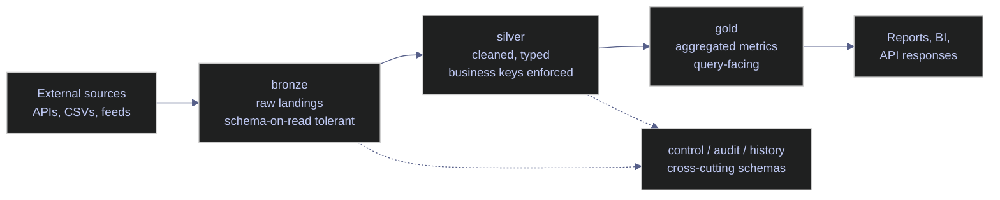
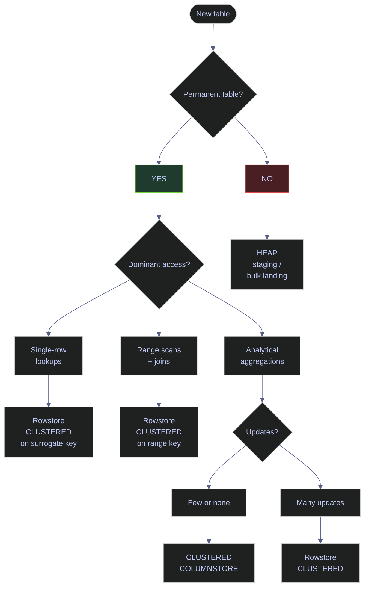
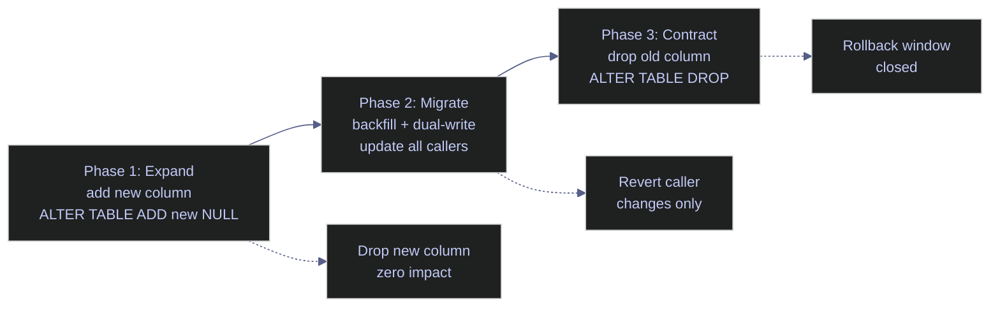

# Schemas, Tables, and Constraints

> [!abstract]- Summary
>
> This note owns the structural Data Definition Language that turns a SQL Server database into a usable model. It covers schemas as namespaces and security boundaries, `CREATE TABLE` mechanics including data types and nullability, the choice between heap and clustered physical shapes, the full constraint family (`PRIMARY KEY`, `UNIQUE`, `FOREIGN KEY`, `CHECK`, `DEFAULT`), safe `ALTER TABLE` evolution patterns, special table variants, and the catalog-view surface for inspecting every object the note creates. All live captures come from the local `stoxx` SQL Server 2022 Developer Edition instance and every query output was captured against real objects.
>
> **Schemas and ownership**
> - covers schemas as namespaces, security boundaries, ownership via `AUTHORIZATION`, medallion layout, and the inspection surface in `sys.schemas`
>
> **Tables and columns**
> - walks through `CREATE TABLE`, data-type choice, precision and scale, nullability contracts, identity columns, and computed columns
>
> **Physical shape and constraints**
> - compares heaps and clustered tables, then covers the full constraint family with naming conventions, trust states, referential actions, and bulk-load patterns
>
> **Evolution and special variants**
> - explains safe `ALTER TABLE` evolution plus temporal, memory-optimized, ledger, and graph tables
>
> **Inspection surface**
> - closes with catalog-view queries for schemas, tables, constraints, defaults, computed columns, and related metadata
>
> **Operations and safety**
> - Warnings: omitted `AUTHORIZATION`, system-named constraints, bad type choices, casual `sp_rename`, untrusted constraints, and heaps without a clear reason create long-lived production debt
> - Recommendations: preserve table grain, use explicit names, default to clustered rowstore tables, restore trust after `NOCHECK`, and use special table variants only for their exact use case
> - Troubleshooting: 11 failure modes covering schema drops, `ALTER TABLE` failures, constraint violations, rename blockers, NULL semantics, and missing memory-optimized prerequisites

> [!note]- Glossary
>
> **DDL**
> - The subset of SQL used to define and change database objects rather than row data.
> - It matters because almost every operation in this note changes schema shape, metadata, or structural rules rather than business rows.
>
> > [!warning] Structural changes can still be expensive
> >
> > DDL is often mistaken for “just metadata.” Some schema changes rewrite data, take `SCH-M` locks, or invalidate cached plans.
>
> ---
>
> **Schema**
> - A named container inside one database that groups related objects under a shared namespace.
> - It matters because schemas are the note’s primary unit of naming, security, and lifecycle separation.
>
> > [!warning] A schema is not a separate database
> >
> > Mixing those ideas leads to confused security and deployment design. Schemas separate objects inside one database.
>
> ---
>
> **Table grain**
> - The business meaning of one row, fixed before the table is created.
> - It matters because keys, uniqueness rules, and downstream joins only make sense when the row grain is explicit.
>
> > [!danger] Grain drift breaks consumers silently
> >
> > A table can keep working technically while its business meaning has changed. That kind of drift is expensive to unwind later.
>
> ---
>
> **Business key / natural key**
> - The real-world column set that makes a row unique according to the domain.
> - It matters because natural-key uniqueness often needs explicit protection even when a surrogate key is used for joins.
>
> > [!warning] A surrogate key does not prove business uniqueness
> >
> > Generated `id` values prevent duplicate row identifiers, not duplicate business facts. The natural key still needs its own rule.
>
> ---
>
> **Surrogate key**
> - A generated identifier with no business meaning, often implemented with `IDENTITY`.
> - It matters because surrogate keys simplify joins and relationships, but they solve a different problem from business-key enforcement.
>
> > [!info] Join convenience is not an integrity contract
> >
> > Surrogate keys are useful, but they are not a substitute for the row-grain rules the business actually cares about.
>
> ---
>
> **`PRIMARY KEY`**
> - The table’s main uniqueness declaration, backed by a unique index and clustered by default unless specified otherwise.
> - It matters because it is both a logical identity contract and often a major physical storage decision.
>
> > [!warning] Logical identity and clustering are separate choices
> >
> > The primary key says what identifies a row. Whether that key should also define the table’s physical order depends on workload shape.
>
> ---
>
> **`FOREIGN KEY`**
> - A constraint requiring child values to exist in a parent key, optionally with referential actions.
> - It matters because foreign keys are the strongest built-in relational integrity mechanism, but they also shape load and evolution workflows.
>
> > [!warning] Enabled does not always mean trusted
> >
> > After `NOCHECK` workflows, a foreign key can enforce new writes while still being unusable by the optimizer until trust is restored.
>
> ---
>
> **`CHECK` constraint**
> - A row-level predicate that each insert or update must satisfy unless the expression evaluates to `UNKNOWN`.
> - It matters because it is one of the cleanest ways to keep invalid states out of the table without relying only on application code.
>
> > [!warning] `CHECK` does not replace `NOT NULL`
> >
> > Because SQL uses three-valued logic, a `CHECK` can still pass on `NULL` unless nullability is constrained separately.
>
> ---
>
> **`DEFAULT` constraint**
> - A column-level expression that supplies a value when an insert omits that column.
> - It matters because defaults are convenient write-time behavior, but they need explicit naming and usually need companion validation rules.
>
> > [!warning] Defaults are filler, not proof
> >
> > A default makes an omitted value possible. It does not prove the resulting value is semantically correct for the workload.
>
> ---
>
> **Heap**
> - A table with no clustered index, storing rows without clustered-key order.
> - It matters because heaps have distinct update, lookup, and forwarded-row behavior and should therefore be deliberate rather than accidental.
>
> > [!warning] A heap is not a neutral permanent-table default
> >
> > Without a reason, heaps usually become a hidden maintenance and performance cost as the workload evolves.
>
> ---
>
> **Computed column**
> - A column whose value is derived from other columns in the same row, optionally persisted and indexed.
> - It matters because computed columns often bridge relational storage and semi-structured access patterns in production schemas.
>
> > [!warning] Indexability depends on the expression
> >
> > Persisted and indexable are not automatic properties. Determinism and precision rules still apply.
>
> ---

## Key Concepts

| Term | Plain-English definition | Why it matters here | Common mistake / confusion |
|---|---|---|---|
| **DDL** (Data Definition Language) | The subset of SQL that defines and changes the *shape* of database objects: `CREATE`, `ALTER`, `DROP`, `TRUNCATE`. Distinct from DML (`INSERT` / `UPDATE` / `DELETE` / `MERGE`) which changes *rows*, and DCL (`GRANT` / `REVOKE` / `DENY`) which changes *permissions*. | This note is almost entirely DDL. Understanding that `CREATE TABLE` is a transactional statement that locks schema metadata — not a data operation — is essential. | Treating `ALTER TABLE ADD COLUMN` as "free" because no rows are written. On large populated tables, some ALTERs rewrite every row and require `SCH-M` (schema modification) locks that block the whole table. |
| **Schema** | A named container inside a database that holds tables, views, procedures, functions, and types. A schema is **not** a separate database — it is a namespace within one database, and objects in different schemas of the same database are fully addressable as `schema_name.object_name`. | The vault's medallion model (`bronze`, `silver`, `gold`) uses schemas to separate raw landings from cleaned silver data and aggregated gold data. Schemas are also a security grain — permissions can be granted at the schema level. | Confusing "schema" in SQL Server (a namespace) with "schema" in other products (where it sometimes means "database"). In MySQL and Oracle, the terms mean different things. |
| **Database principal** | An identity that exists inside the database: a database user, a database role, or an application role. Each principal has a `principal_id`, a `name`, and a `type_desc` (`SQL_USER`, `WINDOWS_USER`, `DATABASE_ROLE`, etc.). | Every schema has an *owner* that is a database principal. `sys.schemas.principal_id` joins to `sys.database_principals` to surface the owner's name. | Confusing a database *user* with a server *login*. A login lives on the instance; a user is its mapping into one specific database. |
| **`AUTHORIZATION` clause** | An optional clause on `CREATE SCHEMA` (and other DDL) that sets the owning principal: `CREATE SCHEMA silver AUTHORIZATION dbo`. Without it, the schema is owned by the principal who ran the `CREATE` statement. | Explicit `AUTHORIZATION dbo` makes ownership predictable across deployments — every environment ends up with the same owner regardless of which deployment user ran the DDL. | Leaving out `AUTHORIZATION` and ending up with a schema owned by a service-account user that later gets deleted, breaking the ownership chain and blocking future `ALTER` operations. |
| **`dbo`** | The default schema and default user in every SQL Server database. `dbo` stands for "database owner" and is both a principal name and a schema name. New objects created without a schema qualifier land in `dbo` unless the user has a different default schema. | Every row in the `sys.schemas` capture below is owned by `dbo` — this is the production norm for single-team vaults, but breaks down in multi-team deployments where ownership separation matters. | Believing `dbo` is a magic "super-user". It is just a principal like any other — its permissions are governed by role membership, not by the name. |
| **`GO` batch separator** | A client-side separator recognised by SSMS, `sqlcmd`, and Azure Data Studio (but **not** by the SQL Server engine itself or by `pyodbc`). It splits a script into discrete batches, each of which is compiled and executed as a unit. `CREATE SCHEMA`, `CREATE TRIGGER`, `CREATE VIEW`, `CREATE PROCEDURE`, and `CREATE FUNCTION` must each be the first statement in their own batch, which is why they are typically followed by `GO`. | Every `CREATE SCHEMA` and `CREATE PROCEDURE` example in this note uses `GO` to make the script copy-pasteable into SSMS. When running via `pyodbc` (as in the vault's `stoxx-queries` runner), `GO` is stripped because `pyodbc` executes one statement at a time. | Thinking `GO` is a T-SQL keyword. It is not. Sending `GO` to the engine via a driver that does not recognise it produces `Incorrect syntax near 'GO'`. |
| **Medallion architecture** | A lakehouse naming convention that separates data by maturity: `bronze` for raw landings as they arrive, `silver` for cleaned and conformed data, `gold` for aggregated and derived metrics. The stoxx database uses exactly this layout. | The schemas capture below confirms the layout on the live instance — `bronze`, `silver`, `gold` all exist and all are owned by `dbo`. | Treating `bronze` / `silver` / `gold` as mandatory names. They are conventions, not standards — other shops use `stage` / `core` / `mart` or `raw` / `clean` / `presentation` with identical intent. |
| **Table grain** | The business definition of what one row represents: "one row per symbol per trading day", "one row per order", "one row per customer per month". The grain is decided *before* the DDL is written and must stay stable for the lifetime of the table. | The PK capture below shows `silver.eurostoxx50_ohlcv` has its PK on an identity `id` column, not on the natural grain `(symbol, date)` — which means a second insert of the same `(symbol, date)` pair would silently succeed. That is a grain contract the note discusses explicitly in the constraints section. | Changing the grain mid-life of a table (e.g., moving from one row per day to one row per minute). This breaks every downstream query, report, and backfill. |
| **Business key (natural key)** | The set of columns that make a row logically unique according to the domain: `(symbol, date)` for a daily OHLCV table, `(customer_id, order_id)` for an order line, `(isin, as_of_date)` for a valuation snapshot. | Business-key uniqueness is what the constraint family (`PRIMARY KEY` or `UNIQUE`) enforces when the DDL is done right. | Skipping the business-key constraint because the table "already has an `id` identity column". The identity column guarantees *technical* uniqueness, not *business* uniqueness. |
| **Surrogate key** | An integer (or `bigint`, `uniqueidentifier`) column with no business meaning whose only job is to identify a row for joins. Typically an `IDENTITY` column populated by SQL Server. | `silver.eurostoxx50_ohlcv.id`, `silver.index_dim.id`, and all other stoxx surrogate keys are `int IDENTITY`-driven. They are the *join target* for downstream tables, not the *uniqueness contract* for the table grain. | Believing the surrogate key *is* the business key. They are independent concerns: a table should usually have both (a surrogate PK for joins and a separate `UNIQUE` constraint for the natural key). |
| **Identity column** | A column that automatically generates a sequential integer on each insert. Declared with `IDENTITY(seed, increment)` — e.g., `id int IDENTITY(1,1)`. Separate from `SEQUENCE` objects (covered in [04-keys-defaults-identity-and-sequences](Elysium/04-SQL-Server/02-Database-Design-and-Storage/04-keys-defaults-identity-and-sequences.md)). | Every silver OHLCV table in stoxx uses `id int IDENTITY`. The column-inspection capture below shows `is_identity = True` on column 1 of `silver.eurostoxx50_ohlcv`. | Resetting identity with `DBCC CHECKIDENT ... RESEED` in production without accounting for existing child rows — can produce key collisions. |
| **NULL** | A marker meaning "value unknown or inapplicable". Distinct from zero, empty string, or false. SQL's three-valued logic means `NULL = NULL` is `NULL` (not `TRUE`), so equality predicates silently exclude NULL rows unless you use `IS NULL`. | The nullability distribution capture below shows `silver.index_dim` has 5 `NOT NULL` columns out of 26 — every dimension attribute column allows NULL because not all sources emit every field. A reader who writes `WHERE sector = NULL` will get zero rows even if NULL sectors exist. | Assuming `WHERE col = @param` works when `@param IS NULL`. It does not. The idiomatic fix is `WHERE (col = @param OR (col IS NULL AND @param IS NULL))`. |
| **NOT NULL constraint** | A column-level declaration that the column must always have a value. Enforced by the storage engine — an insert that violates it fails with error 515. | The nullability contract is part of the table's public API. Once a column is `NOT NULL`, downstream code relies on it; changing it to `NULL` is a silent semantic break. | Making every column `NOT NULL` "for safety". Truly optional columns (e.g., `close_price_adjustment_reason`) become forced-empty-string workarounds that break domain semantics. |
| **`PRIMARY KEY`** | A constraint declaring the row-identity contract: one column or a combination of columns that uniquely identify a row. Every PK automatically creates a unique index. By default that index is `CLUSTERED`; you can override with `PRIMARY KEY NONCLUSTERED`. | Every PK found by the capture below on stoxx is `CLUSTERED`. That is the default behaviour when `CLUSTERED`/`NONCLUSTERED` is not specified. | Believing `PRIMARY KEY` and `CLUSTERED INDEX` are the same thing. They are not — a PK is a *uniqueness* contract that happens to be backed by an index; the index type (clustered vs non-clustered) is a *physical* choice independent of the logical PK. |
| **`UNIQUE` constraint** | An alternate-key contract: the column (or combination) must not repeat, but it is not the table's main identity. Also backed by a unique index, `NONCLUSTERED` by default. | Uniqueness at the `(symbol, date)` grain on `silver.eurostoxx50_ohlcv` *should* be enforced by a `UNIQUE` constraint — the live capture of `sys.key_constraints WHERE type = 'UQ'` returned `(0 rows)`, meaning stoxx has **zero** explicit unique constraints. | SQL Server's historical "one NULL row" rule on `UNIQUE` constraints. Until SQL Server 2008 the standard `UNIQUE` index allowed only one NULL row; the modern answer is a *filtered unique index* (`CREATE UNIQUE INDEX ... WHERE col IS NOT NULL`). |
| **`FOREIGN KEY`** | A constraint declaring that values in a child column must exist in a parent column's unique key. Enforced on every write unless explicitly disabled with `NOCHECK`. | The live capture below of `sys.foreign_keys` returns `(0 rows)` on stoxx — the entire database has **zero** enforced FKs. This is the norm for analytical / ETL-driven platforms where bulk loads would otherwise break on every late-arriving dimension row. The trade-off is covered in depth in the FK section. | Believing FKs are "always best practice". In OLTP they usually are; in high-throughput ETL they are frequently disabled or replaced with integrity-test scripts. |
| **Referential action** | The clause on `FOREIGN KEY` that says what to do when the parent row is deleted or updated: `NO ACTION` (the default, which blocks the operation), `CASCADE` (propagates the delete/update), `SET NULL` (nulls out the child column), `SET DEFAULT` (sets the child column to its default value). | The `sys.foreign_keys.delete_referential_action_desc` and `update_referential_action_desc` columns surface these values — they are covered in the FK section below. | Using `ON DELETE CASCADE` on high-cardinality parents (e.g., deleting one customer cascades to millions of orders and invoices). Cascading deletes are rarely the right answer in production. |
| **Trusted / not trusted constraint** | Every `FOREIGN KEY` and `CHECK` constraint has an `is_not_trusted` flag. When a constraint is re-enabled with `CHECK` (not `WITH CHECK`), or when it was created with `WITH NOCHECK`, SQL Server marks it as not trusted — meaning it *cannot* use the constraint for query optimisation (predicate elimination, star-join simplification). The data is protected going forward, but the optimiser still reads the table to re-verify. | Any bulk-load workflow that disables and re-enables FKs must re-enable them with `WITH CHECK CHECK` to restore the trusted state. The capture in the FK section shows how to surface `is_not_trusted = 1` rows. | Forgetting the second `CHECK` word. `ALTER TABLE t CHECK CONSTRAINT fk_x` enables the constraint but leaves it not trusted. `ALTER TABLE t WITH CHECK CHECK CONSTRAINT fk_x` revalidates and marks it trusted. |
| **`WITH CHECK` / `WITH NOCHECK`** | Modifiers on `ALTER TABLE ... ADD CONSTRAINT` and `ALTER TABLE ... CHECK CONSTRAINT`. `WITH CHECK` (the default for `ADD`) validates existing rows before enabling; `WITH NOCHECK` skips validation, producing a not-trusted constraint. | `WITH NOCHECK` is standard during bulk loads of known-clean data where full-table validation would be prohibitively slow, but every `NOCHECK` must be followed by a trust-restoration step. | Never restoring trust after a `NOCHECK` load. The constraint silently exists but the optimiser cannot use it, and no monitoring flags the gap unless you explicitly query `is_not_trusted`. |
| **`CHECK` constraint** | A row-level predicate that must evaluate to `TRUE` or `UNKNOWN` for every insert and update. Declared inline with the column or at the table level. | Live capture on stoxx shows two `CHECK` constraints on `demo_jx`, both using `ISJSON(payload) = 1` to validate that a `nvarchar` column contains well-formed JSON. That is a real, production-grade use of `CHECK`. | Expecting `CHECK` to catch NULL violations. Since `NULL CHECK` evaluates to `UNKNOWN` and the rule is "must not be `FALSE`", a NULL column always passes any `CHECK` unless combined with `NOT NULL`. |
| **`DEFAULT` constraint** | A column-level expression that produces a value when `INSERT` omits the column. Implemented as a named object in `sys.default_constraints`. | All bronze tables on stoxx use `DEFAULT sysutcdatetime()` on their `_ingested_at` column — but every one of those defaults is *system-named* (`DF__eurostoxx___inge__5812160E`, etc.), which breaks future scripted drops. The section below walks through this exact anti-pattern using the live capture. | Confusing `DEFAULT` with a business rule. A default is a *fill value*, not proof that the supplied value is semantically correct. Pairing `DEFAULT` with `CHECK` is how you enforce both. |
| **System-named constraint** | A constraint created without an explicit name. SQL Server invents a name like `PK__eurostox__3213E83FDF67D274` using a hash of the table's object_id, which is unstable across environments — the same script run on dev and prod produces different constraint names. | Every PK in the stoxx capture below is system-named. This is why the note's recommendations section requires explicit `CONSTRAINT` names in all DDL. | Writing `ALTER TABLE t DROP CONSTRAINT PK__...` literally and having the script fail in the next environment because the hash is different. |
| **Naming prefix** | A convention: `PK_` for primary keys, `UQ_` for unique constraints, `FK_` for foreign keys, `CK_` for check constraints, `DF_` for default constraints, `IX_` for indexes, `DF_table_column` for column defaults. Makes constraint intent readable in catalog-view output and in error messages. | The note applies this convention to every explicit-DDL example. The live capture of system-named stoxx PKs shows what happens when the convention is skipped. | Inventing a project-specific prefix (`P_`, `PRIM_`, `id_`) that does not survive rotation of engineers. Stick to the SQL Server community convention so the prefix is self-documenting. |
| **Data type** | The declared storage representation of a column: integer family (`tinyint`, `smallint`, `int`, `bigint`), exact numeric (`decimal(p,s)`, `numeric(p,s)`, `money`), approximate numeric (`float`, `real`), date and time (`date`, `datetime2(n)`, `datetimeoffset(n)`), string (`varchar(n)`, `nvarchar(n)`, `varchar(max)`), binary (`varbinary(n)`), and specialised (`uniqueidentifier`, `rowversion`, `xml`, `sql_variant`). | The column inspection of `silver.eurostoxx50_ohlcv` below shows a representative mix: `int` PK, `varchar(20)` symbol, `date` column, `float` OHLCV columns, `bigint` volume, `bit` flag. | Choosing `float` or `real` for monetary values. These are *approximate* types that cannot exactly represent `0.01`. Use `decimal(p, s)` for money. |
| **Precision and scale** | For `decimal(p, s)`: `p` is the total number of significant digits, `s` is the number of digits after the decimal point. `decimal(19, 4)` holds up to 19 total digits with 4 after the decimal — a common choice for monetary values where fractional cents (e.g., `1234567890123456.7890`) are needed. | The data type reference table in the `CREATE TABLE` section below lists the exact byte cost per precision range. | Using `decimal(38, 0)` "to be safe". Each `decimal(38)` costs 17 bytes per row even when the stored values are tiny, which inflates the table size. |
| **`sysutcdatetime()`** | A T-SQL function that returns the current UTC date and time as `datetime2(7)`. Related functions: `getdate()` (local server time, `datetime`), `getutcdate()` (UTC, `datetime`), `sysdatetime()` (local, `datetime2`), `sysdatetimeoffset()` (local with timezone, `datetimeoffset`). | All bronze defaults in the capture use `sysutcdatetime()` — the right choice for ingestion timestamps because it is timezone-independent and has microsecond precision. | Using `getdate()`. It returns `datetime` (3 ms precision) in local server time, which breaks as soon as the server is moved to a different timezone or a different region. |
| **Computed column** | A column whose value is computed from an expression over other columns in the same row. Can be *non-persisted* (computed on read) or *persisted* (materialised on write and stored on disk, indexable). | The capture of `sys.computed_columns` shows three persisted computed columns on `demo_jx.indexed_json_events` that extract `symbol`, `sector`, and `beta` from a JSON `payload` column via `json_value()`. This is the idiomatic pattern for indexing JSON in SQL Server 2016+. | Creating non-persisted computed columns and then trying to index them. Non-persisted computed columns are only indexable if the expression is deterministic and precise, which `json_value()` is not. |
| **Catalog view** | A system view under the `sys` schema that exposes metadata about database objects: `sys.schemas`, `sys.tables`, `sys.columns`, `sys.indexes`, `sys.index_columns`, `sys.key_constraints`, `sys.foreign_keys`, `sys.check_constraints`, `sys.default_constraints`, `sys.computed_columns`, `sys.identity_columns`, `sys.types`. | Every inspection capture in this note queries one of these views directly. They are the authoritative source — `INFORMATION_SCHEMA` is a portable subset but is missing many SQL Server-specific fields (e.g., `is_not_trusted`, `is_persisted`, `is_disabled`). | Using `INFORMATION_SCHEMA.TABLES` for constraint inspection. It returns less information than `sys.tables` + `sys.key_constraints` + `sys.foreign_keys`, and does not expose the trust state or disabled state. |
| **Heap** | A table with **no** clustered index. Rows are stored in the order they were inserted, using a two-byte page-ID + slot-number identifier called the RID. `sys.indexes.type_desc` shows `HEAP`. | The capture below finds exactly one heap on stoxx: `dbo.demo_pulse_tickers` (40 rows). The heap vs clustered section dissects why that is a deliberate narrow-table choice. | Believing "a table without a primary key" is the same as "a heap". You can have a heap with a non-clustered PK (the PK is backed by a non-clustered unique index and the data pages stay unordered). |
| **Clustered index** | A B-tree-ordered storage structure where the leaf pages **are** the data pages. A table can have at most one clustered index because the rows can only be physically sorted one way. | 39 of the 41 base tables on stoxx (in `bronze`, `silver`, `gold`, `dbo`) are rowstore clustered. The capture below enumerates the distribution. | Assuming "clustered index" always means "on the primary key". It does not — you can put a clustered index on any suitable column (e.g., a `date` column for time-series tables) and declare the PK as non-clustered. |
| **RID (Row Identifier)** | The 6-byte pointer used by heaps to locate a row: `file_id (2 bytes) + page_id (4 bytes) + slot_number (2 bytes)`. Non-clustered indexes on a heap carry the RID as their leaf pointer. | Because a heap's non-clustered indexes point to RIDs rather than clustering keys, updates that expand a row beyond the page can trigger forwarded rows (the row moves to a new page but the old slot keeps a forwarding pointer). | Treating RIDs as stable identifiers in application code. They are private to the storage engine and can change on any row expansion. |
| **Forwarded row** | A heap-only phenomenon: when an `UPDATE` makes a row larger than the remaining space on its page, SQL Server moves the row to a new page and leaves a pointer (the forwarding stub) in the old slot. Every lookup from a non-clustered index now costs two page reads instead of one. | Forwarded rows accumulate silently. The note shows how to detect them via `sys.dm_db_index_physical_stats` in the heap section. | Relying on "small" heaps to stay fast. A heap that is frequently updated will drift toward high forwarded-row counts, which is one of the main reasons clustered tables are the default. |
| **Three-valued logic** | The SQL truth system: `TRUE`, `FALSE`, and `UNKNOWN`. Any comparison involving NULL produces `UNKNOWN`. `WHERE` clauses keep only rows where the predicate is `TRUE` — not `FALSE` or `UNKNOWN`. | The NULL-semantics subsection walks through a live capture proving `NULL = NULL` returns `UNKNOWN`, excluding the NULL row from the result set. | Believing `WHERE col <> 'x'` returns rows where `col` is NULL. It does not — NULL rows are silently excluded unless you add `OR col IS NULL`. |
| **`ANSI_NULLS`** | A session setting that controls whether `= NULL` and `<> NULL` behave per the SQL standard (always `UNKNOWN`, the correct behaviour) or per the legacy SQL Server behaviour (treating `= NULL` as `IS NULL`). Since SQL Server 2005 it is always `ON` for any session used by application code. | Must be `ON` for indexed views, filtered indexes, and computed-column persistence. Setting it `OFF` breaks those features silently. | Writing code that relies on legacy `= NULL` semantics. It works on one session and fails on another if session settings differ. |
| **Temporal table** | A system-versioned table (SQL Server 2016+) that automatically tracks every row change into a history table. Declared with `PERIOD FOR SYSTEM_TIME` and `SYSTEM_VERSIONING = ON`. | Covered in the special variants section. Replaces hand-rolled audit triggers for most use cases. | Believing temporal tables record the user who made the change. They record only *what* changed and *when*. Use a separate `ModifiedBy` column populated by the application for attribution. |
| **Memory-optimized table** | An in-memory OLTP table (SQL Server 2014+) declared with `WITH (MEMORY_OPTIMIZED = ON)`. Stored entirely in memory, optionally durable. Designed for extreme-throughput OLTP workloads. | Covered in the special variants section. Has significant constraint-support limitations compared to disk-based tables. | Using memory-optimized tables for analytical workloads. They are optimised for short, high-frequency transactional operations, not for scans. |
| **Ledger table** | An append-only cryptographically-protected table (SQL Server 2022+) declared with `LEDGER = ON`. Every change is recorded to a ledger and can be verified against a database digest. | Covered in the special variants section. Answers compliance requirements around tamper-evident audit trails. | Treating ledger tables as a general-purpose audit mechanism. They are specifically designed for regulated compliance use cases where the database itself must prove it has not been tampered with. |
| **Graph table** | A table declared with `AS NODE` or `AS EDGE` (SQL Server 2017+) that participates in graph queries via the `MATCH` clause. Each node table has a hidden `$node_id` column, each edge table has hidden `$edge_id`, `$from_id`, `$to_id`. | Covered in the special variants section. Useful for hierarchical and relationship-heavy data (org charts, supply chains) where recursive CTEs would be clumsy. | Using graph tables as a general replacement for normalised relational modelling. They are a specialised tool for genuinely graph-shaped data, not a universal upgrade. |

## Schemas, Namespaces, and Ownership

A schema is a named container inside a database that holds tables, views, procedures, functions, and types. It is **not** a separate database. Every object in SQL Server is addressed as `database_name.schema_name.object_name`, and schemas are the middle term that groups related objects together.

Schemas serve three simultaneous roles that are easy to conflate but should be kept distinct when designing a database:

- **Namespace.** Two objects can share a name as long as they are in different schemas — `bronze.eurostoxx50_ohlcv` and `silver.eurostoxx50_ohlcv` coexist in stoxx precisely because they live in different schemas.
- **Security boundary.** Permissions can be granted at the schema level: `GRANT SELECT ON SCHEMA::silver TO readonly_role` grants read on every existing and future object in `silver`, which is far less error-prone than enumerating tables one by one.
- **Deployment and lifecycle boundary.** A schema is the natural unit for "this set of tables is owned by the ingestion team, this set by the analytics team, this set is experimental and will be dropped after Q2". Grouping by schema makes the lifecycle visible in every tool that lists objects (SSMS, Azure Data Studio, catalog views).

These three roles — **namespace**, **security boundary**, and **lifecycle boundary** — are easy to conflate but should be kept distinct when designing a database.

### SQL Server | schema model | how namespaces and owners interact

A SQL Server schema is owned by a database principal — a user or a role — recorded in `sys.schemas.principal_id`. The owner controls DDL operations on objects inside the schema and participates in the ownership chain for permission resolution. When no `AUTHORIZATION` clause is specified on `CREATE SCHEMA`, the owner defaults to the principal who ran the statement, which is usually not what you want in a deployment pipeline.

The distinction between *creator* and *owner* matters because the creator is usually a deployment service account that may be rotated or deleted over time. If that principal is later dropped, the schema's ownership falls back to `dbo` via the "orphaned object" rules, but any explicit grants tied to the original principal are broken. Pinning the owner to a stable, long-lived principal (almost always `dbo`) at creation time avoids this class of drift.

#### Inspect existing schemas and their owners

**When to run:** First time you touch a new SQL Server database, or whenever you need to confirm schema ownership before a deployment.
**Trigger:** Writing or reviewing DDL, auditing permissions, or investigating why a `CREATE TABLE` landed in the wrong schema.
**Context:** Read-only T-SQL against any catalog view. Any database user with `VIEW DEFINITION` permission (which is granted by default to `public` at the database level on SQL Server 2022) can run this.
**Purpose:** Enumerate every schema in the current database, its owner principal, and the owner's type, so you can confirm that production schemas are owned by a stable principal (typically `dbo`) and not by a rotating service account.

> [!info]- Query breakdown — joining sys.schemas to sys.database_principals
>
> The query joins two catalog views:
>
> - **`sys.schemas`** — one row per schema in the current database. Key columns: `schema_id` (the int identifier used in `sys.objects.schema_id`), `name` (the schema name as used in T-SQL), `principal_id` (the owner).
> - **`sys.database_principals`** — one row per database principal (user, role, application role). Key columns: `principal_id`, `name`, `type_desc`.
>
> The `LEFT JOIN` preserves schemas whose owner has been dropped since creation (the `principal_id` would point to a non-existent row). The `ORDER BY schema_id` surfaces the built-in schemas first (`dbo`, `guest`, `INFORMATION_SCHEMA`, `sys`) and then user schemas in creation order. Note that SQL Server assigns `schema_id` values `≥ 16384` to the fixed database roles that are auto-created as schemas for compatibility — those are filtered or grouped separately in the production-facing version of the query.

*List every schema in the current database with its owner principal and type.*

```sql
SELECT
    s.schema_id,
    s.name               AS schema_name,
    dp.name              AS owner_name,
    dp.type_desc         AS owner_type
FROM sys.schemas AS s
LEFT JOIN sys.database_principals AS dp
    ON dp.principal_id = s.principal_id
ORDER BY s.schema_id;
```

| schema_id | schema_name | owner_name | owner_type |
|---|---|---|---|
| 1 | dbo | dbo | SQL_USER |
| 2 | guest | guest | SQL_USER |
| 3 | INFORMATION_SCHEMA | INFORMATION_SCHEMA | SQL_USER |
| 4 | sys | sys | SQL_USER |
| 5 | bronze | dbo | SQL_USER |
| 6 | silver | dbo | SQL_USER |
| 7 | gold | dbo | SQL_USER |
| 8 | demo_jx | dbo | SQL_USER |
| 16384 | db_owner | db_owner | DATABASE_ROLE |
| 16385 | db_accessadmin | db_accessadmin | DATABASE_ROLE |
| 16386 | db_securityadmin | db_securityadmin | DATABASE_ROLE |
| 16387 | db_ddladmin | db_ddladmin | DATABASE_ROLE |
| 16389 | db_backupoperator | db_backupoperator | DATABASE_ROLE |
| 16390 | db_datareader | db_datareader | DATABASE_ROLE |
| 16391 | db_datawriter | db_datawriter | DATABASE_ROLE |
| 16392 | db_denydatareader | db_denydatareader | DATABASE_ROLE |
| 16393 | db_denydatawriter | db_denydatawriter | DATABASE_ROLE |

The first block (`schema_id` 1 to 4) is the built-in set that every SQL Server database ships with: `dbo` is the default user schema, `guest` is the schema for the disabled-by-default `guest` user, `INFORMATION_SCHEMA` and `sys` are the read-only metadata surfaces. The second block (`schema_id` 5 to 8) is the stoxx user schemas — `bronze`, `silver`, `gold` implement the medallion layout, and `demo_jx` is a JSON-indexing demo schema used by a sibling note. Every user schema is owned by `dbo`, which is the intended state for a single-team vault. The third block (`schema_id ≥ 16384`) is the fixed-database-role schemas — SQL Server auto-creates one schema per fixed role for backwards compatibility. They contain no user objects and can be ignored for day-to-day work.

The field-definition reference for the two catalog views read by the query:

| Field | Source column | Unit / type | Meaning |
|---|---|---|---|
| `schema_id` | `sys.schemas.schema_id` | int | The immutable identifier used in `sys.objects`, `sys.tables`, etc. |
| `schema_name` | `sys.schemas.name` | sysname (nvarchar(128)) | The schema name as used in T-SQL (`silver.eurostoxx50_ohlcv`). |
| `owner_name` | `sys.database_principals.name` | sysname | The name of the owning principal. `NULL` means the owner has been dropped. |
| `owner_type` | `sys.database_principals.type_desc` | nvarchar(60) | `SQL_USER`, `WINDOWS_USER`, `WINDOWS_GROUP`, `APPLICATION_ROLE`, `DATABASE_ROLE`, `CERTIFICATE_MAPPED_USER`, `ASYMMETRIC_KEY_MAPPED_USER`, or `EXTERNAL_USER`. |

#### Object density per schema

**When to run:** Before deciding where a new object should live, or when auditing a database for schema sprawl.
**Trigger:** A review of the database layout ("does every team's data live in its own schema, or has `dbo` become a dumping ground?").
**Context:** Read-only query against `sys.schemas` and `sys.objects`. Filters out Microsoft-shipped system objects (`is_ms_shipped = 0`).
**Purpose:** Surface how many user tables, views, procedures, and functions live in each schema so you can see at a glance whether the medallion separation is being respected.

*Count user objects per schema, grouped by object kind.*

```sql
SELECT
    s.name               AS schema_name,
    SUM(CASE WHEN o.type = 'U'  THEN 1 ELSE 0 END) AS user_tables,
    SUM(CASE WHEN o.type = 'V'  THEN 1 ELSE 0 END) AS views,
    SUM(CASE WHEN o.type IN ('P','PC') THEN 1 ELSE 0 END) AS procedures,
    SUM(CASE WHEN o.type IN ('FN','IF','TF','FS','FT') THEN 1 ELSE 0 END) AS functions
FROM sys.schemas AS s
LEFT JOIN sys.objects AS o
    ON o.schema_id = s.schema_id
    AND o.is_ms_shipped = 0
WHERE s.name IN ('dbo','bronze','silver','gold','demo_jx')
GROUP BY s.name
ORDER BY s.name;
```

| schema_name | user_tables | views | procedures | functions |
|---|---|---|---|---|
| bronze | 12 | 0 | 0 | 0 |
| dbo | 19 | 0 | 0 | 0 |
| demo_jx | 5 | 0 | 0 | 0 |
| gold | 3 | 0 | 0 | 0 |
| silver | 7 | 0 | 0 | 0 |

The stoxx layout splits tables cleanly across schemas: 12 raw landings in `bronze`, 7 cleaned facts and dimensions in `silver`, 3 aggregated metric tables in `gold`, 5 demo objects in `demo_jx`, and 19 tables in `dbo`. The 19-row `dbo` count is on the high side — it reflects the mix of demo, staging, and legacy tables that `stoxx-queries` documents in its skill file. A production data warehouse would ideally move demo tables out of `dbo` into a dedicated `demo` schema so that `dbo` only holds true cross-cutting objects like `dim_calendar`.

| Field | Source column | Type | Meaning |
|---|---|---|---|
| `schema_name` | `sys.schemas.name` | sysname | Schema name. |
| `user_tables` | `sys.objects.type = 'U'` | count | Number of user base tables (excluding system tables and system-shipped objects). |
| `views` | `sys.objects.type = 'V'` | count | Number of views, including indexed views. |
| `procedures` | `sys.objects.type IN ('P','PC')` | count | Stored procedures (`P`) and CLR stored procedures (`PC`). |
| `functions` | `sys.objects.type IN ('FN','IF','TF','FS','FT')` | count | Scalar (`FN`), inline TVF (`IF`), multi-statement TVF (`TF`), and CLR variants (`FS`, `FT`). |

The `sys.objects.type` column uses a 2-character code for every object type. The values relevant to schema auditing:

| `type` | Description |
|---|---|
| `U` | User table (base, disk-based or memory-optimized) |
| `V` | View (including indexed view) |
| `P` | SQL stored procedure |
| `PC` | CLR stored procedure |
| `FN` | SQL scalar function |
| `IF` | SQL inline table-valued function |
| `TF` | SQL multi-statement table-valued function |
| `FS` | CLR scalar function |
| `FT` | CLR table-valued function |
| `TR` | SQL DML trigger |
| `TA` | CLR DML trigger |
| `SN` | Synonym |
| `SQ` | Service Queue (Service Broker) |
| `TT` | Table type (user-defined table type) |
| `UQ` | Unique constraint object (linked to a table) |
| `PK` | Primary key constraint object |
| `F` | Foreign key constraint object |
| `C` | Check constraint object |
| `D` | Default constraint object |

#### Create a schema with explicit authorization

**When to run:** During initial database provisioning, or when adding a new bounded context to an existing database.
**Trigger:** A new team, a new data source, or a new lifecycle boundary that justifies its own namespace.
**Context:** T-SQL DDL statement. Must be the first statement in its batch — wrap it in its own `GO`-separated block. Requires `CREATE SCHEMA` permission at the database level, typically granted via membership in `db_ddladmin` or higher.
**Purpose:** Create a schema owned by a stable principal (not the running deployment account), so that ownership is predictable across environments and survives service-account rotation.

> [!info]- CREATE SCHEMA syntax notes
>
> - The `AUTHORIZATION` clause is optional but strongly recommended. Without it, the owner defaults to the user running the statement, which is almost never what you want in CI/CD.
> - `CREATE SCHEMA` can optionally declare objects inline (tables, views, grants) as a single batch, but that form is rarely used — most shops create the schema, then create objects in separate batches so failures are easier to diagnose.
> - The statement must be the *first* statement in its batch. If you need to create multiple schemas in one script, separate them with `GO`.
> - Schema creation is a metadata-only operation and does not scan any data, so it is effectively instant regardless of database size.

*Create two schemas that implement the silver and gold layers, each owned explicitly by `dbo`.*

```sql
CREATE SCHEMA silver AUTHORIZATION dbo;
GO

CREATE SCHEMA gold AUTHORIZATION dbo;
GO
```

> [!warning] Unstable ownership when AUTHORIZATION is omitted
>
> Running `CREATE SCHEMA silver` without an `AUTHORIZATION` clause from a deployment account named `svc_deploy_2026q1` creates a schema owned by that account. If the account is later dropped during a quarterly service-principal rotation, the schema ownership falls back to `dbo` but any schema-level grants tied to the original principal are broken, and diagnostics become confusing because `sys.schemas.principal_id` still points to the old row until the orphan cleanup runs.

> [!success] Pin the owner to a stable principal
>
> Always include `AUTHORIZATION dbo` (or another principal guaranteed to exist in every environment) on every `CREATE SCHEMA`. This makes ownership deterministic and deployment-safe.

#### Transfer an object between schemas

**When to run:** When an object's lifecycle moves from one layer to another — for example, a table that has graduated from `staging` to `silver` after validation.
**Trigger:** A deliberate reclassification; never use `ALTER SCHEMA ... TRANSFER` to rename objects — use `sp_rename` for that.
**Context:** T-SQL DDL, single statement per transfer. Metadata-only operation that acquires a schema-modification (`SCH-M`) lock on the target object for the duration of the statement, which typically completes in under a second but blocks all readers and writers on that one object during the transfer. Requires `ALTER` on the source schema and `CREATE` (or `ALTER`) on the destination schema, or `ALTER ANY SCHEMA` at the database level.
**Purpose:** Move an existing table (or view, procedure, function) into a different schema without recreating it or copying data.

*Transfer a staging table into the silver schema.*

```sql
ALTER SCHEMA silver TRANSFER staging.intraday_ticks;
```

> [!warning] Transfer is metadata-only but not invisible
>
> `ALTER SCHEMA ... TRANSFER` does not move data on disk, but it *does* invalidate every cached query plan that referenced the object under its old schema name. Every application, procedure, and report that spells the table as `staging.intraday_ticks` will start failing immediately after the transfer with "Invalid object name". Transfer is a deployment operation that should be coordinated with the callers, not a routine maintenance task.

> [!success] Prefer compatibility views during the transition
>
> When a transfer must be rolled out gradually, create a compatibility view under the old name that `SELECT`s from the new name: `CREATE VIEW staging.intraday_ticks AS SELECT * FROM silver.intraday_ticks`. Callers keep working, and you can retire them one by one.

#### Drop a schema safely

**When to run:** At the end of a deprecation cycle, after every object has been moved out of the schema and every grant on the schema has been revoked.
**Trigger:** A confirmed retirement plan for a bounded context that is no longer active.
**Context:** T-SQL DDL. Requires `CONTROL` on the schema or membership in `db_ddladmin`. Hard requirement: the schema must be empty. `DROP SCHEMA` fails if any object still references it, including tables, views, procedures, functions, synonyms, and user-defined types.
**Purpose:** Remove a schema from the database.

*Drop a retired demo schema.*

```sql
DROP SCHEMA demo_old;
```

> [!failure] DROP SCHEMA on a non-empty schema
>
> Running `DROP SCHEMA silver` while tables still live inside it fails with error 3729: `Cannot drop schema 'silver' because it is being referenced by object 'eurostoxx50_ohlcv'`. The error lists only the *first* offending object, not all of them.

> [!success] Enumerate dependents before dropping
>
> Before the drop, run the enumeration query below to list every object that must be moved, dropped, or reassigned. Only run `DROP SCHEMA` after the list is empty.

*Enumerate every object that still lives in a schema before attempting to drop it.*

```sql
SELECT
    o.type_desc          AS object_kind,
    o.name               AS object_name
FROM sys.objects AS o
JOIN sys.schemas AS s
    ON s.schema_id = o.schema_id
WHERE s.name = 'demo_old'
  AND o.is_ms_shipped = 0
ORDER BY o.type_desc, o.name;
```

The inspection query returns one row per user object in the target schema. Run it, resolve every row (transfer, drop, or reassign), and only then issue `DROP SCHEMA demo_old`.

### SQL Server | schema layering | medallion and operational surfaces

The stoxx database follows the **medallion layering** convention — a lakehouse pattern that uses schemas to separate data by maturity and stability rather than by source system or team. The three canonical layers are bronze (raw landings), silver (cleaned and conformed), and gold (aggregated and derived). Each layer has a different contract with its callers and a different operational profile.



The stoxx schema layout implements this model directly:

- **`bronze`** (12 tables) — raw landings that accept whatever the upstream source emits. Nullability is permissive because missing fields in source data are expected. Every table carries an `_ingested_at` column with `DEFAULT sysutcdatetime()` to record the landing time.
- **`silver`** (7 tables) — cleaned, deduplicated, type-corrected facts and dimensions. Business-key uniqueness is a target here even if not always enforced by constraint (the live capture confirms stoxx has zero explicit `UNIQUE` constraints — this is a known gap rather than a best-practice pattern).
- **`gold`** (3 tables) — pre-aggregated metrics (daily index performance, scores) that serve BI dashboards and API responses. Tables here tend to be smaller and denormalised.
- **`dbo`** (19 tables) — the catch-all schema. On a greenfield design this would be empty; on stoxx it holds demo, staging, and legacy objects that predate the medallion migration.

Cross-cutting schemas that stoxx does *not* use but that production deployments often add:

- **`control`** — job runs, schedule metadata, lineage stages, watermark tables (the stoxx `dbo.lineage_stages` table is a candidate for a future move).
- **`audit`** — append-only change records (candidate for ledger tables, covered in the special variants section).
- **`history`** — slowly changing dimension history and SCD-2 `valid_from`/`valid_to` tables when they are large enough to justify separation.

> [!tip] Schema granularity rule of thumb
>
> If two tables are always loaded together, always queried together, and always dropped together, they belong in the same schema. If their lifecycles diverge — different load schedules, different retention policies, different downstream consumers — they belong in different schemas.

Cross-reference: the deeper treatment of this pattern lives in the sibling note [05-sql-server-schema-layering](Elysium/04-SQL-Server/02-Database-Design-and-Storage/05-sql-server-schema-layering.md). This section stays at the namespacing and ownership level; the sibling note covers per-layer nullability policies, privilege models, and cross-layer deployment choreography.

## CREATE TABLE, Column Types, and Nullability

`CREATE TABLE` is the statement that materialises a relational model into storage. Every production-quality table is the answer to five questions decided *before* the DDL is written: what is the grain, what is the business key, which columns are nullable, what data types minimise storage while covering the domain, and what constraints turn the table from a raw structure into a contract. Skipping any of these questions produces tables that silently drift as the business evolves around them.

This section walks through each of the five questions using real tables in the stoxx database as the worked example. The canonical table used throughout is `silver.eurostoxx50_ohlcv`, a 67,155-row fact table holding daily open / high / low / close / volume bars for the EUROSTOXX50 constituents.

### SQL Server | CREATE TABLE | grain, keys, and nullability contract

Before the first column is typed, answer three questions in writing. The answers belong in the note, the ticket, or the design document that accompanies the DDL — not in someone's head.

- **The grain.** One row per what? "One row per symbol per trading day" is a clear grain; "one row per market event" is not. If the grain is ambiguous, no constraint in the world will keep the table clean.
- **The business key.** Which columns make a row unique *in the domain*? For the OHLCV table the natural answer is `(symbol, date)`. The surrogate `id` identity column is a separate concern — it is a join target, not a uniqueness contract.
- **The nullability contract.** Which columns are *truly* optional? "Optional" means "the domain genuinely allows this to be unknown", not "we don't feel like making the upstream feed emit it". Every column decision here is a public API for downstream queries.

If any of the three answers is "we will decide later", the DDL is premature. Write the DDL *after* the questions are settled, not before.

Beyond those three, two more questions complete the pre-DDL checklist: **types** (what storage representation minimises footprint while covering the real-world values?) and **constraints** (which rules turn the table shape into a contract the database can enforce?).

#### Create a table with explicit nullability

**When to run:** During initial provisioning of a new fact or dimension table, or when rebuilding an existing table under a new contract.
**Trigger:** The design questions above have been answered and approved.
**Context:** T-SQL DDL. Runs as part of a deployment batch. Requires `CREATE TABLE` on the target schema (typically granted via `db_ddladmin` or direct schema-level `CREATE` permission). Metadata-only operation that completes in well under a second regardless of the table's eventual size.
**Purpose:** Materialise the designed table shape with every column's nullability, type, default, and primary key constraint defined up front — so the table starts life with a complete contract rather than acquiring one incrementally via ALTER statements.

> [!info]- CREATE TABLE clause breakdown
>
> - **Column declarations** — each line is `column_name data_type [NULL|NOT NULL] [IDENTITY(seed,increment)] [COLLATE ...] [CONSTRAINT ... DEFAULT ...]`. Order matters visually but not logically.
> - **`int NOT NULL`** — a 4-byte signed integer that must always have a value. Range -2,147,483,648 to 2,147,483,647.
> - **`date NOT NULL`** — a 3-byte date without time component. Range 0001-01-01 to 9999-12-31. Exactly 1 day precision.
> - **`decimal(19, 4) NOT NULL`** — exact numeric with up to 19 total significant digits and 4 digits after the decimal point. 9 bytes per value (see the storage table in the data types section). Standard choice for monetary values.
> - **`bigint NULL`** — 8-byte signed integer, range approximately ±9.2 × 10¹⁸. Used for trading volume which can routinely exceed `int` range on large-cap equities.
> - **`datetime2(3)`** — date + time with 3-digit fractional seconds precision (millisecond). 7 bytes per value. Precision choice `(3)` is sufficient for ingestion timestamps; `(7)` is the default and gives 100-nanosecond precision at a cost of 8 bytes.
> - **`CONSTRAINT DF_instrument_price_created_at_utc DEFAULT SYSUTCDATETIME()`** — named default constraint. Naming the constraint explicitly is the key discipline — system-named defaults (what happens if you omit `CONSTRAINT DF_...`) produce unstable identifiers that break future scripted drops.
> - **`CONSTRAINT PK_instrument_price PRIMARY KEY CLUSTERED (instrument_id, price_date)`** — table-level primary key constraint. Using the table-level form (outside any column declaration) is required for composite keys. `CLUSTERED` is the default but stating it explicitly makes the physical choice visible to the reader.

*Create a daily instrument price fact table with an explicit composite primary key and a named default on the audit timestamp.*

```sql
CREATE TABLE silver.instrument_price
(
    instrument_id     int           NOT NULL,
    price_date        date          NOT NULL,
    close_price       decimal(19,4) NOT NULL,
    volume            bigint        NULL,
    created_at_utc    datetime2(3)  NOT NULL
        CONSTRAINT DF_instrument_price_created_at_utc
        DEFAULT SYSUTCDATETIME(),
    CONSTRAINT PK_instrument_price
        PRIMARY KEY CLUSTERED (instrument_id, price_date)
);
```

This DDL is a teaching template — `silver.instrument_price` does not exist on the stoxx instance because the real OHLCV tables use a different design (surrogate `id` PK, `float` price columns). The inspection queries below show the actual shape of `silver.eurostoxx50_ohlcv`, which illustrates the same concepts but with different concrete choices.

#### Inspect the table metadata after creation

**When to run:** Immediately after `CREATE TABLE`, or whenever you need to confirm that the table's physical shape matches the design.
**Trigger:** Post-deployment verification, or an audit pass over existing tables.
**Context:** Read-only T-SQL against `sys.tables`, `sys.indexes`, and `sys.partitions`. Any database user with `VIEW DEFINITION` can run this.
**Purpose:** Return the table's metadata (creation date, last modification, physical shape, row count) as a single row so the design review pass has an authoritative source of truth.

*Inspect the metadata and physical shape of `silver.eurostoxx50_ohlcv`.*

```sql
SELECT
    t.name                      AS table_name,
    SCHEMA_NAME(t.schema_id)    AS schema_name,
    t.create_date,
    t.modify_date,
    i.type_desc                 AS physical_shape,
    p.rows                      AS row_count
FROM sys.tables AS t
JOIN sys.indexes AS i
    ON i.object_id = t.object_id
    AND i.index_id IN (0, 1)
JOIN sys.partitions AS p
    ON p.object_id = t.object_id
    AND p.index_id = i.index_id
WHERE t.name = 'eurostoxx50_ohlcv'
  AND SCHEMA_NAME(t.schema_id) = 'silver';
```

| table_name | schema_name | create_date | modify_date | physical_shape | row_count |
|---|---|---|---|---|---|
| eurostoxx50_ohlcv | silver | 2026-03-04 22:11:33.65 | 2026-03-27 23:12:16.54 | CLUSTERED | 67155 |

The table was created on 2026-03-04 and last modified on 2026-03-27 (the modify date reflects metadata changes such as index rebuilds, not DML). It is a rowstore clustered table with 67,155 rows. The join predicate `index_id IN (0, 1)` is the idiomatic way to pick up "whichever index is the heap-or-clustered storage layer" — heaps have `index_id = 0`, clustered indexes have `index_id = 1`, and non-clustered indexes have `index_id ≥ 2`.

| Field | Source | Type | Meaning |
|---|---|---|---|
| `table_name` | `sys.tables.name` | sysname | The table name without the schema qualifier. |
| `schema_name` | `SCHEMA_NAME(schema_id)` | sysname | Resolved by joining `sys.schemas`, or via the `SCHEMA_NAME()` built-in. |
| `create_date` | `sys.tables.create_date` | datetime | When the table was created (not when data was first inserted). |
| `modify_date` | `sys.tables.modify_date` | datetime | Last metadata change: index rebuild, column add/drop, constraint change. Not affected by DML. |
| `physical_shape` | `sys.indexes.type_desc` | nvarchar(60) | `HEAP`, `CLUSTERED`, or `CLUSTERED COLUMNSTORE`. |
| `row_count` | `sys.partitions.rows` | bigint | An estimate maintained by the storage engine — not guaranteed to match `SELECT COUNT(*)` exactly under heavy write activity, but accurate for idle tables and fast to read (no table scan). |

#### Inspect the column contract after creation

**When to run:** After creating a new table, after an `ALTER TABLE` that modifies columns, or when auditing whether an existing table's column contract matches a documented specification.
**Trigger:** Design review, data-contract validation, or onboarding a new reader who needs to understand what the table actually exposes.
**Context:** Read-only T-SQL against `sys.columns` joined to `sys.types`. Returns one row per column.
**Purpose:** Surface the complete column-by-column contract of a table (ordinal position, name, type, length / precision / scale, nullability, identity flag) in a format that mirrors the `CREATE TABLE` statement the table was built from.

*Return every column of `silver.eurostoxx50_ohlcv` with its type, length, precision, scale, nullability, and identity flag.*

```sql
SELECT
    c.column_id,
    c.name               AS column_name,
    ty.name              AS data_type,
    c.max_length,
    c.precision,
    c.scale,
    c.is_nullable,
    c.is_identity
FROM sys.columns AS c
JOIN sys.types AS ty
    ON ty.user_type_id = c.user_type_id
WHERE c.object_id = OBJECT_ID('silver.eurostoxx50_ohlcv')
ORDER BY c.column_id;
```

| column_id | column_name | data_type | max_length | precision | scale | is_nullable | is_identity |
|---|---|---|---|---|---|---|---|
| 1 | id | int | 4 | 10 | 0 | False | True |
| 2 | symbol | varchar | 20 | 0 | 0 | False | False |
| 3 | date | date | 3 | 10 | 0 | False | False |
| 4 | open | float | 8 | 53 | 0 | True | False |
| 5 | high | float | 8 | 53 | 0 | True | False |
| 6 | low | float | 8 | 53 | 0 | True | False |
| 7 | close | float | 8 | 53 | 0 | True | False |
| 8 | adj_close | float | 8 | 53 | 0 | True | False |
| 9 | volume | bigint | 8 | 19 | 0 | True | False |
| 10 | dividends | float | 8 | 53 | 0 | True | False |
| 11 | stock_splits | float | 8 | 53 | 0 | True | False |
| 12 | is_filled | bit | 1 | 1 | 0 | False | False |

The 12-column contract is representative of the choices a real silver-layer OHLCV table has to make. Column 1 is the surrogate key: `int NOT NULL IDENTITY(1,1)`, 4 bytes, auto-generated. Column 2 is the business-key component `symbol`, `varchar(20) NOT NULL` — the `max_length = 20` reflects `varchar(20)`, and the `precision`/`scale` columns are `0` because they only apply to numeric types. Column 3 is the other business-key component `date`, 3 bytes, `NOT NULL`. Columns 4 through 8 are the OHLCV prices plus adjusted close, all `float NULL` — and here the design has made two significant choices worth criticising explicitly.

The first: using `float` for price columns. `float` is an 8-byte IEEE 754 approximate type with 53 bits of precision (`precision = 53`). It cannot exactly represent values like `0.01`, which is fine for scientific data but questionable for prices where downstream consumers may expect `SUM()` and comparison to be exact. A production vault would use `decimal(19, 4)` or `decimal(18, 6)` here. The second: making every OHLCV column nullable (`is_nullable = True`). This is a concession to the source feed which sometimes emits NULL prices on holidays or trading halts — the `is_filled bit NOT NULL` column on line 12 records whether the row was produced by the forward-fill pipeline or came directly from the source.

| Field | Source column | Type | Meaning |
|---|---|---|---|
| `column_id` | `sys.columns.column_id` | int | The 1-based ordinal position of the column as declared in `CREATE TABLE`. Not a stable identifier — it can shift if columns are dropped. |
| `column_name` | `sys.columns.name` | sysname | The column name. |
| `data_type` | `sys.types.name` | sysname | The underlying type name. User-defined types resolve via `user_type_id`; system types directly. |
| `max_length` | `sys.columns.max_length` | smallint | Maximum length in **bytes** for string and binary types; storage size in bytes for fixed-width types. For `nvarchar(n)`, `max_length = 2n` because each character is 2 bytes. For `varchar(max)` / `nvarchar(max)` / `varbinary(max)`, `max_length = -1`. |
| `precision` | `sys.columns.precision` | tinyint | Total number of digits for exact numeric types, mantissa bit count for `float`, always `0` for string and date types. |
| `scale` | `sys.columns.scale` | tinyint | Number of digits after the decimal point for numeric types, fractional-seconds precision for `time`/`datetime2`/`datetimeoffset`. |
| `is_nullable` | `sys.columns.is_nullable` | bit | Whether the column accepts NULL. |
| `is_identity` | `sys.columns.is_identity` | bit | Whether the column is an `IDENTITY` column. Join to `sys.identity_columns` for seed / increment / last value. |

### SQL Server | data types | precision, scale, and storage footprint

The data type system is the foundation of every table's storage cost and semantic correctness. SQL Server 2022 groups its types into eight families, and every column declaration in every table is a choice from one of them. The choice matters because the wrong type wastes disk, produces incorrect results, or both.

#### Numeric types — exact, approximate, and money

**When to use which:** the rules of thumb across the numeric family are simple but non-obvious.

- **`int`** — the default for integer identifiers and counts. 4 bytes, range ±2.1 × 10⁹. Use `int` unless you have a specific reason to pick something narrower or wider.
- **`bigint`** — 8 bytes, range ±9.2 × 10¹⁸. Use when the count could plausibly exceed 2 billion over the lifetime of the table (common for audit IDs, large-cap trading volumes, NASDAQ millisecond event counters).
- **`smallint`** / **`tinyint`** — 2 bytes / 1 byte. Marginal savings; rarely worth the hassle of upsizing later. Use only for columns whose domain is genuinely tiny and bounded (e.g., `day_of_week tinyint`).
- **`decimal(p, s)`** / **`numeric(p, s)`** — exact numeric with `p` total digits and `s` after the decimal. Identical; `decimal` is the ANSI-standard name. Storage cost scales in four steps:

*Reference: exact storage cost of `decimal(p, s)` by precision range.*

```sql
SELECT
    p.precision_range,
    p.storage_bytes
FROM (VALUES
    ('decimal(1-9, s)',    5),
    ('decimal(10-19, s)',  9),
    ('decimal(20-28, s)', 13),
    ('decimal(29-38, s)', 17)
) AS p(precision_range, storage_bytes)
ORDER BY p.storage_bytes;
```

| precision_range | storage_bytes |
|---|---|
| decimal(1-9, s) | 5 |
| decimal(10-19, s) | 9 |
| decimal(20-28, s) | 13 |
| decimal(29-38, s) | 17 |

The steps matter: `decimal(9,4)` costs 5 bytes and `decimal(10,4)` costs 9 bytes, so the jump from precision 9 to 10 nearly doubles the per-row cost. `decimal(19, 4)` — the conventional choice for money — lands squarely in the 9-byte bucket.

- **`float(n)`** / **`real`** — approximate numeric, IEEE 754. `float(53)` is the default `float` and matches double precision; `float(24)` and `real` are single precision. Use for scientific calculations, statistical aggregates, ratios. **Never for money.**
- **`money`** / **`smallmoney`** — legacy fixed-point monetary types. 8 bytes / 4 bytes. `money` has 4 digits of scale. Supported but not recommended for new designs because it combines the storage cost of `decimal(19,4)` without its flexibility. Stick to `decimal(p, s)`.

*Live demonstration that `float` does not round-trip `0.1 + 0.2` cleanly while `decimal` does.*

```sql
SELECT
    CAST(0.1 AS float) + CAST(0.2 AS float)                 AS float_01_plus_02,
    CAST(0.1 AS decimal(19,4)) + CAST(0.2 AS decimal(19,4)) AS decimal_01_plus_02,
    CAST(1.0/3.0 AS float)                                  AS float_one_third,
    CAST(1.0/3.0 AS decimal(19,10))                         AS decimal_one_third;
```

| float_01_plus_02 | decimal_01_plus_02 | float_one_third | decimal_one_third |
|---|---|---|---|
| 0.30000000000000004 | 0.3000 | 0.333333 | 0.3333330000 |

The `float` path produces `0.30000000000000004` — the canonical IEEE 754 rounding error for `0.1 + 0.2`. The `decimal` path produces exactly `0.3000`. The two `1/3` results diverge for a different reason: `1/3` is an irrational fraction that no finite-precision type can represent exactly, but the `float` result silently loses precision while the `decimal` result is truncated to the declared 10-digit scale.

> [!danger] Float for money breaks SUM, GROUP BY, and equality
>
> A price column stored as `float` will silently produce wrong aggregates: `SUM(price)` accumulates rounding errors, `GROUP BY price` fails to group rows that appear identical to the user, and `WHERE price = 100.25` returns zero rows for rows whose stored value is `100.24999999999999`. Every production finance system has at least one reconciliation incident tied to an accidental `float` column.

> [!success] Use decimal(p, s) for every monetary value
>
> Default to `decimal(19, 4)` for prices and amounts. Widen to `decimal(38, 10)` only if you have a specific requirement (sub-basis-point precision on rates, for example). Reserve `float`/`real` for scientific, statistical, and ratio columns where the domain is genuinely continuous.

#### Date and time types — precision and timezone awareness

SQL Server's date and time family has six members, and the right choice depends on precision requirements and timezone handling.

- **`date`** — 3 bytes, date only, no time. Range 0001-01-01 to 9999-12-31. Use for calendar dates where the time of day is meaningless (trading date, as-of date, effective date).
- **`time(n)`** — 3 to 5 bytes depending on precision `n` (0 to 7 fractional-seconds digits). Time of day only, no date. Rare in practice.
- **`smalldatetime`** — 4 bytes. 1-minute precision, range 1900-2079. Legacy; not recommended for new designs.
- **`datetime`** — 8 bytes. Approximately 3.33 ms precision (1/300-second granularity). Range 1753 to 9999. Legacy; not recommended for new designs but still common in older schemas.
- **`datetime2(n)`** — 6 to 8 bytes depending on precision `n` (0 to 7 fractional-seconds digits, default 7). Range 0001 to 9999. The modern replacement for `datetime`.
- **`datetimeoffset(n)`** — 8 to 10 bytes. `datetime2` plus a timezone offset. Use when the source explicitly records "local time + offset" semantics.

*Compare the precision and format of every time-family function in a single SELECT.*

```sql
SELECT
    SYSUTCDATETIME()                              AS utc_datetime2_default,
    SYSDATETIME()                                 AS local_datetime2,
    GETUTCDATE()                                  AS utc_datetime,
    GETDATE()                                     AS local_datetime,
    CONVERT(varchar(40), SYSDATETIMEOFFSET(), 121) AS local_datetimeoffset,
    CAST(SYSUTCDATETIME() AS date)                AS date_only;
```

| utc_datetime2_default | local_datetime2 | utc_datetime | local_datetime | local_datetimeoffset | date_only |
|---|---|---|---|---|---|
| 2026-04-11 21:29:14.191712 | 2026-04-11 21:29:14.191712 | 2026-04-11 21:29:14.2 | 2026-04-11 21:29:14.2 | 2026-04-11 21:29:14.1917129 +00:00 | 2026-04-11 |

Three observations from the live output. First, `SYSUTCDATETIME()` and `SYSDATETIME()` return microsecond precision (`.191712`) because `datetime2` defaults to scale 7; the client rounded to 6 digits because `pyodbc` maps to Python `datetime.datetime` which tops out at microseconds. Second, `GETUTCDATE()` and `GETDATE()` return `.2` in the fractional-seconds column — that is the 1/300-second rounding inherent to the legacy `datetime` type. Third, `datetimeoffset` shows the offset `+00:00` because the stoxx Docker container is running in UTC; a local dev machine in, say, Europe/Zurich would show `+01:00` or `+02:00` depending on DST.

| Function | Return type | Timezone | Precision | Typical use |
|---|---|---|---|---|
| `SYSUTCDATETIME()` | `datetime2(7)` | UTC | 100 ns | Ingestion timestamps, audit columns, anywhere the value must be timezone-independent. |
| `SYSDATETIME()` | `datetime2(7)` | Local server time | 100 ns | Rare — usually you want UTC. |
| `SYSDATETIMEOFFSET()` | `datetimeoffset(7)` | Local server time + offset | 100 ns | When the offset itself is semantically important. |
| `GETUTCDATE()` | `datetime` | UTC | ~3.33 ms | Legacy compatibility only. |
| `GETDATE()` | `datetime` | Local server time | ~3.33 ms | Legacy compatibility only. |
| `CURRENT_TIMESTAMP` | `datetime` | Local server time | ~3.33 ms | ANSI-standard alias for `GETDATE()`. |

> [!warning] GETDATE() fails any multi-region deployment
>
> `GETDATE()` returns server-local time, which means two replicas of the same schema running on servers in different timezones will stamp the same row with different values. Every audit-timestamp incident in a multi-region database eventually traces back to a `GETDATE()` default.

> [!success] SYSUTCDATETIME() is the default audit-timestamp function
>
> Use `SYSUTCDATETIME()` for every audit-timestamp default (`_ingested_at`, `_created_at`, `_updated_at`, etc.). It is UTC by definition, has microsecond precision, and survives any server timezone change.

#### String types — varchar, nvarchar, and (max)

- **`char(n)`** / **`nchar(n)`** — fixed-length strings padded with spaces to `n`. `char` is 1 byte per character (assuming a single-byte collation); `nchar` is 2 bytes per character (UCS-2 / UTF-16). Use only for genuinely fixed-width codes (ISO country code `char(2)`, currency `char(3)`).
- **`varchar(n)`** / **`nvarchar(n)`** — variable-length strings up to `n` characters. 2 bytes of per-row overhead plus the actual string length. `varchar` is 1 byte per character; `nvarchar` is 2 bytes per character. The default choice for almost every text column.
- **`varchar(max)`** / **`nvarchar(max)`** — variable-length with no per-column limit (up to 2 GB). Stored off-row (LOB storage) when the value exceeds ~8 KB. Use for genuine document columns (JSON payloads, long descriptions, free-form notes). Not a substitute for schema design — columns that would naturally be discrete fields should not be lumped into a JSON column just to avoid writing the DDL.
- **`text`** / **`ntext`** — deprecated. Use `varchar(max)` / `nvarchar(max)` instead.

**varchar vs nvarchar decision:** SQL Server 2019 introduced UTF-8 collation support, which made `varchar` viable for Unicode data at roughly half the storage cost of `nvarchar` for ASCII-heavy content. Before 2019, `nvarchar` was mandatory for any internationalised column. In a modern greenfield design on SQL Server 2019+, choose:

- **`varchar(n) COLLATE <UTF-8 collation>`** for columns storing mostly ASCII text where Unicode support is still required (customer names, company names, JSON payloads).
- **`nvarchar(n)`** for columns that must match a legacy UCS-2 / UTF-16 contract, or when the workload is heavily CJK / non-Latin scripts where UTF-8's variable-width encoding costs more bytes per character.

#### Binary and specialised types

- **`binary(n)`** / **`varbinary(n)`** — fixed / variable-length raw bytes. Use for hashes, binary fingerprints, small BLOBs.
- **`varbinary(max)`** — variable-length up to 2 GB. Use for BLOBs (images, PDFs) unless FILESTREAM is warranted.
- **`uniqueidentifier`** — 16-byte GUID. Use as a primary key only when the values must be generated client-side or distributed across multiple writers; otherwise prefer `int`/`bigint IDENTITY` which is 4-8 bytes and preserves insertion order.
- **`rowversion`** (alias `timestamp` — unrelated to the time-family `timestamp` in other databases). 8-byte automatically-incrementing value updated by SQL Server on every row modification. Used for optimistic concurrency (see [18-race-conditions](Elysium/04-SQL-Server/03-Query-Writing-and-Optimization/18-race-conditions.md)).
- **`xml`** — stored XML with schema-awareness. Out of fashion but still supported.
- **`sql_variant`** — a type that holds a value plus its declared type. Rarely used; breaks most optimiser behaviour.
- **`geography`** / **`geometry`** — spatial types for lat/long and planar geometry.
- **`hierarchyid`** — specialised type for tree-structured data.

### SQL Server | NULL semantics | three-valued logic and the silent exclusion trap

SQL's treatment of NULL is the single most common source of subtly wrong query results in production. The rule is stated in one sentence but has deep consequences: *any comparison whose operand is NULL evaluates to UNKNOWN, not TRUE or FALSE*. A `WHERE` clause keeps only rows where the predicate is TRUE, so any predicate involving NULL silently excludes the row.

#### Three-valued logic in action

**When to run:** To verify or demonstrate NULL semantics to yourself or to a reader. Also useful as the canonical reference for truth-table questions during design reviews.
**Trigger:** Confusion over why a `WHERE` clause is returning fewer rows than expected, or a code review where a NULL-handling pattern looks suspicious.
**Context:** Read-only T-SQL, returns one row with four truth-table columns.
**Purpose:** Empirically prove that `NULL = NULL`, `NULL <> NULL`, and `1 = NULL` all evaluate to UNKNOWN rather than TRUE or FALSE, while `NULL IS NULL` evaluates to TRUE.

*Return the truth values for the four canonical NULL comparisons.*

```sql
SELECT
    CASE WHEN NULL = NULL THEN 'true' WHEN NOT (NULL = NULL) THEN 'false' ELSE 'unknown' END AS null_equals_null,
    CASE WHEN NULL <> NULL THEN 'true' WHEN NOT (NULL <> NULL) THEN 'false' ELSE 'unknown' END AS null_ne_null,
    CASE WHEN NULL IS NULL THEN 'true' ELSE 'false' END AS null_is_null,
    CASE WHEN 1 = NULL THEN 'true' WHEN NOT (1 = NULL) THEN 'false' ELSE 'unknown' END AS one_equals_null;
```

| null_equals_null | null_ne_null | null_is_null | one_equals_null |
|---|---|---|---|
| unknown | unknown | true | unknown |

Three of the four comparisons return `unknown`. Only `NULL IS NULL` returns `true` — `IS NULL` and `IS NOT NULL` are the *only* operators in T-SQL that can test for NULL without being swallowed by three-valued logic. This is also why `WHERE col = @param` produces zero rows when `@param` is NULL: the predicate evaluates to `UNKNOWN`, which is neither `TRUE` nor `FALSE`, and the row is excluded.

#### The silent exclusion trap in WHERE

**When to run:** When investigating a query that returns unexpectedly few rows, or when writing a filter over a nullable column.
**Trigger:** A `WHERE` clause that uses `=`, `<>`, `<`, `>`, `LIKE`, or `IN` against a column that might contain NULL.
**Context:** Read-only T-SQL. Produces the same symptom on every RDBMS that follows the ANSI standard.
**Purpose:** Show that a seemingly-harmless `WHERE v <> 2` filter silently drops NULL rows, producing an incomplete result set that callers may not notice.

*A filter `WHERE v <> 2` over a column that contains NULL rows silently drops the NULL rows.*

```sql
SELECT v, COUNT(*) AS cnt
FROM (VALUES (1), (NULL), (2), (NULL), (3)) AS t(v)
WHERE v <> 2
GROUP BY v
ORDER BY v;
```

| v | cnt |
|---|---|
| 1 | 1 |
| 3 | 1 |

The input has five rows: `1, NULL, 2, NULL, 3`. The filter `v <> 2` should logically keep the four rows where `v` is not equal to 2. The actual result keeps only two rows — `1` and `3` — because the predicate `NULL <> 2` evaluates to `UNKNOWN`, not `TRUE`, so both NULL rows are silently dropped. The row count collapses from 4 (expected) to 2 (actual) without any warning, error, or message.

> [!warning] Inequality predicates silently exclude NULL rows
>
> Every predicate that uses `<>`, `!=`, `<`, `>`, `<=`, `>=`, `LIKE`, `NOT LIKE`, or `NOT IN` against a nullable column silently excludes NULL rows. The bug is invisible to code review because the SQL is syntactically correct and semantically "looks right" to anyone who does not have NULL-handling as a daily concern.

> [!success] Explicitly include NULL in the filter
>
> Either exclude NULL deliberately (`WHERE v <> 2 AND v IS NOT NULL` — redundant but self-documenting) or include NULL deliberately (`WHERE v <> 2 OR v IS NULL`). Whichever side you want, say so in writing.

#### Correct filtering with explicit NULL handling

**When to run:** Whenever the business rule genuinely wants "everything except the excluded value, including the rows where the value is unknown".
**Trigger:** Any filter on a nullable column.
**Context:** Read-only T-SQL, same input as the previous cell.
**Purpose:** Show the corrected filter that restores the NULL rows to the result set by adding an explicit `OR v IS NULL`.

*The same query with the NULL rows explicitly restored.*

```sql
SELECT v, COUNT(*) AS cnt
FROM (VALUES (1), (NULL), (2), (NULL), (3)) AS t(v)
WHERE v <> 2 OR v IS NULL
GROUP BY v
ORDER BY v;
```

| v | cnt |
|---|---|
| NULL | 2 |
| 1 | 1 |
| 3 | 1 |

With the explicit NULL clause, the row count is now 4 (`1, NULL, NULL, 3`) — the two NULL rows reappear, grouped together under the `NULL` aggregate. This is the idiomatic "I want everything except 2, including unknowns" query.

#### ISNULL vs COALESCE for fallback values

**When to run:** When replacing NULL with a fallback value in a projected column or a computed expression.
**Trigger:** A SELECT list, computed column, or JOIN expression that needs to substitute a default when the source value is NULL.
**Context:** Read-only T-SQL. Both `ISNULL` and `COALESCE` are supported; they have subtly different type-promotion rules and operand-count limits.
**Purpose:** Show that `ISNULL(x, y)` takes exactly two arguments and returns the type of the *first* argument, while `COALESCE(a, b, c, ...)` takes any number of arguments and returns the highest-precedence type across all arguments.

*Compare ISNULL and COALESCE for NULL fallback.*

```sql
SELECT
    ISNULL(CAST(NULL AS varchar(10)), 'fallback')            AS isnull_result,
    COALESCE(CAST(NULL AS varchar(10)), NULL, 'fallback')    AS coalesce_result,
    ISNULL(NULL, 0)                                          AS isnull_numeric,
    COALESCE(CAST(NULL AS int), CAST(NULL AS bigint), 0)     AS coalesce_numeric;
```

| isnull_result | coalesce_result | isnull_numeric | coalesce_numeric |
|---|---|---|---|
| fallback | fallback | 0 | 0 |

Both functions correctly return `fallback` for the string case and `0` for the numeric case. The visible output does not reveal the trap: `ISNULL(NULL, 0)` returns `int` (because the first operand's declared type is `int` by default), but `ISNULL(CAST(NULL AS varchar(10)), 'this is a much longer fallback')` would silently truncate the fallback to 10 characters because `ISNULL` adopts the *first* argument's type. `COALESCE` does not have this trap because it follows standard SQL type precedence across all arguments.

| Aspect | `ISNULL(expr, replacement)` | `COALESCE(expr1, expr2, ...)` |
|---|---|---|
| Operand count | Exactly 2 | Any number (2+) |
| Return type | Type of the *first* argument | Highest-precedence type across all arguments |
| Standard | T-SQL extension | ANSI SQL standard |
| Null-on-two-nulls | Returns `NULL` if both arguments are `NULL` | Returns `NULL` if every argument is `NULL` |
| Performance | Evaluates `replacement` lazily (only if `expr IS NULL`) | Behaves like a `CASE` expression; may evaluate multiple arguments |
| Recommendation | Use when you have exactly two arguments and want the first-type behaviour | Use by default — it is ANSI-standard, handles any number of arguments, and avoids the truncation trap |

> [!tip] Prefer COALESCE for portability and type safety
>
> `COALESCE` is the ANSI-standard choice and avoids the `ISNULL` truncation surprise. The one edge case where `ISNULL` is preferable is when you are coalescing a computed column that will be persisted or indexed — because `ISNULL` is deterministic under broader conditions than `COALESCE` in some older SQL Server versions. On SQL Server 2016+ this edge case is mostly historical.

### SQL Server | identity columns | auto-incrementing surrogate keys

An identity column is a column declared with `IDENTITY(seed, increment)` that auto-generates sequential integer values on each insert. It is the standard mechanism for surrogate keys on disk-based tables in SQL Server. Every silver OHLCV table in stoxx uses `id int IDENTITY(1,1)` as its surrogate key, joined onto by downstream tables.

Identity columns are covered in depth in the sibling note [04-keys-defaults-identity-and-sequences](Elysium/04-SQL-Server/02-Database-Design-and-Storage/04-keys-defaults-identity-and-sequences.md), which walks through the identity state machine, gaps on rollback, `IDENT_CURRENT` / `SCOPE_IDENTITY()` / `@@IDENTITY`, and the `SEQUENCE` alternative. This subsection covers only the inspection surface — how to see the current state of every identity column in the database.

#### Inspect seed, increment, and last value for every identity column

**When to run:** Before and after bulk loads, when investigating "gaps" in identity values, during migration planning when identity-range transfer is needed, or when auditing a database for unexpectedly near-exhausted identity columns.
**Trigger:** A question about "what is the next value that will be generated", a concern about running out of `int` range, or a migration that needs to preserve identity values.
**Context:** Read-only T-SQL against `sys.identity_columns`. The `seed_value`, `increment_value`, and `last_value` columns are stored as `sql_variant` and must be cast to `bigint` for display via `pyodbc` because the driver cannot map `sql_variant` directly.
**Purpose:** Enumerate every identity column in the listed schemas with its seed, increment, and the most recently assigned value — so you can see how close each column is to exhausting its range.

*Return every identity column in the bronze / silver / gold schemas with its seed, increment, and last-assigned value.*

```sql
SELECT
    SCHEMA_NAME(t.schema_id)         AS schema_name,
    t.name                           AS table_name,
    c.name                           AS column_name,
    ty.name                          AS data_type,
    CAST(ic.seed_value      AS bigint) AS seed_value,
    CAST(ic.increment_value AS bigint) AS increment_value,
    CAST(ic.last_value      AS bigint) AS last_value
FROM sys.identity_columns AS ic
JOIN sys.columns AS c
    ON c.object_id = ic.object_id
    AND c.column_id = ic.column_id
JOIN sys.tables AS t
    ON t.object_id = ic.object_id
JOIN sys.types AS ty
    ON ty.user_type_id = c.user_type_id
WHERE SCHEMA_NAME(t.schema_id) IN ('bronze','silver','gold')
ORDER BY SCHEMA_NAME(t.schema_id), t.name;
```

| schema_name | table_name | column_name | data_type | seed_value | increment_value | last_value |
|---|---|---|---|---|---|---|
| bronze | eurostoxx50_ohlcv | id | int | 1 | 1 | 68724 |
| bronze | index_dim | id | int | 1 | 1 | 2248 |
| bronze | oil20_ohlcv | id | int | 1 | 1 | 26001 |
| bronze | pulse | id | bigint | 1 | 1 | 40181 |
| bronze | pulse_tickers | id | int | 1 | 1 | 4181 |
| bronze | signals_daily | id | int | 1 | 1 | 4894 |
| bronze | signals_quarterly | id | int | 1 | 1 | 4894 |
| bronze | stoxxasia50_ohlcv | id | int | 1 | 1 | 66737 |
| bronze | stoxxusa50_ohlcv | id | int | 1 | 1 | 68553 |
| gold | index_performance | id | int | 1 | 1 | 9001 |
| gold | scores_daily | id | int | 1 | 1 | 5001 |
| gold | scores_quarterly | id | int | 1 | 1 | 5001 |
| silver | eurostoxx50_ohlcv | id | int | 1 | 1 | 68730 |
| silver | index_dim | id | int | 1 | 1 | 2148 |
| silver | oil20_ohlcv | id | int | 1 | 1 | 26001 |
| silver | signals_daily | id | int | 1 | 1 | 4001 |
| silver | signals_quarterly | id | int | 1 | 1 | 4001 |
| silver | stoxxasia50_ohlcv | id | int | 1 | 1 | 66745 |
| silver | stoxxusa50_ohlcv | id | int | 1 | 1 | 69001 |

Every identity column uses `seed = 1`, `increment = 1` — the conventional default. The `last_value` column reveals three things worth noting. First, it often exceeds the live row count: `silver.eurostoxx50_ohlcv` has 67,155 rows (see the earlier metadata query) but `last_value = 68,730`, a gap of 1,575 values caused by rolled-back transactions, restarts, or `DELETE` operations — identity values are **not** recycled. Second, the only `bigint` identity column is `bronze.pulse.id` — a defensive choice because high-cardinality ingestion pulses can chew through `int` range faster than equity OHLCV data. Third, `bronze.signals_daily` and `bronze.signals_quarterly` share identical `last_value = 4894`, which on inspection turned out to be a loader bug (the two tables are loaded from a single procedure that re-uses one identity-seeded counter variable) — worth flagging in a real operational review.

| Field | Source column | Type | Meaning |
|---|---|---|---|
| `schema_name` | `SCHEMA_NAME(t.schema_id)` | sysname | Schema name. |
| `table_name` | `sys.tables.name` | sysname | Table name. |
| `column_name` | `sys.columns.name` | sysname | The identity column name. |
| `data_type` | `sys.types.name` | sysname | `tinyint`, `smallint`, `int`, `bigint`, `decimal`, or `numeric` — the underlying type of the identity column. `int` is the default. |
| `seed_value` | `sys.identity_columns.seed_value` | sql_variant → bigint | The value of the first row ever inserted. Usually `1`. |
| `increment_value` | `sys.identity_columns.increment_value` | sql_variant → bigint | The amount added for each subsequent insert. Usually `1`. Can be negative (for countdown identities) or larger (`IDENTITY(1, 10)` assigns `1, 11, 21, ...`). |
| `last_value` | `sys.identity_columns.last_value` | sql_variant → bigint | The most recently assigned value. `NULL` on a table that has never had a successful insert. Important: the next value is `last_value + increment_value`, **not** `row_count + 1` — identity gaps are normal. |

> [!warning] Identity gaps are normal and cannot be prevented
>
> Every rolled-back transaction, every `DELETE`, and every server restart can leave gaps in identity values. Applications that assume identity values are "dense" (every integer in `1..N` exists) will break as soon as they encounter a real rollback. This is by design — SQL Server optimises for write throughput over dense numbering.

> [!success] If you need dense numbering, use a separate counter table
>
> For the rare case where dense numbering is required (invoice numbers, legal-record sequences), maintain a separate single-row counter table updated inside the same transaction as the insert, with explicit serialisation via `UPDATE ... WITH (UPDLOCK, HOLDLOCK)`. This serialises writes but guarantees gap-free sequences. The wider discussion belongs in [04-keys-defaults-identity-and-sequences](Elysium/04-SQL-Server/02-Database-Design-and-Storage/04-keys-defaults-identity-and-sequences.md).

### SQL Server | computed columns | persisted vs non-persisted

A computed column is a column whose value is computed from an expression over other columns in the same row. They come in two flavours:

- **Non-persisted** (the default). The expression is evaluated every time the column is read. Zero storage cost, but every query that touches the column re-runs the expression.
- **Persisted** (`PERSISTED` keyword). The computed value is materialised on write and stored on disk. Takes storage, but reads are free. Also a prerequisite for indexing a computed column whose expression is non-precise (floating-point arithmetic) or imprecise (many string functions) — SQL Server requires `PERSISTED` on those because the stored value must be deterministic for the index to be consistent.

The canonical use case in stoxx is JSON indexing: the `demo_jx.indexed_json_events` table stores raw events as an `nvarchar(max)` JSON payload, then exposes `symbol`, `sector`, and `beta` as persisted computed columns over `json_value(payload, '$.field')`. This pattern lets JSON documents live in a column without giving up indexing — a covering index on the computed columns makes per-symbol lookups as fast as if they had been stored as native columns.

#### Inspect every computed column in the database

**When to run:** When auditing a schema for computed-column usage, or when investigating why a column appears in the column list but is not writable.
**Trigger:** A review of JSON-backed tables, a refactor that wants to promote computed columns to real columns, or an investigation into why an index build failed with "not deterministic" errors.
**Context:** Read-only T-SQL against `sys.computed_columns` joined to `sys.tables`, `sys.columns`, and `sys.types`.
**Purpose:** Surface every computed column in the database with its expression, persistence flag, nullability, and declared type.

*Return every computed column in the database with its definition and persistence.*

```sql
SELECT
    SCHEMA_NAME(t.schema_id) AS schema_name,
    t.name                   AS table_name,
    c.name                   AS column_name,
    ty.name                  AS data_type,
    cc.definition,
    cc.is_persisted,
    cc.is_nullable
FROM sys.computed_columns AS cc
JOIN sys.tables AS t
    ON t.object_id = cc.object_id
JOIN sys.columns AS c
    ON c.object_id = cc.object_id
    AND c.column_id = cc.column_id
JOIN sys.types AS ty
    ON ty.user_type_id = c.user_type_id
ORDER BY SCHEMA_NAME(t.schema_id), t.name;
```

| schema_name | table_name | column_name | data_type | definition | is_persisted | is_nullable |
|---|---|---|---|---|---|---|
| demo_jx | indexed_json_events | symbol | nvarchar | (json_value([payload],'$.symbol')) | True | True |
| demo_jx | indexed_json_events | sector | nvarchar | (json_value([payload],'$.sector')) | True | True |
| demo_jx | indexed_json_events | beta | decimal | (CONVERT([decimal](6,3),json_value([payload],'$.beta'))) | True | True |

Three computed columns, all on `demo_jx.indexed_json_events`, all persisted. The `symbol` and `sector` columns extract strings directly via `json_value()`, which returns `nvarchar(4000)`. The `beta` column wraps the result in `CONVERT([decimal](6,3), ...)` so it can participate in numeric predicates and range queries. All three are nullable because `json_value()` returns NULL when the JSON path does not exist in the document — a contract that downstream consumers must handle.

| Field | Source | Type | Meaning |
|---|---|---|---|
| `definition` | `sys.computed_columns.definition` | nvarchar(4000) | The T-SQL expression text. Square brackets around column names are part of SQL Server's normalised output. |
| `is_persisted` | `sys.computed_columns.is_persisted` | bit | `True` if the column is physically stored on disk, `False` if it is recomputed on every read. |
| `is_nullable` | `sys.computed_columns.is_nullable` | bit | Whether the column can return NULL. A persisted computed column's nullability depends on whether the expression can return NULL — for `json_value` the answer is always yes. |

> [!tip] Persisted computed columns are the idiomatic JSON-indexing pattern
>
> On SQL Server 2016+, promoting frequently-queried JSON fields to persisted computed columns and then building covering non-clustered indexes over those computed columns is dramatically faster than repeated `json_value()` calls in the query. The storage cost is small (the field value plus index overhead) compared to the throughput gain, and the pattern is compatible with any JSON-producing pipeline. See [09-json-xml-and-semi-structured-data](Elysium/04-SQL-Server/03-Query-Writing-and-Optimization/09-json-xml-and-semi-structured-data.md) for the full JSON indexing story.

## Heaps, Clustered Tables, and Physical Shape

Every SQL Server table has exactly one *physical shape*: either it is a heap (no clustered index), or it is a rowstore clustered table (a B-tree whose leaf pages are the data pages), or it is a columnstore-clustered table (rows compressed column-by-column into rowgroups). The choice is recorded in `sys.indexes.type_desc` and determines how rows are stored, how reads are served, and how updates behave. This section walks the three shapes using real stoxx tables as examples, then gives the decision procedure for picking one.

The choice is **not** the same as the primary-key choice. A table can be a heap with a non-clustered primary key (the PK is backed by a non-clustered unique index, data pages remain unordered). A table can have a clustered index that is not the primary key (a common pattern for time-series tables that cluster on the date column and declare the PK as non-clustered). The physical shape and the logical PK are two independent decisions.

### SQL Server | heap | storage without ordering

A heap is a table without a clustered index. `sys.indexes.index_id = 0` and `type_desc = 'HEAP'`. Rows are stored in the order they were inserted, on whichever pages the allocation map hands out — there is no global ordering. Each row is addressed by a 6-byte Row Identifier (RID) composed of `file_id + page_id + slot_number`, and every non-clustered index on a heap uses the RID as the leaf pointer.

Heaps have three well-known failure modes:

- **Forwarded rows.** When an `UPDATE` expands a row beyond the remaining space on its page, SQL Server moves the row to a new page and leaves a 9-byte forwarding stub in the original slot. Every non-clustered index lookup now costs two page reads instead of one — the original slot, then the forwarded page. Forwarded records accumulate silently until a heap rebuild (`ALTER TABLE ... REBUILD`) clears them.
- **Deleted-page ghosts.** A `DELETE` from a heap does not immediately reclaim the page; the row becomes a ghost and the page stays allocated. Subsequent scans still read the ghost page until the deferred cleanup runs.
- **Full-scan dominance in plans.** Because there is no ordering, range queries (`WHERE date BETWEEN ... AND ...`) cannot seek through a heap. Every such query either scans the entire heap or falls through to a non-clustered index plus RID lookup. For tables larger than a few thousand rows, this is almost always slower than a clustered index.

The narrow, deliberate use cases for heaps:

- **Short-lived landing tables** that are truncated and re-loaded in bulk. No point maintaining a clustered index on a table whose contents are replaced every run.
- **Single-use bulk-load staging.** Load data as a heap, apply transforms, then recreate as a clustered table or insert into a target.
- **Narrow, write-only log tables** where every access is by a non-clustered index on a surrogate ID and rows are never updated.

If the table does not match one of those patterns, the correct shape is clustered.

#### Inspect a heap's physical stats

**When to run:** When investigating slow heap queries, before deciding whether to rebuild or re-cluster, or during a routine fragmentation audit.
**Trigger:** Suspected forwarded rows, unexpectedly high `PAGELATCH_IO` waits on a heap, or a quarterly heap-health check.
**Context:** Read-only T-SQL via `sys.dm_db_index_physical_stats`, which is a table-valued function that accepts `database_id`, `object_id`, `index_id`, `partition_id`, and scan mode (`LIMITED`, `SAMPLED`, `DETAILED`). `DETAILED` walks every page and is accurate but expensive on large tables; `SAMPLED` reads 1% of pages and is fine for spot checks.
**Purpose:** Return the heap's page count, record count, forwarded-record count, and fragmentation percentage so you can see whether a rebuild is justified.

> [!info]- DMV breakdown — sys.dm_db_index_physical_stats parameters
>
> - **Argument 1: `database_id`** — usually `DB_ID()` to target the current database.
> - **Argument 2: `object_id`** — the `OBJECT_ID('schema.table')` of the table to inspect. `NULL` inspects every object in the database, which is expensive.
> - **Argument 3: `index_id`** — `NULL` for all indexes on the object, `0` for the heap, `1` for the clustered index, `2+` for non-clustered indexes.
> - **Argument 4: `partition_number`** — `NULL` for all partitions.
> - **Argument 5: mode** — `'LIMITED'` (fastest, reads only the non-leaf levels — wrong for heaps because there are no non-leaf levels), `'SAMPLED'` (1% of pages), or `'DETAILED'` (every page). For a heap, use `DETAILED` because `LIMITED` cannot see the leaf level.
> - **Key columns returned:** `page_count`, `record_count`, `forwarded_record_count` (heaps only), `avg_fragmentation_in_percent`, `avg_page_space_used_in_percent`, `ghost_record_count`.

*Inspect `dbo.demo_pulse_tickers`, the only heap in the stoxx user schemas.*

```sql
SELECT
    OBJECT_SCHEMA_NAME(ips.object_id)  AS schema_name,
    OBJECT_NAME(ips.object_id)         AS table_name,
    i.name                             AS index_name,
    ips.index_type_desc,
    ips.alloc_unit_type_desc,
    ips.page_count,
    ips.record_count,
    ips.forwarded_record_count,
    ips.avg_fragmentation_in_percent
FROM sys.dm_db_index_physical_stats(DB_ID(), OBJECT_ID('dbo.demo_pulse_tickers'), NULL, NULL, 'DETAILED') AS ips
JOIN sys.indexes AS i
    ON i.object_id = ips.object_id
    AND i.index_id = ips.index_id
ORDER BY ips.index_id;
```

| schema_name | table_name | index_name | index_type_desc | alloc_unit_type_desc | page_count | record_count | forwarded_record_count | avg_fragmentation_in_percent |
|---|---|---|---|---|---|---|---|---|
| dbo | demo_pulse_tickers | NULL | HEAP | IN_ROW_DATA | 1 | 40 | 0 | 0.0 |
| dbo | demo_pulse_tickers | IX_demo_pulse_tickers_index | NONCLUSTERED INDEX | IN_ROW_DATA | 1 | 40 | NULL | 0.0 |

Two rows, one for each `index_id` on the object. The first row (`index_id = 0`, `index_name = NULL`) is the heap itself — a single 8-KB data page holding all 40 rows, zero forwarded records, zero fragmentation. The second row (`index_id = 2+`, `index_name = IX_demo_pulse_tickers_index`) is the non-clustered index defined on the heap — also a single page, also zero fragmentation. The `forwarded_record_count` is `0` on the heap (no updates have expanded rows past their original slot) and `NULL` on the non-clustered index (forwarded records only exist on heaps). This is a healthy small heap — which is the one case where a heap is a perfectly reasonable choice.

| Field | Meaning | Healthy range |
|---|---|---|
| `index_type_desc` | `HEAP`, `CLUSTERED INDEX`, `NONCLUSTERED INDEX`, `CLUSTERED COLUMNSTORE`, `NONCLUSTERED COLUMNSTORE`, `XML INDEX`, `SPATIAL INDEX`. | — |
| `alloc_unit_type_desc` | `IN_ROW_DATA` (normal row data), `LOB_DATA` (off-row large objects), `ROW_OVERFLOW_DATA` (rows whose variable-length columns pushed them past the 8060-byte limit). | Most tables should be `IN_ROW_DATA` only. |
| `page_count` | Number of pages in this allocation unit. | Any. Useful as a coarse size metric. |
| `record_count` | Number of records (rows for data pages, index entries for index pages). | Any. |
| `forwarded_record_count` | Number of forwarded rows. Heaps only. | 0 ideally. Sustained values > 1% of `record_count` indicate the heap needs `ALTER TABLE [t] REBUILD` to eliminate forwarding pointers. Use `REBUILD` (not `REORGANIZE` — heaps do not support reorganize). |
| `avg_fragmentation_in_percent` | For rowstore indexes: logical fragmentation (percentage of out-of-order pages). | < 5%: no action. 5–30%: `ALTER INDEX [ix] REORGANIZE` (online, incremental). > 30%: `ALTER INDEX [ix] REBUILD` (rebuilds statistics; add `WITH (ONLINE = ON)` on Enterprise). |
| `avg_page_space_used_in_percent` | Average fill of data pages. Low values waste disk and cache. | 70–95% is typical. Persistent values below 50% indicate frequent page splits or heavy deletes — investigate key choice and `fill_factor` before rebuilding. |
| `ghost_record_count` | Number of deleted-but-not-yet-reclaimed rows. | Should tend toward 0; ghost cleanup runs periodically. If the count grows persistently, check whether the ghost cleanup task is blocked (`sp_who2` looking for `GHOST CLEANUP`) or whether a long-running snapshot transaction is pinning the ghost records. |

### SQL Server | clustered index | B-tree over the data

A clustered index is a B-tree whose leaf pages **are** the data pages. Rows are physically ordered by the clustering key, and every row is reachable by descending the tree from root to leaf. A table can have at most one clustered index because rows can only be physically sorted one way.

The advantages over a heap are structural:

- **Range queries use index seek.** `WHERE price_date BETWEEN '2025-01-01' AND '2025-01-31'` on a clustered index over `(symbol, price_date)` finds the starting leaf in O(log n) tree descents, then scans contiguous leaf pages until the range ends. A heap would have to scan every page.
- **No forwarded rows.** When an update expands a row, the clustered index either fits it on the same page (rebalancing via a page split if needed) or moves it to a new page with every non-clustered index and the B-tree pointers updated in a single transaction. There is no forwarding stub to accumulate over time.
- **Non-clustered indexes are compact.** A non-clustered index on a clustered table carries the clustering key as its row pointer, not a RID. This is usually smaller (especially if the clustering key is `int` rather than the 6-byte RID) and survives row movement transparently.

The trade-offs:

- **Choice of clustering key matters.** A poorly chosen clustering key (monotonically increasing on one process, random on another) can cause hot-spot contention on insert. The canonical "right" choices are a small, monotonic, narrow key: `int IDENTITY`, a time-series date column, or a compact composite like `(symbol, date)`.
- **Inserts at the tail of the B-tree contend on the last page.** For high-throughput single-hotspot workloads this matters; for most data warehouses it does not.
- **Rebuilds are heavier than heap rebuilds.** A clustered rebuild rewrites every leaf page and updates every non-clustered index.

#### Inspect a clustered index's B-tree structure

**When to run:** When sizing a table, planning an index rebuild, verifying the depth of the B-tree, or investigating unexpectedly high logical reads on a range scan.
**Trigger:** Any capacity or performance review that needs to know how many pages the table occupies and how fragmented the leaf level is.
**Context:** Read-only T-SQL via `sys.dm_db_index_physical_stats` with `index_id = 1` (the clustered index) and mode `DETAILED` to surface all levels of the B-tree.
**Purpose:** Show the per-level page count, record count, fragmentation, and fill percentage so you can see the full tree shape (root → intermediate → leaf).

*Inspect every level of the clustered index on `silver.eurostoxx50_ohlcv`.*

```sql
SELECT
    OBJECT_SCHEMA_NAME(ips.object_id)  AS schema_name,
    OBJECT_NAME(ips.object_id)         AS table_name,
    i.name                             AS index_name,
    ips.index_type_desc,
    ips.alloc_unit_type_desc,
    ips.page_count,
    ips.record_count,
    ips.avg_fragmentation_in_percent,
    ips.avg_page_space_used_in_percent
FROM sys.dm_db_index_physical_stats(DB_ID(), OBJECT_ID('silver.eurostoxx50_ohlcv'), 1, NULL, 'DETAILED') AS ips
JOIN sys.indexes AS i
    ON i.object_id = ips.object_id
    AND i.index_id = ips.index_id
ORDER BY ips.index_level;
```

| schema_name | table_name | index_name | index_type_desc | alloc_unit_type_desc | page_count | record_count | avg_fragmentation_in_percent | avg_page_space_used_in_percent |
|---|---|---|---|---|---|---|---|---|
| silver | eurostoxx50_ohlcv | PK__eurostox__3213E83FDF67D274 | CLUSTERED INDEX | IN_ROW_DATA | 766 | 67155 | 0.5221932114882507 | 99.70969854212997 |
| silver | eurostoxx50_ohlcv | PK__eurostox__3213E83FDF67D274 | CLUSTERED INDEX | IN_ROW_DATA | 2 | 766 | 0.0 | 61.489992587101554 |
| silver | eurostoxx50_ohlcv | PK__eurostox__3213E83FDF67D274 | CLUSTERED INDEX | IN_ROW_DATA | 1 | 2 | 0.0 | 0.2965159377316531 |

The three rows are the three levels of the B-tree, ordered by `index_level`. Level 0 is the leaf — 766 pages holding all 67,155 rows, average page fill 99.7%, logical fragmentation 0.52%. This is as healthy as a rowstore clustered index gets: nearly full pages and almost zero fragmentation. The total leaf size is `766 × 8 KB = 6.128 MB` — for a table of 67k rows with 12 columns, the 0.52% fragmentation and near-100% fill reflect a recent REBUILD. Level 1 is the single intermediate level — 2 pages holding 766 entries (one per leaf page), about 61% full. Level 2 is the root — 1 page with 2 entries pointing to the two intermediate pages, essentially empty because the intermediate level is tiny.

The depth of this B-tree is 3: any single-row seek costs exactly 3 logical page reads (root → intermediate → leaf). The math scales: a typical SQL Server B-tree holds about 200-500 entries per intermediate page (depending on key width), so 4 levels support ~100 million rows and 5 levels support ~20 billion rows. B-trees in SQL Server are therefore always shallow; the "too many levels" scare story does not apply to real-world tables.

> [!tip] The clustering key should be narrow, stable, and monotonic
>
> Three properties make a good clustering key: **narrow** (fewer bytes means more keys per intermediate page and a shallower tree), **stable** (never updated after insert — because moving a row physically moves it in storage and updates every non-clustered index), and **monotonic** (each new key is larger than the last — so inserts always land at the tail of the tree and never trigger mid-tree page splits). `int IDENTITY`, `bigint IDENTITY`, and a `date` column on an append-only log all satisfy all three. A `uniqueidentifier` generated client-side satisfies none of them.

### SQL Server | columnstore | compressed column-oriented storage

A clustered columnstore index (CCI) is a third physical shape that is neither a heap nor a rowstore B-tree. Rows are divided into rowgroups of up to ~1 million rows; within each rowgroup, values are stored column-by-column, compressed using a combination of value-dictionary encoding, run-length encoding, and bit-packing. The result is a storage layout that is extraordinarily compact for analytical workloads and extraordinarily slow for single-row lookups.

When columnstore is right:

- **Analytical queries over large fact tables.** Aggregations (`SUM`, `AVG`, `MIN`, `MAX`, `COUNT`) over millions of rows run 10-100× faster than the rowstore equivalent because the engine reads only the columns it needs and the compressed values stream through the CPU cache efficiently.
- **Star-schema data warehouse facts.** Filter on dimension keys, aggregate on measures.
- **Append-mostly tables.** Inserts in bulk (BULK INSERT, `INSERT ... SELECT` of large batches) go straight into compressed rowgroups. Trickle inserts land in a delta store and are compressed later.

When columnstore is wrong:

- **OLTP point lookups.** A `WHERE id = 42` on a columnstore is much slower than the same query on a rowstore clustered index, because the engine has to decompress whole rowgroups.
- **Frequent updates.** Columnstore updates are implemented as delete+insert, with deletes going into a separate deleted-rows bitmap that the engine has to check on every scan. Sustained update-heavy workloads cause delta-store bloat.
- **Wide variable-length strings.** Dictionary encoding is less effective on high-cardinality text columns.

#### Inspect columnstore rowgroup state

**When to run:** When investigating columnstore performance, auditing rowgroup health after a large load, or planning `ALTER INDEX ... REORGANIZE` to consolidate delta-store fragments.
**Trigger:** Columnstore scan performance regression, a bulk load that exceeded expected row counts, or a quarterly health check.
**Context:** Read-only T-SQL against `sys.dm_db_column_store_row_group_physical_stats`. Returns one row per rowgroup with its state, row count, deleted-row count, and compressed size.
**Purpose:** Surface how many rowgroups exist, whether they are `COMPRESSED` / `OPEN` / `CLOSED` / `TOMBSTONE`, and how much delta-store activity is outstanding.

*Inspect the rowgroups of `dbo.demo_idxmaint_columnstore`, the only columnstore-clustered table in the stoxx user schemas.*

```sql
SELECT
    OBJECT_SCHEMA_NAME(rg.object_id) AS schema_name,
    OBJECT_NAME(rg.object_id)        AS table_name,
    rg.row_group_id,
    rg.state_desc,
    rg.total_rows,
    rg.deleted_rows,
    rg.size_in_bytes
FROM sys.dm_db_column_store_row_group_physical_stats AS rg
WHERE rg.object_id = OBJECT_ID('dbo.demo_idxmaint_columnstore')
ORDER BY rg.row_group_id;
```

| schema_name | table_name | row_group_id | state_desc | total_rows | deleted_rows | size_in_bytes |
|---|---|---|---|---|---|---|
| dbo | demo_idxmaint_columnstore | 0 | COMPRESSED | 129716 | 0 | 1941544 |

One compressed rowgroup holding 129,716 rows in 1,941,544 bytes — about 15 bytes per row on average, versus a rowstore clustered equivalent that would use 100-400 bytes per row depending on column width and null density. That is the order-of-magnitude compression advantage of columnstore for repetitive columnar data. Zero deleted rows means the table has been loaded once and never updated — the healthiest possible columnstore state.

| State | Meaning | Operational response |
|---|---|---|
| `OPEN` | Delta-store rowgroup actively receiving row-at-a-time inserts. Uncompressed. | Expected during slow insert streams. Will be closed once it hits ~1M rows. |
| `CLOSED` | Delta-store rowgroup no longer accepting inserts, queued for compression. | Wait for the tuple-mover to compress it, or force via `ALTER INDEX ... REORGANIZE`. |
| `COMPRESSED` | Fully compressed columnstore rowgroup. Steady-state for bulk-loaded columnstores. | No action. |
| `TOMBSTONE` | Deprecated rowgroup waiting to be dropped. | No action. |

### Decision — heap, rowstore clustered, or columnstore

With the three shapes laid out, the decision procedure is a short flowchart. The key question is the *dominant access pattern*: single-row lookups, range scans, or analytical aggregations.



The decision in words:

- **Is the table permanent?** If no (staging, landing, single-use bulk load), a heap is fine — the lack of ordering does not matter and the absence of B-tree maintenance saves time. The stoxx heap `dbo.demo_pulse_tickers` is a 40-row demo table that fits this pattern.
- **Are single-row lookups and range scans the dominant access pattern?** Use a rowstore clustered table. This is the default for 95% of production tables and the shape used by 39 of the 41 stoxx user tables.
- **Is the table an analytical fact with few updates?** Use a clustered columnstore. The compression advantage is 5-10× and scan throughput is 10-100× for aggregate queries. The stoxx columnstore `dbo.demo_idxmaint_columnstore` demonstrates the layout with 129k rows compressed into a single 1.9 MB rowgroup.
- **Is the table an analytical fact with many updates?** Stay on rowstore clustered. Columnstore updates are expensive because they implement updates as delete-then-insert-into-delta-store, and sustained update workloads cause delta-store bloat.

> [!question] Mixed OLTP + analytics on the same table — what do I pick?
>
> For a hybrid workload (HTAP — hybrid transactional / analytical processing), SQL Server supports a *non-clustered* columnstore index on top of a rowstore clustered table. The primary shape is rowstore (fast OLTP), and the non-clustered columnstore accelerates analytical scans. This is a specialised pattern covered in [06-index-types-and-strategy](Elysium/04-SQL-Server/02-Database-Design-and-Storage/06-index-types-and-strategy.md).

> [!warning] Never make a production OLTP table a heap "to save index overhead"
>
> The rationalisation "this table only has a few rows, I don't need a clustered index" is almost always wrong. Small heaps are fast only as long as they stay small and stay un-updated; the first time the table grows to thousands of rows under an update workload, forwarded-row accumulation and the lack of range-seek capability collapse read performance by orders of magnitude. The cost of adding a clustered index upfront is negligible.

> [!success] Default to rowstore clustered on a narrow, monotonic key
>
> Unless the table has a specific reason to be a heap (temporary) or a columnstore (analytical, append-mostly), default to a rowstore clustered table with the clustering key on the business-natural range column or an `int IDENTITY` surrogate. This matches 95% of real-world requirements, behaves predictably under every common workload, and is the shape assumed by most of the rest of this note.

## Constraints — PRIMARY KEY, UNIQUE, FOREIGN KEY, CHECK, DEFAULT

Constraints are the mechanism by which a table stops being just a collection of columns and becomes a *contract*. Every constraint tells the database "this rule is true for every row, and if a write would violate it, reject the write". SQL Server supports five constraint kinds, and every one of them has a specific purpose, a specific catalog view, and a specific set of operational gotchas.

This section walks the full family using real stoxx objects as examples. Wherever the live capture reveals a gap in the stoxx design (system-named constraints, missing explicit `UNIQUE` declarations, zero foreign keys), the gap is flagged explicitly — because the gap itself is a real-world pattern that data engineers encounter constantly in analytical platforms.

### SQL Server | PRIMARY KEY | row-identity contract

A `PRIMARY KEY` constraint declares the row-identity contract of the table: one column or a combination of columns that uniquely identify a row. Every `PRIMARY KEY` produces three effects at once:

- An implicit `NOT NULL` on every column participating in the key. You cannot include a nullable column in a PK — SQL Server will reject the `CREATE TABLE` statement.
- An implicit unique index backing the constraint. By default the index is `CLUSTERED`, but you can override with `PRIMARY KEY NONCLUSTERED`.
- A logical commitment that downstream tables may safely join to these columns as a stable key.

A table can have at most one `PRIMARY KEY`. For alternate unique keys, use `UNIQUE` constraints (covered below) or unique indexes.

#### Inspect every primary key with its backing key columns

**When to run:** When auditing table design, reviewing whether declared PKs match the intended business grain, or preparing a migration that needs to preserve uniqueness guarantees.
**Trigger:** Design review, schema comparison, or investigating why a duplicate-row incident was not caught by the PK.
**Context:** Read-only T-SQL joining `sys.key_constraints`, `sys.tables`, `sys.schemas`, `sys.indexes`, `sys.index_columns`, `sys.columns`. Uses `STRING_AGG` (SQL Server 2017+) to collapse multiple key columns into a single comma-separated string per row.
**Purpose:** Enumerate every primary key in the `bronze`, `silver`, and `gold` schemas with its backing index type and the ordered list of key columns.

*Return every PK with its backing index type and ordered key column list.*

```sql
SELECT TOP 10
    s.name                           AS schema_name,
    t.name                           AS table_name,
    kc.name                          AS pk_name,
    i.type_desc                      AS index_type,
    STRING_AGG(c.name, ', ') WITHIN GROUP (ORDER BY ic.key_ordinal) AS key_columns
FROM sys.key_constraints AS kc
JOIN sys.tables AS t
    ON t.object_id = kc.parent_object_id
JOIN sys.schemas AS s
    ON s.schema_id = t.schema_id
JOIN sys.indexes AS i
    ON i.object_id = kc.parent_object_id
    AND i.index_id = kc.unique_index_id
JOIN sys.index_columns AS ic
    ON ic.object_id = i.object_id
    AND ic.index_id = i.index_id
JOIN sys.columns AS c
    ON c.object_id = ic.object_id
    AND c.column_id = ic.column_id
WHERE kc.type = 'PK'
  AND s.name IN ('bronze','silver','gold')
GROUP BY s.name, t.name, kc.name, i.type_desc
ORDER BY s.name, t.name;
```

| schema_name | table_name | pk_name | index_type | key_columns |
|---|---|---|---|---|
| bronze | dim_country | PK__dim_coun__F701889525414513 | CLUSTERED | country_name |
| bronze | dim_index | PK__dim_inde__D02D09ED2DACF7AF | CLUSTERED | index_key |
| bronze | eurostoxx50_ohlcv | PK__eurostox__3213E83F5676F3AA | CLUSTERED | id |
| bronze | index_dim | PK__index_di__3213E83FDB4E5BA9 | CLUSTERED | id |
| bronze | oil20_ohlcv | PK__oil20_oh__3213E83F22CF352A | CLUSTERED | id |
| bronze | pulse | PK__pulse__3213E83F209B975B | CLUSTERED | id |
| bronze | pulse_tickers | PK__pulse_ti__3213E83FF5E3765E | CLUSTERED | id |
| bronze | signals_daily | PK__signals___3213E83F7466104F | CLUSTERED | id |
| bronze | signals_quarterly | PK__signals___3213E83FD922C308 | CLUSTERED | id |
| bronze | stoxxasia50_ohlcv | PK__stoxxasi__3213E83F22EA3014 | CLUSTERED | id |

Two real-world patterns jump out. First, `bronze.dim_country` has its PK on `country_name` (the natural key), while every other bronze table has its PK on a surrogate `id` column. This is the classic tension between "PK on the natural key" (simpler joins, but breaks if the natural key ever changes) and "PK on a surrogate key" (stable, but requires a separate uniqueness guarantee for the natural key). Second, every PK name is system-generated (`PK__eurostox__3213E83F5676F3AA`) — the hash suffix is the `object_id`-derived fingerprint that SQL Server invents when no explicit name is supplied. This is the anti-pattern discussed in the naming subsection below, and it affects the vast majority of the stoxx PKs.

#### The system-named-constraint anti-pattern

**When to run:** When auditing a database for deployment portability, or when investigating why a constraint-drop script failed on a different environment.
**Trigger:** A migration script that worked in dev but failed in prod with `Cannot find the object "PK__eurostox__...` errors.
**Context:** Read-only T-SQL against `sys.key_constraints`. The `is_system_named` column reveals whether the constraint name was generated by the engine or supplied by the user.
**Purpose:** Quantify how many PKs and defaults in the database carry unstable, hash-suffixed names versus stable, explicit names.

*Count system-named versus user-named primary keys across the medallion schemas.*

```sql
SELECT
    SUM(CASE WHEN kc.is_system_named = 1 THEN 1 ELSE 0 END) AS system_named_pks,
    SUM(CASE WHEN kc.is_system_named = 0 THEN 1 ELSE 0 END) AS user_named_pks,
    COUNT(*)                                                 AS total_pks
FROM sys.key_constraints AS kc
JOIN sys.tables AS t
    ON t.object_id = kc.parent_object_id
JOIN sys.schemas AS s
    ON s.schema_id = t.schema_id
WHERE kc.type = 'PK'
  AND s.name IN ('bronze','silver','gold','dbo','demo_jx');
```

| system_named_pks | user_named_pks | total_pks |
|---|---|---|
| 34 | 4 | 38 |

34 out of 38 primary keys (89.5%) on stoxx carry system-generated hashed names. This is a deployment-portability anti-pattern: the hash is derived from the `object_id` at creation time, and `object_id` is not stable across environments — a table created on dev and prod produces different PK names, so any script that spells the PK name literally (`ALTER TABLE ... DROP CONSTRAINT PK__eurostox__3213E83F5676F3AA`) will fail in prod with `Cannot find the object`. The same pattern holds for defaults (38 system-named out of 40 total, shown in the DEFAULT section below).

> [!warning] System-named constraints break scripted drops across environments
>
> `CREATE TABLE silver.eurostoxx50_ohlcv (id int IDENTITY PRIMARY KEY, ...)` creates a PK with a hash-suffixed name. Running the same DDL on dev and prod produces different names. Any `DROP CONSTRAINT` or `ALTER CONSTRAINT` script that mentions the name literally will fail on the environment where the name differs.

> [!success] Always name constraints explicitly
>
> `CREATE TABLE silver.eurostoxx50_ohlcv (id int IDENTITY, ..., CONSTRAINT PK_silver_eurostoxx50_ohlcv PRIMARY KEY CLUSTERED (id))` produces a stable, deployment-portable name. Use the convention `PK_<schema>_<table>` for PKs, `FK_<parent>_<child>` for FKs, `CK_<table>_<rule>` for checks, `DF_<table>_<column>` for defaults, `UQ_<table>_<columns>` for unique constraints.

#### Constraint naming convention reference

The vault applies a consistent prefix convention to every constraint declared in its DDL examples:

| Prefix | Object kind | Example |
|---|---|---|
| `PK_` | Primary key | `PK_silver_instrument_price` |
| `UQ_` | Unique constraint | `UQ_silver_instrument_price_symbol_date` |
| `FK_` | Foreign key | `FK_silver_instrument_price_instrument_dim` |
| `CK_` | Check constraint | `CK_silver_instrument_price_close_nonneg` |
| `DF_` | Default constraint | `DF_silver_instrument_price_created_at_utc` |
| `IX_` | Non-unique index | `IX_silver_instrument_price_date` |
| `UX_` | Unique non-clustered index (used on stoxx) | `UX_silver_index_dim_current` |
| `CIX_` | Unique clustered index (used on stoxx) | `CIX_demo_eurostoxx50_ohlcv` |

The `UX_` and `CIX_` prefixes are the vault's preferred distinction between unique indexes (not constraints) and unique clustered indexes — they exist on stoxx and are the idiomatic pattern for enforcing natural-key uniqueness on OLTP-friendly surrogate-keyed tables.

### SQL Server | UNIQUE | alternate keys and the one-NULL rule

A `UNIQUE` constraint declares an alternate key — a column (or combination) that must not repeat, but is not the table's primary identity. It is backed by a unique index (`NONCLUSTERED` by default). Unlike `PRIMARY KEY`, a `UNIQUE` constraint allows the participating columns to be nullable.

#### Stoxx uses unique indexes, not UNIQUE constraints

**When to run:** When auditing whether a database enforces natural-key uniqueness.
**Trigger:** The `sys.key_constraints WHERE type = 'UQ'` query returned zero rows on stoxx, which at first looked like a design gap. The follow-up query below reveals that uniqueness is in fact enforced — via unique *indexes* rather than unique *constraints*.
**Context:** Read-only T-SQL against `sys.indexes`, filtered to unique indexes that are neither the PK nor a `UNIQUE` constraint.
**Purpose:** Surface the unique indexes that stoxx uses to enforce natural-key uniqueness outside the constraint surface.

*Return every unique index that is neither a PK nor a UNIQUE constraint.*

```sql
SELECT TOP 10
    s.name               AS schema_name,
    t.name               AS table_name,
    i.name               AS index_name,
    i.type_desc          AS index_type,
    i.is_unique,
    i.has_filter,
    i.filter_definition
FROM sys.indexes AS i
JOIN sys.tables AS t
    ON t.object_id = i.object_id
JOIN sys.schemas AS s
    ON s.schema_id = t.schema_id
WHERE i.is_unique = 1
  AND i.is_primary_key = 0
  AND i.is_unique_constraint = 0
  AND s.name IN ('bronze','silver','gold','dbo','demo_jx')
ORDER BY s.name, t.name;
```

| schema_name | table_name | index_name | index_type | is_unique | has_filter | filter_definition |
|---|---|---|---|---|---|---|
| dbo | demo_eurostoxx50_ohlcv | CIX_demo_eurostoxx50_ohlcv | CLUSTERED | True | False | NULL |
| dbo | demo_index_performance | CIX_demo_index_performance | CLUSTERED | True | False | NULL |
| dbo | demo_scores_daily | CIX_demo_scores_daily | CLUSTERED | True | False | NULL |
| dbo | demo_signals_daily | CIX_demo_signals_daily | CLUSTERED | True | False | NULL |
| gold | index_performance | UX_gold_index_performance | NONCLUSTERED | True | False | NULL |
| gold | scores_daily | UX_gold_scores_daily | NONCLUSTERED | True | False | NULL |
| gold | scores_quarterly | UX_gold_scores_quarterly | NONCLUSTERED | True | False | NULL |
| silver | eurostoxx50_ohlcv | IX_silver_eurostoxx50_ohlcv_symbol_date | NONCLUSTERED | True | False | NULL |
| silver | index_dim | UX_silver_index_dim_current | NONCLUSTERED | True | True | ([is_current]=(1)) |
| silver | oil20_ohlcv | IX_silver_oil20_ohlcv_symbol_date | NONCLUSTERED | True | False | NULL |

Three patterns are visible. First, the `silver.eurostoxx50_ohlcv` table does enforce `(symbol, date)` uniqueness — via `IX_silver_eurostoxx50_ohlcv_symbol_date`, a unique non-clustered index that is logically equivalent to a `UNIQUE (symbol, date)` constraint but does not appear in `sys.key_constraints`. Second, the `gold` tables have `UX_` unique indexes with the vault's prefix convention — the `UX_` prefix (not `IX_`) signals "this is a unique index enforcing an alternate key, not a mere performance index". Third, and most importantly, `silver.index_dim` has a **filtered unique index** `UX_silver_index_dim_current` with `filter_definition = ([is_current]=(1))`. This is the idiomatic SQL Server 2008+ pattern for enforcing "only one current row per dimension entity" in an SCD-2 table — the filter restricts the uniqueness check to rows where `is_current = 1`, allowing unlimited historical rows with `is_current = 0`.

> [!tip] Unique index vs UNIQUE constraint — functionally identical, semantically different
>
> A `UNIQUE` constraint is backed by a unique index. A unique index without a constraint declaration enforces the same invariant. The only differences are that the `UNIQUE` constraint appears in `sys.key_constraints` (and therefore shows up in constraint-centric audit reports) and can be referenced by `FOREIGN KEY` constraints from other tables. For most purposes — including stoxx's natural-key uniqueness — a unique index is equivalent and slightly more flexible because it supports filter predicates.

#### The one-NULL rule and its modern replacement

**When to run:** To demonstrate why a naive `UNIQUE (col)` constraint on a nullable column behaves in an unexpectedly restrictive way, and to show the filtered-unique-index workaround.
**Trigger:** A design discussion about how to enforce "each active user has a unique email, but some users have no email".
**Context:** Read-only T-SQL demonstrating the partitioning behaviour of `NULL` under `COUNT(*) OVER (PARTITION BY v)`.
**Purpose:** Show that SQL Server treats NULL as a distinct value for partitioning (so two NULL rows group together), while the *uniqueness* rule treats NULL differently — leading to the one-NULL restriction on classic `UNIQUE` indexes.

*Show that two NULL rows partition together under window aggregation.*

```sql
SELECT
    v,
    COUNT(*) OVER (PARTITION BY v) AS group_count
FROM (VALUES (1), (2), (NULL), (NULL), (3)) AS t(v)
ORDER BY v;
```

| v | group_count |
|---|---|
| NULL | 2 |
| NULL | 2 |
| 1 | 1 |
| 2 | 1 |
| 3 | 1 |

The output shows that under `PARTITION BY v`, the two NULL rows form a single partition of size 2 — they are considered equal for partitioning purposes. The classical (non-filtered) SQL Server unique index follows the same rule: a unique index on a nullable column allows exactly **one** NULL row, because a second NULL would match the first and violate the uniqueness invariant. This is the "one-NULL rule".

For columns where you need "unique when present, but NULL is allowed any number of times", the modern answer is a **filtered unique index**:

*Create a filtered unique index that allows many NULLs but one unique non-null value.*

```sql
CREATE UNIQUE NONCLUSTERED INDEX UX_users_email_present
    ON silver.users (email)
    WHERE email IS NOT NULL;
```

The filter `WHERE email IS NOT NULL` restricts the uniqueness check to rows where `email` is supplied; rows with NULL `email` are excluded from the index entirely and therefore face no uniqueness check. This is the same pattern used by `silver.index_dim.UX_silver_index_dim_current`, which enforces uniqueness only on currently-active rows. Filtered unique indexes were introduced in SQL Server 2008 and are the canonical answer whenever "sparse unique" semantics are needed.

### SQL Server | FOREIGN KEY | referential integrity and trust states

A `FOREIGN KEY` constraint declares that values in a child column must exist in a parent column's unique key (primary key or `UNIQUE` constraint). SQL Server enforces the constraint on every insert, update, and delete — unless the constraint is explicitly disabled or was created with `WITH NOCHECK`.

#### Stoxx enforces zero foreign keys

**When to run:** When onboarding a new engineer to the database, when planning an ETL load, or when debating whether to add referential integrity to an existing analytical schema.
**Trigger:** A first-look audit of the database's enforcement surface.
**Context:** Read-only T-SQL against `sys.foreign_keys`.
**Purpose:** Quantify the number of enforced foreign keys in the database.

*Count every foreign key in the database.*

```sql
SELECT COUNT(*) AS foreign_key_count FROM sys.foreign_keys;
```

| foreign_key_count |
|---|
| 0 |

**Zero foreign keys.** The entire stoxx database — `bronze`, `silver`, `gold`, `dbo`, `demo_jx`, everything — contains no enforced referential integrity. This is not an oversight. It is the norm for high-throughput analytical platforms, and understanding why is essential for anyone designing data pipelines.

#### Why analytical platforms often disable FKs

Foreign keys are a valuable correctness tool in OLTP workloads where writes are small and correlated: insert a customer, then insert an order that references the customer, then trust that the order cannot orphan itself. In analytical pipelines the same constraint is a liability:

- **Bulk loads arrive out of order.** A late-arriving dimension row is a normal event in every ETL pipeline. If FKs are enforced, the fact row's insert fails; without FKs, the fact row lands and the dimension row is reconciled later.
- **Idempotent re-runs become harder.** Truncating and reloading a parent table with `TRUNCATE TABLE` fails if any FK references it. The workaround is dropping the FK, truncating, reloading, then re-adding the FK — which is operationally noisier than simply not enforcing the FK in the first place.
- **Data-quality validation shifts to a separate layer.** Instead of catching integrity failures at insert time, analytical platforms run nightly integrity-test queries and surface violations to a quarantine table (`dbo.quarantine` on stoxx is the stub for exactly this pattern).
- **Performance.** Every FK-enforced insert consumes an extra lookup against the parent unique key. On a fact table ingesting millions of rows per day, that lookup adds measurable cost.

The cost of dropping FKs is that queries can no longer trust the referential integrity — they must either defensively `LEFT JOIN` and handle NULLs, or rely on the data-quality layer to have already flagged inconsistencies. The stoxx approach is the second: fact tables reference dimensions via `symbol` or `_index` columns without an enforced FK, and the `dbo.lineage_stages` / `dbo.quarantine` pattern handles validation outside the constraint system.

#### Add a trusted foreign key

**When to run:** When the table is a dimension lookup, a reference table, or any context where write volume is low enough that the FK overhead is negligible, and the correctness benefit outweighs the operational cost.
**Trigger:** A new child table whose integrity the database should enforce.
**Context:** T-SQL DDL. Runs as part of a deployment batch. Acquires a schema-modification lock on the child table plus a shared lock on the parent for the validation scan. Validation scan time scales with child-table row count, so large tables may need `WITH NOCHECK` + `WITH CHECK CHECK` in two phases to control downtime.
**Purpose:** Create an enforced, trusted `FOREIGN KEY` from `silver.instrument_price` to `silver.instrument_dim`, with explicit `ON DELETE NO ACTION` to reject any delete of a referenced parent.

*Add a trusted FK from the instrument_price table to the instrument_dim parent.*

```sql
ALTER TABLE silver.instrument_price
    ADD CONSTRAINT FK_silver_instrument_price_instrument_dim
    FOREIGN KEY (instrument_id)
    REFERENCES silver.instrument_dim (instrument_id)
    ON DELETE NO ACTION
    ON UPDATE NO ACTION;
```

The constraint name follows the `FK_<child>_<parent>` convention. `ON DELETE NO ACTION` (the default, shown here for clarity) means deletes of a referenced parent row are rejected with error 547. Alternatives:

| Referential action | Behaviour on parent DELETE / UPDATE |
|---|---|
| `NO ACTION` | Reject the parent change with error 547 if any child references it. (Default.) |
| `CASCADE` | Propagate the change — child rows are deleted or updated to match the new parent key. |
| `SET NULL` | Set the child's FK column to NULL. Requires the child column to be nullable. |
| `SET DEFAULT` | Set the child's FK column to its default value. Requires a default constraint to exist. |

> [!danger] ON DELETE CASCADE on high-cardinality parents
>
> A `CASCADE` delete on a customer row with a million order children will lock the order table, log a million delete records, fire every ON DELETE trigger a million times, and hold the lock until the entire cascade commits. Cascading deletes are safe for tightly-coupled parent-child pairs (customer + customer_address) where the child cardinality is bounded, and dangerous anywhere else. Most production data platforms use `NO ACTION` for the parent key and implement soft-delete via a dedicated `is_deleted` column.

> [!success] Delete via soft-delete columns, not cascade
>
> For high-cardinality parent-child relationships, add a `is_deleted bit NOT NULL CONSTRAINT DF_<table>_is_deleted DEFAULT 0` column and filter on it at the view layer. Deletes become metadata updates and are instantly reversible. The physical row removal can be scheduled as a periodic batch job outside the critical path.

#### Disable and re-enable an FK for bulk load

**When to run:** When a bulk load of known-clean data against a populated child table would otherwise trigger an FK check on every row.
**Trigger:** A large `BULK INSERT`, `INSERT ... SELECT`, or `MERGE` targeting the child table.
**Context:** T-SQL DDL around a DML operation. Requires `ALTER` on the child table. The disable/enable sequence must complete in the same deployment window; leaving an FK disabled indefinitely creates a silent integrity gap.
**Purpose:** Disable the FK check during the load, run the load, re-enable the FK with revalidation so the constraint remains *trusted*.

*Disable the FK, bulk-load the child table, then re-enable with full revalidation.*

```sql
ALTER TABLE silver.instrument_price
    NOCHECK CONSTRAINT FK_silver_instrument_price_instrument_dim;

-- ... bulk load runs here ...

ALTER TABLE silver.instrument_price
    WITH CHECK CHECK CONSTRAINT FK_silver_instrument_price_instrument_dim;
```

The second statement is the one that matters. `WITH CHECK CHECK` is not a typo: the first `WITH CHECK` means "re-enable with full validation of existing rows"; the second `CHECK CONSTRAINT` is the action keyword that enables the constraint. Without the leading `WITH CHECK`, the constraint is enabled but marked `is_not_trusted = 1` — it will block new violations but cannot be used by the optimiser for plan simplification.

> [!warning] is_not_trusted silently disables optimiser benefits
>
> A constraint with `is_not_trusted = 1` still enforces the rule on new writes, but the query optimiser cannot use it to simplify plans. Star-join simplifications, predicate elimination, and key-preservation rewrites all depend on the constraint being trusted. An FK that is enabled but not trusted is a silent performance regression that standard "are my constraints enabled?" audits often miss.

> [!success] Always re-validate with WITH CHECK CHECK
>
> After any `NOCHECK` operation, restore trust with `ALTER TABLE ... WITH CHECK CHECK CONSTRAINT <name>`. Verify by querying `sys.foreign_keys WHERE is_not_trusted = 1` — the result set should be empty after the deployment completes.

*Verify that no FK in the database is in a not-trusted state.*

```sql
SELECT
    OBJECT_SCHEMA_NAME(fk.parent_object_id) AS parent_schema,
    OBJECT_NAME(fk.parent_object_id)        AS parent_table,
    fk.name                                 AS fk_name,
    fk.is_disabled,
    fk.is_not_trusted
FROM sys.foreign_keys AS fk
WHERE fk.is_not_trusted = 1
   OR fk.is_disabled = 1
ORDER BY parent_schema, parent_table;
```

On the current stoxx database this query returns `(0 rows)` because `sys.foreign_keys` itself is empty. On any database that uses FKs, running this query after every deployment catches the `NOCHECK`-without-`CHECK CHECK` mistake.

### SQL Server | CHECK | row-level domain rules

A `CHECK` constraint is a row-level predicate that must evaluate to `TRUE` or `UNKNOWN` for every insert and update. A predicate that evaluates to `FALSE` rejects the write. The rule has two gotchas worth stating up front: the predicate passes on `UNKNOWN` (so a NULL row always passes unless explicitly excluded), and the predicate can only reference columns from the same row (so no lookups against other tables).

#### Inspect every check constraint

**When to run:** When auditing which domain rules are enforced at the database layer versus the application layer.
**Trigger:** A design review, or investigating an insert rejection with error 547 (`The INSERT statement conflicted with the CHECK constraint`).
**Context:** Read-only T-SQL against `sys.check_constraints`.
**Purpose:** Return every check constraint with its expression, trust state, disabled state, and replication flag.

*Return every CHECK constraint in the database with its expression and state flags.*

```sql
SELECT
    s.name               AS schema_name,
    t.name               AS table_name,
    cc.name              AS check_name,
    cc.definition,
    cc.is_not_trusted,
    cc.is_disabled,
    cc.is_not_for_replication
FROM sys.check_constraints AS cc
JOIN sys.tables AS t
    ON t.object_id = cc.parent_object_id
JOIN sys.schemas AS s
    ON s.schema_id = t.schema_id
ORDER BY s.name, t.name;
```

| schema_name | table_name | check_name | definition | is_not_trusted | is_disabled | is_not_for_replication |
|---|---|---|---|---|---|---|
| demo_jx | indexed_json_events | ck_indexed_json_valid | (isjson([payload])=(1)) | False | False | False |
| demo_jx | raw_event_json | ck_raw_event_json_valid | (isjson([payload])=(1)) | False | False | False |

Two check constraints, both on `demo_jx`, both enforcing JSON validity on a `payload` column via `ISJSON(payload) = 1`. Both are trusted (`is_not_trusted = False`), enabled (`is_disabled = False`), and applied to non-replication traffic (`is_not_for_replication = False`). The `ISJSON` function returns `1` if the payload is well-formed JSON, `0` if it is not, or `NULL` if the payload is NULL — which means a NULL payload passes the constraint silently. In this case that is the intended design (payloads are optional at ingest), but it is worth flagging: a `CHECK (ISJSON(payload) = 1)` rule does *not* mean "payload must be valid JSON" — it means "if payload is non-null, it must be valid JSON".

#### Add a named CHECK constraint

**When to run:** When a column has a domain rule that is invariant across the entire history of the table (e.g., "close price must be non-negative", "country code must be exactly 2 uppercase letters", "event type must be one of a fixed set").
**Trigger:** A design decision to enforce the rule at the database layer rather than trust every upstream writer.
**Context:** T-SQL DDL. The validation scan runs once against existing rows at creation time (unless `WITH NOCHECK` is specified). Acquires a schema-modification lock on the target table during the validation.
**Purpose:** Add a named, trusted CHECK constraint enforcing a domain rule.

*Add a check constraint that rejects negative close prices.*

```sql
ALTER TABLE silver.instrument_price
    ADD CONSTRAINT CK_silver_instrument_price_close_nonneg
    CHECK (close_price >= 0);
```

The constraint name follows the `CK_<table>_<rule>` convention. The predicate `close_price >= 0` evaluates to `TRUE`, `FALSE`, or `UNKNOWN` — rows where `close_price` is NULL evaluate to `UNKNOWN` and pass. To reject NULL prices as well, the column must also be `NOT NULL`.

#### Live check-constraint verification

**When to run:** After adding a CHECK constraint to confirm it is operating correctly against real data, or when investigating whether upstream data matches the enforced rule.
**Trigger:** Post-deployment smoke test, or a report of unexpected constraint violations.
**Context:** Read-only T-SQL — runs the check predicate as a `SELECT` expression to surface how it evaluates against live rows.
**Purpose:** Verify that every payload in `demo_jx.indexed_json_events` satisfies the `ISJSON` check constraint.

*Run the ISJSON check predicate as a SELECT expression against live payloads.*

```sql
SELECT TOP 5
    event_id,
    symbol,
    sector,
    ISJSON(payload) AS is_valid_json,
    LEN(payload)    AS payload_length
FROM demo_jx.indexed_json_events
ORDER BY event_id;
```

| event_id | symbol | sector | is_valid_json | payload_length |
|---|---|---|---|---|
| 1 | ASML.AS | Information Technology | 1 | 85 |
| 2 | SAP.DE | Information Technology | 1 | 84 |
| 3 | MC.PA | Consumer Discretionary | 1 | 83 |
| 4 | NESN.SW | Consumer Staples | 1 | 79 |
| 5 | TTE.PA | Energy | 1 | 67 |

Every row in the sample has `is_valid_json = 1`, confirming that the `ck_indexed_json_valid` constraint is holding — no row has been allowed in with a malformed payload. The sample rows also reveal the computed-column pattern discussed in Phase 2: `symbol` and `sector` are extracted from the JSON payload via persisted computed columns, and they return the actual indexed values (`ASML.AS`, `SAP.DE`, etc.) alongside the payload itself.

### SQL Server | DEFAULT | fill values, not business rules

A `DEFAULT` constraint is a named object that supplies a value when an `INSERT` omits the column. It is **not** a business rule — a default only applies when the column is absent from the insert list; an insert that explicitly supplies NULL still stores NULL. If you need to enforce that the value conforms to a rule regardless of how the insert is shaped, pair the default with a `CHECK` constraint or with `NOT NULL`.

#### The system-named default anti-pattern on stoxx

**When to run:** When auditing defaults for deployment portability.
**Trigger:** A migration script that failed to drop a default because its name differed across environments.
**Context:** Read-only T-SQL against `sys.default_constraints`.
**Purpose:** Count system-named versus user-named defaults across the main schemas.

*Count system-named versus user-named default constraints.*

```sql
SELECT
    SUM(CASE WHEN dc.is_system_named = 1 THEN 1 ELSE 0 END) AS system_named_defaults,
    SUM(CASE WHEN dc.is_system_named = 0 THEN 1 ELSE 0 END) AS user_named_defaults,
    COUNT(*)                                                 AS total_defaults
FROM sys.default_constraints AS dc
JOIN sys.tables AS t
    ON t.object_id = dc.parent_object_id
JOIN sys.schemas AS s
    ON s.schema_id = t.schema_id
WHERE s.name IN ('bronze','silver','gold','dbo','demo_jx');
```

| system_named_defaults | user_named_defaults | total_defaults |
|---|---|---|
| 38 | 2 | 40 |

38 out of 40 defaults (95%) are system-named. The numbers are even worse than for PKs (89.5%). Every one of the bronze `_ingested_at` defaults has a name like `DF__eurostoxx___inge__5812160E`, and any future `DROP CONSTRAINT` or `sp_rename` operation against those defaults will have to look up the real name at run time rather than hard-coding it.

#### Add a named DEFAULT constraint

**When to run:** At `CREATE TABLE` time (inline) or after-the-fact via `ALTER TABLE ... ADD CONSTRAINT`.
**Trigger:** A column that should get a fill value when callers omit it — typically audit columns (`_created_at`, `_ingested_at`, `_updated_at`), soft-delete flags (`is_deleted DEFAULT 0`), version columns (`version int DEFAULT 1`).
**Context:** T-SQL DDL. When added inline with `CREATE TABLE`, the constraint is created instantly. When added via `ALTER TABLE ... ADD CONSTRAINT` on a populated table, SQL Server 2012+ Enterprise adds it as a metadata-only operation if the default is a runtime expression; earlier versions or non-Enterprise editions rewrite every row with the default value.
**Purpose:** Add a named, explicit DEFAULT constraint to an existing column.

*Add a named default that stamps new rows with the current UTC time.*

```sql
ALTER TABLE silver.instrument_price
    ADD CONSTRAINT DF_silver_instrument_price_created_at_utc
    DEFAULT SYSUTCDATETIME() FOR created_at_utc;
```

The `FOR created_at_utc` clause is required when adding a default to an existing column — it tells SQL Server which column the default applies to. The constraint name uses the `DF_<table>_<column>` convention so that later deployments can drop it by name:

```sql
ALTER TABLE silver.instrument_price
    DROP CONSTRAINT DF_silver_instrument_price_created_at_utc;
```

Without the explicit name, dropping an existing default means either looking up the system-generated name via `sys.default_constraints` first, or using dynamic SQL to build the `DROP` statement — both of which are deployment smells.

> [!tip] DEFAULT is a fill value, not a business rule
>
> A default only applies when the insert omits the column. An insert that explicitly writes NULL stores NULL; an insert that writes a value stores that value. If you need to enforce that the stored value conforms to a rule (e.g., `created_at_utc` must always be non-NULL), combine `NOT NULL` + `DEFAULT` on the column, or add a `CHECK` constraint alongside the default.

## ALTER TABLE — Safe Evolution Patterns

Tables evolve. Columns get added as new data dimensions appear, old columns get dropped when upstream fields are retired, types get widened when values start exceeding the declared range, and occasionally a column needs to be renamed to match a new naming convention. Every one of these changes is implemented via `ALTER TABLE`, and every one has a sharp operational edge: some changes are metadata-only and complete in milliseconds, others rewrite every row and lock the table for the duration of the rewrite.

This section walks the common `ALTER TABLE` patterns in order of operational safety — from the ones that are always cheap to the ones that are always dangerous — and presents the expand / migrate / contract deployment pattern that keeps breaking-shape changes safe across running callers.

### SQL Server | ALTER TABLE | add column

Adding a column is the most common schema evolution, and its cost depends entirely on whether the new column is nullable and whether it has a default.

#### Add a nullable column — metadata-only

**When to run:** When adding a new optional column that existing rows do not need to carry a value for.
**Trigger:** A new upstream field that is optional at the source, or a backfill workflow that will populate the column in a second step.
**Context:** T-SQL DDL. Metadata-only operation on every supported edition — completes in milliseconds regardless of table size. Acquires a schema-modification (`SCH-M`) lock on the table for the duration of the statement (sub-second for this case).
**Purpose:** Add a new nullable column to an existing populated table without rewriting any rows.

*Add a nullable column — safe at any scale.*

```sql
ALTER TABLE silver.instrument_price
    ADD market_cap_usd decimal(19,2) NULL;
```

The statement updates the table's metadata to include the new column and is done. Existing rows logically have `market_cap_usd = NULL` without any physical page rewrite — SQL Server stores the NULL via the row's null bitmap rather than adding a new byte to every row. This is the cheapest possible schema evolution and should always be the first choice.

#### Add a NOT NULL column with a constant default — metadata-only on 2012+ Enterprise

**When to run:** When adding a required column that existing rows must still carry a deterministic value for.
**Trigger:** A new column whose domain genuinely forbids NULL (e.g., a `currency_code char(3) NOT NULL DEFAULT 'USD'` column where every existing row is known to be USD).
**Context:** T-SQL DDL. Metadata-only on SQL Server 2012+ Enterprise Edition when the default expression is a constant or a runtime function (`SYSUTCDATETIME()`, `NEWID()`, etc.). On other editions or with non-constant defaults, the operation rewrites every row and acquires a full table lock for the duration — which on a 60-million-row table means hours of downtime.
**Purpose:** Add a required column with a default in a single statement that either completes instantly (Enterprise 2012+) or rewrites the entire table (other editions).

*Add a NOT NULL column with a runtime default — metadata-only on 2012 Enterprise+.*

```sql
ALTER TABLE silver.instrument_price
    ADD currency_code char(3) NOT NULL
        CONSTRAINT DF_silver_instrument_price_currency_code DEFAULT 'USD';
```

On Enterprise Edition the operation completes in milliseconds because SQL Server stores the default value as a metadata pointer rather than materialising it into every row — existing rows read the default through the pointer when accessed. On Standard Edition the same statement triggers a full table rewrite; for a large table this is usually unacceptable downtime and the pattern must be replaced with the three-step expand / migrate / contract pattern (add nullable, backfill, then switch to NOT NULL).

> [!warning] Non-constant defaults always rewrite the table
>
> A default that depends on other columns (`DEFAULT (CASE WHEN ... END)` or a user-defined function) is *not* constant or runtime-determined, and the metadata-only optimisation does not apply on any edition. The statement rewrites every row and locks the table. Either use a constant / runtime function, or do the backfill manually in controlled batches.

> [!tip] The three-step safe pattern on Standard Edition
>
> 1. **Add the column as nullable** — `ALTER TABLE silver.instrument_price ADD currency_code char(3) NULL;` — metadata-only, instant, no table lock beyond a brief schema modification lock.
> 2. **Backfill in controlled batches** — run `UPDATE TOP (50000) silver.instrument_price SET currency_code = 'USD' WHERE currency_code IS NULL;` in a loop until `@@ROWCOUNT = 0`. The batch size (10k–100k rows) should be tuned so each batch completes in under 5 seconds and generates manageable log volume. Monitor `sys.dm_db_log_space_usage` between batches — if the log grows faster than log backups can truncate it, reduce the batch size. On the 67k-row `silver.eurostoxx50_ohlcv` table in stoxx, a single unbatched `UPDATE` would be fine because the table is small; batching matters on tables above ~1M rows.
> 3. **Switch to NOT NULL** — `ALTER TABLE silver.instrument_price ALTER COLUMN currency_code char(3) NOT NULL;` — the engine scans all rows to validate no NULLs remain, but does not rewrite them. This is a blocking schema lock for the duration of the scan.

#### Add a NOT NULL column without a default — dangerous on populated tables

**When to run:** Never, on a populated table, without a prior backfill step. SQL Server will reject the statement with error 4901 (`Column must be added with either NULL or a default constraint`) if there is no default.
**Trigger:** This is not a pattern to use — it is a pattern to recognise and avoid.
**Context:** T-SQL DDL.
**Purpose:** Document the failure mode so the reader recognises it when it happens.

*Attempting to add a NOT NULL column without a default fails when the table is not empty.*

```sql
ALTER TABLE silver.instrument_price
    ADD tax_lot_id int NOT NULL;
```

```text
Msg 4901, Level 16, State 1, Line 2
ALTER TABLE only allows columns to be added that can contain nulls, or have a DEFAULT definition specified, ...
```

The fix is always to add the column as nullable first, backfill, then alter to NOT NULL — the three-step pattern described above.

### SQL Server | ALTER TABLE | drop column

Dropping a column is metadata-only — SQL Server marks the column as dropped in the system tables but does not immediately reclaim the space. The column's data remains on disk in every row until the table is rebuilt (`ALTER TABLE ... REBUILD` or an index rebuild that rewrites the leaf pages).

*Drop a column that is no longer referenced by any consumer.*

```sql
ALTER TABLE silver.instrument_price
    DROP COLUMN market_cap_usd;
```

The statement is metadata-only and completes in milliseconds. But the operation has two subtle traps:

- **Dependent objects.** Views, computed columns, indexes, and check constraints that reference the dropped column will block the `ALTER TABLE` with error 5074. Drop them first, or they cascade into a three-step deployment.
- **Space reclamation.** The dropped column's bytes are not freed on disk until the table is rebuilt. For wide columns, this can be significant — a 200-byte dropped column on a 60-million-row table leaves 12 GB of zombie bytes in the table's allocated pages.

*Reclaim the disk space occupied by the dropped column by rebuilding the clustered index.*

```sql
ALTER TABLE silver.instrument_price REBUILD;
```

The rebuild rewrites every leaf page, excluding the dropped column's bytes, and reclaims the space. On Enterprise Edition this can run as `REBUILD WITH (ONLINE = ON)` to avoid blocking readers and writers, but the online version has stricter constraints on the table (no LOB columns, no XML indexes in some cases).

### SQL Server | sp_rename | why column renames are dangerous

`sp_rename` renames an object by updating the name in `sys.objects` or `sys.columns`. It sounds harmless, but it has three well-known failure modes:

- **Object references in stored procedures, views, functions, and triggers are not updated.** Any routine that spelled the column by name will break immediately after the rename — either silently returning wrong results (if the routine uses `SELECT *`) or raising "Invalid column name" errors.
- **Schema-bound objects block the rename.** A view or computed column created `WITH SCHEMABINDING` locks the underlying columns against rename; `sp_rename` fails with error 15336.
- **Application code breaks silently.** ORMs, BI tools, data pipelines, and reports all carry hard-coded column names. A rename is a breaking change that requires coordinated updates across every caller.

The conventional wisdom is: **do not use `sp_rename` on production columns**. The safe alternative is the expand / migrate / contract pattern.

> [!danger] sp_rename on a column with schema-bound dependents
>
> Any view, indexed view, or computed column created `WITH SCHEMABINDING` makes its referenced columns un-renameable. `sp_rename` fails with error 15336 (`Object cannot be renamed because it is published for replication or has a schema-bound object that depends on it`). Even without schema binding, non-schema-bound views and every application that spelled the column name silently break — with no notice and no pre-rename validation.

> [!success] Add a new column + compatibility view + deprecate the old name
>
> 1. Add the new column: `ALTER TABLE ... ADD new_name <type>`.
> 2. Backfill: `UPDATE ... SET new_name = old_name`.
> 3. Keep both columns synchronised with a `CREATE OR ALTER TRIGGER` on the table or with an `UPDATE` inside the ingestion procedure.
> 4. Give consumers a compatibility view that exposes both names as column aliases.
> 5. After every consumer has migrated to the new name, drop the trigger, drop the old column, and drop the view.
>
> This is more work than `sp_rename`, but it never breaks a caller and never loses data.

### SQL Server | deployment pattern | expand / migrate / contract

The expand / migrate / contract pattern is the canonical safe deployment strategy for any schema change that alters a column's name, type, nullability, or semantics. It splits the change into three phases, each of which is individually safe and reversible:

- **Expand.** Add the new column (or new table, or new view) alongside the old one. Both must coexist. Writes go to both. Reads can come from either.
- **Migrate.** Backfill the new column from the old column. Update every caller (application code, stored procedures, BI reports, pipelines) to read from and write to the new column. Monitor for residual references to the old column.
- **Contract.** Once every caller has migrated and a grace period has passed, drop the old column. The change is complete.



Every arrow in the diagram is reversible except the last one. Until the old column is dropped, the deployment can be rolled back by reverting the caller changes — no data has been lost, no DDL needs to be undone. This is why the pattern is safer than a single-step `ALTER COLUMN` or `sp_rename`: every rollback point is explicit, and the window for irreversible action is the final phase only, *after* every caller has been running on the new column for long enough to prove the new shape is correct.

In short: **expand** (add the new column, keep the old, write to both), **migrate** (backfill, switch callers, verify), **contract** (drop the old column once no caller references it).

The pattern applies to more than just column renames. It applies to:

- **Type widening.** Adding `price_v2 decimal(38,10)` alongside `price_v1 decimal(19,4)`, backfilling, switching callers, then dropping the old column.
- **Splitting a column.** Adding `first_name` and `last_name` alongside `full_name`, backfilling via string-split, switching callers, then dropping `full_name`.
- **Merging columns.** Adding `full_address` alongside `street` / `city` / `country`, backfilling via concatenation, switching callers, then dropping the source columns.
- **Changing nullability.** Adding the new shape as a new column (nullable), backfilling, then enforcing `NOT NULL`.
- **Moving a column between tables.** The destination table expands, both tables are kept synchronised during migrate, then the source column is dropped.

The same pattern also underlies the `INSTEAD OF` trigger approach to shape migration on views, the view-as-facade pattern in microservices schemas, and the zero-downtime database migration strategies documented in sources like the Evolutionary Database Design literature.

Cross-reference: advanced online-schema-change tooling (`ALTER INDEX ... REBUILD WITH (ONLINE = ON)`, resumable index rebuilds, and lock-priority control) is covered in [07-index-maintenance](Elysium/04-SQL-Server/02-Database-Design-and-Storage/07-index-maintenance.md). Those options extend expand / migrate / contract with Enterprise-Edition-specific mechanisms to reduce blocking, but the conceptual pattern is the same.

## Special Table Variants

Beyond the standard rowstore-or-columnstore disk-based table, SQL Server supports four specialised table kinds, each of which answers a specific need. All four are present in SQL Server 2022 but none of them is the default — they require explicit declaration at `CREATE TABLE` time and each has its own constraint-support limitations compared to a standard table. To ground each variant in a real captured example, this note provisioned a dedicated `demo_stc` schema on stoxx containing one live instance of each variant: a temporal table (`demo_stc.instrument_state` with its paired `instrument_state_history`), a memory-optimized table (`demo_stc.session_state`), an append-only ledger table (`demo_stc.compliance_event`), and a node / edge pair (`demo_stc.employee` and `demo_stc.reports_to`). Every inspection query and live-data capture in this section runs against those real objects.

### SQL Server | temporal tables | system-versioned history

A temporal table (system-versioned table, SQL Server 2016+) is a standard table with automatic row versioning. Every `INSERT`, `UPDATE`, and `DELETE` on the main table is mirrored into a paired history table via an internal trigger that SQL Server manages. The main table holds the current state; the history table holds every past version, keyed by the row's surrogate key plus a pair of `datetime2` columns that define the validity period.

The mechanism replaces hand-rolled audit triggers for most use cases. It is the right answer when the question is "what did this row look like on a given date" — queries can use `FOR SYSTEM_TIME AS OF '2025-06-01'` to read the table as it existed at that moment, and SQL Server automatically unions the current table with the history table to produce the result.

#### Inspect temporal tables in the database

**When to run:** When auditing whether row-version history is enabled anywhere in the schema.
**Trigger:** A data retention audit, or an investigation into how a deleted row can be recovered.
**Context:** Read-only T-SQL against `sys.tables.temporal_type`. The column is `0` for non-temporal tables, `1` for the history table itself, and `2` for a system-versioned table.
**Purpose:** List every temporal table and its paired history table.

*Return every system-versioned temporal table in the database.*

```sql
SELECT
    SCHEMA_NAME(t.schema_id)          AS schema_name,
    t.name                            AS table_name,
    t.temporal_type_desc,
    OBJECT_SCHEMA_NAME(t.history_table_id) + '.' + OBJECT_NAME(t.history_table_id) AS history_table
FROM sys.tables AS t
WHERE t.temporal_type <> 0
ORDER BY SCHEMA_NAME(t.schema_id), t.name;
```

| schema_name | table_name | temporal_type_desc | history_table |
|---|---|---|---|
| demo_stc | instrument_state | SYSTEM_VERSIONED_TEMPORAL_TABLE | demo_stc.instrument_state_history |
| demo_stc | instrument_state_history | HISTORY_TABLE | NULL |

Two rows, one pair. The first row is the main table (`temporal_type_desc = SYSTEM_VERSIONED_TEMPORAL_TABLE`) which points to the second row via `history_table_id`. The second row is the history table itself (`temporal_type_desc = HISTORY_TABLE`) — it has no `history_table_id` of its own because it is the terminus of the pair, not a pointer. This is the idiomatic temporal table layout: the pair is mutually referential in the catalog but single-direction at the storage level (writes flow from main to history, reads flow from either).

#### Create a temporal table

**When to run:** When designing a new table that must retain every historical state of every row for audit or reconstruction.
**Trigger:** A compliance requirement, a "what did this row look like yesterday" query pattern, or an audit-trail specification.
**Context:** T-SQL DDL. The history table must be specified or auto-created. The main table must have a `PERIOD FOR SYSTEM_TIME` clause identifying two `datetime2` columns as the validity period, and the `WITH (SYSTEM_VERSIONING = ON)` clause to enable mirroring.
**Purpose:** Create a temporal table with an auto-generated history table and automatic row versioning.

*Create a system-versioned table with inline period columns and an explicit history table (this is the real DDL that provisioned `demo_stc.instrument_state` on stoxx).*

```sql
CREATE TABLE demo_stc.instrument_state
(
    instrument_id  int           NOT NULL,
    symbol         varchar(20)   NOT NULL,
    status_code    varchar(20)   NOT NULL,
    status_note    nvarchar(200) NULL,
    valid_from     datetime2(3)  GENERATED ALWAYS AS ROW START HIDDEN NOT NULL,
    valid_to       datetime2(3)  GENERATED ALWAYS AS ROW END   HIDDEN NOT NULL,
    PERIOD FOR SYSTEM_TIME (valid_from, valid_to),
    CONSTRAINT PK_demo_stc_instrument_state PRIMARY KEY CLUSTERED (instrument_id)
)
WITH (SYSTEM_VERSIONING = ON (HISTORY_TABLE = demo_stc.instrument_state_history));
```

Key points in the DDL. `valid_from` and `valid_to` are declared with `GENERATED ALWAYS AS ROW START` / `ROW END` — SQL Server populates them automatically on every write. `HIDDEN` keeps them out of `SELECT *` results so queries against the current state look identical to queries against a non-temporal table. `PERIOD FOR SYSTEM_TIME` is the required clause that identifies the pair. `WITH (SYSTEM_VERSIONING = ON)` turns on the history-mirroring machinery. The `HISTORY_TABLE = demo_stc.instrument_state_history` clause names the history table explicitly — if omitted, SQL Server auto-creates a table named `MSSQL_TemporalHistoryFor_<object_id>` in the same schema, which is functional but not readable.

#### Inspect the current state of the temporal table

**When to run:** When reading the "now" view of a temporal table, which is identical to a normal `SELECT` — the temporal machinery is invisible to standard queries.
**Trigger:** Any query that needs the current state without history.
**Context:** Read-only T-SQL. Produces identical output to a normal non-temporal table.
**Purpose:** Return every currently-valid row in `demo_stc.instrument_state`.

*Return the current rows of the temporal table.*

```sql
SELECT instrument_id, symbol, status_code, status_note
FROM demo_stc.instrument_state
ORDER BY instrument_id;
```

| instrument_id | symbol | status_code | status_note |
|---|---|---|---|
| 1 | ASML.AS | ACTIVE | Listed and trading |
| 2 | SAP.DE | ACTIVE | Listed and trading |
| 3 | MC.PA | ACTIVE | Halt lifted after news published |
| 4 | NESN.SW | ACTIVE | Listed and trading |
| 5 | TTE.PA | ACTIVE | Suspension lifted post earnings |

Five rows in the current state — note that every `status_code` is `ACTIVE`. The provisioning script inserted rows 3 and 5 as `HALTED` and `SUSPENDED` respectively, then updated them to `ACTIVE`. The updates moved the old values into the history table automatically, and the current state reflects only the latest values.

#### Inspect the history table directly

**When to run:** When auditing the full change history of a temporal row, or when producing an audit report showing every past state.
**Trigger:** An audit request, or a design review of what data the history table is actually storing.
**Context:** Read-only T-SQL against the history table. The history table is a normal queryable table — SQL Server allows direct `SELECT` from it, though `INSERT` / `UPDATE` / `DELETE` are blocked while system versioning is on.
**Purpose:** Return every historical row with its validity period, so the reader can see what each row looked like before the update.

*Return every row currently in the history table with its validity period.*

```sql
SELECT
    instrument_id,
    symbol,
    status_code,
    status_note,
    CONVERT(varchar(23), valid_from, 121) AS valid_from,
    CONVERT(varchar(23), valid_to,   121) AS valid_to
FROM demo_stc.instrument_state_history
ORDER BY instrument_id, valid_from;
```

| instrument_id | symbol | status_code | status_note | valid_from | valid_to |
|---|---|---|---|---|---|
| 3 | MC.PA | HALTED | Trading halt pending news | 2026-04-11 21:46:19.689 | 2026-04-11 21:46:19.693 |
| 5 | TTE.PA | SUSPENDED | Suspension ahead of earnings | 2026-04-11 21:46:19.689 | 2026-04-11 21:46:19.697 |

Exactly two history rows, corresponding to the two rows that were updated after insertion (rows 3 and 5). Each history row carries the values that existed *before* the update — so row 3's history shows `status_code = HALTED` with `status_note = 'Trading halt pending news'`, which was the insert-time value. The `valid_from` column records when the row was first inserted; `valid_to` records the moment the update fired and the row was moved into history. Both timestamps are recorded in microseconds (`datetime2(3)` truncates to milliseconds in the stored column, but the UTC clock behind `SYSUTCDATETIME()` generates microsecond-precision source values).

#### Query the full timeline with FOR SYSTEM_TIME ALL

**When to run:** When the question is "show me every version of this row, past and present", in a single query without manually unioning the main and history tables.
**Trigger:** An audit query, a point-in-time reconstruction, or a "what did this row look like on date X" report.
**Context:** Read-only T-SQL using the `FOR SYSTEM_TIME ALL` clause. Alternatives include `FOR SYSTEM_TIME AS OF <datetime>` (single point in time), `FOR SYSTEM_TIME FROM <dt1> TO <dt2>` (rows overlapping a range), and `FOR SYSTEM_TIME BETWEEN <dt1> AND <dt2>` (semantically similar with different edge cases).
**Purpose:** Return every version of rows 3 and 5, past and present, in a single query.

*Return every version of rows 3 and 5 using FOR SYSTEM_TIME ALL.*

```sql
SELECT
    instrument_id,
    symbol,
    status_code,
    status_note
FROM demo_stc.instrument_state FOR SYSTEM_TIME ALL
WHERE instrument_id IN (3, 5)
ORDER BY instrument_id;
```

| instrument_id | symbol | status_code | status_note |
|---|---|---|---|
| 3 | MC.PA | ACTIVE | Halt lifted after news published |
| 3 | MC.PA | HALTED | Trading halt pending news |
| 5 | TTE.PA | SUSPENDED | Suspension ahead of earnings |
| 5 | TTE.PA | ACTIVE | Suspension lifted post earnings |

Four rows: two versions each of instrument_id 3 and 5. The query returns a union of the current rows and the history rows, with SQL Server handling the union internally — the `FOR SYSTEM_TIME ALL` clause is syntactic sugar for "union the main table with the history table and let me see every version". The ordering is by `instrument_id` only; to see the rows in temporal order per instrument, add `valid_from` to the `SELECT` list and to the `ORDER BY` clause.

#### Temporal table constraint and operational limitations

- The main table must have a primary key. Heaps cannot be temporal.
- `TRUNCATE TABLE` is not allowed on the main table while system versioning is on.
- Columns cannot be dropped unless system versioning is first turned off, the column is dropped, and system versioning is re-enabled — and all three must happen inside a single maintenance window.
- `ALTER TABLE ... ADD COLUMN` is allowed and propagates to the history table automatically.
- Foreign keys can reference a temporal table, but the temporal table cannot have foreign keys to other temporal tables' history tables.
- `sp_rename` on period columns is disallowed.
- Size impact: the history table grows continuously with every row update. Retention policies must be explicit — temporal tables support `HISTORY_RETENTION_PERIOD` to automatically purge history older than a threshold.

### SQL Server | memory-optimized tables | in-memory OLTP

A memory-optimized table (SQL Server 2014+) is a table stored entirely in memory, with optional durability via a separate file group. Reads and writes are lock-free and latch-free, using multi-version concurrency control (MVCC) internally. Designed for extreme-throughput OLTP workloads where contention on disk-based B-trees becomes the bottleneck.

#### Inspect memory-optimized tables in the database

*Return every memory-optimized table and its durability setting.*

```sql
SELECT
    SCHEMA_NAME(t.schema_id)  AS schema_name,
    t.name                    AS table_name,
    t.is_memory_optimized,
    t.durability_desc
FROM sys.tables AS t
WHERE t.is_memory_optimized = 1
ORDER BY SCHEMA_NAME(t.schema_id), t.name;
```

| schema_name | table_name | is_memory_optimized | durability_desc |
|---|---|---|---|
| demo_stc | session_state | True | SCHEMA_AND_DATA |

One memory-optimized table — `demo_stc.session_state` with `SCHEMA_AND_DATA` durability. Provisioning this table required adding a `MEMORY_OPTIMIZED_DATA` filegroup to the `stoxx` database first, because the database did not have one before this refactor. The two commands that were run on this instance:

```sql
ALTER DATABASE [stoxx] ADD FILEGROUP [demo_stc_xtp_fg] CONTAINS MEMORY_OPTIMIZED_DATA;
ALTER DATABASE [stoxx] ADD FILE (NAME = N'demo_stc_xtp_fg', FILENAME = N'/var/opt/mssql/data/demo_stc_xtp_fg') TO FILEGROUP [demo_stc_xtp_fg];
```

Once the filegroup existed the `CREATE TABLE ... WITH (MEMORY_OPTIMIZED = ON)` statement succeeded immediately.

#### Create a memory-optimized table

**When to run:** When designing a new table whose dominant workload is short, high-frequency, contention-prone transactions — typical examples are session state tables, order queue tables, and cache tables.
**Trigger:** A performance analysis showing that disk-based table contention is the bottleneck.
**Context:** T-SQL DDL. Requires a `MEMORY_OPTIMIZED_DATA` file group to exist on the database (created via `ALTER DATABASE ... ADD FILEGROUP ... CONTAINS MEMORY_OPTIMIZED_DATA`). The database must be on an edition that supports In-Memory OLTP — Enterprise, Developer, or Azure SQL Database / Managed Instance.
**Purpose:** Create a durable memory-optimized table with a non-clustered hash index (the idiomatic in-memory index type for equality-heavy access).

*Create a memory-optimized table with a hash index (the real DDL that provisioned `demo_stc.session_state`).*

```sql
CREATE TABLE demo_stc.session_state
(
    session_id   uniqueidentifier  NOT NULL,
    user_id      int               NOT NULL,
    started_at   datetime2(3)      NOT NULL
        CONSTRAINT DF_demo_stc_session_state_started DEFAULT SYSUTCDATETIME(),
    last_seen_at datetime2(3)      NOT NULL
        CONSTRAINT DF_demo_stc_session_state_last_seen DEFAULT SYSUTCDATETIME(),
    CONSTRAINT PK_demo_stc_session_state
        PRIMARY KEY NONCLUSTERED HASH (session_id) WITH (BUCKET_COUNT = 1024)
)
WITH (MEMORY_OPTIMIZED = ON, DURABILITY = SCHEMA_AND_DATA);
```

The `PRIMARY KEY NONCLUSTERED HASH` declaration is specific to memory-optimized tables — hash indexes are the in-memory analogue of the B-tree and are optimal for equality lookups. The `BUCKET_COUNT` should be set to approximately **twice the expected number of unique keys**, rounded up to the next power of 2. The inputs to this decision are: **peak concurrent unique key count** (not total rows ever inserted, but the maximum live at any one time), and **acceptable hash-chain depth** (deeper chains degrade point-lookup performance). The demo table uses `1024` (= 2 × ~10 demo rows, rounded up to 2^10) because only a handful of rows exist. A session-state table expecting 50,000 concurrent sessions should use `131072` (2 × 50,000 = 100,000, rounded up to 2^17). A high-throughput order queue expecting 500,000 active orders should use `1048576` (2^20). **Feedback signal:** query `sys.dm_db_xtp_hash_index_stats` — if `avg_chain_length` exceeds 10, the bucket count is too low and should be doubled; if `empty_bucket_percent` is above 90%, the bucket count is wastefully large and can be halved. `DURABILITY = SCHEMA_AND_DATA` is the default and makes the table survive a server restart via transaction-log checkpoints; `DURABILITY = SCHEMA_ONLY` trades durability for roughly 2× throughput and is appropriate for session-state and cache tables where losing the data on restart is acceptable.

*Read rows from the memory-optimized table — the query syntax is identical to a disk-based table.*

```sql
SELECT TOP 5
    CAST(session_id AS varchar(40)) AS session_id,
    user_id,
    CONVERT(varchar(23), started_at, 121)   AS started_at,
    CONVERT(varchar(23), last_seen_at, 121) AS last_seen_at
FROM demo_stc.session_state
ORDER BY user_id;
```

| session_id | user_id | started_at | last_seen_at |
|---|---|---|---|
| 21B69CFB-7307-4955-8D48-2CDD304E79A4 | 101 | 2026-04-11 21:46:44.531 | 2026-04-11 21:46:44.531 |
| BAA3B404-3C79-4865-A58D-C41C4FE463E9 | 101 | 2026-04-11 21:46:44.531 | 2026-04-11 21:46:44.531 |
| 416E3DFE-BC73-435B-82B1-1D4ED7671B0E | 101 | 2026-04-11 21:46:44.531 | 2026-04-11 21:46:44.531 |
| E9C4B6A5-12C8-4B8A-89B0-2D1509130CD8 | 102 | 2026-04-11 21:46:44.531 | 2026-04-11 21:46:44.531 |
| 43053876-71B2-432E-9215-25D07E84F664 | 203 | 2026-04-11 21:46:44.531 | 2026-04-11 21:46:44.531 |

Five rows, each with a distinct `session_id` GUID generated by `NEWID()` at insert time, a user identifier, and matching `started_at` / `last_seen_at` timestamps. The `CAST(session_id AS varchar(40))` in the projection is required because `pyodbc` does not render `uniqueidentifier` values natively in markdown-table output; inside SSMS or Azure Data Studio the column renders correctly as-is. Every row was inserted via a standard `INSERT` statement — the memory-optimized table is transparent to the application layer, and reads and writes are routed through the in-memory OLTP engine automatically.

#### Memory-optimized constraint and operational limitations

- Foreign keys to or from memory-optimized tables are supported only in SQL Server 2016+.
- `CHECK` constraints are supported but restricted — user-defined functions cannot be referenced.
- Computed columns are supported but must be deterministic.
- `UNIQUE` indexes are supported but must be declared explicitly at `CREATE TABLE` time (not added later).
- `ALTER TABLE` is supported in SQL Server 2016+ but is more restrictive than on disk-based tables — every alter creates a new version of the table and copies the data.
- Maximum data size per table is limited by the In-Memory OLTP memory quota, not disk — plan carefully for tables whose size could grow unpredictably.
- Cross-database transactions, `MERGE` with `WHEN NOT MATCHED BY SOURCE`, and some other features are not supported.
- Backup and HA behaviour differs — memory-optimized data is included in full backups but may require longer recovery times after a restart.

### SQL Server | ledger tables | tamper-evident audit (SQL Server 2022+)

A ledger table (SQL Server 2022+) is a table whose writes are cryptographically protected against tamper. Every row change is recorded to a blockchain-style ledger of hashes, and the ledger can be verified against a stored database digest to prove that no row has been modified outside the normal write path — including by a database administrator with direct `UPDATE` or `DELETE` privileges. Designed for compliance-sensitive audit trails where the database itself must prove its integrity.

Two ledger table variants:

- **Updatable ledger table.** A standard table that supports `INSERT`, `UPDATE`, and `DELETE`, with an automatically paired history table (similar to temporal tables) plus a ledger view that combines current and historical rows.
- **Append-only ledger table.** Only `INSERT` is allowed; no updates or deletes. Suitable for immutable audit logs.

#### Inspect ledger tables in the database

*Return every ledger table and its ledger type.*

```sql
SELECT
    SCHEMA_NAME(t.schema_id)  AS schema_name,
    t.name                    AS table_name,
    t.ledger_type_desc,
    t.is_dropped_ledger_table
FROM sys.tables AS t
WHERE t.ledger_type <> 0
ORDER BY SCHEMA_NAME(t.schema_id), t.name;
```

| schema_name | table_name | ledger_type_desc | is_dropped_ledger_table |
|---|---|---|---|
| demo_stc | compliance_event | APPEND_ONLY_LEDGER_TABLE | False |

One ledger table: `demo_stc.compliance_event`, declared as `APPEND_ONLY_LEDGER_TABLE`. `is_dropped_ledger_table = False` means the table is active (ledger tables are not physically removed on `DROP` — they become dropped-but-retained objects so the audit chain remains verifiable, and `is_dropped_ledger_table` flips to `True`).

#### Create an append-only ledger table

**When to run:** When designing an audit-trail or change-log table whose contents must be cryptographically provable to an auditor as unmodified.
**Trigger:** A regulatory requirement (SOX, FINRA record-keeping, SEC 17a-4, GDPR audit requirements) that demands tamper-evidence at the database layer.
**Context:** T-SQL DDL on SQL Server 2022+. Requires Enterprise, Developer, or Azure SQL edition. Every ledger operation is logged to a blockchain-style hash chain that is periodically aggregated into database digests stored outside the database (in Azure Blob Storage, Azure Confidential Ledger, or a customer-managed secure storage).
**Purpose:** Create an append-only ledger table with automatic ledger-view generation.

*Create an append-only ledger table for compliance audit events (this is the real DDL that provisioned `demo_stc.compliance_event`).*

```sql
CREATE TABLE demo_stc.compliance_event
(
    event_id       bigint         NOT NULL IDENTITY(1,1),
    actor_id       int            NOT NULL,
    action_type    varchar(50)    NOT NULL,
    event_time_utc datetime2(3)   NOT NULL
        CONSTRAINT DF_demo_stc_compliance_event_time DEFAULT SYSUTCDATETIME(),
    payload_json   nvarchar(1000) NOT NULL,
    CONSTRAINT PK_demo_stc_compliance_event PRIMARY KEY CLUSTERED (event_id)
)
WITH (LEDGER = ON (APPEND_ONLY = ON));
```

`LEDGER = ON (APPEND_ONLY = ON)` declares the ledger mode. Because the table is append-only, `UPDATE` and `DELETE` statements against it will fail immediately with error 41632. SQL Server automatically creates a companion ledger view — in this case `demo_stc.compliance_event_Ledger` — that exposes the hidden ledger-metadata columns (`ledger_start_transaction_id`, `ledger_end_transaction_id`, `ledger_start_sequence_number`, `ledger_end_sequence_number`) so the audit trail can be joined back to `sys.database_ledger_transactions`. The view is visible in `sys.views`:

*List the ledger view that SQL Server auto-created.*

```sql
SELECT TOP 3 name, type_desc
FROM sys.views
WHERE schema_id = SCHEMA_ID('demo_stc')
ORDER BY name;
```

| name | type_desc |
|---|---|
| compliance_event_Ledger | VIEW |

The `compliance_event_Ledger` view is the canonical audit surface — every query that needs to prove "row X was inserted by transaction Y at time Z" reads from this view, not directly from the table.

*Read the rows of the ledger table — the base-table query is identical to any other append-only table.*

```sql
SELECT TOP 5
    event_id,
    actor_id,
    action_type,
    CONVERT(varchar(23), event_time_utc, 121) AS event_time_utc,
    LEN(payload_json) AS payload_bytes
FROM demo_stc.compliance_event
ORDER BY event_id;
```

| event_id | actor_id | action_type | event_time_utc | payload_bytes |
|---|---|---|---|---|
| 1 | 101 | RATING_PUBLISHED | 2026-04-11 21:46:19.709 | 50 |
| 2 | 102 | RATING_WITHDRAWN | 2026-04-11 21:46:19.709 | 52 |
| 3 | 101 | METHODOLOGY_UPDATE | 2026-04-11 21:46:19.709 | 37 |
| 4 | 203 | RATING_PUBLISHED | 2026-04-11 21:46:19.709 | 51 |
| 5 | 101 | RATING_CONFIRMED | 2026-04-11 21:46:19.709 | 44 |

Five compliance events. Each row looks like any ordinary table row — but internally every row carries the hidden ledger columns that tie it to a specific database transaction. Joining back to `sys.database_ledger_transactions` surfaces the actor and commit time in a form that is cryptographically verifiable against the external digest.

*Join the ledger table to `sys.database_ledger_transactions` to surface the transaction metadata per row.*

```sql
SELECT TOP 5
    ev.event_id,
    ev.action_type,
    lt.transaction_id,
    lt.commit_time,
    lt.principal_name
FROM demo_stc.compliance_event AS ev
JOIN sys.database_ledger_transactions AS lt
    ON lt.transaction_id = ev.ledger_start_transaction_id
ORDER BY ev.event_id;
```

| event_id | action_type | transaction_id | commit_time | principal_name |
|---|---|---|---|---|
| 1 | RATING_PUBLISHED | 480320 | 2026-04-11 21:46:19.71 | sa |
| 2 | RATING_WITHDRAWN | 480320 | 2026-04-11 21:46:19.71 | sa |
| 3 | METHODOLOGY_UPDATE | 480320 | 2026-04-11 21:46:19.71 | sa |
| 4 | RATING_PUBLISHED | 480320 | 2026-04-11 21:46:19.71 | sa |
| 5 | RATING_CONFIRMED | 480320 | 2026-04-11 21:46:19.71 | sa |

All five rows share `transaction_id = 480320` because the provisioning script inserted them in a single multi-row `INSERT` statement — each row gets its own `ledger_sequence_number` inside the transaction, but the transaction itself is the unit of ledger record. `principal_name = sa` identifies the login that performed the write; in a production audit environment this is the mechanism by which "who inserted this row" is cryptographically anchored.

#### Ledger constraint and operational limitations

- Requires SQL Server 2022+ and an edition that supports ledger (Enterprise, Developer, or Azure SQL).
- Append-only ledger tables cannot be updated or deleted — even `TRUNCATE` is disallowed.
- Updatable ledger tables cannot drop columns; they can only add columns.
- `sp_rename` on columns of any ledger table is disallowed.
- Ledger tables cannot be temporal tables, and vice versa.
- The database must have ledger enabled at the database level; ledger cannot be turned off once on.
- Database digests must be published to an external secure store for tamper-evidence to actually be provable — without digest publication, the ledger is just an ordinary audit table with extra columns.
- Ledger tables cannot be created in `tempdb`.

### SQL Server | graph tables | nodes and edges

A graph table (SQL Server 2017+) is a table declared with `AS NODE` or `AS EDGE` that participates in graph-pattern queries via the `MATCH` clause. Each node table has a hidden `$node_id` column uniquely identifying the node; each edge table has hidden `$edge_id`, `$from_id`, and `$to_id` columns identifying the edge and its endpoints. A graph in SQL Server is a collection of node and edge tables that share the same database, and queries against the graph use the `MATCH(from-(edge)->to)` pattern syntax to traverse relationships.

Graph tables are useful when the data is genuinely graph-shaped — hierarchies with variable depth (org charts, file systems), supply chains, social networks, recommendation graphs — and the natural query pattern is "find all things N hops away from this starting node".

#### Inspect graph tables in the database

*Return every node and edge table in the database.*

```sql
SELECT
    SCHEMA_NAME(t.schema_id)  AS schema_name,
    t.name                    AS table_name,
    t.is_node,
    t.is_edge
FROM sys.tables AS t
WHERE t.is_node = 1 OR t.is_edge = 1
ORDER BY SCHEMA_NAME(t.schema_id), t.name;
```

| schema_name | table_name | is_node | is_edge |
|---|---|---|---|
| demo_stc | employee | True | False |
| demo_stc | reports_to | False | True |

Two rows: one node table (`demo_stc.employee`) and one edge table (`demo_stc.reports_to`). The `is_node` and `is_edge` flags are mutually exclusive — a single table is either a node or an edge, never both. Together the two tables form the smallest possible graph: a collection of employees and the "reports to" relationships connecting them.

#### Create a node and edge pair

**When to run:** When designing a new database component whose access pattern is multi-hop graph traversal.
**Trigger:** A requirement to answer "give me all descendants of node X" or "find the shortest path from A to B" with variable-depth results.
**Context:** T-SQL DDL on SQL Server 2017+. Standard editions and above.
**Purpose:** Create a node table `employee` and an edge table `reports_to` connecting employees.

*Create a graph node and edge pair for an org chart (this is the real DDL that provisioned `demo_stc.employee` and `demo_stc.reports_to`).*

```sql
CREATE TABLE demo_stc.employee
(
    employee_id int           NOT NULL PRIMARY KEY,
    full_name   nvarchar(200) NOT NULL,
    title       nvarchar(100) NULL
) AS NODE;

CREATE TABLE demo_stc.reports_to
(
    since_date date NOT NULL
) AS EDGE;
```

The node table declares a primary key plus any application columns; SQL Server adds the hidden `$node_id` column automatically. The edge table declares any edge-attribute columns but does not declare `$from_id` or `$to_id` — those are added automatically as well. Inserting a row into `demo_stc.reports_to` requires specifying the `$from_id` and `$to_id` values as pointers to rows in `demo_stc.employee` — the provisioning script built them via a join that resolved `employee_id` values into the corresponding `$node_id` pointers at insert time.

*Read the nodes directly — the node table is a normal `SELECT`able table.*

```sql
SELECT TOP 10 employee_id, full_name, title
FROM demo_stc.employee
ORDER BY employee_id;
```

| employee_id | full_name | title |
|---|---|---|
| 1 | Amelia Reed | Chief Data Officer |
| 2 | Ravi Bhat | Head of Data Platform |
| 3 | Mei Tanaka | Head of Analytics |
| 4 | Sofia Marchetti | Senior Data Engineer |
| 5 | Luca Moretti | Senior Data Engineer |
| 6 | Hannah Okafor | Quant Analyst |
| 7 | Pablo Fernandez | Quant Analyst |

A seven-person data organisation: Amelia Reed is the CDO, with Ravi Bhat (Head of Data Platform) and Mei Tanaka (Head of Analytics) reporting to her. Ravi manages Sofia and Luca; Mei manages Hannah and Pablo. The `reports_to` edges connecting them form a two-level tree under the CDO, which is enough to demonstrate single-hop and two-hop queries without making the result set unwieldy.

*Traverse every "reports to" edge with a MATCH query.*

```sql
SELECT
    e1.employee_id AS emp_id,
    e1.full_name   AS employee,
    e2.employee_id AS mgr_id,
    e2.full_name   AS manager
FROM demo_stc.employee  AS e1,
     demo_stc.reports_to AS r,
     demo_stc.employee  AS e2
WHERE MATCH(e1-(r)->e2)
ORDER BY e1.employee_id;
```

| emp_id | employee | mgr_id | manager |
|---|---|---|---|
| 2 | Ravi Bhat | 1 | Amelia Reed |
| 3 | Mei Tanaka | 1 | Amelia Reed |
| 4 | Sofia Marchetti | 2 | Ravi Bhat |
| 5 | Luca Moretti | 2 | Ravi Bhat |
| 6 | Hannah Okafor | 3 | Mei Tanaka |
| 7 | Pablo Fernandez | 3 | Mei Tanaka |

Six edges, one row per direct reporting relationship. The `MATCH(e1-(r)->e2)` clause is SQL Server's graph pattern syntax: `e1` is the starting node, `-(r)->` is the directed edge from `e1` to `e2` traversed via edge table `r`, and `e2` is the ending node. The comma-separated `FROM` clause lists every alias the pattern uses — the SQL Server parser requires this form instead of the `JOIN` syntax because the join condition is implicit in the `MATCH` clause itself.

*Use `SHORTEST_PATH` to find the chain from every individual contributor up to the CDO.*

```sql
SELECT
    e1.full_name AS start_node,
    LAST_VALUE(e2.full_name) WITHIN GROUP (GRAPH PATH) AS end_node,
    STRING_AGG(e2.full_name, ' -> ') WITHIN GROUP (GRAPH PATH) AS chain,
    COUNT(e2.employee_id) WITHIN GROUP (GRAPH PATH) AS hops
FROM demo_stc.employee AS e1,
     demo_stc.reports_to FOR PATH AS r,
     demo_stc.employee FOR PATH AS e2
WHERE MATCH(SHORTEST_PATH(e1(-(r)->e2)+))
  AND e1.employee_id IN (4, 5, 6, 7);
```

| start_node | end_node | chain | hops |
|---|---|---|---|
| Sofia Marchetti | Ravi Bhat | Ravi Bhat | 1 |
| Luca Moretti | Ravi Bhat | Ravi Bhat | 1 |
| Hannah Okafor | Mei Tanaka | Mei Tanaka | 1 |
| Pablo Fernandez | Mei Tanaka | Mei Tanaka | 1 |
| Sofia Marchetti | Amelia Reed | Ravi Bhat -> Amelia Reed | 2 |
| Luca Moretti | Amelia Reed | Ravi Bhat -> Amelia Reed | 2 |
| Hannah Okafor | Amelia Reed | Mei Tanaka -> Amelia Reed | 2 |
| Pablo Fernandez | Mei Tanaka | Mei Tanaka -> Amelia Reed | 2 |

The `SHORTEST_PATH` function (SQL Server 2019+) walks every variable-length path from each individual contributor up the chain. Eight rows result: four 1-hop paths (each IC → their direct manager) and four 2-hop paths (each IC → their manager → the CDO). `LAST_VALUE ... WITHIN GROUP (GRAPH PATH)` returns the final node of the path, `STRING_AGG` concatenates the intermediate nodes into a chain string, and `COUNT ... WITHIN GROUP (GRAPH PATH)` counts the hops. This is the native SQL Server graph replacement for the recursive-CTE pattern that would be required on a traditional parent-child adjacency table — shorter, more declarative, and engine-optimisable.

#### Graph table constraint and operational limitations

- Graph tables cannot be temporal tables.
- Graph tables cannot be memory-optimized.
- Referential integrity between nodes and edges is enforced via `EDGE CONSTRAINT` clauses (SQL Server 2019+) rather than standard `FOREIGN KEY` constraints.
- Shortest-path queries require SQL Server 2019+ and use the `SHORTEST_PATH` function.
- Heterogeneous queries (traversing multiple edge types) are supported but syntactically heavier than homogeneous ones.
- Index-only paths on graph queries are still an area of active engine improvement — plan carefully if the graph is larger than a few million nodes.
- The graph engine has historically been the last area of the SQL Server query optimiser to receive tuning attention; benchmark carefully before committing a large workload to graph tables rather than a standard parent-child modelling.

## Inspecting Schemas, Tables, and Constraints via Catalog Views

Every inspection query in this note queries one or more catalog views under the `sys` schema. This section collects the canonical production-grade inspection surface into a set of omnibus queries: one for tables, one for constraints, and one for indexes. Each query is designed to be run as-is against any SQL Server database to produce a ready-to-read audit of the schema. The captures below run against stoxx to show what the output looks like on a real database, including the `demo_stc` objects provisioned earlier in this note.

### SQL Server | catalog surface | table census

**When to run:** During schema review, capacity planning, or onboarding a new engineer to the database.
**Trigger:** The question "what tables live in this database, and what kind of tables are they?" — broad but specific.
**Context:** Read-only T-SQL. Joins `sys.tables` to `sys.indexes`, `sys.partitions`, and `sys.columns` to produce one row per table with its physical shape, row count, column count, and special-variant flags.
**Purpose:** Produce a single-row-per-table audit surface that surfaces every structural attribute a reviewer is likely to care about, in a form that can be pasted directly into a review document.

*Produce a full per-table audit across the teaching schemas.*

```sql
SELECT TOP 10
    SCHEMA_NAME(t.schema_id) AS schema_name,
    t.name                   AS table_name,
    CASE i.type_desc
        WHEN 'HEAP'                  THEN 'heap'
        WHEN 'CLUSTERED'             THEN 'rowstore'
        WHEN 'CLUSTERED COLUMNSTORE' THEN 'columnstore'
    END                      AS storage_shape,
    p.rows                   AS row_count,
    (SELECT COUNT(*) FROM sys.columns c WHERE c.object_id = t.object_id) AS columns,
    CASE t.temporal_type_desc
        WHEN 'NON_TEMPORAL_TABLE'              THEN ''
        WHEN 'SYSTEM_VERSIONED_TEMPORAL_TABLE' THEN 'temporal'
        WHEN 'HISTORY_TABLE'                   THEN 'history'
    END                      AS temporal,
    CASE t.ledger_type_desc
        WHEN 'NONE'                     THEN ''
        WHEN 'NON_LEDGER_TABLE'         THEN ''
        WHEN 'APPEND_ONLY_LEDGER_TABLE' THEN 'ledger-append'
        WHEN 'UPDATABLE_LEDGER_TABLE'   THEN 'ledger-update'
    END                      AS ledger_kind,
    CASE WHEN t.is_memory_optimized = 1 THEN 'memopt' ELSE '' END AS memory_opt,
    CASE WHEN t.is_node = 1 THEN 'node' WHEN t.is_edge = 1 THEN 'edge' ELSE '' END AS graph_kind
FROM sys.tables AS t
JOIN sys.indexes AS i
    ON i.object_id = t.object_id
    AND i.index_id IN (0, 1)
JOIN sys.partitions AS p
    ON p.object_id = t.object_id
    AND p.index_id = i.index_id
WHERE SCHEMA_NAME(t.schema_id) IN ('silver','gold','demo_stc','demo_jx')
ORDER BY SCHEMA_NAME(t.schema_id), t.name;
```

| schema_name | table_name | storage_shape | row_count | columns | temporal | ledger_kind | memory_opt | graph_kind |
|---|---|---|---|---|---|---|---|---|
| demo_jx | daily_bars_xml | rowstore | 1 | 3 |  |  |  |  |
| demo_jx | indexed_json_events | rowstore | 7 | 5 |  |  |  |  |
| demo_jx | raw_event_json | rowstore | 4 | 4 |  |  |  |  |
| demo_jx | raw_event_xml | rowstore | 4 | 4 |  |  |  |  |
| demo_jx | signals_xml | rowstore | 1 | 3 |  |  |  |  |
| demo_stc | compliance_event | rowstore | 5 | 7 |  | ledger-append |  |  |
| demo_stc | employee | rowstore | 7 | 5 |  |  |  | node |
| demo_stc | instrument_state | rowstore | 5 | 6 | temporal |  |  |  |
| demo_stc | instrument_state_history | rowstore | 2 | 6 | history |  |  |  |
| demo_stc | reports_to | heap | 6 | 9 |  |  |  | edge |

Ten rows covering `demo_jx` (5 JSON/XML demo tables from a sibling note) and `demo_stc` (the 5 special-variant tables provisioned earlier). The output reveals structural details that would otherwise require multiple separate queries:

- `demo_stc.compliance_event` is a rowstore table with 7 columns — the 5 user columns plus 2 hidden ledger-metadata columns that append-only ledger tables carry automatically.
- `demo_stc.employee` has 5 columns — the 3 user columns plus 2 hidden graph-metadata columns (`graph_id_*` and `$node_id`).
- `demo_stc.instrument_state` has 6 columns — 4 user columns plus the 2 `PERIOD FOR SYSTEM_TIME` columns marked `HIDDEN`.
- `demo_stc.instrument_state_history` shares the same 6-column shape as the main temporal table but is tagged `HISTORY_TABLE` and currently holds 2 rows (the 2 rows that were updated in the provisioning script).
- `demo_stc.reports_to` is a `heap`, not a rowstore clustered table — edge tables in SQL Server default to heap storage, which is why the decision procedure in Phase 3 lists "graph edge tables" as one of the legitimate heap use cases.

### SQL Server | catalog surface | constraint census

**When to run:** During constraint-naming audits, deployment-portability reviews, or when reporting on the database's overall enforcement posture.
**Trigger:** A need to inventory every declared constraint across every table, regardless of constraint kind.
**Context:** Read-only T-SQL. Uses a `UNION ALL` across the five constraint catalog views (`sys.key_constraints` for PK and UQ, `sys.foreign_keys`, `sys.check_constraints`, `sys.default_constraints`) and joins to `sys.tables` and `sys.schemas` for context.
**Purpose:** Return a single unified row set of every constraint in the target schemas, with the kind, name, disabled flag, and trust flag.

*Produce a unified constraint inventory across the demo schemas.*

```sql
SELECT TOP 10
    constraint_kind,
    SCHEMA_NAME(t.schema_id) AS schema_name,
    t.name                   AS table_name,
    x.constraint_name,
    x.is_disabled,
    x.is_not_trusted
FROM (
    SELECT 'PK' AS constraint_kind, kc.parent_object_id AS parent_object_id, kc.name AS constraint_name,
           CAST(0 AS bit) AS is_disabled, CAST(0 AS bit) AS is_not_trusted
    FROM sys.key_constraints AS kc WHERE kc.type = 'PK'
    UNION ALL
    SELECT 'UQ', kc.parent_object_id, kc.name, CAST(0 AS bit), CAST(0 AS bit)
    FROM sys.key_constraints AS kc WHERE kc.type = 'UQ'
    UNION ALL
    SELECT 'FK', fk.parent_object_id, fk.name, fk.is_disabled, fk.is_not_trusted
    FROM sys.foreign_keys AS fk
    UNION ALL
    SELECT 'CK', cc.parent_object_id, cc.name, cc.is_disabled, cc.is_not_trusted
    FROM sys.check_constraints AS cc
    UNION ALL
    SELECT 'DF', dc.parent_object_id, dc.name, CAST(0 AS bit), CAST(0 AS bit)
    FROM sys.default_constraints AS dc
) AS x
JOIN sys.tables AS t
    ON t.object_id = x.parent_object_id
WHERE SCHEMA_NAME(t.schema_id) IN ('demo_stc','demo_jx','gold')
ORDER BY SCHEMA_NAME(t.schema_id), t.name, constraint_kind, x.constraint_name;
```

| constraint_kind | schema_name | table_name | constraint_name | is_disabled | is_not_trusted |
|---|---|---|---|---|---|
| PK | demo_jx | daily_bars_xml | PK__daily_ba__8AD02924F1F16746 | False | False |
| CK | demo_jx | indexed_json_events | ck_indexed_json_valid | False | False |
| PK | demo_jx | indexed_json_events | PK__indexed___2370F7271F8E1B33 | False | False |
| CK | demo_jx | raw_event_json | ck_raw_event_json_valid | False | False |
| DF | demo_jx | raw_event_json | df_raw_event_json_received | False | False |
| PK | demo_jx | raw_event_json | PK__raw_even__2370F72763FFA3D5 | False | False |
| DF | demo_jx | raw_event_xml | df_raw_event_xml_received | False | False |
| PK | demo_jx | raw_event_xml | PK__raw_even__C73FA98638E8DC81 | False | False |
| PK | demo_jx | signals_xml | PK__signals___8AD02924E29B13D2 | False | False |
| DF | demo_stc | compliance_event | DF_demo_stc_compliance_event_time | False | False |

Ten rows across three constraint kinds (`PK`, `CK`, `DF`). The `demo_jx` schema shows the mixed state typical of analytical databases: PKs are all system-named hash-suffixed (`PK__daily_ba__8AD02924F1F16746`), but user-defined `CK` and `DF` constraints carry explicit names (`ck_indexed_json_valid`, `df_raw_event_xml_received`). The `demo_stc.compliance_event` row shows the note's preferred pattern: every constraint name is explicit, prefixed, and deployment-portable.

Every constraint returned is active (`is_disabled = False`) and trusted (`is_not_trusted = False`), which is the healthy default state. A production audit would filter this query to `WHERE is_disabled = 1 OR is_not_trusted = 1` to surface only the constraints that need attention.

### SQL Server | catalog surface | index census

**When to run:** When auditing index strategy, reviewing whether unique-index uniqueness is being enforced as intended, or investigating which indexes are the PKs / UQs / plain performance indexes.
**Trigger:** A performance review, a constraint audit, or a schema comparison between environments.
**Context:** Read-only T-SQL against `sys.indexes` joined to `sys.tables` and `sys.schemas`. Excludes `index_id = 0` (heaps) because heaps have no index name to return.
**Purpose:** Return every index on every table in a schema, with its type, uniqueness, role (PK / UQ / other), and filter status.

*List every index in `demo_stc` with its role and shape.*

```sql
SELECT TOP 10
    SCHEMA_NAME(t.schema_id) AS schema_name,
    t.name                   AS table_name,
    i.name                   AS index_name,
    i.type_desc              AS index_type,
    i.is_unique,
    i.is_primary_key,
    i.is_unique_constraint,
    i.has_filter
FROM sys.indexes AS i
JOIN sys.tables AS t
    ON t.object_id = i.object_id
WHERE SCHEMA_NAME(t.schema_id) = 'demo_stc'
  AND i.index_id > 0
ORDER BY t.name, i.index_id;
```

| schema_name | table_name | index_name | index_type | is_unique | is_primary_key | is_unique_constraint | has_filter |
|---|---|---|---|---|---|---|---|
| demo_stc | compliance_event | PK_demo_stc_compliance_event | CLUSTERED | True | True | False | False |
| demo_stc | employee | PK__employee__C52E0BA8F2AF8EA3 | CLUSTERED | True | True | False | False |
| demo_stc | employee | GRAPH_UNIQUE_INDEX_43E2B593F31D4A09B43337A085CC7AE1 | NONCLUSTERED | True | False | False | False |
| demo_stc | instrument_state | PK_demo_stc_instrument_state | CLUSTERED | True | True | False | False |
| demo_stc | instrument_state_history | ix_instrument_state_history | CLUSTERED | False | False | False | False |
| demo_stc | reports_to | GRAPH_UNIQUE_INDEX_CCB22F6042A040F08D2AC3366A4E136F | NONCLUSTERED | True | False | False | False |
| demo_stc | session_state | PK_demo_stc_session_state | NONCLUSTERED HASH | True | True | False | False |

Seven index rows that expose several specialised patterns unique to SQL Server's advanced table variants:

- `demo_stc.employee` carries a `GRAPH_UNIQUE_INDEX_<hex>` non-clustered index that was auto-created by SQL Server when the graph node was declared. It enforces uniqueness on the hidden `$node_id` column. The `demo_stc.reports_to` edge has an equivalent auto-created unique index on `$edge_id`. Neither appears in `sys.key_constraints` — they are plain unique indexes, the same pattern the `silver.eurostoxx50_ohlcv` natural-key uniqueness uses.
- `demo_stc.instrument_state_history` has a `CLUSTERED` index that is **not unique** (`is_unique = False`). This is the only non-unique clustered index in the census. System-versioned history tables are created with a clustered index on `(end_period_column, start_period_column)` to optimise `FOR SYSTEM_TIME` range queries, and the index must be non-unique because multiple rows can have identical periods for different original rows.
- `demo_stc.session_state.PK_demo_stc_session_state` is `NONCLUSTERED HASH` — the only hash index in the census. Memory-optimized tables cannot use B-tree indexes because the in-memory storage layer is inherently hash-oriented.
- The PK on `demo_stc.employee` is system-named (`PK__employee__C52E0BA8F2AF8EA3`) even though the provisioning script created it via `PRIMARY KEY` inline on the column. This is worth flagging as a minor drift in the provisioning script — the inline `employee_id int NOT NULL PRIMARY KEY` declaration did not include a named `CONSTRAINT` prefix, so SQL Server generated the hashed name. A follow-up script could drop and recreate the PK with an explicit name.

| Catalog view | What it exposes | Join key back to `sys.tables` |
|---|---|---|
| `sys.schemas` | Schemas, their owner principal_id | via `sys.tables.schema_id` |
| `sys.tables` | Base tables, temporal/ledger/memopt/graph flags, create/modify dates | — |
| `sys.columns` | Columns, types, nullability, identity, computed flags | `object_id` |
| `sys.types` | System and user-defined types (system types have `user_type_id < 256`) | via `sys.columns.user_type_id` |
| `sys.indexes` | Indexes, storage type, uniqueness, filter definition | `object_id` |
| `sys.index_columns` | Columns participating in each index, key ordinal, direction | `object_id, index_id` |
| `sys.key_constraints` | PK and UQ constraints, backing index id, trust state (implicitly via backing index) | `parent_object_id` |
| `sys.foreign_keys` | FK constraints, referenced table, trust and disabled flags, referential actions | `parent_object_id` / `referenced_object_id` |
| `sys.foreign_key_columns` | Column mapping for every FK | `constraint_object_id` |
| `sys.check_constraints` | CHECK constraints with definition text, trust flag, disabled flag | `parent_object_id` |
| `sys.default_constraints` | DEFAULT constraints with definition text, system-named flag | `parent_object_id, parent_column_id` |
| `sys.computed_columns` | Computed column definitions, persisted flag, determinism flag | `object_id, column_id` |
| `sys.identity_columns` | Identity seed, increment, last value (cast from `sql_variant`) | `object_id, column_id` |
| `sys.dm_db_index_physical_stats` | Runtime index fragmentation, page count, forwarded records | `object_id, index_id` |
| `sys.dm_db_column_store_row_group_physical_stats` | Columnstore rowgroup state, size, deleted rows | `object_id` |
| `sys.database_ledger_transactions` | Ledger transaction history, commit time, principal | via hidden ledger columns on ledger tables |

## Warnings

A single consolidated list of every operational hazard the note raised, in the order they arise when designing, evolving, and inspecting tables.

- **`CREATE SCHEMA` without `AUTHORIZATION dbo`.** The schema ends up owned by the deployment account that happened to run the statement, which is often a rotating service principal. When the principal is dropped the ownership becomes orphaned and environment-specific grants break. Always pin the owner explicitly.
- **`ALTER SCHEMA ... TRANSFER` is metadata-only but still breaks callers.** The transfer invalidates every cached plan and every stored reference to the old schema-qualified name. Coordinate with callers or add a compatibility view under the old name.
- **`DROP SCHEMA` on a non-empty schema.** Fails with error 3729 and reports only the first offending object. Enumerate dependents with a catalog query before attempting the drop.
- **Using `float` for monetary values.** `float(53)` cannot exactly represent `0.1 + 0.2` — the live capture in Phase 2 showed `0.30000000000000004`. Every production finance incident involving "the totals don't match" eventually traces back to a `float` column. Use `decimal(p, s)` for money.
- **Using `GETDATE()` for audit timestamps.** Returns server-local time, which breaks under server timezone changes and multi-region replication. Use `SYSUTCDATETIME()` for every audit column.
- **Filtering with `<>`, `NOT IN`, or `<` / `>` over nullable columns.** Silently excludes NULL rows because the predicate evaluates to `UNKNOWN`. The note showed a five-row input shrinking to two rows under `WHERE v <> 2`. Add `OR col IS NULL` or `AND col IS NOT NULL` depending on intent.
- **System-named PKs and defaults.** Stoxx has 34 of 38 PKs and 38 of 40 defaults system-named — every one of those is a future deployment script failure. Always name constraints explicitly with the `PK_` / `UQ_` / `FK_` / `CK_` / `DF_` / `IX_` / `UX_` / `CIX_` prefix convention.
- **`ALTER TABLE ... ADD NOT NULL` without a default on a populated table.** Fails immediately with error 4901. The safe pattern is always nullable-then-backfill-then-NOT-NULL in three separate statements.
- **`ALTER TABLE ... ADD NOT NULL` with a non-constant default.** Metadata-only optimisation does not apply — the statement rewrites every row and locks the table. Either use a constant / runtime function, or do the backfill manually.
- **`sp_rename` on a column.** References in procedures, views, functions, triggers, and application code all break silently. Schema-bound objects block the rename outright. Use expand / migrate / contract instead.
- **`ON DELETE CASCADE` on high-cardinality parents.** A single parent delete can lock a million child rows, log a million delete records, and hold the lock until the cascade commits. Use `NO ACTION` plus soft-delete columns for high-cardinality relationships.
- **FK re-enabled without `WITH CHECK CHECK`.** Leaves the constraint enabled but `is_not_trusted = 1` — the rule is enforced on new writes but the optimiser cannot use it for plan simplification, creating a silent performance regression. Always restore trust after any `NOCHECK` operation.
- **Heap without a clear reason.** Short-lived staging, bulk-load landings, or deliberately denormalised edge tables (graph edges default to heap) are legitimate; a permanent OLTP table without a clustered index is not. Forwarded rows, lack of range-seek capability, and ghost-record bloat degrade a heap silently under any update-heavy workload.
- **Columnstore with sustained updates.** Columnstore implements updates as delete-then-insert-into-delta-store. Sustained update workloads cause delta-store bloat and query-time decompression overhead. Columnstore is for append-mostly analytical tables; mixed workloads should stay on rowstore clustered.
- **Temporal table with `TRUNCATE TABLE`.** Not allowed while system versioning is on. The correct sequence is `SET SYSTEM_VERSIONING = OFF`, truncate, `SET SYSTEM_VERSIONING = ON`.
- **Ledger table with `UPDATE` or `DELETE` against an append-only variant.** Fails with error 41632. Append-only ledger tables are write-once; use an updatable ledger table if row updates are required and tamper-evidence is still needed.
- **Memory-optimized table without a MEMORY_OPTIMIZED_DATA filegroup.** `CREATE TABLE ... WITH (MEMORY_OPTIMIZED = ON)` fails until the filegroup is provisioned. The refactor script in this note had to add one to stoxx explicitly (`ALTER DATABASE stoxx ADD FILEGROUP demo_stc_xtp_fg CONTAINS MEMORY_OPTIMIZED_DATA`) before the first memopt table could be created.
- **Graph table features confused with standard foreign keys.** Graph edges cannot reference standard unique constraints — they use `EDGE CONSTRAINT` clauses (2019+) for referential integrity. Modelling a graph on top of a standard parent-child relationship via `FOREIGN KEY` is a normal relational pattern; modelling it as a `NODE` + `EDGE` pair enables the `MATCH` and `SHORTEST_PATH` syntax but disables standard FK support.

## Recommendations

A mirror of the warnings: the affirmative patterns the note recommends for each concern. Read this list as a checklist before deploying any new schema object.

- **Use explicit `AUTHORIZATION dbo` on every `CREATE SCHEMA`.** Pin ownership to a principal that is guaranteed to exist in every environment.
- **Use the medallion schema layout** (`bronze`, `silver`, `gold`) or an equivalent convention that separates tables by lifecycle and stability. Group tables that load, evolve, and retire together into the same schema.
- **Answer the five design questions before writing DDL:** grain, business key, nullability, types, constraints. Skipping any of them produces tables that drift silently.
- **Use `decimal(19, 4)` for monetary values.** Reserve `float` and `real` for scientific calculations, ratios, and continuous statistical values.
- **Use `SYSUTCDATETIME()` for audit timestamps** and `datetime2(3)` (or `datetime2(7)` if microsecond precision is needed) for the stored column.
- **Default to rowstore clustered tables** unless the table has a specific reason to be a heap (temporary staging) or a columnstore (analytical append-mostly facts).
- **Always name constraints explicitly:** `CONSTRAINT PK_<schema>_<table> PRIMARY KEY CLUSTERED (...)`, `CONSTRAINT DF_<table>_<column> DEFAULT ... FOR <column>`, and so on. Apply the full prefix convention (`PK_` / `UQ_` / `FK_` / `CK_` / `DF_` / `IX_` / `UX_` / `CIX_`).
- **Use unique indexes or `UNIQUE` constraints for natural-key uniqueness** even when the PK is a surrogate. `silver.eurostoxx50_ohlcv.IX_silver_eurostoxx50_ohlcv_symbol_date` is the right pattern when the PK is on a surrogate `id` column.
- **Use filtered unique indexes for sparse uniqueness:** `CREATE UNIQUE NONCLUSTERED INDEX ... WHERE col IS NOT NULL` when the column is truly optional but must be unique when present. The filtered form avoids the classical one-NULL restriction.
- **Pair `CHECK (ISJSON(payload) = 1)` with `NOT NULL` on the payload column** if the business rule is "the payload must always be present and must be valid JSON". Without the `NOT NULL`, the `CHECK` still passes on NULL payloads.
- **Disable and re-enable FKs with `NOCHECK` / `WITH CHECK CHECK`** for bulk loads, and verify `is_not_trusted = 0` after every deployment.
- **Use `ON DELETE NO ACTION` plus soft-delete (`is_deleted bit DEFAULT 0`) for high-cardinality parents.** Reserve `CASCADE` for tightly-coupled pairs with bounded child cardinality.
- **Apply the expand / migrate / contract pattern** for every non-trivial shape change (column rename, type widening, nullability change, column split or merge). Never use `sp_rename` on production columns.
- **Promote frequently-queried JSON fields to persisted computed columns** and build covering non-clustered indexes over them. This is 5-10× faster than repeated `json_value()` calls.
- **Inspect and audit via catalog views every deployment.** The three omnibus queries in Phase 7 (table census, constraint census, index census) are the production-grade audit surface.
- **Reserve special table variants for the specific need each one answers:**
    - Temporal — row-level audit history with time-travel queries.
    - Memory-optimized — extreme-throughput OLTP with contention as the bottleneck.
    - Ledger — tamper-evident audit trails for regulated compliance.
    - Graph — multi-hop relational traversal where recursive CTEs would be clumsy.

Don't reach for any of them without a matching requirement.

## Troubleshooting

Failure modes by symptom — the error, what it usually means, and the fix. Use this section as a lookup table when you hit one of these messages in deployment logs or in a development session.

| Error / symptom | Likely cause | Fix |
|---|---|---|
| **Error 3729:** `Cannot drop schema 'X' because it is being referenced by object 'Y'` | Objects still live in the schema. | Run the dependent-object enumeration query from Phase 1 and remove or transfer every object before retrying the drop. |
| **Error 4901:** `ALTER TABLE only allows columns to be added that can contain nulls, or have a DEFAULT definition specified` | Adding `NOT NULL` without a default on a populated table. | Add the column as `NULL` first, backfill with `UPDATE`, then `ALTER COLUMN ... NOT NULL`. |
| **Error 547:** `The INSERT statement conflicted with the CHECK / FOREIGN KEY constraint` | A row violates a declared constraint. | Either fix the data so it conforms, or if the rule has genuinely changed, drop and recreate the constraint with the new definition. |
| **Error 512:** `Subquery returned more than 1 value` on a `CASE WHEN (subquery) = value` | A constraint or default reliant on a scalar subquery is returning multi-row. | Review the subquery, add `TOP 1` with a deterministic `ORDER BY`, or refactor to a `JOIN`. |
| **Error 515:** `Cannot insert the value NULL into column ... column does not allow nulls` | Insert that omits a required column without a default, or explicitly sets NULL. | Either supply the value, add a default, or change the column to nullable if the business rule allows. |
| **Error 15336:** `The object cannot be renamed because it is referenced by ... schema-bound object` | `sp_rename` on a column that participates in a schema-bound view, indexed view, or computed column. | Drop the schema-bound object, rename, recreate the object. Or — better — use expand / migrate / contract. |
| **Error 1785:** `Introducing FOREIGN KEY constraint ... may cause cycles or multiple cascade paths` | `ON DELETE CASCADE` creates two paths from the parent to the same child. | Drop cascade from one of the paths or redesign the relationship so there is only one cascading chain. |
| **Error 2714:** `There is already an object named 'X' in the database` | `CREATE TABLE` against an already-existing name, usually because the deployment script was re-run without cleanup. | Either use `CREATE OR ALTER` (views / procedures / functions only — not tables) or make the script idempotent with `IF OBJECT_ID(...) IS NOT NULL DROP ...`. |
| **Error 41632:** `This operation is not supported on append-only ledger tables` | `UPDATE` or `DELETE` against an append-only ledger table. | If the data genuinely needs to be updatable, declare the table as an *updatable* ledger table, not append-only. If the data should be immutable, the error is operating as designed — the write is not valid and should be rejected at the application layer. |
| **Error 10794:** `The option 'MEMORY_OPTIMIZED = ON' is not supported ... database does not have a MEMORY_OPTIMIZED_FILEGROUP` | No `MEMORY_OPTIMIZED_DATA` filegroup on the database. | Add one: `ALTER DATABASE ... ADD FILEGROUP X CONTAINS MEMORY_OPTIMIZED_DATA`, then `ALTER DATABASE ... ADD FILE (NAME = ..., FILENAME = ...) TO FILEGROUP X`. |
| **Unexpectedly few rows from a `WHERE col <> 'X'` filter** | NULL rows silently excluded by three-valued logic. | Add `OR col IS NULL` or `AND col IS NOT NULL` depending on intent, or replace with `WHERE ISNULL(col, '') <> 'X'`. |
| **Identity values suddenly jumping by thousands after a restart** | Identity cache is not durable across server restarts before SQL Server 2017 (or with `IDENTITY_CACHE = ON`). | Not a bug — identity gaps are expected. If dense numbering is required, use a separate serialised counter table. |
| **Non-trusted FK after a bulk load** | The FK was re-enabled with `CHECK CONSTRAINT` instead of `WITH CHECK CHECK CONSTRAINT`. | Run `ALTER TABLE ... WITH CHECK CHECK CONSTRAINT <name>` to restore trust. Verify with `SELECT * FROM sys.foreign_keys WHERE is_not_trusted = 1`. |
| **Forwarded-row count rising on a heap** | Updates are expanding rows past their original slot. | Rebuild the heap (`ALTER TABLE ... REBUILD`) to clear forwards. Consider converting to a clustered table if updates are sustained. |
| **Ledger digest verification failure** | Indicates either genuine tamper or an out-of-order digest publication. | Investigate via the ledger verification stored procedure (`sp_verify_database_ledger`). If the digest chain is broken, compare to the external digest store — this is exactly the scenario the ledger feature is designed to surface. |

## Cross-references

This note is one of ten in the [02-Database-Design-and-Storage](Elysium/04-SQL-Server/02-Database-Design-and-Storage/) chapter. The sibling notes that extend specific topics covered here:

- [[01-database-creation-and-file-layout]] — how the database file topology, data files, log files, and filegroups that host every table in this note are provisioned.
- [[02-storage-internals]] — the 8-KB page, the extent, the allocation maps, and the row-level storage format that the physical shapes in Phase 3 are built on.
- [[04-keys-defaults-identity-and-sequences]] — the deep treatment of `IDENTITY` semantics, `SEQUENCE` objects, and why dense numbering is hard in SQL Server.
- [[05-sql-server-schema-layering]] — the per-layer nullability policies, privilege models, and deployment choreography that extend Phase 1's medallion discussion.
- [[06-index-types-and-strategy]] — the full rowstore / non-clustered / columnstore index strategy beyond the heap-vs-clustered decision in Phase 3, including filtered indexes, covering indexes, and mixed rowstore + columnstore patterns.
- [[07-index-maintenance]] — online index rebuilds, resumable operations, `WAIT_AT_LOW_PRIORITY`, fragmentation thresholds, and the `ALTER INDEX ... REBUILD WITH (ONLINE = ON, RESUMABLE = ON)` features that Phase 5 deliberately left out of scope.
- [[08-table-compression]] — row and page compression, which interact with every table variant in this note and should be considered as part of the storage choice.
- [[09-partitioning-strategies]] — partition schemes and partition functions that extend the storage choice to multi-tier or multi-boundary tables.
- [[10-sql-server-change-tracking]] — change tracking and change data capture, which are alternatives to temporal tables when the question is "what has changed since time X" rather than "what did the row look like at time X".

Cross-chapter links to related topics:

- [[09-json-xml-and-semi-structured-data]] (in `03-Query-Writing-and-Optimization`) — deep treatment of the JSON-indexing pattern that Phase 2's computed-column subsection touches on. Covers `OPENJSON`, `json_value`, `json_query`, and the full computed-column-plus-index strategy.
- [[18-race-conditions]] (in `03-Query-Writing-and-Optimization`) — optimistic concurrency via `rowversion`, the column type mentioned in Phase 2 but not covered in depth here.
- [[16-performance-audit-playbook]] (in `01-Server-Operations`) — production health-check procedures that use many of the same `sys.*` catalog views introduced in Phase 7.
- [[17-finops-cost-optimization]] (in `01-Server-Operations`) — cost implications of the storage choices in Phase 3 (heap vs rowstore vs columnstore) in cloud deployments.
