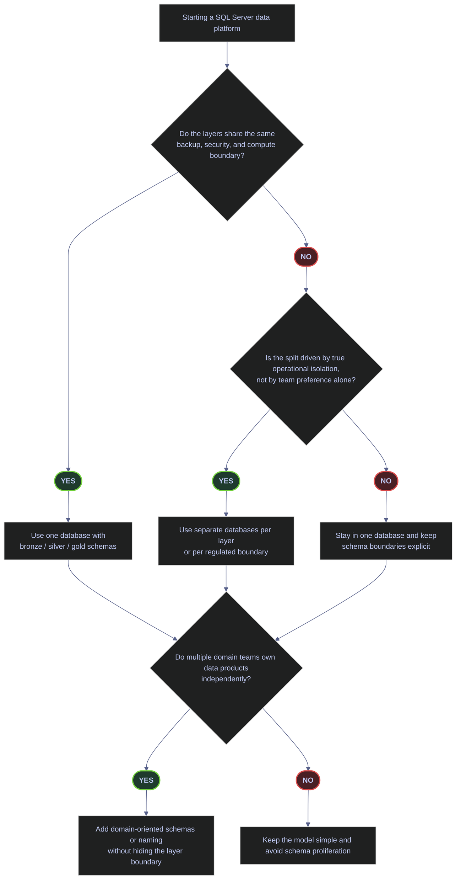

# SQL Server Schema Layering

> [!abstract]- Summary
>
> One SQL Server database, one schema per medallion layer (`bronze` / `silver` / `gold`), and permissions granted at the schema level — deviate only when a real operational boundary such as recovery model, compliance perimeter, or domain ownership forces a different shape. Schema design is not cosmetic in SQL Server; it determines how clearly readers can tell raw, transformed, and published data apart, whether permissions can be granted cleanly, and whether the database drifts into unmanageable `dbo` sprawl.
>
> **Conceptual baseline**
> - defines the medallion model, `dbo`, schema ownership, and schemas as namespace plus permission boundaries
>
> **Live baseline**
> - grounds the discussion in the current `stoxx` layout so the note compares design patterns against a real schema inventory instead of abstract diagrams
>
> **Organizing patterns**
> - evaluates schema-per-layer as the default recommendation, then compares separate databases per layer, schema-per-domain, schema-per-source staging, and control or contract schemas
>
> **Naming and security**
> - covers naming rules, metadata conventions, and cross-schema security so layering stays visible in both object names and permission design
>
> **Decision and anti-patterns**
> - closes with the decision guide, anti-patterns, and the current recommendation for `stoxx`
>
> **Operations and safety**
> - Warnings: schema proliferation, `dbo` sprawl, and database splits driven by aesthetics rather than real operational boundaries all make the platform harder to secure and evolve
> - Recommendations: keep the default simple, grant permissions at the schema level, and only split databases when the recovery or compliance boundary is genuinely different

> [!note]- Glossary
>
> **Medallion architecture**
> - A layered data-platform convention that separates raw, cleaned, and published data into `bronze`, `silver`, and `gold`.
> - It matters because the note’s default schema pattern is built around those maturity boundaries, not around arbitrary team preference.
>
> > [!info] The layer is a contract, not just a label
> >
> > `bronze`, `silver`, and `gold` communicate how trustworthy and reusable the data is. The names matter because they tell readers what the table is for.
>
> ---
>
> **`dbo`**
> - SQL Server’s default schema and a common landing place for objects created without an explicit schema qualifier.
> - It matters because uncontrolled use of `dbo` is how otherwise well-designed databases turn into mixed-purpose object piles.
>
> > [!warning] `dbo` sprawl is an operational smell
> >
> > When everything lands in `dbo`, schema-level security and discoverability collapse. The problem is cumulative and gets harder to reverse later.
>
> ---
>
> **Schema boundary**
> - The combination of namespace, ownership, and permission scope created by placing objects under one schema name.
> - It matters because schema boundaries are the main organizing unit for SQL Server data-platform design in this note.
>
> > [!info] Namespaces and permissions align well here
> >
> > A schema is one of the few SQL Server features that improves both discoverability and authorization design at the same time.
>
> ---
>
> **Schema ownership**
> - The database principal that owns a schema and participates in DDL authority plus ownership chaining.
> - It matters because stable ownership is what keeps deployments portable and predictable across environments.
>
> > [!warning] Implicit ownership drifts with deployers
> >
> > If the creating account becomes the owner by accident, ownership depends on whoever happened to run the script rather than on deliberate design.
>
> ---
>
> **Schema-per-layer**
> - The pattern of keeping one database while separating `bronze`, `silver`, and `gold` into distinct schemas.
> - It matters because it is the note’s default recommendation for most SQL Server pipeline systems.
>
> > [!info] Simple is a feature
> >
> > One database with clear layer schemas is often easier to secure, back up, and operate than a more fragmented estate pretending to be sophisticated.
>
> ---
>
> **Separate databases per layer**
> - A design that puts raw, cleaned, or published layers into different databases instead of only different schemas.
> - It matters because it is sometimes justified by real isolation needs, but it also introduces heavier operational boundaries.
>
> > [!warning] Do not split just because it “feels cleaner”
> >
> > Separate databases multiply backup, restore, security, and deployment surfaces. They should exist for a real boundary, not a cosmetic preference.
>
> ---
>
> **Schema-per-domain**
> - A pattern where schemas represent business domains or product areas in addition to or instead of data-maturity layers.
> - It matters because some teams need domain ownership without losing the layer semantics that make pipeline state obvious.
>
> > [!warning] Too many axes create confusion
> >
> > When layers, domains, sources, and teams all become schema names at once, the model stops clarifying and starts obscuring the system.
>
> ---
>
> **Schema-level permission**
> - A grant or deny applied to `SCHEMA::name` rather than to individual objects.
> - It matters because schema-level permissions are the practical security payoff of keeping the model layered and explicit.
>
> > [!info] This is usually the right granularity
> >
> > Granting at the schema level scales better than table-by-table grants and better reflects how pipeline workloads are normally owned.
>
> ---
>
> **Operational boundary**
> - A real separation in recovery, security, compliance, compute, or ownership requirements that justifies a stronger split than naming alone.
> - It matters because the note’s main design rule is to deviate from the simple default only when this kind of boundary is real.
>
> > [!warning] Team preference is not enough
> >
> > A different team owning a dataset does not automatically require a different database. Stronger boundaries should map to stronger operational needs.
>
> ---



## Key Concepts

Every later section in this note assumes the reader already understands five terms: the medallion architecture, the `dbo` schema, the schema as a namespace boundary, the schema as a permission scope, and schema ownership via `AUTHORIZATION`. This section defines each one precisely so the rest of the note can build on them without ambiguity.

### Medallion architecture — bronze, silver, gold

The medallion architecture is a three-layer convention for organizing a data platform by **data maturity**, not by physical storage location. It originated in the lakehouse world (Databricks, Delta Lake) and has become the standard vocabulary for warehouse and lakehouse designs alike.

| Layer | Data maturity | Typical contents | Typical consumers | Source of truth? |
|---|---|---|---|---|
| `bronze` | Raw, as-landed | Ingested source records, usually append-only, with metadata such as `_ingested_at`, `_source_file`, `_batch_id` | Pipeline jobs only | No — re-fetchable from upstream |
| `silver` | Cleaned, deduplicated, conformed | Business-ready facts and dimensions, validated types, joined reference data, SCD2 history | Pipeline jobs and analytical workloads | Usually yes |
| `gold` | Published, consumption-ready | Aggregates, metrics, denormalized reporting tables, or Kimball-style star schemas | Dashboards, BI tools, downstream products | No — rebuildable from silver |

The critical insight is that **each layer describes a different contract with its readers**, not a different physical location. `bronze` is a re-fetchable staging surface; `silver` is the operationally valuable historized truth; `gold` is the disposable, rebuildable presentation layer. Schemas named after layers make that contract visible in every fully qualified table name.

### The `dbo` schema

`dbo` (short for *database owner*) is the default schema SQL Server creates in every database and assigns to every new user that does not have an explicit default schema. When a user issues `CREATE TABLE foo` without a schema qualifier, SQL Server places `foo` in `dbo` unless the user's default schema has been changed.

This default behavior is the root cause of *`dbo` sprawl*: over time, every ad-hoc table, every demo, every temporary support object, and every legacy import accumulates in `dbo` because no one had to think about where it should go. Once that has happened, schema-level security becomes impossible (there is no layer boundary to grant against), discoverability collapses (there is no semantic clue in the fully qualified name), and cleanup becomes risky (no one knows which `dbo` tables are still in use).

Schema-per-layer is the structural defense against `dbo` sprawl: if `bronze`, `silver`, and `gold` exist from day one and production objects are placed in them from day one, `dbo` never becomes a dumping ground.

### The schema as a namespace boundary

A SQL Server schema is first and foremost a **namespace**: a container that gives objects a fully qualified two-part name (`schema.object`). Two tables with the same name can coexist in different schemas (`bronze.ohlcv` and `silver.ohlcv`) and are unambiguously different objects.

The schema is not a physical container — it does not imply a separate file group, backup unit, or security boundary unless the operator chooses to create one. It is purely a logical grouping that shows up in system catalog views (`sys.schemas`, `sys.tables.schema_id`) and in every reference to the object.

### The schema as a permission scope

SQL Server allows permissions to be granted, denied, or revoked at four class levels: the server, the database, the **schema**, and the individual object. The schema-level class is identified in `sys.database_permissions` as `class = 3` with `class_desc = 'SCHEMA'`. When a permission is granted at the schema level, it automatically applies to every object inside that schema, including objects that do not yet exist.

The scope qualifier for schema-level grants is `SCHEMA::schema_name`:

- `GRANT SELECT ON SCHEMA::gold TO dashboard_reader` grants `SELECT` on every current and future table in `gold`.
- `DENY SELECT ON SCHEMA::silver TO dashboard_reader` denies `SELECT` on every current and future table in `silver`, and that `DENY` takes precedence over any `GRANT` the principal might inherit from another role.

The `::` scope qualifier is required for schema-level grants — without it, SQL Server interprets the statement as an object-level grant and fails if no object with that name exists.

### Schema ownership via `AUTHORIZATION`

Every schema has exactly one owner, recorded in `sys.schemas.principal_id` (which joins to `sys.database_principals.principal_id`). The owner is set either implicitly (the default is the creator) or explicitly with `CREATE SCHEMA name AUTHORIZATION owner_name`. Ownership can be transferred later with `ALTER AUTHORIZATION ON SCHEMA::name TO new_owner`.

Schema ownership has three operational consequences:

- The schema owner retains `CONTROL` permission on every object in the schema, regardless of who created the object.
- Objects created inside the schema have `NULL` in `sys.objects.principal_id`, which means they inherit the schema owner for ownership-chain purposes.
- Ownership chaining (where permissions on a view or stored procedure implicitly cover the tables it touches) only works cleanly when all objects share the same owner — which is almost always the case when the schema owner owns everything inside it.

In practice: when a schema boundary is aligned to a team or a function, set the owner to match. When a schema is just a layer name in a single-team database, the default `dbo` owner is correct.

## Live Baseline

The current `stoxx` database already shows why schema layering matters. It has a real `bronze / silver / gold` backbone, but it also has a large `dbo` surface carrying demos, support tables, and mixed-purpose objects. This section captures two audit queries against the live instance: one aggregate view of every relevant schema, and one representative sample of the tables that sit in each layer.

### Current schema footprint in `stoxx`

The first audit establishes a baseline: how many tables live in each of the four relevant schemas, how much data they hold, how many are demo-shaped, and whether any schema-level permissions are in place.

#### Inspect the schema footprint

**When to run:** At the very start of any schema-design review, before deciding whether to keep, split, or consolidate existing schemas.
**Trigger:** A new engineer joining the platform, a pre-migration audit, or a governance review triggered by growth of `dbo`.
**Context:** Read-only T-SQL query against `sys.schemas`, `sys.tables`, `sys.partitions`, and `sys.database_permissions`. Requires `VIEW DEFINITION` on the database or membership in a role that implies it. No state change.
**Purpose:** Produce a single-row-per-schema summary that exposes the layer structure, the workload scale in each layer, the governance risk (demo tables in `dbo`), and the current schema-level security posture in one output.

The query touches four catalog views. Before running it, make sure the column semantics are clear: every field in the `SELECT` list either comes from a catalog view directly or is a computed aggregate derived from one.

| Field | Source | Type / Unit | Meaning |
|---|---|---|---|
| `schema_name` | `sys.schemas.name` | `sysname` | Logical name of the schema, unique within the database. |
| `schema_owner` | `USER_NAME(sys.schemas.principal_id)` | `nvarchar(128)` | Database principal that owns the schema. Resolved via `USER_NAME()` so the output is a readable name, not a raw id. |
| `table_count` | `COUNT(DISTINCT sys.tables.object_id)` | integer | Distinct user tables belonging to this schema. `DISTINCT` is required because the `LEFT JOIN` to `sys.partitions` multiplies rows for partitioned tables. |
| `total_rows` | `SUM(sys.partitions.rows)` filtered on `index_id IN (0,1)` | `bigint` | Sum of row counts across the heap (`index_id = 0`) or clustered index (`index_id = 1`) of each table. `COALESCE(...,0)` replaces `NULL` with `0` for empty schemas. |
| `demo_table_count` | `SUM(CASE WHEN sys.tables.name LIKE 'demo[_]%' THEN 1 ELSE 0 END)` | integer | Number of tables whose name begins with the literal prefix `demo_`. The `[_]` escape prevents the `_` wildcard from matching arbitrary characters. |
| `explicit_schema_permission_rows` | `SUM(CASE WHEN sys.database_permissions.class = 3 THEN 1 ELSE 0 END)` | integer | Number of rows in `sys.database_permissions` attached to this schema as a securable. `class = 3` is the schema class. |
| `sys.partitions.index_id` | `sys.partitions` | `int` | Row-count source selector: `0` = heap, `1` = clustered index, `>1` = non-clustered indexes. Using `IN (0,1)` avoids double-counting rows across non-clustered index copies. |
| `sys.database_permissions.class` | `sys.database_permissions` | `tinyint` | Permission class identifier: `0` = Database, `1` = Object/Column, `3` = Schema, `4` = Database Principal, and so on. Full enumeration in [sys.database_permissions](https://learn.microsoft.com/sql/relational-databases/system-catalog-views/sys-database-permissions-transact-sql?view=sql-server-ver17). |
| `sys.database_permissions.major_id` | `sys.database_permissions` | `int` | ID of the securable. When `class = 3`, `major_id` is the `schema_id`. |

> [!info]- Clause-by-clause breakdown
>
> The query is a left join across `sys.schemas`, `sys.tables`, `sys.partitions`, and `sys.database_permissions`:
>
> - `FROM sys.schemas AS s` — start with one row per schema so empty schemas still appear in the output.
> - `LEFT JOIN sys.tables AS t ON s.schema_id = t.schema_id` — attach every user table to its schema. `LEFT` preserves empty schemas.
> - `LEFT JOIN sys.partitions AS p ON t.object_id = p.object_id` — attach every partition of every table. This is where `total_rows` comes from.
> - `LEFT JOIN sys.database_permissions AS dp ON dp.class = 3 AND dp.major_id = s.schema_id` — attach any schema-level permission rows, filtered to class 3 so object-level permissions do not leak in.
> - `WHERE s.name IN ('dbo','bronze','silver','gold')` — restrict to the four schemas this note reasons about.
> - `GROUP BY s.name, s.principal_id` — collapse back to one row per schema.
> - `ORDER BY CASE s.name WHEN 'bronze' THEN 1 ... END` — force the medallion reading order so the output always flows `bronze → silver → gold → dbo`.
>
> *Summarize the schema layout of the current database.*

```sql
SELECT
    s.name AS schema_name,
    USER_NAME(s.principal_id) AS schema_owner,
    COUNT(DISTINCT t.object_id) AS table_count,
    COALESCE(SUM(CASE WHEN p.index_id IN (0,1) THEN p.rows END), 0) AS total_rows,
    SUM(CASE WHEN t.name LIKE 'demo[_]%' THEN 1 ELSE 0 END) AS demo_table_count,
    SUM(CASE WHEN dp.class = 3 THEN 1 ELSE 0 END) AS explicit_schema_permission_rows
FROM sys.schemas AS s
LEFT JOIN sys.tables AS t
  ON s.schema_id = t.schema_id
LEFT JOIN sys.partitions AS p
  ON t.object_id = p.object_id
LEFT JOIN sys.database_permissions AS dp
  ON dp.class = 3
 AND dp.major_id = s.schema_id
WHERE s.name IN ('dbo','bronze','silver','gold')
GROUP BY s.name, s.principal_id
ORDER BY CASE s.name
    WHEN 'bronze' THEN 1
    WHEN 'silver' THEN 2
    WHEN 'gold' THEN 3
    WHEN 'dbo' THEN 4
    ELSE 5
END;
```

| schema_name | schema_owner | table_count | total_rows | demo_table_count | explicit_schema_permission_rows |
|---|---|---:|---:|---:|---:|
| `bronze` | `dbo` | 12 | 30307 | 0 | 0 |
| `silver` | `dbo` | 7 | 224102 | 0 | 0 |
| `gold` | `dbo` | 3 | 6162 | 0 | 0 |
| `dbo` | `dbo` | 19 | 1703099 | 14 | 0 |

The live layout is a mostly-correct layered design with one clear weakness: `bronze`, `silver`, and `gold` exist and already carry the real medallion flow, but `dbo` is still the largest schema by row count and contains 14 demo tables. In a production warehouse, that is a governance smell — `dbo` should not become the place where unrelated operational, demo, and fallback objects accumulate indefinitely. The `explicit_schema_permission_rows = 0` column shows that even though the layer boundary exists structurally, it is not yet being used as a security boundary.

| Column | Observed value | Watch | Meaning | Implication |
|---|---|---|---|---|
| `schema_name` present for `bronze`, `silver`, `gold` | 3 rows | Healthy | All three medallion layers are structurally present. | Good foundation — no CREATE SCHEMA work required before layer-based security can be adopted. |
| `schema_owner` | `dbo` for every schema | Healthy in a single-team sandbox; noteworthy in a multi-team platform | Every schema is owned by the default `dbo` user. | Acceptable here because the platform is single-admin. In a multi-team platform, ownership should reflect which team controls the layer. |
| `table_count` in `bronze`/`silver`/`gold` | `12` / `7` / `3` | Healthy | Narrowing from bronze to gold shows the expected distillation shape of a medallion flow. | Layer intent is visible in the population. |
| `table_count` in `dbo` | `19` | Warning | `dbo` holds more tables than any single layer schema. | Most of these are demo and legacy. New production objects must stop landing here. |
| `total_rows` in `dbo` | `1,703,099` | Warning | `dbo` carries more rows than all three layer schemas combined. | Row volume is concentrated outside the layer model — harder to reason about backup priorities, access control, and lineage. |
| `demo_table_count` in `dbo` | `14` | Warning in production, expected in a lab | Demos mixed with production-shaped objects. | Fine for this sandbox. For promotion to production, demos should move to an isolated `demo` or `lab` schema, not stay in `dbo`. |
| `explicit_schema_permission_rows` | `0` across all four schemas | Warning in a production warehouse | No schema-level permissions are in effect. | The database is *ready* for schema-based security but is not using it yet. See [#Cross-Schema Security](#cross-schema-security) for the repair pattern. |

**`dbo` carrying the largest row count is a governance smell.** In a production data platform, the layer schemas should dominate row counts because the business data lives there. When `dbo` carries more rows than `bronze + silver + gold` combined, it means the default schema has become a fallback dumping ground — and future grants, audits, and cleanup tasks will all suffer. **Treat `dbo` as a system-owned namespace only.** Put every production-facing object in the layer schema that matches its maturity. Keep demos in an explicit `demo` schema so they can be dropped in one command without touching production-shaped tables. The full security argument for this rule is covered in [Cross-Schema Security](#cross-schema-security) below.

### Representative table layout by schema

The previous query aggregated by schema. The next query drops to the table level so the layer semantics are visible row by row: what does a typical `bronze` table look like, what does `silver` look like, what does `gold` look like.

#### Inspect representative tables per layer

**When to run:** Immediately after the schema footprint audit, when the aggregate numbers have raised a question about what actually lives in each layer.
**Trigger:** A discussion about whether a table is in the wrong layer, or a cleanup review of `dbo`.
**Context:** Read-only T-SQL query. Uses a CTE plus `TOP (20)` to keep the sample short enough to read without losing the cross-layer comparison. No state change.
**Purpose:** Show that the live row counts align with the intended medallion semantics: small raw landings in `bronze`, larger cleaned history in `silver`, and compact presentation tables in `gold`.

| Field | Source | Type / Unit | Meaning |
|---|---|---|---|
| `schema_name` | `sys.schemas.name` | `sysname` | Schema containing the table. |
| `table_name` | `sys.tables.name` | `sysname` | Name of the user table, unqualified. |
| `row_count` | `SUM(sys.partitions.rows)` filtered on `index_id IN (0,1)` | `bigint` | Total rows across the heap or clustered index of the table. Non-clustered index rows are excluded by the `index_id IN (0,1)` filter to avoid double-counting. |
| CTE `row_counts` | Intermediate result | — | Per-table row counts, computed once so the outer `SELECT TOP (20) ... ORDER BY` can stably break ties. |

> [!info]- Clause-by-clause breakdown
>
> - The CTE aggregates row counts per table across heap and clustered-index partitions, filtered to the four schemas under review.
> - The outer `SELECT TOP (20)` limits output to a readable sample.
> - The `ORDER BY CASE ... END, row_count DESC, table_name` pins the reading order to medallion order (`bronze → silver → gold → dbo`), then by row count descending, then alphabetically.
>
> *Show a representative sample of tables across the layer schemas.*

```sql
WITH row_counts AS (
    SELECT
        s.name AS schema_name,
        t.name AS table_name,
        SUM(p.rows) AS row_count
    FROM sys.tables AS t
    JOIN sys.schemas AS s
      ON t.schema_id = s.schema_id
    JOIN sys.partitions AS p
      ON t.object_id = p.object_id
     AND p.index_id IN (0,1)
    WHERE s.name IN ('bronze','silver','gold','dbo')
    GROUP BY s.name, t.name
)
SELECT TOP (20)
    schema_name,
    table_name,
    row_count
FROM row_counts
ORDER BY CASE schema_name
    WHEN 'bronze' THEN 1
    WHEN 'silver' THEN 2
    WHEN 'gold' THEN 3
    WHEN 'dbo' THEN 4
    ELSE 5
END,
row_count DESC,
table_name;
```

| schema_name | table_name | row_count |
|---|---|---:|
| `bronze` | `trading_calendar` | 29335 |
| `bronze` | `dim_country` | 212 |
| `bronze` | `index_dim` | 169 |
| `bronze` | `signals_daily` | 169 |
| `bronze` | `signals_quarterly` | 169 |
| `bronze` | `eurostoxx50_ohlcv` | 50 |
| `bronze` | `stoxxasia50_ohlcv` | 50 |
| `bronze` | `stoxxusa50_ohlcv` | 50 |
| `bronze` | `pulse` | 40 |
| `bronze` | `pulse_tickers` | 40 |
| `bronze` | `oil20_ohlcv` | 19 |
| `bronze` | `dim_index` | 4 |
| `silver` | `eurostoxx50_ohlcv` | 67155 |
| `silver` | `stoxxusa50_ohlcv` | 66000 |
| `silver` | `stoxxasia50_ohlcv` | 64875 |
| `silver` | `oil20_ohlcv` | 25080 |
| `silver` | `signals_daily` | 635 |
| `silver` | `signals_quarterly` | 188 |
| `silver` | `index_dim` | 169 |
| `gold` | `index_performance` | 5351 |

The live row counts align with the intended layer semantics. `bronze` is small and source-shaped — `trading_calendar` at 29,335 rows dominates, every OHLCV landing holds only 50 rows because it is a latest-snapshot surface, and reference tables are tiny. `silver` carries the cleaned OHLCV history with tens of thousands of rows per index, because it is the historized source of truth. `gold` appears at the bottom with a single 5,351-row `index_performance` table because presentation tables are compact by design. That is exactly the pattern schema-per-layer is supposed to make obvious: the fully qualified name encodes the maturity level, and the row-count distribution confirms it.

| Column | Observed range | Watch | Meaning | Implication |
|---|---|---|---|---|
| `schema_name = 'bronze'`, per-table row counts | 4 to 29,335 | Healthy | Raw landings plus small reference data. `trading_calendar` is the largest by design (calendar across exchanges over a multi-year span). | Layer intent honored. |
| `schema_name = 'silver'`, per-table row counts | 169 to 67,155 | Healthy | Large cleaned fact tables dominate. Reference tables (`index_dim` at 169) are carried through for joins. | Layer intent honored — historized facts are where the row volume lives. |
| `schema_name = 'gold'`, per-table row counts | 5,351 (single table in the sample) | Healthy | Compact, presentation-shaped. | Layer intent honored — downstream consumers do not have to scan the fact table history to get to the answer. |
| `dbo` rows outside the top 20 | Not shown here — but the footprint query above reported 1,703,099 total | Warning in production | Bulk `dbo` rows live in demo_idxmaint_* tables seeded from the `04-SQL-Server/03-Query-Writing-and-Optimization/` chapter. | Disposable by design, but should not sit next to production-shaped objects long-term. |

## Schema-per-Layer (Default Recommendation)

For a single SQL Server database serving one pipeline system, schema-per-layer should be the default until a real operational boundary forces something else. The pattern is cheap to adopt, cheap to evolve into more elaborate variants later, and structurally prevents `dbo` sprawl.

### Create the medallion schemas

The three DDL statements below each create one layer schema if it does not already exist. They are written idempotently so they can be replayed on a database that already has some of the schemas present — a common situation when adopting the pattern on a brown-field system.

#### Create the `bronze` schema idempotently

**When to run:** Initial platform bootstrap, or when adopting schema-per-layer on an existing database that still has production objects in `dbo`.
**Trigger:** A decision to stop creating new objects in `dbo` and start placing them in layer schemas.
**Context:** T-SQL DDL against the current database. Requires `CREATE SCHEMA` permission. State-changing but idempotent: safe to re-run because the existence check guards the `CREATE`.
**Purpose:** Guarantee that a schema named `bronze` exists before any downstream DDL references `bronze.<table>`.

> [!info]- Why `EXEC('CREATE SCHEMA ...')` and not a direct statement
>
> `CREATE SCHEMA` must be the first statement in its batch in T-SQL. That rule makes it impossible to wrap the statement directly inside an `IF NOT EXISTS (...) CREATE SCHEMA ...` block, because the `IF` clause becomes the first statement. The `EXEC('CREATE SCHEMA bronze')` wrapper sidesteps the restriction by turning the DDL into a dynamic batch that `EXEC` launches on behalf of the enclosing `IF`. The result is an idempotent creation that is safe to replay.
>
> *Create the `bronze` schema if it does not already exist.*

```sql
IF NOT EXISTS (SELECT 1 FROM sys.schemas WHERE name = 'bronze')
    EXEC('CREATE SCHEMA bronze');
GO
```

```text
(no result set)
```

#### Create the `silver` schema idempotently

**When to run:** Immediately after `bronze` is in place, as part of the same bootstrap batch.
**Trigger:** Same as `bronze` — a decision to adopt schema-per-layer.
**Context:** T-SQL DDL, idempotent, same permission requirements as the `bronze` step.
**Purpose:** Guarantee that a schema named `silver` exists for cleaned, deduplicated, conformed tables.

> [!info]- Identical idempotent wrapper
>
> The structure mirrors the `bronze` step. The `EXEC('CREATE SCHEMA silver')` form is required for the same batch-ordering reason.
>
> *Create the `silver` schema if it does not already exist.*

```sql
IF NOT EXISTS (SELECT 1 FROM sys.schemas WHERE name = 'silver')
    EXEC('CREATE SCHEMA silver');
GO
```

```text
(no result set)
```

#### Create the `gold` schema idempotently

**When to run:** After `bronze` and `silver` are in place.
**Trigger:** Same bootstrap — or, on an older database, the moment someone decides to build a published reporting surface.
**Context:** T-SQL DDL, idempotent.
**Purpose:** Guarantee that a schema named `gold` exists for published analytical tables.

> [!info]- Why keep `gold` even if consumers currently read from `silver`
>
> Creating `gold` up front, even before the first published table exists, prevents a future migration cost: once dashboards and downstream tools start pointing at `silver.<table>`, moving the serving surface to a dedicated `gold` schema later becomes a coordinated refactor across many consumers. Creating the schema now costs nothing and preserves the option.
>
> *Create the `gold` schema if it does not already exist.*

```sql
IF NOT EXISTS (SELECT 1 FROM sys.schemas WHERE name = 'gold')
    EXEC('CREATE SCHEMA gold');
GO
```

```text
(no result set)
```

#### Verify the three layer schemas exist

**When to run:** Immediately after the three idempotent creates, to confirm the bootstrap was effective.
**Trigger:** Completion of any schema bootstrap or restore.
**Context:** Read-only query against `sys.schemas`. No state change.
**Purpose:** Produce a three-row verification capture that proves the layer skeleton is in place and shows each schema's id and owner.

| Field | Source | Type / Unit | Meaning |
|---|---|---|---|
| `schema_name` | `sys.schemas.name` | `sysname` | Logical schema name. |
| `schema_id` | `sys.schemas.schema_id` | `int` | Internal id. Useful to prove a schema was newly created versus carried over, because new schemas get higher ids. |
| `owner_name` | `USER_NAME(sys.schemas.principal_id)` | `nvarchar(128)` | Database principal that owns the schema. `dbo` for platform-level schemas unless otherwise specified. |

> [!info]- Ordering pinned to medallion order
>
> A plain `ORDER BY s.name` would return the three schemas alphabetically (`bronze`, `gold`, `silver`), which breaks the natural medallion reading order. The `CASE` expression forces the output to read `bronze → silver → gold` regardless of alphabetical order.
>
> *Confirm that the three layer schemas exist and show their ids and owners.*

```sql
SELECT
    s.name AS schema_name,
    s.schema_id,
    USER_NAME(s.principal_id) AS owner_name
FROM sys.schemas AS s
WHERE s.name IN ('bronze','silver','gold')
ORDER BY CASE s.name WHEN 'bronze' THEN 1 WHEN 'silver' THEN 2 WHEN 'gold' THEN 3 END;
```

| schema_name | schema_id | owner_name |
|---|---:|---|
| `bronze` | 5 | `dbo` |
| `silver` | 6 | `dbo` |
| `gold` | 7 | `dbo` |

All three layer schemas exist in the live `stoxx` database, owned by `dbo`, with contiguous ids `5`, `6`, `7`. The contiguous ids are the signature of a single bootstrap pass — the three schemas were created in order with no user-defined schemas created in between. `dbo` ownership is appropriate here because this is a single-admin sandbox. In a multi-team platform, the owners would typically be a role such as `etl_admin` created specifically to own the layer schemas.

Why schema-per-layer is still the best default:

- Query intent is obvious in every reference: `silver.signals_daily` tells the reader more than `dbo.signals_daily`.
- Schema-level grants are simple and durable. A single `GRANT SELECT ON SCHEMA::gold TO dashboard_reader` covers every current and future table in `gold`, with no per-table maintenance.
- Layer-wide review, retention, and cleanup become possible without parsing table-name prefixes.
- Moving later from schema-per-layer to a more elaborate variant (for example, adding domain schemas on top) is cheap. Cleaning up years of accumulated `dbo` sprawl is not.

## Separate Databases per Layer

Use separate databases only when the split is driven by a real operational boundary: different recovery model, different admin domain, different compliance perimeter, or different restore lifecycle. Splitting a single platform across multiple databases is a significant complexity cost — it has to be justified by a concrete operational win that a single database cannot deliver.

> [!warning] Database-per-layer is not a tidiness pattern
>
> Do not split layers into separate databases just because the names look tidy or because it matches a lakehouse folder layout. Cross-database querying, deployment, testing, and ownership become more complex immediately: three-part names everywhere, harder constraint and trigger modeling, more involved backup coordination, and extra security boundaries that have to be re-configured every time a new user joins.

> [!success] Split when the operational boundary is real
>
> Use separate databases when you genuinely need different backup-chain behavior, different restore isolation, a distinct compliance perimeter, or tenant/security boundaries that a single database cannot express cleanly. In those cases, the extra complexity is paid for by the operational win.

### Recovery-model split across layer databases

The most concrete and common reason to split layers across databases is **recovery model**. SQL Server supports three recovery models — `SIMPLE`, `BULK_LOGGED`, and `FULL` — and each has different log-chain semantics. Because recovery model is set at the database level, applying different policies to different layers requires different databases.

| Recovery model | Log-chain behavior | Point-in-time recovery | Typical use |
|---|---|---|---|
| `SIMPLE` | Log truncates automatically at each checkpoint; no log backups are needed or possible. | No | Re-loadable data, dev sandboxes, disposable staging. |
| `BULK_LOGGED` | Log is minimally logged for bulk operations; log backups are still required. | Partially — point-in-time recovery works except during bulk-logged intervals. | Large-scale loads with periodic heavy bulk operations. |
| `FULL` | Every change is fully logged; log backups are required to keep the log from growing unbounded. | Yes | Historized, operationally valuable data that must be recoverable to any point in time. |

#### Set different recovery models per layer database

**When to run:** During platform bootstrap of a database-per-layer design, after the layer databases have been created.
**Trigger:** A decision to split layers across databases because the layers have materially different restore obligations.
**Context:** T-SQL DDL against `master` or the instance level. Requires `ALTER` permission on each target database. State-changing. Changing recovery model affects log-chain behavior immediately; changes from `SIMPLE` to `FULL` require a subsequent full backup before point-in-time recovery becomes available. **Not executed against the live `stoxx` sandbox because this instance runs a single database for teaching purposes — changing its recovery model would break the Docker image's log-chain expectations.** The example below is presented as a reference pattern.

| Setting | What it controls | Possible values | Production guidance |
|---|---|---|---|
| `RECOVERY` | Log-chain behavior for the database | `SIMPLE`, `BULK_LOGGED`, `FULL` | Choose by restore obligation, not by aesthetics. `SIMPLE` for re-loadable data, `FULL` for historized truth, `BULK_LOGGED` only for databases with a predictable heavy-bulk window and a tolerance for partial point-in-time recovery. |

> [!info]- Why the recovery model is a database-level knob, not a schema-level one
>
> Recovery model governs the transaction log, and every database has exactly one log file set. It cannot vary per schema because schemas share the same log. The moment a platform genuinely needs two different recovery policies, it genuinely needs two databases.
>
> *Set different recovery models on each layer database when the layers have different restore obligations.*

```sql
ALTER DATABASE bronze_db SET RECOVERY SIMPLE;
ALTER DATABASE silver_db SET RECOVERY FULL;
ALTER DATABASE gold_db   SET RECOVERY SIMPLE;
```

Choose this when:

- `bronze` is re-fetchable and does not need point-in-time recovery — a full re-fetch from upstream is the accepted recovery path.
- `silver` is historized and operationally valuable enough to justify `FULL` plus a log-backup chain.
- `gold` is fully rebuildable from `silver` and does not justify its own log-backup chain.

Do not choose it when:

- All layers live on the same host, same team, same restore playbook — the layers have the same restore obligations and the split buys nothing.
- The split exists only to imitate a lakehouse folder pattern — folder-shaped layouts do not map onto SQL Server's database boundary cleanly.
- The team is not prepared to manage cross-database deployment, security, and referential integrity explicitly.

## Schema-per-Domain

Domain schemas are useful when teams genuinely own their data products end to end — they are responsible for both the ingestion and the published surface, and their deployment lifecycle is independent of other teams. Domain schemas are **not** a substitute for layer boundaries; they are an ownership overlay that must still express the maturity level of the data inside.

Data-mesh literature (Dehghani and others) pushes this further and argues that domain ownership should be the *primary* axis: the people closest to the data own both its operational and analytical forms, and share it through contracts. In a SQL Server platform that is not a pure mesh, the pragmatic compromise is to keep layer schemas as the primary axis in a single-team system and add domain schemas only when organizational ownership actually diverges.

### Create domain-owned schemas

The DDL below creates three domain schemas, each with an explicit owner via the `AUTHORIZATION` clause. In a real platform, the owner is usually a database role rather than an individual user, so that team membership changes do not require re-owning every schema.

#### Create a finance-owned schema

**When to run:** When a finance team is about to take ownership of its own data products and wants a namespace that reflects that ownership.
**Trigger:** A reorganization that gives a team end-to-end responsibility for an area of data.
**Context:** T-SQL DDL. Requires `CREATE SCHEMA` permission and `IMPERSONATE` permission on the owner principal (or membership in the target role, if the owner is a role). State-changing.
**Purpose:** Establish a schema whose owner is the team responsible for the data that lives in it, so ownership, permissions, and object lifetimes align with the team boundary.

| Setting | What it controls | Accepted values | Production guidance |
|---|---|---|---|
| `AUTHORIZATION owner_name` | Principal that owns the new schema | Database user, database role, or application role | Prefer a database role so team membership can change without re-owning the schema. On single-admin sandboxes, falling back to `dbo` is acceptable but provides no ownership signal. |

> [!info]- Why `AUTHORIZATION` is the cleanest way to model team ownership
>
> The schema owner becomes the principal responsible for every object inside that schema. Objects created within the schema inherit the owner via a `NULL` `principal_id` in `sys.objects`, which makes ownership chaining work cleanly for cross-object permission checks. This is the only SQL Server-native way to align schema boundaries with organizational boundaries without re-granting permissions every time an object is created.
>
> The example below uses `AUTHORIZATION dbo` because the live `stoxx` sandbox does not have dedicated domain-owner roles. In a real platform you would substitute `finance_owner`, `ops_owner`, `research_owner` (or whatever role names match your team structure) for the `dbo` placeholder.
>
> *Create a finance-owned schema with an explicit `AUTHORIZATION` clause.*

```sql
CREATE SCHEMA demo_finance AUTHORIZATION dbo;
```

```text
(no result set)
```

#### Create an operations-owned schema

**When to run:** Immediately after the finance schema, as part of the same bootstrap pass.
**Trigger:** Same domain-ownership adoption.
**Context:** T-SQL DDL, same permission requirements. State-changing.
**Purpose:** Establish a second domain schema so the pattern is verifiable with multiple owners.

> [!info]- Same pattern, different owner
>
> The only difference from the finance schema is the schema name. In production, this would also differ in the `AUTHORIZATION` clause (for example, `AUTHORIZATION ops_owner`).
>
> *Create an operations-owned schema with an explicit `AUTHORIZATION` clause.*

```sql
CREATE SCHEMA demo_operations AUTHORIZATION dbo;
```

```text
(no result set)
```

#### Create a research-owned schema

**When to run:** Immediately after the operations schema.
**Trigger:** Same domain-ownership adoption.
**Context:** T-SQL DDL, same permission requirements. State-changing.
**Purpose:** Establish a third domain schema so the verification query below returns a meaningful multi-row result.

> [!info]- Production naming
>
> In a real platform, research teams often share a mix of production and exploratory workloads. Consider whether the research schema should be in the main pipeline database at all, or in a separate sandbox database. Use the same decision framework as [#Separate Databases per Layer](#separate-databases-per-layer).
>
> *Create a research-owned schema with an explicit `AUTHORIZATION` clause.*

```sql
CREATE SCHEMA demo_research AUTHORIZATION dbo;
```

```text
(no result set)
```

#### Verify the domain schemas and their owners

**When to run:** Immediately after the three domain creates, to confirm the bootstrap was effective and the ownership is what was intended.
**Trigger:** Any time a domain-ownership boundary is introduced or changed.
**Context:** Read-only query against `sys.schemas`. No state change.
**Purpose:** Show that each expected schema exists and is owned by the expected principal — the single place where ownership intent becomes verifiable live state.

| Field | Source | Type / Unit | Meaning |
|---|---|---|---|
| `schema_name` | `sys.schemas.name` | `sysname` | Domain schema name. |
| `schema_id` | `sys.schemas.schema_id` | `int` | Internal id. High ids confirm this is a freshly created schema rather than a system schema. |
| `owner_name` | `USER_NAME(sys.schemas.principal_id)` | `nvarchar(128)` | Resolved owner name. Should match the `AUTHORIZATION` principal from the `CREATE SCHEMA` statement. |

> [!info]- Alphabetical sort is acceptable here
>
> Domain schemas do not have a natural medallion-style ordering, so the output is sorted alphabetically. This is the one place in this note where `ORDER BY s.name` is preferred to a pinned `CASE` expression.
>
> *Verify that the three demo domain schemas exist and show their owners.*

```sql
SELECT
    s.name AS schema_name,
    s.schema_id,
    USER_NAME(s.principal_id) AS owner_name
FROM sys.schemas AS s
WHERE s.name IN ('demo_finance','demo_operations','demo_research')
ORDER BY s.name;
```

| schema_name | schema_id | owner_name |
|---|---:|---|
| `demo_finance` | 9 | `dbo` |
| `demo_operations` | 10 | `dbo` |
| `demo_research` | 11 | `dbo` |

All three domain schemas were created successfully and received contiguous schema ids `9`, `10`, `11` (the next ids above the `bronze`/`silver`/`gold` block at `5`/`6`/`7`). Each one reports `dbo` as the owner because the sandbox does not have dedicated domain-owner roles; in a real platform the `owner_name` column would carry the team role name and would be the primary value this query exists to verify.

#### Clean up the demo domain schemas

**When to run:** Immediately after the verification capture, so the sandbox does not accumulate demonstration-only schemas.
**Trigger:** End of a demo or documentation run.
**Context:** T-SQL DDL. Requires `CONTROL` on each schema (inherited from `dbo` ownership). State-changing — the schemas must be empty, or `DROP SCHEMA` fails.
**Purpose:** Return the live instance to the pre-demo state so subsequent audits against `sys.schemas` are not polluted.

> [!info]- Drop order does not matter for empty schemas
>
> Because the demo schemas contain no objects, the drop order is irrelevant. In a real cleanup, objects inside a schema must be dropped (or transferred with `ALTER SCHEMA ... TRANSFER`) before the schema itself can be removed.
>
> *Drop the three demo domain schemas.*

```sql
DROP SCHEMA demo_research;
DROP SCHEMA demo_operations;
DROP SCHEMA demo_finance;
```

```text
(no result set)
```

### Keep the layer meaning visible

Domain schemas succeed only when the layer semantics stay visible. If a domain schema hides which data is raw, which is cleaned, and which is published, consumers lose the maturity signal that made schema-per-layer valuable in the first place.

> [!tip] Two acceptable patterns, one anti-pattern
>
> When adopting domain schemas, keep the maturity signal in either the object name or the schema name:
>
> - **Layer prefix on object names.** `finance.bronze_trades`, `finance.silver_trades`, `finance.gold_positions`. Compact; one schema per team; layer is visible in the first component of every table name.
> - **Domain-and-layer schema names.** `finance_bronze`, `finance_silver`, `finance_gold`. Verbose but unambiguous; layer is visible in the schema name itself. Preferred when ownership clarity matters more than compact names.
>
> The anti-pattern is a domain schema where the layer is implicit: `finance.trades` with no indication of whether this is raw, cleaned, or published. Readers have to open the definition (or read a doc) to find out.

## Schema-per-Source for Staging

Schema-per-source is a **staging-only** pattern. It is useful when multiple upstream systems land with different refresh schedules, data quality quirks, file formats, or column naming conventions. Each source gets its own isolated landing namespace so source-specific mess does not pollute the bronze layer.

The pattern layers on top of schema-per-layer — it does not replace it. The downstream contract is still that every source-scoped staging table normalizes into a common `bronze.<table>` surface before it is consumed by the rest of the pipeline.

### Create source-scoped staging schemas

The DDL below creates three staging schemas, one per upstream source. Each schema is a dedicated landing namespace where the ingestion pipeline can write source-specific column shapes without a naming conflict.

#### Create a staging schema for the yfinance source

**When to run:** During the initial configuration of a new upstream source, before any ingestion job writes landing data.
**Trigger:** A new upstream feed is about to be onboarded.
**Context:** T-SQL DDL. Requires `CREATE SCHEMA` permission. State-changing.
**Purpose:** Isolate the `yfinance` upstream's landing tables from every other source, so column renames, schema drift, and ingestion quirks from `yfinance` never collide with other upstreams.

> [!info]- Why a dedicated landing schema instead of a table-name prefix
>
> A table-name prefix (`stg_yfinance_ohlcv`) and a schema boundary (`stg_yfinance.ohlcv`) solve the same surface problem, but the schema boundary scales better. Permissions can be granted once at the schema level (`GRANT INSERT ON SCHEMA::stg_yfinance TO yfinance_ingest`), retention policies can be applied per schema, and cleanup of a retired source is a single `DROP SCHEMA` plus the objects it contained — no table-name pattern matching required.
>
> *Create a dedicated landing schema for the yfinance upstream.*

```sql
CREATE SCHEMA demo_stg_yfinance;
```

```text
(no result set)
```

#### Create a staging schema for the bloomberg source

**When to run:** During onboarding of a second upstream source.
**Trigger:** A new upstream feed is about to be onboarded.
**Context:** T-SQL DDL, same permission requirements. State-changing.
**Purpose:** Second staging schema to demonstrate multi-source isolation.

> [!info]- Different sources, different table shapes
>
> Most real upstream sources disagree about column naming and types. A Bloomberg feed might call the trade timestamp `TradeDateTime`, while a yfinance feed calls the same concept `date`. Keeping them in different staging schemas lets each landing table match the upstream's shape exactly, without compromising on column naming for downstream clarity — the normalization into a common `bronze` shape happens after landing, not during.
>
> *Create a dedicated landing schema for the bloomberg upstream.*

```sql
CREATE SCHEMA demo_stg_bloomberg;
```

```text
(no result set)
```

#### Create a staging schema for manual uploads

**When to run:** When a platform needs to accept occasional manual uploads (CSV drops, one-off spreadsheets, vendor deliveries) that are not tied to any automated feed.
**Trigger:** Recognition that manual uploads are a recurring need and deserve their own boundary.
**Context:** T-SQL DDL, same permission requirements. State-changing.
**Purpose:** Capture manual uploads in a bounded namespace that can be cleaned up or audited separately from automated landings.

> [!info]- Why manual uploads deserve their own schema
>
> Manual uploads are the most common source of surprise data in a warehouse: someone drops a CSV, it ends up in `dbo` with a name nobody recognizes six months later, and no one knows whether it is safe to delete. A dedicated `stg_manual` (or `demo_stg_manual`) schema gives those uploads a well-known home and an obvious scope for retention policies such as "drop everything older than 30 days."
>
> *Create a dedicated landing schema for manual uploads.*

```sql
CREATE SCHEMA demo_stg_manual;
```

```text
(no result set)
```

#### Verify the source-scoped staging schemas

**When to run:** Immediately after the three staging schemas are created.
**Trigger:** Completion of source-schema bootstrap.
**Context:** Read-only query against `sys.schemas`. No state change.
**Purpose:** Confirm that each source schema exists and is owned by the expected principal, as a single verification capture.

| Field | Source | Type / Unit | Meaning |
|---|---|---|---|
| `schema_name` | `sys.schemas.name` | `sysname` | Source staging schema name. |
| `schema_id` | `sys.schemas.schema_id` | `int` | Internal id. |
| `owner_name` | `USER_NAME(sys.schemas.principal_id)` | `nvarchar(128)` | Resolved owner. For staging schemas, the owner is usually an ingestion service account. |

> [!info]- Pattern matching with `LIKE 'demo_stg[_]%'`
>
> The bracketed `[_]` escape prevents the `_` wildcard from matching any single character. Without the brackets, `LIKE 'demo_stg_%'` would match any schema whose name begins with `demo_st` followed by any character followed by `_` followed by anything — false positives if a sibling schema happened to start with `demo_sta_`.
>
> *Verify that the three source-scoped staging schemas exist.*

```sql
SELECT
    s.name AS schema_name,
    s.schema_id,
    USER_NAME(s.principal_id) AS owner_name
FROM sys.schemas AS s
WHERE s.name LIKE 'demo_stg[_]%'
ORDER BY s.name;
```

| schema_name | schema_id | owner_name |
|---|---:|---|
| `demo_stg_bloomberg` | 10 | `dbo` |
| `demo_stg_manual` | 11 | `dbo` |
| `demo_stg_yfinance` | 9 | `dbo` |

All three staging schemas exist with contiguous ids `9`, `10`, `11`. They reused the same id range the previous demo domain schemas had occupied because those had been dropped between the two demos — `schema_id` values are reclaimed when a schema is dropped and reassigned to the next `CREATE SCHEMA`. The alphabetical sort places `demo_stg_bloomberg` first even though it has id `10`, because ordering is on `schema_name`, not on `schema_id`.

#### Clean up the demo staging schemas

**When to run:** Immediately after the verification capture, so the sandbox does not retain demonstration schemas.
**Trigger:** End of the staging-schema demo.
**Context:** T-SQL DDL. Requires `CONTROL` on each schema. State-changing — `DROP SCHEMA` fails if the schema contains any object.
**Purpose:** Return the live instance to the pre-demo state.

> [!info]- No objects means no transfer step
>
> In a real cleanup of staging schemas, the ingestion tables must be dropped (or transferred to `bronze`) before `DROP SCHEMA` can succeed. The demo schemas above contain no objects, so they can be dropped directly.
>
> *Drop the three demo staging schemas.*

```sql
DROP SCHEMA demo_stg_manual;
DROP SCHEMA demo_stg_bloomberg;
DROP SCHEMA demo_stg_yfinance;
```

```text
(no result set)
```

### Recommended end-to-end flow

When schema-per-source is layered on top of schema-per-layer, the complete pipeline namespace becomes:

| Stage | Schema | Contents | Consumers |
|---|---|---|---|
| Source landing | `stg_yfinance`, `stg_bloomberg`, `stg_manual` | Upstream-shaped landing tables, one per source | Ingestion pipelines only |
| Normalized raw | `bronze.*` | Common-shape persisted raw tables, metadata-augmented | Downstream cleaning jobs |
| Cleaned | `silver.*` | Deduplicated, conformed, historized business-ready tables | Analytics jobs, semantic models |
| Published | `gold.*` | Aggregates, metrics, reporting tables | Dashboards, BI tools, downstream products |

The key constraint is that `stg_*` is a pipeline-internal boundary. It exists so ingestion can move quickly without polluting the rest of the database, and it is never exposed to end users — BI tools and dashboards always read from `gold`, occasionally `silver`, and never from `stg_*`.

## Control, Audit, And Contract Schemas

Layer schemas explain data maturity, but they do not solve every architectural boundary. Production platforms also need a place for pipeline control state, quality events, and stable consumer contracts. Those objects should not be scattered through `dbo`, and they should not be mixed into `bronze`, `silver`, or `gold` when they serve a different operational purpose — they describe the pipeline itself, not the business data flowing through it.

### Readiness check for control-plane schemas

The first step before adopting a control, audit, or contract schema is to find out which of them already exist. A single query against `SCHEMA_ID` collapses the check into one readable row.

#### Check whether control-plane schemas exist

**When to run:** Before planning any control, audit, or contract schema adoption, or during a platform maturity audit.
**Trigger:** Any initiative that wants to add watermark tables, run ledgers, or stable contract views to the platform.
**Context:** Read-only query that calls `SCHEMA_ID()` once per candidate schema. Uses `CASE ... IS NULL` to produce a 0/1 readiness flag for each. No state change.
**Purpose:** Produce a one-row readiness checklist for five common supporting schemas, so the reader knows at a glance which of them are already in place and which would be new adoptions.

| Field | Source | Type / Unit | Meaning |
|---|---|---|---|
| `meta_schema_exists` | `SCHEMA_ID('meta')` | `bit`-shaped `int` | `0` if `meta` is absent, `1` if present. Intended to hold watermarks, run ledgers, dependency state, and schema contracts. |
| `control_schema_exists` | `SCHEMA_ID('control')` | `bit`-shaped `int` | `0`/`1` presence flag for a schema named `control`. Alternative name for the same control-plane role as `meta`. |
| `audit_schema_exists` | `SCHEMA_ID('audit')` | `bit`-shaped `int` | `0`/`1` presence flag for a schema named `audit`. Intended for retained operational evidence and quality events. |
| `history_schema_exists` | `SCHEMA_ID('history')` | `bit`-shaped `int` | `0`/`1` presence flag for a schema named `history`. Intended for explicit temporal or CDC-facing history surfaces. |
| `contract_schema_exists` | `SCHEMA_ID('contract')` | `bit`-shaped `int` | `0`/`1` presence flag for a schema named `contract`. Intended for stable consumer-facing views or synonyms. |

> [!info]- `SCHEMA_ID` return semantics
>
> `SCHEMA_ID('name')` returns the integer id of the schema if it exists, or `NULL` if it does not. The `CASE WHEN SCHEMA_ID(...) IS NULL THEN 0 ELSE 1 END` pattern collapses the return value to a 0/1 flag so the output reads as a readiness checklist rather than a set of opaque ids. `SCHEMA_ID` can be called anywhere an expression is allowed, so multiple checks can be folded into a single-row `SELECT` without any joins.
>
> *Check whether the supporting control, audit, history, or contract schemas already exist in the current database.*

```sql
SELECT
    CASE WHEN SCHEMA_ID('meta') IS NULL THEN 0 ELSE 1 END AS meta_schema_exists,
    CASE WHEN SCHEMA_ID('control') IS NULL THEN 0 ELSE 1 END AS control_schema_exists,
    CASE WHEN SCHEMA_ID('audit') IS NULL THEN 0 ELSE 1 END AS audit_schema_exists,
    CASE WHEN SCHEMA_ID('history') IS NULL THEN 0 ELSE 1 END AS history_schema_exists,
    CASE WHEN SCHEMA_ID('contract') IS NULL THEN 0 ELSE 1 END AS contract_schema_exists;
```

| meta_schema_exists | control_schema_exists | audit_schema_exists | history_schema_exists | contract_schema_exists |
|---:|---:|---:|---:|---:|
| 0 | 0 | 0 | 0 | 0 |

`stoxx` currently has none of these supporting schemas, which keeps the model simple but also means there is no explicit home yet for control tables, quality events, or stable consumer-facing abstractions. On a single-admin sandbox that is acceptable — the cost of adopting a control-plane schema is not yet paid off by a matching operational benefit. If the platform grows beyond a single-admin sandbox, this absence becomes an architectural decision rather than a neutral default, and the next two subsections describe when each of these schemas starts to pay for itself.

### Add a `meta` or `control` schema for pipeline state

The control plane of a data platform is not the same thing as the data layers. A `meta` or `control` schema is where the platform stores state about the pipeline itself rather than business data flowing through the pipeline. Typical contents cluster around four object families, all of which share the property that they describe *the pipeline*, not *the data*.

| Object family | Typical contents | Why it belongs outside `bronze / silver / gold` |
|---|---|---|
| Watermarks | Last successful processed date, LSN, or rowversion per pipeline step | It describes pipeline progress, not business data |
| Run ledger | Run ids, start/end time, row counts, status, error summary | It is operational history for the ETL system |
| Schema contracts | Expected source columns, allowed type changes, approval state | It governs writes rather than serving analytics directly |
| Quality events | Failed checks, offending keys, reconciliation results | It is back-room operational evidence, not end-user gold data |

#### Create a control-plane schema

**When to run:** When the platform starts to need durable, queryable state about its own pipeline — typically the first time the operator needs to answer "did the last run succeed?" without reading logs.
**Trigger:** Adoption of a run-ledger, watermark, or schema-contract table; or a governance requirement that the pipeline's operational state be queryable like any other dataset.
**Context:** T-SQL DDL. Requires `CREATE SCHEMA` permission. State-changing.
**Purpose:** Establish a dedicated namespace for control-plane tables so they do not mix with either business data (`bronze`/`silver`/`gold`) or ad-hoc objects (`dbo`).

> [!info]- One control-plane schema, not many micro-schemas
>
> It is tempting to split the control plane into `meta`, `watermarks`, `contracts`, `runs`, `quality` — one schema per object family. This is an over-engineering trap. A single `meta` (or `control`) schema with a handful of well-named tables is easier to own, grant, back up, and clean up than five parallel schemas. Start with one; split only if a concrete operational win appears.
>
> *Create a single control-plane schema for pipeline state.*

```sql
CREATE SCHEMA demo_meta;
```

```text
(no result set)
```

#### Verify the control-plane schema exists

**When to run:** Immediately after the control-plane schema is created.
**Trigger:** Completion of the control-plane bootstrap.
**Context:** Read-only query against `sys.schemas`. No state change.
**Purpose:** Confirm the schema exists with the expected name, id, and owner before any table is placed in it.

> [!info]- Same verification pattern as the layer schemas
>
> The query follows the same shape as the layer-schema verification earlier in the note: `sys.schemas` filtered by name, with `USER_NAME(principal_id)` resolving the owner to a readable name.
>
> *Verify that the control-plane schema exists.*

```sql
SELECT
    s.name AS schema_name,
    s.schema_id,
    USER_NAME(s.principal_id) AS owner_name
FROM sys.schemas AS s
WHERE s.name = 'demo_meta';
```

| schema_name | schema_id | owner_name |
|---|---:|---|
| `demo_meta` | 9 | `dbo` |

The schema was created successfully with `schema_id = 9`, matching the pattern of every fresh schema in this note (the `schema_id` sequence reuses ids released by previous `DROP SCHEMA` statements). Ownership is `dbo` because no dedicated control-plane role exists on the sandbox; in a real platform the owner should be a role such as `platform_ops` or `etl_admin` so control-plane objects inherit the right permission profile.

#### Clean up the control-plane demo schema

**When to run:** After the verification capture, to leave the sandbox in its pre-demo state.
**Trigger:** End of the control-plane demo.
**Context:** T-SQL DDL. Requires `CONTROL` on the schema. State-changing.
**Purpose:** Drop the demo schema so subsequent audits do not see it.

> *Drop the demo control-plane schema.*

```sql
DROP SCHEMA demo_meta;
```

```text
(no result set)
```

### Separate audit or history surfaces from the core medallion flow

An `audit` or `history` schema is useful when the platform must expose retained operational evidence or explicit history surfaces that are not the same as the medallion layers. The boundary is about **consumer expectation**: when a reader queries `gold.<table>`, they expect published, current-state, business-shaped data; they do not expect to have to navigate around legal audit artifacts or raw CDC-facing helpers.

Use an `audit` or `history` schema when:

- Quality and reconciliation events need retention beyond the run ledger's operational window.
- Temporal or CDC history needs to be exposed in a curated form, distinct from the live table it was captured from.
- Legal or operational audit tables exist that should not sit beside the published gold model.

Avoid it when:

- The only reason is aesthetic symmetry with another platform or folder layout.
- The history is already handled correctly inside a table's own design — a system-versioned temporal table in `silver` or a well-scoped SCD2 dimension does not need a separate history schema.

### Expose stable contract views when physical tables keep evolving

A `contract` schema is often the cleanest answer when consumer-facing names must stay stable while the underlying physical tables continue to evolve. Instead of exposing the physical `gold.index_performance` table directly, the platform exposes `contract.index_performance` as a thin view over whatever physical table currently holds the data. When the physical table is refactored, renamed, or replaced, the view is updated in place and no downstream consumer is affected.

Good fits:

- Views that preserve a public column contract while `silver` or `gold` tables are refactored.
- Synonyms or narrow views that hide source-system churn from downstream tools.
- Semantic serving surfaces that should not expose internal helper columns such as `_batch_id` or `_ingested_at`.

This is not a replacement for `gold`. The pattern is:

- `gold` stores the published physical model and is the object `contract` views read from.
- `contract` exposes the stable consumer-facing abstraction when that extra decoupling is justified.

The Proxy pattern from *Data Engineering Design Patterns* makes this concrete: `contract.devices` is a view over `gold_internal.devices_20260101`, and when the physical table is rebuilt as `gold_internal.devices_20260401`, the view's definition is updated to point at the new physical table. Consumers always read `contract.devices`; the DBA swaps the underlying table as part of a routine refactor.

## Naming and Metadata Rules

Schema design fails when the naming inside the schema is inconsistent. The schema boundary gives the reader a maturity signal; the table and column names have to carry the rest of the meaning, and every inconsistency in naming accumulates into a slow tax on everyone who has to read the model later.

Recommended defaults:

- Keep table names business-oriented, not tool-oriented. Table names outlive the tool that built them.
- Use schema names to express the layer instead of prefixes like `raw_` or `stg_` on every table. If the schema already says `bronze`, the table name should not also say `raw_`.
- Keep metadata columns explicit and consistent across every landing table: `_ingested_at`, `_source_file`, `_batch_id`, `_index`. Fix the spelling once and never deviate.
- Prefer predictable index names: `PK_<table>` for primary keys, `UX_<table>_<cols>` for unique indexes, `IX_<table>_<cols>` for non-unique indexes.

**Never name schemas after tools** (`airflow`, `dbt`, `spark`, `fivetran`, `airbyte`) — tool names change on a timescale of years and the schema becomes meaningless the moment the tool is replaced. **Name schemas after the data boundary they represent**: `bronze`, `silver`, `gold`, `stg_yfinance`, `finance`, `audit`, `contract`. Every one of those names still makes sense if the underlying orchestrator is swapped out.

### Reserved words in table design

Financial OHLCV models routinely use column names that collide with T-SQL reserved words: `open`, `close`, and `date` are the most common offenders. SQL Server can handle them, but the quoting discipline has to be consistent — every reference to the column, in every query and every DDL statement, must either consistently bracket the name or consistently quote it.

#### Define a layer table with bracketed reserved-word columns

**When to run:** When defining a new bronze-layer table whose upstream feed uses column names that collide with T-SQL reserved words.
**Trigger:** A first load from a financial data source (yfinance, Bloomberg, Refinitiv) whose canonical column names include `date`, `open`, `high`, `low`, `close`.
**Context:** T-SQL DDL against the `bronze` schema. Requires `CREATE TABLE` permission on the schema. State-changing. Runs inside the bronze schema to preserve the layer semantics — the schema name carries the layer, the table name stays business-oriented, and the column names stay faithful to upstream.
**Purpose:** Create a table that preserves the familiar OHLCV column names (so downstream joins and the upstream feed stay readable) while remaining syntactically valid in every query that touches the table.

| Column | Data type | Nullability | Default | Reason |
|---|---|---|---|---|
| `symbol` | `varchar(20)` | `NOT NULL` | — | Business identifier, no quoting needed. |
| `[date]` | `date` | `NOT NULL` | — | Bracketed because `date` is a T-SQL function and reserved-like identifier. The bracket form is the safest portable quoting. |
| `[open]` | `float` | `NULL` | — | Bracketed because `OPEN` is a T-SQL reserved word (used by cursors). |
| `high` | `float` | `NULL` | — | Not reserved. Kept unbracketed for readability. |
| `low` | `float` | `NULL` | — | Not reserved. Kept unbracketed for readability. |
| `[close]` | `float` | `NULL` | — | Bracketed because `CLOSE` is a T-SQL reserved word (used by cursors). |
| `volume` | `bigint` | `NULL` | — | Not reserved. Kept unbracketed. |
| `_ingested_at` | `datetime2` | `NOT NULL` | `SYSUTCDATETIME()` | Standard ingestion metadata. UTC timestamp of the landing. |

> [!info]- Why only some columns are bracketed
>
> Only the columns whose unquoted name collides with a T-SQL reserved word or function are bracketed. `high`, `low`, `volume`, and `symbol` are ordinary identifiers and do not need quoting. Mixed bracketing is the standard SQL Server style — universal bracketing makes queries harder to read and is only warranted when a team decides to enforce it as a blanket rule for tooling reasons.
>
> The example below creates a `bronze.demo_ohlcv_reserved` table on the live `stoxx` instance so the column definitions can be verified through `sys.columns`. The `demo_` prefix marks it as disposable; it is dropped at the end of this subsection.
>
> *Create a layer table that keeps familiar financial column names safely.*

```sql
CREATE TABLE bronze.demo_ohlcv_reserved
(
    symbol       varchar(20) NOT NULL,
    [date]       date        NOT NULL,
    [open]       float       NULL,
    high         float       NULL,
    low          float       NULL,
    [close]      float       NULL,
    volume       bigint      NULL,
    _ingested_at datetime2   NOT NULL DEFAULT SYSUTCDATETIME()
);
```

```text
(no result set)
```

#### Verify the table's column definitions

**When to run:** Immediately after the `CREATE TABLE`, to confirm every column landed with the intended type, nullability, and default.
**Trigger:** Any new table creation where nullability or defaults matter — which in practice means most tables.
**Context:** Read-only query against `sys.columns` joined to `sys.default_constraints` via `parent_object_id`/`parent_column_id`. Uses `OBJECT_ID()` to resolve the table name once and `TYPE_NAME()` to resolve the type id to a readable name. No state change.
**Purpose:** Produce a single-table column reference that proves the reserved-word handling, the nullability, and the ingestion default all survived the DDL.

| Field | Source | Type / Unit | Meaning |
|---|---|---|---|
| `column_name` | `sys.columns.name` | `sysname` | Column name as stored in the catalog — without brackets. SQL Server stores the unbracketed identifier; brackets are a query-time quoting choice. |
| `data_type` | `TYPE_NAME(sys.columns.user_type_id)` | `sysname` | Resolved SQL Server type name. |
| `max_length` | `sys.columns.max_length` | `smallint` | Storage length in bytes. For `varchar`, `nvarchar`, and `char`, it is the byte length — `nvarchar(N)` columns report `2*N`. |
| `is_nullable` | `sys.columns.is_nullable` | `bit` | `1` if the column allows NULLs, `0` otherwise. |
| `default_definition` | `OBJECT_DEFINITION(sys.default_constraints.object_id)` | `nvarchar(max)` | Text of the default constraint bound to the column, or `NULL` if no default is defined. |

> [!info]- Why join `sys.default_constraints` with a `LEFT JOIN`
>
> Most columns have no default constraint. An inner join would drop those columns from the output; a `LEFT JOIN` keeps every column and shows `NULL` in `default_definition` for columns without a default.
>
> *Verify the column definitions of the reserved-word OHLCV table.*

```sql
SELECT
    c.name AS column_name,
    TYPE_NAME(c.user_type_id) AS data_type,
    c.max_length,
    c.is_nullable,
    OBJECT_DEFINITION(dc.object_id) AS default_definition
FROM sys.columns AS c
LEFT JOIN sys.default_constraints AS dc
  ON dc.parent_object_id = c.object_id
 AND dc.parent_column_id = c.column_id
WHERE c.object_id = OBJECT_ID('bronze.demo_ohlcv_reserved')
ORDER BY c.column_id;
```

| column_name | data_type | max_length | is_nullable | default_definition |
|---|---|---:|:---:|---|
| `symbol` | `varchar` | 20 | `False` | `NULL` |
| `date` | `date` | 3 | `False` | `NULL` |
| `open` | `float` | 8 | `True` | `NULL` |
| `high` | `float` | 8 | `True` | `NULL` |
| `low` | `float` | 8 | `True` | `NULL` |
| `close` | `float` | 8 | `True` | `NULL` |
| `volume` | `bigint` | 8 | `True` | `NULL` |
| `_ingested_at` | `datetime2` | 8 | `False` | `(sysutcdatetime())` |

Two things to notice in the output. First, the `column_name` values are stored **without** brackets — `date`, `open`, `close`, not `[date]`, `[open]`, `[close]`. SQL Server resolves the reserved-word collision only at query-time, when the parser reads the statement. The catalog simply stores the identifier. Second, the `default_definition` column shows `(sysutcdatetime())` for `_ingested_at`, confirming that the `DEFAULT SYSUTCDATETIME()` clause was bound as a named default constraint. Every other column has `NULL` in `default_definition` because no default was specified.

| Column | Observed value | Watch | Meaning | Implication |
|---|---|---|---|---|
| `data_type` for `[date]` | `date` | Healthy | The bracketed column name resolved to the `date` type, not the scalar function. | Bracketing was effective — no parser collision. |
| `max_length` for `varchar(20)` | `20` | Healthy | Byte length for a single-byte character encoding. | Matches the declaration. If this were `nvarchar(20)`, the value would be `40`. |
| `is_nullable` for `symbol`, `date`, `_ingested_at` | `False` | Healthy | The three columns declared `NOT NULL` enforce non-null. | Nullability survived the DDL. |
| `default_definition` for `_ingested_at` | `(sysutcdatetime())` | Healthy | Default constraint is bound and the function name matches the declaration. | Ingestion jobs can `INSERT` without specifying `_ingested_at` and still get a UTC timestamp. |
| `default_definition` for every other column | `NULL` | Healthy | No defaults on business columns. | Correct by design — business columns should not have silent fallbacks. |

#### Drop the reserved-word demo table

**When to run:** Immediately after the verification capture.
**Trigger:** End of the reserved-word demo.
**Context:** T-SQL DDL. Requires `ALTER` on the schema or `CONTROL` on the object. State-changing.
**Purpose:** Remove the demo table so it does not appear in later audit captures of `bronze`.

> *Drop the reserved-word demo table.*

```sql
DROP TABLE bronze.demo_ohlcv_reserved;
```

```text
(no result set)
```

## Cross-Schema Security

The live `stoxx` database is structurally ready for schema-level security — `bronze`, `silver`, and `gold` already exist as explicit layer boundaries — but no schema-level grants or denies are in place. This section shows the baseline check, the live adoption pattern with captured results, and the cleanup.

The central insight is that schemas are SQL Server's coarsest *object-level* permission scope. A grant on `SCHEMA::gold` covers every current and future object in `gold` with a single statement. That durability is the whole point of schema-per-layer as a security boundary.

### Baseline: inspect current schema-level permissions

Before adopting schema-level security, the first step is to check what is already in place. This is the same query used later to capture live grants — run it before any changes are applied to establish the baseline, and again after, to prove the effect.

#### Inspect explicit schema-level permissions

**When to run:** Before introducing any schema-level grants, to confirm the baseline is empty (or to document what is already in effect). Run again after every change.
**Trigger:** A security audit, or the moment before or after any `GRANT`, `DENY`, or `REVOKE` at the schema class.
**Context:** Read-only query against `sys.database_permissions` joined to `sys.schemas` on `major_id`. Filters on `class = 3` so only schema-class permissions are returned. No state change.
**Purpose:** Produce one row per schema-level permission currently in force, resolving the grantee to a readable name so the output can be audited without cross-referencing ids.

| Field | Source | Type / Unit | Meaning |
|---|---|---|---|
| `class_desc` | `sys.database_permissions.class_desc` | `nvarchar(60)` | Textual description of the permission class. `SCHEMA` for this query because of the `WHERE class = 3` filter. |
| `schema_name` | `sys.schemas.name` | `sysname` | The schema the permission is attached to, resolved via the join on `major_id`. |
| `permission_name` | `sys.database_permissions.permission_name` | `nvarchar(128)` | The action the permission covers: `SELECT`, `INSERT`, `UPDATE`, `DELETE`, `EXECUTE`, `REFERENCES`, `VIEW DEFINITION`, `ALTER`, `CONTROL`, and others. |
| `state_desc` | `sys.database_permissions.state_desc` | `nvarchar(60)` | One of `GRANT`, `GRANT_WITH_GRANT_OPTION`, `DENY`, `REVOKE`. Describes whether the row is a grant, a denial, or the narrow column-exception case explained below. |
| `grantee_name` | `USER_NAME(sys.database_permissions.grantee_principal_id)` | `nvarchar(128)` | Resolved name of the principal receiving the permission: a database user, a database role, or an application role. |
| `sys.database_permissions.class` | `sys.database_permissions` | `tinyint` | Class enum: `3` = SCHEMA. Other values in the same view map to database, object/column, principal, assembly, and so on. |
| `sys.database_permissions.major_id` | `sys.database_permissions` | `int` | Id of the securable; when `class = 3`, it is the `schema_id`. |

> [!info]- How `REVOKE` shows up in this view
>
> In most cases, `REVOKE` removes a row from `sys.database_permissions` rather than adding a row with `state_desc = 'REVOKE'`. The one exception is column-exception permissions, where a table-level `GRANT` is followed by a column-level `REVOKE` — in that case the view contains both a `GRANT` row and a `REVOKE` row. Note that `REVOKE` is not the same as `DENY`: `REVOKE` removes an explicit grant but the principal may still have access through another role, while `DENY` actively blocks the permission and takes precedence over any inherited grant.
>
> Fixed database roles (`db_datareader`, `db_datawriter`, etc.) do not appear in `sys.database_permissions` at all — their permissions are baked into the engine. Any principal that is a member of one of those roles may have additional permissions beyond what this query surfaces.
>
> *Inspect every explicit schema-level permission in the current database.*

```sql
SELECT
    dp.class_desc,
    s.name AS schema_name,
    dp.permission_name,
    dp.state_desc,
    USER_NAME(dp.grantee_principal_id) AS grantee_name
FROM sys.database_permissions AS dp
JOIN sys.schemas AS s
  ON dp.major_id = s.schema_id
WHERE dp.class = 3
ORDER BY grantee_name, s.name, dp.permission_name;
```

On the live `stoxx` baseline this query returns zero rows. No schema-level grants or denies are in force before the demo pattern below is applied. That confirms the `explicit_schema_permission_rows = 0` finding from the [#Live Baseline](#live-baseline) query and gives the next subsection a clean starting point.

### Recommended security pattern with live capture

The recommended pattern is **one database role per service type or reader group**, granted at the schema level. Roles own the permission model; principals (users, logins) are added to and removed from roles as staff comes and goes; tables are granted permissions automatically as they are created inside the schema. No per-table, per-user maintenance.

This subsection applies the pattern to the live `stoxx` instance using demo roles (`demo_etl_writer`, `demo_dashboard_reader`) so the baseline query from above can capture real rows. Every step is cleaned up at the end.

#### Create the ETL writer role

**When to run:** During adoption of schema-level security, before any grants are issued.
**Trigger:** The first pipeline service account that needs broad write access across the bronze and silver layers.
**Context:** T-SQL DDL. Requires `CREATE ROLE` permission on the database. State-changing.
**Purpose:** Establish a named container for the ETL service's permissions so membership can change without re-granting every schema.

> [!info]- Why a role instead of granting directly to the service account
>
> Granting directly to a service account couples the permission model to that specific login. The moment the service account name changes (migration, rotation, new environment), every permission has to be re-granted. A role decouples the permissions from the principal: the role is granted the permissions once, and any principal that needs them is added to the role with a single `ALTER ROLE ... ADD MEMBER` statement.
>
> *Create a database role to hold ETL writer permissions.*

```sql
CREATE ROLE demo_etl_writer;
```

```text
(no result set)
```

#### Create the dashboard reader role

**When to run:** Immediately after the writer role, as part of the same bootstrap.
**Trigger:** The first reporting account that needs read-only access to the gold layer.
**Context:** T-SQL DDL. Requires `CREATE ROLE` permission. State-changing.
**Purpose:** Establish a named container for dashboard and BI reader permissions.

> [!info]- Separate role from the writer
>
> The reader and writer roles are deliberately separate so `DENY` can block the reader from ever seeing bronze or silver. If a single role held both read-write on bronze/silver and read on gold, there would be no way to stop a dashboard user from peeking at the upstream landings.
>
> *Create a database role to hold dashboard reader permissions.*

```sql
CREATE ROLE demo_dashboard_reader;
```

```text
(no result set)
```

#### Grant bronze layer write access to the ETL role

**When to run:** After both roles exist.
**Trigger:** Giving the ETL pipeline the ability to land and correct raw data.
**Context:** T-SQL DDL. Requires either `GRANT OPTION` on each permission at the schema class, or membership in `db_securityadmin`/`db_owner`. State-changing.
**Purpose:** Cover every current and future table in `bronze` with full DML rights for the ETL role, in a single statement.

> [!info]- Why `SELECT, INSERT, UPDATE, DELETE` together
>
> ETL pipelines often need to correct previously landed rows (`UPDATE`), remove rows that should not have been landed (`DELETE`), or re-read landed rows to make transformation decisions (`SELECT`). Granting only `INSERT` forces every correction path into a drop-and-reload pattern, which is both more disruptive and less observable.
>
> *Grant full DML on `bronze` to the ETL writer role.*

```sql
GRANT SELECT, INSERT, UPDATE, DELETE ON SCHEMA::bronze TO demo_etl_writer;
```

```text
(no result set)
```

#### Grant silver layer write access to the ETL role

**When to run:** After the bronze grant.
**Trigger:** Same ETL adoption.
**Context:** T-SQL DDL, same permissions as the bronze grant. State-changing.
**Purpose:** Extend the same full DML coverage to `silver` so the ETL pipeline can land and transform cleaned rows.

> [!info]- Two separate statements, not one combined
>
> Schema-level grants are scoped per schema — there is no `ON SCHEMA::(bronze, silver)` syntax. Each layer schema receives its own `GRANT` statement. The alternative would be a server-level permission, but server-level permissions are much broader than a layered warehouse actually needs.
>
> *Grant full DML on `silver` to the ETL writer role.*

```sql
GRANT SELECT, INSERT, UPDATE, DELETE ON SCHEMA::silver TO demo_etl_writer;
```

```text
(no result set)
```

#### Grant gold read access to the dashboard role

**When to run:** After the ETL role is fully granted.
**Trigger:** The first reader joining the platform.
**Context:** T-SQL DDL. State-changing.
**Purpose:** Give the dashboard role read-only access to every current and future table in `gold`, the published layer.

> [!info]- Why only `SELECT`
>
> Dashboard readers should never be able to modify published data. Granting `INSERT`, `UPDATE`, or `DELETE` to a reader role makes audit trails meaningless — any row change could have come from a dashboard user clicking through the UI.
>
> *Grant read-only access on `gold` to the dashboard reader role.*

```sql
GRANT SELECT ON SCHEMA::gold TO demo_dashboard_reader;
```

```text
(no result set)
```

#### Deny bronze read access to the dashboard role

**When to run:** Immediately after the `gold` grant, so there is never a window where the dashboard role can read upstream layers.
**Trigger:** The hard separation rule between published data and upstream raw data.
**Context:** T-SQL DDL. State-changing. `DENY` takes precedence over any `GRANT` — this makes it an enforcement mechanism, not a preference.
**Purpose:** Make it impossible for the dashboard role to read from `bronze`, even if a future grant accidentally includes it through another role.

> [!warning] `DENY` is coarse and hard to reverse
>
> `DENY` beats `GRANT` in every ownership-chain evaluation. That is exactly what makes it useful as a hard separation rule, and it is also what makes it easy to paint yourself into a corner. Once `demo_dashboard_reader` is denied `SELECT` on `SCHEMA::bronze`, the only ways to restore access are `REVOKE` (remove the deny) or removing the principal from the role — neither of which is obvious to someone debugging a permission surprise months later. Use `DENY` only when you mean it as a security boundary, not as a permission preference.

> [!success] Pair every `DENY` with a comment explaining the boundary it enforces
>
> When you add a `DENY` to a production platform, document its intent inline (in a migration script) and in the platform's permission docs. `DENY SELECT ON SCHEMA::bronze TO dashboard_reader -- dashboard readers must never see raw upstream` is much easier to reason about a year later than the bare statement.

> [!info]- Why not just omit the grant
>
> Omitting the grant would work in a flat single-role model — without an explicit grant, the role has no access. But database roles can be nested: if `demo_dashboard_reader` is ever added as a member of another role that has bronze access, the nested grant would leak. `DENY` blocks that leak at the source.
>
> *Deny `SELECT` on `bronze` to the dashboard reader role.*

```sql
DENY SELECT ON SCHEMA::bronze TO demo_dashboard_reader;
```

```text
(no result set)
```

#### Deny silver read access to the dashboard role

**When to run:** Immediately after the bronze `DENY`.
**Trigger:** Same hard-separation rule applied to the cleaned layer.
**Context:** T-SQL DDL. State-changing.
**Purpose:** Extend the bronze `DENY` to `silver` so the dashboard role cannot read the cleaned layer either.

> [!info]- Why both layers, not just one
>
> In a medallion flow, dashboards read from `gold` only. `silver` contains the same business data in a slightly different shape (usually more rows, more helper columns), so letting a dashboard user peek at `silver` would bypass every retention, redaction, and rollup policy expressed in `gold`. The `DENY` keeps the published layer as the only consumer surface.
>
> *Deny `SELECT` on `silver` to the dashboard reader role.*

```sql
DENY SELECT ON SCHEMA::silver TO demo_dashboard_reader;
```

```text
(no result set)
```

#### Re-run the security-surface query against the live grants

**When to run:** Immediately after all grants and denies are in place.
**Trigger:** Verification of the adoption batch.
**Context:** Same read-only query as the baseline above, now expected to return 11 rows (4 grants for the writer on bronze × 4 permission types + 4 grants for the writer on silver × 4 permission types + 1 grant for the reader on gold + 2 denies for the reader on bronze and silver).
**Purpose:** Prove the grants took effect and present the live schema-level security surface for interpretation.

> *Inspect the schema-level permissions now in force on the live instance.*

```sql
SELECT
    dp.class_desc,
    s.name AS schema_name,
    dp.permission_name,
    dp.state_desc,
    USER_NAME(dp.grantee_principal_id) AS grantee_name
FROM sys.database_permissions AS dp
JOIN sys.schemas AS s
  ON dp.major_id = s.schema_id
WHERE dp.class = 3
ORDER BY grantee_name, s.name, dp.permission_name;
```

| class_desc | schema_name | permission_name | state_desc | grantee_name |
|---|---|---|---|---|
| `SCHEMA` | `bronze` | `SELECT` | `DENY` | `demo_dashboard_reader` |
| `SCHEMA` | `gold` | `SELECT` | `GRANT` | `demo_dashboard_reader` |
| `SCHEMA` | `silver` | `SELECT` | `DENY` | `demo_dashboard_reader` |
| `SCHEMA` | `bronze` | `DELETE` | `GRANT` | `demo_etl_writer` |
| `SCHEMA` | `bronze` | `INSERT` | `GRANT` | `demo_etl_writer` |
| `SCHEMA` | `bronze` | `SELECT` | `GRANT` | `demo_etl_writer` |
| `SCHEMA` | `bronze` | `UPDATE` | `GRANT` | `demo_etl_writer` |
| `SCHEMA` | `silver` | `DELETE` | `GRANT` | `demo_etl_writer` |
| `SCHEMA` | `silver` | `INSERT` | `GRANT` | `demo_etl_writer` |
| `SCHEMA` | `silver` | `SELECT` | `GRANT` | `demo_etl_writer` |
| `SCHEMA` | `silver` | `UPDATE` | `GRANT` | `demo_etl_writer` |

The 11 rows confirm the complete schema-level security surface for the two demo roles. The `demo_etl_writer` rows spell out every permission individually because `GRANT SELECT, INSERT, UPDATE, DELETE` is expanded into four rows by SQL Server — one row per permission per schema. The `demo_dashboard_reader` rows show a single `GRANT` on `gold` and two `DENY` rows on `bronze` and `silver`, which is exactly the published-consumer pattern the platform is trying to enforce.

| Column | Value | Watch | Meaning | Implication |
|---|---|---|---|---|
| `class_desc` | `SCHEMA` | Expected | Every row in the output is at the schema class. | Confirms the `WHERE class = 3` filter worked — no accidental object-level or database-level rows leaking in. |
| `permission_name` for `demo_etl_writer` | `SELECT`, `INSERT`, `UPDATE`, `DELETE` | Expected | Four individual rows per granted schema. | `GRANT` on multiple permissions is normalized to one row each in the catalog view. |
| `state_desc = 'GRANT'` | 9 rows | Healthy | Standard grants across both roles. | Expected majority state for a well-adopted role model. |
| `state_desc = 'DENY'` | 2 rows | Issued explicitly via `DENY SELECT ON SCHEMA::bronze/silver TO demo_dashboard_reader` | The dashboard role is hard-blocked from `bronze` and `silver`. | These rows are the core of the separation contract. Any attempt to read from those schemas will fail regardless of other role memberships. Verify with the schema-permissions query above; an accidental DENY would appear as an unexpected row that was not part of the bootstrap batch. |
| `state_desc = 'GRANT_WITH_GRANT_OPTION'` | 0 rows | Healthy | No role has been granted the ability to re-grant these permissions to others. | Appropriate — re-granting schema permissions should be a deliberate decision, not a side effect of the default pattern. |
| `state_desc = 'REVOKE'` | 0 rows | Healthy | No column-exception revokes in effect. | Simple, unambiguous security surface. |

> [!warning] `dbo` is not a security boundary
>
> If business tables, support tables, and demos all live in `dbo`, there is no way to grant or deny access to just one of those categories. Permission decisions have to drop to the individual object level, which is brittle, repetitive, and impossible to audit at a glance.

> [!success] Keep `dbo` nearly empty in production-facing warehouses
>
> Treat `dbo` as a system-owned namespace. Utility objects only, or ideally nothing user-facing at all. Every production-facing object should live in a layer schema or a domain schema so permissions can be expressed once at the schema boundary.

### Clean up the demo security objects

After capturing the live security surface, every demo object created in this section must be cleaned up. The cleanup is a sequence of four steps:

1. **Revoke all grants and denies** — `REVOKE SELECT, INSERT, UPDATE, DELETE ON SCHEMA::<schema> FROM <role>` for each schema/role pair.
2. **Drop the ETL role** — `DROP ROLE [demo_etl_writer]`.
3. **Drop the dashboard role** — `DROP ROLE [demo_dashboard_reader]`.
4. **Re-run the baseline permission query** — confirm the `sys.database_permissions` surface returns zero rows for the demo schemas.

#### Revoke all demo grants and denies

**When to run:** Immediately after the security-surface capture.
**Trigger:** End of the security demo.
**Context:** T-SQL DDL. `REVOKE` removes both `GRANT` and `DENY` rows. Requires the same permissions as the original grants. State-changing.
**Purpose:** Remove every row in `sys.database_permissions` that the demo added.

> *Revoke every demo grant and deny on `bronze`, `silver`, and `gold`.*

```sql
REVOKE SELECT, INSERT, UPDATE, DELETE ON SCHEMA::bronze FROM demo_etl_writer;
REVOKE SELECT, INSERT, UPDATE, DELETE ON SCHEMA::silver FROM demo_etl_writer;
REVOKE SELECT ON SCHEMA::gold FROM demo_dashboard_reader;
REVOKE SELECT ON SCHEMA::bronze FROM demo_dashboard_reader;
REVOKE SELECT ON SCHEMA::silver FROM demo_dashboard_reader;
```

```text
(no result set)
```

#### Drop the demo ETL writer role

**When to run:** After every grant held by the role has been revoked.
**Trigger:** End of the demo.
**Context:** T-SQL DDL. `DROP ROLE` fails if the role still owns objects or has members. State-changing.
**Purpose:** Remove the role so it no longer appears in `sys.database_principals`.

> *Drop the demo ETL writer role.*

```sql
DROP ROLE demo_etl_writer;
```

```text
(no result set)
```

#### Drop the demo dashboard reader role

**When to run:** Immediately after dropping the ETL role.
**Trigger:** Same demo cleanup.
**Context:** T-SQL DDL. State-changing.
**Purpose:** Remove the second demo role.

> *Drop the demo dashboard reader role.*

```sql
DROP ROLE demo_dashboard_reader;
```

```text
(no result set)
```

#### Verify the security surface is empty again

**When to run:** After both roles are dropped.
**Trigger:** Final cleanup check.
**Context:** Read-only aggregate query against `sys.database_permissions`. No state change.
**Purpose:** Prove that the demo introduced no permanent change to the live schema-level security surface.

> *Count remaining schema-level permissions after cleanup.*

```sql
SELECT COUNT(*) AS schema_perm_rows_remaining
FROM sys.database_permissions
WHERE class = 3;
```

| schema_perm_rows_remaining |
|---:|
| 0 |

The count is `0`, which confirms the demo left no permanent grants, denies, or revokes on the live instance. The baseline established at the start of this section is fully restored.

## Decision Guide

The five scenarios below cover the vast majority of schema-design decisions on a SQL Server pipeline system. When more than one row applies, work top to bottom — simpler patterns first, more complex ones only when the simpler pattern cannot express the operational boundary.

| Scenario | Best pattern | Why |
|---|---|---|
| Single SQL Server database, one data platform team | Schema-per-layer | Simplest, clearest, best security-to-complexity ratio. |
| Different recovery, restore, or compliance requirements per layer | Separate databases per layer | Recovery policy and compliance perimeters are real operational boundaries that schemas cannot express. |
| Independent domain teams own end-to-end data products | Domain schemas plus visible layer naming | Ownership matters, but layer semantics must stay visible — either via prefixed table names or domain-and-layer schema names. |
| Many upstream sources with different quirks, schedules, or formats | Source-scoped staging (`stg_*`) plus unified medallion schemas | Isolates ingestion noise without polluting the serving model. |
| Early-stage project with uncertain scope | Start with schema-per-layer | Easiest to evolve; every more elaborate variant is cheaper to adopt on top of schema-per-layer than to refactor into from `dbo` sprawl. |

## Anti-Patterns

The anti-patterns below are each individually tempting in the short term and each individually painful in the medium term. The common thread is that they sacrifice the schema boundary as a durable organizing principle for a short-term convenience.

| Anti-pattern | Why it hurts |
|---|---|
| Everything in `dbo` | No meaningful security or semantic boundary. Grants cannot be expressed once; every object has to be audited individually. |
| Schemas named after tools (`airflow`, `dbt`, `spark`, `fivetran`) | Schema meaning changes when the tooling changes. Tool names outlive neither the data nor the team. |
| Prefixes instead of schemas (`raw_*`, `stg_*` on every table) | Harder permissions model, weaker discoverability, and no way to grant at the prefix boundary. |
| Domain-only schemas with no visible layer semantics | Readers cannot tell raw from curated data without opening the table definition. |
| Table-level grants to individual users | Permission maintenance becomes brittle and repetitive. Every new table and every staff change requires a new round of grants. |
| `DENY` used as a permission preference rather than a boundary | `DENY` takes precedence over every inherited grant. Using it casually creates permission surprises that are hard to debug later. |

## Current Recommendation for `stoxx`

The live `stoxx` database already has the right structural backbone — `bronze`, `silver`, and `gold` exist, they carry the majority of the real medallion flow, and the schema-layering audit at the top of this note confirmed the row distribution matches the intended layer semantics. The remaining work is about **using** that structure — applying schema-level grants, enforcing the no-new-dbo-objects rule, and adopting schema-aligned roles — not creating it.

- Keep `bronze`, `silver`, and `gold` as the primary production schemas. They are already in place with contiguous ids `5`, `6`, `7` and do not need any bootstrap work.
- Stop letting `dbo` grow as a mixed-purpose default landing area. Every new production-facing object should land in a layer schema from day one; any migration of existing `dbo` objects into layer schemas should be treated as a planned refactor, not an opportunistic cleanup.
- Move long-lived production-facing `dbo` objects into the right layer schema using `ALTER SCHEMA <target> TRANSFER dbo.<object>`, one object at a time, with a verification capture against `sys.tables.schema_id` after each move.
- Introduce a single `meta` or `control` schema when the platform needs durable run state, watermarks, or schema-governance tables. Do not split it into many micro-schemas up front.
- Reserve `audit`, `history`, or `contract` schemas for clear non-layer purposes, not for aesthetic symmetry. Every one of them should be justified by a concrete operational win.
- Keep demos disposable and clearly separated from production-facing objects. The `demo_*` prefix used throughout this note is the working pattern — every demo object was created, verified, and dropped in the same session so nothing accumulated.
- Start using schema-level roles (`etl_writer`, `dashboard_reader`, and similar) if this environment becomes more than a single-admin sandbox. The security pattern in [#Cross-Schema Security](#cross-schema-security) is the adoption recipe: roles first, schema-level grants second, `DENY` only where a hard separation boundary must be enforced.

## References

### Microsoft Learn — schema DDL and catalog views

- [CREATE SCHEMA (Transact-SQL)](https://learn.microsoft.com/en-us/sql/t-sql/statements/create-schema-transact-sql?view=sql-server-ver17) — authoritative syntax for `CREATE SCHEMA`, the `AUTHORIZATION` clause, and inline `GRANT` / `DENY` / `REVOKE` / `CREATE TABLE` / `CREATE VIEW` inside a single schema bootstrap statement. Also documents the batch-ordering rule that forces the `EXEC('CREATE SCHEMA ...')` idempotent wrapper pattern used in this note.
- [ALTER SCHEMA (Transact-SQL)](https://learn.microsoft.com/en-us/sql/t-sql/statements/alter-schema-transact-sql?view=sql-server-ver17) — transfers objects between schemas without dropping and recreating them. The tool of choice when moving a production object out of `dbo` into its correct layer schema.
- [ALTER AUTHORIZATION (Transact-SQL)](https://learn.microsoft.com/en-us/sql/t-sql/statements/alter-authorization-transact-sql?view=sql-server-ver17) — changes the owner of a schema (or any other securable class). Used when schema ownership has to be re-aligned to a new role or team structure.
- [Create a database schema](https://learn.microsoft.com/en-us/sql/relational-databases/security/authentication-access/create-a-database-schema?view=sql-server-ver17) — high-level task-based guidance combining SSMS and T-SQL, including the combined `CREATE SCHEMA ... CREATE TABLE ... GRANT` form.
- [sys.schemas (Transact-SQL)](https://learn.microsoft.com/en-us/sql/relational-databases/system-catalog-views/schemas-catalog-views-sys-schemas?view=sql-server-ver17) — the catalog view underlying every schema verification query in this note. Documents the `name`, `schema_id`, and `principal_id` columns and clarifies that `principal_id` is the id of the principal that owns the schema.
- [SCHEMA_ID (Transact-SQL)](https://learn.microsoft.com/en-us/sql/t-sql/functions/schema-id-transact-sql?view=sql-server-ver17) — the function used in the control-plane readiness check. Documents the `NULL`-on-missing return semantics that the `CASE WHEN SCHEMA_ID(...) IS NULL` readiness flag depends on.

### Microsoft Learn — permissions and security

- [GRANT Schema Permissions (Transact-SQL)](https://learn.microsoft.com/en-us/sql/t-sql/statements/grant-schema-permissions-transact-sql?view=sql-server-ver17) — canonical reference for the `ON SCHEMA::schema_name` scope qualifier used in every schema-level grant in this note. Lists the full set of permissions that can be granted on a schema securable.
- [GRANT (Transact-SQL)](https://learn.microsoft.com/en-us/sql/t-sql/statements/grant-transact-sql?view=sql-server-ver17) — the top-level GRANT statement, including the `WITH GRANT OPTION` semantics that feed `state_desc = GRANT_WITH_GRANT_OPTION` in `sys.database_permissions`.
- [DENY (Transact-SQL)](https://learn.microsoft.com/en-us/sql/t-sql/statements/deny-transact-sql?view=sql-server-ver17) — the precedence rules that make `DENY` a hard boundary: `DENY` overrides any inherited `GRANT`, which is what makes the dashboard-reader pattern in this note safe.
- [REVOKE (Transact-SQL)](https://learn.microsoft.com/en-us/sql/t-sql/statements/revoke-transact-sql?view=sql-server-ver17) — removes a `GRANT` or `DENY` row. Key to understand because `REVOKE` is **not** the same as `DENY` — a revoked permission can still be inherited from another role, while a denied permission cannot.
- [sys.database_permissions (Transact-SQL)](https://learn.microsoft.com/en-us/sql/relational-databases/system-catalog-views/sys-database-permissions-transact-sql?view=sql-server-ver17) — documents the `class` enum (`3 = SCHEMA`), the `state_desc` values, and the REVOKE / column-exception edge case. This is the catalog view underlying every audit query in the [#Cross-Schema Security](#cross-schema-security) section.
- [Permissions (Database Engine)](https://learn.microsoft.com/en-us/sql/relational-databases/security/permissions-database-engine?view=sql-server-ver17) — the permission inheritance matrix showing which object-level permissions are implied by a schema-level grant, and the new granular permissions added in SQL Server 2022 (principle of least privilege improvements).
- [Grant a Permission to a Principal](https://learn.microsoft.com/en-us/sql/relational-databases/security/authentication-access/grant-a-permission-to-a-principal?view=sql-server-ver17) — task-based guidance that explicitly recommends granting at the schema level rather than the object level: *"configure similar securables to be owned by a schema, then grant permissions to the schema"*. This is the authoritative phrasing of the main recommendation in this note.

### ChromaDB supporting context

- `Building Medallion Architectures.pdf` — the most SQL Server-native source in the knowledge base. It implements a three-layer medallion flow directly on Azure SQL (AdventureWorks) and explicitly treats schema management as a cross-layer concern rather than an afterthought. The closest match to the single-database, schema-per-layer pattern this note defaults to.
- `Delta Lake Up And Running Modern Data Lakehouse Architectures with Delta Lake.pdf` — best compact summary of the bronze/silver/gold contract with each layer's intended maturity, transformations, and business value. The source behind the [#Key Concepts](#key-concepts) medallion table in this note.
- `Pro SQL Server 2022 Administration, Third Edition A Guide for the Modern DBA.pdf` — native SQL Server source for schema-as-namespace and role-based `GRANT` patterns. Specifically warns against treating `DENY` as a routine permission choice because of the management complexity it creates in a nested-role model — the warning echoed in the `DENY` callout in the security section.
- `Data Management at Scale Modern Data Architecture with Data Mesh and Data Fabric - 2nd Edition.pdf` — defines data contracts as provider-consumer agreements with schema validation and observability statistics, and recommends a central contract repository. The conceptual foundation for the `contract` schema pattern in the [#Control, Audit, And Contract Schemas](#control-audit-and-contract-schemas) section.
- `Data Mesh Delivering Data-Driven Value at Scale.epub` — primary source for the domain-ownership principle and its structural tension with layer-first schema design. Motivates the [#Schema-per-Domain](#schema-per-domain) recommendation that the layer semantics must stay visible even when domain ownership becomes the organizing axis.
- `Data Engineering Design Patterns - Recipes for Solving the Most Common Data Engineering Problems, 3rd Early Release.epub` — source of the Proxy pattern (stable view over a rotating physical table) referenced at the end of the [#Control, Audit, And Contract Schemas](#control-audit-and-contract-schemas) section. Also documents SQL Server DDL event triggers as a mechanism for enforcing schema compatibility at the engine level.
- `Data Modeling with Snowflake.pdf` — Snowflake-native but transferable to SQL Server: recommends keeping the staging/silver-equivalent schema off-limits to end users and reporting sources. Supports the rule in [#Schema-per-Source for Staging](#schema-per-source-for-staging) that `stg_*` is a pipeline-internal boundary.
