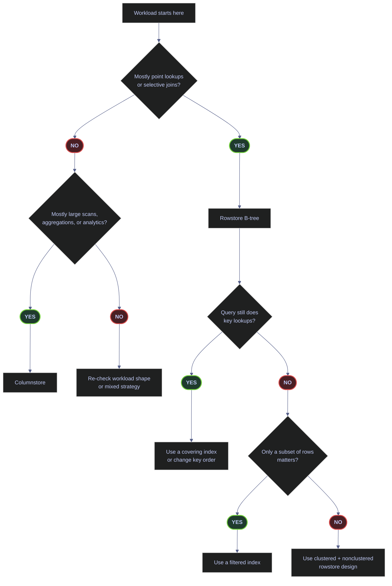

# Index Types and Strategy

Indexes are a storage design decision, not just a tuning afterthought. Every index changes three things at once:

- how SQL Server can find rows
- how much data must be read to satisfy a query
- how much extra work every `INSERT`, `UPDATE`, and `DELETE` must do

The correct production question is not "can this query be faster with an index?" It is "does this index earn its write cost across the workload?"

## Choose The Right Index Family

SQL Server has two mainstream index families for disk-based tables:

- **rowstore B-tree indexes** for point lookups, selective predicates, OLTP joins, and ordered access
- **columnstore indexes** for large scans, aggregates, analytics, and compression-heavy reporting

Within rowstore, the main design decisions are:

- clustered vs nonclustered
- single-column vs composite
- narrow lookup index vs covering index
- full-table index vs filtered subset



### Rowstore design rules

- Use a **clustered index** to define the physical row order of the table.
- Use **nonclustered indexes** to support selective predicates, join keys, and ordering patterns.
- Use **composite key order** to match the actual predicate order that matters to the workload.
- Use **INCLUDE columns** only when a lookup-heavy read pattern justifies the larger leaf level.
- Use **filtered indexes** when only a stable subset of rows matters.

### Columnstore design rules

- Use **clustered columnstore** for scan-heavy analytical storage.
- Use **nonclustered columnstore** when the rowstore table must remain the primary transactional shape.
- Expect stronger wins on aggregates and scans than on single-row lookups.

Microsoft documents the core `CREATE INDEX` design surface, including filtered indexes, included columns, `OPTIMIZE_FOR_SEQUENTIAL_KEY`, resumable operations, and online rebuild behavior, in the [official `CREATE INDEX` documentation](https://learn.microsoft.com/en-us/sql/t-sql/statements/create-index-transact-sql).

## Inspect The Live Index Surface

Index strategy starts with inventory. Before adding or dropping anything, establish:

- which indexes already exist
- whether a table is clustered or a heap
- how large the existing structures are
- whether any index is unique, filtered, or primary-key-backed

### `sys.indexes` + `sys.index_columns` | inspect one real table

`silver.eurostoxx50_ohlcv` is a good live example because it has both a clustered primary key and a unique nonclustered composite index.

#### `sys.indexes` + `sys.index_columns` | list the real indexes on `silver.eurostoxx50_ohlcv`

This query joins the core index catalog views and reconstructs the key columns in ordinal order.

*Return the real rowstore index definitions for `silver.eurostoxx50_ohlcv`, including key columns and uniqueness.*

```sql
SELECT
    i.index_id,
    i.name AS index_name,
    i.type_desc AS index_type,
    i.is_unique,
    i.is_primary_key,
    i.filter_definition,
    STRING_AGG(CASE WHEN ic.is_included_column = 0 THEN c.name END, ', ')
        WITHIN GROUP (ORDER BY ic.key_ordinal) AS key_columns,
    STRING_AGG(CASE WHEN ic.is_included_column = 1 THEN c.name END, ', ') AS included_columns
FROM sys.indexes AS i
JOIN sys.index_columns AS ic
    ON i.object_id = ic.object_id
   AND i.index_id = ic.index_id
JOIN sys.columns AS c
    ON ic.object_id = c.object_id
   AND ic.column_id = c.column_id
WHERE i.object_id = OBJECT_ID('silver.eurostoxx50_ohlcv')
GROUP BY
    i.index_id,
    i.name,
    i.type_desc,
    i.is_unique,
    i.is_primary_key,
    i.filter_definition
ORDER BY i.index_id;
```

| index_id | index_name | index_type | is_unique | is_primary_key | filter_definition | key_columns | included_columns |
|---|---|---|---:|---:|---|---|---|
| 1 | `PK__eurostox__3213E83FDF67D274` | `CLUSTERED` | 1 | 1 |  | `id` |  |
| 2 | `IX_silver_eurostoxx50_ohlcv_symbol_date` | `NONCLUSTERED` | 1 | 0 |  | `symbol, date` |  |

_This table has a conventional hybrid rowstore design: a narrow clustered primary key on `id` and a unique nonclustered lookup index on `(symbol, date)`. That means sequential row identity is decoupled from the query-facing business lookup pattern. It is a valid design when the workload needs stable surrogate keys and also frequent symbol/date predicates._

| Column | Value | Watch | Meaning | Implication |
|---|---|---|---|---|
| `index_id` | `1` | ✅ | Clustered index or clustered primary key. | Defines the physical row order of the table. |
| `index_id` | `2+` | ✅ | Nonclustered index. | Secondary access path only; table data remains elsewhere. |
| `index_type` | `CLUSTERED` | ✅ | The table itself is stored as the leaf of this index. | Only one clustered index can exist per table. |
| `index_type` | `NONCLUSTERED` | ✅ | Separate B-tree that points back to the base row. | Good for alternate predicates and sort orders. |
| `is_unique` | `1` | Depends | Duplicate keys are not allowed. | Strong for natural keys, lookup stability, and cardinality precision. |
| `is_primary_key` | `1` | Depends | The index backs a primary key constraint. | Usually the most semantically important unique key on the table. |
| `filter_definition` | `NULL` | ✅ here | The index covers all rows. | Expected for a general-purpose lookup index. |
| `filter_definition` | Non-NULL | Depends | The index is filtered. | Great when only a subset of rows matters and the predicate is stable. |

### `sys.dm_db_partition_stats` | identify the largest real indexes

This query ranks real non-demo indexes by used page count and size. It is the fastest way to see which objects matter most for storage and maintenance.

#### `sys.dm_db_partition_stats` | rank the largest real indexes

This query excludes the disposable demo tables so the result shows the actual `stoxx` production-shaped surface.

*Return the largest real rowstore indexes in `stoxx` by used page count and size.*

```sql
SELECT TOP 12
    OBJECT_SCHEMA_NAME(i.object_id) + '.' + OBJECT_NAME(i.object_id) AS table_name,
    i.name AS index_name,
    i.type_desc,
    i.is_unique,
    i.is_primary_key,
    CAST(ps.used_page_count * 8.0 / 1024 AS DECIMAL(10,2)) AS size_mb,
    ps.row_count
FROM sys.indexes AS i
JOIN sys.dm_db_partition_stats AS ps
    ON i.object_id = ps.object_id
   AND i.index_id = ps.index_id
WHERE OBJECTPROPERTY(i.object_id, 'IsUserTable') = 1
  AND i.index_id > 0
  AND OBJECT_NAME(i.object_id) NOT LIKE 'demo[_]%'
ORDER BY ps.used_page_count DESC;
```

| table_name | index_name | type_desc | is_unique | is_primary_key | size_mb | row_count |
|---|---|---|---:|---:|---:|---:|
| `silver.eurostoxx50_ohlcv` | `PK__eurostox__3213E83FDF67D274` | `CLUSTERED` | 1 | 1 | 6.02 | 67155 |
| `silver.stoxxasia50_ohlcv` | `PK__stoxxasi__3213E83F66A8DE5E` | `CLUSTERED` | 1 | 1 | 5.80 | 64875 |
| `silver.stoxxusa50_ohlcv` | `PK__stoxxusa__3213E83FC84E3F24` | `CLUSTERED` | 1 | 1 | 5.77 | 66000 |
| `silver.oil20_ohlcv` | `PK__oil20_oh__3213E83F544EB286` | `CLUSTERED` | 1 | 1 | 2.20 | 25080 |
| `silver.eurostoxx50_ohlcv` | `IX_silver_eurostoxx50_ohlcv_symbol_date` | `NONCLUSTERED` | 1 | 0 | 1.88 | 67155 |
| `silver.stoxxasia50_ohlcv` | `IX_silver_stoxxasia50_ohlcv_symbol_date` | `NONCLUSTERED` | 1 | 0 | 1.83 | 64875 |
| `silver.stoxxusa50_ohlcv` | `IX_silver_stoxxusa50_ohlcv_symbol_date` | `NONCLUSTERED` | 1 | 0 | 1.67 | 66000 |
| `bronze.trading_calendar` | `PK_trading_calendar` | `CLUSTERED` | 1 | 1 | 0.95 | 29335 |
| `bronze.index_dim` | `PK__index_di__3213E83FDB4E5BA9` | `CLUSTERED` | 1 | 1 | 0.70 | 169 |
| `silver.index_dim` | `PK__index_di__3213E83F590AA69E` | `CLUSTERED` | 1 | 1 | 0.68 | 169 |
| `gold.index_performance` | `PK__index_pe__3213E83FBBB2393E` | `CLUSTERED` | 1 | 1 | 0.66 | 5351 |
| `silver.oil20_ohlcv` | `IX_silver_oil20_ohlcv_symbol_date` | `NONCLUSTERED` | 1 | 0 | 0.64 | 25080 |

_The dominant real storage pattern in `stoxx` is consistent: clustered primary keys hold the main storage surface, and narrow unique nonclustered lookup indexes support business-key access on the OHLCV fact tables. That is exactly what a healthy rowstore-first analytical staging model often looks like._

### `sys.indexes` | detect heaps

Heaps are not inherently wrong, but they are specialized. In a production system, a heap should exist because it was chosen deliberately, not because a clustered index was forgotten.

#### `sys.indexes` | identify user tables that are heaps

This query lists tables with `type = 0`, which means the table has no clustered index.

*Return the user tables that are currently stored as heaps.*

```sql
SELECT
    OBJECT_SCHEMA_NAME(object_id) + '.' + OBJECT_NAME(object_id) AS table_name
FROM sys.indexes
WHERE type = 0
  AND OBJECTPROPERTY(object_id, 'IsUserTable') = 1;
```

| table_name |
|---|
| `dbo.demo_pulse_tickers` |

_Only one user table is currently a heap. That is fine for a disposable or staging-oriented table, but it would need explicit justification if it were a durable transactional or reporting table._

| Column | Value | Watch | Meaning | Implication |
|---|---|---|---|---|
| Result set empty | No heaps | ✅ in most OLTP/reporting databases | Every user table has a clustered shape. | Good default for predictable row access and reduced forwarding-record risk. |
| One or few deliberate heaps | Depends | A heap exists intentionally. | Acceptable for truncate-reload staging or narrow ETL patterns. |
| Many heaps | ❌ | Clustered design has likely been skipped broadly. | Review immediately; scans, forwarding records, and maintenance complexity often rise. |

### `sys.index_columns` | confirm key order and sort direction

Composite index usefulness depends on key order. SQL Server only gets full seek power from the leftmost key sequence that matches the predicate shape.

#### `sys.index_columns` | inspect sort direction and key order

This query shows the key ordinals and sort directions for the real `silver.eurostoxx50_ohlcv` indexes.

*Return the key order and sort direction for the `silver.eurostoxx50_ohlcv` indexes.*

```sql
SELECT
    i.name AS index_name,
    c.name AS column_name,
    ic.key_ordinal,
    CASE WHEN ic.is_descending_key = 1 THEN 'DESC' ELSE 'ASC' END AS sort_direction,
    ic.is_included_column
FROM sys.indexes AS i
JOIN sys.index_columns AS ic
    ON i.object_id = ic.object_id
   AND i.index_id = ic.index_id
JOIN sys.columns AS c
    ON ic.object_id = c.object_id
   AND ic.column_id = c.column_id
WHERE i.object_id = OBJECT_ID('silver.eurostoxx50_ohlcv')
ORDER BY i.index_id, ic.key_ordinal, ic.index_column_id;
```

| index_name | column_name | key_ordinal | sort_direction | is_included_column |
|---|---|---:|---|---:|
| `PK__eurostox__3213E83FDF67D274` | `id` | 1 | `ASC` | 0 |
| `IX_silver_eurostoxx50_ohlcv_symbol_date` | `symbol` | 1 | `ASC` | 0 |
| `IX_silver_eurostoxx50_ohlcv_symbol_date` | `date` | 2 | `ASC` | 0 |

_The nonclustered index is ordered by `symbol` first and `date` second, which is ideal for predicates that narrow to one symbol and then scan a date range. The same index would be much weaker for date-first queries across many symbols._

## Check Whether Indexes Earn Their Cost

Every nonclustered index adds maintenance work to writes. A good design page must therefore show both the read benefits and the write cost, not just the existence of an index.

### `sys.dm_db_index_usage_stats` | compare reads and writes

Usage stats are cumulative since the last SQL Server restart. They are not permanent history, but they are still one of the fastest ways to separate high-value indexes from dead weight.

#### `sys.dm_db_index_usage_stats` | rank indexes by recent read activity

This query compares seeks, scans, lookups, and updates for real user-table indexes.

*Return recent read and write activity per index since the last instance restart.*

```sql
SELECT TOP 20
    OBJECT_SCHEMA_NAME(i.object_id) + '.' + OBJECT_NAME(i.object_id) AS table_name,
    i.name AS index_name,
    i.type_desc,
    ISNULL(s.user_seeks, 0) AS user_seeks,
    ISNULL(s.user_scans, 0) AS user_scans,
    ISNULL(s.user_lookups, 0) AS user_lookups,
    ISNULL(s.user_updates, 0) AS user_updates,
    ISNULL(s.user_seeks, 0) + ISNULL(s.user_scans, 0) + ISNULL(s.user_lookups, 0) AS total_reads,
    s.last_user_seek,
    s.last_user_scan
FROM sys.indexes AS i
LEFT JOIN sys.dm_db_index_usage_stats AS s
    ON i.object_id = s.object_id
   AND i.index_id = s.index_id
   AND s.database_id = DB_ID()
WHERE OBJECTPROPERTY(i.object_id, 'IsUserTable') = 1
  AND i.index_id > 0
ORDER BY total_reads DESC, user_updates DESC;
```

| table_name | index_name | type_desc | user_seeks | user_scans | user_lookups | user_updates | total_reads | last_user_seek | last_user_scan |
|---|---|---|---:|---:|---:|---:|---:|---|---|
| `silver.eurostoxx50_ohlcv` | `PK__eurostox__3213E83FDF67D274` | `CLUSTERED` | 0 | 26 | 2 | 0 | 28 |  | 2026-04-08 16:13:42.380 |
| `silver.eurostoxx50_ohlcv` | `IX_silver_eurostoxx50_ohlcv_symbol_date` | `NONCLUSTERED` | 11 | 8 | 0 | 0 | 19 | 2026-04-08 16:12:25.190 | 2026-04-08 16:13:42.380 |
| `silver.index_dim` | `PK__index_di__3213E83F590AA69E` | `CLUSTERED` | 0 | 18 | 0 | 0 | 18 |  | 2026-04-08 16:13:42.393 |
| `silver.signals_daily` | `IX_silver_signals_daily_symbol_date` | `NONCLUSTERED` | 4 | 9 | 0 | 0 | 13 | 2026-04-08 15:31:24.947 | 2026-04-08 16:12:41.873 |
| `gold.scores_daily` | `UX_gold_scores_daily` | `NONCLUSTERED` | 7 | 4 | 0 | 0 | 11 | 2026-04-08 14:35:25.753 |  |
| `gold.index_performance` | `UX_gold_index_performance` | `NONCLUSTERED` | 3 | 6 | 0 | 0 | 9 | 2026-04-08 14:33:42.390 | 2026-04-08 16:12:41.873 |

_This result shows useful live distinctions. The `symbol, date` nonclustered index on `silver.eurostoxx50_ohlcv` is clearly earning reads, while some clustered indexes are serving mostly scan-driven access. Because the instance uptime is short, these are not long-term business conclusions, but they are still valid short-window operational evidence._

| Column | Value | Watch | Meaning | Implication |
|---|---|---|---|---|
| `user_seeks` high | ✅ | SQL Server is using the index for selective access. | Usually a strong sign the index matches real predicates well. |
| `user_scans` high | Depends | SQL Server is scanning the index or clustered structure. | Fine for analytic tables; suspicious on an index intended for point lookups. |
| `user_lookups` high | Depends | SQL Server needs extra base-row fetches after the nonclustered seek. | Consider a covering index if the query is hot and stable. |
| `user_updates` high with low reads | ❌ | The index costs writes but does not help reads much. | Candidate for redesign or removal after longer-window confirmation. |
| `last_user_seek` / `last_user_scan` NULL | Depends | No such operation has occurred since restart. | Do not overreact immediately on fresh uptime. |

### Zero-read indexes

A zero-read index is not automatically wrong, but it is the first place to look for write overhead that may not be paying back.

#### `sys.dm_db_index_usage_stats` | find indexes with write cost but no reads

This query filters to nonclustered indexes that have no seeks, scans, or lookups since restart.

*Return indexes that have recent write maintenance cost but no recorded reads since restart.*

```sql
SELECT
    OBJECT_SCHEMA_NAME(i.object_id) + '.' + OBJECT_NAME(i.object_id) AS table_name,
    i.name AS index_name,
    i.type_desc,
    ISNULL(s.user_updates, 0) AS write_cost,
    CAST(ps.used_page_count * 8.0 / 1024 AS DECIMAL(10,2)) AS size_mb
FROM sys.indexes AS i
LEFT JOIN sys.dm_db_index_usage_stats AS s
    ON i.object_id = s.object_id
   AND i.index_id = s.index_id
   AND s.database_id = DB_ID()
JOIN sys.dm_db_partition_stats AS ps
    ON i.object_id = ps.object_id
   AND i.index_id = ps.index_id
WHERE OBJECTPROPERTY(i.object_id, 'IsUserTable') = 1
  AND i.index_id > 1
  AND ISNULL(s.user_seeks, 0) = 0
  AND ISNULL(s.user_scans, 0) = 0
  AND ISNULL(s.user_lookups, 0) = 0
ORDER BY write_cost DESC, size_mb DESC;
```

| table_name | index_name | type_desc | write_cost | size_mb |
|---|---|---|---:|---:|
| `dbo.demo_idxmaint_usage` | `IX_demo_idxmaint_usage_category` | `NONCLUSTERED` | 2 | 0.98 |
| `dbo.demo_idxmaint_rowstore` | `IX_demo_idxmaint_symbol_date` | `NONCLUSTERED` | 1 | 34.84 |
| `silver.stoxxasia50_ohlcv` | `IX_silver_stoxxasia50_ohlcv_symbol_date` | `NONCLUSTERED` | 0 | 1.83 |
| `silver.stoxxusa50_ohlcv` | `IX_silver_stoxxusa50_ohlcv_symbol_date` | `NONCLUSTERED` | 0 | 1.67 |
| `silver.oil20_ohlcv` | `IX_silver_oil20_ohlcv_symbol_date` | `NONCLUSTERED` | 0 | 0.64 |

_The interesting rows are the real ones, not the demos. Several real OHLCV nonclustered lookup indexes have zero reads in the current uptime window. That does not mean they are bad; it means the restart window is still too short to treat DMV usage stats as final truth. Production decisions on index removal should always use a longer observation window._

### Duplicate-key index signatures

Duplicate indexes waste write I/O and maintenance budget. The fastest first pass is to compare key signatures on the same table.

#### Duplicate key-signature check | count duplicate index definitions

This query collapses index key lists into signatures and counts tables that currently have duplicate definitions.

*Count user-table index key signatures that are duplicated on the same table.*

```sql
WITH index_signatures AS (
    SELECT
        i.object_id,
        i.index_id,
        OBJECT_SCHEMA_NAME(i.object_id) + '.' + OBJECT_NAME(i.object_id) AS table_name,
        STRING_AGG(CASE WHEN ic.is_included_column = 0 THEN c.name END, ',')
            WITHIN GROUP (ORDER BY ic.key_ordinal) AS key_signature
    FROM sys.indexes AS i
    JOIN sys.index_columns AS ic
        ON i.object_id = ic.object_id
       AND i.index_id = ic.index_id
    JOIN sys.columns AS c
        ON ic.object_id = c.object_id
       AND ic.column_id = c.column_id
    WHERE OBJECTPROPERTY(i.object_id, 'IsUserTable') = 1
      AND i.index_id > 0
    GROUP BY i.object_id, i.index_id
)
SELECT COUNT(*) AS duplicate_signature_count
FROM (
    SELECT table_name, key_signature
    FROM index_signatures
    GROUP BY table_name, key_signature
    HAVING COUNT(*) > 1
) AS d;
```

| duplicate_signature_count |
|---:|
| 0 |

_No duplicated key signatures were found in the current user-table surface. That is a good sign, although deeper duplicate analysis can still look at INCLUDE columns, filters, and uniqueness because key signatures alone do not capture every overlap pattern._

## Treat Missing-Index DMVs As Hints, Not Orders

The missing-index DMVs are useful, but they are not a design engine. Microsoft explicitly documents that these DMVs are heuristic, transient, and blind to broader index overlap and workload-wide tradeoffs in the [missing index documentation](https://learn.microsoft.com/en-us/sql/relational-databases/indexes/tune-nonclustered-missing-index-suggestions).

### `sys.dm_db_missing_index_details` | review the current suggestions

#### `sys.dm_db_missing_index_details` | rank the current suggestions in `stoxx`

This query surfaces the live missing-index recommendations and computes the standard improvement heuristic.

*Return the current missing-index DMV suggestions and their improvement heuristic for `stoxx`.*

```sql
SELECT TOP 15
    CAST(mid.statement AS nvarchar(4000)) AS object_name,
    migs.user_seeks,
    migs.user_scans,
    CAST(
        migs.avg_total_user_cost
        * (migs.avg_user_impact / 100.0)
        * (migs.user_seeks + migs.user_scans)
        AS decimal(18,2)
    ) AS improvement_measure,
    mid.equality_columns,
    mid.inequality_columns,
    mid.included_columns
FROM sys.dm_db_missing_index_group_stats AS migs
JOIN sys.dm_db_missing_index_groups AS mig
    ON migs.group_handle = mig.index_group_handle
JOIN sys.dm_db_missing_index_details AS mid
    ON mig.index_handle = mid.index_handle
WHERE mid.database_id = DB_ID()
ORDER BY improvement_measure DESC;
```

| object_name | user_seeks | user_scans | improvement_measure | equality_columns | inequality_columns | included_columns |
|---|---:|---:|---:|---|---|---|
| `[stoxx].[dbo].[demo_idxmaint_missing]` | 10 | 0 | 90.06 | `[symbol]` | `[trade_date], [volume]` | `[close_price]` |
| `[stoxx].[silver].[eurostoxx50_ohlcv]` | 2 | 0 | 1.13 | `[symbol]` |  | `[date], [close]` |
| `[stoxx].[silver].[eurostoxx50_ohlcv]` | 1 | 0 | 0.97 | `[date]` |  | `[close], [volume]` |
| `[stoxx].[silver].[index_dim]` | 1 | 0 | 0.07 | `[_index], [symbol], [is_current]` |  | `[long_name], [short_name], [sector], [industry], [country], [exchange], [currency], [range_start], [price_data_start]` |
| `[stoxx].[gold].[index_performance]` | 1 | 0 | 0.03 | `[_index]` |  | `[perf_date], [daily_return], [cumulative_factor], [stocks_count]` |

_The DMV is giving reasonable hints, not finished designs. The top demo row is intentionally obvious, but the real `silver.eurostoxx50_ohlcv` suggestions show the classic problem: multiple narrow hints may overlap with each other and with existing indexes. Those rows should start a design review, not trigger blind `CREATE INDEX` execution._

| Column | Value | Watch | Meaning | Implication |
|---|---|---|---|---|
| `improvement_measure` high | Depends | The DMV thinks the missing index could reduce work materially. | Prioritize review, not automatic creation. |
| `equality_columns` populated | ✅ | Columns used in equality predicates. | Usually belong at the left side of a candidate composite key. |
| `inequality_columns` populated | Depends | Range or non-equality predicates. | Usually belong after equality columns in the key order. |
| `included_columns` very wide | ❌ if used blindly | The DMV wants a large covering surface. | Review carefully to avoid bloated indexes. |

## Design Patterns With Real Proof

This section shows the index patterns that matter most operationally, using either real `stoxx` structures or disposable demo tables with verified outputs.

### Disposable demo objects

The next three subsections use disposable `dbo.demo_index_types_*` tables so the commands are fully reproducible without changing the real `silver` and `gold` tables.

#### `CREATE TABLE` + `CREATE INDEX` | seed the covering-index demo table

This creates a disposable 50,000-row rowstore table with a clustered index on `id` and a noncovering `(symbol, date)` index.

*Create the disposable rowstore table used for the covering-index before/after proof.*

```sql
IF OBJECT_ID('dbo.demo_index_types_covering', 'U') IS NOT NULL
    DROP TABLE dbo.demo_index_types_covering;

CREATE TABLE dbo.demo_index_types_covering
(
    id int NOT NULL,
    symbol varchar(20) NOT NULL,
    [date] date NOT NULL,
    [close] float NOT NULL,
    volume bigint NOT NULL
);

INSERT INTO dbo.demo_index_types_covering (id, symbol, [date], [close], volume)
SELECT TOP (50000)
    id,
    symbol,
    [date],
    [close],
    volume
FROM silver.eurostoxx50_ohlcv
ORDER BY id;

CREATE CLUSTERED INDEX CIX_demo_index_types_covering
    ON dbo.demo_index_types_covering(id);

CREATE NONCLUSTERED INDEX IX_demo_index_types_covering_symbol_date
    ON dbo.demo_index_types_covering(symbol, [date]);

SELECT COUNT(*) AS row_count
FROM dbo.demo_index_types_covering;
```

| row_count |
|---:|
| 50000 |

_The covering-index demo table now exists with 50,000 rows and the intended noncovering baseline index shape._

#### `CREATE TABLE` + filtered index | seed the filtered-index demo table

This creates a disposable table with an `is_active` flag so the filtered index can target only the active subset.

*Create the disposable table used for the filtered-index proof and populate a stable active/inactive split.*

```sql
SET ANSI_NULLS ON;
SET QUOTED_IDENTIFIER ON;

IF OBJECT_ID('dbo.demo_index_types_filtered', 'U') IS NOT NULL
    DROP TABLE dbo.demo_index_types_filtered;

CREATE TABLE dbo.demo_index_types_filtered
(
    id int NOT NULL,
    symbol varchar(20) NOT NULL,
    [date] date NOT NULL,
    [close] float NOT NULL,
    is_active bit NOT NULL
);

INSERT INTO dbo.demo_index_types_filtered (id, symbol, [date], [close], is_active)
SELECT TOP (20000)
    id,
    symbol,
    [date],
    [close],
    CASE WHEN ROW_NUMBER() OVER (ORDER BY id) % 5 = 0 THEN 0 ELSE 1 END
FROM silver.eurostoxx50_ohlcv
ORDER BY id;

CREATE CLUSTERED INDEX CIX_demo_index_types_filtered
    ON dbo.demo_index_types_filtered(id);

CREATE NONCLUSTERED INDEX IX_demo_index_types_filtered_active
    ON dbo.demo_index_types_filtered(symbol, [date])
    WHERE is_active = 1;

SELECT
    COUNT(*) AS row_count,
    SUM(CASE WHEN is_active = 1 THEN 1 ELSE 0 END) AS active_rows,
    SUM(CASE WHEN is_active = 0 THEN 1 ELSE 0 END) AS inactive_rows
FROM dbo.demo_index_types_filtered;
```

| row_count | active_rows | inactive_rows |
|---:|---:|---:|
| 20000 | 16000 | 4000 |

_The filtered-index demo has a predictable 80/20 active split, which makes the storage benefit of indexing only `is_active = 1` easy to reason about._

#### `CREATE CLUSTERED COLUMNSTORE INDEX` | seed the columnstore demo table

This creates a disposable analytical table and converts it to clustered columnstore storage.

*Create the disposable clustered columnstore table used for the rowgroup-state example.*

```sql
IF OBJECT_ID('dbo.demo_index_types_columnstore', 'U') IS NOT NULL
    DROP TABLE dbo.demo_index_types_columnstore;

CREATE TABLE dbo.demo_index_types_columnstore
(
    id int NOT NULL,
    symbol varchar(20) NOT NULL,
    [date] date NOT NULL,
    [close] float NOT NULL,
    volume bigint NOT NULL
);

INSERT INTO dbo.demo_index_types_columnstore (id, symbol, [date], [close], volume)
SELECT TOP (50000)
    id,
    symbol,
    [date],
    [close],
    volume
FROM silver.eurostoxx50_ohlcv
ORDER BY id;

CREATE CLUSTERED COLUMNSTORE INDEX CCI_demo_index_types_columnstore
    ON dbo.demo_index_types_columnstore;

SELECT COUNT(*) AS row_count
FROM dbo.demo_index_types_columnstore;
```

| row_count |
|---:|
| 50000 |

_The columnstore demo now has a stable 50,000-row analytical surface for rowgroup inspection._

### Covering index | eliminate a key lookup or base-row fetch

A covering index is worth its extra leaf width only when a stable, high-value query stops paying repeated base-row cost because the index now contains every column that the query needs.

#### Before | noncovering index

This query hits a disposable rowstore table that starts with a noncovering `(symbol, date)` index. The table must fetch `[close]` and `volume` from the base row structure after finding the matching keys.

*Run the query against a noncovering `(symbol, date)` index so the baseline logical-read cost is visible.*

```sql
SET STATISTICS IO ON;

SELECT /* demo-covering-before */ TOP (100)
    symbol,
    [date],
    [close],
    volume
FROM dbo.demo_index_types_covering
WHERE symbol = 'ASML.AS'
  AND [date] >= '2025-01-01'
  AND [date] < '2025-04-01';
```

| Table | Scan count | logical reads | physical reads |
|---|---:|---:|---:|
| `demo_index_types_covering` | 1 | 280 | 0 |

_The predicate itself is selective, but the read count is still high because the index is not covering the output columns. SQL Server can find the qualifying keys, then it must touch the base row structure again to retrieve `[close]` and `volume`._

#### Plan shape summary

This cached-plan summary confirms the operator tree for the baseline query.

*Summarize the operator tree for the noncovering version of the demo query from plan cache.*

```sql
WITH plans AS (
    SELECT
        st.text AS sql_text,
        CAST(qp.query_plan AS xml) AS plan_xml
    FROM sys.dm_exec_query_stats AS qs
    CROSS APPLY sys.dm_exec_sql_text(qs.sql_handle) AS st
    CROSS APPLY sys.dm_exec_query_plan(qs.plan_handle) AS qp
    WHERE st.text LIKE '%demo-covering-before%'
)
SELECT
    'before' AS variant,
    plan_xml.value(
        'declare default element namespace "http://schemas.microsoft.com/sqlserver/2004/07/showplan";
         (/ShowPlanXML/BatchSequence/Batch/Statements/StmtSimple/QueryPlan/RelOp/@PhysicalOp)[1]',
        'nvarchar(100)'
    ) AS root_operator,
    STUFF((
        SELECT ' -> ' + n.value('@PhysicalOp', 'nvarchar(100)')
        FROM plan_xml.nodes('declare default element namespace "http://schemas.microsoft.com/sqlserver/2004/07/showplan"; //RelOp') AS t(n)
        FOR XML PATH(''), TYPE
    ).value('.', 'nvarchar(max)'), 1, 4, '') AS operators
FROM plans;
```

| variant | root_operator | operators |
|---|---|---|
| `before` | `Top` | `Top -> Clustered Index Scan` |

_The cached shape for this short demo resolved to a clustered scan path rather than a tight index-only access path, which is exactly why the logical reads are high. The production lesson is the same: if the query must touch too much of the base storage, the noncovering design is not doing enough work._

#### `DROP INDEX` + `CREATE INDEX ... INCLUDE` | convert the baseline index into a covering index

This replaces the baseline noncovering index with a covering version that stores `[close]` and `volume` at the leaf level.

*Rebuild the demo index as a covering index by adding `[close]` and `volume` as INCLUDE columns.*

```sql
DROP INDEX IX_demo_index_types_covering_symbol_date
    ON dbo.demo_index_types_covering;

CREATE NONCLUSTERED INDEX IX_demo_index_types_covering_symbol_date_cover
    ON dbo.demo_index_types_covering(symbol, [date])
    INCLUDE ([close], volume);
```

#### After | covering index with INCLUDE columns

The index is rebuilt as `(symbol, date) INCLUDE ([close], volume)`, so the query can be answered from the nonclustered leaf level alone.

*Re-run the same query after adding `[close]` and `volume` as INCLUDE columns to make the index covering.*

```sql
SET STATISTICS IO ON;

SELECT /* demo-covering-after */ TOP (100)
    symbol,
    [date],
    [close],
    volume
FROM dbo.demo_index_types_covering
WHERE symbol = 'ASML.AS'
  AND [date] >= '2025-01-01'
  AND [date] < '2025-04-01';
```

| Table | Scan count | logical reads | physical reads |
|---|---:|---:|---:|
| `demo_index_types_covering` | 1 | 2 | 0 |

_The query now reads two pages instead of 280. That is a textbook covering-index win: the query shape stayed the same, but the storage design let SQL Server satisfy it almost entirely from the nonclustered structure._

#### Plan shape summary

This cached-plan summary shows the operator simplification after the covering index is in place.

*Summarize the operator tree for the covering version of the demo query from plan cache.*

```sql
WITH plans AS (
    SELECT
        st.text AS sql_text,
        CAST(qp.query_plan AS xml) AS plan_xml
    FROM sys.dm_exec_query_stats AS qs
    CROSS APPLY sys.dm_exec_sql_text(qs.sql_handle) AS st
    CROSS APPLY sys.dm_exec_query_plan(qs.plan_handle) AS qp
    WHERE st.text LIKE '%demo-covering-after%'
)
SELECT
    'after' AS variant,
    plan_xml.value(
        'declare default element namespace "http://schemas.microsoft.com/sqlserver/2004/07/showplan";
         (/ShowPlanXML/BatchSequence/Batch/Statements/StmtSimple/QueryPlan/RelOp/@PhysicalOp)[1]',
        'nvarchar(100)'
    ) AS root_operator,
    STUFF((
        SELECT ' -> ' + n.value('@PhysicalOp', 'nvarchar(100)')
        FROM plan_xml.nodes('declare default element namespace "http://schemas.microsoft.com/sqlserver/2004/07/showplan"; //RelOp') AS t(n)
        FOR XML PATH(''), TYPE
    ).value('.', 'nvarchar(max)'), 1, 4, '') AS operators
FROM plans;
```

| variant | root_operator | operators |
|---|---|---|
| `after` | `Top` | `Top -> Index Seek` |

_The plan collapses to an `Index Seek` path once the nonclustered leaf contains the output columns. This is the exact kind of change that justifies a covering index on a hot stable query._

### Filtered index | index only the active subset

Filtered indexes are best when the predicate is stable and the queried subset is much smaller than the base table.

#### Live filtered-index examples

This query shows the filtered indexes currently visible in the database, including one real business example and one disposable demo.

*Return the filtered indexes currently present in `stoxx` and show their row counts and size footprint.*

```sql
SELECT TOP 5
    OBJECT_SCHEMA_NAME(i.object_id) + '.' + OBJECT_NAME(i.object_id) AS table_name,
    i.name,
    i.type_desc,
    i.has_filter,
    i.filter_definition,
    p.rows,
    ps.used_page_count
FROM sys.indexes AS i
JOIN sys.partitions AS p
    ON i.object_id = p.object_id
   AND i.index_id = p.index_id
JOIN sys.dm_db_partition_stats AS ps
    ON i.object_id = ps.object_id
   AND i.index_id = ps.index_id
WHERE i.has_filter = 1
ORDER BY ps.used_page_count DESC;
```

| table_name | name | type_desc | has_filter | filter_definition | rows | used_page_count |
|---|---|---|---:|---|---:|---:|
| `dbo.demo_index_types_filtered` | `IX_demo_index_types_filtered_active` | `NONCLUSTERED` | 1 | `([is_active]=(1))` | 16000 | 48 |
| `silver.index_dim` | `UX_silver_index_dim_current` | `NONCLUSTERED` | 1 | `([is_current]=(1))` | 169 | 2 |

_These are both good filtered-index patterns. The demo index only stores the active 16,000-row subset instead of all 20,000 rows, and the real `silver.index_dim` index enforces uniqueness only for the current SCD2 slice, not for historical rows. That is exactly the kind of stable subset that filtered indexes are designed for._

### Unique and primary-key-backed indexes

Primary keys and unique constraints are not just data-quality features. They are index design decisions with optimizer consequences because they improve cardinality reasoning and prevent duplicate-key ambiguity.

#### `sys.indexes` | inspect unique, primary-key, filtered, and columnstore examples

This query shows one live unique clustered PK, one live unique nonclustered index, one filtered index, and one clustered columnstore index.

*Return a compact cross-section of real and disposable index types from the current database.*

```sql
SELECT
    OBJECT_SCHEMA_NAME(i.object_id) + '.' + OBJECT_NAME(i.object_id) AS table_name,
    i.name AS index_name,
    i.type_desc,
    i.is_unique,
    i.is_primary_key,
    i.has_filter,
    i.filter_definition,
    i.fill_factor,
    i.optimize_for_sequential_key
FROM sys.indexes AS i
WHERE i.object_id IN (
    OBJECT_ID('gold.index_performance'),
    OBJECT_ID('dbo.demo_index_types_columnstore'),
    OBJECT_ID('dbo.demo_index_types_filtered')
)
  AND i.index_id > 0
ORDER BY table_name, i.index_id;
```

| table_name | index_name | type_desc | is_unique | is_primary_key | has_filter | filter_definition | fill_factor | optimize_for_sequential_key |
|---|---|---|---:|---:|---:|---|---:|---:|
| `dbo.demo_index_types_columnstore` | `CCI_demo_index_types_columnstore` | `CLUSTERED COLUMNSTORE` | 0 | 0 | 0 |  | 0 | 0 |
| `dbo.demo_index_types_filtered` | `CIX_demo_index_types_filtered` | `CLUSTERED` | 0 | 0 | 0 |  | 0 | 0 |
| `dbo.demo_index_types_filtered` | `IX_demo_index_types_filtered_active` | `NONCLUSTERED` | 0 | 0 | 1 | `([is_active]=(1))` | 0 | 0 |
| `gold.index_performance` | `PK__index_pe__3213E83FBBB2393E` | `CLUSTERED` | 1 | 1 | 0 |  | 0 | 0 |
| `gold.index_performance` | `UX_gold_index_performance` | `NONCLUSTERED` | 1 | 0 | 0 |  | 0 | 0 |

_This output captures the main design surface clearly: clustered PK, unique nonclustered constraint-backed index, filtered nonclustered index, and clustered columnstore. It also shows that none of these examples currently uses a non-default fill factor or `OPTIMIZE_FOR_SEQUENTIAL_KEY`, which is fine until a write-hot sequential-key contention problem appears._

### Columnstore rowgroup state

Columnstore indexes should be reviewed as compressed rowgroups, not as B-trees.

#### `sys.dm_db_column_store_row_group_physical_stats` | inspect one real clustered columnstore

This query shows the rowgroup state for the disposable clustered columnstore example defined earlier in this note.

*Return the physical rowgroup state for the live clustered columnstore example.*

```sql
SELECT
    OBJECT_SCHEMA_NAME(i.object_id) + '.' + OBJECT_NAME(i.object_id) AS object_name,
    i.name AS index_name,
    rg.row_group_id,
    rg.state_desc,
    rg.total_rows,
    rg.deleted_rows,
    rg.size_in_bytes
FROM sys.indexes AS i
JOIN sys.dm_db_column_store_row_group_physical_stats AS rg
    ON i.object_id = rg.object_id
   AND i.index_id = rg.index_id
WHERE i.object_id = OBJECT_ID('dbo.demo_index_types_columnstore')
ORDER BY rg.row_group_id;
```

| object_name | index_name | row_group_id | state_desc | total_rows | deleted_rows | size_in_bytes |
|---|---|---:|---|---:|---:|---:|
| `dbo.demo_index_types_columnstore` | `CCI_demo_index_types_columnstore` | 0 | `COMPRESSED` | 50000 | 0 | 583144 |

_The columnstore example currently has one compressed rowgroup with no deleted rows. That is the ideal steady state for a small analytical example: compressed storage, no deltastore residue, and no delete bloat._

## Production Strategy Rules

- Pick the clustered key for row identity and access stability, not just because the column is a primary key.
- Keep nonclustered keys as narrow as practical.
- Put equality predicates first in composite keys, then range predicates.
- Add INCLUDE columns only when you can show a stable lookup-heavy query that truly benefits.
- Prefer filtered indexes when the hot subset is small, stable, and queried predictably.
- Treat missing-index DMVs as design hints, not implementation orders.
- Re-check every proposed index against its write cost and overlap with existing indexes.
- Use columnstore for scans and aggregates, not as a universal replacement for rowstore.

For fragmentation, rebuild policy, page density, and statistics maintenance, use [[07-index-maintenance]]. For plan-level proof of seek vs scan vs lookup behavior, use [[12-execution-plans]].

## Related

- [[02-storage-internals]]
- [[08-table-compression]]
- [[09-partitioning-strategies]]
- [[07-index-maintenance]]
- [[12-execution-plans]]

