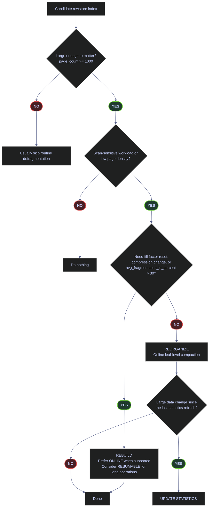

# Index Maintenance

Index maintenance is a production decision process, not a weekly rebuild ritual. Microsoft now emphasizes **page density** alongside fragmentation: a large scan-heavy rowstore index with low page density can waste memory and I/O even when fragmentation alone does not look extreme, while a tiny index with 40% fragmentation is often operational noise. The correct action depends on index size, access pattern, density, fragmentation, statistics freshness, and whether the operation must remain online.

This page uses the `stoxx` database for read-only discovery queries and disposable `dbo.demo_idxmaint_*` tables for state-changing demonstrations. The production-facing queries are written in a form suitable for real troubleshooting; the demo objects exist so the effects of `REORGANIZE`, `REBUILD`, resumable operations, fill factor, statistics refresh, and index-discovery DMVs can be shown with real output.



## Reproducible Baseline

### SQL Server | sys.databases | confirm database context and statistics defaults

#### Confirm database context and statistics defaults

**When to run:** at the start of any index-maintenance session, before trusting DMV output or running state-changing operations.
**Trigger:** opening a new SSMS or sqlcmd session against the target instance.
**Context:** T-SQL read-only query against `sys.databases`. No elevated permissions required beyond `VIEW DATABASE STATE`.
**Purpose:** verify that the session is scoped to the intended database, that compatibility level matches the engine version, and that automatic statistics creation and update are enabled.

| Field | Source Column | Type | Meaning |
|---|---|---|---|
| `current_database` | `DB_NAME()` | `sysname` | Name of the database the session is currently connected to |
| `compatibility_level` | `sys.databases.compatibility_level` | `tinyint` | Optimizer behavior level — `160` = SQL Server 2022 |
| `is_auto_create_stats_on` | `sys.databases.is_auto_create_stats_on` | `bit` | `1` = SQL Server can create single-column statistics automatically |
| `is_auto_update_stats_on` | `sys.databases.is_auto_update_stats_on` | `bit` | `1` = SQL Server can refresh stale statistics automatically |
| `is_query_store_on` | `sys.databases.is_query_store_on` | `bit` | `1` = Query Store is capturing plan and runtime data |

*Confirm that the session is in `stoxx`, that SQL Server 2022 compatibility level `160` is active, and that automatic statistics maintenance is enabled before using the later DMVs.*

```sql
USE stoxx;
GO

SELECT
    DB_NAME() AS current_database,
    d.compatibility_level,
    d.is_auto_create_stats_on,
    d.is_auto_update_stats_on,
    d.is_query_store_on
FROM sys.databases AS d
WHERE d.database_id = DB_ID();
GO
```

| current_database | compatibility_level | is_auto_create_stats_on | is_auto_update_stats_on | is_query_store_on |
|---|---:|---:|---:|---:|
| `stoxx` | 160 | 1 | 1 | 1 |

_The baseline matches the rest of the note. The session is in `stoxx`, SQL Server 2022 optimizer behavior is active, automatic statistics creation and update are enabled, and Query Store is already on. If any of these values differ in production, the maintenance workflow still applies, but the surrounding diagnostics and optimizer behaviors can change materially._

| Column | Value | Watch | Meaning | Implication |
|---|---|---|---|---|
| `current_database` | `stoxx` | &#9989; | The session is scoped to the intended database. | Later DMV output belongs to the same database as the note. |
| `current_database` | Anything else | &#10060; | The session is running in the wrong database. | Every later object lookup and DMV filter can become misleading. |
| `compatibility_level` | `160` | &#9989; | SQL Server 2022 optimizer behavior is active. | The page's guidance for PSP, CE, and stats behavior matches the engine level. |
| `compatibility_level` | `< 160` | Depends | Older optimizer behavior is active. | Maintenance logic still applies, but plan selection and IQP features may differ. |
| `is_auto_create_stats_on` | `1` | &#9989; | SQL Server can create single-column auto stats. | Predicate columns without manual stats are less likely to compile blindly. |
| `is_auto_create_stats_on` | `0` | &#10060; | Auto-created statistics are disabled. | Cardinality-estimation risk increases, especially after schema changes. |
| `is_auto_update_stats_on` | `1` | &#9989; | SQL Server can refresh stale stats automatically. | Manual stats maintenance can stay targeted instead of compensating for disabled auto-update. |
| `is_auto_update_stats_on` | `0` | &#10060; | Automatic statistics refresh is disabled. | Post-load and post-maintenance manual stats refresh becomes mandatory. |
| `is_query_store_on` | `1` | &#9989; | Query Store is available. | Plan regressions can be verified before and after maintenance. |
| `is_query_store_on` | `0` | Depends | Query Store is disabled. | Index maintenance still works, but plan-history validation is weaker. |

### SQL Server | sys.dm_os_sys_info | check engine uptime

#### Verify engine uptime before trusting usage and missing-index DMVs

**When to run:** before referencing `sys.dm_db_index_usage_stats`, `sys.dm_db_missing_index_*`, or any DMV whose counters reset on restart.
**Trigger:** beginning an index-discovery or unused-index review session.
**Context:** T-SQL read-only query against `sys.dm_os_sys_info`. Requires `VIEW SERVER STATE`.
**Purpose:** determine whether the instance has been running long enough for usage and missing-index counters to represent a meaningful business cycle.

| Field | Source Column | Type | Meaning |
|---|---|---|---|
| `sqlserver_start_time` | `sys.dm_os_sys_info.sqlserver_start_time` | `datetime` | Timestamp of the most recent SQL Server engine start |

*Verify engine uptime before trusting `sys.dm_db_index_usage_stats` or missing-index DMVs, because both are reset by restart and do not represent long-term business cycles on a freshly restarted instance.*

```sql
SELECT sqlserver_start_time
FROM sys.dm_os_sys_info;
```

| sqlserver_start_time |
|---|
| 2026-04-08 08:42:34.510 |

_This instance restarted on `2026-04-08 08:42:34.510`. Any usage or missing-index evidence later in this page reflects activity only since that time. That is enough for a targeted lab demonstration, but it is not enough to justify dropping production indexes or promoting every missing-index suggestion to DDL._

| Column | Value or Pattern | Watch | Meaning | Implication |
|---|---|---|---|---|
| `sqlserver_start_time` | Older than a full business cycle | &#9989; | Usage counters have had time to accumulate representative workload data. | Drop and missing-index decisions are more trustworthy. |
| `sqlserver_start_time` | Recent restart | &#10060; | Usage counters and missing-index DMVs are still young. | Treat the later discovery sections as directional evidence, not final proof. |

## Why Fragmentation Matters

- **Logical fragmentation** is the percentage of out-of-order leaf pages in a rowstore B-tree. It matters mainly for range scans and ordered reads, not for single-row seeks.
- **Page density** is the percentage of leaf-page space that is actually used. Low density means more pages must be read to return the same number of rows, which raises I/O and buffer-pool pressure even when fragmentation is moderate.
- **Index size matters.** A 40% fragmented 4-page index is rarely worth touching. A 40% fragmented 50,000-page reporting index usually is.
- **Maintenance is not only about fragmentation.** `REBUILD` resets fill factor and refreshes index statistics; `REORGANIZE` compacts leaf pages online but does not update statistics.
- **Discovery must be paired with workload evidence.** `sys.dm_db_index_usage_stats` tells you whether an index is read, and `sys.dm_db_index_operational_stats` tells you what it costs to maintain. Use both before changing fill factor or dropping an index.

## Fragmentation Detection and Remediation

### SQL Server | sys.dm_db_index_physical_stats | inspect fragmentation and density

#### Inspect fragmentation and density for a single table

**When to run:** when a specific table has been flagged by monitoring, user reports, or a broad inventory pass as a potential maintenance candidate.
**Trigger:** slow scan performance, elevated buffer-pool usage on a known table, or a routine post-load check.
**Context:** T-SQL read-only DMV query. Requires `VIEW DATABASE STATE`. The `SAMPLED` scan mode reads a sample of leaf pages — cheaper than `DETAILED`, but more informative than `LIMITED` because it populates `avg_page_space_used_in_percent`.
**Purpose:** retrieve fragmentation percentage, page count, page density, and fragment count for every index on the target table so maintenance decisions can be made per-index.

| Field | Source Column | Type / Unit | Meaning |
|---|---|---|---|
| `index_name` | `sys.indexes.name` | `sysname` | User-visible name of the index |
| `type_desc` | `sys.indexes.type_desc` | `nvarchar(60)` | Index storage type — `CLUSTERED`, `NONCLUSTERED`, `HEAP`, etc. |
| `avg_fragmentation_in_percent` | `sys.dm_db_index_physical_stats.avg_fragmentation_in_percent` | `float` · % | Percentage of out-of-order leaf pages (logical fragmentation) |
| `page_count` | `sys.dm_db_index_physical_stats.page_count` | `bigint` · 8 KB pages | Total leaf-level pages in the index — critical size gate for maintenance decisions |
| `avg_page_space_used_in_percent` | `sys.dm_db_index_physical_stats.avg_page_space_used_in_percent` | `float` · % | Average percentage of usable leaf-page space that contains data (page density). `NULL` in `LIMITED` mode |
| `fragment_count` | `sys.dm_db_index_physical_stats.fragment_count` | `bigint` | Number of physically contiguous leaf-page groups (fragments) |

> [!info]- Query breakdown for single-table physical stats
>
> This query returns physical-maintenance metrics for every index on `silver.eurostoxx50_ohlcv`.
>
> - `sys.dm_db_index_physical_stats(DB_ID(), OBJECT_ID(N'silver.eurostoxx50_ohlcv'), NULL, NULL, 'SAMPLED')` asks SQL Server to inspect every index on the target table in the current database.
> - `DB_ID()` scopes the DMV call to the current database and `OBJECT_ID(...)` scopes it to one table.
> - `'SAMPLED'` is a deliberate choice. It returns both fragmentation and page-density metrics at far lower cost than `DETAILED`, and unlike `LIMITED`, it can populate `avg_page_space_used_in_percent`.
> - Joining to `sys.indexes` converts `index_id` values into human-readable names and types.
> - `avg_fragmentation_in_percent` shows leaf-level logical fragmentation.
> - `page_count` shows index size in 8 KB pages. This is critical because percentage thresholds without size thresholds cause bad maintenance decisions.
> - `avg_page_space_used_in_percent` shows page density. Low values mean wasted leaf space, often from page splits or fill-factor choices.
> - `fragment_count` shows how many physically separate fragments SQL Server found at the leaf level.

```sql
SELECT
    i.name AS index_name,
    i.type_desc,
    ips.avg_fragmentation_in_percent,
    ips.page_count,
    ips.avg_page_space_used_in_percent,
    ips.fragment_count
FROM sys.dm_db_index_physical_stats
(
    DB_ID(),
    OBJECT_ID(N'silver.eurostoxx50_ohlcv'),
    NULL,
    NULL,
    'SAMPLED'
) AS ips
JOIN sys.indexes AS i
    ON ips.object_id = i.object_id
   AND ips.index_id = i.index_id
WHERE ips.index_id > 0
ORDER BY ips.page_count DESC, i.index_id;
```

| index_name | type_desc | avg_fragmentation_in_percent | page_count | avg_page_space_used_in_percent | fragment_count |
|---|---|---:|---:|---:|---:|
| `PK__eurostox__3213E83FDF67D274` | `CLUSTERED` | 0.52219321148825071 | 766 | 99.709698542129971 | 33 |
| `IX_silver_eurostoxx50_ohlcv_symbol_date` | `NONCLUSTERED` | 40.585774058577407 | 239 | 80.092599456387447 | 111 |

_The two indexes on the same table tell two different maintenance stories. The clustered primary key is healthy: negligible fragmentation, near-perfect page density, and a moderate page count. The nonclustered `(symbol, [date])` index is fragmented and relatively sparse at the leaf level, but it is still only `239` pages, roughly `1.9 MB`. That makes it a useful diagnostic example, but not an automatic rebuild candidate for a routine production job. The page-count column is what prevents percentage-driven over-maintenance._

| Column | Value or Range | Watch | Meaning | Implication |
|---|---|---|---|---|
| `type_desc` | `CLUSTERED`, `NONCLUSTERED` | Depends | Rowstore B-tree structures. | Normal fragmentation and page-density rules apply. |
| `type_desc` | `HEAP` | Depends | No clustered index exists. | Fragmentation is interpreted differently; heap forwarding records become relevant. |
| `avg_fragmentation_in_percent` | `< 5` | &#9989; | Usually noise for rowstore maintenance. | Most production jobs should do nothing. |
| `avg_fragmentation_in_percent` | `5 - 30` | Depends | Moderate logical fragmentation. | `REORGANIZE` is often the first option if the index is large enough and scan-sensitive. |
| `avg_fragmentation_in_percent` | `> 30` | Depends | High logical fragmentation. | `REBUILD` becomes the usual candidate, but only if size and workload justify it. |
| `page_count` | `< 1000` | &#10060; | Small index. | Routine fragmentation maintenance is often wasted work even when percentages look high. |
| `page_count` | `>= 1000` | &#9989; | Large enough to matter. | Fragmentation and density should now be read as operational signals. |
| `avg_page_space_used_in_percent` | `>= 90` | &#9989; | Dense leaf pages. | Space waste is low; density is not the problem. |
| `avg_page_space_used_in_percent` | `80 - 90` | Depends | Noticeable free space exists. | Inspect workload and fill factor before changing anything. |
| `avg_page_space_used_in_percent` | `< 80` | &#10060; | Many pages are under-filled. | Buffer-pool and I/O waste can justify maintenance even when fragmentation alone is ambiguous. |
| `fragment_count` | Low relative to `page_count` | &#9989; | Fewer contiguous fragments. | Range scans are less likely to suffer from scattered page order. |
| `fragment_count` | High relative to `page_count` | &#10060; | Many fragments exist at the leaf level. | Logical read-ahead becomes less efficient for scans. |

### Decision thresholds — use them as starting points, not as blind rules

The classic rowstore thresholds remain useful as a **starting point**:

| Condition | Usual action | Why |
|---|---|---|
| `page_count < 1000` | Skip routine defragmentation | Small indexes rarely justify maintenance cost. |
| `page_count >= 1000` and `avg_fragmentation_in_percent < 5` | Do nothing | Fragmentation is usually noise. |
| `page_count >= 1000` and `avg_fragmentation_in_percent` between `5` and `30` | `REORGANIZE` | Online, lighter-weight leaf compaction. |
| `page_count >= 1000` and `avg_fragmentation_in_percent > 30` | `REBUILD` | Full rewrite is usually more effective. |
| Any size with materially low `avg_page_space_used_in_percent` on a scan-sensitive index | Inspect more closely | Low page density can be the real performance problem. |
| Need to change fill factor, compression, or rowgroup layout | `REBUILD` | `REORGANIZE` cannot reset these properties. |

These are rowstore heuristics, not hard SQL Server laws. Columnstore maintenance is driven by rowgroup state and deleted-row pressure, not B-tree page order.

### SQL Server | sys.dm_db_index_physical_stats | database-wide fragmentation inventory

#### Scan all rowstore indexes for fragmentation candidates

**When to run:** during a scheduled maintenance review or after a large data-movement operation that may have degraded multiple indexes.
**Trigger:** weekly/biweekly maintenance cycle, post-migration verification, or elevated I/O on scan-heavy workloads.
**Context:** T-SQL read-only DMV query with `LIMITED` scan mode. Requires `VIEW DATABASE STATE`. The `LIMITED` mode inspects only non-leaf pages, making it cheap enough for a full-database sweep, but `avg_page_space_used_in_percent` will be `NULL`.
**Purpose:** rank all rowstore indexes in the current database by fragmentation and size so maintenance effort targets the highest-value candidates first.

| Field | Source Column | Type / Unit | Meaning |
|---|---|---|---|
| `table_name` | `OBJECT_SCHEMA_NAME() + OBJECT_NAME()` | `nvarchar` | Schema-qualified table name |
| `index_name` | `sys.indexes.name` | `sysname` | User-visible index name |
| `type_desc` | `sys.indexes.type_desc` | `nvarchar(60)` | Index storage type |
| `avg_fragmentation_in_percent` | `sys.dm_db_index_physical_stats.avg_fragmentation_in_percent` | `float` · % | Logical fragmentation at the leaf level |
| `page_count` | `sys.dm_db_index_physical_stats.page_count` | `bigint` · 8 KB pages | Index leaf-level size |
| `avg_page_space_used_in_percent` | `sys.dm_db_index_physical_stats.avg_page_space_used_in_percent` | `float` · % | Page density — `NULL` in `LIMITED` mode |

> [!info]- Query breakdown for database-wide fragmentation inventory
>
> This query is the production-grade discovery pattern: it scans all rowstore indexes in the current database, surfaces size, fragmentation, and density, and excludes heaps and the disposable demo tables.
>
> - `@MinPageCount` is surfaced as a variable because this threshold is workload-specific.
> - The captured output uses `200` pages so `stoxx` returns meaningful rows; routine production action lists usually start closer to `1000`.
> - `LIMITED` is used here because the goal is a broad first-pass inventory. Density is shown only when it is available.
> - The query excludes `dbo.demo_idxmaint_%` so the inventory reflects actual database objects rather than the note's lab objects.

```sql
DECLARE @MinPageCount bigint = 200;
DECLARE @MinFragmentation float = 5.0;

SELECT TOP (20)
    OBJECT_SCHEMA_NAME(ips.object_id) + N'.' + OBJECT_NAME(ips.object_id) AS table_name,
    i.name AS index_name,
    i.type_desc,
    ips.avg_fragmentation_in_percent,
    ips.page_count,
    ips.avg_page_space_used_in_percent
FROM sys.dm_db_index_physical_stats(DB_ID(), NULL, NULL, NULL, 'LIMITED') AS ips
JOIN sys.indexes AS i
    ON ips.object_id = i.object_id
   AND ips.index_id = i.index_id
WHERE ips.index_id > 0
  AND i.type_desc IN ('CLUSTERED', 'NONCLUSTERED')
  AND ips.page_count >= @MinPageCount
  AND ips.avg_fragmentation_in_percent >= @MinFragmentation
  AND OBJECT_NAME(ips.object_id) NOT LIKE N'demo_idxmaint[_]%'
ORDER BY ips.avg_fragmentation_in_percent DESC, ips.page_count DESC;
```

| table_name | index_name | type_desc | avg_fragmentation_in_percent | page_count | avg_page_space_used_in_percent |
|---|---|---|---:|---:|---:|
| `silver.stoxxusa50_ohlcv` | `IX_silver_stoxxusa50_ohlcv_symbol_date` | `NONCLUSTERED` | 46.226415094339622 | 212 | `NULL` |
| `silver.stoxxasia50_ohlcv` | `IX_silver_stoxxasia50_ohlcv_symbol_date` | `NONCLUSTERED` | 41.810344827586206 | 232 | `NULL` |
| `silver.eurostoxx50_ohlcv` | `IX_silver_eurostoxx50_ohlcv_symbol_date` | `NONCLUSTERED` | 40.585774058577407 | 239 | `NULL` |

_All three candidates are real nonclustered indexes in `stoxx`, and all three are clearly fragmented. The production decision is still not "rebuild all three" because each remains well below the normal large-index threshold. This is the core discipline of index maintenance: use the DMV to rank candidates, then apply size and workload judgment before changing anything._

| Column | Value or Range | Watch | Meaning | Implication |
|---|---|---|---|---|
| `avg_fragmentation_in_percent` | High percentage on small page counts | Depends | The index is physically disordered, but still small. | Useful for inspection, not necessarily for action. |
| `page_count` | `200 - 239` | Depends | Small-to-moderate objects in this database. | Worth noting, but still below a typical routine-maintenance threshold. |
| `avg_page_space_used_in_percent` | `NULL` in `LIMITED` mode | &#9989; | `LIMITED` does not inspect leaf-page density. | This is expected; run `SAMPLED` or `DETAILED` if density is needed. |

### SQL Server | sys.dm_db_index_physical_stats | scan mode comparison

#### Compare LIMITED, SAMPLED, and DETAILED scan modes on the same index

**When to run:** when choosing which scan mode to use for a specific maintenance pass and the cost-vs-accuracy trade-off is unclear.
**Trigger:** first-time setup of a maintenance script, or when `LIMITED` has returned `NULL` density and the operator needs to decide whether `SAMPLED` or `DETAILED` is warranted.
**Context:** T-SQL read-only DMV query. Runs three separate calls against the same index. `DETAILED` reads the full leaf level and can be expensive on very large indexes.
**Purpose:** show exactly which metrics each scan mode populates and whether they converge on a given index size.

| Field | Source Column | Type / Unit | Meaning |
|---|---|---|---|
| `scan_mode` | Literal label | `varchar` | Identifies which scan mode produced the row |
| `avg_fragmentation_in_percent` | `sys.dm_db_index_physical_stats.avg_fragmentation_in_percent` | `float` · % | Logical fragmentation — available in all modes |
| `page_count` | `sys.dm_db_index_physical_stats.page_count` | `bigint` · 8 KB pages | Leaf-level page count |
| `avg_page_space_used_in_percent` | `sys.dm_db_index_physical_stats.avg_page_space_used_in_percent` | `float` · % | Page density — `NULL` in `LIMITED`, populated in `SAMPLED` and `DETAILED` |
| `fragment_count` | `sys.dm_db_index_physical_stats.fragment_count` | `bigint` | Number of contiguous leaf-page groups |

> [!info]- Query breakdown for scan mode comparison
>
> This query runs `sys.dm_db_index_physical_stats` three times against the same index so the practical differences between scan modes are visible.
>
> - `LIMITED` is the cheapest and uses only non-leaf pages, so density is unavailable.
> - `SAMPLED` reads a sample of leaf pages and can populate density.
> - `DETAILED` reads the full leaf level and returns exact values.
> - Small indexes can produce the same numeric result in `SAMPLED` and `DETAILED`, which is exactly what happens here.

```sql
SELECT
    scan_mode,
    avg_fragmentation_in_percent,
    page_count,
    avg_page_space_used_in_percent,
    fragment_count
FROM
(
    SELECT
        'LIMITED' AS scan_mode,
        ips.avg_fragmentation_in_percent,
        ips.page_count,
        ips.avg_page_space_used_in_percent,
        ips.fragment_count
    FROM sys.dm_db_index_physical_stats
    (
        DB_ID(),
        OBJECT_ID(N'silver.eurostoxx50_ohlcv'),
        INDEXPROPERTY(OBJECT_ID(N'silver.eurostoxx50_ohlcv'), N'IX_silver_eurostoxx50_ohlcv_symbol_date', N'IndexID'),
        NULL,
        'LIMITED'
    ) AS ips

    UNION ALL

    SELECT
        'SAMPLED',
        ips.avg_fragmentation_in_percent,
        ips.page_count,
        ips.avg_page_space_used_in_percent,
        ips.fragment_count
    FROM sys.dm_db_index_physical_stats
    (
        DB_ID(),
        OBJECT_ID(N'silver.eurostoxx50_ohlcv'),
        INDEXPROPERTY(OBJECT_ID(N'silver.eurostoxx50_ohlcv'), N'IX_silver_eurostoxx50_ohlcv_symbol_date', N'IndexID'),
        NULL,
        'SAMPLED'
    ) AS ips

    UNION ALL

    SELECT
        'DETAILED',
        ips.avg_fragmentation_in_percent,
        ips.page_count,
        ips.avg_page_space_used_in_percent,
        ips.fragment_count
    FROM sys.dm_db_index_physical_stats
    (
        DB_ID(),
        OBJECT_ID(N'silver.eurostoxx50_ohlcv'),
        INDEXPROPERTY(OBJECT_ID(N'silver.eurostoxx50_ohlcv'), N'IX_silver_eurostoxx50_ohlcv_symbol_date', N'IndexID'),
        NULL,
        'DETAILED'
    ) AS ips
) AS x
ORDER BY CASE scan_mode WHEN 'LIMITED' THEN 1 WHEN 'SAMPLED' THEN 2 ELSE 3 END;
```

| scan_mode | avg_fragmentation_in_percent | page_count | avg_page_space_used_in_percent | fragment_count |
|---|---:|---:|---:|---:|
| `LIMITED` | 40.585774058577407 | 239 | `NULL` | 111 |
| `SAMPLED` | 40.585774058577407 | 239 | 80.092599456387447 | 111 |
| `DETAILED` | 40.585774058577407 | 239 | 80.092599456387447 | 111 |

_This output shows the operational trade-off precisely. `LIMITED` is enough for a cheap first-pass fragmentation inventory, but it cannot answer the page-density question because `avg_page_space_used_in_percent` is `NULL`. On this small index, `SAMPLED` and `DETAILED` converge to the same numbers, so `SAMPLED` is the better default when density matters._

| Column | Value | Watch | Meaning | Implication |
|---|---|---|---|---|
| `scan_mode` | `LIMITED` | &#9989; for inventory | Fastest mode. | Use for broad monitoring when density is not required. |
| `scan_mode` | `SAMPLED` | &#9989; for targeted review | Returns approximate density and fragmentation. | Usually the best compromise before a maintenance decision. |
| `scan_mode` | `DETAILED` | Depends | Exact leaf-level inspection. | Reserve for specific large indexes when the extra I/O is justified. |
| `avg_page_space_used_in_percent` | `NULL` in `LIMITED` | &#9989; | Expected behavior. | Do not misread this as missing data or a broken query. |

## REORGANIZE — Online, Leaf-Level Compaction

`ALTER INDEX ... REORGANIZE` is the lighter-weight rowstore maintenance option. It reorders and compacts leaf pages online, preserves progress if interrupted, and is usually the first choice for moderately fragmented large rowstore indexes when blocking is unacceptable.

> [!warning] REORGANIZE is online but not free
>
> `REORGANIZE` is online, but it is not free.
>
> - It still generates log activity and consumes I/O.
> - It does **not** update statistics.
> - It does not reset fill factor or compression settings.
> - It can fail or be ineffective when `ALLOW_PAGE_LOCKS = OFF`.

> [!success] When REORGANIZE is the right choice
>
> Use `REORGANIZE` when all of the following are true:
>
> - the index is rowstore
> - the object is large enough that fragmentation matters
> - scan behavior or density justify maintenance
> - online access is required
> - fill factor, compression, and rowgroup layout do not need to change

### SQL Server | ALTER INDEX REORGANIZE | leaf-level compaction

#### Reorganize a specific rowstore index

**When to run:** when a targeted index shows moderate fragmentation (`5–30%`) on a large enough page count, and online access must be preserved.
**Trigger:** fragmentation inventory identifies a candidate where density or fragmentation warrants compaction but not a full rewrite.
**Context:** T-SQL state-changing DDL. Requires `ALTER` permission on the table. Online — holds only intent-shared locks. Generates transaction-log activity proportional to the amount of leaf-page reordering.
**Purpose:** compact and reorder leaf pages of the target index without rebuilding the entire B-tree, resetting fill factor, or updating statistics.

*Reorganize a specific rowstore index without rebuilding the entire B-tree or resetting fill factor.*

```sql
ALTER INDEX IX_silver_eurostoxx50_ohlcv_symbol_date
ON silver.eurostoxx50_ohlcv
REORGANIZE;
```

| Option | Syntax | Default | Description |
|---|---|---|---|
| `LOB_COMPACTION` | `LOB_COMPACTION = { ON \| OFF }` | `ON` | Rowstore only. Compacts pages holding LOB data types (`image`, `text`, `ntext`, `varchar(max)`, `nvarchar(max)`, `varbinary(max)`, `xml`). No effect on heaps |
| `COMPRESS_ALL_ROW_GROUPS` | `COMPRESS_ALL_ROW_GROUPS = { ON \| OFF }` | `OFF` | Columnstore only (SQL Server 2016+). `ON` forces all open and closed delta rowgroups into compressed columnstore format; `OFF` forces only closed rowgroups |

> [!example] Disposable rowstore demo table for REORGANIZE and REBUILD
>
> The next setup batch creates a disposable rowstore table whose clustered key is a random GUID and whose nonclustered `(symbol, [date], batch_no)` index is intentionally fragmented. Use it to observe `REORGANIZE` and `REBUILD` without changing real production tables.

#### Create the disposable rowstore demo table

**When to run:** once, at the start of the maintenance walkthrough, to provision the demo object used by subsequent `REORGANIZE` and `REBUILD` examples.
**Trigger:** starting a hands-on index-maintenance lab session.
**Context:** T-SQL state-changing DDL and DML. Creates `dbo.demo_idxmaint_rowstore` in `stoxx`, inserts ~134 K rows across ten batches with randomized GUID keys and a wide filler column, then builds a clustered and a nonclustered index at fill factor `100`. The second insert wave uses `ORDER BY NEWID()` to scatter rows and force page splits.
**Purpose:** produce a rowstore table with deliberately poor fragmentation and low page density so that `REORGANIZE` and `REBUILD` effects are measurable.

*Create the disposable rowstore demo object and seed it with enough randomized insert activity to generate visible fragmentation and low page density.*

```sql
USE stoxx;
GO

DROP TABLE IF EXISTS dbo.demo_idxmaint_rowstore;
GO

CREATE TABLE dbo.demo_idxmaint_rowstore
(
    row_guid uniqueidentifier NOT NULL,
    batch_no tinyint NOT NULL,
    source_id int NOT NULL,
    symbol varchar(20) NOT NULL,
    [date] date NOT NULL,
    [close] float NOT NULL,
    volume bigint NOT NULL,
    filler char(200) NOT NULL
);
GO

;WITH initial_batches AS
(
    SELECT batch_no
    FROM (VALUES (1),(2),(3),(4),(5)) AS v(batch_no)
)
INSERT INTO dbo.demo_idxmaint_rowstore
(
    row_guid,
    batch_no,
    source_id,
    symbol,
    [date],
    [close],
    volume,
    filler
)
SELECT
    NEWID(),
    b.batch_no,
    s.id,
    s.symbol,
    s.[date],
    s.[close],
    s.volume,
    REPLICATE(CHAR(64 + b.batch_no), 200)
FROM silver.eurostoxx50_ohlcv AS s
CROSS JOIN initial_batches AS b;
GO

CREATE CLUSTERED INDEX CIX_demo_idxmaint_row_guid
ON dbo.demo_idxmaint_rowstore (row_guid)
WITH (FILLFACTOR = 100);

CREATE NONCLUSTERED INDEX IX_demo_idxmaint_symbol_date
ON dbo.demo_idxmaint_rowstore (symbol, [date], batch_no)
INCLUDE ([close], volume)
WITH (FILLFACTOR = 100);
GO

;WITH later_batches AS
(
    SELECT batch_no
    FROM (VALUES (6),(7),(8),(9),(10)) AS v(batch_no)
)
INSERT INTO dbo.demo_idxmaint_rowstore
(
    row_guid,
    batch_no,
    source_id,
    symbol,
    [date],
    [close],
    volume,
    filler
)
SELECT
    NEWID(),
    b.batch_no,
    s.id,
    s.symbol,
    s.[date],
    s.[close],
    s.volume,
    REPLICATE(CHAR(64 + b.batch_no), 200)
FROM silver.eurostoxx50_ohlcv AS s
CROSS JOIN later_batches AS b
ORDER BY NEWID();
GO
```

#### Inspect the demo table before maintenance

**When to run:** immediately after creating the demo table, before any maintenance operation.
**Trigger:** need a pre-maintenance baseline to compare against post-REORGANIZE and post-REBUILD states.
**Context:** T-SQL read-only DMV query in `SAMPLED` mode. The `fill_factor` column from `sys.indexes` is included so the reader can see the build-time setting alongside the current physical state.
**Purpose:** capture fragmentation, page density, page count, and fill factor for both indexes as the "before" snapshot.

| Field | Source Column | Type / Unit | Meaning |
|---|---|---|---|
| `index_name` | `sys.indexes.name` | `sysname` | Index name |
| `type_desc` | `sys.indexes.type_desc` | `nvarchar(60)` | Index storage type |
| `avg_fragmentation_in_percent` | `sys.dm_db_index_physical_stats.avg_fragmentation_in_percent` | `float` · % | Logical fragmentation |
| `page_count` | `sys.dm_db_index_physical_stats.page_count` | `bigint` · 8 KB pages | Index leaf-level size |
| `avg_page_space_used_in_percent` | `sys.dm_db_index_physical_stats.avg_page_space_used_in_percent` | `float` · % | Page density |
| `fragment_count` | `sys.dm_db_index_physical_stats.fragment_count` | `bigint` | Number of contiguous leaf-page groups |
| `fill_factor` | `sys.indexes.fill_factor` | `tinyint` · % | Fill factor set at last build/rebuild — `0` means `100%` (fully packed) |

*Inspect the rowstore demo object before maintenance to capture fragmentation, density, and fill factor for both indexes.*

```sql
SELECT
    i.name AS index_name,
    i.type_desc,
    ips.avg_fragmentation_in_percent,
    ips.page_count,
    ips.avg_page_space_used_in_percent,
    ips.fragment_count,
    i.fill_factor
FROM sys.dm_db_index_physical_stats
(
    DB_ID(),
    OBJECT_ID(N'dbo.demo_idxmaint_rowstore'),
    NULL,
    NULL,
    'SAMPLED'
) AS ips
JOIN sys.indexes AS i
    ON ips.object_id = i.object_id
   AND ips.index_id = i.index_id
WHERE ips.index_id > 0
ORDER BY i.index_id;
```

| index_name | type_desc | avg_fragmentation_in_percent | page_count | avg_page_space_used_in_percent | fragment_count | fill_factor |
|---|---|---:|---:|---:|---:|---:|
| `CIX_demo_idxmaint_row_guid` | `CLUSTERED` | 86.441399009389528 | 32909 | 65.474128984432923 | 28644 | 100 |
| `IX_demo_idxmaint_symbol_date` | `NONCLUSTERED` | 99.282371294851785 | 6410 | 67.384037558685449 | 6410 | 100 |

_This is a deliberately bad rowstore state. The clustered index is badly scattered and only about two-thirds full. The nonclustered index is even worse: almost one fragment per page and similarly low density. This is no longer small-index noise; both indexes are large enough that maintenance can materially change scan cost and space usage._

| Column | Value or Range | Watch | Meaning | Implication |
|---|---|---|---|---|
| `avg_fragmentation_in_percent` | `> 30` on large page counts | &#10060; | Severe logical fragmentation. | `REBUILD` is usually the final fix; `REORGANIZE` may still be useful for a targeted online pass. |
| `avg_page_space_used_in_percent` | `~65 - 67` | &#10060; | Under-filled pages dominate the leaf level. | Range scans will read many more pages than necessary. |
| `page_count` | `6410 - 32909` | &#9989; as evidence | Large enough to matter. | Maintenance effects should be measurable. |
| `fill_factor` | `100` | Depends | Pages were built full. | Random inserts can now cause aggressive splits and sparse pages. |

#### Reorganize the nonclustered demo index and measure the result

**When to run:** after the pre-maintenance baseline has been captured and the nonclustered index shows moderate-to-high fragmentation.
**Trigger:** decision to apply leaf-level compaction to a specific index while preserving online access.
**Context:** T-SQL state-changing DDL. Online operation — concurrent reads and writes continue. Only the targeted index is affected; sibling indexes remain untouched.
**Purpose:** demonstrate that `REORGANIZE` fixes fragmentation and density on the targeted index without altering any other index on the same table.

*Reorganize only the nonclustered demo index to show what a targeted online operation fixes and what it leaves untouched.*

```sql
ALTER INDEX IX_demo_idxmaint_symbol_date
ON dbo.demo_idxmaint_rowstore
REORGANIZE;
```

*Re-run the same physical-stats query after `REORGANIZE` to measure the exact change on the targeted index.*

```sql
SELECT
    i.name AS index_name,
    i.type_desc,
    ips.avg_fragmentation_in_percent,
    ips.page_count,
    ips.avg_page_space_used_in_percent,
    ips.fragment_count,
    i.fill_factor
FROM sys.dm_db_index_physical_stats
(
    DB_ID(),
    OBJECT_ID(N'dbo.demo_idxmaint_rowstore'),
    NULL,
    NULL,
    'SAMPLED'
) AS ips
JOIN sys.indexes AS i
    ON ips.object_id = i.object_id
   AND ips.index_id = i.index_id
WHERE ips.index_id > 0
ORDER BY i.index_id;
```

| index_name | type_desc | avg_fragmentation_in_percent | page_count | avg_page_space_used_in_percent | fragment_count | fill_factor |
|---|---|---:|---:|---:|---:|---:|
| `CIX_demo_idxmaint_row_guid` | `CLUSTERED` | 86.441399009389528 | 32909 | 65.474128984432923 | 28644 | 100 |
| `IX_demo_idxmaint_symbol_date` | `NONCLUSTERED` | 0.78071182548794493 | 4355 | 99.192302940449721 | 206 | 100 |

_`REORGANIZE` fixed exactly one thing: the targeted nonclustered index. Fragmentation fell from `99.28%` to `0.78%`, page density rose from `67.38%` to `99.19%`, and page count dropped from `6410` to `4355`. The clustered index did not change at all. This is the key operational property of targeted maintenance: it repairs only the structure you actually touched._

## REBUILD — Full Rewrite, New Fill Factor, Fresh Index Statistics

`ALTER INDEX ... REBUILD` drops and recreates the target index. It is the heavier but more thorough option: it can reset fill factor, apply compression options, and refresh index statistics. It is the usual choice when fragmentation is severe, density is poor, or storage/layout settings must change.

> [!warning] REBUILD is not universally online
>
> `REBUILD` is not universally online.
>
> - `ONLINE = ON` is the preferred production pattern when the edition and index type support it.
> - Some combinations fail, especially with `ALTER INDEX ALL`, XML indexes, spatial indexes, and some resumable scenarios.
> - Offline rebuilds take `Sch-M` locks and block access.

> [!success] When REBUILD is the right choice
>
> Use `REBUILD` when at least one of these is true:
>
> - fragmentation is high on a large rowstore index
> - page density is materially low
> - fill factor needs to change
> - compression needs to change
> - a more complete rewrite is worth the additional cost and logging

### SQL Server | ALTER INDEX REBUILD | full rewrite with options

#### Rebuild a specific index online

**When to run:** when fragmentation is severe (`> 30%`) on a large index, page density is materially low, or fill factor / compression settings must change.
**Trigger:** fragmentation inventory shows a candidate exceeding the `REBUILD` threshold, or a storage-layout change is required.
**Context:** T-SQL state-changing DDL. `ONLINE = ON` holds only intent-shared locks during the rebuild (Enterprise / Developer edition or Azure SQL). Offline rebuilds take a schema-modification lock (`Sch-M`) and block all access. Requires `ALTER` permission on the table.
**Purpose:** drop and recreate the target index, producing a fully defragmented structure with refreshed index statistics.

*Rebuild a specific production index with the online option when the engine and index type support it.*

```sql
ALTER INDEX IX_silver_eurostoxx50_ohlcv_symbol_date
ON silver.eurostoxx50_ohlcv
REBUILD
WITH (ONLINE = ON);
```

#### Rebuild with explicit fill factor, SORT_IN_TEMPDB, and MAXDOP

**When to run:** when the rebuild must also reset the fill factor or when `tempdb` offloading and parallelism control are operationally relevant.
**Trigger:** measured page-split pressure on the target index, or a maintenance window where `tempdb` I/O isolation is preferred.
**Context:** same as above. `SORT_IN_TEMPDB = ON` moves intermediate sort results to `tempdb`, reducing contention on user-database files. `MAXDOP = 2` caps parallelism to limit resource use during busy periods.
**Purpose:** rebuild with precise control over leaf-page fill, sort placement, and degree of parallelism.

*Rebuild a specific index with explicit maintenance options such as fill factor, `SORT_IN_TEMPDB`, and `MAXDOP`.*

```sql
ALTER INDEX IX_silver_eurostoxx50_ohlcv_symbol_date
ON silver.eurostoxx50_ohlcv
REBUILD
WITH (
    ONLINE = ON,
    FILLFACTOR = 90,
    SORT_IN_TEMPDB = ON,
    MAXDOP = 2
);
```

| Option | Syntax | Default | Description |
|---|---|---|---|
| `ONLINE` | `ONLINE = { ON \| OFF }` | `OFF` | `ON` holds only intent-shared locks during the rebuild, allowing concurrent DML. Enterprise / Azure only. Not supported for XML, spatial, or certain columnstore scenarios |
| `FILLFACTOR` | `FILLFACTOR = n` | `0` (= 100%) | Integer 1–100. Percentage fullness of leaf-level pages. Applied only at build/rebuild time |
| `PAD_INDEX` | `PAD_INDEX = { ON \| OFF }` | `OFF` | Applies the fill factor percentage to intermediate (non-leaf) pages. Requires `FILLFACTOR` |
| `SORT_IN_TEMPDB` | `SORT_IN_TEMPDB = { ON \| OFF }` | `OFF` | Stores intermediate sort results in `tempdb`, reducing contention on user-database files |
| `MAXDOP` | `MAXDOP = n` | `0` (server default) | Overrides `max degree of parallelism` for this operation. `1` = serial |
| `RESUMABLE` | `RESUMABLE = { ON \| OFF }` | `OFF` | SQL Server 2017+. Allows the online rebuild to be paused and resumed. Requires `ONLINE = ON` |
| `MAX_DURATION` | `MAX_DURATION = n [MINUTES]` | — | Used with `RESUMABLE = ON`. Auto-pauses after `n` minutes if not yet complete |
| `DATA_COMPRESSION` | `DATA_COMPRESSION = { NONE \| ROW \| PAGE \| COLUMNSTORE \| COLUMNSTORE_ARCHIVE }` | Existing setting | Sets compression for the rebuilt index or specific partitions |
| `XML_COMPRESSION` | `XML_COMPRESSION = { ON \| OFF }` | Existing setting | SQL Server 2022+. Compresses `xml` data type columns within the index |
| `STATISTICS_NORECOMPUTE` | `STATISTICS_NORECOMPUTE = { ON \| OFF }` | `OFF` | Disables `AUTO_UPDATE_STATISTICS` for index statistics after the rebuild |
| `STATISTICS_INCREMENTAL` | `STATISTICS_INCREMENTAL = { ON \| OFF }` | `OFF` | SQL Server 2014+. Rebuilds per-partition statistics |
| `ALLOW_ROW_LOCKS` | `ALLOW_ROW_LOCKS = { ON \| OFF }` | `ON` | Whether row-level locks are permitted on the rebuilt index |
| `ALLOW_PAGE_LOCKS` | `ALLOW_PAGE_LOCKS = { ON \| OFF }` | `ON` | Whether page-level locks are permitted. Must be `ON` for `REORGANIZE` to work |
| `OPTIMIZE_FOR_SEQUENTIAL_KEY` | `OPTIMIZE_FOR_SEQUENTIAL_KEY = { ON \| OFF }` | `OFF` | SQL Server 2019+. Reduces last-page insert contention for sequential key patterns |
| `WAIT_AT_LOW_PRIORITY` | `WAIT_AT_LOW_PRIORITY (MAX_DURATION = n, ABORT_AFTER_WAIT = { NONE \| SELF \| BLOCKERS })` | `MAX_DURATION = 0`, `ABORT_AFTER_WAIT = NONE` | SQL Server 2014+. When blocked during final lock acquisition, waits at low priority, then `NONE` promotes, `SELF` aborts DDL, `BLOCKERS` kills blocking sessions |

#### Rebuild only the clustered demo index with a lower fill factor

**When to run:** when a specific index needs a full rewrite and the fill factor must change at the same time.
**Trigger:** the pre-maintenance baseline showed severe fragmentation and low density on the clustered index, and the GUID key pattern justifies a lower fill factor.
**Context:** T-SQL state-changing DDL. Only the targeted clustered index is rebuilt; sibling nonclustered indexes remain untouched.
**Purpose:** demonstrate that a targeted `REBUILD` fixes the specified index without affecting other indexes on the same table, and that the new fill factor is applied.

*Rebuild only the clustered demo index and lower its fill factor to `90` so the effect on the target index and the untouched sibling index is visible.*

```sql
ALTER INDEX CIX_demo_idxmaint_row_guid
ON dbo.demo_idxmaint_rowstore
REBUILD
WITH (
    ONLINE = ON,
    FILLFACTOR = 90,
    SORT_IN_TEMPDB = ON,
    MAXDOP = 2
);
```

*Measure the rowstore demo object again after rebuilding only the clustered index.*

```sql
SELECT
    i.name AS index_name,
    i.type_desc,
    ips.avg_fragmentation_in_percent,
    ips.page_count,
    ips.avg_page_space_used_in_percent,
    ips.fragment_count,
    i.fill_factor
FROM sys.dm_db_index_physical_stats
(
    DB_ID(),
    OBJECT_ID(N'dbo.demo_idxmaint_rowstore'),
    NULL,
    NULL,
    'SAMPLED'
) AS ips
JOIN sys.indexes AS i
    ON ips.object_id = i.object_id
   AND ips.index_id = i.index_id
WHERE ips.index_id > 0
ORDER BY i.index_id;
```

| index_name | type_desc | avg_fragmentation_in_percent | page_count | avg_page_space_used_in_percent | fragment_count | fill_factor |
|---|---|---:|---:|---:|---:|---:|
| `CIX_demo_idxmaint_row_guid` | `CLUSTERED` | 0.050031269543464665 | 23985 | 90.639473684210529 | 333 | 90 |
| `IX_demo_idxmaint_symbol_date` | `NONCLUSTERED` | 99.158485273492275 | 6417 | 67.31051396095873 | 6417 | 100 |

_The clustered index is now healthy: fragmentation is almost zero and page density closely matches the requested fill factor of `90`. The nonclustered index remains heavily fragmented and sparse. That is the operational lesson: rebuilding one index does not automatically solve maintenance debt on its siblings. Scope matters._

#### Rebuild all indexes on a table

**When to run:** when every index on a table needs a full rewrite, typically after a major data operation or when consolidating maintenance into a single pass.
**Trigger:** all indexes on the table show poor fragmentation and density, and the maintenance window is wide enough for a full rebuild.
**Context:** T-SQL state-changing DDL. `ALTER INDEX ALL` rebuilds every index on the table. The `ONLINE = ON` option applies to all eligible indexes; ineligible ones (e.g., XML, spatial) fall back to offline.
**Purpose:** demonstrate the difference between a targeted single-index rebuild and a table-wide rebuild.

*Rebuild every index on the rowstore demo table to show the difference between a targeted rebuild and a table-wide rebuild.*

```sql
ALTER INDEX ALL
ON dbo.demo_idxmaint_rowstore
REBUILD
WITH (
    ONLINE = ON,
    MAXDOP = 2
);
```

*Measure the rowstore demo table after `ALTER INDEX ALL ... REBUILD` to confirm that both indexes are now healthy.*

```sql
SELECT
    i.name AS index_name,
    i.type_desc,
    ips.avg_fragmentation_in_percent,
    ips.page_count,
    ips.avg_page_space_used_in_percent,
    ips.fragment_count,
    i.fill_factor
FROM sys.dm_db_index_physical_stats
(
    DB_ID(),
    OBJECT_ID(N'dbo.demo_idxmaint_rowstore'),
    NULL,
    NULL,
    'SAMPLED'
) AS ips
JOIN sys.indexes AS i
    ON ips.object_id = i.object_id
   AND ips.index_id = i.index_id
WHERE ips.index_id > 0
ORDER BY i.index_id;
```

| index_name | type_desc | avg_fragmentation_in_percent | page_count | avg_page_space_used_in_percent | fragment_count | fill_factor |
|---|---|---:|---:|---:|---:|---:|
| `CIX_demo_idxmaint_row_guid` | `CLUSTERED` | 0.03752501667778519 | 23984 | 90.636434395848781 | 216 | 90 |
| `IX_demo_idxmaint_symbol_date` | `NONCLUSTERED` | 0.13556258472661548 | 4426 | 99.475290338522356 | 77 | 100 |

_After the table-wide rebuild, both indexes are healthy. The clustered index retained the lower fill factor and the nonclustered index was rewritten into a dense, low-fragmentation structure. This is the point where a `REBUILD` meaningfully resets the storage layout rather than merely compacting leaf pages._

## Columnstore Maintenance

Columnstore maintenance is a different problem. The relevant questions are not B-tree page order and leaf-page density; they are **rowgroup state**, **deleted-row pressure**, and whether delta rowgroups have been compressed into columnstore segments.

> [!warning] Do not apply rowstore heuristics to columnstore indexes
>
> Do not apply rowstore fragmentation heuristics directly to columnstore indexes.
>
> - Columnstore maintenance is driven by `state_desc`, `deleted_rows`, and rowgroup transitions.
> - `REORGANIZE` can compress open or closed delta rowgroups and merge rowgroups.
> - `REBUILD` rewrites the entire columnstore and removes deleted-row burden more aggressively.

> [!success] Columnstore maintenance decision pattern
>
> Use `REORGANIZE WITH (COMPRESS_ALL_ROW_GROUPS = ON)` when you want to compress delta rowgroups online. Use `REBUILD` when deleted rows, rowgroup quality, or storage layout justify a full rewrite.

> [!example] Disposable columnstore demo table with delta and deleted-row states
>
> The next setup batch creates a disposable columnstore table, deletes part of one batch to create deleted-row pressure, and inserts a small later batch to leave an open delta rowgroup.

### SQL Server | columnstore rowgroup states | create and inspect demo

#### Create the disposable columnstore demo table

**When to run:** once, at the start of the columnstore maintenance walkthrough.
**Trigger:** starting a hands-on columnstore maintenance lab session.
**Context:** T-SQL state-changing DDL and DML. Creates `dbo.demo_idxmaint_columnstore` in `stoxx`, inserts two full batches (~134 K rows), builds a clustered columnstore index, deletes ~7% of batch 1 to create deleted-row pressure, then inserts a small batch 3 (5,000 rows) to leave an open delta rowgroup.
**Purpose:** produce a columnstore table with one compressed rowgroup carrying deleted-row burden and one open delta rowgroup so both `REORGANIZE` and `REBUILD` effects are observable.

*Create the disposable columnstore demo object and seed it with rowgroup states that make `REORGANIZE` and `REBUILD` observable.*

```sql
USE stoxx;
GO

DROP TABLE IF EXISTS dbo.demo_idxmaint_columnstore;
GO

CREATE TABLE dbo.demo_idxmaint_columnstore
(
    demo_id bigint IDENTITY(1,1) NOT NULL,
    batch_no tinyint NOT NULL,
    source_id int NOT NULL,
    symbol varchar(20) NOT NULL,
    [date] date NOT NULL,
    [close] float NOT NULL,
    volume bigint NOT NULL
);
GO

INSERT INTO dbo.demo_idxmaint_columnstore (batch_no, source_id, symbol, [date], [close], volume)
SELECT 1, id, symbol, [date], [close], volume
FROM silver.eurostoxx50_ohlcv;

INSERT INTO dbo.demo_idxmaint_columnstore (batch_no, source_id, symbol, [date], [close], volume)
SELECT 2, id, symbol, [date], [close], volume
FROM silver.eurostoxx50_ohlcv;
GO

CREATE CLUSTERED COLUMNSTORE INDEX CCI_demo_idxmaint_columnstore
ON dbo.demo_idxmaint_columnstore;
GO

DELETE FROM dbo.demo_idxmaint_columnstore
WHERE batch_no = 1
  AND source_id % 7 = 0;

INSERT INTO dbo.demo_idxmaint_columnstore (batch_no, source_id, symbol, [date], [close], volume)
SELECT TOP (5000)
    3,
    id,
    symbol,
    DATEADD(DAY, 1, [date]),
    [close],
    volume
FROM silver.eurostoxx50_ohlcv
ORDER BY id;
GO
```

#### Inspect columnstore rowgroup state before maintenance

**When to run:** before any columnstore maintenance operation, to capture the baseline rowgroup distribution.
**Trigger:** need to understand how many rowgroups are compressed, how many are open or closed delta stores, and what deleted-row pressure exists.
**Context:** T-SQL read-only DMV query against `sys.dm_db_column_store_row_group_physical_stats`. Requires `VIEW DATABASE STATE`.
**Purpose:** capture rowgroup counts, total and deleted rows, and size per state so post-maintenance results can be compared.

| Field | Source Column | Type / Unit | Meaning |
|---|---|---|---|
| `state_desc` | `sys.dm_db_column_store_row_group_physical_stats.state_desc` | `nvarchar(60)` | Rowgroup lifecycle state — `OPEN`, `CLOSED`, `COMPRESSED`, `TOMBSTONE` |
| `rowgroup_count` | `COUNT(*)` | `int` | Number of rowgroups in this state |
| `total_rows` | `SUM(total_rows)` | `bigint` | Total rows across all rowgroups in this state (includes deleted rows) |
| `deleted_rows` | `SUM(deleted_rows)` | `bigint` | Logically deleted rows still physically present in compressed rowgroups |
| `size_in_bytes` | `SUM(size_in_bytes)` | `bigint` · bytes | Physical storage consumed by rowgroups in this state |

*Inspect the demo columnstore rowgroups before maintenance to capture compressed, deleted, and open-rowgroup states.*

```sql
SELECT
    state_desc,
    COUNT(*) AS rowgroup_count,
    SUM(total_rows) AS total_rows,
    SUM(deleted_rows) AS deleted_rows,
    SUM(size_in_bytes) AS size_in_bytes
FROM sys.dm_db_column_store_row_group_physical_stats
WHERE object_id = OBJECT_ID(N'dbo.demo_idxmaint_columnstore')
GROUP BY state_desc
ORDER BY state_desc;
```

| state_desc | rowgroup_count | total_rows | deleted_rows | size_in_bytes |
|---|---:|---:|---:|---:|
| `COMPRESSED` | 1 | 134310 | 9594 | 2006368 |
| `OPEN` | 1 | 5000 | 0 | 294912 |

_This is a classic columnstore maintenance target. One compressed rowgroup already contains `9,594` deleted rows, and one `OPEN` delta rowgroup still holds `5,000` rows in rowstore format. `REORGANIZE WITH (COMPRESS_ALL_ROW_GROUPS = ON)` is the right first step when the goal is to compress pending rowgroups online._

| Column | Value | Watch | Meaning | Implication |
|---|---|---|---|---|
| `state_desc` | `OPEN` | &#10060; if persistent | Delta rowgroup still accepting rows. | Data is not yet compressed into columnstore format. |
| `state_desc` | `CLOSED` | Depends | Delta rowgroup is full and waiting for compression. | Tuple mover or `REORGANIZE` can compress it. |
| `state_desc` | `COMPRESSED` | &#9989; | Data is stored in columnstore format. | This is the preferred steady state. |
| `state_desc` | `TOMBSTONE` | Depends | Old rowgroup metadata remains after transitions. | Expected after some `REORGANIZE` and merge activity. |
| `deleted_rows` | High relative to `total_rows` | &#10060; | Many rows in compressed rowgroups are logically deleted. | Storage efficiency and scan cost degrade; `REBUILD` may be justified. |

#### Reorganize the columnstore index and force delta compression

**When to run:** when open or closed delta rowgroups need to be compressed into columnstore format without taking the index offline.
**Trigger:** inspection shows `OPEN` or `CLOSED` delta rowgroups that should be compressed, or routine columnstore maintenance cycle.
**Context:** T-SQL state-changing DDL. Online operation. `COMPRESS_ALL_ROW_GROUPS = ON` forces both open and closed delta rowgroups into compressed format.
**Purpose:** compress pending delta rowgroups into columnstore storage without a full rebuild.

*Reorganize the columnstore demo object and force compression of all eligible rowgroups.*

```sql
ALTER INDEX CCI_demo_idxmaint_columnstore
ON dbo.demo_idxmaint_columnstore
REORGANIZE
WITH (COMPRESS_ALL_ROW_GROUPS = ON);
```

*Re-check the columnstore rowgroup state after `REORGANIZE` to confirm what changed.*

```sql
SELECT
    state_desc,
    COUNT(*) AS rowgroup_count,
    SUM(total_rows) AS total_rows,
    SUM(deleted_rows) AS deleted_rows,
    SUM(size_in_bytes) AS size_in_bytes
FROM sys.dm_db_column_store_row_group_physical_stats
WHERE object_id = OBJECT_ID(N'dbo.demo_idxmaint_columnstore')
GROUP BY state_desc
ORDER BY state_desc;
```

| state_desc | rowgroup_count | total_rows | deleted_rows | size_in_bytes |
|---|---:|---:|---:|---:|
| `COMPRESSED` | 2 | 139310 | 9594 | 2072600 |
| `TOMBSTONE` | 1 | 5000 | 0 | 294912 |

_`REORGANIZE` did exactly what it should do here: the open delta rowgroup was forced into compressed storage, and the old rowgroup metadata became `TOMBSTONE`. The deleted-row burden in the original compressed rowgroup still exists, which is why `REORGANIZE` is often a first improvement rather than the final one._

#### Rebuild the columnstore index to eliminate deleted-row burden

**When to run:** when `REORGANIZE` alone cannot resolve significant deleted-row pressure, or when rowgroup quality has degraded enough to justify a full rewrite.
**Trigger:** post-REORGANIZE inspection still shows high deleted-row ratios in compressed rowgroups, or storage layout must be reset.
**Context:** T-SQL state-changing DDL. `REBUILD` drops and recreates the entire columnstore, merging all data into new optimally-sized rowgroups with zero deleted rows.
**Purpose:** produce the cleanest possible columnstore state by rewriting all data into fresh compressed rowgroups.

*Rebuild the columnstore demo index when a full rewrite is justified.*

```sql
ALTER INDEX CCI_demo_idxmaint_columnstore
ON dbo.demo_idxmaint_columnstore
REBUILD;
```

*Inspect the columnstore rowgroups after `REBUILD` to confirm that deleted-row pressure and rowgroup layout were fully rewritten.*

```sql
SELECT
    state_desc,
    COUNT(*) AS rowgroup_count,
    SUM(total_rows) AS total_rows,
    SUM(deleted_rows) AS deleted_rows,
    SUM(size_in_bytes) AS size_in_bytes
FROM sys.dm_db_column_store_row_group_physical_stats
WHERE object_id = OBJECT_ID(N'dbo.demo_idxmaint_columnstore')
GROUP BY state_desc
ORDER BY state_desc;
```

| state_desc | rowgroup_count | total_rows | deleted_rows | size_in_bytes |
|---|---:|---:|---:|---:|
| `COMPRESSED` | 1 | 129716 | 0 | 1941544 |

_The rebuild produced the cleanest possible columnstore state in this demo: one fully compressed rowgroup with no deleted-row burden. That is the main reason `REBUILD` remains the heavy but definitive maintenance option for columnstore structures._

## Resumable Index Operations

Resumable rebuilds exist for cases where an online rebuild is correct but the operation cannot be given one uninterrupted maintenance window. They are especially useful for large indexes on busy systems, but they come with operational cost while paused because both index versions coexist.

> [!warning] Resumable rebuilds have operational overhead while paused
>
> Resumable rebuilds require care.
>
> - `RESUMABLE = ON` requires `ONLINE = ON`.
> - Paused operations continue consuming space — both the old and new index structures coexist.
> - DML against the table continues to maintain both index versions.
> - `SORT_IN_TEMPDB = ON` is not supported with resumable rebuilds.
> - `MAX_DURATION` (in minutes) can auto-pause the operation if the maintenance window expires, but the paused state must be managed.

> [!success] Plan pause, resume, and abort before starting
>
> Use resumable rebuilds when the right answer is still `REBUILD`, but the maintenance window is shorter than the rebuild duration. Pause, resume, and abort should all be part of the operational plan before the command is issued.

### SQL Server | ALTER INDEX REBUILD RESUMABLE | start, pause, resume, abort

#### Start a resumable online rebuild and pause it

**When to run:** when the maintenance window may not be long enough to complete the entire rebuild in one pass.
**Trigger:** a large index needs `REBUILD`, but the operation must be interruptible without losing progress.
**Context:** T-SQL state-changing DDL. `RESUMABLE = ON` requires `ONLINE = ON`. The operation can be paused with `ALTER INDEX ... PAUSE`, resumed later, or aborted. While paused, both index versions coexist and DML maintains both.
**Purpose:** demonstrate the lifecycle of a resumable rebuild: start, pause, inspect paused state, resume to completion.

*Start a resumable online rebuild against the rowstore demo object.*

```sql
ALTER INDEX CIX_demo_idxmaint_row_guid
ON dbo.demo_idxmaint_rowstore
REBUILD
WITH (
    ONLINE = ON,
    RESUMABLE = ON,
    MAXDOP = 1
);
```

*Pause the resumable rebuild so `sys.index_resumable_operations` exposes a live row.*

```sql
ALTER INDEX CIX_demo_idxmaint_row_guid
ON dbo.demo_idxmaint_rowstore
PAUSE;
```

#### Inspect the paused resumable operation

**When to run:** after pausing a resumable rebuild, or during a monitoring sweep to detect forgotten paused operations.
**Trigger:** need to verify the current state, completion percentage, and storage overhead of a paused resumable rebuild.
**Context:** T-SQL read-only DMV query against `sys.index_resumable_operations`. Requires `VIEW DATABASE STATE`.
**Purpose:** confirm that the operation is paused, check how far it has progressed, and assess the storage cost of the in-progress replacement structure.

| Field | Source Column | Type / Unit | Meaning |
|---|---|---|---|
| `name` | `sys.index_resumable_operations.name` | `sysname` | Name of the index being rebuilt |
| `state_desc` | `sys.index_resumable_operations.state_desc` | `nvarchar(60)` | Current state — `RUNNING`, `PAUSED`, or `ABORTED` |
| `percent_complete` | `sys.index_resumable_operations.percent_complete` | `float` · % | Estimated percentage of the rebuild that has been completed |
| `page_count` | `sys.index_resumable_operations.page_count` | `bigint` · 8 KB pages | Pages materialized so far in the replacement index structure |
| `last_pause_time` | `sys.index_resumable_operations.last_pause_time` | `datetime2` | Timestamp of the most recent pause event |

*Inspect the resumable-operation DMV to see the paused rebuild state and completion percentage.*

```sql
SELECT
    name,
    state_desc,
    percent_complete,
    page_count,
    last_pause_time
FROM sys.index_resumable_operations
WHERE object_id = OBJECT_ID(N'dbo.demo_idxmaint_rowstore');
```

| name | state_desc | percent_complete | page_count | last_pause_time |
|---|---|---:|---:|---|
| `CIX_demo_idxmaint_row_guid` | `PAUSED` | 61.197081378899561 | 18185 | 2026-04-08 11:54:41.233 |

_This is a real paused resumable rebuild. The operation had completed about `61.20%` of the rewrite, had already materialized `18,185` pages of the new structure, and remained paused at `2026-04-08 11:54:41.233`. That is not a harmless bookmark; it is a live operational state with storage and DML overhead._

| Column | Value | Watch | Meaning | Implication |
|---|---|---|---|---|
| `state_desc` | `PAUSED` | &#10060; if forgotten | Operation stopped intentionally or by policy. | Extra storage and maintenance overhead continue until `RESUME` or `ABORT`. |
| `state_desc` | `RUNNING` | Depends | Rebuild is actively progressing. | Monitor duration, blocking behavior, and resource use. |
| `state_desc` | `ABORTED` | Depends | Partial work was discarded. | The original index remains in place. |
| `percent_complete` | Rising | &#9989; | Operation is progressing. | Resume is working as intended. |
| `percent_complete` | Stalled for long periods | &#10060; | Rebuild is not making progress. | Investigate blocking, resource pressure, or pause state. |
| `page_count` | Growing while paused | Depends | New index structure is occupying space. | Storage pressure can become material on large tables. |

#### Resume a paused rebuilds and verify completion

**When to run:** when the next maintenance window opens and the paused operation should continue.
**Trigger:** scheduled maintenance window start, or the operator is ready to let the rebuild finish.
**Context:** T-SQL state-changing DDL. `RESUME` picks up where the rebuild left off. After completion, the row disappears from `sys.index_resumable_operations`.
**Purpose:** complete the interrupted rebuild and confirm the operation is no longer tracked as in-progress.

*Resume a paused resumable rebuild.*

```sql
ALTER INDEX CIX_demo_idxmaint_row_guid
ON dbo.demo_idxmaint_rowstore
RESUME;
```

*Verify that the resumable-operation DMV is empty after the rebuild completes.*

```sql
SELECT
    name,
    state_desc,
    percent_complete,
    page_count,
    last_pause_time
FROM sys.index_resumable_operations
WHERE object_id = OBJECT_ID(N'dbo.demo_idxmaint_rowstore');
```

| name | state_desc | percent_complete | page_count | last_pause_time |
|---|---|---:|---:|---|

_No rows remain, which means there is no active or paused resumable operation for this object. That is the correct terminal state after a successful resume and completion._

#### Abort a paused resumable rebuild

**When to run:** when a paused resumable rebuild should be discarded rather than completed — for example, if the maintenance plan has changed or the index design has been revised.
**Trigger:** decision to abandon the in-progress rebuild and release the storage consumed by the partial replacement structure.
**Context:** T-SQL state-changing DDL. `ABORT` discards the partial replacement index and removes the row from `sys.index_resumable_operations`. The original index remains in place unchanged.
**Purpose:** demonstrate the abort path for a paused resumable rebuild and confirm that the operation is fully cleaned up.

*Start and pause a new resumable rebuild so `ABORT` can be demonstrated against a live paused operation.*

```sql
ALTER INDEX CIX_demo_idxmaint_row_guid
ON dbo.demo_idxmaint_rowstore
REBUILD
WITH (
    ONLINE = ON,
    RESUMABLE = ON,
    MAXDOP = 1
);
```

```sql
ALTER INDEX CIX_demo_idxmaint_row_guid
ON dbo.demo_idxmaint_rowstore
PAUSE;
```

*Confirm that the second resumable rebuild is paused before aborting it.*

```sql
SELECT
    name,
    state_desc,
    percent_complete,
    page_count,
    last_pause_time
FROM sys.index_resumable_operations
WHERE object_id = OBJECT_ID(N'dbo.demo_idxmaint_rowstore');
```

| name | state_desc | percent_complete | page_count | last_pause_time |
|---|---|---:|---:|---|
| `CIX_demo_idxmaint_row_guid` | `PAUSED` | 49.183977365795549 | 16638 | 2026-04-08 11:55:08.913 |

_The second paused rebuild is a live abort target. It is about `49.18%` complete, has already materialized `16,638` pages of the replacement structure, and is still consuming space and maintenance overhead until it is resumed or aborted._

*Abort a paused resumable rebuild when the work should be discarded instead of finished.*

```sql
ALTER INDEX CIX_demo_idxmaint_row_guid
ON dbo.demo_idxmaint_rowstore
ABORT;
```

*Verify that aborting removed the paused operation from the DMV.*

```sql
SELECT
    name,
    state_desc,
    percent_complete,
    page_count,
    last_pause_time
FROM sys.index_resumable_operations
WHERE object_id = OBJECT_ID(N'dbo.demo_idxmaint_rowstore');
```

| name | state_desc | percent_complete | page_count | last_pause_time |
|---|---|---:|---:|---|

_No rows remain after `ABORT`, which confirms that the paused resumable operation was discarded and the extra in-progress structure is no longer being tracked._

## Fill Factor Guidance

Fill factor is not a universal tuning knob. It is a targeted response to page-split pressure on specific write-heavy rowstore indexes. The default and best value for many indexes remains `100` or `0` (which also means fully packed pages).

### SQL Server | sys.configurations | server-wide fill factor default

#### Check the server-wide default fill factor

**When to run:** before changing fill factor on any index, to understand the server-level baseline.
**Trigger:** beginning a fill-factor review or configuring a new instance.
**Context:** T-SQL read-only query against `sys.configurations`. Requires `VIEW SERVER STATE`.
**Purpose:** confirm the server-wide fill factor default so index-level overrides are applied knowingly rather than accidentally.

| Field | Source Column | Type / Unit | Meaning |
|---|---|---|---|
| `fill_factor_percent` | `sys.configurations.value_in_use` | `int` · % | Active server-wide fill factor — `0` means `100%` (fully packed pages) |

*Check the current server-wide default fill factor before changing index-level settings.*

```sql
SELECT value_in_use AS fill_factor_percent
FROM sys.configurations
WHERE name = 'fill factor (%)';
```

| fill_factor_percent |
|---:|
| 0 |

_The server default is `0`, which SQL Server interprets as fully packed pages. That is the correct default for many workloads. Lower fill factor should be applied only when there is measured page-split pressure on a specific index and the additional space overhead is justified._

| Column | Value | Watch | Meaning | Implication |
|---|---|---|---|---|
| `fill_factor_percent` | `0` or `100` | &#9989; by default | Fully packed pages at build or rebuild time. | Best for read-mostly or append-heavy indexes with little mid-page split pressure. |
| `fill_factor_percent` | `90 - 95` | Depends | Leaves modest free space on leaf pages. | Useful for moderately write-heavy indexes. |
| `fill_factor_percent` | `80 - 89` | Depends | Leaves substantial free space. | Consider only when random insert or update pressure is demonstrably high. |
| `fill_factor_percent` | Very low values | &#10060; unless proven | Wastes space aggressively. | Buffer-pool and I/O cost can outweigh any split reduction. |

> [!example] Page-split evidence via sys.dm_db_index_operational_stats
>
> The next demo measures page-split evidence directly with `sys.dm_db_index_operational_stats`, which is the right companion DMV when fill factor is under discussion.

### SQL Server | sys.dm_db_index_operational_stats | page-split evidence

#### Create a GUID-keyed demo table and measure page-split pressure

**When to run:** when evaluating whether a specific index needs a lower fill factor, and direct page-split evidence is required rather than fragmentation alone.
**Trigger:** fill-factor discussion for a random-key (e.g., GUID) or heavily-updated index.
**Context:** T-SQL state-changing DDL and DML to create and populate `dbo.demo_idxmaint_splits`, followed by a read-only cross-DMV query combining `sys.dm_db_index_operational_stats` (split counters) with `sys.dm_db_index_physical_stats` (density and fragmentation). Requires `VIEW DATABASE STATE`.
**Purpose:** show that fill-factor decisions should be driven by operational evidence (leaf allocation count, page merge count) paired with physical state, not by fragmentation percentage alone.

*Create a random-insert rowstore table and inspect its page-split evidence after sustained GUID-based insert activity.*

```sql
USE stoxx;
GO

DROP TABLE IF EXISTS dbo.demo_idxmaint_splits;
GO

CREATE TABLE dbo.demo_idxmaint_splits
(
    row_guid uniqueidentifier NOT NULL,
    payload char(200) NOT NULL
);
GO

;WITH n AS
(
    SELECT TOP (50000) ROW_NUMBER() OVER (ORDER BY (SELECT NULL)) AS n
    FROM sys.all_objects AS a
    CROSS JOIN sys.all_objects AS b
)
INSERT INTO dbo.demo_idxmaint_splits (row_guid, payload)
SELECT NEWID(), REPLICATE('X', 200)
FROM n;
GO

CREATE CLUSTERED INDEX CIX_demo_idxmaint_splits
ON dbo.demo_idxmaint_splits (row_guid)
WITH (FILLFACTOR = 100);
GO

;WITH n AS
(
    SELECT TOP (50000) ROW_NUMBER() OVER (ORDER BY (SELECT NULL)) AS n
    FROM sys.all_objects AS a
    CROSS JOIN sys.all_objects AS b
)
INSERT INTO dbo.demo_idxmaint_splits (row_guid, payload)
SELECT NEWID(), REPLICATE('Y', 200)
FROM n;
GO
```

#### Measure page-split and density evidence

**When to run:** after the demo table has been populated with enough random-key inserts to generate measurable split activity.
**Trigger:** need to quantify split pressure before making a fill-factor change.
**Context:** T-SQL read-only query. Combines `sys.dm_db_index_operational_stats` (split and merge counters) with `sys.dm_db_index_physical_stats` (density and fragmentation) via `CROSS APPLY`.
**Purpose:** produce a single row showing both the operational write-cost evidence and the physical state of the index so the fill-factor decision has concrete data.

> [!info]- Query breakdown for page-split evidence
>
> - `sys.dm_db_index_operational_stats` returns cumulative leaf-level allocation and merge counters since the last engine restart.
> - `sys.dm_db_index_physical_stats` in `SAMPLED` mode returns density and fragmentation.
> - `CROSS APPLY` is used instead of `JOIN` because both DMVs are table-valued functions that require the object and index IDs as parameters.
> - `leaf_allocation_count` is the primary split-pressure signal — it counts how many new leaf pages SQL Server had to allocate during DML.
> - `leaf_page_merge_count` counts page merges (consolidation after deletes), which is less common but relevant when deletion patterns change density.

| Field | Source Column | Type / Unit | Meaning |
|---|---|---|---|
| `index_name` | `sys.indexes.name` | `sysname` | Index name |
| `fill_factor` | `sys.indexes.fill_factor` | `tinyint` · % | Fill factor set at last build/rebuild |
| `leaf_allocation_count` | `sys.dm_db_index_operational_stats.leaf_allocation_count` | `bigint` | Cumulative leaf-page allocations since restart — primary split-pressure signal |
| `leaf_page_merge_count` | `sys.dm_db_index_operational_stats.leaf_page_merge_count` | `bigint` | Cumulative leaf-page merges since restart |
| `range_scan_count` | `sys.dm_db_index_operational_stats.range_scan_count` | `bigint` | Cumulative range scans since restart |
| `singleton_lookup_count` | `sys.dm_db_index_operational_stats.singleton_lookup_count` | `bigint` | Cumulative single-row lookups since restart |
| `avg_fragmentation_in_percent` | `sys.dm_db_index_physical_stats.avg_fragmentation_in_percent` | `float` · % | Logical fragmentation |
| `page_count` | `sys.dm_db_index_physical_stats.page_count` | `bigint` · 8 KB pages | Leaf-level page count |
| `avg_page_space_used_in_percent` | `sys.dm_db_index_physical_stats.avg_page_space_used_in_percent` | `float` · % | Page density |

*Measure page-split and density evidence for the GUID-based clustered index by combining operational and physical stats.*

```sql
SELECT
    i.name AS index_name,
    i.fill_factor,
    ios.leaf_allocation_count,
    ios.leaf_page_merge_count,
    ios.range_scan_count,
    ios.singleton_lookup_count,
    ips.avg_fragmentation_in_percent,
    ips.page_count,
    ips.avg_page_space_used_in_percent
FROM sys.indexes AS i
CROSS APPLY sys.dm_db_index_operational_stats
(
    DB_ID(),
    OBJECT_ID(N'dbo.demo_idxmaint_splits'),
    i.index_id,
    NULL
) AS ios
CROSS APPLY sys.dm_db_index_physical_stats
(
    DB_ID(),
    OBJECT_ID(N'dbo.demo_idxmaint_splits'),
    i.index_id,
    NULL,
    'SAMPLED'
) AS ips
WHERE i.object_id = OBJECT_ID(N'dbo.demo_idxmaint_splits')
  AND i.index_id > 0;
```

| index_name | fill_factor | leaf_allocation_count | leaf_page_merge_count | range_scan_count | singleton_lookup_count | avg_fragmentation_in_percent | page_count | avg_page_space_used_in_percent |
|---|---:|---:|---:|---:|---:|---:|---:|---:|
| `CIX_demo_idxmaint_splits` | 100 | 1460 | 0 | 0 | 0 | 6.5975820379965455 | 2895 | 95.99729429206819 |

_This is the kind of evidence that justifies a fill-factor discussion. The GUID-based clustered index was built full (`100`) and then accumulated `1,460` leaf allocations during later random inserts. Fragmentation is only about `6.60%`, but operationally the index has clearly been splitting under insert pressure. That is why fill-factor decisions should be driven by operational stats and write pattern, not by fragmentation percentage alone._

| Column | Value or Pattern | Watch | Meaning | Implication |
|---|---|---|---|---|
| `leaf_allocation_count` | High and rising | &#10060; for random-write indexes | SQL Server is allocating new leaf pages during DML. | Strong signal of split pressure or ongoing page growth. |
| `leaf_page_merge_count` | High | Depends | SQL Server is merging leaf pages. | Useful context when density and deletion patterns are changing. |
| `fill_factor` | `100` with high `leaf_allocation_count` | Depends | Pages start full and later split under writes. | Lower fill factor may be worth testing for this index. |
| `avg_page_space_used_in_percent` | Still high | Depends | Current density is acceptable despite split activity. | Lower fill factor should be justified by workload benefit, not applied automatically. |

## Statistics After Maintenance

Statistics and index maintenance intersect constantly. `REBUILD` refreshes index statistics automatically; `REORGANIZE` does not. After large data changes or after `REORGANIZE`, manual statistics maintenance can matter more than the defragmentation itself.

> [!warning] Statistics updates have cost and side effects
>
> Updating statistics is not free.
>
> - `FULLSCAN` reads all rows and can be expensive on large tables.
> - Statistics updates can trigger plan recompiles on queries that reference the affected objects.
> - `sp_updatestats` uses default sampling and updates only statistics with modifications.

> [!success] Targeted FULLSCAN after large loads, broad sweep with sp_updatestats
>
> Use `UPDATE STATISTICS ... WITH FULLSCAN` selectively after large loads, major data distribution changes, or `REORGANIZE` on plan-sensitive tables. Use `sp_updatestats` as a broad maintenance sweep when default sampling is acceptable.

> [!example] modification_counter before and after manual refresh
>
> The next sequence uses the rowstore demo table to show how `modification_counter` changes before and after a manual full-scan refresh.

### SQL Server | UPDATE STATISTICS | manual statistics refresh

#### Insert rows to create stale statistics

**When to run:** this step is part of the demo sequence — it simulates a data load that makes existing statistics stale.
**Trigger:** need to demonstrate the before/after effect of `UPDATE STATISTICS`.
**Context:** T-SQL state-changing DML. Inserts 25,000 randomized rows into the existing demo table.
**Purpose:** increase `modification_counter` on the table's statistics objects so the subsequent `UPDATE STATISTICS` has a visible effect.

*Add another batch of randomized rows to the rowstore demo object so its statistics become stale again.*

```sql
INSERT INTO dbo.demo_idxmaint_rowstore
(
    row_guid,
    batch_no,
    source_id,
    symbol,
    [date],
    [close],
    volume,
    filler
)
SELECT TOP (25000)
    NEWID(),
    11,
    id,
    symbol,
    [date],
    [close],
    volume,
    REPLICATE('Z', 200)
FROM silver.eurostoxx50_ohlcv
ORDER BY NEWID();
```

#### Inspect statistics properties before refresh

**When to run:** before running `UPDATE STATISTICS`, to capture the baseline staleness metrics.
**Trigger:** need a "before" snapshot for comparison.
**Context:** T-SQL read-only query. `sys.dm_db_stats_properties` returns per-statistic metadata including row counts, sample sizes, modification counters, and timestamps.
**Purpose:** establish how stale each statistics object is before the manual refresh.

| Field | Source Column | Type / Unit | Meaning |
|---|---|---|---|
| `sample_point` | Literal label | `varchar` | Identifies the snapshot as `BEFORE` or `AFTER` |
| `stat_name` | `sys.stats.name` | `sysname` | Name of the statistics object |
| `last_updated` | `sys.dm_db_stats_properties.last_updated` | `datetime2` | Timestamp of the most recent statistics update |
| `rows` | `sys.dm_db_stats_properties.rows` | `bigint` | Row count the statistics object believes the table has |
| `rows_sampled` | `sys.dm_db_stats_properties.rows_sampled` | `bigint` | Number of rows actually sampled during the last update |
| `modification_counter` | `sys.dm_db_stats_properties.modification_counter` | `bigint` | Number of row modifications (insert + update + delete) since the last statistics update |
| `persisted_sample_percent` | `sys.dm_db_stats_properties.persisted_sample_percent` | `float` · % | Persisted custom sample rate — `0.0` means default adaptive sampling |

*Inspect index-backed statistics on the demo rowstore table before a manual refresh so `last_updated`, `rows`, and `modification_counter` can be compared afterwards.*

```sql
SELECT
    'BEFORE' AS sample_point,
    s.name AS stat_name,
    sp.last_updated,
    sp.rows,
    sp.rows_sampled,
    sp.modification_counter,
    sp.persisted_sample_percent
FROM sys.stats AS s
CROSS APPLY sys.dm_db_stats_properties(s.object_id, s.stats_id) AS sp
WHERE s.object_id = OBJECT_ID(N'dbo.demo_idxmaint_rowstore')
  AND s.auto_created = 0
ORDER BY s.stats_id;
```

| sample_point | stat_name | last_updated | rows | rows_sampled | modification_counter | persisted_sample_percent |
|---|---|---|---:|---:|---:|---:|
| `BEFORE` | `CIX_demo_idxmaint_row_guid` | 2026-04-08 11:54:53.5600000 | 671550 | 50566 | 25000 | 0.0 |
| `BEFORE` | `IX_demo_idxmaint_symbol_date` | 2026-04-08 11:52:42.6300000 | 671550 | 671550 | 25000 | 0.0 |

_Both index-backed statistics are stale before the manual refresh, but for different reasons. The clustered-index statistics sampled only `50,566` rows last time and now show `25,000` modifications since that update. The nonclustered statistics were last sampled from the full table, but they show the same `25,000` post-update changes and an older timestamp. `last_updated`, `rows_sampled`, and `modification_counter` must be read together; none is sufficient on its own._

| Column | Value or Pattern | Watch | Meaning | Implication |
|---|---|---|---|---|
| `last_updated` | Recent and workload-aligned | &#9989; | Statistics are current. | Cardinality estimates are less likely to drift. |
| `last_updated` | Old relative to recent large loads | &#10060; | Stats may no longer reflect current data distribution. | Plan quality can degrade. |
| `rows` | High | Depends | The statistic covers a large population. | Sampling decisions matter more. |
| `rows_sampled` | Close to `rows` | &#9989; | Statistics were built from most or all rows. | Histogram quality is usually stronger. |
| `rows_sampled` | Much lower than `rows` | Depends | Statistics were sampled rather than fully scanned. | Usually acceptable, but plan-sensitive workloads may need `FULLSCAN`. |
| `modification_counter` | `0` | &#9989; | No changes since the last update. | No immediate manual refresh need. |
| `modification_counter` | Materially above zero on a hot table | Depends | Rows changed since the last refresh. | Manual review is warranted, especially after `REORGANIZE` or large loads. |
| `persisted_sample_percent` | `0.0` | Depends | No persisted custom sample rate. | Future updates use the default sampling behavior unless overridden. |

#### Refresh statistics with FULLSCAN and verify

**When to run:** after a large data load, `REORGANIZE`, or any operation that materially changes the data distribution on a plan-sensitive table.
**Trigger:** `modification_counter` is high enough to affect cardinality estimates, or post-REORGANIZE maintenance step.
**Context:** T-SQL state-changing statement. `UPDATE STATISTICS ... WITH FULLSCAN` reads every row to rebuild the histogram. Can be expensive on large tables — use targeted `FULLSCAN` on plan-sensitive tables and default sampling for broad sweeps.
**Purpose:** reset `modification_counter` to `0`, update `rows` and `rows_sampled` to the current count, and produce the highest-quality histogram.

| Option | Syntax | Default | Description |
|---|---|---|---|
| `FULLSCAN` | `WITH FULLSCAN` | — | Scans every row. Equivalent to `SAMPLE 100 PERCENT` |
| `SAMPLE` | `WITH SAMPLE n { PERCENT \| ROWS }` | Adaptive (QO-chosen) | Scans approximately `n` percent or `n` rows |
| `RESAMPLE` | `WITH RESAMPLE [ON PARTITIONS (...)]` | — | Reuses the sample rate from the most recent update |
| `PERSIST_SAMPLE_PERCENT` | `WITH PERSIST_SAMPLE_PERCENT = { ON \| OFF }` | `OFF` | SQL Server 2016 SP1 CU4+. Stores the explicit sample rate for future auto-updates |
| `NORECOMPUTE` | `WITH NORECOMPUTE` | — | Disables `AUTO_UPDATE_STATISTICS` for the target statistics after this update |
| `INCREMENTAL` | `WITH INCREMENTAL = { ON \| OFF }` | `OFF` | SQL Server 2014+. Rebuilds per-partition statistics and merges into global histogram |
| `MAXDOP` | `WITH MAXDOP = n` | `0` (server default) | SQL Server 2016 SP2+. Limits parallelism for the statistics operation |
| `AUTO_DROP` | `WITH AUTO_DROP = { ON \| OFF }` | `OFF` | SQL Server 2022+. Auto-drops the statistics object if a conflicting schema change occurs |
| `ALL` | `UPDATE STATISTICS table WITH ALL` | Default | Updates all statistics objects (column + index) |
| `COLUMNS` | `UPDATE STATISTICS table WITH COLUMNS` | — | Updates only column-level statistics |
| `INDEX` | `UPDATE STATISTICS table WITH INDEX` | — | Updates only index statistics |

*Refresh all statistics on the rowstore demo table with a full scan.*

```sql
UPDATE STATISTICS dbo.demo_idxmaint_rowstore
WITH FULLSCAN;
```

*Inspect the same statistics again after `UPDATE STATISTICS ... WITH FULLSCAN` to confirm the refresh.*

```sql
SELECT
    'AFTER' AS sample_point,
    s.name AS stat_name,
    sp.last_updated,
    sp.rows,
    sp.rows_sampled,
    sp.modification_counter,
    sp.persisted_sample_percent
FROM sys.stats AS s
CROSS APPLY sys.dm_db_stats_properties(s.object_id, s.stats_id) AS sp
WHERE s.object_id = OBJECT_ID(N'dbo.demo_idxmaint_rowstore')
  AND s.auto_created = 0
ORDER BY s.stats_id;
```

| sample_point | stat_name | last_updated | rows | rows_sampled | modification_counter | persisted_sample_percent |
|---|---|---|---:|---:|---:|---:|
| `AFTER` | `CIX_demo_idxmaint_row_guid` | 2026-04-08 11:56:04.4800000 | 696550 | 696550 | 0 | 0.0 |
| `AFTER` | `IX_demo_idxmaint_symbol_date` | 2026-04-08 11:56:04.6066667 | 696550 | 696550 | 0 | 0.0 |

_The post-refresh state is what `FULLSCAN` should produce. Both statistics objects now show the current row count, `rows_sampled` matches `rows`, and `modification_counter` has reset to `0`. That means both objects were rebuilt from the full table and now describe the current data shape accurately._

#### Run a broad database sweep with sp_updatestats

**When to run:** as a general maintenance step when default sampling is acceptable and only modified statistics need refreshing.
**Trigger:** routine maintenance window, or after `REORGANIZE` when targeted `FULLSCAN` is not justified for every table.
**Context:** T-SQL stored procedure. Updates only statistics whose `modification_counter > 0`. Uses default adaptive sampling (not `FULLSCAN`).
**Purpose:** refresh stale statistics across the entire database with minimal operator effort.

*Run a broad database sweep that updates only statistics SQL Server considers changed enough to refresh.*

```sql
EXEC sp_updatestats;
```

#### Find the most stale statistics in the database

**When to run:** after a broad maintenance sweep or at any time to rank statistics staleness across all user tables.
**Trigger:** need to identify which statistics objects are most out of date and may be causing plan-quality issues.
**Context:** T-SQL read-only query. Joins `sys.stats` with `sys.dm_db_stats_properties` and filters to user tables with `modification_counter > 0`.
**Purpose:** rank all stale statistics by modification count so the operator can decide which tables need targeted `FULLSCAN` attention.

| Field | Source Column | Type / Unit | Meaning |
|---|---|---|---|
| `table_name` | `OBJECT_SCHEMA_NAME() + OBJECT_NAME()` | `nvarchar` | Schema-qualified table name |
| `stat_name` | `sys.stats.name` | `sysname` | Statistics object name — names starting `_WA_Sys_` are auto-created |
| `last_updated` | `sys.dm_db_stats_properties.last_updated` | `datetime2` | Timestamp of last statistics update |
| `rows` | `sys.dm_db_stats_properties.rows` | `bigint` | Row count the statistics object believes the table has |
| `modification_counter` | `sys.dm_db_stats_properties.modification_counter` | `bigint` | Row modifications since last update |
| `pct_modified` | Computed: `100.0 * modification_counter / rows` | `decimal(10,2)` · % | Modification count as a percentage of total rows |
| `persisted_sample_percent` | `sys.dm_db_stats_properties.persisted_sample_percent` | `float` · % | Persisted custom sample rate |

*Find the statistics objects in the current database that currently have the highest modification counts.*

```sql
SELECT TOP (20)
    OBJECT_SCHEMA_NAME(s.object_id) + N'.' + OBJECT_NAME(s.object_id) AS table_name,
    s.name AS stat_name,
    sp.last_updated,
    sp.rows,
    sp.modification_counter,
    CAST(100.0 * sp.modification_counter / NULLIF(sp.rows, 0) AS decimal(10,2)) AS pct_modified,
    sp.persisted_sample_percent
FROM sys.stats AS s
CROSS APPLY sys.dm_db_stats_properties(s.object_id, s.stats_id) AS sp
WHERE OBJECTPROPERTY(s.object_id, 'IsUserTable') = 1
  AND sp.modification_counter > 0
ORDER BY sp.modification_counter DESC, table_name, stat_name;
```

| table_name | stat_name | last_updated | rows | modification_counter | pct_modified | persisted_sample_percent |
|---|---|---|---:|---:|---:|---:|
| `dbo.gold_daily_summary` | `IX_gold_daily_date` | 2026-03-29 20:36:12.4333333 | 506 | 14674 | 2900.00 | 0.0 |
| `dbo.gold_daily_summary` | `_WA_Sys_00000003_69FBBC1F` | 2026-03-29 21:33:37.2400000 | 506 | 8602 | 1700.00 | 0.0 |
| `dbo.demo_idxmaint_splits` | `CIX_demo_idxmaint_splits` | 2026-04-08 11:59:23.2200000 | 50000 | 50000 | 100.00 | 0.0 |
| `dbo.demo_idxmaint_columnstore` | `_WA_Sys_00000002_4589517F` | 2026-04-08 11:54:07.7033333 | 134310 | 14594 | 10.87 | 0.0 |

_This database-wide view is how stale-statistics risk should be ranked in production. `dbo.gold_daily_summary` stands out immediately: very small row counts with modification counts many times larger than the base row count mean those statistics have been invalidated repeatedly since the last refresh. The columnstore auto statistic is much less extreme at `10.87%`, but still worth attention if plan quality on that object matters._

| Column | Value or Range | Watch | Meaning | Implication |
|---|---|---|---|---|
| `pct_modified` | Very high on small tables | &#10060; | Statistics are badly out of sync with current data. | Manual refresh is usually justified. |
| `pct_modified` | Moderate on very large tables | Depends | Some change has accumulated. | Evaluate against workload sensitivity and plan stability. |
| `stat_name` starting `_WA_Sys_` | Auto-created statistics | Depends | SQL Server created these for individual columns. | They matter operationally; do not ignore them because they are auto-generated. |

## Index Discovery

### SQL Server | sys.indexes + sys.index_columns | index metadata inventory

> [!example] Disposable usage-analysis table for discovery queries
>
> The next setup batch creates a disposable table with one clustered primary key, one useful composite nonclustered index, and one extra write-heavy nonclustered index so the discovery queries can show both healthy and questionable patterns.

#### Create the usage-analysis demo table and generate workload

**When to run:** once, at the start of the index-discovery walkthrough.
**Trigger:** starting a hands-on index-discovery lab session.
**Context:** T-SQL state-changing DDL and DML. Creates `dbo.demo_idxmaint_usage` with a clustered PK, one useful composite nonclustered index `(symbol, trade_date) INCLUDE (metric_value)`, and one extra nonclustered index on `(category)`. Then runs targeted seeks against the composite index and an `UPDATE` against the table so `sys.dm_db_index_usage_stats` has read and write evidence to report.
**Purpose:** produce a table where one nonclustered index is clearly useful (serving seeks) and another has only write overhead (no reads), so the discovery queries surface both patterns.

*Create the disposable usage-analysis table and generate enough reads and writes for `sys.dm_db_index_usage_stats` to be meaningful.*

```sql
USE stoxx;
GO

DROP TABLE IF EXISTS dbo.demo_idxmaint_usage;
GO

CREATE TABLE dbo.demo_idxmaint_usage
(
    id int IDENTITY(1,1) NOT NULL,
    symbol varchar(20) NOT NULL,
    trade_date date NOT NULL,
    category varchar(20) NOT NULL,
    metric_value decimal(18,4) NOT NULL,
    batch_no tinyint NOT NULL,
    CONSTRAINT PK_demo_idxmaint_usage PRIMARY KEY CLUSTERED (id)
);
GO

CREATE NONCLUSTERED INDEX IX_demo_idxmaint_usage_symbol_date
ON dbo.demo_idxmaint_usage (symbol, trade_date)
INCLUDE (metric_value);

CREATE NONCLUSTERED INDEX IX_demo_idxmaint_usage_category
ON dbo.demo_idxmaint_usage (category)
INCLUDE (metric_value, batch_no);
GO

INSERT INTO dbo.demo_idxmaint_usage (symbol, trade_date, category, metric_value, batch_no)
SELECT TOP (50000)
    o.symbol,
    o.[date],
    CASE WHEN s.signal IS NULL THEN 'base' ELSE 'signal' END,
    CAST(o.[close] AS decimal(18,4)),
    1
FROM silver.eurostoxx50_ohlcv AS o
LEFT JOIN silver.signals_daily AS s
    ON s.symbol = o.symbol
   AND s.[date] = o.[date]
ORDER BY o.id;
GO

DECLARE @usage_probe bigint;

SELECT @usage_probe = COUNT(*)
FROM dbo.demo_idxmaint_usage
WHERE symbol = 'ASML.AS'
  AND trade_date >= '2025-01-01'
  AND trade_date < '2025-03-01';

SELECT @usage_probe = COUNT(*)
FROM dbo.demo_idxmaint_usage
WHERE symbol = 'ADS.DE'
  AND trade_date >= '2024-10-01'
  AND trade_date < '2024-12-01';

UPDATE TOP (10000) dbo.demo_idxmaint_usage
SET metric_value = metric_value + 1.0;
GO
```

#### List all indexes with key columns, includes, and properties

**When to run:** before any drop, create, or maintenance decision — to know exactly what indexes exist and how each is shaped.
**Trigger:** beginning an index review for a specific table, or after receiving a missing-index suggestion to check for overlap.
**Context:** T-SQL read-only query joining `sys.indexes`, `sys.index_columns`, and `sys.columns`. Uses `STRING_AGG` (SQL Server 2017+) to concatenate key and included column names. Requires `VIEW DEFINITION`.
**Purpose:** produce a single-row-per-index inventory showing key columns, included columns, uniqueness, locking properties, filter definitions, and fill factor.

> [!info]- Query breakdown for index metadata inventory
>
> - `sys.indexes` provides the index-level properties: type, uniqueness, fill factor, locking flags, filter definition.
> - `sys.index_columns` maps columns to indexes and distinguishes key columns (`is_included_column = 0`) from included columns (`is_included_column = 1`).
> - `sys.columns` resolves column IDs to human-readable names.
> - `STRING_AGG` with `WITHIN GROUP (ORDER BY ic.key_ordinal)` preserves the declared key order.
> - The query groups by all non-aggregated columns to produce one row per index.

| Field | Source Column | Type | Meaning |
|---|---|---|---|
| `index_id` | `sys.indexes.index_id` | `int` | Internal index identifier (`1` = clustered, `> 1` = nonclustered) |
| `index_name` | `sys.indexes.name` | `sysname` | User-visible index name |
| `type_desc` | `sys.indexes.type_desc` | `nvarchar(60)` | Index storage type |
| `is_unique` | `sys.indexes.is_unique` | `bit` | `1` = duplicate keys are disallowed |
| `is_primary_key` | `sys.indexes.is_primary_key` | `bit` | `1` = index enforces the primary key constraint |
| `is_unique_constraint` | `sys.indexes.is_unique_constraint` | `bit` | `1` = index enforces a unique constraint |
| `fill_factor` | `sys.indexes.fill_factor` | `tinyint` | Fill factor — `0` means `100%` |
| `is_disabled` | `sys.indexes.is_disabled` | `bit` | `1` = index is disabled and not maintained |
| `allow_page_locks` | `sys.indexes.allow_page_locks` | `bit` | `1` = page locking is allowed |
| `allow_row_locks` | `sys.indexes.allow_row_locks` | `bit` | `1` = row locking is allowed |
| `has_filter` | `sys.indexes.has_filter` | `bit` | `1` = filtered index |
| `filter_definition` | `sys.indexes.filter_definition` | `nvarchar(max)` | Filter predicate text, if any |
| `key_columns` | `STRING_AGG(...)` | `nvarchar(max)` | Comma-separated key column names in declared order |
| `included_columns` | `STRING_AGG(...)` | `nvarchar(max)` | Comma-separated included column names |

*List every index on the usage-analysis table, including key columns, included columns, uniqueness flags, locking properties, and filter metadata.*

```sql
SELECT
    i.index_id,
    i.name AS index_name,
    i.type_desc,
    i.is_unique,
    i.is_primary_key,
    i.is_unique_constraint,
    i.fill_factor,
    i.is_disabled,
    i.allow_page_locks,
    i.allow_row_locks,
    i.has_filter,
    i.filter_definition,
    STRING_AGG(CASE WHEN ic.is_included_column = 0 THEN c.name END, ', ')
        WITHIN GROUP (ORDER BY ic.key_ordinal) AS key_columns,
    STRING_AGG(CASE WHEN ic.is_included_column = 1 THEN c.name END, ', ')
        WITHIN GROUP (ORDER BY ic.key_ordinal) AS included_columns
FROM sys.indexes AS i
JOIN sys.index_columns AS ic
    ON i.object_id = ic.object_id
   AND i.index_id = ic.index_id
JOIN sys.columns AS c
    ON ic.object_id = c.object_id
   AND ic.column_id = c.column_id
WHERE i.object_id = OBJECT_ID(N'dbo.demo_idxmaint_usage')
GROUP BY
    i.index_id,
    i.name,
    i.type_desc,
    i.is_unique,
    i.is_primary_key,
    i.is_unique_constraint,
    i.fill_factor,
    i.is_disabled,
    i.allow_page_locks,
    i.allow_row_locks,
    i.has_filter,
    i.filter_definition
ORDER BY i.index_id;
```

| index_id | index_name | type_desc | is_unique | is_primary_key | is_unique_constraint | fill_factor | is_disabled | allow_page_locks | allow_row_locks | has_filter | filter_definition | key_columns | included_columns |
|---:|---|---|---:|---:|---:|---:|---:|---:|---:|---:|---|---|---|
| 1 | `PK_demo_idxmaint_usage` | `CLUSTERED` | 1 | 1 | 0 | 0 | 0 | 1 | 1 | 0 | `NULL` | `id` | `NULL` |
| 2 | `IX_demo_idxmaint_usage_symbol_date` | `NONCLUSTERED` | 0 | 0 | 0 | 0 | 0 | 1 | 1 | 0 | `NULL` | `symbol, trade_date` | `metric_value` |
| 3 | `IX_demo_idxmaint_usage_category` | `NONCLUSTERED` | 0 | 0 | 0 | 0 | 0 | 1 | 1 | 0 | `NULL` | `category` | `metric_value, batch_no` |

_This output is the structural inventory you need before any drop or create decision. The table has one clustered primary key, one composite nonclustered index aligned with the test predicates, and one extra nonclustered index on `category`. At this stage nothing is good or bad yet; the goal is simply to know exactly what exists and how each index is shaped._

| Column | Value | Watch | Meaning | Implication |
|---|---|---|---|---|
| `type_desc` | `CLUSTERED` | Depends | Table order is defined by this index. | Dropping or rebuilding it has the widest impact. |
| `type_desc` | `NONCLUSTERED` | Depends | Secondary access path. | Evaluate against read benefit and write cost. |
| `is_unique` | `1` | Depends | Duplicate keys are disallowed. | Constraint semantics may matter as much as performance. |
| `is_primary_key` | `1` | &#9989; structurally | Index enforces the primary key. | Never treat it as a casual unused-index candidate. |
| `allow_page_locks` | `1` | &#9989; for most rowstore cases | Page locking is allowed. | `REORGANIZE` and normal lock escalation behavior can function. |
| `allow_page_locks` | `0` | &#10060; for maintenance flexibility | Page locking is disabled. | Some maintenance operations become less effective or fail. |
| `has_filter` | `1` | Depends | Index covers only filtered rows. | Missing-index and usage interpretation must account for filter semantics. |

### SQL Server | sys.dm_db_index_usage_stats | reads versus write cost

#### Inspect index read and write activity

**When to run:** after the instance has been running long enough to accumulate representative workload evidence (at minimum one full business cycle).
**Trigger:** index review to identify unused indexes or validate that recently created indexes are serving reads.
**Context:** T-SQL read-only DMV query. `sys.dm_db_index_usage_stats` counters reset on engine restart. Requires `VIEW DATABASE STATE`.
**Purpose:** show how many seeks, scans, lookups, and updates each index has accumulated so read benefit can be weighed against write cost.

| Field | Source Column | Type / Unit | Meaning |
|---|---|---|---|
| `schema_name` | `OBJECT_SCHEMA_NAME(ius.object_id)` | `nvarchar` | Schema name |
| `table_name` | `OBJECT_NAME(ius.object_id)` | `nvarchar` | Table name |
| `index_name` | `sys.indexes.name` | `sysname` | Index name |
| `type_desc` | `sys.indexes.type_desc` | `nvarchar(60)` | Index storage type |
| `user_seeks` | `sys.dm_db_index_usage_stats.user_seeks` | `bigint` | Cumulative user seeks since restart |
| `user_scans` | `sys.dm_db_index_usage_stats.user_scans` | `bigint` | Cumulative user scans since restart |
| `user_lookups` | `sys.dm_db_index_usage_stats.user_lookups` | `bigint` | Cumulative key/RID lookups from nonclustered index to clustered/heap |
| `user_updates` | `sys.dm_db_index_usage_stats.user_updates` | `bigint` | Cumulative write-maintenance events (insert, update, delete) since restart |
| `total_reads` | Computed: `seeks + scans + lookups` | `bigint` | Total read operations |
| `last_user_seek` | `sys.dm_db_index_usage_stats.last_user_seek` | `datetime` | Timestamp of the most recent seek — `NULL` if none observed |
| `last_user_scan` | `sys.dm_db_index_usage_stats.last_user_scan` | `datetime` | Timestamp of the most recent scan |
| `last_user_update` | `sys.dm_db_index_usage_stats.last_user_update` | `datetime` | Timestamp of the most recent write-maintenance event |

*Inspect how often each index on the usage-analysis table has been read or maintained since the last engine restart.*

```sql
SELECT
    OBJECT_SCHEMA_NAME(ius.object_id) AS schema_name,
    OBJECT_NAME(ius.object_id) AS table_name,
    i.name AS index_name,
    i.type_desc,
    ius.user_seeks,
    ius.user_scans,
    ius.user_lookups,
    ius.user_updates,
    ius.user_seeks + ius.user_scans + ius.user_lookups AS total_reads,
    ius.last_user_seek,
    ius.last_user_scan,
    ius.last_user_update
FROM sys.dm_db_index_usage_stats AS ius
JOIN sys.indexes AS i
    ON ius.object_id = i.object_id
   AND ius.index_id = i.index_id
WHERE ius.database_id = DB_ID()
  AND ius.object_id = OBJECT_ID(N'dbo.demo_idxmaint_usage')
ORDER BY total_reads DESC, i.index_id;
```

| schema_name | table_name | index_name | type_desc | user_seeks | user_scans | user_lookups | user_updates | total_reads | last_user_seek | last_user_scan | last_user_update |
|---|---|---|---|---:|---:|---:|---:|---:|---|---|---|
| `dbo` | `demo_idxmaint_usage` | `IX_demo_idxmaint_usage_symbol_date` | `NONCLUSTERED` | 2 | 0 | 0 | 2 | 2 | 2026-04-08 11:57:36.540 | `NULL` | 2026-04-08 11:57:36.550 |
| `dbo` | `demo_idxmaint_usage` | `PK_demo_idxmaint_usage` | `CLUSTERED` | 1 | 0 | 0 | 2 | 1 | 2026-04-08 11:57:36.550 | `NULL` | 2026-04-08 11:57:36.550 |
| `dbo` | `demo_idxmaint_usage` | `IX_demo_idxmaint_usage_category` | `NONCLUSTERED` | 0 | 0 | 0 | 2 | 0 | `NULL` | `NULL` | 2026-04-08 11:57:36.550 |

_The evidence is clear even on a short uptime window. The `(symbol, trade_date)` index has served the intended seeks and paid only the same two write-maintenance events as the other indexes. The `category` index has done no reads at all and still absorbed the write cost. That makes it the exact kind of candidate that should move to a deeper unused-index review._

| Column | Value or Pattern | Watch | Meaning | Implication |
|---|---|---|---|---|
| `user_seeks` | High relative to updates | &#9989; | Index is serving selective predicates efficiently. | Strong evidence that the index is useful. |
| `user_scans` | High | Depends | Index is being scanned rather than sought. | Could still be useful for reporting, but investigate selectivity and design. |
| `user_lookups` | High | Depends | Nonclustered seek is followed by clustered lookups. | Covering changes may be worth evaluating. |
| `user_updates` | High with zero reads | &#10060; | Index costs write maintenance without serving reads. | Candidate for disable-and-observe or drop review. |
| `last_user_seek` / `last_user_scan` | `NULL` | &#10060; if reads are expected | No observed read of that type since uptime. | Validate across a full business cycle before acting. |

### SQL Server | sys.dm_db_index_usage_stats | unused index detection

#### Filter to nonclustered indexes with zero reads and ongoing writes

**When to run:** after adequate uptime, as part of a monthly or quarterly index review.
**Trigger:** need to identify indexes that cost write maintenance without serving any observed read benefit.
**Context:** T-SQL read-only DMV query. Filters `sys.dm_db_index_usage_stats` to nonclustered indexes where `user_seeks + user_scans + user_lookups = 0` and `user_updates > 0`. Excludes primary keys and unique constraints because those have semantic value beyond read performance.
**Purpose:** surface "pure write overhead" candidates for disable-and-observe or eventual drop.

*Filter the usage DMV down to nonclustered indexes that have not served a single read but are still being maintained by writes.*

```sql
SELECT
    OBJECT_SCHEMA_NAME(ius.object_id) AS schema_name,
    OBJECT_NAME(ius.object_id) AS table_name,
    i.name AS index_name,
    ius.user_seeks + ius.user_scans + ius.user_lookups AS total_reads,
    ius.user_seeks,
    ius.user_scans,
    ius.user_updates
FROM sys.dm_db_index_usage_stats AS ius
JOIN sys.indexes AS i
    ON ius.object_id = i.object_id
   AND ius.index_id = i.index_id
WHERE ius.database_id = DB_ID()
  AND ius.object_id = OBJECT_ID(N'dbo.demo_idxmaint_usage')
  AND i.index_id > 1
  AND i.is_primary_key = 0
  AND i.is_unique_constraint = 0
  AND ius.user_seeks + ius.user_scans + ius.user_lookups = 0
  AND ius.user_updates > 0
ORDER BY ius.user_updates DESC, i.name;
```

| schema_name | table_name | index_name | total_reads | user_seeks | user_scans | user_updates |
|---|---|---|---:|---:|---:|---:|
| `dbo` | `demo_idxmaint_usage` | `IX_demo_idxmaint_usage_category` | 0 | 0 | 0 | 2 |

_This is the textbook "pure write overhead" pattern: no seeks, no scans, no lookups, and still two maintenance events. The production caveat remains essential, though. Because this instance restarted recently, the right action is not "drop immediately"; it is "validate across a full workload cycle, then disable before dropping."_

| Column | Value | Watch | Meaning | Implication |
|---|---|---|---|---|
| `total_reads = 0` and `user_updates > 0` | Present | &#10060; as steady state | Index costs writes and serves no observed reads. | Strong candidate for review. |
| `total_reads = 0` shortly after restart | Present | Depends | Counters may simply be young. | Delay destructive action until uptime is representative. |

### SQL Server | sys.dm_db_missing_index_* | missing-index suggestions

> [!warning] Missing-index DMVs are heuristic and volatile
>
> Missing-index DMVs are heuristic and volatile.
>
> - They reset on restart.
> - They are capped at `600` rows per database.
> - They do not encode filtered-index logic, uniqueness, or full overlap analysis.
> - Column order inside equality predicates still requires human judgment.

> [!success] Treat as triage signals, not DDL instructions
>
> Use missing-index DMVs as triage signals. Validate every suggestion against existing indexes, workload frequency, write cost, and query shape before creating anything.

> [!example] Disposable table with no secondary index and a selective workload
>
> The next setup batch creates a table with no useful secondary index, then runs a selective workload against it so the missing-index DMVs have something real to report.

#### Create the missing-index demo table and run a selective workload

**When to run:** once, at the start of the missing-index walkthrough.
**Trigger:** starting a hands-on missing-index lab session.
**Context:** T-SQL state-changing DDL and DML. Creates `dbo.demo_idxmaint_missing` with only a clustered PK (no useful secondary index), then runs a looped selective query 10 times so the optimizer records a missing-index suggestion.
**Purpose:** produce a real missing-index DMV entry with meaningful seek counts and impact estimates.

*Create the disposable missing-index demo object with only a clustered primary key.*

```sql
USE stoxx;
GO

DROP TABLE IF EXISTS dbo.demo_idxmaint_missing;
GO

CREATE TABLE dbo.demo_idxmaint_missing
(
    id int IDENTITY(1,1) NOT NULL,
    symbol varchar(20) NOT NULL,
    trade_date date NOT NULL,
    close_price decimal(18,4) NOT NULL,
    volume bigint NOT NULL,
    batch_no tinyint NOT NULL,
    filler char(200) NOT NULL,
    CONSTRAINT PK_demo_idxmaint_missing PRIMARY KEY CLUSTERED (id)
);
GO

INSERT INTO dbo.demo_idxmaint_missing
(
    symbol,
    trade_date,
    close_price,
    volume,
    batch_no,
    filler
)
SELECT TOP (50000)
    symbol,
    [date],
    CAST([close] AS decimal(18,4)),
    volume,
    1,
    REPLICATE('Q', 200)
FROM silver.eurostoxx50_ohlcv
ORDER BY id;
GO
```

*Run a selective workload repeatedly without returning large visible rowsets so the missing-index DMVs record a real optimization request.*

```sql
SET NOCOUNT ON;

DECLARE @i int = 0;
DECLARE @c bigint;

WHILE @i < 10
BEGIN
    SELECT @c = COUNT_BIG(*)
    FROM
    (
        SELECT TOP (200)
            symbol,
            trade_date,
            close_price,
            volume
        FROM dbo.demo_idxmaint_missing
        WHERE symbol = 'ASML.AS'
          AND trade_date >= '2024-01-01'
          AND volume >= 1000
        ORDER BY trade_date DESC, volume DESC
    ) AS q;

    SET @i += 1;
END;
```

#### Query the missing-index DMVs and rank by improvement measure

**When to run:** after adequate uptime, or after a specific selective workload has run enough times to generate meaningful optimizer requests.
**Trigger:** monthly index review, or investigation into slow queries that lack appropriate nonclustered indexes.
**Context:** T-SQL read-only DMV query joining `sys.dm_db_missing_index_group_stats`, `sys.dm_db_missing_index_groups`, and `sys.dm_db_missing_index_details`. Requires `VIEW DATABASE STATE`.
**Purpose:** rank missing-index suggestions by the common `improvement_measure` heuristic (cost × impact × frequency) and surface the equality, inequality, and included column recommendations.

> [!info]- Query breakdown for missing-index DMVs
>
> - `sys.dm_db_missing_index_group_stats` contains the aggregate cost and frequency data: `avg_total_user_cost`, `avg_user_impact`, `user_seeks`, `user_scans`.
> - `sys.dm_db_missing_index_groups` links groups to detail rows via `index_group_handle` → `index_handle`.
> - `sys.dm_db_missing_index_details` contains the column-level suggestion: equality columns, inequality columns, and included columns.
> - `improvement_measure` is a commonly used composite heuristic: `avg_total_user_cost * avg_user_impact * (user_seeks + user_scans)`. It is useful for ranking but should not be treated as an absolute cost number.

| Field | Source Column | Type / Unit | Meaning |
|---|---|---|---|
| `database_name` | `DB_NAME(mid.database_id)` | `sysname` | Database name |
| `schema_name` | `OBJECT_SCHEMA_NAME(mid.object_id, mid.database_id)` | `nvarchar` | Schema name |
| `table_name` | `OBJECT_NAME(mid.object_id, mid.database_id)` | `nvarchar` | Table name |
| `improvement_measure` | Computed: `cost * impact * (seeks + scans)` | `decimal(18,2)` | Ranking heuristic — higher values indicate stronger optimizer demand |
| `user_seeks` | `sys.dm_db_missing_index_group_stats.user_seeks` | `bigint` | Number of seek-style queries that would have used the suggested index |
| `user_scans` | `sys.dm_db_missing_index_group_stats.user_scans` | `bigint` | Number of scan-style queries that would have used the suggested index |
| `avg_total_user_cost` | `sys.dm_db_missing_index_group_stats.avg_total_user_cost` | `float` | Average cost of user queries that would have been improved |
| `avg_user_impact` | `sys.dm_db_missing_index_group_stats.avg_user_impact` | `float` · % | Estimated average percentage cost reduction if the index existed |
| `equality_columns` | `sys.dm_db_missing_index_details.equality_columns` | `nvarchar(4000)` | Columns used in equality predicates — candidate leading key columns |
| `inequality_columns` | `sys.dm_db_missing_index_details.inequality_columns` | `nvarchar(4000)` | Columns used in range or non-equality predicates |
| `included_columns` | `sys.dm_db_missing_index_details.included_columns` | `nvarchar(4000)` | Columns for covering — reduce lookups if included in the index leaf |

*Query the missing-index DMVs for the seeded demo table and rank the suggestion by the common `improvement_measure` heuristic.*

```sql
SELECT
    DB_NAME(mid.database_id) AS database_name,
    OBJECT_SCHEMA_NAME(mid.object_id, mid.database_id) AS schema_name,
    OBJECT_NAME(mid.object_id, mid.database_id) AS table_name,
    CAST(migs.avg_total_user_cost * migs.avg_user_impact * (migs.user_seeks + migs.user_scans) AS decimal(18,2)) AS improvement_measure,
    migs.user_seeks,
    migs.user_scans,
    migs.avg_total_user_cost,
    migs.avg_user_impact,
    mid.equality_columns,
    mid.inequality_columns,
    mid.included_columns
FROM sys.dm_db_missing_index_group_stats AS migs
JOIN sys.dm_db_missing_index_groups AS mig
    ON migs.group_handle = mig.index_group_handle
JOIN sys.dm_db_missing_index_details AS mid
    ON mig.index_handle = mid.index_handle
WHERE mid.database_id = DB_ID()
  AND mid.object_id = OBJECT_ID(N'dbo.demo_idxmaint_missing')
ORDER BY improvement_measure DESC;
```

| database_name | schema_name | table_name | improvement_measure | user_seeks | user_scans | avg_total_user_cost | avg_user_impact | equality_columns | inequality_columns | included_columns |
|---|---|---|---:|---:|---:|---:|---:|---|---|---|
| `stoxx` | `dbo` | `demo_idxmaint_missing` | 9005.85 | 10 | 0 | 9.1550754905625542 | 98.370000000000005 | `[symbol]` | `[trade_date], [volume]` | `[close_price]` |

_This is a strong missing-index signal, not a final `CREATE INDEX` statement. The optimizer observed a repeated selective workload, estimated a large average benefit (`98.37%`), and wants equality support on `symbol`, inequality support on `trade_date` and `volume`, plus `close_price` as a covering column. The next step is to compare this against existing designs, not to create it blindly._

| Column | Value or Pattern | Watch | Meaning | Implication |
|---|---|---|---|---|
| `improvement_measure` | High | &#9989; as a triage signal | Aggregate heuristic combining cost, impact, and use count. | Good for ranking, not for automatic DDL. |
| `user_seeks` | High | &#9989; | The optimizer has seen this missing pattern repeatedly in seek-style workloads. | Suggestion is more credible. |
| `user_scans` | High | Depends | Workload is scan-heavy without the desired index. | Could justify a different key order or covering design. |
| `avg_user_impact` | Near `100` | Depends | Optimizer believes the suggested index could remove most of the cost. | Worth deeper review, but still heuristic. |
| `equality_columns` | Present | &#9989; | Candidate leading key columns. | Usually ordered first by selectivity in the final index. |
| `inequality_columns` | Present | Depends | Range or non-equality predicates are involved. | Usually follow equality columns in the final key. |
| `included_columns` | Present | Depends | Candidate covering columns. | Reduce lookups if the final design is otherwise justified. |

## Production Maintenance Cadence

There is no universal schedule, but the following pattern is defensible for a SQL Server data platform with recurring loads and mixed reporting queries:

| Frequency | Action | Scope |
|---|---|---|
| After large loads or major data-distribution changes | Targeted `UPDATE STATISTICS ... WITH FULLSCAN` | Tables whose plans are sensitive to row estimates |
| Weekly or biweekly | Review large rowstore indexes by size, density, and fragmentation using the database-wide inventory query | Scan-heavy fact and reporting indexes with `page_count >= 1000` |
| As needed | `REORGANIZE` or `REBUILD` based on evidence | Only indexes whose size and workload justify it |
| Monthly | Review unused-index and missing-index DMVs after adequate uptime | Database-wide nonclustered indexes |
| As needed | Revisit fill factor | Only for indexes with measured split pressure via `leaf_allocation_count` |

> [!tip] Practical cadence workflow
>
> 1. **Post-load (event-driven):** after each large ETL batch or data-distribution change, run `UPDATE STATISTICS <table> WITH FULLSCAN` on the tables whose query plans are most sensitive. Monitor `modification_counter` to decide which tables need attention.
> 2. **Weekly/biweekly (scheduled):** run the database-wide fragmentation inventory query with `@MinPageCount = 1000` and `LIMITED` mode. Review the top candidates by `avg_fragmentation_in_percent` and `page_count`. Apply `REORGANIZE` for moderate fragmentation on large scan-sensitive indexes; queue `REBUILD` for severe cases.
> 3. **Monthly (scheduled):** review `sys.dm_db_index_usage_stats` for nonclustered indexes with zero reads and positive writes. Validate across a full business cycle before disabling or dropping. Review `sys.dm_db_missing_index_*` for high-impact suggestions and compare against existing index designs.
> 4. **As needed (investigative):** when page-split pressure is observed on a specific index (high `leaf_allocation_count` in `sys.dm_db_index_operational_stats`), evaluate whether a lower fill factor is justified. Test the change on a single index before applying broadly.

### SQL Server | Ola Hallengren IndexOptimize | automated maintenance

For automation, prefer a battle-tested maintenance solution such as **Ola Hallengren's IndexOptimize** or **Microsoft's Adaptive Index Defrag** over a hand-rolled cursor script as the primary production mechanism. `IndexOptimize` is part of the Ola Hallengren SQL Server Maintenance Solution and provides fragmentation-aware, time-limited, logged index and statistics maintenance in a single stored procedure call.

| Parameter | Default | Description |
|---|---|---|
| `@Databases` | *(required)* | Target databases: `USER_DATABASES`, `ALL_DATABASES`, `SYSTEM_DATABASES`, specific names, `%` wildcard, `-` prefix to exclude |
| `@FragmentationLow` | `NULL` (skip) | Action for low-fragmentation indexes: `INDEX_REBUILD_ONLINE`, `INDEX_REBUILD_OFFLINE`, `INDEX_REORGANIZE`, comma-separated priority list, or `NULL` to skip |
| `@FragmentationMedium` | `INDEX_REORGANIZE,INDEX_REBUILD_ONLINE,INDEX_REBUILD_OFFLINE` | Action for medium-fragmentation indexes — tried left-to-right until one succeeds |
| `@FragmentationHigh` | `INDEX_REBUILD_ONLINE,INDEX_REBUILD_OFFLINE` | Action for high-fragmentation indexes — tried left-to-right |
| `@FragmentationLevel1` | `5` | Lower boundary (%) for medium fragmentation |
| `@FragmentationLevel2` | `30` | Lower boundary (%) for high fragmentation |
| `@MinNumberOfPages` | `1000` | Skips indexes smaller than this page count |
| `@UpdateStatistics` | `NULL` | `ALL`, `INDEX`, `COLUMNS`, or `NULL` — updates statistics alongside or instead of index maintenance |
| `@OnlyModifiedStatistics` | `N` | When `Y`, skips statistics with zero modifications since last update |
| `@StatisticsSample` | `NULL` (auto) | Sampling percentage (`0`–`100`) for `UPDATE STATISTICS`; `NULL` uses adaptive default |
| `@TimeLimit` | `NULL` (unlimited) | Stops issuing new commands after this many seconds have elapsed |
| `@LogToTable` | `N` | When `Y`, writes each executed command and its outcome to `dbo.CommandLog` |
| `@Indexes` | all indexes | Narrows scope to specific `db.schema.table.index` paths, `%` wildcard, `-` to exclude |

#### Production IndexOptimize example

**When to run:** nightly maintenance window for all user databases.
**Trigger:** scheduled SQL Agent job.
**Context:** T-SQL stored procedure. Requires the Ola Hallengren Maintenance Solution to be installed (creates `dbo.IndexOptimize`, `dbo.CommandLog`, etc.). The procedure evaluates every eligible index, applies the fragmentation-tier action, updates modified statistics, and logs every operation.
**Purpose:** automate evidence-based index and statistics maintenance with time-limiting and logging.

*Run `IndexOptimize` across all user databases with standard fragmentation tiers, modified-statistics-only refresh, a 4-hour time limit, and command logging enabled.*

```sql
EXECUTE dbo.IndexOptimize
    @Databases               = 'USER_DATABASES',
    @FragmentationLow        = NULL,
    @FragmentationMedium     = 'INDEX_REORGANIZE,INDEX_REBUILD_ONLINE,INDEX_REBUILD_OFFLINE',
    @FragmentationHigh       = 'INDEX_REBUILD_ONLINE,INDEX_REBUILD_OFFLINE',
    @FragmentationLevel1     = 5,
    @FragmentationLevel2     = 30,
    @MinNumberOfPages        = 1000,
    @UpdateStatistics        = 'ALL',
    @OnlyModifiedStatistics  = 'Y',
    @TimeLimit               = 14400,
    @LogToTable              = 'Y';
```

## Index Anti-Patterns

| Mistake | Why It Is Bad | Correct Approach |
|---|---|---|
| Rebuilding every index over `30%` fragmentation | Ignores page count, page density, and workload shape | Read fragmentation, density, and size together |
| Treating low page density as irrelevant | Sparse pages waste memory and I/O even when fragmentation looks moderate | Evaluate `avg_page_space_used_in_percent` in `SAMPLED` or `DETAILED` mode |
| Lowering fill factor globally | Permanent space tax across indexes that do not split enough to justify it | Change fill factor only on indexes with measured split pressure |
| Using `sys.dm_db_index_usage_stats` alone to justify a drop | Counters reset on restart and do not show maintenance overhead | Pair usage stats with uptime and `sys.dm_db_index_operational_stats` |
| Creating every missing-index suggestion | Missing-index DMVs are heuristic, overlapping, and volatile | Validate against existing design and real workload cost |
| Forgetting paused resumable rebuilds | Extra index state stays on disk and continues to affect writes | Resume or abort intentionally |
| Assuming `ONLINE = ON` always works | Support varies by operation and index type | Validate edition and object-type support before issuing DDL |

## References

- Microsoft Learn: [Optimize index maintenance to improve query performance and reduce resource consumption](https://learn.microsoft.com/en-us/sql/relational-databases/indexes/reorganize-and-rebuild-indexes?view=sql-server-ver17)
- Microsoft Learn: [ALTER INDEX (Transact-SQL)](https://learn.microsoft.com/en-us/sql/t-sql/statements/alter-index-transact-sql?view=sql-server-ver17)
- Microsoft Learn: [sys.dm_db_index_physical_stats (Transact-SQL)](https://learn.microsoft.com/en-us/sql/relational-databases/system-dynamic-management-views/sys-dm-db-index-physical-stats-transact-sql?view=sql-server-ver17)
- Microsoft Learn: [sys.dm_db_index_usage_stats (Transact-SQL)](https://learn.microsoft.com/en-us/sql/relational-databases/system-dynamic-management-views/sys-dm-db-index-usage-stats-transact-sql?view=sql-server-ver17)
- Microsoft Learn: [sys.dm_db_index_operational_stats (Transact-SQL)](https://learn.microsoft.com/en-us/sql/relational-databases/system-dynamic-management-views/sys-dm-db-index-operational-stats-transact-sql?view=sql-server-ver17)
- Microsoft Learn: [sys.dm_db_column_store_row_group_physical_stats (Transact-SQL)](https://learn.microsoft.com/en-us/sql/relational-databases/system-dynamic-management-views/sys-dm-db-column-store-row-group-physical-stats-transact-sql?view=sql-server-ver17)
- Microsoft Learn: [sys.index_resumable_operations (Transact-SQL)](https://learn.microsoft.com/en-us/sql/relational-databases/system-dynamic-management-views/sys-index-resumable-operations?view=sql-server-ver17)
- Microsoft Learn: [UPDATE STATISTICS (Transact-SQL)](https://learn.microsoft.com/en-us/sql/t-sql/statements/update-statistics-transact-sql?view=sql-server-ver17)
- Microsoft Learn: [sys.dm_db_stats_properties (Transact-SQL)](https://learn.microsoft.com/en-us/sql/relational-databases/system-dynamic-management-views/sys-dm-db-stats-properties-transact-sql?view=sql-server-ver17)
- Microsoft Learn: [sys.dm_db_missing_index_details (Transact-SQL)](https://learn.microsoft.com/en-us/sql/relational-databases/system-dynamic-management-views/sys-dm-db-missing-index-details-transact-sql?view=sql-server-ver17)
- Ola Hallengren: [SQL Server Index and Statistics Maintenance](https://ola.hallengren.com/sql-server-index-and-statistics-maintenance.html)
- Microsoft Tiger Toolbox: [Adaptive Index Defrag](https://github.com/microsoft/tigertoolbox/tree/master/AdaptiveIndexDefrag)

