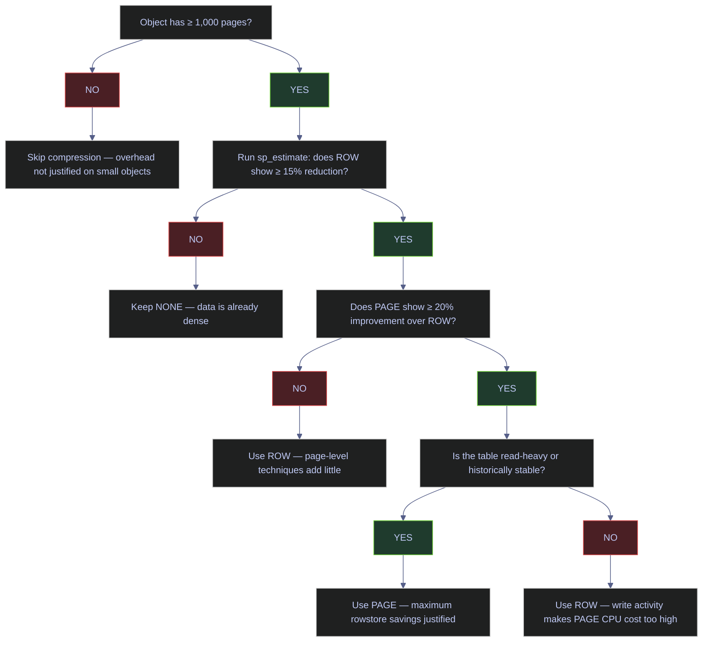

# Table Compression

> [!abstract]- Summary
>
> SQL Server table and index compression reduce page count by storing rows more efficiently. The benefit is not only disk savings: fewer pages usually means fewer logical reads, a smaller buffer-pool footprint, and less I/O for scans, range reads, and backup operations. The tradeoff is CPU, so the production decision is always object-by-object — estimate first, validate on a disposable copy, then apply in a controlled maintenance window.
>
> **Compression mechanics**
> - covers row, page, Unicode, and columnstore archive compression and the physical tradeoffs each one makes
>
> **Current posture and estimation**
> - audits the current compression state of the database and uses `sp_estimate_data_compression_savings` before any rebuild decision
>
> **Validation and deployment**
> - walks through three-way validation (`NONE -> ROW -> PAGE`), online rebuild syntax, `WAIT_AT_LOW_PRIORITY`, edition requirements, and partition-level mixed strategies
>
> **Monitoring and guidance**
> - closes with post-compression monitoring via `sys.dm_db_index_operational_stats`, decision flow, recommendations, and troubleshooting
>
> **Operations and safety**
> - Warnings: compression saves pages, not complexity; the wrong object, wrong mode, or wrong rollout window can turn a storage win into CPU or maintenance pain
> - Recommendations: estimate first, validate on a disposable copy, and let workload shape decide between `ROW`, `PAGE`, or no compression

> [!note]- Glossary
>
> **Row compression**
> - A compression mode that stores fixed-length data more efficiently without changing the logical schema.
> - It matters because it is often the lower-risk entry point when the goal is moderate storage reduction with lighter CPU cost than page compression.
>
> > [!info] Usually the gentler option
> >
> > Row compression often captures meaningful savings with less CPU overhead than page compression. It is a common first candidate, not an automatic winner.
>
> ---
>
> **Page compression**
> - A compression mode that adds dictionary and prefix techniques on top of row compression to shrink repeated values within a page.
> - It matters because it can save more space than row compression, but only when the page actually contains enough repeated structure to justify the CPU cost.
>
> > [!warning] Bigger savings can mean bigger CPU tradeoffs
> >
> > Page compression is not “row compression but better.” It is a more aggressive storage trade that must be validated on the real object.
>
> ---
>
> **Unicode compression**
> - A storage optimization for Unicode data that can reduce the space used by `nchar` and `nvarchar` values under supported conditions.
> - It matters because it changes the savings profile for text-heavy objects and is part of the note’s physical-compression coverage.
>
> > [!info] Text-heavy objects can behave differently
> >
> > Compression outcomes are strongly shaped by data type mix. Unicode-heavy tables need their own validation rather than generic expectations.
>
> ---
>
> **Columnstore archive compression**
> - The highest-compression columnstore mode, optimized for colder data where storage reduction matters more than query speed.
> - It matters because it is a distinct choice for cold analytic partitions, not a universal default for active reporting data.
>
> > [!warning] Archive means colder and slower
> >
> > Archive compression is a storage play. If the data is still hot, the extra compression can hurt the wrong part of the workload.
>
> ---
>
> **`sp_estimate_data_compression_savings`**
> - The stored procedure SQL Server provides to estimate potential size savings before applying row or page compression.
> - It matters because compression decisions should start with measurement rather than intuition.
>
> > [!warning] Estimate is the starting point, not the verdict
> >
> > Estimated savings do not tell you the runtime CPU impact or the maintenance cost. Validation on a disposable copy is still required.
>
> ---
>
> **Online rebuild**
> - An index or table rebuild path that keeps the object more available to concurrent workloads during the operation.
> - It matters because compression changes are usually delivered through rebuild operations, so availability requirements shape which rollout strategies are viable.
>
> > [!warning] “Online” still needs operational planning
> >
> > Online operations reduce blocking, but they do not eliminate resource consumption, locks, or edition-specific constraints.
>
> ---
>
> **`WAIT_AT_LOW_PRIORITY`**
> - A rebuild option that lets an operation wait for locks at lower priority before escalating or aborting based on policy.
> - It matters because compression rollouts often need a way to coexist with live workloads instead of winning every blocking contest immediately.
>
> > [!info] Useful when availability matters more than maintenance impatience
> >
> > Low-priority waiting is an operational compromise. It is valuable when the workload should keep winning while maintenance waits its turn.
>
> ---
>
> **Partition-level compression**
> - The ability to apply different compression settings to different partitions of the same table or index.
> - It matters because many production tables need hot partitions optimized for writes and cold partitions optimized for storage.
>
> > [!info] Mixed strategy is often the production answer
> >
> > Real workloads are rarely uniformly hot or cold. Partition-level compression is how you avoid one compression choice for every age of data.
>
> ---
>
> **`sys.dm_db_index_operational_stats`**
> - A DMV that surfaces runtime index behavior such as locking, latching, scans, and other operational counters.
> - It matters because post-compression monitoring has to confirm that the storage win did not create a worse operational profile somewhere else.
>
> > [!warning] Savings should be verified in workload terms
> >
> > Smaller objects are good only if the workload also behaves acceptably afterward. Operational counters are part of proving that.
>
> ---

## Key Concepts

| Term | Plain-English definition | Why it matters here | Common confusion |
|---|---|---|---|
| **Row compression** | A storage format that replaces fixed-length columns with variable-length representations and eliminates trailing blanks and zero/NULL overhead. Applied per row, independently on each row. | The first and lightest compression tier. Every row is self-contained, so single-row updates cost only one decompress–recompress cycle. | Thinking row compression "zips" the data — it does not use a general-purpose compression algorithm. It restructures the on-page record format. |
| **Page compression** | A storage format that applies row compression first, then adds prefix compression (per column) and dictionary compression (cross-column, per page). Applied at the page level when the page is full. | The highest rowstore compression tier. Repetitive data across rows on the same page compresses dramatically — but every page access pays a decompression cost. | Assuming PAGE always beats ROW. If data has low repetition within a page, the prefix/dictionary pass finds little to compress and the extra CPU is wasted. |
| **Prefix compression** | The first page-level pass. For each column, the engine identifies the longest common prefix across all values on the page and stores it once in the Compression Information (CI) structure at the page header. Each row then stores only the suffix that differs from the prefix. | Explains why columns with highly repetitive leading characters (dates, codes, status strings) compress well under PAGE. | Prefix compression is per-column, not cross-column. Two columns with identical values do not share a prefix. |
| **Dictionary compression** | The second page-level pass, after prefix compression. Scans all columns on the page for repeated values (including prefix-compressed values) and stores each unique value once in a page-level dictionary. Rows reference the dictionary entry instead of storing the value. | Explains why PAGE compression wins on wide tables with repeated enum-like values across different columns. | The dictionary is per-page, not per-table or per-index. Each page builds its own dictionary during compression. |
| **CI structure** | Compression Information — a metadata region stored in the page header that holds the prefix values and dictionary entries for page-compressed pages. | The CI structure is the overhead cost of page compression. If it consumes more space than it saves, SQL Server skips page compression for that page and falls back to row compression only. | Forgetting that CI has a size cost. On pages with highly diverse data, the CI structure can actually increase page size. |
| **Unicode compression** | An automatic optimization using the Standard Compression Scheme for Unicode (SCSU) algorithm, applied to `nchar` and `nvarchar` columns when row or page compression is enabled. Can save up to 50% on Unicode string storage. | Significant for databases that use `nchar`/`nvarchar` extensively. The savings are automatic — no separate option needed. | Unicode compression does not apply to `nvarchar(max)` data, even when stored in-row. |
| **Columnstore archive** | A secondary compression tier (`COLUMNSTORE_ARCHIVE`) that applies the Microsoft Xpress compression algorithm on top of standard columnstore compression. Trades even more CPU for higher compression ratios on cold columnstore data. | Useful for cold partitions in columnstore indexes where the data is rarely queried but must remain online. | Treating `COLUMNSTORE_ARCHIVE` as interchangeable with rowstore PAGE compression — they are fundamentally different storage models. |
| **`sp_estimate_data_compression_savings`** | A system stored procedure that samples the source object, creates a compressed copy in `tempdb`, and reports the projected size under the requested compression type. | The mandatory first step before any compression change. Never compress blind. | The estimate is based on a sample, not the full object. Actual savings may differ, especially on skewed data distributions. |
| **Online rebuild** | An `ALTER INDEX ... REBUILD WITH (ONLINE = ON)` operation that allows concurrent reads and writes during the rebuild. The table remains accessible throughout, with only brief `S` or `Sch-M` locks at the start and end. | Enables compression changes on production tables without blocking the workload. Enterprise edition only for full online rebuild capability. | Online rebuild is not free — it uses more `tempdb` space, generates more transaction log, and takes longer than an offline rebuild. |
| **`WAIT_AT_LOW_PRIORITY`** | An option for online rebuilds that makes the operation hold low-priority locks, letting normal-priority workload traffic proceed. If the rebuild is blocked for `MAX_DURATION` minutes, the `ABORT_AFTER_WAIT` action fires. | Prevents online rebuilds from causing timeouts or throughput drops on busy production tables. | `ABORT_AFTER_WAIT = BLOCKERS` kills blocking user transactions — use with extreme care and only with `ALTER ANY CONNECTION` permission. |

## Compression Types

For rowstore tables and indexes, the practical production choices are `NONE`, `ROW`, and `PAGE`. Columnstore indexes use their own compression model, with an optional `COLUMNSTORE_ARCHIVE` tier for cold data.

| Compression | What it changes | Typical benefit | Main tradeoff | Best fit |
|---|---|---|---|---|
| `NONE` | No compression | None | None | Hot write-heavy tables when page count is already low |
| `ROW` | Stores fixed-length values in variable-length form; eliminates trailing blanks, NULL/zero overhead | Moderate page reduction (10–40%) | Small CPU overhead per row access | Mixed workloads, moderately active tables, OLTP with many numeric columns |
| `PAGE` | Applies row compression first, then prefix and dictionary compression per page | Highest rowstore reduction (40–70% on repetitive data) | More CPU overhead on every page access and rebuild | Read-heavy tables, historical data, cold partitions, wide tables with repeated values |
| `COLUMNSTORE` | Column-by-column storage with segment-level encoding and compression in rowgroups of up to 1,048,576 rows | Very high compression; optimized for scan/aggregate queries | Fundamentally different storage model; poor for point lookups | Analytics, reporting, large fact tables |
| `COLUMNSTORE_ARCHIVE` | Standard columnstore plus Microsoft Xpress algorithm on top | Maximum compression ratio | Significant CPU cost on every segment access | Cold columnstore partitions that must remain queryable |

`PAGE` includes the `ROW` techniques automatically. You do not combine both manually. `COLUMNSTORE_ARCHIVE` includes standard columnstore compression automatically.

### Row Compression | How The Storage Format Changes

Row compression restructures the on-page record format. The three main changes are:

1. **Metadata reduction.** The row header and column offset array are replaced with a more compact Column Descriptor (CD) array. The CD array stores length and offset information in fewer bytes by encoding only what each column actually needs, not the maximum declared width.
2. **Variable-length storage for fixed types.** Fixed-length numeric types (`int`, `bigint`, `decimal`, `money`, `datetime`, `float`) are stored using only the bytes needed for the actual value. An `int` column holding the value `42` uses 1 byte instead of 4. A `decimal(18,2)` holding `0.00` uses 0 bytes.
3. **Trailing blank and zero elimination.** `char` and `nchar` columns have trailing blanks stripped. `NULL` and `0` values across all data types are optimized to take no bytes at all.

> [!info] Row compression data type behavior
>
> Not all data types benefit equally from row compression. The following are the key behaviors:
>
> - **`int`, `bigint`, `smallint`**: stored using only the bytes needed. A `bigint` holding `255` uses 1 byte, not 8.
> - **`decimal`, `numeric`**: stored like `vardecimal` — only the bytes needed for the actual precision.
> - **`money`, `smallmoney`**: converted to integer representation (value × 10,000) and compressed like integers.
> - **`float`, `real`**: trailing zero bytes in the mantissa are stripped. Best savings on whole numbers or low-precision values.
> - **`char(n)`**: trailing padding blanks are removed. A `char(100)` holding `'ABC'` stores 3 bytes, not 100.
> - **`nchar(n)`**: trailing padding removed, plus automatic Unicode compression (SCSU) when row or page compression is active.
> - **`datetime`**: compressed as two integers — date and time components — using only the bytes needed for each.
> - **`datetime2`**: date portion compresses well (3 bytes for contemporary dates); time portion savings depend on precision.
> - **`varchar`, `varbinary`, `nvarchar`**: already variable-length — no additional savings from row compression.
> - **`xml`, `text`, `ntext`, `image`**: off-row data is not compressed. Only in-row portions (≤ 8,060 bytes) are affected.
> - **`uniqueidentifier`**: not affected by row compression — GUIDs are already maximally dense.

Because each row is compressed independently, single-row `UPDATE` operations cost only one decompress–recompress cycle per row. This makes row compression a safe default for tables with moderate write activity.

### Page Compression | How Prefix And Dictionary Compression Work

Page compression applies three operations in order on each leaf-level data page:

1. **Row compression** — identical to standalone row compression, applied to every row on the page.
2. **Prefix compression** — scans each column independently and identifies the longest common prefix across all values in that column on the page. The prefix is stored once in the Compression Information (CI) structure in the page header. Each row then stores only a prefix-length indicator and the remaining suffix.
3. **Dictionary compression** — scans all columns on the page after prefix compression and identifies repeated values (including already-prefix-compressed values). Each unique repeated value is stored once in the CI dictionary. Rows reference the dictionary entry index instead of storing the value inline.

> [!info]- Prefix compression example
>
> Consider a column with these values on one page: `Postcode`, `Postfreeze`, `Postpones`, `Postilion`, `Poacher`, `Teacher`, `Teenager`, `Teeth`, `Tent`, `Imposters`, `Rent`.
>
> The engine selects `Postfreeze` as the anchor (a representative prefix value stored in CI). Each row then stores a prefix-match-length indicator plus the differing suffix:
>
> | Original value | Stored as | Meaning |
> |---|---|---|
> | `Postfreeze` | (anchor) | Stored in CI; rows matching the full value store nothing |
> | `Postcode` | `<4>code` | First 4 chars match the anchor prefix `Post`, suffix is `code` |
> | `Postpones` | `<4>pones` | First 4 chars match |
> | `Postilion` | `<4>ilion` | First 4 chars match |
> | `Teacher` | `<2>acher` | First 2 chars match (`Te` from `Teethings`) — depends on column anchor |
> | `Imposters` | `<0>Imposters` | Zero prefix match — stored in full |
>
> Prefix compression is evaluated per column. Different columns on the same page get different anchors. Similar values in different columns cannot share prefixes.

> [!info]- Dictionary compression example
>
> After prefix compression, dictionary compression scans the entire page across all columns. If the prefix-compressed value `<4>code` appears in multiple rows or multiple columns, it is stored once in the page-level dictionary, and each occurrence is replaced with a dictionary-entry reference.
>
> The dictionary is per-page, not per-table. Each page that is compressed builds its own dictionary during the compression pass. This means the same value may have different dictionary entries on different pages.

> [!warning] Page compression is not always applied
>
> When SQL Server compresses a page, it evaluates whether the CI structure plus dictionary overhead actually saves space. If the net savings are not significant (the CI structure consumes more space than the prefix/dictionary compression frees), the page is stored with row compression only. This is a per-page decision — some pages in a PAGE-compressed index may actually be row-compressed only.

> [!success] Monitor the page compression success ratio
>
> The column `page_compression_attempt_count` vs `page_compression_success_count` in `sys.dm_db_index_operational_stats` exposes how often SQL Server attempted page compression and how often it succeeded. A low success ratio (< 50%) indicates that the data on those pages is too diverse for page-level techniques to help, and `ROW` compression may be the better choice.

Non-leaf-level pages of B-tree indexes are compressed with row compression only, even when the leaf level uses page compression.

### Unicode Compression | Automatic With Row And Page

When row or page compression is enabled on a table or index, SQL Server automatically applies the Standard Compression Scheme for Unicode (SCSU) algorithm to `nchar(n)` and `nvarchar(n)` columns. SCSU can save up to 50% on Unicode string storage by encoding characters that fit in a single byte using one byte instead of two.

Unicode compression applies to:

- `nchar(n)` — fixed-length Unicode strings (padding is also stripped by row compression)
- `nvarchar(n)` — variable-length Unicode strings stored in-row

Unicode compression does **not** apply to:

- `nvarchar(max)` — even when stored in-row
- Off-row Unicode data — any data pushed to LOB or row-overflow pages

No separate option is needed. Enabling `ROW` or `PAGE` compression on the object automatically activates Unicode compression for eligible columns.

### Columnstore Archive Compression

Columnstore indexes use their own segment-level compression (encoding, bit-packing, run-length encoding, dictionary encoding per segment). On top of this, SQL Server offers `COLUMNSTORE_ARCHIVE` compression, which applies the Microsoft Xpress algorithm to each compressed column segment.

`COLUMNSTORE_ARCHIVE` is specified per partition:

```sql
ALTER INDEX CCI_my_table
    ON dbo.my_table
REBUILD PARTITION = 3
    WITH (DATA_COMPRESSION = COLUMNSTORE_ARCHIVE);
```

Use `COLUMNSTORE_ARCHIVE` only on cold partitions that are rarely queried but must remain online. The decompression cost is significant — every segment access pays the Xpress decompression penalty on top of normal columnstore decoding.

> [!warning] COLUMNSTORE_ARCHIVE is not a rowstore option
>
> `COLUMNSTORE_ARCHIVE` can only be applied to columnstore indexes. It cannot be used on rowstore tables or B-tree indexes. Do not conflate it with `PAGE` compression.

> [!success] Use partition-level archive for tiered columnstore
>
> Apply `COLUMNSTORE_ARCHIVE` only to historical partitions (e.g., older than 12 months). Keep recent partitions on standard `COLUMNSTORE` compression for query performance. This is the canonical columnstore tiering pattern.

Microsoft documents row and page compression behavior, supported objects, and estimation procedure details in the [data compression documentation](https://learn.microsoft.com/en-us/sql/relational-databases/data-compression/data-compression).

## Current Compression Posture

Before recommending compression, verify what is already compressed. In `stoxx`, the rowstore surface is overwhelmingly uncompressed — only analytical demo tables show columnstore compression.

### `sys.partitions` + `sys.dm_db_partition_stats` | inspect current compression across the database

This is the first diagnostic to run before any compression rollout. It reveals which indexes are already compressed, which are not, and the relative size of each.

#### `sys.partitions` + `sys.dm_db_partition_stats` | return current compression state and size

Before planning any compression changes, or as part of a periodic storage audit. It is typically triggered by first-time database assessment, post-migration review, or storage-capacity planning. Read-only T-SQL query against catalog views and DMVs. No special permissions beyond `VIEW DATABASE STATE`. No restarts or locks. Produce a ranked list of the largest indexes with their current compression descriptor, so the operator can identify uncompressed candidates and already-compressed objects.

| Field | Source | Type | Meaning |
|---|---|---|---|
| `table_name` | `SCHEMA_NAME(o.schema_id) + '.' + o.name` | computed `nvarchar` | Schema-qualified table name |
| `index_name` | `sys.indexes.name` | `sysname` | Name of the index (NULL for heaps with `index_id = 0`) |
| `type_desc` | `sys.indexes.type_desc` | `nvarchar(60)` | Physical index type: `CLUSTERED`, `NONCLUSTERED`, `CLUSTERED COLUMNSTORE`, etc. |
| `compression` | `sys.partitions.data_compression_desc` | `nvarchar(60)` | Current compression descriptor: `NONE`, `ROW`, `PAGE`, `COLUMNSTORE`, `COLUMNSTORE_ARCHIVE` |
| `size_mb` | `sys.dm_db_partition_stats.used_page_count * 8.0 / 1024` | computed `decimal(10,2)` | Actual storage consumed by this index partition in MB |
| `row_count` | `sys.dm_db_partition_stats.row_count` | `bigint` | Number of rows in this index partition |

*Return the current compression descriptor, size, and row count for the largest indexes in `stoxx`.*

```sql
SELECT TOP 20
    SCHEMA_NAME(o.schema_id) + '.' + o.name AS table_name,
    i.name AS index_name,
    i.type_desc,
    p.data_compression_desc AS compression,
    CAST(ps.used_page_count * 8.0 / 1024 AS decimal(10,2)) AS size_mb,
    ps.row_count
FROM sys.objects AS o
JOIN sys.indexes AS i
    ON o.object_id = i.object_id
JOIN sys.partitions AS p
    ON i.object_id = p.object_id
   AND i.index_id = p.index_id
JOIN sys.dm_db_partition_stats AS ps
    ON i.object_id = ps.object_id
   AND i.index_id = ps.index_id
WHERE o.type = 'U'
  AND i.index_id > 0
ORDER BY size_mb DESC;
```

| table_name | index_name | type_desc | compression | size_mb | row_count |
|---|---|---|---|---:|---:|
| `dbo.demo_idxmaint_rowstore` | `CIX_demo_idxmaint_row_guid` | `CLUSTERED` | `NONE` | 376.64 | 671550 |
| `dbo.demo_idxmaint_missing` | `PK_demo_idxmaint_missing` | `CLUSTERED` | `NONE` | 93.88 | 671550 |
| `dbo.demo_idxmaint_rowstore` | `IX_demo_idxmaint_symbol_date` | `NONCLUSTERED` | `NONE` | 34.84 | 671550 |
| `dbo.demo_idxmaint_splits` | `CIX_demo_idxmaint_splits` | `CLUSTERED` | `NONE` | 22.95 | 100000 |
| `dbo.demo_eurostoxx50_ohlcv` | `CIX_demo_eurostoxx50_ohlcv` | `CLUSTERED` | `NONE` | 6.24 | 67155 |
| `silver.eurostoxx50_ohlcv` | `PK__eurostox__3213E83FDF67D274` | `CLUSTERED` | `NONE` | 6.02 | 67155 |
| `silver.stoxxasia50_ohlcv` | `PK__stoxxasi__3213E83F66A8DE5E` | `CLUSTERED` | `NONE` | 5.80 | 64875 |
| `silver.stoxxusa50_ohlcv` | `PK__stoxxusa__3213E83FC84E3F24` | `CLUSTERED` | `NONE` | 5.77 | 66000 |
| `dbo.demo_index_types_ncci` | `PK_demo_index_types_ncci` | `CLUSTERED` | `NONE` | 2.73 | 50000 |
| `dbo.demo_index_types_covering` | `CIX_demo_index_types_covering` | `CLUSTERED` | `NONE` | 2.31 | 50000 |

_Every rowstore index in the top 10 by size is `NONE`. The real `silver` fact tables — `eurostoxx50_ohlcv` (6.02 MB), `stoxxasia50_ohlcv` (5.80 MB), `stoxxusa50_ohlcv` (5.77 MB) — are all uncompressed. The largest demo table (`demo_idxmaint_rowstore` at 376.64 MB) is also uncompressed. Any production compression recommendation still needs to be justified object by object, but the current posture shows that the entire rowstore surface is open for evaluation._

| Column | Value | Watch | Meaning | Implication |
|---|---|---|---|---|
| `compression` | `NONE` | Depends on workload | No row/page compression is active. | Default baseline; compression decision is still open. Evaluate with `sp_estimate_data_compression_savings`. |
| `compression` | `ROW` | ✅ for mixed workloads | Row compression is active. Fixed-length columns stored as variable-length; NULL/zero optimization applied. | Good middle ground when page savings matter but write activity remains meaningful. |
| `compression` | `PAGE` | ✅ for read-heavy rowstore | Page compression is active. Row compression plus prefix and dictionary compression per page. | Highest rowstore savings, but more CPU work per page access. |
| `compression` | `COLUMNSTORE` | Depends on query pattern | Columnstore compression is active. Column-by-column storage with segment encoding. | Separate storage model from row/page. Best for scan/aggregate workloads. |
| `compression` | `COLUMNSTORE_ARCHIVE` | ✅ for cold columnstore partitions | Columnstore plus Xpress algorithm. Maximum compression ratio. | Significant CPU cost on access. Use only on cold partitions. |

## Estimate Before You Rebuild

Never enable compression blindly. SQL Server provides `sp_estimate_data_compression_savings` so you can compare current size to projected size before changing the actual object. The procedure samples the source object, creates a compressed copy in `tempdb`, and reports the estimated savings.

### `sp_estimate_data_compression_savings` | parameter reference

| Parameter | Type | Required | Description |
|---|---|---|---|
| `@schema_name` | `sysname` | Yes | Schema of the target table or indexed view. If `NULL`, uses the default schema of the current user. |
| `@object_name` | `sysname` | Yes | Name of the table or indexed view. |
| `@index_id` | `int` | Yes | Index ID to evaluate. `NULL` evaluates all indexes on the object. `0` = heap. `1` = clustered index. `> 1` = nonclustered. |
| `@partition_number` | `int` | Yes | Partition number to evaluate. `NULL` evaluates all partitions. `1` for non-partitioned objects. |
| `@data_compression` | `nvarchar(60)` | Yes | Compression type to estimate: `NONE`, `ROW`, `PAGE`, `COLUMNSTORE`, `COLUMNSTORE_ARCHIVE`. |
| `@xml_compression` | `bit` | No | SQL Server 2022+. `1` to include XML compression estimate. `NULL` or `0` to skip. Cannot be `NULL` if `@data_compression` is `NULL`. |

> [!info] How the estimate works internally
>
> The procedure acquires an Intent Shared (IS) lock on the source table, samples the data, creates a temporary table in `tempdb` with the same structure, loads the sample, compresses it with the requested setting, and compares sizes. The estimate is a sample-based projection — actual savings may differ on skewed distributions or highly fragmented data. If the existing data is already fragmented, a plain rebuild (without compression) may already reduce size.

> [!warning] Estimate is not available in every edition before SQL Server 2016 SP1
>
> Prior to SQL Server 2016 SP1, data compression (and its estimation procedure) was restricted to Enterprise and Developer editions. Since SQL Server 2016 SP1, data compression is available in all editions including Standard, Web, and Express.

> [!success] Always available on modern SQL Server
>
> On SQL Server 2016 SP1 and later (including SQL Server 2022 Developer used by `stoxx`), `sp_estimate_data_compression_savings` and `DATA_COMPRESSION` are available in every edition. No edition gate to worry about.

### `sp_estimate_data_compression_savings` | estimate on a live table

`gold.index_performance` is a good live candidate because it is small (5,351 rows, ~672 KB clustered), stable, and read-facing.

#### `sp_estimate_data_compression_savings` | compare ROW and PAGE on `gold.index_performance`

Before deciding whether to compress a specific table or index. It is typically triggered by storage audit identifies a candidate, or query tuning reveals I/O-heavy scans on a read-heavy table. Read-only stored procedure call. Acquires an IS lock on the source table and creates a temporary copy in `tempdb`. No schema changes. Requires `SELECT` on the table, `VIEW DATABASE STATE`, and `VIEW DEFINITION`. Compare the projected size under `ROW` and `PAGE` compression against the current uncompressed size, so the operator can decide which tier (if any) is worth applying.

| Field | Source | Type | Meaning |
|---|---|---|---|
| `object_name` | result set | `sysname` | Name of the table or indexed view |
| `schema_name` | result set | `sysname` | Schema name |
| `index_id` | result set | `int` | `0` = heap, `1` = clustered, `> 1` = nonclustered |
| `partition_number` | result set | `int` | Partition number (`1` for non-partitioned) |
| `size_with_current_compression_setting(KB)` | result set | `bigint` | Current size of the index/partition in KB, excluding fragmentation |
| `size_with_requested_compression_setting(KB)` | result set | `bigint` | Estimated size under the requested compression, excluding fragmentation |
| `sample_size_with_current_compression_setting(KB)` | result set | `bigint` | Size of the sampled data under current compression (includes fragmentation) |
| `sample_size_with_requested_compression_setting(KB)` | result set | `bigint` | Size of the sampled data under requested compression (excludes fragmentation) |

*Estimate the projected size of `gold.index_performance` under `ROW` compression.*

```sql
EXEC sp_estimate_data_compression_savings
    @schema_name = 'gold',
    @object_name = 'index_performance',
    @index_id = NULL,
    @partition_number = NULL,
    @data_compression = 'ROW';
```

| object_name | schema_name | index_id | partition_number | size_with_current_compression_setting(KB) | size_with_requested_compression_setting(KB) | sample_size_with_current_compression_setting(KB) | sample_size_with_requested_compression_setting(KB) |
|---|---|---:|---:|---:|---:|---:|---:|
| `index_performance` | `gold` | 1 | 1 | 672 | 496 | 728 | 544 |
| `index_performance` | `gold` | 2 | 1 | 200 | 192 | 232 | 224 |

*Estimate the projected size of `gold.index_performance` under `PAGE` compression.*

```sql
EXEC sp_estimate_data_compression_savings
    @schema_name = 'gold',
    @object_name = 'index_performance',
    @index_id = NULL,
    @partition_number = NULL,
    @data_compression = 'PAGE';
```

| object_name | schema_name | index_id | partition_number | size_with_current_compression_setting(KB) | size_with_requested_compression_setting(KB) | sample_size_with_current_compression_setting(KB) | sample_size_with_requested_compression_setting(KB) |
|---|---|---:|---:|---:|---:|---:|---:|
| `index_performance` | `gold` | 1 | 1 | 672 | 376 | 728 | 408 |
| `index_performance` | `gold` | 2 | 1 | 200 | 120 | 232 | 144 |

_The clustered index (`index_id = 1`) estimate is the important signal. `ROW` compression would reduce it from 672 KB to 496 KB (26% reduction). `PAGE` would reduce it to 376 KB (44% reduction). The nonclustered index (`index_id = 2`) also benefits, particularly under PAGE (200 KB → 120 KB, 40% reduction). This is the exact pattern that justifies page compression on read-heavy, repetitive data: the extra CPU cost buys a meaningful page-count reduction._

| Column | Value | Watch | Meaning | Implication |
|---|---|---|---|---|
| `size_with_requested` much lower than current | ✅ | — | Compression should shrink the object materially. | Strong candidate for implementation. |
| `size_with_requested` close to current | Depends | — | Compression benefit is small. | CPU tradeoff may not be worth it. Likely keep `NONE`. |
| `PAGE` estimate much better than `ROW` | ✅ for read-heavy data | — | Page-level prefix/dictionary is finding repetition across rows on the same page. | Consider `PAGE` if write activity is low enough. |
| `PAGE` estimate barely better than `ROW` | Depends | — | Page-level techniques add little beyond row compression. | `ROW` may be the safer balance. |
| Requested size larger than current | ⚠️ | — | Compression overhead exceeds savings. Rows are already near-maximally dense. | Do not enable compression on this object. |

## Validate The Actual Reduction On A Disposable Table

An estimate is still only an estimate. The safest teaching pattern is to apply compression to a disposable copy and verify the actual page-count change with a three-way comparison: NONE → ROW → PAGE.

### Demo setup

This disposable table copies 50,000 rows from `silver.eurostoxx50_ohlcv` into a simple clustered rowstore shape — identical columns (`id`, `symbol`, `date`, `close`, `volume`) with a clustered index on `id`.

#### `SELECT INTO` + `CREATE CLUSTERED INDEX` | build the disposable compression demo

When you need a throwaway copy to validate compression savings before touching a production object. It is typically triggered by `sp_estimate_data_compression_savings` reported a promising reduction and you want to confirm it on real data. State-changing DDL. Creates a new table and clustered index. Requires `CREATE TABLE` permission. The table is disposable — drop it after validation. Produce a baseline uncompressed table that the subsequent rebuild steps will compress and measure.

*Create the disposable rowstore table used to validate actual compression savings.*

```sql
IF OBJECT_ID('dbo.demo_table_compression', 'U') IS NOT NULL
    DROP TABLE dbo.demo_table_compression;

SELECT TOP (50000)
    id,
    symbol,
    [date],
    [close],
    volume
INTO dbo.demo_table_compression
FROM silver.eurostoxx50_ohlcv
ORDER BY id;

CREATE CLUSTERED INDEX CIX_demo_table_compression
    ON dbo.demo_table_compression(id);

SELECT COUNT(*) AS row_count
FROM dbo.demo_table_compression;
```

| row_count |
|---:|
| 50000 |

#### `sys.partitions` | verify baseline before compression

Immediately after creating the demo table, before any rebuild. It is typically triggered by demo table is ready; need to record the `NONE` baseline for comparison. Read-only catalog query. No locks beyond IS. Capture the uncompressed page count and size as the baseline for the three-way comparison.

| Field | Source | Type | Meaning |
|---|---|---|---|
| `index_name` | `sys.indexes.name` | `sysname` | Index name |
| `compression` | `sys.partitions.data_compression_desc` | `nvarchar(60)` | Current compression descriptor |
| `row_count` | `sys.dm_db_partition_stats.row_count` | `bigint` | Row count |
| `used_page_count` | `sys.dm_db_partition_stats.used_page_count` | `bigint` | Pages consumed by this index |
| `size_mb` | computed | `decimal(10,2)` | `used_page_count * 8 / 1024` — size in MB |

*Return the current compression state and used page count before applying compression.*

```sql
SELECT
    i.name AS index_name,
    p.data_compression_desc AS compression,
    ps.row_count,
    ps.used_page_count,
    CAST(ps.used_page_count * 8.0 / 1024 AS decimal(10,2)) AS size_mb
FROM sys.indexes AS i
JOIN sys.partitions AS p
    ON i.object_id = p.object_id
   AND i.index_id = p.index_id
JOIN sys.dm_db_partition_stats AS ps
    ON i.object_id = ps.object_id
   AND i.index_id = ps.index_id
WHERE i.object_id = OBJECT_ID('dbo.demo_table_compression')
  AND i.index_id > 0;
```

| index_name | compression | row_count | used_page_count | size_mb |
|---|---|---:|---:|---:|
| `CIX_demo_table_compression` | `NONE` | 50000 | 296 | 2.31 |

_The uncompressed baseline is 296 pages (2.31 MB) for 50,000 rows._

### Three-Way Comparison | NONE → ROW → PAGE

Each rebuild rewrites the clustered index with the requested compression format. This sequence demonstrates the incremental benefit of each compression tier on identical data.

#### `ALTER INDEX ... REBUILD` | apply ROW compression

After capturing the NONE baseline. It is typically triggered by validation step in the three-way comparison sequence. State-changing DDL. Rebuilds the clustered index offline. Acquires a `Sch-M` lock for the duration. On a disposable demo table, this is acceptable. On production, use `ONLINE = ON` (see the Online Rebuild section below). Measure the actual page-count reduction from row compression alone, isolated from page-level techniques.

> [!warning] Compression rebuilds are offline by default
>
> Without `ONLINE = ON`, the rebuild acquires a schema modification lock (`Sch-M`) that blocks all concurrent access to the table for the entire duration. On large tables this can last minutes to hours.

> [!success] Use ONLINE = ON for production rebuilds
>
> On Enterprise/Developer edition, add `ONLINE = ON` (and optionally `WAIT_AT_LOW_PRIORITY`) to keep the table accessible during the rebuild. See the Online Rebuild section below for full syntax and edition requirements.

*Rebuild the clustered index with `ROW` compression and verify the new page count.*

```sql
ALTER INDEX CIX_demo_table_compression
    ON dbo.demo_table_compression
REBUILD WITH (DATA_COMPRESSION = ROW);
```

```sql
SELECT
    i.name AS index_name,
    p.data_compression_desc AS compression,
    ps.row_count,
    ps.used_page_count,
    CAST(ps.used_page_count * 8.0 / 1024 AS decimal(10,2)) AS size_mb
FROM sys.indexes AS i
JOIN sys.partitions AS p
    ON i.object_id = p.object_id
   AND i.index_id = p.index_id
JOIN sys.dm_db_partition_stats AS ps
    ON i.object_id = ps.object_id
   AND i.index_id = ps.index_id
WHERE i.object_id = OBJECT_ID('dbo.demo_table_compression')
  AND i.index_id > 0;
```

| index_name | compression | row_count | used_page_count | size_mb |
|---|---|---:|---:|---:|
| `CIX_demo_table_compression` | `ROW` | 50000 | 183 | 1.43 |

_Row compression reduced the clustered index from 296 pages to 183 pages — a 38% page-count reduction, from 2.31 MB to 1.43 MB. The savings come primarily from variable-length storage of the `int` (`id`), `float` (`close`), and `bigint` (`volume`) columns, plus trailing-blank removal on `varchar` (`symbol`)._

#### `ALTER INDEX ... REBUILD` | apply PAGE compression

After the ROW step, to complete the three-way comparison. It is typically triggered by next step in the validation sequence. Same as the ROW rebuild — offline `Sch-M` lock on the demo table. Measure the additional savings from prefix and dictionary compression on top of row compression.

*Rebuild the clustered index with `PAGE` compression and verify the new page count.*

```sql
ALTER INDEX CIX_demo_table_compression
    ON dbo.demo_table_compression
REBUILD WITH (DATA_COMPRESSION = PAGE);
```

```sql
SELECT
    i.name AS index_name,
    p.data_compression_desc AS compression,
    ps.row_count,
    ps.used_page_count,
    CAST(ps.used_page_count * 8.0 / 1024 AS decimal(10,2)) AS size_mb
FROM sys.indexes AS i
JOIN sys.partitions AS p
    ON i.object_id = p.object_id
   AND i.index_id = p.index_id
JOIN sys.dm_db_partition_stats AS ps
    ON i.object_id = ps.object_id
   AND i.index_id = ps.index_id
WHERE i.object_id = OBJECT_ID('dbo.demo_table_compression')
  AND i.index_id > 0;
```

| index_name | compression | row_count | used_page_count | size_mb |
|---|---|---:|---:|---:|
| `CIX_demo_table_compression` | `PAGE` | 50000 | 144 | 1.13 |

_Page compression reduced the index further to 144 pages (1.13 MB) — a 51% total reduction from the uncompressed baseline, and a 21% reduction beyond ROW alone. The `symbol` column (repeated stock tickers across many rows) is highly amenable to prefix and dictionary compression, which explains the additional PAGE benefit._

### Three-Way Summary

| Compression | Pages | Size (MB) | Reduction from NONE | Reduction from ROW |
|---|---:|---:|---:|---:|
| `NONE` | 296 | 2.31 | — | — |
| `ROW` | 183 | 1.43 | 38% | — |
| `PAGE` | 144 | 1.13 | 51% | 21% |

The pattern is clear: ROW compression alone delivers substantial savings on numeric-heavy OHLCV data. PAGE compression adds meaningful additional savings because the `symbol` column (and to some extent `date`) contains highly repetitive values across rows that land on the same page.

## Online Rebuild And Edition Requirements

### Edition availability

Data compression (`ROW`, `PAGE`, `COLUMNSTORE`, `COLUMNSTORE_ARCHIVE`) and `sp_estimate_data_compression_savings` are available in **all editions** of SQL Server starting with SQL Server 2016 SP1. This includes Standard, Web, and Express.

However, the **online rebuild** option (`ONLINE = ON`) that allows concurrent access during a compression rebuild is restricted:

| Feature | Enterprise / Developer | Standard | Web / Express |
|---|---|---|---|
| `DATA_COMPRESSION` (ROW, PAGE) | ✅ | ✅ (since 2016 SP1) | ✅ (since 2016 SP1) |
| `ONLINE = ON` for index rebuild | ✅ | ❌ | ❌ |
| `RESUMABLE = ON` for index rebuild | ✅ | ❌ | ❌ |
| `WAIT_AT_LOW_PRIORITY` | ✅ | ❌ | ❌ |

On Standard edition, all compression rebuilds are offline — the table is locked with `Sch-M` for the duration. Plan these operations in maintenance windows.

### Online rebuild syntax with `WAIT_AT_LOW_PRIORITY`

On Enterprise/Developer edition, use this syntax to apply or change compression with minimal workload disruption:

```sql
ALTER INDEX CIX_my_table
    ON dbo.my_table
REBUILD WITH (
    DATA_COMPRESSION = PAGE,
    ONLINE = ON (
        WAIT_AT_LOW_PRIORITY (
            MAX_DURATION = 10 MINUTES,
            ABORT_AFTER_WAIT = SELF
        )
    )
);
```

> [!info]- WAIT_AT_LOW_PRIORITY options explained
>
> `WAIT_AT_LOW_PRIORITY` controls what happens when the online rebuild cannot acquire the brief `S` or `Sch-M` lock it needs at the start and end of the operation:
>
> - **`MAX_DURATION`**: how many minutes to wait using low-priority locks before taking action. `0` means attempt immediately, then take the `ABORT_AFTER_WAIT` action.
> - **`ABORT_AFTER_WAIT = NONE`**: continue waiting with normal priority (same as omitting `WAIT_AT_LOW_PRIORITY` entirely).
> - **`ABORT_AFTER_WAIT = SELF`**: the rebuild operation cancels itself if it cannot acquire the lock within `MAX_DURATION`. Safest option — the workload is never disrupted.
> - **`ABORT_AFTER_WAIT = BLOCKERS`**: kill all user transactions blocking the rebuild. Requires `ALTER ANY CONNECTION` permission. Use only when the rebuild is more important than the blocking queries.

### Resumable online rebuild

SQL Server 2017+ and Azure SQL Database support resumable online index rebuilds. A resumable rebuild can be paused and resumed without losing progress:

```sql
ALTER INDEX CIX_my_table
    ON dbo.my_table
REBUILD WITH (
    DATA_COMPRESSION = PAGE,
    ONLINE = ON,
    RESUMABLE = ON,
    MAX_DURATION = 60
);
```

If the operation exceeds `MAX_DURATION` minutes, it pauses automatically. Resume with:

```sql
ALTER INDEX CIX_my_table ON dbo.my_table RESUME;
```

> [!warning] Resumable rebuild limitations
>
> Resumable index rebuild is not supported for:
>
> - Columnstore indexes
> - Filtered indexes
> - Disabled indexes
> - `ALTER INDEX REBUILD ALL` (must target individual indexes)
> - Indexes containing computed or `timestamp`/`rowversion` key columns

> [!success] Use resumable for large compression rebuilds
>
> For multi-GB indexes where the rebuild could take hours, `RESUMABLE = ON` lets you pause during peak hours and resume during off-peak windows. The intermediate state survives across sessions — you do not need to keep the connection open.

## Partition-Level Compression

SQL Server supports setting a different compression type on each partition of a partitioned table or index. This enables a tiered compression strategy:

- **Hot partitions** (current month/quarter, heavy writes): `NONE` or `ROW`
- **Warm partitions** (recent history, moderate reads): `ROW` or `PAGE`
- **Cold partitions** (historical, rare access): `PAGE` or `COLUMNSTORE_ARCHIVE`

The syntax targets a specific partition number:

```sql
ALTER INDEX CIX_my_partitioned_table
    ON dbo.my_partitioned_table
REBUILD PARTITION = 5
    WITH (DATA_COMPRESSION = PAGE);
```

To set compression on multiple partitions in a single statement when creating or rebuilding:

```sql
ALTER TABLE dbo.my_partitioned_table
REBUILD PARTITION = ALL WITH (
    DATA_COMPRESSION = PAGE ON PARTITIONS (1 TO 8),
    DATA_COMPRESSION = ROW ON PARTITIONS (9 TO 10),
    DATA_COMPRESSION = NONE ON PARTITIONS (11 TO 12)
);
```

> [!tip] Automate partition compression tiering
>
> In a sliding-window partitioning scheme where new partitions are added monthly:
>
> 1. New partitions are created with `DATA_COMPRESSION = NONE` or `ROW` to minimize write overhead
> 2. A monthly maintenance job rebuilds the partition that just became "warm" with `PAGE` compression
> 3. Partitions older than 12 months are already PAGE-compressed and remain untouched
>
> This way, only one partition is rebuilt per maintenance cycle, keeping the window short.

> [!warning] Nonclustered indexes do not inherit compression
>
> When you compress a clustered index or heap, nonclustered indexes on the same table do not automatically inherit the compression setting. Each nonclustered index must be compressed separately with its own `ALTER INDEX ... REBUILD WITH (DATA_COMPRESSION = ...)` statement.

> [!success] Compress nonclustered indexes individually
>
> After compressing the clustered index, evaluate each nonclustered index separately with `sp_estimate_data_compression_savings` using the specific `@index_id`. A narrow nonclustered index with unique key values may not benefit from PAGE compression — ROW or even NONE may be the better choice.

## How To Choose ROW vs PAGE

The decision between `ROW` and `PAGE` compression is not a general preference — it depends on the specific object's data characteristics and access pattern. The following flowchart captures the decision logic.



**Decision factors in detail:**

- **Minimum object size.** Do not compress tables or indexes smaller than ~1,000 pages (~8 MB). The CPU overhead and maintenance complexity are not justified for objects that fit in a handful of extents.
- **ROW threshold.** If `sp_estimate_data_compression_savings` shows less than 15% reduction under ROW, the data is already near-maximally dense (already `varchar`/`varbinary`, few NULLs, few trailing blanks). Compression will add CPU cost with negligible storage benefit.
- **PAGE-over-ROW threshold.** If PAGE compression saves less than 20% beyond ROW, the prefix/dictionary pass is not finding enough repetition. The per-page CI overhead and decompression cost are not justified. Use ROW.
- **Write activity.** PAGE compression decompresses and recompresses an entire page for every single-row modification. On tables with frequent `UPDATE` or `INSERT` activity, the cumulative CPU cost can degrade throughput. ROW compression handles single-row modifications efficiently because each row is independent.
- **Read-heavy or historically stable.** Gold-layer aggregates, historical fact tables, cold partitions, and reporting dimensions are ideal PAGE candidates. They are read often, written rarely, and contain highly repetitive data (same symbols, same dates, same status codes repeated across rows).

## Monitoring Compression Overhead

After enabling compression, verify that the tradeoff is working as expected. The primary monitoring surface is `sys.dm_db_index_operational_stats`, which tracks page compression attempt and success counts.

### `sys.dm_db_index_operational_stats` | page compression attempt ratio

This DMV exposes per-index, per-partition counters for how often SQL Server attempted page compression on a page and how often it succeeded. A low success ratio means the data on those pages is too diverse for prefix/dictionary compression to help.

#### `sys.dm_db_index_operational_stats` | check page compression effectiveness

After enabling PAGE compression on an index, once the index has been in use for a representative workload period (at least one full ETL or query cycle). It is typically triggered by post-compression validation, or investigating unexpectedly high CPU on a recently compressed table. Read-only DMV query. No special permissions beyond `VIEW DATABASE STATE`. Counters reset when the SQL Server instance restarts. Determine whether page compression is actually compressing pages effectively, or if the data is too diverse and the engine is falling back to row-only compression on most pages.

| Field | Source | Type | Meaning |
|---|---|---|---|
| `table_name` | `OBJECT_NAME(object_id)` | computed `nvarchar` | Table name |
| `index_id` | `sys.dm_db_index_operational_stats.index_id` | `int` | Index ID (`0` = heap, `1` = clustered, `> 1` = nonclustered) |
| `page_compression_attempt_count` | DMV column | `bigint` | Number of pages SQL Server attempted to page-compress since last restart |
| `page_compression_success_count` | DMV column | `bigint` | Number of pages where page compression actually saved space |
| `success_pct` | computed | `decimal(5,1)` | `success_count / attempt_count * 100` — the effectiveness ratio |

*Return the page compression attempt-to-success ratio for a PAGE-compressed index.*

```sql
SELECT
    OBJECT_SCHEMA_NAME(object_id) + '.' + OBJECT_NAME(object_id) AS table_name,
    index_id,
    partition_number,
    page_compression_attempt_count,
    page_compression_success_count,
    CASE
        WHEN page_compression_attempt_count = 0 THEN NULL
        ELSE CAST(
            page_compression_success_count * 100.0
            / page_compression_attempt_count AS decimal(5,1))
    END AS success_pct
FROM sys.dm_db_index_operational_stats(DB_ID(), NULL, NULL, NULL)
WHERE page_compression_attempt_count > 0
ORDER BY page_compression_attempt_count DESC;
```

| table_name | index_id | page_compression_attempt_count | page_compression_success_count | success_pct |
|---|---|---:|---:|---:|
| `dbo.demo_table_compression` | 1 | 282 | 161 | 57.1 |

_The demo table's clustered index shows 282 page compression attempts with 161 successes (57.1%). This means 57% of pages were dense enough for prefix/dictionary compression to yield net savings. The remaining 43% of pages were stored with row compression only because the CI overhead would have exceeded the savings. A success ratio above 50% is typical for mixed data; ratios above 80% indicate highly repetitive data where PAGE compression is an excellent fit._

| success_pct range | Interpretation | Action |
|---|---|---|
| **80–100%** | Excellent. Nearly every page benefits from prefix/dictionary compression. | Keep PAGE compression. The CPU cost is well justified. |
| **50–80%** | Good. Majority of pages benefit, but some are too diverse. | Keep PAGE compression. Monitor for workload changes that could shift the ratio. |
| **20–50%** | Marginal. More pages are falling back to row-only than succeeding. | Consider switching to ROW compression. The PAGE CPU overhead may not be justified. |
| **< 20%** | Poor. Almost no pages benefit from page-level techniques. | Switch to ROW compression or NONE. PAGE compression is wasting CPU on this object. |

> [!warning] DMV counters reset on instance restart
>
> `page_compression_attempt_count` and `page_compression_success_count` are cumulative since the last SQL Server restart, not since the index was created. After a restart, wait for a full representative workload cycle before interpreting the ratios.

> [!success] Capture a baseline after compression
>
> Run this query immediately after a compression change, record the counts, then re-run after a representative workload period. The delta between the two snapshots gives the true effectiveness for the current workload, not residual counts from previous periods.

## Operational Recommendations

**Which objects to compress first:**

- **Gold-layer aggregates** (`gold.index_performance`, `gold.scores_daily`) — read-heavy, stable, low write activity, moderate row counts. Start with `ROW`; evaluate `PAGE` if the estimate shows ≥ 20% additional savings.
- **Silver fact tables** (`silver.eurostoxx50_ohlcv`, `silver.stoxxusa50_ohlcv`, `silver.stoxxasia50_ohlcv`) — larger row counts (64K–67K), read-heavy after ETL completion. `PAGE` is likely justified due to highly repetitive `symbol` and `date` columns. Compress after confirming the ETL write window is narrow.
- **Historical partitions** in any partitioned table — use `PAGE` on cold partitions, `ROW` on warm partitions, `NONE` on the hot write partition.
- **Demo and staging tables** (`dbo.demo_idxmaint_rowstore` at 376 MB) — only if disk space is a concern. Demo tables are write-heavy during setup but read-heavy during teaching.

**What to avoid:**

- Do not compress tiny tables (< 1,000 pages). The CPU overhead and maintenance complexity are not justified for objects that fit in a few MB.
- Do not apply PAGE compression to tables with high concurrent write rates. The per-page decompression/recompression cycle on every modification can degrade OLTP throughput.
- Do not treat `COLUMNSTORE_ARCHIVE` as interchangeable with rowstore `PAGE` compression. They are fundamentally different storage models.
- Do not assume nonclustered indexes inherit compression from the clustered index. Each nonclustered index must be compressed separately.

**Post-compression checklist:**

1. Re-check `sys.dm_db_partition_stats` to confirm the actual page-count reduction matches the estimate
2. Monitor `sys.dm_db_index_operational_stats` for page compression success ratio after a full workload cycle
3. Verify that query logical reads decreased (check `SET STATISTICS IO ON` for key queries)
4. Watch for CPU increases on the compressed tables during peak workload
5. Document the compression setting in the table's maintenance runbook so future rebuilds preserve it

## Troubleshooting

Failure modes by symptom — the error, what it usually means, and the fix.

| Error / symptom | Likely cause | Fix |
|---|---|---|
| **Error 5765:** `ALTER INDEX REBUILD ONLINE is not supported for index ...` | Online rebuild attempted on an unsupported index type (XML, spatial, disabled, local temp table) or on Standard/Web/Express edition. | Use offline rebuild (`ONLINE = OFF`), schedule in a maintenance window. On Standard edition, online rebuild is not available — plan accordingly. |
| **Error 1101 / 1105:** `Could not allocate space for object ... in database ... because the filegroup is full` | The rebuild operation ran out of space. Online rebuilds require temporary space for the new copy alongside the old index. | Free disk space or extend the data file. For online rebuilds, ensure the filegroup has at least 1.5× the current index size available. |
| **Compression rebuild takes unexpectedly long** | Large object, fragmented source data, or insufficient `tempdb` space causing spills. | Consider `SORT_IN_TEMPDB = ON` to isolate the sort work. Use `RESUMABLE = ON` on Enterprise to pause/resume across maintenance windows. |
| **Lock escalation blocking queries during offline rebuild** | Offline `ALTER INDEX REBUILD` holds `Sch-M` for the entire duration, blocking all concurrent access. | Use `ONLINE = ON` on Enterprise/Developer edition, or schedule the rebuild during a maintenance window when no queries are running. |
| **CPU increase after enabling PAGE compression** | Normal: page decompression is CPU-intensive. But excessive CPU may indicate PAGE compression on a write-heavy table. | Check `sys.dm_db_index_operational_stats` for page compression success ratio. If < 50%, switch to ROW compression. |
| **Estimate shows size increase after compression** | Row overhead from the CD array and CI structure exceeds savings. Typically occurs on tables where rows are already near 8,060 bytes or data is highly diverse. | Do not enable compression on this object. The data is already near-maximally dense. |
| **Error 8622 or poor plan after compression** | The optimizer's cardinality estimates may shift slightly because compressed pages hold more rows. | Update statistics on the compressed index with `UPDATE STATISTICS ... WITH FULLSCAN`. |
| **`sp_estimate_data_compression_savings` blocked or slow** | The procedure acquires an IS lock on the source table and creates a `tempdb` copy. If the table is very large or `tempdb` is constrained, the procedure may be slow or blocked. | Run during off-peak hours. Ensure `tempdb` has adequate free space for the sample copy. |

## References

- [Data Compression](https://learn.microsoft.com/en-us/sql/relational-databases/data-compression/data-compression) — overview of row, page, Unicode, and columnstore compression with considerations and edition availability
- [Row Compression Implementation](https://learn.microsoft.com/en-us/sql/relational-databases/data-compression/row-compression-implementation) — how row compression changes the on-page record format per data type
- [Page Compression Implementation](https://learn.microsoft.com/en-us/sql/relational-databases/data-compression/page-compression-implementation) — prefix compression, dictionary compression, and the CI structure
- [Unicode Compression Implementation](https://learn.microsoft.com/en-us/sql/relational-databases/data-compression/unicode-compression-implementation) — SCSU algorithm for `nchar`/`nvarchar` columns
- [sp_estimate_data_compression_savings (Transact-SQL)](https://learn.microsoft.com/en-us/sql/relational-databases/system-stored-procedures/sp-estimate-data-compression-savings-transact-sql) — parameters, return columns, permissions, limitations, and columnstore estimation
- [ALTER INDEX (Transact-SQL)](https://learn.microsoft.com/en-us/sql/t-sql/statements/alter-index-transact-sql) — `REBUILD`, `ONLINE`, `RESUMABLE`, `WAIT_AT_LOW_PRIORITY`, `DATA_COMPRESSION` options
- [sys.dm_db_index_operational_stats (Transact-SQL)](https://learn.microsoft.com/en-us/sql/relational-databases/system-dynamic-management-views/sys-dm-db-index-operational-stats-transact-sql) — page compression attempt and success counters
- [sys.dm_db_partition_stats (Transact-SQL)](https://learn.microsoft.com/en-us/sql/relational-databases/system-dynamic-management-views/sys-dm-db-partition-stats-transact-sql) — used page count and row count per partition
- [sys.partitions (Transact-SQL)](https://learn.microsoft.com/en-us/sql/relational-databases/system-catalog-views/sys-partitions-transact-sql) — `data_compression_desc` column for current compression state
- [Editions and Supported Features of SQL Server 2022](https://learn.microsoft.com/en-us/sql/sql-server/editions-and-components-of-sql-server-2022) — data compression and online index rebuild availability by edition
