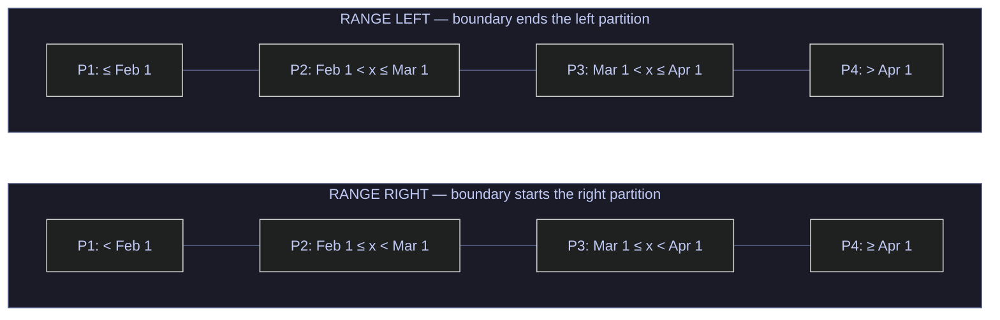
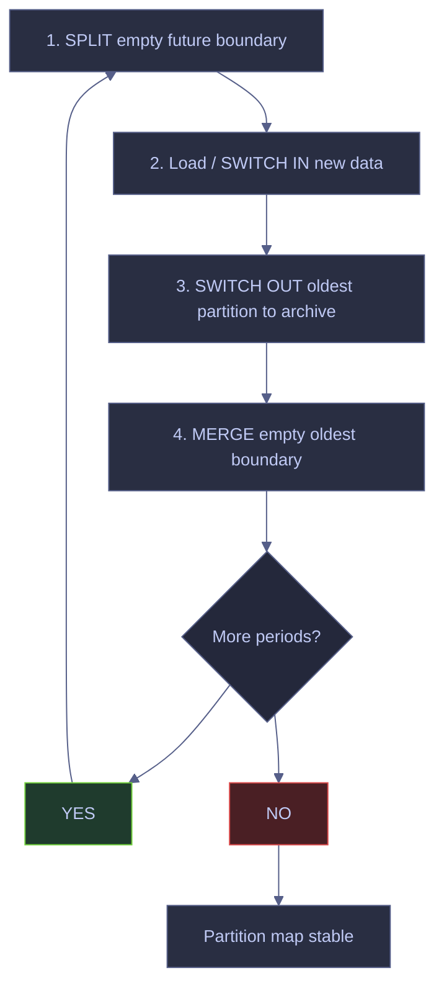
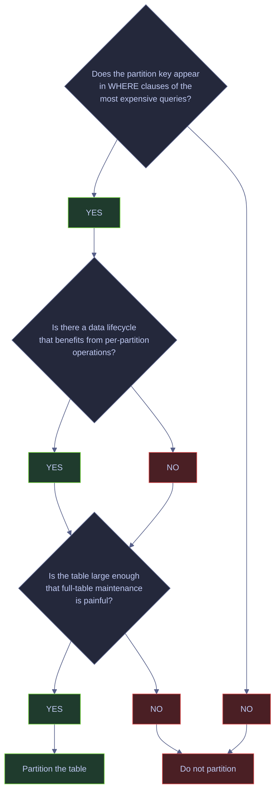

# Partitioning Strategies

> [!abstract]- Summary
>
> Partitioning divides one logical table into multiple physical partitions based on a partition key. In SQL Server, partitioning is primarily a **manageability** and **data-lifecycle** feature. It can help query performance through partition elimination, but it is not a universal speed feature on its own.
>
> **When partitioning helps**
> - use it for sliding-window retention, very fast archival or load-exchange operations with `SWITCH`, per-partition rebuild or compression, and predictable time-sliced access on very large tables
>
> **Partitioning model**
> - explains partition keys, partition functions, partition schemes, `RANGE LEFT` vs `RANGE RIGHT`, and the live baseline in `stoxx`
>
> **Operational patterns**
> - covers reproducible demo setup, partition elimination, `SWITCH`, sliding-window `SPLIT` and `MERGE`, aligned versus non-aligned indexes, per-partition compression, lock escalation, and partition-specific `TRUNCATE TABLE`
>
> **Monitoring and limits**
> - includes partition statistics, `sys.dm_db_partition_stats`, sizing and skew detection, edition limits, and practical cases where partitioning should not be used at all
>
> **Operations and safety**
> - When not to use: if the partition key is not part of real workload predicates, partitioning adds complexity with little benefit
> - Warnings: populated `SPLIT` or `MERGE`, non-aligned indexes, and cosmetic partitioning all turn manageability tooling into expensive data movement or blocked operations
> - Recommendations: partition for lifecycle and manageability first, not for vague hopes of universal speed

> [!note]- Glossary
>
> **Partition key**
> - The column whose value decides which partition each row lands in.
> - It matters because every operational benefit in the note depends on whether the workload actually filters, maintains, or ages data by that key.
>
> > [!warning] Wrong key, wrong payoff
> >
> > If queries do not filter by the partition key, partitioning usually adds complexity without delivering elimination benefits.
>
> ---
>
> **Partition function**
> - The database object that defines the ordered boundary values and left-or-right boundary semantics for partitions.
> - It matters because it is the logical blueprint for where the table is cut.
>
> > [!warning] The function defines boundaries, not storage
> >
> > A partition function says where cuts occur. It does not decide which filegroup stores those cuts.
>
> ---
>
> **Partition scheme**
> - The database object that maps partitions from the function onto filegroups.
> - It matters because storage placement, manageability, and some restore strategies are expressed through the scheme layer.
>
> > [!info] Logical and physical mapping are separate on purpose
> >
> > SQL Server splits the partitioning model into function and scheme so logical boundaries and physical placement can evolve independently.
>
> ---
>
> **`RANGE LEFT` / `RANGE RIGHT`**
> - The setting that decides which side of a boundary value owns that boundary row.
> - It matters because date-based sliding windows are often far easier to reason about with one direction than the other.
>
> > [!warning] Boundary direction changes real data placement
> >
> > Choosing the wrong range direction can shift boundary dates into the wrong monthly bucket and quietly break retention logic.
>
> ---
>
> **Partition elimination**
> - The optimizer’s ability to skip partitions proven irrelevant by the query predicate.
> - It matters because it is the main performance upside of partitioning, but only when predicates line up with the partition design.
>
> > [!warning] Elimination is conditional, not automatic
> >
> > A partitioned table can still be scanned across every partition if the predicate does not constrain the partition key.
>
> ---
>
> **Aligned index**
> - An index partitioned in the same way as the base table, using the same function, scheme, and key alignment rules.
> - It matters because aligned indexes are required for metadata-only `SWITCH` operations.
>
> > [!warning] One non-aligned index can block the workflow
> >
> > Partition switching is structurally strict. A single non-aligned index is enough to make the operation impossible.
>
> ---
>
> **`SWITCH`**
> - The metadata-only operation that reassigns one partition’s pages to another table or partition target without moving rows physically.
> - It matters because `SWITCH` is the strongest operational reason to partition large fact tables in the first place.
>
> > [!warning] Metadata-only is still rule-heavy
> >
> > `SWITCH` is fast only when the source, target, constraints, and index alignment all match exactly. Otherwise it fails rather than “doing its best.”
>
> ---
>
> **Sliding window**
> - The recurring pattern of splitting future boundaries, loading new data, switching out old data, and merging away empty old ranges.
> - It matters because sliding windows are how date-partitioned fact tables keep retention stable over time without bulk delete pain.
>
> > [!warning] Empty-range discipline matters
> >
> > `SPLIT` and `MERGE` should operate on empty partitions whenever possible. Doing them on populated ranges turns metadata maintenance into logged data movement.
>
> ---
>
> **`$PARTITION`**
> - The T-SQL function that returns the partition number for a supplied value.
> - It matters because it is one of the easiest ways to verify which partition a value maps to when testing boundaries and elimination.
>
> > [!info] It returns numbers, not boundary labels
> >
> > `$PARTITION` tells you which partition number a value lands in. Use catalog views to inspect the actual boundary values.
>
> ---
>
> **`sys.dm_db_partition_stats`**
> - The DMV that exposes row counts and page counts per partition and per index.
> - It matters because production partitioning decisions depend on sizing, skew, and compression state, not just on the existence of partition objects.
>
> > [!warning] Size and skew decide whether the design is healthy
> >
> > A partitioned table can be structurally correct and still operationally bad if one partition holds nearly all the rows or pages.
>
> ---

## Key Concepts

| Term | Plain-English definition | Why it matters here | Common mistake / confusion |
|---|---|---|---|
| **Partition key** | The single column whose values determine which partition each row lands in. Declared as the argument to the partition function and referenced again when the clustered index is placed on the partition scheme. | Every design decision in this note radiates from the choice of partition key — it controls elimination, SWITCH eligibility, and maintenance granularity. | Choosing a partition key that is not part of the workload predicates. If queries never filter on the key, partitioning adds metadata overhead with no elimination benefit. |
| **Partition function** | A database-scoped object (`CREATE PARTITION FUNCTION`) that defines an ordered set of boundary values and whether boundaries belong to the left or right partition (`RANGE LEFT` / `RANGE RIGHT`). Three boundaries produce four partitions. | The function is the logical blueprint. It does not store data — it only defines where cuts happen. | Confusing the function with the scheme. The function defines the cuts; the scheme maps those cuts to filegroups. Dropping a function that still has a scheme referencing it fails with error 7707. |
| **Partition scheme** | A database-scoped object (`CREATE PARTITION SCHEME`) that maps each partition defined by the function to a filegroup. All partitions can map to the same filegroup (`ALL TO ([PRIMARY])`) or to separate filegroups for storage tiering. | The scheme is the physical mapping layer. SWITCH, backup, and restore all operate at the filegroup level, so the scheme determines what is independently manageable. | Using `ALL TO ([PRIMARY])` in production without understanding that it eliminates filegroup-level backup and restore granularity. The demo in this note uses `ALL TO ([PRIMARY])` for reproducibility, not as a production recommendation. |
| **RANGE LEFT / RANGE RIGHT** | The direction that determines which partition a boundary value belongs to. `RANGE RIGHT` means the boundary value is the *first* value in the partition to its right. `RANGE LEFT` means the boundary value is the *last* value in the partition to its left. | `RANGE RIGHT` is the standard choice for date-based partitioning because the boundary value `2025-03-01` means "March starts here", which maps naturally to monthly retention. | Using `RANGE LEFT` with date boundaries. `RANGE LEFT` on `2025-03-01` places that date in the left partition (February), which is counterintuitive for monthly slicing. |
| **Partition elimination** | The query optimizer's ability to skip partitions that cannot contain qualifying rows based on the query predicate and the partition function's boundary values. Visible in execution plans as `Actual Partition Count` less than the total partition count. | Elimination is the primary performance benefit of partitioning. Without it, a partitioned table scan reads *more* pages than an equivalent non-partitioned table due to per-partition metadata overhead. | Assuming all queries benefit from elimination. Only predicates on the partition key column (or columns that the optimizer can fold into partition-key predicates) trigger elimination. A `WHERE symbol = 'BMW'` on a date-partitioned table scans every partition. |
| **Aligned index** | An index whose partitioning matches the base table — same partition function, same partition scheme, same partition key column. Both clustered and non-clustered indexes can be aligned. | SWITCH requires all indexes to be aligned. A single non-aligned index blocks the operation with error 4906. | Creating a unique non-clustered index on a column that is *not* the partition key without including the partition key. SQL Server cannot align the uniqueness check with the partition boundary unless the partition key is part of the index key. |
| **Non-aligned index** | An index placed on a different partition scheme (or on no scheme at all) than the base table. It spans all partitions and cannot participate in SWITCH. | Non-aligned indexes are occasionally necessary for global uniqueness on a column that is not the partition key, but they block SWITCH and complicate maintenance. | Believing a non-aligned index "still works" for SWITCH if the data happens to be in one partition. Alignment is a *structural* requirement checked at compile time, not a runtime data check. |
| **SWITCH** | A metadata-only operation (`ALTER TABLE ... SWITCH PARTITION N TO ...`) that reassigns the pages of one partition to a different table (or vice versa). No rows are physically moved — only the metadata pointer changes, making it near-instantaneous regardless of data size. | SWITCH is the strongest operational reason to partition large fact tables. It enables instant archival, instant staging loads, and instant partition replacement. | Attempting to SWITCH when the target is not empty, when indexes are not aligned, or when a CHECK constraint does not guarantee the rows fit the target boundary. All three produce blocking errors. |
| **SPLIT RANGE** | Adds a new boundary value to an existing partition function (`ALTER PARTITION FUNCTION ... SPLIT RANGE`), splitting one partition into two. If the split partition contains data, rows must be physically redistributed — which is an expensive, logged operation. | SPLIT is the "grow" step in the sliding-window pattern. Always SPLIT an *empty* partition (the future boundary) so the operation is metadata-only. | Splitting a partition that contains data. The engine must move rows across the boundary, which generates log IO proportional to the data volume and takes a schema modification lock for the duration. |
| **MERGE RANGE** | Removes a boundary value from an existing partition function (`ALTER PARTITION FUNCTION ... MERGE RANGE`), combining two adjacent partitions into one. If either partition contains data, rows are physically redistributed. | MERGE is the "shrink" step in the sliding-window pattern. Always MERGE after the old boundary's partition has been emptied by SWITCH OUT. | Merging a boundary where the adjacent partition still contains data. Same cost as a data-moving SPLIT: logged row redistribution under a schema modification lock. |
| **Sliding window** | The combined operational pattern of SPLIT (add the next future boundary), load/SWITCH data into the new range, SWITCH OUT the oldest data, and MERGE away the now-empty oldest boundary. Keeps the partition count stable over time. | This is the standard data-lifecycle pattern for date-partitioned fact tables with a defined retention horizon. | Performing SPLIT and MERGE on populated partitions. Both steps should operate on empty partitions to avoid expensive data movement. The correct sequence is: SPLIT empty future → load → SWITCH OUT old → MERGE empty old. |
| **`$PARTITION` function** | A T-SQL intrinsic function that returns the partition number for a given value: `$PARTITION.function_name(value)`. Used in queries to verify which partition a row or predicate maps to. | Essential for verifying partition elimination and diagnosing incorrect boundary placement. | Forgetting that `$PARTITION` returns the partition *number* (1-based), not the boundary value. To get boundary values, query `sys.partition_range_values`. |
| **`sys.partitions`** | A catalog view with one row per partition per index per table. Key columns: `partition_number`, `rows` (row count), `data_compression_desc`. For a non-partitioned table, there is exactly one row with `partition_number = 1`. | The primary view for verifying row distribution, compression state, and partition count. | Forgetting to filter on `index_id`. A partitioned table with a clustered index (`index_id = 1`) and two non-clustered indexes (`index_id = 2, 3`) has three rows per partition in `sys.partitions`. |
| **`sys.partition_range_values`** | A catalog view with one row per boundary value per partition function. Columns: `function_id`, `boundary_id`, `parameter_id`, `value`. | The authoritative source for verifying what boundaries exist and in what order. | Not casting `value` to the function's data type. The `value` column is `sql_variant`, so display may be misleading without an explicit `CONVERT`. |
| **`sys.dm_db_partition_stats`** | A DMV with one row per partition per index. Extends `sys.partitions` with physical metrics: `reserved_page_count`, `used_page_count`, `in_row_data_page_count`, `row_count`. | The production-grade view for sizing partitions, detecting skew, and planning compression or archival. `sys.partitions.rows` is an *estimate*; `sys.dm_db_partition_stats.row_count` is authoritative. | Using `sys.partitions.rows` for exact counts. That column is updated asynchronously and can lag behind actual row counts, especially after large bulk loads. |

## Current Baseline In `stoxx`

The live `stoxx` database currently has no partition functions or partition schemes. That makes it a clean baseline for a disposable demo.

### Verify partition state | catalog views

The partition function and partition scheme catalogs are the authoritative source for whether a database uses native partitioning. An empty result from both confirms no partitioning exists.

#### `sys.partition_schemes` + `sys.partition_functions` | count existing partition objects

**When to run:** First time you connect to a database you intend to partition, or before running any demo that creates partition objects.
**Trigger:** Confirming a clean baseline before creating new partition functions and schemes.
**Context:** Read-only T-SQL against catalog views. Any user with `VIEW DEFINITION` can run this. No state change.
**Purpose:** Verify that `stoxx` has zero partition functions and zero partition schemes, confirming a clean starting point.

| Field | Source column | Type | Meaning |
|---|---|---|---|
| `partition_scheme_count` | `COUNT(*)` from `sys.partition_schemes` | int | Total number of partition schemes in the current database. |
| `partition_function_count` | `COUNT(*)` from `sys.partition_functions` | int | Total number of partition functions in the current database. |

*Return the current count of partition schemes and partition functions in `stoxx`.*

```sql
SELECT COUNT(*) AS partition_scheme_count
FROM sys.partition_schemes;

SELECT COUNT(*) AS partition_function_count
FROM sys.partition_functions;
```

| partition_scheme_count |
|---:|
| 0 |

<!-- -->

| partition_function_count |
|---:|
| 0 |

_`stoxx` is not using native partitioning today. That means any partitioning design would be a deliberate new architecture choice, not a pre-existing storage pattern that simply needs tuning._

| Column | Value | Watch | Meaning | Implication |
|---|---|---|---|---|
| `partition_scheme_count` | `0` | ✅ | No partition schemes exist. | The database is not using native partitioning. Safe to create new schemes without naming conflicts. |
| `partition_function_count` | `0` | ✅ | No partition functions exist. | No boundary logic is defined. Any partition design starts from scratch. |

## Reproducible Partition Demo

This note uses a disposable single-filegroup demo so the mechanics are fully reproducible. In production, partitioning is often paired with multiple filegroups for storage tiering, backup strategy, or archival isolation, but the core engine behavior can be demonstrated safely with all partitions on `PRIMARY`.

> [!warning] Single-filegroup demo does not represent production storage tiering
>
> This demo uses `ALL TO ([PRIMARY])` for reproducibility. That proves the partitioning mechanics, but it does not represent a full production storage-tiering design. In production, separate filegroups allow independent backup, restore, and piecemeal migration of hot vs cold data.

> [!success] Learn mechanics first, add filegroup tiering when you have a real lifecycle reason
>
> Use the single-filegroup demo to learn the mechanics first. In production, move hot and cold partitions to deliberate filegroups only when you have a real lifecycle or backup reason to do so.

### RANGE LEFT vs RANGE RIGHT boundary assignment

The `RANGE` direction determines which partition a boundary value belongs to. For date-based partitioning, `RANGE RIGHT` is the standard choice because each boundary represents the *start* of the next period.



With `RANGE RIGHT`, the boundary `2025-03-01` is the *first* value in the March partition — which maps naturally to monthly slicing. With `RANGE LEFT`, `2025-03-01` would be the *last* value in the February partition, which is counterintuitive for date-based retention.

### Partition function and scheme

A **partition function** defines the boundary values. A **partition scheme** maps the resulting partitions to filegroups.

#### `CREATE PARTITION FUNCTION` + `CREATE PARTITION SCHEME` | define monthly boundaries

**When to run:** At the beginning of any partitioning demo or when designing a new partitioned table layout.
**Trigger:** Need to establish boundary values and filegroup mapping before creating the partitioned table.
**Context:** State-changing DDL. Requires `CREATE PARTITION FUNCTION` and `CREATE PARTITION SCHEME` permissions (granted by default to `db_ddladmin` and `db_owner`). The cleanup block drops any prior demo objects to make the script idempotent.
**Purpose:** Create a `RANGE RIGHT` partition function with three monthly boundaries (producing four partitions) and a single-filegroup partition scheme for reproducible demo use.

> [!info]- Clause-by-clause breakdown
>
> The script has two phases:
>
> - **Cleanup phase** — five conditional `DROP` statements that remove prior demo objects in dependency order: tables first (because tables reference the scheme), then the scheme (which references the function), then the function. Each `DROP` is guarded by an existence check so the script is safe to run repeatedly.
> - **Creation phase:**
>   - `CREATE PARTITION FUNCTION pf_demo_market_data (date)` — declares the partition key data type as `date`.
>   - `AS RANGE RIGHT FOR VALUES ('2025-02-01', '2025-03-01', '2025-04-01')` — three boundary values produce four partitions: `< 2025-02-01`, `[2025-02-01, 2025-03-01)`, `[2025-03-01, 2025-04-01)`, `>= 2025-04-01`. `RANGE RIGHT` means each boundary value is the *first* value in the partition to its right.
>   - `CREATE PARTITION SCHEME ps_demo_market_data AS PARTITION pf_demo_market_data ALL TO ([PRIMARY])` — maps all four partitions to the `PRIMARY` filegroup. `ALL TO` is a shorthand that avoids listing each filegroup individually.

*Create a date-based partition function and a single-filegroup partition scheme for the demo.*

```sql
IF OBJECT_ID('dbo.demo_partition_market_data_stage','U') IS NOT NULL
    DROP TABLE dbo.demo_partition_market_data_stage;
IF OBJECT_ID('dbo.demo_partition_market_data_archive','U') IS NOT NULL
    DROP TABLE dbo.demo_partition_market_data_archive;
IF OBJECT_ID('dbo.demo_partition_market_data','U') IS NOT NULL
    DROP TABLE dbo.demo_partition_market_data;
IF EXISTS (SELECT 1 FROM sys.partition_schemes WHERE name = 'ps_demo_market_data')
    DROP PARTITION SCHEME ps_demo_market_data;
IF EXISTS (SELECT 1 FROM sys.partition_functions WHERE name = 'pf_demo_market_data')
    DROP PARTITION FUNCTION pf_demo_market_data;

CREATE PARTITION FUNCTION pf_demo_market_data (date)
AS RANGE RIGHT FOR VALUES ('2025-02-01', '2025-03-01', '2025-04-01');

CREATE PARTITION SCHEME ps_demo_market_data
AS PARTITION pf_demo_market_data ALL TO ([PRIMARY]);
```

#### `sys.partition_range_values` | inspect the boundaries

**When to run:** Immediately after creating or modifying a partition function, or when diagnosing unexpected partition placement.
**Trigger:** Verifying that the boundary values and range direction match the intended monthly layout.
**Context:** Read-only T-SQL against catalog views. No state change. Any user with `VIEW DEFINITION` can run this.
**Purpose:** Confirm the three boundary values and verify that `RANGE RIGHT` is active, so the reader can map each boundary to its partition number.

| Field | Source column | Type | Meaning |
|---|---|---|---|
| `partition_function` | `sys.partition_functions.name` | sysname | The name of the partition function. |
| `boundary_id` | `sys.partition_range_values.boundary_id` | int | 1-based ordinal position of this boundary within the function. |
| `boundary_value` | `CONVERT(date, sys.partition_range_values.value)` | date | The boundary value, cast from `sql_variant` to `date` for readability. |
| `boundary_value_on_right` | `sys.partition_functions.boundary_value_on_right` | bit | `1` = `RANGE RIGHT` (boundary belongs to the right partition). `0` = `RANGE LEFT` (boundary belongs to the left partition). |

*Return the partition boundaries for the disposable demo function.*

```sql
SELECT
    pf.name AS partition_function,
    prv.boundary_id,
    CONVERT(date, prv.value) AS boundary_value,
    pf.boundary_value_on_right
FROM sys.partition_functions AS pf
JOIN sys.partition_range_values AS prv
    ON pf.function_id = prv.function_id
WHERE pf.name = 'pf_demo_market_data'
ORDER BY prv.boundary_id;
```

| partition_function | boundary_id | boundary_value | boundary_value_on_right |
|---|---:|---|---|
| `pf_demo_market_data` | 1 | 2025-02-01 | True |
| `pf_demo_market_data` | 2 | 2025-03-01 | True |
| `pf_demo_market_data` | 3 | 2025-04-01 | True |

_`boundary_value_on_right = 1` confirms `RANGE RIGHT`. That means `2025-02-01` belongs to partition 2, `2025-03-01` belongs to partition 3, and so on. The function therefore creates four partitions: before February, February, March, and April onward._

| Column | Value | Watch | Meaning | Implication |
|---|---|---|---|---|
| `boundary_value_on_right` | `True` | ✅ | `RANGE RIGHT`. | Boundary values belong to the partition on the right side. Standard for date-based monthly partitioning. |
| `boundary_value_on_right` | `False` | Depends | `RANGE LEFT`. | Boundary values belong to the partition on the left side. Less intuitive for date boundaries — the boundary date lands in the prior period's partition. |

### Create the partitioned table

The table becomes partitioned only when its clustered index or heap is placed on the partition scheme.

#### `CREATE TABLE` + aligned clustered index | build the partitioned demo table

**When to run:** After the partition function and scheme are in place.
**Trigger:** Need a partitioned table with real data to demonstrate elimination, SWITCH, and sliding-window operations.
**Context:** State-changing DDL + DML. Creates a table, a clustered index on the partition scheme, and inserts rows from `silver.eurostoxx50_ohlcv`. The clustered index key `([date], id)` includes the partition key `[date]` as the leading column — this is required for aligned partitioning. The `INSERT ... SELECT` populates four months of data (January–April 2025).
**Purpose:** Build a partitioned demo table with realistic row counts spread across all four partitions, enabling meaningful demonstrations of partition elimination, SWITCH, and sliding-window mechanics.

> [!info]- Statement-by-statement breakdown
>
> - **`CREATE TABLE dbo.demo_partition_market_data`** — declares the column schema. The table is initially a heap (no index yet).
> - **`CREATE CLUSTERED INDEX CIX_demo_partition_market_data ON ... ON ps_demo_market_data([date])`** — places the clustered index on the partition scheme, which makes the table partitioned. The `ON ps_demo_market_data([date])` clause is what physically distributes rows across partitions based on the `[date]` value. The index key `([date], id)` puts the partition key first for optimal elimination.
> - **`INSERT INTO ... SELECT ... FROM silver.eurostoxx50_ohlcv WHERE [date] >= '2025-01-01' AND [date] < '2025-05-01'`** — loads four months of live market data. The engine routes each row to the correct partition based on the partition function boundaries.
> - **`SELECT COUNT(*)`** — verifies the total row count after the load.

*Create the partitioned demo table and load rows from January through April 2025.*

```sql
CREATE TABLE dbo.demo_partition_market_data
(
    id int NOT NULL,
    symbol varchar(20) NOT NULL,
    [date] date NOT NULL,
    [close] float NOT NULL,
    volume bigint NOT NULL
);

CREATE CLUSTERED INDEX CIX_demo_partition_market_data
    ON dbo.demo_partition_market_data([date], id)
    ON ps_demo_market_data([date]);

INSERT INTO dbo.demo_partition_market_data (id, symbol, [date], [close], volume)
SELECT
    id,
    symbol,
    [date],
    [close],
    volume
FROM silver.eurostoxx50_ohlcv
WHERE [date] >= '2025-01-01'
  AND [date] < '2025-05-01';

SELECT COUNT(*) AS row_count
FROM dbo.demo_partition_market_data;
```

| row_count |
|---:|
| 4149 |

_The demo table now contains 4,149 rows spread across four date-based partitions._

#### `sys.partitions` | verify row distribution by partition

**When to run:** After any bulk load, SWITCH, SPLIT, or MERGE operation to verify the resulting row distribution.
**Trigger:** Confirming that the `INSERT ... SELECT` routed rows to the expected partitions.
**Context:** Read-only T-SQL against `sys.partitions`. Filter on `index_id = 1` to read the clustered index (the data itself). A partitioned table with non-clustered indexes has additional rows in `sys.partitions` for each NC index — filtering on `index_id = 1` isolates the base data.
**Purpose:** Verify that all four partitions received rows, confirming the partition function boundaries are working as designed.

| Field | Source column | Type | Meaning |
|---|---|---|---|
| `partition_number` | `sys.partitions.partition_number` | int | 1-based ordinal. Partition 1 holds values below the first boundary; partition N+1 holds values at or above the last boundary (for `RANGE RIGHT`). |
| `partition_rows` | `sys.partitions.rows` | bigint | Approximate row count for this partition. Updated asynchronously — use `sys.dm_db_partition_stats.row_count` for authoritative counts. |

*Return the row counts for each physical partition of the demo table.*

```sql
SELECT
    p.partition_number,
    p.rows AS partition_rows
FROM sys.partitions AS p
WHERE p.object_id = OBJECT_ID('dbo.demo_partition_market_data')
  AND p.index_id = 1
ORDER BY p.partition_number;
```

| partition_number | partition_rows |
|---:|---:|
| 1 | 1099 |
| 2 | 1000 |
| 3 | 1050 |
| 4 | 1000 |

_The load distributed rows across all four partitions. That makes the next steps meaningful because there is real data to eliminate, switch out, and switch back in._

| Partition | Date range | Expected content | Watch |
|---:|---|---|---|
| 1 | `< 2025-02-01` | January 2025 rows | ✅ Non-empty — confirms the left-of-first-boundary bucket received data. |
| 2 | `[2025-02-01, 2025-03-01)` | February 2025 rows | ✅ Non-empty — will be used for SWITCH OUT demo. |
| 3 | `[2025-03-01, 2025-04-01)` | March 2025 rows | ✅ Non-empty — will be used for partition elimination demo. |
| 4 | `>= 2025-04-01` | April 2025+ rows | ✅ Non-empty — the right-of-last-boundary bucket. |

## Partition Elimination

Partition elimination is the query optimizer's ability to skip partitions that cannot contain qualifying rows. It works only when the query predicate constrains the partition key column. If the partition key is not part of the filter, SQL Server must scan every partition — which is strictly *worse* than scanning an equivalent non-partitioned table due to per-partition metadata overhead.

Partition elimination is most effective with **well-bounded range predicates** (`BETWEEN`, `>= AND <`) on the partition key. Half-bounded ranges (`>= value` without an upper bound) still eliminate partitions below the threshold but cannot skip partitions above it. Predicates on non-partition-key columns (e.g., `WHERE symbol = 'BMW'` on a date-partitioned table) trigger no elimination at all.

> [!warning] Partition elimination requires predicates on the partition key
>
> A query that filters only on non-partition-key columns (e.g., `WHERE symbol = 'BMW'`) on a date-partitioned table scans every partition. The optimizer has no basis to skip partitions because the filter does not constrain the partition key. This is strictly worse than scanning an equivalent non-partitioned table due to per-partition seek overhead.

> [!success] Design the partition key around the dominant query predicates
>
> Choose a partition key that appears in the `WHERE` clause of the most frequent and most expensive queries. For time-series fact tables, `date` is almost always the right choice because both analytical queries and lifecycle operations (archival, purge) naturally filter by date.

### Verifying elimination with `$PARTITION`

The `$PARTITION` intrinsic function returns the partition number for a given value based on the partition function. It can be used in a `SELECT` list to verify which partitions a filtered query touches, confirming or disproving partition elimination.

#### `$PARTITION` | verify elimination for a March-only predicate

**When to run:** After creating a partitioned table, to verify that a specific date range maps to a single partition.
**Trigger:** Confirming that the partition function boundaries produce the expected elimination for a typical query pattern.
**Context:** Read-only T-SQL. `$PARTITION.pf_demo_market_data([date])` evaluates each row's `[date]` value against the partition function and returns the 1-based partition number. The `DISTINCT` reduces the output to the unique partition numbers touched.
**Purpose:** Prove that a March-only predicate (`>= '2025-03-01' AND < '2025-04-01'`) maps exclusively to partition 3, demonstrating single-partition elimination.

| Field | Source | Type | Meaning |
|---|---|---|---|
| `touched_partition` | `$PARTITION.pf_demo_market_data([date])` | int | The 1-based partition number that each row belongs to, as determined by the partition function. |
| `march_rows` | `COUNT(*)` | int | Total rows matching the March predicate. |

*Return the touched partition number for a March-only predicate and count the qualifying rows.*

```sql
SELECT DISTINCT
    $PARTITION.pf_demo_market_data([date]) AS touched_partition
FROM dbo.demo_partition_market_data
WHERE [date] >= '2025-03-01'
  AND [date] < '2025-04-01'
ORDER BY touched_partition;

SELECT COUNT(*) AS march_rows
FROM dbo.demo_partition_market_data
WHERE [date] >= '2025-03-01'
  AND [date] < '2025-04-01';
```

| touched_partition |
|---:|
| 3 |

<!-- -->

| march_rows |
|---:|
| 1050 |

_The March predicate maps exclusively to partition 3. That is the conceptual core of partition elimination: the query does not need every partition because the partition key itself narrows the search space._

## SWITCH — Metadata-Only Movement

`SWITCH` is the strongest operational reason to partition large fact tables. It reassigns the pages of one partition to a different table (or vice versa) by updating metadata pointers only — no rows are physically moved, making the operation near-instantaneous regardless of data size. The operation acquires a schema modification lock (`Sch-M`) on both source and target tables for the duration.

> [!info] SWITCH compatibility requirements
>
> Microsoft documents the strict compatibility rules in the [partitioned tables and indexes documentation](https://learn.microsoft.com/en-us/sql/relational-databases/partitions/create-partitioned-tables-and-indexes). All of the following must be true:
>
> - **Identical column definitions** — same data types, nullability, collation, and column order.
> - **Aligned indexes** — every index on the source must have a matching aligned index on the target. A single non-aligned index blocks the operation with error 4906.
> - **Target partition must be empty** — for SWITCH OUT, the receiving table (or partition) must contain zero rows. For SWITCH IN, the target partition must be empty.
> - **Same filegroup** — source and target partitions must reside on the same filegroup.
> - **Matching compression** — `DATA_COMPRESSION` settings must be identical on both source and target.
> - **CHECK constraint boundary** — for SWITCH IN, the staging table must have a `CHECK` constraint that guarantees all rows fall within the target partition's boundary range.
> - **Source and target cannot be the same table** — you cannot SWITCH a partition within the same table.

> [!warning] SWITCH fails silently on structural mismatches
>
> The compatibility check happens at compile time, not at runtime. If any requirement is violated (missing index, wrong compression, no CHECK constraint), the entire operation fails with an error before any metadata change occurs. The error messages (4906, 4907, 4972) identify the specific mismatch but do not suggest the fix.

> [!success] Build the staging/archive table from the source table's DDL
>
> Script out the partitioned table's `CREATE TABLE` and all `CREATE INDEX` statements, remove the `ON partition_scheme(...)` clause, and use the result as the staging/archive table definition. This guarantees structural compatibility. Add the CHECK constraint for the target boundary range last.

### `SWITCH OUT` | move one partition to an archive table

The archive table must have the same shape and compatible index definition.

#### `ALTER TABLE ... SWITCH PARTITION` | move partition 2 out to archive

**When to run:** When a partition's data has aged past its retention window and should be moved to an archive table for eventual drop, backup, or export.
**Trigger:** Scheduled maintenance window, end-of-month archival cycle, or ad-hoc purge of old data.
**Context:** State-changing DDL. Requires `ALTER` permission on both source and target tables. Acquires `Sch-M` lock on both tables — plan for a brief exclusive lock window. The archive table must already exist and be empty with a compatible schema and index set.
**Purpose:** Move the February partition (partition 2) out of the partitioned table into a standalone archive table, demonstrating instant metadata-only data movement.

> [!info]- Statement-by-statement breakdown
>
> - **`CREATE TABLE dbo.demo_partition_market_data_archive`** — declares the archive table with an identical column schema to the source. No partition scheme — this is a regular non-partitioned table.
> - **`CREATE CLUSTERED INDEX CIX_demo_partition_market_data_archive ON ... ([date], id)`** — the clustered index key must match the source table's clustered index key exactly. Mismatched index definitions cause SWITCH to fail.
> - **`ALTER TABLE ... SWITCH PARTITION 2 TO dbo.demo_partition_market_data_archive`** — reassigns the pages of partition 2 to the archive table. No rows are physically moved — only the metadata pointers change. The archive table now "owns" those pages.
> - **`SELECT COUNT(*) FROM ... archive`** — verifies the archive received the rows.
> - **`SELECT partition_number, rows FROM sys.partitions`** — verifies partition 2 in the source is now empty.

*Create an empty archive table with a compatible clustered index and switch partition 2 into it.*

```sql
CREATE TABLE dbo.demo_partition_market_data_archive
(
    id int NOT NULL,
    symbol varchar(20) NOT NULL,
    [date] date NOT NULL,
    [close] float NOT NULL,
    volume bigint NOT NULL
);

CREATE CLUSTERED INDEX CIX_demo_partition_market_data_archive
    ON dbo.demo_partition_market_data_archive([date], id);

ALTER TABLE dbo.demo_partition_market_data
    SWITCH PARTITION 2 TO dbo.demo_partition_market_data_archive;

SELECT COUNT(*) AS archive_rows
FROM dbo.demo_partition_market_data_archive;

SELECT
    p.partition_number,
    p.rows AS partition_rows
FROM sys.partitions AS p
WHERE p.object_id = OBJECT_ID('dbo.demo_partition_market_data')
  AND p.index_id = 1
ORDER BY p.partition_number;
```

| archive_rows |
|---:|
| 1000 |

<!-- -->

| partition_number | partition_rows |
|---:|---:|
| 1 | 1099 |
| 2 | 0 |
| 3 | 1050 |
| 4 | 1000 |

_Partition 2 moved out instantly at the metadata level. The archive table now contains the 1,000 February rows, and the source partition is empty without row-by-row delete work._

### `SWITCH IN` | load a prepared staging table into an empty partition

The staging table must be empty after the switch, and its rows must satisfy the target partition boundary.

#### `ALTER TABLE ... SWITCH TO ... PARTITION` | switch February rows back in

**When to run:** When a prepared staging table with validated, boundary-constrained data is ready to be loaded into an empty partition.
**Trigger:** ETL batch completion, data correction reload, or partition-level data replacement.
**Context:** State-changing DDL. The staging table must have a `CHECK` constraint that guarantees all rows fall within the target partition's boundary range — without this constraint, SWITCH IN fails because SQL Server cannot verify at compile time that the data fits the partition. The target partition must be empty (partition 2 was emptied by the prior SWITCH OUT).
**Purpose:** Demonstrate SWITCH IN by loading ten rows from `silver.eurostoxx50_ohlcv` into a staging table with a February-range CHECK constraint, then switching them into partition 2.

> [!info]- Statement-by-statement breakdown
>
> - **`SET ANSI_NULLS ON; SET QUOTED_IDENTIFIER ON`** — session settings required for certain DDL operations. Ensures consistent behavior.
> - **`CREATE TABLE dbo.demo_partition_market_data_stage`** — identical column schema to the source, plus a CHECK constraint (`CK_demo_partition_market_data_stage_feb`) that bounds `[date]` to `[2025-02-01, 2025-03-01)`. This constraint is what allows SWITCH IN — it proves to the engine that every row fits partition 2's boundary.
> - **`CREATE CLUSTERED INDEX CIX_demo_partition_market_data_stage ON ... ([date], id)`** — matching clustered index key.
> - **`INSERT INTO ... SELECT TOP (10) ... WHERE [date] >= '2025-02-01' AND [date] < '2025-03-01'`** — loads ten February rows. The `id + 1000000` avoids PK collision if the table had a unique constraint on `id`.
> - **`ALTER TABLE ... SWITCH TO ... PARTITION 2`** — reassigns the staging table's pages to partition 2. The staging table becomes empty; partition 2 now contains the ten rows.

> [!warning] SWITCH IN requires a CHECK constraint matching the target partition boundary
>
> Without a `CHECK` constraint on the staging table that guarantees all rows fall within the target partition's range, `ALTER TABLE ... SWITCH TO ... PARTITION N` fails with error 4972. The engine cannot verify data compatibility at compile time without this constraint.

> [!success] Always add the CHECK constraint before loading data into the staging table
>
> Define the CHECK constraint as part of the `CREATE TABLE` DDL, not as an afterthought. This ensures that any insert that violates the boundary is caught immediately, before the SWITCH operation.

*Create a staging table constrained to the February range and switch it into partition 2.*

```sql
SET ANSI_NULLS ON;
SET QUOTED_IDENTIFIER ON;

CREATE TABLE dbo.demo_partition_market_data_stage
(
    id int NOT NULL,
    symbol varchar(20) NOT NULL,
    [date] date NOT NULL,
    [close] float NOT NULL,
    volume bigint NOT NULL,
    CONSTRAINT CK_demo_partition_market_data_stage_feb
        CHECK ([date] >= '2025-02-01' AND [date] < '2025-03-01')
);

CREATE CLUSTERED INDEX CIX_demo_partition_market_data_stage
    ON dbo.demo_partition_market_data_stage([date], id);

INSERT INTO dbo.demo_partition_market_data_stage (id, symbol, [date], [close], volume)
SELECT TOP (10)
    id + 1000000,
    symbol,
    [date],
    [close],
    volume
FROM silver.eurostoxx50_ohlcv
WHERE [date] >= '2025-02-01'
  AND [date] < '2025-03-01'
ORDER BY id;

ALTER TABLE dbo.demo_partition_market_data_stage
    SWITCH TO dbo.demo_partition_market_data PARTITION 2;

SELECT COUNT(*) AS stage_rows
FROM dbo.demo_partition_market_data_stage;

SELECT
    p.partition_number,
    p.rows AS partition_rows
FROM sys.partitions AS p
WHERE p.object_id = OBJECT_ID('dbo.demo_partition_market_data')
  AND p.index_id = 1
ORDER BY p.partition_number;
```

| stage_rows |
|---:|
| 0 |

<!-- -->

| partition_number | partition_rows |
|---:|---:|
| 1 | 1099 |
| 2 | 10 |
| 3 | 1050 |
| 4 | 1000 |

_The staging table is empty after the switch, and partition 2 now contains the ten staged February rows. This is the operational pattern used for very fast partition-aligned batch loads._

## Sliding Window With SPLIT And MERGE

The sliding-window pattern keeps the partition count stable over time by adding new boundaries for incoming data and removing old boundaries after archival. The full cycle is:

1. **SPLIT** — add the next future boundary (on an empty partition, so the operation is metadata-only).
2. **Load** — insert or SWITCH data into the new partition.
3. **SWITCH OUT** — move the oldest partition's data to a staging/archive table.
4. **MERGE** — remove the now-empty oldest boundary (metadata-only because the partition was emptied by SWITCH OUT).



> [!danger] SPLIT and MERGE on populated partitions cause expensive data movement
>
> If the partition being split or merged contains data, SQL Server must physically redistribute rows across the new boundary. This is a fully logged operation that generates IO proportional to the data volume and holds a schema modification lock (`Sch-M`) for the entire duration. On a multi-million-row partition, this can block all concurrent access for minutes or longer.

> [!success] Always SPLIT empty future partitions and MERGE empty old partitions
>
> The correct sequence ensures both operations are metadata-only:
>
> - **SPLIT:** pre-provision an empty future partition *before* data arrives. The SPLIT touches zero rows.
> - **MERGE:** SWITCH OUT the old partition's data first, then MERGE the now-empty boundary. The MERGE touches zero rows.

### `ALTER PARTITION FUNCTION` | add and remove a boundary

The `SPLIT RANGE` and `MERGE RANGE` subcommands of `ALTER PARTITION FUNCTION` add and remove boundary values. Before a `SPLIT`, the partition scheme must designate a `NEXT USED` filegroup to receive the new partition.

#### `SPLIT RANGE` + `MERGE RANGE` | grow and shrink the partition map

**When to run:** During the sliding-window maintenance cycle — typically a scheduled job that runs before the next data load window.
**Trigger:** The current rightmost boundary is about to receive data, so a new future boundary must be added. After archival, the oldest boundary is no longer needed.
**Context:** State-changing DDL. `ALTER PARTITION SCHEME ... NEXT USED` must be called before `SPLIT` to designate the filegroup for the new partition. Both operations acquire `Sch-M` locks. If the affected partitions are empty, the operations complete in milliseconds.
**Purpose:** Demonstrate that SPLIT increases the partition count and MERGE decreases it, both as metadata-only operations on empty partitions.

> [!info]- Statement-by-statement breakdown
>
> - **`SELECT COUNT(*) ... AS partition_count_before_split`** — captures the baseline partition count (4).
> - **`ALTER PARTITION SCHEME ps_demo_market_data NEXT USED [PRIMARY]`** — designates `PRIMARY` as the filegroup for the next partition created by SPLIT. Without this, SPLIT fails with error 7707.
> - **`ALTER PARTITION FUNCTION pf_demo_market_data() SPLIT RANGE ('2025-05-01')`** — adds a new boundary at May 1, 2025. Since no rows exist at or above `2025-05-01` in partition 4, the split is metadata-only.
> - **`SELECT COUNT(*) ... AS partition_count_after_split`** — confirms the count increased to 5.
> - **`ALTER PARTITION FUNCTION pf_demo_market_data() MERGE RANGE ('2025-05-01')`** — removes the May boundary, combining the two rightmost partitions back into one. Since the May partition is empty, the merge is metadata-only.
> - **`SELECT COUNT(*) ... AS partition_count_after_merge`** — confirms the count returned to 4.

*Add a future empty partition boundary, verify the partition count increase, then merge it away again.*

```sql
SELECT COUNT(*) AS partition_count_before_split
FROM sys.partitions
WHERE object_id = OBJECT_ID('dbo.demo_partition_market_data')
  AND index_id = 1;

ALTER PARTITION SCHEME ps_demo_market_data NEXT USED [PRIMARY];
ALTER PARTITION FUNCTION pf_demo_market_data() SPLIT RANGE ('2025-05-01');

SELECT COUNT(*) AS partition_count_after_split
FROM sys.partitions
WHERE object_id = OBJECT_ID('dbo.demo_partition_market_data')
  AND index_id = 1;

ALTER PARTITION FUNCTION pf_demo_market_data() MERGE RANGE ('2025-05-01');

SELECT COUNT(*) AS partition_count_after_merge
FROM sys.partitions
WHERE object_id = OBJECT_ID('dbo.demo_partition_market_data')
  AND index_id = 1;
```

| partition_count_before_split |
|---:|
| 4 |

<!-- -->

| partition_count_after_split |
|---:|
| 5 |

<!-- -->

| partition_count_after_merge |
|---:|
| 4 |

_The partition map grows from four partitions to five when the future boundary is added, then returns to four when the boundary is merged away. This is the structural basis of the sliding-window pattern._

## Partition-Aligned vs Non-Aligned Indexes

An **aligned index** is one whose partitioning matches the base table — same partition function (or an equivalent function with identical boundaries), same partition scheme, same partition key column. Both clustered and non-clustered indexes can be aligned.

A **non-aligned index** is placed on a different partition scheme or on no partition scheme at all. It spans all partitions as a single structure.

The distinction matters for three reasons:

- **SWITCH requires alignment.** A single non-aligned index on the table blocks the entire SWITCH operation with error 4906. This is a compile-time check, not a runtime data check.
- **Partition elimination extends to aligned indexes.** An aligned non-clustered index can skip irrelevant partitions during seeks, reducing IO.
- **Maintenance granularity.** Aligned indexes can be rebuilt per-partition (`ALTER INDEX ... REBUILD PARTITION = N`). Non-aligned indexes must be rebuilt in full.

> [!warning] Unique non-clustered indexes must include the partition key
>
> SQL Server cannot enforce cross-partition uniqueness on an aligned index unless the partition key is part of the index key. A `CREATE UNIQUE NONCLUSTERED INDEX` on column `symbol` alone on a date-partitioned table fails — the index can only guarantee uniqueness *within* a partition, not across partitions. The fix is to add the partition key to the unique index: `CREATE UNIQUE NONCLUSTERED INDEX UX_symbol_date ON t(symbol, [date])`.

> [!success] Include the partition key in every non-clustered index key or INCLUDE list
>
> For non-unique indexes, SQL Server silently adds the partition key as an included column if it is not present. For unique indexes, you must add it explicitly. Making this a standard practice avoids SWITCH failures and ensures alignment.

### Verifying index alignment

#### `sys.indexes` + `sys.partition_schemes` | check alignment for all indexes on the demo table

**When to run:** After creating indexes on a partitioned table, or before a SWITCH operation, to verify all indexes are aligned.
**Trigger:** Pre-SWITCH validation, index audit, or troubleshooting error 4906.
**Context:** Read-only T-SQL against catalog views. Joins `sys.indexes` to `sys.data_spaces` to determine whether each index is on the partition scheme or on a filegroup directly.
**Purpose:** List every index on the demo table with its data space type, confirming alignment (type `PS` = partition scheme) or non-alignment (type `FG` = filegroup).

| Field | Source column | Type | Meaning |
|---|---|---|---|
| `index_name` | `sys.indexes.name` | sysname | Name of the index. `NULL` for a heap. |
| `index_type` | `sys.indexes.type_desc` | nvarchar(60) | `CLUSTERED`, `NONCLUSTERED`, `HEAP`, etc. |
| `data_space` | `sys.data_spaces.name` | sysname | Name of the partition scheme or filegroup the index resides on. |
| `data_space_type` | `sys.data_spaces.type_desc` | nvarchar(60) | `PARTITION_SCHEME` = aligned. `ROWS_FILEGROUP` = non-aligned (on a filegroup directly). |

*List all indexes on the demo table with their data space type to verify alignment.*

```sql
SELECT
    i.name AS index_name,
    i.type_desc AS index_type,
    ds.name AS data_space,
    ds.type_desc AS data_space_type
FROM sys.indexes AS i
JOIN sys.data_spaces AS ds
    ON i.data_space_id = ds.data_space_id
WHERE i.object_id = OBJECT_ID('dbo.demo_partition_market_data')
ORDER BY i.index_id;
```

| index_name | index_type | data_space | data_space_type |
|---|---|---|---|
| `CIX_demo_partition_market_data` | `CLUSTERED` | `ps_demo_market_data` | `PARTITION_SCHEME` |

_The demo table has a single clustered index on the partition scheme — it is aligned. If a non-clustered index were created directly on `[PRIMARY]` instead of on the partition scheme, it would appear here with `data_space_type = ROWS_FILEGROUP`, indicating non-alignment and blocking SWITCH._

## Per-Partition Compression

SQL Server allows different compression levels on different partitions of the same table. This enables a hot/cold tiering strategy: recent partitions use `NONE` or `ROW` compression for fast write throughput, while older partitions use `PAGE` compression (or `COLUMNSTORE_ARCHIVE` for columnstore) to reduce storage footprint.

Available rowstore compression levels:

| Level | Description | Best for |
|---|---|---|
| `NONE` | No compression. | Hot partitions with frequent writes and updates. |
| `ROW` | Row-level compression. Stores fixed-length types in variable-length format. | Warm partitions with moderate read/write mix. |
| `PAGE` | Page-level compression (includes row compression + prefix and dictionary compression). | Cold partitions that are read-only or rarely updated. |

For columnstore indexes, `COLUMNSTORE` (default, always on) and `COLUMNSTORE_ARCHIVE` (additional XPRESS compression for archival) are available.

> [!warning] SWITCH requires matching compression between source and target
>
> If the source partition uses `PAGE` compression and the target table uses `NONE`, SWITCH fails. The compression setting must be identical on both sides.

> [!success] Set compression on the staging/archive table to match the target partition before SWITCH
>
> Use `ALTER TABLE staging REBUILD WITH (DATA_COMPRESSION = PAGE)` to match the target partition's compression before executing the SWITCH.

### Apply compression to a specific partition

#### `ALTER INDEX ... REBUILD PARTITION` | compress partition 1 with PAGE compression

**When to run:** During a maintenance window, after a partition has transitioned from hot (actively written) to cold (read-only or archival).
**Trigger:** Scheduled lifecycle transition, storage pressure, or compression audit showing cold partitions are uncompressed.
**Context:** State-changing DDL. `ALTER INDEX ... REBUILD PARTITION = N` rebuilds only the specified partition, not the entire index. Acquires `Sch-M` lock on the partition for the duration. Online rebuild (`WITH (ONLINE = ON)`) is available on Enterprise edition to reduce blocking.
**Purpose:** Apply `PAGE` compression to partition 1 (the January data, now the oldest partition) and verify the compression state.

*Apply PAGE compression to partition 1 and verify the per-partition compression state.*

```sql
ALTER INDEX CIX_demo_partition_market_data
    ON dbo.demo_partition_market_data
    REBUILD PARTITION = 1
    WITH (DATA_COMPRESSION = PAGE);

SELECT
    p.partition_number,
    p.data_compression_desc,
    p.rows AS partition_rows
FROM sys.partitions AS p
WHERE p.object_id = OBJECT_ID('dbo.demo_partition_market_data')
  AND p.index_id = 1
ORDER BY p.partition_number;
```

| partition_number | data_compression_desc | partition_rows |
|---:|---|---:|
| 1 | `PAGE` | 1099 |
| 2 | `NONE` | 10 |
| 3 | `NONE` | 1050 |
| 4 | `NONE` | 1000 |

_Partition 1 now uses PAGE compression while the remaining partitions are uncompressed. This is the standard hot/cold tiering pattern: compress cold partitions more aggressively to reduce storage, leave hot partitions uncompressed for write throughput._

| Column | Value | Watch | Meaning | Implication |
|---|---|---|---|---|
| `data_compression_desc` | `NONE` | ✅ | No compression applied. | Default for new partitions. Best for write-heavy hot data. |
| `data_compression_desc` | `ROW` | ✅ | Row compression active. | Moderate compression with low overhead. Good for warm data. |
| `data_compression_desc` | `PAGE` | ✅ | Page compression active (includes row + prefix + dictionary). | Best compression ratio for read-heavy cold data. Higher CPU cost on writes. |
| `data_compression_desc` | `COLUMNSTORE` | ✅ | Columnstore compression (always on for columnstore indexes). | Standard for columnstore. |
| `data_compression_desc` | `COLUMNSTORE_ARCHIVE` | ✅ | XPRESS archival compression on columnstore. | Highest compression ratio. Slower decompression. Use for rarely accessed archival data. |

## Lock Escalation on Partitioned Tables

By default, SQL Server escalates row-level and page-level locks to a **table-level** lock when a single statement acquires 5,000 or more locks on the same object. On a partitioned table, this default behavior means a large DML operation on one partition can lock the *entire* table, blocking concurrent access to all other partitions.

Setting `LOCK_ESCALATION = AUTO` changes the escalation target to the **partition (HoBT) level** on partitioned tables. A large DML on partition 3 escalates to a partition-level lock on partition 3 only, leaving partitions 1, 2, and 4 accessible to concurrent transactions.

| Setting | Behavior | Use when |
|---|---|---|
| `TABLE` (default) | Escalation always targets the full table. | Non-partitioned tables, or when inter-partition deadlock avoidance is more important than concurrency. |
| `AUTO` | Escalation targets the partition (HoBT) if the table is partitioned; targets the table otherwise. | Partitioned tables with concurrent access to different partitions — the standard choice for sliding-window workloads. |
| `DISABLE` | Prevents lock escalation in most cases. | Specialized scenarios where even partition-level escalation causes unacceptable blocking. Increases memory pressure from accumulated row/page locks. |

> [!warning] AUTO can introduce inter-partition deadlocks
>
> Two transactions that each hold a partition-level lock on different partitions and then request a lock on each other's partition can deadlock. This is a known trade-off of `AUTO`: you gain concurrency but introduce a deadlock surface that does not exist with `TABLE` escalation.

> [!success] Use AUTO by default on partitioned tables, monitor for deadlocks with Extended Events
>
> Set `LOCK_ESCALATION = AUTO` on every partitioned table. Monitor for `xml_deadlock_report` events. If inter-partition deadlocks appear, evaluate whether batching DML into smaller chunks (staying under the 5,000-lock threshold) resolves the issue before reverting to `TABLE`.

### Configure lock escalation

#### `ALTER TABLE ... SET (LOCK_ESCALATION = AUTO)` | enable partition-level escalation

**When to run:** Immediately after creating a partitioned table, or when reviewing existing partitioned tables for concurrency issues.
**Trigger:** Observing blocking on a partitioned table where concurrent transactions access different partitions.
**Context:** State-changing DDL. Requires `ALTER` permission on the table. The change takes effect immediately for new lock acquisitions. No restart or rebuild required.
**Purpose:** Configure the demo table for partition-level lock escalation and verify the setting.

*Set lock escalation to AUTO on the demo table and verify the setting.*

```sql
ALTER TABLE dbo.demo_partition_market_data
    SET (LOCK_ESCALATION = AUTO);

SELECT
    OBJECT_NAME(object_id) AS table_name,
    lock_escalation_desc
FROM sys.tables
WHERE object_id = OBJECT_ID('dbo.demo_partition_market_data');
```

| table_name | lock_escalation_desc |
|---|---|
| `demo_partition_market_data` | `AUTO` |

_The table is now configured for partition-level lock escalation. Large DML operations will escalate to partition locks instead of table locks, allowing concurrent access to unaffected partitions._

## TRUNCATE TABLE With Partitions

SQL Server 2016 and later supports truncating specific partitions without affecting the rest of the table. This is faster than `DELETE` (minimal logging, no per-row log records) and does not require a staging table like SWITCH.

```sql
-- Syntax:
TRUNCATE TABLE schema.table WITH (PARTITIONS (partition_list));

-- Examples:
TRUNCATE TABLE t WITH (PARTITIONS (2));          -- single partition
TRUNCATE TABLE t WITH (PARTITIONS (1, 3, 5));    -- multiple partitions
TRUNCATE TABLE t WITH (PARTITIONS (2, 4 TO 8));  -- range syntax
```

> [!warning] TRUNCATE WITH PARTITIONS requires all indexes to be aligned
>
> If any index on the table is non-aligned, `TRUNCATE TABLE ... WITH (PARTITIONS ...)` fails. This is the same alignment requirement as SWITCH.

> [!success] Verify alignment before using per-partition TRUNCATE
>
> Run the alignment verification query from the [[#Partition-Aligned vs Non-Aligned Indexes]] section. If any index shows `data_space_type = ROWS_FILEGROUP`, either rebuild it on the partition scheme or drop it before truncating.

### Truncate a single partition

#### `TRUNCATE TABLE ... WITH (PARTITIONS)` | remove partition 2 data without SWITCH

**When to run:** When you need to discard all rows from a specific partition without the SWITCH staging-table pattern.
**Trigger:** Ad-hoc purge, data correction, or partition-level data reset.
**Context:** State-changing DML. Requires `ALTER` permission on the table. Minimal logging — faster than `DELETE` and does not generate per-row log records. All indexes must be aligned. Available in SQL Server 2016+, Azure SQL Database, Azure SQL Managed Instance.
**Purpose:** Truncate partition 2 (the ten staged February rows) and verify the partition is empty.

*Truncate partition 2 and verify the result.*

```sql
TRUNCATE TABLE dbo.demo_partition_market_data
    WITH (PARTITIONS (2));

SELECT
    p.partition_number,
    p.rows AS partition_rows
FROM sys.partitions AS p
WHERE p.object_id = OBJECT_ID('dbo.demo_partition_market_data')
  AND p.index_id = 1
ORDER BY p.partition_number;
```

| partition_number | partition_rows |
|---:|---:|
| 1 | 1099 |
| 2 | 0 |
| 3 | 1050 |
| 4 | 1000 |

_Partition 2 is now empty. The operation completed with minimal logging and without affecting partitions 1, 3, or 4. This is operationally simpler than the SWITCH-based archival pattern when the data can be discarded outright._

## Partition Statistics and Stale Stats

SQL Server maintains statistics objects on partitioned tables to help the query optimizer estimate row counts and choose execution plans. Two behaviors are particularly important for partitioned tables:

1. **Partitioned index statistics default to sampling, not full scan.** When a partitioned index is created or rebuilt, statistics are created using the default sampling algorithm — *not* a full scan. This can produce lower-quality histograms, especially for skewed data distributions. Use `WITH FULLSCAN` explicitly when accuracy matters.
2. **Incremental statistics (SQL Server 2014+)** allow per-partition statistics updates. With `INCREMENTAL = ON`, SQL Server maintains statistics per partition and only refreshes the partitions whose data has changed. This avoids full-table statistics scans on large partitioned tables.

> [!info] Auto-update thresholds for large partitioned tables
>
> Under compatibility level 130+ (SQL Server 2016+), the auto-update threshold uses a dynamic formula: `MIN(500 + 0.20 × n, SQRT(1000 × n))` where `n` is the row count. For a 2-million-row table, this triggers an update after ~44,721 modifications — far more aggressive than the legacy `500 + 20%` formula (which would require 400,500 modifications). For pre-2016 environments, trace flag 2371 enables the dynamic threshold.

> [!warning] Incremental statistics are not supported on all index types
>
> Incremental statistics (`INCREMENTAL = ON`) are not supported for: non-aligned indexes, Always On readable secondaries, read-only databases, filtered indexes, views, internal tables, spatial indexes, or XML indexes. Attempting `UPDATE STATISTICS ... ON PARTITIONS` on non-incremental statistics raises error 9111.

> [!success] Use incremental statistics on large partitioned tables with frequent partition-level loads
>
> Enable incremental statistics with `CREATE STATISTICS s ON t(col) WITH INCREMENTAL = ON` or `UPDATE STATISTICS t WITH INCREMENTAL = ON`. After loading a new partition (e.g., after a SPLIT + SWITCH IN), update statistics for that partition only — the rest of the histogram is preserved from prior updates.

### Update statistics with full scan

#### `UPDATE STATISTICS` | refresh statistics with full scan after a large load

**When to run:** After a significant data load into one or more partitions, or when query plans degrade due to stale statistics.
**Trigger:** Post-ETL batch load, post-SWITCH IN, or after observing cardinality estimate mismatches in execution plans.
**Context:** Read-only scan operation (no data modification). Can be resource-intensive on very large tables — schedule during maintenance windows. `WITH FULLSCAN` reads every row; `WITH INCREMENTAL = ON` limits the scan to changed partitions.
**Purpose:** Refresh statistics on the demo table to ensure the optimizer has accurate row count estimates.

*Update statistics on the demo table with a full scan.*

```sql
UPDATE STATISTICS dbo.demo_partition_market_data WITH FULLSCAN;

SELECT
    s.name AS stats_name,
    STATS_DATE(s.object_id, s.stats_id) AS last_updated,
    s.auto_created,
    s.is_incremental
FROM sys.stats AS s
WHERE s.object_id = OBJECT_ID('dbo.demo_partition_market_data');
```

| stats_name | last_updated | auto_created | is_incremental |
|---|---|---|---|
| `CIX_demo_partition_market_data` | 2026-04-12 07:42:04 | False | False |

_Statistics were updated with a full scan. The `is_incremental = 0` confirms incremental mode is off (the default). For large production tables, enabling incremental mode avoids full-table scans after partition-level loads._

## Partition Sizing With sys.dm_db_partition_stats

`sys.dm_db_partition_stats` is the production-grade view for sizing partitions, detecting skew, and planning compression or archival. It returns one row per partition per index and extends `sys.partitions` with physical page counts.

### Query partition sizing

#### `sys.dm_db_partition_stats` | size each partition in pages and rows

**When to run:** During capacity planning, compression evaluation, or when investigating partition skew.
**Trigger:** Storage pressure, pre-compression sizing, or routine partition health audit.
**Context:** Read-only DMV query. Requires `VIEW DATABASE STATE` permission (SQL Server 2022+: `VIEW DATABASE PERFORMANCE STATE`). The `row_count` column in this DMV is authoritative — unlike `sys.partitions.rows`, which is updated asynchronously.
**Purpose:** Return the page count and row count for each partition of the demo table, enabling sizing and skew analysis.

| Field | Source column | Type | Meaning |
|---|---|---|---|
| `partition_number` | `partition_number` | int | 1-based partition ordinal. |
| `row_count` | `row_count` | bigint | Authoritative row count for this partition. |
| `used_page_count` | `used_page_count` | bigint | Total pages in use (in-row + LOB + row-overflow). Multiply by 8 to get size in KB. |
| `reserved_page_count` | `reserved_page_count` | bigint | Total pages reserved (used + unused pre-allocated). Multiply by 8 for KB. |
| `in_row_data_page_count` | `in_row_data_page_count` | bigint | Leaf-level data pages for in-row data. Always 0 for columnstore. |

*Return the per-partition sizing for the demo table.*

```sql
SELECT
    ps.partition_number,
    ps.row_count,
    ps.used_page_count,
    ps.reserved_page_count,
    ps.in_row_data_page_count
FROM sys.dm_db_partition_stats AS ps
WHERE ps.object_id = OBJECT_ID('dbo.demo_partition_market_data')
  AND ps.index_id = 1
ORDER BY ps.partition_number;
```

| partition_number | row_count | used_page_count | reserved_page_count | in_row_data_page_count |
|---:|---:|---:|---:|---:|
| 1 | 1099 | 6 | 25 | 4 |
| 2 | 0 | 0 | 0 | 0 |
| 3 | 1050 | 10 | 25 | 8 |
| 4 | 1000 | 10 | 25 | 8 |

_Partition 2 is empty (truncated earlier) with zero pages allocated. Partition 1 uses 6 pages (compressed with PAGE compression, which reduced its footprint from the ~10 pages that partitions 3 and 4 use uncompressed). The `reserved_page_count` of 25 per partition reflects SQL Server's extent-based pre-allocation. In production, significant skew (one partition 10× larger than others) indicates a poor partition key choice or an imbalanced boundary layout._

## Partitioning Limitations and Edition Requirements

### Maximum partition count

SQL Server 2012 and later supports up to **15,000 partitions** per table or index. The `CREATE PARTITION FUNCTION` statement accepts at most 14,999 boundary values (n boundaries → n+1 partitions).

SQL Server 2008/2008 R2 had a default limit of 1,000 partitions, which could be raised to 15,000 via database compatibility level adjustments.

### Edition availability

| Feature | Enterprise | Standard | Web | Express |
|---|---|---|---|---|
| Table and index partitioning | ✅ | ✅ | ✅ | ✅ |
| Data compression | ✅ | ✅ | ✅ | ✅ |
| Partitioned table parallelism | ✅ | ✅ | ❌ | ❌ |

**Before SQL Server 2016 SP1:** Partitioning was Enterprise-only. Starting with SQL Server 2016 SP1, partitioning is available in all editions.

### Azure SQL constraints

- **Azure SQL Database:** All partitions must reside on the `PRIMARY` filegroup (the only filegroup available). Multiple filegroups are not supported.
- **Azure SQL Managed Instance:** Supports multiple filegroups, same as on-premises SQL Server.

### Performance considerations for high partition counts

- Non-aligned index creation allocates sort tables for all partitions simultaneously — minimum 40 pages × number of partitions. For 15,000 partitions, that is 600,000 pages (~4.7 GB) of memory for sort space alone.
- Non-aligned indexes on tables with more than 1,000 partitions are technically possible but **not supported by Microsoft** — may cause degraded performance or out-of-memory errors.
- `DBCC CHECKDB` and `DBCC CHECKTABLE` execution time increases linearly with partition count.
- Queries without partition elimination perform more seeks (one per partition per index) than equivalent non-partitioned queries.

> [!warning] 15,000 partitions is a hard ceiling, not a design target
>
> Designs approaching the 15,000-partition limit typically indicate over-granular boundaries (e.g., daily partitions over 40+ years). At high partition counts, metadata overhead, memory pressure, and maintenance complexity increase significantly.

> [!success] Target the minimum partition count that satisfies the retention and elimination requirements
>
> For most time-series workloads, monthly partitions with a 3–5 year retention window (36–60 partitions) provide a practical balance between elimination granularity and metadata overhead. Only use finer granularity (weekly, daily) when the data volume per partition is large enough (>1 GB per partition) to justify the overhead.

## When Not to Partition

Partitioning adds structural complexity — partition functions, schemes, alignment constraints, SWITCH choreography — that must be justified by a concrete operational benefit. The following scenarios produce little or no benefit:

- **Small tables.** A table under 10 million rows or under 10 GB typically gains nothing from partitioning. Index seeks and scans are already fast, and maintenance operations (rebuild, CHECKDB) complete quickly without partition-level granularity.
- **No time-based or range-based predicates.** If the dominant query pattern is point lookups on a non-date column (e.g., `WHERE customer_id = 12345`), date-based partitioning adds per-partition seek overhead without elimination.
- **OLTP tables with uniform access.** If every partition is accessed with equal frequency and there is no hot/cold lifecycle distinction, partitioning adds management overhead without enabling differential treatment (compression, archival, backup isolation).
- **Tables that need global uniqueness on a non-partition-key column.** Enforcing a unique constraint on a column that is not the partition key requires either a non-aligned index (blocking SWITCH) or adding the partition key to the unique constraint (weakening the uniqueness guarantee to per-partition scope).
- **Temporary or staging tables.** Partitioning a table that is truncated and reloaded on every ETL cycle adds setup complexity with no lifecycle benefit — the table's entire content is replaced, not aged.



> [!tip] Decision test for partitioning
>
> Before partitioning, answer these three questions:
>
> - **Does the partition key appear in the WHERE clause of the most expensive queries?** If not, no elimination benefit.
> - **Is there a data lifecycle that benefits from per-partition operations?** (Archival, purge, compression tiering, backup isolation.) If not, no manageability benefit.
> - **Is the table large enough that full-table maintenance is painful?** (Rebuilds take hours, CHECKDB is slow, backups are unwieldy.) If not, the overhead is not justified.
>
> If the answer to all three is no, do not partition.

## Production Recommendations

- **Partition key selection.** Choose the column that appears most frequently in `WHERE` clauses of expensive queries *and* aligns with the data lifecycle (retention, archival). For time-series fact tables, `date` is almost always the right choice. Verify with `$PARTITION` that the key produces meaningful elimination for the top queries.
- **Index alignment.** Keep all indexes aligned (on the same partition scheme) to enable SWITCH, per-partition TRUNCATE, and per-partition rebuild. If a unique constraint requires a non-partition-key column, add the partition key to the unique index key.
- **Clustered index shape.** Place the partition key as the leading column of the clustered index key. This maximizes elimination on range scans and ensures the physical sort order matches the partition layout.
- **Manageability first, performance second.** Partitioning is primarily a manageability feature. Performance gains from elimination are real but workload-dependent. Do not partition solely for query speed — partition for lifecycle operations (SWITCH, compression tiering, backup granularity) and treat elimination as a bonus.
- **Compression tiering.** Compress cold partitions with `PAGE` (or `COLUMNSTORE_ARCHIVE` for columnstore) and leave hot partitions uncompressed. Review compression state quarterly with `SELECT data_compression_desc FROM sys.partitions`.
- **Lock escalation.** Set `LOCK_ESCALATION = AUTO` on every partitioned table to enable partition-level lock escalation. Monitor for inter-partition deadlocks with Extended Events.
- **Pre-provision empty future partitions.** Always SPLIT the next future boundary *before* data arrives, so the SPLIT is metadata-only. A reactive SPLIT on a populated partition is expensive.
- **Sliding-window discipline.** The correct sequence is: SPLIT empty → load → SWITCH OUT old → MERGE empty. Never SPLIT or MERGE a populated partition.
- **Statistics maintenance.** Enable incremental statistics (`INCREMENTAL = ON`) on large partitioned tables to avoid full-table scans after partition-level loads. After each SWITCH IN, update statistics for the affected partition.
- **Boundary validation.** After any SPLIT or MERGE, verify the boundary layout with `sys.partition_range_values` and the row distribution with `sys.dm_db_partition_stats`. Catch drift before it affects query plans.

## Warnings

> [!danger] SPLIT and MERGE on populated partitions are fully logged and hold Sch-M locks
>
> Splitting or merging a partition that contains data generates IO proportional to the data volume and blocks all concurrent access for the duration. On multi-million-row partitions, this can run for minutes or hours.

> [!success] Always operate on empty partitions
>
> Pre-provision an empty future partition before the next load (SPLIT empty). Empty the oldest partition with SWITCH OUT before removing the boundary (MERGE empty). Both operations complete in milliseconds.

> [!danger] Non-aligned indexes block SWITCH, per-partition TRUNCATE, and per-partition rebuild
>
> A single non-aligned index on the table prevents all partition-level operations. Error 4906 identifies the offending index.

> [!success] Verify alignment with a catalog-view query before any SWITCH or TRUNCATE
>
> Query `sys.indexes` joined to `sys.data_spaces` for every index on the table. Any index with `data_space_type = ROWS_FILEGROUP` is non-aligned and must be rebuilt on the partition scheme or dropped.

> [!danger] NULLs in the partition key silently land in the leftmost partition
>
> If the partition key column allows NULLs, all NULL rows are placed in partition 1 (the leftmost partition). No error, no warning. This can produce unexpected skew and incorrect elimination assumptions.

> [!success] Declare the partition key column as NOT NULL
>
> Enforce `NOT NULL` on the partition key column in the table DDL. This eliminates the silent NULL-routing behavior and ensures every row is placed by its actual value.

## Troubleshooting

| Error | Message (summary) | Cause | Fix |
|---:|---|---|---|
| 4906 | `ALTER TABLE SWITCH statement failed. The table has a non-aligned index.` | A non-clustered index is not on the partition scheme. | Rebuild the index on the partition scheme, or drop and recreate it with `ON partition_scheme(key)`. |
| 4907 | `ALTER TABLE SWITCH statement failed. The target partition does not have the same number of indexes.` | Index count mismatch between source and target. | Script out the source table's indexes and recreate them on the target. |
| 4972 | `ALTER TABLE SWITCH statement failed. CHECK constraints of source do not allow values in target partition.` | The staging table's CHECK constraint does not match the target partition's boundary range. | Adjust the CHECK constraint to match the exact boundary range of the target partition. |
| 7707 | `The associated partition function generates more partitions than there are filegroups.` | SPLIT was called without first designating `NEXT USED` on the partition scheme. | Run `ALTER PARTITION SCHEME ... NEXT USED [filegroup]` before the SPLIT. |
| 7711 | `DATA_COMPRESSION option on source and target are not the same.` | Source and target partitions have different compression settings. | Rebuild the staging table with matching `DATA_COMPRESSION`. |
| 9111 | `UPDATE STATISTICS ON PARTITIONS syntax is not supported for non-incremental statistics.` | Attempted per-partition statistics update without `INCREMENTAL = ON`. | Enable incremental statistics first: `UPDATE STATISTICS t WITH INCREMENTAL = ON`. |

## Cross-references

- [[03-schemas-tables-and-constraints]] — `CREATE TABLE`, clustered index design, constraint family
- [[04-keys-defaults-identity-and-sequences]] — identity columns, SEQUENCE objects, surrogate vs natural keys
- [[05-sql-server-schema-layering]] — medallion schema design, filegroup layering
- [[06-index-types-and-strategy]] — B-tree structure, index maintenance, fragmentation analysis
- [[07-data-compression]] — PAGE vs ROW compression, `sp_estimate_data_compression_savings`
