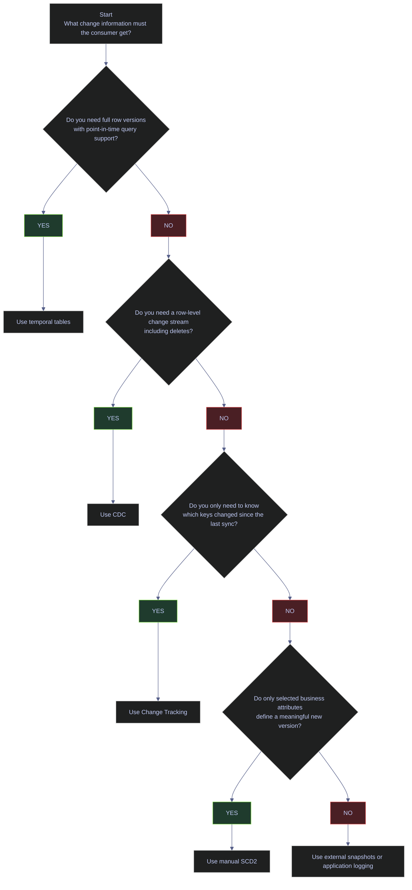

# SQL Server Change Tracking

Change tracking is the discipline of recording what changed, when it changed, and, depending on the method, whether you also need the before image, after image, or a point-in-time table view. In SQL Server, the right mechanism depends on the downstream question:

- Do you need a full business history of selected attributes
- Do you need engine-managed row history for audit or time-travel queries
- Do you need every insert, update, and delete event for downstream replication
- Do you only need to know which primary keys changed since the last sync

This note grounds those decisions in the live `stoxx` database. The current production state is simple: engine-managed features are not enabled, but `silver.index_dim` already follows a manual SCD2 pattern with `valid_from`, `valid_to`, `is_current`, and a filtered unique index.

---

## Live Feature State

Before choosing a change-capture design, inspect what the database already has enabled. Production mistakes often start when engineers assume CDC, Change Tracking, or temporal tables are already available and then build downstream logic on features that are actually off.

### SQL Server | change capture | current database surface

#### Inspect the current engine-managed change-capture state

**When to run:** before designing or enabling any change-capture mechanism on the database.
**Trigger:** first audit of a new database, or before proposing CDC, CT, or temporal tables in a design review.
**Context:** read-only T-SQL query against `sys.databases`, `sys.change_tracking_databases`, `sys.tables`, and `sys.change_tracking_tables`. No permissions beyond `VIEW DATABASE STATE` required.
**Purpose:** determine which engine-managed change-capture features are currently enabled so the team does not build on assumptions about features that are actually off.

| Field | Source | Type | Meaning |
|---|---|---|---|
| `database_name` | `sys.databases.name` | `sysname` | Logical name of the database being inspected. |
| `compatibility_level` | `sys.databases.compatibility_level` | `tinyint` | Controls which T-SQL syntax and optimizer behaviors are available (e.g., 160 = SQL Server 2022). |
| `is_cdc_enabled` | `sys.databases.is_cdc_enabled` | `bit` | `1` if CDC is enabled at the database level; `0` otherwise. |
| `is_change_tracking_enabled` | Derived via `EXISTS` on `sys.change_tracking_databases` | `bit` | `1` if Change Tracking is enabled for the database; `0` otherwise. |
| `snapshot_isolation_state_desc` | `sys.databases.snapshot_isolation_state_desc` | `nvarchar(60)` | Whether snapshot isolation is `ON` or `OFF`. Required for consistent multi-table CT sync windows. |
| `is_read_committed_snapshot_on` | `sys.databases.is_read_committed_snapshot_on` | `bit` | `1` if RCSI is enabled, reducing reader/writer blocking under default isolation. |
| `temporal_table_count` | `COUNT(*)` from `sys.tables` where `temporal_type_desc <> 'NON_TEMPORAL_TABLE'` | `int` | Number of system-versioned temporal tables currently defined. |
| `cdc_schema_present` | `CASE WHEN SCHEMA_ID('cdc') IS NULL THEN 0 ELSE 1 END` | `bit` | `1` if the `cdc` schema exists (created automatically when CDC is enabled). |
| `change_tracking_table_count` | `COUNT(*)` from `sys.change_tracking_tables` | `int` | Number of tables currently enrolled in Change Tracking. |

> [!info]- Clause-by-clause breakdown
>
> This query summarizes the current change-capture capabilities of the `stoxx` database.
>
> - `sys.databases` provides database-level settings such as `compatibility_level`, `is_cdc_enabled`, and row-versioning isolation settings.
> - `EXISTS (SELECT 1 FROM sys.change_tracking_databases ...)` converts Change Tracking enablement into a simple `0` or `1` flag.
> - `sys.tables WHERE temporal_type_desc <> 'NON_TEMPORAL_TABLE'` counts current temporal tables.
> - `SCHEMA_ID('cdc')` checks whether the CDC schema exists in the database.
> - `sys.change_tracking_tables` counts how many tables are currently enrolled in Change Tracking.
>
> *This query shows whether `stoxx` currently has CDC, Change Tracking, temporal tables, or row-versioning prerequisites enabled.*
>
```sql
SELECT d.name AS database_name,
       d.compatibility_level,
       d.is_cdc_enabled,
       CASE
           WHEN EXISTS (
               SELECT 1
               FROM sys.change_tracking_databases
               WHERE database_id = d.database_id
           ) THEN 1
           ELSE 0
       END AS is_change_tracking_enabled,
       d.snapshot_isolation_state_desc,
       d.is_read_committed_snapshot_on,
       (
           SELECT COUNT(*)
           FROM sys.tables
           WHERE temporal_type_desc <> 'NON_TEMPORAL_TABLE'
       ) AS temporal_table_count,
       CASE
           WHEN SCHEMA_ID('cdc') IS NULL THEN 0
           ELSE 1
       END AS cdc_schema_present,
       (
           SELECT COUNT(*)
           FROM sys.change_tracking_tables
       ) AS change_tracking_table_count
FROM sys.databases AS d
WHERE d.name = 'stoxx';
```

| database_name | compatibility_level | is_cdc_enabled | is_change_tracking_enabled | snapshot_isolation_state_desc | is_read_committed_snapshot_on | temporal_table_count | cdc_schema_present | change_tracking_table_count |
|---|---:|---:|---:|---|---:|---:|---:|---:|
| `stoxx` | 160 | 0 | 0 | `OFF` | 0 | 0 | 0 | 0 |

_`stoxx` is currently running with none of the engine-managed change-capture features enabled. That means any current history behavior comes from table design and ETL logic, not from CDC, Change Tracking, or temporal tables. It also means a CT-based sync design would first need database-level enablement and a row-versioning discussion before it is production-ready._

| Column | Current Value | Watch | Meaning | Implication |
|---|---|---|---|---|
| `compatibility_level` | `160` | &#9989; | SQL Server 2022 query surface is available. | Modern syntax and optimizer features are available if the design needs them. |
| `is_cdc_enabled` | `0` | &#10060; | CDC is not enabled at the database level. | No CDC schema, no change tables, and no `fn_cdc_get_*` functions are available. |
| `is_change_tracking_enabled` | `0` | &#10060; | Change Tracking is off for the database. | `CHANGETABLE(CHANGES ...)` cannot be used against application tables yet. |
| `snapshot_isolation_state_desc` | `OFF` | Context-dependent | Snapshot isolation is not enabled. | CT can still work, but consistent multi-table sync windows become harder. |
| `is_read_committed_snapshot_on` | `0` | Context-dependent | RCSI is off. | Readers still use lock-based read committed semantics by default. |
| `temporal_table_count` | `0` | Context-dependent | No temporal tables currently exist. | Any time-travel requirement would need a new temporal design or a manual SCD pattern. |
| `cdc_schema_present` | `0` | &#10060; | No `cdc` schema exists. | CDC metadata tables and change tables have not been created. |
| `change_tracking_table_count` | `0` | Context-dependent | No tables currently participate in CT. | Even if CT were enabled later, table enrollment would still be required. |

The following reference table covers all possible values for each column so the reader can interpret future re-runs of this query after enabling features.

| Column | Possible Values | Watch | Meaning | Implication |
|---|---|---|---|---|
| `is_cdc_enabled` | `0` / `1` | &#10060; / &#9989; | `0` = CDC disabled; `1` = CDC enabled at the database level. | When `1`, individual source tables can be enrolled for CDC. |
| `is_change_tracking_enabled` | `0` / `1` | &#10060; / &#9989; | `0` = CT disabled; `1` = CT enabled at the database level. | When `1`, individual tables can participate in key-level sync tracking. |
| `snapshot_isolation_state_desc` | `OFF` / `ON` | Context-dependent / &#9989; | `OFF` = snapshot isolation not available; `ON` = enabled. | `ON` is safer for CT consumers that need a transactionally consistent sync view. |
| `is_read_committed_snapshot_on` | `0` / `1` | Context-dependent / &#9989; | `0` = RCSI off (lock-based reads); `1` = RCSI on (row-versioned reads). | `1` reduces reader/writer blocking for many operational queries. |
| `temporal_table_count` | `0` / `> 0` | Context-dependent / &#9989; | `0` = no temporal tables; `> 0` = system-versioned tables exist. | When `> 0`, temporal maintenance and retention policy become operational concerns. |
| `cdc_schema_present` | `0` / `1` | &#10060; / &#9989; | `0` = no `cdc` schema; `1` = CDC metadata schema exists. | When `1`, verify whether tracked tables and cleanup jobs are also configured. |
| `change_tracking_table_count` | `0` / `> 0` | Context-dependent / &#9989; | `0` = no tables enrolled; `> 0` = tables tracked. | When `> 0`, consumers can begin using `CHANGETABLE` patterns. |

### SQL Server | SCD2 | current manual implementation in `silver.index_dim`

The current `stoxx` warehouse already uses the classic SCD2 columns on `silver.index_dim`, which makes this table the most important live example in the note.

#### Measure the live SCD2 state of `silver.index_dim`

**When to run:** when validating whether the SCD2 pattern on a dimension table is actively producing history or is still in initial-load state.
**Trigger:** first audit of the dimension, or after an ETL pipeline run that should have closed and reopened versions.
**Context:** read-only T-SQL query against `silver.index_dim`. No special permissions required.
**Purpose:** determine whether the pipeline has exercised a real version rollover or the table is still a current-state-only dimension.

| Field | Source | Type | Meaning |
|---|---|---|---|
| `total_rows` | `COUNT(*)` | `int` | Total number of dimension rows (current + historical). |
| `current_rows` | `SUM(CASE WHEN is_current = 1 ...)` | `int` | Rows with `is_current = 1` — the active business version. |
| `historical_rows` | `SUM(CASE WHEN is_current = 0 ...)` | `int` | Rows with `is_current = 0` — closed historical versions. |
| `min_valid_from` | `MIN(valid_from)` | `datetime2(7)` | Earliest version-load timestamp in the table. |
| `max_valid_from` | `MAX(valid_from)` | `datetime2(7)` | Latest version-load timestamp — shows the most recent dimension batch. |
| `open_ended_rows` | `SUM(CASE WHEN valid_to IS NULL ...)` | `int` | Rows with `valid_to = NULL` — still-open versions. |

> [!info]- Clause-by-clause breakdown
>
> This query measures how the existing dimension table is currently using its SCD2 columns.
>
> - `COUNT(*)` returns total dimension rows.
> - `SUM(CASE WHEN is_current = 1 THEN 1 ELSE 0 END)` counts active versions.
> - `SUM(CASE WHEN is_current = 0 THEN 1 ELSE 0 END)` counts closed historical versions.
> - `MIN(valid_from)` and `MAX(valid_from)` show the version-load time range currently stored.
> - `SUM(CASE WHEN valid_to IS NULL THEN 1 ELSE 0 END)` counts still-open rows.
>
> *This query measures whether `silver.index_dim` is currently using its SCD2 columns as a real history table or only as a current-state dimension with SCD2-compatible structure.*
>
```sql
SELECT total_rows = COUNT(*),
       current_rows = SUM(CASE WHEN is_current = 1 THEN 1 ELSE 0 END),
       historical_rows = SUM(CASE WHEN is_current = 0 THEN 1 ELSE 0 END),
       min_valid_from = MIN(valid_from),
       max_valid_from = MAX(valid_from),
       open_ended_rows = SUM(CASE WHEN valid_to IS NULL THEN 1 ELSE 0 END)
FROM silver.index_dim;
```

| total_rows | current_rows | historical_rows | min_valid_from | max_valid_from | open_ended_rows |
|---:|---:|---:|---|---|---:|
| 169 | 169 | 0 | 2026-03-04 22:11:36.1898627 | 2026-03-12 12:09:52.8799122 | 169 |

_`silver.index_dim` is structurally an SCD2 table, but operationally it is still a current-state dimension: every row is current, every row is open-ended, and no closed history rows exist yet. That is a valid starting point, but it means the pipeline has not yet exercised a real version rollover in this table._

#### Preview the newest live dimension rows

**When to run:** after the SCD2 state query confirms the table has rows, to inspect the actual content and version boundaries.
**Trigger:** dimension audit, or verifying that a recent ETL load batch landed correctly.
**Context:** read-only T-SQL query against `silver.index_dim`. No special permissions required.
**Purpose:** confirm the shape and content of the latest dimension load batch, including the SCD2 control columns.

> [!info]- Clause-by-clause breakdown
>
> This query previews the newest `silver.index_dim` versions by sorting on `valid_from` descending.
>
> - `_index`, `symbol`, and `sector` show the business identity of each dimension row.
> - `valid_from`, `valid_to`, and `is_current` are the three core SCD2 control columns.
> - Ordering by `valid_from DESC, symbol` surfaces the latest dimension load batch first.
>
> *This query previews the newest live dimension rows in `silver.index_dim` and shows how the current table stores active versions.*
>
```sql
SELECT TOP (8)
       _index,
       symbol,
       sector,
       valid_from,
       valid_to,
       is_current
FROM silver.index_dim
ORDER BY valid_from DESC, symbol;
```

| _index | symbol | sector | valid_from | valid_to | is_current |
|---|---|---|---|---|---:|
| `oil_20` | `MPC` | `Energy` | 2026-03-12 12:09:52.8799122 | `NULL` | 1 |
| `oil_20` | `PSX` | `Energy` | 2026-03-12 12:09:52.8799122 | `NULL` | 1 |
| `oil_20` | `ENB` | `Energy` | 2026-03-12 12:09:52.8757472 | `NULL` | 1 |
| `oil_20` | `VLO` | `Energy` | 2026-03-12 12:09:52.8757472 | `NULL` | 1 |
| `oil_20` | `BKR` | `Energy` | 2026-03-12 12:09:52.8715853 | `NULL` | 1 |
| `oil_20` | `KMI` | `Energy` | 2026-03-12 12:09:52.8715853 | `NULL` | 1 |
| `oil_20` | `WMB` | `Energy` | 2026-03-12 12:09:52.8715853 | `NULL` | 1 |
| `oil_20` | `HAL` | `Energy` | 2026-03-12 12:09:52.8674178 | `NULL` | 1 |

_These rows confirm the table is currently storing only active versions. The `valid_from` timestamps are still useful because they show when the latest dimension batch entered the warehouse, but `valid_to = NULL` and `is_current = 1` across the sample mean the table has not yet closed any business history rows._

#### Inspect the filtered unique index that enforces one active row per key

**When to run:** when verifying that an SCD2 table has the critical uniqueness constraint on active rows.
**Trigger:** new SCD2 table design review, or troubleshooting duplicate-current-row bugs.
**Context:** read-only T-SQL query against `sys.indexes`. Requires `VIEW DEFINITION` or ownership on the table.
**Purpose:** confirm that a filtered unique index exists on the active-row predicate (`is_current = 1`), preventing two simultaneous current versions for the same business key.

| Field | Source | Type | Meaning |
|---|---|---|---|
| `schema_name` | `OBJECT_SCHEMA_NAME(i.object_id)` | `sysname` | Schema that owns the table. |
| `table_name` | `OBJECT_NAME(i.object_id)` | `sysname` | Table name. |
| `index_name` | `sys.indexes.name` | `sysname` | Index name — system-generated names start with `PK__` or `UQ__`. |
| `is_unique` | `sys.indexes.is_unique` | `bit` | `1` if duplicate key values are blocked within the index scope. |
| `filter_definition` | `sys.indexes.filter_definition` | `nvarchar(max)` | SQL predicate that limits the index to a subset of rows; `NULL` if unfiltered. |

> [!info]- Clause-by-clause breakdown
>
> This query inspects the indexes on `silver.index_dim`, focusing on whether the table has a filtered unique index for current rows.
>
> - `sys.indexes` exposes index metadata.
> - `is_unique` confirms whether duplicate keys are blocked.
> - `filter_definition` shows whether the uniqueness rule applies only to active rows, which is the critical SCD2 pattern.
>
> *This query verifies that `silver.index_dim` enforces one active version per business key with a filtered unique index.*
>
```sql
SELECT OBJECT_SCHEMA_NAME(i.object_id) AS schema_name,
       OBJECT_NAME(i.object_id) AS table_name,
       i.name AS index_name,
       i.is_unique,
       i.filter_definition
FROM sys.indexes AS i
WHERE i.object_id = OBJECT_ID('silver.index_dim')
ORDER BY i.index_id;
```

| schema_name | table_name | index_name | is_unique | filter_definition |
|---|---|---|---:|---|
| `silver` | `index_dim` | `PK__index_di__3213E83F590AA69E` | 1 | `NULL` |
| `silver` | `index_dim` | `UX_silver_index_dim_current` | 1 | `([is_current]=(1))` |

_The second row is the key SCD2 safeguard. `UX_silver_index_dim_current` allows many historical versions over time, but it blocks a second simultaneous active row for the same business key because the uniqueness rule applies only where `is_current = 1`._

| Column | Value | Watch | Meaning | Implication |
|---|---|---|---|---|
| `is_unique` | `1` | &#9989; | Duplicate key values are blocked within the index scope. | Required for protecting one-current-row rules. |
| `is_unique` | `0` | &#10060; | Duplicate key values are allowed. | SCD2 bugs can create multiple simultaneous active rows. |
| `filter_definition` | `([is_current]=(1))` | &#9989; | Uniqueness applies only to active rows. | This is the standard SQL Server SCD2 protection pattern. |
| `filter_definition` | `NULL` on the business-key index | &#10060; | Uniqueness would apply to all versions or not at all. | Either history inserts fail or duplicate active rows become possible. |

---

## Decision Matrix

The practical difference between the available methods is not just "history or no history". It is the payload, the latency, and the operational owner of the logic.

### SQL Server | change tracking | choose the method by downstream question

Use the lightest mechanism that still answers the real downstream requirement.

| Method | Captures | History Depth | Typical Latency | Operational Owner | Best Fit |
|---|---|---|---|---|---|
| Manual SCD2 | Selected business attributes | Full for the tracked attributes | Batch-oriented | Data engineering | Dimensional history where you choose what counts as a change |
| Temporal tables | Full row versions | Full row history | Immediate on DML | SQL Server engine | Audit, point-in-time queries, row reconstruction |
| CDC | Inserts, updates, deletes plus metadata | Full row-level change stream | Near real time to batch | DBA + data engineering | Replication, streaming, downstream event consumers |
| Change Tracking | Primary keys and operation metadata | No before image, no full row history | Sync-oriented | DBA + application/data engineering | Lightweight pull-based sync |
| `rowversion` token | Monotonic row stamp on insert or update | No row history and no delete payload | Pull-based / batch | Application or data engineering | Mutable tables where you only need a change token and can reread the current row |
| dbt snapshots | Selected columns via snapshot strategy | Full for tracked snapshot rows | Batch-oriented | Analytics engineering | Declarative warehouse history outside source SQL Server |
| Application-level logging | Whatever the app emits | Custom | App-dependent | Application team | When database-level capture is unavailable or undesirable |

### SQL Server | change tracking | method-selection decision path



---

## Rowversion As A Change Token

`rowversion` is SQL Server's lightest built-in change token. It is not a timestamp and it is not a history feature. It is an 8-byte database-scoped incrementing binary value that changes whenever a row containing a `rowversion` column is inserted or updated. That makes it useful for incremental readers that only need "changed since token X" behavior and can reread the current row image from the base table.

### SQL Server | rowversion | use only when token-based change detection is enough

`rowversion` is a fit when:

- the source mutates rows in place and a date watermark is unreliable
- the consumer can reread the current row from the base table
- deletes are handled separately
- the team wants a lighter mechanism than CT or CDC

It is the wrong fit when:

- the pipeline needs delete detection from the token itself
- the consumer needs before images or ordered change events
- the token will be interpreted as business time
- the column is treated as a durable key

#### Inspect whether the current database already exposes any `rowversion` columns

**When to run:** when auditing whether any tables in the database already use `rowversion` as a change token.
**Trigger:** initial change-capture audit, or before proposing `rowversion` for a new table contract.
**Context:** read-only T-SQL query against `sys.columns`. No special permissions beyond `VIEW DEFINITION` required.
**Purpose:** determine whether any tables already carry a `rowversion` column, which would indicate an existing delta-scan pattern.

| Field | Source | Type | Meaning |
|---|---|---|---|
| `rowversion_column_count` | `COUNT(*)` from `sys.columns` where `system_type_id = 189` | `int` | Total number of `rowversion` columns across all tables in the database. |
| `tables_with_rowversion` | `COUNT(DISTINCT object_id)` from same filter | `int` | Number of distinct tables that carry at least one `rowversion` column. |

> [!info]- Clause-by-clause breakdown
>
> This query measures how many `rowversion` columns currently exist in `stoxx`.
>
> - SQL Server stores `rowversion` columns with `system_type_id = 189`.
> - `COUNT(*)` returns the number of rowversion columns across the database.
> - `COUNT(DISTINCT object_id)` shows how many tables currently use that mechanism.
> - An empty result set would be awkward to read in a note, so the query returns aggregate counts instead of raw rows.
>
> *This query checks whether `stoxx` currently uses `rowversion` anywhere as a change token.*
>
```sql
SELECT COUNT(*) AS rowversion_column_count,
       COUNT(DISTINCT object_id) AS tables_with_rowversion
FROM sys.columns
WHERE system_type_id = 189;
```

| rowversion_column_count | tables_with_rowversion |
|---:|---:|
| 0 | 0 |

_`stoxx` does not currently use `rowversion` in any table, which is consistent with the broader live state of this note: the warehouse is relying on explicit ETL design rather than engine-managed change tokens. If a mutable source table later needs a lightweight delta token, `rowversion` would need to be introduced deliberately as part of that table contract._

#### Demonstrate how a `rowversion` token changes after one update

**When to run:** when evaluating whether `rowversion` is suitable as a delta token for a specific table.
**Trigger:** design review for a new incremental-load pattern, or when explaining rowversion behavior to the team.
**Context:** state-changing T-SQL batch that creates and drops a disposable `dbo.demo_rowversion_delta` table. Requires `CREATE TABLE` permission in `dbo`.
**Purpose:** show that `rowversion` tokens change automatically on update and demonstrate the before-vs-after comparison pattern that a consumer would use.

> [!warning] `rowversion` is not business time and does not capture deletes
>
> Any insert or update to a row with a `rowversion` column changes the token, even if the business change is minor. Deletes do not emit a rowversion, and Microsoft documentation explicitly warns that `rowversion` is a poor key candidate because updates change the value.

> [!success] Use `rowversion` only as a technical delta token
>
> Persist the last consumed token, reread the current row image from the base table, and keep deletes on a separate path such as soft-delete flags, CT, CDC, or scoped replacement logic.

> [!info]- Clause-by-clause breakdown
>
> This batch creates a disposable rowversion table, captures a snapshot of the tokens, updates one row, and returns the before-and-after comparison.
>
> - `rv rowversion NOT NULL` asks SQL Server to maintain the token automatically.
> - The table variable `@before` stores the initial tokens so the final query can show both the previous and current values.
> - `master.dbo.fn_varbintohexstr(...)` renders the binary token in a readable hexadecimal format.
> - `rowversion_status` is derived by comparing the current token to the earlier snapshot.
>
> *This batch shows how a `rowversion` token changes automatically after one row update and how a consumer can compare the current token to an earlier snapshot.*
>
```sql
IF OBJECT_ID('dbo.demo_rowversion_delta', 'U') IS NOT NULL
    DROP TABLE dbo.demo_rowversion_delta;

CREATE TABLE dbo.demo_rowversion_delta
(
    id int NOT NULL PRIMARY KEY,
    business_key varchar(20) NOT NULL,
    payload nvarchar(50) NOT NULL,
    rv rowversion NOT NULL
);

INSERT INTO dbo.demo_rowversion_delta(id, business_key, payload)
VALUES (1, 'ABI.BR', N'baseline'),
       (2, 'ASML.AS', N'before-change');

DECLARE @before TABLE
(
    id int PRIMARY KEY,
    rv_before varbinary(8) NOT NULL
);

INSERT INTO @before(id, rv_before)
SELECT id, rv
FROM dbo.demo_rowversion_delta;

UPDATE dbo.demo_rowversion_delta
SET payload = N'after-change'
WHERE id = 2;

SELECT t.id,
       t.business_key,
       t.payload,
       master.dbo.fn_varbintohexstr(b.rv_before) AS rv_before,
       master.dbo.fn_varbintohexstr(CAST(t.rv AS varbinary(8))) AS rv_after,
       CASE
           WHEN CAST(t.rv AS varbinary(8)) > b.rv_before THEN 'CHANGED SINCE SNAPSHOT'
           ELSE 'UNCHANGED'
       END AS rowversion_status
FROM dbo.demo_rowversion_delta AS t
JOIN @before AS b
    ON b.id = t.id
ORDER BY t.id;

DROP TABLE dbo.demo_rowversion_delta;
```

| id | business_key | payload | rv_before | rv_after | rowversion_status |
|---:|---|---|---|---|---|
| 1 | `ABI.BR` | `baseline` | `0x000000000003f245` | `0x000000000003f245` | `UNCHANGED` |
| 2 | `ASML.AS` | `after-change` | `0x000000000003f246` | `0x000000000003f248` | `CHANGED SINCE SNAPSHOT` |

_This is the exact operational meaning of a rowversion token. The unchanged row keeps the same token, while the updated row receives a newer value without the caller having to assign anything manually. The gap between `0x...246` and `0x...248` also shows why the token should be treated as a monotonic version stamp, not as a row counter or a wall-clock timestamp._

### SQL Server | change capture | compare `rowversion`, Change Tracking, and CDC

| Mechanism | What the consumer gets | What it does not give you | Best use |
|---|---|---|---|
| `rowversion` | One technical change token per inserted or updated row | No deletes, no before image, no built-in change table | Lightweight source-owned delta scans |
| Change Tracking | Changed keys plus operation metadata | No full before image, no persistent history stream | Pull-based synchronization that can reread current rows |
| CDC | Ordered change rows with insert, update, and delete semantics | No business interpretation by itself and more operational overhead | Replication, event-style downstream ingestion, replay consumers |

The practical rule is simple:

- choose `rowversion` when the token itself is enough and deletes are handled elsewhere
- choose CT when the consumer needs changed keys plus operation codes
- choose CDC when downstream systems need a true row-change stream

---

## Manual SCD Type 2

Manual SCD2 is the right tool when the business does not want every column change recorded automatically. It lets the pipeline decide which attributes matter enough to create a new version.

### SQL Server | SCD2 | use manual SCD2 for business-defined history

Manual SCD2 is especially strong when:

- only a subset of attributes should trigger a new version
- the source system does not expose engine-managed change history
- the warehouse already owns the conformed dimension logic
- analysts want a durable "current row plus history" dimension pattern

#### Demonstrate a real SCD2 version rollover on a disposable table

**When to run:** when building or validating a manual SCD2 pattern on a new dimension table.
**Trigger:** new dimension design, or when demonstrating the close-and-insert rollover sequence to the team.
**Context:** state-changing T-SQL batch that creates and drops a disposable `dbo.demo_scd2_company` table. Requires `SET ANSI_NULLS ON` and `SET QUOTED_IDENTIFIER ON` for filtered-index creation.
**Purpose:** demonstrate a complete version rollover — closing the old row and inserting the new current row — and verify the filtered unique index prevents duplicate active rows.

> [!warning] Filtered unique index requires correct session `SET` options
>
> The filtered unique index in this pattern depends on session `SET` options such as `QUOTED_IDENTIFIER ON` and `ANSI_NULLS ON`. If those settings are wrong at create time, SQL Server rejects the index creation. The same pattern also fails logically if the close step and insert step are not executed as one atomic change unit.

> [!success] Treat close-plus-insert as a single transactional version change
>
> Create the filtered unique index with the required `SET` options enabled, and treat the close-plus-insert sequence as a single transactional version change. That keeps the table from ever exposing two current rows for the same business key.

> [!info]- Clause-by-clause breakdown
>
> This batch creates a disposable SCD2 demo table, inserts one current row, closes it at a chosen change timestamp, inserts the new current version, returns the final history, and then drops the table.
>
> - `valid_from`, `valid_to`, and `is_current` are the core SCD2 control columns.
> - The filtered unique index `WHERE is_current = 1` enforces one active version per symbol.
> - The update step closes the old row by setting `valid_to` and `is_current = 0`.
> - The insert step creates the new current row with the same change timestamp as its `valid_from`.
>
> *This batch demonstrates a complete manual SCD2 rollover on a disposable table and returns the final history chain.*
>
```sql
SET ANSI_NULLS ON;
SET QUOTED_IDENTIFIER ON;

IF OBJECT_ID('dbo.demo_scd2_company', 'U') IS NOT NULL
    DROP TABLE dbo.demo_scd2_company;

CREATE TABLE dbo.demo_scd2_company
(
    id int IDENTITY(1,1) PRIMARY KEY,
    symbol varchar(20) NOT NULL,
    sector nvarchar(100) NULL,
    valid_from datetime2(7) NOT NULL,
    valid_to datetime2(7) NULL,
    is_current bit NOT NULL
);

CREATE UNIQUE INDEX UX_demo_scd2_company_current
    ON dbo.demo_scd2_company(symbol)
    WHERE is_current = 1;

INSERT INTO dbo.demo_scd2_company(symbol, sector, valid_from, valid_to, is_current)
VALUES ('ASML.AS', 'Technology Hardware', '2026-03-01T00:00:00', NULL, 1);

DECLARE @change_time datetime2(7) = '2026-04-08T09:15:00';

UPDATE dbo.demo_scd2_company
SET valid_to = @change_time,
    is_current = 0
WHERE symbol = 'ASML.AS'
  AND is_current = 1;

INSERT INTO dbo.demo_scd2_company(symbol, sector, valid_from, valid_to, is_current)
VALUES ('ASML.AS', 'Semiconductors', @change_time, NULL, 1);

SELECT symbol, sector, valid_from, valid_to, is_current
FROM dbo.demo_scd2_company
ORDER BY valid_from;

DROP TABLE dbo.demo_scd2_company;
```

| symbol | sector | valid_from | valid_to | is_current |
|---|---|---|---|---:|
| `ASML.AS` | `Technology Hardware` | 2026-03-01 00:00:00.0000000 | 2026-04-08 09:15:00.0000000 | 0 |
| `ASML.AS` | `Semiconductors` | 2026-04-08 09:15:00.0000000 | `NULL` | 1 |

_This is the canonical SCD2 outcome. The old version is closed, the new version is current, and the timestamps form a contiguous history boundary with no overlap. In production, that same logic must run for every tracked business key that changes._

### SQL Server | SCD2 | production rules

The durable rules are:

- use `DATETIME2`, not `DATE`, for version boundaries — `DATE` loses sub-day precision and makes intra-day version chains impossible
- compare nullable attributes safely — use `ISNULL(old, sentinel) <> ISNULL(new, sentinel)` or the `IS DISTINCT FROM` pattern (SQL Server 2022+) to avoid silent false-negatives from three-valued `NULL` logic
- never compare floating-point business attributes with raw equality — use `ABS(old - new) > threshold` or cast to `DECIMAL` before comparison
- protect the table with a filtered unique index on the active-row predicate (`WHERE is_current = 1`) — without this constraint, duplicate active rows for the same business key can accumulate silently
- keep the close and insert steps in one transaction or stored-procedure unit — if the close succeeds but the insert fails, the business key has no active row
- segregate `UPDATE` and `INSERT` paths in ETL for maximum throughput — combined `UPDATE ... ELSE INSERT` (upsert) patterns are a known performance bottleneck in high-volume dimension loads
- if Type 1 (overwrite) and Type 2 (versioned) columns coexist in the same dimension, Type 1 overwrites must propagate through **all** historical rows for that natural key, not just the current row — failure to do this silently corrupts history-preserving downstream aggregates

> [!tip] Kimball's canonical SCD2 housekeeping columns
>
> The *Data Warehouse Toolkit* recommends five housekeeping columns per SCD2 row: **Change Date** (FK to the date dimension), **Row Effective DateTime**, **Row End DateTime**, **Reason for Change**, and **Current Row Flag**. Not all warehouses need all five, but `valid_from`, `valid_to`, and `is_current` are the non-negotiable minimum. `Reason for Change` is useful for audit-sensitive dimensions.

> [!warning] Timestamp-based change detection has a blind spot
>
> Back-end scripts, bulk operations, or direct SQL updates that bypass the source system's `last_modified_date` column make those changes invisible to timestamp-based SCD2 detection. The dimension will believe the row is unchanged when it is not.

> [!success] Use system-generated timestamps or hash-based comparison
>
> Prefer system/as-of timestamps (`GETUTCDATE()`, `SYSUTCDATETIME()`) set at the database or ETL layer rather than relying on source `updated_at`. Alternatively, compute a hash of the tracked columns (`HASHBYTES('SHA2_256', CONCAT(...))`) and compare hashes to detect changes regardless of timestamp reliability.

---

## Temporal Tables

Temporal tables are SQL Server's engine-managed row-history mechanism. When they are enabled, SQL Server copies old row versions to a history table automatically and exposes them through `FOR SYSTEM_TIME`.

### SQL Server | temporal tables | use when you need full row history

Temporal tables are strongest when:

- you need point-in-time reconstruction of the full row
- you want the engine to manage version writes automatically
- the table is an audit target rather than a heavily customized dimensional object
- schema restrictions and history-table growth are acceptable operational costs

#### Demonstrate `FOR SYSTEM_TIME ALL` on a disposable temporal table

**When to run:** when evaluating temporal tables as a history mechanism or demonstrating `FOR SYSTEM_TIME` queries.
**Trigger:** design review for row-level auditability, or team training on temporal-table behavior.
**Context:** state-changing T-SQL batch that creates and drops `dbo.demo_temporal_security` with `SYSTEM_VERSIONING = ON`. Requires `CREATE TABLE` in `dbo`.
**Purpose:** show that SQL Server automatically moves old row versions to the history table on update, and that `FOR SYSTEM_TIME ALL` returns the combined current-plus-history view.

> [!warning] Temporal tables are not free history
>
> They add write overhead, grow a history table, complicate schema changes, and block `TRUNCATE` while system versioning is on. They are the wrong default for hot staging tables and the wrong fit when only selected business attributes should trigger new versions.

> [!success] Pair temporal tables with retention policy and schema-change procedure
>
> Use temporal tables when the requirement is full-row auditability or point-in-time reconstruction, and pair them with an explicit history retention policy and a documented schema-change procedure.

> [!info]- Clause-by-clause breakdown
>
> This batch creates a disposable temporal table, inserts one row, updates it after a delay so the period columns diverge, queries the full history with `FOR SYSTEM_TIME ALL`, and then removes the demo objects.
>
> - The `PERIOD FOR SYSTEM_TIME` clause defines the row-start and row-end columns.
> - `SYSTEM_VERSIONING = ON` tells SQL Server to manage the history table automatically.
> - `WAITFOR DELAY` is only there to create clearly different timestamps in the demo output.
> - `FOR SYSTEM_TIME ALL` returns both the historical version and the current version.
>
> *This batch demonstrates a real temporal-table update and returns the combined current-plus-history view through `FOR SYSTEM_TIME ALL`.*
>
```sql
IF OBJECT_ID('dbo.demo_temporal_security_history', 'U') IS NOT NULL
    DROP TABLE dbo.demo_temporal_security_history;

IF OBJECT_ID('dbo.demo_temporal_security', 'U') IS NOT NULL
BEGIN
    ALTER TABLE dbo.demo_temporal_security
        SET (SYSTEM_VERSIONING = OFF);
    DROP TABLE dbo.demo_temporal_security;
END;

CREATE TABLE dbo.demo_temporal_security
(
    symbol varchar(20) NOT NULL PRIMARY KEY,
    sector nvarchar(100) NOT NULL,
    valid_from datetime2(7) GENERATED ALWAYS AS ROW START HIDDEN NOT NULL,
    valid_to datetime2(7) GENERATED ALWAYS AS ROW END HIDDEN NOT NULL,
    PERIOD FOR SYSTEM_TIME (valid_from, valid_to)
)
WITH (SYSTEM_VERSIONING = ON (HISTORY_TABLE = dbo.demo_temporal_security_history));

INSERT INTO dbo.demo_temporal_security(symbol, sector)
VALUES ('ASML.AS', 'Technology Hardware');

WAITFOR DELAY '00:00:01';

UPDATE dbo.demo_temporal_security
SET sector = 'Semiconductors'
WHERE symbol = 'ASML.AS';

SELECT symbol, sector, valid_from, valid_to
FROM dbo.demo_temporal_security
FOR SYSTEM_TIME ALL
ORDER BY valid_from;

ALTER TABLE dbo.demo_temporal_security
    SET (SYSTEM_VERSIONING = OFF);

DROP TABLE dbo.demo_temporal_security_history;
DROP TABLE dbo.demo_temporal_security;
```

| symbol | sector | valid_from | valid_to |
|---|---|---|---|
| `ASML.AS` | `Technology Hardware` | 2026-04-08 15:45:20.9635196 | 2026-04-08 15:45:21.9778525 |
| `ASML.AS` | `Semiconductors` | 2026-04-08 15:45:21.9778525 | 9999-12-31 23:59:59.9999999 |

_The output shows the core temporal-table contract: the old version becomes history automatically, the current row receives the open-ended `9999-12-31` end marker, and the engine preserves the full row image without any manual close-and-insert logic._

### SQL Server | temporal tables | production boundaries and limitations

The operational caveats from Microsoft documentation span schema constraints, history growth, and feature incompatibilities.

**Schema and structure constraints:**

- a primary key is required on the current table; the history table cannot have a primary key
- period columns must be `datetime2`; precision must align between current and history tables
- hidden period columns do not appear in `SELECT *` — the reader must name them explicitly
- `INSTEAD OF` triggers are not permitted; only `AFTER` triggers on the current table
- indexed views are not supported on `FOR SYSTEM_TIME` queries
- node/edge graph tables cannot be temporal
- `FILESTREAM` and `FileTable` are incompatible with temporal tables

**Operational restrictions while `SYSTEM_VERSIONING = ON`:**

- `TRUNCATE TABLE` is blocked
- `ALTER COLUMN` with `ONLINE = ON` has no effect — always performed offline
- schema changes often require a controlled `SYSTEM_VERSIONING = OFF` / `ON` migration sequence
- to delete or truncate history, or to partition-switch out from the current table, system versioning must be turned off first

**History growth and storage:**

- history tables grow unless retention is designed explicitly
- history table uses `PAGE` compression by default; if the current table is partitioned, the history table lands on the **default filegroup** — partitioning is not auto-replicated
- every column change generates a new history row, including ETL-irrelevant changes; suppress irrelevant updates at the pipeline level if version proliferation is a concern

**Replication and high availability:**

- CDC and CT are supported on the current table only, not the history table
- Always On Availability Groups fully supported
- temporal querying over linked servers is not supported

**SCD usage caveat:** temporal tables use transaction time (database commit time) for period validity, not business/application time. If data is loaded with significant delay, transaction time may not reflect true business validity — a noted limitation for SCD use cases where business-time accuracy matters.

#### Design retention and cleanup before the history table becomes the next incident

Temporal history is easy to enable and easy to ignore until it becomes large. Microsoft documentation describes three main retention patterns, and they solve different operational problems.

| Retention strategy | Best Fit | What to watch |
|---|---|---|
| Built-in retention policy | Moderate history windows with predictable automatic cleanup | Validate edition/version support and monitor whether cleanup keeps pace with write volume |
| Custom cleanup with `sys.sp_cleanup_temporal_history` | Targeted, explicit cleanup windows | It is an immediate cleanup action, not a gentle background retention policy |
| Partitioned history with a sliding window | Very large temporal history tables | Requires partition design discipline and ongoing partition maintenance |

Production recommendations:

- use built-in retention when the history window is clear and bounded
- use `sys.sp_cleanup_temporal_history` only as an explicit operational cleanup tool, not as a substitute for retention design
- use partitioned sliding-window retention when temporal history is large enough that delete-based cleanup is no longer the right maintenance shape
- monitor history growth as a separate operational metric; temporal tables are not self-governing archival systems

---

## Change Data Capture

CDC is SQL Server's log-based row-change capture feature. It is built for consumers that need a stream of inserts, updates, and deletes with enough metadata to replay those changes into another system.

### SQL Server | CDC | use when downstream consumers need change events

CDC is the right fit when:

- deletes must be captured explicitly
- downstream systems need ordered change events
- a sync or replication process consumes the database incrementally
- the source team accepts the operational overhead of CDC jobs, retention, and cleanup

#### Enable CDC at the database and table level

**When to run:** when a downstream consumer requires row-level change events (inserts, updates, deletes) from a source table.
**Trigger:** architecture decision to replicate data changes to a secondary system, streaming pipeline, or audit trail.
**Context:** state-changing T-SQL using `sys.sp_cdc_enable_db` and `sys.sp_cdc_enable_table`. Requires `db_owner` membership. Creates CDC metadata objects, a capture job, and a cleanup job via SQL Server Agent. First enablement on the database auto-creates both jobs.
**Purpose:** enable CDC at the database level and enroll one source table with net-change support.

| Parameter | Type | Meaning |
|---|---|---|
| `@source_schema` | `sysname` | Schema of the source table to track. |
| `@source_name` | `sysname` | Name of the source table. |
| `@role_name` | `sysname` | Gating role for CDC data access. Set to `NULL` to disable role-based gating. |
| `@supports_net_changes` | `bit` | `1` generates `cdc.fn_cdc_get_net_changes_*` (requires PK or unique index); creates an additional nonclustered index on the change table. |
| `@captured_column_list` | `nvarchar(max)` | Optional. Comma-separated subset of columns to capture. Omit to capture all columns. Cannot include reserved CDC metadata columns (`__$start_lsn`, `__$operation`, etc.). |
| `@filegroup_name` | `sysname` | Optional but recommended. Places the change table in a separate filegroup from the source table to isolate I/O. |

> [!warning] CDC changes the operational surface of the database
>
> It reads the transaction log, creates CDC metadata objects and change tables, and relies on retention cleanup. It should not be enabled casually on a production source without validating Agent availability, retention needs, and downstream consumption design.

> [!success] Enable CDC deliberately and monitor cleanup
>
> Enable CDC only for tables that truly need row-level change events, document the capture instance name, and monitor cleanup so change tables do not grow without bound. Default retention is **4320 minutes (72 hours)**, configurable via `sys.sp_cdc_change_job @retention`. Default delete threshold per cleanup cycle is **5000 entries**.

> [!info]- Clause-by-clause breakdown
>
> This demo enables CDC on `stoxx`, creates a disposable table, enrolls it for CDC with net-change support, makes one update, one insert, and one delete, then reads the captured changes through the generated table-valued functions.
>
> - `sys.sp_cdc_enable_db` enables CDC for the database.
> - `sys.sp_cdc_enable_table` enrolls one source table and creates its capture instance.
> - `@supports_net_changes = 1` asks SQL Server to expose net-change enumeration in addition to all-changes enumeration.
> - In Docker (no SQL Server Agent), `sys.sp_cdc_scan` manually triggers the capture scan that normally runs as a background Agent job.
>
> *This batch enables CDC, creates a demo table, enrolls it, and makes changes for capture.*
>
```sql
EXEC sys.sp_cdc_enable_db;
GO

CREATE TABLE dbo.demo_cdc_instrument
(
    id int NOT NULL PRIMARY KEY,
    symbol varchar(20) NOT NULL,
    sector nvarchar(100) NOT NULL
);

INSERT INTO dbo.demo_cdc_instrument(id, symbol, sector)
VALUES (1, 'ASML.AS', N'Technology Hardware'),
       (2, 'TTE.PA', N'Energy');

EXEC sys.sp_cdc_enable_table
    @source_schema = N'dbo',
    @source_name = N'demo_cdc_instrument',
    @role_name = NULL,
    @supports_net_changes = 1;
GO

UPDATE dbo.demo_cdc_instrument
SET sector = N'Semiconductors'
WHERE symbol = 'ASML.AS';

INSERT INTO dbo.demo_cdc_instrument(id, symbol, sector)
VALUES (3, 'SAP.DE', N'Software');

DELETE FROM dbo.demo_cdc_instrument
WHERE symbol = 'TTE.PA';

EXEC sys.sp_cdc_scan;
```

#### Read CDC rows between two LSN boundaries

**When to run:** after CDC is enabled and changes have been committed to the tracked source table.
**Trigger:** scheduled CDC consumer poll, incremental load cycle, or manual inspection of recent changes.
**Context:** read-only T-SQL query using CDC table-valued functions. Requires membership in the CDC gating role (if one was set) or `db_owner`.
**Purpose:** retrieve all captured change images between two LSN boundaries for downstream processing.

| Field | Source | Type | Meaning |
|---|---|---|---|
| `@from_lsn` | `sys.fn_cdc_get_min_lsn('capture_instance')` | `binary(10)` | Low boundary of the LSN interval — earliest available change for this capture instance. |
| `@to_lsn` | `sys.fn_cdc_get_max_lsn()` | `binary(10)` | High boundary — most recent committed LSN in the database. |
| `__$operation` | CDC output column | `int` | Operation code: `1` = delete, `2` = insert, `3` = update before-image, `4` = update after-image. |
| `__$start_lsn` | CDC output column | `binary(10)` | Commit LSN — monotonic ordering boundary for CDC consumers. |
| `__$seqval` | CDC output column | `binary(10)` | Sequence within the same transaction — orders multiple changes sharing the same LSN. |
| `__$update_mask` | CDC output column | `varbinary` | Bit mask indicating which captured columns changed in this operation. |

> [!info]- Clause-by-clause breakdown
>
> After CDC is enabled, consumers query the generated table-valued functions instead of reading the change table directly.
>
> - `sys.fn_cdc_get_min_lsn` returns the low boundary for the capture instance.
> - `sys.fn_cdc_get_max_lsn` returns the current high boundary.
> - `fn_cdc_get_all_changes_<capture_instance>` returns one row per captured change image across the specified LSN interval.
> - The final argument `N'all'` controls whether update rows return all images or only rows with actual changes.
>
> *This query reads all captured CDC changes for the demo capture instance.*
>
```sql
DECLARE @from_lsn binary(10) = sys.fn_cdc_get_min_lsn('dbo_demo_cdc_instrument');
DECLARE @to_lsn   binary(10) = sys.fn_cdc_get_max_lsn();

SELECT ct.__$operation,
       ct.id,
       ct.symbol,
       ct.sector
FROM cdc.fn_cdc_get_all_changes_dbo_demo_cdc_instrument(@from_lsn, @to_lsn, N'all') AS ct
ORDER BY ct.__$start_lsn, ct.__$seqval;
```

| __$operation | id | symbol | sector |
|---|---|---|---|
| 4 | 1 | `ASML.AS` | `Semiconductors` |
| 2 | 3 | `SAP.DE` | `Software` |
| 1 | 2 | `TTE.PA` | `Energy` |

_The three rows map directly to the three DML statements: `__$operation = 4` is the update after-image for ASML.AS (sector changed to Semiconductors), `__$operation = 2` is the insert of SAP.DE, and `__$operation = 1` is the delete of TTE.PA. The delete row carries the last known values of the deleted row, which is the key difference from Change Tracking — CDC preserves the full row image on delete._

#### Compare all-changes vs net-changes output

**When to run:** when evaluating whether the consumer needs every intermediate change image or only the final net state per key.
**Trigger:** design decision about CDC consumption strategy — replay-style vs net-state-style.
**Context:** read-only T-SQL query using `cdc.fn_cdc_get_net_changes_*`. Requires `@supports_net_changes = 1` at enablement.
**Purpose:** show that net-changes collapses multiple changes per key into one row with the final operation and values.

> [!info]- Clause-by-clause breakdown
>
> `fn_cdc_get_net_changes` returns one row per primary key with the net operation code. If a key was inserted and then updated within the interval, the net result is a single insert with the final values. If a key was inserted and then deleted, it does not appear at all.
>
> *This query reads net CDC changes for the same LSN interval, showing one row per key.*
>
```sql
DECLARE @from_lsn binary(10) = sys.fn_cdc_get_min_lsn('dbo_demo_cdc_instrument');
DECLARE @to_lsn   binary(10) = sys.fn_cdc_get_max_lsn();

SELECT ct.__$operation,
       ct.id,
       ct.symbol,
       ct.sector
FROM cdc.fn_cdc_get_net_changes_dbo_demo_cdc_instrument(@from_lsn, @to_lsn, N'all') AS ct
ORDER BY ct.id;
```

| __$operation | id | symbol | sector |
|---|---|---|---|
| 4 | 1 | `ASML.AS` | `Semiconductors` |
| 1 | 2 | `TTE.PA` | `Energy` |
| 2 | 3 | `SAP.DE` | `Software` |

_Net-changes produces the same three rows here because each key had exactly one change. In a scenario where ASML.AS was updated multiple times, all-changes would return one row per update while net-changes would return only the final state. Use all-changes for replay consumers; use net-changes for sync consumers that only need the end state._

The key metadata columns in CDC output are the ones the consumer must interpret correctly.

| Column | Value | Watch | Meaning | Implication |
|---|---|---|---|---|
| `__$operation` | `1` | Context-dependent | Delete row image. | Consumer should delete or close the target row. |
| `__$operation` | `2` | &#9989; | Insert row image. | Consumer should insert the row into the target representation. |
| `__$operation` | `3` | Context-dependent | Update before image. | Present only in all-changes output; used for before/after interpretation. |
| `__$operation` | `4` | &#9989; | Update after image. | Consumer should apply the new row image. |
| `__$start_lsn` | Monotonic commit LSN | &#9989; | Commit ordering boundary. | Safe watermark candidate for CDC consumers. |
| `__$seqval` | Increasing within transaction | &#9989; | Orders changes inside the same transaction. | Required when multiple changes share the same LSN. |
| `__$update_mask` | Bit mask | Context-dependent | Indicates which captured columns changed. | Useful for partial-change interpretation and downstream optimization. |

### SQL Server | CDC | operational boundaries and schema-change rules

CDC introduces operational constraints that do not exist without it. The most consequential are around schema changes and retention.

**Schema changes on CDC-enabled tables:**

- any column type change on a CDC-enabled table (`ALTER COLUMN`) requires disabling CDC first, performing the DDL, then re-enabling CDC. If the `ALTER COLUMN` proceeds with CDC still on, the source table DDL succeeds but the CDC change table breaks with conversion errors (245, 8114, 8115, 8169) on subsequent captures
- manually modifying CDC metadata objects (the `cdc` schema, change tables, or the `cdc` user) causes errors 200/208 — fix by disabling and re-enabling CDC for the database
- CLR data types (`geometry`, `geography`, `hierarchyid`) cause error 913 if DML and DDL changes happen concurrently; quiesce DML before running DDL on such columns

**Retention and cleanup:**

- default retention is **4320 minutes (72 hours)**, maximum **52,494,800 minutes (~100 years)**, configurable via `sys.sp_cdc_change_job @retention`
- cleanup computes the low watermark by subtracting retention minutes from `MAX(tran_end_time)` in `cdc.lsn_time_mapping`, not from the wall clock — changes remain available for the full retention window even if the capture job lags
- default delete threshold per cleanup cycle is **5000 entries** (`@threshold`); tune upward if cleanup lags behind insert volume
- changes to capture or cleanup job parameters require `sp_cdc_stop_job` + `sp_cdc_start_job` to take effect

**Partitioning:**

- `ALTER TABLE SWITCH` is blocked on CDC-enabled partitioned tables unless `@allow_partition_switch = 1` was set at enablement; even then, partition switches are not tracked in the change table — warning 22855 is issued and data consistency with downstream consumers must be managed manually

**Diagnostics:**

- `sys.dm_cdc_errors` is the primary DMV for diagnosing capture job failures
- CDC is not available on Express or Web editions (error 22845)

---

## Change Tracking

Change Tracking is lighter than CDC. It tells consumers which primary keys changed since a version boundary, but it does not preserve full before images or a persistent row-history stream.

### SQL Server | Change Tracking | use for pull-based synchronization

CT is strongest when:

- the consumer periodically asks "which keys changed since my last sync"
- the current row can be reread from the base table as needed
- low overhead matters more than rich historical payload
- the application or ETL process maintains its own sync version watermark

#### Enable Change Tracking for the database and one table

**When to run:** when a consumer needs lightweight key-level sync without the overhead of CDC.
**Trigger:** architecture decision for pull-based synchronization — the consumer periodically asks "which keys changed since my last sync".
**Context:** state-changing T-SQL using `ALTER DATABASE` and `ALTER TABLE`. Requires `ALTER` permission on the database and table. Enables CT metadata tracking and cleanup.
**Purpose:** enable Change Tracking at the database level with a defined retention window, and enroll one source table with column-update metadata.

> [!warning] CT cleanup can invalidate old sync windows
>
> CT still changes database behavior and should be enabled deliberately. The sync client is responsible for tracking and advancing versions correctly, and CT cleanup can invalidate old sync windows if consumers lag too far behind.

> [!success] Pair CT with a stored sync version and consistent-reader strategy
>
> Use CT when the consumer can rehydrate the latest row from the base table and only needs changed keys plus operation metadata. Pair it with a stored sync version and consistent-reader strategy. Snapshot isolation is strongly recommended for consistent multi-table reads.

> [!info]- Clause-by-clause breakdown
>
> This demo enables CT on `stoxx`, creates a disposable table, enrolls it, makes one update, one insert, and one delete, then reads the changed keys through `CHANGETABLE(CHANGES ...)`.
>
> - `ALTER DATABASE ... SET CHANGE_TRACKING = ON` enables CT for the database and defines retention.
> - `AUTO_CLEANUP = ON` allows SQL Server to purge old CT metadata according to the retention window.
> - `ALTER TABLE ... ENABLE CHANGE_TRACKING` enrolls one source table.
> - `TRACK_COLUMNS_UPDATED = ON` adds column-change metadata to the CT payload.
>
> *This batch enables CT, creates a demo table, enrolls it, and makes changes for tracking.*
>
```sql
ALTER DATABASE stoxx
SET CHANGE_TRACKING = ON
(
    CHANGE_RETENTION = 7 DAYS,
    AUTO_CLEANUP = ON
);
GO

CREATE TABLE dbo.demo_ct_instrument
(
    id int NOT NULL PRIMARY KEY,
    symbol varchar(20) NOT NULL,
    sector nvarchar(100) NOT NULL
);

INSERT INTO dbo.demo_ct_instrument(id, symbol, sector)
VALUES (1, 'ASML.AS', N'Technology Hardware'),
       (2, 'TTE.PA', N'Energy'),
       (3, 'SAP.DE', N'Software');

ALTER TABLE dbo.demo_ct_instrument
ENABLE CHANGE_TRACKING
WITH (TRACK_COLUMNS_UPDATED = ON);
GO

UPDATE dbo.demo_ct_instrument
SET sector = N'Semiconductors'
WHERE symbol = 'ASML.AS';

INSERT INTO dbo.demo_ct_instrument(id, symbol, sector)
VALUES (4, 'SIE.DE', N'Industrials');

DELETE FROM dbo.demo_ct_instrument
WHERE symbol = 'TTE.PA';
```

#### Read changed keys since the last sync version

**When to run:** during each sync cycle, after validating that the stored sync version is still within the retention window.
**Trigger:** scheduled or event-driven sync poll from the consuming application or ETL process.
**Context:** read-only T-SQL query using `CHANGETABLE(CHANGES ...)`. Requires `SELECT` on the base table and access to CT metadata. Use `FORCESEEK` hint (available from SQL Server 2016 SP2 CU16, 2017 CU24, 2019 CU11+) when only a small fraction of rows changed to avoid a table scan.
**Purpose:** retrieve the set of primary keys that changed since the last sync version, along with operation metadata.

| Field | Source | Type | Meaning |
|---|---|---|---|
| `SYS_CHANGE_VERSION` | `CHANGETABLE` output | `bigint` | CT version at which the change was committed. Normal sync watermark for CT consumers. |
| `SYS_CHANGE_OPERATION` | `CHANGETABLE` output | `char(1)` | `I` = insert, `U` = update, `D` = delete. |
| `SYS_CHANGE_COLUMNS` | `CHANGETABLE` output | `varbinary` | Bit pattern showing which non-PK columns changed. Requires `TRACK_COLUMNS_UPDATED = ON`. `NULL` if column tracking is off. |
| `SYS_CHANGE_CONTEXT` | `CHANGETABLE` output | `varbinary(128)` | Optional context set by `WITH CHANGE_TRACKING_CONTEXT(...)` — up to 128 bytes for source-system identification in bidirectional sync scenarios. |

> [!info]- Clause-by-clause breakdown
>
> Once CT is enabled, consumers use `CHANGETABLE(CHANGES ...)` and a previously stored sync version.
>
> - `CHANGE_TRACKING_CURRENT_VERSION()` returns the newest committed CT version in the database.
> - `CHANGETABLE(CHANGES ...)` returns the keys and change metadata for rows modified since the supplied version.
> - The consumer typically joins those keys back to the base table to fetch the current row image.
>
> *This query reads CT changed keys since version 0 (baseline).*
>
```sql
DECLARE @last_sync_version bigint = 0;

SELECT ct.SYS_CHANGE_VERSION,
       ct.SYS_CHANGE_OPERATION,
       ct.id
FROM CHANGETABLE(CHANGES dbo.demo_ct_instrument, @last_sync_version) AS ct
ORDER BY ct.SYS_CHANGE_VERSION, ct.id;
```

| SYS_CHANGE_VERSION | SYS_CHANGE_OPERATION | id |
|---|---|---|
| 1 | `U` | 1 |
| 2 | `I` | 4 |
| 3 | `D` | 2 |

_CT returns one row per changed primary key with the operation code but no row data. Version `1` is the update to ASML.AS, version `2` is the insert of SIE.DE, and version `3` is the delete of TTE.PA. The consumer must join back to the base table to get the current row image for `U` and `I` operations._

#### Join changed keys back to the base table for the current row image

**When to run:** immediately after reading `CHANGETABLE(CHANGES ...)`, as part of the sync cycle.
**Trigger:** the consumer needs the actual row data, not just the keys and operation codes.
**Context:** read-only T-SQL query joining `CHANGETABLE` output to the base table via `LEFT JOIN`. The `LEFT JOIN` is required because deleted keys (`D`) have no matching row in the base table.
**Purpose:** produce the complete sync payload: operation metadata plus the current row image for inserts and updates, and `NULL` values for deletes.

> [!info]- Clause-by-clause breakdown
>
> The `LEFT JOIN` to the base table retrieves the current row image for keys that still exist. Deleted keys return `NULL` for all base-table columns, which the consumer uses to distinguish "row was deleted" from "row was updated".
>
> *This query joins CT changed keys to the base table to produce the full sync payload.*
>
```sql
DECLARE @last_sync_version bigint = 0;

SELECT ct.SYS_CHANGE_VERSION,
       ct.SYS_CHANGE_OPERATION,
       ct.id,
       t.symbol,
       t.sector
FROM CHANGETABLE(CHANGES dbo.demo_ct_instrument, @last_sync_version) AS ct
LEFT JOIN dbo.demo_ct_instrument AS t
    ON t.id = ct.id
ORDER BY ct.SYS_CHANGE_VERSION, ct.id;
```

| SYS_CHANGE_VERSION | SYS_CHANGE_OPERATION | id | symbol | sector |
|---|---|---|---|---|
| 1 | `U` | 1 | `ASML.AS` | `Semiconductors` |
| 2 | `I` | 4 | `SIE.DE` | `Industrials` |
| 3 | `D` | 2 | `NULL` | `NULL` |

_The joined output shows the core CT consumption pattern. For the update (`U`) and insert (`I`), the base-table join returns the current row image. For the delete (`D`), the join returns `NULL` because the row no longer exists — the consumer uses `SYS_CHANGE_OPERATION = 'D'` plus the key value to remove the row downstream. This is the fundamental difference from CDC: CT gives you the keys and tells you to go look; CDC gives you the full row image directly._

| Column | Value | Watch | Meaning | Implication |
|---|---|---|---|---|
| `SYS_CHANGE_OPERATION` | `I` | &#9989; | Insert — key did not exist at the previous sync boundary. | Consumer should insert a new row downstream. |
| `SYS_CHANGE_OPERATION` | `U` | &#9989; | Update — key exists and at least one tracked column changed. | Consumer should reread and apply the current row image. |
| `SYS_CHANGE_OPERATION` | `D` | Context-dependent | Delete — row was removed from the source. | Consumer must remove or close the row downstream. |

#### Validate the retained sync window before trusting `CHANGETABLE`

**When to run:** at the start of every sync cycle, before calling `CHANGETABLE(CHANGES ...)`.
**Trigger:** consumer reads its stored `last_sync_version` from the sync version table and needs to verify it is still within the CT retention window.
**Context:** read-only T-SQL query using `CHANGE_TRACKING_CURRENT_VERSION()` and `CHANGE_TRACKING_MIN_VALID_VERSION()`. No special permissions beyond `SELECT` access.
**Purpose:** detect whether the consumer has lagged past the CT retention window, in which case incremental sync must be abandoned and a full reinitialization performed.

| Field | Source | Type | Meaning |
|---|---|---|---|
| `last_sync_version` | Consumer-stored value | `bigint` | The CT version at which the consumer last successfully completed a sync cycle. |
| `min_valid_version` | `CHANGE_TRACKING_MIN_VALID_VERSION(OBJECT_ID(...))` | `bigint` | The oldest CT version still retained for this table. If `last_sync_version < min_valid_version`, incremental sync is invalid. |
| `current_version` | `CHANGE_TRACKING_CURRENT_VERSION()` | `bigint` | The newest committed CT version in the database. |

> [!warning] CT is not an infinite backlog
>
> Microsoft documentation explicitly recommends checking `CHANGE_TRACKING_MIN_VALID_VERSION()` before using an old stored sync version. If the consumer lags past retention, incremental sync is no longer trustworthy and must be reinitialized from a new baseline. `TRUNCATE TABLE` on a CT-enabled table also advances `min_valid_version` and forces reinitialization, even though the truncated rows are not tracked as changes.

> [!success] Validate sync version on every cycle and advance only after downstream commit
>
> Persist the last successful sync version, compare it to `CHANGE_TRACKING_MIN_VALID_VERSION()` for every tracked table before reading CT rows, and only advance the stored version after the downstream commit succeeds.

> [!info]- Clause-by-clause breakdown
>
> This pattern validates a stored CT sync version before consuming changes.
>
> - `CHANGE_TRACKING_CURRENT_VERSION()` returns the latest committed CT version in the database.
> - `CHANGE_TRACKING_MIN_VALID_VERSION(OBJECT_ID(...))` returns the oldest still-valid version for a tracked table.
> - If `@last_sync_version` is below `min_valid_version`, the consumer must stop incremental processing and rebuild from a fresh baseline.
>
> *This query validates whether a stored CT watermark is still inside the retained change window before the consumer reads `CHANGETABLE` rows.*
>
```sql
DECLARE @last_sync_version bigint = 0;

SELECT @last_sync_version AS last_sync_version,
       CHANGE_TRACKING_MIN_VALID_VERSION(OBJECT_ID('dbo.demo_ct_instrument')) AS min_valid_version,
       CHANGE_TRACKING_CURRENT_VERSION() AS current_version;
```

| last_sync_version | min_valid_version | current_version |
|---|---|---|
| 0 | 0 | 3 |

_Version `0` (the baseline before any tracked changes) is still valid because `min_valid_version = 0` — the retention window has not yet purged any CT metadata. The `current_version = 3` confirms that three committed changes are available. If this query returned `last_sync_version < min_valid_version`, incremental sync would be invalid and the consumer would need to reinitialize from a full load._

If `last_sync_version < min_valid_version`, do not continue with an incremental CT read. Reinitialize the target from a fresh full load or snapshot, then store a new sync version after that baseline completes.

### SQL Server | Change Tracking | operational boundaries

**Cleanup and retention:**

- `AUTO_CLEANUP = ON` uses a background thread to purge CT metadata beyond the retention window; the instance-wide low watermark is determined by `sys.syscommittab`, which cannot be cleaned while a snapshot isolation or RCSI transaction holds it open
- if cleanup stalls, check `dbo.MSChange_tracking_history` for repeated `"Lock request time out period exceeded"` entries; remedies include disabling/re-enabling CT on the affected table or enabling trace flag 8284 and calling `sys.sp_flush_CT_internal_table_on_demand`
- `hardened_cleanup_version` vs `cleanup_version` mismatch in the system tables indicates delete-statement slowness; investigate via DAC

**Data integrity hazards:**

- after a restore-with-data-loss, CT versions survive but data may diverge from what consumers expect — CT provides no detection of this divergence; the recommended pattern is to store a database version ID on the server and validate it on each sync
- `TRUNCATE TABLE` on a CT-enabled table is allowed but rows are not tracked — `min_valid_version` is advanced, forcing consumers to reinitialize
- `ALTER TABLE SWITCH` (partition switch) fails if CT is enabled on either the source or target table

**Context tracking:**

- `WITH CHANGE_TRACKING_CONTEXT(@context)` stores up to 128 bytes of context per change, retrievable via `SYS_CHANGE_CONTEXT` in `CHANGETABLE(CHANGES ...)` output — useful in bidirectional sync to filter out echo changes from the same source system

**Prerequisites:**

- database compatibility level ≥ 90 is required; `CHANGETABLE` returns an error otherwise
- snapshot isolation is strongly recommended for consistent reads across multiple tracked tables; alternatives require double-checking `last_sync_version` after the `CHANGETABLE` call to confirm no new version was committed during the read

---

## External Snapshot Patterns

Not every system should push change logic into SQL Server itself.

### dbt | snapshots | use when the warehouse owns the history logic

dbt snapshots are strongest when:

- the warehouse, not the source OLTP system, owns the history contract
- the team wants declarative SCD behavior in the transformation layer
- the source SQL Server should remain operationally simple

dbt snapshots implement SCD2 over mutable source tables using `` blocks. Two strategies are available:

| Strategy | Mechanism | Best fit | Limitation |
|---|---|---|---|
| `timestamp` | Compares `updated_at` column from the source | Preferred when the source reliably maintains an `updated_at` timestamp | Misses changes if the source does not update the timestamp (same blind spot as manual SCD2) |
| `check` | Compares a list of explicit `check_cols` columns | Fallback when `updated_at` is unreliable or absent | More expensive on large tables; must be updated when tracked columns change |

dbt adds four metadata columns to the snapshot table: `dbt_scd_id` (internal unique key per snapshotted row), `dbt_updated_at` (source `updated_at` at insert time), `dbt_valid_from`, and `dbt_valid_to` (`NULL` = current record).

**Configuration example:**

```yaml

{{
    config(
        target_schema='snapshots',
        unique_key='symbol',
        strategy='timestamp',
        updated_at='updated_at',
    )
}}
SELECT symbol, sector, industry, country, updated_at
FROM {{ source('silver', 'index_dim') }}
WHERE is_current = 1

```

**Operational caveats:**

- `unique_key` must be truly unique in the source query — composite keys are supported but must be expressed as a single expression
- dbt snapshots do **not** natively track hard deletes from the source; if the source row disappears, the snapshot row stays current indefinitely — handle this with a source-side soft-delete flag or an invalidation step after the snapshot run
- `target_schema` and `target_database` allow snapshot storage in a separate schema/database from production models
- the `timestamp` strategy is preferred; `check` is a fallback

### Application | event logging | use when the business event matters more than the row image

Application-side change logs are often better when:

- the event semantics are richer than "row changed" — the application can emit actor, reason, correlation ID, and domain-event payloads that no database-level mechanism captures
- the system needs to record business-meaningful events (e.g., "analyst upgraded sector classification" vs "sector column changed")
- the source database cannot safely enable CDC or CT due to edition, permission, or operational constraints

The trade-off is that application-level logging depends on the application layer being the sole write path. Direct SQL updates, bulk loads, or back-end scripts that bypass the application do not generate log entries unless explicitly instrumented.

---

## Anti-Patterns

These are the recurring failure modes in SQL Server change-capture designs. Each anti-pattern is paired with the corrective action.

### Temporal tables on high-write staging tables

> [!warning] History growth on staging tables creates the wrong operational problem
>
> Enabling temporal tables on high-write staging or ingest-buffer tables generates massive history growth that has nothing to do with business auditability. The history table becomes the largest object in the database, and cleanup becomes a perpetual incident.

> [!success] Reserve temporal tables for audit-grade master data
>
> Use temporal tables on tables where full-row point-in-time reconstruction is a genuine business requirement (reference data, configuration, compliance-sensitive master data). For staging tables, use `TRUNCATE` and reload patterns instead.

### CDC without retention monitoring

> [!warning] Unmonitored CDC change tables grow into a production incident
>
> CDC change tables are operational data structures, not archival storage. Default retention is 72 hours, but if the cleanup job stalls, is misconfigured, or lags behind insert volume, the change tables grow without bound. Monitor `sys.dm_cdc_errors` for capture job failures and track change-table sizes alongside regular storage monitoring.

> [!success] Set explicit retention, tune cleanup threshold, and alert on growth
>
> Configure `@retention` via `sys.sp_cdc_change_job`, tune `@threshold` above the default 5000 if delete cycles lag, and add a storage alert on `cdc.*_CT` table sizes. Changes to job parameters require `sp_cdc_stop_job` + `sp_cdc_start_job` to take effect.

### CT consumers that lag past the retention window

> [!warning] Stale sync versions silently invalidate incremental sync
>
> CT is not perpetual history. If the stored sync version drops below `CHANGE_TRACKING_MIN_VALID_VERSION()`, the consumer can no longer reconcile incrementally and must reinitialize from a full load. `TRUNCATE TABLE` on a CT-enabled table also silently advances the minimum version.

> [!success] Validate `min_valid_version` on every sync cycle
>
> Before reading `CHANGETABLE(CHANGES ...)`, compare the stored sync version to `CHANGE_TRACKING_MIN_VALID_VERSION()`. If invalid, abort incremental sync and run a full reinitialization. Only advance the stored version after the downstream commit succeeds.

### SCD2 without a filtered unique index

> [!warning] Missing uniqueness constraint allows duplicate active rows
>
> Without a filtered unique index on the active-row predicate (`WHERE is_current = 1`), nothing prevents the ETL from inserting two simultaneous current rows for the same business key. This corruption is silent — downstream joins simply multiply, and aggregates inflate without any error.

> [!success] Always create a filtered unique index on the SCD2 active-row predicate
>
> `CREATE UNIQUE INDEX UX_..._current ON table(business_key) WHERE is_current = 1` prevents the failure mode at the constraint level. Require the `SET ANSI_NULLS ON` and `SET QUOTED_IDENTIFIER ON` session options when creating the index.

### Comparing nullable or floating-point attributes naïvely in SCD2 logic

> [!warning] Naïve equality comparison corrupts the version chain
>
> `WHERE old_col <> new_col` returns `NULL` (not `TRUE`) when either side is `NULL`, causing null-to-value and value-to-null changes to be silently missed. Floating-point equality (`old_float = new_float`) creates false positives from rounding artifacts and false negatives from representation noise.

> [!success] Use null-safe comparison and decimal precision
>
> For nullable columns, use `ISNULL(old, sentinel) <> ISNULL(new, sentinel)` or `IS DISTINCT FROM` (SQL Server 2022+). For floating-point columns, cast to `DECIMAL` before comparison or use `ABS(old - new) > threshold`.

### Treating CDC as a replacement for an initial full load

> [!warning] CDC does not capture pre-enablement history
>
> CDC captures changes only after it is enabled on a table. It does not retroactively provide the historical baseline that downstream replicas need. If the consumer builds a replica solely from CDC output, it starts with an empty state and misses all existing rows.

> [!success] Pair CDC enablement with a baseline full load
>
> Before beginning incremental CDC consumption, load the current state of the source table into the downstream target as a baseline snapshot. Then start consuming CDC from the LSN at or after that snapshot.

### Manually modifying CDC metadata objects

> [!warning] Direct edits to the `cdc` schema cause errors 200/208
>
> Manually modifying CDC metadata objects (the `cdc` schema, change tables, the `cdc` user, or CDC system stored procedures) puts the CDC state into an inconsistent state. Subsequent operations fail with invalid-object errors.

> [!success] Fix by disabling and re-enabling CDC
>
> If CDC metadata has been manually modified, disable CDC at the database level (`sys.sp_cdc_disable_db`) and re-enable it (`sys.sp_cdc_enable_db` + `sys.sp_cdc_enable_table` for each tracked table). This recreates the metadata from scratch.

### `ALTER COLUMN` on a CDC-enabled table without disabling CDC first

> [!warning] Source DDL succeeds but CDC change table breaks silently
>
> Changing a column's data type on a CDC-enabled table (e.g., `nvarchar` → `int`, `bigint` → `int`) succeeds on the source table but causes conversion errors (245, 8114, 8115, 8169) in the CDC change table on subsequent captures. The capture job fails, but the source table appears healthy.

> [!success] Disable CDC before schema changes, re-enable after
>
> Before running `ALTER COLUMN` on a CDC-enabled table, disable CDC for that table (`sys.sp_cdc_disable_table`), perform the DDL, then re-enable CDC (`sys.sp_cdc_enable_table`). This ensures the change table schema matches the source.

---

## Current Recommendation For `stoxx`

The current state of `stoxx` supports a clear production recommendation:

- keep `silver.index_dim` on the manual SCD2 path because the warehouse already owns the business dimension logic
- keep CDC and CT disabled until there is a concrete downstream sync or replication consumer that justifies the operational overhead
- introduce temporal tables only for tables that truly need full-row point-in-time auditability
- consider `rowversion` only for mutable source-owned tables that need a lightweight delta token and can handle deletes on a separate path
- if CT is adopted later, pair it with a documented sync version store and a row-versioning isolation review
- if CDC is adopted later, pair it with explicit retention, capture-instance naming, and downstream replay design

---

## Troubleshooting

Common errors and failure modes across change-capture mechanisms in SQL Server.

| Error / Symptom | Feature | Cause | Resolution |
|---|---|---|---|
| Error 200 / 208 — invalid object name in `cdc` schema | CDC | CDC metadata objects were manually modified or dropped. | Disable CDC at database level (`sys.sp_cdc_disable_db`), then re-enable (`sys.sp_cdc_enable_db` + `sys.sp_cdc_enable_table`). |
| Error 245 / 8114 / 8115 / 8169 — conversion error in CDC change table | CDC | `ALTER COLUMN` changed the data type on a CDC-enabled table without disabling CDC first. | Disable CDC for the table, rerun the DDL, re-enable CDC. |
| Error 913 — CDC capture job fails on CLR types | CDC | Concurrent DML and DDL on tables with `geometry`, `geography`, or `hierarchyid` columns. | Quiesce DML → run capture → run DDL → run capture → resume DML. |
| Error 1105 — primary filegroup full | CDC | CDC change tables placed in the default filegroup alongside source data. | Use `@filegroup_name` in `sys.sp_cdc_enable_table` to isolate CDC I/O. |
| Error 21050 — `cdc` user missing required role | CDC | The `cdc` user was removed from `db_owner` or `sysadmin`. | Restore the `cdc` user's role membership. |
| Error 22830 — `CREATE OBJECT` trigger interference | CDC | A trigger firing on `CREATE OBJECT` blocks CDC enablement because the `cdc` user lacks master write permission. | Disable the trigger before enabling CDC, re-enable after. |
| Error 22842 / 22843 — partition switch blocked | CDC | `ALTER TABLE SWITCH` on a CDC-enabled partitioned table without `@allow_partition_switch = 1`. | Set `@allow_partition_switch = 1` at enablement, or disable CDC for the switch. Note: switched partitions are not tracked. |
| Error 22845 — CDC not available | CDC | CDC is not supported on Express or Web editions. | Use Developer, Standard, or Enterprise edition. |
| `CHANGETABLE` returns error on old sync version | CT | `last_sync_version < CHANGE_TRACKING_MIN_VALID_VERSION()` — consumer lagged past retention. | Reinitialize from a full load and store a new sync version. |
| `Lock request time out period exceeded` in `dbo.MSChange_tracking_history` | CT | CT cleanup stalled due to lock conflicts. | Disable/re-enable CT on the affected table, or enable TF 8284 and call `sys.sp_flush_CT_internal_table_on_demand`. |
| `hardened_cleanup_version` ≠ `cleanup_version` | CT | CT delete statements are slower than insert rate. | Investigate via DAC; consider reducing tracked table count or increasing cleanup frequency. |
| Partition switch fails | CT | `ALTER TABLE SWITCH` blocked when CT is enabled on either table. | Disable CT on both tables, perform the switch, re-enable CT. |
| `TRUNCATE TABLE` silently advances `min_valid_version` | CT | `TRUNCATE` is allowed on CT-enabled tables but rows are not tracked. | Avoid `TRUNCATE` on CT-enabled tables; use `DELETE` if changes must be tracked. |
| Schema change requires `SYSTEM_VERSIONING = OFF` | Temporal | Most DDL on temporal tables requires turning off system versioning first. | Run `ALTER TABLE ... SET (SYSTEM_VERSIONING = OFF)`, apply DDL, then `SET (SYSTEM_VERSIONING = ON)`. |
| `TRUNCATE TABLE` blocked | Temporal | `TRUNCATE` is not allowed while system versioning is on. | Turn off system versioning, truncate, then re-enable. |
| History table growth unbounded | Temporal | No retention policy configured and history is never cleaned up. | Configure built-in retention, use `sys.sp_cleanup_temporal_history`, or implement partitioned sliding-window cleanup. |
| Duplicate active rows in SCD2 table | Manual SCD2 | Missing filtered unique index on the active-row predicate. | Create `UNIQUE INDEX ... WHERE is_current = 1` to prevent the failure mode at the constraint level. |

---

## References

- Microsoft Learn: [Temporal tables](https://learn.microsoft.com/en-us/sql/relational-databases/tables/temporal-tables)
- Microsoft Learn: [Temporal table considerations and limitations](https://learn.microsoft.com/en-us/sql/relational-databases/tables/temporal-table-considerations-and-limitations)
- Microsoft Learn: [Temporal table usage scenarios](https://learn.microsoft.com/en-us/sql/relational-databases/tables/temporal-table-usage-scenarios)
- Microsoft Learn: [Manage retention of historical data in system-versioned temporal tables](https://learn.microsoft.com/en-us/sql/relational-databases/tables/manage-retention-of-historical-data-in-system-versioned-temporal-tables)
- Microsoft Learn: [sys.sp_cleanup_temporal_history](https://learn.microsoft.com/en-us/sql/relational-databases/system-stored-procedures/temporal-table-sys-sp-cleanup-temporal-history)
- Microsoft Learn: [rowversion (Transact-SQL)](https://learn.microsoft.com/en-us/sql/t-sql/data-types/rowversion-transact-sql)
- Microsoft Learn: [What is change data capture (CDC)?](https://learn.microsoft.com/en-us/sql/relational-databases/track-changes/about-change-data-capture-sql-server)
- Microsoft Learn: [sys.sp_cdc_enable_table (Transact-SQL)](https://learn.microsoft.com/en-us/sql/relational-databases/system-stored-procedures/sys-sp-cdc-enable-table-transact-sql)
- Microsoft Learn: [Administer and monitor CDC](https://learn.microsoft.com/en-us/sql/relational-databases/track-changes/administer-and-monitor-change-data-capture-sql-server)
- Microsoft Learn: [Known issues and errors — CDC](https://learn.microsoft.com/en-us/sql/relational-databases/track-changes/known-issues-and-errors-change-data-capture)
- Microsoft Learn: [About Change Tracking](https://learn.microsoft.com/en-us/sql/relational-databases/track-changes/about-change-tracking-sql-server)
- Microsoft Learn: [Work with Change Tracking](https://learn.microsoft.com/en-us/sql/relational-databases/track-changes/work-with-change-tracking-sql-server)
- Microsoft Learn: [CHANGETABLE (Transact-SQL)](https://learn.microsoft.com/en-us/sql/relational-databases/system-functions/changetable-transact-sql)
- Microsoft Learn: [Enable and Disable Change Tracking](https://learn.microsoft.com/en-us/sql/relational-databases/track-changes/enable-and-disable-change-tracking-sql-server)
- Microsoft Learn: [Cleanup and troubleshoot Change Tracking](https://learn.microsoft.com/en-us/sql/relational-databases/track-changes/cleanup-and-troubleshoot-change-tracking-sql-server)
- ChromaDB supporting context:
  - `The Data Warehouse Toolkit.epub` — Kimball SCD2 housekeeping columns, Type 1 propagation rules, change-detection blind spots
  - `Analytics Engineering with SQL and dbt.pdf` — dbt snapshot strategies (`timestamp` vs `check`), metadata columns, hard-delete limitation
  - `Data Engineering Design Patterns.pdf` — CDC as data-in-motion vs data-at-rest, JOIN semantics, ops team involvement
  - `Building Medallion Architectures.pdf` — change-detection as a first-class design decision
  - `SQL Server Advanced Troubleshooting and Performance Tuning.epub` — version store monitoring, ADR/PVS for temporal coexistence
  - `Fundamentals of Data Engineering.epub`

