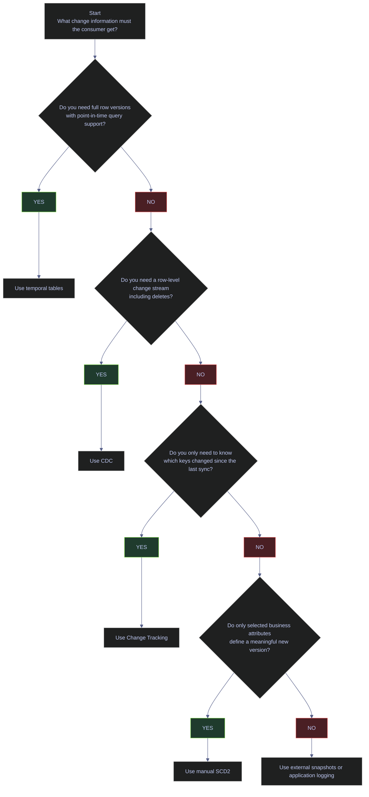

# SQL Server Change Tracking

Change tracking is the discipline of recording what changed, when it changed, and, depending on the method, whether you also need the before image, after image, or a point-in-time table view. In SQL Server, the right mechanism depends on the downstream question:

- Do you need a full business history of selected attributes
- Do you need engine-managed row history for audit or time-travel queries
- Do you need every insert, update, and delete event for downstream replication
- Do you only need to know which primary keys changed since the last sync

This note grounds those decisions in the live `stoxx` database. The current production state is simple: engine-managed features are not enabled, but `silver.index_dim` already follows a manual SCD2 pattern with `valid_from`, `valid_to`, `is_current`, and a filtered unique index.

---

## Live Feature State

Before choosing a change-capture design, inspect what the database already has enabled. Production mistakes often start when engineers assume CDC, Change Tracking, or temporal tables are already available and then build downstream logic on features that are actually off.

### Current change-capture surface in `stoxx`

#### Inspect the current engine-managed change-capture state

> [!info]-
> This query summarizes the current change-capture capabilities of the `stoxx` database.
>
> - `sys.databases` provides database-level settings such as `compatibility_level`, `is_cdc_enabled`, and row-versioning isolation settings.
> - `EXISTS (SELECT 1 FROM sys.change_tracking_databases ...)` converts Change Tracking enablement into a simple `0` or `1` flag.
> - `sys.tables WHERE temporal_type_desc <> 'NON_TEMPORAL_TABLE'` counts current temporal tables.
> - `SCHEMA_ID('cdc')` checks whether the CDC schema exists in the database.
> - `sys.change_tracking_tables` counts how many tables are currently enrolled in Change Tracking.
>
> *This query shows whether `stoxx` currently has CDC, Change Tracking, temporal tables, or row-versioning prerequisites enabled.*
>
```sql
SELECT d.name AS database_name,
       d.compatibility_level,
       d.is_cdc_enabled,
       CASE
           WHEN EXISTS (
               SELECT 1
               FROM sys.change_tracking_databases
               WHERE database_id = d.database_id
           ) THEN 1
           ELSE 0
       END AS is_change_tracking_enabled,
       d.snapshot_isolation_state_desc,
       d.is_read_committed_snapshot_on,
       (
           SELECT COUNT(*)
           FROM sys.tables
           WHERE temporal_type_desc <> 'NON_TEMPORAL_TABLE'
       ) AS temporal_table_count,
       CASE
           WHEN SCHEMA_ID('cdc') IS NULL THEN 0
           ELSE 1
       END AS cdc_schema_present,
       (
           SELECT COUNT(*)
           FROM sys.change_tracking_tables
       ) AS change_tracking_table_count
FROM sys.databases AS d
WHERE d.name = 'stoxx';
```

| database_name | compatibility_level | is_cdc_enabled | is_change_tracking_enabled | snapshot_isolation_state_desc | is_read_committed_snapshot_on | temporal_table_count | cdc_schema_present | change_tracking_table_count |
|---|---:|---:|---:|---|---:|---:|---:|---:|
| `stoxx` | 160 | 0 | 0 | `OFF` | 0 | 0 | 0 | 0 |

_`stoxx` is currently running with none of the engine-managed change-capture features enabled. That means any current history behavior comes from table design and ETL logic, not from CDC, Change Tracking, or temporal tables. It also means a CT-based sync design would first need database-level enablement and a row-versioning discussion before it is production-ready._

| Column | Value | Watch | Meaning | Implication |
|---|---|---|---|---|
| `compatibility_level` | `160` | &#9989; | SQL Server 2022 query surface is available. | Modern syntax and optimizer features are available if the design needs them. |
| `is_cdc_enabled` | `0` | &#10060; | CDC is not enabled at the database level. | No CDC schema, no change tables, and no `fn_cdc_get_*` functions are available. |
| `is_cdc_enabled` | `1` | &#9989; | CDC is enabled at the database level. | You can then enable individual source tables for CDC. |
| `is_change_tracking_enabled` | `0` | &#10060; | Change Tracking is off for the database. | `CHANGETABLE(CHANGES ...)` cannot be used against application tables yet. |
| `is_change_tracking_enabled` | `1` | &#9989; | Change Tracking is enabled at the database level. | Individual tables can then participate in key-level sync tracking. |
| `snapshot_isolation_state_desc` | `OFF` | Context-dependent | Snapshot isolation is not enabled. | CT can still work, but consistent multi-table sync windows become harder. |
| `snapshot_isolation_state_desc` | `ON` | &#9989; | Snapshot isolation is enabled. | Safer for readers that need a transactionally consistent sync view. |
| `is_read_committed_snapshot_on` | `0` | Context-dependent | RCSI is off. | Readers still use lock-based read committed semantics by default. |
| `is_read_committed_snapshot_on` | `1` | &#9989; | RCSI is on. | Reader/writer blocking is reduced for many operational queries. |
| `temporal_table_count` | `0` | Context-dependent | No temporal tables currently exist. | Any time-travel requirement would need a new temporal design or a manual SCD pattern. |
| `temporal_table_count` | `> 0` | &#9989; | One or more temporal tables exist. | Temporal maintenance and retention policy become operational concerns. |
| `cdc_schema_present` | `0` | &#10060; | No `cdc` schema exists. | CDC metadata tables and change tables have not been created. |
| `cdc_schema_present` | `1` | &#9989; | CDC metadata schema exists. | Verify whether tracked tables and cleanup jobs are also configured. |
| `change_tracking_table_count` | `0` | Context-dependent | No tables currently participate in CT. | Even if CT were enabled later, table enrollment would still be required. |
| `change_tracking_table_count` | `> 0` | &#9989; | One or more tables are tracked. | Consumers can begin using `CHANGETABLE` patterns for those tables. |

### Current manual SCD2 implementation in `silver.index_dim`

The current `stoxx` warehouse already uses the classic SCD2 columns on `silver.index_dim`, which makes this table the most important live example in the note.

#### Measure the live SCD2 state of `silver.index_dim`

> [!info]-
> This query measures how the existing dimension table is currently using its SCD2 columns.
>
> - `COUNT(*)` returns total dimension rows.
> - `SUM(CASE WHEN is_current = 1 THEN 1 ELSE 0 END)` counts active versions.
> - `SUM(CASE WHEN is_current = 0 THEN 1 ELSE 0 END)` counts closed historical versions.
> - `MIN(valid_from)` and `MAX(valid_from)` show the version-load time range currently stored.
> - `SUM(CASE WHEN valid_to IS NULL THEN 1 ELSE 0 END)` counts still-open rows.
>
> *This query measures whether `silver.index_dim` is currently using its SCD2 columns as a real history table or only as a current-state dimension with SCD2-compatible structure.*
>
```sql
SELECT total_rows = COUNT(*),
       current_rows = SUM(CASE WHEN is_current = 1 THEN 1 ELSE 0 END),
       historical_rows = SUM(CASE WHEN is_current = 0 THEN 1 ELSE 0 END),
       min_valid_from = MIN(valid_from),
       max_valid_from = MAX(valid_from),
       open_ended_rows = SUM(CASE WHEN valid_to IS NULL THEN 1 ELSE 0 END)
FROM silver.index_dim;
```

| total_rows | current_rows | historical_rows | min_valid_from | max_valid_from | open_ended_rows |
|---:|---:|---:|---|---|---:|
| 169 | 169 | 0 | 2026-03-04 22:11:36.1898627 | 2026-03-12 12:09:52.8799122 | 169 |

_`silver.index_dim` is structurally an SCD2 table, but operationally it is still a current-state dimension: every row is current, every row is open-ended, and no closed history rows exist yet. That is a valid starting point, but it means the pipeline has not yet exercised a real version rollover in this table._

#### Preview the newest live dimension rows

> [!info]-
> This query previews the newest `silver.index_dim` versions by sorting on `valid_from` descending.
>
> - `_index`, `symbol`, and `sector` show the business identity of each dimension row.
> - `valid_from`, `valid_to`, and `is_current` are the three core SCD2 control columns.
> - Ordering by `valid_from DESC, symbol` surfaces the latest dimension load batch first.
>
> *This query previews the newest live dimension rows in `silver.index_dim` and shows how the current table stores active versions.*
>
```sql
SELECT TOP (8)
       _index,
       symbol,
       sector,
       valid_from,
       valid_to,
       is_current
FROM silver.index_dim
ORDER BY valid_from DESC, symbol;
```

| _index | symbol | sector | valid_from | valid_to | is_current |
|---|---|---|---|---|---:|
| `oil_20` | `MPC` | `Energy` | 2026-03-12 12:09:52.8799122 | `NULL` | 1 |
| `oil_20` | `PSX` | `Energy` | 2026-03-12 12:09:52.8799122 | `NULL` | 1 |
| `oil_20` | `ENB` | `Energy` | 2026-03-12 12:09:52.8757472 | `NULL` | 1 |
| `oil_20` | `VLO` | `Energy` | 2026-03-12 12:09:52.8757472 | `NULL` | 1 |
| `oil_20` | `BKR` | `Energy` | 2026-03-12 12:09:52.8715853 | `NULL` | 1 |
| `oil_20` | `KMI` | `Energy` | 2026-03-12 12:09:52.8715853 | `NULL` | 1 |
| `oil_20` | `WMB` | `Energy` | 2026-03-12 12:09:52.8715853 | `NULL` | 1 |
| `oil_20` | `HAL` | `Energy` | 2026-03-12 12:09:52.8674178 | `NULL` | 1 |

_These rows confirm the table is currently storing only active versions. The `valid_from` timestamps are still useful because they show when the latest dimension batch entered the warehouse, but `valid_to = NULL` and `is_current = 1` across the sample mean the table has not yet closed any business history rows._

#### Inspect the filtered unique index that enforces one active row per key

> [!info]-
> This query inspects the indexes on `silver.index_dim`, focusing on whether the table has a filtered unique index for current rows.
>
> - `sys.indexes` exposes index metadata.
> - `is_unique` confirms whether duplicate keys are blocked.
> - `filter_definition` shows whether the uniqueness rule applies only to active rows, which is the critical SCD2 pattern.
>
> *This query verifies that `silver.index_dim` enforces one active version per business key with a filtered unique index.*
>
```sql
SELECT OBJECT_SCHEMA_NAME(i.object_id) AS schema_name,
       OBJECT_NAME(i.object_id) AS table_name,
       i.name AS index_name,
       i.is_unique,
       i.filter_definition
FROM sys.indexes AS i
WHERE i.object_id = OBJECT_ID('silver.index_dim')
ORDER BY i.index_id;
```

| schema_name | table_name | index_name | is_unique | filter_definition |
|---|---|---|---:|---|
| `silver` | `index_dim` | `PK__index_di__3213E83F590AA69E` | 1 | `NULL` |
| `silver` | `index_dim` | `UX_silver_index_dim_current` | 1 | `([is_current]=(1))` |

_The second row is the key SCD2 safeguard. `UX_silver_index_dim_current` allows many historical versions over time, but it blocks a second simultaneous active row for the same business key because the uniqueness rule applies only where `is_current = 1`._

| Column | Value | Watch | Meaning | Implication |
|---|---|---|---|---|
| `is_unique` | `1` | &#9989; | Duplicate key values are blocked within the index scope. | Required for protecting one-current-row rules. |
| `is_unique` | `0` | &#10060; | Duplicate key values are allowed. | SCD2 bugs can create multiple simultaneous active rows. |
| `filter_definition` | `([is_current]=(1))` | &#9989; | Uniqueness applies only to active rows. | This is the standard SQL Server SCD2 protection pattern. |
| `filter_definition` | `NULL` on the business-key index | &#10060; | Uniqueness would apply to all versions or not at all. | Either history inserts fail or duplicate active rows become possible. |

---

## Decision Matrix

The practical difference between the available methods is not just "history or no history". It is the payload, the latency, and the operational owner of the logic.

### Choose the method by the downstream question

Use the lightest mechanism that still answers the real downstream requirement.

| Method | Captures | History Depth | Typical Latency | Operational Owner | Best Fit |
|---|---|---|---|---|---|
| Manual SCD2 | Selected business attributes | Full for the tracked attributes | Batch-oriented | Data engineering | Dimensional history where you choose what counts as a change |
| Temporal tables | Full row versions | Full row history | Immediate on DML | SQL Server engine | Audit, point-in-time queries, row reconstruction |
| CDC | Inserts, updates, deletes plus metadata | Full row-level change stream | Near real time to batch | DBA + data engineering | Replication, streaming, downstream event consumers |
| Change Tracking | Primary keys and operation metadata | No before image, no full row history | Sync-oriented | DBA + application/data engineering | Lightweight pull-based sync |
| `rowversion` token | Monotonic row stamp on insert or update | No row history and no delete payload | Pull-based / batch | Application or data engineering | Mutable tables where you only need a change token and can reread the current row |
| dbt snapshots | Selected columns via snapshot strategy | Full for tracked snapshot rows | Batch-oriented | Analytics engineering | Declarative warehouse history outside source SQL Server |
| Application-level logging | Whatever the app emits | Custom | App-dependent | Application team | When database-level capture is unavailable or undesirable |

### Follow the method-selection path explicitly



---

## Rowversion As A Change Token

`rowversion` is SQL Server's lightest built-in change token. It is not a timestamp and it is not a history feature. It is an 8-byte database-scoped incrementing binary value that changes whenever a row containing a `rowversion` column is inserted or updated. That makes it useful for incremental readers that only need "changed since token X" behavior and can reread the current row image from the base table.

### Use `rowversion` only when token-based change detection is enough

`rowversion` is a fit when:

- the source mutates rows in place and a date watermark is unreliable
- the consumer can reread the current row from the base table
- deletes are handled separately
- the team wants a lighter mechanism than CT or CDC

It is the wrong fit when:

- the pipeline needs delete detection from the token itself
- the consumer needs before images or ordered change events
- the token will be interpreted as business time
- the column is treated as a durable key

#### Inspect whether the current database already exposes any `rowversion` columns

> [!info]-
> This query measures how many `rowversion` columns currently exist in `stoxx`.
>
> - SQL Server stores `rowversion` columns with `system_type_id = 189`.
> - `COUNT(*)` returns the number of rowversion columns across the database.
> - `COUNT(DISTINCT object_id)` shows how many tables currently use that mechanism.
> - An empty result set would be awkward to read in a note, so the query returns aggregate counts instead of raw rows.
>
> *This query checks whether `stoxx` currently uses `rowversion` anywhere as a change token.*
>
```sql
SELECT COUNT(*) AS rowversion_column_count,
       COUNT(DISTINCT object_id) AS tables_with_rowversion
FROM sys.columns
WHERE system_type_id = 189;
```

| rowversion_column_count | tables_with_rowversion |
|---:|---:|
| 0 | 0 |

_`stoxx` does not currently use `rowversion` in any table, which is consistent with the broader live state of this note: the warehouse is relying on explicit ETL design rather than engine-managed change tokens. If a mutable source table later needs a lightweight delta token, `rowversion` would need to be introduced deliberately as part of that table contract._

#### Demonstrate how a `rowversion` token changes after one update

> [!warning]
> `rowversion` is not business time and not a full change-feed. Any insert or update to a row with a `rowversion` column changes the token, even if the business change is minor. Deletes do not emit a rowversion, and Microsoft documentation explicitly warns that `rowversion` is a poor key candidate because updates change the value.
>
> [!success]
> Use `rowversion` only as a technical delta token. Persist the last consumed token, reread the current row image from the base table, and keep deletes on a separate path such as soft-delete flags, CT, CDC, or scoped replacement logic.
>
> [!info]-
> This batch creates a disposable rowversion table, captures a snapshot of the tokens, updates one row, and returns the before-and-after comparison.
>
> - `rv rowversion NOT NULL` asks SQL Server to maintain the token automatically.
> - The table variable `@before` stores the initial tokens so the final query can show both the previous and current values.
> - `master.dbo.fn_varbintohexstr(...)` renders the binary token in a readable hexadecimal format.
> - `rowversion_status` is derived by comparing the current token to the earlier snapshot.
>
> *This batch shows how a `rowversion` token changes automatically after one row update and how a consumer can compare the current token to an earlier snapshot.*
>
```sql
IF OBJECT_ID('dbo.demo_rowversion_delta', 'U') IS NOT NULL
    DROP TABLE dbo.demo_rowversion_delta;

CREATE TABLE dbo.demo_rowversion_delta
(
    id int NOT NULL PRIMARY KEY,
    business_key varchar(20) NOT NULL,
    payload nvarchar(50) NOT NULL,
    rv rowversion NOT NULL
);

INSERT INTO dbo.demo_rowversion_delta(id, business_key, payload)
VALUES (1, 'ABI.BR', N'baseline'),
       (2, 'ASML.AS', N'before-change');

DECLARE @before TABLE
(
    id int PRIMARY KEY,
    rv_before varbinary(8) NOT NULL
);

INSERT INTO @before(id, rv_before)
SELECT id, rv
FROM dbo.demo_rowversion_delta;

UPDATE dbo.demo_rowversion_delta
SET payload = N'after-change'
WHERE id = 2;

SELECT t.id,
       t.business_key,
       t.payload,
       master.dbo.fn_varbintohexstr(b.rv_before) AS rv_before,
       master.dbo.fn_varbintohexstr(CAST(t.rv AS varbinary(8))) AS rv_after,
       CASE
           WHEN CAST(t.rv AS varbinary(8)) > b.rv_before THEN 'CHANGED SINCE SNAPSHOT'
           ELSE 'UNCHANGED'
       END AS rowversion_status
FROM dbo.demo_rowversion_delta AS t
JOIN @before AS b
    ON b.id = t.id
ORDER BY t.id;

DROP TABLE dbo.demo_rowversion_delta;
```

| id | business_key | payload | rv_before | rv_after | rowversion_status |
|---:|---|---|---|---|---|
| 1 | `ABI.BR` | `baseline` | `0x000000000003f245` | `0x000000000003f245` | `UNCHANGED` |
| 2 | `ASML.AS` | `after-change` | `0x000000000003f246` | `0x000000000003f248` | `CHANGED SINCE SNAPSHOT` |

_This is the exact operational meaning of a rowversion token. The unchanged row keeps the same token, while the updated row receives a newer value without the caller having to assign anything manually. The gap between `0x...246` and `0x...248` also shows why the token should be treated as a monotonic version stamp, not as a row counter or a wall-clock timestamp._

### Compare `rowversion`, Change Tracking, and CDC explicitly

| Mechanism | What the consumer gets | What it does not give you | Best use |
|---|---|---|---|
| `rowversion` | One technical change token per inserted or updated row | No deletes, no before image, no built-in change table | Lightweight source-owned delta scans |
| Change Tracking | Changed keys plus operation metadata | No full before image, no persistent history stream | Pull-based synchronization that can reread current rows |
| CDC | Ordered change rows with insert, update, and delete semantics | No business interpretation by itself and more operational overhead | Replication, event-style downstream ingestion, replay consumers |

The practical rule is simple:

- choose `rowversion` when the token itself is enough and deletes are handled elsewhere
- choose CT when the consumer needs changed keys plus operation codes
- choose CDC when downstream systems need a true row-change stream

---

## Manual SCD Type 2

Manual SCD2 is the right tool when the business does not want every column change recorded automatically. It lets the pipeline decide which attributes matter enough to create a new version.

### Use manual SCD2 for business-defined history

Manual SCD2 is especially strong when:

- only a subset of attributes should trigger a new version
- the source system does not expose engine-managed change history
- the warehouse already owns the conformed dimension logic
- analysts want a durable "current row plus history" dimension pattern

#### Demonstrate a real SCD2 version rollover on a disposable table

> [!warning]
> The filtered unique index in this pattern depends on session `SET` options such as `QUOTED_IDENTIFIER ON` and `ANSI_NULLS ON`. If those settings are wrong at create time, SQL Server rejects the index creation. The same pattern also fails logically if the close step and insert step are not executed as one atomic change unit.
>
> [!success]
> Create the filtered unique index with the required `SET` options enabled, and treat the close-plus-insert sequence as a single transactional version change. That keeps the table from ever exposing two current rows for the same business key.
>
> [!info]-
> This batch creates a disposable SCD2 demo table, inserts one current row, closes it at a chosen change timestamp, inserts the new current version, returns the final history, and then drops the table.
>
> - `valid_from`, `valid_to`, and `is_current` are the core SCD2 control columns.
> - The filtered unique index `WHERE is_current = 1` enforces one active version per symbol.
> - The update step closes the old row by setting `valid_to` and `is_current = 0`.
> - The insert step creates the new current row with the same change timestamp as its `valid_from`.
>
> *This batch demonstrates a complete manual SCD2 rollover on a disposable table and returns the final history chain.*
>
```sql
SET ANSI_NULLS ON;
SET QUOTED_IDENTIFIER ON;

IF OBJECT_ID('dbo.demo_scd2_company', 'U') IS NOT NULL
    DROP TABLE dbo.demo_scd2_company;

CREATE TABLE dbo.demo_scd2_company
(
    id int IDENTITY(1,1) PRIMARY KEY,
    symbol varchar(20) NOT NULL,
    sector nvarchar(100) NULL,
    valid_from datetime2(7) NOT NULL,
    valid_to datetime2(7) NULL,
    is_current bit NOT NULL
);

CREATE UNIQUE INDEX UX_demo_scd2_company_current
    ON dbo.demo_scd2_company(symbol)
    WHERE is_current = 1;

INSERT INTO dbo.demo_scd2_company(symbol, sector, valid_from, valid_to, is_current)
VALUES ('ASML.AS', 'Technology Hardware', '2026-03-01T00:00:00', NULL, 1);

DECLARE @change_time datetime2(7) = '2026-04-08T09:15:00';

UPDATE dbo.demo_scd2_company
SET valid_to = @change_time,
    is_current = 0
WHERE symbol = 'ASML.AS'
  AND is_current = 1;

INSERT INTO dbo.demo_scd2_company(symbol, sector, valid_from, valid_to, is_current)
VALUES ('ASML.AS', 'Semiconductors', @change_time, NULL, 1);

SELECT symbol, sector, valid_from, valid_to, is_current
FROM dbo.demo_scd2_company
ORDER BY valid_from;

DROP TABLE dbo.demo_scd2_company;
```

| symbol | sector | valid_from | valid_to | is_current |
|---|---|---|---|---:|
| `ASML.AS` | `Technology Hardware` | 2026-03-01 00:00:00.0000000 | 2026-04-08 09:15:00.0000000 | 0 |
| `ASML.AS` | `Semiconductors` | 2026-04-08 09:15:00.0000000 | `NULL` | 1 |

_This is the canonical SCD2 outcome. The old version is closed, the new version is current, and the timestamps form a contiguous history boundary with no overlap. In production, that same logic must run for every tracked business key that changes._

### Production rules for manual SCD2

The durable rules are:

- use `DATETIME2`, not `DATE`, for version boundaries
- compare nullable attributes safely
- never compare floating-point business attributes with raw equality
- protect the table with a filtered unique index on the active-row predicate
- keep the close and insert steps in one transaction or stored-procedure unit

---

## Temporal Tables

Temporal tables are SQL Server's engine-managed row-history mechanism. When they are enabled, SQL Server copies old row versions to a history table automatically and exposes them through `FOR SYSTEM_TIME`.

### Use temporal tables when you need full row history, not just selected attributes

Temporal tables are strongest when:

- you need point-in-time reconstruction of the full row
- you want the engine to manage version writes automatically
- the table is an audit target rather than a heavily customized dimensional object
- schema restrictions and history-table growth are acceptable operational costs

#### Demonstrate `FOR SYSTEM_TIME ALL` on a disposable temporal table

> [!warning]
> Temporal tables are not free history. They add write overhead, grow a history table, complicate schema changes, and block `TRUNCATE` while system versioning is on. They are the wrong default for hot staging tables and the wrong fit when only selected business attributes should trigger new versions.
>
> [!success]
> Use temporal tables when the requirement is full-row auditability or point-in-time reconstruction, and pair them with an explicit history retention policy and a documented schema-change procedure.
>
> [!info]-
> This batch creates a disposable temporal table, inserts one row, updates it after a delay so the period columns diverge, queries the full history with `FOR SYSTEM_TIME ALL`, and then removes the demo objects.
>
> - The `PERIOD FOR SYSTEM_TIME` clause defines the row-start and row-end columns.
> - `SYSTEM_VERSIONING = ON` tells SQL Server to manage the history table automatically.
> - `WAITFOR DELAY` is only there to create clearly different timestamps in the demo output.
> - `FOR SYSTEM_TIME ALL` returns both the historical version and the current version.
>
> *This batch demonstrates a real temporal-table update and returns the combined current-plus-history view through `FOR SYSTEM_TIME ALL`.*
>
```sql
IF OBJECT_ID('dbo.demo_temporal_security_history', 'U') IS NOT NULL
    DROP TABLE dbo.demo_temporal_security_history;

IF OBJECT_ID('dbo.demo_temporal_security', 'U') IS NOT NULL
BEGIN
    ALTER TABLE dbo.demo_temporal_security
        SET (SYSTEM_VERSIONING = OFF);
    DROP TABLE dbo.demo_temporal_security;
END;

CREATE TABLE dbo.demo_temporal_security
(
    symbol varchar(20) NOT NULL PRIMARY KEY,
    sector nvarchar(100) NOT NULL,
    valid_from datetime2(7) GENERATED ALWAYS AS ROW START HIDDEN NOT NULL,
    valid_to datetime2(7) GENERATED ALWAYS AS ROW END HIDDEN NOT NULL,
    PERIOD FOR SYSTEM_TIME (valid_from, valid_to)
)
WITH (SYSTEM_VERSIONING = ON (HISTORY_TABLE = dbo.demo_temporal_security_history));

INSERT INTO dbo.demo_temporal_security(symbol, sector)
VALUES ('ASML.AS', 'Technology Hardware');

WAITFOR DELAY '00:00:01';

UPDATE dbo.demo_temporal_security
SET sector = 'Semiconductors'
WHERE symbol = 'ASML.AS';

SELECT symbol, sector, valid_from, valid_to
FROM dbo.demo_temporal_security
FOR SYSTEM_TIME ALL
ORDER BY valid_from;

ALTER TABLE dbo.demo_temporal_security
    SET (SYSTEM_VERSIONING = OFF);

DROP TABLE dbo.demo_temporal_security_history;
DROP TABLE dbo.demo_temporal_security;
```

| symbol | sector | valid_from | valid_to |
|---|---|---|---|
| `ASML.AS` | `Technology Hardware` | 2026-04-08 15:45:20.9635196 | 2026-04-08 15:45:21.9778525 |
| `ASML.AS` | `Semiconductors` | 2026-04-08 15:45:21.9778525 | 9999-12-31 23:59:59.9999999 |

_The output shows the core temporal-table contract: the old version becomes history automatically, the current row receives the open-ended `9999-12-31` end marker, and the engine preserves the full row image without any manual close-and-insert logic._

### Temporal-table production boundaries

The main operational caveats from Microsoft documentation are:

- history tables grow unless retention is designed explicitly
- schema changes often require a controlled `SYSTEM_VERSIONING = OFF` / `ON` migration sequence
- hidden period columns do not appear in `SELECT *`
- `TRUNCATE` is blocked while system versioning is enabled

#### Design retention and cleanup before the history table becomes the next incident

Temporal history is easy to enable and easy to ignore until it becomes large. Microsoft documentation describes three main retention patterns, and they solve different operational problems.

| Retention strategy | Best Fit | What to watch |
|---|---|---|
| Built-in retention policy | Moderate history windows with predictable automatic cleanup | Validate edition/version support and monitor whether cleanup keeps pace with write volume |
| Custom cleanup with `sys.sp_cleanup_temporal_history` | Targeted, explicit cleanup windows | It is an immediate cleanup action, not a gentle background retention policy |
| Partitioned history with a sliding window | Very large temporal history tables | Requires partition design discipline and ongoing partition maintenance |

Production recommendations:

- use built-in retention when the history window is clear and bounded
- use `sys.sp_cleanup_temporal_history` only as an explicit operational cleanup tool, not as a substitute for retention design
- use partitioned sliding-window retention when temporal history is large enough that delete-based cleanup is no longer the right maintenance shape
- monitor history growth as a separate operational metric; temporal tables are not self-governing archival systems

---

## Change Data Capture

CDC is SQL Server's log-based row-change capture feature. It is built for consumers that need a stream of inserts, updates, and deletes with enough metadata to replay those changes into another system.

### Use CDC when downstream consumers need change events, not just current state

CDC is the right fit when:

- deletes must be captured explicitly
- downstream systems need ordered change events
- a sync or replication process consumes the database incrementally
- the source team accepts the operational overhead of CDC jobs, retention, and cleanup

#### Enable CDC at the database and table level

> [!warning]
> CDC changes the operational surface of the database. It reads the transaction log, creates CDC metadata objects and change tables, and relies on retention cleanup. It should not be enabled casually on a production source without validating Agent availability, retention needs, and downstream consumption design.
>
> [!success]
> Enable CDC only for tables that truly need row-level change events, document the capture instance name, and monitor cleanup so change tables do not grow without bound.
>
> [!info]-
> This is the minimum enablement sequence for CDC.
>
> - `sys.sp_cdc_enable_db` enables CDC for the database.
> - `sys.sp_cdc_enable_table` enrolls one source table and creates its capture instance.
> - `@supports_net_changes = 1` asks SQL Server to expose net-change enumeration in addition to all-changes enumeration.
>
> *This batch enables CDC first at the database level and then for one source table with net-change support.*
>
```sql
EXEC sys.sp_cdc_enable_db;
GO

EXEC sys.sp_cdc_enable_table
    @source_schema = N'silver',
    @source_name = N'signals_daily',
    @role_name = NULL,
    @supports_net_changes = 1;
GO
```

#### Read CDC rows between two LSN boundaries

> [!info]-
> After CDC is enabled, consumers query the generated table-valued functions instead of reading the change table directly.
>
> - `sys.fn_cdc_get_min_lsn` returns the low boundary for the capture instance.
> - `sys.fn_cdc_get_max_lsn` returns the current high boundary.
> - `fn_cdc_get_all_changes_<capture_instance>` returns one row per captured change image across the specified LSN interval.
> - The final argument controls whether update rows return all images or only rows with actual changes.
>
> *This query reads CDC changes for one capture instance across an LSN interval.*
>
```sql
DECLARE @from_lsn binary(10) = sys.fn_cdc_get_min_lsn('silver_signals_daily');
DECLARE @to_lsn   binary(10) = sys.fn_cdc_get_max_lsn();

SELECT *
FROM cdc.fn_cdc_get_all_changes_silver_signals_daily(@from_lsn, @to_lsn, 'all');
```

The key metadata columns in CDC output are the ones the consumer must interpret correctly.

| Column | Value | Watch | Meaning | Implication |
|---|---|---|---|---|
| `__$operation` | `1` | Context-dependent | Delete row image. | Consumer should delete or close the target row. |
| `__$operation` | `2` | &#9989; | Insert row image. | Consumer should insert the row into the target representation. |
| `__$operation` | `3` | Context-dependent | Update before image. | Present only in all-changes output; used for before/after interpretation. |
| `__$operation` | `4` | &#9989; | Update after image. | Consumer should apply the new row image. |
| `__$start_lsn` | Monotonic commit LSN | &#9989; | Commit ordering boundary. | Safe watermark candidate for CDC consumers. |
| `__$seqval` | Increasing within transaction | &#9989; | Orders changes inside the same transaction. | Required when multiple changes share the same LSN. |
| `__$update_mask` | Bit mask | Context-dependent | Indicates which captured columns changed. | Useful for partial-change interpretation and downstream optimization. |

---

## Change Tracking

Change Tracking is lighter than CDC. It tells consumers which primary keys changed since a version boundary, but it does not preserve full before images or a persistent row-history stream.

### Use CT for pull-based synchronization

CT is strongest when:

- the consumer periodically asks "which keys changed since my last sync"
- the current row can be reread from the base table as needed
- low overhead matters more than rich historical payload
- the application or ETL process maintains its own sync version watermark

#### Enable Change Tracking for the database and one table

> [!warning]
> CT still changes database behavior and should be enabled deliberately. The sync client is responsible for tracking and advancing versions correctly, and CT cleanup can invalidate old sync windows if consumers lag too far behind.
>
> [!success]
> Use CT when the consumer can rehydrate the latest row from the base table and only needs changed keys plus operation metadata. Pair it with a stored sync version and consistent-reader strategy.
>
> [!info]-
> This is the minimum database-plus-table enablement pattern for Change Tracking.
>
> - `ALTER DATABASE ... SET CHANGE_TRACKING = ON` enables CT for the database and defines retention.
> - `AUTO_CLEANUP = ON` allows SQL Server to purge old CT metadata according to the retention window.
> - `ALTER TABLE ... ENABLE CHANGE_TRACKING` enrolls one source table.
> - `TRACK_COLUMNS_UPDATED = ON` adds column-change metadata to the CT payload.
>
> *This batch enables Change Tracking for the database and then for one source table with column-update metadata.*
>
```sql
ALTER DATABASE stoxx
SET CHANGE_TRACKING = ON
(
    CHANGE_RETENTION = 7 DAYS,
    AUTO_CLEANUP = ON
);
GO

ALTER TABLE silver.signals_daily
ENABLE CHANGE_TRACKING
WITH (TRACK_COLUMNS_UPDATED = ON);
GO
```

#### Read changed keys since the last sync version

> [!info]-
> Once CT is enabled, consumers use `CHANGETABLE(CHANGES ...)` and a previously stored sync version.
>
> - `CHANGE_TRACKING_CURRENT_VERSION()` returns the newest committed CT version in the database.
> - `CHANGETABLE(CHANGES ...)` returns the keys and change metadata for rows modified since the supplied version.
> - The consumer typically joins those keys back to the base table to fetch the current row image.
>
> *This query reads Change Tracking keys and operations since a stored sync version.*
>
```sql
DECLARE @last_sync_version bigint = 0;

SELECT ct.SYS_CHANGE_VERSION,
       ct.SYS_CHANGE_OPERATION,
       ct.SYS_CHANGE_COLUMNS,
       ct.id
FROM CHANGETABLE(CHANGES silver.signals_daily, @last_sync_version) AS ct;
```

| Column | Value | Watch | Meaning | Implication |
|---|---|---|---|---|
| `SYS_CHANGE_OPERATION` | `I` | &#9989; | Insert. | The key did not exist at the previous sync boundary. |
| `SYS_CHANGE_OPERATION` | `U` | &#9989; | Update. | The key exists and at least one tracked column changed. |
| `SYS_CHANGE_OPERATION` | `D` | Context-dependent | Delete. | The row was removed; consumers must remove or close it downstream. |
| `SYS_CHANGE_VERSION` | Monotonic bigint | &#9989; | CT version at which the change was committed. | Normal sync watermark for CT consumers. |
| `SYS_CHANGE_COLUMNS` | `NULL` or bit pattern | Context-dependent | Which non-PK columns changed. | Requires `TRACK_COLUMNS_UPDATED = ON` to be useful. |

#### Validate the retained sync window before trusting `CHANGETABLE`

> [!warning]
> CT is not an infinite backlog. Microsoft documentation explicitly recommends checking `CHANGE_TRACKING_MIN_VALID_VERSION()` before using an old stored sync version. If the consumer lags past retention, incremental sync is no longer trustworthy and must be reinitialized from a new baseline.
>
> [!success]
> Persist the last successful sync version, compare it to `CHANGE_TRACKING_MIN_VALID_VERSION()` for every tracked table before reading CT rows, and only advance the stored version after the downstream commit succeeds.
>
> [!info]-
> This pattern validates a stored CT sync version before consuming changes.
>
> - `CHANGE_TRACKING_CURRENT_VERSION()` returns the latest committed CT version in the database.
> - `CHANGE_TRACKING_MIN_VALID_VERSION(OBJECT_ID(...))` returns the oldest still-valid version for a tracked table.
> - If `@last_sync_version` is below `min_valid_version`, the consumer must stop incremental processing and rebuild from a fresh baseline.
> - When only a small fraction of rows changed, Microsoft also documents `FORCESEEK` support for `CHANGETABLE` on supported builds so the CT lookup can avoid a larger scan.
>
> *This query validates whether a stored CT watermark is still inside the retained change window before the consumer reads `CHANGETABLE` rows.*
>
```sql
DECLARE @last_sync_version bigint = 12345;

SELECT @last_sync_version AS last_sync_version,
       CHANGE_TRACKING_MIN_VALID_VERSION(OBJECT_ID('silver.signals_daily')) AS min_valid_version,
       CHANGE_TRACKING_CURRENT_VERSION() AS current_version;
```

If `last_sync_version < min_valid_version`, do not continue with an incremental CT read. Reinitialize the target from a fresh full load or snapshot, then store a new sync version after that baseline completes.

---

## External Snapshot Patterns

Not every system should push change logic into SQL Server itself.

### Use dbt snapshots when the warehouse owns the history logic

dbt snapshots are strongest when:

- the warehouse, not the source OLTP system, owns the history contract
- the team wants declarative SCD behavior in the transformation layer
- the source SQL Server should remain operationally simple

### Use application-level logging when the business event matters more than the row image

Application-side change logs are often better when:

- the event semantics are richer than "row changed"
- the system needs actor, reason, correlation ID, or domain-event payloads
- the source database cannot safely enable CDC or CT

---

## Anti-Patterns

These are the recurring failure modes in SQL Server change-capture designs.

### Temporal tables on high-write staging tables

That creates heavy history growth and solves the wrong problem. Temporal tables are for row-history auditability, not for raw ingest buffers.

### CDC without retention monitoring

CDC change tables are operational data structures, not archival storage. If cleanup is ignored, they grow until they become a production problem.

### CT consumers that lag past the retention window

CT is not perpetual history. If the stored sync version becomes too old, the consumer can no longer reconcile incrementally and must reinitialize.

### SCD2 without a filtered unique index

That leaves the table vulnerable to duplicate current rows for the same business key.

### Comparing nullable or floating-point attributes naïvely in SCD2 logic

That creates false positives or false negatives in change detection and silently corrupts the version chain.

### Treating CDC as a replacement for an initial full load

CDC captures changes after enablement. It does not automatically provide the historical baseline that downstream replicas often still need.

---

## Current Recommendation For `stoxx`

The current state of `stoxx` supports a clear production recommendation:

- keep `silver.index_dim` on the manual SCD2 path because the warehouse already owns the business dimension logic
- keep CDC and CT disabled until there is a concrete downstream sync or replication consumer that justifies the operational overhead
- introduce temporal tables only for tables that truly need full-row point-in-time auditability
- consider `rowversion` only for mutable source-owned tables that need a lightweight delta token and can handle deletes on a separate path
- if CT is adopted later, pair it with a documented sync version store and a row-versioning isolation review
- if CDC is adopted later, pair it with explicit retention, capture-instance naming, and downstream replay design

---


## References

- Microsoft Learn: [Temporal tables](https://learn.microsoft.com/en-us/sql/relational-databases/tables/temporal-tables)
- Microsoft Learn: [rowversion (Transact-SQL)](https://learn.microsoft.com/en-us/sql/t-sql/data-types/rowversion-transact-sql)
- Microsoft Learn: [What is change data capture (CDC)?](https://learn.microsoft.com/en-us/sql/relational-databases/track-changes/about-change-data-capture-sql-server)
- Microsoft Learn: [About Change Tracking](https://learn.microsoft.com/en-us/sql/relational-databases/track-changes/about-change-tracking-sql-server)
- Microsoft Learn: [CHANGETABLE (Transact-SQL)](https://learn.microsoft.com/en-us/sql/relational-databases/system-functions/changetable-transact-sql)
- Microsoft Learn: [Enable and Disable Change Tracking](https://learn.microsoft.com/en-us/sql/relational-databases/track-changes/enable-and-disable-change-tracking-sql-server)
- Microsoft Learn: [Manage retention of historical data in system-versioned temporal tables](https://learn.microsoft.com/en-us/sql/relational-databases/tables/manage-retention-of-historical-data-in-system-versioned-temporal-tables)
- Microsoft Learn: [sys.sp_cleanup_temporal_history](https://learn.microsoft.com/sv-se/sql/relational-databases/system-stored-procedures/temporal-table-sys-sp-cleanup-temporal-history)
- ChromaDB supporting context:
  - `Building Medallion Architectures.pdf`
  - `Fundamentals of Data Engineering.epub`
  - `Data Engineering Design Patterns.pdf`

