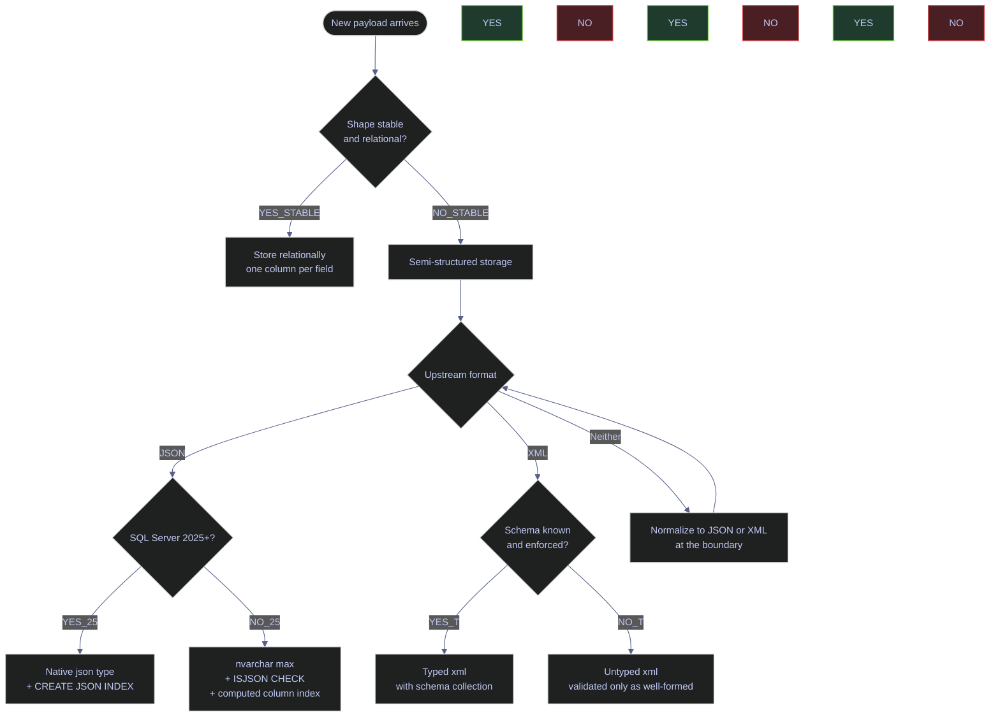
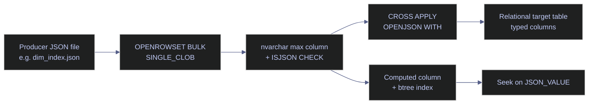
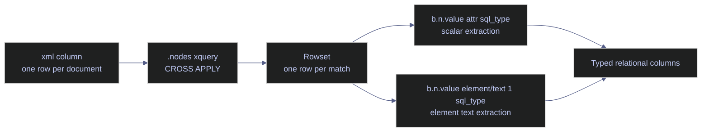

# JSON, XML, and Semi-Structured Data

> [!abstract]- Summary
>
> Semi-structured support in SQL Server splits into two different ecosystems: JSON built around text storage and JSON functions, and the native `xml` type built around XQuery and XML indexing. This note maps both surfaces from ingestion-boundary decisions through validation, extraction, shredding, output generation, and indexing, using live `stoxx` examples on SQL Server 2022 while marking the SQL Server 2025-only native `json` features that are not available on the local engine.
>
> **Decision model**
> - covers when semi-structured storage is justified at all, when JSON is the default, when XML earns its cost, and when stable relational shape should replace both
>
> **JSON storage and query surface**
> - covers `ISJSON`, `JSON_VALUE`, `JSON_QUERY`, `JSON_MODIFY`, `JSON_PATH_EXISTS`, `JSON_OBJECT`, `JSON_ARRAY`, `OPENJSON`, `FOR JSON`, and the SQL Server 2025 native `json` / `CREATE JSON INDEX` additions
>
> **JSON shredding and indexing**
> - covers explicit-schema `OPENJSON`, `AS JSON`, computed-column indexing, and the computed-column rule for SARGable JSON predicates
>
> **XML storage and query surface**
> - covers the `xml` type, typed versus untyped XML, XML schema collections, `.value()`, `.query()`, `.exist()`, `.nodes()`, `.modify()`, namespaces, and `FOR XML`
>
> **XML shredding and indexing**
> - covers `nodes()`-based shredding, XQuery parameterization with `sql:variable()` / `sql:column()`, and primary plus secondary XML indexes
>
> **Comparative guidance**
> - includes a JSON-versus-XML decision matrix plus production patterns for boundary storage, shredding strategy, and audit retention
>
> **Operations and safety**
> - Warnings: `JSON_VALUE` truncates at `nvarchar(4000)`, lax versus strict JSON path mode changes failure behavior, XML paths are parse-time literals, XML indexes are expensive on write-heavy columns, dynamic XQuery construction is an injection risk, and the SQL Server 2025 native `json` features are documented but not live-tested on the local 2022 instance
> - Recommendations: keep semi-structured payloads at the ingestion boundary, default to JSON unless XML contracts or schema validation require otherwise, use computed columns or XML indexes for hot predicates, shred once for high-read workloads, and preserve the original payload when audit demands it

> [!note]- Glossary
>
> **Semi-structured data**
> - Data stored as documents or nested payloads whose internal shape is more flexible than a fixed relational table but still follows some recognizable structure.
> - It matters because the note starts with the decision of whether to store a payload this way at all instead of normalizing it into columns.
>
> > [!warning] Flexibility always has a query tax
> >
> > Semi-structured storage is useful at ingestion boundaries, but every downstream query that must re-parse the document pays a cost that normalized columns would avoid.
>
> ---
>
> **JSON text storage**
> - The SQL Server 2016-2022 pattern of storing JSON documents in `nvarchar(max)` and querying them with JSON functions at read time.
> - It matters because this is the active implementation surface on the local SQL Server 2022 instance that backs the note’s live examples.
>
> > [!warning] Pre-2025 JSON is still text
> >
> > SQL Server understands JSON functions, but the storage is still text until the newer native `json` type arrives. That means parsing cost is paid during query execution.
>
> ---
>
> **Native `json` type**
> - The SQL Server 2025 binary JSON storage type with dedicated JSON indexing support.
> - It matters because the note references it as the newer engine direction while clearly separating it from the 2022-based live demonstrations.
>
> > [!info] Capability depends on engine version
> >
> > The syntax may exist in documentation, but it is not usable on the local SQL Server 2022 environment. Version-specific features need to be treated as documented guidance, not as runnable examples.
>
> ---
>
> **`ISJSON`**
> - The validation function SQL Server uses to test whether a text value is valid JSON, optionally with mode-specific constraints.
> - It matters because boundary validation is the first line of defense before any scalar JSON extraction function is allowed to touch the payload.
>
> > [!warning] Validate at insert, not at failure time
> >
> > If invalid JSON reaches storage unchecked, later `JSON_VALUE` or `OPENJSON` calls turn validation into a runtime failure or silent null behavior inside business queries.
>
> ---
>
> **`JSON_VALUE`**
> - The scalar extraction function that returns a single JSON value from a path as `nvarchar(4000)`.
> - It matters because it is the most common JSON reader in SQL Server and also the source of one of the note’s most important truncation traps.
>
> > [!warning] Long values can disappear into `NULL`
> >
> > `JSON_VALUE` is capped at 4000 characters. Longer scalar values do not come back intact and require a different extraction path such as `OPENJSON WITH (...)`.
>
> ---
>
> **`JSON_QUERY`**
> - The JSON extraction function that returns an object or array fragment rather than a scalar.
> - It matters because nested JSON often needs to be preserved as JSON for later shredding, not flattened immediately into a scalar string.
>
> > [!info] Fragment, not scalar
> >
> > Use `JSON_QUERY` when the output should still be valid JSON. Using `JSON_VALUE` against an object or array is the wrong semantic surface.
>
> ---
>
> **`OPENJSON`**
> - The rowset function that turns JSON objects or arrays into tabular rows and columns, optionally using an explicit schema.
> - It matters because it is the bridge from document storage to relational processing and the normal way to shred JSON for joins, grouping, and indexing.
>
> > [!warning] Explicit schema is the production form
> >
> > The default key-value output is useful for inspection. For stable pipelines, `WITH (...)` gives stronger typing, clearer intent, and better downstream behavior.
>
> ---
>
> **Computed-column JSON index pattern**
> - The design where a JSON property is extracted into a computed column and then indexed with a normal b-tree.
> - It matters because pre-2025 SQL Server has no native JSON index, so hot JSON predicates need this indirection for reliable seek behavior.
>
> > [!warning] Predicate shape must match the indexed expression
> >
> > A JSON property can be indexed indirectly, but the query must line up with the computed expression for the optimizer to use it well. Arbitrary ad hoc JSON predicates remain expensive.
>
> ---
>
> **`xml` data type**
> - The native SQL Server document type that stores XML in parsed binary form and exposes XQuery-based methods.
> - It matters because XML support is deeper and more schema-aware than JSON support, but it comes with a heavier conceptual and indexing model.
>
> > [!info] XML is not just text-with-angle-brackets
> >
> > Unlike pre-2025 JSON storage, the `xml` type is a first-class native type with its own methods, typing rules, and index family.
>
> ---
>
> **Typed XML**
> - XML bound to an XML schema collection so documents are validated against an XSD-defined contract.
> - It matters because typed XML is the main reason to choose XML over JSON when schema validation and richer query semantics are required.
>
> > [!warning] Validation raises the authoring bar
> >
> > Typed XML gives stronger guarantees, but it also makes changes more constrained. Every document must satisfy the schema or fail at insert or update time.
>
> ---
>
> **XQuery**
> - The query language SQL Server uses inside XML methods such as `.value()`, `.query()`, `.exist()`, and `.nodes()`.
> - It matters because XML extraction, filtering, and shredding all depend on XQuery expressions rather than on JSON-style path strings.
>
> > [!warning] Paths are literal code, not data
> >
> > SQL Server parses XQuery expressions as literals at statement compile time. Dynamic path construction is harder, riskier, and subject to injection concerns if handled carelessly.
>
> ---
>
> **`nodes()` shredding**
> - The XML method that returns one row per selected node so the query can project relational columns from each fragment.
> - It matters because it is the standard XML-to-rows bridge that replaces older APIs such as `OPENXML`.
>
> > [!info] One document can become many rows
> >
> > `nodes()` is how XML leaves document form and enters relational processing. Once shredded, the rest of the query can use ordinary joins and aggregates.
>
> ---
>
> **XML index**
> - A specialized primary or secondary index structure built over an `xml` column to accelerate path, value, or property lookups.
> - It matters because XML queries can become impractically slow without the right index support, but those indexes are expensive to maintain.
>
> > [!warning] Read speed trades against write cost
> >
> > XML indexes are often worthwhile on read-heavy payload columns and a mistake on frequently updated ones. The note treats them as workload-specific, not as defaults.
>
> ---
>
> **Boundary store and shred**
> - The architectural pattern of storing the original semi-structured payload at system ingress, validating it, and then extracting typed relational columns for downstream use.
> - It matters because it is the note’s recommended production pattern for high-read workloads that still need the raw payload for audit or replay.
>
> > [!info] Keep the original, query the relational form
> >
> > This pattern preserves auditability without forcing every downstream consumer to pay repeated parsing cost. It is usually the cleanest compromise between fidelity and performance.

## Overview and decision model

Reach for semi-structured storage at an ingestion boundary — where an upstream provider hands you a document whose shape is not yours to normalize — or for genuinely flexible payloads whose schema varies per row. Avoid it for stable relational data where a classic column layout would be faster, smaller, and more index-friendly. The choice between JSON and XML is rarely aesthetic: it is determined by the upstream contract, the tools that will consume the data downstream, and whether you need XQuery's richer query surface and typed validation or the lighter-weight JSON path syntax.



> [!abstract] Three rules that cover most decisions
>
> - **Stable relational shape wins.** If the payload has a fixed set of columns and every row uses them, a classic normalized table is always cheaper to store, cheaper to read, and easier to index than a JSON or XML column.
> - **JSON is the default for new app-facing data.** Modern APIs, event streams, and Python/C# clients speak JSON natively. Use JSON unless the upstream contract is XML.
> - **XML earns its keep when schemas matter.** The `xml` type plus a schema collection gives you validated storage, XQuery's richer query surface, namespaces, and `sql:variable()` binding for parameterized queries — none of which the JSON family has.

### The demo schema used by every example

*Every live example in this note runs against objects in the `demo_jx` schema on `stoxx`, created once by a setup script and left in place for reproducibility.*

#### Listing the demo_jx objects

**When to run:** Any time a reader wants to confirm the setup is in place before running the examples below.
**Trigger:** First execution of this note on a new machine, or after a `DROP SCHEMA` / container rebuild.
**Context:** Read-only T-SQL session. Any login with `CONNECT` on `stoxx` can list the catalog views.
**Purpose:** Confirm the five demo tables and one XML schema collection that back the live examples.

*Enumerate the demo_jx tables and their row counts.*

```sql
SELECT
    t.name AS table_name,
    p.rows AS row_count
FROM sys.tables t
JOIN sys.partitions p
    ON p.object_id = t.object_id AND p.index_id IN (0, 1)
WHERE SCHEMA_NAME(t.schema_id) = 'demo_jx'
ORDER BY t.name;
```

| table_name | row_count |
|---|---|
| daily_bars_xml | 1 |
| indexed_json_events | 7 |
| raw_event_json | 4 |
| raw_event_xml | 4 |
| signals_xml | 1 |

The five tables give every section below a realistic working set: [demo_jx.raw_event_json](#json-storage-and-validation) holds the raw JSON-as-text examples, [demo_jx.indexed_json_events](#indexing-json-data) carries the computed-column + b-tree index demo, [demo_jx.raw_event_xml](#xml-storage-and-typing) holds four untyped XML documents (daily bars, a market-event, a flat signals list, and a namespaced constituents document), and [demo_jx.daily_bars_xml](#xml-shredding-with-nodes) / [demo_jx.signals_xml](#xml-shredding-with-nodes) are the shredding targets.

| Object | Purpose | Source file in `VAULT/data/` |
|---|---|---|
| `demo_jx.raw_event_json` | Boundary-store pattern: `nvarchar(max)` + `ISJSON` CHECK constraint | `dim_index.json` plus inline payloads |
| `demo_jx.indexed_json_events` | Computed-column indexing demo for `JSON_VALUE` lookups | Inline signals payloads |
| `demo_jx.raw_event_xml` | Untyped `xml` bucket for the four distinct XML examples | All four `*.xml` files |
| `demo_jx.daily_bars_xml` | Single-document OHLCV bars, used for `nodes()` shredding | `eurostoxx_daily.xml` |
| `demo_jx.signals_xml` | Single-document flat signals list | `signals_sample.xml` |
| `demo_jx.constituent_collection` | XML schema collection for the typed-XML section | `constituent_schema.xsd` |

## JSON storage and validation

Before extracting a single value, the first question is where the JSON document lives. SQL Server 2016 through 2022 stores JSON as ordinary `nvarchar(max)` text with all parsing paid per query; SQL Server 2025 adds a native binary `json` data type that is parsed once at insert time. On any pre-2025 engine (including the local `stoxx` instance at 16.0.4236.2 / CU23), the pattern is always the same: an `nvarchar(max)` column guarded by a `CHECK (ISJSON(column) = 1)` constraint so invalid documents are rejected at insert time, not discovered by a crashing scalar function three weeks later.

### ISJSON and validity checking

`ISJSON` returns `1` when the input is a valid JSON document, `0` when it is not, and `NULL` when the input itself is `NULL`. Since SQL Server 2022, a second argument narrows the validity check to a specific JSON shape — `OBJECT`, `ARRAY`, `VALUE`, or `SCALAR`. The keyword is unquoted (`ISJSON(@x, OBJECT)`, not `ISJSON(@x, 'OBJECT')`); the string-literal form raises error 1023.

#### ISJSON default mode

**When to run:** As part of a `CHECK` constraint or a validation step at the ingestion boundary, where you want to reject text that is not parseable as an object or array.
**Trigger:** A new JSON-bearing column is being added, or an existing column is being hardened with a new constraint, or a diagnostic query needs to count how many rows in a dirty column are actually valid JSON.
**Context:** Read-only T-SQL; available in every supported SQL Server version since 2016. No permissions beyond `SELECT` on the source column.
**Purpose:** Classify a string as either "valid JSON object or array" (returns 1) or "everything else" (returns 0) — the default mode is the RFC 4627 check, which rejects bare scalars.

*`ISJSON` without a second argument returns 1 only for well-formed objects or arrays; bare scalars return 0 even though they are legal JSON under RFC 8259.*

```sql
SELECT
    ISJSON('{"symbol":"ASML.AS","price":851.45}')  AS valid_object,
    ISJSON('[1,2,3]')                              AS valid_array,
    ISJSON('not json at all')                      AS invalid,
    ISJSON('"scalar"')                             AS scalar_default_mode;
```

| valid_object | valid_array | invalid | scalar_default_mode |
|---|---|---|---|
| 1 | 1 | 0 | 0 |

The fourth column is the important one: `"scalar"` is valid JSON under RFC 8259, but `ISJSON` in default mode rejects it because it conforms to the older RFC 4627 which permits only objects and arrays at the top level. If you need the broader check, pass `VALUE` or `SCALAR` as the second argument.

#### ISJSON with the 2022 type constraint

**When to run:** When you need to validate that a payload is specifically an object, an array, a scalar, or any JSON value — not just any of them.
**Trigger:** A producer claims "this column is always an object", or "the actions key is always an array", and you want a `CHECK` constraint that proves it at insert time.
**Context:** SQL Server 2022 (16.x) or later. Available on Azure SQL and SQL database in Fabric. The second argument is an unquoted keyword — the runtime rejects `'OBJECT'` as a string literal with error 1023.
**Purpose:** Narrow `ISJSON` from "is this any JSON?" to "is this specifically a JSON `OBJECT` / `ARRAY` / `SCALAR` / `VALUE`?".

*The keyword form validates against a specific JSON shape; notice how `true` is a valid `VALUE` and a valid `SCALAR` but not a scalar number — a subtle distinction worth knowing.*

```sql
SELECT
    ISJSON('{"a":1}', OBJECT) AS object_against_object,
    ISJSON('[1,2,3]', OBJECT) AS array_against_object,
    ISJSON('[1,2,3]', ARRAY)  AS array_against_array,
    ISJSON('42',      SCALAR) AS int_scalar,
    ISJSON('"hi"',    SCALAR) AS string_scalar,
    ISJSON('true',    SCALAR) AS bool_scalar,
    ISJSON('true',    VALUE)  AS bool_value,
    ISJSON('null',    VALUE)  AS null_value;
```

| object_against_object | array_against_object | array_against_array | int_scalar | string_scalar | bool_scalar | bool_value | null_value |
|---|---|---|---|---|---|---|---|
| 1 | 0 | 1 | 1 | 1 | 0 | 1 | 1 |

The most surprising result is `ISJSON('true', SCALAR) = 0`: under SQL Server's definition, a scalar is "a number or a string", and the literal `true` is a boolean `VALUE` but not a `SCALAR`. If you want to accept every RFC 8259 value, use `VALUE`; if you want "number or string only", use `SCALAR`; if you want "must be a JSON object", use `OBJECT`.

| Mode | Accepts |
|---|---|
| *(default, omitted)* | A JSON object or array (RFC 4627) |
| `VALUE` | Any JSON value — object, array, number, string, `true`, `false`, or `null` |
| `OBJECT` | A JSON object only (starts with `{`, ends with `}`) |
| `ARRAY` | A JSON array only (starts with `[`, ends with `]`) |
| `SCALAR` | A JSON number or string literal — booleans and null are rejected |

> [!warning] ISJSON(x, 'OBJECT') with string literal raises error 1023
>
> The second argument is a **bare keyword**, not a string literal. Writing `ISJSON(@x, 'OBJECT')` raises error 1023 "Invalid parameter 2 specified for isjson". This is a common refactor mistake when copying the Microsoft docs — the docs spell the modes in uppercase but sometimes show them in quotes.

> [!success] Use the unquoted keyword form
>
> `ISJSON(@x, OBJECT)`, `ISJSON(@x, ARRAY)`, `ISJSON(@x, SCALAR)`, `ISJSON(@x, VALUE)`. No quotes, no prefixes, no schema.

### The nvarchar(max) JSON column pattern

The canonical boundary-store pattern on any pre-2025 SQL Server is a wide `nvarchar(max)` column plus a `CHECK` constraint that calls `ISJSON` on every inserted row. The CHECK runs once per `INSERT` / `UPDATE`, not on every read, so the validation cost is paid at the boundary and the downstream reader can assume every row parses.

#### Auditing the ISJSON CHECK constraints on demo_jx

**When to run:** During a schema review, or before adding a new scalar `JSON_VALUE` lookup — you want to confirm the source column is actually guaranteed valid before wiring a computed column to it.
**Trigger:** A new JSON column is about to be created, or a suspicious row has appeared and you want to confirm whether the constraint is real or aspirational.
**Context:** Read-only query against the `sys.check_constraints` catalog view. No permissions beyond `VIEW DEFINITION` on the objects.
**Purpose:** List every `CHECK` constraint on the `demo_jx` schema and show which ones are calling `ISJSON` — the ones that are actually enforcing validity.

*Every row returned shows a constraint that guarantees the downstream `JSON_VALUE` / `OPENJSON` calls will never see garbage.*

```sql
SELECT
    c.name AS constraint_name,
    OBJECT_SCHEMA_NAME(c.parent_object_id) + '.' + OBJECT_NAME(c.parent_object_id) AS tbl,
    c.definition
FROM sys.check_constraints c
WHERE OBJECT_SCHEMA_NAME(c.parent_object_id) = 'demo_jx'
ORDER BY tbl, constraint_name;
```

| constraint_name | tbl | definition |
|---|---|---|
| ck_indexed_json_valid | demo_jx.indexed_json_events | (isjson([payload])=(1)) |
| ck_raw_event_json_valid | demo_jx.raw_event_json | (isjson([payload])=(1)) |

Both demo tables have the constraint. Any `INSERT` of malformed text into either `payload` column is rejected with error 547 "The INSERT statement conflicted with the CHECK constraint" before the row ever lands.

#### Counting valid vs invalid rows in an already-populated column

**When to run:** On a legacy column that was created without a CHECK constraint — you want to know how many rows would have to be cleaned before the constraint could be added retroactively.
**Trigger:** Planning to add `ALTER TABLE ... ADD CONSTRAINT ... CHECK (ISJSON(payload) = 1)` to an existing table.
**Context:** Read-only. On a 100-million-row table this will be a full scan and can take minutes — run it on an off-peak replica if possible.
**Purpose:** Separate rows that would pass the constraint from rows that would break the `ALTER TABLE` so you can fix the offenders first.

*`CASE` + `ISJSON` gives you a quick valid/invalid histogram without touching the rows themselves.*

```sql
SELECT
    COUNT(*)                                        AS total_rows,
    SUM(CASE WHEN ISJSON(payload) = 1 THEN 1 END)   AS valid_rows,
    SUM(CASE WHEN ISJSON(payload) = 0 THEN 1 END)   AS invalid_rows
FROM demo_jx.raw_event_json;
```

| total_rows | valid_rows | invalid_rows |
|---|---|---|
| 4 | 4 | NULL |

Every row in `demo_jx.raw_event_json` is valid (expected — the CHECK rejects invalid ones). The `NULL` in `invalid_rows` is the conditional-aggregation idiom: `SUM(CASE WHEN ... THEN 1 END)` returns `NULL` when no rows match, not `0`. Use `COALESCE(..., 0)` if you want a zero instead.

#### Previewing the payloads in raw_event_json

**When to run:** At the start of any section that references `demo_jx.raw_event_json` — to remind the reader which four documents are in the table.
**Trigger:** Writing or reviewing a query that reads from the table and wanting to confirm the content.
**Context:** Read-only; no permissions beyond `SELECT`.
**Purpose:** Show the four rows, their source tags, and a truncated preview so the reader can correlate the later `JSON_VALUE` / `OPENJSON` queries with concrete data.

*One row per document, with `LEN()` reporting the full character count and `LEFT(...,60)` showing the first 60 characters of each payload.*

```sql
SELECT event_id, source, LEN(payload) AS payload_chars, LEFT(payload, 60) AS payload_preview
FROM demo_jx.raw_event_json
ORDER BY event_id;
```

| event_id | source | payload_chars | payload_preview |
|---|---|---|---|
| 1 | dim_index_loader | 610 | `[{"index_key":"euro_stoxx_50","display_name":"E` |
| 2 | single_event | 613 | `{"event_id":"evt-2026-03-15-001","type":"index_rebal` |
| 3 | price_tick | 188 | `{"symbol":"ASML.AS","tick_time":"2026-03-31T16:29:57` |
| 4 | price_tick | 208 | `{"symbol":"SAP.DE","tick_time":"2026-03-31T16:29:58.` |

Row 1 is a top-level JSON array (the four index definitions from `dim_index.json`). Row 2 is the single rebalance event used throughout the `JSON_VALUE` / `OPENJSON` examples — it has a nested `$.index` object and a `$.actions` array. Rows 3 and 4 are two price ticks used for the `JSON_VALUE` extraction demos.

### SQL Server 2025 native json data type

SQL Server 2025 (17.x) introduces a **native binary `json` data type** that stores a parsed, compressed representation of the document instead of the raw text. This is the biggest change to the JSON surface since the 2016 scalar functions were added, and it addresses the three structural costs of the text-based pattern: parsing is paid once at insert time, updates via `JSON_MODIFY` can target individual values without rewriting the whole document, and on-disk storage is smaller because the binary form compresses better than UTF-16 text. The type is generally available on Azure SQL Database and Azure SQL Managed Instance (under the "SQL Server 2025" / "Always-up-to-date" update policy) and in preview on SQL Server 2025 (17.x) itself.

> [!info] The native json type is not available on this stoxx instance
>
> `stoxx` runs SQL Server 2022 CU23 (`16.0.4236.2`). The examples in this section are documentation-only — they are not runnable against the local instance. Every other section of this note uses live captures from `stoxx`; this one intentionally does not.

The documentation-level shape of the feature:

```sql
-- SQL Server 2025 / Azure SQL / Fabric only
CREATE TABLE demo_jx.raw_event_json_native
(
    event_id  int IDENTITY(1,1) PRIMARY KEY,
    source    varchar(40) NOT NULL,
    payload   json        NOT NULL
        CHECK (JSON_PATH_EXISTS(payload, '$.symbol') = 1)
);
```

Four things are different from the `nvarchar(max)` pattern:

- **No `ISJSON` CHECK needed** — the `json` type rejects invalid input at assignment time. The `CHECK` constraint above is instead asserting a business rule ("every row must have a `$.symbol` key") using `JSON_PATH_EXISTS`.
- **All existing JSON functions work unchanged.** `JSON_VALUE`, `JSON_QUERY`, `JSON_MODIFY`, `OPENJSON`, `FOR JSON`, `JSON_OBJECT`, `JSON_ARRAY`, `JSON_PATH_EXISTS` all accept `json` transparently.
- **In-place `modify()` method.** SQL Server 2025 adds a `.modify()` method on the `json` type that performs true in-place updates when the new value fits in the existing slot. This is analogous to the `xml` type's `.modify()`.
- **Dedicated JSON index.** `CREATE JSON INDEX` (SQL 2025) lets the optimizer seek into paths without a computed-column intermediary.

> [!tip] Same code, different engine
>
> The Microsoft docs are explicit: "JSON functions work the same whether the JSON document is stored in `varchar`, `nvarchar`, or the native `json` data type". A migration from `nvarchar(max)` to native `json` only requires an `ALTER TABLE ... ALTER COLUMN payload json` — existing `JSON_VALUE`, `OPENJSON`, and `FOR JSON` callers continue to work unchanged. The one caveat is `OPENJSON()` itself: on pre-SQL-Server-2025 platforms it requires an explicit `CAST(payload AS nvarchar(max))` when the source is a `json` column. SQL Server 2025 removes that restriction.

| Capability | `nvarchar(max)` + `ISJSON` | SQL 2025 native `json` |
|---|---|---|
| Parsing cost per read | Per-query, full parse | One-time at insert; reads are O(path) |
| Updates via `JSON_MODIFY` | Rewrites the full document | In-place if value fits |
| Storage footprint | UTF-16 text | Compressed binary (smaller for most real documents) |
| Validity guarantee | `CHECK (ISJSON(payload) = 1)` | Built into the type |
| Indexing | Computed column + b-tree | `CREATE JSON INDEX` (native) |
| Size limit | 2 GB | 2 GB |
| Unique-key limit | — | 32,768 per document |
| Max nesting depth | — | 128 levels |
| Max string value size | 2 GB (inside the document) | 536 870 911 bytes |

## JSON reading functions

Three scalar functions extract data from a JSON text: `JSON_VALUE` returns a single scalar value as `nvarchar(4000)`, `JSON_QUERY` returns a JSON object or array fragment as `nvarchar(max)`, and `JSON_PATH_EXISTS` (SQL 2022+) returns a bit telling you whether a path is present at all. All three take a JSON text in the first argument and a JSON path expression in the second. Paths begin with `$` (the document root), navigate objects with `.key`, and index into arrays with `[n]` (zero-based). The path can be prefixed with `lax` (the default) or `strict` — the choice changes the behavior when a path is missing.

### JSON_VALUE for scalar extraction

#### Extracting scalar fields from a price tick

**When to run:** Any time a small scalar value (a string, number, boolean, date-as-text) needs to be pulled out of a JSON document and materialized as a SQL column in a `SELECT`, `WHERE`, `JOIN`, or `ORDER BY`.
**Trigger:** Building a report that reads from a JSON column, or wiring a computed column for indexing, or filtering on a JSON property.
**Context:** Read-only T-SQL. Available in SQL Server 2016 and later. Returns `nvarchar(4000)` — explicit `CAST` if you need a non-string SQL type.
**Purpose:** Pick out the scalar values inside the `price_tick` payloads (`$.symbol`, `$.last`, `$.tick_time`, `$.volume`) and present them as ordinary columns.

> [!info]- How the path expressions resolve
>
> - `$` — root of the document.
> - `$.symbol` — the `symbol` key at root level.
> - `$.last` — the `last` key at root level (a numeric price).
> - `$.tick_time` — the `tick_time` key, an ISO-8601 string.
> - `$.volume` — the `volume` key, an integer.
>
> `JSON_VALUE` converts every returned value to `nvarchar(4000)` regardless of the underlying JSON type. Numeric comparisons therefore need an explicit cast on the SQL side: `CAST(JSON_VALUE(payload, '$.last') AS decimal(10,2)) > 800`.

*`JSON_VALUE` returns one scalar value per row, per path. Everything is `nvarchar(4000)` until you cast it.*

```sql
SELECT
    event_id,
    source,
    JSON_VALUE(payload, '$.symbol')    AS symbol,
    JSON_VALUE(payload, '$.last')      AS last_price,
    JSON_VALUE(payload, '$.tick_time') AS tick_time,
    JSON_VALUE(payload, '$.volume')    AS volume
FROM demo_jx.raw_event_json
WHERE source = 'price_tick'
ORDER BY event_id;
```

| event_id | source | symbol | last_price | tick_time | volume |
|---|---|---|---|---|---|
| 3 | price_tick | ASML.AS | 851.45 | 2026-03-31T16:29:57.215Z | 14820 |
| 4 | price_tick | SAP.DE | 183.20 | 2026-03-31T16:29:58.112Z | 22410 |

Each extracted column is a `nvarchar(4000)` even though `$.last` is a JSON number and `$.volume` is a JSON integer. For numeric use — an `ORDER BY volume`, a `WHERE last_price > 800` — wrap with an explicit cast.

#### The 4000-character truncation limit

**When to run:** Any time a JSON key might hold a long string (a description, an error message, a dumped exception, a base64 blob) longer than 4000 UTF-16 characters.
**Trigger:** A `JSON_VALUE` call starts returning `NULL` on rows where the key is present and non-null.
**Context:** Read-only demonstration; the underlying limit is a property of `JSON_VALUE`'s return type, not the engine version.
**Purpose:** Prove that `JSON_VALUE` silently returns `NULL` when the matched value exceeds 4000 characters, and show the documented workaround.

*A short value extracts cleanly.*

```sql
DECLARE @doc nvarchar(max) = N'{"description":"ASML quarterly reweight approved"}';
SELECT
    LEN(@doc)                              AS raw_json_len,
    LEN(JSON_VALUE(@doc, '$.description')) AS extracted_len,
    JSON_VALUE(@doc, '$.description')      AS extracted_value;
```

| raw_json_len | extracted_len | extracted_value |
|---|---|---|
| 50 | 32 | ASML quarterly reweight approved |

*A 5000-character value exceeds the 4000-char return limit and silently becomes `NULL` in lax mode.*

```sql
DECLARE @big nvarchar(max) = '{"description":"' + REPLICATE(CAST('x' AS nvarchar(max)), 5000) + '"}';
SELECT LEN(JSON_VALUE(@big, '$.description')) AS extracted_len;
```

| extracted_len |
|---|
| NULL |

> [!danger] JSON_VALUE silently truncates long strings to NULL
>
> `JSON_VALUE` returns `nvarchar(4000)`. If the matched value is longer than 4000 UTF-16 characters, lax mode returns `NULL` and your downstream code has no idea whether the key was missing, the value was literally `null`, or the value was a 4001-character string that overflowed. This bug has cost several hours of debugging in every team that uses JSON columns.

> [!success] Use OPENJSON with nvarchar(max) for long strings
>
> *`OPENJSON WITH` lets you declare the column as `nvarchar(max)`, which has no 4000-character limit.*
>
> ```sql
> DECLARE @big nvarchar(max) = '{"description":"' + REPLICATE(CAST('x' AS nvarchar(max)), 5000) + '"}';
> SELECT LEN(description) AS extracted_len_via_openjson
> FROM OPENJSON(@big)
> WITH (description nvarchar(max) '$.description');
> ```
>
> | extracted_len_via_openjson |
> |---|
> | 5000 |
>
> `OPENJSON WITH ... nvarchar(max)` returns the full value and preserves the 2 GB `nvarchar(max)` capacity.

### JSON_QUERY for object and array extraction

`JSON_QUERY` is the symmetric function for the other half of JSON: it returns an object `{...}` or an array `[...]` as a JSON fragment of type `nvarchar(max)`. Asking `JSON_QUERY` for a scalar returns `NULL`; asking `JSON_VALUE` for an object or array also returns `NULL`. They are deliberately disjoint.

#### Pulling nested objects and arrays from the rebalance event

**When to run:** When you need to forward a JSON sub-document to a client, to another query, or to `OPENJSON` for shredding.
**Trigger:** The path you want points at an object or an array rather than a scalar.
**Context:** Read-only. Available in all supported versions.
**Purpose:** Extract the top-level `$.index` object, the full `$.actions` array, and the first element `$.actions[0]` from the rebalance event.

*`JSON_QUERY` returns the raw fragment text, unparsed.*

```sql
SELECT
    event_id,
    JSON_QUERY(payload, '$.index')      AS index_obj,
    JSON_QUERY(payload, '$.actions')    AS actions_arr,
    JSON_QUERY(payload, '$.actions[0]') AS first_action
FROM demo_jx.raw_event_json
WHERE source = 'single_event';
```

| event_id | index_obj | actions_arr | first_action |
|---|---|---|---|
| 2 | `{"code":"SX5E","name":"Euro Stoxx 50","currency":"EUR"}` | `[{"symbol":"ASML.AS",...},{"symbol":"SAP.DE",...},{"symbol":"MC.PA",...}]` | `{"symbol":"ASML.AS","direction":"up","old_weight":0.0798,"new_weight":0.0812,"reason":"Quarterly reweight"}` |

The `actions_arr` and `index_obj` fragments preserve whatever whitespace the producer included. If the downstream consumer is another `OPENJSON` call or a client that will re-parse the document, that whitespace is irrelevant; if you are writing the fragment into a size-constrained column, strip it first.

#### JSON_VALUE vs JSON_QUERY on the same document

**When to run:** Any time you need to decide which function to reach for, or to diagnose an unexpected `NULL`.
**Trigger:** A `JSON_VALUE` call is returning `NULL` for a path that exists, or a `JSON_QUERY` call is returning `NULL` for a scalar.
**Context:** Read-only, documentation demo.
**Purpose:** Show the exact disjoint behavior of the two functions on a document with both scalar and structured values.

*Flip each path through both functions. Exactly one of the two returns a non-NULL result for each path.*

```sql
DECLARE @doc nvarchar(max) = N'{"a":"[1,2]","b":[1,2],"c":"hi","d":{"k":1}}';
SELECT
    JSON_VALUE(@doc, '$.a') AS a_val,
    JSON_QUERY(@doc, '$.a') AS a_qry,
    JSON_VALUE(@doc, '$.b') AS b_val,
    JSON_QUERY(@doc, '$.b') AS b_qry,
    JSON_VALUE(@doc, '$.c') AS c_val,
    JSON_QUERY(@doc, '$.d') AS d_qry;
```

| a_val | a_qry | b_val | b_qry | c_val | d_qry |
|---|---|---|---|---|---|
| [1,2] | NULL | NULL | [1,2] | hi | {"k":1} |

The trickiest column is `a`: the value is a **string** that happens to look like an array (`"a":"[1,2]"`). `JSON_VALUE` returns the string `[1,2]` because it is a scalar; `JSON_QUERY` returns `NULL` because it is not a real array. The `b` key is the opposite — a real array `[1,2]`, so `JSON_VALUE` returns `NULL` and `JSON_QUERY` returns the array. Use the producer's intent, not the eyeball shape of the value, to pick the function.

### JSON_PATH_EXISTS for existence checks

SQL Server 2022 added `JSON_PATH_EXISTS`, which returns `1` when the path resolves to something and `0` when it does not. It is cheaper than wrapping `JSON_VALUE` or `JSON_QUERY` in an `ISNULL` check because it does not materialize the value.

#### Finding rows that contain a specific path

**When to run:** When the schema of the JSON column is heterogeneous — some rows have a key, others do not — and you want to filter or count by presence alone.
**Trigger:** The payload comes from a polymorphic producer (different event types, different shapes) and you need to route or filter based on which keys are present.
**Context:** Read-only. SQL Server 2022 (16.x) or later.
**Purpose:** For each row in `demo_jx.raw_event_json`, report whether the document contains `$.symbol`, `$.index.code`, or `$.actions`.

*The bit output lets you use the function directly in `WHERE` or `HAVING` clauses without a `NULL` dance.*

```sql
SELECT
    event_id,
    source,
    JSON_PATH_EXISTS(payload, '$.symbol')     AS has_symbol,
    JSON_PATH_EXISTS(payload, '$.index.code') AS has_index_code,
    JSON_PATH_EXISTS(payload, '$.actions')    AS has_actions
FROM demo_jx.raw_event_json
ORDER BY event_id;
```

| event_id | source | has_symbol | has_index_code | has_actions |
|---|---|---|---|---|
| 1 | dim_index_loader | 0 | 0 | 0 |
| 2 | single_event | 0 | 1 | 1 |
| 3 | price_tick | 1 | 0 | 0 |
| 4 | price_tick | 1 | 0 | 0 |

The result is a clean presence matrix: price ticks have `$.symbol`, the single rebalance event has `$.index.code` and `$.actions`, and the `dim_index_loader` row (a top-level JSON array) matches none of the object-rooted paths.

### Lax vs strict path mode

Every JSON path in SQL Server is evaluated in either `lax` mode (the default) or `strict` mode. In `lax`, a missing path returns `NULL`; in `strict`, a missing path raises error 13608 "Property cannot be found on the specified JSON path". The choice is local to each path expression, not a session setting, so you can mix both modes in the same query.

#### Lax mode is the default

**When to run:** When missing keys are an expected part of the polymorphism and you want to present them as SQL `NULL` rather than as a query error.
**Trigger:** A consumer query that reads optional keys and cannot assume every document has them.
**Context:** Read-only demo.
**Purpose:** Show that both the explicit `lax $.price` and the implicit `$.price` return `NULL` when the key is missing.

*Writing `lax` explicitly is equivalent to omitting it — it is the default mode.*

```sql
DECLARE @doc nvarchar(max) = N'{"symbol":"ASML.AS"}';
SELECT
    JSON_VALUE(@doc, '$.price')     AS lax_missing,
    JSON_VALUE(@doc, 'lax $.price') AS lax_explicit;
```

| lax_missing | lax_explicit |
|---|---|
| NULL | NULL |

#### Strict mode raises error 13608 on a missing key

**When to run:** When the producer has sworn every row has a specific key and you want the query to fail loudly if that promise is broken, so the violation surfaces instead of silently materializing as `NULL`.
**Trigger:** Populating a `NOT NULL` downstream column where a missing value is a hard bug, not a data variant.
**Context:** Read-only demo; the error is raised at execution time, not at compile time.
**Purpose:** Prove that the same path under `strict` raises error 13608 so the caller can fail fast.

*`strict` mode turns a missing path into a runtime error instead of a silent `NULL`.*

```sql
DECLARE @doc nvarchar(max) = N'{"symbol":"ASML.AS"}';
SELECT JSON_VALUE(@doc, 'strict $.price') AS strict_missing;
```

```text
('42000', '[42000] [Microsoft][ODBC Driver 18 for SQL Server][SQL Server]Property cannot be found on the specified JSON path. (13608) (SQLExecDirectW)')
```

> [!warning] Lax mode hides missing-key bugs
>
> Lax mode is cheap and convenient, but it cannot distinguish "the key is missing" from "the key is present but its value is `null`". If the difference matters (typical for audit trails, event sourcing, or contract testing), use `strict` mode or check with `JSON_PATH_EXISTS` first.

> [!success] Pair strict with JSON_PATH_EXISTS for precise control
>
> Use `JSON_PATH_EXISTS(payload, '$.key') = 1` in the `WHERE` clause to filter rows where the key is actually present, then use lax `JSON_VALUE` in the `SELECT` list. You get the sharp existence test without the runtime error surface area of strict mode in your projection.

| Mode | Path keyword | Missing path behavior | Typical use |
|---|---|---|---|
| lax | *(default, or `lax`)* | Returns `NULL` | Polymorphic JSON where missing keys are valid |
| strict | `strict` | Raises error 13608 | Contract-stable keys where missing is a bug |

## JSON writing and building

Three families of writers cover most real workloads: `JSON_MODIFY` edits an existing document in place (set, insert, append, delete), `JSON_OBJECT` and `JSON_ARRAY` (SQL 2022+) construct a new document from scalar expressions, and `JSON_OBJECTAGG` / `JSON_ARRAYAGG` (SQL 2025+) aggregate multiple rows into a single JSON object or array.

### JSON_MODIFY

`JSON_MODIFY(doc, path, new_value)` updates the value at `path` and returns the modified document. The default mode (no prefix) sets the value and creates the key if it does not exist; `append $.path` pushes onto an array; setting a value to `NULL` in lax mode deletes the key entirely.

#### Set, add, append, and delete in one shot

**When to run:** When an ingestion step needs to enrich or cleanse an inbound JSON document before storing it.
**Trigger:** A producer sends a mostly-correct document that needs a small mutation (status flag, timestamp, tag list) before it becomes the canonical record.
**Context:** Read-only demo; `JSON_MODIFY` is a pure function that returns the new document — to persist, wrap in `UPDATE ... SET payload = JSON_MODIFY(payload, ...)`.
**Purpose:** Illustrate the four common `JSON_MODIFY` operations (replace, add, append to array, delete) in a single projection.

> [!info]- How each mutation resolves
>
> - `'$.price'` with value `852.00` — replaces the existing `price`. Works because the key exists.
> - `'$.currency'` with value `'EUR'` — adds a new key at the root because `currency` does not exist yet.
> - `'append $.tags'` with value `'primary'` — pushes onto the existing `tags` array.
> - `'$.tags'` set to `NULL` in lax mode — deletes the `tags` key entirely. Strict mode would raise an error instead.

*Four different `JSON_MODIFY` calls, one per projected column, each returning a mutated copy of the same input document.*

```sql
DECLARE @doc nvarchar(max) = N'{"symbol":"ASML.AS","price":851.45,"tags":["rh"]}';
SELECT
    JSON_MODIFY(@doc, '$.price', 852.00)        AS set_price,
    JSON_MODIFY(@doc, '$.currency', 'EUR')      AS add_currency,
    JSON_MODIFY(@doc, 'append $.tags', 'primary') AS append_tag,
    JSON_MODIFY(@doc, '$.tags', NULL)           AS delete_tags_lax;
```

| set_price | add_currency | append_tag | delete_tags_lax |
|---|---|---|---|
| `{"symbol":"ASML.AS","price":852.00,"tags":["rh"]}` | `{"symbol":"ASML.AS","price":851.45,"tags":["rh"],"currency":"EUR"}` | `{"symbol":"ASML.AS","price":851.45,"tags":["rh","primary"]}` | `{"symbol":"ASML.AS","price":851.45}` |

Each column is a complete document — `JSON_MODIFY` never mutates in place on pre-2025 engines; it returns a new `nvarchar(max)` that you assign back to the source column. Chaining is legal: `JSON_MODIFY(JSON_MODIFY(doc, '$.a', 1), '$.b', 2)` applies both mutations.

#### Updating a value inside an array element

**When to run:** When the mutation target is nested inside an array (for example, "update the weight of the first action in the rebalance event").
**Trigger:** Reapplying a correction to a specific element identified by its index in the source document.
**Context:** Read-only demo. Array indexing in `JSON_MODIFY` is zero-based and uses bracket notation.
**Purpose:** Show that `$.actions[0].weight` is a legal path and `JSON_MODIFY` replaces only that single leaf.

*Bracket notation walks into a specific array element, then dot notation picks a key inside it.*

```sql
DECLARE @doc nvarchar(max) = N'{"actions":[{"symbol":"ASML.AS","weight":0.08}]}';
SELECT JSON_MODIFY(@doc, '$.actions[0].weight', 0.0812) AS updated_doc;
```

| updated_doc |
|---|
| `{"actions":[{"symbol":"ASML.AS","weight":0.0812}]}` |

### JSON_OBJECT and JSON_ARRAY

The SQL Server 2022 `JSON_OBJECT` / `JSON_ARRAY` builder functions construct a new JSON document from scalar expressions. They are the inverse of `JSON_VALUE` — instead of picking a scalar out of a document, they assemble a document from scalars. Both respect `NULL ON NULL` (default) or `ABSENT ON NULL` to control whether keys with `NULL` values appear in the output.

#### Building a JSON object per row from relational columns

**When to run:** Any time a downstream consumer wants per-row JSON built from SQL columns — for a REST API response, a message bus payload, or a serialization step.
**Trigger:** A stored procedure or a view needs to return JSON objects instead of columns.
**Context:** SQL Server 2022 and later. Read-only here, but the output of `JSON_OBJECT` can be inserted into a JSON column directly.
**Purpose:** Assemble a JSON object per row from the `symbol`, `sector`, and `beta` columns of `demo_jx.indexed_json_events`, with `ABSENT ON NULL` suppressing the `note` key because it is always `NULL`.

> [!info]- Anatomy of the JSON_OBJECT call
>
> - `JSON_OBJECT( 'key': expr [, ...] )` — colon-separated key/value pairs, each key quoted, each value any SQL expression.
> - `NULL ON NULL` (default) — a `NULL` expression becomes `"key": null` in the output.
> - `ABSENT ON NULL` — a `NULL` expression is omitted entirely from the output.
> - Numeric and boolean expressions are emitted without quotes; strings and dates are quoted.

*`ABSENT ON NULL` keeps the output tidy by suppressing the always-null `note` key.*

```sql
SELECT
    JSON_OBJECT(
        'symbol': symbol,
        'sector': sector,
        'beta':   beta,
        'note':   CAST(NULL AS nvarchar(50)) ABSENT ON NULL
    ) AS doc
FROM demo_jx.indexed_json_events
ORDER BY symbol;
```

| doc |
|---|
| `{"symbol":"ADYEN.AS","sector":"Financials","beta":1.510}` |
| `{"symbol":"ASML.AS","sector":"Information Technology","beta":1.420}` |
| `{"symbol":"MC.PA","sector":"Consumer Discretionary","beta":1.150}` |
| `{"symbol":"NESN.SW","sector":"Consumer Staples","beta":0.520}` |
| `{"symbol":"SAP.DE","sector":"Information Technology","beta":0.980}` |
| `{"symbol":"SIE.DE","sector":"Industrials","beta":1.270}` |
| `{"symbol":"TTE.PA","sector":"Energy","beta":1.230}` |

`JSON_OBJECT` produced one document per row, never emitting the `note` key because the expression is a typed `NULL` and `ABSENT ON NULL` suppresses nulls. If you need the null to appear (for example to signal "this key is explicitly unset"), use the default `NULL ON NULL` or omit the clause.

#### Constructing a simple JSON array from literals

**When to run:** Any time a downstream projection needs a small constant array inside a larger query.
**Trigger:** Building a dimension table of tags, regions, or option lists that feeds into a report or an API.
**Context:** SQL Server 2022 and later.
**Purpose:** Show the compact `JSON_ARRAY` call that takes a list of expressions and returns a single JSON array literal.

*`JSON_ARRAY` takes a variadic list of values and wraps them in `[...]`.*

```sql
SELECT JSON_ARRAY('EU','US','APAC','OIL') AS regions_array;
```

| regions_array |
|---|
| ["EU","US","APAC","OIL"] |

### JSON_OBJECTAGG and JSON_ARRAYAGG (SQL 2025)

`JSON_OBJECTAGG` and `JSON_ARRAYAGG` are **SQL Server 2025** aggregate functions that build a JSON object or array from the rows of a group. They are the SQL-side equivalent of `collect_set` / `collect_list` in Spark or `json_agg` in PostgreSQL. Neither function exists on SQL Server 2022 — calling them on `stoxx` raises error 195 "not a recognized built-in function name".

#### JSON_ARRAYAGG on SQL 2022 raises error 195

**When to run:** Never on SQL 2022 — the call fails. This cell is kept to make the version boundary explicit.
**Trigger:** A reader copies an aggregation pattern from the SQL 2025 docs and tries it on an older engine.
**Context:** SQL 2025 only. Error 195 on anything older.
**Purpose:** Document the exact error so it is unambiguous which version the function requires.

*Calling a SQL 2025 function on a 2022 engine surfaces as "not a recognized built-in function name".*

```sql
SELECT JSON_ARRAYAGG(symbol) AS members
FROM demo_jx.indexed_json_events;
```

```text
('42000', "[42000] [Microsoft][ODBC Driver 18 for SQL Server][SQL Server]'JSON_ARRAYAGG' is not a recognized built-in function name. (195) (SQLExecDirectW)")
```

> [!bug] JSON_ARRAYAGG / JSON_OBJECTAGG require SQL Server 2025
>
> The Microsoft documentation page lists `JSON_ARRAYAGG` and `JSON_OBJECTAGG` under JSON functions with no explicit version applicability, which can mislead readers. Both functions are **SQL Server 2025** additions and are not available on any earlier version. Attempting to call them on SQL Server 2022 or earlier raises error 195.

> [!success] Equivalent pattern on SQL 2022 using STRING_AGG
>
> *`STRING_AGG` with `WITHIN GROUP (ORDER BY ...)` and a manual `[...]` wrap produces the same JSON array on SQL 2022.*
>
> ```sql
> SELECT
>     sector,
>     COUNT(*) AS n,
>     '["' + STRING_AGG(symbol, '","') WITHIN GROUP (ORDER BY symbol) + '"]' AS members
> FROM demo_jx.indexed_json_events
> GROUP BY sector
> ORDER BY n DESC, sector;
> ```
>
> | sector | n | members |
> |---|---|---|
> | Information Technology | 2 | ["ASML.AS","SAP.DE"] |
> | Consumer Discretionary | 1 | ["MC.PA"] |
> | Consumer Staples | 1 | ["NESN.SW"] |
> | Energy | 1 | ["TTE.PA"] |
> | Financials | 1 | ["ADYEN.AS"] |
> | Industrials | 1 | ["SIE.DE"] |
>
> The pattern handles the ordering through `WITHIN GROUP` and the quoting through the separator string. It does not handle strings that contain literal double quotes — for that, escape with `REPLACE(symbol, '"', '\"')` first, or wait for SQL 2025.

## OPENJSON for shredding to rows

`OPENJSON` is a **table-valued function** that parses a JSON text and returns one row per element. In default mode (no `WITH` clause) it emits three columns — `key`, `value`, and `type` — which is useful for dynamic introspection but rarely what you want for production. With an explicit `WITH (...)` clause it behaves like a strongly typed projection: one column per key, each with an explicit SQL type and an optional JSON path. The `AS JSON` flag on a column definition switches a column from "return scalar" to "return JSON fragment" — the same distinction as `JSON_VALUE` vs `JSON_QUERY`.

### Default schema (key, value, type)

#### OPENJSON over a JSON array returns numeric keys

**When to run:** Rarely in production — this is an introspection mode most useful for ad-hoc "what's in this document" queries at the SSMS prompt.
**Trigger:** Debugging an unfamiliar JSON document, or writing a generic tool that does not know the shape in advance.
**Context:** Read-only.
**Purpose:** Show the default shape for a JSON array — keys become the zero-based array indices, types are the `OPENJSON` type enum.

*For a JSON array, the default schema emits the index as `key`, the element as `value`, and the enum type.*

```sql
DECLARE @doc nvarchar(max) = N'["SX5E","SPX","STOXX50","OIL20"]';
SELECT [key], [value], [type] FROM OPENJSON(@doc);
```

| key | value | type |
|---|---|---|
| 0 | SX5E | 1 |
| 1 | SPX | 1 |
| 2 | STOXX50 | 1 |
| 3 | OIL20 | 1 |

Every element is a string, so `type` is `1` (string) for every row. The `key` column is `varchar` even though the index is numeric — cast it if you need an integer.

#### OPENJSON over a JSON object returns the enum-typed values

**When to run:** When the input is a JSON object whose keys you do not know up front, and you want one row per top-level key.
**Trigger:** Validating or introspecting a polymorphic document.
**Context:** Read-only.
**Purpose:** Show every distinct value of the `type` enum: string, number, boolean, null, array, and object.

*The seven rows cover all six values of the OPENJSON type enum.*

```sql
DECLARE @doc nvarchar(max) = N'{
  "str":"abc",
  "num":3.14,
  "b_true":true,
  "b_false":false,
  "nothing":null,
  "arr":[1,2],
  "obj":{"k":1}
}';
SELECT [key], [value], [type] FROM OPENJSON(@doc);
```

| key | value | type |
|---|---|---|
| str | abc | 1 |
| num | 3.14 | 2 |
| b_true | true | 3 |
| b_false | false | 3 |
| nothing | NULL | 0 |
| arr | [1,2] | 4 |
| obj | {"k":1} | 5 |

The `type` column is a small integer enum with exactly six values. Every consumer of default-mode `OPENJSON` must know this table:

| `type` value | JSON type | Example value | Notes |
|---|---|---|---|
| `0` | `null` | `NULL` | SQL-side `NULL` for both JSON `null` and a missing value |
| `1` | string | `"abc"` | Quotes are stripped from the `value` column |
| `2` | number | `3.14` | Integers and floats are both type 2 |
| `3` | `true` / `false` | `true` | Value column holds the literal `true` / `false` text |
| `4` | array | `[1,2]` | The full JSON array text, still quoted as JSON |
| `5` | object | `{"k":1}` | The full JSON object text |

### OPENJSON WITH explicit schema

#### Typed projection of a JSON array of objects

**When to run:** Any time the input has a known shape and you want a strongly typed rowset to flow into a join, `INSERT`, or `SELECT` list.
**Trigger:** An ingestion step that reads a JSON array and pushes it into a relational table.
**Context:** Read-only demo; the same pattern appears in `INSERT INTO target SELECT ... FROM OPENJSON(@doc) WITH (...)`.
**Purpose:** Show the canonical `OPENJSON WITH (...)` form — one column per field, each with its SQL type and optional JSON path.

> [!info]- How the WITH clause resolves
>
> - `symbol varchar(20) '$.symbol'` — declares a `varchar(20)` column named `symbol` whose value comes from the `$.symbol` path of each element in the input array.
> - The path is optional; if omitted, the column name is matched case-sensitively against the top-level JSON key.
> - The types declared here are real SQL types, not "return `nvarchar(4000)` and cast later" — use `int`, `decimal(10,2)`, `datetime2(3)`, `bit`, etc. as needed.

*The `WITH` clause converts each array element into one typed row.*

```sql
DECLARE @doc nvarchar(max) = N'[
  {"symbol":"SX5E","region":"EU","currency":"EUR"},
  {"symbol":"SPX","region":"US","currency":"USD"},
  {"symbol":"STOXX50","region":"APAC","currency":"JPY"}
]';
SELECT symbol, region, currency
FROM OPENJSON(@doc)
WITH (
    symbol   varchar(20) '$.symbol',
    region   varchar(10) '$.region',
    currency varchar(3)  '$.currency'
)
ORDER BY symbol;
```

| symbol | region | currency |
|---|---|---|
| SPX | US | USD |
| STOXX50 | APAC | JPY |
| SX5E | EU | EUR |

The result is indistinguishable from a regular `SELECT` against a real three-column table, and can be used anywhere a rowset can be used.

#### Strict mode on a missing WITH column raises error 13608

**When to run:** When you want the shredding step to fail fast if a required key is missing from any row.
**Trigger:** Ingestion of a contract-stable payload where a missing key indicates upstream bug.
**Context:** Read-only demo; the same error also comes from bare `JSON_VALUE(..., 'strict $.x')`.
**Purpose:** Prove that `strict` prefix on a `WITH` column path turns "missing" into a hard error.

*A `WITH` clause column with `strict` prefix raises error 13608 on the first row that lacks the key.*

```sql
DECLARE @doc nvarchar(max) = N'[{"symbol":"ASML.AS"}]';
SELECT *
FROM OPENJSON(@doc)
WITH (
    symbol varchar(20)    'strict $.symbol',
    price  decimal(10,2)  'strict $.price'
);
```

```text
('42000', '[42000] [Microsoft][ODBC Driver 18 for SQL Server][SQL Server]Property cannot be found on the specified JSON path. (13608) (SQLExecDirectW)')
```

### AS JSON for nested objects and arrays

#### Pulling a nested object and a nested array as JSON fragments

**When to run:** When the result set should include raw sub-documents that will be re-parsed by the next pipeline step or returned to the caller as-is.
**Trigger:** A caller needs both scalar columns and complete sub-documents in one query.
**Context:** Read-only. `AS JSON` columns must be declared `nvarchar(max)`; any other type raises a compile-time error.
**Purpose:** Show the `AS JSON` flag that makes an `OPENJSON WITH` column return a JSON fragment instead of a scalar.

*Without `AS JSON`, these columns would return `NULL` because the target paths are an object and an array, not scalars.*

```sql
DECLARE @doc nvarchar(max) = (SELECT payload FROM demo_jx.raw_event_json WHERE source = 'single_event');
SELECT index_obj, actions_arr
FROM OPENJSON(@doc)
WITH (
    index_obj   nvarchar(max) '$.index'   AS JSON,
    actions_arr nvarchar(max) '$.actions' AS JSON
);
```

| index_obj | actions_arr |
|---|---|
| `{"code":"SX5E","name":"Euro Stoxx 50","currency":"EUR"}` | `[{"symbol":"ASML.AS","direction":"up",...},{"symbol":"SAP.DE",...},{"symbol":"MC.PA",...}]` |

Without the `AS JSON` flag, both columns would be `NULL` — `OPENJSON` would try to interpret them as scalars, fail (because they are object and array), and return `NULL` in lax mode.

### CROSS APPLY OPENJSON for nested shredding

The most common real-world pattern is a document with a top-level object plus an array of sub-objects, where you want one relational row per sub-object plus the parent columns joined in. `CROSS APPLY OPENJSON` handles this cleanly: the outer query holds the parent row and the `APPLY` shreds the array.

#### Shredding the actions array of the rebalance event

**When to run:** Ingesting an event document whose payload contains a nested array of items that should become their own rows.
**Trigger:** Classic header/detail ingestion pattern — one event, many actions.
**Context:** Read-only demo. `OPENJSON(@doc, '$.actions')` anchors at the array and iterates each element.
**Purpose:** Flatten the rebalance event into one row per action, carrying the index code from the parent object on every row.

> [!info]- How the CROSS APPLY shreds
>
> - `OPENJSON(@doc, '$.actions')` takes a second argument that anchors the rowset at the `$.actions` array.
> - The `WITH` clause types each field of each action element.
> - `JSON_VALUE(@doc, '$.index.code')` repeats the parent's index code on every shredded row — that is the "join" to the header.
> - The alias `a` makes the shredded columns available to the `ORDER BY`.

*Every row in the output is one action, annotated with the parent index code.*

```sql
DECLARE @doc nvarchar(max) = (SELECT payload FROM demo_jx.raw_event_json WHERE source = 'single_event');
SELECT
    JSON_VALUE(@doc, '$.index.code') AS index_code,
    a.symbol,
    a.direction,
    a.old_weight,
    a.new_weight,
    a.reason
FROM OPENJSON(@doc, '$.actions')
WITH (
    symbol     varchar(20)   '$.symbol',
    direction  varchar(10)   '$.direction',
    old_weight decimal(10,4) '$.old_weight',
    new_weight decimal(10,4) '$.new_weight',
    reason     varchar(60)   '$.reason'
) AS a
ORDER BY a.symbol;
```

| index_code | symbol | direction | old_weight | new_weight | reason |
|---|---|---|---|---|---|
| SX5E | ASML.AS | up | 0.0798 | 0.0812 | Quarterly reweight |
| SX5E | MC.PA | up | 0.0562 | 0.0591 | Free float adjustment |
| SX5E | SAP.DE | down | 0.0681 | 0.0654 | Quarterly reweight |

Three actions became three rows, each carrying the index code from the parent object. This is the canonical pattern for inserting into a relational target: `INSERT INTO rebalance_action SELECT ... FROM OPENJSON(@doc, '$.actions') WITH (...)`.



## FOR JSON output

`FOR JSON` is the mirror image of `OPENJSON`: it serializes a rowset into a JSON document. Two modes exist — `PATH` (deterministic, driven by column aliases) and `AUTO` (heuristic, driven by the table order in the `SELECT` statement). `PATH` is the production default because the output is predictable and controllable; `AUTO` is best for quick exploratory queries.

### FOR JSON PATH

#### Controlled nested output with PATH mode

**When to run:** When a stored procedure or a view has to return JSON with a specific shape — nested objects, particular key names, optional root element.
**Trigger:** Building a REST-style endpoint or a message bus payload from relational columns.
**Context:** Read-only. `FOR JSON` always wraps the output in an array unless `WITHOUT_ARRAY_WRAPPER` is specified.
**Purpose:** Project the most recent Euro Stoxx 50 daily performance row as a nested object, with the index code at the top level and a nested `metrics` object holding `date`, `return`, and `vol30`.

> [!info]- How FOR JSON PATH uses column aliases
>
> - Column aliases with dots create nested objects: `[metrics.return]` means "a key `metrics` at the root, containing a key `return`".
> - `ROOT('latest')` wraps the result array under a top-level key `latest`.
> - `INCLUDE_NULL_VALUES` forces null columns to appear as `"key": null` rather than being omitted.
> - The scientific notation in the output (`-7.931421...e-003`) is how `float` values serialize — cast to `decimal(18,6)` if you want fixed-point output.

*Dot-separated aliases create nested objects, `ROOT` names the top-level wrapper, `INCLUDE_NULL_VALUES` preserves explicit nulls.*

```sql
SELECT
    e._index                  AS [index],
    e.perf_date               AS [metrics.date],
    e.daily_return            AS [metrics.return],
    e.rolling_30d_volatility  AS [metrics.vol30]
FROM gold.index_performance e
WHERE e._index = 'euro_stoxx_50'
  AND e.perf_date = (
      SELECT MAX(perf_date) FROM gold.index_performance WHERE _index = 'euro_stoxx_50'
  )
FOR JSON PATH, ROOT('latest'), INCLUDE_NULL_VALUES;
```

| JSON_F52E2B61-18A1-11d1-B105-00805F49916B |
|---|
| `{"latest":[{"index":"euro_stoxx_50","metrics":{"date":"2026-04-07","return":-7.931421147725841e-003,"vol30":2.092200078512519e-001}}]}` |

The outer `latest` object wraps the array (single element here), and inside it the `metrics` object groups the date and the two performance metrics. The `float` serialization is exponential — a cast to `decimal(18,6)` in the `SELECT` list would yield `{"return":-0.007931, ...}` if that is more readable for the consumer.

#### WITHOUT_ARRAY_WRAPPER for a single-row object

**When to run:** When you want a single JSON object, not an array containing one object.
**Trigger:** A single-row query whose consumer expects `{...}` rather than `[{...}]`.
**Context:** Read-only. The option is safe on single-row results and dangerous on multi-row results — without the wrapper, multiple rows produce concatenated invalid JSON.
**Purpose:** Produce a bare JSON object from a one-row `SELECT` with dot-separated aliases.

*Without the wrapper, the single row collapses to a bare object literal.*

```sql
SELECT 2026 AS [asof.year], 3 AS [asof.month], 'SX5E' AS [code]
FOR JSON PATH, WITHOUT_ARRAY_WRAPPER;
```

| JSON_F52E2B61-18A1-11d1-B105-00805F49916B |
|---|
| `{"asof":{"year":2026,"month":3},"code":"SX5E"}` |

> [!warning] WITHOUT_ARRAY_WRAPPER on a multi-row result produces invalid JSON
>
> `FOR JSON PATH, WITHOUT_ARRAY_WRAPPER` will still run on a multi-row result, but the output is a sequence of object literals concatenated with no separator — **not valid JSON**. If the query ever returns more than one row, the consumer will fail to parse.

> [!success] Keep the wrapper or enforce TOP 1
>
> Leave the wrapper in place and accept `[...]` for single-row results, or force the single-row invariant with `TOP 1` and `ORDER BY` so the shape is stable. The wrapper is cheap; the silent-invalid-JSON trap is not.

#### INCLUDE_NULL_VALUES shows explicit nulls

**When to run:** When a downstream consumer needs to distinguish "key is missing" from "key is explicitly null".
**Trigger:** An API contract that requires null keys to be present (common in strongly typed languages that deserialize to a class with nullable fields).
**Context:** Read-only.
**Purpose:** Show the effect of `INCLUDE_NULL_VALUES` on a row with a genuinely null column.

*Without `INCLUDE_NULL_VALUES`, the `currency` key would be omitted; with it, the key appears with a literal null value.*

```sql
SELECT
    'ASML.AS' AS symbol,
    CAST(NULL AS varchar(5)) AS currency,
    851.45 AS price
FOR JSON PATH, INCLUDE_NULL_VALUES;
```

| JSON_F52E2B61-18A1-11d1-B105-00805F49916B |
|---|
| `[{"symbol":"ASML.AS","currency":null,"price":851.45}]` |

### FOR JSON AUTO

`FOR JSON AUTO` derives the shape of the output from the join tree of the `SELECT` statement: each table contributes a nesting level, each column contributes a key. It is less predictable than `PATH` and is best reserved for quick exploratory queries, not production endpoints.

#### FOR JSON AUTO nests by table

**When to run:** On an ad-hoc exploratory query where you want JSON out quickly and do not care about the exact shape.
**Trigger:** A spike or a prototype where the shape will be iterated before it ships.
**Context:** Read-only. In AUTO mode the nesting is driven by the table order in the `FROM` / `JOIN` tree.
**Purpose:** Show how `FOR JSON AUTO` nests the `signals_daily` columns under the parent `index_dim` row — the single parent row has a nested array of its signal measurements.

*The two-table join produces one parent object with a nested `s` array for the `signals_daily` columns.*

```sql
SELECT TOP 3
    d.symbol,
    d.sector,
    s.forward_pe,
    s.beta
FROM silver.signals_daily s
JOIN silver.index_dim d
    ON d.symbol = s.symbol AND d.is_current = 1
ORDER BY s.market_cap DESC
FOR JSON AUTO;
```

| JSON_F52E2B61-18A1-11d1-B105-00805F49916B |
|---|
| `[{"symbol":"7203.T","sector":"Consumer Cyclical","s":[{"forward_pe":1.085682600000000e+001,"beta":1.950000000000000e-001},{"forward_pe":1.084140400000000e+001,"beta":1.950000000000000e-001},{"forward_pe":1.069335650000000e+001,"beta":1.950000000000000e-001}]}] |

The parent table (`d` with alias `index_dim`) contributes the top-level `symbol` / `sector` object; the child table (`s` with alias `signals_daily`) contributes a nested `s` array. Notice the array alias is taken from the **SQL alias** of the child table, not the actual table name — swap the alias and the key name changes. This is exactly why `PATH` is preferred for production: `AUTO`'s output shape is a function of aliasing decisions that can change during routine refactors.

| Option | Effect |
|---|---|
| `FOR JSON PATH` | Shape is driven by column aliases; fully controllable |
| `FOR JSON AUTO` | Shape is driven by join tree; fast for exploration |
| `ROOT('name')` | Wraps the result array in `{"name": [...]}` |
| `INCLUDE_NULL_VALUES` | Emits `"key": null` for null columns instead of omitting them |
| `WITHOUT_ARRAY_WRAPPER` | Drops the outer `[...]`. Safe only for single-row results |
| `FOR JSON ... PATH, ROOT, INCLUDE_NULL_VALUES` | Options can be combined; no particular order required |

## Indexing JSON data

The `nvarchar(max)` JSON pattern cannot be indexed directly — a b-tree can only key on a typed column — so the canonical indexing strategy on SQL 2016 through 2022 is a **persisted computed column** that projects a single JSON value into a typed column, then a normal b-tree index on that computed column. SQL Server 2025 adds `CREATE JSON INDEX` which removes the computed-column intermediary, but the computed-column pattern still works everywhere.

### The computed column + b-tree index pattern

*`demo_jx.indexed_json_events` was built this way: the `payload` column holds the raw JSON, and three persisted computed columns (`symbol`, `sector`, `beta`) project the most common lookup keys, each backed by a normal index.*

#### Listing the indexes on indexed_json_events

**When to run:** As part of a schema review, or after adding a new computed column, to confirm the indexes are in place.
**Trigger:** Verifying the expected indexes exist before running a performance test.
**Context:** Read-only. Uses `sys.indexes` + `sys.index_columns` + `sys.columns` joined by object id.
**Purpose:** Enumerate every index on `demo_jx.indexed_json_events` with its type and key columns.

*The primary key and two JSON-backed indexes are visible — each nonclustered index is keyed on a computed column whose expression is a `JSON_VALUE` call.*

```sql
SELECT
    i.name AS index_name,
    i.type_desc,
    STUFF((
        SELECT ', ' + c.name
        FROM sys.index_columns ic
        JOIN sys.columns c
            ON c.object_id = ic.object_id AND c.column_id = ic.column_id
        WHERE ic.object_id = i.object_id
          AND ic.index_id = i.index_id
          AND ic.is_included_column = 0
        ORDER BY ic.key_ordinal
        FOR XML PATH('')
    ), 1, 2, '') AS key_cols
FROM sys.indexes i
WHERE i.object_id = OBJECT_ID('demo_jx.indexed_json_events')
  AND i.is_hypothetical = 0
ORDER BY i.index_id;
```

| index_name | type_desc | key_cols |
|---|---|---|
| PK__indexed___2370F7271F8E1B33 | CLUSTERED | event_id |
| ix_indexed_json_events_symbol | NONCLUSTERED | symbol |
| ix_indexed_json_events_sector | NONCLUSTERED | sector |

Two nonclustered indexes — one on the computed `symbol` column, one on the computed `sector` column — plus the clustered PK on `event_id`. The `symbol` column's definition is `AS JSON_VALUE(payload, '$.symbol') PERSISTED`, so a `WHERE symbol = 'ASML.AS'` predicate becomes a simple index seek without ever touching `JSON_VALUE` at query time. This is the inverse of the next subsection's sargability trap.

#### Looking up a symbol via the indexed computed column

**When to run:** The normal production lookup pattern — a user of the table filters on a JSON key and expects an index seek.
**Trigger:** An API endpoint or a report that reads the payload filtered on one scalar property.
**Context:** Read-only. The `WHERE symbol = ...` predicate is resolvable against `ix_indexed_json_events_symbol` because `symbol` is a real column (computed + persisted).
**Purpose:** Execute the production lookup against the indexed column.

*Filter on the computed column directly; the plan uses an index seek.*

```sql
SELECT symbol, sector, beta
FROM demo_jx.indexed_json_events
WHERE symbol = 'ASML.AS';
```

| symbol | sector | beta |
|---|---|---|
| ASML.AS | Information Technology | 1.420 |

The row returns from `ix_indexed_json_events_symbol`, not from the base table's payload scan. Because the computed column is `PERSISTED`, the `WHERE` predicate is a plain column comparison — sargable, fast, stable.

#### Aggregating on a computed column

**When to run:** When a report groups by a JSON-derived category.
**Trigger:** "Count of constituents per sector" style reports where the sector lives inside the JSON payload.
**Context:** Read-only. The `GROUP BY` on a persisted computed column is as fast as a `GROUP BY` on a real column.
**Purpose:** Show that a `GROUP BY sector` works against the persisted `sector` column and benefits from `ix_indexed_json_events_sector`, which includes `beta` so the query is covered.

*Both `sector` and `beta` are persisted computed columns — the `GROUP BY` and `AVG` both read directly from the b-tree, never touching `JSON_VALUE` at query time.*

```sql
SELECT sector, COUNT(*) AS n, AVG(beta) AS avg_beta
FROM demo_jx.indexed_json_events
GROUP BY sector
ORDER BY sector;
```

| sector | n | avg_beta |
|---|---|---|
| Consumer Discretionary | 1 | 1.150000 |
| Consumer Staples | 1 | 0.520000 |
| Energy | 1 | 1.230000 |
| Financials | 1 | 1.510000 |
| Industrials | 1 | 1.270000 |
| Information Technology | 2 | 1.200000 |

### Sargability: the computed column makes the difference

The point of the computed column is that it lets the optimizer resolve a JSON-derived predicate to a real column comparison. Writing `WHERE JSON_VALUE(payload, '$.symbol') = 'ASML.AS'` on the same table works — but it will not use the index unless SQL Server can match the `JSON_VALUE` expression against the computed column's definition (which it usually can, on SQL 2016 and later). The safer habit is to always filter against the computed column itself, not against the `JSON_VALUE` call.

#### Non-sargable lookup via JSON_VALUE on payload

**When to run:** The anti-pattern — never intentionally in production, but often by mistake when a query is copied from a legacy system or refactored from a literal JSON path to a column name and back.
**Trigger:** A new developer writes the "obvious" filter on the raw payload.
**Context:** Read-only demo. The correct result still comes back — the issue is the plan, not the row.
**Purpose:** Show the query that bypasses the computed column.

*`WHERE JSON_VALUE(payload, '$.symbol') = 'ASML.AS'` should always match the computed column — but when it does not (on older CUs, with different cast types, or with a computed column that is not `PERSISTED`), the optimizer falls back to a full scan.*

```sql
SELECT COUNT(*) AS matched
FROM demo_jx.indexed_json_events
WHERE JSON_VALUE(payload, '$.symbol') = 'ASML.AS';
```

| matched |
|---|
| 1 |

*`WHERE symbol = 'ASML.AS'` is the sargable form — always, on every version.*

```sql
SELECT COUNT(*) AS matched
FROM demo_jx.indexed_json_events
WHERE symbol = 'ASML.AS';
```

| matched |
|---|
| 1 |

> [!tip] Always filter against the computed column name
>
> The two forms return the same row on SQL 2016+, but only the second is guaranteed to produce an index seek plan across every version and every CAST/collation combination. Making the computed column the official filter surface also documents intent — a reader sees a column name, not a path expression.

> [!info] SQL Server 2025 adds CREATE JSON INDEX
>
> `CREATE JSON INDEX` on a native `json` column indexes one or more paths directly, without the computed-column intermediary. The syntax is documented under [CREATE JSON INDEX](https://learn.microsoft.com/sql/t-sql/statements/create-json-index-transact-sql?view=sql-server-ver17). The computed-column pattern continues to work on the native `json` type as well, so a migration does not need to rewrite every index on day one.

## XML storage and typing

SQL Server's `xml` data type is a first-class type, not a text column with helper functions. Every `xml` value must be **well-formed** — the engine rejects malformed input at assignment time — and the type supports five XQuery methods (`.value()`, `.query()`, `.exist()`, `.nodes()`, `.modify()`) built directly into the type system. `xml` columns can optionally be **typed** against an XML schema collection (`XSD`), which turns the well-formedness check into a full schema validation and enables storage optimizations based on the declared types.

### Untyped xml: well-formed only

An untyped `xml` column accepts any well-formed XML document or fragment. It is the right choice when the producer's schema is unknown, unstable, or simply not formalized — which is most real workloads.

#### Inspecting the untyped xml column in raw_event_xml

**When to run:** At the start of any XML section, to confirm the source documents and their approximate sizes.
**Trigger:** First query against the table, or a review of its storage footprint.
**Context:** Read-only. `DATALENGTH(payload)` returns the number of bytes the binary XML representation occupies; `LEN(CAST(payload AS nvarchar(max)))` returns the character count of the serialized form.
**Purpose:** Show that XML storage is binary, that the stored byte count is usually smaller than the serialized text character count (because SQL Server tokenizes element/attribute names), and that the four demo documents are wildly different sizes.

*`DATALENGTH` shows the tokenized binary bytes; `LEN` of the cast-to-text form shows what the round-tripped string looks like.*

```sql
SELECT TOP 5
    xml_id,
    source,
    DATALENGTH(payload)                 AS xml_bytes,
    LEN(CAST(payload AS nvarchar(max))) AS xml_text_chars
FROM demo_jx.raw_event_xml
ORDER BY xml_bytes DESC;
```

| xml_id | source | xml_bytes | xml_text_chars |
|---|---|---|---|
| 3 | signals_sample | 1684 | 2336 |
| 4 | constituents_namespaced | 1621 | 1500 |
| 1 | eurostoxx_daily | 1259 | 1000 |
| 2 | market_event | 824 | 655 |

For `signals_sample` the binary bytes (1684) are smaller than the text character count (2336) — SQL Server stored every `<signal>` / `<symbol>` tag once and referenced it numerically. For `constituents_namespaced` the binary is actually larger than the text: the namespace declarations cost extra bytes in the binary form. Neither pattern is a bug — the trade-off is visible and the typical outcome is "binary is smaller when there is a lot of repetition in the tag structure".

> [!warning] The XML prolog breaks parameterized inserts
>
> Pushing XML through an `nvarchar` parameter that includes a `<?xml version="1.0" encoding="UTF-8"?>` prolog raises error 9402 "unable to switch the encoding". The parameter arrives as UTF-16 from the ODBC driver; the prolog's `encoding="UTF-8"` declaration is then inconsistent with the actual encoding on the wire.

> [!success] Strip the prolog before insertion
>
> Remove the `<?xml ... ?>` prolog from the string before passing it as a parameter — SQL Server infers the encoding from the UTF-16 stream. The setup script for this note's demo tables uses a `read_xml_stripped` helper that does exactly that. If the source is a file read via `OPENROWSET(BULK 'path', SINGLE_BLOB)` instead, the prolog is handled correctly because the engine reads raw bytes.

### Typed xml with an XML schema collection

Binding an `xml` column to an XML schema collection makes it **typed XML**. The engine validates every inserted document against the schemas in the collection, rejects non-conforming data, and uses the declared types to store values more compactly and to execute XQuery faster. The schema collection is a first-class database object — created once, bound to many columns.

#### Inspecting the demo_jx.constituent_collection schema collection

**When to run:** When you need to confirm that a typed-xml column's schema collection exists and what namespaces it covers.
**Trigger:** Reviewing or writing code that assigns to a typed xml column.
**Context:** Read-only. `sys.xml_schema_collections` plus `xml_schema_namespaces` give the collection metadata.
**Purpose:** List the schema collection(s) in `demo_jx` and their declared namespaces.

*Every schema collection in the database registers one or more XSD namespaces; `XML_SCHEMA_NAMESPACE` lets you retrieve the schema text itself.*

```sql
SELECT
    s.name      AS schema_name,
    c.name      AS collection_name,
    n.name      AS namespace_uri
FROM sys.xml_schema_collections c
JOIN sys.schemas s
    ON s.schema_id = c.schema_id
OUTER APPLY (
    SELECT TOP 1 ns.name
    FROM sys.xml_schema_namespaces ns
    WHERE ns.xml_collection_id = c.xml_collection_id
      AND ns.name IS NOT NULL
    ORDER BY ns.name
) n
WHERE s.name = 'demo_jx';
```

| schema_name | collection_name | namespace_uri |
|---|---|---|
| demo_jx | constituent_collection | https://elysium.local/schemas/constituent/v1 |

The collection was created by the note's setup script from `constituent_schema.xsd` in `VAULT/data/`. A typed `xml(demo_jx.constituent_collection)` column only accepts XML documents or fragments whose root matches the schema — `<cst:constituent ...>...</cst:constituent>` with the `weight`, `shares`, `price` children required by the XSD.

| Characteristic | Untyped `xml` | Typed `xml(schema_collection)` |
|---|---|---|
| Acceptance rule | Must be well-formed | Must be well-formed **and** valid against the XSD |
| Storage | Generic tokenized form | Compact, type-aware |
| `.value()` return typing | `xdt:untypedAtomic` → cast to SQL type | Direct cast from XSD type |
| Use `DOCUMENT` vs `CONTENT` | `CONTENT` (default) | Choose per column — `DOCUMENT` enforces exactly one top-level element |
| `XML` indexes | Allowed | Allowed — same primary/secondary index family |
| When to use | Unknown or fluid producer schema | Stable schema, rare producers, performance-critical columns |

## XML reading methods

The five XML methods live on the `xml` data type itself. Every call has the shape `payload.method('xquery', ...)`. The XQuery expression must be a **string literal** in the T-SQL source — you cannot build it dynamically and pass it as a variable, which is the single biggest limitation of the XML query surface. (The `sql:variable()` function lets you pass parameters **inside** the XQuery, which is a different thing from building the XQuery itself.)

### .value() for scalar extraction

`.value(xquery, sql_type)` evaluates the XQuery expression and casts the result to the SQL type named in the second argument. The XQuery must return exactly one value; if it matches zero or more than one, the engine raises an error.

#### Pulling scalar attributes and element values out of a document

**When to run:** The normal projection pattern — extracting a handful of named values from an XML column to fill a relational result set.
**Trigger:** Reading a single-document bag column for a report or a downstream consumer.
**Context:** Read-only. Every `value()` call is a scalar subexpression and runs independently.
**Purpose:** Show the two `value()` idioms — attribute access via `@name` and element value access via `(/element/text())[1]`.

> [!info]- How each XQuery path resolves
>
> - `(/bars/@symbol)[1]` — the `symbol` attribute on the `<bars>` root, pinned to the first match.
> - `(/bars/bar[1]/@date)[1]` — the `date` attribute on the first `<bar>` child.
> - `(/bars/bar[1]/@close)[1]` — the `close` attribute on the first `<bar>` child.
> - The `[1]` at the end is required even for single-match paths: `.value()` accepts only a **singleton** sequence, and `[1]` tells the engine "the first item of the result of the preceding step".

*Attribute access uses `@name`; the trailing `[1]` pins the match to a single value so `.value()` accepts it.*

```sql
SELECT TOP 1
    xml_id,
    source,
    payload.value('(/bars/@symbol)[1]', 'varchar(20)')          AS symbol_attr,
    payload.value('(/bars/bar[1]/@date)[1]', 'date')            AS first_date,
    payload.value('(/bars/bar[1]/@close)[1]', 'decimal(10,2)')  AS first_close
FROM demo_jx.raw_event_xml
WHERE source = 'eurostoxx_daily';
```

| xml_id | source | symbol_attr | first_date | first_close |
|---|---|---|---|---|
| 1 | eurostoxx_daily | ASML.AS | 2026-02-02 | 821.70 |

Each extracted column has the SQL type declared in the `.value()` second argument — `varchar(20)`, `date`, `decimal(10,2)`. There is no intermediate `nvarchar(4000)` step as there is with `JSON_VALUE`, so the 4000-character truncation trap does not exist on the XML side.

### .query() for XML fragment extraction

`.query(xquery)` is the XML equivalent of `JSON_QUERY`: it returns an `xml` fragment rather than a scalar. Unlike `.value()`, the result is a sequence — any number of matched nodes, concatenated into one `xml` value — so no trailing `[1]` is needed.

#### Extracting the first three bars as an xml fragment

**When to run:** When the caller needs a sub-document — an object, an array, or a slice of the original — not a single scalar.
**Trigger:** A consumer that will re-parse the fragment, or an intermediate pipeline step that passes the fragment to a second `xml` operation.
**Context:** Read-only. `.query()` returns `xml`, not a text column — cast to `nvarchar(max)` if you need to inspect the string form.
**Purpose:** Pull out the first three `<bar>` elements as one XML fragment using XPath's `position()` function.

*`position() <= 3` filters the matches to the first three; the result is returned as an `xml` fragment with three siblings.*

```sql
SELECT TOP 1
    source,
    payload.query('/bars/bar[position() <= 3]') AS first_three_bars
FROM demo_jx.raw_event_xml
WHERE source = 'eurostoxx_daily';
```

| source | first_three_bars |
|---|---|
| eurostoxx_daily | `<bar date="2026-02-02" open="812.40" high="824.10" low="809.55" close="821.70" volume="1542300"/><bar date="2026-02-03" open="822.00" high="831.40" low="818.20" close="828.90" volume="1387100"/><bar date="2026-02-04" open="829.15" high="837.60" low="824.30" close="834.25" volume="1611800"/>` |

The three `<bar>` elements are concatenated inside a single `xml` fragment. If you need a wrapping root element, use `/bars/bar[position() <= 3]` inside a constructor: `payload.query('<top>{/bars/bar[position() <= 3]}</top>')` returns `<top>...</top>`.

### .exist() for boolean predicates

`.exist(xquery)` returns a `bit`: `1` when the XQuery expression matches at least one node, `0` when it matches nothing, `NULL` when the column itself is `NULL`. It is the right function for `WHERE` clause filtering because it is cheap and its return type is already what the predicate needs.

#### Filtering rows by an XQuery predicate

**When to run:** Any time a query needs to filter rows by a condition inside the XML payload.
**Trigger:** Report that selects only documents matching a structural or value predicate.
**Context:** Read-only. `.exist()` is the **only** method you should use in a `WHERE` clause that filters by XML content — `.value() = ...` works but defeats any secondary XML index.
**Purpose:** Return every row in `raw_event_xml` whose payload either contains a `<bar>` with `close > 845` or a `<index code="SX5E">` element.

*An `OR` of two `.exist()` calls catches documents from either shape.*

```sql
SELECT xml_id, source
FROM demo_jx.raw_event_xml
WHERE payload.exist('/bars/bar[@close > 845]') = 1
   OR payload.exist('/event/index/@code[. = "SX5E"]') = 1;
```

| xml_id | source |
|---|---|
| 1 | eurostoxx_daily |
| 2 | market_event |

Two rows match: the EuroStoxx daily bars (which contain bars with close > 845) and the market event (which has `<index code="SX5E">`).

> [!tip] Prefer .exist() over .value() comparison in WHERE clauses
>
> `WHERE payload.value('(/root/@x)[1]', 'int') = 42` works but forces the engine to materialize a scalar per row before comparing. `WHERE payload.exist('/root[@x=42]') = 1` pushes the comparison into the XQuery processor, which can use secondary XML indexes more effectively. For filter predicates, always prefer `.exist()`.

## XML shredding with nodes()

`.nodes(xquery)` is the XML equivalent of `OPENJSON` — a method that returns a **rowset** (not a scalar or fragment), one row per match of the XQuery expression. The result is a special internal `xml` rowset that only supports the other four XML methods and cannot be materialized directly, so every `nodes()` call is followed by a `CROSS APPLY` that feeds a `SELECT` list of `.value()` calls to extract the scalar fields from each node.

### Basic nodes() + CROSS APPLY

#### Shredding the daily bars into rows

**When to run:** The fundamental pattern for turning an XML document with a repeating child into a relational rowset.
**Trigger:** Need to query, aggregate, or join XML data at the row level instead of the document level.
**Context:** Read-only. `CROSS APPLY` is required because the right side (`d.bars.nodes(...)`) is a correlated table expression that depends on the left side row.
**Purpose:** Turn the 10-bar OHLCV document in `demo_jx.daily_bars_xml` into a relational rowset with one row per `<bar>`.

> [!info]- How nodes() + value() compose
>
> - `d.bars.nodes('/bars/bar')` returns a rowset — one row for every `<bar>` element matched by the XPath.
> - The alias `AS b(n)` names the rowset `b` and its single internal-`xml` column `n`.
> - Each `b.n.value('@attr', 'sql_type')` call extracts an attribute from the current `<bar>` context.
> - The whole `CROSS APPLY` is repeated for every row of the outer query; here there is one document, so the outer row multiplies into 10 inner rows.

*`nodes()` emits one row per match; inside each row, `value()` picks out the attributes.*

```sql
SELECT TOP 5
    b.n.value('@date',   'date')          AS bar_date,
    b.n.value('@open',   'decimal(10,2)') AS bar_open,
    b.n.value('@high',   'decimal(10,2)') AS bar_high,
    b.n.value('@low',    'decimal(10,2)') AS bar_low,
    b.n.value('@close',  'decimal(10,2)') AS bar_close,
    b.n.value('@volume', 'bigint')        AS bar_volume
FROM demo_jx.daily_bars_xml d
CROSS APPLY d.bars.nodes('/bars/bar') AS b(n)
ORDER BY bar_date;
```

| bar_date | bar_open | bar_high | bar_low | bar_close | bar_volume |
|---|---|---|---|---|---|
| 2026-02-02 | 812.40 | 824.10 | 809.55 | 821.70 | 1542300 |
| 2026-02-03 | 822.00 | 831.40 | 818.20 | 828.90 | 1387100 |
| 2026-02-04 | 829.15 | 837.60 | 824.30 | 834.25 | 1611800 |
| 2026-02-05 | 833.80 | 839.70 | 827.10 | 830.50 | 1425900 |
| 2026-02-06 | 830.00 | 842.25 | 828.60 | 840.15 | 1702400 |

The output is indistinguishable from a `SELECT` against a real `daily_bars` table — which is the point. `CROSS APPLY OPENJSON` and `CROSS APPLY .nodes()` are architecturally the same idea applied to different document formats.

#### Shredding element values vs attributes

**When to run:** When the source document uses child elements (`<symbol>ASML.AS</symbol>`) rather than attributes (`<item symbol="ASML.AS">`).
**Trigger:** Source format is element-centric, as is common in XML from legacy systems or XSD-generated schemas that prefer elements for every field.
**Context:** Read-only. The syntax is slightly different from the attribute form.
**Purpose:** Show the `(element/text())[1]` idiom that is the element-centric equivalent of `@attribute`.

> [!info]- Why the (element/text())[1] shape
>
> - `element/text()` selects the **text node children** of the element — not the element itself, because an element can contain mixed content and we want only the text.
> - The trailing `[1]` pins the match to the first text node.
> - Wrapping the path in parentheses `(element/text())[1]` is required when indexing — the XQuery grammar needs the parentheses to disambiguate.

*The flat signals document uses elements for every field, not attributes — the projection needs the `text()` accessor.*

```sql
SELECT
    s.n.value('(symbol/text())[1]',         'varchar(20)')  AS symbol,
    s.n.value('(sector/text())[1]',         'varchar(40)')  AS sector,
    s.n.value('(beta/text())[1]',           'decimal(6,3)') AS beta,
    s.n.value('(forward_pe/text())[1]',     'decimal(7,2)') AS forward_pe,
    s.n.value('(dividend_yield/text())[1]', 'decimal(6,4)') AS dividend_yield
FROM demo_jx.signals_xml d
CROSS APPLY d.doc.nodes('/signals/signal') AS s(n)
ORDER BY symbol;
```

| symbol | sector | beta | forward_pe | dividend_yield |
|---|---|---|---|---|
| ABI.BR | Consumer Staples | 0.740 | 16.70 | 0.0180 |
| ADYEN.AS | Financials | 1.510 | 36.80 | 0.0000 |
| AIR.PA | Industrials | 1.090 | 24.20 | 0.0120 |
| ASML.AS | Information Technology | 1.420 | 28.40 | 0.0090 |
| BNP.PA | Financials | 1.340 | 7.40 | 0.0670 |
| MC.PA | Consumer Discretionary | 1.150 | 24.70 | 0.0170 |
| NESN.SW | Consumer Staples | 0.520 | 19.80 | 0.0310 |
| NOVO-B.CO | Health Care | 0.610 | 31.50 | 0.0110 |
| RMS.PA | Consumer Discretionary | 0.870 | 52.30 | 0.0060 |
| SAP.DE | Information Technology | 0.980 | 22.10 | 0.0140 |
| SIE.DE | Industrials | 1.270 | 18.30 | 0.0230 |
| TTE.PA | Energy | 1.230 | 8.90 | 0.0490 |

All twelve signals emerged as rows. This is the shredding pattern you will use any time a producer delivers a document with a repeating element at a known depth.

### Namespaces and WITH XMLNAMESPACES

Any XML document with a namespace on the root element forces every XQuery expression to declare that namespace first, either via `WITH XMLNAMESPACES` at the top of the statement or via `declare namespace` inside the XQuery prolog. Forgetting this is the most common reason a perfectly valid XQuery returns zero rows.

#### Shredding the namespaced constituents document

**When to run:** Any time the source XML uses XML namespaces (almost always the case with typed XML, enterprise ESB payloads, or W3C-derived formats).
**Trigger:** A query returns zero rows and the document clearly contains the expected elements — usually a missing namespace declaration.
**Context:** Read-only. `WITH XMLNAMESPACES` is a statement-level clause that sets namespace prefixes for the rest of the statement; it must come before the `SELECT`.
**Purpose:** Shred the `constituents_namespaced` document into rows, declaring the `idx` and `cst` namespaces that the document uses.

> [!info]- How the namespace prefixes thread through the XQuery
>
> - `WITH XMLNAMESPACES ('uri' AS prefix)` at the top of the statement binds `prefix` to the given URI for every XQuery expression in the statement.
> - Inside the XQuery, elements in that namespace are written `prefix:element`. Unprefixed names still mean "no namespace".
> - Attributes without an explicit namespace are **not** namespaced — even on a namespaced element, `@symbol` (no prefix) matches because XML attributes do not inherit their parent's namespace.
> - The `cst:price` element has an `@currency` attribute with no prefix — it is correctly matched as `@currency`.

*The `idx:` prefix walks into the `<idx:index>` root and the `<idx:constituents>` wrapper; the `cst:` prefix walks into each `<cst:constituent>` element.*

```sql
;WITH XMLNAMESPACES (
    'https://elysium.local/schemas/index/v1'       AS idx,
    'https://elysium.local/schemas/constituent/v1' AS cst
)
SELECT
    c.n.value('@symbol',                   'varchar(20)')   AS symbol,
    c.n.value('@country',                  'varchar(4)')    AS country,
    c.n.value('@sector',                   'varchar(40)')   AS sector,
    c.n.value('(cst:weight/text())[1]',    'decimal(8,4)')  AS weight,
    c.n.value('(cst:shares/text())[1]',    'bigint')        AS shares,
    c.n.value('(cst:price/text())[1]',     'decimal(12,2)') AS price,
    c.n.value('(cst:price/@currency)[1]',  'varchar(3)')    AS ccy
FROM demo_jx.raw_event_xml r
CROSS APPLY r.payload.nodes('/idx:index/idx:constituents/cst:constituent') AS c(n)
WHERE r.source = 'constituents_namespaced'
ORDER BY weight DESC;
```

| symbol | country | sector | weight | shares | price | ccy |
|---|---|---|---|---|---|---|
| ASML.AS | NL | Information Technology | 0.0812 | 395000000 | 851.45 | EUR |
| SAP.DE | DE | Information Technology | 0.0654 | 1175000000 | 183.20 | EUR |
| MC.PA | FR | Consumer Discretionary | 0.0591 | 500000000 | 690.00 | EUR |
| NESN.SW | CH | Consumer Staples | 0.0483 | 2630000000 | 93.15 | EUR |
| TTE.PA | FR | Energy | 0.0412 | 2390000000 | 61.78 | EUR |
| SIE.DE | DE | Industrials | 0.0398 | 850000000 | 190.85 | EUR |

Six constituents shredded into six rows, ordered by weight descending. Without the `WITH XMLNAMESPACES` clause the query would return zero rows — and would not raise an error, which is the trap that swallows hours of debugging.

> [!warning] Missing namespace declarations return zero rows silently
>
> If the XQuery uses unprefixed names like `/index/constituents/constituent` against a namespaced document, every match evaluates to empty and the query returns zero rows with no error. SQL Server has no way to know whether the zero-row result was intentional or a namespace mistake.

> [!success] Always declare every namespace the document uses
>
> Use `WITH XMLNAMESPACES` at the top of the statement, declare one prefix per namespace URI, and prefix every element name inside the XQuery with the correct prefix. Attributes without their own namespace declaration do **not** need a prefix.

### sql:variable() for parameterized XQuery

The XQuery expression itself must be a string literal — you cannot pass it as a variable. What you **can** do is pass SQL variables into the XQuery via the `sql:variable()` extension function, which exposes a T-SQL variable as an XQuery atomic value.

#### Filtering bars by a SQL-side threshold

**When to run:** When a parameterized query needs to filter XML content by a value that the caller supplies at runtime.
**Trigger:** A stored procedure or user-defined function that takes a scalar parameter and needs to push it into an XQuery predicate.
**Context:** Read-only. `sql:variable()` only works inside XQuery expressions on the `xml` type; `sql:column()` is the sibling function for column references.
**Purpose:** Declare a SQL variable `@min` and use it to filter `<bar>` elements with `close > @min` at the XQuery level.

*The `sql:variable("@min")` call lets the XQuery predicate read the T-SQL variable directly.*

```sql
DECLARE @min decimal(10,2) = 845.00;
SELECT TOP 5
    b.n.value('@date',  'date')          AS bar_date,
    b.n.value('@close', 'decimal(10,2)') AS bar_close
FROM demo_jx.daily_bars_xml d
CROSS APPLY d.bars.nodes('/bars/bar[@close > sql:variable("@min")]') AS b(n)
ORDER BY bar_date;
```

| bar_date | bar_close |
|---|---|
| 2026-02-09 | 846.30 |
| 2026-02-13 | 851.45 |

Two bars match `@close > 845`. Changing the `DECLARE` value is all it takes to reparameterize — no string concatenation, no SQL injection surface, no XQuery rewrite.

> [!danger] Do not build XQuery strings by concatenation
>
> Because the XQuery expression must be a string literal at parse time, building one via `EXEC('... payload.nodes(''/root[' + @user_input + ']'')')` is both a syntactic hack and an injection surface — the `@user_input` lands inside the XQuery without sanitization.

> [!success] Use sql:variable() or sql:column() inside the XQuery
>
> Every runtime value you want to pass into an XQuery should be exposed via `sql:variable("@varname")` (for T-SQL variables) or `sql:column("alias.col")` (for columns in the surrounding query). Both functions keep the XQuery expression literal and let the engine parameterize safely.



## FOR XML output

`FOR XML` serializes a rowset into an XML document. Four modes exist — `RAW`, `AUTO`, `EXPLICIT`, `PATH` — but only three are useful: `RAW` (one `<row>` per rowset row), `AUTO` (nesting derived from the join tree, same principle as `FOR JSON AUTO`), and `PATH` (column aliases drive the shape, same principle as `FOR JSON PATH`). `EXPLICIT` exists for historical reasons and should be avoided in new code.

### FOR XML RAW

#### One row per bar, column-to-element with ELEMENTS

**When to run:** A quick-and-dirty serialization when you just need one element per row without caring about the wrapper or the sub-structure.
**Trigger:** Exporting a small rowset to an XML consumer that will parse it with XPath.
**Context:** Read-only. Without `ELEMENTS`, columns become attributes; with `ELEMENTS`, they become child elements.
**Purpose:** Serialize three ASML.AS daily rows as `<bar>` elements wrapped in a `<bars>` root.

> [!info]- What each FOR XML clause does
>
> - `FOR XML RAW('bar')` — one `<bar>` element per row; without the argument it would be `<row>`.
> - `ROOT('bars')` — wraps the sequence inside `<bars>...</bars>`.
> - `ELEMENTS` — columns become child elements instead of attributes.

*`RAW` gives you a flat one-element-per-row shape; `ELEMENTS` swaps attributes for child elements.*

```sql
SELECT TOP 3 symbol, [date], [close]
FROM silver.eurostoxx50_ohlcv
WHERE symbol = 'ASML.AS'
ORDER BY [date] DESC
FOR XML RAW('bar'), ROOT('bars'), ELEMENTS;
```

| XML_F52E2B61-18A1-11d1-B105-00805F49916B |
|---|
| `<bars><bar><symbol>ASML.AS</symbol><date>2026-04-07</date><close>1.113800000000000e+003</close></bar><bar><symbol>ASML.AS</symbol><date>2026-04-02</date><close>1.161000000000000e+003</close></bar><bar><symbol>ASML.AS</symbol><date>2026-04-01</date><close>1.187600000000000e+003</close></bar></bars>` |

The `close` column serializes as `1.113800000000000e+003` because the underlying column is `float`. Cast to `decimal(18,2)` in the `SELECT` list to get `1113.80` instead — floats always round-trip through XML / JSON in scientific notation.

### FOR XML PATH

#### Controlled nested shape with column aliases

**When to run:** When the output needs a specific shape — attributes at one level, elements at another, nested children for related fields.
**Trigger:** A consumer that expects a specific XML schema and will validate against it.
**Context:** Read-only. Column aliases starting with `@` become attributes; names with `/` create nested elements.
**Purpose:** Produce one `<bar>` per row with `symbol` as an attribute and a nested `<prices>` element holding the price attributes.

> [!info]- How FOR XML PATH column aliases map to shapes
>
> - `[@symbol]` — the `@` prefix makes this an attribute on the current element.
> - `[prices/@date]` — `prices/` creates a nested `<prices>` element; `@date` adds a `date` attribute to it.
> - Multiple aliases that share a prefix (`prices/@date`, `prices/@open`, `prices/@close`) all land on the same `<prices>` element.

*Dot/slash syntax in aliases mirrors the XML path you want the value to end up at.*

```sql
SELECT TOP 3
    symbol  AS [@symbol],
    [date]  AS [prices/@date],
    [open]  AS [prices/@open],
    [close] AS [prices/@close]
FROM silver.eurostoxx50_ohlcv
WHERE symbol = 'ASML.AS'
ORDER BY [date] DESC
FOR XML PATH('bar'), ROOT('bars');
```

| XML_F52E2B61-18A1-11d1-B105-00805F49916B |
|---|
| `<bars><bar symbol="ASML.AS"><prices date="2026-04-07" open="1.123400000000000e+003" close="1.113800000000000e+003"/></bar><bar symbol="ASML.AS"><prices date="2026-04-02" open="..." close="..."/></bar>...</bars>` |

Each `<bar>` has a `symbol` attribute at the top level and one nested `<prices>` self-closing element with three attributes. This is the canonical shape for FOR XML output that will be consumed by a strict XML parser.

### FOR XML AUTO

#### Join tree drives nesting

**When to run:** Exploratory use, similar to `FOR JSON AUTO`.
**Trigger:** Quick export where the shape is not critical.
**Context:** Read-only. The nesting reflects the join tree left-to-right; alias names become the element tags.
**Purpose:** Show how a two-table join produces an XML tree where the parent table wraps the child table.

*`AUTO` mode plus `ELEMENTS` plus `XSINIL` generates a namespaced output where null columns become explicit `xsi:nil="true"` elements.*

```sql
SELECT TOP 2
    d.symbol,
    d.sector,
    s.forward_pe
FROM silver.signals_daily s
JOIN silver.index_dim d
    ON d.symbol = s.symbol AND d.is_current = 1
ORDER BY s.market_cap DESC
FOR XML AUTO, ROOT('signals'), ELEMENTS XSINIL;
```

| XML_F52E2B61-18A1-11d1-B105-00805F49916B |
|---|
| `<signals xmlns:xsi="http://www.w3.org/2001/XMLSchema-instance"><d><symbol>7203.T</symbol><sector>Consumer Cyclical</sector><s><forward_pe>1.085682600000000e+001</forward_pe></s><s><forward_pe>1.084140400000000e+001</forward_pe></s></d></signals>` |

The element names `<d>` and `<s>` come from the **SQL table aliases** — not the real table names. Rename the aliases in the `FROM` clause and the XML shape changes. That is the core reason `AUTO` is unfit for stable output contracts: the output is a function of aliasing decisions in the source query.

| Mode | Shape |
|---|---|
| `FOR XML RAW` | One generic `<row>` element per row; flat |
| `FOR XML AUTO` | Nesting driven by the join tree; alias-driven tag names |
| `FOR XML PATH` | Shape driven by column aliases; full control |
| `FOR XML EXPLICIT` | Legacy; complex; avoid in new code |
| `FOR XML ..., TYPE` | Returns `xml` data type instead of `nvarchar` |
| `FOR XML ..., ROOT('name')` | Wraps the result in a single top-level element |
| `FOR XML ..., ELEMENTS` | Columns become sub-elements instead of attributes |
| `FOR XML ..., ELEMENTS XSINIL` | Null columns become `<col xsi:nil="true"/>` instead of being omitted |
| `FOR XML ..., XMLSCHEMA` | Emits an inline XSD describing the result |

## Indexing XML data

Unlike JSON (where the indexing story is "computed column + b-tree"), XML has a dedicated index family: a **primary XML index** is a persisted, shredded representation of every tag/value/path in every `xml` row of the column, and **secondary XML indexes** sit on top of the primary and specialize for three access patterns — `PATH`, `VALUE`, and `PROPERTY`.

### Primary XML index

The primary XML index shreds every XML document in the column into a node table keyed on the base table's primary key. Queries that use `.value()`, `.query()`, or `.exist()` can then read directly from the node table instead of re-parsing the XML BLOB at query time. The table with the `xml` column **must have a clustered primary key** with at most 15 columns; the primary key is correlated with the node table via that key.

```sql
-- Syntax reference only — do not run on the demo tables without intent
CREATE PRIMARY XML INDEX pxi_raw_event_xml
ON demo_jx.raw_event_xml(payload);
```

Primary XML indexes are **expensive to maintain** — every insert or update of the xml column writes several rows to the node table — and for small documents or rarely-read columns they can cost more than they save.

### Secondary XML indexes: PATH, VALUE, PROPERTY

After the primary exists, you can add one or more secondary indexes:

| Secondary type | Key columns | Best for |
|---|---|---|
| `PATH` | path + node value | Predicates that filter on a specific path expression with a known value (e.g. `.exist('/root/item[@id="42"]')`) |
| `VALUE` | node value + path | Predicates that filter on a value whose path is unknown or wildcarded (e.g. `.exist('//item[. = "x"]')`) |
| `PROPERTY` | base table PK + path + node value | Queries that retrieve multiple property values from the same row by primary key |

```sql
-- Syntax reference only
CREATE XML INDEX sxi_raw_event_xml_path
ON demo_jx.raw_event_xml(payload)
USING XML INDEX pxi_raw_event_xml FOR PATH;

CREATE XML INDEX sxi_raw_event_xml_value
ON demo_jx.raw_event_xml(payload)
USING XML INDEX pxi_raw_event_xml FOR VALUE;
```

> [!info] sys.xml_indexes records every XML index
>
> `sys.xml_indexes` is the catalog view for XML indexes — it inherits every column from `sys.indexes` and adds `secondary_type` (`P`=PATH, `V`=VALUE, `R`=PROPERTY, `NULL`=primary) and `xml_index_type` (`0`=primary, `1`=secondary). Query it the same way you query `sys.indexes` for normal indexes.

> [!warning] XML indexes are expensive on write-heavy columns
>
> Every `UPDATE` or `INSERT` of the `xml` column rewrites the node table entries for that row. On an ingestion table that is written once and read many times, XML indexes are usually net positive. On an OLTP column that is mutated per transaction, the write cost usually exceeds the read savings and a different storage strategy (shredded relational columns, or simply no XML indexing) is better.

> [!success] Benchmark with and without before committing
>
> Measure a representative read-heavy query with and without the primary XML index, then with and without each candidate secondary index. Keep only the secondaries that measurably improve the queries you care about. `sys.dm_db_index_usage_stats` confirms which secondaries are actually used over a representative workload window.

## JSON vs XML decision matrix

| Aspect | JSON (`nvarchar(max)` + functions, or SQL 2025 native `json`) | XML (`xml` data type) |
|---|---|---|
| Storage model | Text, optionally validated by `ISJSON` CHECK; SQL 2025 adds native binary | Native binary type; optional schema validation via `xml(schema_collection)` |
| Validity guarantee | `ISJSON(... )=1` CHECK, or native type on 2025 | Well-formedness on every `xml` value, full schema validation when typed |
| Query surface | `JSON_VALUE`, `JSON_QUERY`, `JSON_MODIFY`, `JSON_PATH_EXISTS`, `OPENJSON`, `FOR JSON`, `JSON_OBJECT`, `JSON_ARRAY` | `.value()`, `.query()`, `.exist()`, `.nodes()`, `.modify()` + XQuery path expressions |
| Path language | JSON path (`$.a.b[0]`) — simple, limited | XQuery / XPath — rich, supports axes, predicates, arithmetic, functions |
| Dynamic paths | Path is a string argument — can be built at runtime | XQuery expression must be a **string literal** at parse time; dynamic values via `sql:variable()` / `sql:column()` |
| Typical use | Modern API payloads, event streams, lightweight documents, Python/C# integration | XML-first upstream contracts, typed documents, namespaced payloads |
| Indexing | Computed column + b-tree (pre-2025), `CREATE JSON INDEX` (2025+) | Primary XML index + secondary PATH / VALUE / PROPERTY indexes |
| Max size | 2 GB | 2 GB |
| Scalar return limit | `JSON_VALUE` → `nvarchar(4000)` (silent `NULL` on overflow) | `.value()` → any SQL type; no intermediate 4000-char stage |
| Namespaces | None | First-class — declared via `WITH XMLNAMESPACES` |
| Schema collection | None on pre-2025; none on 2025 either (JSON schemas are not a SQL Server object) | Full XSD schema collection support |
| Best for | Everything modern unless XML is a hard requirement | XML is the upstream format, or schema validation / XQuery features are needed |

Practical rule of thumb:

- **Default to JSON.** Modern producers and consumers, smaller functional surface, no namespace tax. Pre-2025 you accept the `nvarchar(max)` tax; 2025 makes it free.
- **Reach for XML when the upstream is XML**, or when you need schema validation, namespaces, XQuery arithmetic, or typed-XML storage optimizations.
- **Never store something semi-structurally when it could be relational** — the biggest cost on both sides is parsing at query time, and neither JSON nor XML can make that free.

## Production guidance and anti-patterns

### Keep semi-structured payloads at the ingestion boundary

The single most important rule: semi-structured storage belongs at the **boundary** of the system, not in the middle of it. Accept the document as-is at the edge, validate it, archive the original for audit, then shred it into relational columns for the downstream workload. Every downstream query that has to re-parse the document is paying a tax that a one-time shredding step avoids.

### Sargability: the computed column rule

Repeating the rule from the [Indexing JSON data](#indexing-json-data) section because it is the single most common performance trap:

- **`WHERE JSON_VALUE(payload, '$.key') = 'x'`** — works but may not seek. Depends on whether the optimizer can match the expression against a computed column.
- **`WHERE computed_col = 'x'`** — always sargable when the computed column is persisted and indexed.

The same rule holds on the XML side: `WHERE payload.value('(/root/@x)[1]', 'int') = 42` can work with a secondary XML index, but `WHERE payload.exist('/root[@x=42]') = 1` is usually faster and always preferred for predicates.

### Size and truncation traps

- **`JSON_VALUE` → `nvarchar(4000)`**. Silent `NULL` for longer values. Use `OPENJSON WITH (col nvarchar(max) '$.path')` for long strings.
- **`xml` type max**: 2 GB per column, same as `varchar(max)` / `nvarchar(max)`.
- **Native `json` type (2025)**: 2 GB overall, 32 768 unique keys per document, 128 nesting levels, individual string values up to 537 million bytes.
- **`OPENJSON` requires compatibility level ≥ 130**. On older compat levels the function is hidden and calls raise error 208 "Invalid object name OPENJSON".
- **XML prolog + nvarchar parameter = error 9402**. Strip the `<?xml ...?>` line before pushing as a parameter.

### XQuery literal-only rule and injection

XQuery expressions are parse-time literals. This is a security feature as much as a limitation:

- **Never build the XQuery string by concatenation** — there is no sanitizer and the XQuery processor does not know which parts came from user input.
- **Use `sql:variable("@varname")`** for SQL-variable parameters.
- **Use `sql:column("alias.col")`** to reference columns in the surrounding query.
- **For fully dynamic XPath** (which should be very rare), reach for `sp_executesql` building the entire statement — including the `.value()` / `.exist()` call — from validated fragments. This is the only legitimate route; every shortcut is an injection.

### Boundary vs inline: two patterns

| Pattern | When | Cost |
|---|---|---|
| **Shred at ingest** — parse JSON/XML once at insert, store columns | Stable shape, many downstream reads | Ingest cost; zero per-read cost; small shredded rows |
| **Store at ingest, shred at query** — keep the payload, extract on demand | Unstable shape, few reads, audit required | Zero ingest cost; per-read parse tax; larger storage |

For a high-read workload, always prefer the first. For a per-row audit trail where the original document is legally meaningful (a legal signature, a regulatory submission), keep the payload untouched and shred a copy.

> [!tip] Store the original, query the shred
>
> A common production pattern stores **both**: the original payload in a `payload_raw nvarchar(max)` (or `xml`) column, and the shredded fields in typed columns alongside it. Writes pay the shredding cost once; reads get the relational performance plus the ability to reconstruct the original if audit requires it.

### What this note intentionally does not cover

- **`OPENXML` and `sp_xml_preparedocument`** — the pre-2005 XML shredding API. Deprecated in practice; `CROSS APPLY .nodes()` replaces it entirely and is faster on any realistic dataset.
- **Full-text search on JSON or XML** — the `CONTAINS` / `FREETEXT` family can be bound to `nvarchar(max)` JSON columns and to the raw text inside an `xml` column, but the performance trade-offs belong in the [search-specific note](https://alp78.github.io/elysium/04-SQL-Server/02-Server-Operations/12-full-text-search) rather than here.
- **SQL Server 2025 `CREATE JSON INDEX` production benchmarks** — the feature is new enough that durable benchmarks are not yet published; the syntax and capability are covered above.
- **XML data modification language (XML DML)** via `.modify('insert ... into ...')` / `.modify('replace value of ...')` / `.modify('delete ...')` — a separate surface that warrants its own focused note if the team starts using it heavily.
