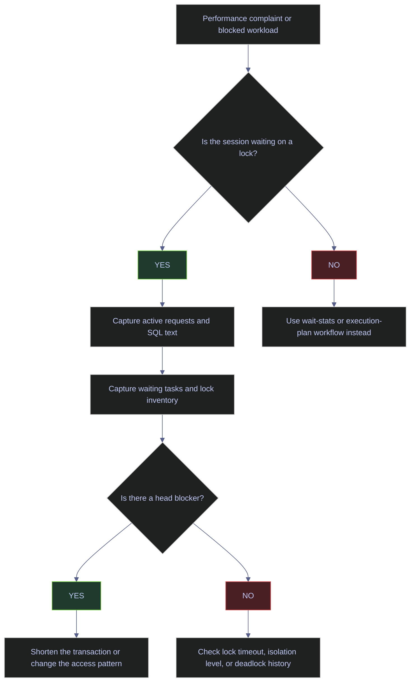

# Blocking and Locking

SQL Server uses locks to preserve correctness when concurrent sessions touch the same rows, pages, indexes, or metadata.

> [!abstract] Scope of this page
>
> This page is a production triage guide for SQL Server blocking and locking. It covers the lock modes and compatibility matrix, granularity and escalation, row-versioning isolation switches, and a sequenced set of live DMV queries to identify head blockers, victims, lock inventory, chain fan-out, escalation state, and lock-wait posture. Every demo is executed against the live `stoxx` database.

## Production Triage Sequence

Blocking incidents almost always look the same from the outside: one or more sessions appear stuck. The triage flow below is the fixed order this page follows — confirm lock waits first, capture the blocker and the lock inventory next, then decide whether the problem is a long transaction, an isolation mismatch, or something that belongs in a different workflow entirely.

### SQL Server | blocking triage | decision flow

The flowchart makes the branch polarity explicit so that a responder can jump directly to the correct investigation path without guessing.

#### Route a performance complaint to the correct lock workflow

The diagram routes an incoming complaint through a single yes/no check on lock waits, then into the capture steps used later on this page, and finally to the remediation branch.

*Mermaid decision flow from performance complaint to remediation, branching on whether the session is lock-bound and whether a head blocker exists.*



## Lock Modes That Matter In Production

SQL Server exposes a long list of lock modes, but only a handful drive real production incidents. This section summarizes the modes that appear in `sys.dm_tran_locks` and wait-type names during triage, then lays out the compatibility matrix that determines which requests can coexist.

### SQL Server | lock modes | production reference

The table below focuses on the modes most likely to appear in triage output. Schema locks are included because DDL collisions are a recurring source of unexplained blocking.

#### Inventory the lock modes seen during triage

Each row names a mode, the common source that takes it, and the mode families it blocks. Use this as the quick legend when reading `request_mode` columns later on this page.

*Reference table mapping SQL Server lock modes to their sources and the requests they block.*

| Lock mode | Typical meaning | Common source | What it blocks |
|---|---|---|---|
| `S` | Shared read lock | `SELECT` under pessimistic isolation | `X`, some schema changes |
| `U` | Update lock during read-for-write phase | `UPDATE`, `SELECT ... WITH (UPDLOCK)` | Other `U`, `X` |
| `X` | Exclusive write lock | `INSERT`, `UPDATE`, `DELETE` | Almost everything except compatible intent locks |
| `IS` | Intent shared | A lower-level `S` lock exists below this object | Signals read activity at a finer granularity |
| `IX` | Intent exclusive | A lower-level `X` or `U` lock exists below this object | Common on objects and pages during writes |
| `SIX` | Shared plus intent exclusive | Read most of an object, update some rows | Broad read plus targeted write |
| `Sch-S` | Schema stability | Query compilation and execution | Blocks `Sch-M` only |
| `Sch-M` | Schema modification | `ALTER TABLE`, `TRUNCATE TABLE`, index rebuild phases | Blocks nearly all concurrent access |

### SQL Server | lock compatibility | matrix

Compatibility is the rule the lock manager uses to decide whether a new request can be granted against the locks already held on the same resource.

#### Read the compatibility matrix

Rows are the requested mode; columns are the mode already held. `Yes` means the request is granted immediately; `No` means the request waits.

*Compatibility matrix for the seven most relevant SQL Server lock modes.*

| Requested vs existing | `S` | `U` | `X` | `IS` | `IX` | `Sch-S` | `Sch-M` |
|---|---|---|---|---|---|---|---|
| `S` | Yes | Yes | No | Yes | No | Yes | No |
| `U` | Yes | No | No | Yes | No | Yes | No |
| `X` | No | No | No | No | No | No | No |
| `IS` | Yes | Yes | No | Yes | Yes | Yes | No |
| `IX` | No | No | No | Yes | Yes | Yes | No |
| `Sch-S` | Yes | Yes | No | Yes | Yes | Yes | No |
| `Sch-M` | No | No | No | No | No | No | No |

## Granularity And Escalation

Locks can be taken at several levels. SQL Server prefers finer granularity first, then escalates when maintaining many small locks becomes more expensive than taking a broader lock. The granularity chosen for a given statement drives both the concurrency ceiling and the likelihood of lock escalation later in the transaction.

### SQL Server | lock granularity | reference

The granularity ladder determines how much of the object a single lock covers. Understanding where escalation lands matters because a row-level blocker and an object-level blocker are fixed in very different ways.

#### Map granularity levels to concurrency impact

The ladder below runs from the finest (row / key) to the coarsest (database). Escalation almost always targets the object level, skipping the page level.

*Reference of SQL Server lock granularities and their concurrency impact.*

| Granularity | Typical resource | Operational meaning |
|---|---|---|
| Row / key | Individual row or index key | Most precise, most concurrency-friendly |
| Page | 8 KB page | Broader than row locking, still below table |
| HoBT | Heap or B-tree | Internal structure level for partitions and indexes |
| Object / table | Whole table or index | High blocking impact |
| Database | Whole database | Usually intent or metadata-related, not normal DML scope |

> [!tip] Treat escalation as a symptom, not a root cause
>
> Lock escalation is usually a symptom, not the primary problem. If escalation hurts, first ask why the statement touched that many rows, held the transaction that long, or used that access path.

## Database Row-Versioning State

`READ COMMITTED SNAPSHOT` and `ALLOW_SNAPSHOT_ISOLATION` change whether readers must wait behind writers. This is the first database-level check during triage because it changes the concurrency model for the whole workload — everything else in this page assumes pessimistic `READ COMMITTED` unless explicitly noted.

### SQL Server | sys.databases | row-versioning inspection

The row-versioning switches live in the database catalog and can be read in a single query. Both switches are orthogonal: either, both, or neither can be enabled.

#### Inspect row-versioning switches for the target database

The lookup reads `sys.databases` for a named database and returns the two columns that describe its concurrency model.

> [!info]- Query walkthrough | sys.databases row-versioning columns
>
> This query reads `sys.databases` for the target database and surfaces the two row-versioning switches that matter most for concurrency design.
>
> - `snapshot_isolation_state_desc` reports whether explicit `SET TRANSACTION ISOLATION LEVEL SNAPSHOT` transactions are possible.
> - `is_read_committed_snapshot_on` reports whether plain `READ COMMITTED` uses row versions instead of shared locks.
> - The combination tells you whether readers will normally queue behind writers, and whether explicit optimistic transactions are even available.

*Reads the two row-versioning switches from `sys.databases` for the `stoxx` database.*

```sql
SELECT
    name,
    snapshot_isolation_state_desc,
    is_read_committed_snapshot_on
FROM sys.databases
WHERE name = 'stoxx';
```

| name | snapshot_isolation_state_desc | is_read_committed_snapshot_on |
|---|---|---:|
| stoxx | OFF | 0 |

*`stoxx` is currently using classic pessimistic locking for `READ COMMITTED`, and explicit `SNAPSHOT` transactions are not available. Reader-versus-writer blocking is therefore still possible unless queries use hints or a different isolation level.*

| Column | Value | Watch | Meaning | Implication |
|---|---|---|---|---|
| `snapshot_isolation_state_desc` | `OFF` | &#10060; | Explicit `SNAPSHOT` transactions are disabled. | Code that expects optimistic snapshot reads cannot use them in this database. |
| `snapshot_isolation_state_desc` | `ON` | &#9989; | Explicit `SNAPSHOT` transactions are enabled. | Multi-statement consistent reads can avoid shared-lock blocking, but update conflicts must be handled. |
| `is_read_committed_snapshot_on` | `0` | &#10060; | Plain `READ COMMITTED` still takes shared locks for reads. | Reader-versus-writer blocking remains part of normal runtime behavior. |
| `is_read_committed_snapshot_on` | `1` | &#9989; | Plain `READ COMMITTED` reads row versions. | Readers no longer wait behind writers for committed data, but TempDB version-store pressure matters more. |

### SQL Server | ALTER DATABASE | enable row versioning

Enabling row versioning is an ALTER DATABASE action that changes runtime behavior for every future session. The two switches are independent and should be considered separately.

#### Enable row versioning for reader-versus-writer contention

The two statements below turn on both row-versioning switches. They are grouped because they address the same class of blocking, but each addresses a different use case.

> [!warning] Row versioning changes runtime behavior for every session
>
> Turning on row versioning changes runtime behavior for every session in the database. `READ COMMITTED SNAPSHOT` changes the meaning of plain `READ COMMITTED`, and `ALLOW_SNAPSHOT_ISOLATION` enables explicit `SNAPSHOT` transactions. Do not enable either switch casually in production.
>
> These changes usually help mixed read/write workloads, but they also increase TempDB version-store usage and can expose code that assumed locking reads.

> [!success] When to enable each row-versioning switch
>
> - Consider `READ COMMITTED SNAPSHOT` when most blocking is reader-versus-writer rather than writer-versus-writer, and when the application does not depend on locking side effects from `READ COMMITTED`.
> - Consider `ALLOW_SNAPSHOT_ISOLATION` when specific transactions need consistent multi-statement reads without taking shared locks.

> [!warning] This DDL requires a change window
>
> The next command changes database semantics. It requires a change window, validation of TempDB capacity, and review of application code that depends on locking reads.

> [!success] Row versioning is the first remediation for reader-versus-writer contention
>
> This is the primary database-level change to consider when blocking is dominated by reader-versus-writer contention and the application is not relying on `READ COMMITTED` locking behavior.

*Enables both `READ_COMMITTED_SNAPSHOT` and `ALLOW_SNAPSHOT_ISOLATION` on the `stoxx` database.*

```sql
ALTER DATABASE stoxx SET READ_COMMITTED_SNAPSHOT ON;
GO

ALTER DATABASE stoxx SET ALLOW_SNAPSHOT_ISOLATION ON;
GO
```

## Live Blocking Snapshot

This is the production query to run first when someone reports "the database is blocked". It identifies the blocking session, the blocked sessions, the current statement text, and the live lock wait. Everything that follows in this page builds on the session ids captured here.

### SQL Server | sys.dm_exec_requests | live blocker identification

The capture query joins three DMVs: active requests, session metadata, and the SQL text cache. The combination answers four production questions simultaneously — who, where, doing what, and waiting on whom.

#### Capture the blocking chain with statement text

The query returns one row per live user request in the target database, ordered by elapsed time so the longest-running session appears first. The `running_statement` expression extracts the exact statement inside a multi-statement batch instead of showing the whole batch text.

> [!info]- Query walkthrough | sys.dm_exec_requests blocking capture
>
> This query reads `sys.dm_exec_requests` for all live user requests, joins `sys.dm_exec_sessions` for workload identity, and pulls the currently executing statement from `sys.dm_exec_sql_text`.
>
> - `status`, `command`, `wait_type`, and `blocking_session_id` tell you whether the request is actively running, waiting on a lock, or acting as the blocker.
> - `wait_time_ms`, `cpu_time_ms`, and `elapsed_time_ms` separate "waiting" from "working".
> - `logical_reads`, `reads`, and `writes` show whether the request is scanning a lot or simply waiting.
> - `running_statement` extracts only the active statement inside a larger batch, which matters in production because a session can run many statements in one batch or procedure.

*Returns the live blocker/victim chain for the `stoxx` database with statement text, wait type, and timing.*

```sql
SELECT
    r.session_id,
    DB_NAME(r.database_id) AS database_name,
    s.login_name,
    s.host_name,
    s.program_name,
    r.status,
    r.command,
    r.wait_type,
    r.wait_time AS wait_time_ms,
    r.cpu_time AS cpu_time_ms,
    r.total_elapsed_time AS elapsed_time_ms,
    r.logical_reads,
    r.reads,
    r.writes,
    r.blocking_session_id,
    LEFT(REPLACE(REPLACE(LTRIM(SUBSTRING(
        st.text,
        (r.statement_start_offset / 2) + 1,
        CASE
            WHEN r.statement_end_offset = -1 THEN (DATALENGTH(st.text) - r.statement_start_offset) / 2 + 1
            ELSE (r.statement_end_offset - r.statement_start_offset) / 2 + 1
        END
    )), CHAR(13), ' '), CHAR(10), ' '), 160) AS running_statement
FROM sys.dm_exec_requests AS r
JOIN sys.dm_exec_sessions AS s
    ON r.session_id = s.session_id
CROSS APPLY sys.dm_exec_sql_text(r.sql_handle) AS st
WHERE r.session_id <> @@SPID
  AND s.is_user_process = 1
  AND DB_NAME(r.database_id) = 'stoxx'
ORDER BY r.total_elapsed_time DESC, r.session_id;
```

| session_id | database_name | login_name | host_name | program_name | status | command | wait_type | wait_time_ms | cpu_time_ms | elapsed_time_ms | logical_reads | reads | writes | blocking_session_id | running_statement |
|---:|---|---|---|---|---|---|---|---:|---:|---:|---:|---:|---:|---:|---|
| 55 | stoxx | sa | ELYSIUM | SQLCMD | suspended | WAITFOR | WAITFOR | 6068 | 0 | 6069 | 2 | 0 | 0 | 0 | WAITFOR DELAY '00:00:25'; |
| 56 | stoxx | sa | ELYSIUM | SQLCMD | suspended | SELECT | LCK_M_U | 3972 | 0 | 5973 | 2 | 0 | 0 | 55 | SELECT [payload] FROM [dbo].[concurrency_block_demo] WITH(updlock,holdlock) WHERE [id]=@1 |

*Session `55` is the head blocker. It already updated the row, is holding the transaction open, and is now idle inside `WAITFOR`. Session `56` is the blocked victim: its command is `SELECT`, but the lock hint forces a `U` lock request, so it waits on `LCK_M_U` behind session `55`.*

| Column | Value | Watch | Meaning | Implication |
|---|---|---|---|---|
| `status` | `running` | &#9989; | The request is consuming CPU or actively progressing. | This is not currently blocked, even if it later becomes a blocker. |
| `status` | `suspended` | &#10060; | The request is waiting on a resource. | Always inspect `wait_type` and `blocking_session_id`. |
| `command` | `SELECT` | Depends | The current statement is reading. | Under pessimistic isolation or lock hints, readers can still block or be blocked. |
| `command` | `UPDATE` / `DELETE` / `INSERT` | Depends | The current statement is modifying data. | These are common blocker candidates because they hold `X` or `U` locks. |
| `command` | `WAITFOR` | &#10060; when inside an open transaction | The session is intentionally pausing. | If the transaction is still open, this extends blocking for no business value. |
| `wait_type` | `LCK_M_U` | &#10060; | Waiting for an update lock. | Often indicates `UPDLOCK`, `UPDATE`, or a read-for-write pattern colliding with another writer. |
| `wait_type` | `LCK_M_X` | &#10060; | Waiting for an exclusive lock. | A write is queued behind another incompatible lock. |
| `wait_type` | `WAITFOR` | Neutral | The session is paused by `WAITFOR`, not by another session. | If the transaction is open, this session may still be the blocker. |
| `blocking_session_id` | `0` | Depends | No blocker is recorded for this request. | The request may be running, waiting on a non-blocking resource, or acting as the head blocker. |
| `blocking_session_id` | Positive session id | &#10060; | Another session is blocking this request. | Follow that session and determine whether it is still working or just holding locks open. |

#### Reproduce the blocker/victim pattern in a lab

The three-window sequence below reproduces the exact blocker/victim rows shown in the result table. Run it only in a lab or a maintenance window — it intentionally creates a 25-second blocking chain.

> [!example]- Disposable blocker/victim reproduction
>
> The following disposable demo creates the same blocker/victim pattern shown above. It is appropriate for a lab or a maintenance window, not for normal production use.
>
> **Setup once**
> ```sql
> USE stoxx;
> GO
>
> IF OBJECT_ID('dbo.concurrency_block_demo', 'U') IS NOT NULL
>     DROP TABLE dbo.concurrency_block_demo;
> GO
>
> CREATE TABLE dbo.concurrency_block_demo
> (
>     id int NOT NULL PRIMARY KEY,
>     payload char(100) NOT NULL DEFAULT REPLICATE('X', 100)
> );
> GO
>
> INSERT INTO dbo.concurrency_block_demo(id)
> VALUES (1);
> GO
> ```
>
> **Window 1: create the blocker**
> ```sql
> USE stoxx;
> GO
>
> BEGIN TRAN;
>
> UPDATE dbo.concurrency_block_demo
> SET payload = payload
> WHERE id = 1;
>
> WAITFOR DELAY '00:00:25';
>
> ROLLBACK;
> GO
> ```
>
> **Window 2: create the blocked request**
> ```sql
> USE stoxx;
> GO
>
> SELECT payload
> FROM dbo.concurrency_block_demo WITH (UPDLOCK, HOLDLOCK)
> WHERE id = 1;
> GO
> ```
>
> **Window 3: observe the blocking chain**
> ```sql
> SELECT
>     r.session_id,
>     DB_NAME(r.database_id) AS database_name,
>     s.login_name,
>     s.host_name,
>     s.program_name,
>     r.status,
>     r.command,
>     r.wait_type,
>     r.wait_time AS wait_time_ms,
>     r.cpu_time AS cpu_time_ms,
>     r.total_elapsed_time AS elapsed_time_ms,
>     r.logical_reads,
>     r.reads,
>     r.writes,
>     r.blocking_session_id,
>     LEFT(REPLACE(REPLACE(LTRIM(SUBSTRING(
>         st.text,
>         (r.statement_start_offset / 2) + 1,
>         CASE
>             WHEN r.statement_end_offset = -1 THEN (DATALENGTH(st.text) - r.statement_start_offset) / 2 + 1
>             ELSE (r.statement_end_offset - r.statement_start_offset) / 2 + 1
>         END
>     )), CHAR(13), ' '), CHAR(10), ' '), 160) AS running_statement
> FROM sys.dm_exec_requests AS r
> JOIN sys.dm_exec_sessions AS s
>     ON r.session_id = s.session_id
> CROSS APPLY sys.dm_exec_sql_text(r.sql_handle) AS st
> WHERE r.session_id <> @@SPID
>   AND s.is_user_process = 1
>   AND DB_NAME(r.database_id) = 'stoxx'
> ORDER BY r.total_elapsed_time DESC, r.session_id;
> ```
>
> **Cleanup**
> ```sql
> USE stoxx;
> GO
>
> IF @@TRANCOUNT > 0
>     ROLLBACK;
> GO
>
> DROP TABLE IF EXISTS dbo.concurrency_block_demo;
> GO
> ```

## Lock Inventory For The Blocked Chain

The blocking snapshot tells you who is waiting. The next query tells you which lock resource each session currently holds or is requesting, which is the only way to distinguish row-level contention from object-level escalation.

### SQL Server | sys.dm_tran_locks | resource-level inventory

`sys.dm_tran_locks` exposes every granted and pending lock request on the instance. Filtering by session id narrows the view to the blocking chain identified earlier.

#### Inventory granted and pending locks for the blocking chain

The query joins `sys.partitions` on the HoBT id returned by the lock manager so that object names appear inline instead of as opaque ids. Only live sessions in the chain are returned.

> [!info]- Query walkthrough | sys.dm_tran_locks chain inventory
>
> This query reads `sys.dm_tran_locks` for the live sessions in the blocking chain and maps HoBT ids back to table names through `sys.partitions`.
>
> - `resource_type` tells you whether the contention is at the database, object, page, or key level.
> - `request_mode` tells you what kind of lock is already held or being requested.
> - `request_status` distinguishes granted locks from locks that are still waiting.
> - `object_name` is the first lookup that tells you whether the blocking chain is happening on the table you expected.

*Lists every granted and pending lock for sessions 55 and 56 with object names resolved from HoBT ids.*

```sql
SELECT
    tl.request_session_id,
    tl.resource_type,
    tl.request_mode,
    tl.request_status,
    COALESCE(
        OBJECT_SCHEMA_NAME(p.object_id, DB_ID('stoxx')) + '.' + OBJECT_NAME(p.object_id, DB_ID('stoxx')),
        '(not mapped)'
    ) AS object_name,
    tl.resource_description
FROM sys.dm_tran_locks AS tl
LEFT JOIN sys.partitions AS p
    ON tl.resource_associated_entity_id = p.hobt_id
WHERE tl.resource_database_id = DB_ID('stoxx')
  AND tl.request_session_id IN (55, 56)
ORDER BY tl.request_session_id, tl.resource_type, tl.request_mode;
```

| request_session_id | resource_type | request_mode | request_status | object_name | resource_description |
|---:|---|---|---|---|---|
| 55 | DATABASE | S | GRANT | (not mapped) |  |
| 55 | KEY | X | GRANT | dbo.concurrency_block_demo | (8194443284a0) |
| 55 | OBJECT | IX | GRANT | (not mapped) |  |
| 55 | PAGE | IX | GRANT | dbo.concurrency_block_demo | 1:24265 |
| 56 | DATABASE | S | GRANT | (not mapped) |  |
| 56 | KEY | U | WAIT | dbo.concurrency_block_demo | (8194443284a0) |
| 56 | OBJECT | IX | GRANT | (not mapped) |  |
| 56 | PAGE | IU | GRANT | dbo.concurrency_block_demo | 1:24265 |

*Session `55` already owns the key-level `X` lock, and session `56` is waiting for a `U` lock on the same key. The page- and object-level intent locks are not the blocking problem by themselves; they merely signal lower-level write activity underneath the object.*

| Column | Value | Watch | Meaning | Implication |
|---|---|---|---|---|
| `resource_type` | `KEY` | Depends | The lock is on an index key. | This usually means row-level contention rather than a whole-table block. |
| `resource_type` | `PAGE` | &#10060; when frequent | The lock is on an 8 KB page. | Hot-page contention often points to scan-heavy or monotonic insert patterns. |
| `resource_type` | `OBJECT` | &#10060; when `X` or `SCH-M` | The lock is on the whole object. | Concurrency is much lower; check for escalation or DDL. |
| `request_mode` | `X` | Depends | Exclusive write lock. | This is the normal blocker mode for writes. |
| `request_mode` | `U` | Depends | Update lock requested or held. | Common in read-for-write patterns; useful for preventing conversion deadlocks. |
| `request_mode` | `IX` / `IU` | Neutral | Intent lock at a broader granularity. | Usually expected when finer locks exist underneath. |
| `request_status` | `GRANT` | Neutral | The lock has been granted. | This session currently owns the resource. |
| `request_status` | `WAIT` | &#10060; | The lock request has not been granted yet. | This is the precise lock request being blocked. |

## Waiting Tasks For The Same Chain

`sys.dm_os_waiting_tasks` confirms the exact wait in progress and shows which session is the blocker. Where `sys.dm_exec_requests` reports the current state of a request, `sys.dm_os_waiting_tasks` reports the wait event itself — including the raw `resource_description` string used by the deadlock graph and the blocked-process report.

### SQL Server | sys.dm_os_waiting_tasks | scheduler-level waits

The waiting-tasks DMV surfaces each wait at the scheduler level, not the request level. A request can have zero or one wait at a time, and this DMV captures that wait with its precise resource description.

#### Confirm the live wait event and resource description

The query isolates the two sessions already identified and returns the wait type, duration, blocker, and raw resource description. Resource descriptions are cryptic but decode directly into the lock resource and HoBT id.

> [!info]- Query walkthrough | sys.dm_os_waiting_tasks chain waits
>
> This query reads `sys.dm_os_waiting_tasks` for the same live sessions and isolates the wait event itself.
>
> - `wait_type` is the scheduler-visible name of the wait.
> - `wait_duration_ms` shows how long the current wait has been active.
> - `blocking_session_id` is the fastest path from victim to blocker.
> - `resource_description` exposes the locked key, page, or metadata resource when SQL Server can describe it.

*Returns the current wait event and resource description for sessions 55 and 56.*

```sql
SELECT
    wt.session_id,
    wt.wait_type,
    wt.wait_duration_ms,
    wt.blocking_session_id,
    wt.resource_description
FROM sys.dm_os_waiting_tasks AS wt
WHERE wt.session_id IN (55, 56)
ORDER BY wt.session_id, wt.wait_duration_ms DESC;
```

| session_id | wait_type | wait_duration_ms | blocking_session_id | resource_description |
|---:|---|---:|---:|---|
| 55 | WAITFOR | 6200 |  |  |
| 56 | LCK_M_U | 4103 | 55 | keylock hobtid=72057594062110720 dbid=5 id=lockf39954280 mode=X associatedObjectId=72057594062110720 |

*The head blocker is not waiting on another session; it is waiting on its own `WAITFOR` timer. The victim is waiting specifically for an update lock on a key resource owned by session `55`.*

| Column | Value | Watch | Meaning | Implication |
|---|---|---|---|---|
| `wait_type` | `LCK_M_U` | &#10060; | Waiting for an update lock. | A read-for-write or update path is blocked by another incompatible lock. |
| `wait_type` | `LCK_M_X` | &#10060; | Waiting for an exclusive lock. | A writer is blocked behind another writer or conflicting schema lock. |
| `wait_type` | `LCK_M_S` | &#10060; | Waiting for a shared lock. | Under pessimistic isolation, a reader is blocked by a writer or metadata change. |
| `wait_type` | `WAITFOR` | Neutral | The session is paused by the `WAITFOR` statement. | Harmless outside a transaction, harmful if the session is holding locks while waiting. |
| `blocking_session_id` | Blank / `NULL` | Neutral | SQL Server did not record a blocking session for this wait. | The session may be waiting on time, CPU scheduling, or another non-blocking resource. |
| `blocking_session_id` | Positive session id | &#10060; | Another session is directly blocking this wait. | Follow that session immediately; that is the blocker to fix or terminate. |

## Blocking Chain Walk

A single head blocker with a single victim is trivial to read from `sys.dm_exec_requests`. In production the same blocker frequently fans out into dozens of victims across multiple layers, and the chain shape matters more than any individual session. A recursive CTE turns the flat DMV view into an explicit parent-child chain.

### SQL Server | recursive CTE | blocking chain walk

The recursive anchor identifies root blockers (sessions that are not blocked by another session in the captured set). The recursive member then walks each victim's `blocking_session_id` back to the root, materializing the full path in a single column.

#### Walk the blocker-to-victim chain

The query scopes the CTE to one database and one session filter so that large instances do not return irrelevant chains. Depth zero is always the root; deeper rows are downstream victims.

> [!info]- Query walkthrough | recursive blocking chain
>
> This query builds a chain from root blocker to final victim using the live blocking relationships from `sys.dm_exec_requests`.
>
> - Root sessions are those with `blocking_session_id = 0` or those blocked by a session outside the captured set.
> - `chain_path` materializes the full path so you can see fan-out or deeper cascades quickly.
> - `depth = 0` is the root blocker; larger depths are downstream victims.

*Walks the blocking chain from root to victim for sessions 55 and 56 and emits an explicit chain path.*

```sql
;WITH req AS (
    SELECT
        session_id,
        blocking_session_id,
        status,
        wait_type,
        command,
        DB_NAME(database_id) AS database_name
    FROM sys.dm_exec_requests
    WHERE database_id = DB_ID('stoxx')
      AND session_id IN (55, 56)
),
chain AS (
    SELECT
        session_id,
        blocking_session_id,
        CAST(CAST(session_id AS varchar(10)) AS varchar(1000)) AS chain_path,
        0 AS depth
    FROM req
    WHERE blocking_session_id = 0
       OR blocking_session_id NOT IN (SELECT session_id FROM req)
    UNION ALL
    SELECT
        r.session_id,
        r.blocking_session_id,
        CAST(c.chain_path + ' -> ' + CAST(r.session_id AS varchar(10)) AS varchar(1000)) AS chain_path,
        c.depth + 1
    FROM req AS r
    JOIN chain AS c
      ON r.blocking_session_id = c.session_id
)
SELECT
    c.depth,
    c.session_id,
    c.blocking_session_id,
    r.status,
    r.command,
    r.wait_type,
    c.chain_path
FROM chain AS c
JOIN req AS r
  ON c.session_id = r.session_id
ORDER BY c.depth, c.session_id;
```

| depth | session_id | blocking_session_id | status | command | wait_type | chain_path |
|---:|---:|---:|---|---|---|---|
| 0 | 55 | 0 | suspended | WAITFOR | WAITFOR | 55 |
| 1 | 56 | 55 | suspended | SELECT | LCK_M_U | 55 -> 56 |

*This chain has a single head blocker and a single victim. In production, the same pattern often fans out into dozens of victims, which is why the chain view is more useful than looking at isolated sessions one by one.*

## Lock Escalation State

The catalog tells you whether a table uses normal escalation rules, partition-aware escalation, or disabled escalation. This is not live telemetry but a design-time setting that shapes how every statement against the table will behave once escalation thresholds are reached.

### SQL Server | sys.tables | escalation mode inspection

Each user table has a `lock_escalation_desc` column exposing its escalation mode. Partitioned tables may be set to `AUTO` for partition-aware escalation, and a small number of hot tables may have escalation disabled entirely.

#### Inspect escalation mode for candidate tables

The query reads `sys.tables` joined to `sys.schemas` and filters to the tables of interest. In production, the same query can be used with a wider filter to audit all tables in a database.

> [!info]- Query walkthrough | sys.tables escalation mode
>
> This query reads `sys.tables.lock_escalation_desc` for representative tables.
>
> - `TABLE` is the normal default.
> - `AUTO` allows partition-aware escalation where appropriate.
> - `DISABLE` prevents normal lock escalation and should be used sparingly because it can dramatically increase lock memory pressure.

*Reports the lock escalation mode for the demo tables and the partitioned `eurostoxx50_ohlcv` variants.*

```sql
SELECT
    s.name AS schema_name,
    t.name AS table_name,
    t.lock_escalation_desc
FROM sys.tables AS t
JOIN sys.schemas AS s
    ON t.schema_id = s.schema_id
WHERE t.name IN (
    'eurostoxx50_ohlcv',
    'concurrency_block_demo',
    'deadlock_demo_a',
    'race_lost_update_demo'
)
ORDER BY s.name, t.name;
```

| schema_name | table_name | lock_escalation_desc |
|---|---|---|
| bronze | eurostoxx50_ohlcv | TABLE |
| dbo | concurrency_block_demo | TABLE |
| dbo | deadlock_demo_a | TABLE |
| dbo | race_lost_update_demo | TABLE |
| silver | eurostoxx50_ohlcv | TABLE |

*All sampled tables are using the normal default escalation behavior. Nothing in this snapshot suggests that escalation has been manually disabled or partition-tuned.*

| Column | Value | Watch | Meaning | Implication |
|---|---|---|---|---|
| `lock_escalation_desc` | `TABLE` | &#9989; | Normal SQL Server escalation behavior. | This is the expected default for most tables. |
| `lock_escalation_desc` | `AUTO` | Depends | Partition-aware escalation when possible. | Useful on partitioned tables, but only if partition design and access patterns justify it. |
| `lock_escalation_desc` | `DISABLE` | &#10060; unless justified | Escalation is disabled. | Can reduce blocking in specific cases, but increases lock count and lock-memory pressure. |

### SQL Server | ALTER TABLE | disable escalation

Disabling escalation is the most aggressive knob in this section. It is a table-level override that tells the lock manager never to promote row or page locks to an object lock on this specific table.

#### Disable lock escalation on a specific hot table

The `ALTER TABLE` syntax targets one table and changes its escalation mode. The change is online and takes effect immediately for future lock requests on the table.

> [!warning] Disabling escalation trades one problem for another
>
> Disabling lock escalation is a specialized intervention. It can trade one blocking problem for a different scalability problem by keeping very large numbers of row or page locks in memory.

> [!success] Disable escalation only after proving escalation is the problem
>
> Consider `LOCK_ESCALATION = DISABLE` only after proving that escalation itself is the problem and that the workload can tolerate the higher lock footprint.

*Disables lock escalation on a named table so row and page locks will not be promoted to object-level locks.*

```sql
ALTER TABLE dbo.SomeHotTable
SET (LOCK_ESCALATION = DISABLE);
GO
```

## Index Operational Lock Statistics

`sys.dm_db_index_operational_stats` adds historical context that live DMVs do not keep for long. It is useful for spotting hot indexes or repeated lock-promotion pressure that a snapshot of `sys.dm_tran_locks` would miss.

### SQL Server | sys.dm_db_index_operational_stats | per-index lock history

The operational stats DMV accumulates counters per index since the last restart. The counters of interest for locking are the lock-count, lock-wait-count, and lock-promotion columns.

#### Aggregate cumulative lock activity per index

The query scopes the DMV to the indexes on one table and returns both the absolute counts and the wait-time totals. A healthy index has non-zero lock counts with zero waits.

> [!info]- Query walkthrough | per-index lock history
>
> This query reads `sys.dm_db_index_operational_stats` for the clustered and nonclustered indexes on `silver.eurostoxx50_ohlcv`.
>
> - `row_lock_count` and `page_lock_count` show cumulative locking activity since the last restart.
> - `row_lock_wait_count` and `page_lock_wait_count` tell you whether those locks are actually causing waits.
> - `index_lock_promotion_attempt_count` and `index_lock_promotion_count` indicate escalation pressure.

*Returns cumulative lock-count, lock-wait, and escalation counters for each index on `silver.eurostoxx50_ohlcv`.*

```sql
SELECT
    OBJECT_SCHEMA_NAME(i.object_id, DB_ID('stoxx')) + '.' + OBJECT_NAME(i.object_id, DB_ID('stoxx')) AS object_name,
    i.name AS index_name,
    ios.row_lock_count,
    ios.row_lock_wait_count,
    ios.row_lock_wait_in_ms,
    ios.page_lock_count,
    ios.page_lock_wait_count,
    ios.page_lock_wait_in_ms,
    ios.index_lock_promotion_attempt_count,
    ios.index_lock_promotion_count
FROM sys.indexes AS i
CROSS APPLY sys.dm_db_index_operational_stats(DB_ID('stoxx'), i.object_id, i.index_id, NULL) AS ios
WHERE i.object_id = OBJECT_ID('silver.eurostoxx50_ohlcv')
  AND i.index_id > 0
ORDER BY i.index_id;
```

| object_name | index_name | row_lock_count | row_lock_wait_count | row_lock_wait_in_ms | page_lock_count | page_lock_wait_count | page_lock_wait_in_ms | index_lock_promotion_attempt_count | index_lock_promotion_count |
|---|---|---:|---:|---:|---:|---:|---:|---:|---:|
| silver.eurostoxx50_ohlcv | PK__eurostox__3213E83FDF67D274 | 25000 | 0 | 0 | 80745 | 0 | 0 | 0 | 0 |
| silver.eurostoxx50_ohlcv | IX_silver_eurostoxx50_ohlcv_symbol_date | 194 | 0 | 0 | 5285 | 0 | 0 | 0 | 0 |

*These indexes have seen substantial cumulative lock activity, but none of it has waited and none of it has promoted to a broader lock. That is a healthy signal: high lock counts alone do not mean a locking problem exists.*

| Column | Value | Watch | Meaning | Implication |
|---|---|---|---|---|
| `row_lock_wait_count` | `0` | &#9989; | No row-lock waits recorded. | The workload is taking locks, but not stalling on them. |
| `row_lock_wait_count` | Greater than `0` | &#10060; | Row locks have caused waits. | Check competing statements, hot keys, and transaction duration. |
| `page_lock_wait_count` | `0` | &#9989; | No page-lock waits recorded. | Page-level contention is not currently visible here. |
| `index_lock_promotion_attempt_count` | `0` | &#9989; | No escalation attempts recorded. | The workload has not pressured SQL Server into broader index locks. |
| `index_lock_promotion_count` | Greater than `0` | &#10060; | Escalation succeeded one or more times. | Investigate large scans, broad updates, or long transactions. |

## Session Safety Switches

Two session settings matter constantly in blocking scenarios: `LOCK_TIMEOUT` and `XACT_ABORT`. Neither is a server-wide default — both are properties of the current connection, and both strongly affect whether a session exits cleanly when a blocker keeps a lock held too long.

### SQL Server | @@OPTIONS | inspect session safety switches

The session switches are exposed through `@@LOCK_TIMEOUT` and the bit flags in `@@OPTIONS`. Reading both in a single query confirms the safety posture of the current connection.

#### Inspect the current session safety switches

The query uses a bitmask against `@@OPTIONS` to translate the `XACT_ABORT` bit into a human-readable state, and returns `@@LOCK_TIMEOUT` in milliseconds.

> [!info]- Query walkthrough | session safety switches
>
> This query reads the current session values, not a server-wide default.
>
> - `@@LOCK_TIMEOUT = -1` means the session waits forever.
> - `XACT_ABORT` controls whether a runtime error aborts the full transaction or only the offending statement.
> - These two settings strongly influence whether application code fails fast and whether it leaves transactions open after an error.

*Reads the current session's `LOCK_TIMEOUT` and decodes the `XACT_ABORT` bit from `@@OPTIONS`.*

```sql
SELECT
    @@LOCK_TIMEOUT AS lock_timeout_ms,
    CASE
        WHEN (16384 & @@OPTIONS) = 16384 THEN 'ON'
        ELSE 'OFF'
    END AS xact_abort_state;
```

| lock_timeout_ms | xact_abort_state |
|---:|---|
| -1 | OFF |

*This session would wait forever on a lock and would not automatically roll back the full transaction on many runtime errors. That combination is common in ad hoc sessions and risky in application code that opens explicit transactions.*

| Column | Value | Watch | Meaning | Implication |
|---|---|---|---|---|
| `lock_timeout_ms` | `-1` | &#10060; for unattended workloads | Wait forever. | Sessions can pile up behind blockers until the application times out first. |
| `lock_timeout_ms` | Positive number | &#9989; in many app paths | Fail after the configured number of milliseconds. | Lets the application surface a controlled retry or error path. |
| `xact_abort_state` | `OFF` | &#10060; for multi-statement write transactions | Many runtime errors abort only the statement. | Poor error handling can leave the transaction open and keep locks alive. |
| `xact_abort_state` | `ON` | &#9989; for most ETL and write-heavy batches | Runtime errors terminate and roll back the full transaction. | Safer default for transactional pipeline code. |

### SQL Server | SET | configure safe transaction defaults

Setting `LOCK_TIMEOUT` and `XACT_ABORT` at the top of a batch establishes fail-fast behavior and guarantees that a runtime error rolls back the full transaction instead of silently leaving it open.

#### Configure safe transaction defaults for ETL batches

The template below pairs a finite `LOCK_TIMEOUT` with `XACT_ABORT ON` and wraps the work in `TRY / CATCH` so that any error path triggers a deterministic rollback.

> [!warning] Session settings persist across statements in the connection
>
> `SET LOCK_TIMEOUT` and `SET XACT_ABORT` are session-level settings. They do not change other sessions, but they do change the behavior of every statement that follows in the same connection.

> [!success] Safe default for unattended write workloads
>
> In application transactions and ETL batches, a short `LOCK_TIMEOUT` plus `XACT_ABORT ON` is usually safer than waiting forever behind a blocker.

*Template batch setting a five-second lock timeout, enabling `XACT_ABORT`, and wrapping work in `TRY / CATCH` with a deterministic rollback.*

```sql
SET LOCK_TIMEOUT 5000;
SET XACT_ABORT ON;

BEGIN TRY
    BEGIN TRAN;

    -- Work here

    COMMIT;
END TRY
BEGIN CATCH
    IF @@TRANCOUNT > 0
        ROLLBACK;

    THROW;
END CATCH;
```

## Lock-Related Wait Posture

Wait stats tell you whether locking problems are isolated incidents or a repeated pattern since the last restart. `sys.dm_os_wait_stats` is cumulative, so a single snapshot only answers "what has happened since boot?" — repeated snapshots answer "what is happening now?".

### SQL Server | sys.dm_os_wait_stats | cumulative lock waits

The DMV returns one row per wait type with its total count, total wait time, and signal-wait time. Filtering to `LCK_M_%` isolates the lock-related waits from the rest of the wait taxonomy.

#### Summarize cumulative lock waits since last restart

The query orders waits by total time descending so the dominant lock wait appears first. Signal wait time distinguishes waits that were immediately scheduled after becoming runnable from waits that also suffered CPU pressure.

> [!info]- Query walkthrough | cumulative lock waits
>
> This query reads cumulative wait stats for lock waits only.
>
> - `waiting_tasks_count` shows how often the wait occurred.
> - `wait_time_ms` shows the total time spent waiting.
> - `signal_wait_time_ms` is the CPU scheduler portion after the resource became available.
> - The key question is not "does a lock wait exist?" but "which lock wait dominates and why?"

*Summarizes every lock wait type accumulated since the last instance restart.*

```sql
SELECT
    wait_type,
    waiting_tasks_count,
    wait_time_ms,
    signal_wait_time_ms
FROM sys.dm_os_wait_stats
WHERE wait_type LIKE 'LCK_M_%'
  AND waiting_tasks_count > 0
ORDER BY wait_time_ms DESC;
```

| wait_type | waiting_tasks_count | wait_time_ms | signal_wait_time_ms |
|---|---:|---:|---:|
| LCK_M_U | 15 | 120392 | 1 |
| LCK_M_IX | 3 | 92048 | 0 |
| LCK_M_SCH_S | 3 | 89426 | 0 |
| LCK_M_X | 223 | 22351 | 5 |
| LCK_M_S | 209 | 1901 | 15 |
| LCK_M_SCH_M_ABORT_BLOCKERS | 2 | 537 | 0 |
| LCK_M_SCH_M | 5 | 3 | 0 |

*The cumulative lock-wait leader on this instance is `LCK_M_U`, which is consistent with read-for-write patterns colliding with each other. The presence of `LCK_M_SCH_S` and `LCK_M_SCH_M_ABORT_BLOCKERS` also tells you schema-level activity has blocked ordinary query work at least a few times.*

| Column | Value | Watch | Meaning | Implication |
|---|---|---|---|---|
| `wait_type` | `LCK_M_U` | &#10060; | Waiting for update locks. | Investigate `UPDLOCK`, `UPDATE`, and read-then-write code paths. |
| `wait_type` | `LCK_M_X` | &#10060; | Waiting for exclusive locks. | Common write/write contention. |
| `wait_type` | `LCK_M_S` | &#10060; when frequent | Waiting for shared locks. | Often reader/writer contention under pessimistic isolation. |
| `wait_type` | `LCK_M_SCH_S` | &#10060; | Waiting for schema stability. | DDL or schema-modification activity is colliding with queries. |
| `wait_type` | `LCK_M_SCH_M` | &#10060; | Waiting for schema modification. | DDL is queued behind active readers or writers. |
| `signal_wait_time_ms` | Near zero | &#9989; | Most delay is resource wait, not CPU queueing. | The problem is locking, not scheduler starvation. |
| `signal_wait_time_ms` | Large relative to `wait_time_ms` | &#10060; | Significant delay after the resource was available. | Locking is not the whole story; CPU pressure may also matter. |

## Practical Guidance

The recommendations below consolidate the patterns that repeatedly resolve blocking incidents in practice. They are design rules, not triage steps — apply them before a blocking incident rather than after one.

> [!tip] Blocking remediation checklist
>
> - Keep transactions as short as possible. The most common blocker is not a complex lock mode; it is a session that finished its real work and kept the transaction open.
> - Prefer narrow, indexed predicates. A precise seek reduces both lock count and lock duration.
> - Use row versioning for reader-versus-writer pressure, not as a substitute for writer discipline.
> - Treat `WAITFOR`, user interaction, remote calls, and lengthy application logic inside transactions as design bugs.
> - Use `XACT_ABORT ON` and a finite `LOCK_TIMEOUT` for unattended write workloads.
> - Investigate lock escalation by fixing access patterns first. Disabling escalation is a last-mile intervention, not a first response.


