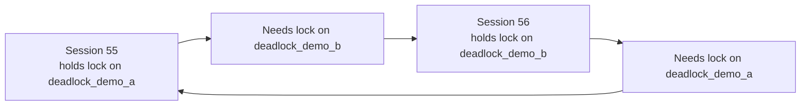
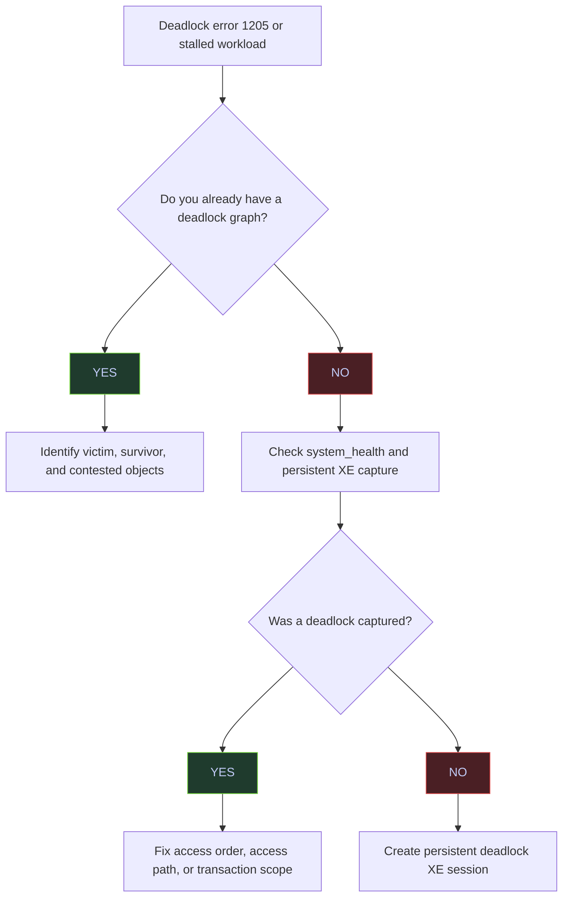

# Deadlock Detection and Prevention

SQL Server resolves deadlocks automatically by choosing a victim and rolling back that transaction with error `1205`.

## What Makes A Deadlock Different From Blocking

Blocking is linear: one session waits for another to finish. A deadlock is circular: session A needs a lock held by session B, while session B needs a lock held by session A. That cycle cannot resolve without intervention.



## Production Detection Sequence



## Quick Health Check

The fastest production check is to count how many deadlock reports are already present in the built-in `system_health` Extended Events session.

> [!info]-
> This query locates the `system_health` event-file target and counts all captured `xml_deadlock_report` events.
>
> - `system_health` exists by default on modern SQL Server builds and usually captures deadlocks without extra setup.
> - `deadlock_event_count` is cumulative across the files that still exist on disk, not a rate per second and not a per-database counter.
> - This tells you whether deadlocks have happened, but not yet which queries or objects were involved.

```sql
DECLARE @path nvarchar(4000);

SELECT @path = REPLACE(
    CAST(t.target_data AS xml).value('(EventFileTarget/File/@name)[1]', 'nvarchar(4000)'),
    '.xel',
    '*.xel'
)
FROM sys.dm_xe_sessions AS s
JOIN sys.dm_xe_session_targets AS t
    ON s.address = t.event_session_address
WHERE s.name = 'system_health'
  AND t.target_name = 'event_file';

SELECT COUNT(*) AS deadlock_event_count
FROM sys.fn_xe_file_target_read_file(@path, NULL, NULL, NULL)
WHERE object_name = 'xml_deadlock_report';
```

| deadlock_event_count |
|---:|
| 2 |

*This instance already has two captured deadlock graphs in `system_health`. That is enough to do real forensic analysis without waiting for the next deadlock.*

## Recent Deadlocks From `system_health`

The next step is to extract a compact summary of the latest deadlock reports so you can see the victim, the sessions involved, and the contested objects.

> [!info]-
> This query reads the most recent `xml_deadlock_report` events from `system_health` and extracts a compact deadlock summary.
>
> - `utc_time` is when the deadlock event was recorded.
> - `victim_process_id` is the process id from the deadlock XML, not necessarily the same as the SQL Server `session_id`.
> - `process1_spid` and `process2_spid` are the SQL Server sessions that were involved.
> - `resource1_object` and `resource2_object` identify the tables or indexes named in the resource list.

```sql
DECLARE @path nvarchar(4000);

SELECT @path = REPLACE(
    CAST(t.target_data AS xml).value('(EventFileTarget/File/@name)[1]', 'nvarchar(4000)'),
    '.xel',
    '*.xel'
)
FROM sys.dm_xe_sessions AS s
JOIN sys.dm_xe_session_targets AS t
    ON s.address = t.event_session_address
WHERE s.name = 'system_health'
  AND t.target_name = 'event_file';

;WITH src AS (
    SELECT TOP (5)
        CAST(event_data AS xml) AS event_xml,
        file_name,
        file_offset
    FROM sys.fn_xe_file_target_read_file(@path, NULL, NULL, NULL)
    WHERE object_name = 'xml_deadlock_report'
    ORDER BY file_name DESC, file_offset DESC
)
SELECT
    event_xml.value('(event/@timestamp)[1]', 'datetime2') AS utc_time,
    event_xml.value('(event/data/value/deadlock/victim-list/victimProcess/@id)[1]', 'nvarchar(100)') AS victim_process_id,
    event_xml.value('(event/data/value/deadlock/process-list/process[1]/@spid)[1]', 'int') AS process1_spid,
    event_xml.value('(event/data/value/deadlock/process-list/process[2]/@spid)[1]', 'int') AS process2_spid,
    event_xml.value('(event/data/value/deadlock/resource-list/*[1]/@objectname)[1]', 'nvarchar(256)') AS resource1_object,
    event_xml.value('(event/data/value/deadlock/resource-list/*[2]/@objectname)[1]', 'nvarchar(256)') AS resource2_object
FROM src
ORDER BY utc_time DESC;
```

| utc_time | victim_process_id | process1_spid | process2_spid | resource1_object | resource2_object |
|---|---|---:|---:|---|---|
| 2026-04-08 17:40:24.9920000 | processf00070ca8 | 55 | 56 | stoxx.dbo.deadlock_demo_b | stoxx.dbo.deadlock_demo_a |
| 2026-04-08 11:18:05.8550000 | processf000688c8 | 53 | 56 | stoxx.dbo.dm_exec_requests_demo | stoxx.dbo.dm_exec_requests_demo |

*The newest deadlock is the controlled two-table demo: session `55` and session `56` deadlocked while touching `deadlock_demo_a` and `deadlock_demo_b` in opposite order. The older event shows a separate deadlock on `dm_exec_requests_demo`, which confirms this instance has already seen more than one concurrency pattern.*

| Column | Value | Watch | Meaning | Implication |
|---|---|---|---|---|
| `utc_time` | Recent timestamp | Depends | When the deadlock occurred. | Correlate with deployment windows, job schedules, and app logs. |
| `victim_process_id` | Non-null process id | Neutral | Deadlock XML process identifier. | Use it to map the victim inside the full graph. |
| `process1_spid` / `process2_spid` | Positive session ids | Depends | SQL Server sessions involved in the cycle. | These are the sessions to correlate with logs or captured SQL text. |
| `resource*_object` | Same object on both rows | &#10060; when unexpected | Both sides contended on the same table or index. | Look for conflicting access order or hot-key activity. |
| `resource*_object` | Different objects | Depends | The cycle crossed tables or indexes. | Ordered object access is often the first fix to test. |

## Latest Deadlock Graph Summary

For root-cause work, you need more than a count. You need the victim, the number of processes in the cycle, and the exact resources each side waited on.

> [!info]-
> This query extracts the latest deadlock report from `system_health` and summarizes the victim, process count, resource count, and wait resources.
>
> - `victim_process_id` identifies the process chosen for rollback.
> - `process_count` and `resource_count` show how large the graph is.
> - `process1_waitresource` and `process2_waitresource` reveal the exact key or page each process was waiting for.
> - In production, this compact summary is often enough to identify a lock-order problem before opening the full XML graph.

```sql
DECLARE @path nvarchar(4000);

SELECT @path = REPLACE(
    CAST(t.target_data AS xml).value('(EventFileTarget/File/@name)[1]', 'nvarchar(4000)'),
    '.xel',
    '*.xel'
)
FROM sys.dm_xe_sessions AS s
JOIN sys.dm_xe_session_targets AS t
    ON s.address = t.event_session_address
WHERE s.name = 'system_health'
  AND t.target_name = 'event_file';

;WITH src AS (
    SELECT TOP (1)
        CAST(event_data AS xml) AS event_xml
    FROM sys.fn_xe_file_target_read_file(@path, NULL, NULL, NULL)
    WHERE object_name = 'xml_deadlock_report'
    ORDER BY file_name DESC, file_offset DESC
)
SELECT
    event_xml.value('(event/@timestamp)[1]', 'datetime2') AS utc_time,
    event_xml.value('(event/data/value/deadlock/victim-list/victimProcess/@id)[1]', 'nvarchar(100)') AS victim_process_id,
    event_xml.value('count((event/data/value/deadlock/process-list/process))', 'int') AS process_count,
    event_xml.value('count((event/data/value/deadlock/resource-list/*))', 'int') AS resource_count,
    event_xml.value('(event/data/value/deadlock/process-list/process[1]/@spid)[1]', 'int') AS process1_spid,
    event_xml.value('(event/data/value/deadlock/process-list/process[1]/@waitresource)[1]', 'nvarchar(400)') AS process1_waitresource,
    event_xml.value('(event/data/value/deadlock/process-list/process[2]/@spid)[1]', 'int') AS process2_spid,
    event_xml.value('(event/data/value/deadlock/process-list/process[2]/@waitresource)[1]', 'nvarchar(400)') AS process2_waitresource
FROM src;
```

| utc_time | victim_process_id | process_count | resource_count | process1_spid | process1_waitresource | process2_spid | process2_waitresource |
|---|---|---:|---:|---:|---|---:|---|
| 2026-04-08 17:40:24.9920000 | processf00070ca8 | 2 | 2 | 55 | KEY: 5:72057594062241792 (8194443284a0) | 56 | KEY: 5:72057594062176256 (8194443284a0) |

*This graph is the classic two-process, two-resource deadlock: session `55` waited for a key on `deadlock_demo_b`, session `56` waited for a key on `deadlock_demo_a`, and SQL Server chose process `processf00070ca8` as the victim. The graph is small, which is typical for ordered-access deadlocks.*

| Column | Value | Watch | Meaning | Implication |
|---|---|---|---|---|
| `victim_process_id` | Non-null process id | Depends | Process chosen for rollback. | This is the workload that received error `1205`. |
| `process_count` | `2` | Neutral | Two sessions participated. | This is the most common deadlock shape. |
| `process_count` | Greater than `2` | &#10060; | More than two sessions participated. | Look for parallel fan-in, queue consumers, or wider graph complexity. |
| `resource_count` | `2` | Neutral | Two contested resources appear in the graph. | Often points to opposite-order access across two objects or keys. |
| `process*_waitresource` | `KEY:` resource | Depends | The wait was on an index key. | Narrow index access can still deadlock if lock order conflicts. |
| `process*_waitresource` | `PAGE:` or `OBJECT:` resource | &#10060; when frequent | The deadlock involved broader resources. | Look for scans, escalation, or DDL interaction. |

## Recommended Persistent Capture

The built-in `system_health` session is useful, but production environments benefit from a dedicated deadlock capture session with a retention policy you control.

> [!warning]
> A dedicated Extended Events session changes server metadata and writes more diagnostic files. It is usually safe, but it should still follow change management and storage-retention standards.

> [!success]
> Use a dedicated deadlock session when deadlocks are important enough to warrant longer retention than the `system_health` rollover files provide.

```sql
CREATE EVENT SESSION [deadlock_capture_persistent]
ON SERVER
ADD EVENT sqlserver.xml_deadlock_report
ADD TARGET package0.event_file
(
    SET filename = '/var/opt/mssql/log/deadlock_capture_persistent'
);
GO

ALTER EVENT SESSION [deadlock_capture_persistent]
ON SERVER
STATE = START;
GO
```

## Reproduce A Deadlock Deliberately

The following demo creates a deterministic two-table deadlock by updating the same two tables in opposite order.

> [!example]-
> **Setup**
> ```sql
> USE stoxx;
> GO
>
> IF OBJECT_ID('dbo.deadlock_demo_a', 'U') IS NOT NULL
>     DROP TABLE dbo.deadlock_demo_a;
> IF OBJECT_ID('dbo.deadlock_demo_b', 'U') IS NOT NULL
>     DROP TABLE dbo.deadlock_demo_b;
> GO
>
> CREATE TABLE dbo.deadlock_demo_a
> (
>     id int NOT NULL PRIMARY KEY,
>     payload int NOT NULL
> );
>
> CREATE TABLE dbo.deadlock_demo_b
> (
>     id int NOT NULL PRIMARY KEY,
>     payload int NOT NULL
> );
> GO
>
> INSERT INTO dbo.deadlock_demo_a(id, payload) VALUES (1, 10);
> INSERT INTO dbo.deadlock_demo_b(id, payload) VALUES (1, 20);
> GO
> ```
>
> **Session 1**
> ```sql
> USE stoxx;
> GO
>
> SET DEADLOCK_PRIORITY LOW;
>
> BEGIN TRAN;
>
> UPDATE dbo.deadlock_demo_a
> SET payload = payload + 1
> WHERE id = 1;
>
> WAITFOR DELAY '00:00:05';
>
> UPDATE dbo.deadlock_demo_b
> SET payload = payload + 1
> WHERE id = 1;
>
> COMMIT TRAN;
> GO
> ```
>
> **Session 2**
> ```sql
> USE stoxx;
> GO
>
> BEGIN TRAN;
>
> UPDATE dbo.deadlock_demo_b
> SET payload = payload + 1
> WHERE id = 1;
>
> WAITFOR DELAY '00:00:05';
>
> UPDATE dbo.deadlock_demo_a
> SET payload = payload + 1
> WHERE id = 1;
>
> COMMIT TRAN;
> GO
> ```
>
> **Cleanup**
> ```sql
> USE stoxx;
> GO
>
> DROP TABLE IF EXISTS dbo.deadlock_demo_a;
> DROP TABLE IF EXISTS dbo.deadlock_demo_b;
> GO
> ```

## Victim Error And Survivor State

The deadlock victim gets error `1205`. The surviving session completes and commits its changes.

> [!info]-
> The first table captures the deadlock-victim error returned by Session 1. The second query checks the final row values after the surviving transaction commits.

| source | message_number | message_text |
|---|---:|---|
| Session 1 | 1205 | Transaction (Process ID 55) was deadlocked on lock resources with another process and has been chosen as the deadlock victim. Rerun the transaction. |

*Error `1205` is the normal deadlock-victim signal. SQL Server has already rolled back the victim transaction. The application should not treat this as an unknown failure; it should treat it as a retry candidate after validating idempotency.*

| Column | Value | Watch | Meaning | Implication |
|---|---|---|---|---|
| `message_number` | `1205` | &#10060; | Deadlock victim error. | The transaction was rolled back by SQL Server and may need a retry. |
| `message_number` | Other runtime error | Depends | Different failure mode. | Use the appropriate error-handling path; do not assume deadlock semantics. |

> [!info]-
> This query checks the surviving row values after the deadlock. One side committed; the deadlock victim did not.

```sql
SELECT 'deadlock_demo_a' AS table_name, id, payload FROM dbo.deadlock_demo_a
UNION ALL
SELECT 'deadlock_demo_b' AS table_name, id, payload FROM dbo.deadlock_demo_b
ORDER BY table_name, id;
```

| table_name | id | payload |
|---|---:|---:|
| deadlock_demo_a | 1 | 11 |
| deadlock_demo_b | 1 | 21 |

*Only the surviving transaction committed. Each table increased by `1`, not by `2`, which is exactly what you expect when one transaction becomes the deadlock victim and rolls back fully.*

## Prevention Priorities

### 1. Enforce A Consistent Access Order

If every transaction touches tables or indexes in the same order, the most common two-object deadlock disappears.

- Bad pattern: one code path updates `OrderHeader` then `OrderLine`, while another updates `OrderLine` then `OrderHeader`.
- Better pattern: all code paths acquire locks in the same object order and with the same lookup shape.

### 2. Narrow The Access Path

Many deadlocks are really plan problems in disguise. Broad scans, key lookups, and non-SARGable predicates expand the lock footprint and increase the chance of conflicting lock order.

- Add or fix supporting indexes.
- Remove unnecessary lookups when they widen the locking pattern.
- Revisit parameter-sensitive plans if the deadlock happens only for some parameter values.

### 3. Keep Transactions Short

The longer a transaction stays open, the larger the window for a cycle to form.

- Do not wait for user input inside a transaction.
- Do not perform remote calls inside a transaction unless they are unavoidable.
- Stage data first, then open the transaction only for the final mutation.

### 4. Use Row Versioning For Reader/Writer Deadlocks

`READ COMMITTED SNAPSHOT` and `SNAPSHOT` do not fix writer-versus-writer deadlocks, but they often remove reader-versus-writer cycles caused by shared locks.

- If the deadlock involves only writers, row versioning is not enough.
- If one side is a long reader and the other is a writer, row versioning can remove that half of the cycle.

### 5. Use `DEADLOCK_PRIORITY` Intentionally

Sometimes the right fix is not "make deadlocks impossible"; it is "make the least important session lose predictably".

> [!success]
> Lower the deadlock priority for background work such as cache refreshes, ETL backfills, or report warmups when those workloads can safely retry.

```sql
SET DEADLOCK_PRIORITY LOW;
GO
```

## Retry Policy

Applications should retry `1205` only when the operation is safe to replay.

> [!warning]
> Deadlock retry logic is correct only for idempotent or safely replayable units of work. Never wrap a non-idempotent side effect in blind retries.

> [!info]-
> This helper retries only SQL error `1205`, applies a small backoff, and rethrows everything else.
>
> - Use a bounded retry count.
> - Keep the retried unit of work small.
> - Pair the retry with application-level idempotency where required.

```csharp
public static async Task<T> ExecuteWithDeadlockRetryAsync<T>(
    Func<Task<T>> operation,
    int maxRetries = 3,
    int baseDelayMs = 250)
{
    for (var attempt = 1; ; attempt++)
    {
        try
        {
            return await operation();
        }
        catch (SqlException ex) when (ex.Number == 1205 && attempt <= maxRetries)
        {
            await Task.Delay(baseDelayMs * attempt);
        }
    }
}
```

## Recommendations

- Treat the deadlock graph as the source of truth. Do not guess from waits alone when a graph already exists.
- Fix access order first when the graph spans multiple tables or indexes.
- Fix access paths when the graph shows broad scans, hot keys, or unexpected objects.
- Lower deadlock priority for background work only when retries are cheap and safe.
- Keep a dedicated deadlock capture session on systems where rollover of `system_health` is not enough.

## Related

- [[15-blocking-and-locking]]
- [[17-race-conditions]]
- [[12-execution-plans]]

