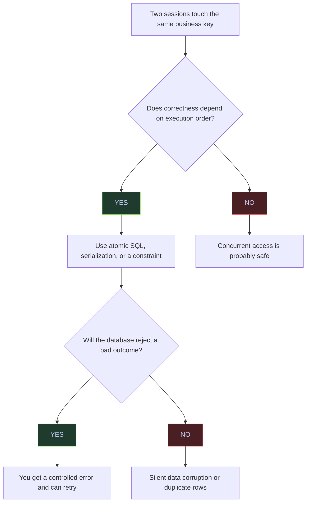

# Race Conditions

Race conditions do not usually raise an error. Both sessions complete, but the final data is wrong because correctness depended on timing.

## Why They Matter



Deadlocks are noisy because SQL Server throws `1205`. Race conditions are usually worse operationally because nothing fails fast. The job says "success", but the state is wrong.

## Pattern 1: Lost Update

The classic lost update is a read-then-write sequence where both sessions read the same old value and later overwrite each other.

> [!example]-
> **Setup**
> ```sql
> USE stoxx;
> GO
>
> IF OBJECT_ID('dbo.race_lost_update_demo', 'U') IS NOT NULL
>     DROP TABLE dbo.race_lost_update_demo;
> GO
>
> CREATE TABLE dbo.race_lost_update_demo
> (
>     id int NOT NULL PRIMARY KEY,
>     qty int NOT NULL
> );
> GO
>
> INSERT INTO dbo.race_lost_update_demo(id, qty)
> VALUES (1, 100);
> GO
> ```
>
> **Session 1**
> ```sql
> USE stoxx;
> GO
>
> DECLARE @qty int, @new_qty int;
>
> SELECT @qty = qty
> FROM dbo.race_lost_update_demo
> WHERE id = 1;
>
> WAITFOR DELAY '00:00:05';
>
> SET @new_qty = @qty - 10;
>
> UPDATE dbo.race_lost_update_demo
> SET qty = @new_qty
> WHERE id = 1;
>
> SELECT 'session1' AS actor, @qty AS read_qty, @new_qty AS write_qty;
> GO
> ```
>
> **Session 2**
> ```sql
> USE stoxx;
> GO
>
> DECLARE @qty int, @new_qty int;
>
> SELECT @qty = qty
> FROM dbo.race_lost_update_demo
> WHERE id = 1;
>
> WAITFOR DELAY '00:00:06';
>
> SET @new_qty = @qty - 20;
>
> UPDATE dbo.race_lost_update_demo
> SET qty = @new_qty
> WHERE id = 1;
>
> SELECT 'session2' AS actor, @qty AS read_qty, @new_qty AS write_qty;
> GO
> ```

> [!info]-
> Session 1 read `100` and later wrote `90`. Session 2 also read `100`, then overwrote the row with `80`. The two sessions both completed successfully, but one change was lost.

| actor | read_qty | write_qty |
|---|---:|---:|
| session1 | 100 | 90 |

*Session 1 read the original value `100` and wrote `90`. Alone, that would be correct.*

| actor | read_qty | write_qty |
|---|---:|---:|
| session2 | 100 | 80 |

*Session 2 also read `100`, not `90`, so it worked from stale state. Its final `UPDATE` overwrote Session 1's change.*

> [!info]-
> This final-state query proves whether both decrements were preserved or whether one was lost.

```sql
SELECT
    id,
    qty AS final_qty,
    70 AS expected_qty_if_serialized,
    CASE
        WHEN qty = 70 THEN 'no lost update'
        ELSE 'lost update occurred'
    END AS outcome
FROM dbo.race_lost_update_demo;
```

| id | final_qty | expected_qty_if_serialized | outcome |
|---:|---:|---:|---|
| 1 | 80 | 70 | lost update occurred |

*The correct serialized result would be `70`. The table ended at `80`, which proves that one decrement vanished even though neither session raised an error.*

## Fix 1: Make The Update Atomic

If the business operation is "subtract 10" or "increment by 1", express that directly in the `UPDATE` statement. That removes the stale read window.

> [!info]-
> These two sessions update the row atomically instead of computing the new value in the client or in variables.

```sql
-- Session 1
BEGIN TRAN;
WAITFOR DELAY '00:00:03';
UPDATE dbo.race_lost_update_demo
SET qty = qty - 10
WHERE id = 1;
COMMIT;

SELECT 'session1' AS actor, qty AS observed_qty_after_commit
FROM dbo.race_lost_update_demo
WHERE id = 1;
```

| actor | observed_qty_after_commit |
|---|---:|
| session1 | 90 |

*Session 1 commits first, reducing the quantity from `100` to `90`. That is still not the full story; the important check is the final value after both sessions finish.*

```sql
-- Session 2
BEGIN TRAN;
WAITFOR DELAY '00:00:03';
UPDATE dbo.race_lost_update_demo
SET qty = qty - 20
WHERE id = 1;
COMMIT;

SELECT 'session2' AS actor, qty AS observed_qty_after_commit
FROM dbo.race_lost_update_demo
WHERE id = 1;
```

| actor | observed_qty_after_commit |
|---|---:|
| session2 | 70 |

*Session 2 sees and preserves Session 1's change. Because the arithmetic stayed inside one atomic `UPDATE`, both decrements survive.*

> [!info]-
> This final-state query confirms whether the atomic pattern preserved both changes.

```sql
SELECT
    id,
    qty AS final_qty,
    70 AS expected_qty_if_atomic,
    CASE
        WHEN qty = 70 THEN 'atomic update preserved both changes'
        ELSE 'unexpected result'
    END AS outcome
FROM dbo.race_lost_update_demo;
```

| id | final_qty | expected_qty_if_atomic | outcome |
|---:|---:|---:|---|
| 1 | 70 | 70 | atomic update preserved both changes |

*This is the desired result. Atomic updates are the simplest fix for counter-style and balance-style writes.*

## Pattern 2: Check-Then-Insert Duplicate

This race appears when two sessions both ask "does the row exist?" and both answer "no" before either insert commits.

> [!example]-
> **Setup**
> ```sql
> USE stoxx;
> GO
>
> IF OBJECT_ID('dbo.race_insert_demo', 'U') IS NOT NULL
>     DROP TABLE dbo.race_insert_demo;
> GO
>
> CREATE TABLE dbo.race_insert_demo
> (
>     customer_code varchar(20) NOT NULL,
>     payload varchar(20) NOT NULL
> );
> GO
> ```
>
> **Session 1**
> ```sql
> USE stoxx;
> GO
>
> IF NOT EXISTS (
>     SELECT 1
>     FROM dbo.race_insert_demo
>     WHERE customer_code = 'C001'
> )
> BEGIN
>     WAITFOR DELAY '00:00:05';
>     INSERT INTO dbo.race_insert_demo(customer_code, payload)
>     VALUES ('C001', 'session1');
> END;
>
> SELECT 'session1' AS actor, COUNT(*) AS rows_for_key
> FROM dbo.race_insert_demo
> WHERE customer_code = 'C001';
> GO
> ```
>
> **Session 2**
> ```sql
> USE stoxx;
> GO
>
> IF NOT EXISTS (
>     SELECT 1
>     FROM dbo.race_insert_demo
>     WHERE customer_code = 'C001'
> )
> BEGIN
>     WAITFOR DELAY '00:00:06';
>     INSERT INTO dbo.race_insert_demo(customer_code, payload)
>     VALUES ('C001', 'session2');
> END;
>
> SELECT 'session2' AS actor, COUNT(*) AS rows_for_key
> FROM dbo.race_insert_demo
> WHERE customer_code = 'C001';
> GO
> ```

| actor | rows_for_key |
|---|---:|
| session1 | 1 |

*Session 1 inserts the row and sees one row for `C001`. At this point, nothing looks wrong.*

| actor | rows_for_key |
|---|---:|
| session2 | 2 |

*Session 2 also passed the existence check and inserted the same business key. It now sees two rows for `C001`.*

> [!info]-
> This final-state query checks whether the business key was duplicated.

```sql
SELECT
    customer_code,
    COUNT(*) AS duplicate_count,
    STRING_AGG(payload, ', ') WITHIN GROUP (ORDER BY payload) AS inserted_by,
    CASE
        WHEN COUNT(*) > 1 THEN 'phantom insert / duplicate occurred'
        ELSE 'single row only'
    END AS outcome
FROM dbo.race_insert_demo
GROUP BY customer_code;
```

| customer_code | duplicate_count | inserted_by | outcome |
|---|---:|---|---|
| C001 | 2 | session1, session2 | phantom insert / duplicate occurred |

*The application logic said "insert only if missing", but the database allowed two concurrent sessions to make the same decision. This is why existence checks without serialization or constraints are unsafe.*

## Fix 2: Add A Constraint Safety Net

Even if application code checks first, the database should still reject duplicate business keys.

> [!warning]
> The unique constraint is the safety net, not the whole concurrency strategy. Without retry logic or a serialized upsert pattern, one session will still fail under contention.

> [!info]-
> The safe table below adds a unique constraint on `customer_code`. The same two-session race still happens, but the second insert is rejected.

```sql
-- Safe setup
DROP TABLE IF EXISTS dbo.race_insert_demo_safe;

CREATE TABLE dbo.race_insert_demo_safe
(
    customer_code varchar(20) NOT NULL,
    payload varchar(20) NOT NULL,
    CONSTRAINT UQ_race_insert_demo_safe UNIQUE (customer_code)
);
```

| actor | rows_for_key |
|---|---:|
| session1 | 1 |

*Session 1 inserts successfully and the unique key remains valid.*

| source | message_number | message_text | rows_for_key |
|---|---:|---|---:|
| session2 | 2627 | Violation of UNIQUE KEY constraint 'UQ_race_insert_demo_safe'. Cannot insert duplicate key in object 'dbo.race_insert_demo_safe'. The duplicate key value is (C001). | 1 |

*Session 2 still races, but the database rejects the bad outcome instead of silently allowing it. This is the correct failure mode.*

> [!info]-
> This final-state query confirms that the unique constraint preserved a single row for the business key.

```sql
SELECT
    customer_code,
    COUNT(*) AS row_count,
    MIN(payload) AS surviving_payload,
    CASE
        WHEN COUNT(*) = 1 THEN 'unique constraint blocked duplicate'
        ELSE 'unexpected result'
    END AS outcome
FROM dbo.race_insert_demo_safe
GROUP BY customer_code;
```

| customer_code | row_count | surviving_payload | outcome |
|---|---:|---|---|
| C001 | 1 | session1 | unique constraint blocked duplicate |

*The final state is correct because the database enforced uniqueness. The correct application behavior is now to catch the duplicate-key error and either retry with a proper read path or accept that another session won the race.*

## Pattern 3: Dirty Read

`READ UNCOMMITTED` can read values that never commit. That is not just "slightly stale"; it is logically false data.

> [!danger]
> `NOLOCK` and `READ UNCOMMITTED` are not acceptable on correctness-sensitive pipeline tables, financial balances, or slowly changing dimensions. They can return rows that are rolled back moments later.

> [!example]-
> **Setup**
> ```sql
> USE stoxx;
> GO
>
> IF OBJECT_ID('dbo.race_dirty_read_demo', 'U') IS NOT NULL
>     DROP TABLE dbo.race_dirty_read_demo;
> GO
>
> CREATE TABLE dbo.race_dirty_read_demo
> (
>     id int NOT NULL PRIMARY KEY,
>     qty int NOT NULL
> );
> GO
>
> INSERT INTO dbo.race_dirty_read_demo(id, qty)
> VALUES (1, 100);
> GO
> ```
>
> **Writer**
> ```sql
> USE stoxx;
> GO
>
> BEGIN TRAN;
>
> UPDATE dbo.race_dirty_read_demo
> SET qty = 999
> WHERE id = 1;
>
> WAITFOR DELAY '00:00:08';
>
> ROLLBACK;
>
> SELECT 'writer_after_rollback' AS actor, qty AS committed_qty
> FROM dbo.race_dirty_read_demo
> WHERE id = 1;
> GO
> ```
>
> **Reader**
> ```sql
> USE stoxx;
> GO
>
> SET TRANSACTION ISOLATION LEVEL READ UNCOMMITTED;
>
> WAITFOR DELAY '00:00:02';
>
> SELECT 'reader_read_uncommitted' AS actor, qty AS observed_qty
> FROM dbo.race_dirty_read_demo
> WHERE id = 1;
> GO
> ```

| actor | committed_qty |
|---|---:|
| writer_after_rollback | 100 |

*After rollback, the committed value is still `100`. The change to `999` never became real database state.*

| actor | observed_qty |
|---|---:|
| reader_read_uncommitted | 999 |

*The reader observed `999`, which never committed. That is a dirty read: the query returned data that was never actually true from a committed-state perspective.*

> [!info]-
> This final-state query confirms the committed value after the writer rolls back.

```sql
SELECT
    id,
    qty AS final_committed_qty,
    CASE
        WHEN qty = 100 THEN 'dirty read demonstrated: uncommitted 999 never committed'
        ELSE 'unexpected result'
    END AS outcome
FROM dbo.race_dirty_read_demo;
```

| id | final_committed_qty | outcome |
|---:|---:|---|
| 1 | 100 | dirty read demonstrated: uncommitted 999 never committed |

*This is why dirty reads are dangerous. The query returned a value that never existed in committed history.*

## Serialization With `sp_getapplock`

For pipeline steps that must never overlap on the same business slice, an application lock can serialize the work even when the table design itself does not.

> [!info]-
> Both sessions below request the same named application lock. Session 1 acquires it immediately and holds it. Session 2 times out after waiting 3 seconds.
>
> Return codes from `sp_getapplock` are operationally important:
>
> - `0`: granted immediately
> - `1`: granted after waiting
> - `-1`: timed out
> - `-2`: canceled
> - `-3`: chosen as deadlock victim
> - `-999`: parameter or call error

```sql
-- Session 1
DECLARE @rc int;

EXEC @rc = sys.sp_getapplock
    @Resource = 'pipeline:gold_daily_summary:2025-04-07',
    @LockMode = 'Exclusive',
    @LockOwner = 'Session',
    @LockTimeout = 0;

SELECT 'session1' AS actor, @rc AS applock_result;
```

| actor | applock_result |
|---|---:|
| session1 | 0 |

*Session 1 acquired the application lock immediately. This is the expected leader behavior for a serialized pipeline step.*

```sql
-- Session 2
DECLARE @rc int;

EXEC @rc = sys.sp_getapplock
    @Resource = 'pipeline:gold_daily_summary:2025-04-07',
    @LockMode = 'Exclusive',
    @LockOwner = 'Session',
    @LockTimeout = 3000;

SELECT 'session2' AS actor, @rc AS applock_result;
```

| actor | applock_result |
|---|---:|
| session2 | -1 |

*Session 2 timed out because Session 1 already owned the same logical pipeline lock. That is often preferable to silent overlap.*

| Column | Value | Watch | Meaning | Implication |
|---|---|---|---|---|
| `applock_result` | `0` | &#9989; | Lock granted immediately. | This session owns the logical work slot. |
| `applock_result` | `1` | &#9989; | Lock granted after waiting. | Serialization worked, but there was contention. |
| `applock_result` | `-1` | &#10060; | Timeout. | Another session already owns the lock; decide whether to retry or skip. |
| `applock_result` | `-2` | &#10060; | Canceled. | The request was interrupted before success. |
| `applock_result` | `-3` | &#10060; | Deadlock victim. | Even application locks can participate in a deadlock cycle. |
| `applock_result` | `-999` | &#10060; | Call error. | The parameters or invocation were invalid. |

## Recommended Safe Patterns

- Use atomic `UPDATE` statements for arithmetic or state transitions.
- Back every business key with a real unique constraint or unique index.
- Use `SERIALIZABLE`, `UPDLOCK`, or `HOLDLOCK` only when the workload truly needs key-range protection; otherwise prefer simpler atomic DML.
- Use `sp_getapplock` to serialize pipeline slices such as one business date, one tenant, or one dimension reload.
- Avoid `NOLOCK` / `READ UNCOMMITTED` on any table where correctness matters.
- If you must upsert, do not rely on application-side existence checks alone. Pair the pattern with locking semantics and a unique constraint.

## Related

- [[15-blocking-and-locking]]
- [[16-deadlock-detection-and-prevention]]
- [[01-sql-server-loading-patterns]]

