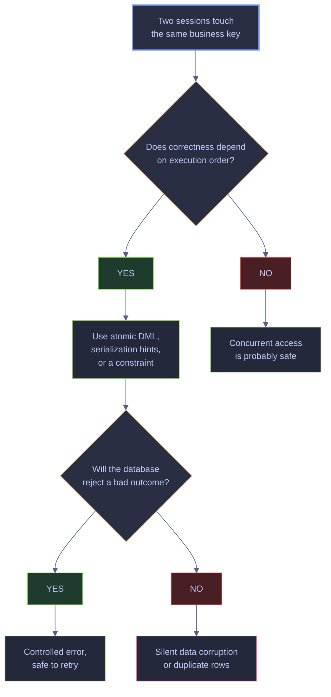

# Race Conditions

> [!abstract] Scope of this note
>
> This note covers the race-condition class of concurrency bugs in SQL Server: two or more sessions touching the same business state at the same time, each completing successfully, and the final data ending up wrong. It catalogues the five standard anomalies (lost update, dirty read, non-repeatable read, phantom read, write skew), demonstrates each one live against the `stoxx` database using a concurrent two-session runner, and shows the canonical fixes — atomic DML, `WITH (UPDLOCK, HOLDLOCK)`, `rowversion`-based optimistic concurrency, and `sp_getapplock`. Adjacent topics live in other notes:
>
> - **Lock modes, granularity, escalation, and blocking-chain DMVs** → [[16-blocking-and-locking]]
> - **Deadlock detection, system_health, and retry policy** → [[17-deadlock-detection-and-prevention]]
> - **MERGE semantics and UPSERT patterns** → [[11-merge-and-upsert]]
> - **TRY/CATCH and stored procedure error handling** → [[19-stored-procedures-dynamic-sql-and-error-handling]]

Race conditions do not usually raise an error. Both sessions complete, both return "success", and the final database state is wrong because correctness depended on timing that nobody wrote down. Deadlocks are noisy — SQL Server throws error `1205` and one session rolls back. Race conditions are usually **worse** operationally because nothing fails fast. The job log says "success", but the data is silently incorrect, and the bug is only discovered downstream when a reconciliation job, a customer complaint, or a regulatory audit surfaces the mismatch.

## Why Race Conditions Matter



Every node in the flowchart corresponds to a choice the note makes explicit in the sections below. The two hazard states at the bottom (controlled error vs silent corruption) are the reason every fix in this note ends either with a database-level rejection (error, unique-violation, snapshot-conflict) or with explicit serialization (application lock, key-range lock, atomic DML).

---

## Isolation Levels

The `TRANSACTION ISOLATION LEVEL` chosen by a session determines which races the engine prevents for you. Four of the five anomalies in this note can be eliminated entirely by picking a higher isolation level; the fifth (write skew) requires either `SERIALIZABLE` or explicit serialization. This section documents each level exactly once so the anomaly sections below can reference it without repetition.

### `READ UNCOMMITTED` | allow dirty reads for fastest throughput

`READ UNCOMMITTED` ignores shared locks on read and reads the current in-memory row state, whether committed or not. A query under this level can return values from an in-flight transaction that later rolls back — the query returned data that was never real. Synonymous with the `NOLOCK` table hint.

- **What it prevents:** nothing beyond the absence of read-blocking
- **What it allows:** dirty reads, non-repeatable reads, phantom reads, lost updates, write skew
- **When to use:** ad-hoc monitoring queries where "slightly wrong" is acceptable, never on correctness-sensitive paths
- **How to set:** `SET TRANSACTION ISOLATION LEVEL READ UNCOMMITTED;` or `WITH (NOLOCK)` hint

### `READ COMMITTED` | the default locking isolation

`READ COMMITTED` is the default on every SQL Server database unless it has been reconfigured. In its locking flavor (the default flavor when `is_read_committed_snapshot_on` is `OFF`), reads take shared locks that are released as soon as the row is returned. Writes take exclusive locks that are held until commit.

- **What it prevents:** dirty reads
- **What it allows:** non-repeatable reads, phantoms, lost updates, write skew
- **When to use:** the default for most OLTP workloads, but not strong enough to prevent lost updates or phantoms
- **How to set:** `SET TRANSACTION ISOLATION LEVEL READ COMMITTED;` (default)

### `READ COMMITTED SNAPSHOT` | RCSI row-versioned reads

When `is_read_committed_snapshot_on` is `ON` on a database, the `READ COMMITTED` level switches from locking to row-versioned. Reads consult the TempDB version store for the last committed version of each row instead of taking shared locks; writes still take exclusive locks until commit. RCSI is the single best concurrency improvement you can make to an OLTP database.

- **What it prevents:** dirty reads, reader/writer blocking
- **What it allows:** non-repeatable reads, phantoms, lost updates, write skew
- **When to use:** the modern OLTP default — always enable unless you have a specific reason not to
- **How to enable:** `ALTER DATABASE [db] SET READ_COMMITTED_SNAPSHOT ON WITH ROLLBACK IMMEDIATE;` (requires exclusive database access)

### `REPEATABLE READ` | hold shared locks until commit

`REPEATABLE READ` holds shared locks on every row a transaction reads until the transaction commits or rolls back. A second read of the same key inside the same transaction is guaranteed to return the same value because no concurrent writer can take an exclusive lock on that row.

- **What it prevents:** dirty reads, non-repeatable reads
- **What it allows:** phantoms (new rows can still be inserted into ranges), lost updates on read-compute-write patterns, write skew
- **When to use:** reports and calculations that re-read the same rows and must see a consistent snapshot of them
- **How to set:** `SET TRANSACTION ISOLATION LEVEL REPEATABLE READ;`

### `SNAPSHOT` | row-versioned with update-conflict detection

`SNAPSHOT` takes a logical snapshot of the database at the transaction's first read and serves every subsequent read from the TempDB version store as of that snapshot. Writes still take exclusive locks; if the transaction tries to update a row that another transaction has modified since the snapshot, SQL Server raises error `3960` and aborts the transaction. Requires `ALLOW_SNAPSHOT_ISOLATION ON` at the database level.

- **What it prevents:** dirty reads, non-repeatable reads, phantoms, lost updates (via the 3960 conflict detection)
- **What it allows:** **write skew** — two snapshot transactions modifying disjoint rows can each succeed while jointly violating an invariant
- **When to use:** long-running read-mostly transactions that must see a consistent point-in-time view; report generation; ETL readers
- **How to enable:** `ALTER DATABASE [db] SET ALLOW_SNAPSHOT_ISOLATION ON;` and `SET TRANSACTION ISOLATION LEVEL SNAPSHOT;`

### `SERIALIZABLE` | full isolation via key-range locks

`SERIALIZABLE` is the strictest isolation level. Reads take shared key-range locks that block any insert into the ranges the query touched, and every read lock is held until commit. It behaves as if the transactions were executed one after another, which prevents every anomaly including write skew and phantom reads. The cost is the highest blocking and deadlock potential.

- **What it prevents:** dirty reads, non-repeatable reads, phantoms, lost updates, write skew — every standard anomaly
- **What it allows:** nothing, but at the cost of maximum blocking and deadlock rate
- **When to use:** when correctness is non-negotiable and the workload is low enough to absorb the blocking — or for a single statement via the `HOLDLOCK` table hint
- **How to set:** `SET TRANSACTION ISOLATION LEVEL SERIALIZABLE;` or `WITH (HOLDLOCK)` hint

### Isolation level vs anomaly matrix | which level prevents which anomaly

| Isolation level | Dirty read | Non-repeatable read | Phantom | Lost update | Write skew |
|---|:-:|:-:|:-:|:-:|:-:|
| `READ UNCOMMITTED` | ❌ | ❌ | ❌ | ❌ | ❌ |
| `READ COMMITTED` (locking) | ✅ | ❌ | ❌ | ❌ | ❌ |
| `READ COMMITTED` (RCSI) | ✅ | ❌ | ❌ | ❌ | ❌ |
| `REPEATABLE READ` | ✅ | ✅ | ❌ | ❌ | ❌ |
| `SNAPSHOT` | ✅ | ✅ | ✅ | ✅ (via 3960) | ❌ |
| `SERIALIZABLE` | ✅ | ✅ | ✅ | ✅ | ✅ |

Two practical observations from this matrix:

- **RCSI and locking READ COMMITTED offer identical anomaly protection.** The difference is mechanical: RCSI avoids reader/writer blocking by versioning reads. Both leak non-repeatable reads, phantoms, lost updates, and write skew.
- **`SNAPSHOT` does not prevent write skew.** This is not a bug — it is a direct consequence of how snapshot isolation works (each transaction reads from its own snapshot and sees no writes from concurrent transactions). The [Write Skew section](#anomaly-write-skew) demonstrates this live.

### Inspection | query the current isolation level and database settings

Before running any of the demos below it is worth checking which concurrency features are actually enabled on the target database. The two flags that matter most for this note are `ALLOW_SNAPSHOT_ISOLATION` (required for `SNAPSHOT` and for the 3960 update-conflict behavior) and `READ_COMMITTED_SNAPSHOT` (which swaps locking `READ COMMITTED` for versioned reads). Both are exposed on `sys.databases` and do not require elevated permissions to inspect.

#### Read snapshot settings from sys.databases

The query below reports the two database-level concurrency flags for the `stoxx` database in a single row. `snapshot_isolation_state_desc` returns `ON` when `ALLOW_SNAPSHOT_ISOLATION` is enabled, and `is_read_committed_snapshot_on` returns `True` when RCSI is enabled. Both values are durable metadata that survive restart and are scoped to the database, not the session.

*Show the current session's transaction isolation level from `sys.dm_exec_sessions`, joined to the database's snapshot settings.*

```sql
SELECT
    name                            AS database_name,
    snapshot_isolation_state_desc   AS snapshot_iso,
    is_read_committed_snapshot_on   AS rcsi
FROM sys.databases
WHERE name = 'stoxx';
```

| name | snapshot_iso | rcsi |
|---|---|---|
| stoxx | ON | False |

*This is the baseline state the demos in this note run against: `ALLOW_SNAPSHOT_ISOLATION` is on (required for the write skew and snapshot-conflict demos), but RCSI is off — so `READ COMMITTED` uses locking, not row versioning. The distinction matters when reading the non-repeatable-read demo below: under RCSI the reader would still observe a non-repeatable read, because RCSI doesn't change `REPEATABLE READ` semantics at all.*

---

## Running the Demos

Every race in this note requires **two concurrent sessions**. You cannot reproduce them from a single connection because the essence of a race is that two connections interleave their statements. The demos in this note were captured with a custom concurrent runner (`race_demo.py`) that opens two pyodbc connections, synchronizes them on a threading barrier, and prints both sessions' result sets in markdown-table format. To reproduce them yourself you have three options:

- **Two SSMS tabs** — easiest for interactive exploration. Copy Session 1 into one tab, Session 2 into another, hit F5 on both in rapid succession. The `WAITFOR DELAY` statements are sized so a hit order within ~300 ms of each other produces the documented outcome.
- **Two `sqlcmd` windows** — use `sqlcmd -S localhost,1434 -U sa -P <pw> -d stoxx` in two terminals. Paste each session's SQL and press `GO` at the same time.
- **A concurrent Python helper** — the one used to capture every output on this page opens two pyodbc connections, executes the two session scripts in threads, and waits for both to finish.

> [!info] `WAITFOR DELAY` is the demo's timing primitive
>
> Every demo uses `WAITFOR DELAY` to serialize operations between sessions: Session 1 typically waits 100–200 ms before its first statement, Session 2 waits 400–500 ms, and both wait 2–3 seconds before their final update. This creates a deterministic timeline that makes the race reproducible across different machines and runners.

---

## Anomaly: Lost Update

The classic lost update is a read-then-write sequence where both sessions read the same old value and later overwrite each other, so one of the two writes disappears. It is the most common race-condition bug in application code and the easiest one to fix.

### Demonstration | read, wait, write with stale value

Both sessions read `qty = 100`, compute their new values (`90` and `80`) in client-side variables, and issue an `UPDATE` using the stale variable. The final row reflects only the last writer; the first session's decrement is completely lost.

#### Setup | create single-row demo table with qty = 100

The demo needs a single row whose value both sessions will race to update. A narrow two-column table is enough — `id` as the primary key and `qty` as the counter under contention. The `DROP TABLE IF EXISTS` ensures a clean slate so repeated runs of the demo start from exactly `qty = 100`.

*Setup — create a single-row demo table holding `qty = 100`.*

```sql
DROP TABLE IF EXISTS dbo.race_lost_update_demo;

CREATE TABLE dbo.race_lost_update_demo (
    id  int NOT NULL PRIMARY KEY,
    qty int NOT NULL
);

INSERT INTO dbo.race_lost_update_demo(id, qty) VALUES (1, 100);

SELECT id, qty FROM dbo.race_lost_update_demo;
```

| id | qty |
|---|---|
| 1 | 100 |

#### Session 1 | read into variable, wait, write qty - 10

Session 1 runs the classic read-then-write pattern application code uses when the business logic involves a computation on the client side. It captures the current `qty` into `@qty`, holds it across a two-second delay to simulate application-side processing, then issues the `UPDATE` using the stored variable. There is no protection between the read and the write — whatever Session 2 does in that window is invisible to this session.

*Session 1 — read the current quantity into a variable, wait, then write the variable minus 10.*

```sql
DECLARE @qty int;
WAITFOR DELAY '00:00:00.100';

SELECT @qty = qty FROM dbo.race_lost_update_demo WHERE id = 1;

WAITFOR DELAY '00:00:02';

UPDATE dbo.race_lost_update_demo SET qty = @qty - 10 WHERE id = 1;

SELECT 'session1' AS actor, @qty AS read_qty, @qty - 10 AS wrote_qty;
```

| actor | read_qty | wrote_qty |
|---|---|---|
| session1 | 100 | 90 |

#### Session 2 | read into variable, wait, write qty - 20

Session 2 runs the same pattern against the same row but decrements by 20 instead of 10. The 400 ms offset is chosen so that Session 2's `SELECT` fires after Session 1's `SELECT` but before Session 1's `UPDATE` commits. Both sessions therefore capture the pre-update value (`100`) into their own local variables and each compute their new value in isolation.

*Session 2 — same pattern, but decrement by 20, started 400 ms after Session 1 so both reads hit the same `100` value.*

```sql
DECLARE @qty int;
WAITFOR DELAY '00:00:00.500';

SELECT @qty = qty FROM dbo.race_lost_update_demo WHERE id = 1;

WAITFOR DELAY '00:00:03';

UPDATE dbo.race_lost_update_demo SET qty = @qty - 20 WHERE id = 1;

SELECT 'session2' AS actor, @qty AS read_qty, @qty - 20 AS wrote_qty;
```

| actor | read_qty | wrote_qty |
|---|---|---|
| session2 | 100 | 80 |

*Both sessions read `100` from the live database. Session 1 commits `qty = 90` at roughly t=2.1s. Session 2's `UPDATE` waits briefly on the exclusive lock and then writes `qty = 80` using its stale variable — Session 1's change is silently overwritten.*

#### Final state | verify the lost update against serialized expected value

With both sessions committed, the surviving value in `qty` shows which write won the race. A serialized execution (`100 - 10 - 20`) would leave `qty = 70`; the actual result comes from whichever session committed its variable-based `UPDATE` last. The query below makes the comparison explicit by emitting both the observed value and the expected serialized value in the same row.

*Final state — read the row and compare against what a properly serialized execution would have produced.*

```sql
SELECT
    id,
    qty AS final_qty,
    70  AS expected_if_serialized,
    CASE WHEN qty = 70 THEN 'no lost update' ELSE 'lost update occurred' END AS outcome
FROM dbo.race_lost_update_demo;
```

| id | final_qty | expected_if_serialized | outcome |
|---|---|---|---|
| 1 | 80 | 70 | lost update occurred |

*The correct serialized result is `70` (`100 - 10 - 20`). The actual result is `80` because Session 2 computed `100 - 20` from a stale variable that had nothing to do with the value Session 1 just wrote. Neither session raised an error, so application logs show two successful updates.*

> [!danger] Lost updates are silent and permanent
>
> Every counter, balance, and inventory quantity in an application that uses the read-variable-then-write pattern is vulnerable to this race. No error is raised, no log line is emitted, and the bug is only discovered when a reconciliation query finds that quantities don't balance.

> [!success] Use atomic DML or row-versioned optimistic updates
>
> The two canonical fixes are (1) express the delta inside the `UPDATE` statement so no client-side variable is involved, and (2) read with a `rowversion` column and include `WHERE row_version = @captured` in the update to detect the conflict. Both are demonstrated below.

### Fix | atomic `UPDATE` expresses the delta in SQL

If the business operation is "subtract 10" or "increment by 1", express that directly in the `UPDATE` statement as `SET qty = qty - 10`. There is no stale-read window because the value being modified is read and written inside the same statement under a single exclusive lock.

#### Reset | restore qty to 100 for a fresh run

The fix demo reuses the same `dbo.race_lost_update_demo` table left behind by the previous demo. Rather than dropping and recreating it, a one-line `UPDATE` resets the single row back to `qty = 100` so the two sessions below start from the same baseline as the broken version.

*Reset the row to `qty = 100` for a fresh run.*

```sql
UPDATE dbo.race_lost_update_demo SET qty = 100 WHERE id = 1;
SELECT qty FROM dbo.race_lost_update_demo WHERE id = 1;
```

| qty |
|---|
| 100 |

#### Session 1 | atomic UPDATE SET qty = qty - 10

Session 1 no longer reads `qty` into a local variable. Instead the decrement is expressed directly in the `SET` clause, so the engine reads the current value and writes the new value inside a single statement protected by one exclusive row lock. The business operation "subtract 10" is now entirely server-side and cannot be corrupted by a stale variable captured before any concurrent writer committed.

*Session 1 — atomic update.*

```sql
WAITFOR DELAY '00:00:00.100';

UPDATE dbo.race_lost_update_demo SET qty = qty - 10 WHERE id = 1;

SELECT 'session1' AS actor, 'applied qty - 10' AS action;
```

| actor | action |
|---|---|
| session1 | applied qty - 10 |

#### Session 2 | atomic UPDATE SET qty = qty - 20

Session 2 applies the same pattern with a different delta (`qty - 20`). Because Session 1 holds an exclusive lock on the row during its atomic `UPDATE`, Session 2's statement briefly waits until Session 1 commits, then reads the freshly committed value (`90`) and applies its own decrement. Both decrements are applied server-side against whatever the current value is, so the ordering of the two `UPDATE` statements no longer matters.

*Session 2 — atomic update with a different delta.*

```sql
WAITFOR DELAY '00:00:00.500';

UPDATE dbo.race_lost_update_demo SET qty = qty - 20 WHERE id = 1;

SELECT 'session2' AS actor, 'applied qty - 20' AS action;
```

| actor | action |
|---|---|
| session2 | applied qty - 20 |

*Session 2's `UPDATE` briefly waits on Session 1's exclusive lock, then reads the fresh value (`90`) and applies its own decrement to produce `70`. Both decrements survive because neither session ever held a stale copy in a variable.*

#### Final state | both decrements preserved

The final value in `qty` must equal `70` — the serialized expected result of applying both decrements to the initial `100`. The query below emits the observed value alongside the expected value and a CASE expression that turns the comparison into a human-readable outcome so the demo output makes the correctness of the fix unambiguous.

*Final state — the atomic pattern preserves both changes.*

```sql
SELECT
    id,
    qty AS final_qty,
    70  AS expected_if_atomic,
    CASE WHEN qty = 70 THEN 'atomic update preserved both changes' ELSE 'unexpected' END AS outcome
FROM dbo.race_lost_update_demo;
```

| id | final_qty | expected_if_atomic | outcome |
|---|---|---|---|
| 1 | 70 | 70 | atomic update preserved both changes |

*This is the correct and simplest fix for counter-style and balance-style writes. Whenever the business operation can be expressed as `SET column = column <op> constant`, that form is always race-free because the single `UPDATE` statement takes an exclusive row lock before reading the column value. The later [rowversion optimistic-concurrency section](#optimistic-concurrency-with-rowversion) covers the case where the write depends on a computation the database cannot express in a single statement.*

---

## Anomaly: Check-Then-Insert Duplicate

The second classic race appears in idempotent-insert code: "does a row with this key already exist? no? then insert it." Two sessions both run the existence check, both see "no", and both insert — producing two rows where one was intended. Unlike the lost update, this race is often caught later by a foreign key or unique-constraint violation, but when the table has no constraints the duplicate is silently permanent.

### Demonstration | two `NOT EXISTS` checks plus two `INSERT` statements

Both sessions check `NOT EXISTS` against the same business key, both see no rows, and both proceed to the `INSERT`. With no unique constraint on `customer_code`, both inserts succeed and the table ends up with two rows.

#### Setup | create table with no unique constraint

The demo needs a table whose business key is intentionally unprotected — no primary key, no unique constraint, no unique index. This removes the database-level safety net and forces the race to manifest as duplicate rows rather than a `2627` unique-violation error. A realistic schema would always have such a constraint; the demo deliberately omits it to show the outcome when application code relies solely on an existence check.

*Setup — create a table with no unique constraint on the business key.*

```sql
DROP TABLE IF EXISTS dbo.race_insert_demo;

CREATE TABLE dbo.race_insert_demo (
    customer_code varchar(20) NOT NULL,
    payload       varchar(20) NOT NULL
);

SELECT COUNT(*) AS initial_rows FROM dbo.race_insert_demo;
```

| initial_rows |
|---|
| 0 |

#### Session 1 | check-then-insert with delay between check and insert

Session 1 runs the application-level upsert pattern: first `IF NOT EXISTS` against the business key, then a deliberate two-second `WAITFOR DELAY` inside the `IF` block, then the `INSERT`. The delay simulates any realistic workload where the application does some processing between "does this already exist?" and "ok, create it". Under the default `READ COMMITTED` isolation level, the existence check takes a shared lock that is released immediately, leaving the key range completely unlocked during the wait.

*Session 1 — check-then-insert with a delay between the check and the insert so Session 2 has time to run its own check before either insert commits.*

```sql
WAITFOR DELAY '00:00:00.100';

IF NOT EXISTS (SELECT 1 FROM dbo.race_insert_demo WHERE customer_code = 'C001')
BEGIN
    WAITFOR DELAY '00:00:02';
    INSERT INTO dbo.race_insert_demo(customer_code, payload) VALUES ('C001', 'session1');
END

SELECT 'session1' AS actor, COUNT(*) AS rows_for_key
FROM dbo.race_insert_demo WHERE customer_code = 'C001';
```

| actor | rows_for_key |
|---|---|
| session1 | 1 |

#### Session 2 | identical check-then-insert pattern

Session 2 runs exactly the same existence-check-then-insert pattern, starting 400 ms after Session 1. That offset is chosen so Session 2's `IF NOT EXISTS` fires while Session 1 is still inside its two-second delay — before Session 1 has inserted its row. Session 2 therefore sees an empty result from its own check and enters its `INSERT` branch, producing a duplicate that the database has no way to reject.

*Session 2 — same pattern.*

```sql
WAITFOR DELAY '00:00:00.500';

IF NOT EXISTS (SELECT 1 FROM dbo.race_insert_demo WHERE customer_code = 'C001')
BEGIN
    WAITFOR DELAY '00:00:02';
    INSERT INTO dbo.race_insert_demo(customer_code, payload) VALUES ('C001', 'session2');
END

SELECT 'session2' AS actor, COUNT(*) AS rows_for_key
FROM dbo.race_insert_demo WHERE customer_code = 'C001';
```

| actor | rows_for_key |
|---|---|
| session2 | 2 |

*When Session 1 ran its existence check the row did not exist (`COUNT = 0`). When Session 2 ran its existence check a few hundred milliseconds later, the row **still** did not exist — because Session 1 was waiting on its internal `WAITFOR DELAY` before issuing the `INSERT`. Both sessions then inserted. Session 2's final count of `2` is the first moment either session became aware of the duplicate.*

#### Final state | two rows for the same business key

A grouped query confirms the duplicate and, via `STRING_AGG`, shows which sessions wrote the colliding rows. This is the diagnostic shape a reconciliation job would use in production: count rows per business key and surface keys where the count exceeds one. In a table with no unique constraint this is the only way the duplicate will ever be discovered.

*Final state — the table holds two rows for the same business key.*

```sql
SELECT
    customer_code,
    COUNT(*) AS duplicate_count,
    STRING_AGG(payload, ', ') WITHIN GROUP (ORDER BY payload) AS inserted_by,
    CASE WHEN COUNT(*) > 1 THEN 'phantom insert / duplicate occurred' ELSE 'single row only' END AS outcome
FROM dbo.race_insert_demo
GROUP BY customer_code;
```

| customer_code | duplicate_count | inserted_by | outcome |
|---|---|---|---|
| C001 | 2 | session1, session2 | phantom insert / duplicate occurred |

*The application logic said "insert only if missing" but the database allowed two concurrent sessions to both pass the existence check. This is why existence-check-without-serialization is never a safe upsert pattern.*

> [!warning] Application-side existence checks are never enough
>
> A `SELECT` followed by an `INSERT` in application code is never race-safe on its own, regardless of how carefully the application code is written. The window between the check and the insert is always exploitable under concurrency.

> [!success] Pair the check with a unique constraint **and** `UPDLOCK + HOLDLOCK`
>
> The two fixes combine: a unique constraint guarantees the database rejects the second insert (a controlled error, not a silent duplicate), and `WITH (UPDLOCK, HOLDLOCK)` on the existence check serializes the two sessions so one waits for the other instead of racing. The next subsection demonstrates the combined pattern.

### Fix | `WITH (UPDLOCK, HOLDLOCK)` serializes the upsert

The canonical race-free upsert pattern in SQL Server uses two table hints on the existence check:

- **`UPDLOCK`** — take a U (update) lock instead of the usual S (shared) lock. U locks are compatible with S but not with other U locks, so two concurrent U-lock acquirers serialize instead of both proceeding.
- **`HOLDLOCK`** — hold the lock until the end of the transaction (equivalent to `SERIALIZABLE` for that statement). Combined with `UPDLOCK`, this takes a key-range lock that prevents any insert into the range.

Together, `UPDLOCK + HOLDLOCK` on the existence check makes the first session "own" the business key for the duration of its transaction. The second session waits on the U lock until the first commits, then re-runs the existence check and sees the row the first session just inserted — so it takes the UPDATE branch instead of the INSERT branch.

#### Setup | table with primary key plus update_count column

The fix demo uses a correctly constrained table: `customer_code` is the primary key, and an `update_count` column lets the demo prove that both sessions actually ran against the same row. The first session will see `IF EXISTS` return false and insert with `update_count = 1`; the second session, after waiting on the range lock, will see `IF EXISTS` return true and increment `update_count` to `2`. That final value is the load-bearing proof that the serialization worked.

*Setup — a table with a primary key on the business key, plus a payload and an update counter so we can prove both sessions ran.*

```sql
DROP TABLE IF EXISTS dbo.race_upsert_demo;

CREATE TABLE dbo.race_upsert_demo (
    customer_code varchar(20) NOT NULL PRIMARY KEY,
    payload       varchar(20) NOT NULL,
    update_count  int         NOT NULL
);
```

#### Session 1 | UPDLOCK HOLDLOCK existence check and insert branch

Session 1 wraps the existence-check-then-insert pattern in an explicit `BEGIN TRAN` / `COMMIT` and adds the `WITH (UPDLOCK, HOLDLOCK)` table hint to the `EXISTS` predicate. The combination takes a U-mode key-range lock on the slot where `customer_code = 'C001'` would live, whether the row exists yet or not. Session 1 sees no row, takes the `INSERT` branch, commits, and releases the range lock — and for the entire duration of its transaction no other session can even run the existence check against that key.

*Session 1 — upsert pattern with `UPDLOCK, HOLDLOCK` inside an explicit transaction.*

```sql
BEGIN TRAN;

WAITFOR DELAY '00:00:00.100';

IF EXISTS (
    SELECT 1 FROM dbo.race_upsert_demo WITH (UPDLOCK, HOLDLOCK)
    WHERE customer_code = 'C001'
)
BEGIN
    UPDATE dbo.race_upsert_demo
    SET payload = 'session1', update_count = update_count + 1
    WHERE customer_code = 'C001';
    SELECT 'session1' AS actor, 'updated' AS action;
END
ELSE
BEGIN
    INSERT INTO dbo.race_upsert_demo(customer_code, payload, update_count)
    VALUES ('C001', 'session1', 1);
    SELECT 'session1' AS actor, 'inserted' AS action;
END

COMMIT;
```

| actor | action |
|---|---|
| session1 | inserted |

#### Session 2 | same upsert pattern 200 ms later

Session 2 runs the identical `UPDLOCK + HOLDLOCK` upsert, starting 200 ms after Session 1. Because Session 1 already holds the range lock, Session 2's own existence check blocks at the lock manager until Session 1 commits. When the lock is released, Session 2 re-runs its existence check and now finds the row Session 1 just inserted, so it takes the `UPDATE` branch and increments `update_count`. This is the exact serialization the fix is supposed to produce.

*Session 2 — same pattern, started 200 ms later.*

```sql
WAITFOR DELAY '00:00:00.300';

BEGIN TRAN;

IF EXISTS (
    SELECT 1 FROM dbo.race_upsert_demo WITH (UPDLOCK, HOLDLOCK)
    WHERE customer_code = 'C001'
)
BEGIN
    UPDATE dbo.race_upsert_demo
    SET payload = 'session2', update_count = update_count + 1
    WHERE customer_code = 'C001';
    SELECT 'session2' AS actor, 'updated' AS action;
END
ELSE
BEGIN
    INSERT INTO dbo.race_upsert_demo(customer_code, payload, update_count)
    VALUES ('C001', 'session2', 1);
    SELECT 'session2' AS actor, 'inserted' AS action;
END

COMMIT;
```

| actor | action |
|---|---|
| session2 | updated |

*Session 1 took the `UPDLOCK + HOLDLOCK` range lock on the empty slot for `C001`, saw no row, inserted, committed, and released the lock. Session 2's own `EXISTS` check waited on that range lock. As soon as Session 1 committed, Session 2 acquired the lock, re-ran the existence check, saw the row Session 1 just inserted, and took the UPDATE branch — incrementing `update_count` to 2.*

#### Final state | one row, update_count = 2 proves serialization

The row-count and `update_count` together form the correctness proof: exactly one row exists for `C001` (no duplicate), and `update_count = 2` shows that both sessions successfully touched it in sequence rather than one losing to a unique-violation error or silently overwriting the other. The `payload = 'session2'` value further confirms which session wrote last.

*Final state — one row, and `update_count = 2` proves both sessions ran in serialized order.*

```sql
SELECT
    customer_code,
    payload AS final_payload,
    update_count,
    CASE WHEN update_count = 2 THEN 'serialized upsert: both sessions ran' ELSE 'unexpected' END AS outcome
FROM dbo.race_upsert_demo
WHERE customer_code = 'C001';
```

| customer_code | final_payload | update_count | outcome |
|---|---|---|---|
| C001 | session2 | 2 | serialized upsert: both sessions ran |

*This is the pattern to use for every upsert in SQL Server application code. It is correct, safe under all isolation levels, and cross-compatible with `MERGE` statements — see [[11-merge-and-upsert#upsert-patterns-before-merge]] for the full discussion of when to use `MERGE` vs an explicit `IF EXISTS` upsert. The unique constraint / primary key is still a required safety net: if the `UPDLOCK + HOLDLOCK` hints are ever accidentally removed from a code path, the constraint ensures the duplicate is rejected with error `2627` instead of silently accepted.*

> [!tip] `UPDLOCK` alone is not enough
>
> `UPDLOCK` by itself prevents the two-sessions-upgrade-to-X-lock deadlock, but without `HOLDLOCK` the lock is released as soon as the `SELECT` finishes, re-opening the race window before the `INSERT` runs. You need both hints to get serialization, and both must be on the **existence check**, not on the later `UPDATE`.

---

## Anomaly: Dirty Read

`READ UNCOMMITTED` can read values that never commit. This is not "slightly stale" — it is logically false data. A reader can see a value, report it to an application, and the underlying writer can then roll back so the value disappears from committed history entirely.

### Demonstration | writer rolls back, reader already observed the uncommitted value

This demo requires two sessions to interleave: a writer that updates then rolls back, and a reader under `READ UNCOMMITTED` that observes the in-flight update before the rollback fires. The reader's observation is the dirty read — a value that existed in the row's data page for a few hundred milliseconds but was never part of the database's committed history.

#### Setup | create single-row table with qty = 100

The demo uses the same narrow two-column shape as the lost-update demo. The only durable state needed is a single row with a known starting value so the reader's observation of `999` can be unambiguously identified as data that differs from both the pre-transaction and post-rollback committed state.

*Setup.*

```sql
DROP TABLE IF EXISTS dbo.race_dirty_read_demo;

CREATE TABLE dbo.race_dirty_read_demo (
    id  int NOT NULL PRIMARY KEY,
    qty int NOT NULL
);

INSERT INTO dbo.race_dirty_read_demo(id, qty) VALUES (1, 100);
```

#### Writer | update to 999, wait 3 seconds, ROLLBACK

The writer opens an explicit transaction, changes `qty` to `999`, and holds the transaction open for three seconds under an exclusive row lock before issuing `ROLLBACK`. During those three seconds the row's data page contains the value `999` even though no `COMMIT` has ever been issued for it. After the rollback, the engine restores the row to `100` and the transaction leaves no trace — as if it had never run.

*Writer — open a transaction, change the value to `999`, wait 3 seconds, then ROLLBACK. After rollback the committed value is still `100`.*

```sql
WAITFOR DELAY '00:00:00.100';

BEGIN TRAN;

UPDATE dbo.race_dirty_read_demo SET qty = 999 WHERE id = 1;

WAITFOR DELAY '00:00:03';

ROLLBACK;

SELECT 'writer_after_rollback' AS actor, qty AS committed_qty
FROM dbo.race_dirty_read_demo WHERE id = 1;
```

| actor | committed_qty |
|---|---|
| writer_after_rollback | 100 |

#### Reader | READ UNCOMMITTED observes the uncommitted 999

The reader sets its transaction isolation level to `READ UNCOMMITTED`, waits 1.5 seconds so the writer is mid-transaction with `qty = 999` but has not yet rolled back, then issues a `SELECT`. Because `READ UNCOMMITTED` ignores exclusive locks and reads the row's current data-page content, the reader sees `999` — the value that is about to be discarded. This is the dirty read: a value the reader returned as fact but which never became committed state.

*Reader — under `READ UNCOMMITTED`, ignore the writer's exclusive lock and read whatever is in the row's data page. Times its read for roughly 1.5 seconds after the writer begins, so the writer has updated to `999` but not yet rolled back.*

```sql
SET TRANSACTION ISOLATION LEVEL READ UNCOMMITTED;

WAITFOR DELAY '00:00:01.500';

SELECT 'reader_read_uncommitted' AS actor, qty AS observed_qty
FROM dbo.race_dirty_read_demo WHERE id = 1;
```

| actor | observed_qty |
|---|---|
| reader_read_uncommitted | 999 |

*The reader observed `999`, which was never committed. The writer's later ROLLBACK removed `999` from the committed-state history entirely. If the reader used that value to make a decision — sending a shipment, paying a balance, writing to another table — that decision is now wrong and there is no record in `stoxx` that the value `999` ever existed.*

#### Final state | committed value is still 100, the 999 never existed

After both sessions finish, a committed read against the row returns `100`. There is no committed history in which `qty = 999`, and no DMV, no transaction log inspection, and no audit trail will show that the value ever existed in committed state. The only evidence the reader ever saw `999` is whatever that session recorded downstream — a log line, an HTTP response, a write to another table — which is exactly why dirty reads are so dangerous in data pipelines.

*Final state — after the writer rolls back, the committed value is still `100`. The `999` the reader saw was never real.*

```sql
SELECT
    id,
    qty AS final_committed_qty,
    CASE WHEN qty = 100 THEN 'dirty read demonstrated: 999 never committed' ELSE 'unexpected' END AS outcome
FROM dbo.race_dirty_read_demo;
```

| id | final_committed_qty | outcome |
|---|---|---|
| 1 | 100 | dirty read demonstrated: 999 never committed |

*This is why dirty reads are dangerous: the query returned a value that never existed in committed history, and no amount of post-hoc audit can prove that it did.*

> [!danger] `NOLOCK` is not acceptable on correctness-sensitive paths
>
> `NOLOCK` and `READ UNCOMMITTED` are not acceptable on pipeline tables, financial balances, regulatory reports, or slowly-changing dimensions. They can return values that are rolled back moments later, produce counts that are impossible under committed state, and skip rows that move during a scan.

> [!success] Enable RCSI and remove `NOLOCK` hints instead
>
> On databases where `NOLOCK` is used to avoid reader/writer blocking, the correct fix is to enable Read Committed Snapshot Isolation (`ALTER DATABASE [db] SET READ_COMMITTED_SNAPSHOT ON`). Versioned reads achieve the same non-blocking behavior without returning uncommitted data. Remove every `NOLOCK` and `WITH (READUNCOMMITTED)` hint from the codebase as part of the RCSI rollout.

---

## Anomaly: Non-repeatable Read

A non-repeatable read happens when a transaction reads the same row twice and gets different values, because another transaction updated and committed between the two reads. It can happen under `READ UNCOMMITTED`, `READ COMMITTED`, and RCSI, but not under `REPEATABLE READ` or higher.

### Demonstration | same row, two different values inside one transaction

This demo interleaves a reader inside an explicit transaction with a concurrent writer that updates the same row and commits. The reader reads twice — once before the writer commits, once after — and observes two different values despite both reads happening inside the same transaction. That is the textbook non-repeatable read: the transaction cannot re-read a row and get the same value.

#### Setup | create single-row table with qty = 100

The setup mirrors the previous demos: a narrow two-column table with one row. The starting value of `100` is chosen so that the reader's first `SELECT` and the writer's later update produce visibly different numbers (`100` vs `999`) that the final output can compare directly.

*Setup.*

```sql
DROP TABLE IF EXISTS dbo.race_nonrepeat_demo;

CREATE TABLE dbo.race_nonrepeat_demo (
    id  int NOT NULL PRIMARY KEY,
    qty int NOT NULL
);

INSERT INTO dbo.race_nonrepeat_demo(id, qty) VALUES (1, 100);
```

#### Reader | READ COMMITTED transaction with two SELECTs around a delay

The reader opens an explicit transaction under the default `READ COMMITTED` isolation level, reads `qty` into `@read1`, waits two seconds, then reads `qty` again into `@read2`. Because `READ COMMITTED` releases shared locks as soon as each row is returned, the row is unlocked during the two-second gap — any writer that commits during that window will be visible to the second read. The `CASE` expression at the bottom turns the comparison into a single `repeatable` / `non-repeatable` outcome label.

*Reader — explicit transaction under `READ COMMITTED`, reads the same row twice with a delay between reads. The reader sees `100` the first time and `999` the second time because the writer committed in between.*

```sql
SET TRANSACTION ISOLATION LEVEL READ COMMITTED;
DECLARE @read1 int, @read2 int;

BEGIN TRAN;

WAITFOR DELAY '00:00:00.200';
SELECT @read1 = qty FROM dbo.race_nonrepeat_demo WHERE id = 1;

WAITFOR DELAY '00:00:02';

SELECT @read2 = qty FROM dbo.race_nonrepeat_demo WHERE id = 1;

COMMIT;

SELECT 'reader' AS actor, @read1 AS first_read, @read2 AS second_read,
       CASE WHEN @read1 = @read2 THEN 'repeatable' ELSE 'non-repeatable' END AS outcome;
```

| actor | first_read | second_read | outcome |
|---|---|---|---|
| reader | 100 | 999 | non-repeatable |

#### Writer | UPDATE committed between the reader's two SELECTs

The writer waits one second from its own start (which corresponds to roughly t=1s in the reader's timeline, between the reader's first and second `SELECT`), then issues an `UPDATE` that changes `qty` to `999`. Under `READ COMMITTED` the reader's first `SELECT` has already released its shared lock, so the writer takes an exclusive lock without blocking, applies the change, and commits immediately. The reader's second `SELECT` then sees the new committed value.

*Writer — updates and commits one second into the reader's transaction, between the reader's two `SELECT` statements.*

```sql
WAITFOR DELAY '00:00:01';

UPDATE dbo.race_nonrepeat_demo SET qty = 999 WHERE id = 1;

SELECT 'writer' AS actor, 'committed qty = 999' AS message;
```

| actor | message |
|---|---|
| writer | committed qty = 999 |

*Under `READ COMMITTED` (the default), the reader's first `SELECT` took a shared lock, read `100`, and released the lock immediately. The writer then took an exclusive lock, committed `999`, and released. The reader's second `SELECT` saw the newly committed `999`. Both reads were "correct" — they both read committed state at the moment they ran — but within the same transaction the reader observed two different values for the same row, which is the definition of non-repeatable.*

### Fix | `REPEATABLE READ` holds shared locks until commit

Promoting the reader's transaction to `REPEATABLE READ` makes the first `SELECT` hold its shared lock on the row until the transaction commits. The writer's `UPDATE` then has to wait on that shared lock, so the reader's second `SELECT` sees the same value as the first.

#### Reset | restore qty to 100

Between the broken demo and the fix demo the row has already been updated to `999`. A single-line `UPDATE` returns it to the `100` baseline so the fix demo starts from the same state as the broken one and the comparison between the two outcomes is fair.

*Reset the row to `100` for a clean run.*

```sql
UPDATE dbo.race_nonrepeat_demo SET qty = 100 WHERE id = 1;
```

#### Reader | REPEATABLE READ transaction holding shared locks until commit

The only change from the broken demo is the isolation level: `SET TRANSACTION ISOLATION LEVEL REPEATABLE READ;` before `BEGIN TRAN`. Under this level, shared locks on every row the reader touches are held until `COMMIT` or `ROLLBACK`. The first `SELECT` therefore acquires a shared lock on the `id = 1` row and keeps it for the full duration of the transaction, preventing any concurrent writer from acquiring the exclusive lock it would need to change the value.

*Reader under `REPEATABLE READ`.*

```sql
SET TRANSACTION ISOLATION LEVEL REPEATABLE READ;
DECLARE @read1 int, @read2 int;

BEGIN TRAN;

WAITFOR DELAY '00:00:00.200';
SELECT @read1 = qty FROM dbo.race_nonrepeat_demo WHERE id = 1;

WAITFOR DELAY '00:00:02';

SELECT @read2 = qty FROM dbo.race_nonrepeat_demo WHERE id = 1;

COMMIT;

SELECT 'reader' AS actor, @read1 AS first_read, @read2 AS second_read,
       CASE WHEN @read1 = @read2 THEN 'repeatable (writer blocked)' ELSE 'non-repeatable' END AS outcome;
```

| actor | first_read | second_read | outcome |
|---|---|---|---|
| reader | 100 | 100 | repeatable (writer blocked) |

#### Writer | UPDATE now blocks on the reader's shared lock

The writer runs exactly the same `UPDATE ... SET qty = 999` as before. The difference is that now the reader's shared lock is still held, so the writer's request for an exclusive lock blocks at the lock manager until the reader commits. The writer's wall-clock runtime is visibly longer in this demo than in the broken one — the delta is the time it spends waiting on the reader — but its final committed value is the same.

*Writer — same as before, but now blocks on the reader's shared lock until the reader commits.*

```sql
WAITFOR DELAY '00:00:01';

UPDATE dbo.race_nonrepeat_demo SET qty = 999 WHERE id = 1;

SELECT 'writer' AS actor, 'committed qty = 999' AS message;
```

| actor | message |
|---|---|
| writer | committed qty = 999 |

*Both reads now return `100`. The writer's `UPDATE` is blocked from t=1s until the reader commits at roughly t=2.2s, then applies its change against the post-commit state. The reader's transaction is "repeatable" in the sense that every re-read of the same row produces the same value.*

> [!info] `REPEATABLE READ` does not prevent phantom reads
>
> `REPEATABLE READ` holds shared locks on rows the reader actually touched. It does **not** lock the *ranges* the reader's `WHERE` clause covered, so new rows can still be inserted that would have satisfied the predicate. See the [Phantom Read section](#anomaly-phantom-read) for the demonstration of this distinction and for the `SERIALIZABLE` fix.

> [!tip] Prefer `SNAPSHOT` over `REPEATABLE READ` for long reads
>
> `REPEATABLE READ` achieves repeatability via shared locks, which block concurrent writers for the duration of the transaction. `SNAPSHOT` achieves repeatability via row versioning in TempDB, which does not block writers. On databases where `ALLOW_SNAPSHOT_ISOLATION` is enabled, prefer `SNAPSHOT` for any long-running read transaction — the locking overhead of `REPEATABLE READ` across many rows quickly becomes the primary blocking source for writers.

---

## Anomaly: Phantom Read

A phantom read is a non-repeatable read's range-based cousin: the same range query returns different rows inside a single transaction because another session inserted a new row matching the predicate between the two reads. `REPEATABLE READ` does not prevent this because it holds shared locks on existing rows, not on ranges. `SERIALIZABLE` does prevent it because it holds key-range locks that block inserts into the range.

### Demonstration | range query sees new rows mid-transaction under `REPEATABLE READ`

This demo shows that `REPEATABLE READ` is enough to prevent non-repeatable reads on existing rows but is **not** enough to prevent new rows from appearing in a range query. The reader runs a `COUNT(*)` with a predicate, waits, re-runs the same `COUNT(*)`, and sees a higher number because the writer inserted a matching row between the two reads.

#### Setup | two-row table with IX_race_phantom_category index

The demo table has an explicit non-clustered index on `category`. An index matters here because range locks are taken on index key positions — without an index the engine may take a more coarse lock (page or table) and the demonstration loses precision about what a key-range lock actually does. Two rows with `category = 'alpha'` provide the baseline that the reader will count at the start.

*Setup — a two-row table with an index on `category` to make the demo realistic (the phantom lock behavior is more obvious when there is an index the engine can take a range lock on).*

```sql
DROP TABLE IF EXISTS dbo.race_phantom_demo;

CREATE TABLE dbo.race_phantom_demo (
    id       int NOT NULL PRIMARY KEY,
    category varchar(20) NOT NULL,
    amount   int NOT NULL,
    INDEX IX_race_phantom_category (category)
);

INSERT INTO dbo.race_phantom_demo VALUES (1, 'alpha', 10), (2, 'alpha', 20);
```

#### Reader | REPEATABLE READ transaction counts alpha rows twice

The reader promotes its session to `REPEATABLE READ` and runs two `COUNT(*)` queries two seconds apart. `REPEATABLE READ` holds shared locks on every **row** the reader actually touches, which prevents updates to those rows. It does not hold any lock on the empty space between or after those rows, so any concurrent insert whose key does not collide with an existing locked row is free to proceed.

*Reader under `REPEATABLE READ` — counts the `alpha` rows twice.*

```sql
SET TRANSACTION ISOLATION LEVEL REPEATABLE READ;
DECLARE @count1 int, @count2 int;

BEGIN TRAN;

WAITFOR DELAY '00:00:00.200';
SELECT @count1 = COUNT(*) FROM dbo.race_phantom_demo WHERE category = 'alpha';

WAITFOR DELAY '00:00:02';

SELECT @count2 = COUNT(*) FROM dbo.race_phantom_demo WHERE category = 'alpha';

COMMIT;

SELECT 'reader' AS actor, @count1 AS first_count, @count2 AS second_count,
       CASE WHEN @count1 = @count2 THEN 'no phantom' ELSE 'phantom occurred' END AS outcome;
```

| actor | first_count | second_count | outcome |
|---|---|---|---|
| reader | 2 | 3 | phantom occurred |

#### Writer | INSERT new alpha row between the two counts

The writer waits one second and then inserts a third `alpha` row with `id = 3`. The insert does not collide with either of the two existing locked rows (`id = 1` and `id = 2`), so the engine places the new key position in the index without blocking. When the reader re-runs its count a second later, the new row is visible and the count returns `3` instead of `2` — the phantom read.

*Writer — inserts a new row in the same category one second into the reader's transaction.*

```sql
WAITFOR DELAY '00:00:01';

INSERT INTO dbo.race_phantom_demo(id, category, amount) VALUES (3, 'alpha', 30);

SELECT 'writer' AS actor, 'inserted id=3' AS message;
```

| actor | message |
|---|---|
| writer | inserted id=3 |

*The reader's first `SELECT` returned `2`. Between the two reads, the writer inserted a new row at a key position outside any range lock the reader held (because `REPEATABLE READ` does not take range locks). The reader's second `SELECT` found three `alpha` rows. The second count differs from the first — a phantom read.*

### Fix | `SERIALIZABLE` takes key-range locks that block the insert

Promoting the reader to `SERIALIZABLE` makes its `SELECT` acquire key-range locks that cover every key position satisfying the `WHERE` clause. The writer's `INSERT` then has to wait on the range lock until the reader commits, so the second count matches the first.

#### Reset | delete the phantom row

The previous demo left behind the `id = 3` row that caused the phantom. A single `DELETE` returns the table to the original two-row state so the fix demo starts from the same baseline and can be compared directly against the broken version.

*Reset.*

```sql
DELETE FROM dbo.race_phantom_demo WHERE id = 3;
```

#### Reader | SERIALIZABLE transaction acquires key-range locks

The only change from the broken demo is promoting the reader to `SERIALIZABLE`. Under this level, the `SELECT` takes key-range locks that cover not only the existing `alpha` rows but also the empty key positions where future matching rows could be inserted. The reader's first `COUNT(*)` therefore locks the entire `category = 'alpha'` range for the duration of the transaction.

*Reader under `SERIALIZABLE`.*

```sql
SET TRANSACTION ISOLATION LEVEL SERIALIZABLE;
DECLARE @count1 int, @count2 int;

BEGIN TRAN;

WAITFOR DELAY '00:00:00.200';
SELECT @count1 = COUNT(*) FROM dbo.race_phantom_demo WHERE category = 'alpha';

WAITFOR DELAY '00:00:02';

SELECT @count2 = COUNT(*) FROM dbo.race_phantom_demo WHERE category = 'alpha';

COMMIT;

SELECT 'reader' AS actor, @count1 AS first_count, @count2 AS second_count,
       CASE WHEN @count1 = @count2 THEN 'no phantom (range locked)' ELSE 'phantom occurred' END AS outcome;
```

| actor | first_count | second_count | outcome |
|---|---|---|---|
| reader | 2 | 2 | no phantom (range locked) |

#### Writer | INSERT blocks on the range lock until reader commits

The writer runs exactly the same `INSERT` as in the broken demo. The difference is that its request for a new key position in the `alpha` range now collides with the reader's key-range lock and blocks at the lock manager until the reader commits. Its wall-clock runtime is visibly longer than under `REPEATABLE READ` — that extra time is the price `SERIALIZABLE` charges for phantom-free counts.

*Writer — same INSERT, but it now blocks on the reader's range lock until the reader commits.*

```sql
WAITFOR DELAY '00:00:01';

INSERT INTO dbo.race_phantom_demo(id, category, amount) VALUES (3, 'alpha', 30);

SELECT 'writer' AS actor, 'inserted id=3 (may have waited)' AS message;
```

| actor | message |
|---|---|
| writer | inserted id=3 (may have waited) |

*Both counts return `2`. The writer's `INSERT` waited on the range lock from approximately t=1s until the reader committed at t=2.2s, then proceeded. Wall-clock latency of the writer is visibly higher under `SERIALIZABLE`, which is the trade-off for phantom-free reads.*

> [!warning] `SERIALIZABLE` escalates lock cost significantly
>
> Range locks on a predicate-heavy query can block many writers, and `SERIALIZABLE` transactions tend to escalate into table locks under memory pressure. Use `SERIALIZABLE` only for short critical sections where phantom-free counting or aggregation matters. For long-running reports that need a consistent view, prefer `SNAPSHOT`.

---

## Anomaly: Write Skew

Write skew is the subtle anomaly that `SNAPSHOT` isolation does not protect against. Two concurrent transactions each read overlapping rows, check an invariant, and update disjoint rows that individually satisfy the invariant — but jointly violate it. The classic example is on-call scheduling: at least one doctor must be on call, both doctors are currently on call, each doctor's request-off transaction verifies that at least one will remain, and both requests succeed.

### Demonstration | on-call scheduling invariant violated under `SNAPSHOT`

The business rule is: at least one doctor must remain on call at all times. The code checks `IF @count >= 2` before taking the doctor off-call (so removing one still leaves at least one on call). Both sessions pass this check against their independent snapshots and both update their own doctor's row. The result is zero doctors on call — invariant violated.

#### Setup | two doctors both initially on call

The scheduling table holds one row per doctor with a `bit` column recording their current on-call state. Both doctors start with `is_on_call = 1`, which is the state in which the invariant "at least one doctor is on call" holds. This is the precondition both off-call transactions will verify before they act.

*Setup — two doctors, both initially on call.*

```sql
DROP TABLE IF EXISTS dbo.race_writeskew_demo;

CREATE TABLE dbo.race_writeskew_demo (
    doctor     varchar(20) NOT NULL PRIMARY KEY,
    is_on_call bit NOT NULL
);

INSERT INTO dbo.race_writeskew_demo VALUES ('alice', 1), ('bob', 1);
```

#### Session 1 | Alice's request-off transaction under SNAPSHOT

Alice runs her off-call transaction under `SNAPSHOT` isolation. She reads the current number of on-call doctors into `@count`, waits two seconds to simulate application-side processing, then checks `IF @count >= 2` and takes herself off call if the check passes. Under `SNAPSHOT`, her read returns the row versions as of her transaction's start, and any concurrent writes by other sessions are invisible until they commit — and even then only if her transaction itself updates the same row.

*Session 1 — Alice's request-off transaction under `SNAPSHOT` isolation. Reads the count, waits, checks the invariant, and removes Alice from the on-call set if the count was ≥ 2.*

```sql
SET TRANSACTION ISOLATION LEVEL SNAPSHOT;
DECLARE @count int;

BEGIN TRAN;

WAITFOR DELAY '00:00:00.200';
SELECT @count = COUNT(*) FROM dbo.race_writeskew_demo WHERE is_on_call = 1;

WAITFOR DELAY '00:00:02';

IF @count >= 2
    UPDATE dbo.race_writeskew_demo SET is_on_call = 0 WHERE doctor = 'alice';

COMMIT;

SELECT 'alice' AS actor, @count AS saw_oncall_count,
       (SELECT is_on_call FROM dbo.race_writeskew_demo WHERE doctor = 'alice') AS alice_state_after;
```

| actor | saw_oncall_count | alice_state_after |
|---|---|---|
| alice | 2 | False |

#### Session 2 | Bob's request-off transaction under SNAPSHOT

Bob runs the exact same off-call transaction pattern, 200 ms after Alice. His snapshot is taken before Alice's transaction commits, so his `SELECT COUNT(*)` sees both doctors still on call (`@count = 2`) from his own frozen snapshot view. He passes the `>= 2` check and updates his own row. Because his `UPDATE` targets `doctor = 'bob'` — a different row from the one Alice updated — `SNAPSHOT` isolation's row-level conflict detection does not fire.

*Session 2 — Bob's request-off transaction, identical pattern but against his own row.*

```sql
SET TRANSACTION ISOLATION LEVEL SNAPSHOT;
DECLARE @count int;

BEGIN TRAN;

WAITFOR DELAY '00:00:00.400';
SELECT @count = COUNT(*) FROM dbo.race_writeskew_demo WHERE is_on_call = 1;

WAITFOR DELAY '00:00:03';

IF @count >= 2
    UPDATE dbo.race_writeskew_demo SET is_on_call = 0 WHERE doctor = 'bob';

COMMIT;

SELECT 'bob' AS actor, @count AS saw_oncall_count,
       (SELECT is_on_call FROM dbo.race_writeskew_demo WHERE doctor = 'bob') AS bob_state_after;
```

| actor | saw_oncall_count | bob_state_after |
|---|---|---|
| bob | 2 | False |

*Both sessions see `saw_oncall_count = 2` in their respective snapshots — neither snapshot contains the other's pending update. Both pass the `@count >= 2` check. Both update their own disjoint row. Both commit successfully with no error, because `SNAPSHOT` only detects update conflicts on the **same** row, and each session is updating a different row (alice vs bob).*

#### Final state | both doctors off call

A simple `SELECT` against the table shows the committed post-race state. Both rows now have `is_on_call = False`. Neither Alice's nor Bob's session raised an error; both returned success to their application. From the database's perspective everything is fine. From the business's perspective the hospital has zero doctors on call at an hour when at least one was supposed to be available.

*Final state — both doctors are off call. The invariant is broken.*

```sql
SELECT doctor, is_on_call FROM dbo.race_writeskew_demo ORDER BY doctor;
```

| doctor | is_on_call |
|---|---|
| alice | False |
| bob | False |

#### Invariant check | verify the at-least-one-on-call business rule

The business rule — "at least one doctor must be on call" — is not enforced by any constraint in the schema, so a query has to check it explicitly. The statement below sums the `is_on_call` bits and uses a `CASE` expression to translate the total into a clear `invariant holds` vs `WRITE SKEW: invariant violated` outcome. Any recurring integrity check in production would take this same shape.

*Invariant check — explicitly verify the business rule that at least one doctor must be on call.*

```sql
SELECT
    SUM(CAST(is_on_call AS int)) AS oncall_total,
    CASE
        WHEN SUM(CAST(is_on_call AS int)) >= 1 THEN 'invariant holds'
        ELSE 'WRITE SKEW: invariant violated - no one on call'
    END AS outcome
FROM dbo.race_writeskew_demo;
```

| oncall_total | outcome |
|---|---|
| 0 | WRITE SKEW: invariant violated - no one on call |

*This is the textbook write skew: two concurrent `SNAPSHOT` transactions, each acting correctly in isolation, jointly producing a state no single transaction would have produced. Neither session raised an error. Application logs show two successful request-off actions. The hospital is now without an on-call doctor and nobody knows.*

> [!danger] `SNAPSHOT` does not prevent write skew
>
> Write skew is the canonical `SNAPSHOT`-isolation anomaly. It happens whenever a business invariant depends on a set of rows but the transactions that enforce it update **disjoint** rows of that set. Because `SNAPSHOT` only detects update conflicts on the exact same row, each transaction's write doesn't conflict with the other, and both commit.

> [!success] Promote to `SERIALIZABLE` or serialize explicitly
>
> The two fixes for write skew are (1) promote the transaction to `SERIALIZABLE` so the read phase takes key-range locks that include every row satisfying the predicate (so any update to any of them by another session will conflict), or (2) serialize the entire business operation with `sp_getapplock` on a resource name like `oncall_schedule` so only one off-call transaction can run at a time. The [Serialization Hints section](#serialization-hints) below demonstrates `sp_getapplock` for exactly this pattern.

---

## SNAPSHOT Update Conflict | error 3960

`SNAPSHOT` does not prevent write skew, but it **does** prevent lost updates on the same row. When two `SNAPSHOT` transactions read the same row and both try to update it, the second transaction to commit hits error `3960` and is aborted. This is one of the strongest single-row safety nets SQL Server offers for OLTP write patterns where a full atomic `UPDATE` is not feasible.

### Demonstration | two snapshots cannot both update the same row

This demo replays the original lost-update pattern but with both sessions running under `SNAPSHOT` isolation. The first session commits as before, but the second session's `UPDATE` no longer overwrites the first — instead SQL Server detects that the second session's snapshot is stale relative to the row's current committed state and aborts the transaction with error `3960`. This is the controlled-failure mode that makes `SNAPSHOT` safe for same-row write patterns that cannot be expressed as a single atomic statement.

#### Setup | recreate the lost-update demo table

The table is identical to the lost-update demo's setup: a single row with `qty = 100`. Reusing the same shape makes the comparison direct — the only change between the broken lost-update demo and this one is that both sessions now set `SNAPSHOT` isolation, and the outcome changes from a silent overwrite to a visible error.

*Setup — reuse the lost-update table pattern.*

```sql
DROP TABLE IF EXISTS dbo.race_lost_update_demo;

CREATE TABLE dbo.race_lost_update_demo (
    id  int NOT NULL PRIMARY KEY,
    qty int NOT NULL
);

INSERT INTO dbo.race_lost_update_demo(id, qty) VALUES (1, 100);
```

#### Session 1 | SNAPSHOT read, wait, update, commit successfully

Session 1 opens a `SNAPSHOT` transaction, reads `qty` into `@q`, waits two seconds, and issues an `UPDATE`. Because no other transaction has modified the row since Session 1's snapshot was taken, the engine allows the `UPDATE` to proceed and commit normally. Session 1 behaves exactly as it would under any other isolation level — it is the winner of the race.

*Session 1 — read under `SNAPSHOT`, wait, update, commit.*

```sql
SET TRANSACTION ISOLATION LEVEL SNAPSHOT;

BEGIN TRAN;

WAITFOR DELAY '00:00:00.200';
DECLARE @q int;
SELECT @q = qty FROM dbo.race_lost_update_demo WHERE id = 1;

WAITFOR DELAY '00:00:02';

UPDATE dbo.race_lost_update_demo SET qty = @q - 10 WHERE id = 1;

COMMIT;

SELECT 'session1' AS actor, 'committed' AS outcome;
```

| actor | outcome |
|---|---|
| session1 | committed |

#### Session 2 | SNAPSHOT update aborts with error 3960

Session 2 runs the same pattern 200 ms later. Its snapshot is established while Session 1's transaction is still in-flight, so its read sees the pre-Session-1 row value. When Session 2 finally issues its own `UPDATE`, SQL Server checks whether any committed transaction has modified that row since Session 2's snapshot was taken — it has (Session 1) — so the engine raises error `3960` and aborts Session 2's transaction. The `COMMIT` statement at the end never runs; the transaction is already rolled back by the time control returns to the client.

*Session 2 — same pattern, starts slightly later. Its snapshot is taken before Session 1 commits, so its `UPDATE` will hit a conflict.*

```sql
SET TRANSACTION ISOLATION LEVEL SNAPSHOT;

BEGIN TRAN;

WAITFOR DELAY '00:00:00.400';
DECLARE @q int;
SELECT @q = qty FROM dbo.race_lost_update_demo WHERE id = 1;

WAITFOR DELAY '00:00:03';

UPDATE dbo.race_lost_update_demo SET qty = @q - 20 WHERE id = 1;

COMMIT;

SELECT 'session2' AS actor, 'committed' AS outcome;
```

```text
('42000', "[42000] [Microsoft][ODBC Driver 18 for SQL Server][SQL Server]Snapshot isolation transaction aborted due to update conflict. You cannot use snapshot isolation to access table 'dbo.race_lost_update_demo' directly or indirectly in database 'stoxx' to update, delete, or insert the row that has been modified or deleted by another transaction. Retry the transaction or change the isolation level for the update/delete statement. (3960) (SQLMoreResults)")
```

*Error `3960` is the `SNAPSHOT` update-conflict error. The engine detected that another committed transaction (Session 1) modified the row since Session 2's snapshot was established, so Session 2's update-or-delete cannot proceed on its stale snapshot view. The transaction is aborted; Session 2's `COMMIT` never runs. This is the controlled-failure mode you want: an error that tells the application to retry (see the [Retry Logic section](#retry-logic-and-error-codes)) rather than a silent lost update.*

> [!info] Error 3960 is the retryable cousin of lost updates
>
> Under `SNAPSHOT`, the lost update pattern from the first demo becomes error 3960 instead of a silent overwrite. The correct application response is to catch the error, re-read the row (which now sees the committed value from the winning session), and retry the operation. See the [Retry Logic section](#retry-logic-and-error-codes) for the full template.

---

## Optimistic Concurrency with `rowversion`

When the write depends on a computation the database cannot express in a single `UPDATE` statement (business rules, cross-row calculations, application-layer validation), the atomic-DML fix for lost updates no longer applies. The alternative is **optimistic concurrency** with a `rowversion` column: read the row together with its row version, perform the computation, then update with `WHERE row_version = @captured`. If another session has modified the row in the meantime, `@@ROWCOUNT` is `0` and the application retries.

### `rowversion` column | automatic version stamping

A `rowversion` column (formerly called `timestamp`) is an 8-byte binary column that SQL Server automatically bumps on every update to the row. It is a database-global monotonic counter — each version value is unique across the entire database, not just across rows. Every table can have at most one `rowversion` column, and inserts and updates populate it automatically; you never set it yourself.

#### Setup | create table with rowversion column

The demo table has a `rowversion` column named `row_version`. SQL Server manages this column internally — any `INSERT` assigns it a fresh value, any `UPDATE` assigns it a new, strictly greater value, and any attempt to `SET` it in an application statement is rejected. The `SELECT` after the insert reads the initial value so the column's binary shape (`0x00000000000004EB04` in this run) is visible in the output.

*Setup — a table with a `rowversion` column.*

```sql
DROP TABLE IF EXISTS dbo.race_rowversion_demo;

CREATE TABLE dbo.race_rowversion_demo (
    id          int NOT NULL PRIMARY KEY,
    qty         int NOT NULL,
    row_version rowversion NOT NULL
);

INSERT INTO dbo.race_rowversion_demo (id, qty) VALUES (1, 100);

SELECT id, qty, row_version FROM dbo.race_rowversion_demo;
```

| id | qty | row_version |
|---|---|---|
| 1 | 100 | 0x00000000000004EB04 |

*The `row_version` value is an opaque 8-byte counter the engine manages. Do not parse it — only compare it. Every time this row is updated, SQL Server will assign it a new, strictly greater value.*

### Demonstration | one winner, one conflict under concurrent optimistic updates

Both sessions run the optimistic-concurrency pattern: capture the row version alongside the value, perform the application-side computation, then update with `WHERE id = 1 AND row_version = @captured`. The first session to commit wins the race and bumps the row version. The second session's `UPDATE` matches zero rows because the captured version no longer equals the current version, and `@@ROWCOUNT = 0` is the signal the application uses to retry.

#### Session 1 | capture row_version, wait, update with WHERE row_version = @captured

Session 1 captures both the current `qty` and the current `row_version` into local variables, waits two seconds to simulate application-side computation, then issues an `UPDATE` whose `WHERE` clause compares against the captured `row_version`. At the moment the `UPDATE` runs, the row's version still matches what Session 1 captured, so one row is affected, `@@ROWCOUNT = 1`, and the application sees `applied` in the outcome column.

*Session 1 — capture the row version, wait, update with `WHERE row_version = @captured`.*

```sql
DECLARE @captured rowversion, @qty int, @rc int;

WAITFOR DELAY '00:00:00.100';

SELECT @captured = row_version, @qty = qty
FROM dbo.race_rowversion_demo WHERE id = 1;

WAITFOR DELAY '00:00:02';

UPDATE dbo.race_rowversion_demo
SET qty = @qty - 10
WHERE id = 1 AND row_version = @captured;

SET @rc = @@ROWCOUNT;

SELECT 'session1' AS actor, @rc AS rows_affected,
       CASE WHEN @rc = 1 THEN 'applied' ELSE 'conflict (retry)' END AS outcome;
```

| actor | rows_affected | outcome |
|---|---|---|
| session1 | 1 | applied |

#### Session 2 | same pattern, @@ROWCOUNT = 0 signals the conflict

Session 2 runs the same pattern 400 ms after Session 1. Its initial `SELECT` captures the same `row_version` value that Session 1 captured — they both read the pre-update version. But by the time Session 2 issues its `UPDATE`, Session 1 has already committed and bumped `row_version` to a new value. Session 2's `WHERE row_version = @captured` clause matches zero rows, and `@@ROWCOUNT = 0` is the controlled-failure signal the application uses to retry.

*Session 2 — same pattern. Reads the same initial `row_version`, attempts to update under the same `WHERE row_version = @captured` clause, finds no matching row because Session 1 has already bumped the version.*

```sql
DECLARE @captured rowversion, @qty int, @rc int;

WAITFOR DELAY '00:00:00.500';

SELECT @captured = row_version, @qty = qty
FROM dbo.race_rowversion_demo WHERE id = 1;

WAITFOR DELAY '00:00:03';

UPDATE dbo.race_rowversion_demo
SET qty = @qty - 20
WHERE id = 1 AND row_version = @captured;

SET @rc = @@ROWCOUNT;

SELECT 'session2' AS actor, @rc AS rows_affected,
       CASE WHEN @rc = 1 THEN 'applied' ELSE 'conflict (retry)' END AS outcome;
```

| actor | rows_affected | outcome |
|---|---|---|
| session2 | 0 | conflict (retry) |

*Session 1 captured `row_version = 0x...EB04`, computed `qty - 10 = 90`, and updated the row under `WHERE row_version = 0x...EB04`. The update matched, applied, and SQL Server automatically bumped `row_version` to a new value. Session 2 had captured the same `0x...EB04` before Session 1's update. Its `UPDATE` with the same `WHERE` clause matched zero rows — `@@ROWCOUNT = 0` — because the row's current version no longer matches the captured one. The application sees `rows_affected = 0` and knows it has a conflict to retry.*

#### Final state | one applied write, one pending retry

The committed value in `qty` is `90` — Session 1's decrement of 10, applied cleanly. Session 2's attempted decrement of 20 never reached the row because its optimistic check failed. In production, Session 2's application code would catch the `@@ROWCOUNT = 0` condition, re-read the row (picking up the new `row_version` and the current `qty = 90`), recompute the desired delta, and issue a fresh `UPDATE` under the new captured version — turning the lost update into a retryable conflict.

*Final state — one change applied, one pending retry.*

```sql
SELECT
    id,
    qty AS final_qty,
    CASE WHEN qty = 90 THEN 'one winner (90), one rejected retry' ELSE 'unexpected' END AS outcome
FROM dbo.race_rowversion_demo;
```

| id | final_qty | outcome |
|---|---|---|
| 1 | 90 | one winner (90), one rejected retry |

*This is the same controlled-failure mode as `SNAPSHOT` error 3960, but usable under any isolation level including the default `READ COMMITTED`. The pattern is portable to ORMs (Entity Framework Core, Dapper, LLBLGen) which all support `rowversion`/`ConcurrencyToken` out of the box, and it works for any write that cannot be expressed as a single atomic `UPDATE` statement.*

> [!tip] Always check `@@ROWCOUNT` after an optimistic update
>
> The whole point of the pattern is that `@@ROWCOUNT = 0` signals a conflict. Without checking it, the application silently swallows the conflict and thinks the update succeeded. Make the `@@ROWCOUNT` check a required part of every optimistic-update code path, and either surface a retryable error or loop on a bounded retry counter.

---

## Serialization Hints

When atomic DML is not expressible and `rowversion` is overkill, SQL Server offers three explicit serialization tools: query-level table hints, pre-existing unique constraints, and application locks. This section collects the three that apply to race-condition prevention; the full lock-mode reference is in [[16-blocking-and-locking]].

### `WITH (UPDLOCK, HOLDLOCK)` | the canonical race-free upsert pattern

Already demonstrated in the [check-then-insert fix](#fix--with-updlock-holdlock-serializes-the-upsert) above. Recap:

- `UPDLOCK` converts the shared lock on the existence check into an update lock, which is mutually exclusive with other update locks (preventing two concurrent upsert paths from both proceeding).
- `HOLDLOCK` holds the lock until end of transaction and takes a key-range lock on the predicate, preventing any insert that would satisfy the predicate from sneaking in.
- Applied to the `EXISTS` check inside an explicit transaction, it produces the canonical race-free upsert pattern.
- Pairs naturally with a `UNIQUE` constraint as a safety net (error 2627 if the hint is ever removed).

### `WITH (READPAST)` | skip locked rows for work-claim queues

`READPAST` tells a `SELECT` or `UPDATE` to skip rows that are currently held under incompatible locks, instead of blocking. Combined with `UPDLOCK` and `ROWLOCK`, it is the canonical pattern for a work-claim queue: each worker grabs the next unclaimed row without blocking other workers.

#### Template | atomic UPDATE TOP (1) OUTPUT with READPAST UPDLOCK ROWLOCK

The canonical work-claim statement is a single `UPDATE TOP (1) ... OUTPUT` with three table hints. `READPAST` skips any row that is already locked (i.e. currently claimed by another worker). `UPDLOCK` takes an update lock on the single row the worker does claim, so two workers competing for the same row are serialized rather than both racing. `ROWLOCK` prevents lock escalation from row to page or table level, which would otherwise serialize all workers once the queue is large enough. The `OUTPUT` clause returns the claimed row to the worker in the same statement, so the claim and the read are atomic — there is no intermediate state in which a row is marked `in_progress` but not yet visible to its claimer.

*Template — claim the next pending task from a queue without blocking other workers (illustrative, not run live because it requires a worker table pre-populated with pending rows).*

```sql
UPDATE TOP (1) dbo.work_queue WITH (READPAST, UPDLOCK, ROWLOCK)
SET status = 'in_progress', claimed_by = @worker_id, claimed_at = SYSUTCDATETIME()
OUTPUT inserted.task_id, inserted.payload
WHERE status = 'pending';
```

*The `UPDATE ... OUTPUT` form is itself atomic — the row is locked, claimed, and returned in one statement. `READPAST` makes the query skip over rows that another worker has already claimed (and therefore locked) instead of blocking. `ROWLOCK` prevents lock escalation to page or table level. The net effect is N workers can pull from the queue in parallel without serializing.*

> [!warning] `READPAST` on non-queue tables silently hides rows
>
> `READPAST` skips every row that is locked at the moment of the read, regardless of why. On a regular OLTP table it can silently return incomplete result sets during write bursts. Use it only for work-queue patterns where skipping locked rows is the intended behavior.

> [!success] Queue pattern + exponential backoff for empty queues
>
> When the `UPDATE ... WITH (READPAST, UPDLOCK, ROWLOCK)` returns zero rows the queue is either empty or fully claimed. The worker should wait with exponential backoff (1 s, 2 s, 4 s, up to a cap) before re-polling, to avoid hammering the queue when no work is available.

### `sp_getapplock` | coarse named serialization for pipeline slices

For pipeline steps that must never overlap on the same business slice — a gold-layer recompute for a single business date, a cross-account transfer, a dimension reload for a single tenant — a named **application lock** can serialize the work even when the table design itself does not. Application locks are independent of row and key locks, have a resource name the caller chooses, and support `Session` or `Transaction` scope.

#### Session 1 | acquire exclusive applock with @LockTimeout = 0

Session 1 is the "leader" for the named resource. It opens a transaction, calls `sys.sp_getapplock` with `@LockMode = 'Exclusive'` and `@LockTimeout = 0` to fail immediately if the lock is already held, holds the lock for four seconds to simulate a pipeline step, and commits. `@LockOwner = 'Transaction'` means the lock is released automatically when the transaction commits — no explicit `sp_releaseapplock` call is needed.

*Session 1 — acquire an exclusive application lock on a named resource with `@LockTimeout = 0` (fail immediately if contended), hold it for 4 seconds to simulate a pipeline step, then commit.*

```sql
DECLARE @rc int;

BEGIN TRAN;

EXEC @rc = sys.sp_getapplock
    @Resource    = 'pipeline:race_demo:2026-04-11',
    @LockMode    = 'Exclusive',
    @LockOwner   = 'Transaction',
    @LockTimeout = 0;

WAITFOR DELAY '00:00:04';

COMMIT;

SELECT 'session1' AS actor, @rc AS applock_result;
```

| actor | applock_result |
|---|---|
| session1 | 0 |

#### Session 2 | wait 2 seconds then time out with return code -1

Session 2 starts 500 ms after Session 1 and requests the same named resource. It passes `@LockTimeout = 2000` so it waits up to two seconds for the lock before giving up. Session 1 holds the lock for four seconds, so Session 2's wait times out and `sp_getapplock` returns `-1`. The application sees this as a clean "skip this run" signal — no exception is raised and the transaction can be committed or rolled back at the application's discretion.

*Session 2 — start 500 ms later, same resource name, `@LockTimeout = 2000` (wait up to 2 seconds, then give up).*

```sql
WAITFOR DELAY '00:00:00.500';

DECLARE @rc int;

BEGIN TRAN;

EXEC @rc = sys.sp_getapplock
    @Resource    = 'pipeline:race_demo:2026-04-11',
    @LockMode    = 'Exclusive',
    @LockOwner   = 'Transaction',
    @LockTimeout = 2000;

COMMIT;

SELECT 'session2' AS actor, @rc AS applock_result;
```

| actor | applock_result |
|---|---|
| session2 | -1 |

*Session 1 acquired the lock immediately (`applock_result = 0`) and held it for 4 seconds. Session 2 started 500 ms later and waited up to 2000 ms for the lock, which was still held. After the 2-second timeout it returned `-1` (timeout) without ever acquiring the lock. This is the expected pattern: Session 1 is the "leader" for this pipeline slice and Session 2 is told, via a clean return code, to either skip this run or retry later.*

**`sp_getapplock` return codes:**

| Code | Meaning | Operational response |
|:-:|---|---|
| `0` | Lock granted immediately | Normal leader path — run the pipeline step |
| `1` | Lock granted after waiting | Also normal — another session released the lock, proceed |
| `-1` | Lock request timed out | Skip this run or schedule a retry later |
| `-2` | Lock request canceled | Investigate (usually caller interrupted the request) |
| `-3` | Chosen as deadlock victim | Very rare — application locks can participate in deadlock cycles |
| `-999` | Parameter or call error | Bug in the caller (invalid resource name, bad lock mode, etc.) |

**`@LockOwner` choice:** `Transaction` (the default and what this demo uses) ties the lock's lifetime to the enclosing transaction — `COMMIT` or `ROLLBACK` releases it automatically. `Session` ties the lock to the session and requires an explicit `sp_releaseapplock` call or session termination to release. Use `Transaction` whenever the lock guards a single transactional unit of work; use `Session` only for genuinely session-scoped serialization like a long-running import that spans multiple transactions.

> [!tip] `sp_getapplock` is orthogonal to row locks
>
> Application locks do not appear in `sys.dm_tran_locks` under the usual row/key/page resource types — they appear as `APPLICATION` resource types. They are invisible to all the row-level locking logic in the engine, which is a feature: they can serialize operations that span multiple tables, multiple statements, or even multiple connections, without introducing any lock contention on the user tables themselves.

---

## Retry Logic and Error Codes

Every race-condition fix that produces a **controlled error** (unique violation, snapshot conflict, deadlock victim, optimistic-concurrency miss) depends on the application catching that error and retrying the operation. The retry template itself belongs in the error handling note — see [[19-stored-procedures-dynamic-sql-and-error-handling]] for the full `TRY/CATCH` + exponential-backoff pattern, and [[17-deadlock-detection-and-prevention#retry-policy]] for the deadlock-specific retry policy. This section is a quick reference for which error codes the retry logic should recognize.

### Retryable errors | catch and retry with backoff

| Error | Name | Source | Retry? | Typical cause |
|---|---|---|---|---|
| `1205` | Deadlock victim | Lock manager | ✅ Yes | Two transactions acquired locks in opposite order — see [[17-deadlock-detection-and-prevention]] |
| `3960` | Snapshot update conflict | `SNAPSHOT` isolation | ✅ Yes | Another transaction committed a conflicting update to the same row since this transaction's snapshot |
| `1222` | Lock request timeout | Lock manager | ✅ Yes | `SET LOCK_TIMEOUT` configured and the wait exceeded it |
| `41302` / `41305` / `41325` / `41301` | In-memory OLTP conflicts | In-memory OLTP | ✅ Yes | Serializable / repeatable-read / commit-dependency conflicts on memory-optimized tables |
| `-2` | Generic client timeout | ADO.NET / driver | ⚠️ Sometimes | Network or server is overloaded — retry with a larger timeout, but cap the retry count |

### Non-retryable errors | fail fast and surface to the application

| Error | Name | Source | Retry? | Typical cause |
|---|---|---|---|---|
| `2627` / `2601` | Unique constraint / unique index violation | Constraint | ❌ No | Duplicate key. The retry would hit the same error. Catch, either merge into update or surface to the user. |
| `547` | Foreign key or check constraint violation | Constraint | ❌ No | Referential integrity violated. Retry doesn't help — fix the data or the operation order. |
| `266` | Transaction count mismatch on procedure exit | Error handling | ❌ No | A `BEGIN TRAN` / `COMMIT` / `ROLLBACK` imbalance — a code bug. |
| `3930` | Transaction is in an uncommittable state | `TRY/CATCH` | ❌ No | A doomed transaction that can only `ROLLBACK`. See [[19-stored-procedures-dynamic-sql-and-error-handling]]. |
| `8152` / `2628` | String or binary data would be truncated | Type/length check | ❌ No | Data-quality issue; retry won't help. |

> [!warning] Do not blindly retry every error
>
> Retrying non-retryable errors wastes resources, can mask data-quality issues, and in the case of `2627` / `547` will fail identically every time. Always classify the error by code before retrying, use an explicit whitelist, and cap the retry count (typically 3–5 attempts with exponential backoff starting at 100 ms).

> [!success] Three-layer defense: constraint, atomic/optimistic DML, retry
>
> The production-grade pattern combines all three layers: (1) a unique constraint or primary key as the final safety net, (2) an atomic `UPDATE` or a `rowversion`-based optimistic update to prevent the race in the first place, and (3) a bounded retry loop that catches retryable errors and re-runs the operation. If any single layer is missing, the other two compensate; if two are missing, the bug will eventually ship.

---

## Recommendations

- **Enable RCSI on every OLTP database.** `ALTER DATABASE [db] SET READ_COMMITTED_SNAPSHOT ON` is the single biggest concurrency improvement available. It does not change anomaly protection vs locking `READ COMMITTED`, but it eliminates reader/writer blocking — which is what most `NOLOCK` hints are papering over.
- **Enable `ALLOW_SNAPSHOT_ISOLATION` for long-running reads and controlled-conflict writes.** Use `SNAPSHOT` for reports and ETL readers, and accept error 3960 as a retryable signal for writes that cannot be expressed atomically.
- **Use atomic `UPDATE` statements** (`SET col = col <op> const`) for every counter, balance, and state-transition write. They are race-free under every isolation level and require no hints or application-side logic.
- **Back every business key with a real unique constraint or unique index.** Even if application code checks first, the database should still reject duplicates with error 2627 rather than accepting them silently.
- **Use the `WITH (UPDLOCK, HOLDLOCK)` upsert pattern** for every upsert in application code. Pair it with a primary key or unique constraint. Cross-reference [[11-merge-and-upsert]] for the `MERGE` alternative and its sharp edges.
- **Use `rowversion` for optimistic concurrency** when the write depends on a computation the database cannot express in a single `UPDATE`. Always check `@@ROWCOUNT` after the update.
- **Use `sp_getapplock` with `@LockOwner = 'Transaction'`** to serialize pipeline slices such as "one business date" or "one tenant dimension reload". Handle return codes `0`, `1`, and `-1` explicitly.
- **Never use `NOLOCK` / `READ UNCOMMITTED` on correctness-sensitive paths.** It does not just return stale data — it returns data that never committed and never will.
- **Never rely on application-side existence checks alone.** They are always race-able. Combine the check with `UPDLOCK + HOLDLOCK` serialization and a unique constraint.
- **Classify errors before retrying.** Retry the five retryable codes (1205, 3960, 1222, 41xxx family, -2) with exponential backoff; fail fast on 2627, 547, 266, 3930, 8152.
- **Bound every retry loop.** Typical maximum is 3–5 attempts with backoff starting at 100 ms and doubling. Beyond that, the error is almost certainly a logic bug, not a race.

---

## Related

- [[11-merge-and-upsert]] — MERGE semantics and UPSERT templates
- [[16-blocking-and-locking]] — lock modes, granularity, escalation, and blocking-chain DMVs
- [[17-deadlock-detection-and-prevention]] — deadlock detection via `system_health`, reproduction, and retry policy
- [[19-stored-procedures-dynamic-sql-and-error-handling]] — `TRY/CATCH` patterns and retry templates
