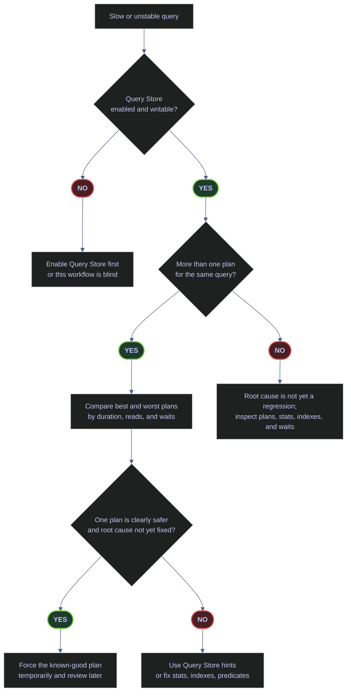

# Query Store Regressions and Plan Forcing

> [!abstract]- Summary
>
> Query Store is SQL Server’s persistent plan-and-runtime history for one database, which makes it the operational bridge between “the query is slow now” and “which plan variant used to be better.” This note walks the live `stoxx` workflow from verifying that Query Store is enabled and writable, through regression detection and safe plan forcing, to Query Store Hints and the rules for treating both as temporary mitigation rather than permanent design.
>
> **Query Store foundations**
> - covers what Query Store is, where it stores data, its catalog views, capture modes, retention behavior, and version-specific features
>
> **Baseline and health checks**
> - covers verifying that Query Store is enabled, writable, and collecting trustworthy data before using it for triage
>
> **Regression detection**
> - covers finding queries with materially different plan variants, comparing best and worst runtime behavior, and identifying plausible regression candidates
>
> **Force-plan workflow**
> - covers controlled plan forcing with `sp_query_store_force_plan`, verification of forced state, and the signals that show whether forcing is holding or failing
>
> **Query Store Hints and operational choices**
> - covers Query Store Hints, when to observe, when to force, when to hint, and when to fix the real root cause instead
>
> **Operations and safety**
> - Warnings: Query Store must be writable to be trustworthy, forced plans are attempted not guaranteed, hints can fail to apply, storage and cleanup settings affect retention, and long-lived forcing or hints become technical debt
> - Recommendations: verify writability before triage, compare plan variants before forcing, record every force or hint in change control, prefer forcing over hinting when a known-good historical plan exists, and remove both once stats, indexing, parameterization, or query design have been fixed

> [!note]- Glossary
>
> **Query Store**
> - The per-database SQL Server feature that persists query texts, plans, runtime statistics, and optionally wait data across restarts.
> - It matters because this note’s entire workflow depends on having durable historical plan evidence instead of relying only on the transient plan cache.
>
> > [!info] Persistence is the key differentiator
> >
> > The plan cache forgets. Query Store remembers long enough to compare today’s bad plan to yesterday’s better one, which is why it is so valuable in regression work.
>
> ---
>
> **Query Store baseline**
> - The verified state where Query Store is enabled, writable, retaining enough history, and capturing the workload you actually need to analyze.
> - It matters because regression analysis built on disabled, read-only, or incomplete Query Store data is false confidence.
>
> > [!warning] “Enabled” is not the same as “usable”
> >
> > A database can have Query Store turned on and still be read-only, full, or capturing too little. Operational trust starts only after those states are checked.
>
> ---
>
> **Plan variant**
> - One distinct compiled execution plan for the same logical query inside Query Store.
> - It matters because regressions are fundamentally comparisons between plan variants, not between different query texts.
>
> > [!info] Same query, different plan story
> >
> > A query does not need new text to get slower. The same logical statement can compile to several plans, and one of them can be much worse than the others.
>
> ---
>
> **Regression candidate**
> - A query whose historical plan variants show a material spread in runtime, reads, or waits that suggests one plan is significantly worse than another.
> - It matters because this is the filtering step that keeps operators from forcing plans blindly on every slow query.
>
> > [!warning] Candidate is not proof
> >
> > A runtime spread means “inspect this query.” It does not prove that a plan regression is the current root cause until time window, workload, and plan details line up.
>
> ---
>
> **Forced plan**
> - A historical Query Store plan that SQL Server is instructed to attempt to reuse for future executions of the same query.
> - It matters because forcing is the main temporary mitigation when one historical plan is clearly safer than the currently chosen one.
>
> > [!warning] Force is an attempt, not a guarantee
> >
> > Schema changes, missing indexes, or other incompatibilities can prevent the engine from honoring the forced plan fully. Monitoring force-failure signals is part of the workflow.
>
> ---
>
> **`sp_query_store_force_plan`**
> - The system stored procedure used to mark a specific Query Store plan as forced for a given query.
> - It matters because it is the supported operational entry point for plan forcing in this note’s workflow.
>
> > [!info] Use the supported control surface
> >
> > Plan forcing should be explicit and auditable. The stored procedure gives that change a defined mechanism instead of relying on undocumented shortcuts.
>
> ---
>
> **Force failure**
> - A condition where Query Store cannot successfully apply or keep applying the requested forced plan.
> - It matters because a “forced” state is only useful if it is actually being honored during execution.
>
> > [!warning] Forced-state metadata needs validation
> >
> > Seeing a force request recorded is not enough. Failure counters and last-failure reasons must also stay healthy, or the mitigation is ineffective.
>
> ---
>
> **Query Store Hint**
> - A persisted hint attached through Query Store that modifies optimizer behavior for a query without editing its source text.
> - It matters because hints are a powerful mitigation when code cannot be changed quickly, but they also create governance and aging risks.
>
> > [!warning] Hints are easy to keep too long
> >
> > A hint that solves an incident today can become invisible technical debt tomorrow. Every hint needs ownership, review, and a removal plan.
>
> ---
>
> **Writable mode**
> - The Query Store operational state where the database can continue recording new plans and runtime observations.
> - It matters because read-only or failing write states make later regression analysis incomplete or stale.
>
> > [!warning] Stale history can look deceptively authoritative
> >
> > If Query Store stopped writing earlier, the data may still query cleanly while silently omitting the incident period you care about most.
>
> ---
>
> **Retention window**
> - The period over which Query Store keeps history before time-based or size-based cleanup removes older data.
> - It matters because regression analysis only works if the historical “good plan” still exists when the regression happens.
>
> > [!warning] Cleanup policy shapes forensic reach
> >
> > A short retention window can be fine for hot triage and useless for monthly regressions. The storage policy is therefore part of the operational design, not an afterthought.
>
> ---
>
> **Observe / force / hint / fix ladder**
> - The operational decision sequence where observation is least invasive, forcing is temporary stabilization, hinting is targeted optimizer influence, and root-cause repair is the durable solution.
> - It matters because the note’s core recommendation is not just how to use Query Store, but how to use it with disciplined escalation.
>
> > [!info] Intervention strength should match certainty
> >
> > Stronger actions are justified only when the evidence is stronger. The ladder keeps operators from jumping straight to hints or forcing without enough diagnostic confidence.



## What Query Store Is

> [!abstract] Persistent plan and runtime history per database
>
> Query Store is a per-database feature introduced in SQL Server 2016 that captures, on disk, every query plan the optimizer compiles and every runtime observation made while executing those plans. It is **scoped to the database** (it lives inside the user database files, not `msdb` or `master`), **survives restarts** (the data is persisted, not just in-memory), and is the only tool in SQL Server that lets you compare two plan variants for the same logical query using historical data — the plan cache forgets plans as soon as they evict, Query Store does not.

### Architecture at a glance

*Query Store has three pieces you care about as an operator: the in-memory buffers, the persistent storage in the user database, and the set of catalog views that expose both.*

The engine writes new query text, plans, and runtime statistics into an in-memory buffer. A background task flushes the buffer to disk every `flush_interval_seconds` (default 900 seconds = 15 minutes) and whenever the buffer fills. The on-disk data is stored inside the user database, counted against its data files, and cleaned up by two policies — **time-based** (`stale_query_threshold_days`, default 30) and **size-based** (`size_based_cleanup_mode`, default `AUTO`). The catalog views (`sys.query_store_*`) read from both the in-memory buffer and the persisted storage, so querying them returns the union of what has been flushed and what is still pending.

> [!info]- Key Query Store catalog views
>
> - `sys.database_query_store_options` — one row per database, holds the configuration state (operation mode, capture mode, retention settings, current storage size).
> - `sys.query_store_query_text` — one row per distinct query text after parameterization normalization.
> - `sys.query_store_query` — one row per logical query (a query text + a specific context such as language, compatibility level, SET options).
> - `sys.query_store_plan` — one row per plan variant for a query. A query can have many rows here, one per distinct plan the optimizer has compiled.
> - `sys.query_store_runtime_stats` — one row per plan per runtime observation interval, with aggregates (`avg_duration`, `avg_logical_io_reads`, `avg_cpu_time`, etc.).
> - `sys.query_store_runtime_stats_interval` — maps observation intervals to wall-clock start/end times.
> - `sys.query_store_wait_stats` — per-plan wait aggregates (when `wait_stats_capture_mode = ON`).
> - `sys.query_store_query_hints` — one row per Query Store Hint currently installed on a query (SQL 2022+ only).

### The version matrix

*Some Query Store features require specific SQL Server versions — check the server you are operating against.*

Run this once before using Query Store Hints or the newer capture modes:

```sql
SELECT
    @@VERSION AS v,
    SERVERPROPERTY('ProductMajorVersion') AS major,
    SERVERPROPERTY('ProductLevel')        AS level;
```

| v | major | level |
|---|---|---|
| Microsoft SQL Server 2022 (RTM-CU23) ... 16.0.4236.2 (X64) Developer Edition (64-bit) on Linux | 16 | RTM |

The `stoxx` lab runs on SQL Server 2022 (`major = 16`), so every feature in this note is available. The version gates that matter:

| Feature | Minimum version | Notes |
|---|---|---|
| Query Store (core) | SQL 2016 (13) | `sys.database_query_store_options`, plan forcing |
| Default capture mode becomes `AUTO` | SQL 2019 (15) | 2016/2017 defaulted to `ALL` |
| `CUSTOM` capture mode | SQL 2019 (15) | Fine-grained capture policy |
| `OPTION (LABEL = '...')` | SQL 2022 (16) | Labels queries for Query Store identification |
| Query Store Hints (`sp_query_store_set_hints`) | SQL 2022 (16) | Inject hints without editing code |
| Query Store for readable secondaries | SQL 2022 (16) | Primary replicas only before that |

> [!info]- Where Query Store lives and how to join to SQL text
>
> Query Store data is stored in each user database — the data files of the database itself hold the Query Store pages, which is why Query Store grows the database and why retention settings matter. Data survives service restarts: the in-memory buffer flushes on restart and reloads on startup. To get from `query_id` to the actual SQL text, join `sys.query_store_query` to `sys.query_store_query_text` via `query_text_id`.

## Query Store Baseline

> [!abstract] Verify Query Store is actually writable before trusting the workflow
>
> Before using Query Store for regression analysis, plan forcing, or hints, verify that it is collecting writable runtime data. Query Store can silently switch to read-only mode (storage quota reached, database set to read-only, internal memory limits hit) and a read-only Query Store looks healthy at the configuration level while no longer capturing new data. The first query in any Query Store workflow is always "what state am I in right now?".

### Check Query Store state and capture mode

The `sys.database_query_store_options` catalog view is the database-level control surface for Query Store. It holds both the configured target state and the actual runtime state, which may diverge when Query Store has entered read-only mode automatically. Always check both and inspect `readonly_reason` if they disagree.

#### Confirm Query Store is writable and capturing waits

The query below pulls the seven columns that matter for a baseline check: the desired vs actual state, any read-only reason, current vs max storage size, the capture mode, and whether per-query wait statistics are being collected.

> [!info]- sys.database_query_store_options core columns
>
> - `desired_state_desc` — the configured target state set via `ALTER DATABASE ... SET QUERY_STORE (OPERATION_MODE = ...)`.
> - `actual_state_desc` — the real runtime state right now. Divergence from `desired_state_desc` is the main signal that something is wrong.
> - `readonly_reason` — a bitmap indicating why Query Store is read-only; `0` when healthy. Values are enumerated in the next subsection.
> - `current_storage_size_mb` / `max_storage_size_mb` — current footprint vs the configured ceiling; when current approaches max, Query Store will eventually flip to read-only.
> - `query_capture_mode_desc` — which capture policy is active: `ALL`, `AUTO`, `NONE`, or `CUSTOM`.
> - `wait_stats_capture_mode_desc` — whether per-query wait capture is enabled (`ON`/`OFF`).

*Query the database-level Query Store configuration and current runtime state.*

```sql
SELECT
    desired_state_desc,
    actual_state_desc,
    readonly_reason,
    current_storage_size_mb,
    max_storage_size_mb,
    query_capture_mode_desc,
    wait_stats_capture_mode_desc
FROM sys.database_query_store_options;
```

| desired_state_desc | actual_state_desc | readonly_reason | current_storage_size_mb | max_storage_size_mb | query_capture_mode_desc | wait_stats_capture_mode_desc |
|---|---|---:|---:|---:|---|---|
| `READ_WRITE` | `READ_WRITE` | 0 | 4 | 1000 | `ALL` | `ON` |

Desired and actual both report `READ_WRITE`, which means Query Store is actively collecting new plans and runtime observations. `readonly_reason = 0` confirms there is no active read-only blocker. Storage pressure is nowhere near the ceiling: 4 MB of 1000 MB in use. Capture mode is `ALL` (every query is captured), and wait statistics capture is `ON` — the strongest configuration for triage work.

| Column | Value | State | Meaning | Implication |
|---|---|---|---|---|
| `desired_state_desc` | `READ_WRITE` | Healthy | Configured for writable data collection. | Correct baseline for troubleshooting. |
| `actual_state_desc` | `READ_WRITE` | Healthy | Actively usable right now. | Regression queries, forcing, and hints all work. |
| `actual_state_desc` | `READ_ONLY` | Problem | Not accepting new writable data. | Investigate `readonly_reason` before trusting the workflow. |
| `actual_state_desc` | `ERROR` | Critical | Internal corruption. | Run `sp_query_store_consistency_check`; if that fails, `SET QUERY_STORE CLEAR`. |
| `readonly_reason` | `0` | Healthy | No active read-only blocker. | Normal operating state. |
| `readonly_reason` | Non-zero | Problem | See the enumeration below. | Resolve the underlying reason before proceeding. |
| `current_storage_size_mb` | Far below `max_storage_size_mb` | Healthy | Plenty of headroom. | No sizing concern. |
| `current_storage_size_mb` | Near `max_storage_size_mb` | Warning | Approaching quota. | Increase `MAX_STORAGE_SIZE_MB` or lower `STALE_QUERY_THRESHOLD_DAYS`. |
| `query_capture_mode_desc` | `ALL` | Mode | Broad, exhaustive capture. | Best for demos and audits; more than production usually needs. |
| `query_capture_mode_desc` | `AUTO` | Mode | Filtered to significant queries. | Production default from SQL 2019 onward. |
| `wait_stats_capture_mode_desc` | `ON` | Healthy | Per-query waits persisted. | Enables wait-based regression analysis. |

#### Decode the readonly_reason bitmap

`readonly_reason` is a bitmap — multiple conditions can be active at once. Any non-zero value means Query Store is not capturing new data, and knowing which bits are set tells you what to fix.

| Bit value | Meaning | Fix |
|---:|---|---|
| `1` | Database is in read-only mode | Set the database read-write if you own it. |
| `2` | Database is in single-user mode | Return to multi-user mode. |
| `4` | Database is in emergency mode | Exit emergency mode; investigate the underlying failure. |
| `8` | Database is a secondary replica (AG) | Expected on non-primary replicas; use `READ_CAPTURE_SECONDARY` if you need capture on secondaries (SQL 2022+). |
| `65536` | Query Store reached `max_storage_size_mb` | Increase the ceiling or run `SET QUERY_STORE CLEAR`. |
| `131072` | Internal in-memory limit on distinct statements hit | Clean old statements; consider upgrading SKU. |
| `262144` | Pending in-memory items exceed the internal limit | Transient; resolves once the background flush catches up. |
| `524288` | Database file size limit reached | Grow the database file or increase the disk quota. |

> [!failure] Read-only mode is silent
>
> Query Store does not raise an error when it flips to read-only. The configuration view still reports your desired state. The only signal is the divergence between `desired_state_desc` and `actual_state_desc`:
>
> - Existing plans continue to be observable.
> - New plans are **not** captured.
> - New runtime statistics are **not** recorded.
> - You will regress back to the plan cache as your only visibility.

> [!success] Monitor state continuously, not once
>
> - Schedule a check that compares `desired_state_desc` and `actual_state_desc` every 15 minutes.
> - Alert on any non-zero `readonly_reason`.
> - Activate `SIZE_BASED_CLEANUP_MODE = AUTO` so the engine cleans aggressively when approaching the ceiling.
> - Set a `STALE_QUERY_THRESHOLD_DAYS` that matches your retention needs — 30 days is the default but long-tail systems benefit from 7 days to reduce churn.

#### Inspect retention and flush configuration

Beyond the seven core columns above, `sys.database_query_store_options` exposes several sizing and retention knobs that determine how aggressively Query Store trims itself and how often it flushes to disk.

*Pull the retention and flush cadence columns so the reader can see what interval length and stale threshold are actually in effect.*

```sql
SELECT
    interval_length_minutes,
    stale_query_threshold_days,
    max_plans_per_query,
    size_based_cleanup_mode_desc,
    flush_interval_seconds
FROM sys.database_query_store_options;
```

| interval_length_minutes | stale_query_threshold_days | max_plans_per_query | size_based_cleanup_mode_desc | flush_interval_seconds |
|---:|---:|---:|---|---:|
| 60 | 30 | 200 | `AUTO` | 900 |

The observation interval is 60 minutes, meaning all runtime statistics are aggregated into one-hour buckets. The retention policy keeps data for 30 days before cleanup. Each query may accumulate up to 200 plans before the cap applies. Size-based cleanup runs automatically when storage approaches the ceiling. The background flush task writes in-memory buffers to disk every 900 seconds (15 minutes).

> [!info]- Interval and retention trade-offs
>
> - `interval_length_minutes` — granularity of runtime-stat aggregation. Shorter intervals give finer time-series resolution but multiply storage; 60 is the default, 5 is the tightest useful value.
> - `stale_query_threshold_days` — retention window. 30 days is the default; 7 days reduces churn for systems with high query volume.
> - `max_plans_per_query` — cap on plan variants captured per query; once hit, new plans are discarded. Set to `0` to remove the cap.
> - `size_based_cleanup_mode_desc = AUTO` — automatic cleanup kicks in when storage reaches ~90% of max. Prefer `AUTO` in production to avoid silent read-only transitions.
> - `flush_interval_seconds` — how often the in-memory buffer is written to disk. A lower value reduces data loss on crash but adds I/O; `sp_query_store_flush_db` forces an immediate flush when needed.

#### Force an immediate flush

*In lab or test scenarios, the runtime statistics you just generated may still be in the in-memory buffer, not yet visible to catalog views. Force the flush with `sp_query_store_flush_db`.*

```sql
EXEC sys.sp_query_store_flush_db;
SELECT 'flushed' AS status;
```

| status |
|---|
| flushed |

`sp_query_store_flush_db` writes the in-memory Query Store buffer to disk immediately, bypassing the `flush_interval_seconds` schedule. Use it between "run the query to be analyzed" and "read from `sys.query_store_*`" in reproducible lab workflows, otherwise you may query too early and see nothing.

> [!tip] Use sp_query_store_flush_db in repro workflows
>
> - **Lab setups** — between workload generation and catalog inspection, always flush first.
> - **Post-force validation** — after `sp_query_store_force_plan`, flush before verifying `is_forced_plan = 1`.
> - **Automated tests** — any test that asserts against Query Store state should flush to ensure deterministic observation.
> - **Production** — rarely needed; the background flush is usually fast enough for triage work.

## Plan Regression Candidates

> [!abstract] Find queries with materially different plan variants
>
> A plan regression candidate is a query that Query Store has captured more than one plan for, where the plans have materially different runtime profiles. The fastest way to build a shortlist is to group `sys.query_store_runtime_stats` by `query_id`, count distinct plans, and compute the spread between the best and worst average duration across those plans. This shortlist is not proof that any of the listed queries are actually regressed — a query might legitimately be parameter-sensitive or might have had its plans captured across a schema change — but it is the correct starting point for triage.

### Compare best and worst plans per query

The `sys.query_store_runtime_stats` view is the source of truth for runtime observations; it joins to `sys.query_store_plan` via `plan_id` and from there to `sys.query_store_query` via `query_id`. The query below counts distinct plans per `query_id` and ratios the worst-plan duration against the best-plan duration to surface the highest-spread candidates.

#### Find queries whose plans have materially different runtime profiles

> [!info]- Regression shortlist anatomy
>
> - `COUNT(DISTINCT qsp.plan_id) AS plan_count` — first signal: Query Store has captured more than one plan shape for the same query. Plans with different hash IDs are different, even if they look identical.
> - `best_avg_ms` and `worst_avg_ms` — minimum and maximum average duration across those plans, converted from microseconds to milliseconds with a `/ 1000.0` cast to decimal.
> - `regression_factor` — `worst / best`. A factor of 7 means the worst plan is seven times slower than the best.
> - `GROUP BY qsq.query_id` — group on the logical query, not the individual plan, because the goal is to find *unstable queries* not merely expensive individual plans.
> - `HAVING COUNT(DISTINCT qsp.plan_id) > 1` — exclude queries that only have one plan variant (they cannot be regression candidates yet).
> - `NULLIF(MIN(...), 0)` — guard against zero-duration plans that would otherwise cause a divide-by-zero.

*Aggregate runtime statistics by `query_id` and rank the candidates by the ratio of worst to best average duration.*

```sql
SELECT TOP (10)
    qsq.query_id,
    COUNT(DISTINCT qsp.plan_id) AS plan_count,
    CAST(MIN(qsrs.avg_duration) / 1000.0 AS decimal(18,2)) AS best_avg_ms,
    CAST(MAX(qsrs.avg_duration) / 1000.0 AS decimal(18,2)) AS worst_avg_ms,
    CAST(MAX(qsrs.avg_duration) * 1.0 / NULLIF(MIN(qsrs.avg_duration), 0) AS decimal(18,2)) AS regression_factor,
    LEFT(qsqt.query_sql_text, 160) AS query_text
FROM sys.query_store_runtime_stats AS qsrs
JOIN sys.query_store_plan AS qsp ON qsrs.plan_id = qsp.plan_id
JOIN sys.query_store_query AS qsq ON qsp.query_id = qsq.query_id
JOIN sys.query_store_query_text AS qsqt ON qsq.query_text_id = qsqt.query_text_id
GROUP BY qsq.query_id, qsqt.query_sql_text
HAVING COUNT(DISTINCT qsp.plan_id) > 1
ORDER BY regression_factor DESC, worst_avg_ms DESC;
```

| query_id | plan_count | best_avg_ms | worst_avg_ms | regression_factor | query_text |
|---:|---:|---:|---:|---:|---|
| 249 | 2 | 0.33 | 3.48 | 10.68 | `DELETE b FROM bronze.stoxxusa50_ohlcv b INNER JOIN ( SELECT symbol, MAX(date) AS max_date FROM bronze.stoxxusa50_ohlcv` |
| 235 | 2 | 0.44 | 3.17 | 7.18 | `DELETE b FROM bronze.stoxxasia50_ohlcv b INNER JOIN ( SELECT symbol, MAX(date) AS max_date FROM bronze.stoxxasia50_ohlcv` |
| 228 | 2 | 0.45 | 3.12 | 6.98 | `DELETE b FROM bronze.eurostoxx50_ohlcv b INNER JOIN ( SELECT symbol, MAX(date) AS max_date FROM bronze.eurostoxx50_ohlcv` |
| 2766 | 2 | 0.21 | 0.76 | 3.56 | `(@_msparam_0 nvarchar(4000),...) SELECT clmns.name AS [Name], clmns.column_id AS [ID` |
| 3007 | 3 | 762.17 | 1813.89 | 2.38 | `ALTER INDEX ALL ON dbo.demo_idxmaint_rowstore REBUILD WITH (ONLINE = ON, MAXDOP = 2)` |
| 1881 | 5 | 7.29 | 13.64 | 1.87 | `UPDATE STATISTICS [silver].[eurostoxx50_ohlcv]` |
| 1879 | 4 | 10.19 | 15.72 | 1.54 | `UPDATE STATISTICS [silver].[stoxxasia50_ohlcv]` |
| 1880 | 4 | 10.21 | 14.92 | 1.46 | `UPDATE STATISTICS [silver].[stoxxusa50_ohlcv]` |
| 2995 | 2 | 1675.26 | 2329.01 | 1.39 | `WITH n AS ( SELECT 1 AS batch_no UNION ALL SELECT 2 UNION ALL ... ) INSERT INTO dbo.demo_idxmaint_rowstore (batch` |
| 3033 | 2 | 97.19 | 122.65 | 1.26 | `UPDATE STATISTICS dbo.demo_idxmaint_rowstore WITH FULLSCAN` |

The strongest candidates are the three `DELETE ... MAX(date)` bronze cleanup statements at the top, where the worst plan runs 7 to 11 times slower than the best. This is the kind of gap that justifies a closer look — not a command to force a plan blindly, but a strong signal to inspect those queries first. Notice that the bottom half of the list consists of `UPDATE STATISTICS` and index-maintenance statements; those are maintenance activities with inherently variable cost depending on the amount of data churn they encounter, so they produce "false positive" regression shortlist entries that should be filtered out of operational triage.

| Column | Value | State | Meaning | Implication |
|---|---|---|---|---|
| `plan_count` | `1` | N/A | Query has only one tracked plan. | Cannot be a regression candidate yet. |
| `plan_count` | `> 1` | Candidate | Multiple plan variants captured. | Eligible for regression comparison. |
| `regression_factor` | Near `1` | Healthy | Plans perform similarly. | Plan variability is not the first suspect. |
| `regression_factor` | `> 2` | Candidate | Worst plan at least twice as slow. | Strong regression shortlist entry. |
| `regression_factor` | `> 5` | Priority | Large spread between best and worst. | Investigate first; likely a plan-choice issue. |
| `best_avg_ms` vs `worst_avg_ms` | Large absolute spread | Candidate | Material runtime difference. | Check plan shape, statistics, parameter sensitivity, indexing. |
| `query_text` | Maintenance/admin | Filter | Regression belongs to maintenance activity. | Prioritize by workload criticality, not numeric spread. |

> [!tip] Refine the shortlist with domain context
>
> - Exclude `UPDATE STATISTICS`, `DBCC`, `ALTER INDEX` patterns — their runtime variance is expected and not a plan problem.
> - Exclude auto-parameterized `msparam_` queries from SSMS itself — they are tooling overhead, not application workload.
> - Join to `sys.query_store_runtime_stats_interval` if you want to restrict to a specific time window (e.g., "last 24 hours only").
> - For production dashboards, add `COUNT(*) AS exec_count` to weight the shortlist by how often the query actually ran — a 100x regression on a query that runs twice a week is lower priority than a 3x regression on a query that runs every minute.

## Controlled Force-Plan Workflow

> [!abstract] Reproducible lab demo for plan forcing
>
> This section builds a disposable demo on `stoxx` to walk through the plan-forcing workflow end-to-end. It creates a lab table from real `silver.eurostoxx50_ohlcv` data, runs the same query twice (once without a supporting index, once with), inspects the two plans Query Store captured, forces the better plan, and finally applies a Query Store Hint to the same query. The goal is to make every step reproducible — and to show exactly what each catalog-view verification looks like so you can recognize success in production.

### Build a disposable demo table

The lab table is an intentionally simple copy of `silver.eurostoxx50_ohlcv` with no supporting index on the predicate columns. The clustered primary key is on a surrogate `id`, not on `symbol` or `date`, so the first execution of the target query has no useful access path and the optimizer falls back to a clustered index scan. This is the necessary starting condition for generating two distinct plans for the same logical query.

#### Create the demo table from real stoxx data

*Create a fresh `dbo.qs_force_demo` table, seed it with every row from `silver.eurostoxx50_ohlcv`, and verify the row count.*

```sql
USE stoxx;
IF OBJECT_ID('dbo.qs_force_demo', 'U') IS NOT NULL
    DROP TABLE dbo.qs_force_demo;

CREATE TABLE dbo.qs_force_demo
(
    id int IDENTITY(1,1) NOT NULL CONSTRAINT PK_qs_force_demo PRIMARY KEY,
    symbol nvarchar(32) NOT NULL,
    [date] date NOT NULL,
    [close] decimal(19,4) NULL,
    volume bigint NULL
);

INSERT INTO dbo.qs_force_demo (symbol, [date], [close], volume)
SELECT symbol, [date], [close], volume
FROM silver.eurostoxx50_ohlcv;

SELECT COUNT(*) AS row_count
FROM dbo.qs_force_demo;
```

| row_count |
|---:|
| 67155 |

The demo table holds the full `silver.eurostoxx50_ohlcv` rowset (67,155 rows), so the later scan-versus-seek difference is grounded in real table size and real data distribution, not a synthetic fixture. Note that `PRIMARY KEY` on `id` creates the clustered index — but that index is on the surrogate key, not on `(symbol, date)`, so a predicate like `WHERE symbol = 'X' AND date BETWEEN ...` cannot use it for a seek.

### Generate two plans for the same query

The classic way to produce two captured plans for the same logical query is to run the query once, change the schema (add an index, drop an index, alter a column type), then run the query again. Query Store sees the schema change as a trigger to recompile and captures the second plan separately. The tag `OPTION (LABEL = 'qs_force_demo_count')` lets you find both plans later by filtering on the labeled SQL text.

#### Run the same tagged query before and after adding the index

> [!info]- Two-execution flow
>
> - **Step 1** — drop any leftover support index so the first execution has no useful access path.
> - **Step 2** — run the labeled query; Query Store captures a clustered index scan plan.
> - **Step 3** — create `IX_qs_force_demo_symbol_date` on the predicate columns.
> - **Step 4** — run the exact same labeled query; Query Store recompiles because of the schema change and captures an index seek plan.
> - **Step 5** — both plans now share the same `query_id` but have distinct `plan_id` values.

*Execute the same `OPTION (LABEL = ...)` query before and after creating the support index so Query Store captures two plan variants.*

```sql
USE stoxx;
IF EXISTS (
    SELECT 1
    FROM sys.indexes
    WHERE object_id = OBJECT_ID('dbo.qs_force_demo')
      AND name = 'IX_qs_force_demo_symbol_date'
)
    DROP INDEX IX_qs_force_demo_symbol_date ON dbo.qs_force_demo;

SELECT COUNT(*) AS matching_rows
FROM dbo.qs_force_demo
WHERE symbol = 'ASML.AS'
  AND [date] BETWEEN '2025-03-01' AND '2025-04-30'
OPTION (LABEL = 'qs_force_demo_count');

CREATE INDEX IX_qs_force_demo_symbol_date
    ON dbo.qs_force_demo(symbol, [date]);

SELECT COUNT(*) AS matching_rows
FROM dbo.qs_force_demo
WHERE symbol = 'ASML.AS'
  AND [date] BETWEEN '2025-03-01' AND '2025-04-30'
OPTION (LABEL = 'qs_force_demo_count');
```

| matching_rows |
|---:|
| 41 |

Both executions return the same 41 rows, which is exactly what a plan-forcing example needs: query semantics unchanged, only the available access path differs. `OPTION (LABEL = 'qs_force_demo_count')` is a SQL 2022 feature that attaches a literal label to the query text, making it trivially searchable in `sys.query_store_query_text` afterward — without the label, you would have to filter by the SQL body fragment.

#### Compare the two plans stored for the tagged query

The `CASE WHEN qsp.query_plan LIKE '%...%'` construction extracts a simplified `access_pattern` from the stored plan XML for human-readable comparison. This is a pragmatic shortcut — the authoritative form would parse the plan as XML with `.query('...')` — but for triage work "scan vs seek" is almost always enough to identify the better plan.

#### Compare the scan and seek plans stored by Query Store

> [!info]- Plan comparison columns
>
> - `query_id` identifies the logical statement; both rows should share the same value.
> - `plan_id` identifies the individual plan variant; the two rows will have different values.
> - `access_pattern` is derived heuristically from the stored plan XML to classify the access shape.
> - `is_forced_plan` is `0` for all newly captured plans — forcing is a later step.
> - `last_force_failure_reason_desc` is `NONE` when no force attempt has been made; any other value indicates a prior force-application failure.
> - `avg_ms` and `avg_logical_io_reads` are the two headline metrics: lower is better.

*Read both plans for the labeled query and pull their access pattern, average duration, and average logical reads.*

```sql
SELECT
    qsq.query_id,
    qsp.plan_id,
    CASE
        WHEN qsp.query_plan LIKE '%Clustered Index Scan%' THEN 'Clustered Index Scan'
        WHEN qsp.query_plan LIKE '%Index Seek%' THEN 'Index Seek'
        WHEN qsp.query_plan LIKE '%Table Scan%' THEN 'Table Scan'
        ELSE 'Other'
    END AS access_pattern,
    qsp.is_forced_plan,
    qsp.last_force_failure_reason_desc,
    CAST(AVG(qsrs.avg_duration) / 1000.0 AS decimal(18,3)) AS avg_ms,
    CAST(AVG(qsrs.avg_logical_io_reads) AS decimal(18,2)) AS avg_logical_io_reads,
    LEFT(qsqt.query_sql_text, 180) AS query_text
FROM sys.query_store_runtime_stats AS qsrs
JOIN sys.query_store_plan AS qsp ON qsrs.plan_id = qsp.plan_id
JOIN sys.query_store_query AS qsq ON qsp.query_id = qsq.query_id
JOIN sys.query_store_query_text AS qsqt ON qsq.query_text_id = qsqt.query_text_id
WHERE qsqt.query_sql_text LIKE '%qs_force_demo_count%'
GROUP BY qsq.query_id, qsp.plan_id, qsp.query_plan, qsp.is_forced_plan, qsp.last_force_failure_reason_desc, qsqt.query_sql_text
ORDER BY avg_logical_io_reads DESC;
```

| query_id | plan_id | access_pattern | is_forced_plan | last_force_failure_reason_desc | avg_ms | avg_logical_io_reads | query_text |
|---:|---:|---|---:|---|---:|---:|---|
| 3161 | 595 | `Clustered Index Scan` | 0 | `NONE` | 2.393 | 411.00 | `SELECT COUNT(*) AS matching_rows FROM dbo.qs_force_demo WHERE symbol = 'ASML.AS' AND [date] BETWEEN '2025-03-01' AND '2025-04-30' OPTION (LABEL = 'qs_force_demo_count')` |
| 3161 | 594 | `Index Seek` | 0 | `NONE` | 0.057 | 4.00 | `SELECT COUNT(*) AS matching_rows FROM dbo.qs_force_demo WHERE symbol = 'ASML.AS' AND [date] BETWEEN '2025-03-01' AND '2025-04-30' OPTION (LABEL = 'qs_force_demo_count')` |

This is a textbook forcing candidate. The same `query_id` (3161) has two plans: `plan_id = 595` is a clustered index scan doing 411 logical reads in 2.393 ms average, and `plan_id = 594` is an index seek doing 4 logical reads in 0.057 ms average. Both plans have `is_forced_plan = 0` (neither has been forced yet) and `last_force_failure_reason_desc = NONE` (no prior force attempts have failed). The seek plan is roughly 100 times cheaper and dramatically faster — the kind of gap that justifies temporary forcing while the underlying cause is stabilized.

| Column | Value | State | Meaning | Implication |
|---|---|---|---|---|
| `query_id` | Same across rows | Healthy | One logical query has multiple plans. | True regression comparison available. |
| `plan_id` | Different across rows | Healthy | Distinct plan variants exist. | Query Store can compare and force among them. |
| `access_pattern` | `Clustered Index Scan` | Problem (in this example) | Full base-structure scan. | Poor access path for this selective predicate. |
| `access_pattern` | `Index Seek` | Healthy (in this example) | Targeted access path. | Lower reads and lower latency. |
| `is_forced_plan` | `0` | Normal | Plan is not currently forced. | Observation-only state. |
| `last_force_failure_reason_desc` | `NONE` | Healthy | No force failure recorded. | Safe to proceed with forcing if justified. |
| `avg_logical_io_reads` | Very different between plans | Candidate | Materially different data-access cost. | Strong sign that plan choice matters. |

### Force the better plan

Plan forcing is implemented by `sp_query_store_force_plan`, which takes a `query_id` and a `plan_id` and marks that plan as the preferred plan for that query. After forcing, SQL Server will attempt to use the forced plan on every subsequent execution. If it cannot (schema change, parameter bind failure, required index missing), it logs a force failure in `sys.query_store_plan.last_force_failure_reason_desc` and falls back to recompiling a fresh plan. Always verify the force actually took effect — do not assume the stored procedure's success indicates the forced plan is active.

#### Force the low-read plan and verify the force state

> [!warning] Plan forcing is a temporary operational control
>
> - Forced plans can become stale after schema changes, data-distribution shifts, or index maintenance.
> - Forcing does not fix root causes — it pins the engine to one historical plan.
> - The forced plan may stop being applicable (for example, after dropping the index that made it good) and fall back to a different plan silently if you do not monitor.
> - Review forced plans on a schedule; unforce once the underlying issue is corrected.

> [!success] Validate before forcing and verify after
>
> - Force only a plan you have validated on the current workload.
> - Record the reason for the force in a change-management system.
> - Verify `is_forced_plan = 1` in `sys.query_store_plan` after calling the procedure.
> - Monitor `force_failure_count` and `last_force_failure_reason_desc` continuously.

> [!info]- sp_query_store_force_plan signature
>
> - `@query_id bigint` — the logical query to force, from `sys.query_store_query`.
> - `@plan_id bigint` — the historical plan variant to pin, from `sys.query_store_plan`.
> - `@disable_optimized_plan_forcing bit = 0` — optional; disables the 2022 optimization that reuses compilation artifacts during forced execution.
> - `@replica_group_id bigint = NULL` — optional; for plan forcing on readable secondaries (SQL 2022+).
> - **Permission**: `ALTER` on the database.
> - **Return**: `0` success, `1` failure.

*Force `plan_id = 594` (the low-read seek plan) and then immediately verify the force state by reading back `sys.query_store_plan`.*

```sql
DECLARE @query_id bigint = 3161;
DECLARE @plan_id  bigint = 594;

EXEC sys.sp_query_store_force_plan
    @query_id = @query_id,
    @plan_id  = @plan_id;

SELECT
    plan_id,
    is_forced_plan,
    force_failure_count,
    last_force_failure_reason_desc,
    CAST(AVG(qsrs.avg_duration) / 1000.0 AS decimal(18,3)) AS avg_ms,
    CAST(AVG(qsrs.avg_logical_io_reads) AS decimal(18,2)) AS avg_logical_io_reads
FROM sys.query_store_plan AS qsp
JOIN sys.query_store_runtime_stats AS qsrs ON qsp.plan_id = qsrs.plan_id
WHERE qsp.query_id = @query_id
GROUP BY plan_id, is_forced_plan, force_failure_count, last_force_failure_reason_desc
ORDER BY avg_logical_io_reads DESC;
```

| plan_id | is_forced_plan | force_failure_count | last_force_failure_reason_desc | avg_ms | avg_logical_io_reads |
|---:|---:|---:|---|---:|---:|
| 595 | 0 | 0 | `NONE` | 2.393 | 411.00 |
| 594 | 1 | 0 | `NONE` | 0.057 | 4.00 |

The force worked cleanly. Plan 594 now has `is_forced_plan = 1`, `force_failure_count = 0`, and `last_force_failure_reason_desc = NONE`. Plan 595 is still in the catalog as a historical record but is not forced — SQL Server will only use it if forcing the preferred plan fails. This is exactly the verification step to perform in production after forcing a plan: do not assume the stored procedure returning without error means the forced plan is active, because forcing can silently degrade to fallback on the first execution.

| Column | Value | State | Meaning | Implication |
|---|---|---|---|---|
| `is_forced_plan` | `1` | Forced | This plan is currently forced. | Query Store will try to use it on every execution. |
| `is_forced_plan` | `0` | Normal | Plan is not forced. | Normal for alternative or historical plans. |
| `force_failure_count` | `0` | Healthy | No force failures recorded. | Forcing is currently working. |
| `force_failure_count` | `> 0` | Problem | SQL Server has failed to apply the forced plan. | Investigate validity, schema changes, or missing index. |
| `last_force_failure_reason_desc` | `NONE` | Healthy | No last-known failure. | Normal operating state. |
| `last_force_failure_reason_desc` | Anything else | Problem | Query Store recorded a force-application problem. | The forced plan may not actually be active. |

### Apply a Query Store Hint

Query Store Hints are a SQL Server 2022+ feature that lets you attach an `OPTION(...)` clause to a query without editing the source SQL text. The hint is stored in `sys.query_store_query_hints` and applied by the optimizer on every subsequent execution of that `query_id`. This is the right tool when you cannot change application code quickly — but it is still operational debt that must be tracked and eventually removed.

#### Add a Query Store Hint without changing code

> [!warning] Hints are operational debt
>
> - A hint can outlive the condition that made it useful and become the new problem.
> - Hints are not persistent fixes; they override optimizer decisions statically.
> - Long-lived hints accumulate and make the engine harder to reason about.
> - Every hint should have an owner, a reason, and an expiration date.

> [!success] Track every active hint explicitly
>
> - Use Query Store Hints when code cannot be changed quickly — never as a first resort.
> - Remove hints as soon as the root cause is fixed.
> - Audit `sys.query_store_query_hints` on a schedule to find stale hints.
> - Record the reason, author, and removal-date criteria in a change log.

> [!info]- sp_query_store_set_hints signature
>
> - `@query_id bigint` — the logical query to hint, from `sys.query_store_query`.
> - `@query_hints nvarchar(max)` — the hint text in valid T-SQL `N'OPTION(...)'` form.
> - `@replica_group_id bigint = NULL` — optional; for secondary replicas (SQL 2025+).
> - **Supported hints** — most `OPTION` query hints including `RECOMPILE`, `MAXDOP`, `MAX_GRANT_PERCENT`, `FAST n`, `USE HINT(...)`.
> - **Unsupported hints** — `OPTIMIZE FOR (@var = val)`, `MAXRECURSION`, `USE PLAN`, table hints like `FORCESEEK` or `READUNCOMMITTED`.
> - **Permission**: `ALTER` on the database.

*Unforce the demo plan (so the hint example is isolated), apply a Query Store Hint to the same `query_id`, inspect `sys.query_store_query_hints`, then clean up with `sp_query_store_clear_hints`.*

```sql
DECLARE @query_id bigint = 3161;
DECLARE @plan_id  bigint = 594;

EXEC sys.sp_query_store_unforce_plan
    @query_id = @query_id,
    @plan_id  = @plan_id;

EXEC sys.sp_query_store_set_hints
    @query_id    = @query_id,
    @query_hints = N'OPTION(RECOMPILE, MAXDOP 1)';

SELECT
    query_hint_id,
    query_id,
    query_hint_text,
    source_desc,
    last_query_hint_failure_reason_desc,
    query_hint_failure_count,
    comment
FROM sys.query_store_query_hints
WHERE query_id = @query_id;

EXEC sys.sp_query_store_clear_hints
    @query_id = @query_id;
```

| query_hint_id | query_id | query_hint_text | source_desc | last_query_hint_failure_reason_desc | query_hint_failure_count | comment |
|---:|---:|---|---|---|---:|---|
| 2 | 3161 | `OPTION(RECOMPILE, MAXDOP 1)` | `User` | `NONE` | 0 | `NULL` |

The hint was created successfully. `query_hint_text` shows the exact `OPTION(...)` clause Query Store will apply. `source_desc = User` indicates a person or explicit process installed the hint. `last_query_hint_failure_reason_desc = NONE` and `query_hint_failure_count = 0` together confirm no application failure has occurred — the hint is syntactically valid and applicable in the query's context. The `comment` column is `NULL` here because `sp_query_store_set_hints` does not accept a comment argument; the vault convention is to track hint rationale in an external change log or ticket system.

| Column | Value | State | Meaning | Implication |
|---|---|---|---|---|
| `query_hint_text` | Explicit `OPTION(...)` | Normal | The exact hint Query Store will try to apply. | Always review this text literally; small mistakes matter. |
| `source_desc` | `User` | Normal | A person or explicit process created the hint. | Operationally trackable in your change log. |
| `source_desc` | Non-user source | Investigate | Hint came from another subsystem. | Verify why it exists before modifying it. |
| `last_query_hint_failure_reason_desc` | `NONE` | Healthy | No known hint-application failure. | Hint is applicable in the current context. |
| `last_query_hint_failure_reason_desc` | Anything else | Problem | Hint failed to apply at least once. | Investigate before assuming the hint is helping. |
| `query_hint_failure_count` | `0` | Healthy | No recorded failures. | Healthy hint state. |
| `query_hint_failure_count` | `> 0` | Problem | Hint has failed to apply. | Possible syntax mismatch, unsupported hint in context, or invalid option. |
| `comment` | `NULL` | Normal | No extra annotation stored. | Track rationale in an external change log. |

> [!warning] Forcing attempts — not guarantees — and unsupported hints
>
> `is_forced_plan = 1` guarantees only that Query Store will **attempt** to apply the plan on every subsequent execution. Schema changes, missing indexes, and parameter incompatibilities can cause the force to silently fall back to recompilation — watch `sys.query_store_plan.force_failure_count` and `last_force_failure_reason_desc` for the specific cause. If `sp_query_store_force_plan` returns without error but `is_forced_plan` is still `0`, the most common explanation is that Query Store has not yet flushed the in-memory state to disk; call `sp_query_store_flush_db` and re-query. Query Store Hints do **not** support `USE PLAN` (replaced by plan forcing itself), `OPTIMIZE FOR (@var = val)`, `MAXRECURSION`, or any table hints.

## Operational Guidance

> [!abstract] Observe, force, hint, or fix
>
> Query Store offers four escalating levels of intervention: observe only, force a historical plan, apply a Query Store Hint, or fix the root cause. Each level has increasing cost and increasing long-term benefit. Choose the least invasive action that actually addresses the problem — forcing is safer than hinting (forcing pins to a known-good plan, hinting changes optimizer behaviour), and both are strictly temporary compared to fixing stats, indexes, or query structure.

### Intervention matrix

*Choose the action that matches the problem, not the action that feels most powerful.*

| Action | Use it when | Strength | Main risk | Preferred exit |
|---|---|---|---|---|
| Observe only | Query has multiple plans but no clear winner yet | Low | Wasting time on noise | Collect more runtime, compare again |
| Force a plan | One historical plan is clearly safer and root cause not yet fixed | Medium | Forced plan becomes stale after schema/data changes | Unforce after fixing stats, indexes, or query design |
| Query Store Hint | Code cannot be changed quickly; targeted mitigation needed | Medium | Hint becomes long-lived technical debt | Remove after permanent fix lands |
| Root-cause fix | Stats, indexing, predicates, parameterization, or schema is the real issue | High | Requires more effort and testing | Keep Query Store as validation, not as a crutch |

### What to watch after forcing or hinting

*Define the healthy and unhealthy states for each intervention signal so on-call can triage quickly.*

| Signal | Healthy | Concerning | Next step |
|---|---|---|---|
| `is_forced_plan` | Forced plan stays `1` | Disappears or `force_failure_count` rises | Re-check `last_force_failure_reason_desc` and recent schema changes |
| Runtime spread | Best and worst plans converge | Forced/hinted plan still underperforms | Re-open root-cause analysis; forcing was not enough |
| `last_query_hint_failure_reason_desc` | `NONE` | Non-`NONE` or count rising | Remove or correct the hint |
| `plan_count` | Stable small set (1–5) | Continues growing unexpectedly | Check parameter sensitivity, context settings, workload churn |
| `current_storage_size_mb` | Stable, well below max | Climbing toward max | Lower `STALE_QUERY_THRESHOLD_DAYS` or raise `MAX_STORAGE_SIZE_MB` |

> [!tip] Query Store as validation, not crutch
>
> - Force or hint **only** to buy time for a root-cause fix, never as the permanent solution.
> - Record every force and every hint in a change log with owner, reason, and removal date.
> - Re-evaluate all active forces and hints quarterly.
> - Use `sys.query_store_plan` and `sys.query_store_query_hints` as your source of truth — never trust memory or tribal knowledge about what is currently forced or hinted.

## References

- [Query Store overview](https://learn.microsoft.com/en-us/sql/relational-databases/performance/monitoring-performance-by-using-the-query-store)
- [Best practices for monitoring workloads with Query Store](https://learn.microsoft.com/en-us/sql/relational-databases/performance/best-practice-with-the-query-store)
- [sys.database_query_store_options](https://learn.microsoft.com/en-us/sql/relational-databases/system-catalog-views/sys-database-query-store-options-transact-sql)
- [sys.query_store_plan](https://learn.microsoft.com/en-us/sql/relational-databases/system-catalog-views/sys-query-store-plan-transact-sql)
- [sys.query_store_query_hints](https://learn.microsoft.com/en-us/sql/relational-databases/system-catalog-views/sys-query-store-query-hints-transact-sql)
- [sp_query_store_force_plan](https://learn.microsoft.com/en-us/sql/relational-databases/system-stored-procedures/sp-query-store-force-plan-transact-sql)
- [sp_query_store_set_hints](https://learn.microsoft.com/en-us/sql/relational-databases/system-stored-procedures/sys-sp-query-store-set-hints-transact-sql)
- [Query Store Hints best practices](https://learn.microsoft.com/en-us/sql/relational-databases/performance/query-store-hints-best-practices)
