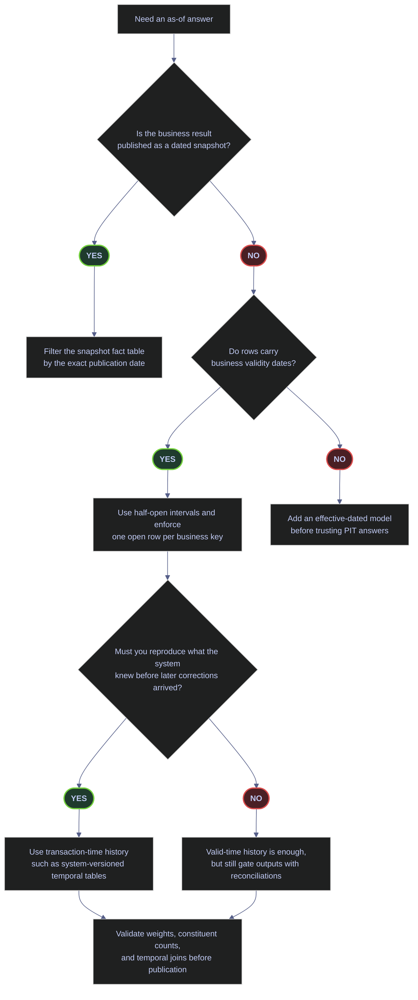

# Point-in-Time Data Integrity

Point-in-time work is not one problem. In `stoxx`, it appears in three distinct forms:

- published daily snapshots such as `gold.scores_daily`, where the business answer is keyed directly by the snapshot date
- effective-dated reference data such as `silver.index_dim`, where rows carry `valid_from` and `valid_to`
- post-publication corrections, where you must know not only what was true for the business date, but what the system knew at the time the result was published

Confusing those models is how teams produce irreproducible backfills, incorrect constituent histories, or audit trails that cannot explain a corrected publication.



## Effective-Dated Constituent Lists

The first PIT question is always: what kind of time surface are you querying? In the live `stoxx` database, the answer is mixed.

| PIT surface | Live table | What it answers well | Main rule |
|---|---|---|---|
| Daily snapshot fact | `gold.scores_daily` | "What was published for this index on this date?" | Filter by the exact snapshot date. |
| Effective-dated reference rows | `silver.index_dim` | Slowly changing descriptive attributes | Keep one active row per business key and use half-open intervals once history exists. |
| Transaction-time history | `dbo.demo_pit_temporal` in the example below | "What did we know before a later correction?" | Separate valid time from system-recorded time. |

### Inspect whether the live reference table is truly historical

> [!info]-
> This query checks whether `silver.index_dim` already behaves like a real effective-dated history table.
>
> - `COUNT(*)` returns the total number of rows.
> - `COUNT(DISTINCT CONCAT(_index, '|', symbol))` counts the real business keys for this table shape: the same symbol can legitimately belong to more than one index, so `_index` must be part of the key.
> - `open_ended_rows` counts rows whose `valid_to` is still `NULL`.
> - `current_rows` counts rows whose `is_current = 1`.
>
> If the table were already historical, you would normally expect a mix of closed and open rows over time. If every row is open-ended and current, the table carries valid-time columns structurally but is still a current-state surface in practice.
>
> *Check whether the live index dimension already contains historical versions or only current rows.*
>
```sql
SELECT
    COUNT(*) AS total_rows,
    COUNT(DISTINCT CONCAT(_index, '|', symbol)) AS distinct_index_symbol_pairs,
    SUM(CASE WHEN valid_to IS NULL THEN 1 ELSE 0 END) AS open_ended_rows,
    SUM(CASE WHEN is_current = 1 THEN 1 ELSE 0 END) AS current_rows
FROM silver.index_dim;
```

| total_rows | distinct_index_symbol_pairs | open_ended_rows | current_rows |
|---:|---:|---:|---:|
| 169 | 169 | 169 | 169 |

_`silver.index_dim` is structurally ready for valid-time modeling, but the live data is still current-state only: every business key appears once, every row is open-ended, and every row is marked current. That means this table is safe for current reference attributes, but not yet a full historical constituent source._

| Column | Value | Watch | Meaning | Implication |
|---|---|---|---|---|
| `total_rows = distinct_index_symbol_pairs` | One row per `(_index, symbol)` pair | &#9989; | No duplicated business keys in the current surface. | Good baseline for introducing historical versions later. |
| `open_ended_rows = total_rows` | All rows are still open | Depends | No row has been closed with a `valid_to` value. | Treat the table as current-state reference data, not as a complete PIT history. |
| `current_rows = total_rows` | Every row is current | Depends | The model has no superseded rows yet. | A later historization step must close old rows before PIT reconstruction becomes possible. |

### Inspect the current valid-time shape

> [!info]-
> This query shows actual rows from `silver.index_dim` so the shape above is not just an aggregate claim.
>
> - `_index` and `symbol` together identify the business entity in this table.
> - `valid_from` is populated.
> - `valid_to` is still `NULL` for all sampled rows.
> - `is_current = 1` confirms these are active rows, not historical versions.
>
> *Inspect current rows from the effective-dated reference table.*
>
```sql
SELECT TOP (15)
    _index,
    symbol,
    valid_from,
    valid_to,
    is_current
FROM silver.index_dim
ORDER BY _index, symbol;
```

| _index | symbol | valid_from | valid_to | is_current |
|---|---|---|---|---:|
| `euro_stoxx_50` | `ABI.BR` | `2026-03-04 22:11:36.2143639` | `NULL` | 1 |
| `euro_stoxx_50` | `AD.AS` | `2026-03-04 22:11:36.2552380` | `NULL` | 1 |
| `euro_stoxx_50` | `ADS.DE` | `2026-03-04 22:11:36.2552380` | `NULL` | 1 |
| `euro_stoxx_50` | `ADYEN.AS` | `2026-03-04 22:11:36.2552380` | `NULL` | 1 |
| `euro_stoxx_50` | `AI.PA` | `2026-03-04 22:11:36.2225440` | `NULL` | 1 |
| `euro_stoxx_50` | `AIR.PA` | `2026-03-04 22:11:36.2061894` | `NULL` | 1 |
| `euro_stoxx_50` | `ALV.DE` | `2026-03-04 22:11:36.2061894` | `NULL` | 1 |
| `euro_stoxx_50` | `ARGX.BR` | `2026-03-04 22:11:36.2511587` | `NULL` | 1 |
| `euro_stoxx_50` | `ASML.AS` | `2026-03-04 22:11:36.1898627` | `NULL` | 1 |
| `euro_stoxx_50` | `BAS.DE` | `2026-03-04 22:11:36.2470557` | `NULL` | 1 |
| `euro_stoxx_50` | `BAYN.DE` | `2026-03-04 22:11:36.2511587` | `NULL` | 1 |
| `euro_stoxx_50` | `BBVA.MC` | `2026-03-04 22:11:36.2143639` | `NULL` | 1 |
| `euro_stoxx_50` | `BMW.DE` | `2026-03-04 22:11:36.2429718` | `NULL` | 1 |
| `euro_stoxx_50` | `BN.PA` | `2026-03-04 22:11:36.2470557` | `NULL` | 1 |
| `euro_stoxx_50` | `BNP.PA` | `2026-03-04 22:11:36.2184535` | `NULL` | 1 |

_The live rows confirm the aggregate picture: `valid_from` is present, but the table currently has no closed historical rows. The note's production rule is therefore simple: use `silver.index_dim` as current reference data today, and only treat it as a true PIT source once old versions are explicitly closed and retained._

| Column | Value | Watch | Meaning | Implication |
|---|---|---|---|---|
| `valid_from` | Populated | &#9989; | The model records when the row became active. | Good foundation for future valid-time history. |
| `valid_to` | `NULL` | Depends | The row has no recorded business expiry yet. | Safe for current-state reads, insufficient for closed-interval PIT reconstruction. |
| `is_current` | `1` | &#9989; in this current-state snapshot | Row is the active version. | Once history exists, only one active row per business key should remain. |

### Pull a published PIT snapshot directly from the daily score table

> [!info]-
> `gold.scores_daily` is already a PIT-friendly surface because the business answer is published at the daily snapshot grain.
>
> - `score_date` is the publication date of the snapshot.
> - `index_weight` is the published constituent weight for that date.
> - `composite_score` and `composite_rank` are the scores as they existed on that snapshot date.
> - Ordering by `index_weight DESC` shows the dominant constituents for that day.
>
> *Retrieve the latest published daily constituent snapshot for `euro_stoxx_50`.*
>
```sql
SELECT TOP (10)
    score_date,
    symbol,
    CAST(index_weight AS decimal(18,10)) AS index_weight,
    composite_score,
    composite_rank
FROM gold.scores_daily
WHERE _index = 'euro_stoxx_50'
  AND score_date = '2026-04-08'
ORDER BY index_weight DESC, symbol;
```

| score_date | symbol | index_weight | composite_score | composite_rank |
|---|---|---:|---:|---:|
| `2026-04-08` | `ASML.AS` | 0.0886452600 | 0.015598120283532616 | 28 |
| `2026-04-08` | `MC.PA` | 0.0474672585 | -0.20907081657635426 | 41 |
| `2026-04-08` | `OR.PA` | 0.0383950841 | -0.63375354492762181 | 49 |
| `2026-04-08` | `RMS.PA` | 0.0354363420 | -0.5566588874061229 | 48 |
| `2026-04-08` | `SAP.DE` | 0.0347661472 | 0.14366392803131336 | 19 |
| `2026-04-08` | `TTE.PA` | 0.0347027035 | 0.49539338540586336 | 2 |
| `2026-04-08` | `SIE.DE` | 0.0328434701 | 0.022981187809010001 | 26 |
| `2026-04-08` | `ITX.MC` | 0.0320484842 | -0.10820703428390710 | 37 |
| `2026-04-08` | `DTE.DE` | 0.0305640471 | 0.38050066502965557 | 5 |
| `2026-04-08` | `SAN.MC` | 0.0288470067 | 0.32575021374084107 | 9 |

_This is a clean PIT query because the date grain is explicit in the fact table itself. No interval logic is needed: the business answer for `2026-04-08` is exactly the rowset stamped `2026-04-08`._

| Column | Value | Watch | Meaning | Implication |
|---|---|---|---|---|
| `score_date` | Exact publication date | &#9989; | Snapshot date for the constituent row. | PIT retrieval is a simple date equality filter. |
| `index_weight` | Fractional weight | Depends | Published constituent weight for the snapshot. | Should be validated in aggregate before publication. |
| `composite_rank` | Lower is stronger in this model | Depends | Relative ranking inside the snapshot. | Use only within the same `score_date` and `_index` population. |

### Track one constituent across published snapshots

> [!info]-
> This query follows `ASML.AS` across the four published `euro_stoxx_50` snapshot dates currently present in `gold.scores_daily`.
>
> - `index_weight` shows the constituent's published weight at each snapshot.
> - `composite_score` and `composite_rank` show that the scoring surface can change even when the symbol remains a member.
> - Ordering by `score_date DESC` gives a direct PIT history for one business key.
>
> *Track one constituent across all published snapshot dates currently loaded into the gold layer.*
>
```sql
SELECT
    score_date,
    symbol,
    index_weight,
    composite_score,
    composite_rank
FROM gold.scores_daily
WHERE _index = 'euro_stoxx_50'
  AND symbol = 'ASML.AS'
ORDER BY score_date DESC;
```

| score_date | symbol | index_weight | composite_score | composite_rank |
|---|---|---:|---:|---:|
| `2026-04-08` | `ASML.AS` | 0.08864526001484729 | 0.015598120283532616 | 28 |
| `2026-03-12` | `ASML.AS` | 0.09203240121520090 | 0.17610432350282000 | 19 |
| `2026-03-07` | `ASML.AS` | 0.08895799770489117 | 0.20514311079764994 | 17 |
| `2026-03-04` | `ASML.AS` | 0.09115687232555235 | 0.29823401193357418 | 11 |

_This is what a trustworthy PIT history looks like on a snapshot fact table: the business key stays constant, the date grain is explicit, and the historically published values remain queryable without reconstructing intervals._

## Bi-Temporal Model

Snapshot facts answer "what was published on date X?" Valid-time rows answer "what was true for the business date?" Bi-temporal modeling answers the harder audit question: "what did the system know at publication time, before later corrections arrived?"

> [!warning]
> If a later correction can change a previously published weight, score, or classification, a plain snapshot fact is not enough to reproduce the original decision path.
>
> [!success]
> Store transaction-time history separately from business-validity dates. In SQL Server, system-versioned temporal tables are the cleanest built-in way to retain the earlier row version automatically.
>
### Disposable system-versioned demo

> [!example]
> The following demo uses a disposable table in `dbo` so the note can show real `FOR SYSTEM_TIME` output without mutating production tables. It demonstrates a correction to one published weight for `ASML.AS`.

> [!warning]
> These commands create and update demo objects in `stoxx`. They are safe for a lab or documentation workflow, but they are still DDL and DML. Do not run them blindly in shared environments without agreeing on naming, retention, and cleanup.
>
> [!success]
> Use a dedicated demo table when teaching temporal behavior. Keep production temporal tables focused on real audited entities, not documentation experiments.
>
> [!info]-
> This cleanup batch removes any previous copy of the demo table.
>
> - Temporal tables cannot be dropped while `SYSTEM_VERSIONING = ON`.
> - The script first turns system versioning off if the table exists.
> - It then drops the history table and current table in the correct order.
>
> *Remove any previous copy of the disposable temporal demo.*
>
```sql
IF OBJECT_ID('dbo.demo_pit_temporal', 'U') IS NOT NULL
BEGIN
    ALTER TABLE dbo.demo_pit_temporal SET (SYSTEM_VERSIONING = OFF);
    DROP TABLE IF EXISTS dbo.demo_pit_temporal_history;
    DROP TABLE dbo.demo_pit_temporal;
END;
```

> [!info]-
> This batch creates the system-versioned current table and its history table.
>
> - `sys_start` and `sys_end` are generated by SQL Server.
> - `PERIOD FOR SYSTEM_TIME` registers them as the transaction-time period.
> - `SYSTEM_VERSIONING = ON` tells SQL Server to keep prior row versions automatically in `dbo.demo_pit_temporal_history`.
>
> *Create a disposable system-versioned temporal table for the bi-temporal demonstration.*
>
```sql
CREATE TABLE dbo.demo_pit_temporal
(
    row_id int IDENTITY(1,1) NOT NULL PRIMARY KEY,
    _index varchar(50) NOT NULL,
    symbol varchar(20) NOT NULL,
    weight_pct decimal(18,10) NOT NULL,
    valid_from date NOT NULL,
    valid_to date NOT NULL,
    sys_start datetime2(7) GENERATED ALWAYS AS ROW START NOT NULL,
    sys_end datetime2(7) GENERATED ALWAYS AS ROW END NOT NULL,
    PERIOD FOR SYSTEM_TIME (sys_start, sys_end)
)
WITH (SYSTEM_VERSIONING = ON (HISTORY_TABLE = dbo.demo_pit_temporal_history));
```

> [!info]-
> This batch creates a before-and-after history trail for the same business-valid row.
>
> - The `INSERT` writes the original published weight.
> - `WAITFOR DELAY '00:00:01'` guarantees a visible gap between versions.
> - The `UPDATE` simulates a later correction.
> - Because the table is system-versioned, SQL Server moves the old version to the history table automatically.
>
> *Insert the original row version, then simulate a later correction.*
>
```sql
INSERT INTO dbo.demo_pit_temporal (_index, symbol, weight_pct, valid_from, valid_to)
VALUES ('euro_stoxx_50', 'ASML.AS', 0.0911568723, '2026-03-04', '9999-12-31');

WAITFOR DELAY '00:00:01';

UPDATE dbo.demo_pit_temporal
SET weight_pct = 0.0886452600
WHERE _index = 'euro_stoxx_50'
  AND symbol = 'ASML.AS';
```

### Verify that SQL Server registered the table as temporal

> [!info]-
> This query inspects the table metadata in `sys.tables`.
>
> - `temporal_type_desc` shows whether the table is the current temporal table or the history table.
> - `history_table_name` resolves the linked history table for the current table.
>
> *Confirm that the demo table is system-versioned and linked to its history table.*
>
```sql
SELECT
    t.name AS table_name,
    t.temporal_type_desc,
    OBJECT_NAME(t.history_table_id) AS history_table_name
FROM sys.tables AS t
WHERE t.name IN ('demo_pit_temporal', 'demo_pit_temporal_history')
ORDER BY t.name;
```

| table_name | temporal_type_desc | history_table_name |
|---|---|---|
| `demo_pit_temporal` | `SYSTEM_VERSIONED_TEMPORAL_TABLE` | `demo_pit_temporal_history` |
| `demo_pit_temporal_history` | `HISTORY_TABLE` | `NULL` |

_SQL Server registered the current table and its history table correctly. At this point, updates against the current table automatically preserve the previous row version in the history table._

| Column | Value | Watch | Meaning | Implication |
|---|---|---|---|---|
| `temporal_type_desc` | `SYSTEM_VERSIONED_TEMPORAL_TABLE` | &#9989; on the current table | SQL Server is maintaining transaction-time history automatically. | `FOR SYSTEM_TIME` queries are valid. |
| `temporal_type_desc` | `HISTORY_TABLE` | &#9989; on the history table | Table stores prior row versions. | Do not treat it as the application-facing current surface. |
| `history_table_name` | Non-`NULL` on current table | &#9989; | Current table is linked to a history table. | Version retention is configured. |

### Read both row versions with `FOR SYSTEM_TIME ALL`

> [!info]-
> `FOR SYSTEM_TIME ALL` returns both the current row and the historical row versions.
>
> - `weight_pct` stayed on the same business-valid interval.
> - `sys_start` and `sys_end` record when each version was current in the database.
> - The older row ends exactly when the corrected row begins.
>
> *Read the full transaction-time history for the corrected demo row.*
>
```sql
SELECT
    _index,
    symbol,
    CAST(weight_pct AS decimal(18,10)) AS weight_pct,
    valid_from,
    valid_to,
    sys_start,
    sys_end
FROM dbo.demo_pit_temporal
FOR SYSTEM_TIME ALL
ORDER BY sys_start;
```

| _index | symbol | weight_pct | valid_from | valid_to | sys_start | sys_end |
|---|---|---:|---|---|---|---|
| `euro_stoxx_50` | `ASML.AS` | 0.0911568723 | `2026-03-04` | `9999-12-31` | `2026-04-08 14:34:29.8756665` | `2026-04-08 14:34:30.8821615` |
| `euro_stoxx_50` | `ASML.AS` | 0.0886452600 | `2026-03-04` | `9999-12-31` | `2026-04-08 14:34:30.8821615` | `9999-12-31 23:59:59.9999999` |

_The valid-time meaning of the row did not change: it still applies from `2026-03-04` forward. What changed is transaction time. SQL Server preserved both versions, so the correction is auditable rather than destructive._

| Column | Value | Watch | Meaning | Implication |
|---|---|---|---|---|
| `valid_from` / `valid_to` | Same across both versions | Depends | Business-valid interval stayed constant. | This was a correction to the recorded content, not a change in business-valid range. |
| `sys_start` | Later timestamp on the corrected row | &#9989; | Marks when the corrected version became current in the database. | Distinguishes original publication-time knowledge from later knowledge. |
| `sys_end` | Open-ended sentinel on current row | &#9989; | Current version is still active. | Closed historical rows should have a real end timestamp. |

### Ask what the system knew before the correction

> [!info]-
> This query derives an `AS OF` timestamp just before the correction became current.
>
> - `MAX(sys_end)` from the history table finds when the original version stopped being current.
> - `DATEADD(NANOSECOND, -100, ...)` moves the point-in-time probe just before that transition.
> - `FOR SYSTEM_TIME AS OF` then reconstructs what the system knew at that precise transaction-time instant.
>
> *Reconstruct the row as it existed immediately before the later correction.*
>
```sql
DECLARE @as_of_before_update datetime2(7);

SELECT @as_of_before_update = DATEADD(NANOSECOND, -100, MAX(sys_end))
FROM dbo.demo_pit_temporal_history
WHERE symbol = 'ASML.AS';

SELECT
    @as_of_before_update AS as_of_utc,
    t._index,
    t.symbol,
    CAST(t.weight_pct AS decimal(18,10)) AS weight_pct,
    t.valid_from,
    t.valid_to
FROM dbo.demo_pit_temporal
FOR SYSTEM_TIME AS OF @as_of_before_update AS t
WHERE t.symbol = 'ASML.AS';
```

| as_of_utc | _index | symbol | weight_pct | valid_from | valid_to |
|---|---|---|---:|---|---|
| `2026-04-08 14:34:30.8821614` | `euro_stoxx_50` | `ASML.AS` | 0.0911568723 | `2026-03-04` | `9999-12-31` |

_This is the audit answer snapshot facts alone cannot provide. The business-valid date is still `2026-03-04`, but the transaction-time question "what did we know before the correction?" returns the original weight `0.0911568723`._

## Weight Normalization

Weight totals are not advisory in index pipelines. They are a publication gate.

The live `gold.scores_daily` table stores `index_weight` as `FLOAT`, which is common in exploratory or scoring-oriented surfaces, but not ideal for final auditable weight control. For validation, cast to `DECIMAL`, compute the deviation explicitly, and gate the output with a tolerance that is strict enough for the business rule.

> [!warning]
> Never compare `SUM(index_weight) = 1.0` directly on `FLOAT` data and call the result "exact". Binary floating-point is not a publication-grade proof of weight closure.
>
> [!success]
> Cast to `DECIMAL`, compute the deviation from `1.000000000000`, and make the pass or fail decision explicit in the output that the pipeline reviews.
>
### Validate weight closure across every loaded snapshot

> [!info]-
> This query validates all currently loaded weight snapshots in `gold.scores_daily`.
>
> - `SUM(CAST(index_weight AS decimal(20,12)))` converts the float weights to a fixed-point validation surface before summing.
> - `deviation` is the absolute distance from exactly `1.000000000000`.
> - `weight_check` turns the numeric deviation into an explicit operational outcome.
> - The result set is ordered by date and index so failures appear in context, not as isolated anomalies.
>
> *Validate weight closure for every currently loaded daily snapshot.*
>
```sql
SELECT
    score_date,
    _index,
    COUNT(*) AS constituent_count,
    CAST(SUM(CAST(index_weight AS decimal(20,12))) AS decimal(20,12)) AS weight_sum,
    CAST(
        ABS(
            SUM(CAST(index_weight AS decimal(20,12)))
            - CAST(1.000000000000 AS decimal(20,12))
        ) AS decimal(20,12)
    ) AS deviation,
    CASE
        WHEN ABS(
            SUM(CAST(index_weight AS decimal(20,12)))
            - CAST(1.000000000000 AS decimal(20,12))
        ) <= 0.000000001000
        THEN 'PASS'
        ELSE 'FAIL'
    END AS weight_check
FROM gold.scores_daily
WHERE index_weight IS NOT NULL
GROUP BY score_date, _index
ORDER BY score_date DESC, _index;
```

| score_date | _index | constituent_count | weight_sum | deviation | weight_check |
|---|---|---:|---:|---:|---|
| `2026-04-08` | `euro_stoxx_50` | 50 | 0.999999999999 | 0.000000000001 | `PASS` |
| `2026-04-08` | `oil_20` | 19 | 0.999999999996 | 0.000000000004 | `PASS` |
| `2026-04-08` | `stoxx_asia_50` | 50 | 0.999999999998 | 0.000000000002 | `PASS` |
| `2026-04-08` | `stoxx_usa_50` | 50 | 0.999999999997 | 0.000000000003 | `PASS` |
| `2026-03-12` | `euro_stoxx_50` | 50 | 0.999999999999 | 0.000000000001 | `PASS` |
| `2026-03-12` | `oil_20` | 19 | 1.000000000001 | 0.000000000001 | `PASS` |
| `2026-03-12` | `stoxx_asia_50` | 50 | 0.999999999995 | 0.000000000005 | `PASS` |
| `2026-03-12` | `stoxx_usa_50` | 50 | 1.000000000002 | 0.000000000002 | `PASS` |
| `2026-03-07` | `euro_stoxx_50` | 50 | 1.000000000001 | 0.000000000001 | `PASS` |
| `2026-03-07` | `stoxx_asia_50` | 50 | 1.000000000001 | 0.000000000001 | `PASS` |
| `2026-03-07` | `stoxx_usa_50` | 50 | 1.000000000001 | 0.000000000001 | `PASS` |
| `2026-03-04` | `euro_stoxx_50` | 49 | 0.999999999999 | 0.000000000001 | `PASS` |
| `2026-03-04` | `stoxx_asia_50` | 50 | 1.000000000003 | 0.000000000003 | `PASS` |
| `2026-03-04` | `stoxx_usa_50` | 48 | 0.912153243292 | 0.087846756708 | `FAIL` |

_Most loaded snapshots close within the chosen tolerance after decimal casting. One rowset does not: `stoxx_usa_50` on `2026-03-04` is materially incomplete, with a summed weight of only `0.912153243292`. That is not a rounding issue. It is a publication-blocking integrity failure._

| Column | Value | Watch | Meaning | Implication |
|---|---|---|---|---|
| `weight_sum` | Within a tiny tolerance of `1.000000000000` | &#9989; | Aggregate weight closes properly after fixed-point validation. | Snapshot can move to the next integrity checks. |
| `weight_sum` | Materially below or above `1.0` | &#10060; | Missing rows, duplicated rows, or broken normalization logic. | Halt publication and investigate the load or scoring step. |
| `deviation` | Tiny residual such as `0.000000000001` | &#9989; | Residual from float storage converted to decimal validation. | Usually acceptable if the business tolerance explicitly allows it. |
| `deviation` | Large residual such as `0.087846756708` | &#10060; | Real business defect, not precision noise. | Indicates missing or malformed constituent weights. |
| `weight_check` | `PASS` | &#9989; | Snapshot satisfies the configured tolerance. | Keep auditing other invariants. |
| `weight_check` | `FAIL` | &#10060; | Snapshot violates the publication gate. | Stop downstream publication or index-level calculation. |

## Performance Tuning for Large-Scale Joins

PIT joins are expensive when the query shape does not respect the data grain. In `stoxx`, one recurring pattern is joining daily scores to the latest quarterly record known on or before the daily date.

### Align quarterly rows to a daily snapshot with `OUTER APPLY`

> [!info]-
> This query performs a true as-of join.
>
> - The driving table is `gold.scores_daily` for one daily publication date.
> - `OUTER APPLY` runs a correlated lookup into `silver.signals_quarterly`.
> - `TOP (1) ... ORDER BY q.as_of_date DESC` returns the latest quarter on or before the daily score date for the same symbol and index.
> - `matched_quarter_end` proves which quarterly record was selected.
>
> *Join each daily score row to the latest quarterly row known on or before the same daily date.*
>
```sql
SELECT TOP (10)
    d.symbol,
    d.current_price,
    qa.as_of_date AS matched_quarter_end,
    qa.overall_risk
FROM gold.scores_daily AS d
OUTER APPLY (
    SELECT TOP (1)
        q.as_of_date,
        q.overall_risk
    FROM silver.signals_quarterly AS q
    WHERE q._index = d._index
      AND q.symbol = d.symbol
      AND q.as_of_date <= d.score_date
    ORDER BY q.as_of_date DESC
) AS qa
WHERE d._index = 'euro_stoxx_50'
  AND d.score_date = '2026-04-08'
ORDER BY d.symbol;
```

| symbol | current_price | matched_quarter_end | overall_risk |
|---|---:|---|---:|
| `ABI.BR` | 61.620000000000000 | `2025-12-31` | 7 |
| `AD.AS` | 41.690000000000000 | `2025-12-28` | 1 |
| `ADS.DE` | 130.84999999999999 | `2025-12-31` | 7 |
| `ADYEN.AS` | 844.20000000000005 | `2025-12-31` | 2 |
| `AI.PA` | 181.50000000000000 | `2025-12-31` | 2 |
| `AIR.PA` | 162.62000000000000 | `2025-12-31` | 1 |
| `ALV.DE` | 367.19999999999999 | `2025-12-31` | 7 |
| `ARGX.BR` | 648.60000000000002 | `2025-12-31` | 4 |
| `ASML.AS` | 1113.8000000000000 | `2025-12-31` | 1 |
| `BAS.DE` | 51.930000000000000 | `2025-12-31` | 2 |

_This is the correct temporal join shape for a daily-to-quarterly PIT alignment. The quarter used for each symbol is explicit in the output, so the join is auditable as well as performant._

| Column | Value | Watch | Meaning | Implication |
|---|---|---|---|---|
| `matched_quarter_end` | Recent quarter on or before the daily date | &#9989; | The as-of join found the correct prior quarterly row. | Daily score can inherit quarterly attributes without look-ahead bias. |
| `matched_quarter_end` | `NULL` | &#10060; | No quarterly row exists on or before the daily date. | The daily surface is missing required historical context. |
| `overall_risk` | Domain score from the matched quarter | Depends | Quarter-level risk classification in effect for the join. | Use only after confirming the quarter selection logic is correct. |

### Check alignment coverage across all loaded `euro_stoxx_50` daily snapshots

> [!info]-
> This query turns the join above into an integrity check.
>
> - `daily_rows` counts the number of daily rows for each snapshot date.
> - `missing_quarterly_match_rows` counts daily rows that failed to find a quarterly record on or before the daily date.
> - `oldest_quarter_used` and `newest_quarter_used` show the spread of quarterly records selected for that day.
>
> *Verify that every loaded daily row can find a quarterly row without look-ahead.*
>
```sql
WITH aligned AS (
    SELECT
        d.score_date,
        d.symbol,
        qa.as_of_date
    FROM gold.scores_daily AS d
    OUTER APPLY (
        SELECT TOP (1)
            q.as_of_date
        FROM silver.signals_quarterly AS q
        WHERE q._index = d._index
          AND q.symbol = d.symbol
          AND q.as_of_date <= d.score_date
        ORDER BY q.as_of_date DESC
    ) AS qa
    WHERE d._index = 'euro_stoxx_50'
)
SELECT
    score_date,
    COUNT(*) AS daily_rows,
    SUM(CASE WHEN as_of_date IS NULL THEN 1 ELSE 0 END) AS missing_quarterly_match_rows,
    MIN(as_of_date) AS oldest_quarter_used,
    MAX(as_of_date) AS newest_quarter_used
FROM aligned
GROUP BY score_date
ORDER BY score_date DESC;
```

| score_date | daily_rows | missing_quarterly_match_rows | oldest_quarter_used | newest_quarter_used |
|---|---:|---:|---|---|
| `2026-04-08` | 50 | 0 | `2025-09-30` | `2026-01-31` |
| `2026-03-12` | 50 | 0 | `2025-09-30` | `2026-01-31` |
| `2026-03-07` | 50 | 0 | `2025-09-30` | `2026-01-31` |
| `2026-03-04` | 49 | 0 | `2025-09-30` | `2026-01-31` |

_All currently loaded `euro_stoxx_50` daily rows have a valid quarterly predecessor. The quarter range also shows that different symbols can legitimately resolve to different quarter ends on the same daily snapshot, which is normal when reporting calendars differ by company._

| Column | Value | Watch | Meaning | Implication |
|---|---|---|---|---|
| `missing_quarterly_match_rows = 0` | No gaps | &#9989; | Every daily row found a qualifying quarterly row. | The as-of join is complete for the loaded snapshots. |
| `missing_quarterly_match_rows > 0` | Gap exists | &#10060; | Some daily rows have no valid quarterly predecessor. | Join output is incomplete and potentially biased. |
| `oldest_quarter_used` / `newest_quarter_used` | Reasonable spread | Depends | Different issuers can map to different reported quarter ends. | Normal if the domain supports staggered reporting calendars. |

### Inspect the actual index surface on the PIT join tables

> [!info]-
> This query inspects the real indexes on the three live tables that drive the PIT join pattern.
>
> - `gold.scores_daily` should support exact daily key lookups.
> - `silver.signals_quarterly` should support `(_index, symbol, as_of_date)` seeks for the `TOP (1)` as-of pattern.
> - `silver.index_dim` currently has a current-state uniqueness index, not a historical valid-time index.
>
> *Inspect the live access paths on the PIT-relevant tables.*
>
```sql
SET QUOTED_IDENTIFIER ON;

SELECT
    s.name AS schema_name,
    t.name AS table_name,
    i.name AS index_name,
    i.type_desc,
    i.is_primary_key,
    i.is_unique,
    STUFF((
        SELECT ', ' + c2.name
        FROM sys.index_columns AS ic2
        JOIN sys.columns AS c2
          ON ic2.object_id = c2.object_id
         AND ic2.column_id = c2.column_id
        WHERE ic2.object_id = i.object_id
          AND ic2.index_id = i.index_id
          AND ic2.is_included_column = 0
        ORDER BY ic2.key_ordinal
        FOR XML PATH(''), TYPE
    ).value('.', 'nvarchar(max)'), 1, 2, '') AS key_columns,
    NULLIF(STUFF((
        SELECT ', ' + c3.name
        FROM sys.index_columns AS ic3
        JOIN sys.columns AS c3
          ON ic3.object_id = c3.object_id
         AND ic3.column_id = c3.column_id
        WHERE ic3.object_id = i.object_id
          AND ic3.index_id = i.index_id
          AND ic3.is_included_column = 1
        ORDER BY c3.column_id
        FOR XML PATH(''), TYPE
    ).value('.', 'nvarchar(max)'), 1, 2, ''), '') AS include_columns
FROM sys.tables AS t
JOIN sys.schemas AS s
  ON t.schema_id = s.schema_id
JOIN sys.indexes AS i
  ON t.object_id = i.object_id
WHERE s.name IN ('silver', 'gold')
  AND t.name IN ('index_dim', 'signals_quarterly', 'scores_daily')
  AND i.index_id > 0
ORDER BY s.name, t.name, i.index_id;
```

| schema_name | table_name | index_name | type_desc | is_primary_key | is_unique | key_columns | include_columns |
|---|---|---|---|---:|---:|---|---|
| `gold` | `scores_daily` | `PK__scores_d__3213E83F41C788A9` | `CLUSTERED` | 1 | 1 | `id` | `NULL` |
| `gold` | `scores_daily` | `UX_gold_scores_daily` | `NONCLUSTERED` | 0 | 1 | `_index, symbol, score_date` | `NULL` |
| `silver` | `index_dim` | `PK__index_di__3213E83F590AA69E` | `CLUSTERED` | 1 | 1 | `id` | `NULL` |
| `silver` | `index_dim` | `UX_silver_index_dim_current` | `NONCLUSTERED` | 0 | 1 | `_index, symbol` | `NULL` |
| `silver` | `signals_quarterly` | `PK__signals___3213E83FF7A5FF47` | `CLUSTERED` | 1 | 1 | `id` | `NULL` |
| `silver` | `signals_quarterly` | `IX_silver_signals_quarterly_symbol_date` | `NONCLUSTERED` | 0 | 1 | `_index, symbol, as_of_date` | `NULL` |

_The live index surface is good for the daily-to-quarterly as-of join: `gold.scores_daily` has an exact uniqueness key on `(_index, symbol, score_date)`, and `silver.signals_quarterly` has the ordered key needed for the `TOP (1) ... as_of_date <= score_date` pattern. The weak spot is `silver.index_dim`: its uniqueness index is current-state only, so if the table becomes a true historical PIT source later, it will need a dedicated valid-time access path._

| Column | Value | Watch | Meaning | Implication |
|---|---|---|---|---|
| `type_desc` | `CLUSTERED` | Depends | Base rowstore structure for the table. | Often supports the PK, but not always the main PIT predicate. |
| `type_desc` | `NONCLUSTERED` | Depends | Secondary access path. | Usually where PIT-specific seek patterns should live. |
| `is_primary_key = 1` | Primary key index | Depends | Enforces table identity. | Helpful, but may not match PIT query shape. |
| `is_unique = 1` | Unique key | &#9989; when aligned to business grain | Prevents duplicate keys for the indexed shape. | Critical for reliable snapshot and temporal joins. |
| `key_columns = _index, symbol, as_of_date` | Ordered temporal key | &#9989; | Supports the quarterly as-of lookup pattern directly. | Good production index for `OUTER APPLY TOP (1)`. |
| `key_columns = _index, symbol` only | Current-state key | Depends | No date component in the access path. | Insufficient once the table must answer historical interval predicates. |

## Reconciliation Queries

Reconciliation queries are not optional reporting extras. They are the checks that stop a mathematically plausible but historically wrong publication from moving downstream.

### Compare shared snapshot dates across gold surfaces

> [!info]-
> This query reconciles constituent counts between two independent gold-layer surfaces on the dates they both publish.
>
> - `gold.scores_daily` provides the per-constituent snapshot.
> - `gold.index_performance` provides the aggregated daily index surface with a `stocks_count`.
> - `count_diff` must be `0` on shared dates if both surfaces describe the same constituent set for that day.
>
> *Cross-check shared dates between the constituent snapshot table and the aggregated index-performance table.*
>
```sql
WITH snapshot_counts AS (
    SELECT
        score_date,
        _index,
        COUNT(*) AS snapshot_constituents
    FROM gold.scores_daily
    GROUP BY score_date, _index
)
SELECT
    p.perf_date,
    p._index,
    p.stocks_count,
    s.snapshot_constituents,
    p.stocks_count - s.snapshot_constituents AS count_diff
FROM gold.index_performance AS p
JOIN snapshot_counts AS s
  ON p.perf_date = s.score_date
 AND p._index = s._index
WHERE p._index = 'euro_stoxx_50'
ORDER BY p.perf_date DESC;
```

| perf_date | _index | stocks_count | snapshot_constituents | count_diff |
|---|---|---:|---:|---:|
| `2026-03-12` | `euro_stoxx_50` | 50 | 50 | 0 |
| `2026-03-04` | `euro_stoxx_50` | 49 | 49 | 0 |

_On the dates shared by both gold-layer surfaces, constituent counts reconcile exactly. That does not prove every downstream metric is correct, but it does prove that the aggregate index surface and the constituent snapshot surface agree on the breadth of the index for those dates._

| Column | Value | Watch | Meaning | Implication |
|---|---|---|---|---|
| `count_diff = 0` | Exact match | &#9989; | Aggregate and constituent surfaces agree on constituent count. | Good cross-table integrity signal. |
| `count_diff <> 0` | Mismatch | &#10060; | Gold surfaces disagree about the same business day. | Investigate missing rows, stale downstream loads, or divergent filtering logic. |

### Production rules

| Rule | Why it matters |
|---|---|
| Prefer exact-dated snapshot facts when the business publishes daily constituents or scores. | Equality on an explicit date is safer and simpler than reconstructing intervals. |
| Do not call a table "historical" just because it has `valid_from` and `valid_to` columns. | The live `silver.index_dim` data proves that structural columns alone do not create real history. |
| Keep valid time and transaction time separate. | Backfills and corrections must not erase what the system knew at publication time. |
| Cast float weights to decimal before validation. | The current live weight surface uses `FLOAT`, so the audit gate must normalize the arithmetic surface first. |
| Gate publication on explicit reconciliation outputs. | A pass/fail query is operational; a vague expectation is not. |

## Related

### Companion notes

- [[execution-plans]]
- [[query-store-regressions-and-plan-forcing]]
- [[wait-stats-analysis]]
- [[index-maintenance]]
- [[performance-audit-playbook]]
- [[pipeline-integration-and-devex]]

### Official references

- [Temporal tables](https://learn.microsoft.com/en-us/sql/relational-databases/tables/temporal-tables?view=sql-server-ver17)
- [Query data in a system-versioned temporal table](https://learn.microsoft.com/en-us/sql/relational-databases/tables/querying-data-in-a-system-versioned-temporal-table?view=sql-server-ver17)
- [decimal and numeric (Transact-SQL)](https://learn.microsoft.com/en-us/sql/t-sql/data-types/decimal-and-numeric-transact-sql?view=sql-server-ver17)
- [FROM clause plus JOIN, APPLY, PIVOT (Transact-SQL)](https://learn.microsoft.com/en-us/sql/t-sql/queries/from-transact-sql?view=sql-server-ver17)

