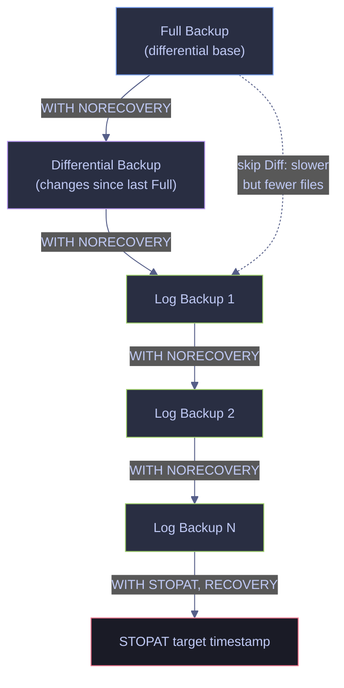
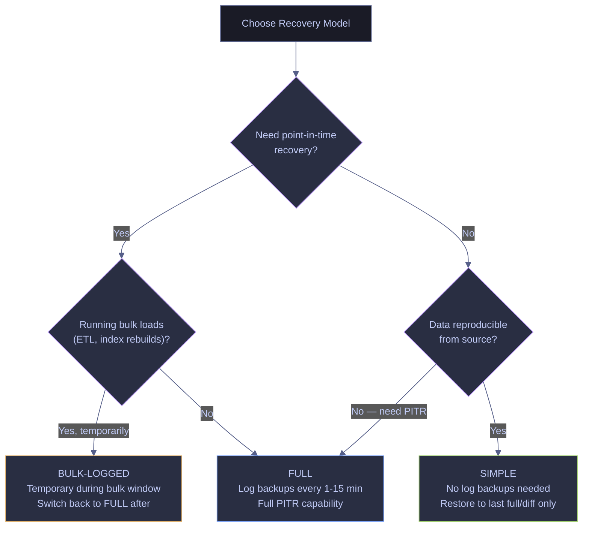

# Backup Types and Strategy

> [!quote]
> "You don't have a backup until you've restored it."
>
> — **Paul Randal**, SQLskills

Backups are the single most critical responsibility of anyone operating a database. A backup strategy is not "I'll remember to back up before big changes" — it is a documented, automated, tested schedule that guarantees you can recover to any point in time within your recovery window.

---

## Backup Types

A SQL Server backup is a point-in-time copy of some or all of the data and transaction log in a database. Different backup types capture different scopes of data, and they relate to each other in a strict dependency chain that determines what restore sequences are possible. Understanding each type — what it captures, what it does not, and how it connects to the others — is the foundation of every backup strategy.

### Backup type overview

| Backup Type | What It Contains | What It Does Not Contain | Duration | Frequency | Use Case |
|---|---|---|---|---|---|
| **Full** | Entire database (all data pages) plus enough log to reach a consistent state at backup completion | Prior log history — only the log generated during the backup itself | Minutes to hours | Daily or weekly | Baseline for all other backups |
| **Differential** | All data extents changed since the most recent full backup (the "differential base") | Unchanged extents; transaction log | Seconds to minutes | Every 4–12 hours | Reduce restore time between fulls |
| **Transaction Log** | All log records since the last log backup | Data pages — only the log stream | Seconds | Every 1–60 minutes | Point-in-time recovery (FULL/BULK-LOGGED models only) |
| **Copy-Only** | Same scope as full (or log), but independent of the normal backup sequence | Does not reset the differential base; log copy-only does not truncate the log | Minutes | Ad-hoc | Before risky operations, without disrupting the regular schedule |
| **File/Filegroup** | One or more specific database files or entire filegroups | Other files/filegroups not specified | Varies | As needed for VLDBs | When full database backup is impractical due to size |
| **Partial** | All read/write filegroups (primary + RW secondary), optionally specified read-only filegroups | Unspecified read-only secondary filegroups | Varies | As needed for VLDBs with read-only filegroups | Focused backup of the mutable portion of a VLDB |

### Backup chain dependencies

Backups do not exist in isolation — they form a chain, and each type depends on specific predecessors for a valid restore.

- A **Differential** depends on the most recent conventional **Full** backup — this is the "differential base." It does not depend on the previous Differential. A copy-only full does **not** reset the differential base, so subsequent Differentials still reference the last conventional Full.
- **Transaction log backups** form a continuous, ordered chain. Each log backup starts exactly where the previous one ended (tracked by Log Sequence Numbers). Breaking the chain — by switching to SIMPLE recovery, losing a `.trn` file, or taking a log backup with `NO_TRUNCATE` — means point-in-time recovery is impossible for the gap period.
- The strict restore order is: **Full → latest Differential (optional, skips older logs) → Log backups in FIFO sequence → final STOPAT**. Skipping a log backup in the middle or restoring out of order fails.

> [!warning] Breaking the log chain
>
> Switching from FULL to SIMPLE recovery and back breaks the log chain permanently for the period the database was in SIMPLE. Any `.trn` files from before the switch cannot be used in a restore sequence that spans the gap. Always take a new Full backup immediately after switching back to FULL.

> [!success] Protect the chain
>
> Never delete `.trn` files until you are certain the retention window has passed and a more recent Full + Differential covers the recovery point. Automate retention with GCS lifecycle policies or SQL Server Agent cleanup jobs — never rely on manual file deletion.

### Backup file extensions

| Backup Type | File Extension | Typical Size |
|---|---|---|
| **Full** | `.bak` | Large (approximately database size after compression) |
| **Differential** | `.bak` or `.dif` | Medium (fraction of full, proportional to changed extents) |
| **Transaction Log** | `.trn` | Small (proportional to transaction volume since last log backup) |
| **File/Filegroup** | `.bak` | Varies (proportional to the files/filegroups included) |
| **Partial** | `.bak` | Varies (proportional to read/write filegroups) |

### Backup chain and restore sequence



---

### T-SQL | BACKUP | commands

The `BACKUP` family of T-SQL commands writes database data and transaction log records to backup media. Each command targets a different scope — full database, differential, transaction log, copy-only, or file/filegroup — and uses `WITH` options to control compression, verification, and media handling.

#### BACKUP DATABASE — full backup (the foundation of all restores)

A full backup captures every data page in the database plus enough transaction log to guarantee a consistent state at backup completion. This is the baseline that all Differential and Log restores depend on.

```sql
BACKUP DATABASE analytics_db
TO DISK = '/var/opt/mssql/backup/mydb_full.bak'
WITH COMPRESSION, STATS = 10, CHECKSUM;
```

> [!info] BACKUP WITH options
>
> - **COMPRESSION** — produces a 3-5x smaller `.bak` file at the cost of slightly more CPU
> - **STATS = 10** — prints progress every 10 % so you can monitor long-running backups
> - **CHECKSUM** — verifies page integrity during the backup, catching corruption early rather than at restore time

#### BACKUP DATABASE WITH DIFFERENTIAL — only changes since last full

A differential backup captures only the data extents that have changed since the most recent conventional full backup (the differential base). Because it writes far fewer pages, it is typically 10–50x faster than a full backup. During restore, applying the latest differential lets you skip all log backups between the full and the differential, significantly reducing recovery time.

```sql
BACKUP DATABASE analytics_db
TO DISK = '/var/opt/mssql/backup/mydb_diff.bak'
WITH DIFFERENTIAL, COMPRESSION, CHECKSUM;
```

#### BACKUP LOG — transaction log backup for point-in-time recovery

A transaction log backup captures every log record generated since the last log backup, enabling point-in-time recovery — the ability to restore to any specific second within the log chain. Log backups are only possible under the FULL or BULK-LOGGED recovery models. After the backup completes, SQL Server truncates the backed-up portion of the log, reclaiming space. The data loss window (RPO) equals the interval between log backups.

```sql
BACKUP LOG analytics_db
TO DISK = '/var/opt/mssql/backup/mydb_log.trn'
WITH COMPRESSION;
```

#### BACKUP DATABASE WITH COPY_ONLY — ad-hoc backup that preserves the chain

A copy-only backup is independent of the normal backup sequence. It does not reset the differential base and does not truncate the transaction log (for `BACKUP LOG ... WITH COPY_ONLY`). Use it before schema changes, risky deployments, or data migrations without disrupting the regular backup schedule.

```sql
BACKUP DATABASE analytics_db
TO DISK = '/var/opt/mssql/backup/mydb_adhoc.bak'
WITH COPY_ONLY, COMPRESSION;
```

> [!tip] Copy-only for log backups too
>
> `BACKUP LOG ... WITH COPY_ONLY` backs up the log without truncating it and without advancing the log archive point. Useful on Always On secondary replicas where you need a log copy without interfering with the primary's log chain.

#### RESTORE VERIFYONLY — validate a backup file without restoring

Reads the entire backup file and verifies page checksums without performing the actual restore. This should be the second step in every backup job — immediately after writing the `.bak` file.

```sql
RESTORE VERIFYONLY FROM DISK = '/var/opt/mssql/backup/mydb_full.bak'
WITH CHECKSUM;
```

> [!warning] Always Verify
>
> An unverified backup is not a backup. Run `RESTORE VERIFYONLY` after every important backup. Also schedule monthly test restores to verify recoverability end-to-end.

> [!success] Automate Verification
>
> Add `RESTORE VERIFYONLY` as a second step in every backup Agent job or cron script. A backup job that writes `.bak` and then immediately verifies it gives you confidence at no extra cost. Pair with monthly restore drills to a staging database for end-to-end confirmation.

#### BACKUP DATABASE FILEGROUP — back up a specific filegroup

A filegroup backup captures one or more filegroups instead of the entire database. This is practical for very large databases (VLDBs) where a full backup would take too long or exceed the maintenance window. Under the FULL recovery model, a complete set of file backups spanning all filegroups, combined with sufficient log backups, is equivalent to a full database backup. Under SIMPLE recovery, individual file backups are only allowed for read-only secondary filegroups.

```sql
BACKUP DATABASE analytics_db
FILEGROUP = 'FG_Historical'
TO DISK = '/var/opt/mssql/backup/mydb_fg_historical.bak'
WITH COMPRESSION, CHECKSUM;
```

> [!info] Piecemeal restore from filegroup backups
>
> Piecemeal (filegroup-level) restore allows you to bring a database online incrementally — restore the primary filegroup first, then restore secondary filegroups one at a time while the database is online. This requires **Enterprise edition** and the FULL or BULK-LOGGED recovery model for read/write filegroups.

#### BACKUP DATABASE READ_WRITE_FILEGROUPS — partial backup

A partial backup captures all read/write filegroups (the primary filegroup plus all read/write secondary filegroups), optionally including specified read-only filegroups. It is designed primarily for the SIMPLE recovery model to provide backup flexibility for VLDBs with large read-only filegroups that do not need to be backed up every time. Partial backups are T-SQL only — they are not supported in the SSMS GUI or the Maintenance Plan Wizard.

```sql
BACKUP DATABASE analytics_db
READ_WRITE_FILEGROUPS
TO DISK = '/var/opt/mssql/backup/mydb_partial.bak'
WITH COMPRESSION, CHECKSUM;
```

> [!tip] Including specific read-only filegroups in a partial backup
>
> To include a specific read-only filegroup alongside the default read/write scope, add it explicitly:
> `BACKUP DATABASE analytics_db READ_WRITE_FILEGROUPS, FILEGROUP = 'FG_Archive' TO DISK = '...'`
> This is useful when a read-only filegroup has been recently switched from read/write and you need it in the backup set for differential partial backups.

| Flag / Option | Syntax | Description |
|---|---|---|
| `COMPRESSION` | `WITH COMPRESSION` | Compress the backup file (3–5x smaller, slightly more CPU) |
| `NO_COMPRESSION` | `WITH NO_COMPRESSION` | Override server default; do not compress |
| `CHECKSUM` | `WITH CHECKSUM` | Verify page integrity during backup and generate a backup-level checksum |
| `COPY_ONLY` | `WITH COPY_ONLY` | Independent backup — does not reset differential base or truncate log |
| `DIFFERENTIAL` | `WITH DIFFERENTIAL` | Capture only extents changed since the last full (differential base) |
| `STATS` | `WITH STATS = 10` | Print progress every N percent (default 10%) |
| `INIT` | `WITH INIT` | Overwrite existing backup sets on media (preserves media header) |
| `NOINIT` | `WITH NOINIT` | Append to existing backup sets (default) |
| `FORMAT` | `WITH FORMAT` | Write a new media header, destroying all existing data on media |
| `NAME` | `WITH NAME = 'set_name'` | Backup set name (max 128 characters) |
| `DESCRIPTION` | `WITH DESCRIPTION = 'text'` | Free-form description (max 255 characters) |
| `RETAINDAYS` | `WITH RETAINDAYS = 30` | Days to retain before SQL Server allows overwrite (0 = never expires) |
| `EXPIREDATE` | `WITH EXPIREDATE = '2026-12-31'` | Date after which backup can be overwritten |
| `ENCRYPTION` | `WITH ENCRYPTION (ALGORITHM = AES_256, SERVER CERTIFICATE = BackupCert)` | Encrypt the backup at rest (SQL Server 2014+) |
| `NORECOVERY` | `BACKUP LOG ... WITH NORECOVERY` | Tail-log backup; leaves database in RESTORING state for restore sequence |
| `NO_TRUNCATE` | `BACKUP LOG ... WITH NO_TRUNCATE` | Back up log without truncating; use on damaged databases |
| `CONTINUE_AFTER_ERROR` | `WITH CONTINUE_AFTER_ERROR` | Continue despite checksum or torn-page errors (useful for tail-log of damaged DB) |

---

### The 3-2-1 Backup Rule

The 3-2-1 rule is a universally accepted standard for backup resilience. It ensures that no single failure — hardware, site, or media — can destroy all copies of your data.

> [!info] The 3-2-1 Rule
>
> - **3** copies of your data (the production database + 2 independent backups)
> - **2** different storage media types (e.g., local SSD + cloud object storage)
> - **1** copy stored offsite (a physically separate location from the primary site)

> [!example] Concrete SQL Server implementation patterns
>
> **GCP-centric (this vault's default):**
> 1. **Copy 1** — production database on the GCE VM's persistent disk
> 2. **Copy 2** — `.bak` files on a separate persistent disk attached to the same VM (local, fast restore)
> 3. **Copy 3** — `.bak` files uploaded to a GCS bucket in a different region (`gsutil cp` or `gcloud storage cp`)
>    - Use [GCS lifecycle policies](https://alp78.github.io/elysium/06-GCP/Storage/gcs-buckets-and-lifecycle) to transition from Standard → Nearline (7 days) → Coldline (30 days) automatically
>    - Complement with [GCE disk snapshots](https://alp78.github.io/elysium/06-GCP/Compute/disks-and-snapshots) for block-level backup with near-instant restore
>
> **Azure-centric alternative:**
> 1. **Copy 1** — production database
> 2. **Copy 2** — local disk backup
> 3. **Copy 3** — `BACKUP DATABASE ... TO URL = 'https://<account>.blob.core.windows.net/...'` directly to Azure Blob Storage with geo-redundant replication (RA-GRS)

---

### Automated Backup-to-GCS Script

This script implements the 3-2-1 rule by taking a compressed full backup via `sqlcmd`, uploading it to a GCS bucket, and then removing the local copy. Run it via `cron` (e.g., daily at 02:00 UTC) or as a SQL Server Agent CmdExec job step.

```bash
#!/usr/bin/env bash
set -euo pipefail
DATE=$(date +%Y%m%d_%H%M%S)
BACKUP_PATH="/var/opt/mssql/backup/mydb_full_${DATE}.bak"
sqlcmd -S localhost -U sa -P "$SA_PASSWORD" -C -Q "BACKUP DATABASE analytics_db TO DISK = '${BACKUP_PATH}' WITH COMPRESSION, CHECKSUM"
gcloud storage cp "${BACKUP_PATH}" gs://analytics-db-backups/daily/
rm "${BACKUP_PATH}"
```

> [!danger] Test Your Restores
>
> Test Your Restores, Not Just Your Backups.
> A backup that cannot be restored is worse than no backup -- it gives false confidence. Schedule quarterly restore drills to a separate database. Common failures that only surface during restore: corrupt `.bak` files from disk errors, missing log chain gaps (skipped a log backup), and cross-version incompatibilities when restoring to a different SQL Server edition.

> [!success] Schedule Quarterly Restore Drills
>
> Create a recurring calendar event or Agent job that restores the latest full backup to a separate `analytics_db_restore_test` database, runs a spot-check query, then drops it. Automate the process so it runs with zero manual effort — the only human step is reading the success/failure notification.

---

## Recovery Model Decision Matrix

The recovery model is a database-level setting that controls how the transaction log is managed, what backup operations are available, and what restore scenarios are possible. SQL Server provides three recovery models: FULL, SIMPLE, and BULK-LOGGED. The default for Standard and Enterprise editions is FULL; Express defaults to SIMPLE. The `model` system database sets the default for all newly created databases on the instance.

| Criterion | FULL | SIMPLE | BULK-LOGGED |
|---|---|---|---|
| **What is logged** | All operations fully logged | All operations fully logged | Bulk operations minimally logged (`BULK INSERT`, `bcp`, `SELECT INTO`, `CREATE INDEX`, text/image ops); all other operations fully logged |
| **Point-in-time recovery** | Yes — restore to any second | No — restore to last full/diff only | Conditional — blocked if log backup contains bulk-logged changes (must restore to end of that log backup) |
| **Log file behavior** | Grows until a log backup truncates it | Auto-recycles at each checkpoint, stays small | Grows until a log backup truncates it; log backups may be large (include affected data extents) |
| **Log backup required** | Yes — every 1–15 min in production | No — log backups are not possible | Yes — same cadence as FULL |
| **Data loss window (RPO)** | Minutes (= log backup interval); zero if tail-log backup succeeds | Hours or a full day (= full/diff backup interval) | Minutes, but bulk-logged changes since last log backup may be lost if the log is damaged |
| **Log shipping / AG / Mirroring** | Supported | Not supported | Supported |
| **File/page/piecemeal restore** | Full support (Enterprise) | Read-only files only | Conditional (Enterprise) |
| **Use when** | User-generated data, financial records, compliance, production | Reproducible data, idempotent pipelines, dev/test | Temporarily during ETL/bulk loads to reduce log size, then switch back to FULL |
| **Risk if misconfigured** | Unbounded log growth fills disk if log backups are not running | Cannot recover recent transactions; no PITR | PITR blocked during bulk windows; large log backups if bulk operations are frequent |

> [!warning] BULK-LOGGED is a temporary supplement, not a permanent model
>
> Switch to BULK-LOGGED only during planned bulk load windows (ETL jobs, index rebuilds, `BULK INSERT` operations) to reduce log volume. Switch back to FULL immediately after the bulk window completes. Always take a log backup **before** switching away from FULL and **after** switching back.

> [!success] Recommended pattern for bulk loads
>
> `ALTER DATABASE db SET RECOVERY BULK_LOGGED` → run bulk operation → `BACKUP LOG db TO DISK = '...'` → `ALTER DATABASE db SET RECOVERY FULL` → `BACKUP LOG db TO DISK = '...'`. This keeps the log small during the bulk load and restores full PITR capability immediately after.

> [!danger] FULL Recovery Needs Log Backups
>
> Never leave a database in FULL recovery model without regular log backups. The transaction log will grow without bound until it fills the disk, at which point **all writes fail across all databases on the instance**. This is the single most common production outage for SQL Server. If you see the log file growing past 10 GB, check `SELECT log_reuse_wait_desc FROM sys.databases` — if it says `LOG_BACKUP`, no log backups are running.

> [!success] Pair FULL Recovery with a Log Backup Job
>
> Any time you set a database to FULL recovery, immediately create a log backup Agent job running every 5–15 minutes. Verify with `SELECT log_reuse_wait_desc FROM sys.databases WHERE name = 'analytics_db'` — the value should be `NOTHING` or `CHECKPOINT`, not `LOG_BACKUP`.

> [!info] Backup permissions
>
> `BACKUP DATABASE` and `BACKUP LOG` require membership in the `sysadmin` fixed server role, or the `db_owner` or `db_backupoperator` fixed database roles. This applies to all backup types and all recovery models.

> [!info] Accelerated Database Recovery (ADR)
>
> SQL Server 2019+ includes Accelerated Database Recovery, which uses a Persistent Version Store (PVS) to dramatically reduce recovery time for databases with long-running transactions. ADR does not change the recovery model or backup strategy, but it reduces the impact of the Undo phase during crash recovery. Place the PVS on a dedicated filegroup on the fastest available storage. Note: Azure SQL Database and Azure SQL Managed Instance have ADR enabled by default and it cannot be disabled.

> [!info] Backup encryption (SQL Server 2014+)
>
> Backups can be encrypted at rest using `WITH ENCRYPTION (ALGORITHM = AES_256, SERVER CERTIFICATE = BackupCert)`. This protects `.bak` files stored offsite or in cloud storage. The certificate or asymmetric key must be backed up separately — losing the certificate means the backup is unrecoverable.



### Switching Recovery Models

Switching recovery models is an instant metadata operation, but it has critical side effects on your backup chain and log behavior. Always take a log backup before switching away from FULL (to close the log chain cleanly) and a full backup after switching to FULL (to establish a new differential base and enable log backups).

#### Check the current recovery model

Query `sys.databases` to confirm the current setting before making changes.

```sql
SELECT name, recovery_model_desc
FROM sys.databases
WHERE name = 'analytics_db';
```

#### Switch to SIMPLE recovery

Use SIMPLE when the data is fully reproducible from source systems and point-in-time recovery is not needed (idempotent pipelines, dev/test environments).

```sql
ALTER DATABASE [analytics_db] SET RECOVERY SIMPLE;
```

#### Switch to FULL recovery

Use FULL when the database holds user-generated data, financial records, or any data subject to compliance requirements where point-in-time recovery is mandatory.

```sql
ALTER DATABASE [analytics_db] SET RECOVERY FULL;
```

> [!danger] Take a full backup immediately after switching to FULL
>
> After switching from SIMPLE to FULL recovery model, take a full backup immediately. Without it, the transaction log cannot be backed up and will grow indefinitely until the server runs out of disk.

> [!success] Full Backup + Log Backup Job Immediately
>
> Run `BACKUP DATABASE analytics_db TO DISK = '...' WITH COMPRESSION, CHECKSUM;` right after `ALTER DATABASE ... SET RECOVERY FULL;`, then start the log backup schedule. These three actions must be done as a unit — never set the recovery model and walk away.

> [!warning] Switching models mid-chain breaks PITR
>
> Switching from FULL to SIMPLE and back breaks the transaction log chain for the period the database was in SIMPLE. Any `.trn` files from before the switch cannot be used in a restore sequence that spans the gap. If PITR coverage is critical, consider BULK-LOGGED as a temporary alternative during bulk loads instead of dropping to SIMPLE.

### After Switching from FULL to SIMPLE — Reclaim Log Space

Switching to SIMPLE marks the log space as reusable but does not shrink the `.ldf` file on disk. SQL Server will reuse the space internally at the next checkpoint, but the physical file stays its current size. To reclaim disk space, you must explicitly shrink the log file after the switch.

#### Check current log size and usage

`DBCC SQLPERF(LOGSPACE)` reports the percentage of log space used across all databases on the instance. Run this first to confirm the log is mostly empty before shrinking.

```sql
DBCC SQLPERF(LOGSPACE);
```

#### Find the logical name of the log file

You need the logical file name (not the physical path) to pass to `DBCC SHRINKFILE`. Query `sys.database_files` filtered to type `1` (log files).

```sql
SELECT name, type_desc, size * 8 / 1024 AS size_mb
FROM sys.database_files WHERE type = 1;
```

> [!info] Column Reference
>
> | Column | Source | Meaning |
> |---|---|---|
> | `name` | `sys.database_files.name` | Logical file name — the identifier used in `DBCC SHRINKFILE` and `WITH MOVE` clauses. This is **not** the physical path on disk. |
> | `type_desc` | `sys.database_files.type_desc` | File type string: `ROWS` (data file, `.mdf`/`.ndf`), `LOG` (transaction log, `.ldf`), `FILESTREAM`, `FULLTEXT`. |
> | `size_mb` | `size × 8 / 1024` | File size in MB. The raw `size` column stores the allocation in 8 KB pages — multiply by 8 for KB, divide by 1024 for MB. This is the **allocated** size, not the used size. |
> | `type` | Filter: `type = 1` | Integer file type: `0` = ROWS (data file), `1` = LOG, `2` = FILESTREAM, `3` = log shipping mirror, `4` = FULLTEXT. The `WHERE type = 1` filter returns only log files, ensuring `DBCC SHRINKFILE` targets the `.ldf`. |

#### Shrink the log file to a target size

Shrinks the `.ldf` file to the specified size in megabytes. SQL Server will grow it again as needed, but under SIMPLE recovery the log recycles space internally and typically stays small.

```sql
DBCC SHRINKFILE(N'mydb_log', 64);
```

> [!warning] Never shrink data files routinely
>
> `DBCC SHRINKFILE` on data files (`.mdf`) causes massive index fragmentation, forcing expensive index rebuilds afterward. Shrinking the log file (`.ldf`) after switching to SIMPLE recovery is a valid one-time operation. Shrinking data files as regular maintenance is almost always counterproductive.

> [!success] Reclaim space without fragmentation
>
> For `.ldf` files: shrink once after switching to SIMPLE, then let SQL Server manage growth. For `.mdf` files: address growth at the source instead — archive old data to a separate table, partition older ranges to a cheaper disk, or enable PAGE compression to reduce size without touching file layout.

| Flag / Option | Syntax | Description |
|---|---|---|
| `target_size` | `DBCC SHRINKFILE(name, 64)` | Target size in MB; SQL Server shrinks to this size or the smallest possible |
| `NOTRUNCATE` | `DBCC SHRINKFILE(name, 64, NOTRUNCATE)` | Move pages to the front of the file but do not release space to the OS |
| `TRUNCATEONLY` | `DBCC SHRINKFILE(name, TRUNCATEONLY)` | Release all free space at the end of the file to the OS; ignores target_size |
| `EMPTYFILE` | `DBCC SHRINKFILE(name, EMPTYFILE)` | Migrate all data from this file to other files in the same filegroup (used before removing a file) |

---

### Point-in-Time Recovery (PITR) Sequence

Point-in-time recovery restores a database to an exact second by replaying the backup chain: full → differential (optional) → log backups in order → final log with `STOPAT`. This is the primary reason for running the FULL recovery model and maintaining an unbroken log chain. See [restore-and-recovery](https://alp78.github.io/elysium/04-SQL-Server/Administration/restore-and-recovery) for additional restore scenarios (side-by-side, crash recovery monitoring).

> [!todo] Complete PITR procedure
>
> 1. Verify prerequisites (FULL recovery model active, unbroken log chain)
> 2. Take a tail-log backup (`BACKUP LOG ... WITH NORECOVERY`)
> 3. Restore the full backup (`RESTORE DATABASE ... WITH NORECOVERY`)
> 4. Restore the differential backup if available (`RESTORE DATABASE ... WITH NORECOVERY`)
> 5. Restore log backups in sequence (`RESTORE LOG ... WITH NORECOVERY`)
> 6. Restore the final log with `STOPAT` to the target timestamp (`RESTORE LOG ... WITH STOPAT, RECOVERY`)
> 7. Validate the restored database (`DBCC CHECKDB`)

#### Step 1 — Verify prerequisites

Before starting a PITR, confirm that the database is in FULL recovery model and that the log chain is unbroken. If `log_reuse_wait_desc` shows `LOG_BACKUP`, log backups have been running and the chain is intact.

```sql
SELECT name, recovery_model_desc, log_reuse_wait_desc
FROM sys.databases
WHERE name = 'analytics_db';
```

> [!info] Column Reference
>
> | Column | Meaning |
> |---|---|
> | `name` | Database name. |
> | `recovery_model_desc` | Active recovery model: `FULL` (PITR capable), `SIMPLE` (PITR not possible), `BULK_LOGGED` (PITR blocked during bulk windows). PITR requires `FULL`. |
> | `log_reuse_wait_desc` | Reason the log cannot yet be truncated. For PITR prerequisites: `LOG_BACKUP` confirms log backups are running and the chain is intact. `NOTHING` or `CHECKPOINT` means the log is healthy. Any other value (e.g., `ACTIVE_TRANSACTION`, `REPLICATION`) indicates a condition blocking truncation. See [essential-dba-queries](https://alp78.github.io/elysium/04-SQL-Server/Administration/essential-dba-queries) for the full 10-value reference. |

#### Step 2 — Tail-log backup

The tail-log backup captures all log records generated since the last regular log backup — up to the exact moment of failure. `WITH NORECOVERY` leaves the database in a restoring state so the restore sequence can proceed. Without this step, you lose all transactions since the last log backup.

```sql
BACKUP LOG analytics_db
TO DISK = '/var/opt/mssql/backup/mydb_taillog.trn'
WITH NORECOVERY;
```

#### Step 3 — Restore the full backup

Restores the full backup as the foundation of the recovery chain. `WITH NORECOVERY` keeps the database in the restoring state, ready to accept further backups. Do not use `WITH RECOVERY` here — doing so brings the database online prematurely and rolls back uncommitted transactions, making further log restores impossible.

```sql
RESTORE DATABASE analytics_db
FROM DISK = '/var/opt/mssql/backup/mydb_full.bak'
WITH NORECOVERY, REPLACE;
```

#### Step 4 — Restore the differential backup (if available)

Applying the most recent differential brings the database forward to the state at differential backup time, skipping all log backups between the full and the differential. This significantly reduces restore time for databases with frequent log backups. If no differential exists, skip this step and proceed to log backups.

```sql
RESTORE DATABASE analytics_db
FROM DISK = '/var/opt/mssql/backup/mydb_diff.bak'
WITH NORECOVERY;
```

#### Step 5 — Restore log backups in sequence

Apply each transaction log backup in strict chronological order (FIFO), starting from the one taken immediately after the differential (or the full, if no differential was used). Each must use `WITH NORECOVERY` to keep the database in restoring state. Skipping a log backup or restoring out of order causes the sequence to fail.

```sql
RESTORE LOG analytics_db
FROM DISK = '/var/opt/mssql/backup/mydb_log_001.trn'
WITH NORECOVERY;

RESTORE LOG analytics_db
FROM DISK = '/var/opt/mssql/backup/mydb_log_002.trn'
WITH NORECOVERY;
```

#### Step 6 — Final log restore with STOPAT

The final log backup is restored with `STOPAT` set to the exact target timestamp. SQL Server replays transactions up to that second and discards anything committed after it. `WITH RECOVERY` brings the database online, rolling back any uncommitted transactions at the target time.

```sql
RESTORE LOG analytics_db
FROM DISK = '/var/opt/mssql/backup/mydb_taillog.trn'
WITH STOPAT = '2026-03-09T14:23:45', RECOVERY;
```

> [!info] STOPAT timestamp format
>
> The `STOPAT` value must be in ISO 8601 format: `'YYYY-MM-DDTHH:MM:SS'`. SQL Server interprets it in the server's local time zone unless the value includes a UTC offset. Always verify the server's time zone setting before specifying the target time.

#### Step 7 — Post-restore validation

After the database comes online, run `DBCC CHECKDB` to verify the physical and logical integrity of the restored data. This confirms the backup files were not corrupt and the restore completed cleanly.

```sql
DBCC CHECKDB('analytics_db') WITH NO_INFOMSGS, ALL_ERRORMSGS;
```

> [!danger] Common PITR failure scenarios
>
> - **Broken log chain:** A missing `.trn` file in the sequence makes PITR impossible for the gap period. `RESTORE LOG` will fail with error 4305 ("The log in this backup set begins at LSN X, which is too recent to apply to the database").
> - **Premature `WITH RECOVERY`:** Accidentally using `RECOVERY` instead of `NORECOVERY` on any step before the final one brings the database online and rolls back uncommitted transactions. No further log restores can be applied — you must restart the entire sequence from the full backup.
> - **Wrong `STOPAT` format:** Using a non-ISO format or the wrong time zone results in restoring to the wrong point in time or an error. Always use `'YYYY-MM-DDTHH:MM:SS'` and verify the server time zone.

> [!success] How to recover from these failures
>
> - **Broken chain:** If the gap is small and the data for that period is reproducible, restore to the last available log backup before the gap. If not, this data is lost — the unbroken chain cannot be reconstructed. Prevent this by monitoring log backup jobs and alerting on failures.
> - **Premature RECOVERY:** Restart the entire PITR sequence from Step 3 (restore full). The database is online but in the wrong state — overwrite it with `WITH REPLACE`.
> - **Wrong STOPAT:** Restart from the last log backup before the correct target time and re-apply with the corrected timestamp.

---

> [!danger] Untested Backups Are Not Backups
>
> A backup that has never been restored is a file that might contain your data. You don't know until you try. Schedule quarterly RESTORE tests to a separate database: verify the backup completes, the database comes online, and a spot-check query returns expected data. A backup strategy without a restore test strategy is wishful thinking.

> [!success] Document the Restore Procedure
>
> Write a one-page restore runbook and store it outside the database (in this vault or a shared drive). Include: the exact RESTORE commands for full, differential, and log restores; the expected time to restore; and the name of who is responsible. Practice it quarterly so the procedure is muscle memory before you need it under pressure.

### Backup Scheduling and Retention

Backup frequency and retention depend on the workload type, the acceptable data loss window (RPO), and the acceptable recovery time (RTO). The tables below provide recommended schedules for two common workload profiles, followed by retention configuration options.

#### OLTP / financial / compliance workloads

These workloads hold user-generated or regulatory data where even minutes of data loss are unacceptable. Use the FULL recovery model with aggressive log backup intervals.

| Backup Type | Frequency | Storage | Purpose |
|---|---|---|---|
| Full | Daily at 02:00 UTC | GCS Standard → Nearline (7d) → Coldline (30d) | Baseline for restores |
| Differential | Every 4–6 hours | GCS Standard → Nearline (7d) | Reduces log replay time during restore |
| Log | Every 1–5 minutes | GCS Standard → Nearline (7d) | Point-in-time recovery; RPO = log interval |

#### Analytics / reproducible pipeline workloads

These workloads load data from external sources via idempotent pipelines. Data can be fully reloaded if lost. Use SIMPLE recovery to minimize overhead, or FULL with less aggressive log intervals if partial recovery is still desirable.

| Backup Type | Frequency | Storage | Purpose |
|---|---|---|---|
| Full | Weekly (Sunday 02:00 UTC) | GCS Standard → Nearline (7d) → Coldline (30d) | Baseline for restores |
| Differential | Daily at 02:00 UTC | GCS Standard → Nearline (7d) | Reduces gap between weekly fulls |
| Log | Every 15–60 minutes (if FULL model) | GCS Standard → Nearline (7d) | Optional PITR; skip if using SIMPLE |

#### Retention configuration

SQL Server provides two T-SQL options to prevent backup media from being overwritten before a retention period expires. These protect against accidental overwrite within SQL Server only — they do not prevent OS-level file deletion or GCS lifecycle policy deletion.

```sql
BACKUP DATABASE analytics_db
TO DISK = '/var/opt/mssql/backup/mydb_full.bak'
WITH COMPRESSION, CHECKSUM, RETAINDAYS = 30;
```

| Option | Syntax | Description |
|---|---|---|
| `RETAINDAYS` | `WITH RETAINDAYS = 30` | Number of days to retain (0–99999; 0 = never expires). Takes precedence over `EXPIREDATE`. |
| `EXPIREDATE` | `WITH EXPIREDATE = '2026-12-31'` | Absolute date after which the backup can be overwritten |
| Server default | `EXEC sp_configure 'media retention', 30; RECONFIGURE;` | Sets the instance-wide default retention in days; individual backup `RETAINDAYS` overrides this |

> [!tip] Suppress log backup success messages
>
> Enable trace flag 3226 (`DBCC TRACEON(3226, -1)`) to suppress the informational "backup completed successfully" messages that log backups write to the SQL Server error log every few minutes. This keeps the error log clean and makes real errors easier to spot. The flag has no effect on backup behavior — only on error log verbosity.

Schedule all backup jobs through [SQL Server Agent](https://alp78.github.io/elysium/04-SQL-Server/Administration/sql-server-agent-jobs) or Linux `cron`. Each backup type should be a separate job step for independent monitoring and alerting.

---

### Related

- [restore-and-recovery](https://alp78.github.io/elysium/04-SQL-Server/Administration/restore-and-recovery) — full restore, PITR, restore to new database
- [server-configuration](https://alp78.github.io/elysium/04-SQL-Server/Administration/server-configuration) — recovery model configuration with `mssql-conf`
- [sqlcmd-connection-and-usage](https://alp78.github.io/elysium/04-SQL-Server/Administration/sqlcmd-connection-and-usage) — using sqlcmd for backup scripting
- [sql-server-agent-jobs](https://alp78.github.io/elysium/04-SQL-Server/Administration/sql-server-agent-jobs) — scheduling backup jobs with SQL Server Agent
