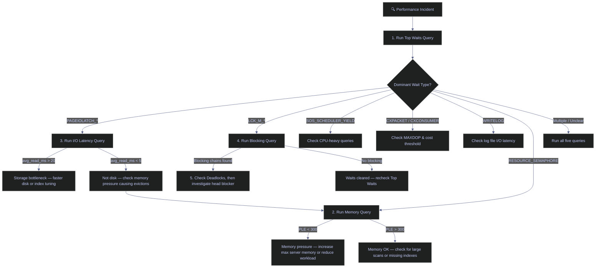

# Essential DBA Queries

> [!quote]
> "You can't manage what you can't measure, and you can't measure what you can't see."
>
> — **Brent Ozar**, brentozar.com

These T-SQL queries are the diagnostic toolkit for operating SQL Server in production. Keep them in a script you can run in seconds during an incident. They map to Dynamic Management Views (DMVs) — real-time system tables that expose the internals of the running SQL Server instance.

---

## Server Information

These queries answer the first questions on any incident or onboarding: what version is this server, what databases exist, how large are they, and what configuration is in effect. Run them when connecting to an unfamiliar instance or diagnosing capacity issues.

### SERVERPROPERTY() — Version, Edition, and Instance Identity

`SERVERPROPERTY()` is a built-in metadata function that returns structured information about the SQL Server instance — its version, edition, build number, collation, and high-availability configuration. This is the first function to call when connecting to an unfamiliar instance, because the version and edition determine which features and DMVs are available.

> [!info] Two Ways to Check Version
>
> `@@VERSION` returns a free-text string useful for quick checks. `SERVERPROPERTY` returns structured fields you can compare programmatically — use it when you need to branch logic by edition or build number.

```sql
SELECT @@VERSION;
```

```sql
SELECT
    SERVERPROPERTY('ProductVersion')   AS product_version,
    SERVERPROPERTY('ProductLevel')     AS product_level,
    SERVERPROPERTY('ProductUpdateLevel') AS cu_level,
    SERVERPROPERTY('Edition')          AS edition,
    SERVERPROPERTY('EngineEdition')    AS engine_edition,
    SERVERPROPERTY('Collation')        AS collation,
    SERVERPROPERTY('IsClustered')      AS is_clustered,
    SERVERPROPERTY('IsHadrEnabled')    AS is_hadr,
    SERVERPROPERTY('IsFullTextInstalled') AS is_fulltext,
    SERVERPROPERTY('ServerName')       AS server_name,
    SERVERPROPERTY('InstanceName')     AS instance_name,
    SERVERPROPERTY('ComputerNamePhysicalNetBIOS') AS physical_host;
```

> [!tip] Quick Identity Globals
>
> These globals are useful in scripts that need to log which server and session they ran on.

```sql
SELECT @@SERVERNAME AS server_name, @@SERVICENAME AS service_name,
       @@SPID AS current_spid, @@LANGUAGE AS language,
       @@MAX_CONNECTIONS AS max_connections;
```

---

### sys.databases — All Databases on the Instance

`sys.databases` is a system catalog view that returns one row per database on the instance. It exposes the recovery model, compatibility level, state, and key operational flags. The `state_desc` column shows the database's availability: `ONLINE` (normal), `RESTORING` (mid-restore sequence), `RECOVERING` (startup recovery in progress), `SUSPECT` (corruption detected), or `OFFLINE` (manually taken offline). The `log_reuse_wait_desc` column is critical during capacity incidents — it explains why the transaction log cannot be truncated.

> [!abstract] What This Shows
>
> Every database on the instance with its recovery model, compatibility level, and key flags. The `log_reuse_wait_desc` column is especially important — it tells you why the transaction log cannot be truncated.

```sql
SELECT
    database_id,
    name,
    state_desc,
    recovery_model_desc,
    compatibility_level,
    collation_name,
    is_read_only,
    is_auto_shrink_on,
    is_auto_close_on,
    is_broker_enabled,
    is_cdc_enabled,
    log_reuse_wait_desc,
    create_date
FROM sys.databases
ORDER BY name;
```

---

### sys.master_files — Database File Locations and Sizes

`sys.master_files` is a server-level catalog view that returns one row per physical file (data or log) across all databases. Every SQL Server database has at least two files: a data file (`type = 0`, file extension `.mdf` or `.ndf`) that stores tables, indexes, and other objects, and a log file (`type = 1`, file extension `.ldf`) that records every transaction for crash recovery and point-in-time restore. Best practice is to place data and log files on separate physical drives — the log file writes sequentially and benefits from dedicated I/O bandwidth.

File sizes in `sys.master_files` are stored in 8 KB pages, so the conversion `size * 8.0 / 1024` yields megabytes. The `growth` column indicates how much the file expands when auto-growth triggers: if `is_percent_growth = 1`, the value is a percentage; otherwise it is in 8 KB pages. Percent-based growth is dangerous at scale because a 10% growth on a 500 GB file allocates 50 GB at once, potentially stalling the server during the zeroing operation. Fixed growth (e.g., 512 MB increments) is predictable and preferred. An unlimited `max_size` (`-1`) means the file can grow until the disk is full — always set an explicit cap.

> [!abstract] What This Shows
>
> Physical file paths, current size, max size, and growth settings for every data and log file across all databases. Use this to verify file placement (data and log on separate drives) and catch unlimited auto-growth settings.

```sql
SELECT
    d.name                          AS database_name,
    mf.file_id,
    mf.type_desc,
    mf.name                         AS logical_name,
    mf.physical_name,
    mf.state_desc,
    CAST(mf.size * 8.0 / 1024 AS DECIMAL(12,2))       AS size_mb,
    CAST(mf.max_size * 8.0 / 1024 AS DECIMAL(12,2))   AS max_size_mb,
    mf.growth,
    mf.is_percent_growth
FROM sys.master_files mf
JOIN sys.databases d ON d.database_id = mf.database_id
ORDER BY d.name, mf.file_id;
```

---

### sys.configurations — Instance Configuration Settings

`sys.configurations` is a catalog view that exposes every instance-level setting controlled by `sp_configure`. Each row has a `value` column (the configured setting) and a `value_in_use` column (the currently active setting). A mismatch between the two means a `RECONFIGURE` statement or a server restart is needed to activate the change. Most performance-critical settings (memory, parallelism, ad hoc optimization) are classified as "advanced options" and are hidden until you run `sp_configure 'show advanced options', 1; RECONFIGURE;`.

> [!abstract] What This Shows
>
> Key instance-level settings that control memory allocation, parallelism, and backup behavior. Compare `value` (configured) vs `value_in_use` (active) — a mismatch means a `RECONFIGURE` or restart is pending.

```sql
EXEC sp_configure 'show advanced options', 1;
RECONFIGURE;
```

```sql
SELECT name, value, value_in_use, minimum, maximum, description, is_advanced
FROM sys.configurations
WHERE name IN (
    'max server memory (MB)',
    'min server memory (MB)',
    'max degree of parallelism',
    'cost threshold for parallelism',
    'optimize for ad hoc workloads',
    'backup compression default',
    'remote admin connections',
    'contained database authentication',
    'default trace enabled'
)
ORDER BY name;
```

> [!example] Recommended Values for Key Settings
>
> | Setting | Default | Recommended | Why |
> |---|---|---|---|
> | `max server memory (MB)` | 2,147,483,647 (unbounded) | ~75% of available RAM | Default lets SQL Server consume all memory, starving the OS and other processes |
> | `max degree of parallelism` | 0 (all processors) | 8 for single NUMA with >8 cores; ≤ logical processors per NUMA node otherwise | MAXDOP 0 can cause excessive parallelism overhead on large servers |
> | `cost threshold for parallelism` | 5 | 25–50 for OLTP workloads | Microsoft states the default of 5 is "a starting point, not a recommendation" — too low causes trivial queries to go parallel |
> | `optimize for ad hoc workloads` | 0 (off) | 1 (on) for OLTP servers | Prevents plan cache bloat from one-off queries by storing only a compiled plan stub on first execution |
> | `backup compression default` | 0 (off) | 1 (on) | Compressed backups are faster and smaller with minimal CPU overhead on modern hardware |

> [!warning] Auto-Shrink Is Always Wrong
>
> If `is_auto_shrink_on = 1` on any database (visible in the `sys.databases` query above), disable it immediately. Auto-shrink causes severe index fragmentation, burns I/O, and the freed space will be reclaimed by the next growth event anyway — creating an expensive shrink-grow-shrink cycle.

> [!success] Disable Auto-Shrink
>
> `ALTER DATABASE [dbname] SET AUTO_SHRINK OFF;` — then manually right-size the file with `DBCC SHRINKFILE` followed by a pre-sized `ALTER DATABASE ... MODIFY FILE` if the file is genuinely oversized.

---

## Space and Size

These queries measure how much disk space databases, tables, indexes, and log files consume. Run them when investigating capacity alerts, planning storage expansion, or identifying tables that have grown beyond expectations.

### Database Size Summary — Data vs Log Breakdown

This query aggregates `sys.master_files` by database to produce a single-row-per-database summary showing how much space is allocated to data files versus log files. A healthy data-to-log ratio varies by workload, but a log file larger than 25% of the data file size on a FULL recovery model database usually means log backups are not running frequently enough.

> [!abstract] What This Shows
>
> Total allocated size per database, split into data files and log files. This is the first query to run when investigating capacity — it tells you whether data or log growth is consuming space.

```sql
SELECT
    d.name                                                          AS database_name,
    SUM(CASE WHEN mf.type = 0 THEN mf.size END) * 8.0 / 1024      AS data_size_mb,
    SUM(CASE WHEN mf.type = 1 THEN mf.size END) * 8.0 / 1024      AS log_size_mb,
    SUM(mf.size) * 8.0 / 1024                                      AS total_size_mb
FROM sys.databases d
JOIN sys.master_files mf ON d.database_id = mf.database_id
GROUP BY d.name
ORDER BY total_size_mb DESC;
```

---

### Table Sizes — Current Database

Two approaches: `sp_spaceused` for a quick single-table check, or the DMV query for a ranked view of all tables.

#### sp_spaceused — Quick Single-Table Size Check

`sp_spaceused` is a built-in stored procedure that reports the row count, total reserved space, data size, index size, and unused space for a single table. Called without arguments, it reports the total size of the current database. It is the fastest way to check a single table's footprint, but does not support sorting or filtering — use the DMV query below for a ranked view across all tables.

```sql
EXEC sp_spaceused 'dbo.trades';
```

```sql
EXEC sp_spaceused;
```

#### sys.allocation_units — All Tables Ranked by Size

This query joins `sys.tables`, `sys.indexes`, `sys.partitions`, and `sys.allocation_units` to compute the total, used, and data-only page counts for every table in the current database. The `index_id IN (0, 1)` filter restricts results to heaps (`0`) and clustered indexes (`1`), which represent the base table data — excluding nonclustered indexes that would double-count space.

```sql
SELECT
    s.name                                              AS schema_name,
    t.name                                              AS table_name,
    SUM(a.total_pages)  * 8.0 / 1024                   AS total_mb,
    SUM(a.used_pages)   * 8.0 / 1024                   AS used_mb,
    SUM(a.data_pages)   * 8.0 / 1024                   AS data_mb,
    SUM(p.rows)                                         AS row_count
FROM sys.tables t
JOIN sys.schemas s          ON t.schema_id = s.schema_id
JOIN sys.indexes i          ON t.object_id = i.object_id AND i.index_id IN (0,1)
JOIN sys.partitions p       ON i.object_id = p.object_id AND i.index_id = p.index_id
JOIN sys.allocation_units a ON p.partition_id = a.container_id
GROUP BY s.name, t.name
ORDER BY total_mb DESC;
```

---

### dm_db_partition_stats — Fast Row Counts Without Scanning

`sys.dm_db_partition_stats` is a DMV that exposes per-partition metadata including row counts, page counts, and reserved space. Unlike `SELECT COUNT(*)`, which performs a full table or index scan, this DMV reads pre-computed metadata and returns instantly regardless of table size. The `index_id IN (0, 1)` filter selects heaps (index_id 0) and clustered indexes (index_id 1) — both represent the base table rows. Nonclustered indexes (index_id ≥ 2) are excluded to avoid counting rows multiple times.

```sql
SELECT
    OBJECT_SCHEMA_NAME(object_id)   AS schema_name,
    OBJECT_NAME(object_id)          AS table_name,
    SUM(row_count)                  AS total_rows
FROM sys.dm_db_partition_stats
WHERE index_id IN (0, 1)
GROUP BY object_id
ORDER BY total_rows DESC;
```

---

### Index Sizes — Space Consumed per Index

This query computes the space consumed by each individual index. Every write operation (INSERT, UPDATE, DELETE) must update every nonclustered index on the affected table, so oversized or redundant indexes impose a direct write penalty. Indexes that consume significant space but are rarely used by queries are candidates for removal — cross-reference with `sys.dm_db_index_usage_stats` to check read vs. write ratios.

> [!abstract] What This Shows
>
> Total and used space for every index on every table. Use this to find oversized indexes that waste disk and slow down writes.

```sql
SELECT
    OBJECT_SCHEMA_NAME(i.object_id)             AS schema_name,
    OBJECT_NAME(i.object_id)                    AS table_name,
    i.name                                      AS index_name,
    i.type_desc,
    SUM(a.total_pages) * 8.0 / 1024            AS total_mb,
    SUM(a.used_pages)  * 8.0 / 1024            AS used_mb
FROM sys.indexes i
JOIN sys.partitions p       ON i.object_id = p.object_id AND i.index_id = p.index_id
JOIN sys.allocation_units a ON p.partition_id = a.container_id
GROUP BY i.object_id, i.name, i.type_desc
ORDER BY total_mb DESC;
```

---

### Transaction Log Space Usage — Log Size and VLF Health

The transaction log records every data modification so SQL Server can guarantee ACID compliance and support point-in-time recovery. Internally, the log file is divided into Virtual Log Files (VLFs) — logical segments that SQL Server activates and deactivates as the log cycles. The number and size of VLFs depends on how the log file was grown: many small auto-growth events create many small VLFs, which degrades backup/restore performance and increases recovery time. `DBCC LOGINFO` returns one row per VLF — a count above 200 is a red flag, and above 1000 is a serious performance risk.

> [!warning] High VLF Count Means Fragmented Log
>
> A high VLF (Virtual Log File) count means the transaction log has been grown in many small increments instead of pre-sized. This fragments the log and slows backup/restore operations. If `DBCC LOGINFO` returns hundreds of rows, consider shrinking and pre-sizing the log file. The `log_reuse_wait_desc` column explains why the log can't be truncated — common values: `ACTIVE_TRANSACTION` (long-running query), `LOG_BACKUP` (no log backup taken), `REPLICATION` (replication agent behind).

> [!success] Pre-Size the Log File
>
> Shrink the log to a small size, then immediately expand it to the expected working size in a single operation to create one large VLF instead of hundreds of small ones: `DBCC SHRINKFILE(N'mydb_log', 64);` followed by `ALTER DATABASE mydb MODIFY FILE (NAME = mydb_log, SIZE = 4096MB);`. Pre-sizing prevents auto-growth fragmentation going forward.

```sql
DBCC SQLPERF(LOGSPACE);
```

```sql
SELECT name, log_reuse_wait_desc
FROM sys.databases
ORDER BY name;
```

```sql
DBCC LOGINFO;
```

---

### TempDB Usage — Space Consumed per Session

TempDB is a single, instance-wide system database shared by all sessions. It stores temporary tables (`#temp`), table variables (`@var`), sort and hash join spills (when a query's memory grant is insufficient), version store rows (used by RCSI and snapshot isolation), and internal worktables for cursors and spools. Because every session competes for TempDB space, a single runaway query can fill TempDB and cascade failures across the entire server.

TempDB space is consumed in three categories: user objects (explicit temp tables and table variables), internal objects (spills, worktables, cursors), and the version store. The `tempdb.sys.dm_db_file_space_usage` DMV breaks down space by these categories for the entire database, while `sys.dm_db_session_space_usage` attributes consumption to individual sessions.

> [!warning] TempDB Is a Shared Bottleneck
>
> TempDB is shared by all sessions. A single query spilling to TempDB (hash joins, sorts exceeding memory grant) can fill TempDB and block every other query on the server. Monitor TempDB space during large ETL runs. If TempDB runs out of space, SQL Server returns error 1105 and the offending query fails — but other sessions may also fail if they need TempDB space at that moment. `PAGELATCH` waits on TempDB indicate allocation contention (too few data files), while `PAGEIOLATCH` waits indicate storage I/O bottleneck — these are distinct problems with different fixes.

> [!success] Pre-Size TempDB and Tune Memory Grants
>
> Pre-size TempDB data files to cover peak ETL workload (check historical max usage with the `dm_db_session_space_usage` query below). Use one TempDB data file per logical core, minimum 2, maximum 8 — add more only if `PAGELATCH` waits persist. For queries spilling due to memory grant underestimates, run `UPDATE STATISTICS` with `FULLSCAN` after bulk loads so the optimizer grants larger memory and avoids the spill. On SQL Server 2019+ Enterprise, enable Memory-Optimized TempDB Metadata to eliminate system-page contention entirely.

#### dm_db_session_space_usage — TempDB Allocation per Session

This query joins `sys.dm_db_session_space_usage` with `sys.dm_exec_sessions` to show how much TempDB space each session has allocated, broken down into user objects (explicit temp tables and table variables) and internal objects (sort/hash spills, worktables). Sessions with high `internal_obj_mb` are likely spilling due to insufficient memory grants.

```sql
SELECT
    s.session_id,
    s.login_name,
    s.program_name,
    t.user_objects_alloc_page_count   * 8.0 / 1024 AS user_obj_mb,
    t.internal_objects_alloc_page_count * 8.0 / 1024 AS internal_obj_mb,
    t.user_objects_alloc_page_count + t.internal_objects_alloc_page_count AS total_pages
FROM sys.dm_db_session_space_usage t
JOIN sys.dm_exec_sessions s ON t.session_id = s.session_id
WHERE t.user_objects_alloc_page_count + t.internal_objects_alloc_page_count > 0
ORDER BY total_pages DESC;
```

#### TempDB File Sizes and Free Space

This query reports the allocated size, used space, and free space for each TempDB data file. All TempDB data files should be the same size — unequal sizes cause SQL Server's proportional fill algorithm to favor the largest file, negating the contention reduction that multiple files provide.

```sql
USE tempdb;
SELECT
    name,
    file_id,
    CAST(size * 8.0 / 1024 AS DECIMAL(10,2))                        AS size_mb,
    CAST(FILEPROPERTY(name, 'SpaceUsed') * 8.0 / 1024 AS DECIMAL(10,2)) AS used_mb,
    CAST((size - FILEPROPERTY(name, 'SpaceUsed')) * 8.0 / 1024 AS DECIMAL(10,2)) AS free_mb
FROM sys.database_files;
```

---

### dm_os_volume_stats — Disk Free Space per Volume

`sys.dm_os_volume_stats` is a table-valued function that returns disk volume information (total size, free space) for the drives hosting SQL Server database files. It requires a `database_id` and `file_id` as input, so the standard pattern cross-applies it against `sys.master_files` to cover all volumes. This is the only way to check disk free space from within T-SQL without xp_cmdshell or CLR.

> [!danger] Full Disk Halts the Pipeline
>
> SQL Server stops accepting writes when the disk is full. The database goes read-only, transactions fail, and the pipeline halts. Monitor disk free space proactively — see [sql-server-disk-full](https://alp78.github.io/elysium/15-Runbooks/sql-server-disk-full) for the full runbook. As a rule of thumb, alert at 85% used, investigate at 90%, and treat 95% as a P1 incident.

> [!success] Set Up Disk Alerts Before They Are Needed
>
> Create a Datadog monitor on the `pct_free` value from the `dm_os_volume_stats` query below: alert at < 15% free, page-on-call at < 10% free. Pair with a GCS backup lifecycle policy that automatically deletes local `.bak` files after upload, keeping the backup disk from accumulating stale copies.

```sql
SELECT DISTINCT
    vs.volume_mount_point,
    vs.logical_volume_name,
    CAST(vs.total_bytes / 1073741824.0 AS DECIMAL(10,2))     AS total_gb,
    CAST(vs.available_bytes / 1073741824.0 AS DECIMAL(10,2)) AS free_gb,
    CAST(100.0 * vs.available_bytes / vs.total_bytes AS DECIMAL(5,2)) AS pct_free
FROM sys.master_files mf
CROSS APPLY sys.dm_os_volume_stats(mf.database_id, mf.file_id) vs
ORDER BY vs.volume_mount_point;
```

---

## Active Sessions and Queries

These queries show who is connected, what they are running, and how to intervene when a session is stuck. They target `sys.dm_exec_sessions` (authenticated connections) and `sys.dm_exec_requests` (currently executing batches). Together, these two DMVs provide a real-time view of server activity — sessions persist for the lifetime of a connection, while requests appear only while a batch is actively executing.

### Active Connections

`sys.dm_exec_sessions` returns one row per authenticated session. The `is_user_process = 1` filter excludes system sessions (background tasks like the lazy writer, checkpoint, and lock monitor) and limits results to application connections. The `program_name` column identifies the connecting application — values like `.Net SqlClient Data Provider`, `Microsoft JDBC Driver`, or `Python` help trace which application tier is consuming connections.

```sql
SELECT login_name, program_name, COUNT(*) AS connections
FROM sys.dm_exec_sessions
WHERE is_user_process = 1
GROUP BY login_name, program_name
ORDER BY connections DESC;
```

> [!tip] Connection Spikes Signal Trouble
>
> `program_name` identifies the application: Python, Microsoft JDBC, .Net SqlClient, etc. A sudden spike in connections often precedes performance problems — check for connection leaks or runaway retry loops.

---

### Currently Running Queries

`sys.dm_exec_requests` returns one row per currently executing request. The `session_id > 50` filter excludes system sessions — SQL Server reserves session IDs 1 through 50 for internal background tasks (checkpoint, lazy writer, lock monitor, etc.). The `sql_handle` column is a varbinary token that uniquely identifies the batch; `CROSS APPLY sys.dm_exec_sql_text(sql_handle)` converts it to readable T-SQL text.

The `status` column shows the request's current state:

| Status | Meaning |
|---|---|
| `running` | Actively executing on a CPU scheduler |
| `runnable` | Ready to execute, waiting for a CPU quantum |
| `suspended` | Blocked — waiting for a resource (lock, I/O, latch, memory grant) |
| `sleeping` | Session idle, no active request |
| `rollback` | Rolling back a transaction |

```sql
SELECT r.session_id, r.status, r.command,
       r.total_elapsed_time / 1000 AS elapsed_sec,
       r.cpu_time / 1000 AS cpu_sec,
       r.reads AS logical_reads,
       SUBSTRING(st.text, 1, 200) AS query_text
FROM sys.dm_exec_requests r
CROSS APPLY sys.dm_exec_sql_text(r.sql_handle) st
WHERE r.session_id > 50
ORDER BY r.total_elapsed_time DESC;
```

> [!tip] Suspended Status
>
> A query with high `elapsed_time` but low `cpu_time` is not using CPU — it is WAITING for a resource (lock, disk, memory). This is the key to diagnosing whether a problem is compute-bound or I/O-bound.

---

### Kill a Stuck Session

`KILL <session_id>` marks a session for termination. If the session has an open transaction, SQL Server initiates a rollback of all uncommitted changes before releasing the session's locks and resources. The rollback runs at the same speed as the original operation — a 2-hour bulk INSERT that is 90% complete will take approximately 1.8 hours to roll back. Use `KILL <session_id> WITH STATUSONLY` to monitor rollback progress without sending another kill signal.

```sql
KILL 82;
```

> [!danger] Rollback Can Take Longer Than the Original Query
>
> Killing a session with an open transaction triggers a ROLLBACK — which can take longer than letting the query finish. A 2-hour INSERT that's 90% done will take ~1.8 hours to roll back. Always check what the session is doing first with the Running Queries query above.

> [!success] Monitor Rollback Progress Before Killing
>
> Before killing a session, check `sys.dm_exec_requests` for `percent_complete` and `estimated_completion_time` on the target session. If the query is nearly done, let it finish. If it is a runaway with no end in sight, kill it — then monitor rollback progress with the same query filtered on `command = 'KILLED/ROLLBACK'`.

---

## The Diagnostic Five (Run These First)

Run all five queries during any performance incident to identify the root cause quickly. Start with Top Waits to classify the problem, then drill into the specific area (memory, I/O, blocking, or deadlocks) that the wait types point to.



### Top Waits — What Is SQL Server Waiting On?

`sys.dm_os_wait_stats` is the single most important diagnostic DMV. It records cumulative wait statistics for every wait type since the last server restart (or manual reset via `DBCC SQLPERF('sys.dm_os_wait_stats', CLEAR)`). The query filters out benign background waits (idle queue waits like `SLEEP_TASK`, `WAITFOR`, `BROKER_RECEIVE_WAITFOR`) that would otherwise dominate the results. What remains are resource waits — the operations where SQL Server was blocked waiting for something it needed. The `wait_time_ms` column includes both the time waiting for the resource and the signal wait time (time in the runnable queue after being signaled). To isolate pure resource waits, subtract `signal_wait_time_ms` from `wait_time_ms`.

```sql
SELECT TOP 10 wait_type, wait_time_ms / 1000 AS wait_sec, waiting_tasks_count,
    CAST(100.0 * wait_time_ms / SUM(wait_time_ms) OVER () AS DECIMAL(5,1)) AS pct
FROM sys.dm_os_wait_stats
WHERE wait_type NOT IN (
    'SLEEP_TASK','LAZYWRITER_SLEEP','WAITFOR','BROKER_RECEIVE_WAITFOR',
    'CLR_AUTO_EVENT','DISPATCHER_QUEUE_SEMAPHORE','XE_DISPATCHER_WAIT',
    'BROKER_EVENTHANDLER','SQLTRACE_BUFFER_FLUSH','HADR_FILESTREAM_IOMGR_IOCOMPLETION')
AND waiting_tasks_count > 0
ORDER BY wait_time_ms DESC;
```

> [!info] Common Wait Types
>
> | Wait type | Meaning | Fix |
> |---|---|---|
> | `PAGEIOLATCH_*` | Buffer I/O latch waits — SQL Server waiting on disk reads/writes. Consistently >10ms average = investigate disk subsystem | Faster disk, more memory, index tuning |
> | `LCK_M_*` | Lock acquisition waits — queries contending for the same rows/pages | Shorter transactions, RCSI |
> | `CXPACKET` / `CXCONSUMER` | Parallel query synchronization. `CXCONSUMER` (SQL 2016 SP2+) is usually benign; `CXPACKET` may indicate skewed parallelism | Adjust MAXDOP, raise cost threshold for parallelism |
> | `SOS_SCHEDULER_YIELD` | Task voluntarily yielded CPU — prolonged waits indicate CPU pressure or missing indexes forcing scans | More CPU or optimize queries |
> | `WRITELOG` | Transaction log flush waits — every commit must wait for the log write to complete | Faster disk for log file |
> | `RESOURCE_SEMAPHORE` | Query memory grant cannot be satisfied — too many concurrent large queries | Reduce concurrency, optimize query memory grants |
> | `ASYNC_NETWORK_IO` | SQL Server has data ready but the client is not consuming it fast enough | Investigate client-side processing, network latency, or application design |

### Memory — Does SQL Server Have Enough?

This query reports physical memory, SQL Server's committed memory (the buffer pool), and Page Life Expectancy (PLE). PLE measures how long, in seconds, a data page stays in the buffer pool before being evicted. The classic threshold is 300 seconds, but on servers with large buffer pools, a more accurate rule is 300 seconds per 4 GB of buffer pool — a 64 GB server should sustain a PLE above 4,800 seconds. A sudden PLE drop during a workload spike means SQL Server is evicting cached pages and forcing queries to read from disk.

```sql
SELECT physical_memory_kb / 1024 AS physical_mb,
       committed_kb / 1024 AS committed_mb,
       (SELECT cntr_value FROM sys.dm_os_performance_counters
        WHERE counter_name = 'Page life expectancy' AND object_name LIKE '%Buffer Manager%') AS PLE_sec
FROM sys.dm_os_sys_info;
```

> [!info] Page Life Expectancy Thresholds
>
> PLE > 300 = healthy (pages stay in memory). PLE < 60 = memory pressure — SQL Server is evicting data pages constantly, which means every query pays the cost of reading from disk.

### I/O Latency — Is the Disk Fast Enough?

`sys.dm_io_virtual_file_stats` returns cumulative I/O statistics per database file since the last server restart. The `io_stall_read_ms` and `io_stall_write_ms` columns record the total time SQL Server spent waiting for reads and writes to complete. Dividing by the number of operations gives the average latency per I/O operation — the single best indicator of storage performance.

```sql
SELECT DB_NAME(fs.database_id) AS db, f.type_desc,
       CASE WHEN fs.num_of_reads > 0 THEN fs.io_stall_read_ms / fs.num_of_reads END AS avg_read_ms,
       CASE WHEN fs.num_of_writes > 0 THEN fs.io_stall_write_ms / fs.num_of_writes END AS avg_write_ms
FROM sys.dm_io_virtual_file_stats(NULL,NULL) fs
JOIN sys.master_files f ON fs.database_id = f.database_id AND fs.file_id = f.file_id
ORDER BY (fs.io_stall_read_ms + fs.io_stall_write_ms) DESC;
```

> [!info] I/O Latency Thresholds
>
> | Metric | < 5 ms | 5–20 ms | > 20 ms | > 50 ms |
> |---|---|---|---|---|
> | `avg_read_ms` | Excellent (SSD-class) | Acceptable (HDD or busy SSD) | Degraded | Severe — investigate storage |
> | `avg_write_ms` | Excellent | Acceptable for data files | Log file should be on faster storage | Severe — `WRITELOG` waits will appear in top waits |
>
> Microsoft's official guidance: `PAGEIOLATCH` average waits consistently above 10 ms warrant investigation of the I/O subsystem.

### Blocking — Who's Waiting for Whom?

This query finds all sessions currently blocked by another session. The `blocking_session_id` column in `sys.dm_exec_requests` is non-zero when the request is waiting to acquire a lock held by another session. Special negative values indicate unusual blockers: `-2` means an orphaned distributed transaction, `-3` means a deferred recovery transaction, and `-4`/`-5` mean the blocking latch owner could not be determined. A chain of blocking (session A blocks B, B blocks C) indicates a head blocker at the root — always investigate the head blocker first.

```sql
SELECT r.session_id AS blocked, r.blocking_session_id AS blocker,
       r.wait_type, r.wait_time / 1000 AS wait_sec,
       SUBSTRING(st.text, 1, 100) AS blocked_query
FROM sys.dm_exec_requests r
CROSS APPLY sys.dm_exec_sql_text(r.sql_handle) st
WHERE r.blocking_session_id > 0;
```

> [!tip] Frequent Blocking Means Long Transactions
>
> If blocking chains appear regularly, your transactions are holding locks too long. Fix: shorter transactions and RCSI (Read Committed Snapshot Isolation), which lets readers proceed without waiting for writers.

### Deadlocks — How Many Since Restart?

A deadlock occurs when two or more sessions form a circular dependency — each waiting for a lock held by the other. SQL Server's lock monitor detects deadlocks within 5 seconds and automatically kills one session (the "deadlock victim") to break the cycle. The victim selection is based on which session would be cheapest to roll back, unless a session has set `DEADLOCK_PRIORITY`. This query checks the cumulative deadlock count from `sys.dm_os_performance_counters`.

```sql
SELECT cntr_value AS total_deadlocks FROM sys.dm_os_performance_counters
WHERE counter_name = 'Number of Deadlocks/sec' AND instance_name = '_Total';
```

> [!info] Cumulative Counter
>
> This counter is cumulative and resets on SQL Server restart. Use `sys.dm_os_sys_info.sqlserver_start_time` to determine when the counter was last reset. If the value is growing between checks, review the deadlock Extended Events trace to identify the competing queries.

> [!warning] Deadlocks Growing Steadily
>
> A steadily increasing deadlock count (more than a handful per day on an OLTP system) indicates a design problem — typically two code paths that acquire locks in different orders on the same tables. Occasional deadlocks are normal under high concurrency.

> [!success] Capture Deadlock Graphs for Root-Cause Analysis
>
> The `system_health` Extended Events session (enabled by default since SQL Server 2012) captures deadlock graphs automatically. Query it with: `SELECT XEvent.query('(event/data/value/deadlock)[1]') FROM (SELECT CAST(target_data AS XML) AS TargetData FROM sys.dm_xe_session_targets st JOIN sys.dm_xe_sessions s ON s.address = st.event_session_address WHERE s.name = 'system_health' AND st.target_name = 'ring_buffer') AS Data CROSS APPLY TargetData.nodes('RingBufferTarget/event[@name="xml_deadlock_report"]') AS XEventData(XEvent);`

---

## Health Checks and Maintenance Queries

These queries are not incident-response tools — they are scheduled health checks to run daily or weekly. They detect structural problems (missing indexes, stale backups) and provide a single-glance summary of server health.

### System Health Dashboard (Single Query)

This query combines correlated subqueries against `sys.dm_os_sys_info`, `sys.dm_os_performance_counters`, `sys.dm_exec_sessions`, and `sys.dm_exec_requests` into a single row. It is designed to be the first thing you paste into a new connection to get an instant health snapshot.

```sql
SELECT
    (SELECT cpu_count FROM sys.dm_os_sys_info) AS logical_cpus,
    (SELECT physical_memory_kb / 1024 FROM sys.dm_os_sys_info) AS physical_memory_mb,
    (SELECT committed_kb / 1024 FROM sys.dm_os_sys_info) AS committed_memory_mb,
    (SELECT cntr_value FROM sys.dm_os_performance_counters
     WHERE counter_name = 'Page life expectancy'
       AND object_name LIKE '%Buffer Manager%') AS page_life_expectancy_sec,
    (SELECT cntr_value FROM sys.dm_os_performance_counters
     WHERE counter_name = 'Buffer cache hit ratio'
       AND object_name LIKE '%Buffer Manager%') AS buffer_cache_hit_ratio,
    (SELECT cntr_value FROM sys.dm_os_performance_counters
     WHERE counter_name = 'Batch Requests/sec'
       AND object_name LIKE '%SQL Statistics%') AS batch_requests_sec,
    (SELECT COUNT(*) FROM sys.dm_exec_sessions WHERE is_user_process = 1) AS user_sessions,
    (SELECT COUNT(*) FROM sys.dm_exec_requests WHERE status = 'running') AS active_queries;
```

> [!info] Interpreting the Dashboard Row
>
> | Column | Healthy | Investigate |
> |---|---|---|
> | `page_life_expectancy_sec` | > 300 per 4 GB of buffer pool | Sudden drops indicate memory pressure or a large scan evicting cached pages |
> | `buffer_cache_hit_ratio` | > 95% | < 90% means too many queries are reading from disk instead of cache |
> | `batch_requests_sec` | Baseline-dependent | A sudden spike or drop compared to the same time yesterday signals a workload change |
> | `user_sessions` | Baseline-dependent | Unusually high count may indicate connection pool leaks |
> | `active_queries` | Low relative to `user_sessions` | Equal to `logical_cpus` or higher = full CPU saturation |

---

### Check for Heaps (Tables Without Clustered Indexes)

A heap is a table without a clustered index — its data pages are not stored in any particular order. Without a clustered index, every query that cannot be satisfied by a nonclustered index requires a full table scan. The `index_id = 0` filter in `sys.partitions` identifies heaps. In data warehouse patterns, bronze-layer heaps (full-replace staging tables) are acceptable, but every silver and gold table must have a clustered index to support efficient range scans and ordered access.

```sql
SELECT SCHEMA_NAME(t.schema_id) + '.' + t.name AS table_name, p.rows
FROM sys.tables t
JOIN sys.partitions p ON t.object_id = p.object_id AND p.index_id = 0
WHERE p.rows > 0
ORDER BY p.rows DESC;
```

> [!warning] Heaps Are Dangerous
>
> A table without a clustered index forces every query into a full table scan. In silver and gold layers, every table must have a clustered index. See [index-types-and-strategy](https://alp78.github.io/elysium/04-SQL-Server/Storage-and-Indexes/index-types-and-strategy) for the correct clustered key selection.

> [!success] Add a Clustered Index Immediately
>
> For any heap identified by the query above, add a clustered index on the natural sort key: `CREATE CLUSTERED INDEX CIX_tablename_key ON schema.tablename (date_col, id_col);`. Use `ONLINE = ON` to avoid blocking reads during the build. Prioritize silver and gold tables — bronze heaps are acceptable if data is always fully replaced.

---

### Check Backup History

Backup history is stored in the `msdb` system database, which every SQL Server instance maintains. These queries verify that backups are running on schedule and that automated jobs exist to keep them running.

#### msdb.dbo.backupset — Recent Backup History

`msdb.dbo.backupset` records one row per backup operation. The `type` column encodes the backup type as a single character: `D` = Full, `I` = Differential, `L` = Log. This query shows all backups for a given database, most recent first — use it to verify backup frequency and check for gaps in the log chain.

```sql
SELECT
    database_name,
    type = CASE type
        WHEN 'D' THEN 'Full'
        WHEN 'I' THEN 'Differential'
        WHEN 'L' THEN 'Log'
    END,
    backup_start_date,
    backup_finish_date,
    CAST(backup_size / 1024.0 / 1024.0 AS DECIMAL(10,2)) AS size_mb
FROM msdb.dbo.backupset
WHERE database_name = 'analytics_db'
ORDER BY backup_start_date DESC;
```

#### sysjobs — Automated Backup Job Schedules

This query checks whether SQL Agent jobs are configured to run backups. The `freq_type` column encodes the schedule frequency: `1` = once, `4` = daily, `8` = weekly, `16` = monthly, `32` = monthly relative (e.g., "second Tuesday"), `64` = runs when SQL Agent starts. If this query returns no rows, there is no automated backup — set one up immediately.

```sql
SELECT j.name, j.enabled, s.freq_type, s.freq_interval,
       ja.run_date, ja.run_time
FROM msdb.dbo.sysjobs j
LEFT JOIN msdb.dbo.sysjobschedules js ON j.job_id = js.job_id
LEFT JOIN msdb.dbo.sysschedules s ON js.schedule_id = s.schedule_id
LEFT JOIN (
    SELECT job_id, MAX(run_date) AS run_date, MAX(run_time) AS run_time
    FROM msdb.dbo.sysjobhistory
    GROUP BY job_id
) ja ON j.job_id = ja.job_id;
```

> [!info] No Built-In Scheduler
>
> SQL Server has no built-in backup scheduler. If backups are happening, something external is doing it — a SQL Agent job, cron, or Airflow DAG.

---

### Related

- [sqlcmd-connection-and-usage](https://alp78.github.io/elysium/04-SQL-Server/Administration/sqlcmd-connection-and-usage) — running these queries from the command line
- [wait-stats-analysis](https://alp78.github.io/elysium/04-SQL-Server/Performance/wait-stats-analysis) — deep dive into wait type interpretation
- [blocking-and-locking](https://alp78.github.io/elysium/04-SQL-Server/Concurrency/blocking-and-locking) — understanding blocking chains and lock types
- [performance-audit-playbook](https://alp78.github.io/elysium/04-SQL-Server/Performance/performance-audit-playbook) — interpreting disk I/O latency metrics and full structured audit
- [memory-and-buffer-pool](https://alp78.github.io/elysium/04-SQL-Server/Performance/memory-and-buffer-pool) — Page Life Expectancy and buffer pool health
- [sql-server-disk-full](https://alp78.github.io/elysium/15-Runbooks/sql-server-disk-full) — runbook for disk capacity incidents
- [index-types-and-strategy](https://alp78.github.io/elysium/04-SQL-Server/Storage-and-Indexes/index-types-and-strategy) — clustered key selection and index design
