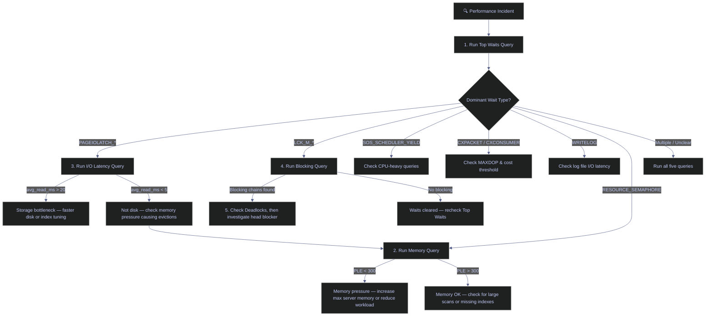

# Essential DBA Queries

> [!quote]
> "You can't manage what you can't measure, and you can't measure what you can't see."
>
> — **Brent Ozar**, brentozar.com

These T-SQL queries are the diagnostic toolkit for operating SQL Server in production. Keep them in a script you can run in seconds during an incident. They map to Dynamic Management Views (DMVs) — real-time system tables that expose the internals of the running SQL Server instance.

---

## Server Information

These queries answer the first questions on any incident or onboarding: what version is this server, what databases exist, how large are they, and what configuration is in effect. Run them when connecting to an unfamiliar instance or diagnosing capacity issues.

### SERVERPROPERTY() — Version, Edition, and Instance Identity

`SERVERPROPERTY()` is a built-in metadata function that returns structured information about the SQL Server instance — its version, edition, build number, collation, and high-availability configuration. This is the first function to call when connecting to an unfamiliar instance, because the version and edition determine which features and DMVs are available.

> [!info] Two Ways to Check Version
>
> `@@VERSION` returns a free-text string useful for quick checks. `SERVERPROPERTY` returns structured fields you can compare programmatically — use it when you need to branch logic by edition or build number.

```sql
SELECT @@VERSION;
```

```sql
SELECT
    SERVERPROPERTY('ProductVersion')   AS product_version,
    SERVERPROPERTY('ProductLevel')     AS product_level,
    SERVERPROPERTY('ProductUpdateLevel') AS cu_level,
    SERVERPROPERTY('Edition')          AS edition,
    SERVERPROPERTY('EngineEdition')    AS engine_edition,
    SERVERPROPERTY('Collation')        AS collation,
    SERVERPROPERTY('IsClustered')      AS is_clustered,
    SERVERPROPERTY('IsHadrEnabled')    AS is_hadr,
    SERVERPROPERTY('IsFullTextInstalled') AS is_fulltext,
    SERVERPROPERTY('ServerName')       AS server_name,
    SERVERPROPERTY('InstanceName')     AS instance_name,
    SERVERPROPERTY('ComputerNamePhysicalNetBIOS') AS physical_host;
```

> [!info] SERVERPROPERTY Column Reference
>
> | Property | Returns | Why It Matters |
> |---|---|---|
> | `ProductVersion` | Version string in `major.minor.build.revision` format (e.g., `16.0.4135.4`) | Determines which features, DMVs, and T-SQL syntax are available. The major version maps to the SQL Server release: `16` = SQL Server 2022, `15` = 2019, `14` = 2017, `13` = 2016 |
> | `ProductLevel` | `RTM` (original release), `SPn` (service pack), or `CTPn` (preview) | Identifies whether critical service packs are applied — some security fixes and features require a specific service pack |
> | `ProductUpdateLevel` | `CUn` (cumulative update number) or `NULL` if not applicable | Cumulative updates contain bug fixes and security patches — compare against the latest published CU to assess patch currency |
> | `Edition` | `Enterprise`, `Standard`, `Developer`, `Express`, `Web`, `Business Intelligence` (appends `(64-bit)` on 64-bit installs) | Edition determines feature availability: Enterprise supports online index rebuilds, table partitioning, and compression; Standard caps at 128 GB RAM; Express caps at 1 GB RAM and 10 GB database size |
> | `EngineEdition` | Integer: `1` = Personal/Desktop, `2` = Standard, `3` = Enterprise, `4` = Express, `5` = Azure SQL Database, `8` = Azure SQL Managed Instance | Use this in scripts to branch logic by edition — numeric comparison is more reliable than parsing the `Edition` string |
> | `Collation` | Server default collation name (e.g., `SQL_Latin1_General_CP1_CI_AS`) | Controls default sort order and string comparison for all databases that inherit the server collation. Mismatched collations between databases cause `COLLATE` conflicts in cross-database joins |
> | `IsClustered` | `1` = failover cluster instance, `0` = standalone | Clustered instances fail over to another node automatically — affects how you plan maintenance windows and where you look for logs after a failover |
> | `IsHadrEnabled` | `1` = Always On Availability Groups enabled, `0` = disabled, `NULL` = not applicable | Must be `1` for any AG-replicated database. Pertains only to AGs — database mirroring and log shipping are unaffected by this property |
> | `IsFullTextInstalled` | `1` = full-text search components installed, `0` = not installed | Required for `CONTAINS`, `FREETEXT`, and full-text index operations. If `0`, any full-text query will fail |
> | `ServerName` | Combined Windows server and instance name (e.g., `SERVER01\INST1`) | Used in scripts to log which server executed a statement. For a default instance, returns the server name with no backslash |
> | `InstanceName` | Named instance identifier (e.g., `INST1`) or `NULL` for the default instance | Distinguishes multiple SQL Server instances on the same host — critical for connection strings and service management |
> | `ComputerNamePhysicalNetBIOS` | NetBIOS name of the physical host running the instance | On a failover cluster, this changes after failover — use it to determine which physical node currently owns the instance. On a standalone server, it matches `MachineName` |

> [!tip] Quick Identity Globals
>
> These globals are useful in scripts that need to log which server and session they ran on.

```sql
SELECT @@SERVERNAME AS server_name, @@SERVICENAME AS service_name,
       @@SPID AS current_spid, @@LANGUAGE AS language,
       @@MAX_CONNECTIONS AS max_connections;
```

> [!info] Global Variables Reference
>
> | Variable | Meaning | Interpretation |
> |---|---|---|
> | `@@SERVERNAME` | Returns the server and instance name (e.g., `SERVER01\INST1` for a named instance, or `SERVER01` for the default instance) | Useful in scripts that log which server they ran on. Can differ from `SERVERPROPERTY('ServerName')` after a machine rename until `sp_dropserver`/`sp_addserver` is run |
> | `@@SERVICENAME` | Name of the Windows service running this SQL Server instance. `MSSQLSERVER` for the default instance, or the instance name for named instances | Used to verify which Windows service to restart or monitor |
> | `@@SPID` | Session ID (SPID) of the current connection | Useful for identifying your own session in DMV queries and avoiding killing your own connection |
> | `@@LANGUAGE` | Current language name for the session (e.g., `us_english`) | Affects date format interpretation and error message language |
> | `@@MAX_CONNECTIONS` | Maximum number of simultaneous user connections allowed. Default is `32,767` | This is rarely the limiting factor — connection pool limits, memory, and worker thread count (`max worker threads`) are typically reached first |

---

### sys.databases — All Databases on the Instance

`sys.databases` is a system catalog view that returns one row per database on the instance. It exposes the recovery model, compatibility level, state, and key operational flags. The `state_desc` column shows the database's availability: `ONLINE` (normal), `RESTORING` (mid-restore sequence), `RECOVERING` (startup recovery in progress), `SUSPECT` (corruption detected), or `OFFLINE` (manually taken offline). The `log_reuse_wait_desc` column is critical during capacity incidents — it explains why the transaction log cannot be truncated.

> [!abstract] What This Shows
>
> Every database on the instance with its recovery model, compatibility level, and key flags. The `log_reuse_wait_desc` column is especially important — it tells you why the transaction log cannot be truncated.

```sql
SELECT
    database_id,
    name,
    state_desc,
    recovery_model_desc,
    compatibility_level,
    collation_name,
    is_read_only,
    is_auto_shrink_on,
    is_auto_close_on,
    is_broker_enabled,
    is_cdc_enabled,
    log_reuse_wait_desc,
    create_date
FROM sys.databases
ORDER BY name;
```

> [!info] sys.databases Column Reference
>
> **`database_id`** — unique integer identifying each database on the instance. System databases have fixed IDs: `1` = `master`, `2` = `tempdb`, `3` = `model`, `4` = `msdb`. User databases start at `5` and increment. Use this to join with other DMVs (`sys.master_files`, `sys.dm_io_virtual_file_stats`, etc.).
>
> **`name`** — the logical name of the database, unique within the instance. This is the name used in `USE` statements, connection strings, and backup commands.
>
> **`state_desc`** — the current availability state of the database.
>
> | Value | Meaning | Action |
> |---|---|---|
> | `ONLINE` | Normal operations — database is accessible for read/write | No action needed |
> | `RESTORING` | Mid-restore sequence — the database is receiving backup files | Wait for restore to complete or issue `RESTORE WITH RECOVERY` to bring it online |
> | `RECOVERING` | Startup crash recovery in progress — SQL Server is replaying the transaction log | Wait for automatic recovery to finish. If it takes too long, check `errorlog` for corruption |
> | `RECOVERY_PENDING` | Recovery needs a resource that is not available (e.g., missing filegroup) | Investigate missing files or resources; may require `RESTORE` or `ALTER DATABASE` to resolve |
> | `SUSPECT` | Corruption detected during recovery — the database may have damaged pages | Run `DBCC CHECKDB`. Restore from the last known good backup if corruption is confirmed |
> | `EMERGENCY` | Manually set for repair operations — single-user, read-only access | Used only during `DBCC CHECKDB ... REPAIR_ALLOW_DATA_LOSS`. Restore to `ONLINE` after repair |
> | `OFFLINE` | Manually taken offline via `ALTER DATABASE SET OFFLINE` | Bring back with `ALTER DATABASE SET ONLINE` when ready |

> [!info] recovery_model_desc — Recovery Model
>
> The recovery model controls how the transaction log is managed and what restore operations are possible. This is one of the most consequential database settings.
>
> | Value | Log Behavior | Backup Requirements | Point-in-Time Restore? | Work Loss Exposure |
> |---|---|---|---|---|
> | `FULL` | Every transaction is fully logged. Log grows until explicitly backed up | Full backups + regular transaction log backups (typically every 5–15 minutes) | Yes — can restore to any point covered by log backups | None, if log backups are current. If the tail of the log is damaged, changes since the last log backup are lost |
> | `BULK_LOGGED` | Most operations fully logged; bulk operations (BCP, `SELECT INTO`, index rebuilds) use minimal logging | Same as FULL — requires log backups | No — cannot restore to a point within a log backup that contains bulk-logged operations. Can only restore to the end of a log backup | If log is damaged after a bulk operation, changes since the last log backup must be redone |
> | `SIMPLE` | Log is automatically truncated at each checkpoint. No log backup possible | Full backups + optional differential backups only | No — can only restore to the end of the last full or differential backup | All changes since the last backup are lost |
>
> **Implications:** Production databases that require point-in-time recovery (OLTP, financial systems) must use `FULL`. The `BULK_LOGGED` model is a temporary optimization — switch to it before large ETL loads to reduce log volume, then switch back to `FULL`. The `SIMPLE` model is appropriate for development databases, read-only reporting databases, and data warehouse staging layers that can be fully reloaded.

> [!info] compatibility_level — Database Engine Behavior Version
>
> An integer that controls T-SQL behavior and query optimizer features. It does not restrict which SQL Server version the database runs on — it restricts which *behaviors* are active.
>
> | Value | Maps to SQL Server Version | Key Behavior Changes |
> |---|---|---|
> | `80` | SQL Server 2000 | Legacy — deprecated in modern versions |
> | `90` | SQL Server 2005 | Introduced `PIVOT`, `UNPIVOT`, `TRY...CATCH` |
> | `100` | SQL Server 2008 | Introduced `MERGE`, `GROUPING SETS` |
> | `110` | SQL Server 2012 | Introduced `OFFSET/FETCH`, `THROW`, window function enhancements |
> | `120` | SQL Server 2014 | New cardinality estimator (CE) — can change query plans significantly |
> | `130` | SQL Server 2016 | Batch mode for columnstore, `STRING_SPLIT`, `DROP IF EXISTS` |
> | `140` | SQL Server 2017 | Adaptive joins, interleaved execution, automatic tuning |
> | `150` | SQL Server 2019 | Intelligent Query Processing (IQP), scalar UDF inlining, batch mode on rowstore |
> | `160` | SQL Server 2022 | Parameter Sensitive Plan (PSP) optimization, optimized plan forcing |
>
> **Implications:** After upgrading a SQL Server instance, databases retain their old compatibility level until explicitly changed. A database at level `130` on a SQL Server 2022 instance will not benefit from IQP or PSP optimizations. Always test workloads before raising the compatibility level — the new cardinality estimator at `120+` can produce different (sometimes worse) query plans.

> [!info] Boolean Flag Columns
>
> | Column | `1` Means | `0` Means | Recommendation |
> |---|---|---|---|
> | `is_read_only` | Database is `READ_ONLY` — no writes allowed | Database is `READ_WRITE` | Set reporting replicas and archive databases to read-only to prevent accidental writes and reduce locking |
> | `is_auto_shrink_on` | `AUTO_SHRINK` is enabled — SQL Server periodically shrinks data files | Auto-shrink is disabled | **Always disable.** Auto-shrink causes severe index fragmentation, wastes I/O, and the freed space is immediately reclaimed by the next growth event — creating an expensive shrink-grow cycle |
> | `is_auto_close_on` | `AUTO_CLOSE` is enabled — database shuts down when the last connection closes | Auto-close is disabled | **Disable on servers.** Auto-close causes startup overhead on every new connection. Acceptable only for SQL Server Express instances used as local file databases |
> | `is_broker_enabled` | Service Broker is active — can send and receive messages | Broker is disabled — sent messages queue on the transmission queue, received messages are not delivered | Enable only if the application uses Service Broker messaging. By default, restored or attached databases have the broker disabled |
> | `is_cdc_enabled` | Change Data Capture is active — DML changes are tracked in CDC tables | CDC is disabled | CDC creates capture jobs that read the transaction log. When enabled, the log cannot be truncated until the capture job has processed all changes — monitor `log_reuse_wait_desc` for `REPLICATION` if the log grows unexpectedly |

> [!info] collation_name — Database Default Collation
>
> The collation determines how SQL Server sorts and compares string data. It is set at database creation and inherited by all `char`/`varchar`/`nchar`/`nvarchar` columns that do not specify an explicit collation. Common collations:
>
> | Collation | Case Sensitive? | Accent Sensitive? | Notes |
> |---|---|---|---|
> | `SQL_Latin1_General_CP1_CI_AS` | No (CI) | Yes (AS) | SQL Server default. Most common in legacy installations |
> | `Latin1_General_CI_AS` | No (CI) | Yes (AS) | Windows collation — preferred for new databases |
> | `Latin1_General_CS_AS` | Yes (CS) | Yes (AS) | Case-sensitive — `'ABC' ≠ 'abc'` |
> | `Latin1_General_100_CI_AS_SC_UTF8` | No (CI) | Yes (AS) | UTF-8 collation (SQL Server 2019+) — stores Unicode in `varchar` without doubling storage |
>
> **Implications:** If two databases on the same instance have different collations, cross-database joins on string columns require an explicit `COLLATE` clause — otherwise the query fails with a collation conflict error. Returns `NULL` if the database is not `ONLINE`.

> [!info] log_reuse_wait_desc — Why the Transaction Log Cannot Be Truncated
>
> This column is critical during capacity incidents. After a log backup completes, SQL Server marks inactive Virtual Log Files (VLFs) for reuse. If something prevents this, the log file grows until the disk is full. This column tells you what is blocking truncation.
>
> | Value | Meaning | Response |
> |---|---|---|
> | `NOTHING` | Normal — no truncation blocker, VLFs are available for reuse | No action needed |
> | `CHECKPOINT` | No checkpoint has occurred since the last truncation | Routine — usually resolves within seconds. If sustained, run `CHECKPOINT` manually |
> | `LOG_BACKUP` | No log backup has been taken (FULL/BULK_LOGGED recovery model) | Take a log backup immediately: `BACKUP LOG [db] TO DISK = '...'` |
> | `ACTIVE_BACKUP_OR_RESTORE` | A data backup or restore is in progress | Wait for the backup/restore to finish |
> | `ACTIVE_TRANSACTION` | A long-running transaction is holding log space | Identify the transaction with `DBCC OPENTRAN` or `sys.dm_tran_active_transactions`. Kill if safe, or wait for it to commit |
> | `DATABASE_MIRRORING` | Mirror is behind the principal — log cannot be truncated until the mirror catches up | Check mirror status with `sys.dm_db_mirroring_connections`. If mirroring is paused, resume or remove it |
> | `REPLICATION` | Transactions relevant to publications have not been delivered to the distribution database | Check the Log Reader Agent. If CDC is enabled, check the capture job in `msdb.dbo.cdc_jobs` |
> | `DATABASE_SNAPSHOT_CREATION` | A snapshot is being created | Transient — wait for snapshot creation to finish |
> | `AVAILABILITY_REPLICA` | Secondary replica has not hardened or applied the log — the primary cannot truncate until all synchronous replicas acknowledge | Check `sys.dm_hadr_database_replica_states` for `log_send_queue_size` and `redo_queue_size`. Investigate network latency or slow secondary I/O |
> | `XTP_CHECKPOINT` | In-Memory OLTP checkpoint has not completed | Expected on databases with memory-optimized filegroups |

> [!info] create_date — Database Creation Timestamp
>
> The `datetime` value when the database was created or last renamed. For `tempdb`, this value resets on every SQL Server restart — making it a quick way to check when the instance was last restarted. For user databases, this date reflects the original `CREATE DATABASE` statement and does not change on backup/restore operations.

---

### sys.master_files — Database File Locations and Sizes

`sys.master_files` is a server-level catalog view that returns one row per physical file (data or log) across all databases. Every SQL Server database has at least two files: a data file (`type = 0`, file extension `.mdf` or `.ndf`) that stores tables, indexes, and other objects, and a log file (`type = 1`, file extension `.ldf`) that records every transaction for crash recovery and point-in-time restore. Best practice is to place data and log files on separate physical drives — the log file writes sequentially and benefits from dedicated I/O bandwidth.

File sizes in `sys.master_files` are stored in 8 KB pages, so the conversion `size * 8.0 / 1024` yields megabytes. The `growth` column indicates how much the file expands when auto-growth triggers: if `is_percent_growth = 1`, the value is a percentage; otherwise it is in 8 KB pages. Percent-based growth is dangerous at scale because a 10% growth on a 500 GB file allocates 50 GB at once, potentially stalling the server during the zeroing operation. Fixed growth (e.g., 512 MB increments) is predictable and preferred. An unlimited `max_size` (`-1`) means the file can grow until the disk is full — always set an explicit cap.

> [!abstract] What This Shows
>
> Physical file paths, current size, max size, and growth settings for every data and log file across all databases. Use this to verify file placement (data and log on separate drives) and catch unlimited auto-growth settings.

```sql
SELECT
    d.name                          AS database_name,
    mf.file_id,
    mf.type_desc,
    mf.name                         AS logical_name,
    mf.physical_name,
    mf.state_desc,
    CAST(mf.size * 8.0 / 1024 AS DECIMAL(12,2))       AS size_mb,
    CAST(mf.max_size * 8.0 / 1024 AS DECIMAL(12,2))   AS max_size_mb,
    mf.growth,
    mf.is_percent_growth
FROM sys.master_files mf
JOIN sys.databases d ON d.database_id = mf.database_id
ORDER BY d.name, mf.file_id;
```

> [!info] sys.master_files Column Reference
>
> | Column | Meaning | Interpretation |
> |---|---|---|
> | `database_name` | Logical name of the database (joined from `sys.databases`) | Groups files by database |
> | `file_id` | Integer identifying each file within a database. `1` = primary data file (`.mdf`), `2` = transaction log (`.ldf`), `3+` = secondary data files (`.ndf`) or FILESTREAM | The primary file (`file_id = 1`) contains the system catalog. Additional data files spread I/O across multiple drives |
> | `type_desc` | File type: `ROWS` (data file storing tables/indexes), `LOG` (transaction log), `FILESTREAM` (BLOB storage on the file system), `FULLTEXT` (legacy full-text catalog, pre-2008) | Data and log files should be on separate physical drives — log writes are sequential and benefit from dedicated I/O |
> | `logical_name` | Logical file name used in T-SQL commands (`ALTER DATABASE ... MODIFY FILE (NAME = ...)`) | Used when resizing, moving, or shrinking a specific file |
> | `physical_name` | Full operating-system path to the file (e.g., `D:\Data\mydb.mdf`) | Verify data and log files are on separate volumes. Watch for files on the OS drive — that is a capacity risk |
> | `state_desc` | File availability: `ONLINE` (normal), `RESTORING`, `RECOVERING`, `RECOVERY_PENDING`, `SUSPECT`, `OFFLINE`, `DEFUNCT` | Any state other than `ONLINE` requires investigation. `SUSPECT` indicates possible corruption |
> | `size_mb` | Current allocated file size in megabytes. Computed as `size * 8.0 / 1024` because `size` is stored in 8 KB pages | This is the *allocated* size, not the *used* size. To see used space, query `sys.database_files` with `FILEPROPERTY(name, 'SpaceUsed')` inside each database |
> | `max_size_mb` | Maximum size the file can grow to. `-1` = unlimited (grows until disk is full). `268435456` pages = 2 TB (maximum for log files) | Unlimited max size (`-1`) is dangerous — set an explicit cap to prevent a runaway log from filling the disk |
> | `growth` | Auto-growth increment. If `is_percent_growth = 0`, the value is in 8 KB pages (multiply by 8/1024 for MB). If `is_percent_growth = 1`, the value is a whole-number percentage | Fixed growth (e.g., 512 MB) is preferred. Percentage growth is dangerous at scale: 10% on a 500 GB file allocates 50 GB in a single event, potentially stalling the server during zeroing |
> | `is_percent_growth` | `1` = growth is a percentage, `0` = growth is in 8 KB pages (absolute) | If `1`, convert to fixed growth immediately to avoid unpredictable large expansions |

> [!warning] Unlimited Max Size and Percent Growth
>
> A file with `max_size = -1` and `is_percent_growth = 1` is a capacity incident waiting to happen. The file can grow without limit, and each growth event gets exponentially larger.

> [!success] Set Fixed Growth and Explicit Max Size
>
> `ALTER DATABASE [mydb] MODIFY FILE (NAME = mydb_data, FILEGROWTH = 512MB, MAXSIZE = 100GB);` — this caps growth and makes each expansion predictable. Pre-size files to their expected working size to minimize growth events entirely.

---

### sys.configurations — Instance Configuration Settings

`sys.configurations` is a catalog view that exposes every instance-level setting controlled by `sp_configure`. Each row has a `value` column (the configured setting) and a `value_in_use` column (the currently active setting). A mismatch between the two means a `RECONFIGURE` statement or a server restart is needed to activate the change. Most performance-critical settings (memory, parallelism, ad hoc optimization) are classified as "advanced options" and are hidden until you run `sp_configure 'show advanced options', 1; RECONFIGURE;`.

> [!abstract] What This Shows
>
> Key instance-level settings that control memory allocation, parallelism, and backup behavior. Compare `value` (configured) vs `value_in_use` (active) — a mismatch means a `RECONFIGURE` or restart is pending.

```sql
EXEC sp_configure 'show advanced options', 1;
RECONFIGURE;
```

```sql
SELECT name, value, value_in_use, minimum, maximum, description, is_advanced
FROM sys.configurations
WHERE name IN (
    'max server memory (MB)',
    'min server memory (MB)',
    'max degree of parallelism',
    'cost threshold for parallelism',
    'optimize for ad hoc workloads',
    'backup compression default',
    'remote admin connections',
    'contained database authentication',
    'default trace enabled'
)
ORDER BY name;
```

> [!info] sys.configurations Column Reference
>
> | Column | Meaning | Interpretation |
> |---|---|---|
> | `name` | Configuration option name (e.g., `max server memory (MB)`) | The identifier used in `sp_configure` commands |
> | `value` | The configured setting — what was set via `sp_configure` | This may differ from the active setting if `RECONFIGURE` has not been run or a restart is pending |
> | `value_in_use` | The currently active setting — what SQL Server is actually using right now | **Always compare `value` vs `value_in_use`.** A mismatch means a `RECONFIGURE` statement or server restart is needed to activate the change |
> | `minimum` | Lowest valid value for this configuration option | Attempting to set below this value causes `sp_configure` to error |
> | `maximum` | Highest valid value for this configuration option | For `max server memory`, the maximum is `2147483647` (effectively unlimited) |
> | `description` | Human-readable explanation of the option | Useful for identifying unfamiliar settings |
> | `is_advanced` | `1` = requires `show advanced options` to be enabled before it appears in `sp_configure` output. `0` = always visible | Run `sp_configure 'show advanced options', 1; RECONFIGURE;` before querying or changing advanced settings. Most performance-critical settings are advanced |
>
> The `is_dynamic` column (not selected in this query but available) indicates whether the setting takes effect immediately after `RECONFIGURE` (`1`) or requires a server restart (`0`). Memory settings (`max/min server memory`) are dynamic; the `fill factor` setting requires a restart.

> [!example] Recommended Values for Key Settings
>
> | Setting | Default | Recommended | Why |
> |---|---|---|---|
> | `max server memory (MB)` | 2,147,483,647 (unbounded) | ~75% of available RAM | Default lets SQL Server consume all memory, starving the OS and other processes |
> | `max degree of parallelism` | 0 (all processors) | 8 for single NUMA with >8 cores; ≤ logical processors per NUMA node otherwise | MAXDOP 0 can cause excessive parallelism overhead on large servers |
> | `cost threshold for parallelism` | 5 | 25–50 for OLTP workloads | Microsoft states the default of 5 is "a starting point, not a recommendation" — too low causes trivial queries to go parallel |
> | `optimize for ad hoc workloads` | 0 (off) | 1 (on) for OLTP servers | Prevents plan cache bloat from one-off queries by storing only a compiled plan stub on first execution |
> | `backup compression default` | 0 (off) | 1 (on) | Compressed backups are faster and smaller with minimal CPU overhead on modern hardware |

> [!warning] Auto-Shrink Is Always Wrong
>
> If `is_auto_shrink_on = 1` on any database (visible in the `sys.databases` query above), disable it immediately. Auto-shrink causes severe index fragmentation, burns I/O, and the freed space will be reclaimed by the next growth event anyway — creating an expensive shrink-grow-shrink cycle.

> [!success] Disable Auto-Shrink
>
> `ALTER DATABASE [dbname] SET AUTO_SHRINK OFF;` — then manually right-size the file with `DBCC SHRINKFILE` followed by a pre-sized `ALTER DATABASE ... MODIFY FILE` if the file is genuinely oversized.

---

## Space and Size

These queries measure how much disk space databases, tables, indexes, and log files consume. Run them when investigating capacity alerts, planning storage expansion, or identifying tables that have grown beyond expectations.

### Database Size Summary — Data vs Log Breakdown

This query aggregates `sys.master_files` by database to produce a single-row-per-database summary showing how much space is allocated to data files versus log files. A healthy data-to-log ratio varies by workload, but a log file larger than 25% of the data file size on a FULL recovery model database usually means log backups are not running frequently enough.

> [!abstract] What This Shows
>
> Total allocated size per database, split into data files and log files. This is the first query to run when investigating capacity — it tells you whether data or log growth is consuming space.

```sql
SELECT
    d.name                                                          AS database_name,
    SUM(CASE WHEN mf.type = 0 THEN mf.size END) * 8.0 / 1024      AS data_size_mb,
    SUM(CASE WHEN mf.type = 1 THEN mf.size END) * 8.0 / 1024      AS log_size_mb,
    SUM(mf.size) * 8.0 / 1024                                      AS total_size_mb
FROM sys.databases d
JOIN sys.master_files mf ON d.database_id = mf.database_id
GROUP BY d.name
ORDER BY total_size_mb DESC;
```

> [!info] Database Size Summary Column Reference
>
> | Column | Meaning | Interpretation |
> |---|---|---|
> | `database_name` | Name of the database | Sorted by total size descending to show the largest databases first |
> | `data_size_mb` | Total allocated space for data files (`type = 0` in `sys.master_files`), in megabytes. Includes `.mdf` (primary) and `.ndf` (secondary) data files | This is allocated space — not all of it may contain data. A large gap between allocated and used space means the files were pre-sized or grew and were never shrunk |
> | `log_size_mb` | Total allocated space for transaction log files (`type = 1`), in megabytes | A log file larger than 25% of the data file size under FULL recovery usually means log backups are too infrequent. Under SIMPLE recovery, an oversized log suggests a recent large transaction that triggered auto-growth |
> | `total_size_mb` | Sum of data and log file allocations | The total disk footprint of the database. Compare against available disk space from the `dm_os_volume_stats` query |

---

### Table Sizes — Current Database

Two approaches: `sp_spaceused` for a quick single-table check, or the DMV query for a ranked view of all tables.

#### sp_spaceused — Quick Single-Table Size Check

`sp_spaceused` is a built-in stored procedure that reports the row count, total reserved space, data size, index size, and unused space for a single table. Called without arguments, it reports the total size of the current database. It is the fastest way to check a single table's footprint, but does not support sorting or filtering — use the DMV query below for a ranked view across all tables.

```sql
EXEC sp_spaceused 'dbo.trades';
```

```sql
EXEC sp_spaceused;
```

#### sys.allocation_units — All Tables Ranked by Size

This query joins `sys.tables`, `sys.indexes`, `sys.partitions`, and `sys.allocation_units` to compute the total, used, and data-only page counts for every table in the current database. The `index_id IN (0, 1)` filter restricts results to heaps (`0`) and clustered indexes (`1`), which represent the base table data — excluding nonclustered indexes that would double-count space.

```sql
SELECT
    s.name                                              AS schema_name,
    t.name                                              AS table_name,
    SUM(a.total_pages)  * 8.0 / 1024                   AS total_mb,
    SUM(a.used_pages)   * 8.0 / 1024                   AS used_mb,
    SUM(a.data_pages)   * 8.0 / 1024                   AS data_mb,
    SUM(p.rows)                                         AS row_count
FROM sys.tables t
JOIN sys.schemas s          ON t.schema_id = s.schema_id
JOIN sys.indexes i          ON t.object_id = i.object_id AND i.index_id IN (0,1)
JOIN sys.partitions p       ON i.object_id = p.object_id AND i.index_id = p.index_id
JOIN sys.allocation_units a ON p.partition_id = a.container_id
GROUP BY s.name, t.name
ORDER BY total_mb DESC;
```

> [!info] Table Size Column Reference
>
> | Column | Meaning | Interpretation |
> |---|---|---|
> | `schema_name` | Schema owning the table (e.g., `dbo`, `staging`) | Useful for distinguishing identically-named tables in different schemas |
> | `table_name` | Name of the table | Sorted by total space descending — the largest tables appear first |
> | `total_mb` | Total allocated pages (data + index + unused) in megabytes. Includes space reserved by SQL Server but not yet used | A large `total_mb` relative to `used_mb` indicates excessive reserved space — the table may have been bulk-loaded then had rows deleted |
> | `used_mb` | Pages currently in use (data + index pages that contain data) | The actual space consumed by table data and indexes |
> | `data_mb` | Pages containing row data only (excludes index leaf/non-leaf pages and internal pages) | Compare `data_mb` to `used_mb` to estimate the index overhead — `used_mb - data_mb` = space consumed by indexes |
> | `row_count` | Approximate row count from partition metadata. Highly accurate for non-partitioned tables. For partitioned tables, `SUM(p.rows)` across `index_id IN (0, 1)` avoids double-counting | Use this instead of `SELECT COUNT(*)` for large tables — it reads metadata instantly instead of scanning the entire table |

---

### dm_db_partition_stats — Fast Row Counts Without Scanning

`sys.dm_db_partition_stats` is a DMV that exposes per-partition metadata including row counts, page counts, and reserved space. Unlike `SELECT COUNT(*)`, which performs a full table or index scan, this DMV reads pre-computed metadata and returns instantly regardless of table size. The `index_id IN (0, 1)` filter selects heaps (index_id 0) and clustered indexes (index_id 1) — both represent the base table rows. Nonclustered indexes (index_id ≥ 2) are excluded to avoid counting rows multiple times.

```sql
SELECT
    OBJECT_SCHEMA_NAME(object_id)   AS schema_name,
    OBJECT_NAME(object_id)          AS table_name,
    SUM(row_count)                  AS total_rows
FROM sys.dm_db_partition_stats
WHERE index_id IN (0, 1)
GROUP BY object_id
ORDER BY total_rows DESC;
```

> [!info] dm_db_partition_stats Column Reference
>
> | Column | Meaning | Interpretation |
> |---|---|---|
> | `schema_name` | Derived from `OBJECT_SCHEMA_NAME(object_id)` — the schema owning the table | Groups results by schema |
> | `table_name` | Derived from `OBJECT_NAME(object_id)` — the table name | Sorted by row count descending |
> | `total_rows` | Sum of `row_count` across heap (`index_id = 0`) and clustered index (`index_id = 1`) partitions. Pre-computed metadata — returns instantly regardless of table size | Accurate to the last statistics update. `SELECT COUNT(*)` performs a full scan and returns the exact count, but at much higher cost. For monitoring and capacity planning, the metadata count is sufficient |

---

### Index Sizes — Space Consumed per Index

This query computes the space consumed by each individual index. Every write operation (INSERT, UPDATE, DELETE) must update every nonclustered index on the affected table, so oversized or redundant indexes impose a direct write penalty. Indexes that consume significant space but are rarely used by queries are candidates for removal — cross-reference with `sys.dm_db_index_usage_stats` to check read vs. write ratios.

> [!abstract] What This Shows
>
> Total and used space for every index on every table. Use this to find oversized indexes that waste disk and slow down writes.

```sql
SELECT
    OBJECT_SCHEMA_NAME(i.object_id)             AS schema_name,
    OBJECT_NAME(i.object_id)                    AS table_name,
    i.name                                      AS index_name,
    i.type_desc,
    SUM(a.total_pages) * 8.0 / 1024            AS total_mb,
    SUM(a.used_pages)  * 8.0 / 1024            AS used_mb
FROM sys.indexes i
JOIN sys.partitions p       ON i.object_id = p.object_id AND i.index_id = p.index_id
JOIN sys.allocation_units a ON p.partition_id = a.container_id
GROUP BY i.object_id, i.name, i.type_desc
ORDER BY total_mb DESC;
```

> [!info] Index Size Column Reference
>
> | Column | Meaning | Interpretation |
> |---|---|---|
> | `schema_name` | Schema owning the table | Groups indexes by their parent table's schema |
> | `table_name` | Table the index belongs to | Identifies which table's write performance is affected by large indexes |
> | `index_name` | Name of the index. `NULL` for heaps (tables without a clustered index) | Named indexes are easier to manage — always name your indexes explicitly |
> | `type_desc` | Index structure type: `HEAP` (no clustered index), `CLUSTERED` (base table data ordered by index key), `NONCLUSTERED` (separate B-tree structure), `XML`, `SPATIAL`, `CLUSTERED COLUMNSTORE`, `NONCLUSTERED COLUMNSTORE` | Every nonclustered index must be updated on every write to the base table — oversized or rarely-queried nonclustered indexes impose a direct write penalty |
> | `total_mb` | Total allocated pages for this index in megabytes | Includes reserved but unused pages. Large values on nonclustered indexes are candidates for review — cross-reference with `sys.dm_db_index_usage_stats` to check if reads justify the space |
> | `used_mb` | Pages actually containing index data | `total_mb - used_mb` = wasted reserved space. If this gap is large, the index may benefit from a rebuild |

---

### Transaction Log Space Usage — Log Size and VLF Health

The transaction log records every data modification so SQL Server can guarantee ACID compliance and support point-in-time recovery. Internally, the log file is divided into Virtual Log Files (VLFs) — logical segments that SQL Server activates and deactivates as the log cycles. The number and size of VLFs depends on how the log file was grown: many small auto-growth events create many small VLFs, which degrades backup/restore performance and increases recovery time. `DBCC LOGINFO` returns one row per VLF — a count above 200 is a red flag, and above 1000 is a serious performance risk.

> [!warning] High VLF Count Means Fragmented Log
>
> A high VLF (Virtual Log File) count means the transaction log has been grown in many small increments instead of pre-sized. This fragments the log and slows backup/restore operations. If `DBCC LOGINFO` returns hundreds of rows, consider shrinking and pre-sizing the log file. The `log_reuse_wait_desc` column explains why the log can't be truncated — common values: `ACTIVE_TRANSACTION` (long-running query), `LOG_BACKUP` (no log backup taken), `REPLICATION` (replication agent behind).

> [!success] Pre-Size the Log File
>
> Shrink the log to a small size, then immediately expand it to the expected working size in a single operation to create one large VLF instead of hundreds of small ones: `DBCC SHRINKFILE(N'mydb_log', 64);` followed by `ALTER DATABASE mydb MODIFY FILE (NAME = mydb_log, SIZE = 4096MB);`. Pre-sizing prevents auto-growth fragmentation going forward.

```sql
DBCC SQLPERF(LOGSPACE);
```

> [!info] DBCC SQLPERF(LOGSPACE) Column Reference
>
> | Column | Meaning | Interpretation |
> |---|---|---|
> | `Database Name` | Name of each database on the instance | One row per database |
> | `Log Size (MB)` | Total allocated size of the transaction log file | Compare against disk capacity. A log that is 25%+ of the data file size under FULL recovery may indicate infrequent log backups |
> | `Log Space Used (%)` | Percentage of the log file currently occupied by active log records | Below 50% is healthy. Above 80% means the log is nearly full — check `log_reuse_wait_desc` to find the truncation blocker. At 100%, the database cannot accept writes until space is freed |
> | `Status` | Internal status flag (always `0` for user queries) | Not diagnostically useful — ignore this column |

```sql
SELECT name, log_reuse_wait_desc
FROM sys.databases
ORDER BY name;
```

The `log_reuse_wait_desc` column values and their meanings are documented in the sys.databases column reference above.

```sql
DBCC LOGINFO;
```

> [!info] DBCC LOGINFO Column Reference
>
> Returns one row per Virtual Log File (VLF) in the current database's transaction log.
>
> | Column | Meaning | Interpretation |
> |---|---|---|
> | `RecoveryUnitId` | Recovery unit identifier (always `0` for standard databases) | Only relevant for databases with multiple recovery units |
> | `FileId` | File ID of the log file containing this VLF | Matches `file_id` in `sys.database_files` |
> | `FileSize` | Size of this VLF in bytes | Many small VLFs (under 512 KB) indicate the log was grown in tiny increments. Fewer, larger VLFs are preferred |
> | `StartOffset` | Byte offset of this VLF within the log file | Used internally for VLF layout analysis |
> | `FSeqNo` | Log sequence number for this VLF | Higher values are more recent. VLFs with `FSeqNo = 0` have never been used |
> | `Status` | `0` = VLF is inactive (reusable), `2` = VLF is active (contains log records that have not been truncated) | Count the rows: fewer than 50 is ideal, 50–200 is acceptable, 200–1000 indicates log fragmentation, above 1000 is a serious performance risk requiring log pre-sizing |
> | `Parity` | VLF parity value (`64` or `128`) | Used internally for log recovery — not diagnostically useful |
> | `CreateLSN` | Log Sequence Number at which this VLF was created. `0` = VLF was created with the original file | VLFs with `CreateLSN > 0` were created by auto-growth events. Many distinct `CreateLSN` values = many growth events = fragmented log |

---

### TempDB Usage — Space Consumed per Session

TempDB is a single, instance-wide system database shared by all sessions. It stores temporary tables (`#temp`), table variables (`@var`), sort and hash join spills (when a query's memory grant is insufficient), version store rows (used by RCSI and snapshot isolation), and internal worktables for cursors and spools. Because every session competes for TempDB space, a single runaway query can fill TempDB and cascade failures across the entire server.

TempDB space is consumed in three categories: user objects (explicit temp tables and table variables), internal objects (spills, worktables, cursors), and the version store. The `tempdb.sys.dm_db_file_space_usage` DMV breaks down space by these categories for the entire database, while `sys.dm_db_session_space_usage` attributes consumption to individual sessions.

> [!warning] TempDB Is a Shared Bottleneck
>
> TempDB is shared by all sessions. A single query spilling to TempDB (hash joins, sorts exceeding memory grant) can fill TempDB and block every other query on the server. Monitor TempDB space during large ETL runs. If TempDB runs out of space, SQL Server returns error 1105 and the offending query fails — but other sessions may also fail if they need TempDB space at that moment. `PAGELATCH` waits on TempDB indicate allocation contention (too few data files), while `PAGEIOLATCH` waits indicate storage I/O bottleneck — these are distinct problems with different fixes.

> [!success] Pre-Size TempDB and Tune Memory Grants
>
> Pre-size TempDB data files to cover peak ETL workload (check historical max usage with the `dm_db_session_space_usage` query below). Use one TempDB data file per logical core, minimum 2, maximum 8 — add more only if `PAGELATCH` waits persist. For queries spilling due to memory grant underestimates, run `UPDATE STATISTICS` with `FULLSCAN` after bulk loads so the optimizer grants larger memory and avoids the spill. On SQL Server 2019+ Enterprise, enable Memory-Optimized TempDB Metadata to eliminate system-page contention entirely.

#### dm_db_session_space_usage — TempDB Allocation per Session

This query joins `sys.dm_db_session_space_usage` with `sys.dm_exec_sessions` to show how much TempDB space each session has allocated, broken down into user objects (explicit temp tables and table variables) and internal objects (sort/hash spills, worktables). Sessions with high `internal_obj_mb` are likely spilling due to insufficient memory grants.

```sql
SELECT
    s.session_id,
    s.login_name,
    s.program_name,
    t.user_objects_alloc_page_count   * 8.0 / 1024 AS user_obj_mb,
    t.internal_objects_alloc_page_count * 8.0 / 1024 AS internal_obj_mb,
    t.user_objects_alloc_page_count + t.internal_objects_alloc_page_count AS total_pages
FROM sys.dm_db_session_space_usage t
JOIN sys.dm_exec_sessions s ON t.session_id = s.session_id
WHERE t.user_objects_alloc_page_count + t.internal_objects_alloc_page_count > 0
ORDER BY total_pages DESC;
```

> [!info] TempDB Session Usage Column Reference
>
> | Column | Meaning | Interpretation |
> |---|---|---|
> | `session_id` | SQL Server session identifier (SPID). System sessions are 1–50; user sessions start at 51 | Cross-reference with `sys.dm_exec_requests` to see what the session is currently running |
> | `login_name` | The SQL or Windows login authenticated for this session | Identifies which service account or user is consuming TempDB space |
> | `program_name` | Application name reported in the connection string (e.g., `.Net SqlClient`, `Python`, `SSIS`) | Helps trace TempDB consumption back to a specific application or ETL tool |
> | `user_obj_mb` | Space allocated by explicit user objects: `#temp` tables, table variables (`@var`), and user-created global temp tables (`##temp`). Computed from `user_objects_alloc_page_count * 8 / 1024` | High values mean the session is creating large temp tables. Verify the temp tables are dropped after use and that the session is not leaking temp objects |
> | `internal_obj_mb` | Space allocated by internal objects: sort spills, hash join spills, cursor worktables, spool worktables. Computed from `internal_objects_alloc_page_count * 8 / 1024` | High values indicate queries are spilling to disk because their memory grant is insufficient. Run `UPDATE STATISTICS` with `FULLSCAN` on the underlying tables, or add `OPTION (MIN_GRANT_PERCENT = n)` to the query |
> | `total_pages` | Sum of user and internal object page counts (raw pages, not megabytes) | The sort key — highest consumers appear first. Sessions with thousands of pages are the primary TempDB consumers |

#### TempDB File Sizes and Free Space

This query reports the allocated size, used space, and free space for each TempDB data file. All TempDB data files should be the same size — unequal sizes cause SQL Server's proportional fill algorithm to favor the largest file, negating the contention reduction that multiple files provide.

```sql
USE tempdb;
SELECT
    name,
    file_id,
    CAST(size * 8.0 / 1024 AS DECIMAL(10,2))                        AS size_mb,
    CAST(FILEPROPERTY(name, 'SpaceUsed') * 8.0 / 1024 AS DECIMAL(10,2)) AS used_mb,
    CAST((size - FILEPROPERTY(name, 'SpaceUsed')) * 8.0 / 1024 AS DECIMAL(10,2)) AS free_mb
FROM sys.database_files;
```

> [!info] TempDB File Size Column Reference
>
> | Column | Meaning | Interpretation |
> |---|---|---|
> | `name` | Logical file name (e.g., `tempdev`, `templog`, `temp2`) | TempDB data files should be named consistently. Default is `tempdev` for the primary data file |
> | `file_id` | Integer identifying the file. `1` = primary data file, `2` = log file, `3+` = additional data files | Best practice: 1 data file per logical core, minimum 2, maximum 8. All must be equal size |
> | `size_mb` | Total allocated size of the file in megabytes | All TempDB data files must be the same size. Unequal sizes cause SQL Server's proportional fill algorithm to favor the largest file, negating the contention reduction of multiple files |
> | `used_mb` | Space currently containing data, in megabytes. Computed using `FILEPROPERTY(name, 'SpaceUsed')` | Used space close to allocated size means TempDB is nearly full. Auto-growth will trigger, which is slow and creates fragmentation |
> | `free_mb` | Unused space within the allocated file (`size_mb - used_mb`) | If consistently near zero during peak workloads, pre-size the file larger. If consistently high, the file may be oversized |

---

### dm_os_volume_stats — Disk Free Space per Volume

`sys.dm_os_volume_stats` is a table-valued function that returns disk volume information (total size, free space) for the drives hosting SQL Server database files. It requires a `database_id` and `file_id` as input, so the standard pattern cross-applies it against `sys.master_files` to cover all volumes. This is the only way to check disk free space from within T-SQL without xp_cmdshell or CLR.

> [!danger] Full Disk Halts the Pipeline
>
> SQL Server stops accepting writes when the disk is full. The database goes read-only, transactions fail, and the pipeline halts. Monitor disk free space proactively — see [sql-server-disk-full](https://alp78.github.io/elysium/15-Runbooks/sql-server-disk-full) for the full runbook. As a rule of thumb, alert at 85% used, investigate at 90%, and treat 95% as a P1 incident.

> [!success] Set Up Disk Alerts Before They Are Needed
>
> Create a Datadog monitor on the `pct_free` value from the `dm_os_volume_stats` query below: alert at < 15% free, page-on-call at < 10% free. Pair with a GCS backup lifecycle policy that automatically deletes local `.bak` files after upload, keeping the backup disk from accumulating stale copies.

```sql
SELECT DISTINCT
    vs.volume_mount_point,
    vs.logical_volume_name,
    CAST(vs.total_bytes / 1073741824.0 AS DECIMAL(10,2))     AS total_gb,
    CAST(vs.available_bytes / 1073741824.0 AS DECIMAL(10,2)) AS free_gb,
    CAST(100.0 * vs.available_bytes / vs.total_bytes AS DECIMAL(5,2)) AS pct_free
FROM sys.master_files mf
CROSS APPLY sys.dm_os_volume_stats(mf.database_id, mf.file_id) vs
ORDER BY vs.volume_mount_point;
```

> [!info] dm_os_volume_stats Column Reference
>
> | Column | Meaning | Interpretation |
> |---|---|---|
> | `volume_mount_point` | Drive letter or mount point (e.g., `C:\`, `D:\`, `E:\Data\`) | Identifies the physical volume hosting database files. Check that data and log files are on separate volumes |
> | `logical_volume_name` | Windows volume label (e.g., `Data`, `Logs`, `Backup`) | Useful for identifying the purpose of each drive in multi-disk configurations |
> | `total_gb` | Total capacity of the volume in gigabytes | Baseline for calculating utilization percentages |
> | `free_gb` | Available free space on the volume in gigabytes | The primary metric for capacity monitoring. Below 10% free is a P1 alert threshold |
> | `pct_free` | Percentage of the volume that is free (`available_bytes / total_bytes * 100`) | Alert at < 15% free, investigate at < 10% free, treat < 5% as a P1 incident. SQL Server stops accepting writes when a volume is full |

---

## Active Sessions and Queries

These queries show who is connected, what they are running, and how to intervene when a session is stuck. They target `sys.dm_exec_sessions` (authenticated connections) and `sys.dm_exec_requests` (currently executing batches). Together, these two DMVs provide a real-time view of server activity — sessions persist for the lifetime of a connection, while requests appear only while a batch is actively executing.

### Active Connections

`sys.dm_exec_sessions` returns one row per authenticated session. The `is_user_process = 1` filter excludes system sessions (background tasks like the lazy writer, checkpoint, and lock monitor) and limits results to application connections. The `program_name` column identifies the connecting application — values like `.Net SqlClient Data Provider`, `Microsoft JDBC Driver`, or `Python` help trace which application tier is consuming connections.

```sql
SELECT login_name, program_name, COUNT(*) AS connections
FROM sys.dm_exec_sessions
WHERE is_user_process = 1
GROUP BY login_name, program_name
ORDER BY connections DESC;
```

> [!info] Active Connections Column Reference
>
> | Column | Meaning | Interpretation |
> |---|---|---|
> | `login_name` | The SQL Server or Windows login authenticated for the session | Identifies which service accounts or users are consuming connections. A single login with hundreds of connections may indicate a connection pool leak |
> | `program_name` | Application name reported in the connection string. Common values: `.Net SqlClient Data Provider` (C#/.NET), `Microsoft JDBC Driver` (Java), `Python` (pyodbc/SQLAlchemy), `SQL Server Management Studio`, `SQLAgent - TSQL JobStep` | Traces connections back to specific applications. If a new application deploys and connections spike, this column tells you which one |
> | `connections` | Count of active sessions for each login/program combination | Baseline this value during normal operations. A sudden 2x–3x spike compared to baseline signals a connection leak, retry storm, or runaway application. Most connection pools default to 100 max — exceeding this causes connection timeout errors in the application |

> [!tip] Connection Spikes Signal Trouble
>
> `program_name` identifies the application: Python, Microsoft JDBC, .Net SqlClient, etc. A sudden spike in connections often precedes performance problems — check for connection leaks or runaway retry loops.

---

### Currently Running Queries

`sys.dm_exec_requests` returns one row per currently executing request. The `session_id > 50` filter excludes system sessions — SQL Server reserves session IDs 1 through 50 for internal background tasks (checkpoint, lazy writer, lock monitor, etc.). The `sql_handle` column is a varbinary token that uniquely identifies the batch; `CROSS APPLY sys.dm_exec_sql_text(sql_handle)` converts it to readable T-SQL text.

The `status` column shows the request's current state:

| Status | Meaning |
|---|---|
| `running` | Actively executing on a CPU scheduler |
| `runnable` | Ready to execute, waiting for a CPU quantum |
| `suspended` | Blocked — waiting for a resource (lock, I/O, latch, memory grant) |
| `sleeping` | Session idle, no active request |
| `rollback` | Rolling back a transaction |

> [!info] dm_exec_requests Column Reference
>
> | Column | Meaning | Interpretation |
> |---|---|---|
> | `session_id` | SQL Server session identifier (SPID). System sessions are 1–50, user sessions start at 51 | The filter `session_id > 50` in the query excludes internal background tasks (checkpoint, lazy writer, lock monitor, etc.) |
> | `status` | Current execution state of the request (see table above) | `suspended` = blocked waiting for a resource (check `wait_type`). `runnable` = ready but waiting for a CPU time slice. `running` = actively executing on a scheduler |
> | `command` | The type of operation currently executing (e.g., `SELECT`, `INSERT`, `UPDATE`, `DELETE`, `BACKUP DATABASE`, `DBCC`, `KILLED/ROLLBACK`, `AWAITING COMMAND`) | `KILLED/ROLLBACK` means a session was killed and is rolling back — check `percent_complete` to estimate remaining time. `AWAITING COMMAND` means the session is idle |
> | `elapsed_sec` | Total elapsed time in seconds since the request began (`total_elapsed_time / 1000`) | Long-running requests (> 300 seconds on OLTP systems) are candidates for investigation. Compare with `cpu_sec` to determine if the time is spent computing or waiting |
> | `cpu_sec` | CPU time consumed by the request in seconds (`cpu_time / 1000`) | If `elapsed_sec` is high but `cpu_sec` is low, the query is spending most of its time waiting (I/O, locks, memory grants) — not computing. If both are high, the query is CPU-intensive and may benefit from index tuning or query rewriting |
> | `logical_reads` | Number of 8 KB pages read from the buffer pool (memory). Does not count physical disk reads | High logical reads (millions) indicate large scans — the query may be missing an index. Compare across requests to find the most expensive queries |
> | `query_text` | First 200 characters of the T-SQL batch text, retrieved via `sys.dm_exec_sql_text(sql_handle)` | Identifies the query. For the full text, remove the `SUBSTRING` and select `st.text` directly. The `sql_handle` is a varbinary token that uniquely identifies the compiled batch |

```sql
SELECT r.session_id, r.status, r.command,
       r.total_elapsed_time / 1000 AS elapsed_sec,
       r.cpu_time / 1000 AS cpu_sec,
       r.reads AS logical_reads,
       SUBSTRING(st.text, 1, 200) AS query_text
FROM sys.dm_exec_requests r
CROSS APPLY sys.dm_exec_sql_text(r.sql_handle) st
WHERE r.session_id > 50
ORDER BY r.total_elapsed_time DESC;
```

> [!tip] Suspended Status
>
> A query with high `elapsed_time` but low `cpu_time` is not using CPU — it is WAITING for a resource (lock, disk, memory). This is the key to diagnosing whether a problem is compute-bound or I/O-bound.

---

### Kill a Stuck Session

`KILL <session_id>` marks a session for termination. If the session has an open transaction, SQL Server initiates a rollback of all uncommitted changes before releasing the session's locks and resources. The rollback runs at the same speed as the original operation — a 2-hour bulk INSERT that is 90% complete will take approximately 1.8 hours to roll back. Use `KILL <session_id> WITH STATUSONLY` to monitor rollback progress without sending another kill signal.

```sql
KILL 82;
```

> [!danger] Rollback Can Take Longer Than the Original Query
>
> Killing a session with an open transaction triggers a ROLLBACK — which can take longer than letting the query finish. A 2-hour INSERT that's 90% done will take ~1.8 hours to roll back. Always check what the session is doing first with the Running Queries query above.

> [!success] Monitor Rollback Progress Before Killing
>
> Before killing a session, check `sys.dm_exec_requests` for `percent_complete` and `estimated_completion_time` on the target session. If the query is nearly done, let it finish. If it is a runaway with no end in sight, kill it — then monitor rollback progress with the same query filtered on `command = 'KILLED/ROLLBACK'`.

---

## The Diagnostic Five (Run These First)

Run all five queries during any performance incident to identify the root cause quickly. Start with Top Waits to classify the problem, then drill into the specific area (memory, I/O, blocking, or deadlocks) that the wait types point to.



### Top Waits — What Is SQL Server Waiting On?

`sys.dm_os_wait_stats` is the single most important diagnostic DMV. It records cumulative wait statistics for every wait type since the last server restart (or manual reset via `DBCC SQLPERF('sys.dm_os_wait_stats', CLEAR)`). The query filters out benign background waits (idle queue waits like `SLEEP_TASK`, `WAITFOR`, `BROKER_RECEIVE_WAITFOR`) that would otherwise dominate the results. What remains are resource waits — the operations where SQL Server was blocked waiting for something it needed. The `wait_time_ms` column includes both the time waiting for the resource and the signal wait time (time in the runnable queue after being signaled). To isolate pure resource waits, subtract `signal_wait_time_ms` from `wait_time_ms`.

```sql
SELECT TOP 10 wait_type, wait_time_ms / 1000 AS wait_sec, waiting_tasks_count,
    CAST(100.0 * wait_time_ms / SUM(wait_time_ms) OVER () AS DECIMAL(5,1)) AS pct
FROM sys.dm_os_wait_stats
WHERE wait_type NOT IN (
    'SLEEP_TASK','LAZYWRITER_SLEEP','WAITFOR','BROKER_RECEIVE_WAITFOR',
    'CLR_AUTO_EVENT','DISPATCHER_QUEUE_SEMAPHORE','XE_DISPATCHER_WAIT',
    'BROKER_EVENTHANDLER','SQLTRACE_BUFFER_FLUSH','HADR_FILESTREAM_IOMGR_IOCOMPLETION')
AND waiting_tasks_count > 0
ORDER BY wait_time_ms DESC;
```

> [!info] dm_os_wait_stats Column Reference
>
> | Column | Meaning | Interpretation |
> |---|---|---|
> | `wait_type` | Name of the wait type (e.g., `PAGEIOLATCH_SH`, `LCK_M_X`, `CXPACKET`) | The classification of what SQL Server was waiting for. See the Common Wait Types table below for the most important ones and their fixes |
> | `wait_sec` | Total cumulative wait time in seconds for this wait type since the last server restart (or manual reset via `DBCC SQLPERF('sys.dm_os_wait_stats', CLEAR)`) | This is cumulative — high values on a server that has been running for months may be normal. Compare the percentage (`pct`) column instead, and trend over time by capturing snapshots |
> | `waiting_tasks_count` | Number of times a task waited on this wait type since the counter was last reset | Divide `wait_sec` by `waiting_tasks_count` to get the average wait time per occurrence. A wait type with millions of occurrences but low average wait time is typically benign. A wait type with fewer occurrences but high average wait time is more concerning |
> | `pct` | Percentage of total wait time attributed to this wait type | The top 2–3 wait types by percentage identify the dominant bottleneck. If a single wait type accounts for > 50% of total waits, that is the primary problem to investigate |
>
> The query filters out benign background waits (`SLEEP_TASK`, `WAITFOR`, `BROKER_RECEIVE_WAITFOR`, etc.) that would otherwise dominate the results. The `signal_wait_time_ms` column (not selected but available) measures time in the runnable queue after being signaled — subtract it from `wait_time_ms` to isolate pure resource wait time. A `signal_wait_time_ms` above 25% of `wait_time_ms` indicates CPU pressure.

> [!info] Common Wait Types
>
> | Wait type | Meaning | Fix |
> |---|---|---|
> | `PAGEIOLATCH_*` | Buffer I/O latch waits — SQL Server waiting on disk reads/writes. Consistently >10ms average = investigate disk subsystem | Faster disk, more memory, index tuning |
> | `LCK_M_*` | Lock acquisition waits — queries contending for the same rows/pages | Shorter transactions, RCSI |
> | `CXPACKET` / `CXCONSUMER` | Parallel query synchronization. `CXCONSUMER` (SQL 2016 SP2+) is usually benign; `CXPACKET` may indicate skewed parallelism | Adjust MAXDOP, raise cost threshold for parallelism |
> | `SOS_SCHEDULER_YIELD` | Task voluntarily yielded CPU — prolonged waits indicate CPU pressure or missing indexes forcing scans | More CPU or optimize queries |
> | `WRITELOG` | Transaction log flush waits — every commit must wait for the log write to complete | Faster disk for log file |
> | `RESOURCE_SEMAPHORE` | Query memory grant cannot be satisfied — too many concurrent large queries | Reduce concurrency, optimize query memory grants |
> | `ASYNC_NETWORK_IO` | SQL Server has data ready but the client is not consuming it fast enough | Investigate client-side processing, network latency, or application design |

### Memory — Does SQL Server Have Enough?

This query reports physical memory, SQL Server's committed memory (the buffer pool), and Page Life Expectancy (PLE). PLE measures how long, in seconds, a data page stays in the buffer pool before being evicted. The classic threshold is 300 seconds, but on servers with large buffer pools, a more accurate rule is 300 seconds per 4 GB of buffer pool — a 64 GB server should sustain a PLE above 4,800 seconds. A sudden PLE drop during a workload spike means SQL Server is evicting cached pages and forcing queries to read from disk.

```sql
SELECT physical_memory_kb / 1024 AS physical_mb,
       committed_kb / 1024 AS committed_mb,
       (SELECT cntr_value FROM sys.dm_os_performance_counters
        WHERE counter_name = 'Page life expectancy' AND object_name LIKE '%Buffer Manager%') AS PLE_sec
FROM sys.dm_os_sys_info;
```

> [!info] Memory Query Column Reference
>
> | Column | Meaning | Interpretation |
> |---|---|---|
> | `physical_mb` | Total physical RAM installed on the server, in megabytes. Read from `sys.dm_os_sys_info.physical_memory_kb` | The baseline for sizing `max server memory`. SQL Server's buffer pool should typically be configured to ~75% of this value, leaving the rest for the OS, CLR, and other services |
> | `committed_mb` | Memory currently committed (allocated and in use) by SQL Server, in megabytes. Read from `sys.dm_os_sys_info.committed_kb` | This is the actual buffer pool size. If it equals `max server memory`, SQL Server is using its full allocation. If significantly below `max server memory`, the server has not yet needed to fill its buffer pool (common after a recent restart) |
> | `PLE_sec` | Page Life Expectancy in seconds — how long a data page stays in the buffer pool before being evicted to make room for another page. Read from `sys.dm_os_performance_counters` where `counter_name = 'Page life expectancy'` | The classic threshold is 300 seconds, but this is a community heuristic, not an absolute rule. A more accurate formula: **300 seconds per 4 GB of buffer pool**. A 64 GB server should sustain PLE above ~4,800 seconds. A sudden PLE drop (e.g., from 5,000 to 200 within minutes) during a workload spike means SQL Server is evicting cached pages and forcing queries to read from disk — this is the signature of memory pressure |

> [!info] Page Life Expectancy Thresholds
>
> PLE > 300 = healthy (pages stay in memory). PLE < 60 = memory pressure — SQL Server is evicting data pages constantly, which means every query pays the cost of reading from disk.

### I/O Latency — Is the Disk Fast Enough?

`sys.dm_io_virtual_file_stats` returns cumulative I/O statistics per database file since the last server restart. The `io_stall_read_ms` and `io_stall_write_ms` columns record the total time SQL Server spent waiting for reads and writes to complete. Dividing by the number of operations gives the average latency per I/O operation — the single best indicator of storage performance.

```sql
SELECT DB_NAME(fs.database_id) AS db, f.type_desc,
       CASE WHEN fs.num_of_reads > 0 THEN fs.io_stall_read_ms / fs.num_of_reads END AS avg_read_ms,
       CASE WHEN fs.num_of_writes > 0 THEN fs.io_stall_write_ms / fs.num_of_writes END AS avg_write_ms
FROM sys.dm_io_virtual_file_stats(NULL,NULL) fs
JOIN sys.master_files f ON fs.database_id = f.database_id AND fs.file_id = f.file_id
ORDER BY (fs.io_stall_read_ms + fs.io_stall_write_ms) DESC;
```

> [!info] I/O Latency Column Reference
>
> | Column | Meaning | Interpretation |
> |---|---|---|
> | `db` | Database name derived from `DB_NAME(database_id)` | Identifies which database's files are experiencing I/O latency |
> | `type_desc` | File type: `ROWS` (data file) or `LOG` (transaction log file). Joined from `sys.master_files` | Log files should have lower write latency than data files because log writes are sequential. High `avg_write_ms` on log files directly causes `WRITELOG` waits |
> | `avg_read_ms` | Average read latency per I/O operation in milliseconds. Computed as `io_stall_read_ms / num_of_reads`. `NULL` if `num_of_reads = 0` | The single best indicator of storage read performance. Cumulative since server restart — captures the overall trend, not point-in-time. See the threshold table below |
> | `avg_write_ms` | Average write latency per I/O operation in milliseconds. Computed as `io_stall_write_ms / num_of_writes`. `NULL` if `num_of_writes = 0` | High write latency on data files causes `PAGEIOLATCH_EX` waits. High write latency on log files causes `WRITELOG` waits, which block every commit. Log file writes should consistently be under 5 ms on modern storage |
>
> The underlying columns from `sys.dm_io_virtual_file_stats` are cumulative since server restart. To measure current I/O performance, capture two snapshots and compute the delta.

> [!info] I/O Latency Thresholds
>
> | Metric | < 5 ms | 5–20 ms | > 20 ms | > 50 ms |
> |---|---|---|---|---|
> | `avg_read_ms` | Excellent (SSD-class) | Acceptable (HDD or busy SSD) | Degraded | Severe — investigate storage |
> | `avg_write_ms` | Excellent | Acceptable for data files | Log file should be on faster storage | Severe — `WRITELOG` waits will appear in top waits |
>
> Microsoft's official guidance: `PAGEIOLATCH` average waits consistently above 10 ms warrant investigation of the I/O subsystem.

### Blocking — Who's Waiting for Whom?

This query finds all sessions currently blocked by another session. The `blocking_session_id` column in `sys.dm_exec_requests` is non-zero when the request is waiting to acquire a lock held by another session. Special negative values indicate unusual blockers: `-2` means an orphaned distributed transaction, `-3` means a deferred recovery transaction, and `-4`/`-5` mean the blocking latch owner could not be determined. A chain of blocking (session A blocks B, B blocks C) indicates a head blocker at the root — always investigate the head blocker first.

```sql
SELECT r.session_id AS blocked, r.blocking_session_id AS blocker,
       r.wait_type, r.wait_time / 1000 AS wait_sec,
       SUBSTRING(st.text, 1, 100) AS blocked_query
FROM sys.dm_exec_requests r
CROSS APPLY sys.dm_exec_sql_text(r.sql_handle) st
WHERE r.blocking_session_id > 0;
```

> [!info] Blocking Query Column Reference
>
> | Column | Meaning | Interpretation |
> |---|---|---|
> | `blocked` | Session ID of the request that is waiting to acquire a lock | This session cannot proceed until the blocker releases its lock. Check how long it has been waiting using `wait_sec` |
> | `blocker` | Session ID of the session holding the lock that the blocked request needs. Special values: `-2` = orphaned distributed transaction, `-3` = deferred recovery transaction, `-4`/`-5` = latch owner could not be determined | Always investigate the head blocker first — it is the root of the blocking chain. Use the Currently Running Queries query above to see what the blocker is doing |
> | `wait_type` | The lock wait type (e.g., `LCK_M_S` = waiting for a shared lock, `LCK_M_X` = waiting for an exclusive lock, `LCK_M_U` = waiting for an update lock, `LCK_M_IX` = waiting for an intent exclusive lock) | The lock type indicates the operation: shared locks are reads, exclusive locks are writes. `LCK_M_X` waits mean a read is blocked by a write, or two writes are contending for the same resource |
> | `wait_sec` | Duration the blocked session has been waiting, in seconds (`wait_time / 1000`) | Waits under 5 seconds are transient and usually resolve. Waits above 30 seconds indicate a significant blocking event. Waits above 300 seconds are long-running blocks that likely affect application response times |
> | `blocked_query` | First 100 characters of the T-SQL text being executed by the blocked session | Identifies what the blocked session is trying to do. For the full query text of the *blocker*, run the Currently Running Queries query filtered on the blocker's session_id |

> [!tip] Frequent Blocking Means Long Transactions
>
> If blocking chains appear regularly, your transactions are holding locks too long. Fix: shorter transactions and RCSI (Read Committed Snapshot Isolation), which lets readers proceed without waiting for writers.

### Deadlocks — How Many Since Restart?

A deadlock occurs when two or more sessions form a circular dependency — each waiting for a lock held by the other. SQL Server's lock monitor detects deadlocks within 5 seconds and automatically kills one session (the "deadlock victim") to break the cycle. The victim selection is based on which session would be cheapest to roll back, unless a session has set `DEADLOCK_PRIORITY`. This query checks the cumulative deadlock count from `sys.dm_os_performance_counters`.

```sql
SELECT cntr_value AS total_deadlocks FROM sys.dm_os_performance_counters
WHERE counter_name = 'Number of Deadlocks/sec' AND instance_name = '_Total';
```

> [!info] Deadlock Counter Column Reference
>
> | Column | Meaning | Interpretation |
> |---|---|---|
> | `total_deadlocks` | Cumulative count of deadlocks detected since the last SQL Server restart. Read from `sys.dm_os_performance_counters` where `counter_name = 'Number of Deadlocks/sec'` and `instance_name = '_Total'` | Despite the counter name containing "/sec", this is a cumulative total, not a per-second rate. Use `sys.dm_os_sys_info.sqlserver_start_time` to calculate the elapsed time since reset. A few deadlocks per day on a busy OLTP system is normal. More than 10 per hour indicates a design problem — typically two code paths acquiring locks on the same tables in different orders |

> [!info] Cumulative Counter
>
> This counter is cumulative and resets on SQL Server restart. Use `sys.dm_os_sys_info.sqlserver_start_time` to determine when the counter was last reset. If the value is growing between checks, review the deadlock Extended Events trace to identify the competing queries.

> [!warning] Deadlocks Growing Steadily
>
> A steadily increasing deadlock count (more than a handful per day on an OLTP system) indicates a design problem — typically two code paths that acquire locks in different orders on the same tables. Occasional deadlocks are normal under high concurrency.

> [!success] Capture Deadlock Graphs for Root-Cause Analysis
>
> The `system_health` Extended Events session (enabled by default since SQL Server 2012) captures deadlock graphs automatically. Query it with: `SELECT XEvent.query('(event/data/value/deadlock)[1]') FROM (SELECT CAST(target_data AS XML) AS TargetData FROM sys.dm_xe_session_targets st JOIN sys.dm_xe_sessions s ON s.address = st.event_session_address WHERE s.name = 'system_health' AND st.target_name = 'ring_buffer') AS Data CROSS APPLY TargetData.nodes('RingBufferTarget/event[@name="xml_deadlock_report"]') AS XEventData(XEvent);`

---

## Health Checks and Maintenance Queries

These queries are not incident-response tools — they are scheduled health checks to run daily or weekly. They detect structural problems (missing indexes, stale backups) and provide a single-glance summary of server health.

### System Health Dashboard (Single Query)

This query combines correlated subqueries against `sys.dm_os_sys_info`, `sys.dm_os_performance_counters`, `sys.dm_exec_sessions`, and `sys.dm_exec_requests` into a single row. It is designed to be the first thing you paste into a new connection to get an instant health snapshot.

```sql
SELECT
    (SELECT cpu_count FROM sys.dm_os_sys_info) AS logical_cpus,
    (SELECT physical_memory_kb / 1024 FROM sys.dm_os_sys_info) AS physical_memory_mb,
    (SELECT committed_kb / 1024 FROM sys.dm_os_sys_info) AS committed_memory_mb,
    (SELECT cntr_value FROM sys.dm_os_performance_counters
     WHERE counter_name = 'Page life expectancy'
       AND object_name LIKE '%Buffer Manager%') AS page_life_expectancy_sec,
    (SELECT cntr_value FROM sys.dm_os_performance_counters
     WHERE counter_name = 'Buffer cache hit ratio'
       AND object_name LIKE '%Buffer Manager%') AS buffer_cache_hit_ratio,
    (SELECT cntr_value FROM sys.dm_os_performance_counters
     WHERE counter_name = 'Batch Requests/sec'
       AND object_name LIKE '%SQL Statistics%') AS batch_requests_sec,
    (SELECT COUNT(*) FROM sys.dm_exec_sessions WHERE is_user_process = 1) AS user_sessions,
    (SELECT COUNT(*) FROM sys.dm_exec_requests WHERE status = 'running') AS active_queries;
```

> [!info] System Health Dashboard Column Reference
>
> | Column | Source | Meaning |
> |---|---|---|
> | `logical_cpus` | `sys.dm_os_sys_info.cpu_count` | Number of logical processors visible to SQL Server. This includes hyperthreaded cores. SQL Server creates one scheduler per logical CPU |
> | `physical_memory_mb` | `sys.dm_os_sys_info.physical_memory_kb / 1024` | Total physical RAM installed on the server. Baseline for configuring `max server memory` |
> | `committed_memory_mb` | `sys.dm_os_sys_info.committed_kb / 1024` | Memory currently committed by SQL Server (the buffer pool + other memory grants). If this equals `max server memory`, the buffer pool is at its configured limit |
> | `page_life_expectancy_sec` | `sys.dm_os_performance_counters` (Buffer Manager) | How long a data page survives in the buffer pool before eviction. See the PLE analysis in the Memory query section above |
> | `buffer_cache_hit_ratio` | `sys.dm_os_performance_counters` (Buffer Manager) | Percentage of page requests satisfied from memory without a physical disk read. Values above 95% are healthy. Below 90% means too many queries are reading from disk — typically caused by insufficient memory or large table scans that evict cached pages |
> | `batch_requests_sec` | `sys.dm_os_performance_counters` (SQL Statistics) | Cumulative count of batch requests received. Divide by uptime in seconds for the per-second rate. This is the primary workload throughput metric — a sudden spike or drop compared to the same time yesterday signals a workload change |
> | `user_sessions` | `COUNT(*)` from `sys.dm_exec_sessions WHERE is_user_process = 1` | Number of authenticated user connections (excludes system sessions). Baseline this during normal operations — an unusually high count indicates connection pool leaks or runaway retry loops |
> | `active_queries` | `COUNT(*)` from `sys.dm_exec_requests WHERE status = 'running'` | Number of requests actively executing on a CPU scheduler. If this equals or exceeds `logical_cpus`, the server is at full CPU saturation. If zero, the server is idle |

> [!info] Interpreting the Dashboard Row
>
> | Column | Healthy | Investigate |
> |---|---|---|
> | `page_life_expectancy_sec` | > 300 per 4 GB of buffer pool | Sudden drops indicate memory pressure or a large scan evicting cached pages |
> | `buffer_cache_hit_ratio` | > 95% | < 90% means too many queries are reading from disk instead of cache |
> | `batch_requests_sec` | Baseline-dependent | A sudden spike or drop compared to the same time yesterday signals a workload change |
> | `user_sessions` | Baseline-dependent | Unusually high count may indicate connection pool leaks |
> | `active_queries` | Low relative to `user_sessions` | Equal to `logical_cpus` or higher = full CPU saturation |

---

### Check for Heaps (Tables Without Clustered Indexes)

A heap is a table without a clustered index — its data pages are not stored in any particular order. Without a clustered index, every query that cannot be satisfied by a nonclustered index requires a full table scan. The `index_id = 0` filter in `sys.partitions` identifies heaps. In data warehouse patterns, bronze-layer heaps (full-replace staging tables) are acceptable, but every silver and gold table must have a clustered index to support efficient range scans and ordered access.

```sql
SELECT SCHEMA_NAME(t.schema_id) + '.' + t.name AS table_name, p.rows
FROM sys.tables t
JOIN sys.partitions p ON t.object_id = p.object_id AND p.index_id = 0
WHERE p.rows > 0
ORDER BY p.rows DESC;
```

> [!info] Heaps Query Column Reference
>
> | Column | Meaning | Interpretation |
> |---|---|---|
> | `table_name` | Fully qualified table name (`schema.table`), constructed from `SCHEMA_NAME(t.schema_id)` and `t.name` | Identifies which tables lack a clustered index |
> | `rows` | Approximate row count from partition metadata (`sys.partitions WHERE index_id = 0`). `index_id = 0` specifically identifies heaps — tables with no clustered index | Empty heaps (`rows = 0`) are harmless. Non-empty heaps sorted by `rows DESC` highlight the largest tables that will benefit most from adding a clustered index. A heap with millions of rows forces a full table scan for every query that cannot be satisfied by a nonclustered index |

> [!warning] Heaps Are Dangerous
>
> A table without a clustered index forces every query into a full table scan. In silver and gold layers, every table must have a clustered index. See [index-types-and-strategy](https://alp78.github.io/elysium/04-SQL-Server/Storage-and-Indexes/index-types-and-strategy) for the correct clustered key selection.

> [!success] Add a Clustered Index Immediately
>
> For any heap identified by the query above, add a clustered index on the natural sort key: `CREATE CLUSTERED INDEX CIX_tablename_key ON schema.tablename (date_col, id_col);`. Use `ONLINE = ON` to avoid blocking reads during the build. Prioritize silver and gold tables — bronze heaps are acceptable if data is always fully replaced.

---

### Check Backup History

Backup history is stored in the `msdb` system database, which every SQL Server instance maintains. These queries verify that backups are running on schedule and that automated jobs exist to keep them running.

#### msdb.dbo.backupset — Recent Backup History

`msdb.dbo.backupset` records one row per backup operation. The `type` column encodes the backup type as a single character: `D` = Full, `I` = Differential, `L` = Log. This query shows all backups for a given database, most recent first — use it to verify backup frequency and check for gaps in the log chain.

```sql
SELECT
    database_name,
    type = CASE type
        WHEN 'D' THEN 'Full'
        WHEN 'I' THEN 'Differential'
        WHEN 'L' THEN 'Log'
    END,
    backup_start_date,
    backup_finish_date,
    CAST(backup_size / 1024.0 / 1024.0 AS DECIMAL(10,2)) AS size_mb
FROM msdb.dbo.backupset
WHERE database_name = 'analytics_db'
ORDER BY backup_start_date DESC;
```

> [!info] backupset Column Reference
>
> | Column | Meaning | Interpretation |
> |---|---|---|
> | `database_name` | Name of the database that was backed up | Filter on the database you need to verify |
> | `type` | Backup type character decoded in the `CASE` expression. Raw values: `D` = Full database, `I` = Differential database, `L` = Transaction log, `F` = File/filegroup, `G` = Differential file, `P` = Partial, `Q` = Differential partial | A healthy backup chain under FULL recovery: regular Full backups (e.g., nightly), optional Differentials between fulls, and frequent Log backups (every 5–15 minutes). If no `L` (Log) backups appear for a database in FULL recovery, the transaction log is growing without bounds |
> | `backup_start_date` | Timestamp when the backup operation began | Check for gaps in the sequence. A gap in log backups means a break in the log chain — point-in-time recovery is only possible up to the last log backup before the gap |
> | `backup_finish_date` | Timestamp when the backup operation completed | `finish - start` = backup duration. Long durations indicate slow storage or large databases. If `finish_date` is `NULL`, the backup is still running or failed |
> | `size_mb` | Size of the backup set in megabytes (`backup_size / 1024 / 1024`). For compressed backups, `compressed_backup_size` (not selected here) shows the actual file size on disk | Compare `size_mb` across successive Full backups to track database growth rate. A sudden increase may indicate unexpected data loads or index rebuilds |

#### sysjobs — Automated Backup Job Schedules

This query checks whether SQL Agent jobs are configured to run backups. The `freq_type` column encodes the schedule frequency: `1` = once, `4` = daily, `8` = weekly, `16` = monthly, `32` = monthly relative (e.g., "second Tuesday"), `64` = runs when SQL Agent starts. If this query returns no rows, there is no automated backup — set one up immediately.

```sql
SELECT j.name, j.enabled, s.freq_type, s.freq_interval,
       ja.run_date, ja.run_time
FROM msdb.dbo.sysjobs j
LEFT JOIN msdb.dbo.sysjobschedules js ON j.job_id = js.job_id
LEFT JOIN msdb.dbo.sysschedules s ON js.schedule_id = s.schedule_id
LEFT JOIN (
    SELECT job_id, MAX(run_date) AS run_date, MAX(run_time) AS run_time
    FROM msdb.dbo.sysjobhistory
    GROUP BY job_id
) ja ON j.job_id = ja.job_id;
```

> [!info] sysjobs Column Reference
>
> | Column | Meaning | Interpretation |
> |---|---|---|
> | `name` | SQL Agent job name | Look for jobs with names containing "backup", "maintenance", or your organization's naming convention for backup jobs |
> | `enabled` | `1` = job is enabled and will run on schedule, `0` = job is disabled | A disabled backup job means no automated backups are occurring — this is a P1 risk. Enable it immediately or create a new backup job |
> | `freq_type` | Schedule frequency type: `1` = once, `4` = daily, `8` = weekly, `16` = monthly, `32` = monthly relative (e.g., "second Tuesday"), `64` = runs when SQL Agent starts, `128` = runs when the computer is idle | Full backups should be daily (`4`) or weekly (`8`). Log backups should be daily with a sub-interval in `freq_subday_type`. If `freq_type` is `NULL`, the job has no schedule attached |
> | `freq_interval` | Depends on `freq_type`: for daily (`4`), the number of days between runs (e.g., `1` = every day). For weekly (`8`), a bitmask of days (`1` = Sunday, `2` = Monday, `4` = Tuesday, `8` = Wednesday, `16` = Thursday, `32` = Friday, `64` = Saturday). For monthly (`16`), the day of the month | A daily Full backup with `freq_interval = 1` runs every day. A weekly Full with `freq_interval = 1` runs only on Sundays |
> | `run_date` | Date of the most recent job execution in `YYYYMMDD` integer format (from `msdb.dbo.sysjobhistory`) | If this date is more than 24 hours ago for a daily backup job, the job may be failing or stuck. Investigate with `msdb.dbo.sysjobhistory` filtered on `run_status = 0` (failed) |
> | `run_time` | Time of the most recent job execution in `HHMMSS` integer format | Combined with `run_date`, this gives the exact last execution timestamp. Check that it aligns with the expected schedule |

> [!info] No Built-In Scheduler
>
> SQL Server has no built-in backup scheduler. If backups are happening, something external is doing it — a SQL Agent job, cron, or Airflow DAG.

---

### Related

- [sqlcmd-connection-and-usage](https://alp78.github.io/elysium/04-SQL-Server/Administration/sqlcmd-connection-and-usage) — running these queries from the command line
- [wait-stats-analysis](https://alp78.github.io/elysium/04-SQL-Server/Performance/wait-stats-analysis) — deep dive into wait type interpretation
- [blocking-and-locking](https://alp78.github.io/elysium/04-SQL-Server/Concurrency/blocking-and-locking) — understanding blocking chains and lock types
- [performance-audit-playbook](https://alp78.github.io/elysium/04-SQL-Server/Performance/performance-audit-playbook) — interpreting disk I/O latency metrics and full structured audit
- [memory-and-buffer-pool](https://alp78.github.io/elysium/04-SQL-Server/Performance/memory-and-buffer-pool) — Page Life Expectancy and buffer pool health
- [sql-server-disk-full](https://alp78.github.io/elysium/15-Runbooks/sql-server-disk-full) — runbook for disk capacity incidents
- [index-types-and-strategy](https://alp78.github.io/elysium/04-SQL-Server/Storage-and-Indexes/index-types-and-strategy) — clustered key selection and index design
