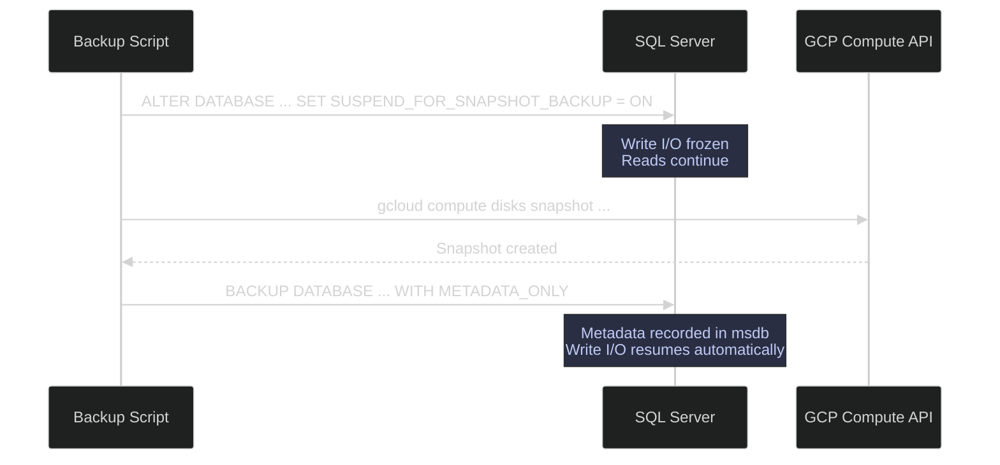
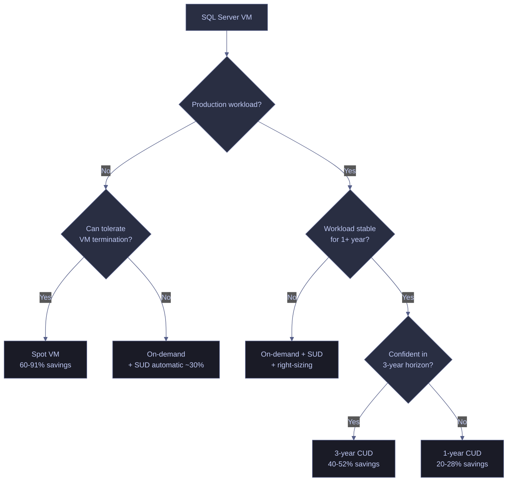
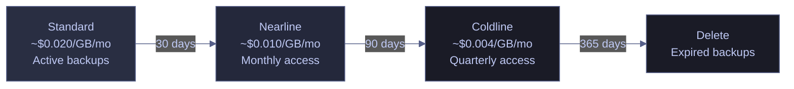

# FinOps — Cost Optimization for SQL Server on GCP

> [!quote]
> "We all want 100% availability, but that actually costs money."
>
> — **Werner Vogels**, AWS re:Invent keynote

FinOps (cloud financial operations) is the practice of bringing financial accountability to the variable spend model of the cloud, enabling engineering, finance, and business teams to collaborate on data-driven spending decisions. It is not just about cutting costs — it is about making informed tradeoffs between speed, cost, and quality so that cloud spending drives business value.

> [!quote]
> FinOps is an evolving cloud financial management discipline and cultural practice that enables organizations to get maximum business value by helping engineering, finance, technology, and business teams to collaborate on data-driven spending decisions.
>
> Source: FinOps Foundation | Fundamentals of Data Engineering.epub

The FinOps maturity model progresses through three stages — **Crawl** (reactive, fixing cost issues as they occur), **Walk** (establishing visibility and accountability), and **Run** (proactive, anticipating usage patterns and embedding cost awareness into architecture decisions).

Cost optimization for a production SQL Server on GCP has three levers: **snapshot schedules** (cheap disaster recovery alongside SQL backups), **committed use discounts** (reduce VM cost for stable workloads), and **right-sizing** (ensure the VM matches actual resource utilization).

---

## Persistent Disk Snapshot Schedules

GCP persistent disk snapshots are incremental, block-level copies of the disk. "Incremental" means that after the first full snapshot, each subsequent snapshot stores only the blocks that changed since the previous one — dramatically reducing storage costs and snapshot creation time compared to full copies.

Snapshots are cheaper and faster than SQL backups for full-disk disaster recovery — but they are **NOT a replacement** for SQL backups. The key distinction is **consistency level** and **recovery granularity**:

- **Crash-consistent** — the snapshot captures the exact byte state of the disk at a point in time, as if the power was pulled. The OS and database may need to perform crash recovery on startup. Data that was in memory (dirty pages not yet flushed to disk) is lost from the snapshot.
- **Application-consistent** — the application (SQL Server) flushes all dirty pages to disk and freezes write I/O before the snapshot is taken. The resulting snapshot contains a clean, recoverable database state with no crash recovery needed.

| Method | Storage Cost | Recovery Speed | Consistency | Granularity |
|---|---|---|---|---|
| SQL BACKUP to local disk | Disk space on VM | Minutes (restore) | Application-consistent | Database, filegroup, file |
| SQL BACKUP to GCS | ~$0.02/GB/month (Standard) | Minutes + download time | Application-consistent | Database, filegroup, file |
| GCP Disk Snapshot | ~$0.026/GB/month (incremental) | Minutes (create disk from snapshot) | Crash-consistent | Entire disk only |
| GCP Disk Snapshot + FREEZE | ~$0.026/GB/month | Minutes | Application-consistent | Entire disk only |

> [!tip] Best strategy: use BOTH
> - Daily SQL BACKUP to GCS for PITR and granular recovery — see [backup-types-and-strategy](https://alp78.github.io/elysium/04-SQL-Server/Administration/backup-types-and-strategy)
> - Daily disk snapshot for fast full-VM recovery / disaster recovery
> - The two methods protect against different failure modes: SQL backups handle database-level corruption and point-in-time recovery; disk snapshots handle VM-level or disk-level failures where you need to rebuild the entire machine.

### GCP | gcloud | snapshot schedule creation and attachment

GCP resource policies automate snapshot creation on a schedule. You create a policy defining frequency and retention, then attach it to one or more persistent disks.

#### Create a daily snapshot schedule

This command creates a resource policy that takes a snapshot of the attached disk every day at 03:00 UTC and retains snapshots for 14 days. Older snapshots are automatically deleted.

```bash
gcloud compute resource-policies create snapshot-schedule analytics-sql-daily \
  --region=europe-west1 \
  --max-retention-days=14 \
  --start-time=03:00 \
  --daily-schedule
```

#### Attach the schedule to a persistent disk

A resource policy has no effect until it is attached to at least one persistent disk. Multiple disks can share the same policy.

```bash
gcloud compute disks add-resource-policies analytics-sql-data \
  --zone=europe-west1-b \
  --resource-policies=analytics-sql-daily
```

#### Verify attached resource policies

Confirms that the snapshot schedule is correctly associated with the disk.

```bash
gcloud compute disks describe analytics-sql-data --zone=europe-west1-b \
  --format="get(resourcePolicies)"
```

| Flag | Syntax | Description |
|---|---|---|
| `--region` | `--region=europe-west1` | Region where the resource policy is created |
| `--max-retention-days` | `--max-retention-days=14` | Number of days to retain snapshots before auto-deletion |
| `--start-time` | `--start-time=03:00` | UTC time when the daily snapshot is taken |
| `--daily-schedule` | `--daily-schedule` | Take one snapshot per day (mutually exclusive with `--hourly-schedule` and `--weekly-schedule`) |
| `--hourly-schedule` | `--hourly-schedule=6` | Take a snapshot every N hours |
| `--weekly-schedule-from-file` | `--weekly-schedule-from-file=schedule.json` | Custom weekly schedule defined in a JSON file |
| `--on-source-disk-delete` | `--on-source-disk-delete=apply-retention-policy` | Behavior when the source disk is deleted: `apply-retention-policy` (default) or `keep-auto-snapshots` |
| `--storage-location` | `--storage-location=eu` | Multi-region or region where snapshot storage resides |

### GCP | gcloud | application-consistent snapshots

Crash-consistent snapshots are acceptable for OS disk recovery, but may leave the SQL Server database in an unclean state requiring crash recovery. For production databases, application-consistent snapshots eliminate this risk by freezing write I/O before the snapshot is taken.

The workflow differs depending on the SQL Server version.

#### SQL Server 2022+ | SUSPEND_FOR_SNAPSHOT_BACKUP

SQL Server 2022 introduced T-SQL snapshot backups, which decouple the freeze/thaw orchestration from VSS (Volume Shadow Copy Service). The workflow has three steps: suspend write I/O, take the storage-level snapshot, then capture the backup metadata.

During the suspend, read operations continue normally — only writes are paused. The freeze duration should be seconds, not minutes, so the snapshot must be taken immediately after the suspend.

**Step 1 — Suspend write I/O on the database:**

```sql
ALTER DATABASE analytics_db SET SUSPEND_FOR_SNAPSHOT_BACKUP = ON;
```

**Step 2 — Take the GCP disk snapshot** (from a separate shell session or automation script):

```bash
gcloud compute disks snapshot analytics-sql-data \
  --zone=europe-west1-b \
  --snapshot-names=analytics-sql-$(date +%Y%m%d-%H%M%S) \
  --guest-flush
```

**Step 3 — Capture the snapshot backup metadata** (back in SQL Server). This records the backup in `msdb` and resumes write I/O automatically:

```sql
BACKUP DATABASE analytics_db
TO DISK = 'D:\Backups\analytics_db_snapshot.bkm'
WITH METADATA_ONLY;
```

> [!info] METADATA_ONLY backup files
> The `.bkm` file created by `BACKUP ... WITH METADATA_ONLY` does not contain any database data — it records only the backup metadata (file layout, LSN, differential bitmap state). The actual data lives in the disk snapshot. To restore, you mount the snapshot disk and then use the `.bkm` file with `RESTORE DATABASE`. The differential bitmap is cleared when the database is suspended — subsequent differential backups will scan the entire database until the next successful snapshot backup.

You can monitor the suspend state using the `sys.dm_server_suspend_status` DMV:

```sql
SELECT db_name, suspend_time_ms, is_write_io_frozen
FROM sys.dm_server_suspend_status;
```

> [!info] Column Reference
>
> | Column | Meaning |
> |---|---|
> | `db_name` | Name of the database currently in a suspended state. Returns one row per suspended database. An empty result set means no databases are frozen — either the suspend was never issued or the `BACKUP … WITH METADATA_ONLY` step completed and automatically resumed writes. |
> | `suspend_time_ms` | Elapsed milliseconds since write I/O was frozen. The GCP snapshot must be taken **immediately** — keep this value under 30,000 ms (30 seconds). Beyond 30 seconds, application write timeouts begin accumulating. Values above 60,000 ms risk active transaction failures and alert-level error log entries. |
> | `is_write_io_frozen` | `1` = write I/O is currently frozen (snapshot window is open). `0` = writes have resumed (the freeze ended or was never started). Confirm `is_write_io_frozen = 1` before issuing the `gcloud compute disks snapshot` command to guarantee the snapshot captures a write-quiesced, consistent state. |

> [!bug] Known bug — databases stuck in suspended state (fixed in CU16)
> In SQL Server 2022 builds prior to CU16, running `ALTER SERVER CONFIGURATION SET SUSPEND_FOR_SNAPSHOT_BACKUP = ON` could leave databases in an incorrect suspended state if an error occurred during the suspend operation. Subsequent suspend attempts would fail with `Msg 3081: Database was previously suspended for snapshot backup.`

> [!success] Resolution
> Install [Cumulative Update 16](https://learn.microsoft.com/troubleshoot/sql/releases/sqlserver-2022/cumulativeupdate16) or later. Always verify your CU level before relying on T-SQL snapshot backups in production.



#### SQL Server (legacy) | VSS and DBCC FREEZEIO

Before SQL Server 2022, the officially documented approach for application-consistent snapshots was the **VSS (Volume Shadow Copy Service)** framework with the **SQL Writer service**. VSS-based solutions coordinate with SQL Server through the Virtual Device Interface (VDI) to ensure a consistent state.

As an alternative, the undocumented `DBCC FREEZEIO` and `DBCC THAWIO` commands can freeze and resume write I/O on a specific database. These commands are not officially documented by Microsoft and should be tested thoroughly before production use.

Run a `CHECKPOINT` first to flush dirty pages to disk, then freeze write I/O:

```sql
CHECKPOINT;
```

Freeze all writes on the target database:

```sql
DBCC FREEZEIO('analytics_db');
```

Take the GCP snapshot while the database is frozen (from a separate shell session), then immediately resume writes:

```sql
DBCC THAWIO('analytics_db');
```

> [!warning] Undocumented commands — use with caution
> `DBCC FREEZEIO` and `DBCC THAWIO` are not officially documented by Microsoft. They work in practice but carry risk: if the thaw command fails or is not issued (e.g., script crash), the database remains frozen indefinitely and all write operations will block. The freeze duration should be kept under 30 seconds — beyond that, applications will experience noticeable write latency.

> [!success] Recommended approach by SQL Server version
> - **SQL Server 2022+**: Use `SUSPEND_FOR_SNAPSHOT_BACKUP` with `BACKUP ... WITH METADATA_ONLY` (officially supported, auto-resumes on metadata capture).
> - **SQL Server 2019 and earlier**: Use VSS-based backup solutions where possible. Fall back to `DBCC FREEZEIO` / `DBCC THAWIO` only if VSS integration is not available. Always wrap the freeze/snapshot/thaw in a try-catch script with a timeout to ensure the thaw executes.

---

## Committed Use Discounts (CUDs) vs Spot Instances

GCP offers several pricing models beyond on-demand (pay-as-you-go). Choosing the right model for a SQL Server VM can reduce compute costs by 20–91% depending on workload stability and risk tolerance. Note that GCP also applies **Sustained Use Discounts (SUDs)** automatically — if a VM runs for more than 25% of a month, GCP progressively discounts the remaining hours (up to ~30% for a full month). SUDs apply on top of on-demand pricing with no commitment required.

### GCP | gcloud | committed use discounts

A **Committed Use Discount (CUD)** is a contract where you commit to paying for a specific amount of vCPU and memory in a region for 1 or 3 years. In return, GCP discounts those resources by 20–52%. The commitment is billed whether or not a VM is running — you are paying for reserved capacity, not for a specific VM instance. CUDs apply automatically to any eligible VM in the same region.

#### List current commitments

View all active CUDs in a region to check existing reservations before creating new ones.

```bash
gcloud compute commitments list --region=europe-west1
```

#### Create a 1-year CUD

This creates a 12-month commitment for 4 vCPUs and 16 GB of memory in the specified region, equivalent to an `e2-standard-4` VM.

```bash
gcloud compute commitments create analytics-sql-cud \
  --region=europe-west1 \
  --plan=12-month \
  --resources=vcpu=4,memory=16GB
```

> [!warning] CUDs are non-cancellable
> Once created, a CUD cannot be cancelled, downgraded, or transferred to another region. You will be billed for the committed resources for the full term even if the VM is stopped, deleted, or downsized. Always validate your resource requirements with at least 3 months of utilization data before committing.

> [!success] Mitigate CUD risk
> Start with a 1-year CUD if you are unsure about long-term requirements. Use GCP Recommender (see right-sizing section below) to validate that the VM is correctly sized before locking in a 3-year commitment.

| Term | Discount (e2 family) | Risk |
|---|---|---|
| On-demand | 0% (baseline) | None — pay as you go |
| SUD (automatic) | ~30% (full month) | None — applied automatically |
| 1-year CUD | ~20-28% | Committed to paying even if VM is off |
| 3-year CUD | ~40-52% | Locked in for 3 years, non-cancellable |

| Flag | Syntax | Description |
|---|---|---|
| `--region` | `--region=europe-west1` | Region where the commitment applies |
| `--plan` | `--plan=12-month` | Commitment duration: `12-month` or `36-month` |
| `--resources` | `--resources=vcpu=4,memory=16GB` | Resources to commit: vCPU count and memory |
| `--type` | `--type=GENERAL_PURPOSE` | Machine family type: `GENERAL_PURPOSE`, `COMPUTE_OPTIMIZED`, `MEMORY_OPTIMIZED`, etc. |

### GCP | gcloud | spot / preemptible VMs

**Spot VMs** (which replaced the legacy "Preemptible VMs") offer 60–91% discounts over on-demand pricing. The tradeoff: GCP can reclaim (terminate) the VM at any time with as little as 30 seconds notice. Preemptible VMs were the older equivalent with a hard 24-hour maximum lifetime; Spot VMs have no maximum lifetime but the same preemption risk.

Create a Spot VM for a non-production test database:

```bash
gcloud compute instances create analytics-sql-test \
  --zone=europe-west1-b \
  --machine-type=e2-standard-4 \
  --provisioning-model=SPOT \
  --instance-termination-action=STOP
```

> [!danger] NEVER use Spot VMs for production databases
> GCP can terminate a Spot VM with 30 seconds notice. If the VM is terminated while SQL Server is mid-write (flushing a checkpoint, writing to the transaction log, or performing an index rebuild), the database may require crash recovery and could suffer data loss if the transaction log is on the same disk. There is no SLA for Spot VM availability.

> [!success] Safe use cases for Spot VMs
> - CI/CD test databases that can be recreated from a backup
> - Read-only analytics replicas where data loss means re-syncing, not permanent loss
> - Migration testing and load testing
> - Any workload where the application gracefully handles VM termination

| Flag | Syntax | Description |
|---|---|---|
| `--provisioning-model` | `--provisioning-model=SPOT` | Use Spot pricing (`SPOT`) or standard pricing (`STANDARD`) |
| `--instance-termination-action` | `--instance-termination-action=STOP` | What happens on preemption: `STOP` (can restart later) or `DELETE` |
| `--machine-type` | `--machine-type=e2-standard-4` | VM machine type |
| `--zone` | `--zone=europe-west1-b` | Zone where the VM is created |
| `--maintenance-policy` | `--maintenance-policy=TERMINATE` | Required for Spot VMs (cannot live-migrate) |

### Decision matrix — CUD vs Spot vs On-demand

| Scenario | Recommendation |
|---|---|
| Dev/test, can tolerate restarts | Spot Instance (60-91% savings) |
| Production, stable workload, multi-year horizon | 3-year CUD (40-52% savings) |
| Production, uncertain future | 1-year CUD (20-28% savings) |
| Production, variable workload | On-demand + SUD (automatic ~30%) + right-sizing |



---

## Right-Sizing and Cost Monitoring

Right-sizing means ensuring the VM's machine type matches actual resource utilization — not peak theoretical load, but observed usage over time. An oversized VM wastes money on unused vCPUs and memory; an undersized VM causes performance issues. GCP provides automated recommendations based on 30 days of utilization metrics, and BigQuery billing exports enable detailed cost tracking.

> [!quote]
> If you observe that your workload utilizes 80% of CPU and 20% of memory, you could go to a different SKU or cluster type that has higher CPU and lower memory. Plan for peak demand and peak utilization.
>
> Source: The Cloud Data Lake

### GCP | gcloud | VM right-sizing with Recommender

GCP Recommender analyzes CPU and memory utilization over the last 30 days and suggests a more appropriate machine type if the VM is consistently over- or under-provisioned. Recommendations are non-destructive — they only suggest changes; you must apply them manually.

```bash
gcloud recommender recommendations list \
  --project=data-platform-prod \
  --location=europe-west1-b \
  --recommender=google.compute.instance.MachineTypeRecommender \
  --format="table(content.overview.resourceName, content.overview.recommendedMachineType.name, content.overview.currentMachineType.name)"
```

| Flag | Syntax | Description |
|---|---|---|
| `--project` | `--project=data-platform-prod` | GCP project containing the VMs |
| `--location` | `--location=europe-west1-b` | Zone to check for recommendations |
| `--recommender` | `--recommender=google.compute.instance.MachineTypeRecommender` | Recommender type (machine type is the most common for cost optimization) |
| `--format` | `--format="table(...)"` | Output format — `table`, `json`, `csv`, or `value` |

### GCP | BigQuery | billing export cost tracking

GCP can export detailed billing data to a BigQuery dataset, enabling SQL-based cost analysis by service, SKU, project, and time period. This must be configured in the GCP Console under **Billing → Billing export** before any data appears.

> [!info] Prerequisites
> Billing export to BigQuery must be enabled in the GCP Console (Billing → Billing export → BigQuery export). Data starts flowing from the moment of activation — it is not retroactive. The export creates partitioned tables in the specified BigQuery dataset.

The following query summarizes the top 20 cost items for the last 30 days:

```sql
SELECT
  service.description,
  sku.description,
  SUM(cost) AS total_cost,
  SUM(usage.amount) AS usage_amount,
  usage.unit
FROM `data-platform-prod.billing_export.gcp_billing_export_v1_*`
WHERE DATE(_PARTITIONTIME) >= DATE_SUB(CURRENT_DATE(), INTERVAL 30 DAY)
  AND project.id = 'data-platform-prod'
GROUP BY 1, 2, 5
ORDER BY total_cost DESC
LIMIT 20
```

> [!info] Column Reference
>
> | Column | Source | Meaning |
> |---|---|---|
> | `service.description` | `billing_export.service.description` | GCP service name (e.g., `Compute Engine`, `Cloud Storage`, `BigQuery`). |
> | `sku.description` | `billing_export.sku.description` | Specific resource SKU (e.g., `N2 Predefined Instance Core running in EMEA`). Drill into this when a service cost is unexpectedly high. |
> | `total_cost` | `SUM(cost)` | Total USD cost pre-tax, pre-credit. Credits (SUDs, CUDs) appear as separate rows with negative values. |
> | `usage_amount` | `SUM(usage.amount)` | Total units consumed. Interpret with `usage.unit`. |
> | `usage.unit` | `billing_export.usage.unit` | Unit of measure: `hour` (compute), `gibibyte` (storage), `count` (API requests), `gibibyte month` (persistent storage). |
> | `_PARTITIONTIME` | Partition filter | The table is date-partitioned. **Always include this filter** — omitting it causes BigQuery to full-scan all partitions, incurring unnecessary query costs. |

Run this query using the `bq` CLI tool:

```bash
bq query --use_legacy_sql=false --format=prettyjson < billing_query.sql
```

### Cost reduction checklist

A systematic review of common cost waste areas for SQL Server on GCP. Work through each item periodically (monthly or quarterly) as part of the FinOps Operate cycle.

> [!todo] Cost reduction actions
> - [ ] **Stop idle VMs** — schedule dev/test VMs to stop on nights and weekends using Cloud Scheduler
> - [ ] **Evaluate disk tier** — use `pd-balanced` instead of `pd-ssd` if IOPS requirements are met (see [server-configuration](https://alp78.github.io/elysium/04-SQL-Server/Administration/server-configuration))
> - [ ] **Set log backup retention** — do not keep transaction log backups indefinitely; define a retention window aligned with your RPO
> - [ ] **Apply GCS lifecycle policies** — transition old backups through storage tiers (see below)
> - [ ] **Check for idle disks** — `gcloud compute disks list --filter="NOT users:*"` reveals unattached persistent disks still incurring storage charges
> - [ ] **Right-size VMs** — review GCP Recommender output (above) and resize VMs that are consistently under-utilized
> - [ ] **Review CUD utilization** — ensure committed resources are actually being consumed; unused CUD capacity is pure waste

### GCP | gcloud storage | GCS backup lifecycle policies

GCS offers multiple storage classes with different cost and access profiles:

- **Standard** — lowest latency, highest per-GB cost (~$0.020/GB/month). Use for active data accessed frequently.
- **Nearline** — lower storage cost (~$0.010/GB/month) but charges a per-GB retrieval fee. Minimum 30-day storage. Use for data accessed less than once per month.
- **Coldline** — even lower storage cost (~$0.004/GB/month) with higher retrieval fee. Minimum 90-day storage. Use for data accessed less than once per quarter.
- **Archive** — lowest storage cost (~$0.0012/GB/month) with the highest retrieval fee. Minimum 365-day storage. Use for compliance and long-term retention only.

Lifecycle policies automatically transition objects between storage classes based on age, reducing costs without manual intervention.

> [!info] gsutil is deprecated
> The `gsutil` CLI tool is deprecated in favor of `gcloud storage`. The lifecycle JSON format remains the same — only the command changes: `gcloud storage buckets update gs://bucket-name --lifecycle-file=lifecycle.json`.

Save the following as `lifecycle.json`:

```json
{
  "lifecycle": {
    "rule": [
      {
        "action": {"type": "SetStorageClass", "storageClass": "NEARLINE"},
        "condition": {"age": 30, "matchesStorageClass": ["STANDARD"]}
      },
      {
        "action": {"type": "SetStorageClass", "storageClass": "COLDLINE"},
        "condition": {"age": 90, "matchesStorageClass": ["NEARLINE"]}
      },
      {
        "action": {"type": "Delete"},
        "condition": {"age": 365}
      }
    ]
  }
}
```

Apply the lifecycle policy to the backup bucket:

```bash
gcloud storage buckets update gs://analytics-sql-backups \
  --lifecycle-file=lifecycle.json
```



---

## SQL Server Storage Optimization

Beyond GCP-level cost savings, SQL Server's own storage and compression choices have a direct impact on both performance and infrastructure cost. Reducing data size at the SQL Server level creates a cascading effect: smaller data means fewer disk I/Os, less need for expensive disk tiers, more data fitting in the buffer pool, and smaller backup files costing less in GCS storage.

### Table compression as a buffer pool multiplier

SQL Server offers two levels of in-place data compression for row-based tables. Use `sp_estimate_data_compression_savings` to estimate the impact before applying compression to production tables.

> [!quote]
> Two compression options are available for row-based tables. Row compression works by storing numeric and Unicode values in the smallest space required. Page compression implements row compression, and also prefix and dictionary compression. This provides a higher compression ratio, meaning even less I/O, but at the expense of CPU.
>
> Source: Pro SQL Server 2022 Administration, Third Edition

- **ROW compression** — stores fixed-length numeric and string types in variable-length format. Low CPU overhead, moderate space savings (typically 15–40%). Safe to apply broadly.
- **PAGE compression** — adds prefix and dictionary compression on top of row compression. Higher space savings (typically 50–80%) but adds CPU overhead on writes. Best for read-heavy tables (gold-layer analytics, dimension tables, historical data).
- **COLUMNSTORE compression** — the default for columnstore indexes. Achieves the highest compression ratios (often 90%+). `COLUMNSTORE_ARCHIVE` adds further compression for infrequently accessed data.

The cost impact is multiplicative — see [table-compression](https://alp78.github.io/elysium/04-SQL-Server/Storage-and-Indexes/table-compression):
- PAGE compression on gold-layer tables saves 60–80% disk space
- Fewer disk I/Os → less need to upgrade from `pd-balanced` to `pd-ssd`
- More data fits in the buffer pool → less need to upsize the VM's RAM

> [!info] Page compression heap caveat
> Page compression is assessed on a page-by-page basis — only pages that benefit are rebuilt. However, when new pages are added to a heap (as opposed to a clustered index), they are not automatically compressed with page compression. Rebuilding compressed heaps should be part of standard maintenance routines.

### Partitioning for tiered storage

Partition tables by date to enable storage tiering — see [partitioning-strategies](https://alp78.github.io/elysium/04-SQL-Server/Storage-and-Indexes/partitioning-strategies):
- Old partitions can reside on a `pd-balanced` or `pd-standard` disk (cheaper, lower IOPS)
- Current-year partition stays on `pd-ssd` for low latency
- Filegroups map partitions to disks: partitions 1–5 on the archive disk, partition 6+ on the fast disk

### Backup compression

Backup compression reduces backup file size by 50–70%, directly reducing GCS storage costs and backup transfer times. It is enabled by default in SQL Server 2022.

The compression ratio depends on the data type: character data compresses well, encrypted data (TDE, Always Encrypted) compresses poorly, and data in already-compressed tables yields diminishing returns.

Verify that backup compression is enabled at the instance level:

```sql
SELECT value_in_use FROM sys.configurations
WHERE name = 'backup compression default';
```

If the result is `0` (disabled), enable it:

```sql
EXEC sp_configure 'backup compression default', 1;
RECONFIGURE;
```

Monitor actual backup compression ratios by querying the backup history:

```sql
SELECT
  database_name,
  backup_size / 1048576 AS backup_size_mb,
  compressed_backup_size / 1048576 AS compressed_size_mb,
  CAST(backup_size AS FLOAT) / compressed_backup_size AS compression_ratio
FROM msdb..backupset
WHERE type = 'D'
ORDER BY backup_finish_date DESC;
```

> [!info] Column Reference
>
> | Column | Source | Meaning |
> |---|---|---|
> | `database_name` | `msdb.dbo.backupset.database_name` | Name of the database that was backed up. |
> | `backup_size_mb` | `backup_size / 1048576` | Uncompressed logical size in MB. Raw `backup_size` is in bytes. |
> | `compressed_size_mb` | `compressed_backup_size / 1048576` | Actual bytes written to the backup file, in MB. `NULL` if compression was not used — produces NULL for `compression_ratio`. |
> | `compression_ratio` | `backup_size / compressed_backup_size` | Ratio of original to compressed size. Ranges: `3–7:1` for character-heavy data, `1.5–3:1` for mixed workloads, `~1.0:1` for TDE-encrypted databases on pre-2019 CU5. Values below `1.5:1` indicate already-compressed or encrypted data. |
> | `type` | Filter: `type = 'D'` | Backup type: `D` = Full, `I` = Differential, `L` = Log, `F` = File/Filegroup, `G` = File Differential, `P` = Partial, `Q` = Partial Differential. |
> | `backup_finish_date` | `msdb.dbo.backupset.backup_finish_date` | Datetime when the backup completed. Used for `ORDER BY DESC` so most recent appears first. |

A compression ratio of 3:1 means ~66% disk space savings. Ratios below 1.5:1 indicate the data is not compressing well (likely encrypted or already compressed).

> [!warning] TDE and backup compression
> For TDE-encrypted databases on SQL Server versions before 2019 CU5, backup compression with the default `MAXTRANSFERSIZE` (64 KB) compresses the already-encrypted pages, yielding poor ratios. Starting with SQL Server 2019 CU5, the engine automatically increases `MAXTRANSFERSIZE` to 128 KB, enabling an optimized algorithm that decrypts → compresses → re-encrypts, restoring normal compression ratios.

> [!success] Always verify after enabling TDE
> After enabling TDE on a database, run a test backup with compression and check the compression ratio using the query above. If the ratio is close to 1:1, confirm you are on SQL Server 2019 CU5+ or explicitly set `MAXTRANSFERSIZE = 131072` in the backup command.

> [!info] SQL Server 2025 — ZSTD compression
> SQL Server 2025 introduces the ZSTD compression algorithm for backups (`WITH COMPRESSION (ALGORITHM = ZSTD)`), which is faster and achieves better compression ratios than the default MS_XPRESS algorithm. It can be set per-backup or as the server default via `sp_configure 'backup compression algorithm', 3`.

---

## Related

- [backup-types-and-strategy](https://alp78.github.io/elysium/04-SQL-Server/Administration/backup-types-and-strategy) — SQL backup strategy (Full/Differential/Log) that complements disk snapshots
- [restore-and-recovery](https://alp78.github.io/elysium/04-SQL-Server/Administration/restore-and-recovery) — how to restore from both SQL backups and disk snapshots
- [server-configuration](https://alp78.github.io/elysium/04-SQL-Server/Administration/server-configuration) — disk type selection (pd-ssd vs pd-balanced) and IO configuration
- [always-on-availability-groups](https://alp78.github.io/elysium/04-SQL-Server/High-Availability/always-on-availability-groups) — AG backup offload to secondary reduces primary VM IO costs
- [tde-encryption](https://alp78.github.io/elysium/04-SQL-Server/Security/tde-encryption) — TDE adds ~3-7% CPU overhead; factor into VM sizing
- [table-compression](https://alp78.github.io/elysium/04-SQL-Server/Storage-and-Indexes/table-compression) — reduce storage and buffer pool footprint without adding RAM
