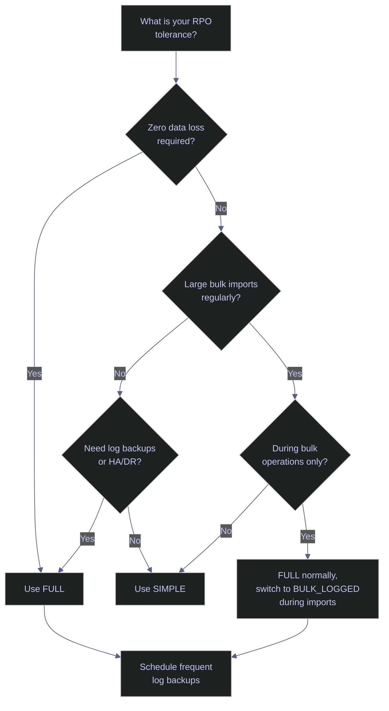
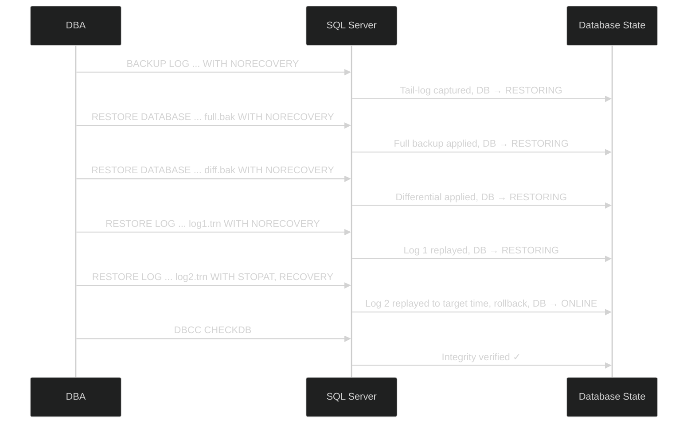

# Restore and Recovery

> [!quote]
> "A backup strategy is worthless if you have never tested a restore. Practice your disaster recovery before the disaster."
>
> — **Brent Ozar**, brentozar.com

Knowing how to perform a restore is the test of whether your backup strategy is real. Every restore procedure should be practiced in a non-production environment before you need it under pressure.

---

## Recovery Models

The recovery model controls how SQL Server manages the transaction log, which in turn determines what restore options are available. Every database operates under one of three recovery models: FULL, SIMPLE, or BULK_LOGGED. The choice directly affects your Recovery Point Objective (RPO) — how much data you can lose — and which restore methods are possible.

### SQL Server | Recovery Models | comparison

The following table compares all three models across the dimensions that matter for restore planning.

| Feature | SIMPLE | FULL | BULK_LOGGED |
|---|---|---|---|
| **Log management** | Auto-truncated at checkpoint | Grows until log backup | Grows until log backup |
| **Log backups** | Not supported | Required — failure causes log growth until error 9002 | Required |
| **Point-in-time restore** | Not supported — restore only to end of last full or differential backup | Supported — any point covered by the log chain | Blocked if bulk-logged changes exist in the log backup interval |
| **Work loss exposure (RPO)** | All changes since last full or differential backup | Normally zero — tail-log backup captures up to the point of failure | Data loss if bulk-logged operations occurred since last log backup |
| **Minimally logged operations** | Yes (SELECT INTO, bulk import, index rebuild) | No — all operations fully logged | Yes — same operations as SIMPLE |
| **Page restore** | Not supported | Supported (Enterprise only) | Conditional (Enterprise only) |
| **Always On / Mirroring / Log Shipping** | Not supported | Supported | Supported |
| **Default for** | Express edition | Enterprise and Standard editions | N/A — temporary use only |

> [!quote]
> Under FULL recovery, log truncation occurs only after a log backup (provided a CHECKPOINT has occurred since the last log backup). Switching from SIMPLE to FULL does not activate FULL behavior until the first log backup is taken — take it immediately after switching.
>
> Source: Apress | Pro SQL Server 2022 Administration, Third Edition

> [!warning] Switching Models Breaks the Log Chain
>
> Switching from FULL or BULK_LOGGED to SIMPLE truncates the log chain immediately. Any point-in-time recovery to a moment before the switch becomes impossible. Always take a log backup **before** switching away from FULL or BULK_LOGGED.

> [!success] Safe Model Switch Pattern
>
> 1. Take a log backup (`BACKUP LOG`)
> 2. Switch the model (`ALTER DATABASE ... SET RECOVERY SIMPLE`)
> 3. After completing the operation, switch back (`ALTER DATABASE ... SET RECOVERY FULL`)
> 4. Take another log backup immediately to re-establish the chain

### SQL Server | Recovery Models | BULK_LOGGED usage pattern

BULK_LOGGED is designed for short-term use during large bulk import operations, not as a permanent setting. The recommended pattern is:

1. Switch to BULK_LOGGED just before the bulk operation
2. Run the bulk import (e.g., `BULK INSERT`, `SELECT INTO`, index rebuild)
3. Switch back to FULL immediately after
4. Take a log backup on both sides of the switch

> [!info] BULK_LOGGED Performance Caveat
>
> BULK_LOGGED may not be faster than FULL unless the I/O subsystem is fast enough to handle the immediate flush of minimally logged pages. Under BULK_LOGGED, minimally logged data pages are flushed to disk at operation completion rather than waiting for CHECKPOINT — trading log I/O for data I/O.

### SQL Server | Recovery Models | decision guide



---

## Full Restore

A full restore overwrites the existing database with the entire contents of a full backup file. This is the simplest restore operation — one command replaces the database with the exact state captured in the backup. Use it when you need to return to a known-good state and do not need to recover to a specific point in time.

### SQL Server | RESTORE DATABASE | full backup

The following command restores a full backup, overwriting the existing database and bringing it online immediately.

```sql
RESTORE DATABASE analytics_db
FROM DISK = '/var/opt/mssql/backup/mydb_full.bak'
WITH REPLACE, RECOVERY;
```

> [!info] RESTORE WITH options
>
> - **REPLACE** — overwrites the existing database without a safety check
> - **RECOVERY** — brings the database online after restore (this is the default if omitted)

> [!warning] REPLACE Destroys Existing Data
>
> `WITH REPLACE` overwrites the existing database without confirmation. Ensure you are targeting the correct database and server before running. Consider a side-by-side restore first if you are uncertain.

> [!success] Restore to a New Name First
>
> When uncertain, restore to `analytics_db_verify` using `WITH MOVE` (see Side-by-Side section below) before overwriting production. Verify the data looks correct, then drop the test database and proceed with `WITH REPLACE` on the production target. This costs a few extra minutes and avoids an unrecoverable mistake.

---

## Point-in-Time Recovery (PITR)

Point-in-time recovery restores a database to an exact moment by replaying the backup chain: full → differential (optional) → transaction log backups. Unlike a full restore, which returns to the backup's snapshot, PITR uses the transaction log to recover to any second within the log chain — for example, to the moment just before an accidental `DELETE` or `DROP TABLE`.

### SQL Server | PITR | prerequisites

PITR has strict requirements. If any of these are not met, the recovery fails or produces an incomplete result.

- **FULL recovery model** must have been active on the database at the time of the events you want to recover. Under SIMPLE recovery, the transaction log is auto-truncated at each checkpoint, so no log chain exists — you can only restore to the end of the last full or differential backup.
- **Unbroken log chain** — every transaction log backup from the last full (or differential) backup through the target recovery time must be available, in sequence, with no gaps. A single missing log backup breaks the chain and makes PITR to any point after that gap impossible.
- **Tail-log backup** — before starting the restore, you must capture any log records generated since the last scheduled log backup. Without the tail-log backup, transactions between the last log backup and the failure are lost.

> [!info] What Is a Log Chain?
>
> A log chain is the continuous sequence of transaction log backups starting from a full backup. Each log backup records its first LSN (Log Sequence Number) and last LSN. SQL Server verifies that each log backup's first LSN matches the previous backup's last LSN — any gap breaks the chain. The chain is broken by: switching to SIMPLE recovery, a missing log backup file, or taking a full backup with `COPY_ONLY` followed by deleting intermediate logs.

### SQL Server | PITR | tail-log backup

The tail-log backup captures uncommitted and recently committed transactions that exist only in the active log — everything since the last scheduled log backup. Taking it with `NORECOVERY` also puts the database into restoring state, preventing further writes during the restore.

#### Take a tail-log backup before restoring

```sql
BACKUP LOG analytics_db
TO DISK = '/var/opt/mssql/backup/analytics_db_tail.trn'
WITH NORECOVERY;
```

The `NORECOVERY` option serves two purposes: it backs up the tail of the log, and it transitions the database to the RESTORING state so no new transactions can occur during the restore sequence. After this command, the database is offline to users.

> [!info] Tail-Log From a Damaged Database
>
> If the database is offline or damaged but the log file (`.ldf`) is intact, use `WITH NO_TRUNCATE` instead. This copies the log without truncating it and does not require the database to be online. Add `CONTINUE_AFTER_ERROR` as a last resort if metadata pages are damaged — the log data itself may still be usable.

### SQL Server | PITR | restore sequence

The following sequence walks through a complete point-in-time recovery. Each step must be executed in order — applying a backup out of sequence or with the wrong recovery option will fail or leave the database in an unrecoverable state.

> [!todo] PITR Step-by-Step Sequence
>
> 1. **Take the tail-log backup** (see above) — captures the active log tail and puts the DB in RESTORING state
> 2. **Restore the full backup** with `NORECOVERY`
> 3. **Restore the differential backup** (if available) with `NORECOVERY`
> 4. **Restore each transaction log backup** in sequence with `NORECOVERY`
> 5. **Restore the final log** (or tail-log) with `STOPAT` and `RECOVERY` to stop at the target time and bring the database online
> 6. **Validate** with `DBCC CHECKDB`

#### Restore the full backup

```sql
RESTORE DATABASE analytics_db
FROM DISK = '/var/opt/mssql/backup/mydb_full.bak'
WITH NORECOVERY;
```

`NORECOVERY` leaves the database in restoring state. This tells SQL Server that more backups will follow — it does not roll back uncommitted transactions yet. The database is inaccessible to users in this state.

#### Restore the differential backup

```sql
RESTORE DATABASE analytics_db
FROM DISK = '/var/opt/mssql/backup/mydb_diff.bak'
WITH NORECOVERY;
```

The differential backup contains all pages changed since the last full backup. Applying it with `NORECOVERY` advances the database state while keeping it ready for log restores. If no differential backup exists, skip this step and proceed directly to log restores.

#### Restore transaction log backups in sequence

```sql
RESTORE LOG analytics_db
FROM DISK = '/var/opt/mssql/backup/mydb_log1.trn'
WITH NORECOVERY;
```

Apply each log backup in LSN order. Each log backup replays the transactions it contains, advancing the database forward through time. Continue with `NORECOVERY` for all logs except the final one.

#### Restore the final log with STOPAT

```sql
RESTORE LOG analytics_db
FROM DISK = '/var/opt/mssql/backup/mydb_log2.trn'
WITH STOPAT = '2026-03-09T14:23:45', RECOVERY;
```

`STOPAT` tells SQL Server to replay transactions only up to the specified timestamp (ISO 8601 format: `YYYY-MM-DDTHH:MM:SS`). Any transactions committed after that moment are discarded. `RECOVERY` performs the final rollback of uncommitted transactions and brings the database online.

#### Validate the restored database

```sql
DBCC CHECKDB ('analytics_db') WITH NO_INFOMSGS, ALL_ERRORMSGS;
```

Always run `DBCC CHECKDB` after a restore to verify logical and physical consistency of the data. This confirms that no corruption was introduced during the backup/restore chain.



### SQL Server | PITR | common failure scenarios

> [!danger] Broken Log Chain
>
> If any transaction log backup in the sequence is missing, corrupted, or was taken under a different recovery model, PITR cannot proceed past that gap. SQL Server returns error 4305: "The log in this backup set begins at LSN X, which is too recent to apply to the database." The data between the gap and your target time is unrecoverable.

> [!success] Prevention
>
> Schedule frequent log backups (every 5–15 minutes for OLTP). Monitor `log_reuse_wait_desc` in `sys.databases` — a value of `LOG_BACKUP` confirms the log is waiting for a backup. Never switch to SIMPLE recovery without first taking a log backup. Store all log backups on reliable, monitored storage.

> [!danger] Restoring WITH RECOVERY Too Early
>
> If you accidentally use `WITH RECOVERY` on an intermediate step instead of `NORECOVERY`, SQL Server rolls back uncommitted transactions and brings the database online. No further log backups can be applied — the restore sequence is terminated prematurely. You must restart the entire restore sequence from the full backup.

> [!success] Recovery
>
> Start the restore over from step 1 (full backup with `NORECOVERY`). To avoid this mistake, script the entire restore sequence in advance and review it before execution. Use `WITH STANDBY = 'standby.bak'` during testing — this brings the database online as read-only between log restores, allowing verification without terminating the sequence.

> [!danger] Incorrect STOPAT Timestamp Format
>
> `STOPAT` requires ISO 8601 format: `'YYYY-MM-DDTHH:MM:SS'`. Using an ambiguous format (e.g., `'03/09/2026'`) may be interpreted differently depending on the server's `DATEFORMAT` setting, resulting in recovery to the wrong point in time — or failure with error 4336.

> [!success] Safe Format
>
> Always use the unambiguous ISO 8601 format: `WITH STOPAT = '2026-03-09T14:23:45'`. Verify the server's time zone if using timestamps — `STOPAT` interprets the value in the server's local time zone, not UTC.

### SQL Server | RESTORE | options reference

The following table covers the key options used in restore operations.

| Option | Syntax | Description |
|---|---|---|
| `NORECOVERY` | `WITH NORECOVERY` | Leave the database in RESTORING state — more backups will follow. Does not roll back uncommitted transactions. |
| `RECOVERY` | `WITH RECOVERY` | Bring the database online (default if omitted). Rolls back uncommitted transactions. No further backups can be applied. |
| `STANDBY` | `WITH STANDBY = 'path'` | Leave the database in read-only standby state. Undo information is written to a standby file, allowing further log restores. Useful for verification between log applies. |
| `STOPAT` | `WITH STOPAT = 'datetime'` | Stop replaying the log at the specified timestamp (ISO 8601). Supported on both `RESTORE DATABASE` and `RESTORE LOG`. |
| `STOPATMARK` | `WITH STOPATMARK = 'mark'` | Recover through (inclusive) a named transaction mark in the log. `RESTORE LOG` only. |
| `STOPBEFOREMARK` | `WITH STOPBEFOREMARK = 'mark'` | Recover up to but not including the named mark. `RESTORE LOG` only. |
| `REPLACE` | `WITH REPLACE` | Overwrite an existing database without safety checks. Also bypasses the tail-log backup requirement. |
| `MOVE` | `WITH MOVE 'logical' TO 'path'` | Relocate a database file to a different physical path during restore. Required when restoring side-by-side. |
| `FILE` | `WITH FILE = n` | Select a specific backup set by position when a media contains multiple backups (default: 1). |
| `STATS` | `WITH STATS = n` | Report progress at every `n` percent complete (default: 10). |
| `CHECKSUM` | `WITH CHECKSUM` | Verify backup checksums during restore. Fails if the backup has no checksums. |
| `RESTART` | `WITH RESTART` | Restart an interrupted restore from the point of interruption. |
| `PARTIAL` | `WITH PARTIAL` | Piecemeal restore — restores primary filegroup and optionally specified secondary filegroups. Enterprise only. |
| `RESTRICTED_USER` | `WITH RESTRICTED_USER` | Restrict access to the restored database to `db_owner`, `dbcreator`, and `sysadmin` roles only. |
| `BUFFERCOUNT` | `WITH BUFFERCOUNT = n` | Number of I/O buffers for the restore operation. Tuning parameter for large restores. |
| `MAXTRANSFERSIZE` | `WITH MAXTRANSFERSIZE = n` | Maximum transfer unit in bytes (multiples of 65536, up to 4194304). Must be ≥ the value used at backup time for FILESTREAM or In-Memory OLTP databases. |

---

## Restore to a New Database (Side-by-Side)

A side-by-side restore creates a copy of a backup as a separate database alongside the existing production database. This allows comparison or investigation without touching production data — for example, verifying data quality, auditing a specific historical state, or testing a restore procedure before applying it to production.

### SQL Server | RESTORE DATABASE | WITH MOVE

The `MOVE` option remaps the logical file names in the backup to new physical paths. This is required because the original `.mdf` and `.ldf` file paths are already in use by the production database — without `MOVE`, the restore would attempt to overwrite them.

Use `RESTORE FILELISTONLY` (see Verifying section below) to obtain the logical file names before constructing the `MOVE` clauses.

```sql
RESTORE DATABASE project_investigation
FROM DISK = '/var/opt/mssql/backup/mydb_full.bak'
WITH MOVE 'analytics_db' TO '/var/opt/mssql/data/project_inv.mdf',
     MOVE 'mydb_log' TO '/var/opt/mssql/data/project_inv_log.ldf',
     RECOVERY;
```

> [!tip] Side-by-Side for Safe Investigation
>
> When investigating a data quality issue, always restore to a new database name (`project_investigation`) rather than overwriting production. This lets you compare old vs. current data without risk. Drop the investigation database when finished to reclaim disk space.

---

## Verifying a Backup Before Restoring

Before restoring a backup — especially in a disaster recovery scenario — verify that the backup file is readable, inspect its contents, and identify the logical file names you will need for `MOVE` clauses. SQL Server provides three informational `RESTORE` statements for this purpose, none of which modify any data.

### SQL Server | RESTORE | VERIFYONLY

`RESTORE VERIFYONLY` checks that the backup set is complete and all volumes are readable. It does **not** verify the logical consistency of the data inside — it is not a substitute for `DBCC CHECKDB`. Include it in your regular backup maintenance jobs to catch corrupted backup files before you need them.

```sql
RESTORE VERIFYONLY
FROM DISK = '/var/opt/mssql/backup/mydb_full.bak'
WITH CHECKSUM;
```

Adding `CHECKSUM` forces verification of backup-level checksums, providing a stronger integrity check. Without it, `VERIFYONLY` only confirms the backup structure is readable.

> [!warning] VERIFYONLY Does Not Guarantee Data Integrity
>
> A successful `VERIFYONLY` confirms the backup file is structurally intact and readable. It does **not** confirm that the data pages inside are logically consistent. A backup taken from a corrupted database will pass `VERIFYONLY` while still containing corrupt data.

> [!success] Full Verification
>
> For true restore validation, periodically restore the backup to a test database (using `WITH MOVE`) and run `DBCC CHECKDB` against it. This is the only way to confirm end-to-end data integrity.

### SQL Server | RESTORE | HEADERONLY

`RESTORE HEADERONLY` returns one row per backup set on the media device. Use it to identify which backup set to restore (by position), verify backup chain LSNs, and detect incomplete tail-log backups.

```sql
RESTORE HEADERONLY
FROM DISK = '/var/opt/mssql/backup/mydb_full.bak';
```

Key columns in the output include: `BackupType` (1=Full, 2=Log, 5=Differential), `DatabaseName`, `BackupStartDate`, `BackupFinishDate`, `FirstLSN`, `LastLSN`, `Position`, and `HasIncompleteMetadata` (1 if this is a tail-log backup from a damaged database).

### SQL Server | RESTORE | FILELISTONLY

`RESTORE FILELISTONLY` returns one row per data or log file contained in the backup. This is essential before constructing `MOVE` clauses for a side-by-side restore or when restoring to a server with a different directory structure.

```sql
RESTORE FILELISTONLY
FROM DISK = '/var/opt/mssql/backup/mydb_full.bak';
```

Key columns: `LogicalName` (the name used in `MOVE` clauses), `PhysicalName` (original file path), `Type` (`D` = data file, `L` = log file, `F` = FILESTREAM), `FileGroupName`, and `Size`.

| Statement | Purpose | Modifies Data? |
|---|---|---|
| `RESTORE VERIFYONLY` | Confirm backup is readable and structurally intact | No |
| `RESTORE HEADERONLY` | List backup sets, LSNs, types, and positions on the media | No |
| `RESTORE FILELISTONLY` | List logical/physical file names for `MOVE` clause construction | No |

---

## Monitoring Recovery Progress After a Crash

After an unexpected shutdown (power failure, VM preemption, OS crash), SQL Server automatically runs crash recovery when the instance restarts. Crash recovery uses the ARIES (Algorithm for Recovery and Isolation Exploiting Semantics) protocol, executing three sequential phases to bring each database back to a transactionally consistent state. All committed transactions are preserved; all uncommitted transactions are rolled back.

### SQL Server | Crash Recovery | monitoring query

The following query checks the progress of any active recovery operations. It returns results only while recovery is in progress — if it returns no rows, recovery has either completed or not started.

```sql
SELECT
    database_id,
    DB_NAME(database_id) AS database_name,
    percent_complete,
    estimated_completion_time / 60000 AS est_minutes_remaining
FROM sys.dm_exec_requests
WHERE command LIKE '%RECOVERY%';
```

### SQL Server | Crash Recovery | three phases

Crash recovery proceeds through three phases in strict order. Each phase has a different performance characteristic based on what happened before the crash.

| Phase | What Happens | Duration |
|---|---|---|
| **Analysis** | Scans the transaction log from the last checkpoint forward. Builds the dirty page table (pages modified but not yet flushed to disk) and the active transaction table (transactions in progress at crash time). | Typically < 1 second. Proportional to the number of log records since the last checkpoint, but these are metadata reads only. |
| **Redo (roll forward)** | Replays all logged operations for committed transactions whose changes were not yet written to the `.mdf` data files. Brings pages up to their state at the moment of the crash. | Proportional to the number of log records since the last checkpoint. With indirect checkpoints (default since SQL Server 2016, `TARGET_RECOVERY_TIME = 60` seconds), the redo window is bounded — typically under 60 seconds of log replay. |
| **Undo (roll back)** | Reverses all operations from transactions that were active (uncommitted) at crash time. Uses compensation log records (CLRs) written to the log during rollback. | Proportional to the amount of uncommitted work. A single long-running transaction with millions of rows modified can cause undo to take minutes or hours. |

> [!info] Indirect Checkpoints
>
> Databases created on SQL Server 2016+ use indirect checkpoints by default, with a `TARGET_RECOVERY_TIME` of 60 seconds. Unlike automatic checkpoints (which flush all dirty pages in a burst), indirect checkpoints continuously flush dirty pages in the background to keep the redo window within the target. This results in faster, more predictable crash recovery at the cost of slightly higher background I/O. Configure via `ALTER DATABASE ... SET TARGET_RECOVERY_TIME = N SECONDS`.


### SQL Server | Crash Recovery | scenarios

The following table maps common crash scenarios to their recovery behavior and expected impact.

| Scenario | Recovery Behavior | Data Loss |
|---|---|---|
| **VM hard-stop** (GCE preemption, `gcloud compute instances stop --force`) | Full three-phase recovery from last checkpoint. Duration depends on checkpoint frequency and uncommitted work. Typically seconds to a few minutes with indirect checkpoints. | None for committed transactions. Uncommitted transactions rolled back. |
| **Graceful shutdown** (`systemctl stop mssql-server`) | SQL Server runs a final checkpoint before stopping, flushing all dirty pages. Recovery on restart is near-instant (empty redo/undo). | None. |
| **Log disk full** (`.ldf` volume at 100%) | Database remains online but all write operations fail immediately with error 9002. Reads continue. | No data loss — database is still consistent. Fix: expand the log file, add a secondary log file, or free space. Switching to SIMPLE recovery and running a manual `CHECKPOINT` will truncate the log as a last resort. |
| **Data file corruption** (bad disk sector in `.mdf`) | Recovery fails — SQL Server cannot bring the database online. | Potential data loss. Restore from the last known-good backup. If the corruption is limited to specific pages, Enterprise edition supports page-level restore (`RESTORE DATABASE ... PAGE = 'fileid:pageid'`). |

### SQL Server | Accelerated Database Recovery (ADR)

Accelerated Database Recovery (ADR), introduced in SQL Server 2019, fundamentally redesigns the undo phase of crash recovery. In traditional recovery, undo time is proportional to the longest active transaction — a single 10-hour transaction means 10 hours of undo. ADR eliminates this bottleneck by using a Persistent Version Store (PVS) to perform near-instantaneous logical reverts instead of sequential physical undo.

ADR is off by default in on-premises SQL Server but always enabled in Azure SQL Database and Azure SQL Managed Instance.

#### Enable ADR

```sql
ALTER DATABASE analytics_db
SET ACCELERATED_DATABASE_RECOVERY = ON;
```

#### Disable ADR

```sql
ALTER DATABASE analytics_db
SET ACCELERATED_DATABASE_RECOVERY = OFF;
```

Enabling or disabling ADR requires an exclusive database lock. Use `WITH ROLLBACK IMMEDIATE` on `ALTER DATABASE` if active sessions must be forced out.

| Component | Role |
|---|---|
| **PVS (Persistent Version Store)** | Stores row versions in the database itself (not `tempdb`). Used by logical revert for undo operations. |
| **Logical revert** | Performs row-level version-based undo asynchronously. Releases locks immediately after abort, regardless of transaction size. |
| **SLOG (Secondary Log Stream)** | In-memory log for non-versioned operations (metadata changes, lock acquisitions). Persisted at checkpoint. Enables fast redo/undo of non-row operations. |
| **Cleaner** | Background process that removes obsolete PVS row versions. Multi-threaded in SQL Server 2022. |

| Phase | Traditional Recovery | With ADR |
|---|---|---|
| **Analysis** | Scan from last checkpoint to end of log | Same, plus reconstruct SLOG |
| **Redo** | Replay all log records from oldest uncommitted transaction | SLOG redo from oldest uncommitted to last checkpoint; transaction log redo only from last checkpoint forward |
| **Undo** | Sequential backward scan — time proportional to transaction size | Near-instant via PVS logical revert + SLOG for non-versioned operations |

> [!warning] ADR Overhead
>
> ADR increases log generation for write-intensive workloads because row versions are logged. The PVS also consumes space in the user database. High abort rates pressure the PVS cleaner and can degrade performance. ADR is not optimal for workloads dominated by high-volume single-row DML in short transactions.

> [!success] When ADR Shines
>
> Enable ADR for databases with long-running transactions, frequent rollbacks, or strict availability SLAs where recovery time must be constant regardless of transaction size. The recovery time benefit outweighs the storage and log overhead for most OLTP workloads.

> [!info] SQL Server 2022 ADR Improvements
>
> SQL Server 2022 introduced multi-threaded PVS cleanup (configurable via `ADR Cleaner Thread Count` server option), transaction-level PVS cleanup (committed versions cleaned independently of aborted ones), and reduced memory footprint via extent-level page tracking. SQL Server 2025 extends ADR support to `tempdb`.

---

## Related

- [backup-types-and-strategy](https://alp78.github.io/elysium/04-SQL-Server/Administration/backup-types-and-strategy) — understanding backup types and the 3-2-1 rule
- [server-configuration](https://alp78.github.io/elysium/04-SQL-Server/Administration/server-configuration) — recovery model configuration
- [essential-dba-queries](https://alp78.github.io/elysium/04-SQL-Server/Administration/essential-dba-queries) — monitoring active queries and blocking
- [storage-internals](https://alp78.github.io/elysium/04-SQL-Server/Storage-and-Indexes/storage-internals) — how WAL and checkpoints work at the page level
