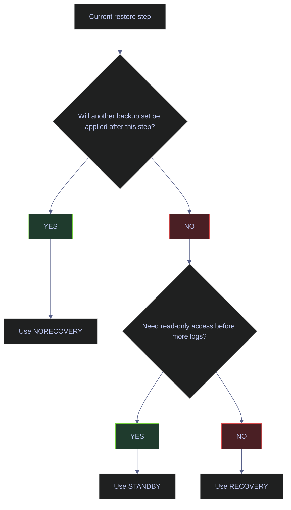

# Restore and Recovery

Restore is where the backup strategy is either proven or exposed as theory. A restore guide must be operational: which command to run first, when to use `NORECOVERY` versus `RECOVERY`, how to restore to a new name safely, and how to validate that the restored database is usable.

The live outputs in this note come from a disposable restore performed against the backup file `/var/opt/mssql/backup/admin_restore_demo_full.bak`.

---

## Restore States

Most restore mistakes come from using the wrong recovery state on the wrong step. The recovery-state options decide whether SQL Server expects more backup sets to follow.

### Recovery Options

#### What `NORECOVERY`, `RECOVERY`, and `STANDBY` mean operationally

| Option | What it does | Use when |
|---|---|---|
| `NORECOVERY` | Leaves the database in restoring state and ready for more backup sets | Any intermediate restore step in a chain |
| `RECOVERY` | Rolls back uncommitted work and brings the database online | Final step in the restore sequence |
| `STANDBY` | Brings the database online read-only while preserving undo information for later log restores | Verification or reporting between log restores |

#### Restore-state decision flow



---

## Side-By-Side Restore

The safest way to validate a backup is to restore it under a new database name and inspect the data before touching an existing database.

### Restore To A New Database Name

This subsection uses a real disposable restore that was executed successfully on the current instance.

#### Restore the backup to a new database using `WITH MOVE`

[!warning]
The `MOVE` clause must use the logical file names from the backup, not guessed file names. If you reuse the original file paths or skip `MOVE` when restoring side by side, the restore will fail or target the wrong files.

[!success]
Always run `RESTORE FILELISTONLY` first and copy the logical names exactly into the `MOVE` clauses.

[!info]-
This restore command does four essential things:

- restores from the known `.bak` file
- creates a new database name instead of overwriting an existing one
- remaps the original logical files to new physical file paths
- uses `RECOVERY` because this is a one-step full restore, not part of a longer chain

*This command performs a side-by-side full restore to a new database name so the backup can be validated safely.*

```sql
RESTORE DATABASE admin_restore_demo_check
FROM DISK = '/var/opt/mssql/backup/admin_restore_demo_full.bak'
WITH MOVE 'admin_restore_demo' TO '/var/opt/mssql/data/admin_restore_demo_check.mdf',
     MOVE 'admin_restore_demo_log' TO '/var/opt/mssql/data/admin_restore_demo_check_log.ldf',
     REPLACE,
     RECOVERY;
```

#### Validate the restored data before dropping the disposable database

*This query checks the restored table contents to prove the restored database is usable, not just mountable.*

```sql
SELECT
    id,
    payload,
    created_at
FROM admin_restore_demo_check.dbo.restore_probe
ORDER BY id;
```

| id | payload | created_at |
|---:|---|---|
| 1 | baseline | 2026-04-08 16:35:41.4430932 |
| 2 | restore-check | 2026-04-08 16:35:41.4430932 |

*This is the strongest kind of restore validation short of application-level smoke testing: the restored database came online, the target table exists, and the expected rows are present. That proves more than `VERIFYONLY` ever can, because it confirms that the backup can actually be mounted and queried successfully.*

#### Confirm the restore in `msdb`

[!info]-
This query reads `msdb.dbo.restorehistory`, which is SQL Server's restore audit trail.

- `destination_database_name` identifies the restore target.
- `backup_set_id` links back to the source backup in `msdb.dbo.backupset`.
- `replace` shows whether `WITH REPLACE` was used.
- `recovery` shows whether the restore left the database recovered and online.

*This query proves that SQL Server recorded the restore operation in `msdb`, not just that a validation query happened to work afterward.*

```sql
SELECT TOP (5)
    restore_date,
    destination_database_name,
    user_name,
    backup_set_id,
    replace,
    recovery
FROM msdb.dbo.restorehistory
ORDER BY restore_date DESC;
```

| restore_date | destination_database_name | user_name | backup_set_id | replace | recovery |
|---|---|---|---:|---:|---:|
| 2026-04-08 16:59:01.667 | admin_restore_demo_check | sa | 1 | 1 | 1 |
| 2026-04-08 16:35:41.557 | admin_restore_demo_clone | sa | 1 | 1 | 1 |

*The latest restorehistory row confirms that the side-by-side restore completed successfully for `admin_restore_demo_check`, performed by `sa`, using backup set `1`, with `REPLACE` and `RECOVERY`. In practical terms, `recovery = 1` means the restored database was brought online rather than left in a restoring state.*

| Column | Value | Watch | Meaning | Implication |
|---|---|---|---|---|
| `replace` | `1` | Context dependent | `WITH REPLACE` was used | Safe in disposable validation or intentional overwrite scenarios only |
| `replace` | `0` | Context dependent | No overwrite was forced | Safer default when an existing database should be protected |
| `recovery` | `1` | &#9989; here | Restore ended in recovered state | Database is online for use |
| `recovery` | `0` | Context dependent | Restore left database unrecovered | More restore steps are expected |

---

## Point-In-Time Recovery

Point-in-time recovery is a chain-replay procedure, not a single restore command. It exists only when the backup chain and recovery-model design support it.

### PITR Sequence

#### Full point-in-time restore sequence

[!warning]
This sequence is only valid when an unbroken log chain exists. If a log backup is missing, or if the database was switched to SIMPLE recovery during the interval, the point-in-time target may be unattainable.

[!success]
Script the whole restore sequence in advance and execute it step by step. The most common PITR error is not backup corruption; it is using `RECOVERY` too early and terminating the chain.

[!info]-
This is the standard SQL Server PITR pattern:

- take a tail-log backup if the source database is still accessible
- restore the full backup with `NORECOVERY`
- restore the latest differential, if one is part of the strategy, with `NORECOVERY`
- restore each required log backup in sequence with `NORECOVERY`
- restore the final log with `STOPAT` and `RECOVERY`

*This command sequence restores a database to a specific point in time by replaying the backup chain in order.*

```sql
BACKUP LOG stoxx
TO DISK = '/var/opt/mssql/backup/stoxx_tail.trn'
WITH NORECOVERY;

RESTORE DATABASE stoxx
FROM DISK = '/var/opt/mssql/backup/stoxx_full.bak'
WITH NORECOVERY, REPLACE;

RESTORE DATABASE stoxx
FROM DISK = '/var/opt/mssql/backup/stoxx_diff.bak'
WITH NORECOVERY;

RESTORE LOG stoxx
FROM DISK = '/var/opt/mssql/backup/stoxx_log_001.trn'
WITH NORECOVERY;

RESTORE LOG stoxx
FROM DISK = '/var/opt/mssql/backup/stoxx_tail.trn'
WITH STOPAT = '2026-04-08T16:58:00',
     RECOVERY;
```

#### PITR failure points that matter most

| Failure point | What happens | Recovery action |
|---|---|---|
| Missing log backup in the chain | SQL Server cannot replay past the gap | Restore only to the last available consistent point before the gap |
| `RECOVERY` used too early | Database comes online and later log restores are blocked | Restart the restore sequence from the full backup |
| Wrong `STOPAT` timestamp or timezone assumption | Database restores to the wrong point | Restart from the last required backup before the desired timestamp |

---

## Recovery Monitoring

Not every recovery event is a manual restore. Crash recovery after a restart also matters operationally, and it should be observable.

### Crash Recovery

#### Check whether a database is currently in recovery

[!info]-
This query reads `sys.dm_exec_requests` for commands related to recovery.

- `percent_complete` is often useful during REDO, but less reliable during UNDO.
- `estimated_completion_time` is approximate and should not be treated as a guarantee.

*This query shows whether SQL Server is currently performing crash recovery or an explicit restore recovery operation.*

```sql
SELECT
    database_id,
    DB_NAME(database_id) AS database_name,
    percent_complete,
    estimated_completion_time / 60000 AS est_minutes_remaining
FROM sys.dm_exec_requests
WHERE command LIKE '%RECOVERY%';
```

| Result |
|---|
| No rows returned |

*This means there was no active crash-recovery or explicit recovery command running at capture time. That is the healthy steady-state outcome when the instance is not starting up and no restore is in progress.*

| Column | Value | Watch | Meaning | Implication |
|---|---|---|---|---|
| `Result` | `No rows returned` | &#9989; in steady state | No active recovery request is running | Normal when the server is stable and no restore is underway |
| `percent_complete` | Rising toward 100 | Context dependent | Recovery or restore progress | Useful for estimating remaining time during active operations |

---

## Related

- [[backup-types-and-strategy]] for the backup-chain design that makes restore possible
- [[server-configuration]] for the recovery-model and RCSI decisions that shape recovery behavior
- [[essential-dba-queries]] for backup and log-state checks before and after recovery work
