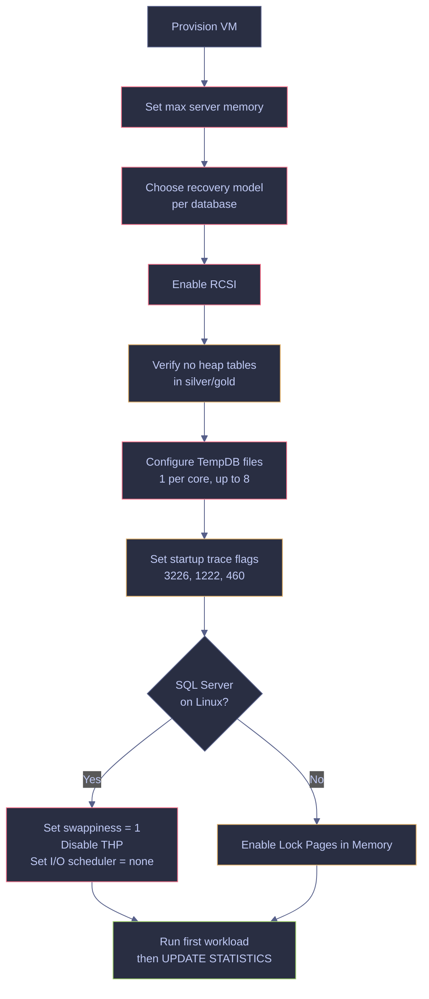
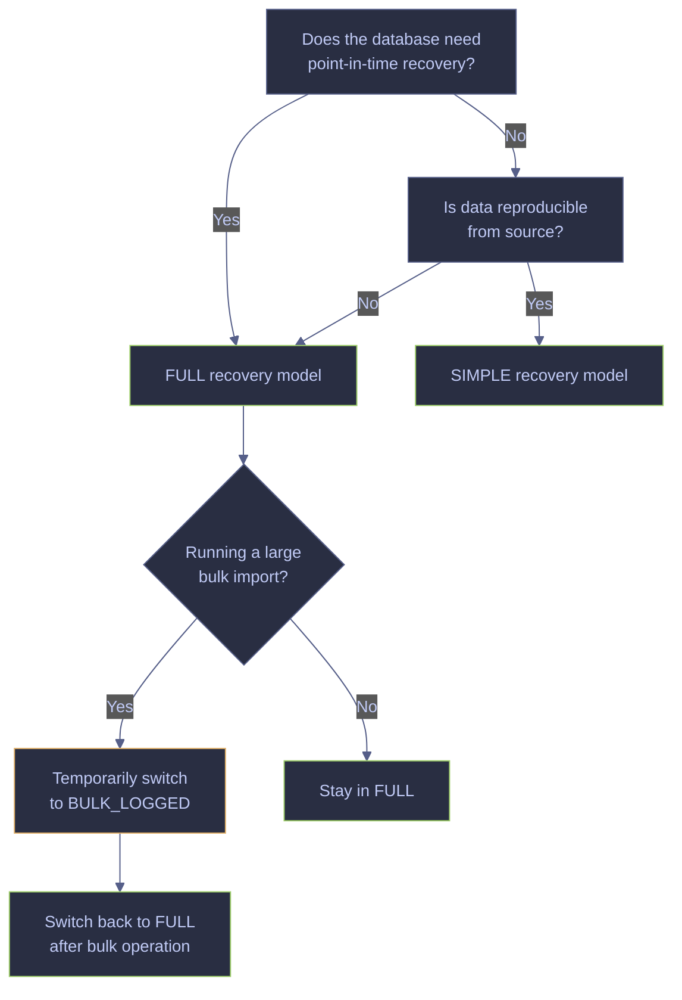
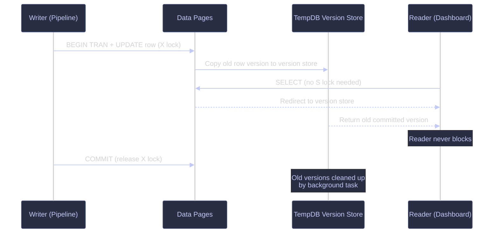

# Server Configuration

> [!quote]
> "Configuration is the silent killer of production systems — most outages are caused not by code bugs, but by misconfiguration."
>
> — **John Allspaw**, *Web Operations* (2010)

These are the non-negotiable configuration settings that every production SQL Server instance must have in place before going live. Skipping any of these leads to data corruption, OOM crashes, or unrecoverable failures. When provisioning the underlying VM with [Terraform](https://alp78.github.io/elysium/07-Terraform/GCP-Resources/terraform-compute), these config requirements should be reflected in the VM spec (machine type, disk size, resource limits).

---

## Tier 1: Non-Negotiable (Do Before Going to Production)

Every setting in this section must be configured before any workload runs on the instance. The flowchart below shows the recommended order of operations during initial provisioning.



### SQL Server | sp_configure | set max server memory

SQL Server will consume every byte of available memory and never release it without a restart. On a shared VM (with Datadog agent, OS processes), this causes OOM kills. The `max server memory` setting controls the upper limit of the buffer pool and other memory caches managed by SQLOS. It does **not** cap memory used by extended stored procedures, COM objects, linked server providers, or In-Memory OLTP / Columnstore — those have separate memory clerks outside this limit. See [memory-and-buffer-pool](https://alp78.github.io/elysium/04-SQL-Server/Performance/memory-and-buffer-pool) for how the buffer pool uses the memory allocated here.

The default value is `2,147,483,647 MB` (effectively unlimited) — one of the most dangerous defaults in SQL Server. The minimum allowable is `128 MB`.

**Rule:** `max server memory = Total RAM − 1 GB` (minimum). On a 2 GB VM: 768–1024 MB. On an 8 GB VM: 6144 MB. Microsoft recommends ~75% of total RAM on a dedicated single-instance server as a starting baseline.

> [!quote]
> A baseline value for `max server memory` can be calculated as: `total_RAM – (4 GB + 1 GB × (total_RAM – 16 GB) / 8) – memory_for_other_apps`. Monitor `sys.dm_os_sys_memory.available_physical_memory_kb` and reserve at least 512 MB on small servers, 1 GB+ on servers with 128 GB+ RAM.
>
> Source: Dmitri Korotkevitch | SQL Server Advanced Troubleshooting and Performance Tuning

| Total VM RAM | max server memory (MB) | OS/Agent Reserve |
|--------------|------------------------|------------------|
| 2 GB         | 1024                   | ~900 MB          |
| 4 GB         | 2560                   | 1.5 GB           |
| 8 GB         | 6144                   | 2 GB             |
| 16 GB        | 12288                  | 4 GB             |
| 32 GB        | 26624                  | 6 GB             |

> [!info] Linux Default Is Different
>
> On Linux, SQL Server defaults to 80% of physical RAM (not unlimited like Windows). On large servers (e.g., 1 TB RAM) this wastes 200 GB — raise it via `memory.memorylimitmb` in `mssql-conf` or the `MSSQL_MEMORY_LIMIT_MB` environment variable. The env var takes precedence over `mssql-conf` when both are set.

#### mssql-conf set memory.memorylimitmb | set max memory (requires restart)

Set the memory limit, leaving approximately 900 MB for the operating system and monitoring agents (e.g., Datadog). For a 2 GB VM, this means 1024 MB for SQL Server.

```bash
sudo /opt/mssql/bin/mssql-conf set memory.memorylimitmb 1024
sudo systemctl restart mssql-server
```

#### sp_configure 'max server memory' | set max memory (immediate, no restart)

Set the memory limit via T-SQL. This takes effect immediately without a restart and persists across restarts. The value is in megabytes.

```sql
EXEC sp_configure 'show advanced options', 1;
RECONFIGURE;
EXEC sp_configure 'max server memory', 1024;
RECONFIGURE;
```

#### sp_configure | verify current max memory setting

Verify the current `max server memory` value. A `run_value` of `2147483647` means the setting was never configured (unlimited) — this is dangerous and must be corrected before any workload runs.

```sql
EXEC sp_configure 'show advanced options', 1;
RECONFIGURE;
EXEC sp_configure 'max server memory';
```

> [!warning] Never Skip This Setting
>
> Without `max server memory`, SQL Server claims all available RAM on the VM. The OS runs out of memory, the OOM killer fires, and the process crashes. This is one of the 7 Deadly Sins of SQL Server.

> [!success] Set Memory Limit Before First Restart
>
> Use the table above to pick the correct value for your VM size, then apply it with `sp_configure` immediately after provisioning — before any workload runs. Add verification (`EXEC sp_configure 'max server memory'`) to your post-deployment checklist so the value is always confirmed before go-live.

> [!tip] mssql-conf vs sp_configure
>
> `sp_configure` takes effect immediately and persists, but gets overridden by `mssql-conf` on next restart if both are set. `mssql-conf` requires a restart to apply. Pick one method and stick with it.

> [!tip] Lock Pages in Memory (LPIM)
>
> When `max server memory` is properly set, enable Lock Pages in Memory (LPIM) to prevent the OS from paging SQL Server buffer pool memory to disk under memory pressure. LPIM requires the SQL Server service account to hold the "Lock pages in memory" Windows privilege (or equivalent Linux capability). Error 17890 in the error log signals that the `sqlservr` process is being paged out — a strong indicator that LPIM should be enabled.

---

### SQL Server | recovery model

The recovery model determines how SQL Server manages the transaction log, what backup operations are available, and whether point-in-time recovery (PITR) is possible. Every database must have a deliberately chosen recovery model — the default is FULL, which requires active log backup management. Never leave a database in FULL recovery without log backups — the log file will grow until it fills the disk.

| Recovery Model | What is logged | Log truncation | Restore options | Use when |
|---|---|---|---|---|
| **FULL** | All transactions fully logged | Only after log backup | Full + Differential + Log backups; PITR to any point in time | Production databases requiring point-in-time recovery |
| **SIMPLE** | All transactions fully logged | Automatic at checkpoint | Full + Differential backups only; restore to end of backup only | Dev/test databases; analytics where data is reproducible from source |
| **BULK_LOGGED** | Bulk operations minimally logged (extent allocations only) | Only after log backup | Full + Differential + Log backups; PITR only if no bulk operations occurred in the log tail | Temporary switch during large bulk imports to reduce log I/O, then switch back to FULL |

See [backup-types-and-strategy](https://alp78.github.io/elysium/04-SQL-Server/Administration/backup-types-and-strategy) for the full decision matrix and [restore-and-recovery](https://alp78.github.io/elysium/04-SQL-Server/Administration/restore-and-recovery) for the complete PITR restore sequence.



#### Check the current recovery model

Query `sys.databases` to determine the active recovery model for a specific database before making changes.

```sql
SELECT name, recovery_model_desc FROM sys.databases WHERE name = 'analytics_db';
```

#### Switch recovery to SIMPLE

Use SIMPLE for idempotent pipelines where data is reproducible from source. The transaction log is automatically truncated at each checkpoint, so no log backups are needed.

```sql
ALTER DATABASE [analytics_db] SET RECOVERY SIMPLE;
```

#### Switch recovery to FULL

Use FULL for production databases that require point-in-time recovery. After switching to FULL, immediately take a full backup to start the log chain — PITR is impossible without an initial full backup.

```sql
ALTER DATABASE [analytics_db] SET RECOVERY FULL;
```

> [!danger] FULL Recovery Without Log Backups
>
> Switching to FULL recovery without scheduling log backups is one of the 7 Deadly Sins of SQL Server. The transaction log grows continuously and is never truncated until a log backup occurs. On a busy system, the log can fill the disk within hours, causing all write operations to fail with error 9002.

> [!success] Immediately Back Up After Switching to FULL
>
> After `ALTER DATABASE ... SET RECOVERY FULL`, immediately run `BACKUP DATABASE [db] TO DISK = '...'` to establish the log chain. Then schedule regular log backups (every 5–15 minutes for OLTP workloads). Without this initial full backup, SQL Server cannot perform point-in-time recovery even though the model is set to FULL.

---

### SQL Server | Read Committed Snapshot Isolation (RCSI)

Without RCSI, the default `READ COMMITTED` isolation level uses shared (S) locks — readers block writers and writers block readers. Dashboard queries stall while the pipeline writes, and vice versa. RCSI changes the behavior of `READ COMMITTED` so that `SELECT` queries no longer acquire shared locks. Instead, readers see the last committed version of each row from the **version store** in TempDB, while writers continue taking exclusive (X) locks as usual. This eliminates reader/writer blocking entirely with zero code changes.

RCSI provides **statement-level** read consistency — each statement sees a snapshot of committed data as of the statement's start time. This differs from full `SNAPSHOT` isolation, which provides **transaction-level** consistency (snapshot taken at the start of the entire transaction) and includes update conflict detection.

> [!info] RCSI Defaults by Platform
>
> - **SQL Server (on-premises):** `READ_COMMITTED_SNAPSHOT OFF` by default — uses shared locks.
> - **Azure SQL Database:** `READ_COMMITTED_SNAPSHOT ON` by default.
> - **Azure SQL Managed Instance:** `READ_COMMITTED_SNAPSHOT OFF` by default (same as on-prem).



#### Enable RCSI on a database

Enabling RCSI requires exclusive database access — no other connections can be active during the `ALTER DATABASE` command. Plan this for a maintenance window or use `ALTER DATABASE ... SET READ_COMMITTED_SNAPSHOT ON WITH ROLLBACK IMMEDIATE` to forcibly disconnect other sessions.

```sql
ALTER DATABASE analytics_db SET READ_COMMITTED_SNAPSHOT ON;
```

> [!tip] The Single Most Impactful Setting
>
> Enabling RCSI eliminates the most common class of deadlocks: reader/writer conflicts. The pipeline (writer) and dashboard (reader) can operate concurrently without blocking each other. On SQL Server 2022+, combining RCSI with **Optimized Locking** further reduces lock duration — writers qualify rows using the latest committed version without acquiring Update (U) locks, taking only short-duration low-level locks not held to end of transaction.

> [!warning] RCSI and TempDB Space
>
> RCSI stores row versions in the TempDB version store. The version store also serves triggers, MARS (Multiple Active Result Sets), and online index operations. A long-running read transaction with RCSI enabled can cause the version store to grow indefinitely, consuming TempDB space.

> [!success] Monitor the Version Store After Enabling RCSI
>
> After enabling RCSI, run `SELECT SUM(version_store_reserved_page_count) * 8.0 / 1024 AS version_store_mb FROM sys.dm_db_file_space_usage;` in `tempdb` to track version store growth. If it grows large, look for long-running open transactions using `sys.dm_exec_sessions` (high `open_transaction_count`). Terminate stale sessions to release version store space.

---

### SQL Server | clustered indexes and heap prevention

A **clustered index** physically orders the data pages in a table by the index key using a B-tree structure. Every table can have at most one clustered index because the data rows themselves are stored at the leaf level of the B-tree — the index *is* the table. A table without a clustered index is called a **heap**: an unordered collection of data pages linked only by Index Allocation Map (IAM) pages. Rows in a heap are identified by a Row Identifier (RID) — a combination of `FileID:PageID:SlotNumber`.

Heaps have no physical order, so every query without a covering nonclustered index must perform a full table scan regardless of the `WHERE` clause. Additionally, when an `UPDATE` causes a row to outgrow its current page, SQL Server creates a **forwarded record** — a pointer at the original location pointing to the row's new page, plus a back pointer. Forwarded records cause random I/O and degrade scan performance. Detect them with `sys.dm_db_index_physical_stats` (column `forwarded_record_count`) or the `Forwarded Records/sec` performance counter.

Every table in silver and gold layers must have a clustered index. Temporary tables (`#temp`, table variables) are acceptable as heaps for small, short-lived objects.

#### Check for heaps in the database

Query `sys.tables` joined with `sys.partitions` where `index_id = 0` (heap indicator) to find all tables without a clustered index. Any silver or gold table appearing in this result must be fixed immediately.

```sql
SELECT SCHEMA_NAME(t.schema_id) + '.' + t.name AS table_name, p.rows
FROM sys.tables t
JOIN sys.partitions p ON t.object_id = p.object_id AND p.index_id = 0
WHERE p.rows > 0
ORDER BY p.rows DESC;
```

> [!info] Column Reference
>
> | Column | Source | Meaning |
> |---|---|---|
> | `table_name` | `SCHEMA_NAME(schema_id) + '.' + t.name` | Fully qualified table name (`schema.table`). Any result in the silver or gold layer must be addressed by adding a clustered index. |
> | `rows` | `sys.partitions.rows` | Approximate row count from partition metadata. Updated during bulk operations and `UPDATE STATISTICS`, but may lag for tables with frequent small DML. For a current exact count use `sys.dm_db_partition_stats.row_count`. |
> | `index_id = 0` | Join/filter condition | `index_id = 0` in `sys.partitions` is the heap indicator. `index_id = 1` means a clustered index exists. Values `2–999` are nonclustered indexes. The join on `index_id = 0` returns exactly one row per heap partition — multi-partition heaps produce one row per partition. |

> [!warning] Forwarded Records on Heaps
>
> A heap with variable-length columns is especially vulnerable to forwarded records. Each forwarded record adds a random I/O hop during scans, and nonclustered index lookups on heaps use RID pointers that also follow forwarded chains. On large heaps, forwarded records can make full scans 2–5x slower than equivalent clustered index scans.

> [!success] Convert Heaps to Clustered Index Tables
>
> The permanent fix is to add a clustered index — this physically reorders the data and eliminates all forwarded records. `ALTER TABLE ... REBUILD` on a heap clears forwarded records but is only a temporary fix (they will recur with future updates). Prefer adding a clustered index on a narrow, ever-increasing, unique key (e.g., an `IDENTITY` column or a `DATETIME2` column).

See [index-types-and-strategy](https://alp78.github.io/elysium/04-SQL-Server/Storage-and-Indexes/index-types-and-strategy) for clustered index key selection.

---

### SQL Server | update statistics after bulk loads

**Statistics** are metadata objects that describe the distribution of values in one or more columns. They consist of a **histogram** (up to 200 steps showing value distribution) and a **density vector** (measuring column-combination selectivity). The query optimizer uses statistics to estimate how many rows a query will return at each step of the execution plan — this drives every decision about index seeks vs. scans, join strategies, and memory grants. Stale statistics cause the optimizer to make wrong choices (e.g., choosing a table scan when an index seek would be orders of magnitude faster).

SQL Server has an auto-update mechanism, but its thresholds are often too conservative for pipeline workloads:

| Version / Compat Level | Table Size (n rows) | Auto-update fires after... |
|---|---|---|
| Pre-2016 or compat < 130 | n > 500 | `500 + (0.20 × n)` modifications |
| 2016+ with compat ≥ 130 | n > 500 | `MIN(500 + 0.20×n, SQRT(1000×n))` modifications |

The dynamic threshold (compat ≥ 130) scales down as the table grows. For a 2-million-row table: the old threshold requires ~400,500 modifications before auto-update fires; the dynamic threshold requires only ~44,721. On SQL Server 2014/2012, enable **trace flag 2371** to backport the dynamic threshold behavior.

After every pipeline run that inserts or updates more than 10% of a table, update statistics explicitly rather than waiting for auto-update.

#### Update statistics with FULLSCAN after pipeline load

`FULLSCAN` reads every row in the table to build the histogram — the most accurate option but also the most I/O-intensive. Use `FULLSCAN` for critical gold-layer tables after bulk loads. For very large tables where the I/O cost is prohibitive, `SAMPLE` with a percentage (e.g., `WITH SAMPLE 30 PERCENT`) provides a reasonable approximation.

```sql
UPDATE STATISTICS gold.scores_daily WITH FULLSCAN;
UPDATE STATISTICS gold.index_performance WITH FULLSCAN;
```

> [!info] Monitoring Statistics Freshness
>
> Use `STATS_DATE(object_id, stats_id)` or `sys.dm_db_stats_properties` to check when statistics were last updated. The `modification_counter` column in `sys.dm_db_stats_properties` shows how many row modifications have occurred since the last update — compare this against the auto-update threshold for your compat level to determine if an explicit update is needed.

> [!tip] AUTO_UPDATE_STATISTICS_ASYNC
>
> When `AUTO_UPDATE_STATISTICS_ASYNC` is ON, a query that triggers a statistics update uses the stale plan immediately while a background thread updates the statistics. This avoids blocking query compilation but means one query runs with potentially bad estimates. For OLTP workloads where compilation latency matters, this tradeoff is usually worthwhile. Default is OFF (synchronous — query waits for the update).

---

### SQL Server | TempDB configuration

**TempDB** is a global shared resource used by every database on the instance. It stores temporary objects (`#temp` tables, table variables), internal worktables for sorting and hashing, the **version store** (used by RCSI, snapshot isolation, triggers, MARS, and online index operations), and intermediate results from query execution. Because every session competes for TempDB resources, contention on its internal allocation pages is one of the most common performance bottlenecks in SQL Server.

The three allocation pages that cause contention are:

- **PFS (Page Free Space):** Tracks free space on each page. One PFS page covers 8,088 data pages (~64 MB). Every allocation and deallocation updates the PFS page.
- **GAM (Global Allocation Map):** Tracks which extents (8 contiguous pages = 64 KB) are allocated. One GAM page covers ~4 GB of data.
- **SGAM (Shared Global Allocation Map):** Tracks which extents have at least one unused page (for mixed-extent allocations). One SGAM page covers ~4 GB of data.

When all TempDB activity goes through a single data file, these allocation pages become hot spots — every concurrent operation serializes on the same PFS/GAM/SGAM latch. The fix is multiple equally-sized data files so that the proportional-fill algorithm distributes allocations across files, each with its own set of allocation pages.

**Sizing guideline:** Create one data file per logical CPU core, up to 8 files. If contention persists with 8 files, increase by multiples of 4 up to the logical processor count. All files must be **exactly equal in size** — the proportional-fill algorithm favors larger files, so unequal sizes defeat the purpose. Set a consistent autogrowth increment (e.g., 64 MB) identically across all files.

> [!info] SQL Server 2016+ Made Old Trace Flags Obsolete
>
> **Trace flag 1117** (simultaneous autogrow across all files) and **trace flag 1118** (uniform extent allocation in TempDB) are **no longer needed** since SQL Server 2016. These behaviors are now defaults: `AUTOGROW_ALL_FILES` is always ON for the TempDB PRIMARY filegroup, and uniform extents are always used in TempDB. Do not enable these trace flags on SQL Server 2016+.

> [!info] Linux Installer Does Not Auto-Create Multiple Files
>
> On Windows, SQL Server Setup automatically creates `MIN(logical_processors, 8)` TempDB data files during a fresh install (since SQL Server 2016). On Linux, the installer creates only a single TempDB data file — you must create additional files manually post-install.

#### Add TempDB data files via T-SQL

Add additional TempDB data files with equal size and growth settings. This change is persistent across restarts since SQL Server recreates TempDB at startup using the registered file definitions.

```sql
ALTER DATABASE tempdb ADD FILE (
    NAME = 'tempdev2', FILENAME = '/var/opt/mssql/data/tempdb2.ndf',
    SIZE = 100MB, FILEGROWTH = 64MB
);
```

Repeat the `ALTER DATABASE tempdb ADD FILE` statement for each additional file (`tempdev3`, `tempdev4`, etc.), adjusting only the `NAME` and `FILENAME` values. Match the `SIZE` and `FILEGROWTH` exactly across all files.

#### Configure TempDB files via mssql-conf (persistent across restarts)

On Linux, TempDB file count and sizing can also be set in the `mssql-conf` configuration file:

```ini
[tempdb]
data_directory = /var/opt/mssql/data
initial_size_mb = 100
number_of_files = 4
```

> [!tip] Instant File Initialization (IFI)
>
> Grant the SQL Server service account the "Perform Volume Maintenance Tasks" privilege to enable Instant File Initialization. This eliminates the time-consuming zero-fill step during data file growth and creation events. On SQL Server 2022+, transaction log growth events up to 64 MB can also benefit from IFI.

---

### SQL Server | trace flags

Trace flags are server-level switches that modify specific SQL Server behaviors — typically enabling diagnostic output, changing optimizer behavior, or activating features that are off by default. Trace flags can be set at three scopes: **session** (`DBCC TRACEON(flag)` — current session only), **global** (`DBCC TRACEON(flag, -1)` — all sessions, but lost on restart), and **startup** (via `mssql-conf` or `-T` parameter — persists across restarts).

On SQL Server on Linux, startup trace flags must be set via `mssql-conf`:

```bash
sudo /opt/mssql/bin/mssql-conf traceflag 3226 1222 460 on
sudo systemctl restart mssql-server
```

> [!warning] Many Pre-2016 Trace Flags Are Now Obsolete
>
> SQL Server 2016 and later versions incorporated many commonly used trace flags as default behaviors or database-scoped configurations. Enabling an obsolete trace flag has no effect but creates a false sense of security. Always verify whether a trace flag still applies to your version before adding it to the startup configuration.

| Flag | Purpose | Status (SQL 2022) |
|------|---------|-------------------|
| **3226** | Suppress successful backup messages in error log (reduces log noise) | Active — recommended |
| **1222** | Log deadlock graphs in error log in XML format | Active — recommended |
| **460** | Replace truncation error messages with actionable detail (column name, actual length) | Active — recommended |
| **2371** | Dynamic decreasing statistics auto-update threshold for large tables | **Obsolete** at compat level ≥ 130 (built-in since SQL 2016). Still needed for compat < 130 |
| **4199** | Enable all query optimizer fixes that are off by default | **Replaced** by `QUERY_OPTIMIZER_HOTFIXES` database-scoped configuration in SQL 2016+ |
| **1117** | All files in a filegroup autogrow simultaneously | **Obsolete** since SQL 2016 — default for TempDB; use `AUTOGROW_ALL_FILES` for user DBs |
| **1118** | Uniform extent allocations in TempDB | **Obsolete** since SQL 2016 — now default behavior for TempDB |
| **834** | Large-page allocations for buffer pool (2–16 MB pages). Improves TLB efficiency for DW workloads | Active — requires LPIM. **Do not use with Columnstore indexes** (use T876 on SQL 2019+ instead) |
| **3042** | Disable backup file preallocation to save disk space | Active — useful in space-constrained environments |
| **7471** | Run multiple `UPDATE STATISTICS` for different stats on a single table concurrently | Active — SQL 2014 SP1+ |

> [!success] Recommended Baseline for SQL Server 2022 on Linux
>
> Enable trace flags **3226**, **1222**, and **460** as startup flags via `mssql-conf`. These are universally safe and reduce diagnostic noise while improving error clarity. Add **7471** if you run maintenance plans with heavy statistics updates. Do **not** add 1117, 1118, 2371, or 4199 on SQL Server 2016+ — they are either obsolete or superseded by database-scoped configurations.

---

## Linux OS Tuning (for SQL Server on Linux)

Three Linux settings with outsized impact on SQL Server performance. Wrong defaults cause random latency spikes, I/O stalls, and memory thrashing. When running SQL Server in Docker, [container resource limits](https://alp78.github.io/elysium/09-Docker/container-lifecycle) (memory limits, CPU quotas) mirror these OS-level tuning concerns.

### Linux | sysctl | swappiness

The `vm.swappiness` kernel parameter controls how aggressively the Linux kernel reclaims memory by swapping pages to disk versus dropping file cache pages. It is an integer from 0 to 200 (0 to 100 on older kernels). The Linux default of `60` means the kernel will actively swap application memory pages to disk even when there is still free cache memory available. For SQL Server, this is catastrophic — buffer pool pages get swapped to disk, and every subsequent read of those pages incurs disk I/O latency instead of memory-speed access.

#### Check the current swappiness value

The expected default on a fresh Linux installation is `60` — this must be lowered before running SQL Server.

```bash
cat /proc/sys/vm/swappiness
```

#### Set swappiness to 1 (minimal swap)

A value of `1` means the kernel will swap only as an absolute last resort to avoid the OOM killer.

```bash
sudo sysctl vm.swappiness=1
```

#### Persist swappiness across reboots

Write the setting to a sysctl configuration drop-in file and reload all sysctl settings.

```bash
echo 'vm.swappiness = 1' | sudo tee -a /etc/sysctl.d/99-sqlserver.conf
sudo sysctl --system
```

#### Verify the swappiness setting

Confirm the value is now `1` after applying.

```bash
cat /proc/sys/vm/swappiness
```

> [!warning] Never Set Swappiness to 0
>
> Setting swappiness to `0` completely disables swap. Under memory pressure, the OOM killer will terminate SQL Server instead of swapping. The value `1` keeps swap available as an emergency buffer while preventing eager swapping during normal operation.

> [!success] Use swappiness = 1 as the Safe Setting
>
> Set `vm.swappiness = 1` and persist it in `/etc/sysctl.d/99-sqlserver.conf`. On RHEL 8.0+, the co-developed `mssql` TuneD profile sets this automatically — install it with `tuned-adm profile mssql` for a comprehensive one-step configuration.

### Linux | Transparent Huge Pages (THP)

Linux normally uses 4 KB memory pages. **Transparent Huge Pages (THP)** is a kernel feature that automatically promotes contiguous 4 KB pages into 2 MB "huge pages" to reduce TLB (Translation Lookaside Buffer) misses. While this benefits some workloads, it introduces significant latency spikes for SQL Server. The kernel periodically runs a **compaction** process (`khugepaged`) that scans and rearranges memory to form contiguous 2 MB regions — this compaction stalls memory allocations and causes unpredictable latency during SQL Server page reads and writes. Microsoft recommends disabling THP for SQL Server on Linux.

#### Check current THP state

The bracketed value shows the active mode. `[always]` means THP is enabled (bad). `[never]` means THP is disabled (good).

```bash
cat /sys/kernel/mm/transparent_hugepage/enabled
```

#### Disable THP immediately

Disable both the THP allocation mode and the defragmentation (compaction) daemon. This takes effect instantly but does not persist across reboots.

```bash
echo never | sudo tee /sys/kernel/mm/transparent_hugepage/enabled
echo never | sudo tee /sys/kernel/mm/transparent_hugepage/defrag
```

#### Persist THP disable via systemd service

Create a oneshot systemd service that disables THP on every boot, ordered to run before the `mssql-server` service starts.

```bash
sudo tee /etc/systemd/system/disable-thp.service << 'EOF'
[Unit]
Description=Disable Transparent Huge Pages
DefaultDependencies=no
After=sysinit.target local-fs.target
Before=mssql-server.service

[Service]
Type=oneshot
ExecStart=/bin/sh -c 'echo never > /sys/kernel/mm/transparent_hugepage/enabled && echo never > /sys/kernel/mm/transparent_hugepage/defrag'

[Install]
WantedBy=basic.target
EOF

sudo systemctl daemon-reload
sudo systemctl enable disable-thp
```

### Linux | I/O scheduler

The Linux I/O scheduler reorders and merges block I/O requests before they reach the storage device. For rotational disks (HDD), schedulers like `bfq` and `cfq` improve performance by reducing seek time through request reordering. For SSD-backed disks (GCP `pd-ssd`, `local-ssd`, NVMe) where there is no seek penalty, these schedulers add unnecessary CPU overhead and latency. The recommended scheduler for SSDs is `none` (also called `noop`) — it passes I/O requests directly to the device with no reordering. The alternative `mq-deadline` provides basic deadline-based ordering and is also acceptable for SSDs.

#### Check the current I/O scheduler per device

The bracketed value shows the active scheduler. Replace `sdb` with your actual device name.

```bash
cat /sys/block/sdb/queue/scheduler
```

#### Set the I/O scheduler to none

Set the scheduler to `none` for the target device. This takes effect immediately but does not persist across reboots.

```bash
echo none | sudo tee /sys/block/sdb/queue/scheduler
```

#### Persist the I/O scheduler via udev rule

Create a udev rule that automatically sets the `none` scheduler for all non-rotational (SSD) and NVMe devices when they are added or changed.

```bash
sudo tee /etc/udev/rules.d/60-io-scheduler.rules << 'EOF'
ACTION=="add|change", KERNEL=="sd[a-z]", ATTR{queue/rotational}=="0", ATTR{queue/scheduler}="none"
ACTION=="add|change", KERNEL=="nvme[0-9]*", ATTR{queue/scheduler}="none"
EOF

sudo udevadm control --reload-rules
sudo udevadm trigger
```

---

### Linux | complete sysctl reference

Full `/etc/sysctl.d/99-sqlserver.conf` for SQL Server 2022 on Linux (GCP). Values for `vm.dirty_ratio` (80), `vm.dirty_background_ratio` (3), and `vm.max_map_count` (1600000) follow Microsoft's official performance tuning recommendations. `kernel.numa_balancing` is disabled because SQL Server manages its own NUMA-aware memory allocation through SQLOS.

```ini
# /etc/sysctl.d/99-sqlserver.conf — SQL Server 2022 on Linux (GCP)

# Swap only as absolute last resort
vm.swappiness = 1

# Reduce tendency to reclaim dentry/inode caches
vm.vfs_cache_pressure = 50

# Dirty page writeback — Microsoft recommended values
# High dirty_ratio allows large write cache before forced flush (reduces I/O stalls)
# Low dirty_background_ratio starts background writeback early but gently
vm.dirty_ratio = 80
vm.dirty_background_ratio = 3

# Memory mapping limit — default 65536 is too low for SQL Server
# Microsoft recommends 1,600,000 (max: 2,147,483,647)
vm.max_map_count = 1600000

# Disable auto-NUMA balancing — SQL Server manages its own NUMA affinity
kernel.numa_balancing = 0

# Network buffers
net.core.rmem_max = 16777216
net.core.wmem_max = 16777216
net.core.rmem_default = 1048576
net.core.wmem_default = 1048576
net.ipv4.tcp_rmem = 4096 1048576 16777216
net.ipv4.tcp_wmem = 4096 1048576 16777216
net.core.somaxconn = 4096
net.core.netdev_max_backlog = 5000

# ARP cache for VPC networking
net.ipv4.neigh.default.gc_thresh1 = 4096
net.ipv4.neigh.default.gc_thresh2 = 8192
net.ipv4.neigh.default.gc_thresh3 = 16384
```

---

## The 7 Deadly Sins of SQL Server

These are the seven most common configuration and development mistakes that cause production SQL Server instances to fail, perform poorly, or lose data. Each is covered in detail elsewhere in the vault — this table serves as a quick-reference checklist for pre-production reviews.

| Sin | Why it kills you |
|-----|-----------------|
| **`SELECT *` in production queries** | Reads every column from every page, prevents covering indexes from working, wastes buffer pool space |
| **No clustered index (heap tables)** | Every query is a full table scan regardless of WHERE clause |
| **Functions on columns in WHERE** | Forces full index scan instead of seek — 100x+ more I/O |
| **Long-running open transactions** | Holds locks for the entire duration, blocks everything else, version store bloat with RCSI |
| **No `max server memory` limit** | SQL Server claims all RAM, OS starves, OOM killer fires, database crashes |
| **FULL recovery with no log backups** | Transaction log grows until disk is full, then all writes fail |
| **Deploying without reading the execution plan** | You're guessing. The optimizer is smarter than you, but only if statistics are current and queries are SARGable |

---

## Related

Cross-references to vault notes that expand on topics covered in this page.

- [memory-and-buffer-pool](https://alp78.github.io/elysium/04-SQL-Server/Performance/memory-and-buffer-pool) — how the buffer pool uses max server memory
- [backup-types-and-strategy](https://alp78.github.io/elysium/04-SQL-Server/Administration/backup-types-and-strategy) — recovery model implications for backup strategy
- [blocking-and-locking](https://alp78.github.io/elysium/04-SQL-Server/Concurrency/blocking-and-locking) — RCSI and its effect on lock contention
- [storage-internals](https://alp78.github.io/elysium/04-SQL-Server/Storage-and-Indexes/storage-internals) — TempDB internals and WAL mechanics
- [restore-and-recovery](https://alp78.github.io/elysium/04-SQL-Server/Administration/restore-and-recovery) — recovery model implications for restore sequences and PITR
