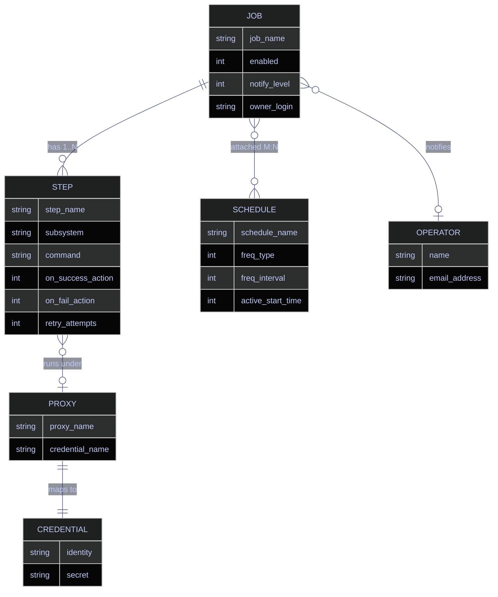
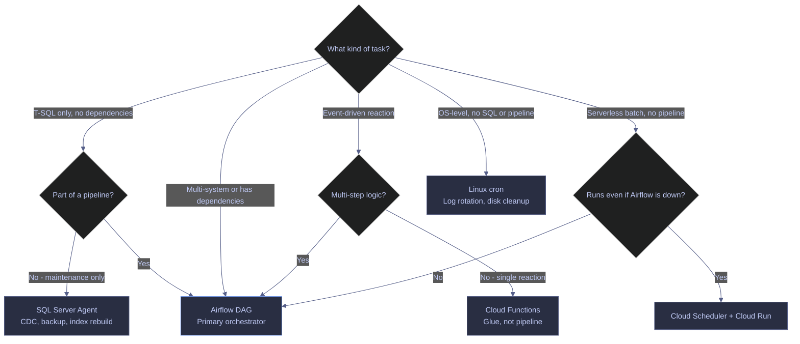

# SQL Server Agent Jobs — Built-In Task Scheduling

> [!quote]
> "If you're doing something more than once, automate it. The first rule of ops is: never do manually what a scheduled job can do for you."
>
> — **Tom Limoncelli**, *The Practice of System and Network Administration*

SQL Server Agent is the built-in job scheduling engine for SQL Server. On Windows, it runs as a dedicated Windows service (`SQLSERVERAGENT` for the default instance, `SQLAgent$<instance>` for named instances). On Linux (SQL Server 2017+), it runs in-process within the SQL Server engine itself — there is no separate service. All job metadata — definitions, steps, schedules, history — is stored in the `msdb` system database.

Agent handles maintenance tasks (backups, index rebuilds, statistics updates), CDC log readers, replication agents, and custom T-SQL automation. On Linux, it ships disabled by default and requires explicit enabling. Understanding when to use Agent vs [Airflow](https://alp78.github.io/elysium/12-Orchestration/Airflow/airflow-dag-patterns) vs cron vs GCP serverless triggers is essential for a clean operations architecture.

---

## SQL Server Agent on Linux — Enabling and Configuring

SQL Server on Linux ships with Agent disabled. Unlike Windows — where Agent is a standalone Windows service that starts automatically — on Linux, Agent runs in-process within the SQL Server engine and must be explicitly enabled via `mssql-conf`. Once enabled, Agent supports only a subset of the Windows subsystems: `TSQL` and replication agents (Distribution, Snapshot, LogReader, Merge). CmdExec, PowerShell, SSIS, and SSAS steps are not available on Linux.

### Linux | mssql-conf | enable SQL Server Agent

> [!info] Agent is Disabled by Default
>
> SQL Server on Linux ships with Agent disabled. You must explicitly enable it and restart the service. Without Agent, CDC log reader jobs, backup schedules, and index maintenance jobs will not run.

#### Enable Agent via mssql-conf

The `mssql-conf` utility writes the setting to `/var/opt/mssql/mssql.conf`. The change does not take effect until the service is restarted.

```bash
sudo /opt/mssql/bin/mssql-conf set sqlagent.enabled true
```

#### Restart SQL Server to apply the change

Agent runs in-process, so restarting SQL Server also starts Agent. There is no separate Agent service to manage on Linux.

```bash
sudo systemctl restart mssql-server
```

#### Verify Agent is running

Check the service status. The output should show `active (running)`. If Agent failed to start, the error appears in `/var/opt/mssql/log/sqlagent.out`.

```bash
sudo systemctl status mssql-server
```

#### Verify Agent subsystems are loaded

Query `msdb.dbo.syssubsystems` to confirm which subsystems Agent registered. On Linux, expect `TSQL` and replication subsystems only. On Windows, this returns all 11 subsystems (TSQL, CmdExec, PowerShell, SSIS, ANALYSISQUERY, ANALYSISCOMMAND, Distribution, Snapshot, LogReader, Merge, QueueReader).

```sql
SELECT subsystem, description_id, agent_exe
FROM msdb.dbo.syssubsystems;
```

> [!info] Column Reference
>
> | Column | Meaning |
> |---|---|
> | `subsystem` | Token name for the registered subsystem. Windows values: `TSQL`, `CmdExec`, `PowerShell`, `SSIS`, `ANALYSISQUERY`, `ANALYSISCOMMAND`, `Distribution`, `Snapshot`, `LogReader`, `Merge`, `QueueReader`. Linux values: `TSQL` and replication subsystems only (`Distribution`, `Snapshot`, `LogReader`, `Merge`). Missing entries confirm which subsystems are unavailable on the current platform. |
> | `description_id` | Integer key into `msdb.dbo.syssubsystemslocales` for the localized description string. Not directly useful for diagnostics — use `subsystem` for identification. |
> | `agent_exe` | Full path to the subsystem executable on disk. A populated path confirms the binary exists. On Linux, replication agent executables are in `/opt/mssql/bin/`. A NULL or non-existent path means the subsystem will fail at job step start. |

> [!warning] Agent on Linux — restricted subsystems
>
> SQL Server Agent on Linux supports **only TSQL and replication subsystems** (Distribution, Snapshot, LogReader, Merge). CmdExec, PowerShell, SSIS, and SSAS are **not available** on Linux. Alerts (SQL Server event, performance condition, WMI) are also unsupported on Linux. If your job needs shell commands, Python, .NET, or GCP SDK calls — it cannot run in Agent on Linux.

> [!success] Use Airflow for non-T-SQL automation
>
> Move non-T-SQL automation to Airflow. Airflow's `BashOperator` runs shell scripts, `PythonOperator` runs Python directly, and `MsSqlOperator` executes T-SQL — covering everything Agent supports and more, with dependency tracking, retry with backoff, and alerting. For jobs that must run even if Airflow is down, consider Cloud Scheduler + Cloud Run.

### Docker | MSSQL_AGENT_ENABLED | enable Agent in containers

For containerized SQL Server (e.g., on Cloud Run or local dev), Agent is controlled via the `MSSQL_AGENT_ENABLED` environment variable at container startup. This is equivalent to `mssql-conf set sqlagent.enabled true` but applied before the first boot.

```bash
docker run -e "ACCEPT_EULA=Y" \
    -e "MSSQL_SA_PASSWORD=YourPassword" \
    -e "MSSQL_AGENT_ENABLED=true" \
    -p 1433:1433 \
    mcr.microsoft.com/mssql/server:2022-latest
```

| Variable | Required | Description |
|---|---|---|
| `ACCEPT_EULA` | Yes | Must be `Y` to accept the license |
| `MSSQL_SA_PASSWORD` | Yes | SA password (min 8 chars, complexity required) |
| `MSSQL_AGENT_ENABLED` | No | `true` to enable Agent at startup (default: disabled) |
| `MSSQL_PID` | No | Edition: `Developer` (default), `Express`, `Standard`, `Enterprise`, or product key |
| `MSSQL_COLLATION` | No | Server collation (default: `SQL_Latin1_General_CP1_CI_AS`) |
| `MSSQL_MEMORY_LIMIT_MB` | No | Max memory in MB (default: unlimited) |

---

## Agent Architecture

SQL Server Agent is built around four core objects — jobs, steps, schedules, and operators — all persisted in the `msdb` system database. Understanding this object model is essential for creating, debugging, and monitoring Agent jobs. The `msdb` database is one of four system databases (along with `master`, `model`, and `tempdb`) and acts as the metadata store for Agent, Database Mail, log shipping, SSIS packages, and maintenance plans.

### Agent | object model | jobs, steps, schedules, operators

Every Agent job is composed of four objects that work together. Three `msdb` fixed database roles control who can create, view, and manage jobs:

- **`SQLAgentUserRole`** — can manage only their own jobs
- **`SQLAgentReaderRole`** — can view all jobs (read-only on others' jobs)
- **`SQLAgentOperatorRole`** — can enable/disable, start/stop any job

> [!info] Agent object model
>
> All metadata lives in the `msdb` database. The key tables are `dbo.sysjobs` (job definitions), `dbo.sysjobsteps` (step definitions), `dbo.sysschedules` (schedule definitions), and `dbo.sysjobhistory` (execution log). Querying `msdb` is how you monitor and debug Agent.

- **Job:** a named unit of work (e.g., "Nightly Backup"). Stored in `msdb.dbo.sysjobs`. Each job has an owner (`owner_sid`) and a notification level controlling whether success/failure is logged, emailed, or both.
- **Step:** one action within a job. Each step specifies a subsystem (`TSQL`, `CmdExec`, `PowerShell`, etc.), a command to execute, and routing logic: `@on_success_action` and `@on_fail_action` control what happens next — quit with success (1), quit with failure (2), go to the next step (3), or jump to a specific step ID (4). This routing enables conditional branching within a job.
- **Schedule:** when the job runs. Supports one-time, recurring (daily/weekly/monthly), on Agent startup, and on CPU idle triggers. Schedules are reusable — one schedule can be attached to multiple jobs, and one job can have multiple schedules. Minimum granularity is 10 seconds for sub-day recurrence.
- **Operator:** who to notify on success/failure/completion. Operators receive notifications via Database Mail (email). Database Mail must be configured separately — it uses Service Broker to queue and send SMTP messages asynchronously.



### Agent | proxy accounts | security context for non-T-SQL steps

T-SQL job steps run under the Agent service account by default. All other subsystems (CmdExec, PowerShell, SSIS, SSAS, replication) require a **proxy account** — a named object that maps to a SQL Server credential, which in turn maps to an OS-level identity (Windows login or Linux user). Without a proxy, non-T-SQL steps fail with a permissions error.

> [!warning] Proxy scope
>
> Each proxy is scoped to specific subsystems. A proxy granted access to `CmdExec` cannot run `PowerShell` steps unless explicitly granted. Grant the minimum subsystems needed.

> [!success] Use least-privilege proxies
>
> Create a dedicated proxy per workload type (e.g., one for backup scripts, one for ETL). Map each to a credential with only the permissions that workload requires. Never reuse the Agent service account credential for CmdExec steps — if that account is compromised, every CmdExec job is compromised.

---

## Creating and Managing Jobs

Agent jobs are created and managed via the `sp_add_*` family of stored procedures in `msdb`. The standard pattern is: create the job (`sp_add_job`), add one or more steps (`sp_add_jobstep`), create or reuse a schedule (`sp_add_schedule`), attach the schedule to the job (`sp_attach_schedule`), and bind the job to a server (`sp_add_jobserver`). All five calls are required for a functional scheduled job.

### T-SQL | sp_add_job + sp_add_jobstep | create a maintenance job

The `sp_add_job` procedure creates the job container. The `sp_add_jobstep` procedure adds individual steps to it. Each step specifies which subsystem to use (default: `TSQL`), the command to execute, and the target database.

#### Create the job

`sp_add_job` registers a new job in `msdb.dbo.sysjobs`. The `@enabled` parameter controls whether the job is active (1) or paused (0). The `@notify_level_eventlog` parameter defaults to 2 (log on failure).

```sql
EXEC msdb.dbo.sp_add_job
    @job_name = N'Weekly Index Maintenance',
    @enabled = 1,
    @description = N'Rebuild fragmented indexes on silver and gold schemas';
```

#### Add a T-SQL step

Each step runs under the specified subsystem. `ONLINE = ON` keeps the index available during rebuild (Enterprise edition only). `MAXDOP = 2` limits parallelism to 2 cores, reducing contention with concurrent queries.

```sql
EXEC msdb.dbo.sp_add_jobstep
    @job_name = N'Weekly Index Maintenance',
    @step_name = N'Rebuild silver indexes',
    @subsystem = N'TSQL',
    @command = N'
        ALTER INDEX ALL ON silver.index_dim REBUILD
            WITH (ONLINE = ON, MAXDOP = 2);
        ALTER INDEX ALL ON silver.signals_daily REBUILD
            WITH (ONLINE = ON, MAXDOP = 2);
    ',
    @database_name = N'analytics_db';
```

| Parameter | Type | Description |
|---|---|---|
| `@job_name` | nvarchar(128) | Required. Must be unique. Cannot contain `%`. |
| `@enabled` | tinyint | 1 = enabled (default), 0 = disabled |
| `@description` | nvarchar(512) | Free text (default: `'No description available'`) |
| `@start_step_id` | int | Which step to start from (default: 1) |
| `@owner_login_name` | sysname | Only `sysadmin` can set for other users |
| `@notify_level_eventlog` | int | 0 = never, 1 = success, 2 = failure (default), 3 = always |
| `@step_name` | sysname | Required per step. Unique within the job. |
| `@subsystem` | nvarchar(40) | `TSQL` (default), `CmdExec`, `PowerShell`, `SSIS`, etc. |
| `@command` | nvarchar(max) | The T-SQL, shell command, or package reference to execute |
| `@database_name` | sysname | Target database for TSQL steps (default: `master`) |
| `@on_success_action` | tinyint | 1 = quit success (default), 2 = quit failure, 3 = next step, 4 = go to step ID |
| `@on_fail_action` | tinyint | 1 = quit success, 2 = quit failure (default), 3 = next step, 4 = go to step ID |
| `@retry_attempts` | int | Number of retries on failure (default: 0) |
| `@retry_interval` | int | Minutes between retries (default: 0) |
| `@output_file_name` | nvarchar(200) | Log step output to file (valid for TSQL, CmdExec, PowerShell, SSIS) |
| `@proxy_name` | sysname | Proxy account for non-TSQL steps (TSQL runs as Agent service account) |

### T-SQL | sp_add_schedule | attach a schedule to a job

Schedules define when a job runs. They are reusable — one schedule can drive multiple jobs, and one job can have multiple schedules. After creating a schedule, attach it to the job with `sp_attach_schedule`, then bind the job to the local server with `sp_add_jobserver` (required before the job can execute).

#### Create the schedule

The `@freq_type` parameter defines the recurrence pattern. For weekly schedules (`freq_type = 8`), `@freq_interval` is a bitmask where each bit represents a day (1 = Sunday, 2 = Monday, 4 = Tuesday, ..., 64 = Saturday). Combine with bitwise OR for multiple days. `@active_start_time` uses `HHMMSS` format (no separators).

```sql
EXEC msdb.dbo.sp_add_schedule
    @schedule_name = N'Weekly Sunday 3am',
    @freq_type = 8,
    @freq_interval = 1,
    @active_start_time = 030000;
```

#### Attach schedule to job

A schedule has no effect until attached to at least one job. Attaching is a many-to-many relationship stored in `msdb.dbo.sysjobschedules`.

```sql
EXEC msdb.dbo.sp_attach_schedule
    @job_name = N'Weekly Index Maintenance',
    @schedule_name = N'Weekly Sunday 3am';
```

#### Assign job to local server

Every job must be bound to a target server before it can run. For single-server setups, use `@server_name = N'(local)'` (the default when omitted).

```sql
EXEC msdb.dbo.sp_add_jobserver
    @job_name = N'Weekly Index Maintenance';
```

**`freq_type` reference:**

| `freq_type` | Meaning | `freq_interval` interpretation |
|---|---|---|
| `1` | Once | Unused |
| `4` | Daily | Every N days |
| `8` | Weekly | Bitmask: 1=Sun, 2=Mon, 4=Tue, 8=Wed, 16=Thu, 32=Fri, 64=Sat |
| `16` | Monthly | Day N of the month |
| `32` | Monthly relative | 1=Sun, 2=Mon, ..., 8=Day, 9=Weekday, 10=Weekend day |
| `64` | On Agent startup | Unused |
| `128` | On CPU idle | Unused (not supported on Azure SQL MI) |

**Sub-day recurrence** (`freq_subday_type`): 1 = at specified time, 2 = seconds, 4 = minutes, 8 = hours. Minimum sub-day interval is 10 seconds. Use `freq_recurrence_factor` to skip weeks or months between executions (e.g., `freq_recurrence_factor = 2` with `freq_type = 8` = every other week).

### T-SQL | Agent backup job | full DDL example

This is a complete, end-to-end example of an Agent job that performs a nightly full backup. See [backup-types-and-strategy](https://alp78.github.io/elysium/04-SQL-Server/Administration/backup-types-and-strategy) for backup theory and the 3-2-1 rule.

#### Create the backup job

```sql
EXEC msdb.dbo.sp_add_job @job_name = N'Nightly Full Backup';
```

#### Add the backup step

The `BACKUP DATABASE` command runs in the context of `master`. `INIT` overwrites any existing backup in the file. `COMPRESSION` reduces backup size (typically 5–7x for data-heavy databases). `CHECKSUM` writes a checksum into the backup for integrity verification during restore. Note the doubled single quotes (`''`) — required because the command string is itself enclosed in `N'...'`.

```sql
EXEC msdb.dbo.sp_add_jobstep
    @job_name = N'Nightly Full Backup',
    @step_name = N'Backup analytics_db',
    @subsystem = N'TSQL',
    @command = N'
        BACKUP DATABASE analytics_db
        TO DISK = N''/var/opt/mssql/backup/analytics_db_full.bak''
        WITH INIT, COMPRESSION, CHECKSUM;
    ',
    @database_name = N'master';
```

#### Schedule for nightly execution

`freq_type = 4` means daily. `freq_interval = 1` means every 1 day. `active_start_time = 020000` means 02:00:00 (2 AM).

```sql
EXEC msdb.dbo.sp_add_schedule
    @schedule_name = N'Nightly 2am',
    @freq_type = 4,
    @freq_interval = 1,
    @active_start_time = 020000;
```

#### Attach and activate

```sql
EXEC msdb.dbo.sp_attach_schedule
    @job_name = N'Nightly Full Backup',
    @schedule_name = N'Nightly 2am';

EXEC msdb.dbo.sp_add_jobserver
    @job_name = N'Nightly Full Backup';
```

### T-SQL | sysjobhistory | view job execution history

Job history is stored in `msdb.dbo.sysjobhistory`. Each row represents one step execution. Rows with `step_id = 0` are job-level summary records. The `run_status` column encodes the outcome: 0 = Failed, 1 = Succeeded, 2 = Retry, 3 = Canceled, 4 = In Progress. The `run_duration` column uses `HHMMSS` integer format (e.g., `13042` = 1 hour 30 minutes 42 seconds).

> [!tip] History retention
>
> By default, Agent retains up to 1000 rows per job and 100,000 total rows. Use `sp_purge_jobhistory` to clean old records, or configure retention via SSMS → SQL Server Agent → Properties → History. For long-running production systems, purge history older than 30–90 days to prevent `msdb` bloat.

#### Query recent job results

```sql
SELECT j.name AS job_name,
       h.step_name,
       h.run_status,
       h.run_date,
       h.run_time,
       h.run_duration,
       h.message
FROM msdb.dbo.sysjobhistory h
JOIN msdb.dbo.sysjobs j ON h.job_id = j.job_id
WHERE h.run_date >= CONVERT(INT, CONVERT(VARCHAR(8), DATEADD(DAY, -7, GETDATE()), 112))
ORDER BY h.run_date DESC, h.run_time DESC;
```

> [!info] Column Reference
>
> | Column | Source | Meaning |
> |---|---|---|
> | `job_name` | `msdb.dbo.sysjobs.name` | Job name as defined in `sp_add_job`. Rows with `step_id = 0` are job-level summary records; rows with `step_id ≥ 1` are per-step records. |
> | `step_name` | `msdb.dbo.sysjobhistory.step_name` | Name of the specific step. For job-level rows (`step_id = 0`), this contains `(Job outcome)`. |
> | `run_status` | `msdb.dbo.sysjobhistory.run_status` | Integer outcome code. See table below for all values. |
> | `run_date` | `msdb.dbo.sysjobhistory.run_date` | Execution date as a `YYYYMMDD` integer (e.g., `20260405`). The `WHERE` clause uses `CONVERT(INT, CONVERT(VARCHAR(8), GETDATE(), 112))` to produce the same format. |
> | `run_time` | `msdb.dbo.sysjobhistory.run_time` | Start time as a `HHMMSS` integer (e.g., `143000` = 14:30:00). Requires `CONVERT` for display. |
> | `run_duration` | `msdb.dbo.sysjobhistory.run_duration` | Elapsed time as a `HHMMSS` integer (e.g., `13042` = 1h 30m 42s). Convert: hours = `run_duration / 10000`, minutes = `(run_duration % 10000) / 100`, seconds = `run_duration % 100`. |
> | `message` | `msdb.dbo.sysjobhistory.message` | Step output text or error message (max 1,024 characters). Longer outputs silently truncated. |

| `run_status` | Meaning |
|---|---|
| `0` | Failed |
| `1` | Succeeded |
| `2` | Retry |
| `3` | Canceled |
| `4` | In Progress |

### T-SQL | sp_help_jobactivity | monitor running jobs

`sp_help_jobactivity` returns a snapshot of all jobs with their last execution status, next scheduled run, and whether they are currently running. This is the quickest way to check for stuck or long-running jobs.

```sql
EXEC msdb.dbo.sp_help_jobactivity;
```

---

## Built-In Agent Jobs (Created by Other Features)

Several SQL Server features create their own Agent jobs automatically when enabled. These jobs are critical infrastructure — disabling or deleting them breaks the feature they support. Understanding which jobs exist and what they do prevents accidental interference during maintenance.

### Agent | built-in jobs | CDC, backup, and AG

> [!warning] Don't Disable These Jobs
>
> These jobs are created automatically by SQL Server features. Disabling or deleting them breaks the feature they support.

> [!success] Verify Built-In Jobs Are Running After Every Restart
>
> Add a post-restart check to your runbook: `SELECT name, enabled FROM msdb.dbo.sysjobs WHERE name LIKE 'cdc%' OR name LIKE '%backup%';` — all built-in CDC and backup jobs must show `enabled = 1`. If any are disabled, re-enable them with `EXEC msdb.dbo.sp_update_job @job_name = N'...', @enabled = 1;`.

| Feature | Jobs Created | What Happens If Stopped |
|---------|-------------|------------------------|
| CDC (`sp_cdc_enable_db`) | CDC log reader, CDC cleanup | Changes accumulate in transaction log → log fills up |
| Log Shipping | Copy job, Restore job | Secondary database falls behind, DR gap grows |
| Availability Groups | AG health check | AG monitoring goes blind, failover detection delayed |

- **CDC log reader:** reads the transaction log and populates `cdc.*` change tables. See [sql-server-change-tracking > Change Data Capture (CDC)](https://alp78.github.io/elysium/04-SQL-Server/Patterns/sql-server-change-tracking#change-data-capture-cdc) for CDC details
- **CDC cleanup:** purges change table rows older than the configured retention. Without it, change tables grow unbounded
- **Monitor with:** `SELECT * FROM msdb.dbo.cdc_jobs;` to check CDC job status

---

## Job Triggering in the GCP + SQL Server Stack

This is the most important section of the page. Five different ways to trigger work exist in this stack. Each has a legitimate use case. Using the wrong one creates operational confusion, split ownership, and debugging nightmares.

### Stack | five triggering methods | full comparison

> [!info] Triggering methods in the stack
>
> Each method has different strengths. The comparison below covers not just what they CAN do, but what they SHOULD do given the rest of the stack.

| Method | Where It Runs | Trigger Types | Retry | Dependencies | Observability |
|--------|---------------|---------------|-------|-------------|---------------|
| **SQL Server Agent** | Inside SQL Server | Schedule, Alert, T-SQL | Basic (retry count) | None (flat list) | msdb + Datadog |
| **Linux cron** | VM OS | Schedule only | None | None | syslog |
| **Airflow** | Airflow VM | Schedule, API, sensor, dataset | Full (exp. backoff) | DAG dependencies | Airflow UI + Datadog |
| **Cloud Scheduler + Cloud Run** | GCP serverless | Schedule, Pub/Sub, HTTP | Built-in | Via Pub/Sub | Cloud Logging |
| **Cloud Functions** | GCP serverless | Pub/Sub, Firestore, HTTP, GCS | Built-in | Event-driven only | Cloud Logging |

### Stack | scenario-based decision | when to use each

> [!tip] The ownership principle
>
> Each job has exactly ONE owner. If you can't immediately answer "who is responsible for this job?" — you have an ownership problem. The decision framework below assigns ownership clearly.

**SQL Server Agent — things only SQL Server can do:**

- CDC log reader and cleanup (Agent owns these — created by `sp_cdc_enable_db`)
- Nightly `BACKUP DATABASE` to local disk (the backup command is SQL Server-internal)
- Weekly `ALTER INDEX REBUILD` / `UPDATE STATISTICS` (must run inside SQL Server)
- Database mail alerts on error conditions
- Any T-SQL job that MUST run even if Airflow is down

**Linux cron — OS-level tasks unrelated to SQL Server or pipelines:**

- Log rotation (`logrotate`, `find -mtime +30 -delete`)
- Disk space monitoring scripts
- `gcloud` snapshot automation (if not Terraformed)
- `certbot` TLS certificate renewal

> [!warning] cron is invisible
>
> cron has no UI, no alerting, no retry, no dependency management. A failed cron job disappears into syslog. Use cron only for tasks where failure is obvious (disk fills up) or non-critical (cleanup). Never use cron for pipeline-critical tasks.

> [!success] Make cron Failures Visible
>
> For any cron job that must not silently fail, add a notification line: `your-script.sh || echo "FAILURE: script failed at $(date)" | mail -s "cron alert" ops@company.com`. For pipeline-critical tasks, move the job to Airflow instead — even a single-task DAG gives you retry, logging, and a visible failure state in the UI.

**Airflow — anything that orchestrates multiple systems or needs dependencies:**

This is the primary orchestrator in the stack. [Airflow](https://alp78.github.io/elysium/12-Orchestration/Airflow/airflow-dag-patterns) owns:

- Bronze loading pipelines (fetch from yfinance → load to SQL Server)
- Silver/gold transforms (trigger Python scripts that read/write SQL Server)
- Cross-system workflows (SQL Server → BigQuery replication, SQL Server → Firestore sync)
- dbt runs (`BashOperator` or `DbtCloudRunJobOperator`)
- Any multi-step process where step 2 depends on step 1 succeeding
- Any job that needs alerting, SLA monitoring, or retry with backoff

> [!danger] Do not split pipeline ownership
>
> If Airflow loads bronze and Agent runs silver transforms, you have TWO systems to debug when the pipeline fails. One person checks the Airflow UI and sees green. Another checks Agent history and sees red. Neither sees the full picture. Rule: if a task is PART of a pipeline, Airflow owns it — even if the task itself is a T-SQL script. Airflow can execute T-SQL via `MsSqlOperator` or by calling a Python script that uses pyodbc.

> [!success] Consolidate Pipeline Steps in Airflow
>
> If you have Agent jobs that are part of the pipeline (silver transforms, statistics updates after load), migrate them to Airflow tasks in the same DAG. Use `MsSqlOperator` or a `PythonOperator` calling pyodbc. The Agent jobs can remain for non-pipeline maintenance (CDC, backup, index rebuild), but the pipeline chain must be a single unbroken Airflow DAG.

**Cloud Scheduler + Cloud Run — serverless batch tasks outside the pipeline:**

- Lightweight periodic jobs that run a Docker container (e.g., a Python script that checks an API)
- Tasks that must run even if the Airflow VM is stopped (cost-saving weekends)
- Jobs that scale to zero between runs (no idle VM cost)
- HTTP-triggered tasks that other GCP services need to invoke

This example creates a Cloud Scheduler job that publishes a message to a Pub/Sub topic at 2 AM daily, which in turn triggers a Cloud Run Job.

```bash
gcloud scheduler jobs create pubsub nightly-export \
    --schedule="0 2 * * *" \
    --topic=pipeline-triggers \
    --message-body='{"task": "export-to-bigquery"}' \
    --time-zone="Europe/Prague"
```

> [!tip] Cloud Run vs Airflow for batch jobs
>
> Cloud Run Jobs are cheaper for infrequent, isolated tasks (runs 5 minutes once a day = pennies). But they have no dependency graph — if task B depends on task A, you need to wire that yourself via Pub/Sub or Workflows. If you already have Airflow running, just add a task to the DAG. Cloud Run Jobs shine for jobs OUTSIDE the main pipeline — monitoring scripts, cleanup routines, one-off data exports.

**Cloud Functions — event-driven reactions, not scheduled work:**

- Firestore trigger: stock metadata changes → Cloud Function → rebuild a cache
- Pub/Sub trigger: CDC message arrives → Cloud Function → write to BigQuery
- GCS trigger: new file lands in bucket → Cloud Function → notify Airflow
- HTTP trigger: external webhook → Cloud Function → insert into SQL Server

```python
# Cloud Function triggered by Firestore document change
@functions_framework.cloud_event
def on_stock_update(cloud_event):
    """Triggered when a document in 'stocks' collection changes."""
    data = cloud_event.data
    symbol = data["value"]["fields"]["symbol"]["stringValue"]
    sector = data["value"]["fields"]["sector"]["stringValue"]

    # Push to Pub/Sub for downstream consumers
    publisher = pubsub_v1.PublisherClient()
    topic = publisher.topic_path("my-project", "dimension-changes")
    publisher.publish(topic, json.dumps({
        "symbol": symbol, "sector": sector
    }).encode("utf-8"))
```

> [!warning] Cloud Functions are not orchestrators
>
> Cloud Functions react to events. They don't manage dependencies, retries with backoff, or SLAs. If a Function fails, it retries (or doesn't, depending on trigger type) — but nobody gets paged. Use Functions as the glue between events, not as pipeline steps.

> [!success] Wire Cloud Functions to Pub/Sub Alerting
>
> For any Cloud Function doing important work (writing to SQL Server, publishing to downstream topics), add a dead-letter topic and a Cloud Monitoring alert on the DLQ message count. This gives visibility when Functions fail silently. For multi-step logic, use Cloud Workflows or move the orchestration to Airflow.

### Stack | architecture diagram | job triggering lanes

Each system has a clear lane. Overlap between lanes is where incidents happen.

```mermaid
%%{init: {'theme': 'dark', 'themeVariables': {
  'primaryColor': '#292e42',
  'primaryTextColor': '#c0caf5',
  'primaryBorderColor': '#565f89',
  'lineColor': '#565f89',
  'secondaryColor': '#1a1b26',
  'tertiaryColor': '#24283b',
  'noteTextColor': '#c0caf5',
  'noteBkgColor': '#292e42',
  'textColor': '#c0caf5',
  'fontSize': '14px'
}}}%%
flowchart LR
    subgraph lane1["SQL Server Agent"]
        A1[CDC log reader] --> SQL[(SQL Server)]
        A2[Backup jobs] --> SQL
        A3[Index maintenance] --> SQL
    end

    subgraph lane2["Airflow DAGs"]
        AF[Airflow] -->|pyodbc / MsSqlOperator| SQL
        AF -->|dbt run| SQL
        AF -->|bq client| BQ[(BigQuery)]
        AF -->|Firestore client| FS[(Firestore)]
    end

    subgraph lane3["GCP Serverless"]
        CS[Cloud Scheduler] -->|Pub/Sub| CR[Cloud Run Jobs]
        EV[Firestore / Pub/Sub / GCS triggers] --> CF[Cloud Functions]
    end

    subgraph lane4["Linux OS"]
        CRON[cron] --> LR2[Log rotation]
        CRON --> DC[Disk cleanup]
    end

    style lane1 fill:#1a1b26,stroke:#565f89
    style lane2 fill:#1a1b26,stroke:#565f89
    style lane3 fill:#1a1b26,stroke:#565f89
    style lane4 fill:#1a1b26,stroke:#565f89
```



### Stack | decision flowchart | which triggering method to use

Use this flowchart to determine which triggering method owns a given task.



---

## Anti-Patterns

Every anti-pattern below has been seen in production. Each one caused an incident or extended an outage. The common thread: ambiguous ownership, invisible failures, and resource contention.

> [!tip] Job inventory audit
>
> List every scheduled task (Agent, cron, Airflow, Cloud Scheduler) in a single spreadsheet with its owner, trigger, and dependencies. Any pipeline task not in Airflow is a candidate for migration. Any cron job touching the database is a candidate for Agent or Airflow. Resolve ambiguity before the next incident — not during it.

### Anti-pattern | split pipeline ownership | Agent and Airflow

Bronze loads in Airflow, silver transforms in Agent. When silver fails, the Airflow DAG shows green. Nobody notices for days. Agent has no dependency management — if `transform_silver` depends on `load_bronze` completing first, Agent cannot express that dependency. You end up with fragile time-based scheduling ("run silver 30 minutes after bronze") that breaks when bronze takes longer than expected.

> [!danger] Split ownership hides failures
>
> Two systems means two places to debug. One person checks the Airflow UI and sees green. Another checks Agent history and sees red. Neither sees the full picture. Rule: if a task is PART of a pipeline, Airflow owns it — even if the task itself is a T-SQL script.

> [!success] Consolidate in Airflow
>
> Migrate pipeline Agent jobs (silver transforms, statistics updates after load) to Airflow tasks in the same DAG. Use `MsSqlOperator` or `PythonOperator` with pyodbc. Agent retains non-pipeline maintenance (CDC, backup, index rebuild), but the pipeline chain must be a single unbroken DAG.

### Anti-pattern | silent job failures | no alerting configured

Agent jobs fail silently by default — the result goes into `sysjobhistory` but nobody is notified. A job that fails silently for weeks is worse than a job that doesn't exist.

> [!danger] Silent failures accumulate
>
> Without notification, a failed CDC cleanup job quietly lets change tables grow until the disk fills. A failed backup job means no restore point when disaster strikes.

> [!success] Configure notifications at every level
>
> Set `@notify_level_eventlog = 2` (log on failure) on every job. Configure Database Mail + Operators for email alerts. Forward the SQL Server error log to Cloud Logging for GCP-side visibility. Use the Datadog `sqlserver.agent.job.failed` metric for paging.

### Anti-pattern | cron for pipeline-critical tasks

cron has no alerting, no retry, no UI. A cron job failing at 3 AM is invisible until the dashboard shows stale data the next morning.

> [!danger] cron failures are invisible
>
> Failed cron jobs disappear into syslog. There is no retry, no dependency graph, no visual status.

> [!success] Move pipeline tasks to Airflow
>
> Even a single-task DAG gives you retry, logging, and a visible failure state. Reserve cron for true OS-level tasks (log rotation, disk cleanup) where failure is obvious or non-critical.

### Anti-pattern | Cloud Functions as pipeline steps

Cloud Functions are stateless, have a 9-minute timeout (gen1) or 60-minute timeout (gen2), and have no dependency graph. A five-step pipeline in Cloud Functions is five independent retry-or-fail endpoints with no coordination.

> [!danger] No coordination between Functions
>
> Each Function fires independently. If step 3 fails, steps 4 and 5 still run on stale data. There is no rollback, no SLA tracking, no visual status.

> [!success] Use Functions as glue, not pipeline
>
> Cloud Functions excel at single-event reactions (Firestore trigger → cache rebuild). For multi-step logic, use Cloud Workflows or move orchestration to Airflow.

### Anti-pattern | CmdExec steps with hardcoded paths

Agent CmdExec steps referencing `/home/alex/scripts/backup.sh` break on VM migration, OS upgrade, or user change.

> [!danger] Hardcoded paths are brittle
>
> Any infrastructure change (new VM, user rename, OS upgrade) silently breaks the job.

> [!success] Use well-known locations
>
> Store scripts in `/opt/mssql/scripts/` or another path that survives infrastructure changes. For CmdExec steps calling external APIs (`curl`, `python3`, `gcloud`), move the logic to Airflow where logs are first-class and retries are configurable.

### Anti-pattern | overlapping resource-intensive schedules

Agent backup at 02:00 and Airflow pipeline at 02:05 both hit the same disk. The backup holds locks on data files while the pipeline tries to write.

> [!danger] I/O contention from overlapping schedules
>
> Concurrent disk-intensive operations (backup, index rebuild, bulk insert) cause mutual slowdown and can trigger timeouts or deadlocks.

> [!success] Stagger and document all schedules
>
> Maintain at least 30-minute gaps between resource-intensive jobs. Document all schedules in a single registry (spreadsheet, Confluence page, or Terraform config) so no team schedules jobs in ignorance of what else runs at that time.

---

## Monitoring Agent Jobs from GCP

Agent job results live in `msdb.dbo.sysjobhistory`, but msdb is invisible outside SQL Server. For unified observability across the GCP + SQL Server stack, job failures must be forwarded through the SQL Server error log into Cloud Logging and Datadog.

### GCP | Agent → Cloud Logging → Datadog | observability pipeline

The three-stage pipeline for Agent observability:

1. **SQL Server error log** — Agent writes job failures to the error log automatically. On Linux, this is at `/var/opt/mssql/log/errorlog`.
2. **Cloud Logging agent** — the Ops Agent (`google-cloud-ops-agent`) on the VM captures the error log and forwards entries to Cloud Logging. Failures become searchable and alertable in the GCP console.
3. **Datadog SQL Server integration** — Datadog's native SQL Server check monitors Agent job status via the `sqlserver.agent.job.failed` metric. See [datadog-sql-server-integration](https://alp78.github.io/elysium/13-Observability/Datadog/datadog-sql-server-integration) for setup.

For custom alerting beyond Datadog's built-in metrics, query `sysjobhistory` for `run_status = 0` (failed) and push results to Pub/Sub for downstream alerting.

#### Query failed jobs in the last 24 hours

This query surfaces all failed job executions. Use it as the basis for a custom monitoring script or an Airflow sensor that checks Agent health.

```sql
SELECT j.name, h.step_name, h.message, h.run_date, h.run_time
FROM msdb.dbo.sysjobhistory h
JOIN msdb.dbo.sysjobs j ON h.job_id = j.job_id
WHERE h.run_status = 0
  AND h.run_date >= CONVERT(INT, CONVERT(VARCHAR(8), DATEADD(DAY, -1, GETDATE()), 112));
```

> [!info] Column Reference
>
> | Column | Meaning |
> |---|---|
> | `j.name` | Job name from `msdb.dbo.sysjobs`. Identifies which Agent job failed. |
> | `step_name` | Name of the step that failed. For a job-level failure summary, the value is `(Job outcome)`. |
> | `message` | Error output for the failed step (max 1,024 characters). For TSQL steps, contains the SQL Server error message. For CmdExec steps, the last 1,024 characters of stderr. |
> | `run_date` | Execution date as a `YYYYMMDD` integer (e.g., `20260405`). The `WHERE` clause converts `GETDATE()` minus 1 day to the same integer format: `CONVERT(INT, CONVERT(VARCHAR(8), DATEADD(DAY, -1, GETDATE()), 112))`. |
> | `run_time` | Start time as a `HHMMSS` integer (e.g., `143000` = 14:30:00). Requires arithmetic or `CONVERT` for display. |
> | `run_status = 0` | Filter condition — returns only failed executions. Other values: `1` = Succeeded, `2` = Retry, `3` = Canceled, `4` = In Progress. |

