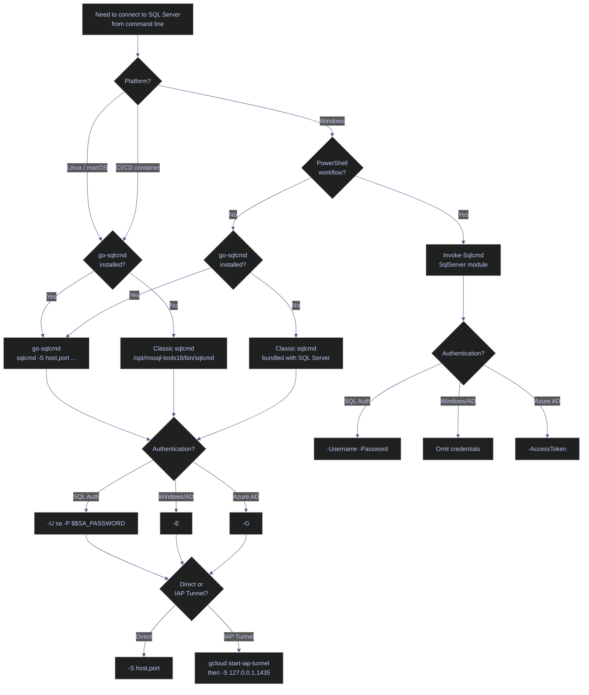
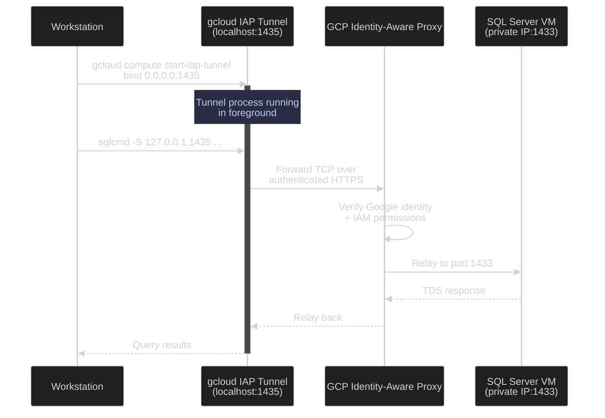

# sqlcmd Connection and Usage

> [!quote]
> "Graphical user interfaces make easy tasks easy, while command line interfaces make difficult tasks possible."
>
> — **William Shotts**, *The Linux Command Line*

`sqlcmd` is the primary command-line interface for SQL Server. It opens a connection to a SQL Server instance over the Tabular Data Stream (TDS) protocol and lets you execute ad-hoc T-SQL statements, run `.sql` script files, and export query results — all without a graphical tool like SSMS. Because it runs in a terminal, `sqlcmd` is the tool of choice for scripting production operations, CI/CD database migrations, cron-based backups, and incident-response diagnostics when a GUI is unavailable or impractical.

---

## Classic sqlcmd vs go-sqlcmd

Microsoft ships two distinct implementations of `sqlcmd`. Both accept the same core flags (`-S`, `-U`, `-P`, `-Q`, etc.), but they differ in driver dependency, default behavior, and advanced features. The classic (ODBC) variant ships with the `mssql-tools18` package on Linux and with SQL Server on Windows. The Go variant is a standalone binary with no ODBC dependency, written in Go and distributed independently.

| Aspect | Classic sqlcmd (ODBC) | go-sqlcmd (Go) |
|---|---|---|
| **Distribution** | Bundled with SQL Server / `mssql-tools18` | Standalone download, independent of SQL Server |
| **Path (Linux)** | `/opt/mssql-tools18/bin/sqlcmd` | User-installed, typically on `$PATH` as `sqlcmd` |
| **Driver** | Requires ODBC driver (`msodbcsql18`) | No ODBC dependency — uses pure-Go TDS driver |
| **Version check** | Prints "Microsoft (R) SQL Server Command Line Tool" | `sqlcmd --version` → e.g., `Version: 1.8.2` |
| **Modern subcommands** | No | Yes (`create`, `query`, `config`, `delete`, `open`) |
| **`-N` (encryption)** | Flag only — default is `optional` | Takes string: `strict`, `mandatory`, `optional`, `disable` |
| **`-R` (locale)** | Supported | Ignored — Go runtime has no user locale access |
| **`-I` (quoted identifiers)** | Works normally | Ignored — always `ON`; disable via `SET QUOTED_IDENTIFIER OFF` in script |
| **`-M` (multi-subnet failover)** | Must be explicitly specified | Ignored — always enabled |
| **Protocol negotiation** | Uses ODBC driver settings | `lpc` → `np` → `tcp` (skips `lpc` for remote hosts) |

> [!warning] Breaking Change in SQL Server 2025
>
> In the Go variant, `-N` defaults to `mandatory` encryption starting with SQL Server 2025 (17.x). In SQL Server 2022 and earlier, the default was `optional`. Scripts that omit `-N` and rely on unencrypted connections will fail after upgrading.

> [!success] Explicit Encryption Flag
>
> Always specify `-N` explicitly in automation scripts (`-N optional` or `-N mandatory`) so behavior is predictable across sqlcmd versions and SQL Server releases.

> [!tip] Use go-sqlcmd When Available
>
> `go-sqlcmd` is the actively developed variant. It adds secure password prompting, `--help`, vertical output (`--vertical`), driver-level logging (`--driver-logging-level`), and Azure AD authentication methods beyond basic `-G`. Install it if available on your platform.



---

## Connecting | Authentication and Database Selection

The connection command encodes everything: which server, which credentials, which database, and how to handle TLS. Getting this wrong is the most common reason for "cannot connect" errors. The `-S` flag specifies the server using a **comma** (not colon) to separate host and port — this is unique to SQL Server tooling. The `-U` / `-P` flags provide SQL Server Authentication credentials, where `-U` is the login name and `-P` is the password. The `sa` (system administrator) account is a built-in SQL Server login with `sysadmin` role membership that exists on every instance — in production, it should be renamed or disabled in favor of named logins with least-privilege access.

### Linux | sqlcmd | connection and queries

The classic sqlcmd binary on Linux lives at `/opt/mssql-tools18/bin/sqlcmd` and requires the ODBC driver (`msodbcsql18`). All examples below assume this path is on `$PATH` or use the full path.

#### sqlcmd -S -U -P -d | connect with SQL authentication

The basic connection specifies server, credentials, default database, TLS handling, and timeout. The `-C` flag trusts the server's TLS certificate without validating the certificate chain — required when the server uses a self-signed certificate, which is the default for SQL Server on Linux.

```bash
/opt/mssql-tools18/bin/sqlcmd \
  -S 10.132.0.2,1433 \
  -U sa \
  -P "$SA_PASSWORD" \
  -d analytics_db \
  -C \
  -l 30
```

> [!info] Core Connection Flags
>
> - `-S` — server address. Accepts `host`, `host,port`, `host\instance`, or `tcp:host,port`. Note the **comma** separator, not colon.
> - `-U` — SQL Server login username.
> - `-P` — password. Always pass via environment variable (`"$SA_PASSWORD"`), never hardcoded.
> - `-d` — default database for the session. Avoids issuing `USE <db>` after every connection.
> - `-C` — trust the server certificate. Required for self-signed certificates on Linux.
> - `-l` — login timeout in seconds. The default is **8 seconds**. Increase to 30 for slow networks or cross-region connections.

#### sqlcmd -Q | execute query inline and exit

The `-Q` flag (uppercase) executes a single T-SQL statement and immediately exits. This is the most common pattern for scripted health checks, row counts, and one-off queries. The lowercase `-q` executes the query but keeps the interactive session open afterward.

```bash
sqlcmd -S 10.132.0.2 -U sa -P "$SA_PASSWORD" -d analytics_db -C \
  -Q "SELECT COUNT(*) AS total_rows FROM dbo.market_data"
```

#### sqlcmd -i | execute a SQL script file

The `-i` flag reads T-SQL from a `.sql` file and executes it as a batch. Each `GO` statement in the file terminates a batch and sends it to the server. This is the standard pattern for running migration scripts, stored procedure deployments, and maintenance procedures.

```bash
sqlcmd -S 10.132.0.2 -U sa -P "$SA_PASSWORD" -d analytics_db -C \
  -i /path/to/script.sql
```

#### sqlcmd -s -W -o | export results to CSV

The `-s` flag sets the column separator (comma for CSV), `-W` strips trailing whitespace from every column value, and `-o` redirects output to a file instead of stdout. Combine all three for clean CSV exports suitable for downstream processing.

```bash
sqlcmd -S 10.132.0.2 -U sa -P "$SA_PASSWORD" -d analytics_db -C \
  -Q "SELECT symbol, date, close FROM dbo.market_data WHERE _index = 'market_index'" \
  -s "," -W -o output.csv
```

### PowerShell | Invoke-Sqlcmd | connection and queries

`Invoke-Sqlcmd` is a PowerShell cmdlet from the `SqlServer` module that mirrors the functionality of the `sqlcmd` command-line tool. It returns **DataRow objects** instead of formatted text, making it natively composable with PowerShell's pipeline (`Format-Table`, `Export-Csv`, `Where-Object`, etc.). Key differences from `sqlcmd`: do not include `GO` in the `-Query` parameter, the `-OutputAs` parameter controls return type (`DataRows`, `DataSet`, `DataTables`), and the default `-MaxCharLength` is 4,000 characters (longer values are silently truncated).

> [!info] Result Set Behavior
>
> `Invoke-Sqlcmd` displays only the **first result set** as a formatted table. Subsequent result sets with different column structures are silently dropped. If subsequent sets share the same columns, their rows are appended. Use `-OutputAs DataTables` to retrieve all result sets independently.

#### Invoke-Sqlcmd | SQL authentication

The `-ServerInstance` parameter is equivalent to sqlcmd's `-S`, and `-TrustServerCertificate` is equivalent to `-C`. The `-Encrypt` parameter (module v22+) defaults to `Mandatory` — set to `Optional` if connecting to instances without TLS configured.

```powershell
Invoke-Sqlcmd -ServerInstance "10.132.0.2" -Database "analytics_db" `
    -Username "sa" -Password $env:SA_PASSWORD `
    -TrustServerCertificate `
    -Query "SELECT COUNT(*) AS total_rows FROM dbo.market_data"
```

#### Invoke-Sqlcmd | Windows authentication

On domain-joined Windows machines, omitting `-Username` and `-Password` causes `Invoke-Sqlcmd` to use the current Windows identity (Kerberos/NTLM). No credentials are transmitted — the session inherits the caller's domain token.

```powershell
Invoke-Sqlcmd -ServerInstance "SQLSERVER01" -Database "analytics_db" `
    -Query "SELECT @@VERSION"
```

#### Invoke-Sqlcmd | export results to CSV

Because `Invoke-Sqlcmd` returns objects, CSV export is handled by PowerShell's `Export-Csv` cmdlet rather than sqlcmd-style `-s`/`-o` flags. The `-NoTypeInformation` switch omits the `#TYPE` header line that PowerShell adds by default.

```powershell
Invoke-Sqlcmd -ServerInstance "10.132.0.2" -Database "analytics_db" `
    -Username "sa" -Password $env:SA_PASSWORD -TrustServerCertificate `
    -Query "SELECT * FROM dbo.instrument_tickers" |
    Export-Csv -Path tickers.csv -NoTypeInformation
```

---

## Connecting Through IAP Tunnel | GCP

When the SQL Server VM has no public IP, all access goes through a GCP Identity-Aware Proxy (IAP) TCP tunnel. IAP authenticates the caller's Google identity and forwards TCP traffic to the VM's private IP, eliminating the need for a VPN or public-facing port. The tunnel runs as a local process that binds a port on your workstation and relays traffic to the remote VM's SQL Server port (1433).

### IAP Tunnel | setup and connection

The connection is a two-step process: first open the tunnel with `gcloud`, then connect through the local forwarded port.



#### gcloud compute start-iap-tunnel | open the tunnel

This command binds a local port (1435) and forwards traffic through IAP to port 1433 on the remote VM. The tunnel stays open as a foreground process — run it in a separate terminal or background it.

```powershell
gcloud compute start-iap-tunnel analytics-sql 1433 --local-host-port=0.0.0.0:1435 --zone=europe-west1-b
```

> [!warning] Windows Gotcha — Address Binding
>
> Using `localhost:1435` or `127.0.0.1:1435` may bind to only one IP version (IPv4 or IPv6), causing connection timeouts in sqlcmd or SSMS when the client tries the other version.

> [!success] Safe Pattern — Bind to All Interfaces
>
> Always use `--local-host-port=0.0.0.0:1435` to bind the tunnel listener to all IPv4 interfaces, ensuring both sqlcmd and SSMS can connect without address mismatch errors.

#### gcloud secrets versions access | retrieve the SA password

Before connecting, retrieve the database password from GCP Secret Manager rather than storing it locally. Pipe the output into a variable for use in the next command.

```powershell
gcloud secrets versions access latest --secret=analytics-db-password
```

#### sqlcmd -S 127.0.0.1,1435 | connect through the tunnel

With the tunnel open, connect to `127.0.0.1,1435` (the local forwarded port). The connection is identical to a direct connection except the server address points to localhost.

```powershell
sqlcmd -S 127.0.0.1,1435 -U sa -P 'YourPassword' -C -d analytics_db
```

#### SSMS | connection dialog settings

For SSMS, use the same local address and port in the Server Name field. All other settings match a normal SQL Server Authentication connection.

| Setting | Value |
|---|---|
| **Server name** | `127.0.0.1,1435` |
| **Authentication** | SQL Server Authentication |
| **Login** | `sa` |
| **Trust server certificate** | Yes |

---

## Scripting and Automation

`sqlcmd` is designed for unattended execution in shell scripts, CI/CD pipelines, and cron jobs. This section covers the patterns that make sqlcmd reliable in automation: connection health checks, parameterized scripts, exit code handling, batch terminators, and SQLCMD mode commands.

### sqlcmd | connection testing

Scripted connection tests verify database availability before running migrations, ETL jobs, or backup scripts. The pattern below uses bash's `&&` / `||` chaining: if `sqlcmd` succeeds (exit code 0), print a success message; if it fails, print an error to stderr and exit the script.

#### Bash | connection health check

The `-Q "SELECT 1"` query is the lightest possible validation — it confirms the server is accepting connections and can execute T-SQL. Output is redirected to `/dev/null` since only the exit code matters.

```bash
sqlcmd -S 10.132.0.2 -U sa -P "$DB_PASS" -d analytics_db -Q "SELECT 1" > /dev/null 2>&1 \
  && echo "Database connection OK" \
  || { echo "FATAL: Cannot connect to database" >&2; exit 1; }
```

### sqlcmd | scripting variables

The `-v` flag passes key-value pairs into a `.sql` script, enabling a single script to target different schemas, tables, or environments without modification. Inside the script, variables are referenced with `$(VariableName)` syntax. Variables can also be set within a script using the `:SETVAR` SQLCMD mode command.

> [!danger] SQL Injection Risk — Variable Substitution
>
> `$(VariableName)` substitution is **pure string replacement** — the variable value is inserted into the T-SQL text before parsing, with no parameterization or escaping. If variable values come from untrusted input (user input, file contents, API responses), they can inject arbitrary T-SQL.

> [!success] Safe Pattern — Validate or Use sp_executesql
>
> For trusted automation (CI/CD with controlled inputs), `-v` is safe. For dynamic or untrusted inputs, pass values as parameters to `sp_executesql` instead of using sqlcmd variable substitution.

#### sqlcmd -v | pass variables to SQL scripts

Pass one or more `Name=Value` pairs after `-v`. The script below receives `Schema` and `TableName` and uses them in a query.

```bash
sqlcmd -S prod-sql01 -E -d FinanceDB \
       -v Schema=dbo TableName=trades \
       -i /scripts/reindex_table.sql
```

#### SQL script | reference variables with $(Name)

Inside the `.sql` file, `$(Schema)` and `$(TableName)` are replaced with the values passed via `-v` before the batch is sent to the server.

```sql
SELECT * FROM $(Schema).$(TableName)
```

### sqlcmd | exit codes and error handling

`sqlcmd` returns exit codes that scripts use to determine success or failure. Understanding these codes is critical for CI/CD pipelines where a silent failure means deploying broken migrations.

> [!info] Exit Code Values
>
> - `0` — success (all batches executed without error).
> - `1` — failure (a SQL error occurred, or a runtime error like connection failure).
> - `-100` — error occurred before an exit value could be selected (rare, typically a binary or driver issue).

> [!warning] Silent Failures Without -b
>
> Without the `-b` flag, SQL errors print to stdout but `sqlcmd` still returns exit code `0`. A migration script with a syntax error will appear to succeed, and the CI pipeline will continue.

> [!success] Always Use -b in Automation
>
> Add `-b` to every `sqlcmd` invocation in scripts and CI/CD. This makes `sqlcmd` exit with code `1` on any SQL error, allowing the pipeline to detect and halt on failure.

#### sqlcmd -b | fail CI on SQL error

The `-b` flag causes `sqlcmd` to terminate and return exit code `1` when any batch in the script produces a SQL error. Combined with `-o`, the error details are captured in a log file for post-mortem analysis.

```bash
sqlcmd -S prod-sql01 -E -d FinanceDB -i /deploy/v2.5.sql -b -o /logs/v2.5.log
```

### sqlcmd | GO batch terminator

`GO` is the batch terminator that tells `sqlcmd` to send the accumulated T-SQL buffer to the server as a single batch for compilation and execution. `GO` is **not a T-SQL statement** — it is a `sqlcmd` directive that must appear on its own line. The server never sees the word `GO`; it only receives the T-SQL text above it.

> [!info] GO Behavior Rules
>
> - `GO` must appear alone on its own line (no trailing T-SQL on the same line).
> - `GO N` repeats the preceding batch `N` times (e.g., `GO 5` executes the batch 5 times).
> - The default batch terminator word is `GO` but can be changed with the `-c` flag (e.g., `-c ENDBATCH`).
> - Do **not** include `GO` in `-Q` or `-q` inline queries — these flags send the entire argument as one batch automatically.
> - Do **not** include `GO` in `Invoke-Sqlcmd -Query` — the cmdlet does not recognize it and will produce an error.
> - Variables declared with `DECLARE` do not persist across `GO` boundaries — each batch starts a new scope.

### sqlcmd | SQLCMD mode commands

Beyond standard T-SQL, `sqlcmd` supports a set of colon-prefixed commands for scripting control flow, file inclusion, and connection management. These commands are processed by `sqlcmd` itself, not sent to the server. They also work in SSMS when SQLCMD Mode is enabled (Query menu → SQLCMD Mode).

| Command | Purpose | Example |
|---|---|---|
| `:SETVAR` | Set a scripting variable | `:SETVAR TableName trades` |
| `:r` | Include contents of another SQL file | `:r /scripts/common_setup.sql` |
| `:CONNECT` | Connect to a different server mid-script | `:CONNECT prod-sql02 -U sa -P pass` |
| `:EXIT(query)` | Exit sqlcmd; optionally use query result as exit code | `:EXIT(SELECT 0)` |
| `:ON ERROR` | Control behavior on error: `EXIT` or `IGNORE` | `:ON ERROR EXIT` |
| `:OUT` | Redirect output to a file | `:OUT /logs/output.txt` |
| `:ERROR` | Redirect errors to a file | `:ERROR /logs/errors.txt` |
| `!!` | Execute an OS shell command | `!!dir C:\backup` |
| `ED` | Open last batch in a text editor | `ED` |
| `QUIT` | Exit sqlcmd immediately | `QUIT` |

> [!warning] Invoke-Sqlcmd Incompatibility
>
> `Invoke-Sqlcmd` does **not** support `:CONNECT`, `:OUT`, `:ERROR`, `ED`, `:LIST`, `:LISTVAR`, `:RESET`, or `!!`. Scripts using these commands must run through `sqlcmd`, not `Invoke-Sqlcmd`.

> [!success] Portable Scripts
>
> For scripts that must work in both `sqlcmd` and `Invoke-Sqlcmd`, limit SQLCMD commands to `:SETVAR` and `:r`, which are supported by both.

### sqlcmd | automated backup to GCS

A complete backup-to-GCS script suitable for cron scheduling. The script uses `set -euo pipefail` for strict error handling: `-e` exits on any command failure, `-u` exits on undefined variables, `-o pipefail` catches failures in piped commands. The `WITH COMPRESSION` option reduces backup file size (typically 5–8x), and `CHECKSUM` writes a checksum into the backup file that `RESTORE VERIFYONLY` can later validate.

```bash
#!/usr/bin/env bash
set -euo pipefail
DATE=$(date +%Y%m%d_%H%M%S)
BACKUP_PATH="/var/opt/mssql/backup/mydb_full_${DATE}.bak"
sqlcmd -S localhost -U sa -P "$SA_PASSWORD" -C \
  -Q "BACKUP DATABASE analytics_db TO DISK = '${BACKUP_PATH}' WITH COMPRESSION, CHECKSUM"
gcloud storage cp "${BACKUP_PATH}" gs://analytics-db-backups/daily/
rm "${BACKUP_PATH}"
```

> [!warning] Never Hardcode Passwords
>
> `sqlcmd -P 'MyPassword123'` exposes the password in the process list (`ps aux`), shell history, and CI/CD logs. Any user on the system can see it.

> [!success] Safe Pattern — Use SQLCMDPASSWORD or Secrets Manager
>
> Set the `SQLCMDPASSWORD` environment variable before invoking sqlcmd and omit `-P` entirely: `export SQLCMDPASSWORD="$SA_PASSWORD"`. For CI/CD, inject the secret from a secrets manager (e.g., `gcloud secrets versions access`) into the environment rather than passing it as a command-line argument.

---

## Dedicated Admin Connection | DAC

The Dedicated Admin Connection (DAC) is an emergency-only diagnostic connection reserved for `sysadmin` role members. SQL Server's SQLOS kernel reserves a **dedicated scheduler with a single worker thread** exclusively for the DAC, separate from the normal worker pool. This guarantees that one connection can always reach the server even when all normal worker threads are exhausted, the scheduler is saturated, or runaway queries have consumed all available memory.

### DAC | architecture and constraints

The DAC has strict limitations by design — it exists for diagnostics, not normal operations.

> [!info] DAC Rules
>
> - **Single connection only** — exactly one DAC session is allowed per instance at any time. A second attempt is denied with error **17810**.
> - **Port** — the default instance listens for DAC on **TCP port 1434**. If port 1434 is unavailable, SQL Server assigns a dynamic port at startup and logs it in the error log.
> - **Local only by default** — DAC listens only on the loopback address (`127.0.0.1`). Remote DAC requires enabling: `sp_configure 'remote admin connections', 1; RECONFIGURE;`
> - **sysadmin required** — only members of the `sysadmin` fixed server role can connect via DAC.
> - **No parallel queries** — the dedicated scheduler runs a single worker. Parallel execution plans are prohibited (error **3637** for `BACKUP`/`RESTORE`).
> - **Connect to master** — always use `-d master` when connecting via DAC, as it is guaranteed to be available if the engine started.
> - **SQL Server Express** — does not listen on the DAC port unless started with trace flag **7806**.
> - **Azure SQL Database** — DAC is occupied by internal backend processes and is not available to users.
> - **Azure SQL Managed Instance** — DAC listens on port 1434, but private endpoints only expose port 1433, so DAC over private endpoint is not possible.

> [!quote]
> SQLOS creates a dedicated scheduler specifically for the DAC, separate from the worker pool. The DAC is the last-resort troubleshooting connection when the server stops accepting normal connections.
>
> Source: Korotkevitch | SQL Server Advanced Troubleshooting and Performance Tuning

### DAC | connecting via sqlcmd and Invoke-Sqlcmd

Use the `admin:` prefix before the server name, or the `-A` flag. Both are equivalent.

#### sqlcmd -A | connect via DAC (Linux/Windows)

The `-A` flag is the shorthand. The `admin:` prefix in `-S` is the explicit form. Both connect to the DAC endpoint.

```bash
sqlcmd -S admin:localhost -U sa -d master
```

#### Invoke-Sqlcmd | connect via DAC (PowerShell)

In PowerShell, use the `-DedicatedAdministratorConnection` switch. If DAC is not enabled on the server, the cmdlet reports an error and does not execute the query.

```powershell
Invoke-Sqlcmd -ServerInstance "localhost" -Database "master" `
    -Username "sa" -Password $env:SA_PASSWORD `
    -DedicatedAdministratorConnection `
    -Query "SELECT scheduler_id, status FROM sys.dm_os_schedulers WHERE is_online = 1"
```

> [!tip] Recommended DMVs for DAC Diagnostics
>
> When connected via DAC, use lightweight DMVs to diagnose the issue:
> - `sys.dm_exec_requests` / `sys.dm_exec_sessions` — active sessions and running queries
> - `sys.dm_tran_locks` — locking and blocking chains
> - `sys.dm_os_memory_cache_counters` — memory cache health
> - `sys.dm_os_schedulers` — scheduler utilization and worker exhaustion
>
> Avoid resource-intensive DMVs like `sys.dm_tran_version_store` over DAC — the single worker thread cannot handle heavy scans.

---

## Flag Reference

Comprehensive `sqlcmd` flag reference covering connection, authentication, query execution, output formatting, scripting, and security flags.

| Flag | Purpose | Default | Example |
|---|---|---|---|
| `-S` | Server/instance. Accepts `host`, `host,port`, `host\instance`, `tcp:host,port` | — | `-S prod-sql01,1433` |
| `-U` | SQL Server login username | — | `-U sa` |
| `-P` | Password (prefer env var `SQLCMDPASSWORD`) | — | `-P "$SA_PASSWORD"` |
| `-E` | Use Windows/AD (trusted) authentication | Off | `-E` |
| `-G` | Azure Active Directory authentication | Off | `-G` |
| `-d` | Default database on connect | `master` | `-d FinanceDB` |
| `-l` | Login timeout in seconds | **8** | `-l 30` |
| `-t` | Query timeout in seconds (0 = no timeout) | 0 | `-t 120` |
| `-C` | Trust server certificate (bypass TLS validation) | Off | `-C` |
| `-N` | Encrypt connection. Go variant: `strict`/`mandatory`/`optional`/`disable` | `optional` (≤2022), `mandatory` (2025+) | `-N` |
| `-Q` | Execute query then exit | — | `-Q "SELECT @@VERSION"` |
| `-q` | Execute query, stay in interactive mode | — | `-q "SELECT 1"` |
| `-i` | Input SQL script file | — | `-i /scripts/etl.sql` |
| `-o` | Output file for results | stdout | `-o /logs/results.txt` |
| `-s` | Column separator | space | `-s ","` |
| `-w` | Screen width for output (1–65535) | 80 | `-w 300` |
| `-h` | Header rows interval; -1 = no headers | 1 (every result set) | `-h -1` |
| `-W` | Remove trailing spaces from columns | Off | `-W` |
| `-k` | Strip/replace control characters (0, 1, or 2) | Off | `-k 1` |
| `-y` | Variable-length column display width | 0 (unlimited) | `-y 256` |
| `-Y` | Fixed-length column display width | 0 (unlimited) | `-Y 30` |
| `-b` | Exit with error code on SQL error | Off | `-b` |
| `-e` | Echo input scripts to stdout | Off | `-e` |
| `-m` | Minimum error severity level to display (0–24) | 0 | `-m 1` |
| `-v` | Scripting variables `name=value` | — | `-v env=prod` |
| `-r` | Redirect error messages to stderr (0 or 1) | 0 | `-r 1` |
| `-c` | Batch terminator word | `GO` | `-c ENDBATCH` |
| `-A` | Connect via Dedicated Admin Connection (DAC) | Off | `-A` |
| `-X` | Disable system commands (`!!`, `ED`) and startup script | Off | `-X` |
| `-f` | Input/output codepage | System | `-f 65001` (UTF-8) |
| `-u` | Unicode (UTF-16 LE) output | Off | `-u` |
| `-I` | SET QUOTED_IDENTIFIER ON (ignored by go-sqlcmd) | Off | `-I` |
| `-p` | Print performance statistics after each result set | Off | `-p 1` |

---

## Related

- [essential-dba-queries](https://alp78.github.io/elysium/04-SQL-Server/Administration/essential-dba-queries) — queries to run after connecting
- [server-configuration](https://alp78.github.io/elysium/04-SQL-Server/Administration/server-configuration) — configuring max memory, RCSI, recovery models
- [backup-types-and-strategy](https://alp78.github.io/elysium/04-SQL-Server/Administration/backup-types-and-strategy) — using sqlcmd for backup operations
- [restore-and-recovery](https://alp78.github.io/elysium/04-SQL-Server/Administration/restore-and-recovery) — RESTORE commands
