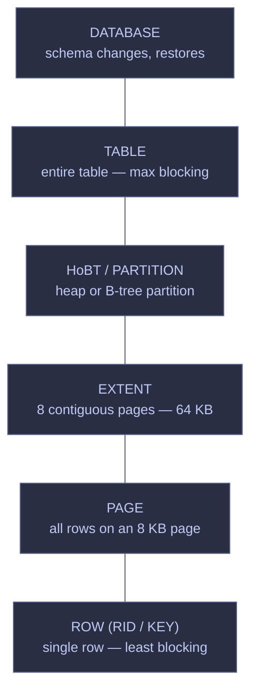

# Blocking and Locking

> [!quote]
> "A lock is a mechanism that, when used correctly, makes concurrency invisible. When used incorrectly, it makes concurrency catastrophic."
>
> — **Jim Gray**, *Transaction Processing: Concepts and Techniques*

SQL Server uses locks to coordinate concurrent access to data. Every read and write acquires locks automatically based on the isolation level and the type of operation. Understanding lock types, lock granularity, and isolation levels is essential for diagnosing blocking and designing concurrent-safe pipelines.

---

## Lock Types

SQL Server's lock manager tracks all acquired locks in memory and uses a compatibility matrix to decide whether a new lock request can be granted immediately or must wait. Every transaction acquires locks automatically — the lock type depends on the operation (read vs write) and the isolation level in effect.

### Lock type descriptions and compatibility

The following table defines every lock mode the lock manager can acquire. Each mode has a specific purpose and a specific set of other modes it is compatible or incompatible with.

| Lock type | Mode | Acquired by | Blocks | Notes |
|---|---|---|---|---|
| **S (Shared)** | Read | `SELECT` under pessimistic isolation levels | X (writers) | Released immediately after reading each row under READ COMMITTED; held until end of transaction under REPEATABLE READ / SERIALIZABLE |
| **U (Update)** | Read + intent to modify | `UPDATE` during the seek phase (finding the row to modify) | Other U and X | Prevents conversion deadlocks: only one session can hold U on a row, so two UPDATEs cannot both hold S then try to convert to X simultaneously |
| **X (Exclusive)** | Write | `INSERT`, `UPDATE` (modify phase), `DELETE` | All S, U, X | Held until `COMMIT` or `ROLLBACK` — the transaction holds modified rows locked for its entire duration |
| **IS (Intent Shared)** | Table/page signal | Placed at table and page level when a row S lock exists below | Only SCH-M and X at table level | Allows the lock manager to detect row-level locks without scanning every row |
| **IU (Intent Update)** | Table/page signal | Placed at page level when a row U lock exists below | Only X and SIX at table level | Signals that an update lock exists at a lower level |
| **IX (Intent Exclusive)** | Table/page signal | Placed at table and page level when a row X lock exists below | S, SIX, and X at table level | Multiple IX locks can coexist on the same table because they protect different rows |
| **SIX (Shared + Intent Exclusive)** | Read entire table + write some rows | Aggregation-then-update operations, or a table scan combined with row modifications | U, X, IX, SIX | Heavy blocking — effectively a table-level S lock plus row-level X locks |
| **Sch-S (Schema Stability)** | Schema read | Every query during compilation and execution | Only Sch-M | Prevents DDL changes while a query runs; does not block any DML |
| **Sch-M (Schema Modification)** | Schema write | `ALTER TABLE`, `CREATE INDEX`, `DROP TABLE`, other DDL | All lock types | Blocks every operation on the table for the duration of the DDL statement |
| **BU (Bulk Update)** | Bulk load | `BULK INSERT` or `bcp` with `TABLOCK` hint | Other BU and table-level S/X | Allows multiple threads to parallel-load data while blocking normal access |
| **Key-Range** | Serializable range | `SERIALIZABLE` isolation — range scans on indexed columns | Inserts into the locked range | Prevents phantom reads by locking a range of index keys, not just individual rows |

> [!info] Why Intent Locks Exist
>
> SQL Server uses intent locks (IS, IU, IX) at the page and table level to signal that a finer-grained lock exists at a lower level. Without intent locks, a session wanting to acquire a table-level S lock would have to scan every row in the table to check for existing row-level X locks. Intent locks make this check an O(1) operation — the lock manager simply checks the table-level intent lock for compatibility.

> [!info] Four Key Compatibility Rules
>
> 1. **Intent locks are compatible with each other** — multiple sessions can hold IS, IU, and IX on the same table simultaneously because they protect different rows.
> 2. **Exclusive locks are incompatible with everything** — no other session can read (with S locks) or write while an X lock is held.
> 3. **Update locks are incompatible with each other and with X** — only one session at a time can evaluate whether a row needs updating, preventing conversion deadlocks.
> 4. **Update locks are compatible with shared locks** — a session holding U can coexist with readers holding S, reducing blocking between readers and writers.
>
> Source: Korotkevitch | SQL Server Advanced Troubleshooting and Performance Tuning.epub

### Lock compatibility matrix

The lock manager uses this matrix to decide whether a new lock request can be granted immediately or must wait. "Yes" means both locks can coexist on the same resource; "No" means the requesting lock must wait until the existing lock is released. Read the table as: "If the existing granted mode is the column header and the requested mode is the row header, can the request be granted?"

| Requested ↓ \ Existing → | IS | S | U | IX | SIX | X |
|---|---|---|---|---|---|---|
| **IS** | Yes | Yes | Yes | Yes | Yes | No |
| **S** | Yes | Yes | Yes | No | No | No |
| **U** | Yes | Yes | No | No | No | No |
| **IX** | Yes | No | No | Yes | No | No |
| **SIX** | Yes | No | No | No | No | No |
| **X** | No | No | No | No | No | No |

The diagonal tells a key story: IS/IS, S/S, and IX/IX are all compatible (multiple readers or multiple intent-exclusive holders can coexist), but U/U and X/X are not (only one updater or writer at a time per resource). The entire X row and X column are "No" — exclusive locks are incompatible with every other mode.

---

## Lock Granularity

SQL Server can lock resources at different levels of granularity, from a single row up to the entire database. The lock manager automatically selects the most appropriate level based on the operation type and the number of rows affected. Finer granularity (row locks) reduces blocking but increases memory overhead because the lock manager must track each lock individually. Coarser granularity (table locks) minimizes overhead but blocks more concurrent sessions.



### Lock granularity in practice

The lock manager acquires intent locks at each level above the actual lock to signal that a lower-level lock exists. For example, a row-level X lock also places IX locks on the containing page and table. This hierarchy enables fast compatibility checks at the table level.

| Operation | Typical lock level | Details |
|---|---|---|
| Small `INSERT`, `UPDATE`, `DELETE` | Row (KEY lock in B-tree indexes, RID lock in heaps) | One lock per affected row |
| Large batch operations | Row → escalated to table after 5,000 locks | See [Lock Escalation](#lock-escalation) |
| `BULK INSERT` with `TABLOCK` | Table (BU lock) | Allows parallel loading threads but blocks normal access |
| `SELECT` (READ COMMITTED) | Row (S lock, released after each row is read) | Under RCSI, no locks at all |
| DDL (`ALTER TABLE`, `CREATE INDEX`) | Table (Sch-M lock) | Blocks all other access to the table |
| Compiled query execution | Table (Sch-S lock) | Prevents DDL while the query runs; does not block DML |

> [!warning] Row Locks Escalate Directly to Table Locks
>
> Lock escalation skips the page and extent levels. When the 5,000-lock threshold is reached, SQL Server escalates row locks directly to a table lock (or partition lock on partitioned tables with `LOCK_ESCALATION = AUTO`). There is no intermediate page-level escalation step.

> [!success] Safe Pattern — Distinguish Hierarchy from Escalation
>
> The granularity hierarchy (row → page → extent → table → database) describes the *containment* relationship and where intent locks are placed. Lock *escalation* is a separate mechanism that jumps from row directly to table. Do not confuse the two — the hierarchy diagram above shows containment, not the escalation path.

---

## Lock Escalation

Lock escalation is the process by which SQL Server replaces many fine-grained row or page locks with a single coarser table lock. This reduces memory consumed by the lock manager but increases blocking because the table lock prevents all other sessions from accessing any row in the table. Escalation is triggered by two conditions, whichever is reached first.

> [!info] Lock Escalation Thresholds
>
> 1. **Count threshold:** A single transaction holds more than **5,000 row or page locks** on one table (or partition, if `LOCK_ESCALATION = AUTO`).
> 2. **Memory threshold:** Lock memory is limited to 60% of the buffer pool. Escalation triggers when lock objects consume more than **40% of that lock memory allocation** — effectively ~24% of the total buffer pool. If `sp_configure 'locks'` is set to a non-zero value, the threshold is 40% of the configured lock count. If lock memory exceeds the 60% hard limit (more likely when escalation is disabled), all further lock allocation attempts fail with error `MSSQLSERVER_1204`.
>
> If escalation fails because another session holds an incompatible table lock, the transaction continues acquiring row/page locks and retries escalation every **1,250 new locks** acquired.

### Viewing current locks

The `sys.dm_tran_locks` DMV shows every lock currently held or requested in a database. Use this to see the lock types, resource levels, and request statuses across all active sessions.

```sql
SELECT
    resource_type,
    resource_description,
    request_mode,
    request_status,
    request_session_id,
    OBJECT_NAME(resource_associated_entity_id) AS table_name
FROM sys.dm_tran_locks
WHERE resource_database_id = DB_ID('analytics_db')
  AND resource_type IN ('KEY', 'PAGE', 'OBJECT')
ORDER BY request_session_id;
```

The `request_mode` column returns the lock type (S, U, X, IS, IX, SIX). The `request_status` column shows GRANT (lock held), WAIT (waiting for a conflicting lock to release), or CONVERT (upgrading from one lock mode to another, such as U → X).

### Controlling lock escalation behavior

The `LOCK_ESCALATION` table option controls how escalation behaves for a specific table. It accepts three values:

| Value | Behavior |
|---|---|
| **TABLE** (default) | Escalates row/page locks to a full table lock |
| **AUTO** | On partitioned tables, escalates to a partition-level (HoBT) lock instead of a table lock. On non-partitioned tables, behaves like TABLE |
| **DISABLE** | Prevents escalation to a table lock in most cases. Table locks can still occur when required for data integrity (e.g., serializable table scan with no clustered index) |

#### Disable lock escalation on a specific table

Disabling escalation forces SQL Server to maintain all individual row-level locks for the lifetime of the transaction. Use this only when escalation-caused blocking is a confirmed, measured problem — not preemptively.

```sql
ALTER TABLE gold.index_performance SET (LOCK_ESCALATION = DISABLE);
```

> [!warning] LOCK_ESCALATION = DISABLE Risks
>
> Disabling escalation means the lock manager must track every individual row lock indefinitely, consuming significant memory during large batch operations. If the transaction modifies 500,000 rows, that is 500,000 lock objects in memory. This can exhaust the lock manager's memory allocation and cause `MSSQLSERVER_1204` (unable to allocate lock resource) errors.

> [!success] Safe Pattern — Process in Batches Instead
>
> Rather than disabling lock escalation, break large `UPDATE` or `DELETE` operations into batches of ~4,000 rows (below the 5,000 threshold) using a `WHILE` loop with `TOP (4000)`. Each batch commits its own transaction, releasing locks before the next batch begins — preventing escalation without accumulating unbounded row-level locks.

> [!tip] Trace Flag 1224 — Disable Count-Based Escalation
>
> Trace flag 1224 disables lock escalation based on the 5,000-lock count threshold but still allows memory-pressure-based escalation. This is safer than `LOCK_ESCALATION = DISABLE` because it prevents out-of-memory conditions. Trace flag 1211 disables all escalation entirely (including memory-based) and should be avoided — it can cause `out-of-locks` errors under heavy write load.

### Monitoring lock escalation with index operational stats

The `sys.dm_db_index_operational_stats` DMV tracks how many times SQL Server attempted escalation and how many times it succeeded, per index. A high attempt-to-success ratio indicates that escalation is being blocked by incompatible table locks from other sessions.

```sql
SELECT
    OBJECT_NAME(ios.object_id) AS table_name,
    i.name AS index_name,
    ios.index_lock_promotion_attempt_count,
    ios.index_lock_promotion_count
FROM sys.dm_db_index_operational_stats(DB_ID(), NULL, NULL, NULL) ios
JOIN sys.indexes i
    ON i.object_id = ios.object_id
    AND i.index_id = ios.index_id
WHERE ios.index_lock_promotion_attempt_count > 0
ORDER BY ios.index_lock_promotion_count DESC;
```

> [!quote]
> You can also detect the tables that trigger the most lock escalation events by looking at the `index_lock_promotion_attempt_count` and `index_lock_promotion_count` columns in the `sys.dm_db_index_operational_stats` view.
>
> Source: Korotkevitch | SQL Server Advanced Troubleshooting and Performance Tuning.epub

---

## CRUD Operations and Lock Acquisition

Every DML statement follows a specific lock acquisition sequence. Understanding this sequence is essential for predicting which operations will block each other and for designing concurrent-safe pipelines. The lock manager acquires intent locks at the table and page level first, then the actual row-level lock.

### Lock sequence per operation

| Operation | Lock sequence | Lock lifetime |
|---|---|---|
| `SELECT` (READ COMMITTED) | S lock on each row/page as read → released immediately after reading each row | Instantaneous per row |
| `SELECT` (RCSI enabled) | No locks acquired — reads from the version store | N/A |
| `SELECT ... WITH (HOLDLOCK)` | S lock on each row → held until end of transaction | Until `COMMIT` / `ROLLBACK` |
| `INSERT` | IX on table → IX on page → X on new row | Until `COMMIT` / `ROLLBACK` |
| `UPDATE` | IX on table → IU on page → U on row (seek phase) → convert U to X (modify phase) | Until `COMMIT` / `ROLLBACK` |
| `DELETE` | IX on table → IU on page → U on row (seek phase) → convert U to X (ghost operation) | Until `COMMIT` / `ROLLBACK` |
| `MERGE` | Combination: U or X on matched rows, X on inserted rows | Until `COMMIT` / `ROLLBACK` |

> [!warning] Write Locks Are Held Until COMMIT
>
> Unlike `SELECT` under READ COMMITTED (which releases S locks as soon as it moves past each row), `INSERT` / `UPDATE` / `DELETE` hold their X locks for the entire duration of the transaction. A long-running write transaction that modifies thousands of rows keeps all those rows locked until it commits — this is the single most common cause of blocking in data pipelines.

> [!success] Safe Pattern — Keep Write Transactions Short
>
> Minimize the time between `BEGIN TRAN` and `COMMIT`. Do not perform network calls, file I/O, or application logic inside an open transaction. If a pipeline step must process many rows, break the work into small committed batches rather than a single long transaction.

> [!info] SQL Server 2022+ / Azure SQL Database — Optimized Locking
>
> Optimized locking fundamentally changes the lock lifetime behavior described above. It has two components:
>
> - **Transaction ID (TID) locking:** Instead of holding individual row X locks until `COMMIT`, each row lock is released immediately after the modification completes. A single X lock on the transaction's TID is held until `COMMIT`, protecting all modified rows. Updating 1,000 rows holds only 1 TID lock at transaction end instead of 1,000 row locks — dramatically reducing lock memory and lock escalation frequency.
> - **Lock After Qualification (LAQ):** When RCSI is enabled, `UPDATE` and `DELETE` evaluate predicates against the latest committed row version *without acquiring U locks first*. Only rows that satisfy the predicate take an X lock. This eliminates writer-writer blocking when concurrent transactions modify different rows in the same table.
>
> Optimized locking requires no query changes — queries without locking hints benefit automatically. Locking hints (`UPDLOCK`, `HOLDLOCK`, etc.) are still honored but reduce the optimization's benefit. Optimized locking is available in Azure SQL Database, SQL database in Microsoft Fabric, and SQL Server 2022 (16.x) and later.

---

## Isolation Levels

The isolation level controls what a transaction can see when other transactions are active. Higher isolation = fewer anomalies = more blocking.

| Isolation Level | Dirty Reads | Non-Repeatable Reads | Phantom Reads | Blocking |
|---|---|---|---|---|
| **READ UNCOMMITTED** | Yes (reads uncommitted) | Yes | Yes | Least |
| **READ COMMITTED** (default) | No | Yes | Yes | Low |
| **READ COMMITTED + RCSI** | No | Snapshot | Snapshot | Very low (no reader S locks) |
| **REPEATABLE READ** | No | No | Yes | Medium |
| **SERIALIZABLE** | No | No | No | High |
| **SNAPSHOT** | No | No | No | Medium (uses version store) |

### Isolation anomaly definitions

Each isolation level trades off between data correctness and concurrency. The three anomalies that isolation levels are designed to prevent are:

- **Dirty read:** Transaction A reads a row that Transaction B has modified but not yet committed. If B rolls back, A has read data that never existed. This can cause downstream calculations to produce nonsensical results. Only `READ UNCOMMITTED` allows dirty reads.
- **Non-repeatable read:** Transaction A reads the same row twice. Between the two reads, Transaction B commits an `UPDATE` to that row. A's second read returns different values than the first. This breaks any logic that depends on consistent reads within a single transaction (e.g., reading a balance, computing a fee, then reading the balance again). Prevented by `REPEATABLE READ` and above.
- **Phantom read:** Transaction A executes a range query (e.g., `WHERE date BETWEEN '2026-01-01' AND '2026-01-31'`) twice. Between executions, Transaction B inserts or deletes a row in that range. A's second query returns a different set of rows. Prevented only by `SERIALIZABLE` (which uses key-range locks) or row-versioning isolation levels (`SNAPSHOT`, `RCSI`).

### How each isolation level controls locks

Each isolation level instructs the lock manager differently on what locks to acquire and how long to hold them. Understanding these mechanics explains *why* higher isolation levels cause progressively more blocking.

| Isolation Level | Read locks | Write locks | Key-range locks |
|---|---|---|---|
| **READ UNCOMMITTED** | None — reads ignore all locks and can read uncommitted data | X locks held until `COMMIT` | None |
| **READ COMMITTED** (pessimistic) | S locks acquired per row, **released immediately** after reading each row | X locks held until `COMMIT` | None |
| **READ COMMITTED + RCSI** | No S locks — reads from version store (statement-level snapshot) | X locks held until `COMMIT` | None |
| **REPEATABLE READ** | S locks acquired per row, **held until `COMMIT`** — prevents other transactions from modifying rows already read | X locks held until `COMMIT` | None |
| **SERIALIZABLE** | S locks on the scanned range, **held until `COMMIT`** | X locks held until `COMMIT` | RangeS-S locks prevent inserts into scanned key ranges |
| **SNAPSHOT** | No S locks — reads from version store (transaction-level snapshot) | X locks held until `COMMIT`; optimistic conflict detection rolls back on write-write collision (error 3960) | None |

The critical transition is between READ COMMITTED and REPEATABLE READ. Under READ COMMITTED, S locks are short-lived (released after each row is read), so writers only wait briefly. Under REPEATABLE READ, S locks are held for the entire transaction, meaning writers are blocked until the reader commits — a significant increase in blocking potential.

---

## Read Committed Snapshot Isolation (RCSI)

RCSI is the most important concurrency improvement for mixed read/write workloads. It eliminates reader-writer blocking entirely by giving readers a snapshot of the data from the version store (in TempDB) rather than taking shared locks. The [server-configuration](https://alp78.github.io/elysium/04-SQL-Server/Administration/server-configuration) page covers the full RCSI setup alongside other non-negotiable instance settings.

### RCSI behavior — readers never block writers, writers never block readers

Under RCSI, the lock manager changes the behavior of `SELECT` statements running under the default READ COMMITTED isolation level. Instead of acquiring shared locks and potentially waiting for writers, readers retrieve the last committed version of each row from the version store.

- `SELECT` statements do **not** acquire S locks → cannot block `INSERT` / `UPDATE` / `DELETE`
- `INSERT` / `UPDATE` / `DELETE` still acquire X locks → can still block each other
- Readers see the last committed version of each row at the **statement** level — each statement gets a consistent point-in-time view, but different statements within the same transaction may see different committed states

> [!info] RCSI vs SNAPSHOT Isolation
>
> Both RCSI and SNAPSHOT isolation use the version store, but they provide different consistency guarantees:
>
> | Feature | RCSI | SNAPSHOT |
> |---|---|---|
> | Consistency scope | **Statement-level** — each `SELECT` sees data committed as of the statement start | **Transaction-level** — all statements see data committed as of the transaction start |
> | Activation | Database option (`READ_COMMITTED_SNAPSHOT ON`) — applies to all READ COMMITTED sessions automatically | Session-level (`SET TRANSACTION ISOLATION LEVEL SNAPSHOT`) — must be set explicitly |
> | Write conflicts | No conflict detection — last writer wins | **Optimistic concurrency** — if a row was modified after the snapshot timestamp, the transaction rolls back with error 3960 |
> | Prerequisite | `READ_COMMITTED_SNAPSHOT ON` | `ALLOW_SNAPSHOT_ISOLATION ON` |
>
> For most data pipelines, RCSI is the right choice — it eliminates reader-writer blocking without requiring application changes. Use SNAPSHOT isolation only when you need transaction-level read consistency (e.g., generating a report that must see a consistent state across multiple queries).

#### Check RCSI status

Query `sys.databases` to verify whether RCSI is enabled on a specific database.

```sql
SELECT name, is_read_committed_snapshot_on
FROM sys.databases WHERE name = 'analytics_db';
```

#### Enable RCSI

Enabling RCSI requires exclusive access to the database — no other connections can be active at the time the `ALTER DATABASE` statement runs.

```sql
ALTER DATABASE analytics_db SET READ_COMMITTED_SNAPSHOT ON;
```

> [!warning] RCSI Requires a Maintenance Window
>
> Enabling RCSI requires that no other connections are active on the database. On a production database, run this during a maintenance window. The operation is fast (typically seconds) but will block until all other connections are drained. RCSI cannot be enabled on `tempdb`, `msdb`, or `master`.

> [!success] Safe Pattern — Drain Connections Before Enabling RCSI
>
> Set the database to single-user mode to force-disconnect all other sessions, then enable RCSI, then restore multi-user mode:
>
> ```sql
> ALTER DATABASE analytics_db SET SINGLE_USER WITH ROLLBACK IMMEDIATE;
> ALTER DATABASE analytics_db SET READ_COMMITTED_SNAPSHOT ON;
> ALTER DATABASE analytics_db SET MULTI_USER;
> ```

> [!tip] RCSI Is Enabled by Default on Azure SQL Database
>
> Azure SQL Database and SQL database in Microsoft Fabric enable `READ_COMMITTED_SNAPSHOT ON` by default — no manual activation is needed. On-premises SQL Server and Azure SQL Managed Instance default to `OFF` and require the explicit `ALTER DATABASE` step shown above.

### Version store — TempDB space usage and monitoring

When RCSI or SNAPSHOT isolation is enabled, every `UPDATE` and `DELETE` generates a version record in TempDB's version store (or in the database's persistent version store if Accelerated Database Recovery is enabled). The version store grows during long-running transactions and is cleaned up by a background thread when no active snapshot read needs the old version.

#### Check version store size

The `sys.dm_db_file_space_usage` DMV reports page counts for the version store. Multiply by 8 KB per page and divide by 1,024 to get megabytes. Run this query in the context of `tempdb`.

```sql
SELECT SUM(version_store_reserved_page_count) * 8 / 1024 AS version_store_mb
FROM sys.dm_db_file_space_usage;
```

#### Find long-running snapshot transactions

If the version store exceeds 1 GB, look for long-running transactions that are preventing cleanup. The `elapsed_time_seconds` column shows how long each snapshot transaction has been active — any transaction running for more than a few minutes in an OLTP workload is a candidate for investigation.

```sql
SELECT
    session_id,
    transaction_id,
    transaction_sequence_num,
    elapsed_time_seconds,
    commit_sequence_num
FROM sys.dm_tran_active_snapshot_database_transactions
ORDER BY elapsed_time_seconds DESC;
```

---

## Detecting Blocking Chains

Blocking occurs when one session holds a lock that another session needs. A blocking chain forms when the blocked session itself blocks additional sessions, creating a cascading dependency. The key to resolving blocking is identifying the **head blocker** — the session at the root of the chain that is not itself waiting on any lock.

### Active blocking chains via sys.dm_exec_requests

This query joins `sys.dm_exec_requests` with `sys.dm_exec_sql_text` to show every session that is currently blocked, the session blocking it, the wait type, and the SQL text of the blocked query. Filter on `blocking_session_id > 0` because a value of 0 means the session is not blocked.

```sql
SELECT r.session_id AS blocked,
       r.blocking_session_id AS blocker,
       r.wait_type,
       r.wait_time / 1000 AS wait_sec,
       SUBSTRING(st.text, 1, 200) AS blocked_query
FROM sys.dm_exec_requests r
CROSS APPLY sys.dm_exec_sql_text(r.sql_handle) st
WHERE r.blocking_session_id > 0
ORDER BY r.wait_time DESC;
```

### Find what the head blocker is running

Once you identify the `blocking_session_id` from the query above, use `sys.dm_exec_sessions` with `sys.dm_exec_sql_text` to see what the head blocker is doing. The `most_recent_sql_handle` gives the last SQL text executed by the session, even if it is currently sleeping (no active request).

```sql
SELECT s.session_id, s.login_name, s.program_name,
       s.last_request_start_time,
       SUBSTRING(st.text, 1, 200) AS blocker_query
FROM sys.dm_exec_sessions s
CROSS APPLY sys.dm_exec_sql_text(s.most_recent_sql_handle) st
WHERE s.session_id = <blocker_session_id>;
```

### Blocking chain interpretation

The number of rows returned and the `wait_sec` values determine the severity of the blocking situation:

- **0 rows:** No blocking right now — healthy state
- **Rows with wait_sec < 5:** Transient blocking — normal under moderate load, no action needed
- **Rows with wait_sec 5–30:** Short blocking — investigate if it occurs frequently, but may resolve on its own
- **Rows with wait_sec > 30:** Significant blocking — a long-running transaction is holding locks and must be investigated immediately
- **Chains (A blocks B, B blocks C):** One session cascading to many — find the head blocker (the session_id that appears as `blocker` but never as `blocked`). When blocking becomes circular, it escalates to a [deadlock](https://alp78.github.io/elysium/04-SQL-Server/Concurrency/deadlock-detection-and-prevention)

### Common blocking causes and fixes

| Cause | Symptom | Fix |
|---|---|---|
| Open transaction from SSMS (user forgot to `COMMIT`) | Single session blocking many, `last_request_end_time` far in the past | `COMMIT` / `ROLLBACK`, or `KILL <session_id>` |
| Long-running pipeline step holding X locks | High `wait_sec`, blocker running a large `UPDATE` / `DELETE` | Break into smaller transactions; enable RCSI for readers |
| Index rebuild (holds Sch-M lock) | All queries on the table blocked during rebuild | Schedule rebuilds during off-peak hours; use `ONLINE = ON` to reduce Sch-M duration |
| Lock escalation on a large UPDATE | Sudden jump from row-level to table-level blocking | Process in batches of ~4,000 rows (below the 5,000 threshold) |
| Missing RCSI on mixed read/write database | High `LCK_M_S` waits — readers blocked by writers | `ALTER DATABASE db SET READ_COMMITTED_SNAPSHOT ON` |
| Missing `SET LOCK_TIMEOUT` | Sessions wait indefinitely for locks | Set `SET LOCK_TIMEOUT 30000` (30 seconds) in pipeline code to fail fast rather than wait forever |

---

## Locking Hints

SQL Server allows explicit lock hints in queries using the `WITH (...)` syntax. These hints override the lock manager's automatic lock choice for a specific table reference. Use them only when the default behavior causes a confirmed problem — they bypass the optimizer's lock decisions and can introduce unexpected blocking or deadlocks if applied incorrectly.

| Hint | What it does | When to use |
|---|---|---|
| `WITH (NOLOCK)` = `READ UNCOMMITTED` | No locks on reads — can read dirty (uncommitted) data | Never in production — data quality is not guaranteed |
| `WITH (UPDLOCK)` | Take U lock instead of S lock on reads | When you know you'll update the row immediately after reading — prevents deadlocks |
| `WITH (HOLDLOCK)` = `SERIALIZABLE` | Hold S locks until end of transaction | When you need to prevent phantoms in a range scan |
| `WITH (ROWLOCK)` | Force row-level locking instead of page/table | When lock escalation is causing blocking on specific hot tables |
| `WITH (PAGLOCK)` | Force page-level locking | Rarely useful — SQL Server usually chooses correctly |
| `WITH (TABLOCK)` | Lock the entire table | Bulk INSERT with minimal logging (`INSERT ... WITH (TABLOCK)`) |

> [!warning] NOLOCK Is Not a Performance Fix
>
> `WITH (NOLOCK)` (also written `READ UNCOMMITTED`) is sometimes used as a "performance hint" but it risks returning incorrect, inconsistent data — including rows that don't exist (from rolled-back transactions), missing rows, or duplicate rows from page splits during a scan. Enable [RCSI](#read-committed-snapshot-isolation-rcsi) instead — it provides consistent reads without blocking and without dirty reads.

> [!success] Safe Pattern — Enable RCSI for Consistent Non-Blocking Reads
>
> Replace all `WITH (NOLOCK)` hints with RCSI at the database level. RCSI gives every `SELECT` a consistent snapshot of committed data from the version store without acquiring shared locks — eliminating reader-writer blocking while preserving data integrity. Remove `NOLOCK` from queries after RCSI is enabled.

---

## Preventing Blocking with XACT_ABORT

`XACT_ABORT` is a session-level setting that controls what happens when a runtime error occurs inside a transaction. When set to `ON`, any error — including a lock timeout, deadlock, constraint violation, or conversion failure — automatically rolls back the entire transaction and releases all held locks. When `OFF` (the default), only the failing statement is rolled back; the transaction remains open and its locks remain held indefinitely until an explicit `COMMIT` or `ROLLBACK`.

### XACT_ABORT ON in transaction blocks

Every T-SQL transaction in pipeline stored procedures should begin with `SET XACT_ABORT ON`. This ensures that a deadlock or lock timeout during one of the statements automatically releases all locks rather than leaving them held and causing cascading blocking.

```sql
SET XACT_ABORT ON;
BEGIN TRAN;
    UPDATE silver.signals_daily SET ... WHERE ...;
    UPDATE gold.scores_daily SET ... WHERE ...;
COMMIT;
```

If either `UPDATE` fails (deadlock victim, constraint violation, lock timeout), the entire transaction rolls back automatically. Without `XACT_ABORT ON`, a failed `UPDATE` leaves the transaction open with all previously acquired locks still held — any session waiting on those locks remains blocked until a DBA intervenes.

Inside `TRY...CATCH` blocks, use `XACT_STATE()` to check the transaction state before deciding whether to commit or roll back. `XACT_STATE()` returns `1` (active, committable transaction), `0` (no active transaction), or `-1` (active but uncommittable transaction — the only valid action is `ROLLBACK`). When `XACT_ABORT` is `ON`, any error sets the state to `-1`, making `ROLLBACK` the only option in the `CATCH` block.

For pipeline code in Python/C#, always ensure that errors in the application layer trigger an explicit `rollback()` call on the connection. The `XACT_ABORT ON` setting handles this at the T-SQL level for stored procedures and ad-hoc batches, but application-level connection management must also be defensive. See [merge-and-upsert > Transaction Management](https://alp78.github.io/elysium/04-SQL-Server/T-SQL/merge-and-upsert#transaction-management) for complete patterns. In pipeline orchestration, [race-conditions](https://alp78.github.io/elysium/04-SQL-Server/Concurrency/race-conditions) caused by concurrent tasks are a common source of unexpected blocking.

### SET LOCK_TIMEOUT — fail fast instead of waiting indefinitely

By default, a session waiting for a lock will wait forever — there is no timeout. The `SET LOCK_TIMEOUT` setting specifies the maximum number of milliseconds a session will wait for a lock before raising error 1222. When combined with `XACT_ABORT ON`, a lock timeout automatically rolls back the entire transaction and releases all locks.

```sql
SET LOCK_TIMEOUT 30000;
SET XACT_ABORT ON;
BEGIN TRAN;
    UPDATE silver.signals_daily SET ... WHERE ...;
COMMIT;
```

If the `UPDATE` cannot acquire a lock within 30 seconds (30,000 ms), error 1222 fires and `XACT_ABORT` rolls back the transaction. This prevents pipeline steps from hanging indefinitely when another session holds a blocking lock. A value of `0` means do not wait at all — return error 1222 immediately if the lock is not available. A value of `-1` (the default) means wait forever.

---

## Lock Monitoring Queries

These queries provide a server-wide view of locking activity. Use them during routine health checks or when investigating systemic blocking that goes beyond a single blocking chain.

### All current locks in a database

The `sys.dm_tran_locks` DMV returns one row for every lock currently held or requested. This query filters to a specific database and sorts by session to group each session's locks together.

```sql
SELECT
    resource_type,
    resource_description,
    request_mode,
    request_status,
    request_session_id,
    OBJECT_NAME(resource_associated_entity_id) AS table_name
FROM sys.dm_tran_locks
WHERE resource_database_id = DB_ID('analytics_db')
ORDER BY request_session_id, resource_type;
```

### Lock escalation rate

The `Lock Escalations/sec` performance counter is cumulative since the last instance restart. A steadily increasing value indicates that batch operations are regularly hitting the 5,000-lock threshold. Compare with the `sys.dm_db_index_operational_stats` query in the [Lock Escalation](#monitoring-lock-escalation-with-index-operational-stats) section to identify which specific tables are escalating.

```sql
SELECT cntr_value AS lock_escalations
FROM sys.dm_os_performance_counters
WHERE counter_name = 'Lock Escalations/sec'
  AND instance_name = '_Total';
```

### Deadlock rate

The `Number of Deadlocks/sec` counter is also cumulative. A non-zero value indicates that deadlocks have occurred since the last instance restart. See [deadlock-detection-and-prevention](https://alp78.github.io/elysium/04-SQL-Server/Concurrency/deadlock-detection-and-prevention) for Extended Events capture and retry logic.

```sql
SELECT cntr_value AS deadlocks_total
FROM sys.dm_os_performance_counters
WHERE counter_name = 'Number of Deadlocks/sec'
  AND instance_name = '_Total';
```

### Lock-related wait types

The `LCK_M_*` wait types in `sys.dm_os_wait_stats` indicate how much total time sessions have spent waiting for locks. Each wait type corresponds to a specific lock mode being requested:

| Wait type | Meaning | Common cause |
|---|---|---|
| `LCK_M_S` | Waiting for a shared lock | Reader blocked by a writer holding X lock |
| `LCK_M_U` | Waiting for an update lock | Writer blocked by another writer holding U or X |
| `LCK_M_X` | Waiting for an exclusive lock | Writer blocked by readers (S locks) or other writers |
| `LCK_M_IX` | Waiting for an intent exclusive lock | Writer blocked by a table-level S or SIX lock |
| `LCK_M_SCH_M` | Waiting for a schema modification lock | DDL blocked by running queries (Sch-S holders) |

High `LCK_M_S` waits specifically indicate that readers are being blocked by writers — the most common fix is enabling [RCSI](#read-committed-snapshot-isolation-rcsi). High `LCK_M_X` waits indicate writer-writer contention, which RCSI does not solve. See [wait-stats-analysis](https://alp78.github.io/elysium/04-SQL-Server/Performance/wait-stats-analysis) for server-wide wait type diagnosis.

---

## Active Session Diagnostics

These diagnostic queries provide a comprehensive view of what every session on the instance is doing. Use them as the starting point for any "the database is slow" investigation — they show resource usage, blocking relationships, isolation levels, and SQL text for every active and sleeping session.

### Full Running Requests — comprehensive active request snapshot

The first query to run during a "the database is slow" incident. Shows every active request with its SQL text, wait type, blocking status, and execution plan handle. The isolation level mapping decodes the integer stored in `sys.dm_exec_requests` into a human-readable name, and the `CROSS APPLY` to `sys.dm_exec_sql_text` extracts the currently executing statement from the full batch text.

```sql
SELECT
    r.session_id,
    r.status,
    r.blocking_session_id,
    r.wait_type,
    r.wait_time / 1000.0             AS wait_sec,
    r.total_elapsed_time / 1000.0    AS elapsed_sec,
    r.cpu_time / 1000.0              AS cpu_sec,
    r.logical_reads,
    r.writes,
    r.granted_query_memory / 128.0   AS granted_mem_mb,
    r.dop,
    r.row_count,
    r.percent_complete,
    r.estimated_completion_time / 1000.0 AS est_completion_sec,
    r.command,
    DB_NAME(r.database_id)           AS database_name,
    r.open_transaction_count,
    CASE r.transaction_isolation_level
        WHEN 0 THEN 'Unspecified'
        WHEN 1 THEN 'ReadUncommitted'
        WHEN 2 THEN 'ReadCommitted'
        WHEN 3 THEN 'Repeatable'
        WHEN 4 THEN 'Serializable'
        WHEN 5 THEN 'Snapshot'
        ELSE 'Unknown'
    END                              AS isolation_level_name,
    t.text                           AS sql_text,
    SUBSTRING(t.text,
        (r.statement_start_offset/2) + 1,
        ((CASE r.statement_end_offset
              WHEN -1 THEN DATALENGTH(t.text)
              ELSE r.statement_end_offset
          END - r.statement_start_offset)/2) + 1
    )                                AS current_statement,
    qp.query_plan
FROM sys.dm_exec_requests r
CROSS APPLY sys.dm_exec_sql_text(r.sql_handle)    t
CROSS APPLY sys.dm_exec_query_plan(r.plan_handle) qp
WHERE r.session_id > 50
  AND r.session_id <> @@SPID
ORDER BY r.total_elapsed_time DESC;
```

### Session Details — session-level view from sys.dm_exec_sessions

Use this when you need a session-level view rather than request-level. A request is a single statement currently executing; a session is the connection itself. Sessions that are sleeping (no active request) still consume memory and may hold open transactions with locks. This query shows login, host, program name, and cumulative resource usage across all requests in the session's lifetime.

```sql
SELECT
    s.session_id,
    s.login_name,
    s.host_name,
    s.program_name,
    s.status,
    s.cpu_time,
    s.memory_usage * 8              AS memory_kb,
    s.total_elapsed_time / 1000.0   AS elapsed_sec,
    s.last_request_start_time,
    s.last_request_end_time,
    s.reads,
    s.writes,
    s.logical_reads,
    s.open_transaction_count,
    s.transaction_isolation_level,
    s.deadlock_priority,
    s.row_count,
    DB_NAME(s.database_id)          AS database_name,
    s.client_interface_name,
    s.auth_scheme,
    s.is_user_process
FROM sys.dm_exec_sessions s
WHERE s.is_user_process = 1
ORDER BY s.cpu_time DESC;
```

### Blocking Chain Recursive CTE — walk from root blocker to final victim

A recursive CTE that walks the blocking chain from root blocker to final victim, producing a visual tree with depth indentation. The root blocker (depth 0) is the session holding the lock. Each subsequent level is a session blocked by the level above. The anchor member finds sessions that are blocking others but are not themselves blocked (the head blockers), and the recursive member joins each blocked session back to its blocker.

> [!tip] Visual Indentation Makes Chains Readable
>
> The `REPLICATE('  ', depth)` creates visual indentation. At depth 3, the output shows `      → 87 (SELECT...)` making the chain immediately readable without any tool.

```sql
WITH blocking_chain AS (
    -- Anchor: sessions blocking others but not blocked themselves
    SELECT
        r.session_id,
        r.blocking_session_id,
        r.wait_type,
        r.wait_time / 1000.0         AS wait_sec,
        r.status,
        t.text                        AS sql_text,
        CAST(0 AS INT)                AS depth,
        CAST(r.session_id AS VARCHAR(1000)) AS chain
    FROM sys.dm_exec_requests r
    CROSS APPLY sys.dm_exec_sql_text(r.sql_handle) t
    WHERE r.blocking_session_id = 0
      AND r.session_id IN (
          SELECT blocking_session_id
          FROM sys.dm_exec_requests
          WHERE blocking_session_id > 0
      )

    UNION ALL

    -- Recursive: each blocked session
    SELECT
        r.session_id,
        r.blocking_session_id,
        r.wait_type,
        r.wait_time / 1000.0,
        r.status,
        t.text,
        bc.depth + 1,
        CAST(bc.chain + ' -> '
             + CAST(r.session_id AS VARCHAR(10))
             AS VARCHAR(1000))
    FROM sys.dm_exec_requests r
    CROSS APPLY sys.dm_exec_sql_text(r.sql_handle) t
    JOIN blocking_chain bc
        ON bc.session_id = r.blocking_session_id
)
SELECT
    REPLICATE('  ', depth)
        + CAST(session_id AS VARCHAR) AS session_tree,
    blocking_session_id,
    wait_type,
    wait_sec,
    status,
    chain,
    LEFT(sql_text, 200) AS sql_text_snippet
FROM blocking_chain
ORDER BY chain;
```

### KILL session — terminate a blocking session

The `KILL` command terminates a session and rolls back any open transaction it holds. This is a last-resort action for clearing a head blocker that cannot be resolved by other means (e.g., the application that opened the connection has crashed or is unresponsive).

> [!danger] Never Kill System Sessions
>
> Sessions with `session_id <= 50` are SQL Server system processes. Killing them can crash the instance or corrupt TempDB. Always verify the session belongs to a user process before issuing KILL. Use `KILL ... WITH STATUSONLY` to check rollback progress on long-running transactions — the KILL itself may take minutes if a large transaction must roll back.

> [!success] Safe Pattern — Verify Before Killing
>
> Always query `sys.dm_exec_sessions WHERE session_id = <id>` and confirm `is_user_process = 1` and `session_id > 50` before issuing KILL. After issuing KILL, use `KILL <id> WITH STATUSONLY` to monitor rollback progress rather than issuing a second KILL.

#### Verify the session before killing

Confirm the session belongs to a user process and identify the login, host, and application name.

```sql
SELECT session_id, login_name, host_name, program_name, status
FROM sys.dm_exec_sessions WHERE session_id = 72;
```

#### Terminate the session

```sql
KILL 72;
```

#### Check rollback progress

After issuing `KILL`, the session enters a rollback state. `KILL WITH STATUSONLY` reports the estimated rollback completion percentage without issuing another kill. Do not issue a second `KILL` while rollback is in progress.

```sql
KILL 72 WITH STATUSONLY;
```

---

## Related

- [deadlock-detection-and-prevention](https://alp78.github.io/elysium/04-SQL-Server/Concurrency/deadlock-detection-and-prevention) — circular waits, Extended Events capture, retry logic
- [race-conditions](https://alp78.github.io/elysium/04-SQL-Server/Concurrency/race-conditions) — silent data corruption from concurrent reads + writes
- [merge-and-upsert](https://alp78.github.io/elysium/04-SQL-Server/T-SQL/merge-and-upsert) — atomic MERGE patterns and transaction management with XACT_ABORT
- [storage-internals](https://alp78.github.io/elysium/04-SQL-Server/Storage-and-Indexes/storage-internals) — buffer pool and lock manager internals
- [wait-stats-analysis](https://alp78.github.io/elysium/04-SQL-Server/Performance/wait-stats-analysis) — LCK_M_* wait types and server-wide blocking diagnosis
- [performance-audit-playbook](https://alp78.github.io/elysium/04-SQL-Server/Performance/performance-audit-playbook) — Phase 8 (blocking) and how locking fits into a full audit
