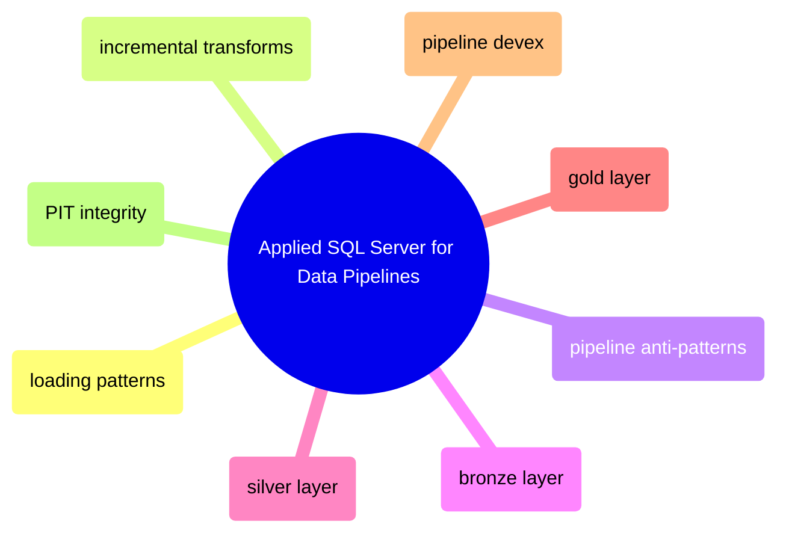

# Applied SQL Server for Data Pipelines

This domain applies SQL Server to pipeline construction rather than to generic DBA or query-tuning work. It owns ingestion patterns, incremental movement, medallion implementation, point-in-time correctness, and pipeline-specific operational guidance.

## Loading and Incremental Movement

> [!abstract]- [[01-sql-server-loading-patterns]]
>
> - [[sql-server-loading-patterns#Loading Methods Comparison|Loading methods comparison]]
> - [[sql-server-loading-patterns#Full Refresh Staged Publish and Upsert|Full refresh, staged publish, and upsert]]
> - [[sql-server-loading-patterns#TVP BULK INSERT OPENROWSET and bcp|TVP, BULK INSERT, OPENROWSET, and bcp]]
> - [[sql-server-loading-patterns#Minimal Logging Rules|Minimal logging rules]]

> [!abstract]- [[05-sql-server-incremental-transforms]]
>
> - [[sql-server-incremental-transforms#Watermark-Based Incremental Loading|Watermark-based incremental loading]]
> - [[sql-server-incremental-transforms#rowversion-Based Deltas|rowversion-based deltas]]
> - [[sql-server-incremental-transforms#Sliding Refresh Windows|Sliding refresh windows]]
> - [[sql-server-incremental-transforms#Hash-Based Change Detection and Incremental Aggregates|Hash-based change detection and incremental aggregates]]

> [!abstract]- [[08-sql-server-pipeline-anti-patterns]]
>
> - [[sql-server-pipeline-anti-patterns#Loading Anti-Patterns|Loading anti-patterns]]
> - [[sql-server-pipeline-anti-patterns#Incremental and State Anti-Patterns|Incremental and state anti-patterns]]
> - [[sql-server-pipeline-anti-patterns#Control-Plane and Schema-Evolution Anti-Patterns|Control-plane and schema-evolution anti-patterns]]
> - [[sql-server-pipeline-anti-patterns#Concurrency and Recovery Anti-Patterns|Concurrency and recovery anti-patterns]]

## Bronze, Silver, and Gold Implementation

> [!abstract]- [[02-bronze-layer-loading]]
>
> - [[bronze-layer-loading#Raw Landing Zone and Bronze DDL|Raw landing zone and bronze DDL]]
> - [[bronze-layer-loading#Dynamic Table Creation and Source Fidelity|Dynamic table creation and source fidelity]]
> - [[bronze-layer-loading#JSON to Bronze Loading Flow|JSON-to-bronze loading flow]]
> - [[bronze-layer-loading#Bronze Layer Indexing and Validation|Bronze layer indexing and validation]]

> [!abstract]- [[03-silver-transforms]]
>
> - [[silver-transforms#Silver DDL and Historical Storage|Silver DDL and historical storage]]
> - [[silver-transforms#SCD Type 2 Transform|SCD Type 2 transform]]
> - [[silver-transforms#Upsert and Deduplication Patterns|Upsert and deduplication patterns]]
> - [[silver-transforms#Gap Fill and Reconciliation Logic|Gap fill and reconciliation logic]]

> [!abstract]- [[04-gold-transforms]]
>
> - [[gold-transforms#Gold Table DDL and Grain|Gold table DDL and grain]]
> - [[gold-transforms#Aggregation Ranking and Scoring Logic|Aggregation, ranking, and scoring logic]]
> - [[gold-transforms#Consumption Queries and Freshness Checks|Consumption queries and freshness checks]]
> - [[gold-transforms#Operational Safeguards for Gold Models|Operational safeguards for gold models]]

## Operability, Observability, and Historical Correctness

> [!abstract]- [[07-pipeline-integration-and-devex]]
>
> - [[pipeline-integration-and-devex#Query Tagging and Traceability|Query tagging and traceability]]
> - [[pipeline-integration-and-devex#Connection Metadata and Deployment-Safe Diagnostics|Connection metadata and deployment-safe diagnostics]]
> - [[pipeline-integration-and-devex#Operational Tooling for Pipelines|Operational tooling for pipelines]]
> - [[pipeline-integration-and-devex#Review Checklist for Pipeline SQL|Review checklist for pipeline SQL]]

> [!abstract]- [[06-pit-integrity-logic]]
>
> - [[pit-integrity-logic#Point-in-Time PIT Logic Fundamentals|Point-in-time logic fundamentals]]
> - [[pit-integrity-logic#Effective-Dated Joins and As-Of Queries|Effective-dated joins and as-of queries]]
> - [[pit-integrity-logic#Bi-Temporal and Restatement Patterns|Bi-temporal and restatement patterns]]
> - [[pit-integrity-logic#Validation Reconciliation and Performance-Safe PIT Checks|Validation, reconciliation, and performance-safe PIT checks]]
