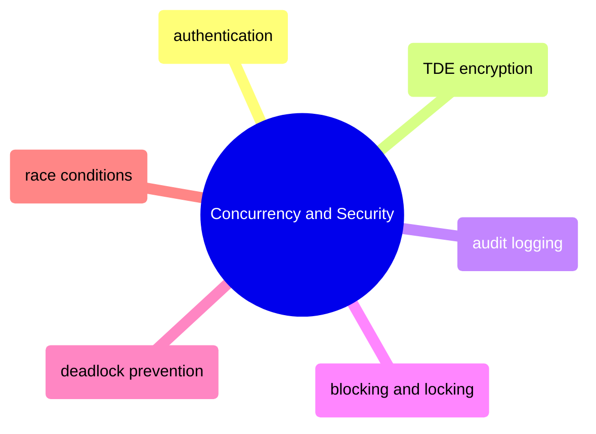

# Concurrency and Security

SQL Server authentication hardening, encryption at rest, audit logging, and concurrency control from lock mechanics through deadlock prevention and race condition mitigation.

> [!abstract]- [[sql-server-authentication]]
>
> - [[sql-server-authentication#Part 1: GCP Service Account Hardening|GCP service account hardening]]
> - [[sql-server-authentication#Part 2: SQL Server Login Hardening|SQL Server login hardening]]
> - [[sql-server-authentication#Part 3: TLS Encryption for Connections|TLS encryption for connections]]
> - [[sql-server-authentication#Part 4: GCP Firewall Rules|GCP firewall rules]]
> - [[sql-server-authentication#Part 5: SQL Server Audit|SQL Server audit setup]]
> - [[sql-server-authentication#Quarterly Security Review|Quarterly security review]]

> [!abstract]- [[tde-encryption]]
>
> - [[tde-encryption#Step 1: Create KMS Keyring and Key in GCP|Create KMS keyring and key]]
> - [[tde-encryption#Step 3: Certificate-Based TDE Setup|Certificate-based TDE setup]]
> - [[tde-encryption#Step 4: CRITICAL — Backup the Certificate and Private Key|Certificate backup]]
> - [[tde-encryption#Step 6: Restore Certificate on Another Server (Disaster Recovery)|Disaster recovery restore]]
> - [[tde-encryption#TDE Monitoring Query|TDE monitoring]]

> [!abstract]- [[audit-logging]]
>
> - [[audit-logging#SQL Server Audit Architecture|Audit architecture]]
> - [[audit-logging#Step 4: Query Audit Logs|Querying audit logs]]
> - [[audit-logging#Step 5: Detect Brute-Force Login Attacks|Brute-force detection]]
> - [[audit-logging#Audit File Management|Audit file management]]

> [!abstract]- [[blocking-and-locking]]
>
> - [[blocking-and-locking#Lock Types|Lock types]]
> - [[blocking-and-locking#Lock Granularity|Lock granularity]]
> - [[blocking-and-locking#Isolation Levels|Isolation levels]]
> - [[blocking-and-locking#Read Committed Snapshot Isolation (RCSI)|RCSI]]
> - [[blocking-and-locking#Detecting Blocking Chains|Detecting blocking chains]]
> - [[blocking-and-locking#Lock Monitoring Queries|Lock monitoring queries]]

> [!abstract]- [[deadlock-detection-and-prevention]]
>
> - [[deadlock-detection-and-prevention#Detecting Deadlocks|Detecting deadlocks]]
> - [[deadlock-detection-and-prevention#Extended Events Session for Persistent Capture|Extended Events capture]]
> - [[deadlock-detection-and-prevention#Preventing Deadlocks|Prevention strategies]]
> - [[deadlock-detection-and-prevention#Application-Level Retry Logic|Application-level retry logic]]
> - [[deadlock-detection-and-prevention#Reproducing a Deadlock for Testing|Reproducing for testing]]

> [!abstract]- [[race-conditions]]
>
> - [[race-conditions#Common Race Condition Patterns in Data Pipelines|Common pipeline race patterns]]
> - [[race-conditions#How to Detect Race Conditions|Detection techniques]]
> - [[race-conditions#Prevention Strategies|Prevention strategies]]
> - [[race-conditions#Pipeline Race Condition Audit|Pipeline audit checklist]]
