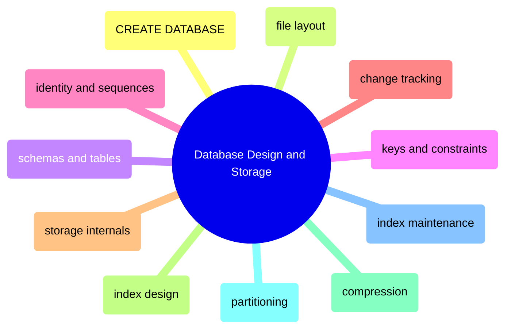

# Database Design and Storage

This domain owns the database objects themselves: how databases are created, how schemas and tables are shaped, how keys and constraints are chosen, how change history is captured, and how the physical storage layer is designed and maintained.

## Database Creation and Structural Defaults

> [!abstract]- [[database-creation-and-file-layout]]
>
> - [[database-creation-and-file-layout#CREATE DATABASE and File Layout|CREATE DATABASE and file layout]]
> - [[database-creation-and-file-layout#Database-Level Settings After Creation|Database-level settings after creation]]
> - [[database-creation-and-file-layout#Recovery Model Compatibility Level and Query Store|Recovery model, compatibility level, and Query Store]]
> - [[database-creation-and-file-layout#Production Database Baseline Example|Production database baseline example]]

> [!abstract]- [[sql-server-schema-layering]]
>
> - [[sql-server-schema-layering#Schema-per-Layer Strategy|Schema-per-layer strategy]]
> - [[sql-server-schema-layering#Control Meta and History Schemas|Control, meta, and history schemas]]
> - [[sql-server-schema-layering#Security and Ownership Boundaries|Security and ownership boundaries]]
> - [[sql-server-schema-layering#Consumer Contract Surfaces|Consumer contract surfaces]]

## Schemas, Tables, Keys, and Constraints

> [!abstract]- [[schemas-tables-and-constraints]]
>
> - [[schemas-tables-and-constraints#CREATE SCHEMA and Ownership Boundaries|CREATE SCHEMA and ownership boundaries]]
> - [[schemas-tables-and-constraints#CREATE TABLE Design Basics|CREATE TABLE design basics]]
> - [[schemas-tables-and-constraints#PRIMARY KEY UNIQUE CHECK and FOREIGN KEY Constraints|PRIMARY KEY, UNIQUE, CHECK, and FOREIGN KEY constraints]]
> - [[schemas-tables-and-constraints#Heap vs Clustered Table Decisions|Heap vs clustered table decisions]]

> [!abstract]- [[keys-defaults-identity-and-sequences]]
>
> - [[keys-defaults-identity-and-sequences#Natural Keys Surrogate Keys and Composite Keys|Natural keys, surrogate keys, and composite keys]]
> - [[keys-defaults-identity-and-sequences#IDENTITY Behavior and Retrieval Patterns|IDENTITY behavior and retrieval patterns]]
> - [[keys-defaults-identity-and-sequences#SEQUENCE Objects|SEQUENCE objects]]
> - [[keys-defaults-identity-and-sequences#Default Constraints and Generated Values|Default constraints and generated values]]

> [!abstract]- [[sql-server-change-tracking]]
>
> - [[sql-server-change-tracking#Manual SCD Type 2 and Effective Dating|Manual SCD Type 2 and effective dating]]
> - [[sql-server-change-tracking#Temporal Tables and History Retention|Temporal tables and history retention]]
> - [[sql-server-change-tracking#Change Tracking and Change Data Capture|Change Tracking and Change Data Capture]]
> - [[sql-server-change-tracking#rowversion as a Lightweight Change Token|rowversion as a lightweight change token]]

## Physical Storage, Indexes, and Compression

> [!abstract]- [[storage-internals]]
>
> - [[storage-internals#Database Files Pages and Extents|Database files, pages, and extents]]
> - [[storage-internals#Transaction Log and Write-Ahead Logging WAL|Transaction log and WAL]]
> - [[storage-internals#Buffer Pool Page Metadata and Row Layout|Buffer pool, page metadata, and row layout]]
> - [[storage-internals#Forwarded Rows Page Splits and VLFs|Forwarded rows, page splits, and VLFs]]

> [!abstract]- [[index-types-and-strategy]]
>
> - [[index-types-and-strategy#Choose The Right Index Family|Choose the right index family]]
> - [[index-types-and-strategy#Clustered Index Design|Clustered index design]]
> - [[index-types-and-strategy#Nonclustered Covering and Filtered Indexes|Nonclustered, covering, and filtered indexes]]
> - [[index-types-and-strategy#Missing Index Review and Design Caveats|Missing index review and design caveats]]

> [!abstract]- [[table-compression]]
>
> - [[table-compression#Row Compression vs Page Compression|Row compression vs page compression]]
> - [[table-compression#Compression Estimation and Candidate Selection|Compression estimation and candidate selection]]
> - [[table-compression#Applying Compression Safely|Applying compression safely]]
> - [[table-compression#Operational Tradeoffs|Operational tradeoffs]]

> [!abstract]- [[partitioning-strategies]]
>
> - [[partitioning-strategies#Partition Functions Schemes and Boundaries|Partition functions, schemes, and boundaries]]
> - [[partitioning-strategies#Partition Elimination and Query Shape|Partition elimination and query shape]]
> - [[partitioning-strategies#SWITCH and Sliding Window Operations|SWITCH and sliding-window operations]]
> - [[partitioning-strategies#Partition Alignment and Maintenance|Partition alignment and maintenance]]

## Maintenance and Lifecycle

> [!abstract]- [[index-maintenance]]
>
> - [[index-maintenance#Fragmentation Page Density and Candidate Selection|Fragmentation, page density, and candidate selection]]
> - [[index-maintenance#REORGANIZE and REBUILD Decisions|REORGANIZE and REBUILD decisions]]
> - [[index-maintenance#Statistics After Maintenance|Statistics after maintenance]]
> - [[index-maintenance#Usage Operational Stats and Missing-Index Review|Usage, operational stats, and missing-index review]]
