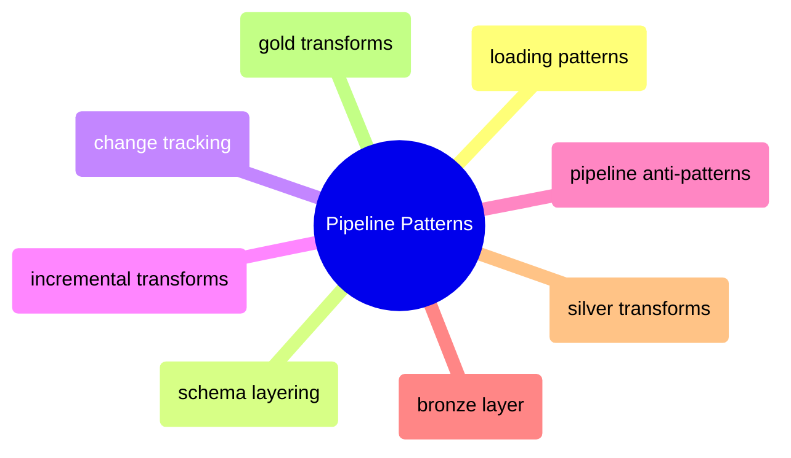

# Pipeline Patterns

Medallion pipeline implementation in SQL Server from loading strategies and schema layering through change tracking, incremental transforms, and the bronze-silver-gold layer implementations.

> [!abstract]- [[sql-server-loading-patterns]]
>
> - [[sql-server-loading-patterns#Loading Methods Comparison|Loading methods comparison]]
> - [[sql-server-loading-patterns#Truncate-and-Reload|Truncate and reload]]
> - [[sql-server-loading-patterns#Watermarks — The Foundation of Incremental Loading|Watermark fundamentals]]
> - [[sql-server-loading-patterns#Upsert (INSERT + UPDATE)|Upsert approaches]]
> - [[sql-server-loading-patterns#pyodbc fast_executemany Deep Dive|pyodbc fast_executemany]]
> - [[sql-server-loading-patterns#bcp Deep Dive|bcp bulk loading]]

> [!abstract]- [[sql-server-schema-layering]]
>
> - [[sql-server-schema-layering#Schema-per-Layer (Standard Approach)|Schema per layer]]
> - [[sql-server-schema-layering#Separate Databases per Layer|Separate databases per layer]]
> - [[sql-server-schema-layering#Naming Conventions|Naming conventions]]
> - [[sql-server-schema-layering#Cross-Schema Security|Cross-schema security]]
> - [[sql-server-schema-layering#Which Schema Strategy — Scenario-Based Decision|Schema strategy decision]]

> [!abstract]- [[sql-server-change-tracking]]
>
> - [[sql-server-change-tracking#Decision Matrix|Change tracking decision matrix]]
> - [[sql-server-change-tracking#Manual SCD Type 2|Manual SCD Type 2]]
> - [[sql-server-change-tracking#SQL Server Temporal Tables (SYSTEM_VERSIONING)|Temporal tables]]
> - [[sql-server-change-tracking#Change Data Capture (CDC)|Change Data Capture]]
> - [[sql-server-change-tracking#Change Tracking (CT)|Change Tracking]]

> [!abstract]- [[sql-server-incremental-transforms]]
>
> - [[sql-server-incremental-transforms#Watermark-Based Incremental Loading|Watermark-based loading]]
> - [[sql-server-incremental-transforms#Partition-Based Incremental Processing|Partition-based processing]]
> - [[sql-server-incremental-transforms#Window Function Transforms at Scale|Window function transforms]]
> - [[sql-server-incremental-transforms#Gap Detection and Forward-Fill|Gap detection and forward-fill]]
> - [[sql-server-incremental-transforms#Pre-Computed Aggregation Tables|Pre-computed aggregation]]
> - [[sql-server-incremental-transforms#Indexed Views vs Aggregation Tables|Indexed views vs aggregation tables]]

> [!abstract]- [[sql-server-pipeline-anti-patterns]]
>
> - [[sql-server-pipeline-anti-patterns#Loading Anti-Patterns|Loading anti-patterns]]
> - [[sql-server-pipeline-anti-patterns#Schema Anti-Patterns|Schema anti-patterns]]
> - [[sql-server-pipeline-anti-patterns#Query Anti-Patterns|Query anti-patterns]]
> - [[sql-server-pipeline-anti-patterns#Change Tracking Anti-Patterns|Change tracking anti-patterns]]
> - [[sql-server-pipeline-anti-patterns#Concurrency Anti-Patterns|Concurrency anti-patterns]]
> - [[sql-server-pipeline-anti-patterns#Performance Anti-Patterns|Performance anti-patterns]]

> [!abstract]- [[bronze-layer-loading]]
>
> - [[bronze-layer-loading#Database Setup & Connection|Database setup and connection]]
> - [[bronze-layer-loading#Bronze Table DDL|Bronze table DDL]]
> - [[bronze-layer-loading#Dynamic OHLCV Tables|Dynamic OHLCV tables]]
> - [[bronze-layer-loading#Loading Patterns (JSON → Bronze)|Loading patterns]]
> - [[bronze-layer-loading#Index Design (Bronze Layer)|Bronze index design]]

> [!abstract]- [[silver-transforms]]
>
> - [[silver-transforms#Silver DDL|Silver table DDL]]
> - [[silver-transforms#SCD Type 2 Transform — Index Dimensions|SCD Type 2 transform]]
> - [[silver-transforms#Upsert — Daily Signals|Daily signal upsert]]
> - [[silver-transforms#OHLCV Gap-Fill Transform|OHLCV gap-fill transform]]
> - [[silver-transforms#Key SQL Techniques Used in Silver Transforms|Key SQL techniques]]

> [!abstract]- [[gold-transforms]]
>
> - [[gold-transforms#Gold Table DDL|Gold table DDL]]
> - [[gold-transforms#Gold Analytics Logic|Analytics logic and z-scores]]
> - [[gold-transforms#Daily Scores Transform|Daily scores transform]]
> - [[gold-transforms#Index Performance Transform|Index performance transform]]
> - [[gold-transforms#Dashboard Consumption Queries|Dashboard consumption queries]]
> - [[gold-transforms#Gold Freshness Checks|Freshness checks]]
