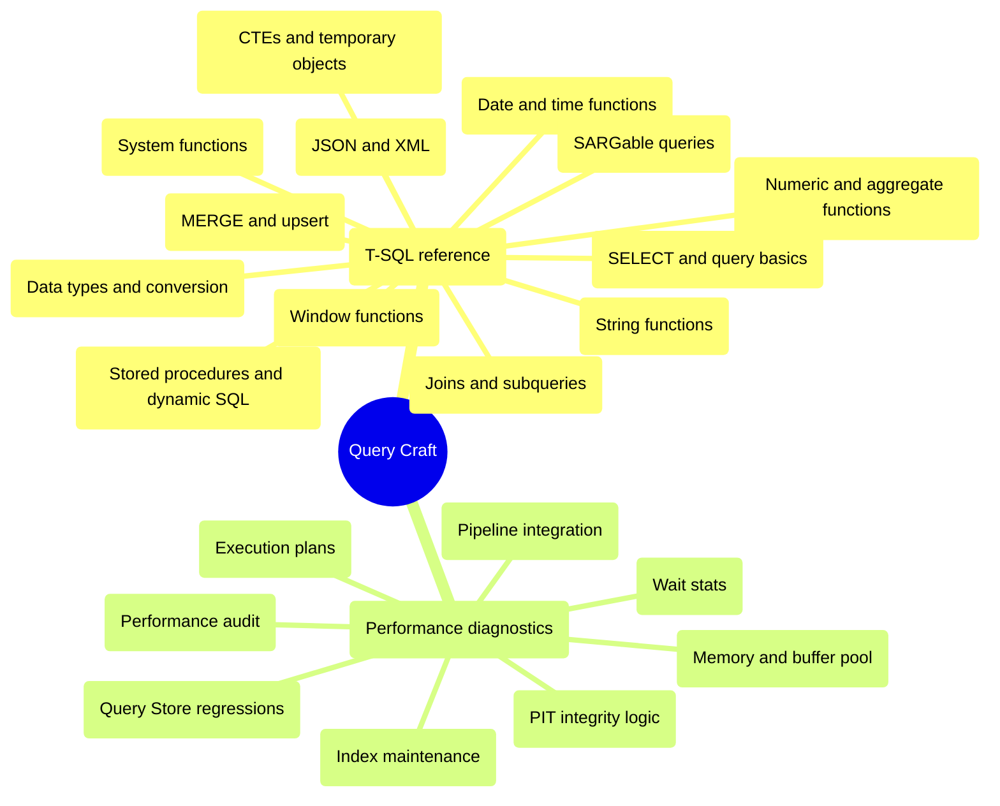

# Query Craft

This domain covers two adjacent but distinct layers:

- **T-SQL reference**: language elements, built-in functions, query-shaping, and statement-level safe patterns
- **performance diagnostics**: execution plans, Query Store, wait stats, memory, index maintenance, and workload analysis

## T-SQL Reference

> [!abstract]- [[select-and-query-basics]]
>
> - `SELECT`, `FROM`, `WHERE`, `ORDER BY`
> - `TOP`, `WITH TIES`, `OFFSET`, `FETCH`
> - `DISTINCT`, `GROUP BY`, `HAVING`
> - `CASE` and conditional projection

> [!abstract]- [[joins-subqueries-and-apply]]
>
> - `INNER JOIN`, `LEFT JOIN`, `FULL OUTER JOIN`
> - `EXISTS`, scalar subqueries, correlated subqueries
> - `CROSS APPLY`, `OUTER APPLY`
> - `UNION`, `UNION ALL`, `EXCEPT`, `INTERSECT`, `PIVOT`

> [!abstract]- [[common-table-expressions-and-temporary-objects]]
>
> - `WITH` common table expressions
> - recursive CTEs and `MAXRECURSION`
> - derived tables and `VALUES`
> - temp tables, table variables, and TVPs

> [!abstract]- [[window-functions]]
>
> - `OVER`, `PARTITION BY`, `ORDER BY`
> - `ROW_NUMBER`, `RANK`, `DENSE_RANK`, `NTILE`
> - `LAG`, `LEAD`, `FIRST_VALUE`, `LAST_VALUE`
> - running totals and moving averages

> [!abstract]- [[string-functions-and-pattern-matching]]
>
> - `CONCAT`, `STRING_AGG`, `STRING_SPLIT`
> - `LEFT`, `RIGHT`, `SUBSTRING`, `REPLACE`, `TRANSLATE`
> - `LIKE`, `PATINDEX`, `CHARINDEX`, `ESCAPE`
> - Unicode and collation-aware comparisons

> [!abstract]- [[data-types-conversion-and-null-handling]]
>
> - SQL Server data type families
> - `CAST`, `CONVERT`, `TRY_CONVERT`, `PARSE`
> - `ISNULL`, `COALESCE`, `NULLIF`
> - `CASE`, `IIF`, `CHOOSE`, type precedence

> [!abstract]- [[numeric-and-aggregate-functions]]
>
> - `COUNT`, `COUNT_BIG`, `SUM`, `AVG`, `MIN`, `MAX`
> - `ABS`, `CEILING`, `FLOOR`, `ROUND`
> - `POWER`, `SQRT`, `LOG`, `EXP`
> - ratios, percentages, and divide-by-zero safety

> [!abstract]- [[system-functions-and-session-metadata]]
>
> - `@@ROWCOUNT`, `@@TRANCOUNT`, `@@SPID`
> - `SCOPE_IDENTITY`, `IDENT_CURRENT`
> - `DB_NAME`, `OBJECT_ID`, metadata helpers
> - `SESSION_CONTEXT`, `APP_NAME`, `HOST_NAME`

> [!abstract]- [[stored-procedures-dynamic-sql-and-error-handling]]
>
> - variables and control-of-flow
> - stored procedures and parameters
> - `sp_executesql` and safe dynamic SQL
> - `TRY...CATCH`, `THROW`, transactions, `XACT_ABORT`

> [!abstract]- [[json-xml-and-semi-structured-data]]
>
> - `ISJSON`, `JSON_VALUE`, `JSON_QUERY`, `JSON_MODIFY`
> - `OPENJSON`
> - XML `nodes()`, `value()`, `query()`, `exist()`, `modify()`
> - `FOR JSON PATH`

> [!abstract]- [[date-and-time-functions]]
>
> - `DATE`, `TIME`, `DATETIME2`, `DATETIMEOFFSET`
> - `GETDATE`, `SYSDATETIME`, `SYSUTCDATETIME`
> - `DATEADD`, `DATEDIFF`, `EOMONTH`
> - `AT TIME ZONE`, ISO literals, DST-safe patterns

> [!abstract]- [[sargable-queries]]
>
> - SARGable predicate rules
> - date-range rewrites
> - prefix search rewrites
> - implicit conversion traps

> [!abstract]- [[merge-and-upsert]]
>
> - insert-if-not-exists and update-then-insert
> - `MERGE` clauses
> - `OUTPUT $action`
> - `HOLDLOCK` and deduplicated-source rules

## Performance Diagnostics

> [!abstract]- [[execution-plans]]
>
> - reading estimated and actual plans
> - plan cache and Query Store retrieval
> - operator analysis, CE, and parameter-sensitive behavior

> [!abstract]- [[query-store-regressions-and-plan-forcing]]
>
> - Query Store baseline
> - regression candidates
> - force-plan workflow
> - Query Store hints

> [!abstract]- [[wait-stats-analysis]]
>
> - top waits
> - wait categories
> - resource-consumer correlation
> - TempDB and log-related waits

> [!abstract]- [[memory-and-buffer-pool]]
>
> - memory baseline
> - buffer pool health
> - memory clerks
> - grants and plan cache pressure

> [!abstract]- [[index-maintenance]]
>
> - fragmentation and page density
> - reorganize and rebuild
> - stats refresh
> - index usage and missing-index review

> [!abstract]- [[performance-audit-playbook]]
>
> - baseline audit flow
> - expensive statements
> - index and log health
> - configuration review

> [!abstract]- [[pipeline-integration-and-devex]]
>
> - query identity and tagging
> - Query Store normalization
> - connection metadata
> - deployment-safe diagnostics

> [!abstract]- [[pit-integrity-logic]]
>
> - effective-dated joins
> - bi-temporal logic
> - reconciliation patterns
> - performance-sensitive PIT validation
