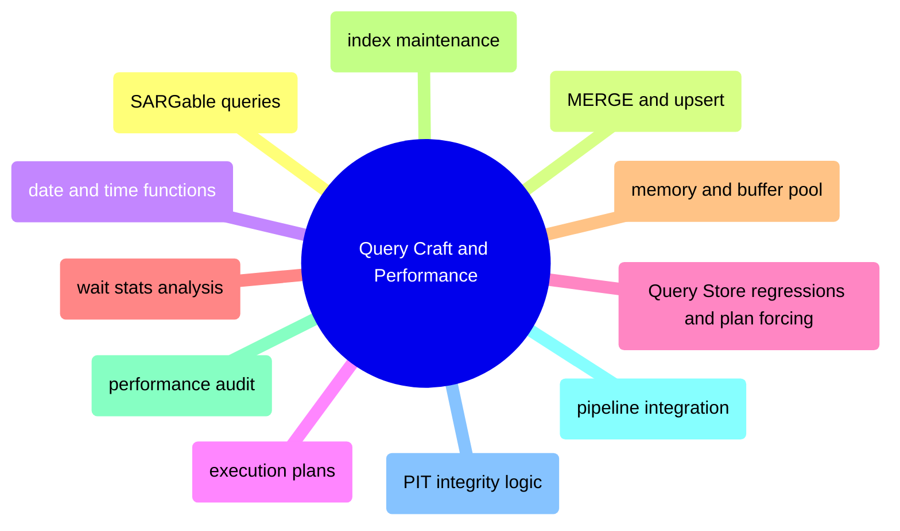

# Query Craft

T-SQL query writing and performance tuning from SARGability and execution plans through wait stats, memory diagnostics, and pipeline integration.

> [!abstract]- [[sargable-queries]]
>
> - [[sargable-queries#SARGable vs Non-SARGable — Functions on Columns|Functions on columns]]
> - [[sargable-queries#Detecting Non-SARGable Predicates in Execution Plans|Detecting in execution plans]]
> - [[sargable-queries#Implicit Conversions — The Silent Killer|Implicit conversions]]
> - [[sargable-queries#SARGability Quick Reference for the Pipeline|Pipeline quick reference]]

> [!abstract]- [[merge-and-upsert]]
>
> - [[merge-and-upsert#The Four Load Patterns at a Glance|Four load patterns]]
> - [[merge-and-upsert#Strategy 3: SCD Type 2 — Close Old, Insert New (Silver Dimensions)|SCD Type 2 pattern]]
> - [[merge-and-upsert#T-SQL MERGE Statement (Atomic Upsert)|T-SQL MERGE statement]]
> - [[merge-and-upsert#Transaction Management|Transaction management]]

> [!abstract]- [[date-and-time-functions]]
>
> - [[date-and-time-functions#ISO 8601 — The Only Date Format You Should Use|ISO 8601 formats]]
> - [[date-and-time-functions#Parsing and Formatting|Parsing and formatting]]
> - [[date-and-time-functions#Timezone Conversion with AT TIME ZONE|Timezone conversion]]
> - [[date-and-time-functions#Practical Pipeline Date Patterns|Pipeline date patterns]]
> - [[date-and-time-functions#DST Pitfalls That Break Pipelines|DST pitfalls]]

> [!abstract]- [[execution-plans]]
>
> - [[execution-plans#Reading the Visual Tree in SSMS|Reading the visual tree]]
> - [[execution-plans#Getting Plans from the Pipeline (Non-SSMS)|Getting plans from the pipeline]]
> - [[execution-plans#Cost Analysis — Finding the Most Expensive Operator|Cost analysis]]
> - [[execution-plans#Cardinality Estimation — Detecting Bad Row Count Guesses|Cardinality estimation]]
> - [[execution-plans#Parameter Sniffing|Parameter sniffing]]
> - [[execution-plans#Batch Mode Execution|Batch mode execution]]

> [!abstract]- [[query-store-regressions-and-plan-forcing]]
>
> - [[query-store-regressions-and-plan-forcing#Query Store Baseline|Query Store baseline]]
> - [[query-store-regressions-and-plan-forcing#Plan Regression Candidates|Regression candidates]]
> - [[query-store-regressions-and-plan-forcing#Controlled Force-Plan Workflow|Force-plan workflow]]
> - [[query-store-regressions-and-plan-forcing#Operational Guidance|Operational guidance]]

> [!abstract]- [[wait-stats-analysis]]
>
> - [[wait-stats-analysis#System Health Dashboard — First Check|System health dashboard]]
> - [[wait-stats-analysis#Top Waits Query — The Primary Diagnostic|Top waits query]]
> - [[wait-stats-analysis#Top Resource-Consuming Queries|Top resource consumers]]
> - [[wait-stats-analysis#TempDB Contention Detection|TempDB contention]]
> - [[wait-stats-analysis#Query Store — Regression Detection|Query Store regression detection]]

> [!abstract]- [[memory-and-buffer-pool]]
>
> - [[memory-and-buffer-pool#Reproducible Baseline|Reproducible baseline]]
> - [[memory-and-buffer-pool#Buffer Pool Health|Buffer pool health]]
> - [[memory-and-buffer-pool#Memory Consumers|Memory consumers]]
> - [[memory-and-buffer-pool#Memory Grants|Memory grants]]
> - [[memory-and-buffer-pool#Configuration and Intervention Commands|Configuration and intervention commands]]

> [!abstract]- [[index-maintenance]]
>
> - [[index-maintenance#Reproducible Baseline|Reproducible baseline]]
> - [[index-maintenance#Fragmentation Detection and Remediation|Fragmentation detection and remediation]]
> - [[index-maintenance#REORGANIZE — Online, Lightweight|REORGANIZE]]
> - [[index-maintenance#REBUILD — Heavier, More Thorough|REBUILD]]
> - [[index-maintenance#Statistics After Maintenance|Statistics after maintenance]]
> - [[index-maintenance#Index Discovery|Index discovery queries]]
> - [[index-maintenance#Production Maintenance Cadence|Production maintenance cadence]]

> [!abstract]- [[performance-audit-playbook]]
>
> - [[performance-audit-playbook#Phase 1 | Instance Baseline|Instance baseline]]
> - [[performance-audit-playbook#Phase 2 | Memory and Buffer Pool|Memory and buffer pool]]
> - [[performance-audit-playbook#Phase 3 | Wait Statistics|Wait statistics]]
> - [[performance-audit-playbook#Phase 5 | Expensive Cached Statements|Expensive cached statements]]
> - [[performance-audit-playbook#Phase 6 | Index Health|Index health]]
> - [[performance-audit-playbook#Phase 10 | Database Files and Log Reuse|Database files and log reuse]]

> [!abstract]- [[pipeline-integration-and-devex]]
>
> - [[pipeline-integration-and-devex#Query Identity and Correlation|Query identity and correlation]]
> - [[pipeline-integration-and-devex#Query Store Normalizes Text More Aggressively|Query Store normalization]]
> - [[pipeline-integration-and-devex#Connection Identity and Pooling|Connection identity and pooling]]
> - [[pipeline-integration-and-devex#Schema Change Workflow|Schema change workflow]]
> - [[pipeline-integration-and-devex#Monitoring Integration|Monitoring integration]]

> [!abstract]- [[pit-integrity-logic]]
>
> - [[pit-integrity-logic#Effective-Dated Constituent Lists|Effective-dated constituent lists]]
> - [[pit-integrity-logic#Bi-Temporal Model|Bi-temporal model]]
> - [[pit-integrity-logic#Weight Normalization|Weight normalization]]
> - [[pit-integrity-logic#Performance Tuning for Large-Scale Joins|Large-scale join tuning]]
> - [[pit-integrity-logic#Reconciliation Queries|Reconciliation queries]]
