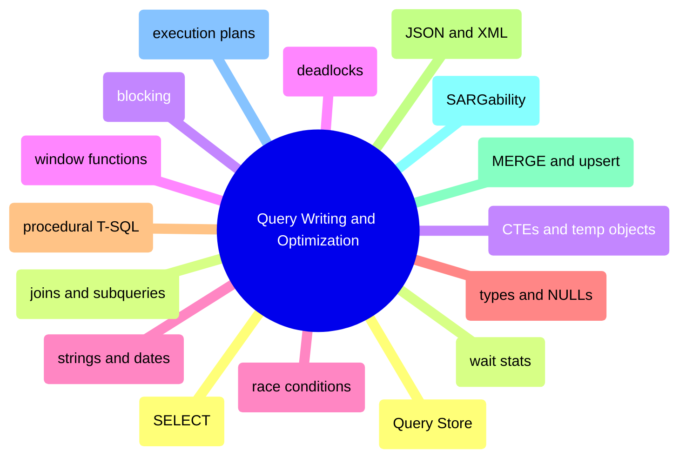

# Query Writing and Optimization

This domain owns how T-SQL is written and how workload behavior is optimized. It starts with language fundamentals, then moves into execution plans, Query Store, waits, blocking, deadlocks, and race conditions.

## SELECT, JOIN, and Result Shaping

> [!abstract]- [[01-select-and-query-basics]]
>
> - [[select-and-query-basics#SELECT FROM WHERE and ORDER BY|SELECT, FROM, WHERE, and ORDER BY]]
> - [[select-and-query-basics#TOP DISTINCT GROUP BY and HAVING|TOP, DISTINCT, GROUP BY, and HAVING]]
> - [[select-and-query-basics#CASE Expressions and Conditional Projection|CASE expressions and conditional projection]]
> - [[select-and-query-basics#Pagination with OFFSET FETCH|Pagination with OFFSET FETCH]]

> [!abstract]- [[03-joins-subqueries-and-apply]]
>
> - [[joins-subqueries-and-apply#JOIN Types and Join Semantics|JOIN types and join semantics]]
> - [[joins-subqueries-and-apply#EXISTS IN and Correlated Subqueries|EXISTS, IN, and correlated subqueries]]
> - [[joins-subqueries-and-apply#CROSS APPLY and OUTER APPLY|CROSS APPLY and OUTER APPLY]]
> - [[joins-subqueries-and-apply#UNION EXCEPT INTERSECT and PIVOT|UNION, EXCEPT, INTERSECT, and PIVOT]]

> [!abstract]- [[04-common-table-expressions-and-temporary-objects]]
>
> - [[common-table-expressions-and-temporary-objects#CTE Basics|CTE basics]]
> - [[common-table-expressions-and-temporary-objects#Recursive CTEs|Recursive CTEs]]
> - [[common-table-expressions-and-temporary-objects#Temp Tables Table Variables and TVPs|Temp tables, table variables, and TVPs]]
> - [[common-table-expressions-and-temporary-objects#Derived Tables VALUES and Intermediate Shapes|Derived tables, VALUES, and intermediate shapes]]

> [!abstract]- [[05-window-functions]]
>
> - [[window-functions#OVER PARTITION BY and ORDER BY|OVER, PARTITION BY, and ORDER BY]]
> - [[window-functions#ROW_NUMBER RANK DENSE_RANK and NTILE|ROW_NUMBER, RANK, DENSE_RANK, and NTILE]]
> - [[window-functions#LAG LEAD FIRST_VALUE and LAST_VALUE|LAG, LEAD, FIRST_VALUE, and LAST_VALUE]]
> - [[window-functions#Running Totals Moving Windows and Gaps|Running totals, moving windows, and gaps]]

## Functions, Data Types, and Procedural T-SQL

> [!abstract]- [[07-string-functions-and-pattern-matching]]
>
> - [[string-functions-and-pattern-matching#Concatenation Aggregation and Tokenization|Concatenation, aggregation, and tokenization]]
> - [[string-functions-and-pattern-matching#Substring Search and Pattern Matching|Substring search and pattern matching]]
> - [[string-functions-and-pattern-matching#LIKE PATINDEX CHARINDEX and ESCAPE|LIKE, PATINDEX, CHARINDEX, and ESCAPE]]
> - [[string-functions-and-pattern-matching#Collation Unicode and Comparison Behavior|Collation, Unicode, and comparison behavior]]

> [!abstract]- [[08-date-and-time-functions]]
>
> - [[date-and-time-functions#Core Date and Time Types|Core date and time types]]
> - [[date-and-time-functions#DATEADD DATEDIFF DATETRUNC and EOMONTH|DATEADD, DATEDIFF, DATETRUNC, and EOMONTH]]
> - [[date-and-time-functions#AT TIME ZONE and Time Zone Conversion|AT TIME ZONE and time-zone conversion]]
> - [[date-and-time-functions#Calendar Table and Reporting Patterns|Calendar table and reporting patterns]]

> [!abstract]- [[06-numeric-and-aggregate-functions]]
>
> - [[numeric-and-aggregate-functions#COUNT SUM AVG MIN and MAX|COUNT, SUM, AVG, MIN, and MAX]]
> - [[numeric-and-aggregate-functions#ROUND CEILING FLOOR and Precision Control|ROUND, CEILING, FLOOR, and precision control]]
> - [[numeric-and-aggregate-functions#Ratios Percentages and Divide-by-Zero Safety|Ratios, percentages, and divide-by-zero safety]]
> - [[numeric-and-aggregate-functions#Statistical and Analytical Aggregation Patterns|Statistical and analytical aggregation patterns]]

> [!abstract]- [[02-data-types-conversion-and-null-handling]]
>
> - [[data-types-conversion-and-null-handling#Type Families and Precedence|Type families and precedence]]
> - [[data-types-conversion-and-null-handling#CAST CONVERT TRY_CONVERT and PARSE|CAST, CONVERT, TRY_CONVERT, and PARSE]]
> - [[data-types-conversion-and-null-handling#ISNULL COALESCE NULLIF and CASE|ISNULL, COALESCE, NULLIF, and CASE]]
> - [[data-types-conversion-and-null-handling#Implicit Conversion Traps|Implicit conversion traps]]

> [!abstract]- [[14-system-functions-and-session-metadata]]
>
> - [[system-functions-and-session-metadata#@@ROWCOUNT @@TRANCOUNT and @@SPID|@@ROWCOUNT, @@TRANCOUNT, and @@SPID]]
> - [[system-functions-and-session-metadata#SCOPE_IDENTITY IDENT_CURRENT and Identity Metadata|SCOPE_IDENTITY, IDENT_CURRENT, and identity metadata]]
> - [[system-functions-and-session-metadata#DB_NAME OBJECT_ID and Metadata Helpers|DB_NAME, OBJECT_ID, and metadata helpers]]
> - [[system-functions-and-session-metadata#SESSION_CONTEXT APP_NAME and HOST_NAME|SESSION_CONTEXT, APP_NAME, and HOST_NAME]]

> [!abstract]- [[18-stored-procedures-dynamic-sql-and-error-handling]]
>
> - [[stored-procedures-dynamic-sql-and-error-handling#Variables Control-of-Flow and Batch Scope|Variables, control-of-flow, and batch scope]]
> - [[stored-procedures-dynamic-sql-and-error-handling#Stored Procedures Parameters and OUTPUT|Stored procedures, parameters, and OUTPUT]]
> - [[stored-procedures-dynamic-sql-and-error-handling#sp_executesql and Safe Dynamic SQL|sp_executesql and safe dynamic SQL]]
> - [[stored-procedures-dynamic-sql-and-error-handling#TRY CATCH THROW Transactions and XACT_ABORT|TRY...CATCH, THROW, transactions, and XACT_ABORT]]

> [!abstract]- [[09-json-xml-and-semi-structured-data]]
>
> - [[json-xml-and-semi-structured-data#JSON_VALUE JSON_QUERY JSON_MODIFY and OPENJSON|JSON_VALUE, JSON_QUERY, JSON_MODIFY, and OPENJSON]]
> - [[json-xml-and-semi-structured-data#FOR JSON PATH|FOR JSON PATH]]
> - [[json-xml-and-semi-structured-data#XML nodes value query exist and modify|XML nodes, value, query, exist, and modify]]
> - [[json-xml-and-semi-structured-data#Indexing and Filtering Semi-Structured Data|Indexing and filtering semi-structured data]]

> [!abstract]- [[10-merge-and-upsert]]
>
> - [[merge-and-upsert#Update-Then-Insert and Insert-If-Not-Exists Patterns|Update-then-insert and insert-if-not-exists patterns]]
> - [[merge-and-upsert#MERGE Syntax and Safety Rules|MERGE syntax and safety rules]]
> - [[merge-and-upsert#OUTPUT $action and Change Capture|OUTPUT $action and change capture]]
> - [[merge-and-upsert#Concurrency Guards for Upserts|Concurrency guards for upserts]]

## Query Optimization, Plans, and Workload Behavior

> [!abstract]- [[11-sargable-queries]]
>
> - [[sargable-queries#SARGability Fundamentals|SARGability fundamentals]]
> - [[sargable-queries#Function-on-Column Rewrites|Function-on-column rewrites]]
> - [[sargable-queries#Date Range and Prefix Search Rewrites|Date-range and prefix-search rewrites]]
> - [[sargable-queries#Implicit Conversion and Collation Pitfalls|Implicit conversion and collation pitfalls]]

> [!abstract]- [[12-execution-plans]]
>
> - [[execution-plans#Execution Plan Fundamentals|Execution plan fundamentals]]
> - [[execution-plans#How to Capture Plans|How to capture plans]]
> - [[execution-plans#Operator Analysis and Cost Interpretation|Operator analysis and cost interpretation]]
> - [[execution-plans#Cardinality Estimation Parameter Sensitivity and IQP|Cardinality estimation, parameter sensitivity, and IQP]]

> [!abstract]- [[19-query-store-regressions-and-plan-forcing]]
>
> - [[query-store-regressions-and-plan-forcing#Regression Detection Workflow|Regression detection workflow]]
> - [[query-store-regressions-and-plan-forcing#Baseline vs Recent Runtime Comparison|Baseline vs recent runtime comparison]]
> - [[query-store-regressions-and-plan-forcing#Plan Forcing|Plan forcing]]
> - [[query-store-regressions-and-plan-forcing#Query Store Hints and Rollback|Query Store hints and rollback]]

> [!abstract]- [[13-wait-stats-analysis]]
>
> - [[wait-stats-analysis#Wait Stats Baseline and Delta Capture|Wait stats baseline and delta capture]]
> - [[wait-stats-analysis#CPU I/O Lock TempDB and Log Wait Families|CPU, I/O, lock, TempDB, and log wait families]]
> - [[wait-stats-analysis#Correlating Waits with Memory Storage and Plans|Correlating waits with memory, storage, and plans]]
> - [[wait-stats-analysis#Operational Triage Heuristics|Operational triage heuristics]]

## Blocking, Deadlocks, and Race Conditions

> [!abstract]- [[15-blocking-and-locking]]
>
> - [[blocking-and-locking#Production Triage Sequence|Production triage sequence]]
> - [[blocking-and-locking#Lock Inventory and Waiting Tasks|Lock inventory and waiting tasks]]
> - [[blocking-and-locking#Blocking Chains and Head Blockers|Blocking chains and head blockers]]
> - [[blocking-and-locking#Isolation Levels and Row-Versioning|Isolation levels and row-versioning]]

> [!abstract]- [[16-deadlock-detection-and-prevention]]
>
> - [[deadlock-detection-and-prevention#Deadlock Capture and system_health|Deadlock capture and system_health]]
> - [[deadlock-detection-and-prevention#Deadlock Graph Interpretation|Deadlock graph interpretation]]
> - [[deadlock-detection-and-prevention#Prevention Patterns|Prevention patterns]]
> - [[deadlock-detection-and-prevention#Retry and Recovery|Retry and recovery]]

> [!abstract]- [[17-race-conditions]]
>
> - [[race-conditions#Lost Update Duplicate Insert and Dirty Read Patterns|Lost update, duplicate insert, and dirty read patterns]]
> - [[race-conditions#Reproducible Race Condition Labs|Reproducible race condition labs]]
> - [[race-conditions#Application and T-SQL Guardrails|Application and T-SQL guardrails]]
> - [[race-conditions#sp_getapplock Coordination Pattern|sp_getapplock coordination pattern]]
