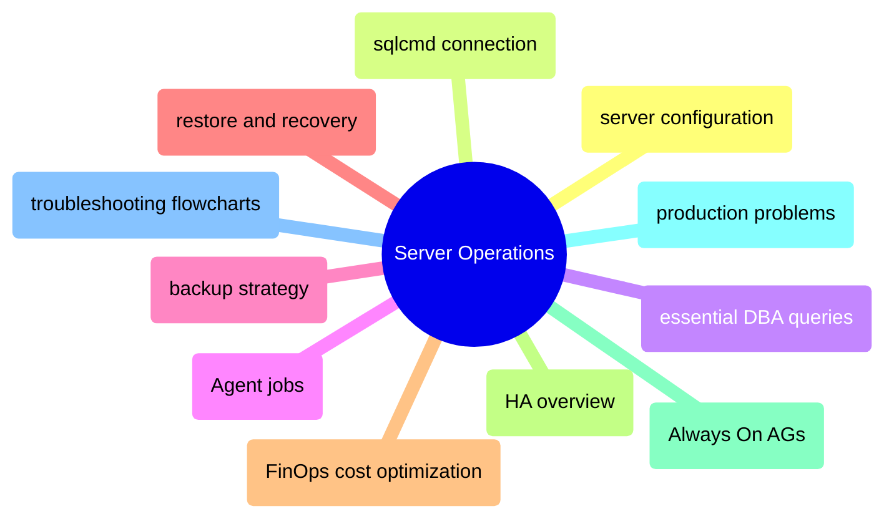

# Server Operations

SQL Server instance administration from configuration and connectivity through backup strategy, high availability, and production troubleshooting.

> [!abstract]- [[server-configuration]]
>
> - [[server-configuration#Tier 1: Non-Negotiable (Do Before Going to Production)|Non-negotiable production settings]]
> - [[server-configuration#Set Max Server Memory|Max server memory]]
> - [[server-configuration#Recovery Model|Recovery model selection]]
> - [[server-configuration#Enable Read Committed Snapshot Isolation (RCSI)|RCSI enablement]]
> - [[server-configuration#Linux OS Tuning (for SQL Server on Linux)|Linux OS tuning]]
> - [[server-configuration#TempDB Configuration|TempDB configuration]]

> [!abstract]- [sqlcmd-connection-and-usage](https://alp78.github.io/elysium/04-SQL-Server/Administration/sqlcmd-connection-and-usage)
>
> - [Connection flags and syntax](https://alp78.github.io/elysium/04-SQL-Server/Administration/sqlcmd-connection-and-usage#connecting--the-first-step-in-every-database-operation)
> - [IAP tunnel connections](https://alp78.github.io/elysium/04-SQL-Server/Administration/sqlcmd-connection-and-usage#connecting-through-iap-tunnel-gcp)
> - [Scripted connection testing](https://alp78.github.io/elysium/04-SQL-Server/Administration/sqlcmd-connection-and-usage#scripted-connection-testing)
> - [Dedicated admin connection](https://alp78.github.io/elysium/04-SQL-Server/Administration/sqlcmd-connection-and-usage#dedicated-admin-connection-dac)
> - [Scripting variables](https://alp78.github.io/elysium/04-SQL-Server/Administration/sqlcmd-connection-and-usage#scripting-variables)

> [!abstract]- [[essential-dba-queries]]
>
> - [[essential-dba-queries#Server Information|Server information]]
> - [[essential-dba-queries#Space and Size|Space and size analysis]]
> - [[essential-dba-queries#Active Connections|Active connections]]
> - [[essential-dba-queries#Currently Running Queries|Currently running queries]]
> - [[essential-dba-queries#The Diagnostic Five (Run These First)|The diagnostic five]]

> [!abstract]- [[sql-server-agent-jobs]]
>
> - [[sql-server-agent-jobs#SQL Server Agent on Linux — Enabling and Configuring|Enabling Agent on Linux]]
> - [[sql-server-agent-jobs#Agent Architecture|Agent architecture]]
> - [[sql-server-agent-jobs#Creating and Managing Jobs|Creating and managing jobs]]
> - [[sql-server-agent-jobs#Job Triggering in the GCP + SQL Server Stack|Job triggering comparison]]
> - [[sql-server-agent-jobs#Monitoring Agent Jobs from GCP|Monitoring from GCP]]

> [!abstract]- [[backup-types-and-strategy]]
>
> - [[backup-types-and-strategy#Backup Types|Backup types comparison]]
> - [[backup-types-and-strategy#T-SQL Backup Commands|T-SQL backup commands]]
> - [[backup-types-and-strategy#The 3-2-1 Backup Rule|The 3-2-1 rule]]
> - [[backup-types-and-strategy#Recovery Model Decision Matrix|Recovery model decision matrix]]
> - [[backup-types-and-strategy#Production HA Backup Schedule|Production backup schedule]]

> [!abstract]- [[restore-and-recovery]]
>
> - [[restore-and-recovery#Full Restore|Full restore]]
> - [[restore-and-recovery#Point-in-Time Recovery (PITR)|Point-in-time recovery]]
> - [[restore-and-recovery#Restore to a New Database (Side-by-Side)|Side-by-side restore]]
> - [[restore-and-recovery#Monitoring Recovery Progress After a Crash|Monitoring recovery progress]]

> [!abstract]- [[finops-cost-optimization]]
>
> - [[finops-cost-optimization#Persistent Disk Snapshot Schedules|Disk snapshot schedules]]
> - [[finops-cost-optimization#Committed Use Discounts (CUDs) vs Spot Instances|CUDs vs spot instances]]
> - [[finops-cost-optimization#Right-Sizing and Cost Monitoring|Right-sizing and cost monitoring]]
> - [[finops-cost-optimization#SQL Server Storage Optimization|Storage optimization]]

> [!abstract]- [[high-availability-overview]]
>
> - [[high-availability-overview#Why High Availability?|Why high availability]]
> - [[high-availability-overview#HA Options for SQL Server 2022 on Linux|HA options comparison]]
> - [[high-availability-overview#Setting Up Always On Availability Groups on Linux (GCP)|AG setup on Linux]]
> - [[high-availability-overview#Monitoring the AG — Essential DMVs|AG monitoring DMVs]]
> - [[high-availability-overview#Failover Operations|Failover operations]]
> - [[high-availability-overview#GCP-Specific HA Considerations|GCP-specific considerations]]

> [!abstract]- [[always-on-availability-groups]]
>
> - [[always-on-availability-groups#HA Options for SQL Server 2022 on Linux|HA options comparison]]
> - [[always-on-availability-groups#Setting Up Always On AGs on Linux (GCP)|Step-by-step AG setup]]
> - [[always-on-availability-groups#Monitoring the AG — Essential DMVs|Monitoring DMVs]]
> - [[always-on-availability-groups#Failover Operations|Failover operations]]
> - [[always-on-availability-groups#Troubleshooting|Troubleshooting five common issues]]

> [!abstract]- [[sql-server-problems]]
>
> - [[sql-server-problems#Transaction Log Full|Transaction log full]]
> - [[sql-server-problems#Data Disk Full|Data disk full]]
> - [[sql-server-problems#Parameter Sniffing|Parameter sniffing]]
> - [[sql-server-problems#Moderate — Operational Pain|Moderate operational pain]]
> - [[sql-server-problems#SQL Server on Linux Gotchas|Linux-specific gotchas]]

> [!abstract]- [[troubleshooting-flowcharts]]
>
> - [[troubleshooting-flowcharts#Flowchart 1: "Why Is It Slow?" — The Master Flowchart|Why is it slow]]
> - [[troubleshooting-flowcharts#Flowchart 2: "Pipeline Failed" — Data Pipeline Troubleshooting|Pipeline failure diagnosis]]
> - [[troubleshooting-flowcharts#Flowchart 3: "Should I Add an Index?" — Index Decision Tree|Index decision tree]]
> - [[troubleshooting-flowcharts#Flowchart 4: "Disk Space Emergency" — Storage Recovery|Disk space emergency]]

> [!abstract]- [[sqlcmd-connection-and-usage]]
>
> - [[sqlcmd-connection-and-usage#Connecting — The First Step in Every Database Operation|Connecting to SQL Server]]
> - [[sqlcmd-connection-and-usage#Connecting Through IAP Tunnel (GCP)|Connecting through IAP tunnel]]
> - [[sqlcmd-connection-and-usage#Automated Backup Script Using sqlcmd|Automated backup script]]
> - [[sqlcmd-connection-and-usage#Flag Quick Reference|Flag reference]]
