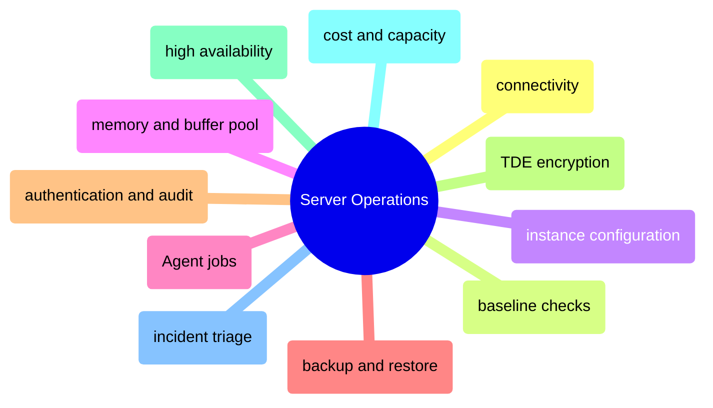

# Server Operations

This domain owns SQL Server as a running service: how to connect to it, baseline it, configure it, secure it, automate it, back it up, restore it, scale it, and troubleshoot it under production pressure.

## Connectivity, Baseline, and Configuration

> [!abstract]- [[sqlcmd-connection-and-usage]]
>
> - [[sqlcmd-connection-and-usage#Connection Targets and Authentication Modes|Connection targets and authentication modes]]
> - [[sqlcmd-connection-and-usage#Classic sqlcmd Syntax and Flags|Classic sqlcmd syntax and flags]]
> - [[sqlcmd-connection-and-usage#Dedicated Admin Connection DAC|Dedicated Admin Connection]]
> - [[sqlcmd-connection-and-usage#Script Files Variables and Output Modes|Script files, variables, and output modes]]

> [!abstract]- [[essential-dba-queries]]
>
> - [[essential-dba-queries#Server Identity and Uptime|Server identity and uptime]]
> - [[essential-dba-queries#Space Size and File Growth|Space, size, and file growth]]
> - [[essential-dba-queries#Current Sessions and Requests|Current sessions and requests]]
> - [[essential-dba-queries#The Diagnostic Five|The diagnostic five]]

> [!abstract]- [[server-configuration]]
>
> - [[server-configuration#Instance Baseline|Instance baseline]]
> - [[server-configuration#High-Impact Instance Settings|High-impact instance settings]]
> - [[server-configuration#Recommended Configuration Actions|Configuration actions]]
> - [[server-configuration#TempDB|TempDB]]
> - [[server-configuration#Linux Host Settings|Linux host settings]]

> [!abstract]- [[memory-and-buffer-pool]]
>
> - [[memory-and-buffer-pool#Configuration Baseline|Configuration baseline]]
> - [[memory-and-buffer-pool#Process Memory and OS Memory|Process memory and OS memory]]
> - [[memory-and-buffer-pool#Buffer Pool Health|Buffer pool health]]
> - [[memory-and-buffer-pool#Plan Cache and Ad Hoc Waste|Plan cache and ad hoc waste]]
> - [[memory-and-buffer-pool#Memory Grants|Memory grants]]

## Automation, Backup, and Recovery

> [!abstract]- [[sql-server-agent-jobs]]
>
> - [[sql-server-agent-jobs#Agent Service State and Enabling|Agent service state and enabling]]
> - [[sql-server-agent-jobs#Job Metadata and Job Steps|Job metadata and job steps]]
> - [[sql-server-agent-jobs#Schedules Operators and Notifications|Schedules, operators, and notifications]]
> - [[sql-server-agent-jobs#Run History and Failure Triage|Run history and failure triage]]

> [!abstract]- [[backup-types-and-strategy]]
>
> - [[backup-types-and-strategy#Backup Types and Recovery Objectives|Backup types and recovery objectives]]
> - [[backup-types-and-strategy#Backup Validation and Compression|Backup validation and compression]]
> - [[backup-types-and-strategy#Retention and Schedule Design|Retention and schedule design]]
> - [[backup-types-and-strategy#Production Strategy|Production strategy]]

> [!abstract]- [[restore-and-recovery]]
>
> - [[restore-and-recovery#Restore Validation and Metadata Checks|Restore validation and metadata checks]]
> - [[restore-and-recovery#Full Restore and Differential Restore|Full and differential restore]]
> - [[restore-and-recovery#Point-in-Time Recovery|Point-in-time recovery]]
> - [[restore-and-recovery#Side-by-Side Restore and Validation|Side-by-side restore and validation]]

## Security, Audit, and High Availability

> [!abstract]- [[sql-server-authentication]]
>
> - [[sql-server-authentication#Authentication Modes and Login Surface|Authentication modes and login surface]]
> - [[sql-server-authentication#Sysadmin Exposure and Least Privilege|Sysadmin exposure and least privilege]]
> - [[sql-server-authentication#TLS Encryption and Connection Security|TLS encryption and connection security]]
> - [[sql-server-authentication#Linux TLS Configuration|Linux TLS configuration]]

> [!abstract]- [[audit-logging]]
>
> - [[audit-logging#SQL Server Audit Components|SQL Server Audit components]]
> - [[audit-logging#Audit Specifications and Target Files|Audit specifications and target files]]
> - [[audit-logging#Querying and Summarising Audit Events|Querying and summarising audit events]]
> - [[audit-logging#Operational Audit Retention and Review|Operational audit retention and review]]

> [!abstract]- [[tde-encryption]]
>
> - [[tde-encryption#Encryption Hierarchy and Certificate Dependency|Encryption hierarchy and certificate dependency]]
> - [[tde-encryption#Enabling TDE|Enabling TDE]]
> - [[tde-encryption#Certificate Backup and Disaster Recovery|Certificate backup and disaster recovery]]
> - [[tde-encryption#Monitoring TDE State|Monitoring TDE state]]

> [!abstract]- [[high-availability-overview]]
>
> - [[high-availability-overview#Availability Goals and Failure Domains|Availability goals and failure domains]]
> - [[high-availability-overview#HA Options for SQL Server|HA options for SQL Server]]
> - [[high-availability-overview#Always On Availability Groups on Linux|Always On AGs on Linux]]
> - [[high-availability-overview#Monitoring and Failover|Monitoring and failover]]

> [!abstract]- [[always-on-availability-groups]]
>
> - [[always-on-availability-groups#Replica Topology and Endpoints|Replica topology and endpoints]]
> - [[always-on-availability-groups#Seeding Joining and Synchronization|Seeding, joining, and synchronization]]
> - [[always-on-availability-groups#Monitoring Health and Lag|Monitoring health and lag]]
> - [[always-on-availability-groups#Troubleshooting Replica Failures|Troubleshooting replica failures]]

## Capacity, Cost, and Incident Triage

> [!abstract]- [[finops-cost-optimization]]
>
> - [[finops-cost-optimization#Compute Sizing and Licensing Pressure|Compute sizing and licensing pressure]]
> - [[finops-cost-optimization#Storage and Backup Cost Drivers|Storage and backup cost drivers]]
> - [[finops-cost-optimization#Compression Retention and Snapshot Strategy|Compression, retention, and snapshot strategy]]
> - [[finops-cost-optimization#Ongoing Cost Review|Ongoing cost review]]

> [!abstract]- [[performance-audit-playbook]]
>
> - [[performance-audit-playbook#Audit Order of Operations|Audit order of operations]]
> - [[performance-audit-playbook#Configuration and Instance Baseline|Configuration and instance baseline]]
> - [[performance-audit-playbook#Workload and Expensive Statement Review|Workload and expensive statement review]]
> - [[performance-audit-playbook#Operational Risk Summary|Operational risk summary]]

> [!abstract]- [[troubleshooting-flowcharts]]
>
> - [[troubleshooting-flowcharts#Master Performance Diagnosis Flowchart|Master performance diagnosis flowchart]]
> - [[troubleshooting-flowcharts#Blocking Deadlock and Concurrency Flowcharts|Blocking, deadlock, and concurrency flowcharts]]
> - [[troubleshooting-flowcharts#Storage and Capacity Flowcharts|Storage and capacity flowcharts]]
> - [[troubleshooting-flowcharts#Pipeline Failure Flowcharts|Pipeline failure flowcharts]]

> [!abstract]- [[sql-server-problems]]
>
> - [[sql-server-problems#Critical Incidents|Critical incidents]]
> - [[sql-server-problems#Degraded Performance and Operational Pain|Degraded performance and operational pain]]
> - [[sql-server-problems#Linux-Specific Failure Patterns|Linux-specific failure patterns]]
> - [[sql-server-problems#Recovery and Escalation Patterns|Recovery and escalation patterns]]

