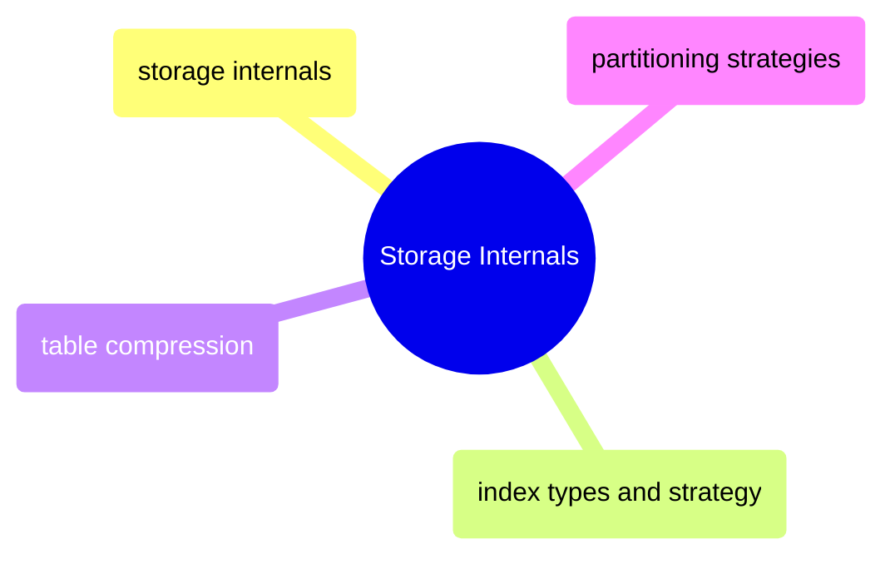

# Storage Internals

SQL Server physical storage from page anatomy and WAL mechanics through index structures, compression, and table partitioning.

> [!abstract]- [[storage-internals]]
>
> - [[storage-internals#Database File Architecture|Database file architecture]]
> - [[storage-internals#Page Anatomy|Page anatomy]]
> - [[storage-internals#The Transaction Log (.ldf) — How WAL Works|Transaction log and WAL]]
> - [[storage-internals#CRUD Operations — The Full Internal Flow|CRUD operations at page level]]
> - [[storage-internals#Index Structures at the Page Level|Index structures at page level]]
> - [[storage-internals#The Buffer Pool — SQL Server's Memory Manager|Buffer pool memory manager]]

> [!abstract]- [[index-types-and-strategy]]
>
> - [[index-types-and-strategy#Index Types — What They Are and When to Use Each|Index types overview]]
> - [[index-types-and-strategy#Exploring Existing Indexes|Exploring existing indexes]]
> - [[index-types-and-strategy#Index Usage Analysis — Are Your Indexes Being Used?|Index usage analysis]]
> - [[index-types-and-strategy#Creating Indexes — All Flavors|Creating indexes]]
> - [[index-types-and-strategy#Statistics — The Optimizer's Data Map|Statistics management]]
> - [[index-types-and-strategy#Pipeline Index Strategy|Pipeline index strategy]]

> [!abstract]- [[table-compression]]
>
> - [[table-compression#Compression Types|Row vs page compression]]
> - [[table-compression#When to Apply Page Compression|When to apply page compression]]
> - [[table-compression#Estimating Compression Savings Before Applying|Estimating savings]]
> - [[table-compression#Applying Compression|Applying compression]]
> - [[table-compression#Pipeline Compression Strategy|Pipeline compression strategy]]

> [!abstract]- [[partitioning-strategies]]
>
> - [[partitioning-strategies#How SQL Server Partitioning Works|How partitioning works]]
> - [[partitioning-strategies#SWITCH — Millisecond Partition Operations|Partition SWITCH operations]]
> - [[partitioning-strategies#Adding New Partitions — Sliding Window Pattern|Sliding window pattern]]
> - [[partitioning-strategies#Monitoring Partitioned Tables|Monitoring partitioned tables]]
> - [[partitioning-strategies#Partitioning Decision Tree|Partitioning decision tree]]
